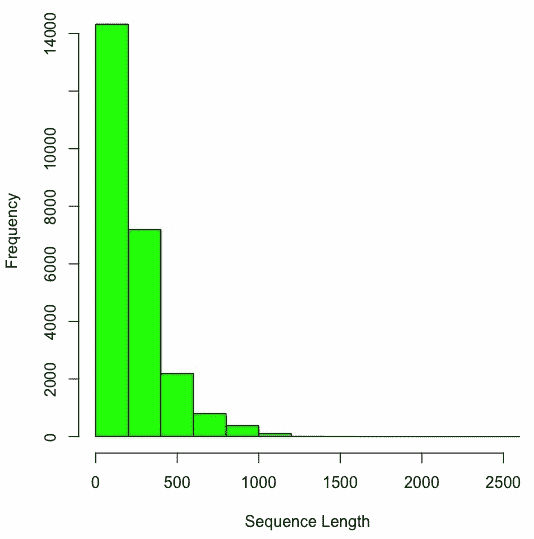
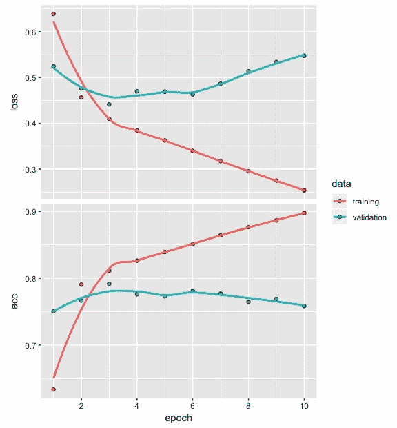
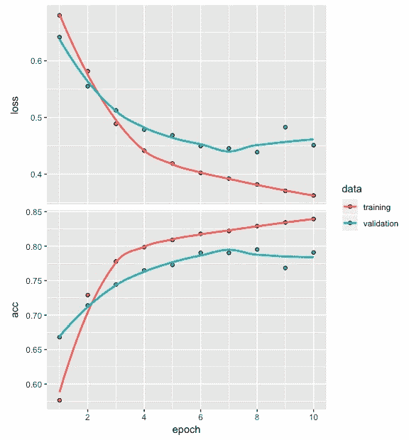
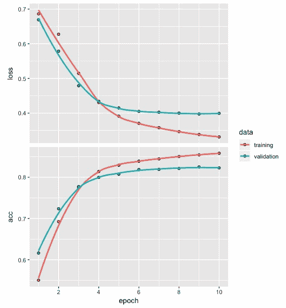

# 第十一章：深度网络用于文本分类

文本数据属于非结构化数据类别。在开发深度网络模型时，由于这类数据的独特性，我们需要完成额外的预处理步骤。在本章中，你将了解开发文本分类模型所需遵循的步骤，并通过易于理解的示例进行说明。文本数据，如客户评论、产品评价和电影评论，在商业中扮演着重要角色，而文本分类是一个重要的深度学习问题。

在本章中，我们将讨论两个文本数据集，学习在开发深度网络分类模型时如何准备文本数据，查看 IMDb 电影评论数据，开发深度网络架构，拟合并评估模型，并讨论一些技巧和最佳实践。具体来说，本章将涵盖以下主题：

+   文本数据集

+   为模型构建准备数据

+   开发深度神经网络

+   模型评估与预测

+   性能优化技巧和最佳实践

# 文本数据集

文本数据可以用于我们在实践中开发深度网络模型时。此类数据可以从几个公开可用的来源获取。在本节中，我们将介绍两个这样的资源：

+   UCI 机器学习数据集

+   Keras 中的文本数据

# UCI 机器学习数据集

以下链接提供了多种数据集，这些数据集包含从产品评论（来自[amazon.com](https://www.amazon.com/)）、电影评论（来自[IMDB.com](https://www.imdb.com/)）和餐厅评论（来自[yelp.com](https://www.yelp.com/)）中提取的文本句子：[`archive.ics.uci.edu/ml/datasets/Sentiment+Labelled+Sentences`](https://archive.ics.uci.edu/ml/datasets/Sentiment+Labelled+Sentences)。

每个句子根据评论中表达的情感进行标注。情感可以是正面的或负面的。每个网站上都有 500 个正面句子和 500 个负面句子，总共有 3000 个标注句子。这些数据可以用来开发一个情感分类深度网络模型，帮助我们自动将客户评论分类为正面或负面。

以下是一些来自 IMDb 的负面评论示例，这些评论被标注为 0：

+   一部非常非常非常慢节奏、没有方向的电影，讲述了一个迷茫的年轻人

+   不确定是谁更迷茫——是平淡无奇的角色还是观众，几乎一半的观众走了。

+   尝试用黑白色调和巧妙的镜头角度表现艺术性，但电影令人失望——随着演技糟糕、情节和台词几乎没有，变得更加荒谬。

+   几乎没有音乐或任何值得一提的内容

以下是一些来自 IMDb 的正面评论示例，这些评论被标注为 1：

+   电影中最精彩的场景是 Gerardo 试图找到一首一直在他脑海中回荡的歌曲。

+   今天看了这部电影，觉得是个不错的努力，给孩子们传递了很好的信息

+   喜欢吉米·巴菲特饰演科学老师的选角

+   那些小猫头鹰真是太可爱了

+   这部电影展示了佛罗里达州最美的一面，让它看起来非常吸引人

以下是一些亚马逊负面评论的例子，标签为 0：

+   所以，除非我购买转换器，否则我在美国根本无法插上它

+   45 分钟以上的对话必须插着充电器。重大问题！！

+   我必须晃动插头才能正确对接，以获得合适的音量

+   如果你有几十个或几百个联系人，想象一下逐个发送消息的乐趣

+   我建议大家千万不要上当！

以下是一些亚马逊正面评论的例子，标签为 1：

+   好的案例，极好的价值

+   非常适合下巴骨

+   麦克风很棒

+   如果你是 Razr 手机的用户...你一定得拥有这个！

+   而且音质非常好

# Keras 中的文本数据

Keras 中有两个文本数据集，如下所示：

+   **互联网电影数据库** (**IMDb**)，包含电影评论情感分类数据

+   路透新闻社的主题分类数据

IMDb 的评论数据包含了 25,000 条已经被分类为正面或负面情感的评论。该数据已经预处理，每条评论都被编码为整数序列。路透新闻社的主题分类数据包含了 11,228 条新闻，这些新闻也经过了预处理，每条新闻都被编码为整数序列。这些新闻被分类为 46 个类别或主题，例如牲畜、黄金、住房、就业等。

以下是来自 IMDb 数据中 Keras 的一条正面电影评论示例：

*“在这部简洁的改编作品中，奢华的制作价值和扎实的表演令人印象深刻，这部作品改编自简·奥斯汀的讽刺经典，讲述了 18 世纪英格兰阶级之间和内部的婚姻游戏。诺森和帕特罗饰演的朋友角色需要经历种种谎言，最终发现他们彼此相爱。幽默感是一种?美德，能够很好地解释那部经典老旧材料的魅力，虽然原作中的一些严苛部分被稍微调整过了。我喜欢电影的视觉效果和镜头设置，并且觉得它不像 80 年代和 90 年代的其他电影那样过于依赖大量的特写镜头，效果相当好。”*

以下是来自 IMDb 数据中 Keras 的一条负面电影评论示例：

*"我一生中最糟糕的错误 br br 我在 Target 买了这部电影，价格是 5 美元，因为我想着‘嘿，这是 Sandler 的片子，我可以获得一些廉价的笑料’，结果我错了，完全错了，电影放到一半，我的三个朋友都睡着了，而我还在痛苦中，最糟糕的情节，最糟糕的剧本，最糟糕的电影，我看过的最烂的电影，我差点想把头撞到墙上一个小时，然后停下来，你知道为什么吗？因为撞头的感觉太爽了，我把那部该死的电影丢进垃圾桶，看它烧掉，那感觉比我做过的任何事情都好，直到看完《美国精神病人》、《黑暗军团》和《杀死比尔》才算过得了这段噩梦，我恨你，Sandler，居然还做出这种决定，毁掉了我一天的生活。"*

# 为模型构建准备数据

为了准备数据进行模型构建，我们需要遵循以下步骤：

1.  标记化

1.  将文本转换为整数

1.  填充和截断

为了说明数据准备过程中涉及的步骤，我们将使用一个非常小的文本数据集，该数据集包含五条与 2017 年 9 月发布的苹果 iPhone X 相关的推文。我们将使用这个小数据集来了解数据准备过程中涉及的步骤，然后切换到更大的 IMDb 数据集，以构建深度网络分类模型。以下是我们将存储在`t1`到`t5`中的五条推文：

```py
t1 <- "I'm not a huge $AAPL fan but $160 stock closes down $0.60 for the day on huge volume isn't really bearish"
t2 <- "$AAPL $BAC not sure what more dissapointing: the new iphones or the presentation for the new iphones?"
t3 <- "IMO, $AAPL animated emojis will be the death of $SNAP."
t4 <- "$AAPL get on board. It's going to 175\. I think wall st will have issues as aapl pushes 1 trillion dollar valuation but 175 is in the cards"
t5 <- "In the AR vs. VR battle, $AAPL just put its chips behind AR in a big way."
```

前面的推文包含了大小写字母、标点符号、数字和特殊字符。

# 标记化

推文中的每个单词或数字都是一个标记，拆分推文为标记的过程叫做**标记化**。用于执行标记化的代码如下：

```py
tweets <- c(t1, t2, t3, t4, t5)
token <- text_tokenizer(num_words = 10) %>%    
         fit_text_tokenizer(tweets)
token$index_word[1:3]
$`1`
[1] "the"

$`2`
[1] "aapl"

$`3`
[1] "in"
```

从前面的代码中，我们可以看到以下内容：

+   我们首先将五条推文保存到`tweets`中。

+   对于标记化过程，我们指定了`num_words`为`10`，表示我们希望使用 10 个最频繁的词并忽略其他词。

+   尽管我们指定了要使用`10`个最频繁的词，但实际上将使用的整数的最大值是 10 - 1 = 9。

+   我们使用了`fit_text_tokenizer`，它自动将文本转换为小写并去除推文中的标点符号。

+   我们观察到，这五条推文中最频繁出现的前三个词是`the`、`aapl`和`in`。

请注意，频率较高的词语可能对文本分类有用，也可能没有用。

# 将文本转换为整数序列

以下代码用于将文本转换为整数序列。也提供了输出结果：

```py
seq <- texts_to_sequences(token, tweets)
seq
[[1]]
[1] 4 5 6 2 7 8 1 9 6

[[2]]
[1] 2 4 1 1 8 1

[[3]]
[1] 2 1

[[4]]
[1] 2 9 2 7 3 1

[[5]]
[1] 3 1 2 3 5

```

从前面的代码中，我们可以看到以下内容：

+   我们使用`texts_to_sequences`将推文转换为整数序列。

+   由于我们选择了将最频繁的词作为标记数量为`10`，因此每个整数序列中的整数的最大值为 9。

+   对于每条推文，序列中的整数数量少于词语的数量，因为只使用了最频繁的词。

+   整数序列的长度不同，范围从 2 到 9 不等。

+   为了开发分类模型，所有序列需要具有相同的长度。这是通过执行填充或截断来实现的。

# 填充和截断

使所有整数序列相等的代码如下：

```py
pad_seq <- pad_sequences(seq, maxlen = 5)
pad_seq
 [,1] [,2] [,3] [,4] [,5]
[1,]    7    8    1    9    6
[2,]    4    1    1    8    1
[3,]    0    0    0    2    1
[4,]    9    2    7    3    1
[5,]    3    1    2    3    5
```

从前面的代码中，我们可以看到以下几点：

+   我们使用了`pad_sequences`，使所有整数序列的长度一致。

+   当我们将所有序列的最大长度（使用`maxlen`）设置为 5 时，长度超过 5 的序列将被截断，长度不足 5 的序列将会填充零。

+   请注意，这里的填充默认设置为“pre”。这意味着当序列长度超过 5 时，截断将作用于序列的开头部分。我们可以从前面的输出中看到这一点，序列的前 4、5、6 和 2 被去除。

+   同样，对于第三个序列，它的长度为 2，已在序列的开头添加了三个零。

可能会有些情况，你希望在整数序列的末尾截断或添加零。实现这一点的代码如下：

```py
pad_seq <- pad_sequences(seq, maxlen = 5, padding = 'post')
pad_seq 
 [,1] [,2] [,3] [,4] [,5]
[1,]    7    8    1    9    6
[2,]    4    1    1    8    1
[3,]    2    1    0    0    0
[4,]    9    2    7    3    1
[5,]    3    1    2    3    5
```

在前面的代码中，我们将填充方式指定为`post`。这种填充方式的影响可以在输出中看到，序列 3 的末尾添加了零，长度不足 5。

# 开发推文情感分类模型

为了开发一个推文情感分类模型，我们需要为每条推文提供标签。然而，获取准确反映推文情感的标签是具有挑战性的。让我们看一下现有的情感分类词典，并探讨为什么很难获得合适的标签。仅凭五条推文，是无法开发出一个情感分类模型的。然而，这里的重点是观察为每条推文得出合适标签的过程。这将帮助我们理解获取准确标签所面临的挑战。为了自动提取每条推文的情感分数，我们将使用`syuzhet`包。同时，我们还将使用一些常用的情感词典。**国家研究委员会**（**NRC**）词典帮助根据特定单词捕捉不同的情感。我们将使用以下代码来获取这五条推文的情感分数：

```py
library(syuzhet) 
get_nrc_sentiment(tweets) 
  anger anticipation disgust fear joy sadness surprise trust negative positive
1     1            0       0    1   0       0        0     0        0        0
2     0            0       0    0   0       0        0     0        0        0
3     1            1       1    1   1       1        1     0        1        1
4     0            1       0    0   0       0        0     0        0        0
5     1            0       0    0   0       0        0     0        1        0
```

第一条推文对于愤怒和恐惧的评分都是 1。尽管其中包含单词`'bearish'`，但如果我们阅读这条推文，会发现它实际上是积极的。

让我们看一下以下代码，其中包含单词`'bearish'`、`'death'`和`'animated'`的情感分数：

```py
get_nrc_sentiment('bearish') 
  anger anticipation disgust fear joy sadness surprise trust negative positive
1     1            0       0    1   0       0        0     0        0        0

get_nrc_sentiment('death') 
  anger anticipation disgust fear joy sadness surprise trust negative positive
1     1            1       1    1   0       1        1     0        1        0

get_nrc_sentiment('animated') 
  anger anticipation disgust fear joy sadness surprise trust negative positive
1     0            0       0    0   1       0        0     0        0        1
```

从前面的代码中，我们可以得出以下结论：

+   第一条推文的整体分数基于单词的斜体形式，除此之外没有其他因素。

+   第三条推文在每个类别的评分中，除了信任外，其他的评分都是 1。

+   从阅读这条推文，我们很明显可以看出，写这条推文的人实际上认为动画表情符号对苹果是正面的，对 Snapchat 则是负面的。

+   情感分数基于这条推文中的两个词：death 和 animated。它们未能捕捉到第三条推文中表达的真正情感，这条推文对苹果非常积极。

当我们手动为每条推文标注负面情感（由 0 表示）和正面情感（由 1 表示）时，我们很可能得到 1、0、1、1 和 1 作为我们的分数。让我们使用以下代码，通过使用`syuzhet`、`bing`和`afinn`词典来获得这些情感分数：

```py
get_sentiment(tweets, method="syuzhet")
[1]  0.00  0.80 -0.35  0.00 -0.25

get_sentiment(tweets, method="bing")
[1] -1  0 -1 -1  0

get_sentiment(tweets, method="afinn")
[1]  4  0 -2  0  0
```

从`syuzhet`、`bing`和`afinn`词典的结果来看，我们可以观察到以下几点：

+   结果与推文中包含的实际情感有显著差异。因此，尝试自动标注推文并分配合适的情感分数是困难的。

+   我们看到自动标注文本序列是一个具有挑战性的问题。然而，一个解决方案是手动标注大量文本序列，比如推文，然后使用这些标注数据来开发情感分类模型。

+   此外，值得注意的是，情感分类模型只对用于开发该模型的特定类型的文本数据有帮助。

+   不可能为不同的文本情感分类应用使用相同的模型。

# 开发深度神经网络

虽然我们不会仅基于五条推文开发分类模型，但我们来看一下模型架构的代码：

```py
model <- keras_model_sequential()
model %>% layer_embedding(input_dim = 10, 
                          output_dim = 8, 
                          input_length = 5) 
summary(model)

OUTPUT
__________________________________________________________________________________
Layer (type)                        Output Shape                     Param # 
==================================================================================
embedding_1 (Embedding)             (None, 5, 8)                     80 
==================================================================================
Total params: 80
Trainable params: 80
Non-trainable params: 0
________________________________________________________________________________

print(model$get_weights(), digits = 2)
[[1]]
 [,1]    [,2]    [,3]   [,4]    [,5]    [,6]    [,7]    [,8]
 [1,]  0.0055 -0.0364 -0.0475  0.049 -0.0139 -0.0114 -0.0452 -0.0298
 [2,]  0.0398 -0.0143 -0.0406  0.023 -0.0496 -0.0124  0.0087 -0.0104
 [3,]  0.0370 -0.0321 -0.0491 -0.021 -0.0214  0.0391  0.0428 -0.0398
 [4,] -0.0257  0.0294  0.0433  0.048  0.0259 -0.0323 -0.0308  0.0224
 [5,] -0.0079 -0.0255  0.0164  0.023 -0.0486  0.0273  0.0245 -0.0020
 [6,]  0.0372  0.0464  0.0454 -0.020  0.0086 -0.0375 -0.0188  0.0395
 [7,]  0.0293  0.0305  0.0130  0.037 -0.0324 -0.0069 -0.0248  0.0178
 [8,] -0.0116 -0.0087 -0.0344  0.027  0.0132  0.0430 -0.0196 -0.0356
 [9,]  0.0314 -0.0315  0.0074 -0.044 -0.0198 -0.0135 -0.0353  0.0081
[10,]  0.0426  0.0199 -0.0306 -0.049  0.0259 -0.0341 -0.0155  0.0147

```

从前面的代码，我们可以观察到以下几点：

+   我们使用`keras_model_sequential()`初始化了模型。

+   我们将输入维度指定为 10，这是最常见的词汇数。

+   输出维度为 8，这导致参数数量为 10 x 8 = 80。

+   输入长度是整数序列的长度。

+   我们可以使用`model$get_weights()`获取这 80 个参数的权重。

请注意，这些权重将在每次初始化模型时发生变化。

# 获取 IMDb 电影评论数据

现在，我们将使用 IMDb 电影评论数据，其中每条评论的情感已经被标注为正面或负面。以下是从 Keras 访问 IMDb 电影评论数据的代码：

```py
imdb <- dataset_imdb(num_words = 500)  
c(c(train_x, train_y), c(test_x, test_y)) %<-% imdb
z <- NULL
for (i in 1:25000) {z[i] <- print(length(train_x[[i]]))}
summary(z)
   Min. 1st Qu.  Median    Mean 3rd Qu.    Max. 
   11.0   130.0   178.0   238.7   291.0  2494.0 
```

从前面的代码，我们可以观察到以下几点：

+   我们使用`train_x`和`train_y`来存储按整数序列和标签表示的正面或负面情感的数据。

+   我们对测试数据也使用了类似的约定。

+   训练数据和测试数据各自包含 25,000 条评论。

+   序列长度的总结显示，基于最常见词汇的电影评论最小长度为 11，最大序列长度为`2494`。

+   中位数序列长度为`178`。

+   中位数值小于均值，这表明该数据将呈现右偏，并且右侧尾部较长。

训练数据的序列长度的直方图可以如下绘制：



前面的整数序列长度的直方图显示了右偏模式。大多数序列的整数数量少于 500。

接下来，我们将使用以下代码使整数序列的长度相等：

```py
train_x <- pad_sequences(train_x, maxlen = 100)
test_x <- pad_sequences(test_x, maxlen = 100)
```

从前面的代码中，我们可以观察到以下内容：

+   我们使用了`maxlen`为 100 来标准化每个序列的长度为 100 个整数。

+   长度超过 100 的序列将会截断或移除任何多余的整数，长度小于 100 的序列将添加零以人为地增加序列的长度，直到达到 100。我们对训练集和测试集的序列都做这样处理。

现在，我们准备好构建分类模型了。

# 构建分类模型

对于模型架构和模型摘要，我们将使用以下代码：

```py
model <- keras_model_sequential()
model %>% layer_embedding(input_dim = 500, 
                          output_dim = 16, 
                          input_length = 100) %>%
         layer_flatten() %>% 
         layer_dense(units = 16, activation = 'relu') %>%
         layer_dense(units = 1, activation = "sigmoid")
summary(model)

OUTPUT
___________________________________________________________________
Layer (type)                  Output Shape              Param # 
===================================================================
embedding_12 (Embedding)      (None, 100, 16)           8000 
___________________________________________________________________
flatten_3 (Flatten)           (None, 1600)              0 
___________________________________________________________________
dense_6 (Dense)               (None, 16)                25616 
___________________________________________________________________
dense_7 (Dense)               (None, 1)                 17 
===================================================================
Total params: 33,633
Trainable params: 33,633
Non-trainable params: 0
___________________________________________________________________
```

从前面的代码中，我们可以观察到以下内容：

+   在这里，我们在`layer_embedding()`之后添加了`layer_flatten()`。

+   接下来是一个包含 16 个节点的全连接层，并使用`relu`激活函数。

+   模型的摘要显示，总共有`33,633`个参数。

现在，我们可以编译模型。

# 编译模型

我们需要使用以下代码来编译模型：

```py
model %>% compile(optimizer = "rmsprop",
          loss = "binary_crossentropy",
          metrics = c("acc"))
```

从前面的代码中，我们可以观察到以下内容：

+   我们已经使用了`rmsprop`优化器来编译模型。

+   对于损失，我们使用了`binary_crossentropy`，因为响应有两个值，即正面或负面。评估指标将使用准确度。

现在，让我们开始拟合模型。

# 拟合模型

我们需要使用以下代码来拟合模型：

```py
model_1 <- model %>% fit(train_x, train_y,
                         epochs = 10,
                         batch_size = 128,
                         validation_split = 0.2)
plot(model_1)
```

如前面的代码所示，我们使用`train_x`和`train_y`来拟合模型，并使用`10`个 epoch 和批量大小为`128`。我们使用 20%的训练数据来评估模型的性能，包括损失值和准确度。拟合模型后，我们得到如下所示的损失和准确度图：



从前面的图表中，我们可以观察到以下内容：

+   损失和准确度图显示，在大约四个 epoch 之后，训练数据和验证数据之间出现了发散。

+   我们观察到训练数据和验证数据在损失和准确度值上出现了发散。

+   我们不会使用这个模型，因为有明确的证据表明存在过拟合问题。

为了克服过拟合问题，我们需要修改前面的代码，使其如下所示：

```py
model <- keras_model_sequential()
model %>% layer_embedding(input_dim = 500, 
                          output_dim = 16, 
                          input_length = 100) %>%
         layer_flatten() %>% 
         layer_dense(units = 16, activation = 'relu') %>%
         layer_dense(units = 1, activation = "sigmoid")
model %>% compile(optimizer = "rmsprop",
          loss = "binary_crossentropy",
          metrics = c("acc"))
model_2 <- model %>% fit(train_x, train_y,
                         epochs = 10,
                         batch_size = 512,
                         validation_split = 0.2)
plot(model_2)
```

看看前面的代码，我们可以观察到以下内容：

+   我们正在重新运行模型并只做了一个改变：即我们将批量大小增加到 512。

+   我们保持其他设置不变，然后使用训练数据拟合模型。

在拟合模型后，存储在`model_2`中的损失和准确度值被绘制出来，如下图所示：



从前面的图表中，我们可以观察到以下几点：

+   这一次，损失和准确度值显示出更好的结果。

+   训练和验证的曲线在损失和准确度上更接近彼此。

+   此外，基于验证数据的损失和准确度值并未出现我们在先前模型中观察到的严重恶化，后者的最后三个周期的值是平坦的。

+   我们通过对代码进行一些小的修改，克服了过拟合的问题。

我们将使用这个模型进行评估和预测。

# 模型评估与预测

现在，我们将使用训练数据和测试数据来评估模型，获取损失、准确度和混淆矩阵。我们的目标是获得一个能够将电影评论中的情感分类为正面或负面的模型。

# 使用训练数据进行评估

获取训练数据的损失和准确度值的代码如下：

```py
model %>% evaluate(train_x, train_y)
$loss
[1] 0.3745659
$acc
[1] 0.83428
```

如我们所见，对于训练数据，损失和准确度分别为`0.375`和`0.834`。为了更深入地了解模型的情感分类性能，我们需要构建一个混淆矩阵。为此，请使用以下代码：

```py
pred <- model %>%   predict_classes(train_x)
table(Predicted=pred, Actual=imdb$train$y)
         Actual
Predicted     0     1
        0 11128  2771
        1  1372  9729
```

在前面的代码中，我们正在预测训练数据的类别，并将结果与电影评论的实际情感类别进行比较。这通过混淆矩阵进行了总结。我们可以从混淆矩阵中做出以下观察：

+   模型正确预测了 11,128 条电影评论中的负面情感。

+   模型正确预测了 9,729 条电影评论中的正面情感。

+   将正面评论误分类为负面评论的数量较高（2,771），而将具有负面情感的电影评论误分类为正面评论的数量较少（1,372）。

接下来，我们将对测试数据重复这一过程。

# 使用测试数据进行评估

获取测试数据的损失和准确度值的代码如下：

```py
model %>% evaluate(test_x, test_y)
$loss
[1] 0.4431483
$acc
[1] 0.79356
```

如我们所见，在测试数据方面，损失和准确度分别为`0.443`和`0.794`。这些结果略低于训练数据获得的结果。我们可以使用模型对`test`数据进行类别预测，并将其与实际的电影评论类别进行比较。这可以总结为一个混淆矩阵，如下所示：

```py
pred1 <- model %>%   predict_classes(test_x)
table(Predicted=pred1, Actual=imdb$test$y)
         Actual
Predicted     0     1
        0 10586  3247
        1  1914  9253
```

从前面的混淆矩阵中，我们可以观察到以下几点：

+   总体而言，该模型在正确预测负面电影评论（10,586 条）方面似乎比预测正面电影评论（9,253 条）更为准确。

+   这种模式与使用训练数据得到的结果一致。

+   此外，尽管测试数据的 79% 准确率已经不错，但仍有改进模型情感分类性能的空间。

在接下来的部分，我们将探讨性能优化的建议和最佳实践。

# 性能优化的建议和最佳实践

现在我们已经获得了测试数据的电影评论分类准确率，即 79%，我们可以继续努力提高这一准确率。达到这样的改进可能涉及实验模型架构中的参数、编译模型时使用的参数和/或拟合模型时使用的设置。在本节中，我们将通过改变单词序列的最大长度并同时使用与前一模型不同的优化器来进行实验。

# 实验最大序列长度和优化器

让我们从创建代表电影评论和它们标签的整数序列的`train`和`test`数据开始，使用以下代码：

```py
c(c(train_x, train_y), c(test_x, test_y)) %<-% imdb
z <- NULL
for (i in 1:25000) {z[i] <- print(length(train_x[[i]]))}
summary(z)
   Min. 1st Qu.  Median    Mean 3rd Qu.    Max. 
   11.0   130.0   178.0   238.7   291.0  2494.0 
```

在上述代码中，我们正在存储基于训练数据的序列长度在`z`中。通过这样做，我们可以获得`z`的汇总信息。从这里，我们可以获得数值汇总值，如最小值、第一四分位数、中位数、平均数、第三四分位数和最大值。单词序列的中位数值为 178。在前几节中，我们在填充序列时使用了最大长度为 100，以便使它们的长度相等。在本实验中，我们将其增加到 200，以便得到一个接近中位数值的数字，如以下代码所示：

```py
imdb <;- dataset_imdb(num_words = 500)  
c(c(train_x, train_y), c(test_x, test_y)) %<-% imdb
train_x <- pad_sequences(train_x, maxlen = 200) 
test_x <- pad_sequences(test_x, maxlen = 200)
model <- keras_model_sequential()
model %>% layer_embedding(input_dim = 500, 
                          output_dim = 16, 
                          input_length = 200) %>%
         layer_flatten() %>% 
         layer_dense(units = 16, activation = 'relu') %>%
         layer_dense(units = 1, activation = "sigmoid")
model %>% compile(optimizer = "adamax",  
                  loss = "binary_crossentropy",
                  metrics = c("acc"))
model_3 <- model %>% fit(train_x, train_y,
                         epochs = 10,
                         batch_size = 512,
                         validation_split = 0.2)
plot(model_3)
```

我们将进行的另一个更改是在编译模型时使用`adamax`优化器。请注意，这是流行的`adam`优化器的变体。我们保持其他所有内容不变。训练模型后，我们绘制了结果损失和准确率的图表，如下图所示：



从前述损失和准确率的图表中，我们可以观察到以下情况：

+   训练和验证数据的损失和准确率值表明大约在四个时期内有快速改进。

+   经过四个时期，这些改进在训练数据上放缓了。

+   对于验证数据，损失和准确率值在最后几个时期保持不变。

+   该图表未显示任何有关过度拟合的问题。

接下来，我们需要使用以下代码基于测试数据计算损失和准确率：

```py
model %>% evaluate(test_x, test_y)
$loss
[1] 0.3906249
$acc
[1] 0.82468
```

查看上述代码，我们可以观察到以下情况：

+   基于测试数据，模型的损失和准确率分别为`0.391`和`0.825`。

+   这两个数字都显示了与我们在前一节中获得的性能相比的改进。

要进一步研究模型的情感分类性能，我们可以使用以下代码：

```py
pred1 <- model %>%   predict_classes(test_x)
table(Predicted=pred1, Actual=imdb$test$y)
         Actual
Predicted     0     1
        0  9970  1853
        1  2530 10647
```

根据基于测试数据电影评论的混淆矩阵，我们可以观察到以下情况：

+   现在，负面（9,970 条）和正面电影评论（10,647 条）的正确分类结果更为接近。

+   正确分类正面电影评论的效果略好于负面评论。

+   该模型将负面电影评论误分类为正面评论的比例略高（2,530 条），相比之下，正面评论被误分类为负面评论的比例为 1,853 条。

在这里，通过实验最大序列长度和用于编译模型的优化器类型，提升了情感分类的性能。鼓励你继续进行实验，进一步提高模型的情感分类性能。

# 总结

本章我们从开发用于文本分类的深度神经网络开始。由于文本数据的独特性，开发深度神经网络情感分类模型之前需要进行一些额外的预处理步骤。我们使用了五条推文的小样本来演示这些预处理步骤，包括分词、将文本数据转换为整数序列，以及填充/截断以确保序列长度一致。我们还强调了自动为文本序列标注正确情感是一个具有挑战性的问题，并且通用的词典可能无法提供有效的结果。

为了开发深度网络情感分类模型，我们切换到了一个较大且现成的 IMDb 电影评论数据集，该数据集作为 Keras 的一部分提供。为了优化模型的性能，我们还尝试了数据准备时的最大序列长度等参数，以及用于编译模型的优化器类型。这些实验取得了不错的结果；然而，我们将继续探索这组数据，以便进一步提高深度网络模型在情感分类任务中的表现。

在下一章，我们将使用递归神经网络分类模型，这种模型更适合处理涉及序列的数据。
