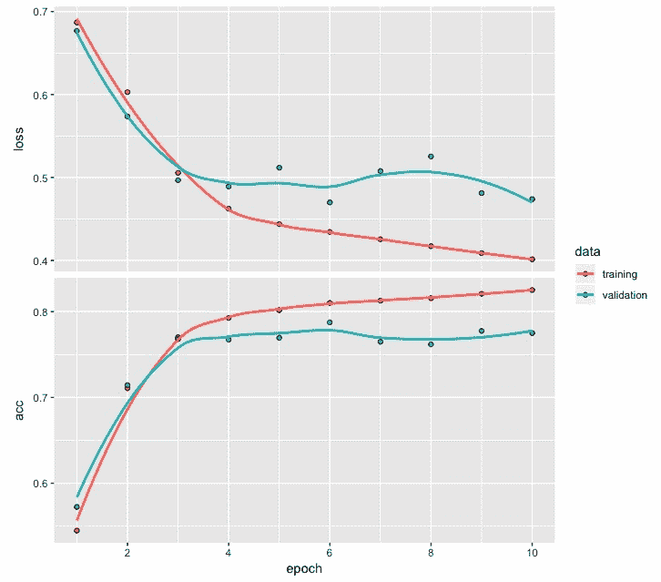
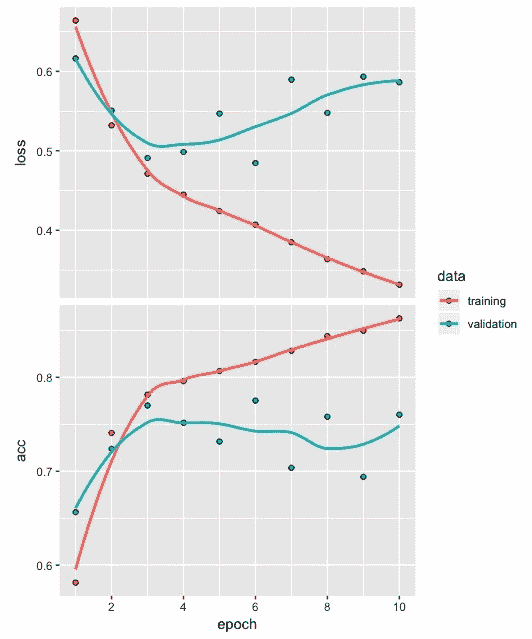
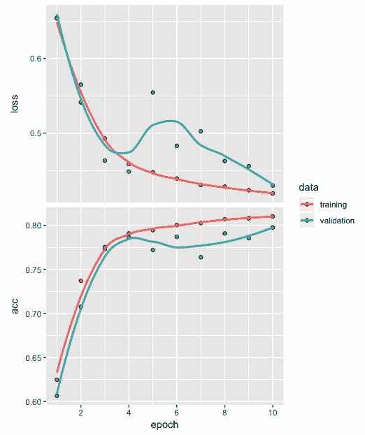
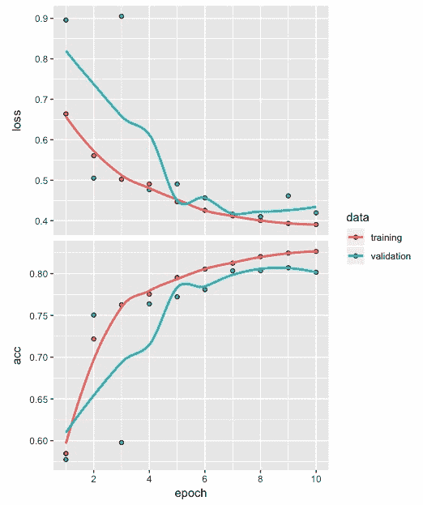
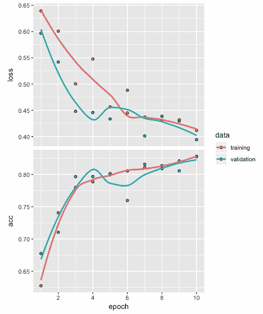

# 第十二章：使用循环神经网络进行文本分类

循环神经网络对于解决涉及序列的数据问题非常有用。一些涉及序列的应用实例包括文本分类、时间序列预测、视频帧序列、DNA 序列以及语音识别。

在本章中，我们将使用循环神经网络开发一个情感（正面或负面）分类模型。我们将从准备数据开始，开发文本分类模型，然后是构建顺序模型、编译模型、拟合模型、评估模型、预测以及使用混淆矩阵评估模型性能。我们还将回顾一些优化情感分类性能的小贴士。

更具体地说，本章将涵盖以下主题：

+   为模型构建准备数据

+   开发一个循环神经网络模型

+   拟合模型

+   模型评估与预测

+   性能优化建议与最佳实践

# 为模型构建准备数据

在本章中，我们将使用**互联网电影数据库**（**IMDb**）的电影评论文本数据，该数据可通过 Keras 包获取。请注意，您不需要从任何地方下载此数据，因为它可以通过我们稍后将讨论的代码轻松地从 Keras 库中获取。此外，这个数据集已经过预处理，文本数据已被转换为整数序列。我们不能直接使用文本数据来构建模型，因此，文本数据转化为整数序列的预处理是开发深度学习网络前的必要步骤。

我们将通过使用`dataset_imdb`函数加载`imdb`数据，并使用`num_words`参数指定最频繁的单词数量为 500。然后，我们将把`imdb`数据拆分为`train`和`test`数据集。让我们看看以下代码来理解这些数据：

```py
# IMDB data
imdb <- dataset_imdb(num_words = 500)
c(c(train_x, train_y), c(test_x, test_y)) %<-% imdb
length(train_x); length(test_x)
[1] 25000
[1] 25000

table(train_y)
train_y
    0     1 
12500 12500 

table(test_y)
test_y
    0     1 
12500 12500
```

让我们看看前面的代码：

+   `train_x`和`test_x`包含分别表示训练数据和测试数据中评论的整数。

+   类似地，`train_y`和`test_y`包含`0`和`1`标签，分别表示负面和正面情感。

+   使用`length`函数，我们可以看到`train_x`和`test_x`都基于各自的 25,000 条电影评论。

+   `train_y`和`test_y`的表格显示训练和测试数据中正面评论（12,500 条）和负面评论（12,500 条）的数量相等。

拥有如此平衡的数据集有助于避免由于类别不平衡问题而导致的偏差。

电影评论中的单词通过唯一的整数来表示，每个分配给单词的整数是基于其在数据集中的总体频率。例如，整数 1 表示最频繁的单词，而整数 2 表示第二频繁的单词，依此类推。此外，整数 0 并不代表任何特定的单词，而是表示一个未知的单词。

让我们使用以下代码查看`train_x`数据中的第三个和第六个序列：

```py
# Sequence of integers
train_x[[3]]
  [1]   1  14  47   8  30  31   7   4 249 108   7   4   2  54  61 369
 [17]  13  71 149  14  22 112   4   2 311  12  16   2  33  75  43   2
 [33] 296   4  86 320  35   2  19 263   2   2   4   2  33  89  78  12
 [49]  66  16   4 360   7   4  58 316 334  11   4   2  43   2   2   8
 [65] 257  85   2  42   2   2  83  68   2  15  36 165   2 278  36  69
 [81]   2   2   8 106  14   2   2  18   6  22  12 215  28   2  40   6
 [97]  87 326  23   2  21  23  22  12 272  40  57  31  11   4  22  47
[113]   6   2  51   9 170  23   2 116   2   2  13 191  79   2  89   2
[129]  14   9   8 106   2   2  35   2   6 227   7 129 113

train_x[[6]]
 [1]   1   2 128  74  12   2 163  15   4   2   2   2   2  32  85 156  45
[18]  40 148 139 121   2   2  10  10   2 173   4   2   2  16   2   8   4
[35] 226  65  12  43 127  24   2  10  10

for (i in 1:6) print(length(train_x[[i]]))

Output

[1] 218
[1] 189
[1] 141
[1] 550
[1] 147
[1] 43
```

从前面的代码和输出中，我们可以观察到以下情况：

+   从第三个电影评论相关的整数序列的输出中，我们可以观察到第三个评论包含 141 个整数，范围从 1（第一个整数）到 369（第 16 个整数）。

+   由于我们将最常见的单词限制在 500 个以内，因此对于第三个评论，不存在大于 500 的整数。

+   同样地，从第六个评论相关的整数序列的输出中，我们可以观察到第六个评论包含 43 个整数，范围从 1（第一个整数）到 226（第 35 个整数）。

+   查看`train_x`数据中前六个序列的长度，我们可以观察到电影评论的长度在 43（train 数据中的第六个评论）到 550（train 数据中的第四个评论）之间变化。电影评论长度的这种变化是正常的，并且是预期的。

在我们开发电影评论情感分类模型之前，我们需要找到一种方法，使所有电影评论的整数序列长度相同。我们可以通过填充序列来实现这一点。

# 填充序列

填充文本序列是为了确保所有序列具有相同的长度。让我们看看以下代码：

```py
# Padding and truncation
train_x <- pad_sequences(train_x, maxlen = 100)
test_x <- pad_sequences(test_x, maxlen = 100)
```

从前面的代码中，我们可以观察到以下情况：

+   我们可以通过`pad_sequences`函数并指定`maxlen`的值来实现所有整数序列的等长。

+   在这个例子中，我们将每个训练和测试数据中的每个电影评论序列的长度限制为 100。请注意，在填充序列之前，`train_x`和`test_x`的结构是一个包含 25,000 条评论的列表。

+   然而，在填充序列之后，两者的结构都变成了一个 25,000 x 100 的矩阵。通过在填充之前和之后运行`str(train_x)`可以轻松验证这一点。

为了观察填充对整数序列的影响，让我们看看以下代码及其输出：

```py
# Sequence of integers
train_x[3,]
  [1]   2   4   2  33  89  78  12  66  16   4 360   7   4  58 316 334
 [17]  11   4   2  43   2   2   8 257  85   2  42   2   2  83  68   2
 [33]  15  36 165   2 278  36  69   2   2   8 106  14   2   2  18   6
 [49]  22  12 215  28   2  40   6  87 326  23   2  21  23  22  12 272
 [65]  40  57  31  11   4  22  47   6   2  51   9 170  23   2 116   2
 [81]   2  13 191  79   2  89   2  14   9   8 106   2   2  35   2   6
 [97] 227   7 129 113

train_x[6,]
  [1]   0   0   0   0   0   0   0   0   0   0   0   0   0   0   0   0
 [17]   0   0   0   0   0   0   0   0   0   0   0   0   0   0   0   0
 [33]   0   0   0   0   0   0   0   0   0   0   0   0   0   0   0   0
 [49]   0   0   0   0   0   0   0   0   0   1   2 128  74  12   2 163
 [65]  15   4   2   2   2   2  32  85 156  45  40 148 139 121   2   2
 [81]  10  10   2 173   4   2   2  16   2   8   4 226  65  12  43 127
 [97]  24   2  10  10
```

在`train_x`填充后，可以在前述代码中看到第三个整数序列的输出。在这里，我们可以观察到以下情况：

+   第三个序列现在的长度是 100。第三个序列原本有 141 个整数，我们可以观察到序列开头的 41 个整数被截断了。

+   另一方面，第六个序列的输出显示出不同的模式。

+   第六个序列原本长度为 43，但现在在序列开头添加了 57 个零，将长度人为地扩展为 100。

+   所有 25,000 个与电影评论相关的整数序列，在每个训练和测试数据中都以类似的方式受到影响。

在接下来的部分中，我们将为递归神经网络开发一个架构，用于开发电影评论情感分类模型。

# 开发递归神经网络模型

在这一部分中，我们将开发递归神经网络的架构并对其进行编译。让我们来看一下下面的代码：

```py
# Model architecture
model <- keras_model_sequential() 
model %>% 
         layer_embedding(input_dim = 500, output_dim = 32) %>%
         layer_simple_rnn(units = 8) %>%  
         layer_dense(units = 1, activation = "sigmoid")
```

我们首先通过`keras_model_sequential`函数初始化模型。然后，我们添加嵌入层和简单的**递归神经网络**（**RNN**）层。对于嵌入层，我们指定`input_dim`为 500，这与我们之前指定的最常见单词数量相同。接下来是一个简单的 RNN 层，隐藏单元的数量指定为 8。

请注意，`layer_simple_rnn`层的默认激活函数是双曲正切（tanh），它是一个 S 形曲线，输出范围是-1 到+1。

最后一层密集层有一个单元，用来捕捉电影评论的情感（正面或负面），其激活函数为 sigmoid。当输出在 0 和 1 之间时，如本例所示，它便于解释，可以视为一个概率。

请注意，sigmoid 激活函数是一个 S 形曲线，其中输出的范围在 0 到 1 之间。

现在，让我们看一下模型摘要，理解如何计算所需的参数数量。

# 参数计算

RNN 模型的摘要如下：

```py
# Model summary
model

OUTPUT

Model
________________________________________________________________________
Layer (type)                    Output Shape                 Param # 
========================================================================
embedding_21 (Embedding)        (None, None, 32)             16000 
________________________________________________________________________
simple_rnn_23 (SimpleRNN)       (None, 8)                    328 
________________________________________________________________________
dense_24 (Dense)                (None, 1)                    9 
========================================================================
Total params: 16,337
Trainable params: 16,337
Non-trainable params: 0
________________________________________________________________________
```

嵌入层的参数数量是通过将 500（最常见的单词数量）与 32（输出维度）相乘得到的 16,000。为了计算简单 RNN 层的参数数量，我们使用*(h(h+i) + h)*，其中*h*代表隐藏单元的数量，*i*代表该层的输入维度。在这种情况下，这个值是 32。

因此，我们有（8（8 + 32）+8）= 328 个参数。

请注意，如果我们在这里考虑一个全连接的密集层，我们将得到（8 x 32 + 8）= 264 个参数。然而，额外的 64 个参数是由于我们使用递归层来捕捉文本数据中的序列信息。

在递归层中，除了当前输入信息外，前一个输入的信息也被使用，这导致了这些额外的参数，这就是为什么 RNN 比普通的全连接神经网络层更适合处理序列数据的原因。对于最后一层，即密集层，我们有（1 x 8 + 1）= 9 个参数。总的来说，这个架构有 16,337 个参数。

在递归层中，利用来自前一个输入的信息有助于更好地表示文本或类似数据中的序列。

# 编译模型

编译模型的代码如下：

```py
# Compile model
model %>% compile(optimizer = "rmsprop",
         loss = "binary_crossentropy",
         metrics = c("acc"))
```

我们使用`rmsprop`优化器来编译模型，这对于递归神经网络（RNN）是推荐的。由于电影评论的反馈是二元的（正面或负面），我们使用`binary_crossentropy`作为损失函数。最后，对于评估指标，我们指定了准确率。

在接下来的部分，我们将使用此架构来开发一个使用递归神经网络的电影评论情感分类模型。

# 拟合模型

拟合模型的代码如下：

```py
# Fit model
model_one <- model %>% fit(train_x, train_y,
         epochs = 10,
         batch_size = 128,
         validation_split = 0.2)
```

为了拟合模型，我们将使用 20%的验证数据划分，其中 20,000 条电影评论数据来自训练数据，用于构建模型。剩余的 5,000 条电影评论训练数据则用于评估验证，以损失和准确率的形式进行评估。我们将运行 10 个 epoch，每个 batch 大小为 128。

使用验证数据划分时，需要注意的是，20%的划分使用训练数据的前 80%进行训练，最后 20%的训练数据用于验证。因此，如果前 50%的评论数据是负面的，后 50%是正面的，那么 20%的验证数据划分将使得模型验证仅基于正面评论。因此，在使用验证数据划分之前，我们必须验证这一点，避免出现这种情况，否则会引入显著的偏差。

# 准确率和损失

使用`plot(model_one)`显示的训练和验证数据的准确率和损失值（在 10 个 epoch 后）可以在以下图表中看到：



从前面的图表中，可以得出以下结论：

+   训练损失从第 1 个 epoch 到第 10 个 epoch 持续下降。

+   验证损失最初减少，但在第 3 个 epoch 后开始趋于平稳。

+   在相反的方向上，准确率也观察到了类似的模式。

在接下来的部分，我们将评估分类模型，并通过训练和测试数据评估模型的预测性能。

# 模型评估与预测

首先，我们将基于训练数据评估模型的损失和准确率。同时，我们还将基于训练数据获取混淆矩阵。对于测试数据，也会重复相同的过程。

# 训练数据

我们将使用`evaluate`函数来获取损失和准确率值，如以下代码所示：

```py
# Loss and accuracy
model %>% evaluate(train_x, train_y)
$loss
[1] 0.4057531

$acc
[1] 0.8206
```

从之前的输出可以看出，基于训练数据的损失和准确率分别为 0.406 和 0.821。

使用训练数据进行的预测将用于生成混淆矩阵，如以下代码所示：

```py
# Prediction and confusion matrix
pred <- model %>% predict_classes(train_x)
table(Predicted=pred, Actual=imdb$train$y)
 Actual
Predicted 0 1
 0 9778 1762
 1 2722 10738
```

通过观察前面的混淆矩阵，可以得出以下结论：

+   有 9,778 条电影评论被正确分类为负面，10,738 条电影评论被正确分类为正面。我们可以观察到，模型在将评论分类为正面或负面方面表现得相当不错。

+   通过查看错误分类，我们还可以观察到，负面电影评论被错误地分类为正面评论的次数为 2,722 次。与将正面评论错误分类为负面评论（1,762 次）相比，这一错误分类的频率较高。

接下来，让我们基于测试数据做一个类似的评估。

# 测试数据

获取损失和准确率值的代码如下：

```py
# Loss and accuracy
model %>% evaluate(test_x, test_y)
$loss
[1] 0.4669374

$acc
[1] 0.77852
```

在这里，我们可以看到基于测试数据的损失和准确率分别为 0.467 和 0.778。这些结果略逊色于我们在训练数据中观察到的结果。

接下来，我们将预测测试数据的类别，并使用结果生成混淆矩阵，代码如下所示：

```py
# Prediction and confusion matrix
pred1 <- model %>%   predict_classes(test_x)
table(Predicted=pred1, Actual=imdb$test$y)
         Actual
Predicted     0     1
        0  9134  2171
        1  3366 10329
```

除了整体结果略逊色于我们从训练数据中获得的结果外，我们没有看到训练数据和测试数据之间的重大差异。

在下一节中，我们将探索一些改进模型性能的策略。

# 性能优化技巧和最佳实践

在开发循环神经网络模型时，我们会遇到需要做出多个与网络相关的决策的情况。这些决策可能包括尝试不同的激活函数，而不是我们之前使用的默认函数。让我们做出这样的更改，并观察它们对电影评论情感分类模型的性能产生什么影响。

在本节中，我们将实验以下四个因素：

+   简单 RNN 层中的单元数量

+   在简单 RNN 层中使用不同的激活函数

+   添加更多的循环层

+   填充序列的最大长度变化

# 简单 RNN 层中的单元数量

集成此更改并编译/拟合模型的代码如下：

```py
# Model architecture
model <- keras_model_sequential() 
model %>% 
         layer_embedding(input_dim = 500, output_dim = 32) %>%
         layer_simple_rnn(units = 32) %>% 
         layer_dense(units = 1, activation = "sigmoid")

# Compile model
model %>% compile(optimizer = "rmsprop",
         loss = "binary_crossentropy",
         metrics = c("acc"))

# Fit model
model_two <- model %>% fit(train_x, train_y,
         epochs = 10,
         batch_size = 128,
         validation_split = 0.2)
```

在这里，我们通过将简单 RNN 层中的单元数量从 8 增加到 32 来改变架构，其他设置保持不变。然后，我们编译并拟合模型，如前面的代码所示。

10 个周期后的准确率和损失值可以在以下图表中看到：



上面的图表显示了以下内容：

+   从第 3 个周期开始，训练数据和验证数据之间的差距显著增大。

+   这明显表明，与前面的图表相比，过拟合程度有所增加，而当时简单 RNN 中的单元数量为 8。

+   这也反映在我们基于这个新模型获得的测试数据上，损失值为 0.585，准确率为 0.757。

现在，让我们尝试在简单 RNN 层中使用不同的激活函数，看看是否能够解决这个过拟合问题。

# 在简单 RNN 层中使用不同的激活函数

这个变化可以在以下代码中看到：

```py
# Model architecture
model <- keras_model_sequential() 
model %>% 
         layer_embedding(input_dim = 500, output_dim = 32) %>%
         layer_simple_rnn(units = 32, activation = "relu") %>% 
 layer_dense(units = 1, activation = "sigmoid")

# Compile model
model %>% compile(optimizer = "rmsprop",
 loss = "binary_crossentropy",
 metrics = c("acc"))

# Fit model
model_three <- model %>% fit(train_x, train_y,
 epochs = 10,
 batch_size = 128,
 validation_split = 0.2)
```

在前面的代码中，我们将简单 RNN 层中的默认激活函数更改为 ReLU 激活函数。我们保持与上一个实验中相同的其他设置。

10 个周期后的准确率和损失值可以在以下图表中看到：



从上面的图表中，我们可以观察到以下几点：

+   现在，损失和准确率的值看起来好多了。

+   现在，基于训练和验证的损失与准确率曲线更加接近。

+   我们使用模型根据获得的测试数据计算损失和准确度值，分别为 0.423 和 0.803。与我们迄今为止获得的结果相比，这显示了更好的效果。

接下来，我们将通过添加更多的循环层进一步实验。这将帮助我们构建一个更深的循环神经网络模型。

# 添加更多的循环层

现在，我们将通过向当前网络添加两个额外的循环层来进行实验。包含此更改的代码如下：

```py
# Model architecture
model <- keras_model_sequential() %>% 
         layer_embedding(input_dim = 500, output_dim = 32) %>% 
         layer_simple_rnn(units = 32, 
                          return_sequences = TRUE, 
                          activation = 'relu') %>% 
         layer_simple_rnn(units = 32, 
                          return_sequences = TRUE, 
                          activation = 'relu') %>% 
         layer_simple_rnn(units = 32, 
                          activation = 'relu') %>%
         layer_dense(units = 1, activation = "sigmoid")

# Compile model
model %>% compile(optimizer = "rmsprop",
 loss = "binary_crossentropy",
 metrics = c("acc"))

# Fit model
model_four <- model %>% fit(train_x, train_y,
0 epochs = 10,
 batch_size = 128,
 validation_split = 0.2)
```

当我们添加这些额外的循环层时，我们还将`return_sequences`设置为`TRUE`。我们保持其他所有设置不变，然后编译并拟合模型。基于训练和验证数据的损失和准确度图表如下：



从前面的图表中，我们可以观察到以下内容：

+   在 10 个 epoch 之后，训练和验证的损失与准确度值表现出合理的接近度，表明没有发生过拟合。

+   基于测试数据计算出的损失和准确度值分别为 0.403 和 0.816，结果显示出明显的改进。

+   这表明，增加更深的循环层确实有助于更好地捕捉电影评论中的词序列。反过来，这也促使我们能够更好地将电影评论的情感分类为积极或消极。

# 填充序列的最大长度

到目前为止，我们已使用最大长度为 100 来填充电影评论序列的训练和测试数据。我们可以通过以下代码查看`train`和`test`数据中电影评论长度的总结：

```py
# Summary of padding sequences
z <- NULL
for (i in 1:25000) {z[i] <- print(length(train_x[[i]]))}
   Min. 1st Qu.  Median    Mean 3rd Qu.    Max. 
   11.0   130.0   178.0   238.7   291.0  2494.0 

z <- NULL
for (i in 1:25000) {z[i] <- print(length(test_x[[i]]))}
   Min. 1st Qu.  Median    Mean 3rd Qu.    Max. 
    7.0   128.0   174.0   230.8   280.0  2315.0
```

从前面的代码中，我们可以得出以下观察结果：

+   从训练数据中电影评论长度的总结中，我们可以看到最短长度为 11，最长长度为 2,494，中位数长度为 178。

+   类似地，测试数据的最短评论长度为 7，最长评论长度为 2,315，中位数长度为 174。

请注意，当最大填充长度低于中位数（例如最大长度为 100 时），我们通常会通过去除超过 100 的单词来截断更多的电影评论。同时，当我们选择的填充最大长度远高于中位数时，将会出现更多的电影评论需要包含零，而较少的评论会被截断。

在这一部分，我们将探讨将电影评论中词序列的最大长度保持在接近中位数值的影响。包含此更改的代码如下：

```py
# IMDB data
c(c(train_x, train_y), c(test_x, test_y)) %<-% imdb
train_x <- pad_sequences(train_x, maxlen = 200)  
test_x <- pad_sequences(test_x, maxlen = 200)

# Model architecture
model <- keras_model_sequential() %>% 
         layer_embedding(input_dim = 500, output_dim = 32) %>% 
         layer_simple_rnn(units = 32, 
                          return_sequences = TRUE, 
                          activation = 'relu') %>% 
         layer_simple_rnn(units = 32, 
                          return_sequences = TRUE, 
                          activation = 'relu') %>% 
         layer_simple_rnn(units = 32, 
                          return_sequences = TRUE, 
                          activation = 'relu') %>% 
         layer_simple_rnn(units = 32, 
                          activation = 'relu') %>%
         layer_dense(units = 1, activation = "sigmoid")

# Compile model
model %>% compile(optimizer = "rmsprop",
         loss = "binary_crossentropy",
         metrics = c("acc"))

# Fit model
model_five <- model %>% fit(train_x, train_y,
         epochs = 10,
         batch_size = 128,
         validation_split = 0.2)
```

从前面的代码可以看到，我们在将`maxlen`指定为 200 后运行模型。我们将其他所有设置保持与`model_four`相同。

训练数据和验证数据的损失与准确度图表如下：



从前面的图表中，我们可以得出以下观察结果：

+   由于训练和验证数据点非常接近，因此没有过拟合问题。

+   基于测试数据的损失和准确度分别计算为 0.383 和 0.830。

+   在这一阶段，损失和准确度值达到了最佳水平。

基于测试数据的混淆矩阵如下所示：

```py
# Prediction and confusion matrix
pred1 <- model %>%   predict_classes(test_x)
table(Predicted=pred1, Actual=imdb$test$y)
         Actual
Predicted     0     1
        0 10066  1819
        1  2434 10681
```

从混淆矩阵中，我们可以做出以下观察：

+   该分类模型在正确分类电影评论为正面（10,681）时表现略好于正确分类负面（10,066）评论的情况。

+   就被错误分类的评论而言，我们之前观察到的趋势仍然存在，即负面电影评论被模型错误分类为正面评论的情况较多，这在此案例中也是如此。

在本节中，我们尝试了多个单元、激活函数、网络中的递归层数以及填充量，以改进电影评论情感分类模型。您还可以进一步探索的其他因素包括要包含的最常见单词数量和在填充序列时更改最大长度。

# 总结

在本章中，我们展示了使用递归神经网络模型进行文本情感分类，数据来自 IMDb 电影评论。与常规的全连接网络相比，递归神经网络更适合处理包含序列的数据。文本数据就是我们在本章中使用的一个例子。

通常，深度网络涉及许多因素或变量，这需要一定的实验，涉及在得出有用模型之前，对这些因素的级别进行调整。本章中，我们还开发了五种不同的电影评论情感分类模型。

一种变体的递归神经网络是**长短期记忆**（**LSTM**）网络。LSTM 网络能够学习长期依赖关系，并帮助递归网络记住更长时间的输入。

在下一章中，我们将介绍使用 LSTM 网络的应用示例，我们将继续使用 IMDb 电影评论数据，并进一步探索可以提高情感分类模型性能的改进。
