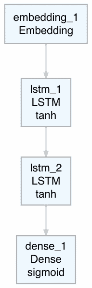
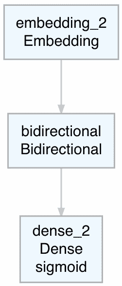

# 第十三章：使用长短期记忆网络进行文本分类

在上一章中，我们使用递归神经网络开发了一个电影评论情感分类模型，针对的是由单词序列构成的文本数据。**长短期记忆**（**LSTM**）神经网络是**递归神经网络**（**RNNs**）的一种特殊类型，适用于处理包含序列的数据，并提供我们将在下一节讨论的优势。本章将展示如何使用 LSTM 神经网络进行情感分类的步骤。将 LSTM 网络应用于商业问题的步骤可能包括文本数据准备、创建 LSTM 模型、训练模型和评估模型性能。

更具体地说，在本章中，我们将覆盖以下主题：

+   为什么我们使用 LSTM 网络？

+   为模型构建准备文本数据

+   创建长短期记忆网络模型

+   训练 LSTM 模型

+   评估模型性能

+   性能优化技巧和最佳实践

# 为什么我们使用 LSTM 网络？

在上一章中，我们已经看到，当处理包含序列的数据时，递归神经网络提供了不错的性能。使用 LSTM 网络的一个关键优势在于它们能够解决梯度消失问题，该问题使得在长序列的单词或整数上进行网络训练变得困难。梯度用于更新 RNN 参数，在长序列的单词或整数中，这些梯度变得越来越小，直到实际上无法进行网络训练。LSTM 网络帮助克服了这个问题，使得能够捕捉序列中被大距离分隔的关键词或整数之间的长期依赖性。例如，考虑以下两句，其中第一句较短，第二句则相对较长：

+   **句子-1**：我喜欢吃巧克力。

+   **句子-2**：每当有机会时，我喜欢吃巧克力，而通常这样的机会有很多。

在这些句子中，捕捉句子主要意思的两个重要词是**like**和**chocolates**。在第一个句子中，**like**和**chocolates**离得较近，之间只隔了两个词。而在第二个句子中，这两个词之间隔了多达 14 个词。LSTM 网络旨在处理这些长时间依赖性，通常出现在较长的句子或较长的整数序列中。在本章中，我们重点介绍如何应用 LSTM 网络来开发电影评论情感分类模型。

# 为模型构建准备文本数据

我们将继续使用上一章中使用的 IMDB 电影评论数据，该数据已经以我们可以用于开发深度网络模型的格式提供，数据处理的需求最小化。

让我们来看一下下面的代码：

```py
# IMDB data
library(keras)
imdb <- dataset_imdb(num_words = 500) 
c(c(train_x, train_y), c(test_x, test_y)) %<-% imdb
train_x <- pad_sequences(train_x, maxlen = 200) 
test_x <- pad_sequences(test_x, maxlen = 200)
```

捕捉训练和测试数据的整数序列分别存储在`train_x`和`test_x`中。同样，`train_y`和`test_y`存储标签，用于表示电影评论是正面还是负面。我们已指定最频繁的单词数量为 500。对于填充，我们使用 200 作为训练和测试数据序列的最大长度。

当整数的实际长度小于 200 时，序列的开头会填充零，以人为地将整数的长度增加到 200。然而，当整数的长度大于 200 时，序列的开头会移除一些整数，以保持总长度为 200。

如前所述，训练集和测试集数据都是平衡的，每个数据集包含 25,000 条电影评论。每条电影评论也都带有正面或负面的标签。

请注意，`maxlen`的取值会影响模型的表现。如果选择的值太小，序列中的更多单词或整数会被截断。另一方面，如果选择的值太大，序列中的更多单词或整数需要填充，零会被添加进去。避免过度填充或过度截断的一种方法是选择一个接近中位数的值。

# 创建一个长短期记忆网络模型

在这一部分，我们将从一个简单的 LSTM 网络架构开始，看看如何计算出参数数量。随后，我们将编译模型。

# LSTM 网络架构

我们将从一个简单的 LSTM 网络架构流程图开始，如下图所示：


前面的 LSTM 网络流程图突出了架构中的层和使用的激活函数。在 LSTM 层中，使用的是`tanh`激活函数，这是该层的默认激活函数。在密集层中，使用的是`sigmoid`激活函数。

让我们来看一下下面的代码和模型的总结：

```py
# Model architecture
model <- keras_model_sequential() %>%
         layer_embedding(input_dim = 500, output_dim = 32) %>%
         layer_lstm(units = 32) %>%
         layer_dense(units = 1, activation = "sigmoid")
model
__________________________________________________________________________
Layer (type)                      Output Shape                  Param # 
==========================================================================
embedding (Embedding)             (None, None, 32)              16000 
__________________________________________________________________________
lstm (LSTM)                       (None, 32)                    8320 
__________________________________________________________________________
dense (Dense)                     (None, 1)                     33 
==========================================================================
Total params: 24,353
Trainable params: 24,353
Non-trainable params: 0
__________________________________________________________________________
```

除了上一章中用于 RNN 模型的内容外，我们在此示例中将`layer_simple_rnn`替换为`layer_lstm`，用于 LSTM 网络。对于嵌入层，我们总共有 16,000 个参数（500 x 32）。以下计算展示了 LSTM 层参数数量的计算方法：

*=4 x [LSTM 层单元数 x (LSTM 层单元数 + 输出维度) + LSTM 层单元数]*

*= 4 x [32(32+32) + 32]*

*= 8320*

对于一个类似的包含 RNN 层的架构，我们将有 2,080 个参数。LSTM 层参数数量的四倍增加也导致了更多的训练时间，因此需要相对更高的处理成本。密集层的参数数量是*[(32x1) + 1]*，即 33。因此，该网络的总参数数量为 24,353。

# 编译 LSTM 网络模型

用于编译 LSTM 网络模型的代码如下：

```py
# Compile
model %>% compile(optimizer = "rmsprop",  
         loss = "binary_crossentropy",
         metrics = c("acc"))
```

我们使用`rmsprop`作为优化器，`binary_crossentropy`作为损失函数，因为电影评论的响应是二元的，换句话说，它们要么是积极的，要么是消极的。对于评估指标，我们使用分类准确率。在编译模型后，我们准备好进行 LSTM 模型的下一步拟合。

# 拟合 LSTM 模型

为了训练 LSTM 模型，我们将使用以下代码：

```py
# Fit model
model_one <- model %>% fit(train_x, train_y,
         epochs = 10,
         batch_size = 128,
         validation_split = 0.2)
plot(model_one)
```

我们将使用训练数据来拟合 LSTM 模型，设定训练周期为 10 个 epoch，批量大小为 128。我们还将保留 20%的训练数据作为验证数据，用于在模型训练过程中评估损失和准确率值。

# 损失与准确率图

以下截图显示了`model_one`的损失和准确率图：


基于训练和验证数据的损失与准确率图显示了曲线之间的整体接近性。图中的观察结果如下：

+   两条线之间没有出现显著的分歧，这表明没有出现过拟合问题。

+   增加 epoch 的数量可能不会显著改善模型的性能。

+   然而，基于验证数据的损失和准确率值显示出一定程度的不均匀性或波动性，它们偏离训练损失和准确率的幅度相对较高。

+   特别是在 epoch 4 和 epoch 8 这两个时刻，它们显示了与基于训练数据的损失和准确率的显著偏差。

接下来，我们将继续评估`model_one`并将其用于预测电影评论的情感。

# 评估模型性能

在本节中，我们将基于训练数据和测试数据评估模型。我们还将为训练数据和测试数据创建混淆矩阵，以进一步了解模型在电影评论情感分类方面的表现。

# 使用训练数据评估模型

我们将首先使用以下代码评估训练数据上的模型性能：

```py
# Evaluate
model %>% evaluate(train_x, train_y)
$loss
 [1] 0.3749587
$acc
 [1] 0.82752
```

从前面的输出可以看出，对于训练数据，我们得到了`0.375`的损失值和大约`0.828`的准确率。考虑到 LSTM 架构相对简单，这已经是一个不错的表现。接下来，我们将使用该模型预测电影评论的情感，并通过以下代码开发混淆矩阵来总结结果：

```py
# Confusion Matrix
pred <- model %>% predict_classes(train_x)
table(Predicted=pred, Actual=imdb$train$y)
         Actual
 Predicted     0     1
         0  9258  1070
         1  3242 11430
```

我们可以从混淆矩阵中得出以下观察结果：

+   观察到该模型在预测积极电影评论（11,430 个正确预测）方面似乎比预测消极电影评论（9,258 个正确预测）更为准确。换句话说，该模型在训练数据中以约 91.4%的正确率（也称为模型的敏感性）正确分类了积极评论。

+   类似地，该模型在训练数据中以约 74.1%的正确率（也称为模型的特异性）正确分类了消极评论。

+   还观察到，负面电影评论被错误分类为正面评论的比例约为三倍（3,242 条评论），而正面评论被错误分类为负面评论的比例为 1,070 条评论。

+   因此，尽管总体而言，该模型似乎在训练数据上表现良好，但深入分析后，我们发现它在正确分类正面电影评论时有一定的偏向，这导致了在正确分类负面评论时准确度较低。

观察到基于训练数据的模型性能是否会在测试数据上出现类似的行为，将会很有趣。

# 使用测试数据进行模型评估

现在我们将使用测试数据，通过以下代码获得模型的损失和准确率值：

```py
# Evaluate
model %>% evaluate(test_x, test_y)
$loss
 [1] 0.3997277
$acc
 [1] 0.81992
```

从前面的输出可以看到，对于测试数据，我们得到的损失值为 0.399，准确率约为 0.819。正如预期的那样，这些值略低于训练数据上获得的结果。然而，它们与基于训练数据的结果足够接近，可以认为该模型行为一致。

获取混淆矩阵的代码如下：

```py
# Confusion Matrix
pred1 <- model %>$ predict_classes(text_x)
table(Predicted=pred1, Actual=imdb$test$y)
         Actual
 Predicted     0     1
         0  9159  1161
         1  3341 11339
```

从上述混淆矩阵中，可以得出以下观察结果：

+   基于使用测试数据的预测生成的混淆矩阵显示了与我们之前在训练数据中观察到的类似模式。

+   该模型在准确分类正面电影评论时似乎表现得更好（约 90.7%），而在正确分类负面评论时则较差（约 73.3%）。

+   因此，当正确分类正面电影评论时，模型在性能上继续显示偏差。

在下一节中，我们将进行一些实验，探索模型电影评论情感分类性能的潜在改进。

# 性能优化技巧和最佳实践

在本节中，我们将进行三项不同的实验，探索改进的基于 LSTM 的电影评论情感分类模型。这将涉及在编译模型时尝试不同的优化器、在模型架构开发时添加另一个 LSTM 层，以及在网络中使用双向 LSTM 层。

# 使用 Adam 优化器进行实验

我们将在编译模型时使用 `adam`（自适应矩估优化）优化器，替代之前使用的 `rmsprop`（均方根传播）优化器。为了使模型性能的比较更加容易，我们将保持其余部分与之前相同，如以下代码所示：

```py
# Model architecture
model <- keras_model_sequential() %>%
         layer_embedding(input_dim = 500, output_dim = 32) %>%
         layer_lstm(units = 32) %>%
         layer_dense(units = 1, activation = "sigmoid")

# Compile
model %>% compile(optimizer = "adam",  
         loss = "binary_crossentropy",
         metrics = c("acc"))

# Fit model
model_two <- model %>% fit(train_x, train_y,
         epochs = 10,
         batch_size = 128,
         validation_split = 0.2)
plot(model_two)
```

运行上述代码并训练模型后，每个 epoch 的准确率和损失值被存储在 `model_two` 中。我们使用 `model_two` 中的损失和准确率值来生成以下图表：


从前面的损失和准确率图中，我们可以得出以下观察结果：

+   基于训练数据和验证数据的损失与准确率图表相比我们为第一个模型所构建的图表（`model_one`）显示出略微改进的模式。

+   在基于`model_one`的图表中，我们观察到验证数据的损失和准确率值偶尔出现较大偏差，而这些偏差在基于训练数据的值中并没有出现。在这个图表中，我们没有看到两条线之间的任何重大偏差。

+   此外，基于验证数据的最后几个值的损失和准确率值似乎趋于平稳，表明我们使用的十个训练周期已经足够训练模型，增加训练周期数不太可能帮助提高模型性能。

接下来，我们将使用以下代码获取训练数据的损失、准确率和混淆矩阵：

```py
# Loss and accuracy
model %>% evaluate(train_x, train_y)
$loss
[1] 0.3601628
$acc
[1] 0.8434

pred <- model %>%   predict_classes(train_x)

# Confusion Matrix
table(Predicted=pred, Actual=imdb$train$y)
         Actual
Predicted     0     1
        0 11122  2537
        1  1378  9963
```

从前面的代码输出中，我们可以得出以下观察结果：

+   通过使用`adam`优化器，我们获得了训练数据的损失和准确率分别为 0.360 和 0.843。这两个数值相比我们之前使用`rmsprop`优化器的模型都有所提升。

+   从混淆矩阵中可以观察到另一个区别。该模型在正确分类负面电影评论时的表现较好（正确分类率约为 88.9%），而在正确分类正面评论时的正确分类率约为 79.7%。

+   这种行为与之前模型中的观察结果相反。与正确分类正面评论相比，该模型似乎更偏向于正确分类负面电影评论情感。

在审视完使用训练数据的模型性能后，我们将使用以下代码重复该过程，获取测试数据的损失、准确率和混淆矩阵：

```py
# Loss and accuracy
model %>% evaluate(test_x, test_y)
$loss
[1] 0.3854687
$acc
[1] 0.82868

pred1 <- model %>%   predict_classes(test_x)

# Confusion Matrix
table(Predicted=pred1, Actual=imdb$test$y)
         Actual
Predicted     0     1
        0 10870  2653
        1  1630  9847
```

从前面的代码输出中，我们可以得出以下观察结果：

+   基于测试数据的损失和准确率分别为 0.385 和 0.829。这些基于测试数据的结果相比之前的模型在测试数据上也显示出更好的模型表现。

+   混淆矩阵显示了我们在训练数据中观察到的类似模式。负面电影评论情感在测试数据中的正确分类率约为 86.9%。

+   同样，正面电影评论情感在测试数据中的正确分类率约为 78.8%。

+   这种行为与使用训练数据获得的模型性能一致。

尽管尝试`adam`优化器改善了整体的电影评论情感分类性能，但它在正确分类某一类别时仍然存在偏差。一个好的模型不仅应当提高整体性能，还应最小化在正确分类某一类别时的偏差。以下代码提供了一个表格，展示了`train`和`test`数据中负面和正面评论的数量：

```py
# Number of positive and negative reviews in the train data
table(train_y)
train_y
    0     1 
12500 12500 

# Number of positive and negative review in the test data
table(test_y)
test_y
    0     1 
12500 12500 
```

从前面的代码输出可以看出，该电影评论数据是平衡的，训练数据和测试数据各包含 25,000 条评论。这些数据在正面和负面评论的数量上也是平衡的。训练集和测试集各包含 12,500 条正面评论和 12,500 条负面评论。因此，提供给模型进行训练的负面或正面评论数量没有偏差。然而，在正确分类负面和正面电影评论时所观察到的偏差，显然是需要改进的地方。

在下一个实验中，我们将尝试添加更多的 LSTM 层，看看是否能获得更好的电影评论情感分类模型。

# 对具有额外层的 LSTM 网络进行实验

在第二次实验中，为了提高分类模型的性能，我们将添加一个额外的 LSTM 层。让我们来看一下以下代码：

```py
# Model architecture
model <- keras_model_sequential() %>%
         layer_embedding(input_dim = 500, output_dim = 32) %>%
         layer_lstm(units = 32,
                    return_sequences = TRUE) %>%
         layer_lstm(units = 32) %>%
         layer_dense(units = 1, activation = "sigmoid")

# Compiling model
model %>% compile(optimizer = "adam",   
         loss = "binary_crossentropy",
         metrics = c("acc"))

# Fitting model
model_three <- model %>% fit(train_x, train_y,
         epochs = 10,
         batch_size = 128,
         validation_split = 0.2)

# Loss and accuracy plot
plot(model_three)
```

通过向网络中添加额外的 LSTM 层，如前面的代码所示，两个 LSTM 层的总参数数量将从之前一个 LSTM 层的 24,353 增加到 32,673。这一参数数量的增加也会导致训练时间的增加。我们仍然在编译模型时使用 Adam 优化器。除此之外，我们保持与之前模型相同的其他设置。

下面的屏幕截图显示了该实验中使用的具有两个 LSTM 层的网络架构的简单流程图：



前面的 LSTM 网络流程图突出了架构中的两层及所使用的激活函数。在这两层 LSTM 中，`tanh` 被用作默认的激活函数。在全连接层中，我们继续使用之前所使用的 `sigmoid` 激活函数。

在训练模型后，每个周期的准确率和损失值被存储在 `model_three` 中。我们使用 `model_three` 中的损失值和准确率来生成以下图表：


从显示的损失和准确率图中，我们可以做出以下观察：

+   损失和准确率的图表没有显示过拟合问题的存在，因为训练数据和验证数据的曲线相互接近。

+   与早期的模型一样，验证数据的损失和准确率似乎在最后几个训练周期保持平稳，这表明十个训练周期足以训练模型，增加训练周期数不太可能改善结果。

我们现在可以使用以下代码来获得训练数据的损失、准确率和混淆矩阵：

```py
# Loss and accuracy
model %>% evaluate(train_x, train_y)
$loss
[1] 0.3396379
$acc
[1] 0.85504

pred <- model %>%   predict_classes(train_x)

# Confusion Matrix
table(Predicted=pred, Actual=imdb$train$y) 
         Actual
Predicted     0     1
        0 11245  2369
        1  1255 10131
```

从前面的代码输出中，我们可以做出以下观察：

+   基于训练数据得到的损失值和准确率分别为 `0.339` 和 `0.855`。与之前的两个模型相比，损失和准确率都有所改善。

+   我们可以使用这个模型对训练数据中的每个评论进行预测，将其与实际标签进行比较，然后以混淆矩阵的形式总结结果。

+   对于训练数据，混淆矩阵显示模型正确分类负面电影评论的比例约为 90%，正确分类正面评论的比例约为 81%。

+   所以，尽管模型性能整体有所提高，但我们在正确分类某一类别时，相比另一类别仍然观察到偏差。

在回顾了使用训练数据时模型的表现后，我们现在将使用测试数据重复这个过程。以下是获取损失、准确率和混淆矩阵的代码：

```py
# Loss and accuracy
model %>% evaluate(test_x, test_y)
$loss
[1] 0.3761043
$acc
[1] 0.83664

pred1 <- model %>%   predict_classes(test_x)

# Confusion Matrix
table(Predicted=pred1, Actual=imdb$test$y)
         Actual
Predicted     0     1
        0 10916  2500
        1  1584 10000
```

从前面的代码输出中，我们可以得出以下观察结果：

+   对于测试数据，损失和准确率分别为 0.376 和 0.837。这两个结果都显示出相较于前两个模型，测试数据的分类表现更好。

+   混淆矩阵显示，负面电影评论的正确分类率约为 87.3%，而正面评论的正确分类率约为 80%。

+   因此，这些结果与使用训练数据得到的结果一致，并且显示出与我们在训练数据中观察到的类似偏差。

总结来说，通过添加额外的 LSTM 层，我们能够提高模型的电影评论情感分类性能。然而，我们在正确分类某一类别时，仍然观察到偏差，与另一类别相比。虽然我们在提升模型性能方面取得了一定成功，但仍有提升模型分类性能的空间。

# 实验使用双向 LSTM 层

双向 LSTM，顾名思义，不仅使用作为输入提供的整数序列，还利用其反向顺序作为额外输入。在某些情况下，这种方法可能有助于通过捕捉数据中可能未被原始 LSTM 网络捕获的有用模式，进一步提高模型的分类性能。

对于本实验，我们将修改第一次实验中的 LSTM 层，如下代码所示：

```py
# Model architecture
model <- keras_model_sequential() %>%
          layer_embedding(input_dim = 500, output_dim = 32) %>%
          bidirectional(layer_lstm(units = 32)) %>%
          layer_dense(units = 1, activation = "sigmoid")
# Model summary
summary(model)
Model
__________________________________________________________
Layer (type)              Output Shape           Param #  
==========================================================
embedding_8 (Embedding)   (None, None, 32)       16000    
__________________________________________________________
bidirectional_5 (Bidirect (None, 64)             16640    
__________________________________________________________
dense_11 (Dense)          (None, 1)              65       
==========================================================
Total params: 32,705
Trainable params: 32,705
Non-trainable params: 0
__________________________________________________________
```

从前面的代码输出中，我们可以得出以下观察结果：

+   我们使用双向`()`函数将 LSTM 层转换为双向 LSTM 层。

+   这一改变将与 LSTM 层相关的参数数量增加到 16,640，从模型摘要中可以看到这一点。

+   该架构的总参数数量现已增加到 32,705。参数数量的增加将进一步降低网络训练的速度。

这是双向 LSTM 网络架构的简单流程图：



双向 LSTM 网络的流程图展示了嵌入层、双向层和密集层。在双向 LSTM 层中，`tanh` 被用作激活函数，而密集层使用 `sigmoid` 激活函数。编译和训练模型的代码如下：

```py
# Compiling model
model %>% compile(optimizer = "adam",   
          loss = "binary_crossentropy",
          metrics = c("acc"))

# Fitting model
 model_four <- model %>% fit(train_x, train_y,
          epochs = 10,
          batch_size = 128,
          validation_split = 0.2)

# Loss and accuracy plot
plot(model_four)
```

从前面的代码可以看出，我们将继续使用 `adam` 优化器，并保持其他设置与之前相同，进行模型的编译和拟合。

在我们训练模型后，每个 epoch 的准确率和损失值会存储在 `model_four` 中。我们使用 `model_four` 中的损失和准确率值来绘制以下图表：


从前面的图表中，我们可以得出以下观察结果：

+   损失和准确率图表没有显示过拟合的任何问题，因为训练和验证的曲线相对接近。

+   图表还显示，我们无需超过十个 epoch 就可以训练这个模型。

我们将使用以下代码获取训练数据的损失值、准确率和混淆矩阵：

```py
# Loss and accuracy
model %>% evaluate(train_x, train_y)
$loss
[1] 0.3410529
$acc
[1] 0.85232

pred <- model %>%   predict_classes(train_x)

# Confusion Matrix
table(Predicted=pred, Actual=imdb$train$y)
         Actual
Predicted     0     1
        0 10597  1789
        1  1903 10711
```

从前面的代码输出中，我们可以得出以下观察结果：

+   对于训练数据，我们得到的损失值和准确率分别为 0.341 和 0.852。这些结果仅比之前的结果稍微差一些，差异不大。

+   这次的混淆矩阵显示了正确分类正面和负面电影评论的表现更加均衡。

+   对于负面电影评论，正确分类率约为 84.8%，对于正面评论，正确分类率约为 85.7%。

+   这个大约 1% 的差异远小于我们在早期模型中观察到的差异。

我们现在将对测试数据重复之前的过程。以下是获取损失、准确率和混淆矩阵的代码：

```py
# Loss and accuracy
model %>% evaluate(test_x, test_y)
$loss
[1] 0.3737377
$acc
[1] 0.83448

pred1 <- model %>%   predict_classes(test_x)

#Confusion Matrix
table(Predicted=pred1, Actual=imdb$test$y)
         Actual
Predicted     0     1
        0 10344  1982
        1  2156 10518
```

从前面的代码输出中，我们可以得出以下观察结果：

+   对于测试数据，损失值和准确率分别为 0.374 和 0.834。

+   混淆矩阵显示，负面评论的正确分类率约为 82.8%。

+   该模型正确分类正面电影评论的准确率约为 84.1%。

+   这些结果与训练数据中获得的结果一致。

双向 LSTM 的实验帮助我们获得了与之前实验中使用两个 LSTM 层时相似的损失和准确率表现。然而，主要的进展在于我们能够在正确分类负面或正面电影评论时，表现出更好的一致性。

本章中，我们使用 LSTM 网络开发了一个电影评论情感分类模型。当数据涉及序列时，LSTM 网络有助于捕捉序列中词语或整数的长期依赖关系。我们通过对模型进行一些修改，实验了四种不同的 LSTM 模型，相关结果总结在以下表格中。

本表总结了四个 LSTM 模型的性能：

| **模型** | **LSTM 层** | **优化器** | **数据** | **损失** | **准确率** | **负面评论准确率或特异性** | **正面评论准确率或敏感性** |
| --- | --- | --- | --- | --- | --- | --- | --- |
| 一 | 1 | `rmsprop` | 训练 | 0.375 | 82.8% | 74.1% | 91.4% |
|   |   |   | 测试 | 0.399 | 81.9% | 73.3% | 90.7% |
| 二 | 1 | `adam` | 训练 | 0.360 | 84.3% | 88.9% | 79.7% |
|   |   |   | 测试 | 0.385 | 82.9% | 86.9% | 78.8% |
| 三 | 2 | `adam` | 训练 | 0.339 | 85.5% | 90.0% | 81.0% |
|   |   |   | 测试 | 0.376 | 83.7% | 87.3% | 80.0% |
| 四 | 双向 | `adam` | 训练 | 0.341 | 85.2% | 84.8% | 85.7% |
|   |   |   | 测试 | 0.374 | 83.4% | 82.8% | 84.1% |

我们可以从上述表格中做出以下观察：

+   在尝试的四个模型中，双向 LSTM 模型相比其他三个模型提供了更好的性能。它在基于测试数据的损失值方面最低。

+   尽管第四个模型的整体准确率相比第三个模型略低，但其正确分类负面和正面评论的准确性更加稳定，变化范围从 82.8%到 84.1%，即约 1.3%的波动。

+   第三个模型似乎偏向于负面评论，正确分类该类评论的测试数据准确率为 87.3%。对于第三个模型，正面评论在测试数据中的正确分类准确率仅为 80%。因此，第三个模型中负面和正面评论的正确分类差距超过 7%。

+   前两个模型的敏感性和特异性之间的差距甚至更大。

尽管第四个模型提供了良好的结果，但通过进一步实验其他变量，仍然可以探索额外的改进。可以用于进一步实验的变量包括最常见词汇的数量、使用前后填充和/或截断、填充时使用的最大长度、LSTM 层中的单元数，以及在编译模型时选择其他优化器。

# 概述

本章中，我们展示了使用 LSTM 网络来开发电影评论情感分类模型。我们在上一章中使用的递归神经网络所面临的一个问题是，难以捕捉序列中两个词语/整数之间可能存在的长期依赖关系。**长短期记忆**（**LSTM**）网络的设计目的是人为地保留在处理长句子或长整数序列时重要的长期记忆。

在下一章中，我们将继续处理文本数据，并探索**卷积递归神经网络**（**CRNNs**）的应用，CRNNs 结合了**卷积神经网络**（**CNNs**）和**递归神经网络**（**RNNs**）的优点，形成了一个单一的网络。我们将通过一个有趣且公开可用的文本数据集`reuter_50_50`来说明这种网络的应用。
