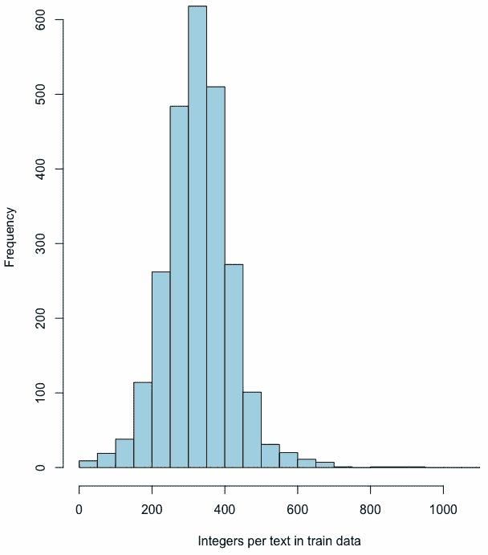
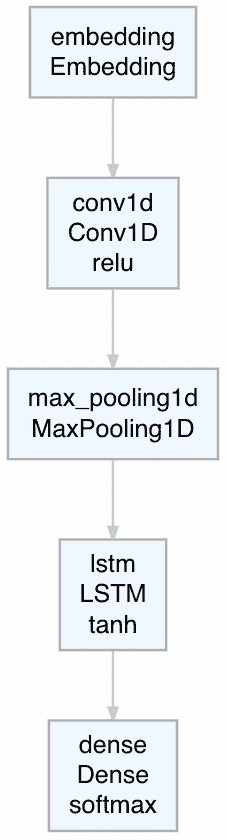
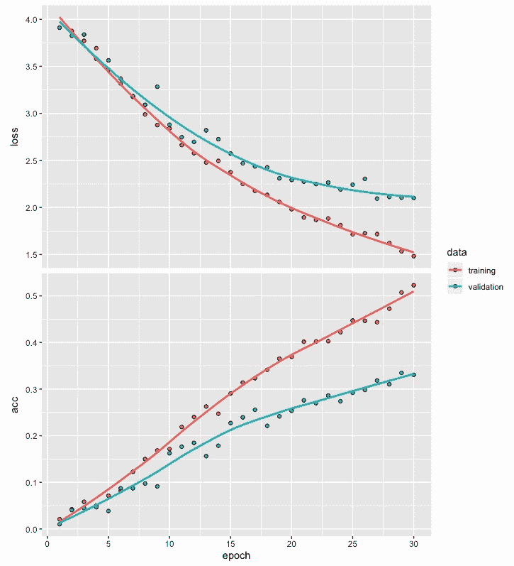
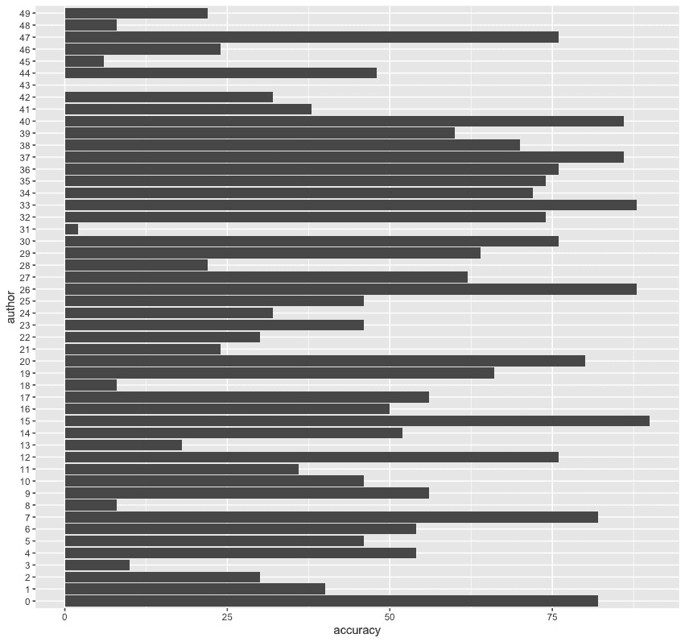
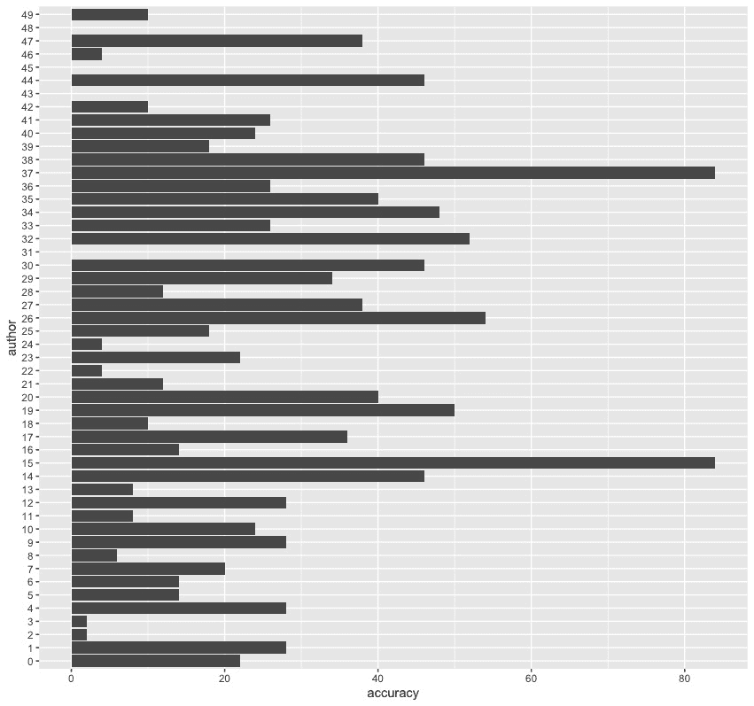
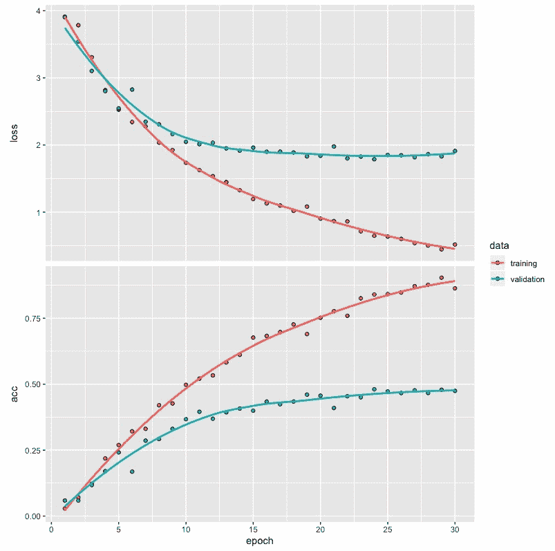
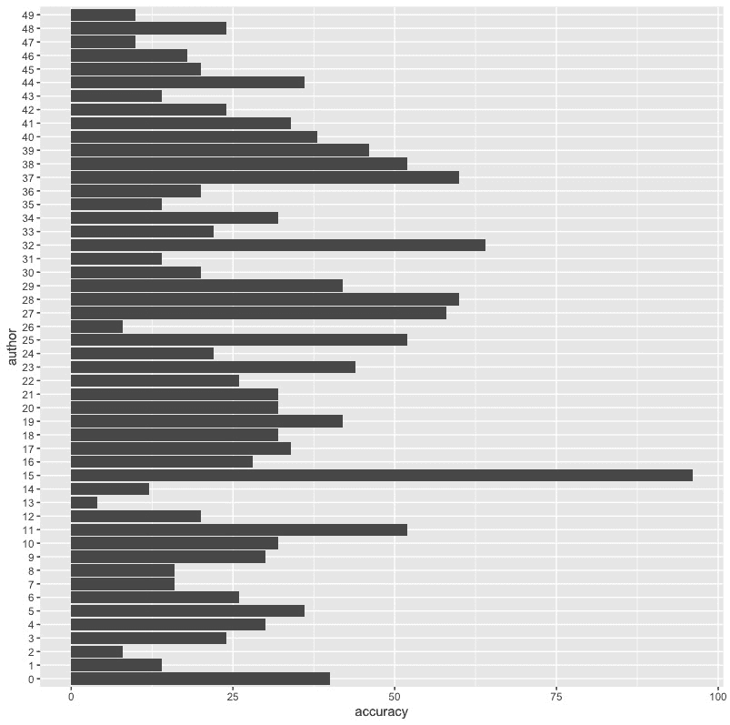
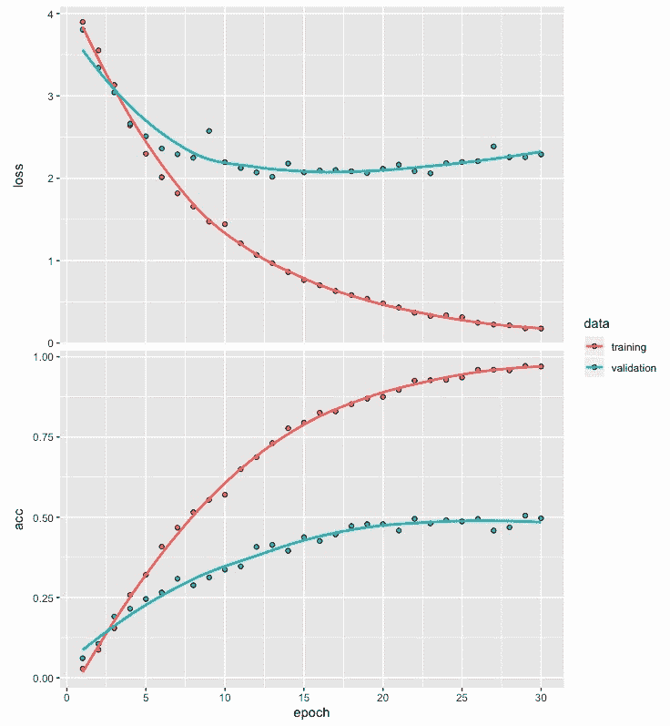
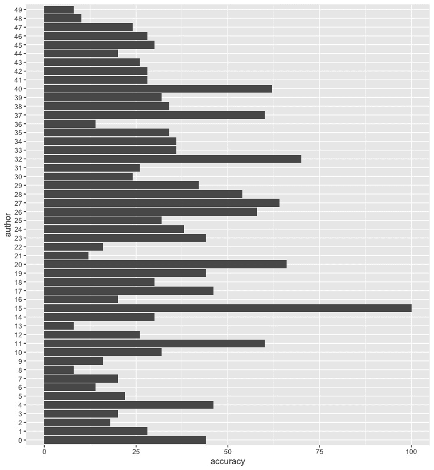

# 第十四章：使用卷积递归神经网络进行文本分类

**卷积神经网络**（**CNNs**）被发现能够有效捕捉数据中的高层次局部特征。另一方面，**递归神经网络**（**RNNs**），例如**长短期记忆**（**LSTM**），则在捕捉涉及文本等序列数据的长期依赖性方面表现出色。当我们在同一个模型架构中同时使用 CNN 和 RNN 时，就会产生所谓的**卷积递归神经网络**（**CRNNs**）。

本章说明了如何通过结合 RNN 和 CNN 网络的优点，将卷积递归神经网络应用于文本分类问题。这个过程包括文本数据准备、定义卷积递归网络模型、训练模型以及模型评估等步骤。

更具体地说，本章将涵盖以下内容：

+   使用 reuter_50_50 数据集

+   准备模型构建的数据

+   开发模型架构

+   编译和拟合模型

+   评估模型并预测类别

+   性能优化建议和最佳实践

# 使用 reuter_50_50 数据集

在之前的章节中，当处理文本数据时，我们使用了已经转换为整数序列的数据来开发深度网络模型。本章中，我们将使用需要转换为整数序列的文本数据。我们将从读取将用于展示如何开发文本分类深度网络模型的数据开始。我们还将探索我们将使用的数据集，以便更好地理解它。

在本章中，我们将使用`keras`、`deepviz`和`readtext`库，如下所示的代码：

```py
# Libraries used
library(keras)
library(deepviz)
library(readtext)
```

为了说明开发卷积递归网络模型的步骤，我们将使用来自 UCI 机器学习库的`reuter_50_50`文本数据集：[`archive.ics.uci.edu/ml/datasets/Reuter_50_50#`](https://archive.ics.uci.edu/ml/datasets/Reuter_50_50#)。

该数据集包含两个文件夹中的文本文件，一个文件夹用于训练数据，另一个用于测试数据：

+   存放训练数据的文件夹有 2,500 个文本文件，每个文件包含 50 篇来自 50 位作者的文章。

+   类似地，存放测试数据的文件夹也包含 2,500 个文本文件，每个文件包含 50 篇来自同样 50 位作者的文章。

# 读取训练数据

我们可以通过访问我们提供的 UCI 机器学习库链接中的`Data`文件夹来访问`reuter_50_50`数据集。在这里，我们可以下载`C50.zip`文件夹。解压后，它包含一个名为`C50`的文件夹，其中包含`C50train`和`C50test`文件夹。首先，我们将使用以下代码读取`C50train`文件夹中的文本文件：

```py
# Reading Reuters train data
setwd("~/Desktop/C50/C50train")
temp = list.files(pattern="*.*")
k <- 1; tr <- list(); trainx <- list(); trainy <- list()
for (i in 1:length(temp)) {for (j in 1:50) 
         { trainy[k] <- temp[i]
         k <- k+1}
author <- temp[i]
files <- paste0("~/Desktop/C50/C50train/", author, "/*")
tr <- readtext(files)
trainx <- rbind(trainx, tr)}
trainx <- trainx$text
```

在前面的代码帮助下，我们可以将来自`C50train`文件夹的 2,500 篇文章数据读取到`trainx`中，并将作者的名字信息保存到`trainy`中。我们首先通过`setwd`函数将工作目录设置为`C50train`文件夹。`C50train`文件夹包含 50 个以作者名字命名的文件夹，每个文件夹里有 50 篇该作者撰写的文章。我们将 k 的值设为 1，并将`tr`、`trainx`和`trainy`初始化为列表。然后，我们创建一个循环，使得每篇文章的作者名字存储在`trainy`中，而`trainx`中存储相应的文章。需要注意的是，在读取这 2,500 个文本文件之后，`trainx`也包含了文件名信息。通过最后一行代码，我们只保留 2,500 篇文本的数据，并移除不需要的文件名信息。

现在，让我们通过以下代码查看`train`数据中的文本文件 901 的内容：

```py
# Text file 901
trainx[901]
[1] "Drug discovery specialist Chiroscience Group plc said on Monday it is testing two anti-cancer compounds before deciding which will go forward into human trials before the end of the year.\nBoth are MMP inhibitors, the same novel class of drug as British Biotech Plc's potential blockbuster Marimastat, which are believed to stop cancer cells from spreading.\nIn an interview, chief executive John Padfield said Chiroscience hoped to have its own competitor to Marimastat in early trials next year and Phase III trials in 1998."

# Author
trainy[901]
[[1]]
[1] "JonathanBirt"
```

从前面的代码和输出中，我们可以做出以下观察：

+   `trainx`中的测试文件 901 包含关于 Chiroscience 集团的药物试验的某些新闻项目

+   这篇短文的作者是 Jonathan Birt

在读取了训练数据的文本文件和作者名字之后，我们可以对测试数据重复这一过程。

# 读取测试数据

现在，我们将读取位于`C50`文件夹内的`C50test`文件夹中的文本文件。我们将使用以下代码来实现：

```py
# Reuters test data
setwd("~/Desktop/C50/C50test")
temp = list.files(pattern="*.*")
k <- 1; tr <- list(); testx <- list(); testy <- list()
for (i in 1:length(temp)) {for (j in 1:50) 
         { testy[k] <- temp[i]
         k <- k+1}
         author <- temp[i]
         files <- paste0("~/Desktop/C50/C50test/", author, "/*")
         tr <- readtext(files)
         testx <- rbind(testx, tr)}
testx <- testx$text
```

在这里，我们可以看到这段代码中唯一的变化是，我们根据位于`C50test`文件夹中的测试数据创建了`testx`和`testy`。我们从`C50test`文件夹中读取了 2,500 篇文章到`testx`，并将作者的名字信息保存到`testy`中。再次使用最后一行代码，我们只保留了 2,500 篇来自测试数据的文本，并删除了不需要的文件名信息，这些信息对于我们的分析没有用处。

现在我们已经创建了训练数据和测试数据，我们将进行数据预处理，以便能够开发一个作者分类模型。

# 为模型构建准备数据

在这一部分，我们将准备一些数据，以便能够开发一个作者分类模型。我们将从使用标记将以文章形式存在的文本数据转换为整数序列开始。我们还将进行更改，以通过唯一的整数来识别每个作者。随后，我们将使用填充和截断方法，使表示 50 个作者文章的整数序列达到相同的长度。最后，我们将通过将训练数据划分为训练集和验证集，并对响应变量进行独热编码，结束这一部分。

# 标记化和将文本转换为整数序列

我们将从进行标记化开始，然后将文本形式的文章转换为整数序列。为此，我们可以使用以下代码：

```py
# Tokenization
token <- text_tokenizer(num_words = 500) %>%    
         fit_text_tokenizer(trainx)

# Text to sequence of integers
trainx <- texts_to_sequences(token, trainx)
testx <- texts_to_sequences(token, testx)

# Examples
trainx[[7]]
[1] 98   4  41  5  4  2  4  425  5  20  4  9  4  195  5  157  1  18
[19] 87  3  90  3  59 1 169 346  2  29  52 425   6  72 386 110 331  24
[37] 5   4  3  31  3  22   7  65  33 169 329  10 105  1 239  11   4  31
[55] 11 422  8  60 163 318  10  58 102   2 137 329 277  98 58 287  20  81
[73] 3 142  9   6  87   3  49  20 142   2 142   6   2  60  13   1 470   8
[91] 137 190  60   1  85 152   5  6 211  1  3  1  85  11  2 211 233  51
[109] 233 490  7 155   3 305   6  4  86  3  70  4  3 157  52 142   6 282
[127] 233  4 286  11 485  47  11   9  1 386 497  2  72  7  33   6  3  1
[145] 60   3 234  23  32  72 485   7 203   6  29 390  5   3  19  13  55 184
[163] 53  10   1  41  19 485 119  18   6  59  1 169   1  41  10  17 458  91
[181] 6  23  12   1   3   3  10 491   2  14   1   1 194 469 491  2  1   4
[199] 331 112 485 475  16  1 469  1 331  14   2 485 234  5 171 296  1  85
[217] 11 135 157  2 189  1  31  24   4   5 318 490 338   6 147 194  24 347
[235] 386  23  24  32 117 286 161  6 338  25   4  32  2  9  1  38  8 316
[253] 60 153  27 234 496 457 153  20 316  2 254 219 145 117  25  46  27  7
[271] 228  34 184  75 11 418  52 296   1 194 469 180 469  6  1 268  6 250
[289] 469  29 90  6  15  58 175  32  33 229  37 424  36  51  36  3 169  15
[307] 1  7 175  1 319 207  5   4

trainx[[901]]
[1]  74 356 7  9 199  12  11  61 145 31  22 399 79 145  1 133  3  1  28 203
[21] 29  1 319  3  18 101 470 31  29  2  20  5  33 369 116 134  7  2  25 17
[41] 303  2  5 222 100  28   6   5
```

从前面的代码和输出中，我们可以观察到以下内容：

+   对于分词，我们将`num_words`指定为 500，表示我们将使用训练数据中最频繁的 500 个单词。

+   请注意，使用`fit_text_tokenizer`会自动将文本转换为小写，并去除任何可以在包含文本数据的文章中看到的标点符号。将文本转换为小写有助于避免单词重复的问题，其中一个可能包含小写字母字符，而另一个则可能包含大写字母字符。标点符号被去除，因为在使用文本作为输入开发作者分类模型时，它不会提供额外的价值。

+   我们使用`texts_to_sequences`将文本中最频繁出现的单词转换为整数序列。这样做的原因是将非结构化数据转换为结构化格式，这是深度学习模型所要求的。

+   文本文件 7 的输出显示，共有 314 个整数，范围在 1 到 497 之间。

+   看一下文本文件 901 的输出（这是我们之前回顾过的训练数据中的相同示例），可以看到它包含 48 个介于 1 到 470 之间的整数。原始文本包含超过 80 个单词，而那些不属于最频繁的 500 个单词的词汇没有出现在这个整数序列中。

+   前五个整数，即 74、356、7、9 和 199，分别对应于单词`group`、`plc`、`said`、`on`和`monday`。文本开头的其他单词没有被转换为整数，因为它们不属于文章中最频繁的 500 个单词。

现在，让我们来看一下训练数据和测试数据中每篇文章包含的整数数量。我们可以使用以下代码来实现：

```py
# Integers per article for train data
z <- NULL
for (i in 1:2500) {z[i] <- print(length(trainx[[i]]))}
summary(z)
   Min. 1st Qu.  Median    Mean 3rd Qu.    Max. 
   31.0   271.0   326.0   326.8   380.0   918.0 

# Intergers per article for text data
z <- NULL
for (i in 1:2500) {z[i] <- print(length(testx[[i]]))}
summary(z)
   Min. 1st Qu.  Median    Mean 3rd Qu.    Max. 
   39.0   271.0   331.0   329.1   384.0  1001.0 
```

从前面的总结中，我们可以得出以下观察结果：

+   训练数据中每篇文章包含的整数数量范围从 31 到 918，中位数约为 326 个单词。

+   类似地，测试数据中每篇文章包含的整数数量范围从 39 到 1001，且中位数约为 331。

+   如果将最频繁出现的单词数量从 500 增加到更高的值，则单词的中位数也预计会增加。这可能会导致模型架构和参数值需要做适当的调整。例如，每篇文章的单词数量增加可能需要在深度网络中增加更多的神经元。

训练数据中每个文本文件包含整数的直方图如下：



训练数据中文本文件的整数分布直方图显示了整体模式，平均值和中位数大约为 326。该直方图的尾部稍微向较高的值延伸，呈现出轻度右偏或正偏的模式。

现在我们已将文本数据转换为整数序列，我们还将把训练数据和测试数据的标签转换为整数。

# 将标签转换为整数

在为分类问题开发深度学习网络时，我们总是使用整数形式的响应或标签。训练集和测试集文本数据的作者名称分别存储在 `trainy` 和 `testy` 中。`trainy` 和 `testy` 都是包含 50 个作者名称的 2,500 项列表。为了将标签转换为整数，我们可以使用以下代码：

```py
# Train and test labels to integers
trainy <- as.factor(unlist(trainy))
trainy <- as.integer(trainy) -1 
testy <- as.factor(unlist(testy))
testy <- as.integer(testy) -1

# Saving original labels
trainy_org <- trainy
testy_org <- testy
```

如我们所见，要将包含作者名称的标签转换为整数，我们需要将其转化为列表，然后使用从 0 到 49 的整数来表示 50 位作者。我们还可以使用 `trainy_org` 和 `testy_org` 来保存这些原始整数标签，以备后用。

接下来，我们将进行填充和截断，以确保每篇文章的整数序列长度相等。

# 序列的填充和截断

在开发作者分类模型时，每个训练和测试文本数据的整数数量需要相等。我们可以通过填充和截断整数序列来实现这一点，如下所示：

```py
# Padding and truncation
trainx <- pad_sequences(trainx, maxlen = 300) 
testx <- pad_sequences(testx, maxlen = 300)
dim(trainx) 
[1] 2500  300
```

在这里，我们指定所有序列的最大长度，即 `maxlen`，为 300。这将截断任何超过 300 个整数的文章序列，并向短于 300 个整数的序列添加零。注意，对于填充和截断，默认设置为 "pre"，并且代码中没有特别指明。

这意味着，对于截断和填充，整数序列开头的整数会受到影响。对于序列末尾的填充和/或截断，我们可以在代码中使用 `padding = "post"` 和/或 `truncation = "post"`。我们还可以看到，`trainx` 的维度显示为一个 2,500 x 300 的矩阵。

让我们来看一下训练数据中文本文件 7 和 901 的输出，如下所示：

```py
# Example of truncation
trainx[7,]
  [1]   5 157   1  18  87   3  90   3  59   1 169 346   2  29  52 425
 [17]   6  72 386 110 331  24   5   4   3  31   3  22   7  65  33 169
 [33] 329  10 105   1 239  11   4  31  11 422   8  60 163 318  10  58
 [49] 102   2 137 329 277  98  58 287  20  81   3 142   9   6  87   3
 [65]  49  20 142   2 142   6   2  60  13   1 470   8 137 190  60   1
 [81]  85 152   5   6 211   1   3   1  85  11   2 211 233  51 233 490
 [97]   7 155   3 305   6   4  86   3  70   4   3 157  52 142   6 282
[113] 233   4 286  11 485  47  11   9   1 386 497   2  72   7  33   6
[129]   3   1  60   3 234  23  32  72 485   7 203   6  29 390   5   3
[145]  19  13  55 184  53  10   1  41  19 485 119  18   6  59   1 169
[161]   1  41  10  17 458  91   6  23  12   1   3   3  10 491   2  14
[177]   1   1 194 469 491   2   1   4 331 112 485 475  16   1 469   1
[193] 331  14   2 485 234   5 171 296   1  85  11 135 157   2 189   1
[209]  31  24   4   5 318 490 338   6 147 194  24 347 386  23  24  32
[225] 117 286 161   6 338  25   4  32   2   9   1  38   8 316  60 153
[241]  27 234 496 457 153  20 316   2 254 219 145 117  25  46  27   7
[257] 228  34 184  75  11 418  52 296   1 194 469 180 469   6   1 268
[273]   6 250 469  29  90   6  15  58 175  32  33 229  37 424  36  51
[289]  36   3 169  15   1   7 175   1 319 207   5   4

# Example of padding
trainx[901,]
  [1]   0   0   0   0   0   0   0   0   0   0   0   0   0   0   0   0
 [17]   0   0   0   0   0   0   0   0   0   0   0   0   0   0   0   0
 [33]   0   0   0   0   0   0   0   0   0   0   0   0   0   0   0   0
 [49]   0   0   0   0   0   0   0   0   0   0   0   0   0   0   0   0
 [65]   0   0   0   0   0   0   0   0   0   0   0   0   0   0   0   0
 [81]   0   0   0   0   0   0   0   0   0   0   0   0   0   0   0   0
 [97]   0   0   0   0   0   0   0   0   0   0   0   0   0   0   0   0
[113]   0   0   0   0   0   0   0   0   0   0   0   0   0   0   0   0
[129]   0   0   0   0   0   0   0   0   0   0   0   0   0   0   0   0
[145]   0   0   0   0   0   0   0   0   0   0   0   0   0   0   0   0
[161]   0   0   0   0   0   0   0   0   0   0   0   0   0   0   0   0
[177]   0   0   0   0   0   0   0   0   0   0   0   0   0   0   0   0
[193]   0   0   0   0   0   0   0   0   0   0   0   0   0   0   0   0
[209]   0   0   0   0   0   0   0   0   0   0   0   0   0   0   0   0
[225]   0   0   0   0   0   0   0   0   0   0   0   0   0   0   0   0
[241]   0   0   0   0   0   0   0   0   0   0   0   0  74 356   7   9
[257] 199  12  11  61 145  31  22 399  79 145   1 133   3   1  28 203
[273]  29   1 319   3  18 101 470  31  29   2  20   5  33 369 116 134
[289]   7   2  25  17 303   2   5 222 100  28   6   5
```

从前面的输出中，我们可以得出以下观察结果：

+   文本文件 7，原本有 314 个整数，已经减少到 300 个整数。请注意，这一步移除了序列开头的 14 个整数。

+   文本文件 901，原本有 48 个整数，现在有 300 个整数，这通过在序列的开头添加零来人工使整数总数达到 300 来实现。

接下来，我们将把训练数据划分为训练数据和验证数据，这将在拟合模型时用于训练和评估网络。

# 数据分割

在训练模型时，我们使用`validation_split`，该参数使用指定比例的训练数据来评估验证误差。此示例中的训练数据包含来自第一作者的前 50 篇文章，接着是第二作者的 50 篇文章，以此类推。如果我们将`validation_split`指定为 0.2，模型将基于前 40 位作者的前 80%（或 2000 篇）文章进行训练，而最后 10 位作者的最后 20%（或 500 篇）文章将用于评估验证误差。这样，模型训练时将不会使用最后 10 位作者的输入。为了克服这个问题，我们将使用以下代码随机划分训练数据为训练集和验证集：

```py
# Data partition
trainx_org <- trainx  
testx_org <- testx
set.seed(1234)
ind <- sample(2, nrow(trainx), replace = T, prob=c(.8, .2))
trainx <- trainx_org[ind==1, ]
validx <- trainx_org[ind==2, ]
trainy <- trainy_org[ind==1]
validy <- trainy_org[ind==2]
```

如我们所见，为了将数据划分为训练集和验证集，我们使用了 80:20 的划分比例。我们还使用了`set.seed`函数以确保结果的可重复性。

在划分训练数据后，我们将对标签进行一热编码，这有助于我们用值为 1 表示正确的作者，用值为 0 表示所有其他作者。

# 对标签进行一热编码

为了对标签进行一热编码，我们将使用以下代码：

```py
# OHE
trainy <- to_categorical(trainy, 50)
validy <- to_categorical(validy, 50)
testy <- to_categorical(testy, 50)
```

在这里，我们使用了`to_categorical`函数对响应变量进行一热编码。我们使用 50 表示 50 个类别的存在，因为这些文章是由 50 位作者所写，我们计划对其进行分类，并使用他们写的文章作为输入。

现在，数据已准备好用于基于作者所写文章的作者分类卷积递归网络模型的开发。

# 开发模型架构

在这一部分中，我们将在同一网络中使用卷积层和 LSTM 层。卷积递归网络架构可以用一个简单的流程图来表示：



在这里，我们可以看到流程图包含了嵌入层、卷积 1D 层、最大池化层、LSTM 层和全连接层。请注意，嵌入层始终是网络中的第一层，并且常用于涉及文本数据的应用。嵌入层的主要目的是为每个唯一的单词找到一个映射，在我们的例子中是 500，并将其转换为一个较小的向量大小，这个大小我们将使用`output_dim`指定。在卷积层中，我们将使用`relu`激活函数。类似地，LSTM 层和全连接层将分别使用`tanh`和`softmax`激活函数。

我们可以使用以下代码来开发模型架构。这个代码还包括模型总结的输出：

```py
# Model architecture
model <- keras_model_sequential() %>%
         layer_embedding(input_dim = 500, 
                         output_dim = 32, 
                         input_length = 300) %>%
         layer_conv_1d(filters = 32, 
                  kernel_size = 5, 
                  padding = "valid",
                  activation = "relu",
                  strides = 1) %>%
         layer_max_pooling_1d(pool_size = 4) %>%
         layer_lstm(units = 32) %>%
         layer_dense(units = 50, activation = "softmax") 

# Model summary
summary(model)
___________________________________________________________________________
Layer (type)                     Output Shape                  Param #     
===========================================================================
embedding (Embedding)            (None, 300, 32)               16000       
___________________________________________________________________________
conv1d (Conv1D)                  (None, 296, 32)               5152        
___________________________________________________________________________
max_pooling1d (MaxPooling1D)     (None, 74, 32)                0           
___________________________________________________________________________
lstm (LSTM)                      (None, 32)                    8320        
___________________________________________________________________________
dense (Dense)                    (None, 50)                    1650        
===========================================================================
Total params: 31,122
Trainable params: 31,122
Non-trainable params: 0
___________________________________________________________________________
```

从前面的代码中，我们可以得出以下结论：

+   我们已将`input_dim`指定为 500，这在数据准备过程中作为最常见词的数量使用。

+   对于`output_dim`，我们使用了 32，表示嵌入向量的大小。不过需要注意的是，其他数字也可以进行探索，我们将在本章后续的性能优化时进行探索。

+   对于`input_length`，我们指定了 300，这是每个序列中整数的数量。

在嵌入层之后，我们添加了一个具有 32 个滤波器的 1D 卷积层。在之前的章节中，我们在处理图像分类问题时使用了 2D 卷积层。在这个例子中，我们的数据涉及到序列，在这种情况下，1D 卷积层更为合适。对于这个层，我们指定了以下内容：

+   1D 卷积窗口的长度通过`kernel_size`指定为 5。

+   我们使用`valid`进行填充，表示不需要任何填充。

+   我们指定了激活函数为`relu`。

+   卷积的步幅已被指定为 1。

卷积层后接池化层。以下是一些关于池化和后续层的注释：

+   卷积层帮助我们提取特征，而卷积层后的池化层帮助我们进行下采样并检测重要特征。

+   在这个例子中，我们指定了池化大小为 4，这意味着输出的大小（74）是输入的四分之一（296）。这一点在模型总结中也可以看到。

+   下一个层是一个具有 32 个单元的 LSTM 层。

+   最后一层是一个具有 50 个单元的密集层，代表 50 个作者，并使用`softmax`激活函数。

+   `softmax`激活函数使得所有 50 个输出的总和为 1，从而可以作为每个作者的概率值。

+   从模型的总结中可以看出，该网络的总参数量为 31,122。

接下来，我们将编译模型，并开始训练。

# 编译并拟合模型

在这一部分，我们将编译模型，然后使用`fit`函数在训练和验证数据集上训练模型。我们还将绘制在训练过程中获得的损失和准确性值。

# 编译模型

编译模型时，我们将使用以下代码：

```py
# Compile model
model %>% compile(optimizer = "adam",  
         loss = "categorical_crossentropy",
         metrics = c("acc"))
```

在这里，我们指定了`adam`优化器。由于标签基于 50 个作者，我们使用`categorical_crossentropy`作为损失函数。对于评估指标，我们指定了作者分类的准确性。

现在模型已经被编译好，准备进行训练。

# 拟合模型

我们将使用以下代码训练模型：

```py
# Fitting the model
model_one <- model %>% fit(trainx, trainy,
         epochs = 30,
         batch_size = 32,
         validation_data = list(validx, validy))

# Loss and accuracy plot
plot(model_one)
```

在这里，我们使用`trainx`作为输入，`trainy`作为输出来训练模型。模型将训练 30 个 epoch，批次大小为 32。在训练过程中，为了评估每个 epoch 的验证损失和验证准确性，我们使用了先前通过从训练数据中随机抽取大约 20%的数据生成的`validx`和`validy`。

基于训练数据和验证数据的损失值与准确度值，在每个 30 个 epoch 中被存储在`model_one`中。以下是这些数据的图示：



从之前的图表中，我们可以得出以下观察结果：

+   训练数据和验证数据的损失值在从第 1 个到第 30 个 epoch 的过程中逐渐减小。然而，验证数据的损失值相较于训练数据的损失值，随着训练进展的过程中减小的速度较慢。

+   训练数据和验证数据的准确度值呈现出相似的趋势，但方向相反。

+   增加训练过程中 epoch 的数量可能会改善损失值和准确度值；然而，曲线之间的发散度也可能增加，这可能导致过拟合问题。

接下来，我们将评估`model_one`并使用训练数据和测试数据进行预测。

# 评估模型并预测类别

在本节中，我们将基于训练数据和测试数据评估模型。我们将通过使用训练数据和测试数据的混淆矩阵，正确分类每个作者来获得准确度，并进一步洞察。我们还将使用条形图来可视化每个作者的准确度。

# 使用训练数据进行模型评估

首先，我们将使用训练数据评估模型的表现。然后，我们将使用模型预测表示 50 个作者每个类别的标签。评估模型的代码如下：

```py
# Loss and accuracy
model %>% evaluate(trainx, trainy)
$loss
[1] 1.45669
$acc
[1] 0.5346288
```

在这里，我们可以看到，通过使用训练数据，我们获得了大约 1.457 的损失值和大约 0.535 的准确度。接下来，我们使用模型对训练数据中的文章类别进行预测。然后，我们使用这些预测来计算每个代表 50 个作者的类别的准确度。实现这一目标的代码如下：

```py
# Prediction and confusion matrix
pred <- model %>%   predict_classes(trainx_org)
tab <- table(Predicted=pred, Actual=trainy_org)
(accuracy <- 100*diag(tab)/colSums(tab))
 0  1  2  3  4  5  6  7  8  9 10 11 12 13 14 15 16 17 18 19 20 21 22 23 24 
82 40 30 10 54 46 54 82  8 56 46 36 76 18 52 90 50 56  8 66 80 24 30 46 32 
25 26 27 28 29 30 31 32 33 34 35 36 37 38 39 40 41 42 43 44 45 46 47 48 49 
46 88 62 22 64 76  2 74 88 72 74 76 86 70 60 86 38 32  0 48  6 24 76  8 22 
```

在之前的代码中，为了节省空间，我们没有打印混淆矩阵的输出，因为它将是一个 50 x 50 的矩阵。然而，我们已经利用混淆矩阵中的信息，通过正确预测每个作者基于其写的文章来得出模型的准确度。我们得到的输出如下：



前述的条形图提供了更多关于模型在每个作者上的表现的洞察：

+   正确分类作者的准确率在第 15 位作者上达到了最高值 90%。

+   正确分类一个作者的准确率对于第 43 位作者来说，达到了最低值 0%。

+   这个模型在正确分类某些作者的文章时存在困难，比如标记为 3、8、18、31、43、45 和 48 的作者。

在使用训练数据评估了模型之后，我们将使用测试数据重复此过程。

# 使用测试数据进行模型评估

我们将使用以下代码，通过模型从测试数据中获取损失值和准确度值：

```py
# Loss and accuracy
model %>% evaluate(testx, testy)
$loss
[1] 2.460835
$acc
[1] 0.2508
```

从前面的代码中，我们可以看到，基于测试数据的损失和准确率值分别为 2.461 和 0.251。这两个结果都不如我们基于训练数据得到的结果，通常这是可以预期的。预测每个作者的类别并计算分类的准确性，如以下代码所示，将有助于提供进一步的见解：

```py
# Prediction and confusion matrix
pred1 <- model %>%   predict_classes(testx)
tab1 <- table(Predicted=pred1, Actual=testy_org)
(accuracy <- 100*diag(tab1)/colSums(tab1))
 0  1  2  3  4  5  6  7  8  9 10 11 12 13 14 15 16 17 18 19 20 21 22 23 24 
22 28  2  2 28 14 14 20  6 28 24  8 28  8 46 84 14 36 10 50 40 12  4 22  4 
25 26 27 28 29 30 31 32 33 34 35 36 37 38 39 40 41 42 43 44 45 46 47 48 49 
18 54 38 12 34 46  0 52 26 48 40 26 84 46 18 24 26 10  0 46  0  4 38  0 10
```

混淆矩阵中的信息存储在`tab1`中，用于计算每个作者的文章正确分类的准确率。结果如下：



测试数据的整体准确率大约为 25%，这已经表明基于测试数据的性能明显较差。这一点也可以从前面的柱状图中看到。让我们来看一下我们从中可以得出的观察结果：

+   对于标签为 31、43、45 和 48 的作者，每位作者的 50 篇文章中没有一篇被正确分类。

+   来自标签为 15 和 38 的作者的文章中，超过 80%被正确分类。

从这个初步的例子中，我们可以看到我们的模型分类性能需要进一步改善。我们在训练数据和测试数据中观察到的性能差异也表明了过拟合问题的存在。因此，我们需要对模型架构进行修改，以获得一个不仅能在分类性能上提供更高准确率，而且在训练数据和测试数据之间表现一致的模型。我们将在下一部分中探讨这一点。

# 性能优化技巧和最佳实践

在本节中，我们将探讨可以对模型架构和其他设置进行的修改，以提高作者分类性能。我们将进行两个实验，在这两个实验中，我们将最常见词汇的数量从 500 增加到 1,500，并将整数序列的长度从 300 增加到 400。对于这两个实验，我们还将在池化层之后添加一个 dropout 层。

# 尝试减少批量大小

我们将用于此实验的代码如下：

```py
# Model architecture
model <- keras_model_sequential() %>%
         layer_embedding(input_dim = 1500, 
                         output_dim = 32, 
                         input_length = 400) %>%
         layer_conv_1d(filters = 32, 
                  kernel_size = 5, 
                  padding = "valid",
                  activation = "relu",
                  strides = 1) %>%
         layer_max_pooling_1d(pool_size = 4) %>%
         layer_dropout(0.25) %>%
         layer_lstm(units = 32) %>%
         layer_dense(units = 50, activation = "softmax") 

# Compiling the model
model %>% compile(optimizer = "adam",  
         loss = "categorical_crossentropy",
         metrics = c("acc"))

# Fitting the model
model_two <- model %>% fit(trainx, trainy,
         epochs = 30,
         batch_size = 16,
         validation_data = list(validx, validy))

# Plot of loss and accuracy
plot(model_two)
```

从前面的代码中，我们可以得出以下观察结论：

+   我们将通过指定`input_dim`为 1,500 和`input_length`为 400 来更新模型架构。

+   我们将把在训练模型时使用的批量大小从 32 减少到 16。

+   为了应对过拟合问题，我们已经添加了一个 dropout 层，丢弃率为 25%。

+   我们保持了所有其他设置与之前模型所用设置相同。

基于训练和验证数据的损失和准确率值，针对 30 个训练周期，每个周期的结果存储在`model_two`中。结果可以在以下图表中查看：



前面的图表表明，验证数据的损失和准确率值在最后几个周期保持平稳。然而，它们并没有恶化。接下来，我们将基于训练数据和测试数据，使用`evaluate`函数来获取损失和准确率值，如下所示：

```py
# Loss and accuracy for train data
model %>% evaluate(trainx, trainy)
$loss
[1] 0.3890106
$acc
[1] 0.9133034

# Loss and accuracy for test data
model %>% evaluate(testx, testy)
$loss
[1] 2.710119
$acc
[1] 0.308
```

从前面的代码和输出中，我们可以观察到训练数据的损失和准确率值相较于前一个模型有了更好的结果。然而，对于测试数据，尽管准确率有所提升，损失值却略微变差。

从每个作者的测试数据中正确分类文章所获得的准确率，可以在以下条形图中看到：



从前面的条形图中，我们可以得出以下观察结果：

+   条形图清晰地展示了与之前的模型相比的改进。

+   在前一个模型中，对于测试数据，我们有四个作者的文章没有被正确分类。然而，现在我们没有任何作者的文章是错误分类的。

在下一个实验中，我们将查看更多的改动，努力进一步提升作者分类性能。

# 在 CNN 中尝试批量大小、卷积核大小和滤波器

将用于此次实验的代码如下：

```py
# Model architecture
model <- keras_model_sequential() %>%
          layer_embedding(input_dim = 1500,
                          output_dim = 32,
                          input_length = 400) %>%
          layer_conv_1d(filters = 64,
                   kernel_size = 4,
                   padding = "valid",
                   activation = "relu",
                   strides = 1) %>%
          layer_max_pooling_1d(pool_size = 4) %>%
          layer_dropout(0.25) %>%
          layer_lstm(units = 32) %>%
          layer_dense(units = 50, activation = "softmax")

# Compiling the model
 model %>% compile(optimizer = "adam",  
          loss = "categorical_crossentropy",
          metrics = c("acc"))

 # Fitting the model
 model_three <- model %>% fit(trainx, trainy,
          epochs = 30,
          batch_size = 8,
          validation_data = list(validx, validy))

# Loss and accuracy plot
plot(model_three)
```

从前面的代码中，我们可以得出以下观察结果：

+   我们将卷积核的大小从 5 减小到了 4。

+   我们将卷积层的滤波器数量从 32 增加到了 64。

+   我们在训练模型时将批量大小从 16 减小到 8。

+   我们保持了与之前的模型相同的其他设置。

基于每个 30 个周期的训练和验证数据的损失和准确率值被存储在`model_three`中。该数据的图表如下：



损失和准确率的图表显示了以下内容：

+   验证数据的准确率在最后几个周期保持平稳，而训练数据的准确率在最后几个周期以较慢的速度增加。

+   基于验证数据的损失值在最后几个周期开始上升，并且训练数据的损失继续下降。

现在，我们将基于训练数据和测试数据，使用`evaluate`函数来获得损失和准确率的值，如下所示：

```py
# Loss and accuracy for train data
model %>% evaluate(trainx, trainy)
$loss
[1] 0.1093387
$acc
[1] 0.9880419

# Loss and accuracy for test data
model %>% evaluate(testx, testy)
[1] 3.262691
$acc
[1] 0.337
```

从前面的代码和输出中，我们可以观察到以下几点：

+   基于训练数据的损失和准确率值相比前两个模型有所改进。

+   对于测试数据，尽管与前两个模型相比，损失值更高，但准确率约为 34%，在分类作者文章方面表现出更好的准确性。

以下条形图显示了正确分类测试数据中作者文章的准确率：



从前面的条形图中，我们可以观察到以下几点：

+   正确分类每个作者文章的准确度显示出比之前的两个模型更好的表现，因为我们没有任何作者的准确率为零。

+   当我们使用测试数据比较迄今为止使用的三个模型时，可以看到第一个模型有四个作者的分类准确率达到 50%或更高。然而，对于第二个和第三个模型，分类准确率达到 50%或更高的作者数量分别增加到 8 和 9。

在本节中，我们进行了两项实验，结果表明，模型的作者分类性能可以进一步提高。

# 总结

本章中，我们展示了基于作者所写文章开发卷积递归神经网络进行作者分类的步骤。卷积递归神经网络将两种网络的优点结合成一个网络。一方面，卷积网络能够从数据中捕捉到高级局部特征；另一方面，递归网络能够捕捉到数据中涉及序列的长期依赖关系。

首先，卷积递归神经网络通过一维卷积层提取特征。然后，这些提取的特征传递给 LSTM 递归层，以获取隐藏的长期依赖关系，接着传递给全连接的密集层。该密集层根据文章中的数据获得正确分类每个作者的概率。尽管我们在作者分类问题中使用了卷积递归神经网络，但这种深度网络也可以应用于其他类型的涉及序列的数据，如自然语言处理、语音和视频相关问题。

下一章将是本书的最后一章，主要讲解一些技巧、窍门以及未来的发展方向。为不同类型数据开发深度学习网络既是艺术也是科学。每一个应用都带来了新的挑战，同时也是我们学习和提升技能的机会。在下一章中，我们将总结一些经验，这些经验在某些应用中非常有用，并能帮助节省大量时间，以便更快地开发出表现优异的模型。
