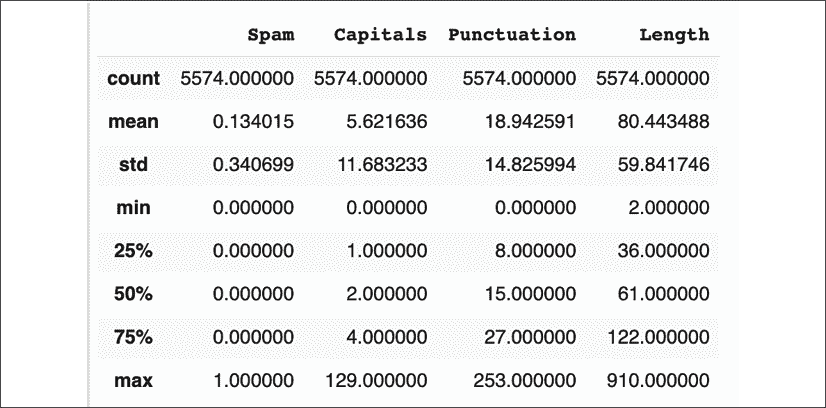
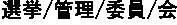
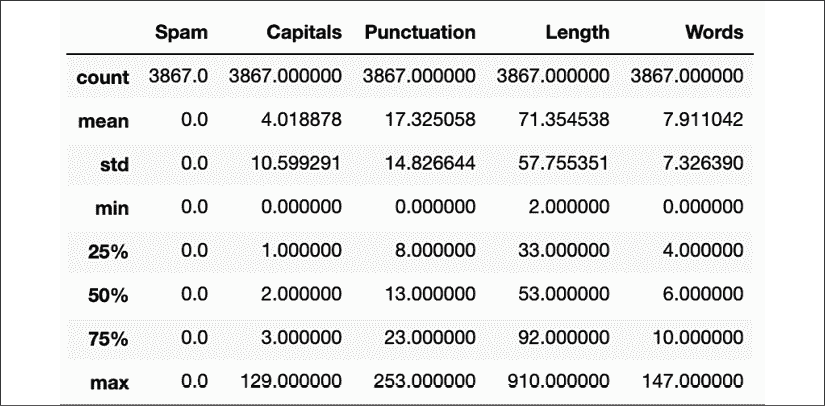

# 第一章：NLP 基础

语言一直是人类进化的一部分。语言的发展使得人们和部落之间的交流变得更加顺畅。书面语言的演变，最初是洞穴壁画，后来变成字符，使信息能够被提炼、存储并从一代传递到另一代。有些人甚至会说，技术进步的曲线之所以呈现曲棍球棒形态，是因为信息的累积存储不断增长。随着这个存储的信息库越来越大，使用计算方法处理和提炼数据的需求变得更加迫切。在过去的十年里，图像和语音识别领域取得了许多进展。**自然语言处理**（**NLP**）的进展则较为近期，尽管 NLP 的计算方法已经是几十年的研究领域。处理文本数据需要许多不同的构建模块，基于这些模块可以构建高级模型。这些构建模块本身可能相当具有挑战性和复杂性。本章和下一章将重点介绍这些构建模块以及通过简单模型可以解决的问题。

本章将重点介绍文本预处理的基础知识，并构建一个简单的垃圾邮件检测器。具体来说，我们将学习以下内容：

+   典型的文本处理工作流

+   数据收集与标注

+   文本规范化，包括大小写规范化、文本分词、词干提取和词形还原

    +   建模已进行文本规范化的数据集

    +   文本向量化

    +   使用向量化文本的建模数据集

让我们从掌握大多数 NLP 模型所使用的文本处理工作流开始。

# 一个典型的文本处理工作流

要理解如何处理文本，首先要了解 NLP 的通用工作流。下图说明了基本步骤：


图 1.1：文本处理工作流的典型阶段

前述图表的前两步涉及收集标注数据。监督模型甚至半监督模型需要数据来操作。接下来的步骤通常是对数据进行规范化和特征化处理。模型处理文本数据时往往很困难，文本中存在许多隐藏的结构，需要经过处理和揭示。这两步正是聚焦于此。最后一步是基于处理过的输入数据构建模型。尽管 NLP 有一些独特的模型，本章仅使用一个简单的深度神经网络，更多关注规范化和向量化/特征化。通常，最后三个阶段会在一个循环中操作，尽管图表可能给人线性进行的印象。在工业界，额外的特性需要更多的开发工作和资源来维持运行。因此，特性必须带来价值。采用这种方法，我们将使用一个简单的模型来验证不同的规范化/向量化/特征化步骤。现在，让我们详细看看这些阶段。

# 数据收集和标记

**机器学习**（**ML**）项目的第一步是获取数据集。在文本领域，幸运的是，可以找到大量的数据。一个常见的方法是使用诸如`scrapy`或 Beautiful Soup 之类的库从网络上爬取数据。然而，这些数据通常是未标记的，因此不能直接在监督模型中使用。尽管如此，这些数据非常有用。通过使用迁移学习，可以使用无监督或半监督的方法训练语言模型，并且可以进一步使用特定于手头任务的小训练数据集。在第三章中，*使用 BiLSTMs、CRFs 和 Viterbi 解码进行命名实体识别（NER）*，我们将更深入地讨论迁移学习使用 BERT 嵌入的问题。

在标记步骤中，从数据收集步骤获取的文本数据会被标记为正确的类别。让我们举几个例子。如果任务是构建一个用于电子邮件的垃圾邮件分类器，那么前一步将涉及收集大量的电子邮件。这个标记步骤将是给每封电子邮件附上一个*垃圾*或*非垃圾*的标签。另一个例子可能是在推特上进行情感检测。数据收集步骤将涉及收集一些推特。这一步将会给每条推特打上一个充当事实依据的标签。一个更复杂的例子可能涉及收集新闻文章，其中标签将是文章的摘要。另一个这种情况的例子可能是电子邮件自动回复功能。与垃圾邮件案例类似，需要收集一些带有回复的电子邮件。在这种情况下，标签将是一些短文本，用来近似回复。如果您在一个没有太多公开数据的特定领域工作，您可能需要自己完成这些步骤。

鉴于文本数据通常是可用的（除了像健康这样的特定领域），标记通常是最大的挑战。标记数据可能非常耗时或资源密集。最近已经有很多关注使用半监督方法来标记数据。在第七章中，*多模态网络和使用 ResNets 和 Transformer 进行图像字幕生成*，我们将介绍使用半监督方法和**snorkel**库来大规模标记数据的一些方法。

网络上有许多常用的数据集可以用来训练模型。通过迁移学习，这些通用数据集可以用来为机器学习模型提供初步训练，然后你可以使用少量特定领域的数据来微调模型。使用这些公开可用的数据集为我们带来了一些优势。首先，所有的数据收集工作已经完成。其次，标签已经做好。最后，使用这些数据集可以与当前最先进的技术进行结果比较；大多数论文会在其研究领域使用特定的数据集，并发布基准测试。例如，**斯坦福问答数据集**（简称**SQuAD**）通常作为问答模型的基准。这也是一个很好的训练数据源。

## 收集标注数据

在本书中，我们将依赖公开的数据集。适当的数据集将在各自的章节中指出，并附带下载说明。为了构建一个垃圾邮件检测系统，我们将使用加利福尼亚大学欧文分校提供的 SMS 垃圾邮件数据集。这个数据集可以通过下面提示框中的说明进行下载。每条短信都被标记为“SPAM”或“HAM”，其中“HAM”表示这不是垃圾邮件。

加利福尼亚大学欧文分校是机器学习数据集的一个重要来源。你可以访问[`archive.ics.uci.edu/ml/datasets.php`](http://archive.ics.uci.edu/ml/datasets.php)查看他们提供的所有数据集。特别是对于自然语言处理（NLP），你可以在[`github.com/niderhoff/nlp-datasets`](https://github.com/niderhoff/nlp-datasets)找到一些公开的数据集。

在我们开始处理数据之前，需要先设置开发环境。让我们快速设置开发环境。

### 开发环境设置

在本章中，我们将使用 Google Colaboratory，简称 Colab，来编写代码。你可以使用你的 Google 账户，或者注册一个新账户。Google Colab 是免费的，不需要配置，同时也提供 GPU 访问。用户界面与 Jupyter 笔记本非常相似，因此应该很熟悉。要开始使用，请使用支持的浏览器访问[colab.research.google.com](http://colab.research.google.com)。页面应类似于下面的截图：


图 1.2：Google Colab 网站

下一步是创建一个新的笔记本。这里有几种选择。第一个选项是在 Colab 中创建一个新的笔记本，并按照章节中的步骤输入代码。第二个选项是将本地磁盘中的笔记本上传到 Colab。也可以从 GitHub 拉取笔记本到 Colab，具体过程可以参考 Colab 网站。为了本章目的，书中的 GitHub 仓库中，`chapter1-nlp-essentials` 文件夹下有一个完整的名为 `SMS_Spam_Detection.ipynb` 的笔记本。请通过点击**文件 | 上传笔记本**将该笔记本上传到 Google Colab。笔记本的特定部分将在章节的提示框中提到。创建笔记本的详细步骤已在主要描述中列出。

点击左上角的**文件**菜单选项，然后点击**新建笔记本**。一个新的笔记本将在新的浏览器标签页中打开。点击左上角的笔记本名称，位于**文件**菜单选项正上方，将其编辑为 `SMS_Spam_Detection`。现在，开发环境已经设置完成，可以开始加载数据了。

首先，让我们编辑笔记本的第一行并导入 TensorFlow 2。请输入以下代码到第一个单元格并执行：

```py
%tensorflow_version 2.x
import tensorflow as tf
import os
import io
tf.__version__ 
```

执行此单元格后输出应如下所示：

```py
TensorFlow 2.x is selected.
'2.4.0' 
```

这确认了 TensorFlow 库的 2.4.0 版本已加载。前面代码块中突出显示的那行是 Google Colab 的魔法命令，指示它使用 TensorFlow 2+ 版本。下一步是下载数据文件并将其解压到 Colab 笔记本的云端位置。

加载数据的代码位于笔记本的*下载数据*部分。还要注意，本文写作时，TensorFlow 的发布版本为 2.4。

可以使用以下代码完成这一操作：

```py
# Download the zip file
path_to_zip = tf.keras.utils.get_file("smsspamcollection.zip",
origin="https://archive.ics.uci.edu/ml/machine-learning-databases/00228/smsspamcollection.zip",
                  extract=True)
# Unzip the file into a folder
!unzip $path_to_zip -d data 
```

以下输出确认了数据已经下载并解压：

```py
Archive:  /root/.keras/datasets/smsspamcollection.zip
  inflating: data/SMSSpamCollection  
  inflating: data/readme 
```

读取数据文件非常简单：

```py
# Let's see if we read the data correctly
lines = io.open('data/SMSSpamCollection').read().strip().split('\n')
lines[0] 
```

最后一行代码显示了一条数据示例：

```py
'ham\tGo until jurong point, crazy.. Available only in bugis n great world' 
```

这个示例标记为非垃圾邮件。下一步是将每一行分成两列——一列是消息的文本，另一列是标签。在分离这些标签的同时，我们还将标签转换为数值。由于我们要预测垃圾邮件，所以我们可以为垃圾邮件分配值 `1`。合法邮件将分配值 `0`。

这部分的代码在笔记本的*数据预处理*部分。

请注意，以下代码为清晰起见，做了详细描述：

```py
spam_dataset = []
for line in lines:
  label, text = line.split('\t')
  if label.strip() == 'spam':
    spam_dataset.append((1, text.strip()))
  else:
    spam_dataset.append(((0, text.strip())))
print(spam_dataset[0]) 
```

```py
(0, 'Go until jurong point, crazy.. Available only in bugis n great world la e buffet... Cine there got amore wat...') 
```

现在，数据集已经准备好可以进一步在管道中处理了。不过，让我们稍作绕行，看看如何在 Google Colab 中配置 GPU 访问。

## 在 Google Colab 上启用 GPU

使用 Google Colab 的一个优势是可以访问免费的 GPU 来处理小任务。GPU 对于 NLP 模型的训练时间影响很大，尤其是使用**递归神经网络**（**RNNs**）的模型。启用 GPU 访问的第一步是启动一个运行时，这可以通过在笔记本中执行一个命令来完成。然后，点击 **Runtime** 菜单选项并选择 **Change Runtime** 选项，如下图所示：


图 1.3：Colab 运行时设置菜单选项

接下来，将弹出一个对话框，如下图所示。展开 **Hardware Accelerator** 选项并选择 **GPU**：


图 1.4：在 Colab 上启用 GPU

现在，你应该可以在 Colab 笔记本中使用 GPU 了！在 NLP 模型中，特别是使用 RNN 时，GPU 可以大幅减少训练时间，节省数分钟或数小时。

现在，让我们将注意力重新集中在已经加载并准备好进一步处理的数据上，以便用于模型。

# 文本归一化

文本归一化是一个预处理步骤，旨在提高文本质量，使其适合机器处理。文本归一化的四个主要步骤包括大小写归一化、标记化和停用词移除、**词性**（**POS**）标注和词干提取。

大小写归一化适用于使用大写字母和小写字母的语言。所有基于拉丁字母或西里尔字母的语言（如俄语、蒙古语等）都使用大小写字母。其他偶尔使用这种方式的语言包括希腊语、亚美尼亚语、切罗基语和科普特语。在大小写归一化中，所有字母都会转换为相同的大小写。这在语义应用中非常有帮助。然而，在其他情况下，这可能会影响性能。在垃圾邮件示例中，垃圾邮件的消息通常包含更多的大写字母。

另一个常见的归一化步骤是移除文本中的标点符号。同样，这可能对当前问题有用，也可能没有用。在大多数情况下，这应该会产生良好的结果。然而，在某些情况下，比如垃圾邮件或语法模型，它可能会影响性能。垃圾邮件更有可能使用更多的感叹号或其他标点符号来进行强调。

这一部分的代码在笔记本的 *Data Normalization* 部分。

我们来构建一个基准模型，使用三个简单的特征：

+   消息中的字符数量

+   消息中的大写字母数量

+   消息中的标点符号数量

为此，首先，我们将数据转换为一个`pandas` DataFrame：

```py
import pandas as pd
df = pd.DataFrame(spam_dataset, columns=['Spam', 'Message']) 
```

接下来，让我们构建一些简单的函数，计算消息的长度、首字母大写字母的数量和标点符号的数量。Python 的正则表达式包 `re` 将用于实现这些功能：

```py
import re
def message_length(x):
  # returns total number of characters
  return len(x)
def num_capitals(x):
 **_, count = re.subn(****r'[A-Z]'****,** **''****, x)** **# only works in english**
  return count
def num_punctuation(x):
  _, count = re.subn(r'\W', '', x)
  return count 
```

在`num_capitals()`函数中，针对英语中的大写字母进行替换操作。这些替换的`count`值即为大写字母的数量。相同的技术也用于统计标点符号的数量。请注意，计数大写字母的方法仅适用于英语。

将会向 DataFrame 添加额外的特征列，然后将数据集拆分为测试集和训练集：

```py
df['Capitals'] = df['Message'].apply(num_capitals)
df['Punctuation'] = df['Message'].apply(num_punctuation)
df['Length'] = df['Message'].apply(message_length)
df.describe() 
```

这应该生成以下输出：



图 1.5：初始垃圾邮件模型的基础数据集

以下代码可用于将数据集拆分为训练集和测试集，其中 80%的记录用于训练集，剩余的用于测试集。此外，还会从训练集和测试集中删除标签：

```py
train=df.sample(frac=0.8,random_state=42)
test=df.drop(train.index)
x_train = train[['Length', 'Capitals', 'Punctuation']]
y_train = train[['Spam']]
x_test = test[['Length', 'Capitals', 'Punctuation']]
y_test = test[['Spam']] 
```

现在我们准备构建一个简单的分类器来使用这些数据。

## 建模规范化数据

请回忆建模是前面描述的文本处理流程的最后一步。在本章中，我们将使用一个非常简单的模型，因为我们的目标更多的是展示不同的基础 NLP 数据处理技术，而不是建模。在这里，我们想看看三个简单特征是否能帮助垃圾邮件的分类。随着更多特征的加入，通过相同的模型进行测试将帮助我们了解这些特征化是否有助于提高分类的准确性，或者是否会影响准确性。

工作簿的*模型构建*部分包含本节所示的代码。

定义了一个函数，允许构建具有不同输入和隐藏单元数量的模型：

```py
# Basic 1-layer neural network model for evaluation
def make_model(input_dims=3, num_units=12):
  model = tf.keras.Sequential()
  # Adds a densely-connected layer with 12 units to the model:
  model.add(tf.keras.layers.Dense(num_units, 
                                  input_dim=input_dims,
                                  activation='relu'))
  # Add a sigmoid layer with a binary output unit:
  model.add(tf.keras.layers.Dense(1, activation='sigmoid'))
  model.compile(loss='binary_crossentropy', optimizer='adam', 
                metrics=['accuracy'])
  return model 
```

该模型使用二元交叉熵计算损失，并使用 Adam 优化器进行训练。由于这是一个二分类问题，关键指标是准确率。传递给函数的默认参数足够，因为只传递了三个特征。

我们可以仅使用三个特征来训练我们的简单基线模型，如下所示：

```py
model = make_model()
model.fit(x_train, y_train, epochs=10, batch_size=10) 
```

```py
Train on 4459 samples
Epoch 1/10
4459/4459 [==============================] - 1s 281us/sample - loss: 0.6062 - accuracy: 0.8141
Epoch 2/10
…
Epoch 10/10
4459/4459 [==============================] - 1s 145us/sample - loss: 0.1976 - accuracy: 0.9305 
```

这并不差，因为我们的三个简单特征帮助我们达到了 93%的准确率。快速检查显示测试集中有 592 条垃圾邮件，所有邮件总数为 4,459 条。因此，这个模型比一个非常简单的模型要好，后者会将所有邮件都预测为非垃圾邮件。那个模型的准确率是 87%。这个数字可能让人吃惊，但在数据中存在严重类别不平衡的分类问题中，这种情况是相当常见的。在训练集上的评估给出了大约 93.4%的准确率：

```py
model.evaluate(x_test, y_test) 
```

```py
1115/1115 [==============================] - 0s 94us/sample - loss: 0.1949 - accuracy: 0.9336
[0.19485870356516988, 0.9336323] 
```

请注意，您看到的实际性能可能会因为数据拆分和计算偏差而略有不同。可以通过绘制混淆矩阵来快速验证性能：

```py
y_train_pred = model.predict_classes(x_train)
# confusion matrix
tf.math.confusion_matrix(tf.constant(y_train.Spam), 
                         y_train_pred)
<tf.Tensor: shape=(2, 2), dtype=int32, numpy=
array([[3771,   96],
      [ 186,  406]], dtype=int32)> 
```

|  | 预测为非垃圾邮件 | 预测为垃圾邮件 |
| --- | --- | --- |
| 实际非垃圾邮件 | 3,771 | 96 |
| 实际垃圾邮件 | 186 | 406 |

这显示了 3,771 条常规消息中的 3,867 条被正确分类，而 592 条垃圾邮件中的 406 条被正确分类。同样，您可能会得到略有不同的结果。

为了测试特征的价值，尝试通过去除某个特征（如标点符号或多个大写字母）重新运行模型，以了解这些特征对模型的贡献。这留给读者作为练习。

## 分词

这个步骤将一段文本转换成一个标记的列表。如果输入的是句子，那么将句子分割成单词就是分词的一个例子。根据模型的不同，可以选择不同的粒度。在最低级别，每个字符都可以成为一个标记。在某些情况下，整句或段落可以作为一个标记：


图 1.6：分词一个句子

上面的图示展示了两种分词方法。一种方法是将句子拆分成单词。另一种方法是将句子拆分成单独的字符。然而，在一些语言中，如日语和普通话，这可能是一个复杂的任务。

### 日语中的分割

许多语言使用空格作为词的分隔符，这使得基于词的分词任务变得简单。然而，也有一些语言不使用任何标记或分隔符来区分单词。例如，日语和中文就是这样的语言。在这些语言中，这一任务被称为*分割*。

具体来说，在日语中，主要有三种不同类型的字符：*平假名*、*汉字*和*片假名*。汉字源自中文字符，和中文一样，汉字有成千上万的字符。平假名用于语法元素和日语本土词汇。片假名主要用于外来词和人名。根据前面的字符，某个字符可能是现有单词的一部分，或者是新词的开始。这使得日语成为世界上最复杂的书写系统之一。复合词尤其难。考虑以下复合词，表示*选举管理委员会*：


这可以通过两种不同的方式进行分词，除了将整个短语视为一个词。以下是使用 Sudachi 库进行分词的两个示例：

 (选举 / 管理 / 委员会)

 (选举 / 管理 / 委员会 / 会议)

专门用于日语分割或分词的常见库有 MeCab、Juman、Sudachi 和 Kuromoji。MeCab 被 Hugging Face、spaCy 和其他库使用。

本节展示的代码位于笔记本的*分词和停用词移除*部分。

幸运的是，大多数语言不像日语那样复杂，使用空格来分隔单词。在 Python 中，通过空格分割是非常简单的。让我们看一个例子：

```py
Sentence = 'Go until Jurong point, crazy.. Available only in bugis n great world'
sentence.split() 
```

前面的分割操作的输出结果如下：

```py
['Go',
 'until',
 'jurong',
 **'point,',
 'crazy..',**
 'Available',
 'only',
 'in',
 'bugis',
 'n',
 'great',
 'world'] 
```

上述输出中两个高亮的行显示，Python 中的简单方法会导致标点符号被包含在单词中，等等。因此，这一步是通过像 StanfordNLP 这样的库来完成的。使用 `pip`，我们可以在 Colab 笔记本中安装此包：

```py
!pip install stanfordnlp 
```

StanfordNLP 包使用 PyTorch 底层支持，同时还使用了一些其他包。这些包和其他依赖项将会被安装。默认情况下，该包不会安装语言文件，这些文件需要手动下载。以下代码展示了这一过程：

```py
Import stanfordnlp as snlp
en = snlp.download('en') 
```

英文文件大约为 235 MB。在下载前会显示提示，确认下载并选择存储位置：


图 1.7：下载英文模型的提示

Google Colab 在不活动时会回收运行时。这意味着如果你在不同的时间执行书中的命令，你可能需要重新执行每个命令，从头开始，包括下载和处理数据集、下载 StanfordNLP 的英文文件等等。一个本地的笔记本服务器通常会保持运行时的状态，但可能处理能力有限。对于本章中的简单示例，Google Colab 是一个不错的解决方案。对于书中后续的更高级示例，其中训练可能需要几个小时或几天，本地运行时或运行在云端的**虚拟机**（**VM**）会更合适。

这个包提供了开箱即用的分词、词性标注和词形还原功能。为了开始分词，我们实例化一个管道并对一个示例文本进行分词，看看这个过程是如何工作的：

```py
en = snlp.Pipeline(lang='en', processors='tokenize') 
```

`lang` 参数用于指示所需的英文管道。第二个参数 `processors` 指示管道中所需的处理类型。这个库还可以执行以下处理步骤：

+   `pos` 为每个词元标注一个词性标签（POS）。下一部分将提供更多关于词性标签的细节。

+   `lemma`，它可以将动词的不同形式转换为基本形式。例如，这将在本章后面的*词干提取与词形还原*部分中详细介绍。

+   `depparse` 执行句子中单词的依存句法分析。考虑以下示例句子：“Hari went to school。”*Hari* 被词性标注器解释为名词，并成为动词 *went* 的主词。*school* 是 *went* 的依赖词，因为它描述了动词的宾语。

目前，只需要进行文本分词，所以只使用分词器：

```py
tokenized = en(sentence)
len(tokenized.sentences) 
```

```py
2 
```

这表明分词器正确地将文本分成了两个句子。为了调查删除了哪些单词，可以使用以下代码：

```py
for snt in tokenized.sentences:
  for word in snt.tokens:
    print(word.text)
  print("<End of Sentence>") 
```

```py
Go
until
jurong
**point
,
crazy**
..
<End of Sentence>
Available
only
in
bugis
n
great
world
<End of Sentence> 
```

注意上述输出中标记的单词。标点符号被分离为独立的单词。文本被拆分为多个句子。这比仅使用空格进行拆分有所改进。在某些应用中，可能需要删除标点符号。这个问题将在下一节中讲解。

考虑上述日语示例。为了查看 StanfordNLP 在日语分词上的表现，可以使用以下代码片段：

```py
jp = snlp.download('ja') 
```

这是第一步，涉及下载日语语言模型，类似于之前下载并安装的英语模型。接下来，将实例化一个日语处理管道，单词将会被处理：

```py
jp = snlp.download('ja')
jp_line = jp("") 
```

你可能记得，日文文本的内容是“选举管理委员会”。正确的分词应该生成三个单词，其中前两个单词各包含两个字符，最后一个单词包含三个字符：

```py
for snt in jp_line.sentences:
  for word in snt.tokens:
    print(word.text) 
```

```py
 
```

这与预期输出匹配。StanfordNLP 支持 53 种语言，因此相同的代码可以用于分词任何受支持的语言。

回到垃圾邮件检测的例子，可以实现一个新特征，使用此分词功能来计算消息中的单词数。

这个字数特征是在笔记本中的 *添加字数特征* 部分实现的。

可能垃圾邮件的单词数量与常规邮件不同。第一步是定义一个方法来计算单词数：

```py
en = snlp.Pipeline(lang='en')
def word_counts(x, pipeline=en):
  doc = pipeline(x)
  count = sum([len(sentence.tokens) for sentence in doc.sentences])
  return count 
```

接下来，使用训练和测试数据集的划分，添加一个字数特征列：

```py
train['Words'] = train['Message'].apply(word_counts)
test['Words'] = test['Message'].apply(word_counts)
x_train = train[['Length', 'Punctuation', 'Capitals', 'Words']]
y_train = train[['Spam']]
x_test = test[['Length', 'Punctuation', 'Capitals' , 'Words']]
y_test = test[['Spam']]
model = make_model(input_dims=4) 
```

上述代码块中的最后一行创建了一个具有四个输入特征的新模型。

**PyTorch 警告**

当你在 StanfordNLP 库中执行函数时，可能会看到如下警告：

```py
`/pytorch/aten/src/ATen/native/LegacyDefinitions.cpp:19: UserWarning: masked_fill_ received a mask with dtype torch.uint8, this behavior is now deprecated,please use a mask with dtype torch.bool instead.` 
```

在内部，StanfordNLP 使用了 PyTorch 库。这个警告是因为 StanfordNLP 使用了一个现在已经弃用的函数的旧版本。对于所有实际目的而言，这个警告可以忽略。预计 StanfordNLP 的维护者会更新他们的代码。

### 对分词数据进行建模

这个模型可以通过以下方式进行训练：

```py
model.fit(x_train, y_train, epochs=10, batch_size=10)
Train on 4459 samples
Epoch 1/10
4459/4459 [==============================] - 1s 202us/sample - loss: 2.4261 - accuracy: 0.6961
...
Epoch 10/10
4459/4459 [==============================] - 1s 142us/sample - loss: 0.2061 - accuracy: 0.9312 
```

准确度的提高只是微乎其微。一种假设是，单词的数量没有太大用处。如果垃圾邮件的平均单词数比常规消息的单词数要小或大，那将是有用的。使用 pandas 可以快速验证这一点：

```py
train.loc[train.Spam == 1].describe() 
```


图 1.8：垃圾邮件特征的统计数据

让我们将上述结果与常规消息的统计数据进行比较：

```py
train.loc[train.Spam == 0].describe() 
```


图 1.9：常规消息特征的统计数据

一些有趣的模式可以迅速被发现。垃圾邮件通常与平均值的偏差较小。关注**大写字母**特征列。它显示正常邮件使用的首字母大写远少于垃圾邮件。在第 75 百分位，正常邮件有 3 个大写字母，而垃圾邮件有 21 个。平均而言，正常邮件有 4 个大写字母，而垃圾邮件有 15 个。在单词数量类别中，这种变化就不那么明显了。正常邮件平均有 17 个单词，而垃圾邮件有 29 个。在第 75 百分位，正常邮件有 22 个单词，而垃圾邮件有 35 个。这次快速检查表明，为什么添加单词特征没有那么有用。然而，仍然有几点需要考虑。首先，分词模型将标点符号分割成单词。理想情况下，这些标点符号应该从单词计数中移除，因为标点特征显示垃圾邮件使用了更多的标点符号字符。这将在*词性标注*部分中介绍。其次，语言中有一些常见的词汇通常会被排除。这被称为停用词移除，也是下一部分的重点。

## 停用词移除

停用词移除涉及去除常见的词汇，如冠词（the, an）和连接词（and, but）等。在信息检索或搜索的上下文中，这些词汇对于识别与查询匹配的文档或网页没有帮助。例如，考虑查询“Google 的总部在哪里？”。在这个查询中，*is*是一个停用词。无论是否包括*is*，查询结果都会是相似的。为了确定停用词，一种简单的方法是使用语法线索。

在英语中，冠词和连接词是通常可以移除的词类的例子。一种更强大的方法是考虑词汇在语料库、文档集或文本中的出现频率。最常出现的词汇可以被选为停用词列表的候选词。建议手动审查这个列表。有些情况下，某些词汇在文档集合中可能出现频繁，但仍然具有意义。如果所有文档来自特定领域或特定主题，这种情况可能会发生。考虑来自联邦储备的文档集。词汇*economy*在这种情况下可能会出现得非常频繁；然而，它不太可能作为停用词被移除。

在某些情况下，停用词可能实际上包含有用的信息。这可能适用于短语。例如，考虑“飞往巴黎的航班”这个片段。在这种情况下，*to*提供了有价值的信息，移除它可能会改变这个片段的含义。

回顾文本处理工作流的各个阶段。文本规范化后的步骤是向量化。这个步骤将在本章的*文本向量化*部分中详细讨论，但向量化的关键步骤是构建所有词元的词汇表或字典。通过移除停用词，可以减少词汇表的大小。在训练和评估模型时，去除停用词会减少需要执行的计算步骤。因此，去除停用词在计算速度和存储空间方面可以带来好处。现代 NLP 的进展使得停用词列表越来越小，随着更高效的编码方案和计算方法的发展，停用词列表也变得更加精简。让我们尝试并查看停用词对垃圾邮件问题的影响，以便更好地理解其有用性。

许多 NLP 包提供停用词的列表。可以在分词后从文本中移除这些停用词。分词之前是通过 StanfordNLP 库完成的。然而，这个库并没有提供停用词的列表。NLTK 和 spaCy 为多种语言提供停用词。在这个例子中，我们将使用一个叫做`stopwordsiso`的开源包。

笔记本中的*停用词移除*部分包含了这一部分的代码。

这个 Python 包从[`github.com/stopwords-iso/stopwords-iso`](https://github.com/stopwords-iso/stopwords-iso)的 stopwords-iso GitHub 项目中获取停用词列表。该包提供了 57 种语言的停用词。第一步是安装提供停用词列表的 Python 包。

以下命令将通过笔记本安装该包：

```py
!pip install stopwordsiso 
```

可以使用以下命令检查支持的语言：

```py
import stopwordsiso as stopwords
stopwords.langs() 
```

英语的停用词也可以检查，以了解其中的一些词汇：

```py
sorted(stopwords.stopwords('en')) 
```

```py
"'ll",
 "'tis",
 "'twas",
 "'ve",
 '10',
 '39',
 'a',
 "a's",
 'able',
 'ableabout',
 'about',
 'above',
 'abroad',
 'abst',
 'accordance',
 'according',
 'accordingly',
 'across',
 'act',
 'actually',
 'ad',
 'added',
... 
```

鉴于分词已经在前面的`word_counts()`方法中实现，可以更新该方法的实现，加入移除停用词的步骤。然而，所有的停用词都是小写字母。之前讨论过的大小写规范化对垃圾邮件检测来说是一个有用的特征。在这种情况下，词元需要转换为小写字母才能有效地去除它们：

```py
en_sw = stopwords.stopwords('en')
def word_counts(x, pipeline=en):
  doc = pipeline(x)
  count = 0
  for sentence in doc.sentences:
    for token in sentence.tokens:
        if token.text.lower() not in en_sw:
          count += 1
  return count 
```

使用停用词的一个后果是，像“你什么时候骑自行车？”这样的消息只算作 3 个词。当我们查看这是否对单词长度的统计数据产生了影响时，出现了以下情况：



图 1.11：去除停用词后的常规消息的单词计数

将这些统计数据与去除停用词前的数据进行比较，平均单词数已经减半，接近 8 个。最大单词数也从 209 减少到了 147。常规消息的标准差与其均值差不多，表明常规消息中单词数量变化较大。现在，让我们看看这是否有助于我们训练一个模型并提高其准确度。

### 去除停用词后的数据建模

现在，去除停用词后的特征已经计算出来，可以将其加入模型中，看看它的影响：

```py
train['Words'] = train['Message'].apply(word_counts)
test['Words'] = test['Message'].apply(word_counts)
x_train = train[['Length', 'Punctuation', 'Capitals', 'Words']]
y_train = train[['Spam']]
x_test = test[['Length', 'Punctuation', 'Capitals', 'Words']]
y_test = test[['Spam']]
model = make_model(input_dims=4)
model.fit(x_train, y_train, epochs=10, batch_size=10) 
```

```py
Epoch 1/10
4459/4459 [==============================] - 2s 361us/sample - loss: 0.5186 - accuracy: 0.8652
Epoch 2/10
...
Epoch 9/10
4459/4459 [==============================] - 2s 355us/sample - loss: 0.1790 - accuracy: 0.9417
Epoch 10/10
4459/4459 [==============================] - 2s 361us/sample - loss: 0.1802 - accuracy: 0.9421 
```

这一准确度相较于之前的模型有了轻微的提升：

```py
model.evaluate(x_test, y_test) 
```

```py
1115/1115 [==============================] - 0s 74us/sample - loss: 0.1954 - accuracy: 0.9372
 [0.19537461110027382, 0.93721974] 
```

在自然语言处理（NLP）中，停用词去除曾经是标准做法。在现代应用中，停用词可能实际上会在某些使用场景中阻碍性能，而不是帮助提升。现在不排除停用词已经变得更加常见。根据你解决的问题，停用词去除可能会有帮助，也可能没有帮助。

请注意，StanfordNLP 会将像*can't*这样的词分开成*ca*和*n't*。这表示将缩写词扩展为其组成部分，即*can*和*not*。这些缩写词可能出现在停用词列表中，也可能不在。实现更健壮的停用词检测器是留给读者的一个练习。

StanfordNLP 使用带有 **双向长短期记忆**（**BiLSTM**）单元的监督 RNN。该架构使用词汇表通过词汇的向量化生成词嵌入。词汇的向量化和词嵌入的生成将在本章后面的*向量化文本*部分讲解。这种带有词嵌入的 BiLSTM 架构通常是 NLP 任务的常见起点。后续章节中将详细讲解并使用该架构。这种特定的分词架构被认为是截至本书写作时的最先进技术。在此之前，基于**隐马尔可夫模型**（**HMM**）的模型曾经很流行。

根据所涉及的语言，基于正则表达式的分词也是一种方法。NLTK 库提供了基于正则表达式的 Penn Treebank 分词器，该分词器使用 `sed` 脚本实现。在后续章节中，将会解释其他分词或分段方案，如**字节对编码**（**BPE**）和 WordPiece。

文本标准化的下一个任务是通过词性标注理解文本的结构。

## 词性标注

语言具有语法结构。在大多数语言中，单词可以主要分为动词、副词、名词和形容词。这个处理步骤的目标是对一段文本中的每个单词进行词性标注。请注意，这只有在处理词级标记时才有意义。常见的，Penn Treebank 词性标注器被包括 StanfordNLP 在内的库用来标注单词。根据惯例，词性标注通过在单词后加上一个斜杠后缀的代码来添加。例如，`NNS` 是复数名词的标记。如果遇到 `goats` 这个词，它会被表示为 `goats/NNS`。在 StanfordNLP 库中，使用的是 **通用词性** (**UPOS**) 标记。以下是 UPOS 标记集的一部分。有关标准词性标记与 UPOS 标记映射的更多细节，请参见 [`universaldependencies.org/docs/tagset-conversion/en-penn-uposf.html`](https://universaldependencies.org/docs/tagset-conversion/en-penn-uposf.html)。以下是最常见的标记表：

| 标记 | 类别 | 示例 |
| --- | --- | --- |
| ADJ | **形容词**：通常描述名词。比较级和最高级使用不同的标记。 | 很棒，漂亮 |
| ADP | **介词**：用来修饰名词、代词或短语等对象；例如，“**上**楼”。像英语这样的语言使用介词，而像印地语和日语等语言使用后置词。 | 上，里面 |
| ADV | **副词**：修饰或限定形容词、动词或其他副词的词或短语。 | 大声地，经常 |
| AUX | **助动词**：用来构成其他动词的语气、语态或时态。 | 将，会，可能 |
| CCONJ | **并列连词**：连接两个短语、从句或句子。 | 和，但，那 |
| INTJ | **感叹词**：表达惊讶、打断或突然的评论。 | 哦，呃，哈哈 |
| NOUN | **名词**：指代人、地点或事物。 | 办公室，书 |
| NUM | **数词**：表示数量。 | 六，九 |
| DET | **限定词**：确定特定的名词，通常是单数形式。 | 一个，某个，那个 |
| PART | **助词**：属于主要词性之外的词类。 | 到，不能 |
| PRON | **代词**：替代其他名词，尤其是专有名词。 | 她，她的 |
| PROPN | **专有名词**：指代特定的人员、地点或事物的名称。 | 甘地，美国 |
| PUNCT | 不同的标点符号。 | ，？ / |
| SCONJ | **从属连词**：连接独立从句和依赖从句。 | 因为，虽然 |
| SYM | 符号，包括货币符号、表情符号等。 | $，#，% :) |
| VERB | **动词**：表示动作或发生的事情。 | 去，做 |
| X | **其他**：无法归类到其他类别的内容。 | 等等，4.（编号列表项） |

最好的理解词性标注工作原理的方法是尝试一下：

本部分的代码位于笔记本的 *POS 基础特征* 部分。

```py
en = snlp.Pipeline(lang='en')
txt = "Yo you around? A friend of mine's lookin."
pos = en(txt) 
```

上述代码实例化了一个英语处理流程并处理了一段示例文本。下一段代码是一个可重用的函数，用于打印带有词性标记的句子标记：

```py
def print_pos(doc):
    text = ""
    for sentence in doc.sentences:
         for token in sentence.tokens:
            text += token.words[0].text + "/" + \
                    token.words[0].upos + " "
         text += "\n"
    return text 
```

这个方法可以用来调查前面示例句子的标记：

```py
print(print_pos(pos)) 
```

```py
Yo/PRON you/PRON around/ADV ?/PUNCT 
A/DET friend/NOUN of/ADP mine/PRON 's/PART lookin/NOUN ./PUNCT 
```

大部分词性标记是合理的，尽管可能存在一些不准确之处。例如，单词*lookin*被错误地标记为名词。无论是 StanfordNLP，还是其他包中的模型，都不可能做到完美。这是我们在构建使用这些特征的模型时必须考虑到的。可以通过这些词性标记构建几种不同的特征。首先，我们可以更新`word_counts()`方法，排除标点符号在单词计数中的影响。当前方法在计算单词时未考虑标点符号。还可以创建其他特征，分析消息中不同类型语法元素的比例。需要注意的是，到目前为止，所有的特征都是基于文本结构，而非内容本身。关于内容特征的工作将在本书的后续部分详细讲解。

下一步，让我们更新`word_counts()`方法，添加一个特征，用于显示消息中符号和标点符号的百分比——假设垃圾邮件消息可能使用更多标点符号和符号。还可以构建关于不同语法元素类型的其他特征。这些留给你自己实现。我们更新后的`word_counts()`方法如下：

```py
en_sw = stopwords.stopwords('en')
def word_counts_v3(x, pipeline=en):
  doc = pipeline(x)
  totals = 0.
  count = 0.
  non_word = 0.
  for sentence in doc.sentences:
    totals += len(sentence.tokens)  # (1)
    for token in sentence.tokens:
        if token.text.lower() not in en_sw:
          if token.words[0].upos not in ['PUNCT', 'SYM']:
            count += 1.
          else:
            non_word += 1.
  non_word = non_word / totals
  return pd.Series([count, non_word], index=['Words_NoPunct', 'Punct']) 
```

这个函数与之前的稍有不同。由于每一行的消息需要执行多个计算，这些操作被组合起来并返回一个带有列标签的`Series`对象。这样可以像下面这样与主数据框合并：

```py
train_tmp = train['Message'].apply(word_counts_v3)
train = pd.concat([train, train_tmp], axis=1) 
```

在测试集上可以执行类似的过程：

```py
test_tmp = test['Message'].apply(word_counts_v3)
test = pd.concat([test, test_tmp], axis=1) 
```

对训练集中垃圾邮件和非垃圾邮件消息的统计进行快速检查，首先是非垃圾邮件消息：

```py
train.loc[train['Spam']==0].describe() 
```


图 1.12：使用词性标记后的常规消息统计

然后是垃圾邮件消息：

```py
train.loc[train['Spam']==1].describe() 
```


图 1.13：使用词性标记后的垃圾邮件消息统计

一般来说，在去除停用词后，单词计数进一步减少。此外，新的`Punct`特征计算了消息中标点符号令牌相对于总令牌的比例。现在我们可以用这些数据构建一个模型。

### 使用词性标记进行数据建模

将这些特征插入模型后，得到以下结果：

```py
x_train = train[['Length', 'Punctuation', 'Capitals', 'Words_NoPunct', 'Punct']]
y_train = train[['Spam']]
x_test = test[['Length', 'Punctuation', 'Capitals' , 'Words_NoPunct', 'Punct']]
y_test = test[['Spam']]
model = make_model(input_dims=5)
# model = make_model(input_dims=3)
model.fit(x_train, y_train, epochs=10, batch_size=10) 
```

```py
Train on 4459 samples
Epoch 1/10
4459/4459 [==============================] - 1s 236us/sample - loss: 3.1958 - accuracy: 0.6028
Epoch 2/10
...
Epoch 10/10
4459/4459 [==============================] - 1s 139us/sample - loss: 0.1788 - **accuracy: 0.9466** 
```

准确率略有提高，目前达到了 94.66%。测试结果显示，它似乎成立：

```py
model.evaluate(x_test, y_test) 
```

```py
1115/1115 [==============================] - 0s 91us/sample - loss: 0.2076 - accuracy: **0.9426**
[0.20764057086989485, 0.9426009] 
```

文本规范化的最后一步是词干提取和词形还原。虽然我们不会使用此方法为垃圾邮件模型构建任何特征，但在其他情况下它非常有用。

## 词干提取和词形还原

在某些语言中，相同的词可以根据其用法呈现略有不同的形式。以单词*depend*为例，以下都是有效的*depend*形式：*depends*、*depending*、*depended*、*dependent*。这些变化通常与时态相关。在一些语言（如印地语）中，动词可能会根据不同的性别而变化。另一个例子是同一词汇的派生词，如*sympathy*、*sympathetic*、*sympathize*和*sympathizer*。这些变化在其他语言中可能有不同的形式。在俄语中，专有名词会根据用法变化其形式。假设有一篇文档讨论伦敦（Лондон）。短语*in London*（в Лондоне）中的*London*拼写方式与*from London*（из Лондона）中的*London*不同。这些*London*拼写上的变化可能会在将输入与文档中的某些部分或单词匹配时产生问题。

在处理和标记文本以构建语料库中出现的单词词汇表时，识别根词的能力可以减少词汇表的大小，同时提高匹配的准确性。在前面的俄语示例中，如果所有形式的单词都在标记化后归一化为统一的表示形式，那么*London*的任何形式都可以与其他形式匹配。这个归一化过程被称为词干提取或词形还原。

词干提取和词形还原在方法和复杂性上有所不同，但服务于相同的目标。词干提取是一种更简单的启发式基于规则的方法，它去除单词的词缀。最著名的词干提取器叫做 Porter 词干提取器，由 Martin Porter 于 1980 年发布。官方网站是[`tartarus.org/martin/PorterStemmer/`](https://tartarus.org/martin/PorterStemmer/)，这里链接了用不同语言实现的算法的各种版本。

这个词干提取器仅适用于英语，并有规则，包括移除名词复数形式的* s *，以及移除像* -ed *或* -ing *的词尾。考虑以下句子：

“词干提取的目的是减少词汇量并帮助理解形态学过程。这有助于人们理解单词的形态，并减少语料库的大小。”

使用 Porter 算法进行词干提取后，这个句子将被简化为以下内容：

“Stem is aim at reduce vocabulari and aid understand of morpholog process . Thi help peopl understand the morpholog of word and reduc size of corpu .”

请注意，*morphology*、*understand*和*reduce*的不同形式都被标记化为相同的形式。

词元化以更复杂的方式处理这个任务，利用词汇和单词的形态学分析。在语言学研究中，形态素是小于或等于一个单词的单位。当形态素本身就是一个单词时，它被称为根或自由形态素。相反，每个单词都可以分解为一个或多个形态素。形态素的研究被称为形态学。利用这些形态学信息，可以在分词后返回单词的根形式。这个单词的基础或字典形式被称为*词元*，因此这个过程被称为词元化。StanfordNLP 将词元化作为处理的一部分。

笔记本中的*词元化*部分展示了这里的代码。

这是一个简单的代码片段，用于处理前述句子并解析它们：

```py
text = "Stemming is aimed at reducing vocabulary and aid understanding of morphological processes. This helps people understand the morphology of words and reduce size of corpus."
lemma = en(text) 
```

处理后，我们可以通过迭代令牌来获取每个单词的词元。如下代码片段所示，单词的词元以每个令牌内单词的`.lemma`属性呈现。为了简化代码，这里做了一个简化假设，即每个令牌只有一个单词。

每个单词的词性（POS）也会被打印出来，帮助我们理解过程是如何进行的。以下输出中一些关键字已被突出显示：

```py
lemmas = ""
for sentence in lemma.sentences:
        for token in sentence.tokens:
            lemmas += token.words[0].lemma +"/" + \
                    token.words[0].upos + " "
        lemmas += "\n"
print(lemmas) 
```

```py
stem/NOUN be/AUX aim/VERB at/SCONJ **reduce/VERB** vocabulary/NOUN and/CCONJ aid/NOUN **understanding/NOUN** of/ADP **morphological/ADJ** process/NOUN ./PUNCT 
this/PRON help/VERB people/NOUN **understand/VERB** the/DET **morphology/NOUN** of/ADP word/NOUN and/CCONJ **reduce/VERB** size/NOUN of/ADP corpus/ADJ ./PUNCT 
```

将此输出与之前的 Porter 词干提取器的输出进行对比。一个立即可以注意到的点是，词元是真正的单词，而不像 Porter 词干提取器中那样是碎片。在*reduce*的情况下，两句话中的用法都是动词形式，因此词元选择是一致的。重点关注前面输出中的*understand*和*understanding*。如 POS 标签所示，它们分别是两种不同的形式。因此，它们没有还原为相同的词元。这与 Porter 词干提取器不同。对于*morphology*和*morphological*，也可以观察到相同的行为。这是一种非常复杂的行为。

现在文本标准化已完成，我们可以开始文本的向量化处理。

# 文本向量化

在迄今为止构建短信垃圾信息检测模型的过程中，仅考虑了基于词汇或语法特征计数或分布的聚合特征。至今为止，消息中的实际单词尚未被使用。使用消息的文本内容有几个挑战。首先，文本的长度是任意的。与图像数据相比，我们知道每张图像都有固定的宽度和高度。即使图像集合包含不同尺寸的图像，通过使用各种压缩机制，图像可以被调整为统一大小且信息损失最小。而在自然语言处理（NLP）中，这比计算机视觉要复杂得多。处理这个问题的一种常见方法是截断文本。我们将在本书中的不同示例中看到处理可变长度文本的各种方法。

第二个问题是如何用数值或特征来表示单词。在计算机视觉中，最小的单位是像素。每个像素都有一组数值表示颜色或强度。在文本中，最小的单位可能是单词。将字符的 Unicode 值聚合并不能传达或体现单词的意义。实际上，这些字符编码并不包含关于字符的任何信息，比如它的普遍性、它是辅音还是元音，等等。然而，平均化图像某一部分的像素值可能是对该区域的合理近似。这可能代表从远距离看到该区域时的样子。那么，一个核心问题就是构建单词的数值表示。向量化是将单词转换为数值向量的过程，目的是体现单词所包含的信息。根据不同的向量化技术，这些向量可能有额外的特性，使得它们可以与其他单词进行比较，正如本章后面*词向量*部分所展示的那样。

最简单的向量化方法是使用单词计数。第二种方法更为复杂，起源于信息检索，称为 TF-IDF。第三种方法相对较新，发表于 2013 年，使用 RNN 生成嵌入或单词向量。此方法称为 Word2Vec。截止到目前为止，最先进的方法是 BERT，它于 2018 年最后一个季度发布。本章将讨论前三种方法，BERT 将在*第三章*中详细讨论，*命名实体识别（NER）与 BiLSTMs、CRFs 及维特比解码*。

## 基于计数的向量化

基于计数的向量化思想其实很简单。语料库中每个唯一出现的单词都会被分配一个词汇表中的列。每个文档（对应垃圾邮件示例中的个别信息）都会分配一行。文档中出现的单词的计数会填写在对应文档和单词的单元格中。如果有`n`个独特的文档包含`m`个独特的单词，那么就会得到一个`n`行`m`列的矩阵。假设有如下的语料库：

```py
corpus = [
          "I like fruits. Fruits like bananas",
          "I love bananas but eat an apple",
          "An apple a day keeps the doctor away"
] 
```

这个语料库中有三个文档。`scikit-learn`（`sklearn`）库提供了进行基于计数的向量化的方法。

### 模拟基于计数的向量化

在 Google Colab 中，该库应该已经安装。如果在你的 Python 环境中没有安装，可以通过笔记本以如下方式安装：

```py
!pip install sklearn 
```

`CountVectorizer` 类提供了一个内置的分词器，用于分隔长度大于或等于两个字符的标记。这个类提供了多种选项，包括自定义分词器、停用词列表、将字符转换为小写字母后再进行分词的选项，以及一个二进制模式，将每个正向计数转换为 1。默认选项对于英语语料库来说提供了一个合理的选择：

```py
from sklearn.feature_extraction.text import CountVectorizer
vectorizer = CountVectorizer()
X = vectorizer.fit_transform(corpus)
vectorizer.get_feature_names() 
```

```py
['an',
 'apple',
 'away',
 'bananas',
 'but',
 'day',
 'doctor',
 'eat',
 'fruits',
 'keeps',
 'like',
 'love',
 'the'] 
```

在前面的代码中，模型被拟合到语料库上。最后一行输出的是作为列使用的标记。完整的矩阵可以如下所示：

```py
X.toarray() 
```

```py
array([[0, 0, 0, 1, 0, 0, 0, 0, 2, 0, 2, 0, 0],
       [1, 1, 0, 1, 1, 0, 0, 1, 0, 0, 0, 1, 0],
       [1, 1, 1, 0, 0, 1, 1, 0, 0, 1, 0, 0, 1]]) 
```

该过程已经将像 "I like fruits. Fruits like bananas" 这样的句子转化为一个向量（`0, 0, 0, 1, 0, 0, 0, 2, 0, 2, 0, 0`）。这是**无关上下文**向量化的一个例子。无关上下文是指文档中单词的顺序在生成向量时没有任何影响。这仅仅是对文档中单词出现的次数进行计数。因此，具有多重含义的单词可能会被归为一个类别，例如 *bank*。它可以指代河岸边的地方或存钱的地方。然而，它确实提供了一种比较文档并推导相似度的方法。可以计算两个文档之间的余弦相似度或距离，以查看哪些文档与其他文档相似：

```py
from sklearn.metrics.pairwise import cosine_similarity
cosine_similarity(X.toarray())
array([[1\.        , 0.13608276, 0\.        ],
       [0.13608276, 1\.        , 0.3086067 ],
       [0\.        , 0.3086067 , 1\.        ]]) 
```

这表明第一句和第二句的相似度分数为 0.136（0 到 1 的范围）。第一句和第三句没有任何相似之处。第二句和第三句的相似度分数为 0.308——这是这个集合中的最高值。这个技术的另一个应用场景是检查给定关键词的文档相似度。假设查询是 *apple and bananas*。第一步是计算这个查询的向量，然后计算它与语料库中各文档的余弦相似度分数：

```py
query = vectorizer.transform(["apple and bananas"])
cosine_similarity(X, query)
array([[0.23570226],
       [0.57735027],
       [0.26726124]]) 
```

这表明该查询与语料库中的第二个句子匹配最佳。第三个句子排在第二，第一个句子排名最低。通过几行代码，基本的搜索引擎已经实现，并且具备了服务查询的逻辑！在大规模的情况下，这是一个非常难的问题，因为网页爬虫中的单词或列数将超过 30 亿。每个网页都会作为一行表示，因此也需要数十亿行。计算余弦相似度并在毫秒级别内响应在线查询，同时保持矩阵内容的更新，是一项巨大的工作。

这个相对简单的向量化方案的下一步是考虑每个单词的信息内容，在构建这个矩阵时加以考虑。

## 词频-逆文档频率（TF-IDF）

在创建文档的向量表示时，只考虑了词的出现情况——并未考虑词的重要性。如果处理的文档语料库是关于水果的食谱，那么像*苹果*、*覆盆子*和*清洗*这样的词可能会频繁出现。**术语频率**（**TF**）表示某个词或标记在给定文档中出现的频率。这正是我们在前一节所做的。在一个关于水果和烹饪的文档集里，像*苹果*这样的词可能不太特定，难以帮助识别食谱。然而，像*薄脆饼*（*tuile*）这样的词在该语境中可能比较少见。因此，它可能比像*覆盆子*这样的词更快地帮助缩小食谱搜索范围。顺便说一句，不妨上网搜索一下覆盆子薄脆饼的食谱。如果一个词比较稀有，我们希望给予它更高的权重，因为它可能包含比常见词更多的信息。术语可以通过它出现的文档数量的倒数来提升权重。因此，出现在大量文档中的词将得到较小的分数，而出现在较少文档中的词则得分较高。这被称为**逆文档频率**（**IDF**）。

从数学角度看，文档中每个术语的分数可以按如下方式计算：


这里，`t`表示词或术语，`d`表示特定的文档。

通常，通过文档中所有标记的总数来规范化一个术语在文档中的 TF 值。

IDF 的定义如下：


这里，`N`代表语料库中文档的总数，`n[t]`代表术语出现的文档数量。分母中加 1 可以避免除以零的错误。幸运的是，`sklearn`提供了计算 TF-IDF 的方法。

笔记本中的*TF-IDF 向量化*部分包含此部分的代码。

让我们将前一部分中的计数转换为它们的 TF-IDF 等效值：

```py
import pandas as pd
from sklearn.feature_extraction.text import TfidfTransformer
transformer = TfidfTransformer(smooth_idf=False)
tfidf = transformer.fit_transform(X.toarray())
pd.DataFrame(tfidf.toarray(), 
             columns=vectorizer.get_feature_names()) 
```

这会产生如下输出：


这应该能帮助理解 TF-IDF 是如何计算的。即使只有三句话和一个非常有限的词汇表，每行中的许多列都是 0。这种向量化产生了**稀疏表示**。

现在，这可以应用于检测垃圾信息的问题。到目前为止，每条信息的特征已经基于一些聚合统计值进行计算，并添加到`pandas` DataFrame 中。接下来，信息的内容将被标记化，并转换为一组列。每个词或标记的 TF-IDF 分数将被计算为数组中每条信息的值。使用`sklearn`，这实际上是非常简单的，代码如下：

```py
from sklearn.feature_extraction.text import TfidfVectorizer
from sklearn. pre-processing import LabelEncoder
tfidf = TfidfVectorizer(binary=True)
X = tfidf.fit_transform(train['Message']).astype('float32')
X_test = tfidf.transform(test['Message']).astype('float32')
X.shape 
```

```py
(4459, 7741) 
```

第二个参数显示已唯一标识了 7,741 个标记。这些是稍后将在模型中使用的特征列。请注意，向量化器是通过二进制标志创建的。这意味着即使一个标记在一条消息中出现多次，它也只会被计为一次。接下来的行在训练数据集上训练 TF-IDF 模型。然后，它会根据从训练集中学到的 TF-IDF 分数转换测试集中的单词。让我们只用这些 TF-IDF 特征训练一个模型。

### 使用 TF-IDF 特征建模

使用这些 TF-IDF 特征，让我们训练一个模型并看看它的表现：

```py
_, cols = X.shape
model2 = make_model(cols)  # to match tf-idf dimensions
y_train = train[['Spam']]
y_test = test[['Spam']]
model2.fit(X.toarray(), y_train, epochs=10, batch_size=10) 
```

```py
Train on 4459 samples
Epoch 1/10
4459/4459 [==============================] - 2s 380us/sample - loss: 0.3505 - accuracy: 0.8903
...
Epoch 10/10
4459/4459 [==============================] - 1s 323us/sample - loss: 0.0027 - accuracy: 1.0000 
```

哇—我们能够正确分类每一个！说实话，模型可能存在过拟合问题，因此应该应用一些正则化。测试集给出的结果如下：

```py
model2.evaluate(X_test.toarray(), y_test) 
```

```py
1115/1115 [==============================] - 0s 134us/sample - loss: 0.0581 - accuracy: 0.9839
[0.05813191874545786, 0.9838565] 
```

98.39%的准确率迄今为止是我们在任何模型中获得的最佳结果。查看混淆矩阵，可以明显看出这个模型确实表现得非常好：

```py
y_test_pred = model2.predict_classes(X_test.toarray())
tf.math.confusion_matrix(tf.constant(y_test.Spam), 
                         y_test_pred)
<tf.Tensor: shape=(2, 2), dtype=int32, numpy=
array([[958,   2],
       [ 16, 139]], dtype=int32)> 
```

仅有 2 条常规消息被分类为垃圾邮件，而只有 16 条垃圾邮件被分类为非垃圾邮件。这确实是一个非常好的模型。请注意，这个数据集中包含了印尼语（或巴哈萨语）单词以及英语单词。巴哈萨语使用拉丁字母。这个模型没有使用大量的预训练和对语言、词汇、语法的了解，却能够在手头的任务中表现得非常合理。

然而，这种模型完全忽略了单词之间的关系。它将文档中的单词视为集合中的无序项。实际上，有更好的模型通过向量化方式保留了一些单词之间的关系，这将在下一节中进行探讨。

## 词向量

在前面的例子中，使用了一个行向量来表示文档。这被作为分类模型的特征来预测垃圾邮件标签。然而，从单词之间的关系中并不能可靠地提取到信息。在自然语言处理（NLP）中，很多研究集中在无监督地学习单词或表示。这被称为表示学习。这种方法的输出是单词在某个向量空间中的表示，单词可以被视为**嵌入**在该空间中。因此，这些词向量也被称为嵌入向量。

词向量算法背后的核心假设是，相邻出现的单词之间是相关的。为了理解这一点，考虑两个单词，*bake*（烤）和*oven*（烤箱）。假设一个包含五个单词的句子片段，其中一个单词是上述两个单词之一，另一个单词出现在其中的概率是多少？你猜测其概率可能会很高，这是正确的。现在假设单词被映射到某个二维空间中。在这个空间里，这两个单词应该彼此靠得更近，可能会远离像*astronomy*（天文学）和*tractor*（拖拉机）这样的单词。

学习这些单词的嵌入表示的任务可以被看作是在一个巨大的多维空间中调整单词，使得相似的单词彼此接近，不相似的单词彼此远离。

一种革命性的做法称为 Word2Vec。这一算法由 Tomas Mikolov 及其 Google 团队的合作伙伴于 2013 年发布。该方法通常生成 50-300 维的密集向量（虽然也有更大维度的向量），其中大多数值为非零值。相比之下，在我们之前简单的垃圾邮件示例中，TF-IDF 模型有 7,741 维。原始论文中提出了两种算法：**连续词袋模型**和**连续 Skip-Gram 模型**。在语义任务和整体表现上，Skip-Gram 模型在其发布时是最先进的。因此，带有负采样的连续 Skip-Gram 模型已经成为 Word2Vec 的代名词。该模型的直觉非常简单。

考虑这个来自食谱的句子片段：“烤至饼干表面金黄”。假设一个单词与其附近的单词相关联，可以从这个片段中选取一个单词，并训练一个分类器来预测其周围的单词：


图 1.14：以饼干为中心的 5 个单词窗口

以一个包含五个单词的窗口为例，窗口中心的单词用于预测其前后各两个单词。在前面的图中，片段是*直到饼干变金黄*，焦点是单词*饼干*。假设词汇表中有 10,000 个单词，可以训练一个网络，根据一对单词预测二元决策。训练目标是，网络对像(*饼干*, *金黄*)这样的词对预测`true`，而对像(*饼干*, *袋鼠*)这样的词对预测`false`。这种方法被称为**Skip-Gram 负采样**（**SGNS**），它大大减少了大词汇量训练所需的时间。与上一节中的单层神经网络模型非常相似，可以通过一对多的输出层训练一个模型。sigmoid 激活函数将被更改为`softmax`函数。如果隐藏层有 300 个单元，那么其维度将是 10,000 x 300，即每个单词都会有一组权重。训练的目标是学习这些权重。实际上，这些权重会在训练完成后成为该单词的嵌入表示。

隐藏层中单元数的选择是一个超参数，可以根据特定应用进行调整。300 个单元通常被采用，因为它可以通过 Google 新闻数据集上的预训练嵌入获得。最后，误差被计算为所有负样本和正样本中词对的分类交叉熵之和。

这个模型的优点在于它不需要任何监督式的训练数据。运行的句子可以用来提供正面示例。为了让模型有效学习，提供负面样本也非常重要。词汇是根据它们在训练语料库中的出现概率随机抽样，并作为负面示例输入。

为了理解 Word2Vec 嵌入是如何工作的，我们来下载一组预训练的嵌入。

以下部分显示的代码可以在笔记本的*词向量*部分找到。

### 使用 Word2Vec 嵌入的预训练模型

由于我们只对实验预训练模型感兴趣，可以使用 Gensim 库及其预训练嵌入。Gensim 应该已经安装在 Google Colab 中，可以通过以下方式安装：

```py
!pip install gensim 
```

在进行必要的导入之后，可以下载并加载预训练嵌入。请注意，这些嵌入的大小大约是 1.6 GB，因此可能需要很长时间才能加载（你也可能会遇到一些内存问题）：

```py
from gensim.models.word2vec import Word2Vec
import gensim.downloader as api
model_w2v = api.load("word2vec-google-news-300") 
```

你可能会遇到的另一个问题是，如果下载等待时间过长，Colab 会话可能会过期。此时可能是切换到本地笔记本的好时机，这对后续章节也会有所帮助。现在，我们准备好检查相似词汇了：

```py
model_w2v.most_similar("cookies",topn=10) 
```

```py
[('cookie', 0.745154082775116),
 ('oatmeal_raisin_cookies', 0.6887780427932739),
 ('oatmeal_cookies', 0.662139892578125),
 ('cookie_dough_ice_cream', 0.6520504951477051),
 ('brownies', 0.6479344964027405),
 ('homemade_cookies', 0.6476464867591858),
 ('gingerbread_cookies', 0.6461867690086365),
 ('Cookies', 0.6341644525527954),
 ('cookies_cupcakes', 0.6275068521499634),
 ('cupcakes', 0.6258294582366943)] 
```

这非常不错。让我们看看这个模型在词类比任务中的表现：

```py
model_w2v.doesnt_match(["USA","Canada","India","Tokyo"]) 
```

```py
'Tokyo' 
```

该模型能够猜测，与其他所有国家名称相比，东京是唯一的异常词，因为它是一个城市。现在，让我们在这些词向量上试试一个非常著名的数学例子：

```py
king = model_w2v['king']
man = model_w2v['man']
woman = model_w2v['woman']
queen = king - man + woman  
model_w2v.similar_by_vector(queen) 
```

```py
[('king', 0.8449392318725586),
 ('queen', 0.7300517559051514),
 ('monarch', 0.6454660892486572),
 ('princess', 0.6156251430511475),
 ('crown_prince', 0.5818676948547363),
 ('prince', 0.5777117609977722),
 ('kings', 0.5613663792610168),
 ('sultan', 0.5376776456832886),
 ('Queen_Consort', 0.5344247817993164),
 ('queens', 0.5289887189865112)] 
```

假设*King*作为输入提供给方程式，简单地从输入和输出中筛选，就能得到*Queen*作为最优结果。可以尝试使用这些嵌入进行短信垃圾分类。然而，后续章节将介绍如何使用 GloVe 嵌入和 BERT 嵌入进行情感分析。

像前面提到的预训练模型可以用于将文档向量化。使用这些嵌入，可以训练特定用途的模型。在后续章节中，我们将详细讨论生成上下文嵌入的新方法，例如 BERT。

# 摘要

在本章中，我们讲解了自然语言处理的基础，包括收集和标注训练数据、分词、停用词去除、大小写标准化、词性标注、词干提取和词形还原。还涉及了日语和俄语等语言中的一些特殊性。通过使用从这些方法中衍生出来的多种特征，我们训练了一个模型来分类垃圾信息，该信息包含英语和印尼语的混合词汇。这让我们得到了一个 94%准确率的模型。

然而，使用消息内容时的主要挑战在于如何定义一种方法，将词语表示为向量，以便进行计算。我们从一种简单的基于计数的向量化方案开始，然后过渡到更复杂的 TF-IDF 方法，前者生成了稀疏向量。这个 TF-IDF 方法在垃圾邮件检测任务中实现了 98%以上的准确率。

最后，我们看到了一个生成密集词向量的现代方法，叫做 Word2Vec。这个方法虽然已经有几年历史，但在许多生产应用中依然非常相关。一旦生成了词向量，它们可以被缓存用于推理，这使得使用这些词向量的机器学习模型在运行时具有相对较低的延迟。

我们使用了一个非常基础的深度学习模型来解决短信垃圾分类任务。就像**卷积神经网络**（**CNNs**）是计算机视觉中的主流架构一样，**循环神经网络**（**RNNs**），特别是基于**长短时记忆网络**（**LSTM**）和**双向 LSTM**（**BiLSTM**）的网络，是构建自然语言处理（NLP）模型时最常用的架构。在下一章中，我们将介绍 LSTM 的结构，并使用 BiLSTM 构建情感分析模型。这些模型将在未来的章节中以创造性的方式广泛应用于解决不同的 NLP 问题。
