# 第二章：使用 BiLSTM 理解自然语言中的情感

**自然语言理解**（**NLU**）是**自然语言处理**（**NLP**）的一个重要子领域。在过去十年中，随着亚马逊 Alexa 和苹果 Siri 等聊天机器人取得戏剧性成功，这一领域的兴趣再次激增。本章将介绍 NLU 的广泛领域及其主要应用。

一种特定的模型架构叫做**递归神经网络**（**RNN**），其中包含称为**长短期记忆**（**LSTM**）单元的特殊单元，旨在使自然语言理解任务更加容易。NLP 中的 LSTM 类似于计算机视觉中的卷积块。我们将以两个例子来构建可以理解自然语言的模型。第一个例子是理解电影评论的情感，这将是本章的重点。另一个例子是自然语言理解的基本构建块之一，**命名实体识别**（**NER**）。这将是下一章的主要内容。

构建能够理解情感的模型需要使用**双向 LSTM**（**BiLSTM**），以及*第一章*中介绍的*自然语言处理基础*技术。具体来说，本章将涵盖以下内容：

+   自然语言理解（NLU）及其应用概述

+   使用 LSTM 和 BiLSTM 的 RNN 和 BiRNN 的概述

+   使用 LSTM 和 BiLSTM 分析电影评论的情感

+   使用`tf.data`和 TensorFlow Datasets 包来管理数据加载

+   优化数据加载的性能，以有效利用 CPU 和 GPU

我们将从自然语言理解（NLU）的快速概述开始，然后直接进入 BiLSTM。

# 自然语言理解

NLU 使得能够处理非结构化文本并提取有意义和可操作的关键信息。让计算机理解文本句子是一个非常困难的挑战。NLU 的一个方面是理解句子的意义。在理解句子后，情感分析就变得可能了。另一个有用的应用是将句子分类到某个主题。这种主题分类还可以帮助消除实体的歧义。考虑以下句子：“CNN 有助于提高物体识别的准确性。”如果不了解这个句子是关于机器学习的，可能会对实体 CNN 做出错误推断。它可能被解释为新闻组织，而不是计算机视觉中的深度学习架构。本章稍后将使用特定的 RNN 架构——BiLSTM，构建一个情感分析模型。

NLU 的另一个方面是从自由文本中提取信息或命令。这些文本可以来自将语音转换成文本，例如将说话内容转换为 Amazon Echo 设备所说的文本。语音识别技术的快速进展现已使得语音被视为等同于文本。从文本中提取命令，比如对象和要执行的动作，能够通过语音命令控制设备。考虑示例句子 "调低音量。" 在这里，"音量" 是对象，"调低" 是动作。从文本中提取这些内容后，可以将这些动作与可用的动作列表匹配并执行。这种能力使得先进的 **人机交互** (**HCI**) 成为可能，从而能够通过语音命令控制家用电器。NER 用于检测句子中的关键词。

这种技术在构建表单填写或槽填充聊天机器人时非常有用。命名实体识别（NER）也是其他自然语言理解（NLU）技术的基础，这些技术执行诸如关系提取等任务。考虑句子 "Sundar Pichai 是 Google 的 CEO。" 在这个句子中，"Sundar Pichai" 和 "Google" 这两个实体之间的关系是什么？正确答案是 CEO。这是关系提取的一个例子，NER 用于识别句子中的实体。下一章的重点是使用特定架构的 NER，这在这一领域中已证明非常有效。

情感分析和 NER 模型的常见构建块是双向 RNN 模型。下一节将描述 BiLSTM，它是使用 LSTM 单元的双向 RNN，然后我们将用它来构建情感分析模型。

# 双向 LSTM – BiLSTM

LSTM 是递归神经网络（RNN）的一种类型。RNN 是为处理序列并学习其结构而构建的。RNN 通过使用在处理序列中的前一个项目后生成的输出，与当前项目一起生成下一个输出。

从数学上讲，可以这样表达：

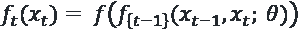

这个方程表示，要计算在时间 *t* 时刻的输出，*t-1* 时刻的输出会作为输入，与同一时间步的输入数据 *x*[t] 一起使用。除此之外，一组参数或学习得到的权重，表示为 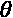，也用于计算输出。训练一个 RNN 的目标是学习这些权重 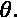。这种特定形式的 RNN 是独特的。在之前的例子中，我们没有使用一个批次的输出去决定未来批次的输出。虽然我们主要关注 RNN 在语言上的应用，其中一个句子被建模为一个接一个出现的词序列，但 RNN 也可以应用于构建通用的时间序列模型。

## RNN 构建块

前一部分概述了递归函数的基本数学直觉，这是 RNN 构建块的简化版本。*图 2.1* 表示了几个时间步骤，并添加了细节，展示了用于基本 RNN 构建块或单元计算的不同权重。

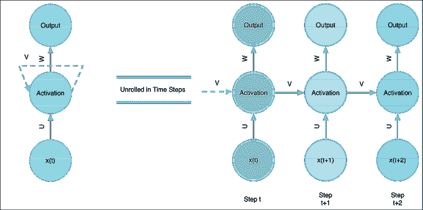

图 2.1：RNN 解构

基本单元如左图所示。特定时间或序列步骤 *t* 的输入向量与一个权重向量相乘，图中表示为 *U*，以生成中间部分的激活。该架构的关键部分是该激活部分中的循环。前一个步骤的输出与一个权重向量相乘，图中用 *V* 表示，并加到激活中。该激活可以与另一个权重向量相乘，表示为 *W*，以产生该步骤的输出，如顶部所示。就序列或时间步骤而言，该网络可以展开。这种展开是虚拟的。然而，它在图的右侧得到了表示。从数学角度看，时间步骤 *t* 的激活可以表示为：

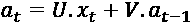

同一步骤的输出可以这样计算：

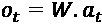

RNN 的数学已经简化，以便提供对 RNN 的直观理解。

从结构上看，网络非常简单，因为它是一个单一单元。为了利用和学习通过的输入结构，权重向量 *U*、*V* 和 *W* 在时间步骤之间共享。该网络没有像全连接或卷积网络那样的层。然而，由于它在时间步骤上展开，可以认为它有与输入序列中步骤数量相等的层。要构建深度 RNN，还需要满足其他标准。稍后在本节中会详细讨论。这个网络使用反向传播和随机梯度下降技术进行训练。这里需要注意的关键是，反向传播是在序列或时间步骤中发生的，而不是通过层进行反向传播。

拥有这种结构使得可以处理任意长度的序列。然而，随着序列长度的增加，会出现一些挑战：

+   **梯度消失与爆炸**：随着序列长度的增加，反向传播的梯度会越来越小。这会导致网络训练缓慢或完全不学习。随着序列长度的增加，这一效果会更加明显。在上一章中，我们构建了一个少量层的网络。在这里，10 个单词的句子相当于 10 层网络。10 毫秒的 1 分钟音频样本将生成 6000 个步骤！相反，如果输出值增加，梯度也可能爆炸。管理梯度消失的最简单方法是使用 ReLU。管理梯度爆炸的技术称为**梯度裁剪**。这种技术会在梯度的大小超过阈值时将其裁剪。这样可以防止梯度过大或爆炸。

+   **无法管理长期依赖性**：假设在一个 11 个单词的句子中，第 3 个单词信息量很大。以下是一个简单的例子：“我认为足球是全世界最受欢迎的运动。”当处理到句子的结尾时，序列中前面单词的贡献会越来越小，因为它们与向量*V*反复相乘，正如上面所示。

+   **两种特定的 RNN 单元设计缓解了这些问题**：**长短期记忆**（**LSTM**）和**门控循环单元**（**GRU**）。这些将在接下来描述。然而，请注意，TensorFlow 默认提供了这两种类型的单元的实现。因此，使用这些单元类型构建 RNN 几乎是小菜一碟。

## 长短期记忆（LSTM）网络

LSTM 网络是在 1997 年提出的，并经过许多研究人员的改进和推广。它们今天广泛用于各种任务，并取得了惊人的成果。

LSTM 有四个主要部分：

+   **单元值**或网络的记忆，也称为单元，存储着累积的知识

+   **输入门**，控制输入在计算新单元值时的使用量

+   **输出门**，决定单元值中有多少用于输出

+   **遗忘门**，决定当前单元值有多少用于更新单元值

如下图所示：

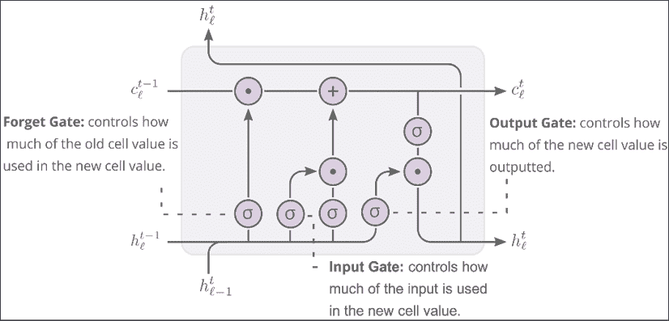

图 2.2：LSTM 单元（来源：Madsen，《在 RNN 中可视化记忆》，Distill，2019 年）

训练 RNN 是一个非常复杂的过程，充满了许多挑战。现代工具如 TensorFlow 很好地管理了复杂性，并大大减少了痛苦。然而，训练 RNN 仍然是一个具有挑战性的任务，尤其是在没有 GPU 支持的情况下。但一旦做对了，所带来的回报是值得的，尤其是在 NLP 领域。

在简要介绍 GRU 之后，我们将继续讨论 LSTM，讲解 BiLSTM，并构建一个情感分类模型。

## 门控循环单元（GRU）

GRU 是另一种流行且较新的 RNN 单元类型。它们是在 2014 年发明的。相比 LSTM，它们更加简洁：

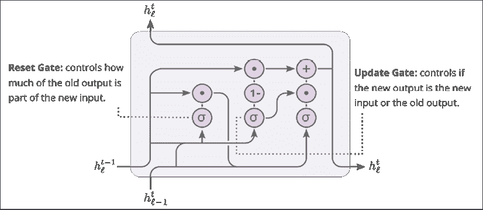

图 2.3：门控循环单元（GRU）架构

与 LSTM 相比，它的门控较少。输入门和遗忘门合并成一个更新门。部分内部单元状态和隐藏状态也合并在一起。这种复杂度的降低使得训练变得更加容易。它在语音和声音领域已表现出优秀的效果。然而，在神经机器翻译任务中，LSTM 表现出了更优的性能。本章将重点讲解如何使用 LSTM。在我们讨论 BiLSTM 之前，先让我们通过 LSTM 来解决一个情感分类问题。然后，我们将尝试使用 BiLSTM 改进该模型。

## 使用 LSTM 进行情感分类

情感分类是自然语言处理（NLP）中常被引用的应用场景。通过使用来自推文的情感分析特征来预测股票价格波动的模型已经显示出有希望的结果。推文情感也用于确定客户对品牌的看法。另一个应用场景是处理电影或电子商务网站上的产品用户评论。为了展示 LSTM 的实际应用，我们将使用 IMDb 的电影评论数据集。该数据集在 ACL 2011 会议上发布，论文题目为*学习用于情感分析的词向量*。该数据集包含 25,000 个训练集样本和另外 25,000 个测试集样本。

这个示例中的代码将使用本地笔记本。*第十章*，*代码的安装与设置说明*，提供了如何设置开发环境的详细说明。简而言之，您需要 Python 3.7.5 及以下库才能开始：

+   pandas 1.0.1

+   NumPy 1.18.1

+   TensorFlow 2.4 和 `tensorflow_datasets 3.2.1` 包

+   Jupyter 笔记本

我们将按照*第一章*，*NLP 基础*中概述的整体过程来进行。我们从加载所需的数据开始。

### 加载数据

在上一章中，我们使用`pandas`库下载并加载了数据。这个方法将整个数据集加载到内存中。然而，有时数据量可能非常大，或者分布在多个文件中。在这种情况下，数据可能会过大，无法加载并需要大量的预处理。使文本数据准备好供模型使用，至少需要进行标准化和向量化处理。通常，这些处理需要在 TensorFlow 图之外使用 Python 函数来完成。这可能会导致代码的可重现性问题。此外，这还会给生产环境中的数据管道带来问题，因为不同的依赖阶段被分开执行时，出现故障的概率更高。

TensorFlow 通过`tf.data`包提供了解决数据加载、转换和批处理的方案。此外，通过`tensorflow_datasets`包提供了多个可供下载的数据集。我们将结合这些工具来下载 IMDb 数据，并在训练 LSTM 模型之前进行分词、编码和向量化处理。

所有情感评论示例的代码都可以在 GitHub 仓库中的 `chapter2-nlu-sentiment-analysis-bilstm` 文件夹下找到。代码在名为 `IMDB Sentiment analysis.ipynb` 的 IPython notebook 中。

第一步是安装适当的包并下载数据集：

```py
!pip install tensorflow_datasets
import tensorflow as tf
import tensorflow_datasets as tfds
import numpy as np 
```

`tfds` 包提供了许多不同领域的数据集，例如图像、音频、视频、文本、摘要等。要查看可用的数据集：

```py
", ".join(tfds.list_builders()) 
```

```py
'abstract_reasoning, aeslc, aflw2k3d, amazon_us_reviews, arc, bair_robot_pushing_small, beans, big_patent, bigearthnet, billsum, binarized_mnist, binary_alpha_digits, c4, caltech101, caltech_birds2010, caltech_birds2011, cars196, cassava, cats_vs_dogs, celeb_a, celeb_a_hq, cfq, chexpert, cifar10, cifar100, cifar10_1, cifar10_corrupted, citrus_leaves, cityscapes, civil_comments, clevr, cmaterdb, cnn_dailymail, coco, coil100, colorectal_histology, colorectal_histology_large, cos_e, curated_breast_imaging_ddsm, cycle_gan, deep_weeds, definite_pronoun_resolution, diabetic_retinopathy_detection, div2k, dmlab, downsampled_imagenet, dsprites, dtd, duke_ultrasound, dummy_dataset_shared_generator, dummy_mnist, emnist, eraser_multi_rc, esnli, eurosat, fashion_mnist, flic, flores, food101, gap, gigaword, glue, groove, higgs, horses_or_humans, i_naturalist2017, image_label_folder, imagenet2012, imagenet2012_corrupted, imagenet_resized, imagenette, imagewang, imdb_reviews, iris, kitti, kmnist, lfw, librispeech, librispeech_lm, libritts, lm1b, lost_and_found, lsun, malaria, math_dataset, mnist, mnist_corrupted, movie_rationales, moving_mnist, multi_news, multi_nli, multi_nli_mismatch, natural_questions, newsroom, nsynth, omniglot, open_images_v4, opinosis, oxford_flowers102, oxford_iiit_pet, para_crawl, patch_camelyon, pet_finder, places365_small, plant_leaves, plant_village, plantae_k, qa4mre, quickdraw_bitmap, reddit_tifu, resisc45, rock_paper_scissors, rock_you, scan, scene_parse150, scicite, scientific_papers, shapes3d, smallnorb, snli, so2sat, speech_commands, squad, stanford_dogs, stanford_online_products, starcraft_video, sun397, super_glue, svhn_cropped, ted_hrlr_translate, ted_multi_translate, tf_flowers, the300w_lp, tiny_shakespeare, titanic, trivia_qa, uc_merced, ucf101, vgg_face2, visual_domain_decathlon, voc, wider_face, wikihow, wikipedia, wmt14_translate, wmt15_translate, wmt16_translate, wmt17_translate, wmt18_translate, wmt19_translate, wmt_t2t_translate, wmt_translate, xnli, xsum, yelp_polarity_reviews' 
```

这是一个包含 155 个数据集的列表。有关数据集的详细信息可以在目录页面 [`www.tensorflow.org/datasets/catalog/overview`](https://www.tensorflow.org/datasets/catalog/overview) 查看。

IMDb 数据提供了三个分割——训练集、测试集和无监督集。训练集和测试集各有 25,000 行数据，每行有两列。第一列是评论文本，第二列是标签。 "0" 表示带有负面情绪的评论，而 "1" 表示带有正面情绪的评论。以下代码加载训练集和测试集数据：

```py
imdb_train, ds_info = tfds.load(name="imdb_reviews", split="train", 
                               with_info=True, as_supervised=True)
imdb_test = tfds.load(name="imdb_reviews", split="test", 
                      as_supervised=True) 
```

请注意，由于数据正在下载，此命令可能需要一些时间才能执行。`ds_info` 包含有关数据集的信息。当提供 `with_info` 参数时，它会返回该信息。让我们来看一下 `ds_info` 中包含的信息：

```py
print(ds_info) 
```

```py
tfds.core.DatasetInfo(
    name='imdb_reviews',
    version=1.0.0,
    description='Large Movie Review Dataset.
This is a dataset for binary sentiment classification containing substantially more data than previous benchmark datasets. We provide a set of 25,000 highly polar movie reviews for training, and 25,000 for testing. There is additional unlabeled data for use as well.',
    homepage='http://ai.stanford.edu/~amaas/data/sentiment/',
    features=FeaturesDict({
        'label': ClassLabel(shape=(), dtype=tf.int64, num_classes=2),
        'text': Text(shape=(), dtype=tf.string),
    }),
    total_num_examples=100000,
    splits={
        'test': 25000,
        'train': 25000,
        'unsupervised': 50000,
    },
    supervised_keys=('text', 'label'),
    citation="""@InProceedings{maas-EtAl:2011:ACL-HLT2011,
      author    = {Maas, Andrew L.  and  Daly, Raymond E.  and  Pham, Peter T.  and  Huang, Dan  and  Ng, Andrew Y.  and  Potts, Christopher},
      title     = {Learning Word Vectors for Sentiment Analysis},
      booktitle = {Proceedings of the 49th Annual Meeting of the Association for Computational Linguistics: Human Language Technologies},
      month     = {June},
      year      = {2011},
      address   = {Portland, Oregon, USA},
      publisher = {Association for Computational Linguistics},
      pages     = {142--150},
      url       = {http://www.aclweb.org/anthology/P11-1015}
    }""",
    redistribution_info=,
) 
```

我们可以看到，在监督模式下，`text` 和 `label` 两个键是可用的。使用 `as_supervised` 参数是将数据集加载为一组值元组的关键。如果没有指定此参数，数据将作为字典键加载并提供。在数据有多个输入的情况下，这可能是首选。为了了解已加载的数据：

```py
for example, label in imdb_train.take(1):
    print(example, '\n', label) 
```

```py
tf.Tensor(b"This was an absolutely terrible movie. Don't be lured in by Christopher Walken or Michael Ironside. Both are great actors, but this must simply be their worst role in history. Even their great acting could not redeem this movie's ridiculous storyline. This movie is an early nineties US propaganda piece. The most pathetic scenes were those when the Columbian rebels were making their cases for revolutions. Maria Conchita Alonso appeared phony, and her pseudo-love affair with Walken was nothing but a pathetic emotional plug in a movie that was devoid of any real meaning. I am disappointed that there are movies like this, ruining actor's like Christopher Walken's good name. I could barely sit through it.", shape=(), dtype=string)
tf.Tensor(0, shape=(), dtype=int64) 
```

上面的评论是负面评论的示例。接下来的步骤是对评论进行分词和向量化处理。

### 标准化与向量化

在*第一章*，*NLP 基础*中，我们讨论了多种标准化方法。在这里，我们只会将文本分词为单词并构建词汇表，然后使用该词汇表对单词进行编码。这是一种简化的方法。构建额外特征的方法有很多，可以使用第一章中讨论的技术，如 POS 标注，构建多个特征，但这留给读者作为练习。在本示例中，我们的目标是使用相同的特征集在 RNN 上进行 LSTM 训练，然后使用相同的特征集在改进的 BiLSTM 模型上进行训练。

在向量化之前，需要构建一个包含数据中所有令牌的词汇表。分词将文本中的单词拆分为单个令牌。所有令牌的集合构成了词汇表。

文本的标准化，例如转换为小写字母等，是在此分词步骤中执行的。`tfds` 提供了一组用于文本的特征构建器，位于 `tfds.features.text` 包中。首先，需要创建一个包含训练数据中所有单词的集合：

```py
tokenizer = tfds.features.text.Tokenizer()
vocabulary_set = set()
MAX_TOKENS = 0
for example, label in imdb_train:
  some_tokens = tokenizer.tokenize(example.numpy())
  if MAX_TOKENS < len(some_tokens):
        MAX_TOKENS = len(some_tokens)
  vocabulary_set.update(some_tokens) 
```

通过遍历训练示例，对每个评论进行分词，将评论中的单词添加到一个集合中。将它们添加到集合中以获取唯一的单词。注意，令牌或单词并未转换为小写。这意味着词汇表的大小会稍微大一些。使用此词汇表，可以创建一个编码器。`TokenTextEncoder` 是 `tfds` 中提供的三种现成编码器之一。注意如何将令牌列表转换为集合，以确保词汇表中只保留唯一的令牌。用于生成词汇表的分词器被传递进来，这样每次调用编码字符串时都能使用相同的分词方案。此编码器期望分词器对象提供 `tokenize()` 和 `join()` 方法。如果您想使用 StanfordNLP 或前一章节中讨论的其他分词器，只需将 StanfordNLP 接口封装在自定义对象中，并实现方法来将文本拆分为令牌并将令牌合并回字符串：

```py
imdb_encoder = tfds.features.text.TokenTextEncoder(vocabulary_set, 
                                              tokenizer=tokenizer)
vocab_size = imdb_encoder.vocab_size
print(vocab_size, MAX_TOKENS) 
```

```py
93931 2525 
```

词汇表包含 93,931 个令牌。最长的评论有 2,525 个令牌。真是一个冗长的评论！评论的长度会有所不同。LSTM 期望输入的是长度相等的序列。填充和截断操作会使评论具有相同的长度。在执行此操作之前，我们先测试编码器是否正常工作：

```py
for example, label in imdb_train.take(1):
    print(example)
    encoded = imdb_encoder.encode(example.numpy())
    print(imdb_encoder.decode(encoded)) 
```

```py
tf.Tensor(b"This was an absolutely terrible movie. Don't be lured in by Christopher Walken or Michael Ironside. Both are great actors, but this must simply be their worst role in history. Even their great acting could not redeem this movie's ridiculous storyline. This movie is an early nineties US propaganda piece. The most pathetic scenes were those when the Columbian rebels were making their cases for revolutions. Maria Conchita Alonso appeared phony, and her pseudo-love affair with Walken was nothing but a pathetic emotional plug in a movie that was devoid of any real meaning. I am disappointed that there are movies like this, ruining actor's like Christopher Walken's good name. I could barely sit through it.", shape=(), dtype=string)
This was an absolutely terrible movie Don t be lured in by Christopher Walken or Michael Ironside Both are great actors but this must simply be their worst role in history Even their great acting could not redeem this movie s ridiculous storyline This movie is an early nineties US propaganda piece The most pathetic scenes were those when the Columbian rebels were making their cases for revolutions Maria Conchita Alonso appeared phony and her pseudo love affair with Walken was nothing but a pathetic emotional plug in a movie that was devoid of any real meaning I am disappointed that there are movies like this ruining actor s like Christopher Walken s good name I could barely sit through it 
```

注意，当从编码表示重新构建这些评论时，标点符号会被移除。

编码器提供的一个便利功能是将词汇表持久化到磁盘。这使得词汇表和分布的计算可以仅执行一次，以供生产用例使用。即使在开发过程中，每次运行或重启笔记本之前，计算词汇表也可能是一项资源密集型的任务。将词汇表和编码器保存到磁盘，可以在完成词汇表构建步骤后，从任何地方继续进行编码和模型构建。要保存编码器，可以使用以下命令：

```py
imdb_encoder.save_to_file("reviews_vocab") 
```

要从文件加载编码器并进行测试，可以使用以下命令：

```py
enc = tfds.features.text.TokenTextEncoder.load_from_file("reviews_vocab")
enc.decode(enc.encode("Good case. Excellent value.")) 
```

```py
'Good case Excellent value' 
```

对每次小批量的行进行分词和编码。TensorFlow 提供了执行这些操作的机制，允许在大数据集上批量执行，可以对数据集进行打乱并分批加载。这使得可以在训练过程中加载非常大的数据集，而不会因内存不足而中断。为了实现这一点，需要定义一个函数，该函数对数据行进行转换。注意，可以将多个转换链式执行。也可以在定义这些转换时使用 Python 函数。处理上述评论时，需要执行以下步骤：

+   **分词**：评论需要被分词为单词。

+   **编码**：这些单词需要使用词汇表映射为整数。

+   **填充**：评论的长度可以不同，但 LSTM 期望向量的长度相同。因此，选择了一个固定长度。短于这个长度的评论会用特定的词汇索引填充，通常是`0`，在 TensorFlow 中是这样处理的。长于这个长度的评论则会被截断。幸运的是，TensorFlow 提供了这样一个开箱即用的功能。

以下函数执行了此操作：

```py
from tensorflow.keras.preprocessing import sequence
def encode_pad_transform(sample):
    encoded = imdb_encoder.encode(sample.numpy())
    pad = sequence.pad_sequences([encoded], padding='post', 
                                 maxlen=150)
    return np.array(pad[0], dtype=np.int64)  
def encode_tf_fn(sample, label):
    encoded = tf.py_function(encode_pad_transform, 
                                       inp=[sample], 
                                       Tout=(tf.int64))
    encoded.set_shape([None])
    label.set_shape([])
    return encoded, label 
```

`encode_tf_fn`由数据集 API 调用，一次处理一个样本。这意味着它处理的是一个包含评论及其标签的元组。此函数会调用另一个函数`encode_pad_transform`，该函数包装在`tf.py_function`调用中，执行实际的转换操作。在这个函数中，首先进行分词，然后是编码，最后是填充和截断。选择了最大长度 150 个标记或词进行填充/截断序列。此第二个函数可以使用任何 Python 逻辑。例如，可以使用 StanfordNLP 包来执行词性标注，或者像上一章那样去除停用词。在这个示例中，我们尽量保持简单。

填充是一个重要的步骤，因为 TensorFlow 中的不同层不能处理宽度不同的张量。宽度不同的张量被称为**不规则张量**（ragged tensors）。目前正在进行相关的工作来支持不规则张量，并且该支持正在不断改进。然而，在 TensorFlow 中不规则张量的支持并不是普遍存在的。因此，在本书中避免使用不规则张量。

转换数据是非常简单的。让我们在一个小样本数据上试试这段代码：

```py
subset = imdb_train.take(10)
tst = subset.map(encode_tf_fn)
for review, label in tst.take(1):
    print(review, label)
    print(imdb_encoder.decode(review)) 
```

```py
tf.Tensor(
[40205  9679 51728 91747 21013  7623  6550 40338 18966 36012 64846 80722
 81643 29176 14002 73549 52960 40359 49248 62585 75017 67425 18181  2673
 44509 18966 87701 56336 29928 64846 41917 49779 87701 62585 58974 82970
  1902  2754 18181  7623  2615  7927 67321 40205  7623 43621 51728 91375
 41135 71762 29392 58948 76770 15030 74878 86231 49390 69836 18353 84093
 76562 47559 49390 48352 87701 62200 13462 80285 76037 75121  1766 59655
  6569 13077 40768 86201 28257 76220 87157 29176  9679 65053 67425 93397
 74878 67053 61304 64846 93397  7623 18560  9679 50741 44024 79648  7470
 28203 13192 47453  6386 18560 79892 49248  7158 91321 18181 88633 13929
  2615 91321 81643 29176  2615 65285 63778 13192 82970 28143 14618 44449
 39028     0     0     0     0     0     0     0     0     0     0     0
     0     0     0     0     0     0     0     0     0     0     0     0
     0     0     0     0     0     0], shape=(150,), dtype=int64) tf.Tensor(0, shape=(), dtype=int64)
This was an absolutely terrible movie Don t be lured in by Christopher Walken or Michael Ironside Both are great actors but this must simply be their worst role in history Even their great acting could not redeem this movie s ridiculous storyline This movie is an early nineties US propaganda piece The most pathetic scenes were those when the Columbian rebels were making their cases for revolutions Maria Conchita Alonso appeared phony and her pseudo love affair with Walken was nothing but a pathetic emotional plug in a movie that was devoid of any real meaning I am disappointed that there are movies like this ruining actor s like Christopher Walken s good name I could barely sit through it 
```

注意输出第一部分中编码张量末尾的"0"。这是填充到 150 个词后的结果。

可以这样在整个数据集上运行这个 map 操作：

```py
encoded_train = imdb_train.map(encode_tf_fn)
encoded_test = imdb_test.map(encode_tf_fn) 
```

这应该会非常快速地执行。当训练循环执行时，映射将在此时执行。在`tf.data.DataSet`类中，还提供了其他有用的命令，`imdb_train`和`imdb_test`都是该类的实例，这些命令包括`filter()`、`shuffle()`和`batch()`。`filter()`可以从数据集中删除某些类型的数据。它可以用来过滤掉长度过长或过短的评论，或者将正面和负面的例子分开，从而构建一个更平衡的数据集。第二个方法会在训练的每个时期之间打乱数据。最后一个方法则用于将数据批处理以进行训练。请注意，如果这些方法的应用顺序不同，将会产生不同的数据集。

使用`tf.data`进行性能优化：

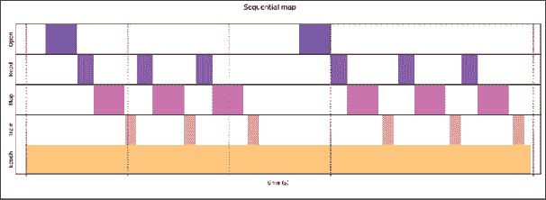图 2.4：通过顺序执行 map 函数所需时间的示意例子（来源：Better Performance with the tf.data API，访问链接：tensorflow.org/guide/data_performance）

如上图所示，多个操作共同影响一个 epoch 中的整体训练时间。上面这个示例图展示了需要打开文件（如最上面一行所示）、读取数据（如下一行所示）、对读取的数据执行映射转换，然后才能进行训练。由于这些步骤是按顺序进行的，这可能会使整体训练时间变长。相反，映射步骤可以并行执行，这将使得整体执行时间变短。CPU 用于预取、批处理和转换数据，而 GPU 则用于训练计算和诸如梯度计算和更新权重等操作。通过对上述 `map` 函数调用做一个小的修改，可以启用此功能：

```py
encoded_train = imdb_train.map(encode_tf_fn,
       num_parallel_calls=tf.data.experimental.AUTOTUNE)
encoded_test = imdb_test.map(encode_tf_fn,
       num_parallel_calls=tf.data.experimental.AUTOTUNE) 
```

传递额外的参数使 TensorFlow 能够使用多个子进程来执行转换操作。

这可以带来如下面所示的加速效果：

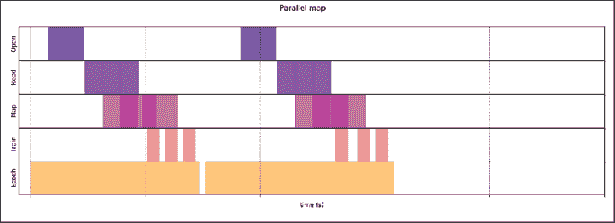图 2.5: 由于映射的并行化而减少训练时间的示例（来源：在 tensorflow.org/guide/data_performance 上的 tf.data API 提升性能）

虽然我们已经对评论文本进行了标准化和编码，但还没有将其转换为词向量或嵌入。这一步骤将在下一步模型训练中完成。因此，我们现在可以开始构建一个基本的 LSTM 模型。

### 带嵌入的 LSTM 模型

TensorFlow 和 Keras 使得实例化一个基于 LSTM 的模型变得非常简单。实际上，添加一个 LSTM 层只需一行代码。最简单的形式如下所示：

```py
tf.keras.layers.LSTM(rnn_units) 
```

在这里，`rnn_units` 参数决定了在一个层中连接多少个 LSTM。还有许多其他参数可以配置，但默认值相当合理。TensorFlow 文档很好地详细说明了这些选项及其可能的取值，并附有示例。然而，评论文本标记不能直接输入到 LSTM 层中。它们需要通过嵌入方案进行向量化。有几种不同的方法可以使用。第一种方法是在模型训练时学习这些嵌入。这是我们将要使用的方法，因为它是最简单的方式。如果你所拥有的文本数据是某个特定领域的，如医学转录，这也是最好的方法。这个方法需要大量的数据来训练，以便嵌入能够学习到单词之间的正确关系。第二种方法是使用预训练的嵌入，如 Word2vec 或 GloVe，正如上一章所示，使用它们来向量化文本。这种方法在通用文本模型中表现良好，甚至可以适应特定领域。转移学习是 *第四章* 的重点内容，*使用 BERT 进行转移学习*。

回到学习嵌入，TensorFlow 提供了一个嵌入层，可以在 LSTM 层之前添加。这个层有几个选项，文档也有很好的说明。为了完成二分类模型，剩下的就是一个最终的全连接层，该层有一个单元用于分类。一个可以构建具有一些可配置参数的模型的工具函数可以这样配置：

```py
def build_model_lstm(vocab_size, embedding_dim, rnn_units, batch_size):
  model = tf.keras.Sequential([
    tf.keras.layers.Embedding(vocab_size, embedding_dim, 
                              mask_zero=True,
                              batch_input_shape=[batch_size, None]),
    tf.keras.layers.LSTM(rnn_units),
    tf.keras.layers.Dense(1, activation='sigmoid')
  ])
  return model 
```

这个函数暴露了一些可配置的参数，以便尝试不同的架构。除了这些参数之外，批次大小是另一个重要的参数。可以按照以下方式配置：

```py
vocab_size = imdb_encoder.vocab_size 
# The embedding dimension
embedding_dim = 64
# Number of RNN units
rnn_units = 64
# batch size
BATCH_SIZE=100 
```

除了词汇表大小外，所有其他参数都可以进行调整，以查看对模型性能的影响。在设置好这些配置后，可以构建模型：

```py
model = build_model_lstm(
  vocab_size = vocab_size,
  embedding_dim=embedding_dim,
  rnn_units=rnn_units,
  batch_size=BATCH_SIZE)
model.summary() 
```

```py
Model: "sequential_3"
_________________________________________________________________
Layer (type)                 Output Shape              Param #   
=================================================================
embedding_3 (Embedding)      (100, None, 64)           6011584   
_________________________________________________________________
lstm_3 (LSTM)                (100, 64)                 33024     
_________________________________________________________________
dense_5 (Dense)              (100, 1)                  65        
=================================================================
Total params: 6,044,673
Trainable params: 6,044,673
Non-trainable params: 0
_________________________________________________________________ 
```

这样一个小模型有超过 600 万个可训练参数。很容易检查嵌入层的大小。词汇表中的总标记数为 93,931。每个标记都由一个 64 维的嵌入表示，提供了 93,931 X 64 = 6,011,584 个参数。

现在，这个模型已经准备好进行编译，指定损失函数、优化器和评估指标。在这种情况下，由于只有两个标签，所以使用二元交叉熵作为损失函数。Adam 优化器是一个非常好的选择，具有很好的默认设置。由于我们正在进行二分类，准确率、精确度和召回率是我们希望在训练过程中跟踪的指标。然后，需要对数据集进行批处理，并开始训练：

```py
model.compile(loss='binary_crossentropy', 
             optimizer='adam', 
             metrics=['accuracy', 'Precision', 'Recall'])
encoded_train_batched = encoded_train.batch(BATCH_SIZE)
model.fit(encoded_train_batched, epochs=10) 
```

```py
Epoch 1/10
250/250 [==============================] - 23s 93ms/step - loss: 0.4311 - accuracy: 0.7920 - Precision: 0.7677 - Recall: 0.8376
Epoch 2/10
250/250 [==============================] - 21s 83ms/step - loss: 0.1768 - accuracy: 0.9353 - Precision: 0.9355 - Recall: 0.9351
…
Epoch 10/10
250/250 [==============================] - 21s 85ms/step - loss: 0.0066 - accuracy: 0.9986 - Precision: 0.9986 - Recall: 0.9985 
```

这是一个非常好的结果！让我们将其与测试集进行比较：

```py
model.evaluate(encoded_test.batch(BATCH_SIZE)) 
```

```py
 250/Unknown - 20s 80ms/step - loss: 0.8682 - accuracy: 0.8063 - Precision: 0.7488 - Recall: 0.9219 
```

训练集和测试集之间的性能差异表明模型发生了过拟合。管理过拟合的一种方法是在 LSTM 层后引入一个 dropout 层。这个部分留给你作为练习。

上述模型是在 NVIDIA RTX 2070 GPU 上训练的。使用仅 CPU 时，每个 epoch 的时间可能会更长。

现在，让我们看看 BiLSTM 在这个任务中的表现如何。

### BiLSTM 模型

在 TensorFlow 中构建 BiLSTM 很容易。所需要的只是对模型定义进行一行的修改。在 `build_model_lstm()` 函数中，添加 LSTM 层的那一行需要修改。修改后的新函数如下所示，修改的部分已突出显示：

```py
def build_model_bilstm(vocab_size, embedding_dim, rnn_units, batch_size):
  model = tf.keras.Sequential([
    tf.keras.layers.Embedding(vocab_size, embedding_dim, 
                              mask_zero=True,
                              batch_input_shape=[batch_size, None]),
    **tf.keras.layers.Bidirectional(tf.keras.layers.LSTM(rnn_units)),**
    tf.keras.layers.Dense(1, activation='sigmoid')
  ])
  return model 
```

但首先，让我们了解什么是 BiLSTM：

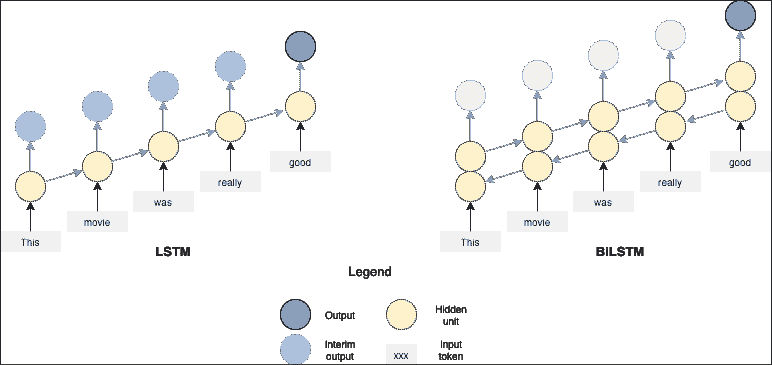

图 2.6：LSTM 与 BiLSTM 的对比

在常规的 LSTM 网络中，词语或令牌是单向输入的。以句子“This movie was really good.”为例，从左到右，每个词一个接一个地输入 LSTM 单元，标记为隐含单元。上面的图表显示了一个随时间展开的版本。这意味着每个接下来的词被认为是相对于前一个词的时间增量。每一步会生成一个输出，这个输出可能有用，也可能没有用。这取决于具体问题。在 IMDb 情感预测的例子中，只有最后的输出才是重要的，因为它会被送到密集层做出判断，判断评论是正面还是负面。

如果你在处理像阿拉伯语和希伯来语这样的从右到左书写的语言，请确保按从右到左的顺序输入词令。理解下一个词或词令来自哪个方向非常重要。如果你使用的是 BiLSTM，那么方向可能没有那么重要。

由于时间展开，可能看起来有多个隐含单元。然而，它们实际上是同一个 LSTM 单元，正如本章前面提到的*图 2.2*所示。单元的输出被送回到同一个单元，作为下一时间步的输入。在 BiLSTM 的情况下，有一对隐含单元。一个集群处理从左到右的词令，而另一个集群处理从右到左的词令。换句话说，正向 LSTM 模型只能从过去的时间步的词令中学习。而 BiLSTM 模型可以同时从**过去和未来**的词令中学习。

这种方法能够捕捉更多的词语间依赖关系和句子结构，进而提高模型的准确性。假设任务是预测这个句子片段中的下一个词：

*我跳入了……*

这个句子有许多可能的补全方式。再者，假设你可以访问句子后面的词，想一想这三种可能性：

1.  *我带着一把小刀跳入了……*

1.  *我跳入了……并游到了另一岸*

1.  *我从 10 米跳板上跳入了……*

*战斗*或*打斗*可能是第一个例子的常见词，第二个是*河流*，最后一个是*游泳池*。在每种情况下，句子的开头完全相同，但结尾的词帮助消除歧义，确定应该填入空白的词。这说明了 LSTM 和 BiLSTM 之间的差异。LSTM 只能从过去的词语中学习，而 BiLSTM 能够从过去和未来的词语中学习。

这个新的 BiLSTM 模型有超过 1200 万个参数。

```py
bilstm = build_model_bilstm(
  vocab_size = vocab_size,
  embedding_dim=embedding_dim,
  rnn_units=rnn_units,
  batch_size=BATCH_SIZE)
bilstm.summary() 
```

```py
Model: "sequential_1"
_________________________________________________________________
Layer (type)                 Output Shape              Param #   
=================================================================
embedding_1 (Embedding)      (50, None, 128)           12023168  
_________________________________________________________________
dropout (Dropout)            (50, None, 128)           0         
_________________________________________________________________
bidirectional (Bidirectional (50, None, 128)           98816     
_________________________________________________________________
dropout_1 (Dropout)          (50, None, 128)           0         
_________________________________________________________________
bidirectional_1 (Bidirection (50, 128)                 98816     
_________________________________________________________________
dropout_2 (Dropout)          (50, 128)                 0         
_________________________________________________________________
dense_1 (Dense)              (50, 1)                   129       
=================================================================
Total params: 12,220,929
Trainable params: 12,220,929
Non-trainable params: 0
_________________________________________________________________ 
```

如果你按照上面所示的模型运行，且没有其他更改，你会看到模型的准确性和精度有所提升：

```py
bilstm.fit(encoded_train_batched, epochs=5) 
```

```py
Epoch 1/5
500/500 [==============================] - 80s 160ms/step - loss: 0.3731 - accuracy: 0.8270 - Precision: 0.8186 - Recall: 0.8401
…
Epoch 5/5
500/500 [==============================] - 70s 139ms/step - loss: 0.0316 - accuracy: 0.9888 - Precision: 0.9886 - Recall: 0.9889
bilstm.evaluate(encoded_test.batch(BATCH_SIZE))
500/Unknown - 20s 40ms/step - loss: 0.7280 - accuracy: 0.8389 - Precision: 0.8650 - Recall: 0.8032 
```

注意，模型目前存在严重的过拟合问题。给模型添加某种形式的正则化非常重要。开箱即用的模型，在没有进行特征工程或使用无监督数据来学习更好的嵌入的情况下，模型的准确率已超过 83.5%。2019 年 8 月发布的该数据集当前的最先进结果，准确率为 97.42%。一些可以尝试改进该模型的想法包括：堆叠 LSTM 或 BiLSTM 层，使用一些 dropout 进行正则化，使用数据集的无监督拆分以及训练和测试审查文本数据来学习更好的嵌入，并将其应用到最终网络中，增加更多特征如词形和词性标签等。我们将在*第四章*，*使用 BERT 的迁移学习*中再次提到这个例子，讨论 BERT 等语言模型。也许这个例子能激发你尝试自己构建模型，并用你最先进的结果发布论文！

请注意，虽然 BiLSTM 非常强大，但并不适用于所有应用。使用 BiLSTM 架构假设整个文本或序列可以同时获取。在某些情况下，这一假设可能并不成立。

在聊天机器人的命令语音识别中，只能使用用户到目前为止说出的声音。我们无法知道用户未来将会说什么词。在实时时间序列分析中，只有过去的数据可用。在这种应用中，BiLSTM 无法使用。此外，值得注意的是，RNN 在大量数据训练和多个 epoch 上才真正能展现其优势。IMDb 数据集包含 25,000 个训练示例，算是较小的数据集，无法充分发挥 RNN 的强大能力。你可能会发现，使用 TF-IDF 和逻辑回归，并结合一些特征工程，能取得相似或更好的结果。

# 总结

这是我们在高级 NLP 问题探索中的基础性章节。许多高级模型使用像 BiRNN 这样的构建模块。首先，我们使用 TensorFlow Datasets 包来加载数据。通过使用这个库，我们的词汇构建、分词器和向量化编码工作变得简化了。在理解 LSTM 和 BiLSTM 后，我们构建了情感分析模型。我们的工作展示了潜力，但离最先进的结果还有很长的距离，这将在未来的章节中讨论。然而，我们现在已经掌握了构建更复杂模型所需的基本构件，可以帮助我们解决更具挑战性的问题。

拥有了这些 LSTM 的知识后，我们准备在下一章中使用 BiLSTM 构建我们的第一个命名实体识别（NER）模型。一旦模型构建完成，我们将尝试使用 CRF 和维特比解码来改进它。
