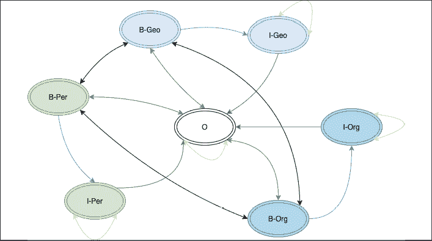
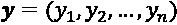
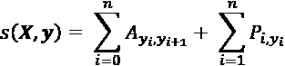
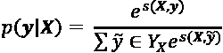
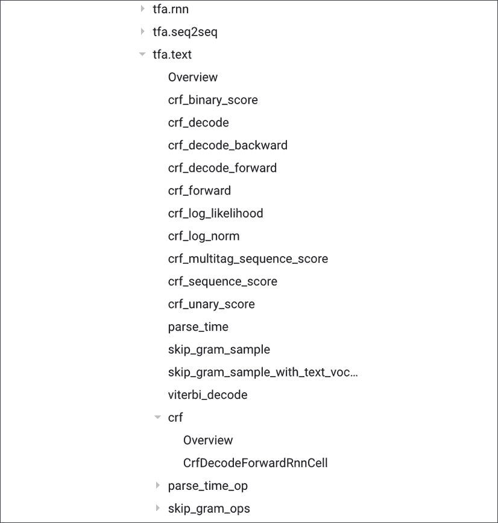
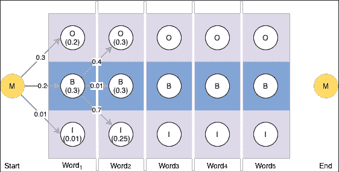

# 第三章：基于 BiLSTM、CRF 和 Viterbi 解码的命名实体识别（NER）

自然语言理解（NLU）的一个基础构建模块是**命名实体识别**（**NER**）。通过 NER，可以在文本中标记出人名、公司名、产品名和数量等实体，这在聊天机器人应用以及信息检索和提取的许多其他用例中都非常有用。NER 将在本章中作为主要内容。构建和训练一个能够进行 NER 的模型需要几种技术，例如**条件随机场**（**CRFs**）和**双向 LSTM**（**BiLSTMs**）。还会使用一些高级 TensorFlow 技术，如自定义层、损失函数和训练循环。我们将基于上一章获得的 BiLSTMs 知识进行拓展。具体来说，将涵盖以下内容：

+   NER 概述

+   构建一个基于 BiLSTM 的 NER 标注模型

+   CRFs 和 Viterbi 算法

+   为 CRFs 构建自定义 Keras 层

+   在 Keras 和 TensorFlow 中构建自定义损失函数

+   使用自定义训练循环训练模型

一切都始于理解 NER，这是下一节的重点。

# 命名实体识别

给定一句话或一段文本，NER 模型的目标是定位并将文本中的词语分类为命名实体，类别包括人名、组织与公司、地理位置、数量、货币数量、时间、日期，甚至蛋白质或 DNA 序列。NER 应该标记以下句子：

*阿什什支付了 80 美元，乘坐 Uber 去 Twitter 位于旧金山的办公室。*

如下所示：

*[阿什什]*[PER] *支付了[Uber]*[ORG] *[$80]*[MONEY] `$1`[ORG] *位于[旧金山]*[LOC]的办公室。*

这是来自 Google Cloud 自然语言 API 的一个示例，包含多个附加类别：


图 3.1：来自 Google Cloud 自然语言 API 的 NER 示例

最常见的标签列在下表中：

| 类型 | 示例标签 | 示例 |
| --- | --- | --- |
| 人物 | PER | *格雷戈里*去了城堡。 |
| 组织 | ORG | *世界卫生组织*刚刚发布了疫情警告。 |
| 位置 | LOC | 她住在*西雅图*。 |
| 金钱 | MONEY | 你欠我*二十美元*。 |
| 百分比 | PERCENT | 股票今天上涨了*10%*。 |
| 日期 | DATE | 我们周三见。 |
| 时间 | TIME | *已经是下午五点了吗？* |

有不同的数据集和标注方案可以用来训练 NER 模型。不同的数据集会包含上述标注的不同子集。在其他领域，可能会有针对该领域的额外标签。英国的国防科学技术实验室（Defence Science Technology Laboratory）创建了一个名为**re3d**的数据集（[`github.com/dstl/re3d`](https://github.com/dstl/re3d)），其中包含诸如车辆（如波音 777）、武器（如步枪）和军事平台（如坦克）等实体类型。各种语言中适当大小的标注数据集的可用性是一个重大挑战。以下是一个很好的 NER 数据集集合链接：[`github.com/juand-r/entity-recognition-datasets`](https://github.com/juand-r/entity-recognition-datasets)。在许多使用案例中，你需要花费大量时间收集和标注数据。例如，如果你正在为订购披萨构建一个聊天机器人，实体可能包括基础、酱料、尺寸和配料。

构建 NER 模型有几种不同的方法。如果将句子视为一个序列，那么这个任务可以建模为逐字标注任务。因此，类似于**词性标注**（**POS**）的模型是适用的。可以向模型中添加特征以改进标注。一个词的词性及其相邻词汇是最直接可以添加的特征。用于建模小写字母的词形特征可以提供大量信息，主要是因为许多实体类型涉及专有名词，比如人名和组织名。组织名称可能会被缩写。例如，世界卫生组织可以表示为 WHO。请注意，这一特征仅适用于区分大小写字母的语言。

另一个重要的特征是检查一个词是否在**地名辞典**中。地名辞典就像一个重要地理实体的数据库。可以参考[geonames.org](http://geonames.org)上的数据集，该数据集获得了创意共享（Creative Commons）许可。美国社会保障管理局（US Social Security Administration）提供了一份美国人名数据集，地址为[`www.ssa.gov/oact/babynames/state/namesbystate.zip`](https://www.ssa.gov/oact/babynames/state/namesbystate.zip)。该压缩文件包含自 1910 年以来出生在美国的人的名字，按州分组。类似地，知名的邓白氏公司（Dunn and Bradstreet，简称 D&B）提供了一份全球超过 2 亿家企业的数据集，用户可以申请许可。使用这种方法的最大挑战是随着时间的推移维护这些列表的复杂性。

在本章中，我们将关注一个不依赖额外外部数据（如地名词典）进行训练的模型，也不依赖人工特征。我们将尽可能使用深度神经网络和一些额外技术来提高准确度。我们将使用的模型将是 BiLSTM 和 CRF 的组合。该模型基于 Guillaume Lample 等人撰写的论文《命名实体识别的神经网络架构》，并在 2016 年 NAACL-HTL 会议上发表。这篇论文在 2016 年处于前沿水平，F1 分数为 90.94。目前，SOTA（最先进技术）的 F1 分数为 93.5，其中模型使用了额外的训练数据。这些数据是在 CoNLL 2003 英文数据集上测量的。本章将使用 GMB 数据集。下一节将描述该数据集。

## GMB 数据集

基础知识掌握后，我们准备构建一个用于分类命名实体识别（NER）的模型。对于这一任务，将使用**格罗宁根语义库**（**GMB**）数据集。这个数据集并不被认为是黄金标准。也就是说，该数据集是通过自动标注软件构建的，随后由人工评分员更新数据子集。然而，这是一个非常大且丰富的数据集，包含了大量有用的注释，非常适合用于模型训练。它也来源于公共领域的文本，因此很容易用于训练。这个语料库中标注了以下命名实体：

+   geo = 地理实体

+   org = 组织

+   per = 人物

+   gpe = 地缘政治实体

+   tim = 时间指示符

+   art = 人造物

+   eve = 事件

+   nat = 自然现象

在这些类别中，可能存在子类别。例如，*tim* 可能进一步细分为 *tim-dow*，表示一周中的某一天，或者 *tim-dat*，表示一个日期。对于本次练习，这些子实体将被汇总成上述的八个顶级实体。这些子实体的样本数量差异很大，因此，由于某些子类别缺乏足够的训练数据，准确度差异也很大。

数据集还提供了每个单词的 NER 实体。在许多情况下，一个实体可能由多个单词组成。如果*Hyde Park*是一个地理实体，那么这两个单词都会被标记为*geo*实体。在训练 NER 模型时，还有另一种表示数据的方式，这对模型的准确性有显著影响。这需要使用 BIO 标注方案。在这种方案中，实体的第一个单词，无论是单一词还是多词，都标记为*B-{实体标签}*。如果实体是多词的，每个后续的单词将标记为*I-{实体标签}*。在上面的例子中，*Hyde Park*将被标记为*B-geo I-geo*。所有这些都是数据集预处理的步骤。本示例的所有代码可以在 GitHub 仓库的`chapter3-ner-with-lstm-crf`文件夹中的`NER with BiLSTM and CRF.ipynb`笔记本中找到。

我们从加载和处理数据开始。

# 加载数据

数据可以通过格罗宁根大学的网站下载，具体如下：

```py
# alternate: download the file from the browser and put # in the same directory as this notebook
!wget https://gmb.let.rug.nl/releases/gmb-2.2.0.zip
!unzip gmb-2.2.0.zip 
```

请注意，数据非常大——超过 800MB。如果您的系统中没有`wget`，可以使用任何其他工具，如`curl`或浏览器，来下载数据集。此步骤可能需要一些时间才能完成。如果您在从大学服务器访问数据集时遇到问题，可以从 Kaggle 下载一份副本：[`www.kaggle.com/bradbolliger/gmb-v220`](https://www.kaggle.com/bradbolliger/gmb-v220)。另外，由于我们将处理大数据集，接下来的步骤可能需要一些时间来执行。在**自然语言处理**（**NLP**）领域，更多的训练数据和训练时间是取得良好结果的关键。

本示例的所有代码可以在 GitHub 仓库的`chapter3-ner-with-lstm-crf`文件夹中的`NER with BiLSTM and CRF.ipynb`笔记本中找到。

数据解压后会进入`gmb-2.2.0`文件夹。`data`子文件夹中有多个子文件夹和不同的文件。数据集提供的`README`文件详细说明了各种文件及其内容。在此示例中，我们只使用命名为`en.tags`的文件，这些文件位于不同的子目录中。这些文件是制表符分隔的文件，每一行表示一个句子的一个单词。

有十列信息：

+   令牌本身

+   Penn Treebank 中使用的词性标记（ftp://ftp.cis.upenn.edu/pub/treebank/doc/tagguide.ps.gz）

+   词条

+   命名实体标签，如果没有则为 0

+   对应词条-词性组合的 WordNet 词义编号，如果不适用则为 0（[`wordnet.princeton.edu`](http://wordnet.princeton.edu)）

+   对于动词和介词，列出**组合范畴语法**（**CCG**）推导中按组合顺序排列的 VerbNet 论元角色，如果不适用则为`[]`（[`verbs.colorado.edu/~mpalmer/projects/verbnet.html`](http://verbs.colorado.edu/~mpalmer/projects/verbnet.html)）

+   名词-名词复合词中的语义关系、所有格撇号、时间修饰语等。通过介词表示，若不适用则为 0

+   根据 Zaenen 等人（2004 年）提出的建议，提供一个生动性标签，若不适用则为 0（[`dl.acm.org/citation.cfm?id=1608954`](http://dl.acm.org/citation.cfm?id=1608954)）

+   一个超级标签（CCG 的词汇类别）

+   用 Boxer 的 Prolog 格式表示的 lambda-DRS，表示标记的语义

在这些字段中，我们只使用标记和命名实体标签。然而，我们将在未来的练习中加载 POS 标签。以下代码获取这些标签文件的所有路径：

```py
import os
data_root = './gmb-2.2.0/data/'
fnames = []
for root, dirs, files in os.walk(data_root):
    for filename in files:
        if filename.endswith(".tags"):
            fnames.append(os.path.join(root, filename))
fnames[:2]
['./gmb-2.2.0/data/p57/d0014/en.tags', './gmb-2.2.0/data/p57/d0382/en.tags'] 
```

需要进行一些处理步骤。每个文件包含多个句子，每个句子中的单词排列成行。整个句子作为一个序列，与之对应的 NER 标签序列在训练模型时需要一起输入。如前所述，NER 标签也需要简化为仅包含顶级实体。其次，NER 标签需要转换为 IOB 格式。**IOB**代表**In-Other-Begin**。这些字母作为前缀附加到 NER 标签上。下表中的句子片段展示了该方案的工作方式：

| Reverend | Terry | Jones | arrived | in | New | York |
| --- | --- | --- | --- | --- | --- | --- |
| B-per | I-per | I-per | O | O | B-geo | I-geo |

上表展示了处理后的标签方案。请注意，New York 是一个地点。一旦遇到*New*，它标志着地理位置 NER 标签的开始，因此被标记为 B-geo。下一个单词是*York*，它是同一地理实体的延续。对于任何网络来说，将单词*New*分类为地理实体的开始将是非常具有挑战性的。然而，BiLSTM 网络能够看到随后的单词，这对消除歧义非常有帮助。此外，IOB 标签的优势在于，在检测方面，模型的准确性显著提高。这是因为一旦检测到 NER 标签的开始，下一标签的选择就会大大受限。

让我们进入代码部分。首先，创建一个目录来存储所有处理后的文件：

```py
!mkdir ner 
```

我们希望处理这些标签，以便去除 NER 标签中的子类别。还希望收集文档中标签类型的一些统计数据：

```py
import csv
import collections

ner_tags = collections.Counter()
iob_tags = collections.Counter()
def strip_ner_subcat(tag):
    # NER tags are of form {cat}-{subcat}
    # eg tim-dow. We only want first part
    return tag.split("-")[0] 
```

上面已设置了 NER 标签和 IOB 标签计数器。定义了一个方法来去除 NER 标签中的子类别。下一个方法接受一系列标签并将其转换为 IOB 格式：

```py
def iob_format(ners):
    # converts IO tags into IOB format
    # input is a sequence of IO NER tokens
    # convert this: O, PERSON, PERSON, O, O, LOCATION, O
    # into: O, B-PERSON, I-PERSON, O, O, B-LOCATION, O
    iob_tokens = []
    for idx, token in enumerate(ners):
        if token != 'O':  # !other
            if idx == 0:
                token = "B-" + token #start of sentence
            elif ners[idx-1] == token:
                token = "I-" + token  # continues
            else:
                token = "B-" + token
        iob_tokens.append(token)
        iob_tags[token] += 1
    return iob_tokens 
```

一旦这两个便捷函数准备好后，所有的标签文件都需要被读取并处理：

```py
total_sentences = 0
outfiles = []
for idx, file in enumerate(fnames):
    with open(file, 'rb') as content:
        data = content.read().decode('utf-8').strip()
        sentences = data.split("\n\n")
        print(idx, file, len(sentences))
        total_sentences += len(sentences)

        with open("./ner/"+str(idx)+"-"+os.path.basename(file), 'w') as outfile:
            outfiles.append("./ner/"+str(idx)+"-"+ os.path.basename(file))
            writer = csv.writer(outfile)

            for sentence in sentences: 
                toks = sentence.split('\n')
                words, pos, ner = [], [], []

                for tok in toks:
                    t = tok.split("\t")
                    words.append(t[0])
                    pos.append(t[1])
                    ner_tags[t[3]] += 1
                    ner.append(strip_ner_subcat(t[3]))
                writer.writerow([" ".join(words), 
                                 " ".join(iob_format(ner)), 
                                 " ".join(pos)]) 
```

首先，设置一个计数器来统计句子的数量。还初始化了一个包含路径的文件列表。随着处理文件的写入，它们的路径会被添加到`outfiles`变量中。这个列表将在稍后用于加载所有数据并训练模型。文件被读取并根据两个空行符进行分割。该符号表示文件中句子的结束。文件中仅使用实际的单词、POS 标记和 NER 标记。收集完这些后，将写入一个新的 CSV 文件，包含三列：句子、POS 标签序列和 NER 标签序列。这个步骤可能需要一点时间来执行：

```py
print("total number of sentences: ", total_sentences) 
```

```py
total number of sentences:  62010 
```

为了确认 NER 标签在处理前后的分布，我们可以使用以下代码：

```py
print(ner_tags)
print(iob_tags) 
```

```py
Counter({'O': 1146068, 'geo-nam': 58388, 'org-nam': 48034, 'per-nam': 23790, 'gpe-nam': 20680, 'tim-dat': 12786, 'tim-dow': 11404, 'per-tit': 9800, 'per-fam': 8152, 'tim-yoc': 5290, 'tim-moy': 4262, 'per-giv': 2413, 'tim-clo': 891, 'art-nam': 866, 'eve-nam': 602, 'nat-nam': 300, 'tim-nam': 146, 'eve-ord': 107, 'org-leg': 60, 'per-ini': 60, 'per-ord': 38, 'tim-dom': 10, 'art-add': 1, 'per-mid': 1})
Counter({'O': 1146068, 'B-geo': 48876, 'B-tim': 26296, 'B-org': 26195, 'I-per': 22270, 'B-per': 21984, 'I-org': 21899, 'B-gpe': 20436, 'I-geo': 9512, 'I-tim': 8493, 'B-art': 503, 'B-eve': 391, 'I-art': 364, 'I-eve': 318, 'I-gpe': 244, 'B-nat': 238, 'I-nat': 62}) 
```

很明显，有些标签非常不常见，比如*tim-dom*。网络几乎不可能学习到它们。将其聚合到一个层级有助于增加这些标签的信号。为了检查整个过程是否完成，可以检查`ner`文件夹是否有 10,000 个文件。现在，让我们加载处理后的数据以进行标准化、分词和向量化。

# 标准化和向量化数据

在本节中，将使用`pandas`和`numpy`方法。第一步是将处理过的文件内容加载到一个`DataFrame`中：

```py
import glob
import pandas as pd
# could use `outfiles` param as well
files = glob.glob("./ner/*.tags")
data_pd = pd.concat([pd.read_csv(f, header=None, 
                                 names=["text", "label", "pos"]) 
                for f in files], ignore_index = True) 
```

这一步可能需要一些时间，因为它正在处理 10,000 个文件。一旦内容加载完成，我们可以检查`DataFrame`的结构：

```py
data_pd.info() 
```

```py
<class 'pandas.core.frame.DataFrame'>
RangeIndex: 62010 entries, 0 to 62009
Data columns (total 3 columns):
 #   Column  Non-Null Count  Dtype 
---  ------  --------------  ----- 
 0   text    62010 non-null  object
 1   label   62010 non-null  object
 2   pos     62010 non-null  object
dtypes: object(3)
memory usage: 1.4+ MB 
```

文本和 NER 标签都需要被分词并编码成数字，以便用于训练。我们将使用`keras.preprocessing`包提供的核心方法。首先，将使用分词器来分词文本。在这个例子中，由于文本已经被空格分割开，所以只需要通过空格进行分词：

```py
### Keras tokenizer
from tensorflow.keras.preprocessing.text import Tokenizer
text_tok = Tokenizer(filters='[\\]^\t\n', lower=False,
                     split=' ', oov_token='<OOV>')
pos_tok = Tokenizer(filters='\t\n', lower=False,
                    split=' ', oov_token='<OOV>')
ner_tok = Tokenizer(filters='\t\n', lower=False,
                    split=' ', oov_token='<OOV>') 
```

分词器的默认值相当合理。然而，在这种特殊情况下，重要的是只按空格进行分词，而不是清理特殊字符。否则，数据会变得格式错误：

```py
text_tok.fit_on_texts(data_pd['text'])
pos_tok.fit_on_texts(data_pd['pos'])
ner_tok.fit_on_texts(data_pd['label']) 
```

即使我们不使用 POS 标签，处理它们的步骤仍然包括在内。POS 标签的使用会对 NER 模型的准确性产生影响。例如，许多 NER 实体是名词。然而，我们将看到如何处理 POS 标签但不将其作为特征用于模型。这部分留给读者作为练习。

这个分词器有一些有用的功能。它提供了一种通过词频、TF-IDF 等方式限制词汇表大小的方法。如果传入`num_words`参数并指定一个数字，分词器将根据词频限制令牌的数量为该数字。`fit_on_texts`方法接受所有文本，将其分词，并构建一个字典，稍后将在一次操作中用于分词和编码。可以在分词器适配完文本后调用方便的`get_config()`函数，以提供有关令牌的信息：

```py
ner_config = ner_tok.get_config()
text_config = text_tok.get_config()
print(ner_config) 
```

```py
{'num_words': None, 'filters': '\t\n', 'lower': False, 'split': ' ', 'char_level': False, 'oov_token': '<OOV>', 'document_count': 62010, 'word_counts': '{"B-geo": 48876, "O": 1146068, "I-geo": 9512, "B-per": 21984, "I-per": 22270, "B-org": 26195, "I-org": 21899, "B-tim": 26296, "I-tim": 8493, "B-gpe": 20436, "B-art": 503, "B-nat": 238, "B-eve": 391, "I-eve": 318, "I-art": 364, "I-gpe": 244, "I-nat": 62}', 'word_docs': '{"I-geo": 7738, "O": 61999, "B-geo": 31660, "B-per": 17499, "I-per": 13805, "B-org": 20478, "I-org": 11011, "B-tim": 22345, "I-tim": 5526, "B-gpe": 16565, "B-art": 425, "B-nat": 211, "I-eve": 201, "B-eve": 361, "I-art": 207, "I-gpe": 224, "I-nat": 50}', 'index_docs': '{"10": 7738, "2": 61999, "3": 31660, "7": 17499, "6": 13805, "5": 20478, "8": 11011, "4": 22345, "11": 5526, "9": 16565, "12": 425, "17": 211, "15": 201, "13": 361, "14": 207, "16": 224, "18": 50}', 'index_word': '{"1": "<OOV>", "2": "O", "3": "B-geo", "4": "B-tim", "5": "B-org", "6": "I-per", "7": "B-per", "8": "I-org", "9": "B-gpe", "10": "I-geo", "11": "I-tim", "12": "B-art", "13": "B-eve", "14": "I-art", "15": "I-eve", "16": "I-gpe", "17": "B-nat", "18": "I-nat"}', 'word_index': '{"<OOV>": 1, "O": 2, "B-geo": 3, "B-tim": 4, "B-org": 5, "I-per": 6, "B-per": 7, "I-org": 8, "B-gpe": 9, "I-geo": 10, "I-tim": 11, "B-art": 12, "B-eve": 13, "I-art": 14, "I-eve": 15, "I-gpe": 16, "B-nat": 17, "I-nat": 18}'} 
```

配置中的`index_word`字典属性提供了 ID 与标记之间的映射。配置中包含了大量信息。词汇表可以从配置中获取：

```py
text_vocab = eval(text_config['index_word'])
ner_vocab = eval(ner_config['index_word'])
print("Unique words in vocab:", len(text_vocab))
print("Unique NER tags in vocab:", len(ner_vocab)) 
```

```py
Unique words in vocab: 39422
Unique NER tags in vocab: 18 
```

对文本和命名实体标签进行分词和编码是非常简单的：

```py
x_tok = text_tok.texts_to_sequences(data_pd['text'])
y_tok = ner_tok.texts_to_sequences(data_pd['label']) 
```

由于序列的大小不同，它们将被填充或截断为 50 个标记的大小。为此任务使用了一个辅助函数：

```py
# now, pad sequences to a maximum length
from tensorflow.keras.preprocessing import sequence
max_len = 50
x_pad = sequence.pad_sequences(x_tok, padding='post',
                              maxlen=max_len)
y_pad = sequence.pad_sequences(y_tok, padding='post',
                              maxlen=max_len)
print(x_pad.shape, y_pad.shape) 
```

```py
(62010, 50) (62010, 50) 
```

上面最后一步是确保在进入下一步之前，形状是正确的。验证形状是开发 TensorFlow 代码中非常重要的一部分。

需要对标签执行额外的步骤。由于有多个标签，每个标签标记需要进行独热编码，如下所示：

```py
num_classes = len(ner_vocab) + 1
Y = tf.keras.utils.to_categorical(y_pad, num_classes=num_classes)
Y.shape 
```

```py
(62010, 50, 19) 
```

现在，我们准备好构建和训练模型了。

# 一个 BiLSTM 模型

我们将尝试的第一个模型是 BiLSTM 模型。首先，需要设置基本常量：

```py
# Length of the vocabulary 
vocab_size = len(text_vocab) + 1 
# The embedding dimension
embedding_dim = 64
# Number of RNN units
rnn_units = 100
#batch size
BATCH_SIZE=90
# num of NER classes
num_classes = len(ner_vocab)+1 
```

接下来，定义一个便捷函数来实例化模型：

```py
from tensorflow.keras.layers import Embedding, Bidirectional, LSTM, TimeDistributed, Dense
dropout=0.2
def build_model_bilstm(vocab_size, embedding_dim, rnn_units, batch_size, classes):
  model = tf.keras.Sequential([
    Embedding(vocab_size, embedding_dim, mask_zero=True,
                              batch_input_shape=[batch_size,
 None]),
    Bidirectional(LSTM(units=rnn_units,
                           return_sequences=True,
                           dropout=dropout,  
                           kernel_initializer=\
                            tf.keras.initializers.he_normal())),
    **TimeDistributed(Dense(rnn_units, activation=****'relu'****)),**
    Dense(num_classes, activation="softmax")
  ]) 
```

我们将训练我们自己的嵌入层。下一章将讨论如何使用预训练的嵌入层并将其应用于模型。在嵌入层之后是一个 BiLSTM 层，接着是一个`TimeDistributed`全连接层。这个最后的层与情感分析模型有所不同，情感分析模型只有一个用于二分类输出的单元。而在这个问题中，对于输入序列中的每个单词，都需要预测一个 NER 标记。因此，输出的标记与输入的标记一一对应，并被分类为其中一个 NER 类别。`TimeDistributed`层提供了这种能力。这个模型的另一个需要注意的地方是正则化的使用。确保模型不会过拟合训练数据非常重要。由于 LSTM 具有较高的模型容量，因此使用正则化非常重要。可以随意调整这些超参数，看看模型的反应。

现在可以编译模型了：

```py
model = build_model_bilstm(
                        vocab_size = vocab_size,
                        embedding_dim=embedding_dim,
                        rnn_units=rnn_units,
                        batch_size=BATCH_SIZE,
                        classes=num_classes)
model.summary()
model.compile(optimizer="adam", loss="categorical_crossentropy",
 metrics=["accuracy"]) 
```

```py
Model: "sequential_1"
Layer (type)                 Output Shape              Param #   
=================================================================
embedding_9 (Embedding)      (90, None, 64)            2523072   
_________________________________________________________________
bidirectional_9 (Bidirection (90, None, 200)           132000    
_________________________________________________________________
time_distributed_6 (TimeDist (None, None, 100)         20100     
_________________________________________________________________
dense_16 (Dense)             (None, None, 19)          1919      
=================================================================
Total params: 2,677,091
Trainable params: 2,677,091
Non-trainable params: 0
_________________________________________________________________ 
```

这个简单的模型有超过 260 万个参数！

如果你注意到，大部分参数来自词汇表的大小。词汇表包含 39,422 个单词。这增加了模型的训练时间和所需的计算能力。减少这个问题的一种方法是将词汇表的大小减小。最简单的方法是只考虑出现频率超过某个阈值的单词，或者去除小于某个字符数的单词。还可以通过将所有字符转换为小写来减少词汇表的大小。然而，在 NER 任务中，大小写是一个非常重要的特征。

这个模型已经准备好进行训练了。最后需要做的事情是将数据拆分为训练集和测试集：

```py
# to enable TensorFlow to process sentences properly
X = x_pad
# create training and testing splits
total_sentences = 62010
test_size = round(total_sentences / BATCH_SIZE * 0.2)
X_train = X[BATCH_SIZE*test_size:]
Y_train = Y[BATCH_SIZE*test_size:]
X_test = X[0:BATCH_SIZE*test_size]
Y_test = Y[0:BATCH_SIZE*test_size] 
```

现在，模型已准备好进行训练：

```py
model.fit(X_train, Y_train, batch_size=BATCH_SIZE, epochs=15) 
```

```py
Train on 49590 samples
Epoch 1/15
49590/49590 [==============================] - 20s 409us/sample - loss: 0.1736 - accuracy: 0.9113
...
Epoch 8/15
49590/49590 [==============================] - 15s 312us/sample - loss: 0.0153 - accuracy: 0.9884
...
Epoch 15/15
49590/49590 [==============================] - 15s 312us/sample - loss: 0.0065 - accuracy: 0.9950 
```

经过 15 个 epochs 的训练，模型表现得相当不错，准确率超过 99%。让我们看看模型在测试集上的表现，正则化是否有所帮助：

```py
model.evaluate(X_test, Y_test, batch_size=BATCH_SIZE) 
```

```py
12420/12420 [==============================] - 3s 211us/sample - loss: 0.0926 - accuracy: 0.9624 
```

该模型在测试数据集上的表现良好，准确率超过 96.5%。训练集与测试集的准确率仍有差距，意味着该模型可能需要更多的正则化。你可以调整丢弃率变量，或者在嵌入层和 BiLSTM 层之间，`TimeDistributed` 层和最终的 Dense 层之间添加额外的丢弃层。

这是该模型标记的一个句子片段的示例：

|  | 法乌尔 | 格纳辛贝 | 在周五的讲话中表示 | 由国家媒体报道 |
| --- | --- | --- | --- | --- |
| 实际 | B-per | I-per | O | O | O | O | O | O | O | O | B-tim |
| 模型 | B-per | I-per | O | O | O | O | O | O | O | O | B-tim |

该模型表现并不差。它能够识别句子中的人名和时间实体。

尽管该模型表现优秀，但它没有利用命名实体标签的一个重要特征——一个给定的标签与后续标签高度相关。CRFs 可以利用这一信息，进一步提高 NER 任务的准确性。接下来我们将理解 CRFs 的工作原理，并将其添加到上述网络中。

# 条件随机场（CRFs）

BiLSTM 模型查看一系列输入词，并预测当前词的标签。在做出这一决定时，仅考虑之前输入的信息。之前的预测不在做出决策时起作用。然而，标签序列中编码的信息却被忽略了。为了说明这一点，考虑一组 NER 标签：`O`、**B-Per**、**I-Per**、**B-Geo** 和 **I-Geo**。这代表了两种实体领域：人名和地理名，以及一个表示其他所有实体的 *Other* 类别。基于 IOB 标签的结构，我们知道任何 `I` 标签必须由同一领域的 **B-I** 标签之前标记。这也意味着 `I` 标签不能由 `O` 标签之前标记。下图展示了这些标签之间可能的状态转换：



图 3.2：可能的 NER 标签转换

*图 3.2* 使用颜色编码相似类型的转换，以相同颜色表示。`O` 标签只能转换为 `B` 标签。`B` 标签可以转换为其对应的 `I` 标签，或者回到 `O` 标签。`I` 标签可以转回自身、`O` 标签，或者不同领域的 `B` 标签（为简化图示，未在图中表示）。对于一组 `N` 个标签，这些转换可以用一个 *N x N* 的矩阵表示。`P[i,j]` 表示标签 `j` 紧随标签 `i` 之后的可能性。请注意，这些转换权重可以基于数据进行学习。在预测过程中，可以使用这种学习到的转换权重矩阵，考虑整个预测标签序列并更新概率。

以下是一个示意矩阵，显示了指示性的转换权重：

| 从 > 到 | O | B-Geo | I-Geo | B-Org | I-Org |
| --- | --- | --- | --- | --- | --- |
| O | 3.28 | 2.20 | 0.00 | 3.66 | 0.00 |
| B-Geo | -0.25 | -0.10 | 4.06 | 0.00 | 0.00 |
| I-Geo | -0.17 | -0.61 | 3.51 | 0.00 | 0.00 |
| B-Org | -0.10 | -0.23 | 0.00 | -1.02 | 4.81 |
| I-Org | -0.33 | -1.75 | 0.00 | -1.38 | 5.10 |

根据上表，从 I-Org 到 B-Org 的边的权重为-1.38，意味着这种转移发生的可能性极低。实际上，实现 CRF 有三个主要步骤。第一步是修改 BiLSTM 层生成的得分，并考虑转移权重，如上所示。一个预测序列



由上述 BiLSTM 层为一系列`n`标签生成的得分，在`k`个唯一标签的空间中是可用的，它作用于输入序列`X`。`P`表示一个维度为*n × k*的矩阵，其中元素`P[i,j]`表示在位置`yᵢ`处输出标签`j`的概率。让`A`成为如上所示的转移概率的方阵，维度为*(k + 2) × (k + 2)*，因为在句子的开始和结束标记处增加了两个额外的标记。元素`A[i,j]`表示从`i`到标签`j`的转移概率。使用这些值，可以计算出新的得分，方式如下：



可以对所有可能的标签序列计算 softmax，以获取给定序列`y`的概率：



`Y[X]`表示所有可能的标签序列，包括那些可能不符合 IOB 标签格式的序列。为了使用这个 softmax 进行训练，可以计算其对数似然。通过巧妙地使用动态规划，可以避免组合爆炸，且分母可以高效地计算。

这里只展示了简单的数学公式，以帮助建立这种方法如何工作的直觉。实际的计算将在下面的自定义层实现中更加明确。

在解码时，输出序列是这些可能序列中得分最高的序列，这个得分通过概念上使用`argmax`风格的函数计算。维特比算法通常用于实现动态规划解码。首先，我们先编写模型并进行训练，然后再进入解码部分。

# 带有 BiLSTM 和 CRF 的命名实体识别（NER）

实现带有 CRF 的 BiLSTM 网络需要在上述开发的 BiLSTM 网络上添加一个 CRF 层。然而，CRF 并不是 TensorFlow 或 Keras 层的核心部分。它可以通过`tensorflow_addons`或`tfa`包来使用。第一步是安装这个包：

```py
!pip install tensorflow_addons==0.11.2 
```

有许多子包，但 CRF 的便捷函数位于`tfa.text`子包中：



图 3.3：tfa.text 方法

尽管提供了实现 CRF 层的低级方法，但并没有提供类似高级层的构造。实现 CRF 需要一个自定义层、损失函数和训练循环。训练完成后，我们将查看如何实现一个自定义的推理函数，该函数将使用 Viterbi 解码。

## 实现自定义的 CRF 层、损失函数和模型

与上面的流程类似，模型中将包含一个嵌入层和一个 BiLSTM 层。BiLSTM 层的输出需要使用上文描述的 CRF 对数似然损失进行评估。这是训练模型时需要使用的损失函数。实现的第一步是创建一个自定义层。在 Keras 中实现自定义层需要继承 `keras.layers.Layer` 类。需要实现的主要方法是 `call()`，该方法接收层的输入，对其进行转换，并返回结果。此外，层的构造函数还可以设置所需的任何参数。我们先从构造函数开始：

```py
from tensorflow.keras.layers import Layer
from tensorflow.keras import backend as K
class CRFLayer(Layer):
  """
  Computes the log likelihood during training
  Performs Viterbi decoding during prediction
  """
  def __init__(self,
               label_size, mask_id=0,
               trans_params=None, name='crf',
               **kwargs):
    super(CRFLayer, self).__init__(name=name, **kwargs)
    self.label_size = label_size
    self.mask_id = mask_id
    self.transition_params = None

    if trans_params is None:  # not reloading pretrained params
        self.transition_params = tf.Variable(
tf.random.uniform(shape=(label_size, label_size)),
                trainable=False)
    else:
        self.transition_params = trans_params 
```

所需的主要参数有：

+   **标签数量和转移矩阵**：如上文所述，需要学习一个转移矩阵。这个方阵的维度等于标签的数量。转移矩阵使用参数初始化。该转移参数矩阵无法通过梯度下降进行训练。它是计算对数似然的结果。转移参数矩阵也可以在过去已学习的情况下传递给该层。

+   **掩码 ID**：由于序列是填充的，因此在计算转移得分时，恢复原始序列长度非常重要。按照约定，掩码使用值 0，且这是默认值。这个参数为将来的可配置性做好了设置。

第二个方法是计算应用该层后的结果。请注意，作为一层，CRF 层仅在训练时重复输出。CRF 层仅在推理时有用。在推理时，它使用转移矩阵和逻辑来纠正 BiLSTM 层输出的序列，然后再返回它们。现在，这个方法相对简单：

```py
def call(self, inputs, seq_lengths, training=None):

    if training is None:
        training = K.learning_phase()

    # during training, this layer just returns the logits
    if training:
        return inputs
    return inputs  # to be replaced later 
```

该方法接收输入以及一个参数，该参数帮助指定此方法是用于训练时调用还是用于推理时调用。如果未传递此变量，它将从 Keras 后端获取。当使用 `fit()` 方法训练模型时，`learning_phase()` 返回 `True`。当调用模型的 `.predict()` 方法时，这个标志将被设置为 `false`。

由于传递的序列是被掩码的，因此在推理时该层需要知道真实的序列长度以进行解码。为此，传递了一个变量，但当前未使用它。现在基本的 CRF 层已准备就绪，让我们开始构建模型。

### 一个自定义的 CRF 模型

由于模型在构建时除了自定义的 CRF 层外，还依赖于多个预先存在的层，因此显式的导入语句有助于提高代码的可读性：

```py
from tensorflow.keras import Model, Input, Sequential
from tensorflow.keras.layers import LSTM, Embedding, Dense, TimeDistributed
from tensorflow.keras.layers import Dropout, Bidirectional
from tensorflow.keras import backend as K 
```

第一步是定义一个构造函数，该构造函数将创建各种层并存储适当的维度：

```py
class NerModel(tf.keras.Model):
    def __init__(self, hidden_num, vocab_size, label_size, 
                 embedding_size, 
                 name='BilstmCrfModel', **kwargs):
        super(NerModel, self).__init__(name=name, **kwargs)
        self.num_hidden = hidden_num
        self.vocab_size = vocab_size
        self.label_size = label_size
        self.embedding = Embedding(vocab_size, embedding_size, 
                                   mask_zero=True, 
                                   name="embedding")
        self.biLSTM =Bidirectional(LSTM(hidden_num, 
                                   return_sequences=True), 
                                   name="bilstm")
        self.dense = TimeDistributed(tf.keras.layers.Dense(
                                     label_size), name="dense")
        self.crf = CRFLayer(self.label_size, name="crf") 
```

该构造函数接收 BiLSTM 后续层的隐藏单元数、词汇表中单词的大小、NER 标签的数量以及嵌入的大小。此外，构造函数会设置一个默认名称，可以在实例化时进行覆盖。任何额外的参数都会作为关键字参数传递。

在训练和预测过程中，将调用以下方法：

```py
def call(self, text, labels=None, training=None):
        seq_lengths = tf.math.reduce_sum(
tf.cast(tf.math.not_equal(text, 0), dtype=tf.int32), axis=-1) 

        if training is None:
            training = K.learning_phase()
        inputs = self.embedding(text)
        bilstm = self.biLSTM(inputs)
        logits = self.dense(bilstm)
        outputs = self.crf(logits, seq_lengths, training)
        return outputs 
```

因此，通过几行代码，我们已经使用上述自定义 CRF 层实现了一个自定义模型。现在唯一需要的就是一个损失函数来训练该模型。

### 使用 CRF 的自定义损失函数进行命名实体识别（NER）

让我们将损失函数作为 CRF 层的一部分来实现，并封装在一个同名的函数中。请注意，调用此函数时，通常会传递标签和预测值。我们将基于 TensorFlow 中的自定义损失函数来建模我们的损失函数。将以下代码添加到 CRF 层类中：

```py
 def loss(self, y_true, y_pred):
    y_pred = tf.convert_to_tensor(y_pred)
    y_true = tf.cast(self.get_proper_labels(y_true), y_pred.dtype)
    seq_lengths = self.get_seq_lengths(y_true)
    log_likelihoods, self.transition_params =\ 
tfa.text.crf_log_likelihood(y_pred,
               y_true, seq_lengths)
    # save transition params
    self.transition_params = tf.Variable(self.transition_params, 
      trainable=False)
    # calc loss
    loss = - tf.reduce_mean(log_likelihoods)
    return loss 
```

该函数接收真实标签和预测标签。这两个张量通常具有形状（批量大小，最大序列长度，NER 标签数量）。然而，`tfa` 包中的对数似然函数要求标签的形状为（批量大小，最大序列长度）张量。因此，使用一个便利函数，它作为 CRF 层的一部分，如下所示，用于执行标签形状的转换：

```py
 def get_proper_labels(self, y_true):
    shape = y_true.shape
    if len(shape) > 2:
        return tf.argmax(y_true, -1, output_type=tf.int32)
    return y_true 
```

对数似然函数还需要每个样本的实际序列长度。这些序列长度可以从标签和在该层构造函数中设置的掩码标识符中计算出来（见上文）。这个过程被封装在另一个便利函数中，也属于 CRF 层的一部分：

```py
 def get_seq_lengths(self, matrix):
    # matrix is of shape (batch_size, max_seq_len)
    mask = tf.not_equal(matrix, self.mask_id)
    seq_lengths = tf.math.reduce_sum(
                                    tf.cast(mask, dtype=tf.int32), 
                                    axis=-1)
    return seq_lengths 
```

首先，通过将标签的值与掩码 ID 进行比较，生成一个布尔掩码。然后，通过将布尔值转换为整数并对行进行求和，重新生成序列的长度。接着，调用 `tfa.text.crf_log_likelihood()` 函数来计算并返回对数似然值和转移矩阵。CRF 层的转移矩阵将根据函数调用返回的转移矩阵进行更新。最后，通过对所有返回的对数似然值求和来计算损失。

到此为止，我们的自定义模型已经准备好开始训练。我们需要设置数据并创建自定义训练循环。

## 实现自定义训练

模型需要实例化并初始化以进行训练：

```py
# Length of the vocabulary 
vocab_size = len(text_vocab) + 1 
# The embedding dimension
embedding_dim = 64
# Number of RNN units
rnn_units = 100
#batch size
BATCH_SIZE=90
# num of NER classes
num_classes = len(ner_vocab) + 1
blc_model = NerModel(rnn_units, vocab_size, num_classes, 
embedding_dim, dynamic=True)
optimizer = tf.keras.optimizers.Adam(learning_rate=1e-3) 
```

与之前的示例一样，将使用 Adam 优化器。接下来，我们将从上述 BiLSTM 部分加载的 DataFrame 构建 `tf.data.DataSet`：

```py
# create training and testing splits
total_sentences = 62010
test_size = round(total_sentences / BATCH_SIZE * 0.2)
X_train = x_pad[BATCH_SIZE*test_size:]
Y_train = Y[BATCH_SIZE*test_size:]
X_test = x_pad[0:BATCH_SIZE*test_size]
Y_test = Y[0:BATCH_SIZE*test_size]
Y_train_int = tf.cast(Y_train, dtype=tf.int32)
train_dataset = tf.data.Dataset.from_tensor_slices((X_train, Y_train_int))
train_dataset = train_dataset.batch(BATCH_SIZE, drop_remainder=True) 
```

大约 20% 的数据将保留用于测试，其余部分用于训练。

为了实现自定义训练循环，TensorFlow 2.0 提供了梯度带（gradient tape）。这允许对训练任何模型时所需的主要步骤进行低级别的管理，这些步骤包括：

1.  计算前向传播的预测结果

1.  计算这些预测与标签比较时的损失

1.  计算基于损失函数的可训练参数的梯度，然后使用优化器来调整权重

让我们训练这个模型 5 个时期，并观察随着训练的进行，损失是如何变化的。与之前模型训练 15 个时期的情况进行对比。自定义训练循环如下所示：

```py
loss_metric = tf.keras.metrics.Mean()
epochs = 5
# Iterate over epochs.
for epoch in range(epochs):
    print('Start of epoch %d' % (epoch,))
    # Iterate over the batches of the dataset.
    for step, (text_batch, labels_batch) in enumerate(
train_dataset):
        labels_max = tf.argmax(labels_batch, -1, 
output_type=tf.int32)
        with tf.GradientTape() as tape:
            **logits = blc_model(text_batch, training=****True****)**
            loss = blc_model.crf.loss(labels_max, logits)
            grads = tape.gradient(loss, 
blc_model.trainable_weights)
            optimizer.apply_gradients(zip(grads, 
blc_model.trainable_weights))

            loss_metric(loss)
        if step % 50 == 0:
          print('step %s: mean loss = %s' % 
(step, loss_metric.result())) 
```

创建一个指标来跟踪平均损失随时间的变化。在 5 个时期内，输入和标签每次从训练数据集中提取一批。使用 `tf.GradientTape()` 跟踪操作，按照上面列出的步骤实现。请注意，由于这是自定义训练循环，我们手动传递了可训练变量。最后，每 50 步打印一次损失指标，以显示训练进度。下面是略去部分内容后的结果：

```py
Start of epoch 0
step 0: mean loss = tf.Tensor(71.14853, shape=(), dtype=float32)
step 50: mean loss = tf.Tensor(31.064453, shape=(), dtype=float32)
...
Start of epoch 4
step 0: mean loss = tf.Tensor(4.4125915, shape=(), dtype=float32)
step 550: mean loss = tf.Tensor(3.8311224, shape=(), dtype=float32) 
```

由于我们实现了自定义训练循环，并且不需要模型编译，因此之前无法获取模型参数的总结。现在，为了了解模型的规模，可以获取一个摘要：

```py
blc_model.summary() 
```

```py
Model: "BilstmCrfModel"
_________________________________________________________________
Layer (type)                 Output Shape              Param #   
=================================================================
embedding (Embedding)        multiple                  2523072   
_________________________________________________________________
bilstm (Bidirectional)       multiple                  132000    
_________________________________________________________________
dense (TimeDistributed)      multiple                  3819      
_________________________________________________________________
crf (CRFLayer)               multiple                  361       
=================================================================
Total params: 2,659,252
Trainable params: 2,658,891
Non-trainable params: 361
_________________________________________________________________ 
```

它的大小与之前的模型相当，但有一些不可训练的参数。这些参数来自转移矩阵。转移矩阵并不是通过梯度下降学习的，因此它们被归类为不可训练参数。

然而，训练损失很难解释。为了计算准确率，我们需要实现解码，这是下一节的重点。暂时假设解码已经实现，并检查训练 5 个时期后的结果。为了便于说明，这里有一个来自测试集的句子，显示了在第一个时期结束时和 5 个时期结束时的结果。

示例句子是：

```py
Writing in The Washington Post newspaper , Mr. Ushakov also 
said it is inadmissible to move in the direction of demonizing Russia . 
```

对应的真实标签是：

```py
O O B-org I-org I-org O O B-per B-org O O O O O O O O O O O O B-geo O 
```

这是一个对于命名实体识别（NER）来说很有挑战的例子，其中 *The Washington Post* 被标记为一个三词的组织名，第一个词非常常见，并在多个语境中使用，第二个词也是一个地理位置的名称。还需要注意 GMB 数据集中的标签不完善，其中名字 *Ushakov* 的第二个标签被标记为一个组织。训练的第一个时期结束时，模型预测结果为：

```py
O O O B-geo I-org O O B-per I-per O O O O O O O O O O O O B-geo O 
```

它在组织名没有出现在预期位置时会产生混淆。它还显示它没有学会转移概率，因为它在 B-geo 标签后面放了一个 I-org 标签。然而，它在处理人物部分时没有犯错。不幸的是，模型并不会因为准确预测人物标签而得到奖励，由于标签的不完善，这仍然会被算作一次漏检。经过五个时期的训练后，结果比最初要好：

```py
O O B-org I-org I-org O O B-per I-per O O O O O O O O O O O O B-geo O 
```

这是一个很好的结果，考虑到我们所做的训练有限。现在，让我们看看如何在 CRF 层中解码句子以得到这些序列。用于解码的算法称为维特比解码器。

# 维特比解码

一种直接预测标签序列的方法是输出来自网络前一层激活值最高的标签。然而，这可能是次优的，因为它假设每个标签的预测与之前或之后的预测是独立的。维特比算法用于获取序列中每个单词的预测，并应用最大化算法，使得输出序列具有最高的可能性。在未来的章节中，我们将看到通过束搜索（beam search）实现相同目标的另一种方法。维特比解码涉及对整个序列进行最大化，而不是对序列中的每个单词进行优化。为了说明这个算法和思维方式，让我们以一个包含 5 个单词的句子和 3 个标签的集合为例。这些标签可以是 O、B-geo 和 I-geo。

该算法需要标签之间的转换矩阵值。回忆一下，这些值是通过上面的自定义 CRF 层生成并存储的。假设矩阵如下所示：

| 从 > 到 | 掩码 | O | B-geo | I-geo |
| --- | --- | --- | --- | --- |
| 掩码 | 0.6 | 0.3 | 0.2 | 0.01 |
| O | 0.8 | 0.5 | 0.6 | 0.01 |
| B-geo | 0.2 | 0.4 | 0.01 | 0.7 |
| I-geo | 0.3 | 0.4 | 0.01 | 0.5 |

为了说明算法是如何工作的，下面将使用所示的图形：



图 3.4：维特比解码器的步骤

句子从左侧开始。箭头从单词的起始位置指向第一个标记，表示两个标记之间转换的概率。箭头上的数字应该与上方转换矩阵中的值相匹配。在表示标签的圆圈内，显示了神经网络（在我们这个案例中是 BiLSTM 模型）为第一个单词生成的分数。这些分数需要加在一起，得到单词的最终分数。请注意，我们将术语从概率改为分数，因为在这个特定示例中没有执行归一化操作。

## 第一个单词标签的概率

`O`的分数：0.3（转换分数）+ 0.2（激活分数）= 0.5

*B-geo*的分数：0.2（转换分数）+ 0.3（激活分数）= 0.5

*I-geo*的分数：0.01（转换分数）+ 0.01（激活分数）= 0.02

在这一点上，`O`标签或*B-geo*标签作为起始标签的可能性是一样的。让我们考虑下一个标签，并使用相同的方法计算以下序列的分数：

| (`O`, *B-geo*) = 0.6 + 0.3 = 0.9 | (*B-geo*, `O`) = 0.4 + 0.3 = 0.7 |
| --- | --- |
| (`O`, *I-geo*) = 0.01 + 0.25 = 0.26 | (*B-geo*, *B-geo*) = 0.01 + 0.3 = 0.31 |
| (`O`, `O`) = 0.5 + 0.3 = 0.8 | (*B-geo*, *I-geo*) = 0.7 + 0.25 = 0.95 |

这个过程被称为前向传播。还应注意，尽管这是一个人为构造的示例，但考虑到先前的标签时，给定输入的激活可能并不是最好的预测该词正确标签的依据。如果句子只有两个词，那么可以通过每一步相加来计算各种序列的得分：

| (*Start*, `O`, *B-Geo*) = 0.5 + 0.9 = 1.4 | (*Start*, *B-Geo*, `O`) = 0.5 + 0.7 = 1.2 |
| --- | --- |
| (*Start*, `O`, `O`) = 0.5 + 0.8 = 1.3 | (*Start*, *B-geo*, *B-geo*) = 0.5 + 0.31 = 0.81 |
| (*Start*, `O`, *I-Geo*) = 0.5 + 0.26 = 0.76 | (*Start*, *B-geo*, *I-geo*) = 0.5 + 0.95 = 1.45 |

如果仅考虑激活得分，那么最可能的序列将是 (*Start*, *B-geo*, `O`) 或 (*Start*, *B-geo*, *B-geo*)。然而，使用转换得分和激活值一起考虑时，得分最高的序列是 (*Start*, *B-geo*, *I-geo*)。虽然前向传播给出了给定最后一个标记时整个序列的最高得分，反向传播过程将重构出导致该最高得分的序列。这实际上是维特比算法，它使用动态规划以高效的方式执行这些步骤。

实现这个算法的一个优势是，核心计算已作为 `tfa` 包中的方法提供。这个解码步骤将在上面实现的 CRF 层的 `call()` 方法中实现。修改此方法如下所示：

```py
 def call(self, inputs, seq_lengths, training=None):
    if training is None:
        training = K.learning_phase()

    # during training, this layer just returns the logits
    if training:
        return inputs

    **# viterbi decode logic to return proper** 
    **# results at inference**
    **_, max_seq_len, _ = inputs.shape**
    **seqlens = seq_lengths**
    **paths = []**
    **for** **logit, text_len** **in****zip****(inputs, seqlens):**
        **viterbi_path, _ = tfa.text.viterbi_decode(logit[:text_len],** 
                                              **self.transition_params)**
        **paths.append(self.pad_viterbi(viterbi_path, max_seq_len))**
    **return** **tf.convert_to_tensor(paths)** 
```

新添加的行已被突出显示。`viterbi_decode()`方法将前一层的激活值和转换矩阵与最大序列长度一起使用，计算出得分最高的路径。此得分也会返回，但在推理过程中我们忽略它。这个过程需要对批次中的每个序列执行。请注意，此方法返回不同长度的序列。这使得转换为张量变得更加困难，因此使用了一个实用程序函数来填充返回的序列：

```py
 def pad_viterbi(self, viterbi, max_seq_len):
    if len(viterbi) < max_seq_len:
        viterbi = viterbi + [self.mask_id] * \
                                (max_seq_len - len(viterbi))
    return viterbi 
```

Dropout 层的工作方式完全与 CRF 层相反。Dropout 层只在训练时修改输入数据。在推理时，它只是将所有输入传递过去。

我们的 CRF 层的工作方式完全相反。它在训练时传递输入数据，但在推理时使用维特比解码器转换输入。注意 `training` 参数的使用来控制行为。

现在，层已修改并准备好，模型需要重新实例化并进行训练。训练后，可以像这样进行推理：

```py
Y_test_int = tf.cast(Y_test, dtype=tf.int32)
test_dataset = tf.data.Dataset.from_tensor_slices((X_test,
                                                   Y_test_int))
test_dataset = test_dataset.batch(BATCH_SIZE, drop_remainder=True)
out = blc_model.predict(test_dataset.take(1)) 
```

这将对一小批测试数据进行推理。让我们查看示例句子的结果：

```py
text_tok.sequences_to_texts([X_test[2]]) 
```

```py
['Writing in The Washington Post newspaper , Mr. Ushakov also said it is inadmissible to move in the direction of demonizing Russia . <OOV> <OOV> <OOV> <OOV> <OOV> <OOV> <OOV> <OOV> <OOV> <OOV> <OOV> <OOV> <OOV> <OOV> <OOV> <OOV> <OOV> <OOV> <OOV> <OOV> <OOV> <OOV> <OOV> <OOV> <OOV> <OOV> <OOV>'] 
```

正如我们在突出显示的输出中看到的，结果比实际数据更好！

```py
print("Ground Truth: ", 
ner_tok.sequences_to_texts([tf.argmax(Y_test[2], 
                                     -1).numpy()]))
print("Prediction: ", ner_tok.sequences_to_texts([out[2]])) 
```

```py
Ground Truth:  ['O O B-org I-org I-org O O **B-per B-org** O O O O O O O O O O O O B-geo O <OOV> <SNIP> <OOV>']
Prediction:  ['O O B-org I-org I-org O O **B-per I-per** O O O O O O O O O O O O B-geo O <OOV> <SNIP> <OOV>'] 
```

为了评估训练的准确性，需要实现一个自定义方法。如下所示：

```py
def np_precision(pred, true):
    # expect numpy arrays
    assert pred.shape == true.shape
    assert len(pred.shape) == 2
    mask_pred = np.ma.masked_equal(pred, 0)
    mask_true = np.ma.masked_equal(true, 0)
    acc = np.equal(mask_pred, mask_true)
    return np.mean(acc.compressed().astype(int)) 
```

使用`numpy`的`MaskedArray`功能，比较预测结果和标签并将其转换为整数数组，然后计算均值以计算准确率：

```py
np_precision(out, tf.argmax(Y_test[:BATCH_SIZE], -1).numpy()) 
```

```py
0.9664461247637051 
```

这是一个相当准确的模型，仅经过 5 个周期的训练，并且架构非常简单，同时使用的是从零开始训练的词嵌入。召回率指标也可以以类似的方式实现。前面展示的仅使用 BiLSTM 的模型，经过 15 个周期的训练才达到了类似的准确度！

这完成了使用 BiLSTM 和 CRF 实现 NER 模型。如果这对你有兴趣，并且你想继续研究这个领域，可以查找 CoNLL 2003 数据集用于 NER。即使在今天，仍然有许多论文发布，旨在提高基于该数据集的模型的准确性。

# 总结

本章已经涵盖了相当多的内容。我们解释了命名实体识别（NER）及其在行业中的重要性。要构建 NER 模型，需要 BiLSTM 和 CRF。通过使用我们在上一章中构建情感分类模型时学到的 BiLSTM，我们构建了一个可以标注命名实体的模型的第一个版本。这个模型后来通过使用 CRF 进行了改进。在构建这些模型的过程中，我们介绍了 TensorFlow DataSet API 的使用。我们还通过构建自定义 Keras 层、自定义模型、自定义损失函数和自定义训练循环，构建了用于 CRF 模式的高级模型。

到目前为止，我们已经为模型中的标记训练了词嵌入。通过使用预训练的词嵌入，可以获得相当大的提升。在下一章，我们将重点讨论迁移学习的概念以及使用像 BERT 这样的预训练嵌入。
