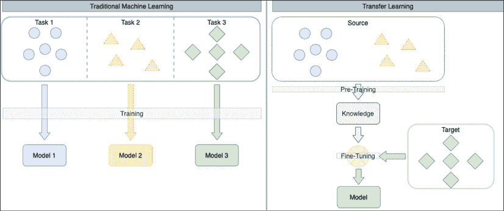
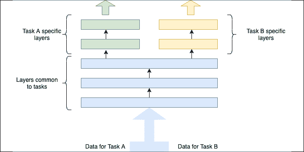
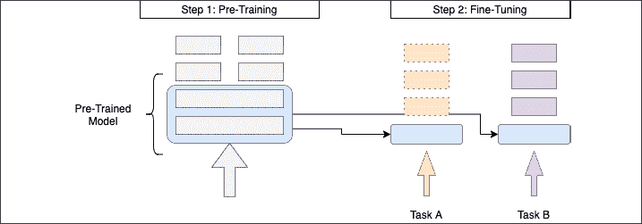
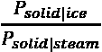
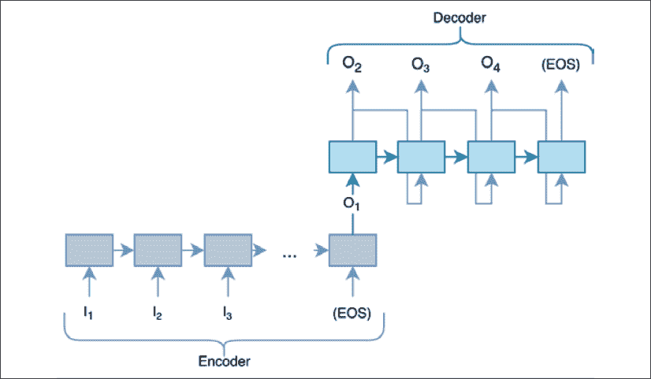
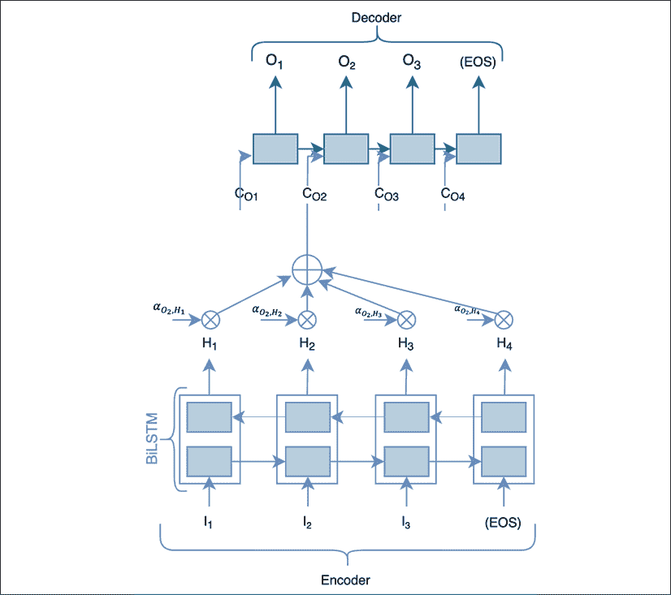
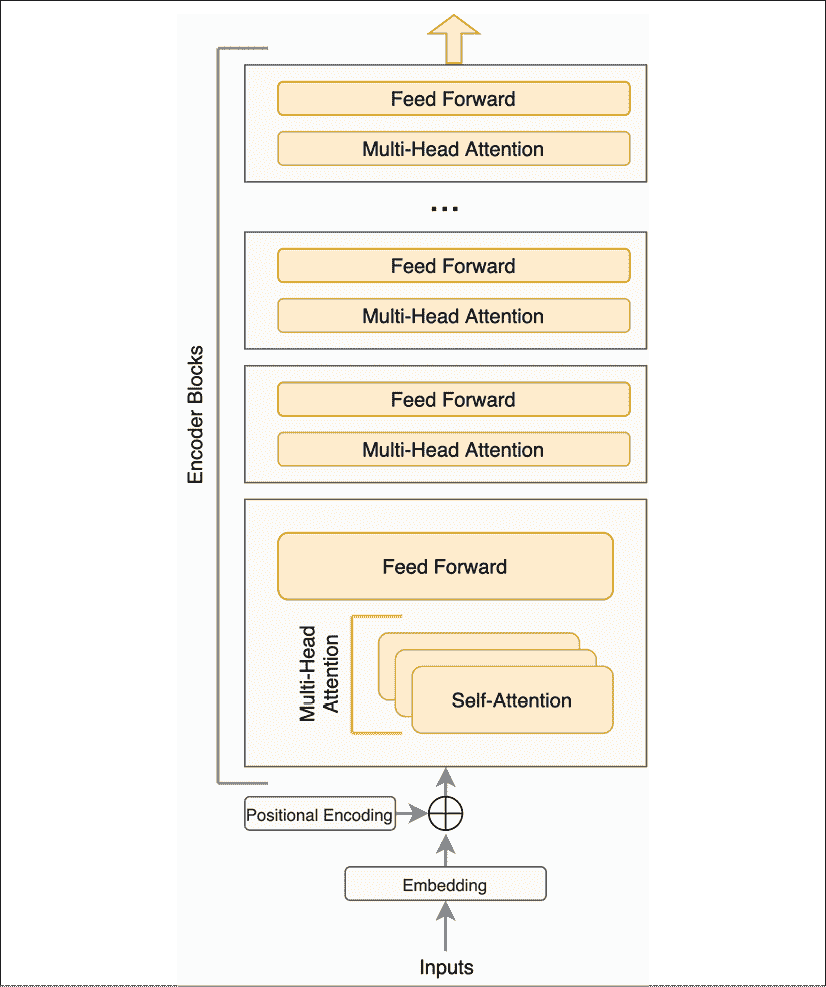
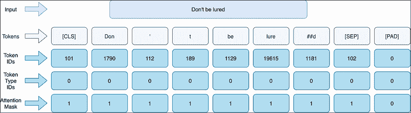
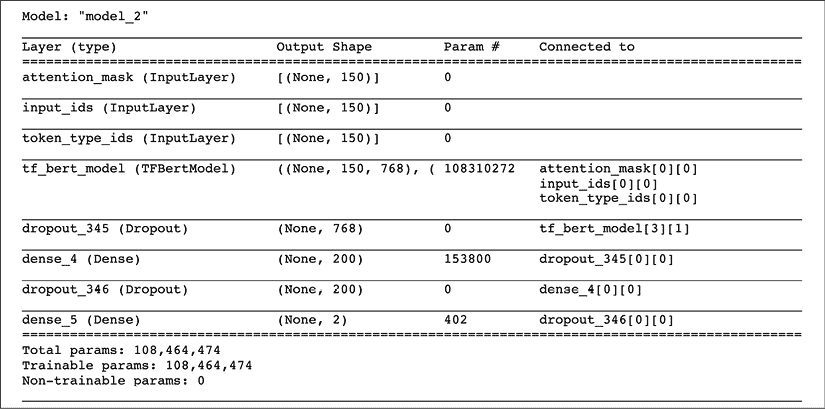
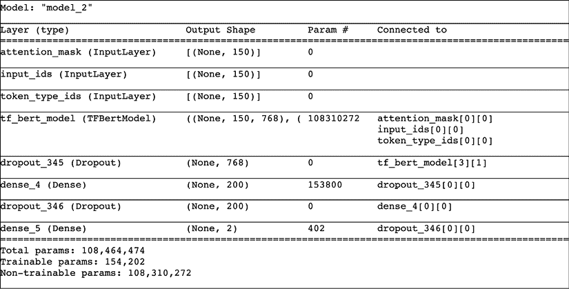

# 第四章：使用 BERT 进行迁移学习

深度学习模型在大量训练数据下表现最好。在该领域，特别是在自然语言处理（NLP）中，拥有足够的标注数据一直是一个巨大的挑战。近年来，迁移学习作为一种成功的方法，取得了显著的成果。模型首先在一个大型语料库上以无监督或半监督的方式进行训练，然后针对特定应用进行微调。这些模型已经展示了出色的效果。在本章中，我们将基于 IMDb 电影评论情感分析的任务，使用迁移学习构建基于**GloVe**（**全局词向量表示**）预训练词向量和**BERT**（**双向编码器表示变换器**）上下文模型的模型。本章将涵盖以下内容：

+   迁移学习概述及其在 NLP 中的应用

+   在模型中加载预训练的 GloVe 词向量

+   使用预训练的 GloVe 词向量和微调构建情感分析模型

+   使用 Attention 的上下文词嵌入概述 – BERT

+   使用 Hugging Face 库加载预训练的 BERT 模型

+   使用预训练和自定义的基于 BERT 的微调模型进行情感分析

迁移学习是使 NLP 取得快速进展的核心概念，我们首先讨论迁移学习。

# 迁移学习概述

传统上，机器学习模型是针对特定任务的性能进行训练的。它只期望在该任务上有效，并且不太可能在该任务之外表现得很好。以 IMDb 电影评论情感分类问题为例，参考*第二章*，*使用 BiLSTM 理解自然语言中的情感*。为这个特定任务训练的模型只针对这个任务进行了优化。如果我们想训练另一个模型，就需要一组与之不同任务相关的标注数据。如果没有足够的标注数据来支持该任务，构建另一个模型可能是无效的。

迁移学习是学习数据的基本表示的概念，这种表示可以适应不同的任务。在迁移学习中，可以使用更丰富的可用数据集来蒸馏知识，并为特定任务构建新的机器学习模型。通过利用这些知识，新的机器学习模型即使在没有足够的标注数据的情况下，也能取得不错的性能，这通常是传统机器学习方法无法获得良好结果的情况。为了使这一方案有效，有几个重要的考虑因素：

+   知识蒸馏步骤，称为**预训练**，应该有大量的可用数据，而且这些数据相对便宜

+   适应性调整，通常称为微调，应该在与预训练数据相似的数据上进行

下面的图示说明了这个概念：



图 4.1：比较传统机器学习与迁移学习

这种技术在计算机视觉中非常有效。ImageNet 通常被用作预训练的数据集。然后，特定的模型会针对各种任务进行微调，如图像分类、物体检测、图像分割和姿势检测等。

## 迁移学习的类型

**领域**和**任务**的概念支撑了迁移学习的概念。领域代表了一个特定的知识或数据领域。新闻文章、社交媒体帖子、医疗记录、维基百科条目和法院判决等可以视为不同领域的例子。任务是在领域中的特定目标或动作。推文的情感分析和立场检测是社交媒体帖子领域中的具体任务。癌症和骨折的检测可能是医疗记录领域中的不同任务。不同类型的迁移学习有不同的源领域和目标领域及任务的组合。下面描述了三种主要的迁移学习类型，分别是领域适应、多任务学习和顺序学习。

### 领域适应

在这种设置下，源任务和目标任务的领域通常是相同的。然而，它们之间的差异与训练数据和测试数据的分布有关。这种迁移学习的情况与任何机器学习任务中的一个基本假设有关——假设训练数据和测试数据是*i.i.d.*。第一个`i`代表*独立*，意味着每个样本与其他样本是独立的。在实践中，当存在反馈循环时（如推荐系统中的情况），这一假设可能会被违反。第二部分是*i.d.*，代表*同分布*，意味着训练样本和测试样本之间标签及其他特征的分布是相同的。

假设领域是动物照片，任务是识别照片中的猫。这个任务可以建模为一个二分类问题。同分布假设意味着训练样本和测试样本中猫的分布是相似的。这也意味着照片的特征，如分辨率、光照条件和方向等，是非常相似的。实际上，这一假设也常常被违反。

有一个关于早期感知器模型的案例，该模型用于识别树林中的坦克。模型在训练集上表现得相当好。当测试集被扩展时，发现所有的树林中的坦克照片都是在晴天拍摄的，而没有坦克的树林照片则是在阴天拍摄的。

在这种情况下，网络学会了区分晴天和阴天的条件，而非坦克的有无。在测试过程中，提供的图片来自不同的分布，但属于相同的领域，这导致了模型的失败。

处理相似情境的过程被称为领域适应。领域适应有很多技术，其中之一就是数据增强。在计算机视觉中，训练集中的图像可以被裁剪、扭曲或旋转，并可以对其应用不同程度的曝光、对比度或饱和度。这些变换可以增加训练数据量，并且能够减少训练数据和潜在测试数据之间的差距。在语音和音频处理中，也会使用类似的技术，通过向音频样本中添加随机噪声，包括街道声或背景闲聊声来进行增强。领域适应技术在传统机器学习中非常成熟，已有许多相关资源。

然而，迁移学习令人兴奋之处在于，使用来自不同源领域或任务的数据进行预训练，可以在另一个任务或领域上提升模型性能。这个领域有两种迁移学习方式。第一种是多任务学习，第二种是序列学习。

### 多任务学习

在多任务学习中，不同但相关的任务数据会通过一组共享层进行处理。然后，可能会在顶部添加一些任务特定的层，这些层用于学习特定任务目标的相关信息。*图 4.2*展示了多任务学习的设置：



图 4.2：多任务迁移学习

这些任务特定层的输出将通过不同的损失函数进行评估。所有任务的所有训练样本都会通过模型的所有层进行处理。任务特定层并不期望能够在所有任务上表现良好。期望是共享层能够学习一些不同任务间共享的潜在结构。关于结构的信息提供了有用的信号，并且提升了所有模型的性能。每个任务的数据都有许多特征，但这些特征可以用于构建对其他相关任务有用的表示。

直观上，人们在掌握更复杂技能之前，通常会先学习一些基础技能。学习写字首先需要掌握握笔或铅笔的技巧。写字、绘画和画画可以视为不同的任务，它们共享一个标准的“层”，即握笔或铅笔的技能。同样的概念适用于学习新语言的过程，其中一种语言的结构和语法可能有助于学习相关语言。学习拉丁语系语言（如法语、意大利语和西班牙语）会变得更加轻松，如果你已经掌握了其中一种拉丁语言，因为这些语言共享词根。

多任务学习通过将来自不同任务的数据汇聚在一起，从而增加了可用于训练的数据量。此外，它通过在共享层中尝试学习任务间通用的表示，强制网络更好地进行泛化。

多任务学习是近年来像 GPT-2 和 BERT 这样的模型取得成功的关键原因。它是预训练模型时最常用的技术，之后这些模型可以用于特定任务。

### 序列学习

序列学习是最常见的迁移学习形式。之所以这样命名，是因为它包含了两个按顺序执行的简单步骤。第一步是预训练，第二步是微调。这些步骤如*图 4.3*所示：



图 4.3：序列学习

第一步是预训练一个模型。最成功的预训练模型使用某种形式的多任务学习目标，如图中左侧所示。用于预训练的模型的一部分随后会用于图中右侧所示的不同任务。这个可重用的预训练模型部分依赖于具体的架构，可能具有不同的层。图 4.3 中显示的可重用部分仅为示意图。在第二步中，预训练模型被加载并作为任务特定模型的起始层。预训练模型学到的权重可以在任务特定模型训练时被冻结，或者这些权重可以更新或微调。当权重被冻结时，这种使用预训练模型的模式称为*特征提取*。

一般来说，微调相比于特征提取方法会提供更好的性能。然而，这两种方法各有优缺点。在微调中，并非所有权重都会被更新，因为任务特定的训练数据可能较小。如果预训练模型是单词的嵌入，那么其他嵌入可能会变得过时。如果任务的词汇量较小或包含许多词汇外的单词，这可能会影响模型的性能。通常来说，如果源任务和目标任务相似，微调会产生更好的结果。

一个预训练模型的例子是 Word2vec，我们在*第一章*，*自然语言处理基础*中提到过。还有一个生成词级嵌入的模型叫做**GloVe**，即**全局词表示向量**，由斯坦福大学的研究人员于 2014 年提出。接下来，我们将通过在下一节中使用 GloVe 嵌入重新构建 IMDb 电影情感分析，来进行一次实际的迁移学习之旅。之后，我们将探讨 BERT 并在同样的序列学习环境下应用 BERT。

# IMDb 情感分析与 GloVe 嵌入

在*第二章*，*使用 BiLSTM 理解自然语言情感*中，构建了一个 BiLSTM 模型来预测 IMDb 电影评论的情感。该模型从头开始学习词的嵌入。该模型在测试集上的准确率为 83.55%，而当前最先进的结果接近 97.4%。如果使用预训练的嵌入，我们预期模型的准确性会有所提升。让我们试试看，并了解迁移学习对这个模型的影响。但首先，我们来了解一下 GloVe 嵌入模型。

## GloVe 嵌入

在*第一章*，*NLP 基础*中，我们讨论了基于负采样跳字模型的 Word2Vec 算法。GloVe 模型于 2014 年发布，比 Word2Vec 论文晚了一年。GloVe 和 Word2Vec 模型相似，都是通过周围的单词来确定一个词的嵌入。然而，这些上下文单词的出现频率不同。有些上下文单词在文本中出现的频率高于其他单词。由于这种出现频率的差异，某些词的训练数据可能比其他词更常见。

超过这一部分，Word2Vec 并未以任何方式使用这些共现统计数据。GloVe 考虑了这些频率，并假设共现提供了重要的信息。名称中的*Global*部分指的是模型在整个语料库中考虑这些共现的事实。GloVe 并不专注于共现的概率，而是专注于考虑探测词的共现比率。

在论文中，作者以*冰*和*蒸汽*为例来说明这一概念。假设*固体*是另一个将用于探测冰和蒸汽关系的词。给定蒸汽时，固体的出现概率为`p[solid|steam]`。直观上，我们预期这个概率应该很小。相反，固体与冰一起出现的概率表示为`p[solid|ice]`，预计会很大。如果计算 ，我们预期这个值会很显著。如果用气体作为探测词来计算同样的比率，我们会预期相反的行为。如果两者出现的概率相等，不论是由于探测词与之无关，还是与两个词出现的概率相同，那么比率应接近 1。一个同时与冰和蒸汽都相关的探测词是*水*。一个与冰或蒸汽无关的词是*时尚*。GloVe 确保这种关系被纳入到生成的词嵌入中。它还优化了稀有共现、数值稳定性问题的计算等方面。

现在让我们看看如何使用这些预训练的嵌入来预测情感。第一步是加载数据。这里的代码与*第二章*，*使用 BiLSTM 理解自然语言情感*中的代码相同；此处提供是为了完整性。

本练习的所有代码都在 GitHub 的`chapter4-Xfer-learning-BERT`目录中的文件`imdb-transfer-learning.ipynb`里。

## 加载 IMDb 训练数据

TensorFlow Datasets 或`tfds`包将被用于加载数据：

```py
import tensorflow as tf
import tensorflow_datasets as tfds
import numpy as np
import pandas as pd
imdb_train, ds_info = tfds.load(name="imdb_reviews",
                      split="train", 
                      with_info=True, as_supervised=True)
imdb_test = tfds.load(name="imdb_reviews", split="test", 
                      as_supervised=True) 
```

注意，额外的 50,000 条未标注的评论在本练习中被忽略。训练集和测试集加载完毕后，评论内容需要进行分词和编码：

```py
# Use the default tokenizer settings
tokenizer = tfds.features.text.Tokenizer()
vocabulary_set = set()
MAX_TOKENS = 0
for example, label in imdb_train:
  some_tokens = tokenizer.tokenize(example.numpy())
  if MAX_TOKENS < len(some_tokens):
            MAX_TOKENS = len(some_tokens)
  vocabulary_set.update(some_tokens) 
```

上面显示的代码对评论文本进行了分词，并构建了一个词汇表。这个词汇表用于构建分词器：

```py
imdb_encoder = tfds.features.text.TokenTextEncoder(vocabulary_set,
                                                   **lowercase=****True**,
                                                   tokenizer=tokenizer)
vocab_size = imdb_encoder.vocab_size
print(vocab_size, MAX_TOKENS) 
```

```py
93931 2525 
```

注意，在编码之前，文本已经被转换为小写。转换为小写有助于减少词汇量，并且可能有利于后续查找对应的 GloVe 向量。注意，大写字母可能包含重要信息，这对命名实体识别（NER）等任务有帮助，我们在前面的章节中已涉及过。此外，并非所有语言都区分大写和小写字母。因此，这一转换应在充分考虑后执行。

现在分词器已准备好，数据需要进行分词，并将序列填充到最大长度。由于我们希望与*第二章*《使用 BiLSTM 理解自然语言中的情感》中训练的模型进行性能比较，因此可以使用相同的设置，即最多采样 150 个评论词汇。以下便捷方法有助于执行此任务：

```py
# transformation functions to be used with the dataset
from tensorflow.keras.preprocessing import sequence
def encode_pad_transform(sample):
    encoded = imdb_encoder.encode(sample.numpy())
    pad = sequence.pad_sequences([encoded], padding='post', 
                                 maxlen=150)
    return np.array(pad[0], dtype=np.int64)  
def encode_tf_fn(sample, label):
    encoded = tf.py_function(encode_pad_transform, 
                                       inp=[sample], 
                                       Tout=(tf.int64))
    encoded.set_shape([None])
    label.set_shape([])
    return encoded, label 
```

最后，数据使用上面提到的便捷函数进行编码，如下所示：

```py
encoded_train = imdb_train.map(encode_tf_fn,
                      num_parallel_calls=tf.data.experimental.AUTOTUNE)
encoded_test = imdb_test.map(encode_tf_fn,
                      num_parallel_calls=tf.data.experimental.AUTOTUNE) 
```

此时，所有的训练和测试数据已准备好进行训练。

注意，在限制评论大小时，长评论只会计算前 150 个词。通常，评论的前几句包含上下文或描述，后半部分则是结论。通过限制为评论的前部分，可能会丢失有价值的信息。建议读者尝试一种不同的填充方案，即丢弃评论前半部分的词汇，而不是后半部分，并观察准确度的变化。

下一步是迁移学习中的关键步骤——加载预训练的 GloVe 嵌入，并将其用作嵌入层的权重。

## 加载预训练的 GloVe 嵌入

首先，需要下载并解压预训练的嵌入：

```py
# Download the GloVe embeddings
!wget http://nlp.stanford.edu/data/glove.6B.zip
!unzip glove.6B.zip
Archive:  glove.6B.zip
  inflating: glove.6B.50d.txt        
  inflating: glove.6B.100d.txt       
  inflating: glove.6B.200d.txt       
  inflating: glove.6B.300d.txt 
```

注意，这个下载文件很大，超过 800MB，因此执行这一操作可能需要一些时间。解压后，会有四个不同的文件，如上面的输出所示。每个文件包含 40 万个词汇。主要的区别是生成的嵌入维度不同。

在上一章中，模型使用了 64 的嵌入维度。最近的 GloVe 维度是 50，所以我们将使用该维度。文件格式非常简单。每一行文本有多个由空格分隔的值。每行的第一个项目是单词，其余项目是每个维度的向量值。因此，在 50 维的文件中，每一行将有 51 列。这些向量需要加载到内存中：

```py
dict_w2v = {}
with open('glove.6B.50d.txt', "r") as file:
    for line in file:
        tokens = line.split()
        word = tokens[0]
        vector = np.array(tokens[1:], dtype=np.float32)
        if vector.shape[0] == 50:
            dict_w2v[word] = vector
        else:
            print("There was an issue with " + word)
# let's check the vocabulary size
print("Dictionary Size: ", len(dict_w2v)) 
```

```py
Dictionary Size:  400000 
```

如果代码正确处理了文件，你应该不会看到任何错误，并且字典大小应为 400,000 个单词。一旦这些向量加载完成，就需要创建一个嵌入矩阵。

## 使用 GloVe 创建预训练的嵌入矩阵

到目前为止，我们已经有了数据集、它的词汇表以及 GloVe 单词及其对应向量的字典。然而，这两个词汇表之间没有关联。将它们连接起来的方式是通过创建一个嵌入矩阵。首先，我们来初始化一个全零的嵌入矩阵：

```py
embedding_dim = 50
embedding_matrix = np.zeros((imdb_encoder.vocab_size, embedding_dim)) 
```

请注意，这是一个关键步骤。当使用预训练的词汇表时，无法保证在训练/测试过程中为每个单词找到向量。回想一下之前关于迁移学习的讨论，其中源域和目标域是不同的。差异的一种表现形式是训练数据与预训练模型之间的标记不匹配。随着我们继续进行接下来的步骤，这一点会变得更加明显。

在初始化了这个全零的嵌入矩阵之后，需要对其进行填充。对于评论词汇表中的每个单词，从 GloVe 字典中获取相应的向量。

单词的 ID 是通过编码器获取的，然后将与该条目对应的嵌入矩阵条目设置为获取到的向量：

```py
unk_cnt = 0
unk_set = set()
for word in imdb_encoder.tokens:
    embedding_vector = dict_w2v.get(word)
    if embedding_vector is not None:
        tkn_id = imdb_encoder.encode(word)[0]
        embedding_matrix[tkn_id] = embedding_vector
    else:
        unk_cnt += 1
        unk_set.add(word)
# Print how many weren't found
print("Total unknown words: ", unk_cnt) 
```

```py
Total unknown words:  14553 
```

在数据加载步骤中，我们看到总共有 93,931 个标记。其中 14,553 个单词无法找到，大约占标记的 15%。对于这些单词，嵌入矩阵将是零。这是迁移学习的第一步。现在设置已经完成，我们将需要使用 TensorFlow 来使用这些预训练的嵌入向量。将尝试两种不同的模型——第一种基于特征提取，第二种基于微调。

## 特征提取模型

如前所述，特征提取模型冻结了预训练的权重，并且不更新它们。当前设置中这种方法的一个重要问题是，有大量的标记（超过 14,000 个）没有嵌入向量。这些单词无法与 GloVe 单词列表中的条目匹配。

为了尽量减少预训练词汇表和任务特定词汇表之间未匹配的情况，确保使用相似的分词方案。GloVe 使用的是基于单词的分词方案，类似于斯坦福分词器提供的方案。如*第一章*所述，*自然语言处理基础*，这种方法比上述用于训练数据的空格分词器效果更好。我们发现由于不同的分词器，存在 15%的未匹配词汇。作为练习，读者可以实现斯坦福分词器并查看未识别词汇的减少情况。

更新的方法，如 BERT，使用部分子词分词器。子词分词方案可以将单词分解为更小的部分，从而最小化词汇不匹配的机会。一些子词分词方案的例子包括**字节对编码**（**BPE**）或 WordPiece 分词法。本章中的 BERT 部分更详细地解释了子词分词方案。

如果没有使用预训练的词向量，那么所有单词的向量将几乎从零开始，通过梯度下降进行训练。在这种情况下，词向量已经经过训练，因此我们期望训练会更快。作为基准，BiLSTM 模型在训练词嵌入时，一个周期的训练大约需要 65 秒到 100 秒之间，大多数值大约在 63 秒左右，这是在一台配有 i5 处理器和 Nvidia RTX-2070 GPU 的 Ubuntu 机器上进行的。

现在，让我们构建模型，并将上面生成的嵌入矩阵插入到模型中。需要设置一些基本参数：

```py
# Length of the vocabulary in chars
vocab_size = imdb_encoder.vocab_size # len(chars)
# Number of RNN units
rnn_units = 64
# batch size
BATCH_SIZE=100 
```

设置一个便捷的函数可以实现快速切换。这个方法使得可以使用相同的架构但不同的超参数来构建模型：

```py
from tensorflow.keras.layers import Embedding, LSTM, \
                                    Bidirectional, Dense

def build_model_bilstm(vocab_size, embedding_dim, 
                       rnn_units, batch_size, **train_emb=****False**):
  model = tf.keras.Sequential([
    Embedding(vocab_size, embedding_dim, mask_zero=True,
              **weights=[embedding_matrix], trainable=train_emb**),
   Bidirectional(LSTM(rnn_units, return_sequences=True, 
                                      dropout=0.5)),
   Bidirectional(LSTM(rnn_units, dropout=0.25)),
   Dense(1, activation='sigmoid')
  ])
  return model 
```

该模型与上一章中使用的模型完全相同，唯一不同的是上述的高亮代码片段。首先，现在可以传递一个标志来指定是否进一步训练词嵌入或冻结它们。此参数默认设置为 false。第二个变化出现在`Embedding`层的定义中。一个新参数`weights`用于将嵌入矩阵作为层的权重加载。在这个参数之后，传递了一个布尔参数`trainable`，该参数决定在训练过程中该层的权重是否应更新。现在可以像这样创建基于特征提取的模型：

```py
model_fe = build_model_bilstm(
  vocab_size = vocab_size,
  embedding_dim=embedding_dim,
  rnn_units=rnn_units,
  batch_size=BATCH_SIZE)
model_fe.summary() 
```

```py
Model: "sequential_5"
_________________________________________________________________
Layer (type)                 Output Shape              Param #   
=================================================================
embedding_5 (Embedding)      (None, None, 50)          4696550   
_________________________________________________________________
bidirectional_6 (Bidirection (None, None, 128)         58880     
_________________________________________________________________
bidirectional_7 (Bidirection (None, 128)               98816     
_________________________________________________________________
dense_5 (Dense)              (None, 1)                 129       
=================================================================
Total params: 4,854,375
Trainable params: 157,825
Non-trainable params: 4,696,550
_________________________________________________________________ 
```

该模型大约有 480 万个可训练参数。需要注意的是，这个模型比之前的 BiLSTM 模型小得多，后者有超过 1200 万个参数。一个更简单或更小的模型将训练得更快，并且由于模型容量较小，可能更不容易发生过拟合。

该模型需要使用损失函数、优化器和度量指标进行编译，以便观察模型的进展。二元交叉熵是处理二元分类问题的合适损失函数。Adam 优化器在大多数情况下是一个不错的选择。

**自适应矩估计或 Adam 优化器**

在深度神经网络训练中的反向传播中，最简单的优化算法是小批量**随机梯度下降**（**SGD**）。任何预测误差都会反向传播，调整各个单元的权重（即参数）。Adam 是一个方法，解决了 SGD 的一些问题，例如陷入次优局部极小值，以及对每个参数使用相同的学习率。Adam 为每个参数计算自适应学习率，并根据误差以及先前的调整来调整它们。因此，Adam 比其他优化方法收敛得更快，并且被推荐作为默认选择。

将观察到的指标与之前相同，包括准确率、精确率和召回率：

```py
model_fe.compile(loss='binary_crossentropy', 
             optimizer='adam', 
             metrics=['accuracy', 'Precision', 'Recall']) 
```

在设置好预加载批次后，模型准备进行训练。与之前相似，模型将训练 10 个周期：

```py
# Prefetch for performance
encoded_train_batched = encoded_train.batch(BATCH_SIZE).prefetch(100)
model_fe.fit(encoded_train_batched, epochs=10) 
```

```py
Epoch 1/10
250/250 [==============================] - 28s 113ms/step - loss: 0.5896 - accuracy: 0.6841 - Precision: 0.6831 - Recall: 0.6870
Epoch 2/10
250/250 [==============================] - 17s 70ms/step - loss: 0.5160 - accuracy: 0.7448 - Precision: 0.7496 - Recall: 0.7354
...
Epoch 9/10
250/250 [==============================] - 17s 70ms/step - loss: 0.4108 - accuracy: 0.8121 - Precision: 0.8126 - Recall: 0.8112
Epoch 10/10
250/250 [==============================] - 17s 70ms/step - loss: 0.4061 - accuracy: 0.8136 - Precision: 0.8147 - Recall: 0.8118 
```

有几点可以立刻看出。该模型的训练速度显著提高。每个周期大约需要 17 秒，第一个周期最多需要 28 秒。其次，模型没有过拟合。训练集上的最终准确率略高于 81%。在之前的设置中，训练集上的准确率是 99.56%。

还需要注意的是，在第十个周期结束时，准确率仍在上升，仍有很大的提升空间。这表明，继续训练该模型可能会进一步提高准确率。将周期数快速更改为 20 并训练模型，测试集上的准确率达到了 85%以上，精确率为 80%，召回率为 92.8%。

现在，让我们理解这个模型的实用性。为了评估该模型的质量，应该在测试集上评估其表现：

```py
model_fe.evaluate(encoded_test.batch(BATCH_SIZE)) 
```

```py
250/Unknown - 21s 85ms/step - loss: 0.3999 - accuracy: 0.8282 - Precision: 0.7845 - Recall: 0.9050 
```

与之前模型在测试集上 83.6%的准确率相比，这个模型的准确率为 82.82%。这个表现相当令人印象深刻，因为该模型的体积仅为前一个模型的 40%，并且训练时间减少了 70%，而准确率仅下降不到 1%。该模型的召回率略高，准确率稍差。这个结果并不完全出乎意料。该模型中有超过 14,000 个零向量！为了解决这个问题，并且尝试基于微调的顺序迁移学习方法，我们来构建一个基于微调的模型。

## 微调模型

使用便捷函数创建微调模型非常简单。只需要将`train_emb`参数设置为 true 即可：

```py
model_ft = build_model_bilstm(
  vocab_size=vocab_size,
  embedding_dim=embedding_dim,
  rnn_units=rnn_units,
  batch_size=BATCH_SIZE,
  train_emb=True)
model_ft.summary() 
```

该模型的大小与特征提取模型相同。然而，由于嵌入向量将会被微调，训练预计会稍微耗时一些。现在可以更新几千个零嵌入。最终的准确率预计会比之前的模型好得多。该模型使用相同的损失函数、优化器和指标进行编译，并训练了 10 个周期：

```py
model_ft.compile(loss='binary_crossentropy', 
             optimizer='adam', 
             metrics=['accuracy', 'Precision', 'Recall'])
model_ft.fit(encoded_train_batched, epochs=10) 
```

```py
Epoch 1/10
250/250 [==============================] - 35s 139ms/step - loss: 0.5432 - accuracy: 0.7140 - Precision: 0.7153 - Recall: 0.7111
Epoch 2/10
250/250 [==============================] - 24s 96ms/step - loss: 0.3942 - accuracy: 0.8234 - Precision: 0.8274 - Recall: 0.8171
...
Epoch 9/10
250/250 [==============================] - 24s 97ms/step - loss: 0.1303 - accuracy: 0.9521 - Precision: 0.9530 - Recall: 0.9511
Epoch 10/10
250/250 [==============================] - 24s 96ms/step - loss: 0.1132 - accuracy: 0.9580 - Precision: 0.9583 - Recall: 0.9576 
```

这个准确率非常令人印象深刻，但需要在测试集上验证：

```py
model_ft.evaluate(encoded_test.batch(BATCH_SIZE)) 
```

```py
250/Unknown - 22s 87ms/step - loss: 0.4624 - accuracy: 0.8710 - Precision: 0.8789 - Recall: 0.8605 
```

这是我们目前为止取得的最佳结果，准确率为 87.1%。关于数据集的最新成果数据可以通过[paperswithcode.com](http://paperswithcode.com)网站获取。具有可重复代码的研究论文会在数据集的排行榜上展示。这个结果在撰写时大约排在[paperswithcode.com](http://paperswithcode.com)网站的 SOTA（最新技术）结果中第十七位！

还可以看出，网络有一点过拟合。可以在`Embedding`层和第一个`LSTM`层之间添加一个`Dropout`层，以帮助减少这种过拟合。还需要注意的是，这个网络的训练速度仍然比从头开始训练嵌入要快得多。大多数训练周期仅花费了 24 秒。总体而言，这个模型的体积较小，训练所需时间少，且准确率更高！这就是为什么迁移学习在机器学习和自然语言处理（NLP）中如此重要的原因。

到目前为止，我们已经看到上下文无关的词嵌入的使用。使用这种方法的主要挑战在于，单词根据上下文可能有多重含义。比如单词*bank*，它既可以指存放钱财和贵重物品的地方，也可以指河岸。在这个领域中，最近的创新是 BERT，它在 2019 年 5 月发布。提高电影评论情感分析准确性的下一步是使用一个预训练的 BERT 模型。下一部分将解释 BERT 模型、其重要的创新以及使用该模型进行当前任务的影响。请注意，BERT 模型非常庞大！如果您的本地计算资源不足，使用带有 GPU 加速器的 Google Colab 是下一部分的一个绝佳选择。

# 基于 BERT 的迁移学习

像 GloVe 这样的嵌入是上下文无关的嵌入。在自然语言处理的语境下，缺乏上下文可能会有一定的局限性。正如之前讨论的，单词 bank 在不同的上下文中可以有不同的意思。**双向编码器表示** **来自变换器**，或称**BERT**，是 Google 研究团队于 2019 年 5 月发布的，展示了在基准测试中的显著改进。BERT 模型建立在之前的多个创新之上。BERT 的论文还介绍了 ERT 工作中的几项创新。

使 BERT 成为可能的两个基础性进展是**编码器-解码器网络**架构和**注意力机制**。注意力机制进一步发展，产生了**变换器架构**。变换器架构是 BERT 的基础构建块。这些概念将在接下来的章节中详细介绍。在这两个部分之后，我们将讨论 BERT 模型的具体创新和结构。

## 编码器-解码器网络

我们已经看到了 LSTM 和 BiLSTM 在将句子建模为单词序列中的应用。这些序列可以具有不同的长度，因为句子的单词数量不同。回想一下在 *第二章*，*利用 BiLSTM 理解自然语言中的情感* 中，我们讨论了 LSTM 的核心概念是一个按时间展开的单元。对于每个输入符号，LSTM 单元都会生成一个输出。因此，LSTM 产生的输出数量取决于输入符号的数量。所有这些输入符号通过 `TimeDistributed()` 层结合起来，以供后续网络中的 `Dense()` 层使用。主要问题在于输入和输出序列的长度是相互关联的。该模型无法有效处理变长序列。因此，输入和输出可能具有不同长度的翻译类任务将无法很好地适应这种架构。

解决这些挑战的方法是在 2014 年由 Ilya Sutskever 等人撰写的论文《*Sequence to Sequence Learning with Neural Networks*》中提出的。该模型也被称为 **seq2seq** 模型。

基本思想如下面的图所示：



图 4.4：编码器-解码器网络

该模型分为两个部分——编码器和解码器。一个特殊的符号用于表示输入序列的结束，并附加到输入序列中。请注意，现在输入序列的长度可以是任意的，因为上述图中的这个句子结束符号（**EOS**）表示输入的结束。在上述图中，输入序列由符号（`I[1]`，`I[2]`，`I[3]`，…）表示。每个输入符号在向量化后传递给 LSTM 模型。输出只从最后一个（**EOS**）符号收集。编码器 LSTM 网络为（**EOS**）符号生成的向量是整个输入序列的表示。它可以被看作是整个输入的总结。一个变长序列并没有被转换成固定长度或维度的向量。

这个向量成为解码器层的输入。该模型是自回归的，意味着解码器前一步生成的输出被输入到下一步作为输入。输出生成会持续进行，直到生成特殊的（**EOS**）符号为止。这种方案允许模型确定输出序列的长度。它打破了输入序列和输出序列长度之间的依赖关系。从概念上讲，这是一个易于理解的模型。然而，这是一个强大的模型。许多任务可以被转化为序列到序列的问题。

一些例子包括将一句话从一种语言翻译成另一种语言、总结一篇文章，其中输入序列是文章的文本，输出序列是摘要，或者是问答问题，其中问题是输入序列，答案是输出序列。语音识别是一个序列到序列的问题，输入序列是 10 毫秒的语音样本，输出是文本。在发布时，这个模型引起了广泛关注，因为它对 Google Translate 的质量产生了巨大的影响。在使用该模型的九个月里，seq2seq 模型背后的团队取得了比 Google Translate 经过 10 多年改进后更高的性能。

**伟大的人工智能觉醒**

《纽约时报》在 2016 年发布了一篇精彩的文章，标题为上述内容，记录了深度学习的发展历程，特别是关于 seq2seq 论文的作者以及该论文对 Google Translate 质量的巨大影响。这篇文章强烈推荐阅读，能够展示这一架构对自然语言处理（NLP）的变革性影响。文章链接：[`www.nytimes.com/2016/12/14/magazine/the-great-ai-awakening.html`](https://www.nytimes.com/2016/12/14/magazine/the-great-ai-awakening.html)。

在掌握这些技术后，下一步的创新便是引入了**注意力机制**，它允许建模不同 tokens 之间的依赖关系，无论它们之间的距离如何。注意力模型成为了**Transformer 模型**的基石，后者将在下一节中介绍。

## 注意力模型

在编码器-解码器模型中，网络的编码器部分创建了输入序列的固定维度表示。随着输入序列长度的增加，越来越多的输入被压缩到这个向量中。通过处理输入 tokens 生成的编码或隐藏状态无法被解码器层访问。编码器状态对解码器是隐藏的。注意力机制使得网络的解码器部分能够看到编码器的隐藏状态。这些隐藏状态在*图 4.4*中被表示为每个输入 token 的输出（I[1]，I[2]，I[3]，…），但只显示为输入到下一个 token。

在注意力机制中，这些输入 token 的编码也会提供给解码器层。这被称为**一般注意力**，它指的是输出 tokens 直接依赖于输入 tokens 的编码或隐藏状态的能力。这里的主要创新是解码器基于一系列由编码输入生成的向量进行操作，而不是在输入结束时生成的固定向量。注意力机制使得解码器在解码时能够将注意力集中在编码输入向量的子集上，因此得名。

另一种注意力形式被称为**自注意力**。自注意力使得不同位置的输入标记之间可以建立连接。如*图 4.4*中的模型所示，输入标记只看前一个标记的编码。自注意力则使其能够查看前面标记的编码。这两种形式都是对编码器-解码器架构的改进。

虽然有很多种注意力架构，但一种流行的形式被称为**巴赫达努注意力**。它以该论文的第一作者命名，这篇论文于 2016 年发表，其中提出了这种注意力机制。基于编码器-解码器网络，这种形式使得每个输出状态可以查看编码后的输入并为这些输入学习一些权重。因此，每个输出可以关注不同的输入标记。该模型的示意图如*图 4.5*所示，这是*图 4.4*的修改版本：



图 4.5：巴赫达努注意力架构

相较于编码器-解码器架构，注意力机制有两个具体的变化。第一个变化发生在编码器中。此处的编码器层使用的是 BiLSTM（双向长短时记忆网络）。使用 BiLSTM 使得每个单词都能够从它前后的单词中学习。在标准的编码器-解码器架构中使用的是 LSTM，这意味着每个输入单词只能从它之前的单词中学习。

第二个变化与解码器如何使用编码器的输出有关。在之前的架构中，只有最后一个标记的输出，即句子结束标记，才使用整个输入序列的摘要。在巴赫达努注意力（Bahdanau Attention）架构中，每个输入标记的隐藏状态输出会乘以一个*对齐权重*，该权重表示特定位置的输入标记与目标输出标记之间的匹配程度。通过将每个输入的隐藏状态输出与对应的对齐权重相乘并将所有结果连接起来，可以计算出一个上下文向量。该上下文向量与先前的输出标记一起被输入到输出标记中。

*图 4.5*展示了这种计算过程，仅针对第二个输出标记。这个对齐模型以及每个输出标记的权重，可以帮助指向在生成该输出标记时最有用的输入标记。请注意，某些细节已被简化以便简洁，详细内容可以在论文中找到。我们将在后续章节中从零开始实现注意力机制。

**注意力机制不是一种解释**

将对齐分数或注意力权重解读为模型预测特定输出标记的解释是非常诱人的。曾有一篇名为“注意力机制是一种解释”的论文，测试了这一假设。研究的结论是，注意力机制不应被解释为一种解释。即使在相同的输入集上使用不同的注意力权重，也可能会产生相同的输出。

Attention 模型的下一次进展体现在 2017 年的 Transformer 架构中。Transformer 模型是 BERT 架构的核心，所以接下来我们来理解它。

## Transformer 模型

Vaswani 等人于 2017 年发表了一篇开创性论文，标题为 *Attention Is All You Need*。这篇论文奠定了 Transformer 模型的基础，Transformer 模型也成为了许多最近先进模型的核心，比如 ELMo、GPT、GPT-2 和 BERT。Transformer 模型是在 Attention 模型的基础上，通过其关键创新来构建的——使解码器能够看到所有输入的隐藏状态，同时去除其中的递归结构，这样可以避免因处理输入序列的顺序性而导致训练过程缓慢。

Transformer 模型包括编码器和解码器部分。这种编码器-解码器结构使得它在机器翻译类任务中表现最佳。然而，并非所有任务都需要完整的编码器和解码器层。BERT 只使用编码器部分，而像 GPT-2 这样的生成模型则使用解码器部分。本节只讨论架构的编码器部分。下一章将讨论文本生成以及使用 Transformer 解码器的最佳模型。因此，解码器将在那一章中讲解。

**什么是语言模型？**

**语言模型**（**LM**）任务通常被定义为预测一个单词序列中的下一个词。语言模型特别适用于文本生成，但在分类任务中效果较差。GPT-2 就是一个符合语言模型定义的例子。这样的模型只会从其左侧出现的词或符号中获取上下文（对于从右至左的语言，则相反）。这种做法在文本生成任务中是合理的。然而，在其他任务中，比如问答或翻译，完整的句子应该是可用的。在这种情况下，使用能够从两侧获取上下文的双向模型是有用的。BERT 就是这样一个模型。它放弃了自回归特性，以便从词或符号的两侧获取上下文信息。

Transformer 的编码器模块由多个子层组成——多头自注意力子层和前馈子层。自注意力子层查看输入序列中的所有词，并生成这些词在彼此上下文中的编码。前馈子层由两层线性变换和中间的 ReLU 激活组成。每个编码器模块由这两个子层组成，而整个编码器则由六个这样的模块构成，如 *图 4.6* 所示：



图 4.6：Transformer 编码器架构

在每个编码器块中，都会对多头注意力块和前馈块进行残差连接。当将子层的输出与其接收到的输入相加时，会进行层归一化。这里的主要创新是**多头注意力**块。共有八个相同的注意力块，其输出被连接起来，生成多头注意力输出。每个注意力块接受编码并定义三个新向量，分别称为查询、键和值向量。这些向量被定义为 64 维，虽然这个维度是一个可以调节的超参数。查询、键和值向量通过训练来学习。

为了理解这个过程，假设输入包含三个标记。每个标记都有一个对应的嵌入。每个标记都会初始化其查询、键和值向量。同时还初始化一个权重向量，当它与输入标记的嵌入相乘时，生成该标记的键。计算出标记的查询向量后，它将与所有输入标记的键向量相乘。需要注意的是，编码器能够访问所有输入，位于每个标记的两侧。因此，已经通过获取相关词的查询向量和输入序列中所有标记的值向量，计算出了一个得分。所有这些得分都会通过软最大化（softmax）处理。结果可以解释为，为了让特定输入标记了解输入中的哪些标记是重要的，提供了一种衡量方式。

从某种程度上讲，相关输入标记会对其他具有高软最大得分的标记保持关注。当输入标记对自身保持关注时，这个得分预期会很高，但它也可以对其他标记保持较高的关注。接下来，这个软最大得分将与每个标记的值向量相乘。然后，将所有这些不同输入标记的值向量加总起来。具有更高软最大得分的标记的值向量将对相关输入标记的输出值向量贡献更大。这完成了在注意力层中计算给定标记的输出。

多头自注意力机制生成查询、键和值向量的多个副本，并使用权重矩阵来计算从输入标记的嵌入中获取查询。论文中提出了八个头，虽然可以对此进行实验。另一个权重矩阵用于将每个头的多个输出结合起来，并将它们连接成一个输出值向量。

这个输出值向量被输入到前馈层，前馈层的输出将传递到下一个编码器块，或者在最后一个编码器块中成为模型的输出。

BERT 核心模型实际上是 Transformer 编码器模型的核心，但引入了一些特定的增强功能，接下来会详细介绍。注意，使用 BERT 模型要容易得多，因为所有这些细节都被抽象化了。然而，了解这些细节可能有助于理解 BERT 的输入和输出。在下一节中将介绍如何使用 BERT 进行 IMDb 情感分析的代码。

## **BERT**（Bidirectional Encoder Representations from Transformers）模型

Transformer 架构的出现是自然语言处理领域的一个重要时刻。这种架构通过几种衍生架构推动了许多创新。BERT 就是这样一种模型。它于 2018 年发布。BERT 模型仅使用 Transformer 架构的编码器部分。编码器的布局与前面描述的相同，包括 12 个编码器块和 12 个注意力头。隐藏层的大小为 768。这组超参数被称为*BERT Base*。这些超参数导致总模型大小为 1.1 亿参数。还发布了一个更大的模型，其中包括 24 个编码器块、16 个注意力头和隐藏单元大小为 1,024。自论文发布以来，还出现了许多 BERT 的不同变体，如 ALBERT、DistilBERT、RoBERTa、CamemBERT 等等。每个模型都试图通过提高准确性或训练/推理时间来改进 BERT 的性能。

BERT 的预训练方式是独特的。它采用了上面解释的多任务迁移学习原理，用于两个不同的目标进行预训练。第一个目标是**Masked Language Model**（MLM）任务。在这个任务中，一些输入标记会被随机屏蔽。模型必须根据屏蔽标记的两侧的标记来预测正确的标记。具体来说，输入序列中的一个标记在 80%的情况下会被特殊的`[MASK]`标记替换。在 10%的情况下，选择的标记会被词汇表中的另一个随机标记替换。在最后的 10%的情况下，标记保持不变。此方案的结果是模型无法依赖于特定的标记存在，并被迫根据给定标记之前和之后的标记的分布学习上下文表示。如果没有这种屏蔽，模型的双向性质意味着每个单词能间接地从任何方向*看到*自己，这将使得预测目标标记的任务变得非常容易。

模型预训练的第二个目标是 **下一句预测**（**NSP**）。这里的直觉是，许多自然语言处理任务都涉及一对句子。例如，一个问答问题可以将问题建模为第一句，而用于回答问题的段落则成为第二句。模型的输出可能是一个跨度标识符，用于识别段落中作为问题答案的开始和结束标记索引。在句子相似性或释义任务中，可以将两个句子对传入模型，得到一个相似性分数。NSP 模型通过传入带有二元标签的句子对进行训练，标签指示第二句是否跟随第一句。在 50% 的训练样本中，传入的是真正的后续句子，并带有标签 **IsNext**，而在另外 50% 的样本中，传入的是随机句子，并带有标签 **NotNext**。

BERT 还解决了我们在上面 GloVe 示例中看到的一个问题——词汇表外的标记。大约 15% 的标记不在词汇表中。为了解决这个问题，BERT 使用了 **WordPiece** 分词方案，词汇表大小为 30,000 个标记。请注意，这个词汇表比 GloVe 的词汇表要小得多。WordPiece 属于一种叫做 **子词** 分词的类别。这个类别的其他成员包括 **字节对编码**（**BPE**）、SentencePiece 和 unigram 语言模型。WordPiece 模型的灵感来自于 Google 翻译团队在处理日语和韩语文本时的工作。如果你记得第一章中关于分词的讨论，我们曾提到日语不使用空格来分隔单词。因此，很难将其分词成单词。为这类语言创建词汇表的方法对于像英语这样的语言也非常有用，可以保持词典大小在合理范围内。

以德语翻译 *Life Insurance Company* 这个词组为例，它将被翻译为 *Lebensversicherungsgesellschaft*。同样，*Gross Domestic Product* 将翻译为 *Bruttoinlandsprodukt*。如果将单词直接作为词汇，那么词汇表的大小将非常庞大。采用子词方法可以更高效地表示这些单词。

更小的字典可以减少训练时间和内存需求。如果较小的字典不以牺牲词汇外标记为代价，那么它非常有用。为了帮助理解子词标记化的概念，可以考虑一个极端的例子，其中标记化将单词拆分为单个字符和数字。这个词汇表的大小将是 37——包括 26 个字母、10 个数字和空格。一个子词标记化方案的例子是引入两个新标记，* -ing*和* -tion*。每个以这两个标记结尾的单词都可以被拆分为两个子词——后缀之前的部分和这两个后缀之一。通过对语言语法和结构的理解，可以使用词干提取和词形还原等技术来实现这一点。BERT 使用的 WordPiece 标记化方法基于 BPE。在 BPE 中，第一步是定义目标词汇表大小。

接下来，整个文本被转换成仅由单个字符标记组成的词汇表，并映射到出现频率。然后，对此进行多次遍历，将标记对组合在一起，以最大化生成的二元组的频率。对于每个生成的子词，添加一个特殊标记来表示单词的结束，以便进行去标记化处理。此外，如果子词不是单词的开头，则添加`##`标签，以帮助重建原始单词。这个过程会一直进行，直到达到所需的词汇量，或者达到标记的最小频率条件（频率为 1）。BPE 最大化频率，而 WordPiece 则在此基础上增加了另一个目标。

WordPiece 的目标包括通过考虑被合并标记的频率以及合并后的二元组的频率来增加互信息。这对模型做出了细微调整。Facebook 的 RoBERTa 尝试使用 BPE 模型，但并未看到性能上有显著差异。GPT-2 生成模型基于 BPE 模型。

以 IMDB 数据集为例，以下是一个示例句子：

```py
This was an absolutely terrible movie. Don't be `lured` in by Christopher Walken or Michael Ironside. 
```

使用 BERT 进行标记化后，它看起来像这样：

```py
[CLS] This was an absolutely terrible movie . Don' t be `lure ##d` in by Christopher Walk ##en or Michael Iron ##side . [SEP] 
```

`[CLS]`和`[SEP]`是特殊的标记，它们将在稍后介绍。注意，由此产生的单词*lured*被拆分的方式。现在我们理解了 BERT 模型的基本结构，接下来让我们尝试用它进行 IMDB 情感分类问题的迁移学习。第一步是准备数据。

所有 BERT 实现的代码可以在本章的 GitHub 文件夹中的`imdb-transfer-learning.ipynb`笔记本中找到，位于*基于 BERT 的迁移学习*部分。请运行标题为*加载 IMDB 训练数据*的代码段，以确保在继续之前数据已被加载。

### 使用 BERT 进行标记化和规范化

在阅读了 BERT 模型的描述后，你可能会为实现代码而感到紧张。但不要害怕，Hugging Face 的朋友们已经提供了预训练模型和抽象化接口，使得使用像 BERT 这样先进的模型变得轻松。让 BERT 正常工作的通用流程是：

1.  加载预训练模型

1.  实例化分词器并对数据进行分词

1.  设置模型并进行编译

1.  将模型应用于数据

这些步骤每个都不会超过几行代码。所以让我们开始吧。第一步是安装 Hugging Face 库：

```py
!pip install transformers==3.0.2 
```

分词器是第一步——在使用之前需要导入它：

```py
from transformers import BertTokenizer
bert_name = 'bert-base-cased'
tokenizer = BertTokenizer.from_pretrained(bert_name, 
                                          add_special_tokens=True, 
                                          do_lower_case=False,
                                          max_length=150,
                                          pad_to_max_length=True) 
```

这就是加载预训练分词器的全部内容！在上面的代码中有几点需要注意。首先，Hugging Face 发布了多个可供下载的模型。完整的模型和名称列表可以在[`huggingface.co/transformers/pretrained_models.html`](https://huggingface.co/transformers/pretrained_models.html)找到。以下是一些可用的关键 BERT 模型：

| 模型名称 | 描述 |
| --- | --- |
| `bert-base-uncased` / `bert-base-cased` | 基础 BERT 模型的变体，具有 12 层编码器，768 个隐藏单元和 12 个注意力头，总参数量约为 1.1 亿。唯一的区别是输入是大小写敏感的还是全小写的。 |
| `bert-large-uncased` / `bert-large-cased` | 该模型具有 24 层编码器，1,024 个隐藏单元和 16 个注意力头，总参数量约为 3.4 亿。大小写模型的分割方式相似。 |
| `bert-base-multilingual-cased` | 该模型的参数与上面的`bert-base-cased`相同，训练于 104 种语言，并使用了最大的维基百科条目。然而，不建议在国际语言中使用无大小写版本，尽管该模型是可用的。 |
| `bert-base-cased-finetuned-mrpc` | 该模型已在微软研究的释义识别任务上进行微调，专注于新闻领域的同义句识别。 |
| `bert-base-japanese` | 与基础模型相同大小，但训练于日语文本。注意，这里使用了 MeCab 和 WordPiece 分词器。 |
| `bert-base-chinese` | 与基础模型相同大小，但训练于简体中文和繁体中文的大小写文本。 |

左侧的任何值都可以在上面的`bert_name`变量中使用，以加载适当的分词器。上面代码的第二行从云端下载配置和词汇文件，并实例化分词器。该加载器需要多个参数。由于我们使用的是一个大小写敏感的英文模型，因此我们不希望分词器将单词转换为小写，这是由`do_lower_case`参数指定的。请注意，默认值为`True`。输入句子将被分词，最多为 150 个标记，就像我们在 GloVe 模型中看到的那样。`pad_to_max_length`进一步表明，分词器也应填充它生成的序列。

第一个参数`add_special_tokens`需要一些解释。在到目前为止的示例中，我们处理了一个序列和一个最大长度。如果序列短于该最大长度，则会用一个特殊的填充令牌进行填充。然而，由于下一句预测任务的预训练，BERT 有一种特殊的方式来编码它的序列。它需要一种方式来提供两个序列作为输入。在分类任务中，比如 IMDb 情感预测，第二个序列只是留空。BERT 模型需要提供三种序列：

+   `input_ids`：这对应于输入中的令牌，这些令牌被转换为 ID。这就是我们在其他示例中一直在做的事情。在 IMDb 示例中，我们只有一个序列。然而，如果问题需要传入两个序列，那么一个特殊的令牌`[SEP]`将被添加到两个序列之间。`[SEP]`是由分词器添加的一个特殊令牌的示例。另一个特殊令牌`[CLS]`则会被附加到输入的开始位置。`[CLS]`代表分类器令牌。在分类问题的情况下，这个令牌的嵌入可以被视为输入的摘要，BERT 模型上方的额外层会使用这个令牌。也可以使用所有输入的嵌入之和作为一种替代方案。

+   `token_type_ids`：如果输入包含两个序列，例如在问答问题中，那么这些 ID 告诉模型哪个`input_ids`对应于哪个序列。在一些文本中，这被称为段标识符。第一个序列是第一个段，第二个序列是第二个段。

+   `attention_mask`：由于序列被填充，这个掩码告诉模型实际的令牌在哪里结束，从而确保注意力计算时不使用填充令牌。

由于 BERT 可以接受两个序列作为输入，理解填充是至关重要的，因为当提供一对序列时，如何在最大序列长度的上下文中处理填充可能会引起混淆。最大序列长度指的是一对序列的组合长度。如果组合长度超过最大长度，有三种不同的截断方式。前两种方式是从第一个或第二个序列减少长度。第三种方式是从最长的序列开始截断，一次去除一个令牌，直到两者的长度最多只差一个。在构造函数中，可以通过传递`truncation_strategy`参数，并设置其值为`only_first`、`only_second`或`longest_first`来配置此行为。

*图 4.7*展示了如何将一个输入序列转换为上面列出的三个输入序列：



图 4.7：将输入映射到 BERT 序列

如果输入序列是 *Don't be lured*，那么上图显示了如何使用 WordPiece 分词器对其进行分词，并添加了特殊标记。上述示例设置了最大序列长度为九个标记。只提供了一个序列，因此令牌类型 ID 或段 ID 都具有相同的值。注意力掩码设置为 1，其中对应的令牌条目是真实令牌。以下代码用于生成这些编码：

```py
tokenizer.encode_plus(" Don't be lured", add_special_tokens=True, 
                      max_length=9,
                      pad_to_max_length=True, 
                      return_attention_mask=True, 
                      return_token_type_ids=True) 
```

```py
{'input_ids': [101, 1790, 112, 189, 1129, 19615, 1181, 102, 0], 'token_type_ids': [0, 0, 0, 0, 0, 0, 0, 0, 0], 'attention_mask': [1, 1, 1, 1, 1, 1, 1, 1, 0]} 
```

即使在本章中我们不会使用一对序列，了解当传入一对序列时，编码的样子也是很有用的。如果传入两个字符串，它们将被视为一对。这在下面的代码中有展示：

```py
tokenizer.encode_plus(" Don't be"," lured", add_special_tokens=True, 
                      max_length=10,
                      pad_to_max_length=True, 
                      return_attention_mask=True, 
                      return_token_type_ids=True) 
```

```py
{'input_ids': [101, 1790, 112, 189, 1129, **102**, 19615, 1181, **102**, 0], 'token_type_ids': [0, 0, 0, 0, 0, 0, **1, 1, 1**, 0], 'attention_mask': [1, 1, 1, 1, 1, 1, 1, 1, 1, 0]} 
```

输入 ID 有两个分隔符，以区分两个序列。令牌类型 ID 有助于区分哪些令牌对应于哪个序列。请注意，填充令牌的令牌类型 ID 被设置为 0。在网络中，它从不被使用，因为所有值都会与注意力掩码相乘。

为了对所有 IMDb 评论的输入进行编码，定义了一个辅助函数，如下所示：

```py
def bert_encoder(review):
    txt = review.numpy().decode('utf-8')
    encoded = tokenizer.encode_plus(txt, add_special_tokens=True, 
                                    max_length=150, 
                                    pad_to_max_length=True, 
                                    return_attention_mask=True, 
                                    return_token_type_ids=True)
    return encoded['input_ids'], encoded['token_type_ids'], \
           encoded['attention_mask'] 
```

这个方法相当简单。它接受输入张量并使用 UTF-8 解码。通过分词器，将输入转换为三个序列。

这是一个很好的机会，可以实现一种不同的填充算法。例如，实现一个算法，取最后 150 个令牌，而不是前 150 个，并比较两种方法的性能。

现在，这需要应用于训练数据中的每一条评论：

```py
bert_train = [bert_encoder(r) for r, l in imdb_train]
bert_lbl = [l for r, l in imdb_train]
bert_train = np.array(bert_train)
bert_lbl = tf.keras.utils.to_categorical(bert_lbl, num_classes=2) 
```

评论的标签也被转换为分类值。使用 `sklearn` 包，训练数据被拆分为训练集和验证集：

```py
# create training and validation splits
from sklearn.model_selection import train_test_split
x_train, x_val, y_train, y_val = train_test_split(bert_train, 
                                         bert_lbl,
                                         test_size=0.2, 
                                         random_state=42)
print(x_train.shape, y_train.shape) 
```

```py
(20000, 3, 150) (20000, 2) 
```

需要做一些额外的数据处理，将输入转换成三个输入字典，并在 `tf.DataSet` 中使用，以便在训练中轻松使用：

```py
tr_reviews, tr_segments, tr_masks = np.split(x_train, 3, axis=1)
val_reviews, val_segments, val_masks = np.split(x_val, 3, axis=1)
tr_reviews = tr_reviews.squeeze()
tr_segments = tr_segments.squeeze()
tr_masks = tr_masks.squeeze()
val_reviews = val_reviews.squeeze()
val_segments = val_segments.squeeze()
val_masks = val_masks.squeeze() 
```

这些训练和验证序列被转换成数据集，如下所示：

```py
def example_to_features(input_ids,attention_masks,token_type_ids,y):
  return {"input_ids": input_ids,
          "attention_mask": attention_masks,
          "token_type_ids": token_type_ids},y
train_ds = tf.data.Dataset.from_tensor_slices((tr_reviews, 
tr_masks, tr_segments, y_train)).\
            map(example_to_features).shuffle(100).batch(16)
valid_ds = tf.data.Dataset.from_tensor_slices((val_reviews, 
val_masks, val_segments, y_val)).\
            map(example_to_features).shuffle(100).batch(16) 
```

这里使用了批处理大小为 16。GPU 的内存是这里的限制因素。Google Colab 支持的批处理长度为 32。一个 8GB 内存的 GPU 支持的批处理大小为 16。现在，我们准备好使用 BERT 进行分类训练模型。我们将看到两种方法。第一种方法将使用一个预构建的分类模型在 BERT 之上。这将在下一个部分中展示。第二种方法将使用基础的 BERT 模型，并在其上添加自定义层来完成相同的任务。这个技术将在后面的部分中演示。

### 预构建的 BERT 分类模型

Hugging Face 库通过提供一个类，使得使用预构建的 BERT 模型进行分类变得非常简单：

```py
from transformers import TFBertForSequenceClassification
bert_model = TFBertForSequenceClassification.from_pretrained(bert_name) 
```

这相当简单，不是吗？请注意，模型的实例化将需要从云端下载模型。然而，如果代码是在本地或专用机器上运行的，这些模型会被缓存到本地机器上。在 Google Colab 环境中，每次初始化 Colab 实例时都会执行此下载。要使用此模型，我们只需提供优化器和损失函数并编译模型：

```py
optimizer = tf.keras.optimizers.Aadam(learning_rate=2e-5)
loss = tf.keras.losses.BinaryCrossentropy(from_logits=True)
bert_model.compile(optimizer=optimizer, loss=loss, metrics=['accuracy']) 
```

这个模型实际上在结构上相当简单，正如其摘要所示：

```py
bert_model.summary() 
```

```py
Model: "tf_bert_for_sequence_classification_7"
_________________________________________________________________
Layer (type)                 Output Shape              Param #   
=================================================================
bert (TFBertMainLayer)       multiple                  108310272 
_________________________________________________________________
dropout_303 (Dropout)        multiple                  0         
_________________________________________________________________
classifier (Dense)           multiple                  1538      
=================================================================
Total params: 108,311,810
Trainable params: 108,311,810
Non-trainable params: 0
_________________________________________________________________ 
```

所以，模型包含整个 BERT 模型，一个丢弃层，以及顶部的分类器层。这是最简化的版本。

BERT 论文建议了一些微调设置。它们建议批次大小为 16 或 32，训练 2 到 4 个周期。此外，它们还建议使用以下 Adam 优化器的学习率之一：5e-5、3e-5 或 2e-5。模型在你的环境中启动并运行后，欢迎使用不同的设置进行训练，看看对准确度的影响。

在上一节中，我们将数据分批为 16 个一组。这里，Adam 优化器配置为使用 2e-5 的学习率。我们将训练此模型 3 个周期。请注意，训练将会非常慢：

```py
print("Fine-tuning BERT on IMDB")
bert_history = bert_model.fit(train_ds, epochs=3, 
                              validation_data=valid_ds) 
```

```py
Fine-tuning BERT on IMDB
Train for 1250 steps, validate for 313 steps
Epoch 1/3
1250/1250 [==============================] - 480s 384ms/step - loss: 0.3567 - accuracy: 0.8320 - val_loss: 0.2654 - val_accuracy: 0.8813
Epoch 2/3
1250/1250 [==============================] - 469s 375ms/step - loss: 0.2009 - accuracy: 0.9188 - val_loss: 0.3571 - val_accuracy: 0.8576
Epoch 3/3
1250/1250 [==============================] - 470s 376ms/step - loss: 0.1056 - accuracy: 0.9613 - val_loss: 0.3387 - val_accuracy: 0.8883 
```

如果在测试集上能够保持这个验证准确度，那么我们所做的工作就相当值得称赞。接下来需要进行这一验证。使用上一节中的便捷方法，测试数据将被标记化并编码为正确的格式：

```py
# prep data for testing
bert_test = [bert_encoder(r) for r,l in imdb_test]
bert_tst_lbl = [l for r, l in imdb_test]
bert_test2 = np.array(bert_test)
bert_tst_lbl2 = tf.keras.utils.to_categorical (bert_tst_lbl,                                                num_classes=2)
ts_reviews, ts_segments, ts_masks = np.split(bert_test2, 3, axis=1)
ts_reviews = ts_reviews.squeeze()
ts_segments = ts_segments.squeeze()
ts_masks = ts_masks.squeeze()
test_ds = tf.data.Dataset.from_tensor_slices((ts_reviews, 
                    ts_masks, ts_segments, bert_tst_lbl2)).\
            map(example_to_features).shuffle(100).batch(16) 
```

在测试数据集上评估该模型的表现，得到如下结果：

```py
bert_model.evaluate(test_ds) 
```

```py
1563/1563 [==============================] - 202s 129ms/step - loss: 0.3647 - accuracy: 0.8799
[0.3646871318983454, 0.8799] 
```

该模型的准确度几乎达到了 88%！这比之前展示的最佳 GloVe 模型还要高，而且实现的代码要少得多。

在下一节中，我们将尝试在 BERT 模型之上构建自定义层，进一步提升迁移学习的水平。

### 自定义 BERT 模型

BERT 模型为所有输入的标记输出上下文嵌入。通常，`[CLS]`标记对应的嵌入用于分类任务，代表整个文档。Hugging Face 提供的预构建模型返回整个序列的嵌入，以及这个*池化输出*，它表示整个文档作为模型的输出。这个池化输出向量可以在未来的层中用于帮助分类任务。这就是我们构建客户模型时将采取的方法。

本节的代码位于同一笔记本的*客户模型与 BERT*标题下。

本次探索的起点是基础的`TFBertModel`。可以这样导入并实例化：

```py
from transformers import TFBertModel
bert_name = 'bert-base-cased'
bert = TFBertModel.from_pretrained(bert_name) 
bert.summary() 
```

```py
Model: "tf_bert_model"
_________________________________________________________________
Layer (type)                 Output Shape              Param #   
=================================================================
bert (TFBertMainLayer)       multiple                  108310272 
=================================================================
Total params: 108,310,272
Trainable params: 108,310,272
Non-trainable params: 0
_________________________________________________________________ 
```

由于我们使用的是相同的预训练模型，即大小写敏感的 BERT-Base 模型，因此可以复用上一节中的标记化和准备好的数据。如果你还没有操作，花点时间确保已经运行了*使用 BERT 的标记化和标准化*这一节中的代码来准备数据。

现在，需要定义自定义模型。该模型的第一层是 BERT 层。此层将接受三个输入，分别是输入标记、注意力掩码和标记类型 ID：

```py
max_seq_len = 150
inp_ids = tf.keras.layers.Input((max_seq_len,), dtype=tf.int64, name="input_ids")
att_mask = tf.keras.layers.Input((max_seq_len,), dtype=tf.int64, name="attention_mask")
seg_ids = tf.keras.layers.Input((max_seq_len,), dtype=tf.int64, name="token_type_ids") 
```

这些名称需要与训练和测试数据集中定义的字典匹配。可以通过打印数据集的规范来检查这一点：

```py
train_ds.element_spec 
```

```py
({'input_ids': TensorSpec(shape=(None, 150), dtype=tf.int64, name=None),
  'attention_mask': TensorSpec(shape=(None, 150), dtype=tf.int64, name=None),
  'token_type_ids': TensorSpec(shape=(None, 150), dtype=tf.int64, name=None)},
 TensorSpec(shape=(None, 2), dtype=tf.float32, name=None)) 
```

BERT 模型期望这些输入以字典形式传递。它也可以接受作为命名参数的输入，但这种方式更加清晰，并且有助于追踪输入。一旦输入映射完成，就可以计算 BERT 模型的输出：

```py
inp_dict = {"input_ids": inp_ids,
            "attention_mask": att_mask,
            "token_type_ids": seg_ids}
outputs = bert(inp_dict)
# let's see the output structure
outputs 
```

```py
(<tf.Tensor 'tf_bert_model_3/Identity:0' shape=(None, 150, 768) dtype=float32>,
 <tf.Tensor 'tf_bert_model_3/Identity_1:0' shape=(None, 768) dtype=float32>) 
```

第一个输出包含每个输入标记的嵌入，包括特殊标记 `[CLS]` 和 `[SEP]`。第二个输出对应于 `[CLS]` 标记的输出。该输出将在模型中进一步使用：

```py
x = tf.keras.layers.Dropout(0.2)(outputs[1])
x = tf.keras.layers.Dense(200, activation='relu')(x)
x = tf.keras.layers.Dropout(0.2)(x)
x = tf.keras.layers.Dense(2, activation='sigmoid')(x)
custom_model = tf.keras.models.Model(inputs=inp_dict, outputs=x) 
```

上述模型仅用于演示这项技术。我们在输出层之前添加了一个密集层和几个丢弃层。现在，客户模型已经准备好进行训练。该模型需要用优化器、损失函数和指标来编译：

```py
optimizer = tf.keras.optimizers.Adam(learning_rate=2e-5)
loss = tf.keras.losses.BinaryCrossentropy(from_logits=True)
custom_model.compile(optimizer=optimizer, loss=loss, metrics=['accuracy']) 
```

这是这个模型的样子：

```py
custom_model.summary() 
```



这个自定义模型在 BERT 参数基础上增加了 154,202 个可训练参数。该模型已经准备好进行训练。我们将使用与之前 BERT 部分相同的设置，并将模型训练 3 个周期：

```py
print("Custom Model: Fine-tuning BERT on IMDB")
custom_history = custom_model.fit(train_ds, epochs=3, 
                                  validation_data=valid_ds) 
```

```py
Custom Model: Fine-tuning BERT on IMDB
Train for 1250 steps, validate for 313 steps
Epoch 1/3
1250/1250 [==============================] - 477s 381ms/step - loss: 0.5912 - accuracy: 0.8069 - val_loss: 0.6009 - val_accuracy: 0.8020
Epoch 2/3
1250/1250 [==============================] - 469s 375ms/step - loss: 0.5696 - accuracy: 0.8570 - val_loss: 0.5643 - val_accuracy: 0.8646
Epoch 3/3
1250/1250 [==============================] - 470s 376ms/step - loss: 0.5559 - accuracy: 0.8883 - val_loss: 0.5647 - val_accuracy: 0.8669 
```

在测试集上评估得到 86.29% 的准确率。请注意，这里使用的预训练 BERT 模型部分中的测试数据编码步骤也在此处使用：

```py
custom_model.evaluate(test_ds) 
```

```py
1563/1563 [==============================] - 201s 128ms/step - loss: 0.5667 - accuracy: 0.8629 
```

BERT 的微调通常在较少的周期内进行，并使用较小的 Adam 学习率。如果进行大量微调，则存在 BERT 忘记其预训练参数的风险。在构建自定义模型时，这可能会成为一个限制，因为几个周期可能不足以训练添加的层。在这种情况下，可以冻结 BERT 模型层，并继续进一步训练。冻结 BERT 层相对简单，但需要重新编译模型：

```py
bert.trainable = False                  # don't train BERT any more
optimizer = tf.keras.optimizers.Adam()  # standard learning rate
custom_model.compile(optimizer=optimizer, loss=loss, metrics=['accuracy']) 
```

我们可以检查模型摘要，以验证可训练参数的数量已经改变，以反映 BERT 层被冻结：

```py
custom_model.summary() 
```



图 4.8：模型摘要

我们可以看到，现在所有的 BERT 参数都已设置为不可训练。由于模型正在重新编译，我们也趁机修改了学习率。

在训练过程中改变序列长度和学习率是 TensorFlow 中的高级技术。BERT 模型最初使用了 128 作为序列长度，并在后期训练中将其改为 512。通常，在训练的前几个周期中，学习率会逐步增加，然后随着训练的进行而下降。

现在，可以像这样继续训练多个周期：

```py
print("Custom Model: Keep training custom model on IMDB")
custom_history = custom_model.fit(train_ds, epochs=10, 
                                  validation_data=valid_ds) 
```

为了简洁起见，未显示训练输出。对测试集进行检查时，模型准确率为 86.96%：

```py
custom_model.evaluate(test_ds) 
```

```py
1563/1563 [==============================] - 195s 125ms/step - loss: 0.5657 - accuracy: 0.8696 
```

如果你在思考这个自定义模型的准确率是否低于预训练模型，这是一个值得深思的问题。更大的网络并不总是更好，过度训练可能会导致模型性能下降，因为过拟合是其中的一个原因。你可以尝试在自定义模型中使用所有输入标记的输出编码，将它们传递到 LSTM 层，或者将它们连接起来通过全连接层然后进行预测。

在完成了 Transformer 架构的编码器部分的学习后，我们准备深入探讨该架构的解码器部分，它用于文本生成。这将是下一章的重点。在此之前，让我们回顾一下本章所涵盖的所有内容。

# 总结

迁移学习在 NLP 领域取得了很大的进展，在这个领域中，数据易于获取，但标签数据是一个挑战。我们首先介绍了不同类型的迁移学习。然后，我们将预训练的 GloVe 嵌入应用于 IMDb 情感分析问题，看到一个训练时间更短、规模更小的模型也能得到相当的准确率。

接下来，我们了解了 NLP 模型演变中的关键时刻，从编码器-解码器架构、注意力机制和 Transformer 模型开始，然后了解了 BERT 模型。使用 Hugging Face 库，我们使用了一个预训练的 BERT 模型，并基于 BERT 构建了一个自定义模型，用于 IMDb 评论的情感分类。

BERT 仅使用 Transformer 模型的编码器部分。堆栈的解码器部分用于文本生成。接下来的两章将重点完成对 Transformer 模型的理解。下一章将使用堆栈的解码器部分进行文本生成和句子补全。接下来的章节将使用完整的编码器-解码器网络架构进行文本摘要。

到目前为止，我们已经为模型中的标记训练了嵌入。通过使用预训练的嵌入，可以获得相当大的提升。下一章将重点介绍迁移学习的概念以及使用像 BERT 这样的预训练嵌入。
