# 第五章：使用 RNN 和 GPT-2 生成文本

当你的手机在你输入消息时自动完成一个单词，或者 Gmail 在你回复邮件时建议简短回复或自动完成一句话时，背景中正在运行一个文本生成模型。Transformer 架构构成了最先进的文本生成模型的基础。如前一章所述，BERT 仅使用 Transformer 架构的编码器部分。

然而，BERT 是双向的，不适合用于文本生成。基于 Transformer 架构解码器部分的从左到右（或从右到左，取决于语言）语言模型是当今文本生成模型的基础。

文本可以按字符逐个生成，也可以将单词和句子一起生成。这两种方法将在本章中展示。具体来说，我们将涵盖以下主题：

+   使用以下方法生成文本：

    +   使用基于字符的 RNN 生成新闻标题和完成文本消息

    +   使用 GPT-2 生成完整的句子

+   使用以下技术提高文本生成质量：

    +   贪婪搜索

    +   Beam 搜索

    +   Top-K 采样

+   使用学习率退火和检查点等高级技术来支持较长的训练时间：

+   Transformer 解码器架构的详细信息

+   GPT 和 GPT-2 模型的详细信息

首先展示的是基于字符的文本生成方法。例如，这种模型在消息平台中生成部分输入单词的补全时非常有用。

# 逐字符生成文本

文本生成提供了一个窗口，帮助我们了解深度学习模型是否在学习语言的潜在结构。本章中将使用两种不同的方法生成文本。第一种方法是基于 RNN 的模型，它一次生成一个字符。

在前几章中，我们已经看到基于单词和子词的不同分词方法。文本被分解为字符，包括大写字母、小写字母、标点符号和数字。总共有 96 个标记。这个分词方法是一个极端的示例，用来测试模型能在多大程度上学习语言的结构。模型将被训练预测基于给定字符集的下一个字符。如果语言中确实存在某种潜在结构，模型应该能够识别并生成合理的句子。

一次生成一个字符的连贯句子是一项非常具有挑战性的任务。该模型没有字典或词汇表，也不具备名词大写或任何语法规则的概念。然而，我们仍然期望它能生成看起来合理的句子。单词的结构及其在句子中的顺序并非随机，而是受到语言语法规则的驱动。单词具有某种结构，基于词性和词根。基于字符的模型拥有最小的词汇表，但我们希望模型能学到大量关于字母使用的知识。这可能看起来是个艰巨的任务，但请准备好被惊讶。让我们从数据加载和预处理步骤开始。

## 数据加载和预处理

对于这个特定的示例，我们将使用来自受限领域的数据——一组新闻标题。假设新闻标题通常较短，并遵循特定的结构。这些标题通常是文章的摘要，并包含大量专有名词，例如公司名称和名人姓名。对于这个特定任务，来自两个不同数据集的数据被合并在一起使用。第一个数据集叫做新闻聚合器数据集，由意大利罗马三大学工程学院人工智能实验室生成。加利福尼亚大学欧文分校提供了该数据集的下载链接：[`archive.ics.uci.edu/ml/datasets/News+Aggregator`](https://archive.ics.uci.edu/ml/datasets/News+Aggregator)。该数据集包含超过 420,000 条新闻文章标题、URL 和其他信息。第二个数据集是来自《赫芬顿邮报》的 200,000 多篇新闻文章，名为新闻类别数据集，由 Rishabh Mishra 收集，并在 Kaggle 上发布：[`www.kaggle.com/rmisra/news-category-dataset`](https://www.kaggle.com/rmisra/news-category-dataset)。

来自两个数据集的新闻文章标题已被提取并编译成一个文件。此步骤已完成，以节省时间。压缩后的输出文件名为`news-headlines.tsv.zip`，并位于与本章对应的`chapter5-nlg-with-transformer-gpt/char-rnn` GitHub 文件夹中。该文件夹位于本书的 GitHub 仓库内。该文件的格式非常简单，包含两列，通过制表符分隔。第一列是原始标题，第二列是该标题的小写版本。本示例仅使用文件的第一列。

但是，你可以尝试无大小写版本，看看结果有何不同。训练这类模型通常需要很长时间，往往是几个小时。在 IPython 笔记本中训练可能很困难，因为会遇到很多问题，比如与内核失去连接或内核进程崩溃，可能导致已训练的模型丢失。在本例中，我们尝试做的事情类似于从零开始训练 BERT。别担心；我们训练模型的时间要比训练 BERT 的时间短得多。长时间的训练循环存在崩溃的风险。如果发生这种情况，我们不想从头开始重新训练。训练过程中模型会频繁保存检查点，以便在发生故障时可以从最后一个检查点恢复模型状态。然后，可以从最后一个检查点重新开始训练。从命令行执行的 Python 文件在运行长时间训练循环时提供了最大的控制权。

本示例中展示的命令行指令已在 Ubuntu 18.04 LTS 机器上进行了测试。这些命令应在 macOS 命令行上直接工作，但可能需要进行一些调整。Windows 用户可能需要将这些命令翻译为适合他们操作系统的版本。Windows 10 的高级用户应该能够使用 **Windows 子系统 Linux** (**WSL**) 功能来执行相同的命令。

回到数据格式，加载数据所需做的只是解压准备好的标题文件。导航到从 GitHub 下载的 ZIP 文件所在的文件夹。可以解压并检查该压缩文件中的标题：

```py
$ unzip news-headlines.tsv.zip
Archive:  news-headlines.tsv.zip
  inflating: news-headlines.tsv 
```

让我们检查一下文件的内容，以便了解数据的概况：

```py
$ head -3 news-headlines.tsv
There Were 2 Mass Shootings In Texas Last Week, But Only 1 On TV there were 2 mass shootings in texas last week, but only 1 on tv
Will Smith Joins Diplo And Nicky Jam For The 2018 World Cup's Official Song will smith joins diplo and nicky jam for the 2018 world cup's official song
Hugh Grant Marries For The First Time At Age 57 hugh grant marries for the first time at age 57 
```

该模型是在上述标题的基础上进行训练的。我们准备好进入下一步，加载文件以执行归一化和标记化操作。

## 数据归一化和标记化

如上所述，该模型使用每个字符作为一个标记。因此，每个字母，包括标点符号、数字和空格，都变成一个标记。额外增加了三个标记，它们是：

+   `<EOS>`：表示句子的结束。该模型可以使用此标记表示文本生成已完成。所有标题都会以此标记结尾。

+   `<UNK>`：虽然这是一个基于字符的模型，但数据集中可能包含其他语言或字符集的不同字符。当检测到一个不在我们 96 个字符集中的字符时，会使用此标记。这种方法与基于词汇的词汇表方法一致，在这种方法中，通常会用一个特殊的标记替换词汇表之外的词汇。

+   `<PAD>`：这是一个独特的填充标记，用于将所有标题填充到相同的长度。在这个例子中，填充是手动进行的，而不是使用 TensorFlow 方法，这些方法我们之前已经见过。

本节中的所有代码将参考来自 GitHub 图书仓库 `chapter5-nlg-with-transformer-gpt` 文件夹中的 `rnn-train.py` 文件。该文件的第一部分包含导入和设置 GPU 的可选指令。如果您的设置没有使用 GPU，请忽略此部分。

GPU 对于深度学习工程师和研究人员来说是一个极好的投资。GPU 可以将训练时间提高几个数量级！因此，配置一台如 Nvidia GeForce RTX 2070 的 GPU 深度学习设备是值得的。

数据归一化和标记化的代码位于该文件的第 32 行到第 90 行之间。首先，需要设置标记化函数：

```py
chars = sorted(set("abcdefghijklmnopqrstuvwxyz0123456789 -,;.!?:'''/\|_@#$%ˆ&*˜'+-=()[]{}' ABCDEFGHIJKLMNOPQRSTUVWXYZ"))
chars = list(chars)
EOS = '<EOS>'
UNK = "<UNK>"
PAD = "<PAD>"      # need to move mask to '0'index for Embedding layer
chars.append(UNK)
chars.append(EOS)  # end of sentence
chars.insert(0, PAD)  # now padding should get index of 0 
```

一旦令牌列表准备好，就需要定义方法将字符转换为令牌，反之亦然。创建映射相对简单：

```py
# Creating a mapping from unique characters to indices
char2idx = {u:i for i, u in enumerate(chars)}
idx2char = np.array(chars)
def char_idx(c):
    # takes a character and returns an index
    # if character is not in list, returns the unknown token
    if c in chars:
        return char2idx[c]

    return char2idx[UNK] 
```

现在，数据需要从 TSV 文件中读取。对于标题，使用 75 个字符的最大长度。如果标题短于此长度，会进行填充。任何超过 75 个字符的标题都会被截断。`<EOS>` 标记会被附加到每个标题的末尾。我们来设置这个：

```py
data = []     # load into this list of lists 
MAX_LEN = 75  # maximum length of a headline 
with open("news-headlines.tsv", "r") as file:
    lines = csv.reader(file, delimiter='\t')
    for line in lines:
        hdln = line[0]
        cnvrtd = [char_idx(c) for c in hdln[:-1]]  
        if len(cnvrtd) >= MAX_LEN:
            cnvrtd = cnvrtd[0:MAX_LEN-1]
            cnvrtd.append(char2idx[EOS])
        else:
            cnvrtd.append(char2idx[EOS])
            # add padding tokens
            remain = MAX_LEN - len(cnvrtd)
            if remain > 0:
                for i in range(remain):
                    cnvrtd.append(char2idx[PAD])
        data.append(cnvrtd)
print("**** Data file loaded ****") 
```

所有数据都已通过上述代码加载到列表中。你可能会想，训练的地面真实值是什么，因为我们只有一行文本。由于我们希望这个模型能够生成文本，目标可以简化为根据一组字符预测下一个字符。因此，采用一种技巧来构造真实值——我们只需将输入序列向右移动一个字符，并将其设置为期望输出。这个转换通过 `numpy` 很容易做到：

```py
# now convert to numpy array
np_data = np.array(data)
# for training, we use one character shifted data
np_data_in = np_data[:, :-1]
np_data_out = np_data[:, 1:] 
```

通过这个巧妙的技巧，我们准备好了输入和期望的输出用于训练。最后一步是将其转换为 `tf.Data.DataSet`，以便于批处理和洗牌：

```py
# Create TF dataset
x = tf.data.Dataset.from_tensor_slices((np_data_in, np_data_out)) 
```

现在一切准备就绪，可以开始训练了。

## 训练模型

模型训练的代码从 `rnn-train.py` 文件的第 90 行开始。该模型非常简单，包含一个嵌入层、一个 GRU 层和一个全连接层。词汇表的大小、RNN 单元的数量以及嵌入的大小已经设置好：

```py
# Length of the vocabulary in chars
vocab_size = len(chars)
# The embedding dimension
embedding_dim = 256
# Number of RNN units
rnn_units = 1024
# batch size
BATCH_SIZE=256 
```

定义了批处理大小后，训练数据可以进行批处理，并准备好供模型使用：

```py
# create tf.DataSet
x_train = x.shuffle(100000, reshuffle_each_iteration=True).batch(BATCH_SIZE, drop_remainder=True) 
```

与前几章中的代码类似，定义了一个方便的方法来构建模型，如下所示：

```py
# define the model
def build_model(vocab_size, embedding_dim, rnn_units, batch_size):
  model = tf.keras.Sequential([
    tf.keras.layers.Embedding(vocab_size, embedding_dim,
                              mask_zero=True,
                              batch_input_shape=[batch_size, None]),
    tf.keras.layers.GRU(rnn_units,
                        return_sequences=True,
                        stateful=True,
                        recurrent_initializer='glorot_uniform'),
    tf.keras.layers.Dropout(0.1),
    tf.keras.layers.Dense(vocab_size)
  ])
  return model 
```

可以使用此方法实例化模型：

```py
model = build_model(
                  vocab_size = vocab_size,
                  embedding_dim=embedding_dim,
                  rnn_units=rnn_units,
                  batch_size=BATCH_SIZE)
print("**** Model Instantiated ****")
print(model.summary()) 
```

```py
**** Model Instantiated ****
Model: "sequential"
_________________________________________________________________
Layer (type)                 Output Shape              Param #
=================================================================
embedding (Embedding)        (256, None, 256)          24576
_________________________________________________________________
gru (GRU)                    (256, None, 1024)         3938304
_________________________________________________________________
dropout (Dropout)            (256, None, 1024)         0
_________________________________________________________________
dense (Dense)                (256, None, 96)           98400
=================================================================
Total params: 4,061,280
Trainable params: 4,061,280
Non-trainable params: 0
_________________________________________________________________ 
```

该模型有超过 400 万个可训练参数。训练该模型时使用了带稀疏分类损失函数的 Adam 优化器：

```py
loss = tf.keras.losses.SparseCategoricalCrossentropy(from_logits=True)
model.compile(optimizer = 'adam', loss = loss) 
```

由于训练可能会耗费很长时间，我们需要在训练过程中设置检查点。如果训练过程中出现问题且训练停止，这些检查点可以用来从最后保存的检查点重新开始训练。通过当前的时间戳创建一个目录，用于保存这些检查点：

```py
# Setup checkpoints 
# dynamically build folder names
dt = datetime.datetime.today().strftime("%Y-%b-%d-%H-%M-%S")
# Directory where the checkpoints will be saved
checkpoint_dir = './training_checkpoints/'+dt
# Name of the checkpoint files
checkpoint_prefix = os.path.join(checkpoint_dir, "ckpt_{epoch}")
checkpoint_callback=tf.keras.callbacks.ModelCheckpoint(
    filepath=checkpoint_prefix,
    save_weights_only=True) 
```

上面代码中的最后一行定义了一个在训练过程中保存检查点的自定义回调。这个回调会传递给 `model.fit()` 函数，以便在每个训练周期结束时调用。启动训练循环非常简单：

```py
print("**** Start Training ****")
EPOCHS=25
start = time.time()
history = model.fit(x_train, epochs=EPOCHS, 
                    callbacks=[checkpoint_callback])
print("**** End Training ****")
print("Training time: ", time.time()- start) 
```

模型将训练 25 个周期。训练所需的时间也会在上面的代码中记录。最后一段代码使用训练历史来绘制损失曲线，并将其保存为 PNG 文件，保存在同一目录下：

```py
# Plot accuracies
lossplot = "loss-" + dt + ".png"
plt.plot(history.history['loss'])
plt.title('model loss')
plt.xlabel('epoch')
plt.ylabel('loss')
plt.savefig(lossplot)
print("Saved loss to: ", lossplot) 
```

开始训练的最佳方式是启动 Python 进程，使其能够在后台运行，而无需终端或命令行。在 Unix 系统上，可以使用 `nohup` 命令来实现：

```py
$ nohup python rnn-train.py > training.log & 
```

这个命令行启动进程，使得断开终端连接不会中断训练过程。在我的机器上，这次训练大约花费了 1 小时 43 分钟。让我们来看一下损失曲线：

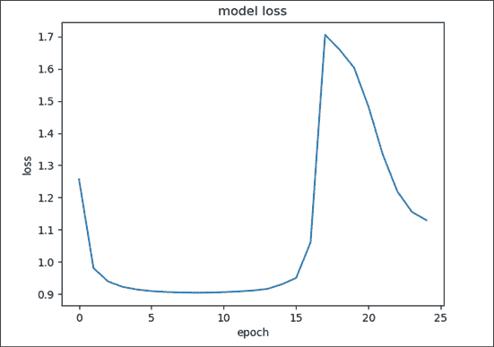

图 5.1：损失曲线

正如我们所看到的，损失值会降低到一个点后突然上升。标准的预期是，随着模型训练轮数的增加，损失值应单调下降。在上面展示的情况下，损失值突然上升。在其他情况下，可能会观察到 NaN（不是一个数字）错误。NaN 错误是由 RNN 反向传播中的梯度爆炸问题引起的。梯度方向使得权重迅速变得非常大并导致溢出，最终产生 NaN 错误。由于这种情况非常普遍，关于 NLP 工程师和印度食物的笑话也随之而来，"NaN" 这个词也巧妙地指代了一种印度面包。

这些现象背后的主要原因是梯度下降超越了最小值，并在再次降低之前开始爬升坡度。这发生在梯度下降的步伐过大时。另一种防止 NaN 问题的方法是梯度裁剪，其中梯度被裁剪到一个绝对最大值，从而防止损失爆炸。在上面的 RNN 模型中，需要使用一种在训练过程中逐步减小学习率的方案。随着训练轮次的增加，减小学习率可以降低梯度下降超越最小值的可能性。这个逐步减小学习率的技巧被称为**学习率退火**或**学习率衰减**。下一部分将介绍如何在训练模型时实现学习率衰减。

## 实现自定义学习率衰减回调

在 TensorFlow 中有两种实现学习率衰减的方法。第一种方法是使用 `tf.keras.optimizers.schedulers` 包中预构建的调度器之一，并将配置好的实例与优化器一起使用。一个预构建的调度器实例是 `InverseTimeDecay`，可以按照如下方式进行设置：

```py
lr_schedule = tf.keras.optimizers.schedules.InverseTimeDecay(
  0.001,
  decay_steps=STEPS_PER_EPOCH*(EPOCHS/10),
  decay_rate=2,
  staircase=False) 
```

上述示例中的第一个参数 0.001 是初始学习率。每个周期的步数可以通过将训练样本数量除以批量大小来计算。衰减步数决定了学习率的减少方式。用来计算学习率的公式是：

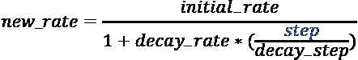

设置完成后，该函数所需的仅是用于计算新学习率的步数。一旦设置好学习计划，它就可以传递给优化器：

```py
optimizer = tf.keras.optimizers.Adam(lr_schedule) 
```

就这样！其余的训练循环代码保持不变。然而，这个学习率调度器从第一个周期开始就会减少学习率。较低的学习率会增加训练时间。理想情况下，我们会在前几个周期保持学习率不变，然后再减少它。

看看上面的*图 5.1*，学习率可能在大约第十个周期之前是有效的。BERT 还使用了**学习率预热**，然后才进行学习率衰减。学习率预热通常是指在几个周期内逐渐增加学习率。BERT 训练了 1000000 步，约等于 40 个周期。在前 10,000 步中，学习率是逐渐增加的，然后线性衰减。实现这样的学习率计划更好通过自定义回调来完成。

TensorFlow 中的自定义回调函数可以在训练和推理的不同阶段执行自定义逻辑。我们看到过一个预构建的回调函数，它在训练过程中保存检查点。自定义回调函数提供了钩子，使得可以在训练的不同阶段执行所需的逻辑。这个主要步骤是定义`tf.keras.callbacks.Callback`的子类。然后，可以实现以下一个或多个函数来挂钩 TensorFlow 暴露的事件：

+   `on_[train,test,predict]_begin` / `on_[train,test,predict]_end`：这个回调函数发生在训练开始时或训练结束时。这里有用于训练、测试和预测循环的方法。这些方法的名称可以使用方括号中显示的适当阶段名称来构造。方法命名约定是整个列表中其他方法的常见模式。

+   `on_[train,test,predict]_batch_begin` / `on_[train,test,predict]_batch_end`：这些回调函数在训练特定批次开始或结束时触发。

+   `on_epoch_begin` / `on_epoch_end`：这是一个特定于训练的函数，在每个周期开始或结束时调用。

我们将实现一个在每个周期开始时调整该周期学习率的回调函数。我们的实现会在可配置的初始周期数内保持学习率不变，然后以类似上述逆时间衰减函数的方式减少学习率。这个学习率图看起来像下面的*图 5.2*：

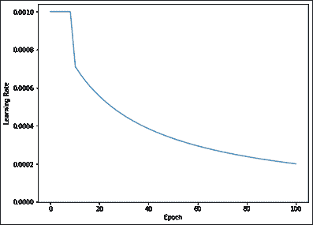

图 5.2：自定义学习率衰减函数

首先，创建一个包含定义函数的子类。将其放置在`rnn_train.py`中最好的位置是在检查点回调附近，训练开始之前。该类定义如下所示：

```py
class LearningRateScheduler(tf.keras.callbacks.Callback):
  """Learning rate scheduler which decays the learning rate"""
  def __init__(self, init_lr, decay, steps, start_epoch):
    super().__init__()
    self.init_lr = init_lr          # initial learning rate
    self.decay = decay              # how sharply to decay
    self.steps = steps              # total number of steps of decay
    self.start_epoch = start_epoch  # which epoch to start decaying
  def on_epoch_begin(self, epoch, logs=None):
    if not hasattr(self.model.optimizer, 'lr'):
      raise ValueError('Optimizer must have a "lr" attribute.')
    # Get the current learning rate
    lr = float(tf.keras.backend.get_value(self.model.optimizer.lr))
    if(epoch >= self.start_epoch):
        # Get the scheduled learning rate.
        scheduled_lr = self.init_lr / (1 + self.decay * (epoch / self.steps))
        # Set the new learning rate
        tf.keras.backend.set_value(self.model.optimizer.lr, 
                                     scheduled_lr)
    print('\nEpoch %05d: Learning rate is %6.4f.' % (epoch, scheduled_lr)) 
```

在训练循环中使用此回调函数需要实例化该回调函数。实例化回调时会设置以下参数：

+   初始学习率设置为 0.001。

+   衰减率设置为 4。请随意尝试不同的设置。

+   步数设置为纪元数。模型被训练了 150 个纪元。

+   学习率衰减应从第 10 个纪元后开始，因此开始的纪元设置为 10。

训练循环已更新，包含回调函数，如下所示：

```py
print("**** Start Training ****")
EPOCHS=150
lr_decay = LearningRateScheduler(0.001, 4., EPOCHS, 10)
start = time.time()
history = model.fit(x_train, epochs=EPOCHS,
                    callbacks=[checkpoint_callback, lr_decay])
print("**** End Training ****")
print("Training time: ", time.time()- start)
print("Checkpoint directory: ", checkpoint_dir) 
```

以上变化已高亮显示。现在，模型已经准备好使用上述命令进行训练。训练 150 个纪元花费了超过 10 小时的 GPU 时间。损失曲面见*图 5.3*：

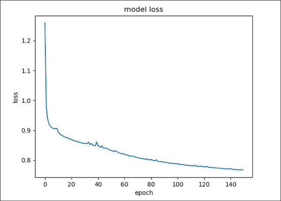

图 5.3：学习率衰减后的模型损失

在上图中，损失在前几个纪元中下降得非常快，然后在第 10 个纪元附近趋于平稳。此时，学习率衰减开始起作用，损失再次开始下降。这可以从日志文件中的一段代码中验证：

```py
...
Epoch 8/150
2434/2434 [==================] - 249s 102ms/step - loss: 0.9055
Epoch 9/150
2434/2434 [==================] - 249s 102ms/step - loss: 0.9052
Epoch 10/150
2434/2434 [==================] - 249s 102ms/step - loss: `0.9064`
Epoch 00010: Learning rate is 0.00078947.
Epoch 11/150
2434/2434 [==================] - 249s 102ms/step - loss: `0.8949`
Epoch 00011: Learning rate is 0.00077320.
Epoch 12/150
2434/2434 [==================] - 249s 102ms/step - loss: 0.8888
...
Epoch 00149: Learning rate is 0.00020107.
Epoch 150/150
2434/2434 [==================] - 249s 102ms/step - loss: `0.7667`
**** End Training ****
Training time:  37361.16723680496
Checkpoint directory:  ./training_checkpoints/2021-Jan-01-09-55-03
Saved loss to:  loss-2021-Jan-01-09-55-03.png 
```

请注意上图中突出显示的损失。在第 10 个纪元左右，损失略微增加，原因是学习率衰减开始起作用，然后损失再次开始下降。*图 5.3*中可见的损失小波动与学习率高于需求的地方相关，学习率衰减将其降低，促使损失下降。学习率从 0.001 开始，最终降至 0.0002，即其五分之一。

训练这个模型花费了大量时间和先进的技巧，比如学习率衰减。但这个模型在生成文本方面表现如何呢？这是下一部分的重点。

## 使用贪心搜索生成文本

在训练过程中，每个纪元结束时都会进行检查点的保存。这些检查点用于加载已训练的模型以生成文本。这部分代码实现于一个 IPython 笔记本中。该部分代码位于本章 GitHub 文件夹中的`charRNN-text-generation.ipynb`文件中。文本生成依赖于训练过程中使用的相同归一化和标记化逻辑。笔记本中的*设置标记化*部分包含了这段代码的复本。

生成文本有两个主要步骤。第一步是从检查点恢复训练好的模型。第二步是从训练好的模型中逐个生成字符，直到满足特定的结束条件。

笔记本的*加载模型*部分包含定义模型的代码。由于检查点仅存储了层的权重，因此定义模型结构至关重要。与训练网络的主要区别在于批量大小。我们希望一次生成一句话，因此将批量大小设置为 1：

```py
# Length of the vocabulary in chars
vocab_size = len(chars)
# The embedding dimension
embedding_dim = 256
# Number of RNN units
rnn_units = 1024
# Batch size
BATCH_SIZE=1 
```

定义模型结构的便利函数如下所示：

```py
# this one is without padding masking or dropout layer
def build_gen_model(vocab_size, embedding_dim, rnn_units, batch_size):
  model = tf.keras.Sequential([
    tf.keras.layers.Embedding(vocab_size, embedding_dim,
                              batch_input_shape=[batch_size, None]),
    tf.keras.layers.GRU(rnn_units,
                        return_sequences=True,
                        stateful=True,
                        recurrent_initializer='glorot_uniform'),
    tf.keras.layers.Dense(vocab_size)
  ])
  return model
gen_model = build_gen_model(vocab_size, embedding_dim, rnn_units, 
                            BATCH_SIZE) 
```

注意，嵌入层不使用掩码，因为在文本生成中，我们不是传递整个序列，而只是需要完成的序列的一部分。现在模型已经定义好，可以从检查点中加载层的权重。请记住将检查点目录替换为包含训练检查点的本地目录：

```py
checkpoint_dir = './training_checkpoints/**<YOUR-CHECKPOINT-DIR>'** 
gen_model.load_weights(tf.train.latest_checkpoint(checkpoint_dir))
gen_model.build(tf.TensorShape([1, None])) 
```

第二个主要步骤是逐个字符生成文本。生成文本需要一个种子或几个起始字母，这些字母由模型完成成一个句子。生成过程封装在下面的函数中：

```py
def generate_text(model, start_string, temperature=0.7, num_generate=75):
  # Low temperatures results in more predictable text.
  # Higher temperatures results in more surprising text.
  # Experiment to find the best setting.
  # Converting our start string to numbers (vectorizing)
  input_eval = [char2idx[s] for s in start_string]
  input_eval = tf.expand_dims(input_eval, 0)
  # Empty string to store our results
  text_generated = []
  # Here batch size == 1
  for i in range(num_generate):
      predictions = model(input_eval)
      # remove the batch dimension
      predictions = tf.squeeze(predictions, 0)
      # using a categorical distribution to predict the 
      # word returned by the model
      predictions = predictions / temperature
      predicted_id = tf.random.categorical(predictions, 
                               num_samples=1)[-1,0].numpy()
      # We pass the predicted word as the next input to the model
      # along with the previous hidden state
      input_eval = tf.expand_dims([predicted_id], 0)

      text_generated.append(idx2char[predicted_id])
      # lets break is <EOS> token is generated
      # if idx2char[predicted_id] == EOS:
      # break #end of a sentence reached, let's stop
  return (start_string + ''.join(text_generated)) 
```

生成方法接收一个种子字符串作为生成的起始点。这个种子字符串被向量化。实际的生成过程在一个循环中进行，每次生成一个字符并附加到生成的序列中。在每一步中，选择具有最高概率的字符。选择具有最高概率的下一个字母被称为**贪婪搜索**。然而，有一个配置参数称为**温度**，可以用来调整生成文本的可预测性。

一旦预测出所有字符的概率，将概率除以温度会改变生成字符的分布。温度较小的值生成更接近原始文本的文本。温度较大的值生成更有创意的文本。在这里，选择了一个值为 0.7，更倾向于产生一些令人惊讶的内容。

生成文本所需的全部代码只需一行：

```py
print(generate_text(gen_model, start_string=u"Google")) 
```

```py
Google plans to release the Xbox One vs. Samsung Galaxy Gea<EOS><PAD>ote on Mother's Day 
```

每次执行命令可能会生成略有不同的结果。上面生成的行，虽然显然毫无意义，但结构相当良好。模型已经学习了大写规则和标题结构。通常情况下，我们不会生成超过`<EOS>`标记的文本，但在这里生成了所有 75 个字符，以便更好地理解模型输出。

注意，文本生成显示的输出是指示性的。对于相同的提示，您可能会看到不同的输出。这个过程内在地包含一些随机性，我们可以通过设置随机种子来尝试控制它。当重新训练模型时，它可能会停留在损失表面上的略有不同的点，即使损失数字看起来相似，模型权重也可能略有不同。请将整个章节中呈现的输出视为指示性的，而不是实际的。

这里还有一些种子字符串和模型输出的其他示例，这些示例在句子结束标记后被剪辑：

| 种子 | 生成的句子 |
| --- | --- |
| 标普 | 标普 500 首次突破 190<EOS>标普：Russell Slive 再次找到任何商业制造商<EOS>标普突破 2000 点首次突破<EOS> |
| Beyonce | Beyoncé和 Solange 一起为《美国偶像》比赛拍照<EOS>Beyoncé的妹妹 Solange 主宰了《猩球崛起》的报告<EOS>Beyoncé和 Jay Z 结婚<EOS> |

请注意，模型在前两句中使用了**Beyonce**作为种子词时的引号。下表展示了不同温度设置对类似种子词的影响：

| 种子 | 温度 | 生成的句子 |
| --- | --- | --- |
| 标普 | 0.10.30.50.9 | 标普 500 首次突破 1900 点<EOS>标普接近 57 亿美元收购 Beats Electronics 的交易<EOS>标普 500 指数下跌 7.2%，预示着零售销售强劲<EOS>标普，Ack 因素面临风险，你在这个市场看到了什么<EOS> |
| Kim | 0.10.30.50.9 | Kim Kardashian 和 Kanye West 的婚礼照片发布<EOS>Kim Kardashian 分享她对 Met Gala 首次亮相的最佳和最差看法<EOS>Kim Kardashian 婚纱在 Fia 工作室制作中<EOS>Kim Kardashian 的私人生活<EOS> |

通常，随着温度值的升高，文本的质量会下降。所有这些例子都是通过向生成函数传递不同的温度值生成的。

这种基于字符的模型的一个实际应用是完成文本消息或电子邮件应用中的单词。默认情况下，`generate_text()`方法会生成 75 个字符来完成标题。可以很容易地传入更短的长度，看看模型提出的下几个字母或单词是什么。

下表展示了一些实验，尝试完成文本片段的下 10 个字符。这些完成是通过以下方式生成的：

```py
print(generate_text(gen_model, start_string=u"Lets meet tom", 
                    temperature=0.7, num_generate=10)) 
```

```py
Lets meet tomorrow to t 
```

| 提示 | 完成 |
| --- | --- |
| 我需要一些来自银行的钱 | 我需要一些来自银行主席的钱 |
| 在盈利池中游泳 | 在盈利能力中游泳 |
| 你能给我一封 | 你能给我一封信吗 |
| 你是从哪儿的 | 你是从附近来的 |
| 会议是 | 会议恢复了 |
| 我们在 S 喝咖啡吧 | 我们在三星总部喝咖啡吧 | 我们在 Staples 商店喝咖啡吧 | 我们在圣地亚哥 Z 喝咖啡吧 |

鉴于使用的数据集仅来自新闻标题，它对某些类型的活动存在偏见。例如，第二句话本来可以用*泳池*来完成，而不是模型尝试用盈利能力来填充。如果使用更为通用的文本数据集，那么该模型在生成部分输入词语的完成时可能表现得很好。然而，这种文本生成方法有一个限制——使用了贪心搜索算法。

贪婪搜索过程是上述文本生成中的关键部分。它是生成文本的几种方式之一。我们通过一个例子来理解这个过程。在这个例子中，Peter Norvig 分析了二元组频率，并发布在[`norvig.com/mayzner.html`](http://norvig.com/mayzner.html)上。在这项工作中分析了超过 7430 亿个英文单词。在一个没有大小写区分的模型中，理论上有 26 x 26 = 676 个二元组组合。然而，文章报告称，在大约 2.8 万亿个二元组实例中，从未见过以下二元组：JQ、QG、QK、QY、QZ、WQ 和 WZ。

笔记本中的*贪婪搜索与二元组*部分包含了下载和处理完整数据集的代码，并展示了贪婪搜索的过程。下载所有 n-gram 集合后，提取了二元组。构建了一组字典来帮助查找给定起始字母后的最高概率字母。然后，使用一些递归代码构建了一个树，选择下一个字母的前三个选择。在上述生成代码中，仅选择了最顶部的字母。然而，选择了前三个字母来展示贪婪搜索的工作原理及其缺点。

使用巧妙的`anytree` Python 包，可以可视化一个格式化良好的树。这棵树在以下图中展示：

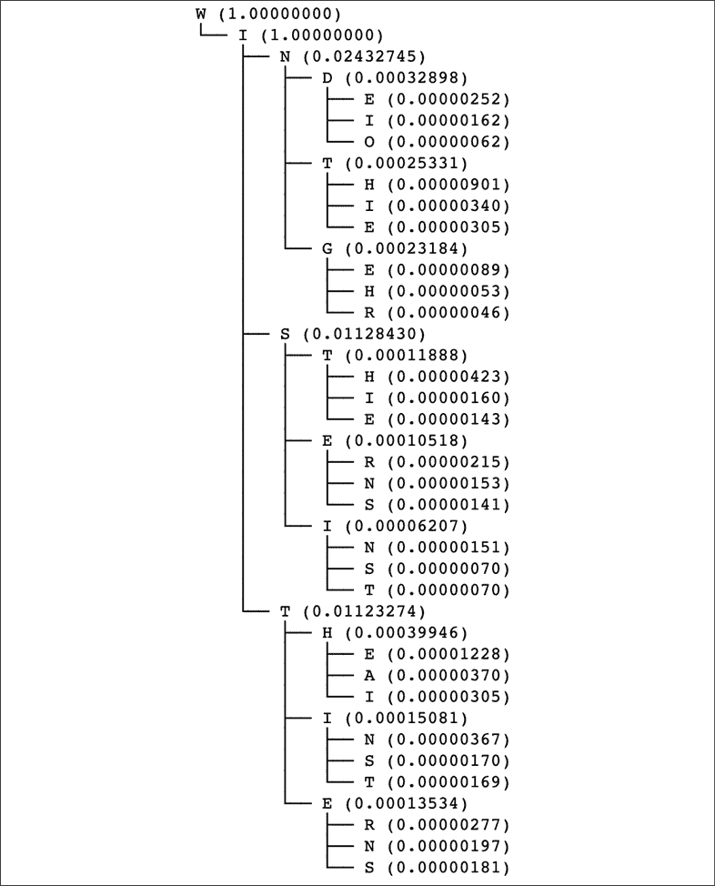

图 5.4：从 WI 开始的贪婪搜索树

算法的任务是用总共五个字符完成**WI**。前面的树显示了给定路径的累计概率。显示了多条路径，这样可以看到贪婪搜索没有选择的分支。如果构建一个三字符单词，最高概率选择是**WIN**，概率为 0.243，其次是**WIS**，概率为 0.01128。如果考虑四个字母的单词，贪婪搜索将只考虑那些以**WIN**开头的单词，因为这是考虑前三个字母后，具有最高概率的路径。在这个路径中，**WIND**的概率为 0.000329。然而，快速扫描所有四个字母的单词后发现，概率最高的单词应该是**WITH**，概率为 0.000399。

本质上，这就是贪婪搜索算法在文本生成中的挑战。由于每个字符的优化，而不是累计概率，考虑联合概率的高概率选项被隐藏了。无论是按字符还是按词生成文本，贪婪搜索都面临相同的问题。

一种替代算法，称为**束搜索（beam search）**，可以跟踪多个选项，并在生成过程中剔除低概率的选项。如*图 5.4*所示的树形结构也可以看作是跟踪概率束的示意图。为了展示这一技术的威力，使用一个更复杂的生成文本模型会更好。由 OpenAI 发布的**GPT-2**（Generative Pre-Training）模型设立了多个基准，包括在开放式文本生成方面的突破。这是本章下半部分的主题，其中首先解释了 GPT-2 模型。接下来的话题是对 GPT-2 模型进行微调，以完成电子邮件消息的生成。束搜索和其他改善生成文本质量的选项也会在接下来的内容中展示。

# 生成预训练（GPT-2）模型

OpenAI 于 2018 年 6 月发布了第一版 GPT 模型，随后在 2019 年 2 月发布了 GPT-2。由于担心恶意用途，GPT-2 的大规模模型没有与论文一起公开发布，因此引起了广泛关注。之后在 2019 年 11 月，OpenAI 发布了 GPT-2 的大型版本。GPT-3 模型是最新版本，于 2020 年 5 月发布。

*图 5.5*显示了这些模型中最大模型的参数数量：

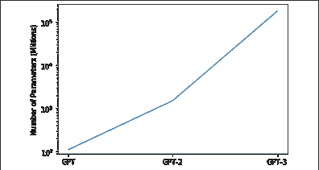

图 5.5：不同 GPT 模型的参数

第一个模型采用了标准的 Transformer 解码器架构，具有 12 层，每层 12 个注意力头和 768 维的嵌入，总共有约 1.1 亿个参数，与 BERT 模型非常相似。最大的 GPT-2 模型拥有超过 15 亿个参数，而最近发布的 GPT-3 模型的最大变体拥有超过 1750 亿个参数！

**语言模型训练成本**

随着参数数量和数据集规模的增加，训练所需的时间也会增加。根据 Lambda Labs 的一篇文章，如果 GPT-3 模型仅在单个 Nvidia V100 GPU 上训练，训练时间将达到 342 年。使用微软 Azure 的标准定价，这将花费超过 300 万美元。GPT-2 模型的训练预计每小时花费 256 美元。假设训练时间与 BERT 类似（约四天），这将花费约 25,000 美元。如果在研究过程中需要训练多个模型，整体成本可能会增加十倍。

由于这种成本，个人甚至大多数公司无法从头开始训练这些模型。迁移学习和像 Hugging Face 这样的公司提供的预训练模型使得公众能够使用这些模型。

GPT 模型的基础架构使用了 Transformer 架构的解码器部分。解码器是一个*从左到右*的语言模型。相比之下，BERT 模型是一个双向模型。左到右的模型是自回归的，即它使用到目前为止生成的标记来生成下一个标记。由于它不能像双向模型一样看到未来的标记，这种语言模型非常适合文本生成。

*图 5.6* 显示了完整的 Transformer 架构，左侧是编码器块，右侧是解码器块：

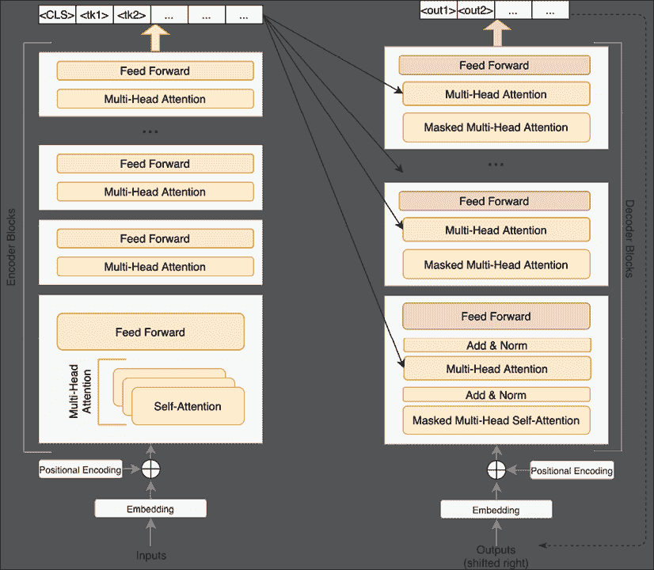

图 5.6：完整的 Transformer 架构，包含编码器块和解码器块

*图 5.6* 的左侧应该很熟悉——它基本上是上一章*Transformer 模型*部分中的*图 4.6*。所示的编码器块与 BERT 模型相同。解码器块与编码器块非常相似，有几个显著的不同之处。

在编码器块中，只有一个输入源——输入序列，所有输入标记都可以用于多头注意力操作。这使得编码器能够从左右两侧理解标记的上下文。

在解码器块中，每个块有两个输入。编码器块生成的输出对所有解码器块可用，并通过多头注意力和层归一化传递到解码器块的中间。

**什么是层归一化？**

大型深度神经网络使用**随机梯度下降**（**SGD**）优化器或类似的变体如 Adam 进行训练。在大数据集上训练大型模型可能需要相当长的时间才能使模型收敛。诸如权重归一化、批量归一化和层归一化等技术旨在通过帮助模型更快地收敛来减少训练时间，同时还起到正则化的作用。层归一化的基本思想是根据输入的均值和标准差对给定隐藏层的输入进行缩放。首先，计算均值和标准差：

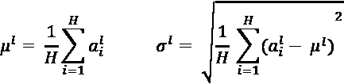

`H` 表示层 `l` 中的隐藏单元数量。层的输入通过上述计算的值进行归一化：

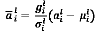

其中 `g` 是一个增益参数。请注意，均值和标准差的公式与小批量的大小或数据集的大小无关。因此，这种类型的归一化可以用于 RNN 和其他序列建模问题。

然而，到目前为止由解码器生成的标记会通过掩码的多头自注意力回馈，并与来自编码器块的输出相加。这里的掩码指的是生成的标记右侧的标记被掩盖，解码器看不见它们。与编码器类似，这里有多个这样的块堆叠在一起。然而，GPT 架构仅是 Transformer 的一半，这需要对架构进行一些修改。

GPT 的修改架构如 *图 5.7* 所示。由于没有编码器块来传递输入序列的表示，因此不再需要多头层。模型生成的输出会递归地反馈，用以生成下一个标记。

最小的 GPT-2 模型有 12 层，每个标记有 768 个维度。最大的 GPT-2 模型有 48 层，每个标记有 1,600 个维度。为了预训练这种规模的模型，GPT-2 的作者需要创建一个新的数据集。网页是很好的文本来源，但文本存在质量问题。为了解决这个问题，他们从 Reddit 上抓取了所有至少获得三点 karma 的外部链接。作者的假设是 karma 点数可以作为网页质量的一个指标。这一假设使得抓取大量文本数据成为可能。最终的数据集大约包含 4500 万个链接。

为了从网页的 HTML 中提取文本，使用了两个 Python 库：Dragnet 和 Newspaper。经过一些质量检查和去重处理，最终的数据集约有 800 万份文档，总共 40 GB 的文本数据。令人兴奋的是，作者还去除了所有维基百科文档，因为他们认为许多测试数据集都使用了维基百科，加入这些页面会导致测试和训练数据集的重叠。预训练的目标是一个标准的语言模型训练目标：根据一组前置词预测下一个词：

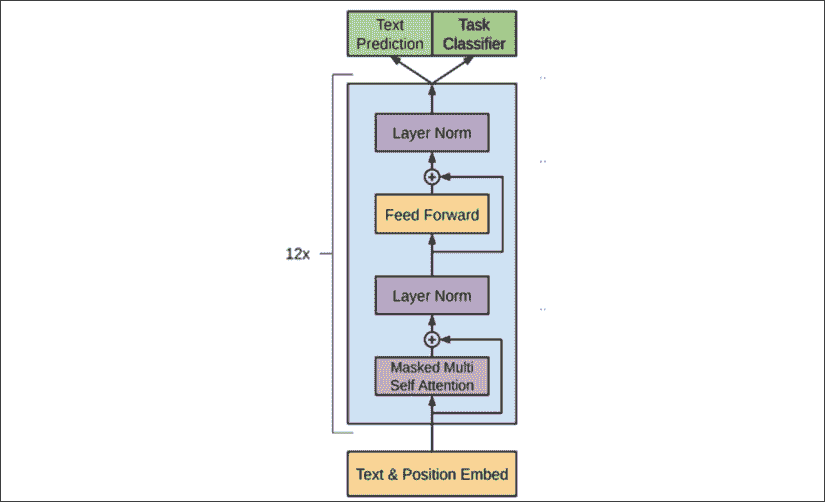

图 5.7：GPT 架构（来源：Radford 等人的《通过生成预训练改进语言理解》）

在预训练过程中，GPT-2 模型使用最大序列长度 1,024 个标记进行训练。采用 **字节对编码**（**BPE**）算法进行分词，词汇表大小约为 50,000 个标记。GPT-2 使用字节序列而不是 Unicode 码点进行字节对合并。如果 GPT-2 仅使用字节进行编码，则词汇表的大小将只有 256 个标记。另一方面，使用 Unicode 码点将导致词汇表超过 130,000 个标记。通过巧妙地使用 BPE 中的字节，GPT-2 能够将词汇表大小控制在一个可管理的 50,257 个标记。

GPT-2 中的分词器还有一个特点，它将所有文本转换为小写字母，并在使用 BPE 之前使用 spaCy 和 `ftfy` 分词器。`ftfy` 库对于修复 Unicode 问题非常有用。如果这两个库不可用，则会使用基本的 BERT 分词器。

尽管从左到右的模型可能看起来有限制，但有几种方法可以编码输入以解决不同的问题。这些方法显示在 *图 5.8* 中：

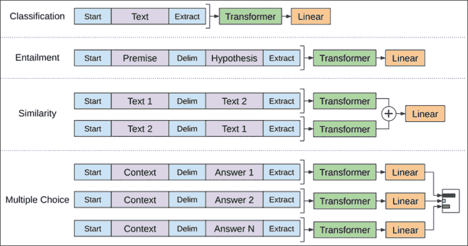

图 5.8：GPT-2 在不同问题中的输入转换（来源：Radford 等人的《通过生成预训练改进语言理解》）

上图展示了如何使用预训练的 GPT-2 模型来处理文本生成以外的多种任务。在每个实例中，输入序列的前后分别添加了开始和结束标记。在所有情况下，最后都会添加一个线性层，并且在模型微调时进行训练。所宣称的主要优势是，许多不同类型的任务可以使用相同的架构来完成。*图 5.8*中的最上层架构展示了它如何用于分类。例如，GPT-2 可以使用这种方法进行 IMDb 情感分析。

第二个示例是文本蕴含。文本蕴含是一个 NLP 任务，需要确定两个文本片段之间的关系。第一个文本片段称为前提，第二个片段称为假设。前提和假设之间可以存在不同的关系。前提可以验证或与假设相矛盾，或者它们可能没有任何关系。

假设前提是*每天锻炼是健康生活方式和长寿的重要组成部分*。如果假设是*锻炼增加寿命*，那么前提*蕴含*或*验证*了假设。另一方面，如果假设是*跑步没有任何好处*，那么前提*与*假设相矛盾。最后，如果假设是*举重可以锻炼出六块腹肌*，那么前提既不蕴含也不与假设相矛盾。为了使用 GPT-2 进行蕴含推理，前提和假设被用分隔符通常是`$`连接起来。

对于文本相似性，构造两个输入序列，一个将第一个文本序列放在前面，另一个将第二个文本序列放在前面。GPT 模型的输出结果相加并传入线性层。类似的方法也可以用于多项选择题。然而，本章的重点是文本生成。

## 使用 GPT-2 生成文本

Hugging Face 的 transformers 库简化了使用 GPT-2 生成文本的过程。类似于前一章所示的预训练 BERT 模型，Hugging Face 提供了预训练的 GPT 和 GPT-2 模型。这些预训练模型将在本章的其余部分中使用。此代码和本章其余部分的代码可以在名为`text-generation-with-GPT-2.ipynb`的 IPython 笔记本中找到。运行设置后，转到*使用 GPT-2 生成文本*部分。还提供了一个展示如何使用 GPT 生成文本的部分作为参考。生成文本的第一步是下载预训练模型及其相应的 tokenizer：

```py
from transformers import TFGPT2LMHeadModel, GPT2Tokenizer
gpt2tokenizer = GPT2Tokenizer.from_pretrained("gpt2")
# add the EOS token as PAD token to avoid warnings
gpt2 = TFGPT2LMHeadModel.from_pretrained("gpt2", 
                          pad_token_id=gpt2tokenizer.eos_token_id) 
```

这可能需要几分钟时间，因为模型需要下载。如果在您的环境中没有找到 spaCy 和`ftfy`，您可能会看到警告。这两个库对于文本生成并不是强制性的。以下代码可以使用贪婪搜索算法来生成文本：

```py
# encode context the generation is conditioned on
input_ids = gpt2tokenizer.encode('Robotics is the domain of ', return_tensors='tf')
# generate text until the output length 
# (which includes the context length) reaches 50
greedy_output = gpt2.generate(input_ids, max_length=50)
print("Output:\n" + 50 * '-')
print(gpt2tokenizer.decode(greedy_output[0], skip_special_tokens=True)) 
```

```py
Output:
-----------------------------------------------------------
Robotics is the domain of the United States Government.
The United States Government is the primary source of information on the use of drones in the United States.
The United States Government is the primary source of information on the use of drones 
```

提供了一个提示词供模型完成。模型开始时表现不错，但很快开始重复相同的输出。

请注意，生成文本的输出只是一个示例。对于相同的提示，您可能会看到不同的输出。这有几个不同的原因。此过程本身具有一定的随机性，我们可以通过设置随机种子来尝试控制它。Hugging Face 团队可能会定期重新训练模型，并且模型可能会随着新版本的发布而发生变化。

前一节中提到了贪婪搜索的问题。束搜索可以作为一种替代方案。在生成每个标记的步骤中，会保留一组具有最高概率的标记作为束的一部分，而不仅仅是保留最高概率的标记。在生成结束时，会返回具有最高总体概率的序列。前一节中的*图 5.4*（使用贪婪搜索）可以视为束搜索算法的输出，束的大小为 3\。

使用束搜索生成文本是很简单的：

```py
# BEAM SEARCH
# activate beam search and early_stopping
beam_output = gpt2.generate(
    input_ids, 
    max_length=50, 
    num_beams=5, 
    early_stopping=True
)
print("Output:\n" + 50 * '-')
print(gpt2tokenizer.decode(beam_output[0], skip_special_tokens=True)) 
```

```py
Output:
--------------------------------------------------
Robotics is the domain of science and technology. It is the domain of science and technology. It is the domain of science and technology. It is the domain of science and technology. It is the domain of science and technology. It is the domain 
```

从质量上讲，第一句比贪婪搜索生成的句子更有意义。`early_stopping`参数会在所有束到达 EOS 标记时指示停止生成。然而，仍然存在很多重复的情况。控制重复的一个参数是通过设置限制，防止 n-grams 重复：

```py
# set no_repeat_ngram_size to 2
beam_output = gpt2.generate(
    input_ids, 
    max_length=50, 
    num_beams=5, 
    no_repeat_ngram_size=3, 
    early_stopping=True
)
print("Output:\n" + 50 * '-')
print(gpt2tokenizer.decode(beam_output[0], skip_special_tokens=True)) 
```

```py
Output:
--------------------------------------------------
Robotics is the domain of science and technology.
In this article, we will look at some of the most important aspects of robotics and how they can be used to improve the lives of people around the world. We will also take a look 
```

这对生成文本的质量产生了相当大的影响。`no_repeat_ngram_size`参数可以防止模型生成任何 3-gram 或三元组的重复。虽然这提高了文本的质量，但使用 n-gram 约束可能会对生成文本的质量产生显著影响。如果生成的文本是关于*白宫*的，那么这三个词只能在整个生成文本中使用一次。在这种情况下，使用 n-gram 约束会适得其反。

**是否使用束搜索**

当生成的序列长度受到限制时，束搜索效果很好。随着序列长度的增加，需要维护和计算的束数量显著增加。因此，束搜索适用于像总结和翻译这样的任务，但在开放式文本生成中表现较差。此外，束搜索通过尝试最大化累积概率，生成了更多可预测的文本。这使得文本感觉不太自然。以下代码可以用来感受生成的不同束。确保束的数量大于或等于返回的序列数：

```py
# Returning multiple beams
beam_outputs = gpt2.generate(
    input_ids, 
    max_length=50, 
    num_beams=7, 
    no_repeat_ngram_size=3, 
    num_return_sequences=3,  
    early_stopping=True,
    temperature=0.7
)
print("Output:\n" + 50 * '-')
for i, beam_output in enumerate(beam_outputs):
  print("\n{}: {}".format(i, 
                   gpt2tokenizer.decode(beam_output,
                          skip_special_tokens=True))) 
```

```py
Output:
--------------------------------------------------
0: Robotics is the domain of the U.S. Department of Homeland Security. The agency is responsible for the security of the United States and its allies, including the United Kingdom, Canada, Australia, New Zealand, and the European Union.
1: Robotics is the domain of the U.S. Department of Homeland Security. The agency is responsible for the security of the United States and its allies, including the United Kingdom, France, Germany, Italy, Japan, and the European Union.
2: Robotics is the domain of the U.S. Department of Homeland Security. The agency is responsible for the security of the United States and its allies, including the United Kingdom, Canada, Australia, New Zealand, the European Union, and the United
The text generated is very similar but differs near the end. Also, note that temperature is available to control the creativity of the generated text. 
```

还有一种方法可以提高生成文本的连贯性和创造性，这种方法叫做 Top-K 采样。这是 GPT-2 中首选的方法，在 GPT-2 生成故事的成功中起着至关重要的作用。在解释这个方法如何工作之前，我们先试试看，并看看生成的输出：

```py
# Top-K sampling
tf.random.set_seed(42)  # for reproducible results
beam_output = gpt2.generate(
    input_ids, 
    max_length=50, 
    do_sample=True, 
    top_k=25,
    temperature=2
)
print("Output:\n" + 50 * '-')
print(gpt2tokenizer.decode(beam_output[0], skip_special_tokens=True)) 
```

```py
Output:
--------------------------------------------------
Robotics is the domain of people with multiple careers working with robotics systems. The purpose of Robotics & Machine Learning in Science and engineering research is not necessarily different for any given research type because the results would be much more diverse.
Our team uses 
```

上述示例是通过选择一个高温值生成的。设置了一个随机种子，以确保结果可重复。Top-K 采样方法在 2018 年由 Fan Lewis 和 Dauphin 在论文《层级神经故事生成》中发布。这个算法相对简单——每一步，它从概率最大的`K`个 tokens 中挑选一个。如果`K`设置为 1，那么该算法就与贪心搜索相同。

在上面的代码示例中，模型在生成文本时会查看 50,000+个 tokens 中的前 25 个最顶端的 tokens。然后，从这些 tokens 中随机选择一个，并继续生成文本。选择更大的值会产生更惊讶或更富有创意的文本。选择较低的`K`值则会生成更可预测的文本。如果到目前为止你觉得结果有些让人失望，那是因为所选择的提示确实很难。请考虑这是使用 Top-K 为 50 时，为提示*在黑夜的深处，突然出现了一*生成的输出：

*在黑夜的深处，突然出现了一束光。*

*叹了口气，萧辰慢慢站起身，看着站在他面前的天承。他迈步走近，仔细观察天承的左腕，眉头紧皱。*

*林峰吓了一跳，迅速抽出一把长剑！*

*林峰不明白龙飞在黑晶宫里挥舞的是什么样的剑！*

*黑晶宫与他原本的黑石城完全不同。龙飞带着一把剑做为纪念，这把剑是天承将其放置在他父亲的手臂上的。*

*他又从父亲的手臂上拔出了那把剑！*

*这把黑色的剑刃是黑晶宫中最有价值的武器之一。这把剑锋利得像所有武器中最锋利的一把，它被黑石城的黑冰放置在龙飞父亲的手臂上，供他使用。*

上述较长的文本是由最小的 GPT-2 模型生成的，该模型大约有 1.24 亿个参数。目前有多个不同的设置和模型大小供你使用。记住，强大的能力伴随巨大的责任。

在上一章和这一章之间，我们已经从概念上涵盖了 Transformer 架构中的编码器和解码器部分。现在，我们准备在下一章将这两部分结合起来。让我们快速回顾一下本章的内容。

# 总结

生成文本是一个复杂的任务。它有实际的用途，可以使打字文本消息或撰写电子邮件变得更加容易。另一方面，还有创造性的用途，如生成故事。在本章中，我们介绍了基于字符的 RNN 模型，逐个字符生成标题，并注意到它在结构、大写和其他方面表现出色。尽管模型是在特定数据集上训练的，但它在根据上下文完成短句和部分打字词方面表现出了潜力。接下来的部分介绍了基于 Transformer 解码器架构的最先进 GPT-2 模型。前一章已经介绍了 Transformer 编码器架构，BERT 使用了该架构。

生成文本有许多可以调节的参数，如重新采样分布的温度、贪婪搜索、波束搜索和 Top-K 采样，以平衡生成文本的创造性和可预测性。我们看到了这些设置对文本生成的影响，并使用了 Hugging Face 提供的预训练 GPT-2 模型来生成文本。

现在我们已经介绍了 Transformer 架构的编码器和解码器部分，下一章将使用完整的 Transformer 构建一个文本摘要模型。文本摘要技术正处于自然语言处理的前沿。我们将建立一个模型，能够阅读新闻文章并用几句话总结出来。继续前进！
