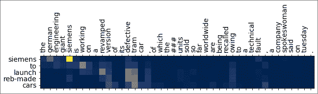

# 第六章：使用 Seq2seq 注意力机制和 Transformer 网络进行文本摘要

总结一篇文本挑战了深度学习模型对语言的理解。摘要可以看作是一个独特的人类能力，需要理解文本的要点并加以表述。在前面的章节中，我们构建了有助于摘要的组件。首先，我们使用 BERT 对文本进行编码并执行情感分析。然后，我们使用 GPT-2 的解码器架构来生成文本。将编码器和解码器结合起来，形成了一个摘要模型。在本章中，我们将实现一个带有 Bahdanau 注意力机制的 seq2seq 编码器-解码器。具体来说，我们将涵盖以下主题：

+   提取式和抽象式文本摘要概述

+   使用带有注意力机制的 seq2seq 模型进行文本摘要

+   通过束搜索改进摘要

+   通过长度归一化解决束搜索问题

+   使用 ROUGE 指标衡量摘要性能

+   最新摘要技术的回顾

这一过程的第一步是理解文本摘要背后的主要思想。在构建模型之前，理解任务本身至关重要。

# 文本摘要概述

摘要的核心思想是将长篇文本或文章浓缩为简短的表示形式。简短的表示应包含长文本中的关键信息。单个文档可以被总结，这个文档可以很长，也可以只有几句话。一个短文档摘要的例子是从文章的前几句话生成标题。这被称为**句子压缩**。当总结多个文档时，它们通常是相关的。它们可以是公司财务报告，或者关于某个事件的新闻报道。生成的摘要可以长也可以短。当生成标题时，通常希望摘要较短；而较长的摘要则像摘要部分，可能包含多句话。

总结文本时有两种主要的方法：

+   **提取式摘要**：从文章中选取短语或句子，并将其组合成摘要。这种方法的思维模型类似于在长篇文本上使用荧光笔，摘要即是这些重点内容的组合。提取式摘要是一种更直接的方法，因为可以直接复制源文本中的句子，从而减少语法问题。摘要的质量也可以通过诸如 ROUGE 等指标来衡量。该指标将在本章后面详细介绍。提取式摘要在深度学习和神经网络出现之前是主要的方法。

+   **抽象式摘要**：在摘要一篇文章时，个人可能会使用该语言中所有可用的词汇。他们不局限于仅使用文章中的词语。其心理模型是，人们正在撰写一篇新的文本。模型必须对不同词语的意义有所理解，才能在摘要中使用这些词汇。抽象式摘要相当难以实现和评估。Seq2Seq 架构的出现大大提升了抽象式摘要模型的质量。

本章重点讨论抽象式摘要。以下是我们模型生成的摘要示例：

| 原文 | 生成的摘要 |
| --- | --- |
| 美国航空集团公司周日表示，它计划通过出售股票和可转换优先票据筹集##亿美元，以改善航空公司在应对因冠状病毒引起的旅行限制时的流动性。 | 美国航空将通过**可转换债券发行**筹集##**亿美元** |
| 新建独栋住宅的销售在 5 月按季节调整后的年化速度为##，与 4 月经过下调修正后的##相比，增长了#.#%。 | **新房**销售在 5 月**上涨** |
| JC Penney 将永久关闭更多##家门店。这家上个月申请破产的百货商店连锁，正朝着关闭##家门店的目标迈进。 | JC Penney 将关闭**更多**门店 |

原文在预处理时已全部转换为小写，并且将数字替换为占位符标记，以防止模型在摘要中捏造数字。生成的摘要中有些词被高亮显示，这些词在原文中并未出现。模型能够在摘要中提出这些词。因此，模型是一个抽象式摘要模型。那么，如何构建这样一个模型呢？

一种看待摘要生成问题的方法是，模型将输入的标记序列*转换*为较小的输出标记集合。模型根据提供的监督样本学习输出长度。另一个著名的问题是将输入序列映射到输出序列——即神经机器翻译（NMT）问题。在 NMT 中，输入序列可能是源语言中的一句话，输出则可能是目标语言中的一系列标记。翻译过程如下：

1.  将输入文本转换为标记

1.  为这些标记学习嵌入

1.  通过编码器传递标记嵌入，计算隐藏状态和输出

1.  使用带有注意力机制的隐藏状态生成输入的上下文向量

1.  将编码器输出、隐藏状态和上下文向量传递给网络的解码器部分

1.  使用自回归模型从左到右生成输出

Google AI 在 2017 年 7 月发布了一个关于使用 seq2seq 注意力模型进行神经机器翻译（NMT）的教程。该模型使用带有 GRU 单元的从左到右的编码器。解码器也使用 GRU 单元。在文本摘要中，被总结的文本是前提条件。这对于机器翻译来说可能有效，也可能无效。在某些情况下，翻译是实时进行的。在这种情况下，从左到右的编码器是有用的。然而，如果待翻译或总结的完整文本从一开始就可以获取，那么双向编码器可以从给定词元的两侧编码上下文。编码器中的双向 RNN（BiRNN）可以显著提升整体模型的性能。NMT 教程中的代码为 seq2seq 注意力模型和之前提到的注意力教程提供了灵感。在我们进行模型构建之前，让我们先了解一下为此目的使用的数据集。

# 数据加载与预处理

有多个与摘要相关的数据集可用于训练。这些数据集可以通过 TensorFlow Datasets 或`tfds`包获得，我们在前面的章节中也使用过这些包。可用的数据集在长度和风格上有所不同。CNN/DailyMail 数据集是最常用的数据集之一。该数据集于 2015 年发布，包含约 100 万篇新闻文章。收集的文章来自 CNN（自 2007 年起）和 Daily Mail（自 2010 年起），直到 2015 年为止。摘要通常是多句话的。Newsroom 数据集可以通过[`summari.es`](https://summari.es)获取，包含来自 38 家出版物的超过 130 万篇新闻文章。然而，这个数据集需要注册后才能下载，因此本书中未使用此数据集。wikiHow 数据集包含完整的维基百科文章页面以及这些文章的摘要句子。LCSTS 数据集包含从新浪微博收集的中文数据，包含段落及其单句摘要。

另一个流行的数据集是 Gigaword 数据集。它提供了新闻故事的前一到两句话，并以新闻标题作为摘要。这个数据集相当庞大，包含了近 400 万行数据。该数据集在 2011 年由 Napoles 等人在一篇名为*Annotated Gigaword*的论文中发布。使用`tfds`导入这个数据集非常容易。考虑到数据集的庞大规模以及模型的长时间训练，训练代码存储在 Python 文件中，而推理代码则在 IPython 笔记本中。上一章也使用了这种模式。训练代码在`s2s-training.py`文件中。该文件的顶部包含导入语句以及一个名为`setupGPU()`的方法，用于初始化 GPU。文件中还有一个主函数，提供控制流，并包含多个执行特定操作的函数。

数据集需要首先加载。加载数据的代码在`load_data()`函数中：

```py
def load_data():
    print("Loading the dataset")
    (ds_train, ds_val, ds_test), ds_info = tfds.load(
        'gigaword',
        split=['train', 'validation', 'test'],
        shuffle_files=True,
        as_supervised=True,
        with_info=True,
    )
    return ds_train, ds_val, ds_test 
```

主函数中对应的部分如下所示：

```py
if __name__ == "__main__":
    setupGPU()  # OPTIONAL – only if using GPU
    ds_train, _, _ = load_data() 
```

仅加载训练数据集。验证数据集包含约 190,000 个样本，而测试集包含超过 1,900 个样本。相比之下，训练集包含超过 380 万个样本。根据网络连接情况，下载数据集可能需要一些时间：

```py
Downloading and preparing dataset gigaword/1.2.0 (download: 551.61 MiB, generated: Unknown size, total: 551.61 MiB) to /xxx/tensorflow_datasets/gigaword/1.2.0...
/xxx/anaconda3/envs/tf21g/lib/python3.7/site-packages/urllib3/connectionpool.py:986: InsecureRequestWarning: Unverified HTTPS request is being made to host 'drive.google.com'. Adding certificate verification is strongly advised. See: https://urllib3.readthedocs.io/en/latest/advanced-usage.html#ssl-warnings
  InsecureRequestWarning, 
  InsecureRequestWarning,
Shuffling and writing examples to /xxx/tensorflow_datasets/gigaword/1.2.0.incomplete1FP5M4/gigaword-train.tfrecord
100%
<snip/>
100%
1950/1951 [00:00<00:00, 45393.40 examples/s]
Dataset gigaword downloaded and prepared to /xxx/tensorflow_datasets/gigaword/1.2.0\. Subsequent calls will reuse this data. 
```

关于不安全请求的警告可以安全忽略。数据现在已经准备好进行分词和向量化处理。

# 数据分词和向量化

Gigaword 数据集已经使用 StanfordNLP 分词器进行了清洗、规范化和分词。所有数据都已转换为小写，并使用 StanfordNLP 分词器进行了规范化，正如前面的示例所示。本步骤的主要任务是创建词汇表。基于单词的分词器是摘要生成中最常见的选择。然而，本章将使用子词分词器。子词分词器的优点是可以在最小化未知词数量的同时限制词汇表的大小。*第三章*，*使用 BiLSTMs、CRFs 和维特比解码进行命名实体识别（NER）*，介绍了不同类型的分词器。因此，像 BERT 和 GPT-2 这样的模型使用某种变体的子词分词器。`tfds` 包提供了一种方法，可以从文本语料库初始化并创建一个子词分词器。由于生成词汇表需要遍历所有训练数据，因此这个过程可能比较慢。初始化后，分词器可以保存到磁盘以供将来使用。这个过程的代码在 `get_tokenizer()` 函数中定义：

```py
def get_tokenizer(data, file="gigaword32k.enc"):
    if os.path.exists(file+.subwords):
        # data has already been tokenized - just load and return
        tokenizer = \
tfds.features.text.SubwordTextEncoder.load_from_file(file)
    else:
        # This takes a while
        tokenizer = \
tfds.features.text.SubwordTextEncoder.build_from_corpus(
        ((art.numpy() + b" " + smm.numpy()) for art, smm in data),
        target_vocab_size=2**15
        )  # End tokenizer construction
        tokenizer.save_to_file(file)  # save for future iterations

   print("Tokenizer ready. Total vocabulary size: ", tokenizer.vocab_size)
   return tokenizer 
```

该方法检查是否已保存子词分词器并加载它。如果磁盘上没有分词器，则通过将文章和摘要合并输入来创建一个新的分词器。请注意，在我的机器上创建新分词器花费了超过 20 分钟。

因此，最好只执行一次这个过程，并将结果保存以供将来使用。本章的 GitHub 文件夹包含了已保存的分词器版本，以节省一些时间。

在创建词汇表后，会向其中添加两个额外的标记，表示序列的开始和结束。这些标记帮助模型开始和结束输入输出。结束标记为生成摘要的解码器提供了一种信号，表示摘要的结束。此时，主要方法如下所示：

```py
if __name__ == "__main__":
    setupGPU()  # OPTIONAL - only if using GPU
    ds_train, _, _ = load_data()
    tokenizer = get_tokenizer(ds_train)
    # Test tokenizer
    txt = "Coronavirus spread surprised everyone"
    print(txt, " => ", tokenizer.encode(txt.lower()))
    for ts in tokenizer.encode(txt.lower()):
        print ('{} ----> {}'.format(ts, tokenizer.decode([ts])))
    # add start and end of sentence tokens
    start = tokenizer.vocab_size + 1 
    end = tokenizer.vocab_size
    vocab_size = end + 2 
```

文章及其摘要可以使用分词器进行分词。文章的长度各异，需要在最大长度处进行截断。由于 Gigaword 数据集仅包含文章中的少数几句话，因此选择了最大令牌长度为 128。请注意，128 个令牌并不等同于 128 个单词，因为使用的是子词分词器。使用子词分词器可以最小化生成摘要时出现未知令牌的情况。

一旦分词器准备好，文章和摘要文本都需要进行分词。由于摘要将一次性传递给解码器一个标记，提供的摘要文本会通过添加一个 `start` 标记向右偏移，正如之前所示。一个 `end` 标记将被附加到摘要末尾，以便让解码器学会如何标识摘要生成的结束。文件 `seq2seq.py` 中的 `encode()` 方法定义了向量化步骤：

```py
def encode(article, summary, start=start, end=end, 
           tokenizer=tokenizer, art_max_len=128, 
           smry_max_len=50):
    # vectorize article
    tokens = tokenizer.encode(article.numpy())
    if len(tokens) > art_max_len:
        tokens = tokens[:art_max_len]
    art_enc = sequence.pad_sequences([tokens], padding='post',
                                 maxlen=art_max_len).squeeze()
    # vectorize summary
    tokens = [start] + tokenizer.encode(summary.numpy())
    if len(tokens) > smry_max_len:
        tokens = tokens[:smry_max_len]
    else:
        tokens = tokens + [end]

    smry_enc = sequence.pad_sequences([tokens], padding='post',
                                 maxlen=smry_max_len).squeeze()
    return art_enc, smry_enc 
```

由于这是一个处理张量文本内容的 Python 函数，因此需要定义另一个函数。这个函数可以传递给数据集，以便应用到数据的所有行。这个函数也在与 `encode` 函数相同的文件中定义：

```py
def tf_encode(article, summary):
    art_enc, smry_enc = tf.py_function(encode, [article, summary],
                                     [tf.int64, tf.int64])
    art_enc.set_shape([None])
    smry_enc.set_shape([None])
    return art_enc, smry_enc 
```

回到 `s2s-training.py` 文件中的主函数，数据集可以借助之前的函数进行向量化，如下所示：

```py
BUFFER_SIZE = 1500000  # dataset is 3.8M samples, using less
BATCH_SIZE = 64  # try bigger batch for faster training
train = ds_train.take(BUFFER_SIZE)  # 1.5M samples
print("Dataset sample taken")
train_dataset = train.map(s2s.tf_encode)
# train_dataset = train_dataset.shuffle(BUFFER_SIZE) – optional 
train_dataset = train_dataset.batch(BATCH_SIZE, drop_remainder=True)
print("Dataset batching done") 
```

请注意，建议对数据集进行打乱。通过打乱数据集，模型更容易收敛，并且不容易对批次过拟合。然而，这会增加训练时间。这里将其注释掉，因为这是一个可选步骤。在为生产用例训练模型时，建议在批次中打乱记录。准备数据的最后一步是将其分批，如此处的最后一步所示。现在，我们可以开始构建模型并进行训练。

# Seq2seq 模型与注意力机制

摘要模型有一个包含双向 RNN 的编码器部分和一个单向解码器部分。存在一个注意力层，它帮助解码器在生成输出标记时集中关注输入的特定部分。整体架构如下图所示：


图 6.1：Seq2seq 和注意力模型

这些层将在以下小节中详细介绍。模型的所有代码都在文件 `seq2seq.py` 中。这些层使用在 `s2s-training.py` 文件主函数中指定的通用超参数：

```py
embedding_dim = 128
units = 256  # from pointer generator paper 
```

这一部分的代码和架构灵感来自 2017 年 4 月由 Abigail See、Peter Liu 和 Chris Manning 发表的论文 *Get To The Point: Summarization with Pointer-Generator Networks*。基础架构易于理解，并且对于可以在普通桌面 GPU 上训练的模型提供了令人印象深刻的性能。

## 编码器模型

编码器层的详细架构如下面的图所示。经过分词和向量化的输入会通过嵌入层。分词器生成的令牌的嵌入是从头开始学习的。也可以使用一组预训练的嵌入，例如 GloVe，并使用相应的分词器。虽然使用预训练的嵌入集可以提高模型的准确性，但基于词汇的词汇表会有很多未知令牌，正如我们在 IMDb 示例和之前的 GloVe 向量中看到的那样。这些未知令牌会影响模型生成之前未见过的词语的摘要的能力。如果将摘要模型用于日常新闻，可能会有多个未知词汇，例如人名、地名或新产品名：


图 6.2：编码器架构

嵌入层的维度为 128，正如在超参数中配置的那样。这些超参数的选择是为了与论文中的配置相似。接下来，我们创建一个嵌入单例，可以被编码器和解码器共享。该类的代码在`seq2seq.py`文件中：

```py
class Embedding(object):
    embedding = None  # singleton
    @classmethod
    def get_embedding(self, vocab_size, embedding_dim):
        if self.embedding is None:
            self.embedding = tf.keras.layers.Embedding(vocab_size,
                                                      embedding_dim,
                                                      mask_zero=True)
        return self.embedding 
```

输入序列将填充到固定长度 128。因此，将一个掩码参数传递给嵌入层，以使嵌入层忽略掩码令牌。接下来，让我们在构造函数中定义一个`Encoder`类并实例化嵌入层：

```py
# Encoder
class Encoder(tf.keras.Model):
    def __init__(self, vocab_size, embedding_dim, enc_units, batch_size):
        super(Encoder, self).__init__()
        self.batch_size = batch_size
        self.enc_units = enc_units
        # Shared embedding layer
        self.embedding = Embedding.get_embedding(vocab_size, 
                                                 embedding_dim) 
```

构造函数接受多个参数：

+   **词汇表大小**：在当前情况下，词汇表大小为 32,899 个令牌。

+   **嵌入维度**：这是 128 维。可以尝试使用更大或更小的嵌入维度。较小的维度可以减少模型的大小和训练模型所需的内存。

+   **编码器单元**：双向层中正向和反向单元的数量。将使用 256 个单元，总共 512 个单元。

+   **批处理大小**：输入批次的大小。64 条记录将组成一个批次。较大的批次可以加速训练，但会需要更多的 GPU 内存。因此，这个数字可以根据训练硬件的容量进行调整。

嵌入层的输出被传递给一个双向 RNN 层。每个方向有 256 个 GRU 单元。Keras 中的双向层提供了如何组合正向和反向层输出的选项。在这种情况下，我们将正向和反向 GRU 单元的输出进行连接。因此，输出将是 512 维的。此外，注意机制需要隐藏状态，所以需要传递一个参数来获取输出状态。双向 GRU 层的配置如下：

```py
 self.bigru = Bidirectional(GRU(self.enc_units,
                          return_sequences=True,
                          return_state=True,
                          recurrent_initializer='glorot_uniform'),
                          merge_mode='concat'
                        )
        self.relu = Dense(self.enc_units, activation='relu') 
```

还设置了一个带有 ReLU 激活函数的全连接层。这两个层返回它们的隐藏层。然而，解码器和注意力层需要一个隐藏状态向量。我们将隐藏状态通过全连接层，并将维度从 512 转换为 256，这也是解码器和注意力模块所期望的。这完成了编码器类的构造器。鉴于这是一个自定义模型，计算模型的方式很具体，因此定义了一个 `call()` 方法，该方法操作一批输入以生成输出和隐藏状态。这个方法接收隐藏状态以初始化双向层：

```py
 def call(self, x, hidden):
        x = self.embedding(x)  # We are using a mask
        output, forward_state, backward_state = self.bigru(x, initial_state = hidden)
        # now, concat the hidden states through the dense ReLU layer
        hidden_states = tf.concat([forward_state, backward_state], 
                                  axis=1)
        output_state = self.relu(hidden_states)

        return output, output_state 
```

首先，输入通过嵌入层传递。输出被送入双向层，随后获取输出和隐藏状态。这两个隐藏状态被连接并通过全连接层处理，最终生成输出隐藏状态。最后，定义一个实用方法以返回初始隐藏状态：

```py
def initialize_hidden_state(self):
        return [tf.zeros((self.batch_size, self.enc_units)) 
                 for i in range(2)] 
```

这完成了编码器的代码。在进入解码器之前，需要定义一个将在解码器中使用的注意力层。将使用 Bahdanau 的注意力公式。请注意，TensorFlow/Keras 并未提供现成的注意力层。不过，这段简单的注意力层代码应该是完全可复用的。

## Bahdanau 注意力层

Bahdanau 等人于 2015 年发布了这种形式的全局注意力机制。正如我们在前面的章节中看到的，它已被广泛应用于 Transformer 模型中。现在，我们将从零开始实现一个注意力层。这部分代码灵感来源于 TensorFlow 团队发布的 NMT 教程。

注意力机制的核心思想是让解码器能够看到所有输入，并在预测输出标记时专注于最相关的输入。全局注意力机制允许解码器看到所有输入。这个全局版本的注意力机制将被实现。从抽象层面来说，注意力机制的目的是将一组值映射到给定的查询上。它通过为每个值提供一个相关性评分，来评估它们对于给定查询的重要性。

在我们的案例中，查询是解码器的隐藏状态，而值是编码器的输出。我们希望找出哪些输入能最好地帮助解码器生成下一个标记。第一步是使用编码器输出和解码器的前一个隐藏状态计算一个分数。如果这是解码的第一步，那么将使用编码器的隐藏状态来初始化解码器。一个对应的权重矩阵与编码器输出和解码器的隐藏状态相乘。输出通过 *tanh* 激活函数并与另一个权重矩阵相乘，从而生成最终分数。以下方程展示了这一公式：


矩阵 *V*、*W*[1] 和 *W*[2] 是可训练的。接下来，为了理解解码器输出和编码器输出之间的对齐关系，计算一个 softmax：


最后一步是生成上下文向量。上下文向量是通过将注意力权重与编码器输出相乘得到的：


这些就是注意力层中的所有计算过程。

第一阶段是为注意力类设置构造函数：

```py
class BahdanauAttention(tf.keras.layers.Layer):
    def __init__(self, units):
        super(BahdanauAttention, self).__init__()
        self.W1 = tf.keras.layers.Dense(units)
        self.W2 = tf.keras.layers.Dense(units)
        self.V = tf.keras.layers.Dense(1) 
```

`BahdanauAttention`类的`call()`方法实现了前面显示的方程式，并附加了一些额外代码来管理张量形状。如下所示：

```py
def call(self, decoder_hidden, enc_output):
    # decoder hidden state shape == (64, 256) 
    # [batch size, decoder units]
    # encoder output shape == (64, 128, 256) 
    # which is [batch size, max sequence length, encoder units]
    query = decoder_hidden # to map our code to generic 
    # form of attention
    values = enc_output

    # query_with_time_axis shape == (batch_size, 1, hidden size)
    # we are doing this to broadcast addition along the time axis
    query_with_time_axis = tf.expand_dims(query, 1)
    # score shape == (batch_size, max_length, 1)
    score = self.V(tf.nn.tanh(
        self.W1(query_with_time_axis) + self.W2(values)))
    # attention_weights shape == (batch_size, max_length, 1)
    attention_weights = tf.nn.softmax(score, axis=1)
    # context_vector shape after sum == (batch_size, hidden_size)
    context_vector = attention_weights * values
    context_vector = tf.reduce_sum(context_vector, axis=1)
    return context_vector, attention_weights 
```

我们剩下的唯一任务就是实现解码器模型。

## 解码器模型

下面的图展示了详细的解码器模型：


图 6.3：详细的解码器架构

编码器的隐藏状态用于初始化解码器的隐藏状态。起始标记符启动生成摘要的过程。解码器的隐藏状态以及编码器的输出一起用于计算注意力权重和上下文向量。上下文向量与输出标记符的嵌入向量一起拼接，并通过单向 GRU 单元。GRU 单元的输出经过一个密集层，并使用 Softmax 激活函数来获得输出标记符。这个过程是逐个标记符重复进行的。

请注意，解码器在训练和推理过程中有不同的工作方式。在训练时，解码器的输出标记符用于计算损失，但不会反馈回解码器以生成下一个标记符。相反，训练时每一步都会将真实标签中的下一个标记符输入到解码器中。这种过程叫做**教师强迫**。解码器生成的输出标记符仅在推理时，即生成摘要时，才会被反馈回解码器。

`Decoder`类定义在`seq2seq.py`文件中。该类的构造函数设置了维度和各个层：

```py
class Decoder(tf.keras.Model):
    def __init__(self, vocab_size, embedding_dim, dec_units, batch_sz):
        super(Decoder, self).__init__()
        self.batch_sz = batch_sz
        self.dec_units = dec_units
        # Unique embedding layer
        self.embedding = tf.keras.layers.Embedding(vocab_size, 
                                                   embedding_dim,
                                                   mask_zero=True)
        # Shared embedding layer
        # self.embedding = Embedding.get_embedding(vocab_size, 
        # embedding_dim)
        self.gru = tf.keras.layers.GRU(self.dec_units,
                                       return_sequences=True,
                                       return_state=True,
                                       recurrent_initializer=\
                                       'glorot_uniform')
        self.fc1 = tf.keras.layers.Dense(vocab_size, 
                               activation='softmax')
        # used for attention
        self.attention = BahdanauAttention(self.dec_units) 
```

解码器中的嵌入层与编码器是分开的。这是一个设计选择。在摘要任务中，通常使用共享的嵌入层。Gigaword 数据集中的文章及其摘要结构稍有不同，因为新闻标题并非完整的句子，而是句子的片段。在训练过程中，使用不同的嵌入层比共享嵌入层取得了更好的结果。可能在 CNN/DailyMail 数据集中，使用共享嵌入层会比在 Gigaword 数据集上取得更好的结果。在机器翻译的情况下，编码器和解码器处理的是不同的语言，因此分开的嵌入层是最佳实践。建议你在不同的数据集上尝试两种版本，建立自己的直觉。前面的注释代码使得在编码器和解码器之间轻松切换共享和分开的嵌入层。

解码器的下一部分是计算输出的过程：

```py
def call(self, x, hidden, enc_output):
    # enc_output shape == (batch_size, max_length, hidden_size)
    context_vector, attention_weights = self.attention(hidden,
                                                       enc_output)
    # x shape after passing through embedding
    # == (batch_size, 1, embedding_dim)
    x = self.embedding(x)
    x = tf.concat([tf.expand_dims(context_vector, 1), x], axis=-1)
    # passing the concatenated vector to the GRU
    output, state = self.gru(x)
    output = tf.reshape(output, (-1, output.shape[2]))

    x = self.fc1(output)

    return x, state, attention_weights 
```

计算过程相对简单。模型如下所示：

```py
Model: "encoder"
_________________________________________________________________
Layer (type)                 Output Shape              Param #
=================================================================
embedding (Embedding)        multiple                  4211072
_________________________________________________________________
bidirectional (Bidirectional multiple                  592896
_________________________________________________________________
dense (Dense)                multiple                  131328
=================================================================
Total params: 4,935,296
Trainable params: 4,935,296
Non-trainable params: 0
_________________________________________________________________
Model: "decoder"
_________________________________________________________________
Layer (type)                 Output Shape              Param #
=================================================================
embedding_1 (Embedding)      multiple                  4211072
_________________________________________________________________
gru_1 (GRU)                  multiple                  689664
_________________________________________________________________
dense_1 (Dense)              multiple                  8455043
_________________________________________________________________
bahdanau_attention (Bahdanau multiple                  197377
=================================================================
Total params: 13,553,156
Trainable params: 13,553,156
Non-trainable params: 0 
```

编码器模型包含 490 万个参数，而解码器模型包含 1350 万个参数，总共有 1840 万个参数。现在，我们准备好训练模型了。

# 训练模型

在训练过程中，有一些步骤需要自定义的训练循环。首先，让我们定义一个执行训练循环一步的函数。这个函数定义在`s2s-training.py`文件中：

```py
@tf.function
def train_step(inp, targ, enc_hidden, max_gradient_norm=5):
    loss = 0

    with tf.GradientTape() as tape:
        # print("inside gradient tape")
        enc_output, enc_hidden = encoder(inp, enc_hidden)

        dec_hidden = enc_hidden
        dec_input = tf.expand_dims([start] * BATCH_SIZE, 1)

        # Teacher forcing - feeding the target as the next input
        for t in range(1, targ.shape[1]):
            # passing enc_output to the decoder
            predictions, dec_hidden, _ = decoder(dec_input,   
                                           dec_hidden, enc_output)

            loss += s2s.loss_function(targ[:, t], predictions)
            # using teacher forcing
            dec_input = tf.expand_dims(targ[:, t], 1)

    batch_loss = (loss / int(targ.shape[1]))

    variables = encoder.trainable_variables + \
decoder.trainable_variables
    gradients = tape.gradient(loss, variables)
    # Gradient clipping
    clipped_gradients, _ = tf.clip_by_global_norm(
                                    gradients, max_gradient_norm)
    optimizer.apply_gradients(zip(clipped_gradients, variables))
    return batch_loss 
```

这是一个自定义的训练循环，使用`GradientTape`来跟踪模型的不同变量并计算梯度。前面的函数每处理一个输入批次就执行一次。输入通过编码器（Encoder）进行处理，得到最终的编码和最后的隐藏状态。解码器（Decoder）使用最后一个编码器隐藏状态进行初始化，并且一次生成一个 token 的摘要。然而，生成的 token 不会反馈到解码器中，而是将实际的 token 反馈回去。这种方法被称为**教师强制**（Teacher Forcing）。自定义损失函数定义在`seq2seq.py`文件中：

```py
loss_object = tf.keras.losses.SparseCategoricalCrossentropy(
                    from_logits=False, reduction='none')
def loss_function(real, pred):
    mask = tf.math.logical_not(tf.math.equal(real, 0))
    loss_ = loss_object(real, pred)
    mask = tf.cast(mask, dtype=loss_.dtype)
    loss_ *= mask
    return tf.reduce_mean(loss_) 
```

损失函数的关键在于使用掩码来处理不同长度的摘要。模型的最后部分使用了一个优化器。这里使用的是 Adam 优化器，并且采用了一个学习率调度器，使学习率在训练的各个 epoch 中逐渐减小。学习率退火的概念在之前的章节中有讲解。优化器的代码位于`s2s-training.py`文件的主函数中：

```py
steps_per_epoch = BUFFER_SIZE // BATCH_SIZE
embedding_dim = 128
units = 256  # from pointer generator paper
EPOCHS = 16

encoder = s2s.Encoder(vocab_size, embedding_dim, units, BATCH_SIZE)
decoder = s2s.Decoder(vocab_size, embedding_dim, units, BATCH_SIZE)
# Learning rate scheduler
lr_schedule = tf.keras.optimizers.schedules.InverseTimeDecay(
                   0.001,
                   decay_steps=steps_per_epoch*(EPOCHS/2),
                   decay_rate=2,
                   staircase=False)
optimizer = tf.keras.optimizers.Adam(lr_schedule) 
```

由于模型将训练很长时间，因此设置检查点非常重要，这样可以在出现问题时重新启动训练。检查点还为我们提供了一个调整训练参数的机会。主函数的下一部分设置了检查点系统。我们在上一章中看到了检查点的内容。我们将扩展所学内容，并设置一个可选的命令行参数，指定是否需要从特定检查点重新启动训练：

```py
if args.checkpoint is None:
    dt = datetime.datetime.today().strftime("%Y-%b-%d-%H-%M-%S")
    checkpoint_dir = './training_checkpoints-' + dt
else:
    checkpoint_dir = args.checkpoint
checkpoint_prefix = os.path.join(checkpoint_dir, "ckpt")
checkpoint = tf.train.Checkpoint(optimizer=optimizer,
                                 encoder=encoder,
                                 decoder=decoder)
if args.checkpoint is not None:
    # restore last model
    print("Checkpoint being restored: ",
 tf.train.latest_checkpoint(checkpoint_dir))
    chkpt_status = checkpoint.restore(
tf.train.latest_checkpoint(checkpoint_dir))
    # to check loading worked
 chkpt_status.assert_existing_objects_matched()  
else:
    print("Starting new training run from scratch")
print("New checkpoints will be stored in: ", checkpoint_dir) 
```

如果训练需要从检查点重新开始，那么在调用训练脚本时，可以指定一个命令行参数，形式为`–-checkpoint <dir>`。如果未提供参数，则会创建一个新的检查点目录。使用 150 万条记录进行训练需要超过 3 小时。运行 10 次迭代将需要超过一天半的时间。本章前面提到的 Pointer-Generator 模型训练了 33 个 epoch，训练时间超过了 4 天。然而，在训练 4 个 epoch 后，已经可以看到一些结果。

现在，主函数的最后部分是开始训练过程：

```py
print("Starting Training. Total number of steps / epoch: ", steps_per_epoch)
    for epoch in range(EPOCHS):
        start_tm = time.time()
        enc_hidden = encoder.initialize_hidden_state()
        total_loss = 0
        for (batch, (art, smry)) in enumerate(train_dataset.take(steps_per_epoch)):
            batch_loss = train_step(art, smry, enc_hidden)
            total_loss += batch_loss
            if batch % 100 == 0:
                ts = datetime.datetime.now().\
strftime("%d-%b-%Y (%H:%M:%S)")
                print('[{}] Epoch {} Batch {} Loss {:.6f}'.\
                        format(ts,epoch + 1, batch,
                        batch_loss.numpy())) # end print
        # saving (checkpoint) the model every 2 epochs
        if (epoch + 1) % 2 == 0:
            checkpoint.save(file_prefix = checkpoint_prefix)
        print('Epoch {} Loss {:.6f}'.\
                format(epoch + 1, total_loss / steps_per_epoch))

        print('Time taken for 1 epoch {} sec\n'.\
                  format(time.time() - start_tm)) 
```

训练循环每 100 个批次打印一次损失，并且每经过第二个 epoch 保存一次检查点。根据需要，您可以随意调整这些设置。以下命令可以用来开始训练：

```py
$ python s2s-training.py 
```

这个脚本的输出应该类似于：

```py
Loading the dataset
Tokenizer ready. Total vocabulary size:  32897
Coronavirus spread surprised everyone  =>  [16166, 2342, 1980, 7546, 21092]
16166 ----> corona
2342 ----> virus
1980 ----> spread
7546 ----> surprised
21092 ----> everyone
Dataset sample taken
Dataset batching done
Starting new training run from scratch
New checkpoints will be stored in:  ./training_checkpoints-2021-Jan-04-04-33-42
Starting Training. Total number of steps / epoch:  31
[04-Jan-2021 (04:34:45)] Epoch 1 Batch 0 Loss 2.063991
...
Epoch 1 Loss 1.921176
Time taken for 1 epoch 83.241370677948 sec
[04-Jan-2021 (04:35:06)] Epoch 2 Batch 0 Loss 1.487815
Epoch 2 Loss 1.496654
Time taken for 1 epoch 21.058568954467773 sec 
```

这个示例运行只使用了 2000 个样本，因为我们编辑了这一行：

```py
BUFFER_SIZE = 2000  # 3500000 takes 7hr/epoch 
```

如果训练是从检查点重新开始的，则命令行将是：

```py
$ python s2s-trainingo.py --checkpoint training_checkpoints-2021-Jan-04-04-33-42 
```

通过这个注释，模型从我们在训练步骤中使用的检查点目录中加载。训练从那个点继续。一旦模型完成训练，我们就可以开始生成摘要。请注意，我们将在下一部分使用的模型已经训练了 8 个 epoch，使用了 150 万个记录。如果使用所有 380 万个记录并训练更多的 epoch，结果会更好。

# 生成摘要

在生成摘要时，关键要注意的是需要构建一个新的推理循环。回想一下，在训练期间使用了*教师强迫*，并且解码器的输出并未用于预测下一个 token。而在生成摘要时，我们希望使用生成的 token 来预测下一个 token。由于我们希望尝试各种输入文本并生成摘要，因此我们将使用`generating-summaries.ipynb` IPython 笔记本中的代码。导入并设置好所有内容后，接下来需要实例化 tokenizer。笔记本中的*设置分词*部分加载 tokenizer，并通过添加开始和结束 token 的 ID 来设置词汇表。类似于我们加载数据时，数据编码方法将被设置为对输入文章进行编码。

现在，我们必须从保存的检查点中加载模型。首先创建所有模型对象：

```py
BATCH_SIZE = 1  # for inference
embedding_dim = 128
units = 256  # from pointer generator paper
vocab_size = end + 2
# Create encoder and decoder objects
encoder = s2s.Encoder(vocab_size, embedding_dim, units, 
                        BATCH_SIZE)
decoder = s2s.Decoder(vocab_size, embedding_dim, units, 
                        BATCH_SIZE)
optimizer = tf.keras.optimizers.Adam() 
```

然后，定义一个带有适当检查点目录的检查点：

```py
# Hydrate the model from saved checkpoint
checkpoint_dir = 'training_checkpoints-2021-Jan-25-09-26-31'
checkpoint_prefix = os.path.join(checkpoint_dir, "ckpt")
checkpoint = tf.train.Checkpoint(optimizer=optimizer,
                                 encoder=encoder,
                                 decoder=decoder) 
```

接下来，检查最后一个检查点：

```py
# The last training checkpoint
tf.train.latest_checkpoint(checkpoint_dir) 
```

```py
'training_checkpoints-2021-Jan-25-09-26-31/ckpt-11' 
```

由于检查点是在每个间隔 epoch 后存储的，因此这个检查点对应的是 8 个 epoch 的训练。可以使用以下代码加载并测试检查点：

```py
chkpt_status = checkpoint.restore(
                        tf.train.latest_checkpoint(checkpoint_dir))
chkpt_status.assert_existing_objects_matched() 
```

```py
<tensorflow.python.training.tracking.util.CheckpointLoadStatus at 0x7f603ae03c90> 
```

就这样！模型现在已经准备好进行推理。

**检查点和变量名称**

如果第二个命令无法将检查点中的变量名与模型中的变量名匹配，可能会出现错误。这种情况可能发生，因为我们在实例化模型时没有显式命名层。TensorFlow 将在实例化模型时为层动态生成名称：

```py
for layer in decoder.layers:
    print(layer.name) 
```

```py
embedding_1
gru_1
fc1 
```

可以使用以下命令检查检查点中的变量名称：

```py
tf.train.list_variables(
       tf.train.latest_checkpoint('./<chkpt_dir>/')
) 
```

如果模型再次实例化，这些名称可能会发生变化，恢复检查点时可能会失败。为了避免这种情况，有两种解决方案。一种快速的解决方法是重启笔记本内核。更好的解决方法是编辑代码，在训练之前为 Encoder 和 Decoder 构造函数中的每一层添加名称。这可以确保检查点始终能找到变量。以下是为 Decoder 中的`fc1`层使用这种方法的示例：

```py
self.fc1 = tf.keras.layers.Dense(
                vocab_size, activation='softmax', 
                name='fc1') 
```

推理可以通过贪心搜索或束搜索算法来完成。这两种方法将在这里演示。在生成摘要的代码之前，将定义一个便捷的方法来绘制注意力权重图。这有助于提供一些直觉，帮助理解哪些输入对生成摘要中的特定 token 有贡献：

```py
# function for plotting the attention weights
def plot_attention(attention, article, summary):
    fig = plt.figure(figsize=(10,10))
    ax = fig.add_subplot(1, 1, 1)
    # https://matplotlib.org/3.1.0/tutorials/colors/colormaps.html 
    # for scales
    ax.matshow(attention, cmap='cividis')
    fontdict = {'fontsize': 14}
    ax.set_xticklabels([''] + article, fontdict=fontdict, rotation=90)
    ax.set_yticklabels([''] + summary, fontdict=fontdict)
    ax.xaxis.set_major_locator(ticker.MultipleLocator(1))
    ax.yaxis.set_major_locator(ticker.MultipleLocator(1))
    plt.show() 
```

配置了一个图表，其中输入序列作为列，输出摘要词元作为行。可以尝试不同的颜色比例，以更好地理解词元之间关联的强度。

我们已经走了很远的路，可能训练了数小时的网络。是时候看看我们的努力成果了！

## 贪心搜索

贪心搜索在每个时间步使用概率最高的词元来构造序列。预测的词元被反馈到模型中，以生成下一个词元。这与前一章中生成字符的 char-RNN 模型使用的模型相同：

```py
art_max_len = 128
smry_max_len = 50
def greedy_search(article):
    # To store attention plots of the output
    attention_plot = np.zeros((smry_max_len, art_max_len))
    tokens = tokenizer.encode(article) 
    if len(tokens) > art_max_len:
        tokens = tokens[:art_max_len]
    inputs = sequence.pad_sequences([tokens], padding='post',
                                 maxlen=art_max_len).squeeze()
    inputs = tf.expand_dims(tf.convert_to_tensor(inputs), 0)

    # output summary tokens will be stored in this
    summary = "
    hidden = [tf.zeros((1, units)) for i in range(2)] #BiRNN
    enc_out, enc_hidden = encoder(inputs, hidden)
    dec_hidden = enc_hidden
    dec_input = tf.expand_dims([start], 0)
    for t in range(smry_max_len):
        predictions, dec_hidden, attention_weights = \
decoder(dec_input, dec_hidden, enc_out)
        predicted_id = tf.argmax(predictions[0]).numpy()
        if predicted_id == end:
            return summary, article, attention_plot
        # storing the attention weights to plot later on
        attention_weights = tf.reshape(attention_weights, (-1, ))
        attention_plot[t] = attention_weights.numpy()

        summary += tokenizer.decode([predicted_id])
        # the predicted ID is fed back into the model
        dec_input = tf.expand_dims([predicted_id], 0)
    return summary, article, attention_plot 
```

代码的第一部分对输入进行与训练时相同的编码。这些输入通过编码器传递到最终的编码器输出和最后的隐藏状态。解码器的初始隐藏状态设置为编码器的最后隐藏状态。现在，生成输出词元的过程开始了。首先，将输入传递给解码器，解码器生成预测、隐藏状态和注意力权重。注意力权重被添加到每个时间步的运行注意力权重列表中。生成过程将继续，直到以下任一情况更早发生：产生序列结束标记，或生成 50 个词元。最终的摘要和注意力图将被返回。定义了一种摘要方法，调用这种贪心搜索算法，绘制注意力权重，并将生成的词元转换成正确的单词：

```py
# Summarize
def summarize(article, algo='greedy'):
    if algo == 'greedy':
        summary, article, attention_plot = greedy_search(article)
    else:
        print("Algorithm {} not implemented".format(algo))
        return

    print('Input: %s' % (article))
    print('** Predicted Summary: {}'.format(summary))
    attention_plot = \
attention_plot[:len(summary.split(' ')), :len(article.split(' '))]
    plot_attention(attention_plot, article.split(' '), 
                     summary.split(' ')) 
```

前面的方法中有一个地方可以稍后插入束搜索。让我们来测试一下模型：

```py
# Test Summarization
txt = "president georgi parvanov summoned france 's ambassador on wednesday in a show of displeasure over comments from french president jacques chirac chiding east european nations for their support of washington on the issue of iraq ."
summarize(txt.lower()) 
```

```py
Input: president georgi parvanov summoned france's ambassador on wednesday in a show of displeasure over comments from french president jacques chirac chiding east european nations for their support of washington on the issue of iraq .
** Predicted Summary: **bulgarian president summons french ambassador over remarks on iraq** 
```


图 6.4：一个示例摘要的注意力图

让我们看看生成的摘要：

*保加利亚总统召见法国大使，因其对伊拉克的评论*

这是一个相当不错的摘要！最令人惊讶的是，模型能够识别出保加利亚总统，尽管在源文本中没有提到保加利亚。它包含了一些在原文中找不到的词。这些词在前面的输出中已被高亮显示。模型能够将词语*召唤*的时态从*召唤*改为*召唤*。词语*评论*在源文本中从未出现过。模型能够从多个输入词元中推断出这一点。这个笔记本包含了许多由模型生成的摘要示例，有好的，也有差的。

这是模型面临的一个具有挑战性的文本示例：

+   **输入**：*查尔斯·肯尼迪，英国排名第三的自由民主党领袖，周六宣布他将立即辞职，并且不会参加新的领导选举。美国总统乔治·W·布什周六呼吁延长他第一任期内通过的减税政策，他表示该政策促进了经济增长。*

+   **预测的摘要**：*肯尼迪辞职是朝着新任期迈出的第一步*

在这篇文章中，有两个看似不相关的句子。模型试图理解它们，但弄得一团糟。还有其他一些例子，模型的表现不太好：

+   **输入**：*JC Penney 将永久关闭另外##家门店。这家上个月申请破产的百货商店连锁，正在朝着关闭##家门店的目标迈进。*

+   **预测摘要**：*JC Penney 将关闭另外##家门店，另外#nd 家门店*

在这个例子中，模型重复了自己，关注相同的位置。实际上，这是总结模型的一个常见问题。防止重复的一个解决方案是添加覆盖损失。覆盖损失保持跨时间步的注意力权重的累计总和，并将其反馈到注意力机制中，作为提示之前关注过的位置。此外，覆盖损失项被添加到整体损失方程中，以惩罚重复。将模型训练得更久也有助于解决这个特定问题。注意，基于 Transformer 的模型在重复方面的表现稍微好一些。

第二个例子是模型发明了一些东西：

+   **输入**：*德国工程巨头西门子正在改进其有缺陷的电车版本，至今全球售出的###台因技术故障被召回，周二公司女发言人表示。*

+   **预测摘要**：*西门子将推出 reb-made 汽车*

模型发明了*reb-made*，这是错误的：



图 6.5：模型发明了“reb-made”这个词

查看前面的注意力图，可以看到新词通过关注*改进*、*版本*、*缺陷*和*电车*生成。这一发明的词语使得生成的摘要变得混乱。

如前所述，使用束搜索可以进一步提高翻译的准确性。在实现束搜索算法后，我们将尝试一些具有挑战性的例子。

## Beam search（束搜索）

束搜索使用多个路径或束来生成标记，并尝试最小化总体条件概率。在每个时间步长，所有选项都会被评估，累计的条件概率也会在所有时间步长中进行评估。只有前*k*束，其中*k*是束宽度，会被保留，其余的会在下一时间步长中剪枝。贪心搜索是束搜索的特例，其束宽度为 1。事实上，这个特性为束搜索算法提供了一个测试用例。该部分的代码可以在 IPython 笔记本的*束搜索*部分找到。

定义了一个名为 `beam_search()` 的新方法。此方法的第一部分与贪婪搜索相似，输入被分词并通过编码器传递。该算法与贪婪搜索算法的主要区别在于核心循环，它一次处理一个标记。在 Beam search 中，每个 beam 都需要生成一个标记。这使得 Beam search 比贪婪搜索更慢，并且运行时间与 beam 宽度成正比。每个时间步骤，对于每个 *k* 个 beams，生成最优的 *k* 个标记，对其进行排序并剪枝至 *k* 项。这个步骤会持续执行，直到每个 beam 生成结束标记或生成了最大数量的标记。如果需要生成 *m* 个标记，那么 Beam search 将需要执行 *k * m* 次解码器的运行，以生成输出序列。主循环代码如下：

```py
# initial beam with (tokens, last hidden state, attn, score)
start_pt = [([start], dec_hidden, attention_plot, 0.0)]  # initial beam 
for t in range(smry_max_len):
    options = list() # empty list to store candidates
    for row in start_pt:
        # handle beams emitting end signal
        allend = True
        dec_input = row[0][-1]
        if dec_input != end_tk:
              # last token
            dec_input = tf.expand_dims([dec_input], 0)  
            dec_hidden = row[1]  # second item is hidden states
            attn_plt = np.zeros((smry_max_len, art_max_len)) +\
                       row[2] # new attn vector

            predictions, dec_hidden, attention_weights = \
decoder(dec_input, dec_hidden, enc_out)
            # storing the attention weights to plot later on
            attention_weights = tf.reshape(attention_weights, (-1, ))
            attn_plt[t] = attention_weights.numpy() 

            # take top-K in this beam
            values, indices = tf.math.top_k(predictions[0],
                                               k=beam_width)
            for tokid, scre in zip(indices, values):
                score = row[3] - np.log(scre)
                options.append((row[0]+[tokid], dec_hidden, 
                                   attn_plt, score))
            allend=False
        else:
            options.append(row)  # add ended beams back in

    if allend:
        break # end for loop as all sequences have ended
    start_pt = sorted(options, key=lambda tup:tup[3])[:beam_width] 
```

一开始，只有一个 beam 在开始标记内。接着定义了一个列表来跟踪生成的 beams。该元组列表存储注意力图、标记、最后的隐藏状态以及该 beam 的总体代价。条件概率需要所有概率的乘积。由于所有概率值都介于 0 和 1 之间，条件概率可能变得非常小。相反，概率的对数会被相加，如前面的高亮代码所示。最佳的 beams 会最小化这个分数。最后，插入一个小部分，在函数执行完毕后打印所有顶级 beams 及其分数。这个部分是可选的，可以删除：

```py
 if verbose:  # to control output
        # print all the final summaries
        for idx, row in enumerate(start_pt):
            tokens = [x for x in row[0] if x < end_tk]
            print("Summary {} with {:5f}: {}".format(idx, row[3], 
                                        tokenizer.decode(tokens))) 
```

最终，函数返回最佳的 beam：

```py
 # return final sequence
    summary = tokenizer.decode([x for x in start_pt[0][0] if x < end_tk])
    attention_plot = start_pt[0][2] # third item in tuple
    return summary, article, attention_plot 
```

`summarize()` 方法被扩展，因此你可以生成贪婪搜索和 Beam 搜索，示例如下：

```py
# Summarize
def summarize(article, algo='greedy', beam_width=3, verbose=True):
    if algo == 'greedy':
        summary, article, attention_plot = greedy_search(article)
    elif algo=='beam':
        summary, article, attention_plot = beam_search(article, 
                                                beam_width=beam_width,
                                                verbose=verbose)
    else:
        print("Algorithm {} not implemented".format(algo))
        return

    print('Input: %s' % (article))
    print('** Predicted Summary: {}'.format(summary))
    attention_plot = attention_plot[:len(summary.split(' ')), 
                                    :len(article.split(' '))]
    plot_attention(attention_plot, article.split(' '), 
                   summary.split(' ')) 
```

让我们重新运行西门子有轨电车的示例：

+   **贪婪搜索总结**：*西门子将推出重新制作的汽车*

+   **Beam search 总结**：*西门子正在研发改进版的欧洲有轨电车*

Beam search 生成的总结包含更多细节，并且更好地表示了文本。它引入了一个新词 *european*，但在当前语境中，这个词的准确性尚不确定。请将下图与之前的注意力图进行对比：


图 6.6：通过 Beam 搜索生成的总结的注意力图

通过 Beam search 生成的总结涵盖了源文本中的更多概念。对于 JC Penney 的示例，Beam search 使输出更好：

+   **贪婪搜索总结**：*JC Penney 将关闭另外一些门店*

+   **Beam search 总结**：*JC Penney 将关闭更多门店*

Beam search 生成的总结更简洁且语法正确。这些示例是使用宽度为 3 的 beam 生成的。该笔记本包含了若干其他示例供你尝试。你会注意到，通常情况下，Beam search 改进了结果，但会减少输出的长度。Beam search 存在一些问题，其中序列的分数没有根据序列长度进行标准化，并且反复关注相同的输入标记没有惩罚。

目前最显著的改进将来自于对模型进行更长时间和更多样本的训练。用于这些示例的模型在 Gigaword 数据集的 380 万样本中训练了 22 个 epoch，使用了 150 万样本。然而，重要的是在提升模型质量时，能随时使用束搜索和各种惩罚方法。

有两个特定的惩罚措施针对这些问题，它们将在下一节中讨论。

## 使用束搜索的解码惩罚

吴等人于 2016 年在开创性论文*Google 的神经机器翻译系统*中提出了两种惩罚方法。这些惩罚措施是：

+   **长度归一化**：旨在鼓励生成更长或更短的摘要。

+   **覆盖度归一化**：旨在惩罚当输出过度集中于输入序列的某一部分时的生成。根据指针生成器论文，最好在训练的最后几轮中加入这一项。此部分不会在本节中实现。

这些方法受 NMT 的启发，必须根据摘要生成的需求进行调整。从高层次来看，分数可以通过以下公式表示：


例如，束搜索算法通常会生成较短的序列。长度惩罚对于 NMT（神经机器翻译）非常重要，因为输出序列应该对应输入文本。这与摘要生成不同，在摘要生成中，更短的输出更受欢迎。长度归一化根据参数和当前的标记数量计算一个因子。束的代价除以这个因子，得到一个长度归一化的分数。论文提出了以下经验公式：


较小的 alpha 值生成较短的序列，较大的值生成较长的序列。值范围为 0 到 1 之间。条件概率分数除以前述值，得到归一化后的束分数。`length_wu()`方法使用此参数进行分数归一化。

注意，所有与此部分相关的代码都在笔记本中的*带有长度归一化的束搜索*部分：

```py
def length_wu(step, score, alpha=0.):
    # NMT length re-ranking score from
    # "Google's Neural Machine Translation System" paper by Wu et al
    modifier = (((5 + step) ** alpha) /
                ((5 + 1) ** alpha))
    return (score / modifier) 
```

在代码中实现起来非常简单。创建了一种新的带有归一化的束搜索方法。大部分代码与之前的实现相同。启用长度归一化的关键变化是，在方法签名中加入一个 alpha 参数，并更新分数的计算方式，以使用上述方法：

```py
# Beam search implementation with normalization
def beam_search_norm(article, beam_width=3, 
                         art_max_len=128, 
                         smry_max_len=50,
                         end_tk=end,
                         alpha=0.,
                         verbose=True) 
```

接下来，分数会像这样归一化（代码中的大约第 60 行）：

```py
 for tokid, scre in zip(indices, values):
            score = row[3] - np.log(scre) 
            score = length_wu(t, score, alpha) 
```

让我们尝试在一些示例上应用这些设置。首先，我们将尝试在西门子的示例中加入长度归一化惩罚：

+   **贪婪搜索**：*西门子将推出重新制造的汽车*

+   **束搜索**：*西门子正在研发改进版的欧洲电车*

+   **带有长度惩罚的束搜索**：*西门子正在研发新版有缺陷的电车*

生成上述示例时，使用了 5 的束宽和 0.8 的 alpha 值。长度归一化会生成更长的摘要，从而解决了纯粹通过束搜索生成的摘要面临的一些挑战：


图 6.7：带长度归一化的束搜索生成了一个很好的摘要

现在，让我们来看一个更复杂的现代例子，它完全不在训练集当中：

+   **输入**：*英国在周五表示，将允许前往一些低风险国家的国际旅行免于隔离，这些国家在其绿色区域名单上，共计估计##个国家。英国交通部长表示，美国将被划入红色区域*

+   **贪心搜索**：*英国将允许低风险国家自由旅行*

+   **束搜索**：*英国将允许低风险国家自由旅行*

+   **带长度归一化的束搜索**：*英国将允许低风险国家免隔离自由旅行*

最佳摘要使用了束搜索和长度归一化。请注意，单独使用束搜索时，去掉了一个非常重要的词——"quarantines"（隔离），使得“自由旅行”前的意思发生了变化。采用长度归一化后，摘要包含了所有正确的细节。请注意，Gigaword 数据集的摘要通常非常简短，而束搜索则使它们变得更短。因此，我们使用了更大的 alpha 值。通常，对于摘要生成使用较小的 alpha 值，而对于 NMT 则使用较大的值。你可以尝试不同的长度归一化参数和束宽值，以建立一些直觉。值得注意的是，长度惩罚的公式是经验性的，也应进行实验。

惩罚项添加了一个新的参数，除了束宽外，还需要调优。选择合适的参数需要比人工检查更好的评估方法，这也是下一节的重点。

# 摘要评估

当人们写摘要时，他们会使用富有创意的语言。人工编写的摘要通常使用文本中没有出现的词汇。当模型生成抽象摘要时，也可能使用与提供的真实摘要中不同的词汇。实际上，没有一种有效的方法来进行真实摘要和生成摘要的语义比较。在摘要问题中，通常会涉及人工评估步骤，在该步骤中对生成的摘要进行定性检查。这种方法既不具有扩展性，也很昂贵。有一些近似方法使用 n-gram 重叠和最长公共子序列匹配，这些都在词干提取和词形还原后进行。希望这种预处理有助于将真实摘要和生成摘要在评估中拉得更近。评估摘要时最常用的度量是**召回导向的概括评估**，也称为**ROUGE**。在机器翻译中，使用的度量包括**双语评估替代方法**（**BLEU**）和**显式排序翻译评估度量**（**METEOR**）。BLEU 主要依赖于精确度，因为精确度对翻译非常重要。在摘要中，召回率更为重要。因此，ROUGE 是评估摘要模型的首选度量。它由 Chin-Yew Lin 于 2004 年在一篇名为*Rouge: A Package for Automatic Evaluation of Summaries*的论文中提出。

# ROUGE 度量评估

模型生成的摘要应该是可读的、连贯的，并且事实正确。此外，它还应该语法正确。对摘要进行人工评估可能是一项艰巨的任务。如果一个人需要 30 秒来评估 Gigaword 数据集中的一个摘要，那么一个人需要超过 26 小时来检查验证集。由于正在生成抽象摘要，每次生成摘要时，都需要进行这种人工评估工作。ROUGE 度量试图衡量抽象摘要的各个方面。它是四个度量的集合：

+   **ROUGE-N**是生成的摘要与真实摘要或参考摘要之间的 n-gram 召回率。名称末尾的"N"指定 n-gram 的长度。通常报告 ROUGE-1 和 ROUGE-2。该度量的计算方法是将生成摘要与真实摘要之间匹配的 n-gram 的比率，除以真实摘要中 n-gram 的总数。此公式侧重于召回率。如果存在多个参考摘要，则对每个参考摘要计算 ROUGE-N 度量，并取最大得分。在我们的示例中，只有一个参考摘要。

+   **ROUGE-L**使用生成的摘要与参考摘要之间的**最长公共子序列**（**LCS**）来计算该指标。通常，在计算 LCS 之前会对序列进行词干提取。一旦 LCS 的长度已知，精确度通过将其除以参考摘要的长度来计算；召回率则通过将其除以生成摘要的长度来计算。还会计算并报告 F1 分数，它是精确度和召回率的调和平均值。F1 分数为我们平衡精确度和召回率提供了一种方式。由于 LCS 已经包括了公共的 n-gram，因此不需要选择 n-gram 的长度。此版本的 ROUGE-L 被称为句子级 LCS 分数。还有一个摘要级别的分数，适用于摘要包含多个句子的情况。它用于 CNN 和 DailyMail 数据集等其他数据集。摘要级别的分数通过将参考摘要中的每个句子与所有生成的句子匹配来计算联合 LCS 精确度和召回率。方法的详细信息可以在前述论文中找到。

+   **ROUGE-W**是前述指标的加权版本，其中 LCS 中的连续匹配被赋予比其他令牌之间有间隔的匹配更高的权重。

+   **ROUGE-S**使用跳跃二元组共现统计。跳跃二元组允许两个令牌之间存在任意间隙。使用此度量计算精确度和召回率。

提出这些指标的论文还包含了用于计算这些指标的 Perl 代码。这需要生成带有参考的文本文件并生成摘要。Google Research 已经发布了完整的 Python 实现，并可从其 GitHub 仓库获取：[`github.com/google-research/google-research`](https://github.com/google-research/google-research)。`rouge/`目录包含这些指标的代码。请按照仓库中的安装说明进行操作。安装完成后，我们可以使用 ROUGE-L 指标评估贪心搜索、束搜索和带长度归一化的束搜索来判断它们的质量。此部分的代码位于 ROUGE 评估部分。

可以像下面这样导入并初始化评分库：

```py
from rouge_score import rouge_scorer as rs
scorer = rs.RougeScorer(['rougeL'], use_stemmer=True) 
```

`summarize()`方法的一个版本，名为`summarize_quietly()`，用于在不打印任何输出（如注意力图）的情况下总结文本。将使用验证测试中的随机样本来衡量性能。加载数据和安静总结方法的代码可以在笔记本中找到，并应在运行指标之前执行。评估可以通过贪心搜索来进行，如以下代码片段所示：

```py
# total eval size: 189651
articles = 1000
f1 = 0.
prec = 0.
rec = 0.
beam_width = 1
for art, smm in ds_val.take(articles):
    summ = summarize_quietly(str(art.numpy()), algo='beam-norm', 
                             beam_width=1, verbose=False)
    score = scorer.score(str(smm.numpy()), summ)
    f1 += score['rougeL'].fmeasure / articles
    prec += score['rougeL'].precision / articles
    rec += score['rougeL'].recall / articles
    # see if a sample needs to be printed
    if random.choices((True, False), [1, 99])[0] is True: 
    # 1% samples printed out
        print("Article: ", art.numpy())
        print("Ground Truth: ", smm.numpy())
        print("Greedy Summary: ", summarize_quietly(str(art.numpy()),
              algo='beam-norm', 
              beam_width=1, verbose=False))
        print("Beam Search Summary :", summ, "\n")
print("Precision: {:.6f}, Recall: {:.6f}, F1-Score: {:.6f}".format(prec, rec, f1)) 
```

验证集包含接近 190,000 条记录，而前面的代码仅在 1,000 条记录上运行指标。该代码还会随机打印约 1%样本的摘要。此评估的结果应该类似于以下内容：

```py
Precision: 0.344725, Recall: 0.249029, F1-Score: 0.266480 
```

这不是一个坏的开始，因为我们有高精度，但召回率较低。根据 paperswithcode.com 网站，Gigaword 数据集当前的排行榜上最高的 ROUGE-L F1 分数为 36.74。让我们用束搜索（beam search）重新运行相同的测试，看看结果。这里的代码与前面的代码相同，唯一的区别是使用了宽度为 3 的束搜索：

```py
Precision: 0.382001, Recall: 0.226766, F1-Score: 0.260703 
```

看起来精度大幅提高，但以牺牲召回率为代价。总体而言，F1 分数略有下降。束搜索确实生成了较短的摘要，这可能是召回率下降的原因。调整长度归一化可能有助于解决这个问题。另一种假设是尝试更大的束宽度。尝试使用更大的束宽度 5 产生了这个结果：

```py
Precision: 0.400730, Recall: 0.219472, F1-Score: 0.258531 
```

精度有了显著提高，但召回率进一步下降。现在，让我们尝试一些长度归一化。使用 alpha 为 0.7 的束搜索给我们带来了以下结果：

```py
Precision: 0.356155, Recall: 0.253459, F1-Score: 0.271813 
```

通过使用更大的束宽度 5 并保持相同的 alpha，我们得到了这个结果：

```py
Precision: 0.356993, Recall: 0.252384, F1-Score: 0.273171 
```

召回率有了显著提升，但精度却有所下降。总体来看，对于仅在一部分数据上训练的基础模型，性能相当不错。27.3 的得分将使其跻身排行榜前 20 名。

基于 Seq2seq 的文本摘要方法是 Transformer 模型出现之前的主要方法。现在，基于 Transformer 的模型（包括 Encoder 和 Decoder 部分）被用于摘要生成。下一部分将回顾摘要生成的前沿技术。

# 摘要生成 — 目前的前沿技术

今天，主流的摘要生成方法使用的是完整的 Transformer 架构。这些模型相当庞大，参数数量从 2.23 亿到 GPT-3 的超过十亿不等。谷歌研究团队在 2020 年 6 月的 ICML 会议上发布了一篇名为 *PEGASUS: Pre-training with Extracted Gap-sentences for Abstractive Summarization* 的论文。这篇论文为撰写时的最新技术成果设定了基准。这一模型提出的关键创新是专门针对摘要生成的预训练目标。回顾一下，BERT 是使用 **掩码语言模型**（**MLM**）目标进行预训练的，其中某些 token 会被随机掩码，模型需要预测这些 token。PEGASUS 模型则提出了 **Gap Sentence Generation**（**GSG**）预训练目标，其中重要的句子会完全被特殊的掩码 token 替代，模型需要生成该序列。

句子的重点通过与整个文档进行 ROUGE1-F1 分数的比较来判断。某些得分较高的句子会从输入中屏蔽，模型需要预测它们。更多的细节可以在前述论文中找到。基础的 Transformer 模型与 BERT 配置非常相似。预训练目标对 ROUGE1/2/L-F1 分数有显著影响，并在许多数据集上创下新纪录。

这些模型相当庞大，无法在桌面电脑上训练。通常，这些模型会在巨大的数据集上预训练几天。幸运的是，通过像 HuggingFace 这样的库，预训练版本的模型可以使用。

# 摘要

文本摘要被认为是人类独有的特征。深度学习 NLP 模型在过去的 2-3 年里在这一领域取得了巨大进展。摘要仍然是许多应用中的热门研究领域。在本章中，我们从零开始构建了一个 seq2seq 模型，它可以总结新闻文章中的句子并生成标题。由于其简洁性，该模型取得了相当不错的结果。我们通过学习率衰减，能够长时间训练该模型。通过模型检查点，训练变得更加稳健，因为在出现故障时，可以从上次检查点重新开始训练。训练后，我们通过自定义实现的束搜索提高了生成的摘要质量。由于束搜索倾向于生成简短的摘要，我们使用了长度归一化技术，使得摘要更加完善。

衡量生成摘要的质量是抽象摘要中的一大挑战。这里是来自验证数据集的一个随机示例：

+   **输入**: *法国足球明星大卫·吉诺拉于周六代表国际红十字会发起了反地雷运动，该组织将他作为该运动的“代言人”。*

+   **真实情况**: *足球明星加入红十字会反地雷运动*

+   **束搜索 (5/0.7)**: *前法国足球明星吉诺拉发起反地雷运动*

生成的摘要与真实情况非常相似。然而，逐字匹配会给我们一个非常低的分数。使用 n-gram 和 LCS 的 ROUGE 指标可以帮助我们衡量摘要的质量。

最后，我们快速浏览了当前最先进的摘要模型。那些在更大数据集上进行预训练的大型模型已经主导了这一领域。不幸的是，训练如此规模的模型通常超出了单个个人的资源范围。

现在，我们将转向一个全新且令人兴奋的研究领域——多模态网络。到目前为止，我们只单独处理了文本。但一张图片真的是千言万语吗？我们将在下一章尝试给图片添加标题并回答相关问题时，找到答案。
