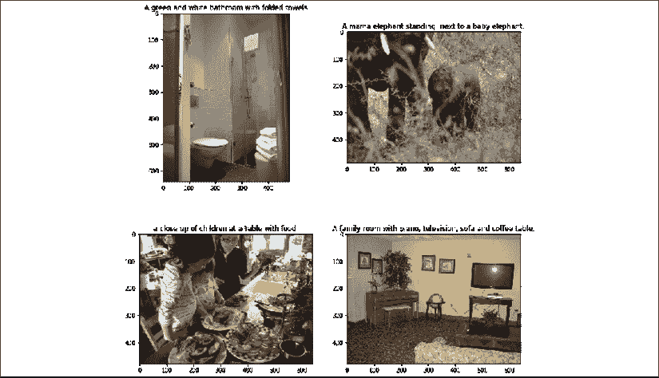

# 第七章：多模态网络与图像描述生成，使用 ResNet 和 Transformer 网络

“一图胜千言”是一句著名的谚语。在本章中，我们将验证这句谚语，并为图像生成描述。在此过程中，我们将使用**多模态**网络。到目前为止，我们的输入是文本。人类可以将多种感官输入结合起来，理解周围的环境。我们可以带字幕观看视频并结合所提供的信息来理解场景。我们可以通过面部表情和唇部动作与声音一起理解语言。我们可以在图像中识别文本，并能回答有关图像的自然语言问题。换句话说，我们能够同时处理来自不同模态的信息，并将它们整合在一起理解我们周围的世界。人工智能和深度学习的未来在于构建多模态网络，因为它们能 closely 模拟人类的认知功能。

图像、语音和文本处理的最新进展为多模态网络奠定了坚实的基础。本章将引导你从自然语言处理（NLP）领域过渡到多模态学习领域，我们将使用熟悉的 Transformer 架构结合视觉和文本特征。

本章将涵盖以下主题：

+   多模态深度学习概述

+   视觉与语言任务

+   图像描述任务和 MS-COCO 数据集的详细概述

+   残差网络架构，特别是 ResNet

+   使用预训练的 ResNet50 提取图像特征

+   从零构建完整的 Transformer 模型

+   提升图像描述生成性能的思路

我们的旅程从视觉理解领域的各种任务概述开始，重点介绍结合语言和图像的任务。

# 多模态深度学习

“模态”一词的词典定义是“某物存在、体验或表达的特定方式。”感官模态，如触觉、味觉、嗅觉、视觉和听觉，使人类能够体验周围的世界。假设你在农场采摘草莓，朋友告诉你挑选成熟且红的草莓。指令 *成熟且红的草莓* 会被处理并转化为视觉和触觉标准。当你看到草莓并触摸它们时，你会直觉地知道它们是否符合 *成熟且红的* 标准。这项任务就是多个模态协同工作来完成一个任务的例子。正如你能想象的，这些能力对机器人学至关重要。

作为前面示例的直接应用，考虑一个需要采摘成熟果实的收割机器人。1976 年 12 月，Harry McGurk 和 John MacDonald 在著名期刊《自然》上发表了一篇题为*听嘴唇，看声音*的研究论文（[`www.nature.com/articles/264746a0`](https://www.nature.com/articles/264746a0)）。他们录制了一段年轻女性说话的视频，其中*ba*音节的发音被配上了*ga*音节的口型。当这个视频播放给成年人时，人们听到的音节是*da*。而当没有视频只播放音频时，正确的音节被报告了出来。这篇研究论文强调了视觉在语音识别中的作用。使用唇读信息的语音识别模型在**视听语音识别**（**AVSR**）领域得到了开发。多模态深度学习模型在医疗设备和诊断、学习技术及其他**人工智能**（**AI**）领域中有许多令人兴奋的应用。

让我们深入探讨视觉与语言的具体互动以及我们可以执行的各种任务。

## 视觉与语言任务

**计算机视觉**（**CV**）和**自然语言处理**（**NLP**）的结合使我们能够构建能够“看”和“说”的智能 AI 系统。CV 和 NLP 的结合为模型开发提供了有趣的任务。给定一张图像并为其生成描述是一个广为人知的任务。该任务的一个实际应用是为网页上的图像生成替代文本标签。视觉障碍读者使用屏幕阅读器来读取这些标签，从而在浏览网页时提高网页的可访问性。该领域的其他话题包括视频描述和讲故事——从一系列图像中编写故事。下图展示了图像和描述的一些示例。本章的主要关注点是图像描述：



图 7.1：带有描述的示例图像

**视觉问答**（**VQA**）是一个具有挑战性的任务，旨在回答关于图像中物体的问题。下图展示了来自 VQA 数据集的一些示例。与图像描述不同，图像描述会在描述中体现显著物体，而 VQA 是一个更为复杂的任务。回答问题可能还需要一定的推理。

请看下图右下方的面板。回答问题“这个人视力是 20/20 吗？”需要推理。VQA 的数据集可以在[visualqa.org](http://visualqa.org)获取：


图 7.2：来自 VQA 数据集的示例（来源：VQA：视觉问答，Agrawal 等人）

推理引出了另一个具有挑战性但又令人着迷的任务——**视觉常识推理**（**VCR**）。当我们查看一张图像时，我们可以猜测情绪、动作，并推测正在发生的事情。这个任务对人类来说相当简单，甚至可能不需要有意识地努力。VCR 任务的目标是构建能够执行此类任务的模型。这些模型还应能够解释或选择一个适当的理由，来说明已作出的逻辑推理。以下图像展示了 VCR 数据集中的一个示例。有关 VCR 数据集的更多细节，请访问 [visualcommonsense.com](http://visualcommonsense.com)：


图 7.3：VCR 示例（来源：《从识别到认知：视觉常识推理》，Zellers 等人著）

到目前为止，我们已经从图像转向了文本。反过来也可以实现，并且是一个活跃的研究领域。在这个任务中，图像或视频是通过使用生成对抗网络（GANs）和其他生成架构从文本生成的。想象一下，能够根据故事的文本生成一本插画漫画书！这个特定任务目前处于研究的前沿。

该领域的一个关键概念是**视觉基础**。基础使得将语言中的概念与现实世界相连接。简单来说，就是将词语与图片中的物体相匹配。通过结合视觉和语言，我们可以将语言中的概念与图像中的部分进行对接。例如，将“篮球”这个词与图像中看起来像篮球的物体匹配，这就是视觉基础。也可以有更抽象的概念进行基础化。例如，一只矮小的大象和一个矮小的人具有不同的测量值。基础为我们提供了一种方式来查看模型正在学习的内容，并帮助我们引导它们朝着正确的方向前进。

现在我们已经对视觉和语言任务有了一个正确的视角，让我们深入探讨图像描述任务。

# 图像描述

图像描述就是用一句话描述图像的内容。描述有助于基于内容的图像检索和视觉搜索。我们已经讨论过，描述如何通过使屏幕阅读器更容易总结图像内容来提高网站的可访问性。描述可以视为图像的总结。一旦我们将问题框定为图像摘要问题，我们可以借用上一章中的 seq2seq 模型来解决这个问题。在文本摘要中，输入是长篇文章的序列，输出是总结内容的简短序列。在图像描述中，输出格式与摘要类似。然而，如何将由像素组成的图像结构化为一系列嵌入，以便输入到编码器中，这可能并不显而易见。

其次，摘要架构使用了**双向长短期记忆网络**（**BiLSTMs**），其基本原理是相互之间靠得更近的单词在意义上也较为相似。BiLSTMs 通过从两侧查看输入序列并生成编码表示来利用这一特性。为图像生成适合编码器的表示需要一些思考。

一个表示图像为序列的简单解决方案是将其表示为像素列表。因此，一个 28x28 像素的图像就变成了 784 个标记的序列。当这些标记代表文本时，嵌入层学习每个标记的表示。如果这个嵌入层的维度为 64，那么每个标记将通过一个 64 维的向量来表示。这个嵌入向量是在训练过程中学习到的。继续延伸我们使用像素作为标记的类比，一种直接的解决方案是使用图像中每个像素的红/绿/蓝通道值来生成三维嵌入。然而，训练这三个维度似乎并不是一种合乎逻辑的方法。更重要的是，像素在 2D 表示中排布，而文本则是在 1D 表示中排布。这个概念在以下图像中得到了说明。单词与其旁边的单词相关。当像素以序列的形式排列时，这些像素的**数据局部性**被打破，因为像素的内容与其周围的所有像素相关，而不仅仅是与其左右相邻的像素相关。这个想法通过下面的图像展示出来：


图 7.4：文本与图像中的数据局部性

数据局部性和平移不变性是图像的两个关键特性。平移不变性是指一个物体可以出现在图像的不同位置。在一个全连接模型中，模型会试图学习物体的位置，这会阻止模型的泛化。**卷积神经网络**（**CNNs**）的专门架构可以用来利用这些特性并从图像中提取信号。总的来说，我们使用 CNNs，特别是**ResNet50**架构，将图像转换为可以输入到 seq2seq 架构的张量。我们的模型将在 seq2seq 模型下结合 CNNs 和 RNNs 的优势来处理图像和文本部分。以下图示展示了我们架构的高层概述：


图 7.5：高级图像标注模型架构

虽然对 CNNs 的全面解释超出了本书的范围，但我们将简要回顾关键概念。由于我们将使用一个预训练的 CNN 模型，因此无需深入探讨 CNNs 的细节。*Python 机器学习（第三版）*（由 Packt 出版）是一本阅读 CNNs 的优秀资源。

在上一章的文本摘要中，我们构建了一个带有注意力机制的 seq2seq 模型。在这一章，我们将构建一个 Transformer 模型。Transformer 模型目前是自然语言处理领域的最前沿技术。Transformer 的编码器部分是**双向编码器表示（Bidirectional Encoder Representations from Transformers）**（**BERT**）架构的核心。Transformer 的解码器部分是**生成式预训练 Transformer**（**GPT**）系列架构的核心。Transformer 架构有一个在图像字幕生成问题中尤为重要的特定优势。在 seq2seq 架构中，我们使用了 BiLSTM，它尝试通过共现来学习关系。在 Transformer 架构中，没有递归。相反，使用位置编码和自注意力机制来建模输入之间的关系。这一变化使我们能够将处理后的图像补丁作为输入，并希望学习到图像补丁之间的关系。

实现图像字幕生成模型需要大量代码，因为我们将实现多个部分，例如使用 ResNet50 进行图像预处理，并从零开始完整实现 Transformer 架构。本章的代码量远远超过其他章节。我们将依赖代码片段来突出代码中的最重要部分，而不是像以前那样逐行详细讲解代码。

构建模型的主要步骤总结如下：

1.  **下载数据**：由于数据集的庞大体积，这是一个耗时的活动。

1.  **预处理字幕**：由于字幕是 JSON 格式的，它们被平坦化为 CSV 格式，以便更轻松地处理。

1.  **特征提取**：我们通过 ResNet50 将图像文件传递来提取特征，并将其保存，以加速训练。

1.  **Transformer 训练**：一个完整的 Transformer 模型，包括位置编码、多头注意力机制、编码器和解码器，在处理后的数据上进行训练。

1.  **推理**：使用训练好的模型为一些图像生成字幕！

1.  **评估性能**：使用**双语评估替代法**（**Bilingual Evaluation Understudy**，简称**BLEU**）分数来比较训练模型与真实数据。

让我们首先从数据集开始。

# MS-COCO 数据集用于图像字幕生成

微软在 2014 年发布了**上下文中的常见物体**（**Common Objects in Context**，简称**COCO**）数据集。所有版本的数据集可以在[cocodataset.org](http://cocodataset.org)上找到。COCO 数据集是一个大型数据集，广泛用于物体检测、分割和字幕生成等任务。我们的重点将放在 2014 年的训练和验证图像上，每个图像都有五个字幕。训练集大约有 83K 张图像，验证集有 41K 张图像。训练和验证图像及字幕需要从 COCO 网站下载。

**大文件下载警告**：训练集图像数据集大约为 13 GB，而验证集数据集超过 6 GB。图像文件的注释，包括标题，大小约为 214 MB。下载该数据集时，请小心你的网络带宽使用和潜在费用。

Google 还发布了一个新的 Conceptual Captions 数据集，地址为 [`ai.google.com/research/ConceptualCaptions`](https://ai.google.com/research/ConceptualCaptions)。它包含超过 300 万张图像。拥有一个大型数据集可以让深度模型更好地训练。还有一个相应的比赛，你可以提交你的模型，看看它与其他模型的表现如何。

鉴于这些是大文件下载，你可能希望使用最适合你的下载方式。如果你的环境中有 `wget`，你可以使用它来下载文件，方法如下：

```py
$ wget http://images.cocodataset.org/zips/train2014.zip
$ wget http://images.cocodataset.org/zips/val2014.zip
$ wget http://images.cocodataset.org/annotations/annotations_trainval2014.zip 
```

请注意，训练集和验证集的注释文件是一个压缩包。下载文件后，需要解压。每个压缩文件都会创建一个文件夹，并将内容放入其中。我们将创建一个名为 `data` 的文件夹，并将所有解压后的内容移动到其中：

```py
$ mkdir data
$ mv train2014 data/
$ mv val2014 data/
$ mv annotations data/ 
```

所有图像都在 `train2014` 或 `val2014` 文件夹中。数据的初步预处理代码位于 `data-download-preprocess.py` 文件中。训练和验证图像的标题可以在 `annotations` 子文件夹中的 `captions_train2014.json` 或 `captions_val2014.json` JSON 文件中找到。这两个文件的格式相似。文件中有四个主要键——info、image、license 和 annotation。image 键包含每个图像的记录，以及关于图像的大小、URL、名称和用于引用该图像的唯一 ID。标题以图像 ID 和标题文本的元组形式存储，并带有一个用于标题的唯一 ID。我们使用 Python 的 `json` 模块来读取和处理这些文件：

```py
valcaptions = json.load(open(
    './data/annotations/captions_val2014.json', 'r'))
trcaptions = json.load(open(
    './data/annotations/captions_train2014.json', 'r'))
# inspect the annotations
print(trcaptions.keys())
dict_keys(['info', 'images', 'licenses', 'annotations']) 
```

我们的目标是生成一个包含两列的简单文件——一列是图像文件名，另一列是该文件的标题。请注意，验证集包含的图像数量是训练集的一半。在一篇关于图像标题生成的开创性论文《*深度视觉-语义对齐用于生成图像描述*》中，Andrej Karpathy 和 Fei-Fei Li 提出了在保留 5,000 张验证集图像用于测试后，训练所有的训练集和验证集图像。我们将通过将图像名称和 ID 处理成字典来遵循这种方法：

```py
prefix = "./data/"
val_prefix = prefix + 'val2014/'
train_prefix = prefix + 'train2014/'
# training images
trimages = {x['id']: x['file_name'] for x in trcaptions['images']}
# validation images
# take all images from validation except 5k - karpathy split
valset = len(valcaptions['images']) - 5000 # leave last 5k 
valimages = {x['id']: x['file_name'] for x in valcaptions['images'][:valset]}
truevalimg = {x['id']: x['file_name'] for x in valcaptions['images'][valset:]} 
```

由于每个图像都有五个标题，验证集不能根据标题进行拆分。否则，会出现训练集数据泄漏到验证集/测试集的情况。在前面的代码中，我们保留了最后 5K 张图像用于验证集。

现在，让我们查看训练集和验证集图像的标题，并创建一个合并的列表。我们将创建空列表来存储图像路径和标题的元组：

```py
# we flatten to (caption, image_path) structure
data = list()
errors = list()
validation = list() 
```

接下来，我们将处理所有的训练标签：

```py
for item in trcaptions['annotations']:
    if int(item['image_id']) in trimages:
        fpath = train_prefix + trimages[int(item['image_id'])]
        caption = item['caption']
        data.append((caption, fpath))
    else:
        errors.append(item) 
```

对于验证标签，逻辑类似，但我们需要确保不为已预留的图像添加标签：

```py
for item in valcaptions['annotations']:
    caption = item['caption']
    if int(item['image_id']) in valimages:
        fpath = val_prefix + valimages[int(item['image_id'])]
        data.append((caption, fpath))
    elif int(item['image_id']) in truevalimg: # reserved
        fpath = val_prefix + truevalimg[int(item['image_id'])]
        validation.append((caption, fpath))
    else:
        errors.append(item) 
```

希望没有任何错误。如果遇到错误，可能是由于下载文件损坏或解压时出错。训练数据集会进行洗牌，以帮助训练。最后，会持久化保存两个 CSV 文件，分别包含训练数据和测试数据：

```py
# persist for future use
with open(prefix + 'data.csv', 'w') as file:
    writer = csv.writer(file, quoting=csv.QUOTE_ALL)
    writer.writerows(data)
# persist for future use
with open(prefix + 'validation.csv', 'w') as file:
    writer = csv.writer(file, quoting=csv.QUOTE_ALL)
    writer.writerows(validation)
print("TRAINING: Total Number of Captions: {},  Total Number of Images: {}".format(
    len(data), len(trimages) + len(valimages)))
print("VALIDATION/TESTING: Total Number of Captions: {},  Total Number of Images: {}".format(
    len(validation), len(truevalimg)))
print("Errors: ", errors) 
```

```py
TRAINING: Total Number of Captions: 591751,  Total Number of Images: 118287
VALIDATION/TESTING: Total Number of Captions: 25016,  Total Number of Images: 5000
Errors:  [] 
```

到此为止，数据下载和预处理阶段已经完成。下一步是使用 ResNet50 对所有图像进行预处理，以提取特征。在我们编写相关代码之前，我们将稍作绕行，了解一下 CNN 和 ResNet 架构。如果你已经熟悉 CNN，可以跳过这部分，直接进入代码部分。

# 使用 CNN 和 ResNet50 进行图像处理

在深度学习的世界里，已经开发出特定的架构来处理特定的模态。CNN 在处理图像方面取得了巨大的成功，并且是计算机视觉任务的标准架构。使用预训练模型提取图像特征的一个很好的思维模型是，将其类比为使用预训练的词向量（如 GloVe）来处理文本。在这个特定的案例中，我们使用一种叫做 ResNet50 的架构。虽然本书并不深入讲解 CNN 的所有细节，但这一节将简要概述 CNN 和 ResNet。如果你已经熟悉这些概念，可以跳到*使用 ResNet50 进行图像特征提取*这一部分。

## CNN（卷积神经网络）

CNN（卷积神经网络）是一种旨在从以下关键特性中学习的架构，这些特性与图像识别相关：

+   **数据局部性**：图像中的像素与周围像素高度相关。

+   **平移不变性**：一个感兴趣的物体，例如鸟，可能出现在图像的不同位置。模型应该能够识别该物体，而不管它在图像中的位置如何。

+   **尺度不变性**：感兴趣的物体可能会根据缩放显示为较小或较大的尺寸。理想情况下，模型应该能够识别图像中的物体，而不管它们的尺寸如何。

卷积层和池化层是帮助 CNN 从图像中提取特征的关键组件。

### 卷积操作

卷积是一种数学运算，它在从图像中提取的区域上执行，使用的是过滤器。过滤器是一个矩阵，通常是方形的，常见的尺寸为 3x3、5x5 和 7x7。下图展示了一个 3x3 卷积矩阵应用于 5x5 图像的例子。图像区域从左到右、从上到下提取。每次步进的像素数被称为**步幅**。在水平和垂直方向上，步幅为 1 时，会将一个 5x5 的图像缩减为 3x3 的图像，如下所示：


图 7.6：卷积操作示例

这里应用的特定滤波器是边缘检测滤波器。在 CNN 出现之前，计算机视觉（CV）在很大程度上依赖于手工制作的滤波器。Sobel 滤波器是用于边缘检测的特殊滤波器之一。`convolution-example.ipynb`笔记本提供了使用 Sobel 滤波器检测边缘的示例。代码非常简单。在导入模块后，图像文件被加载并转换为灰度图像：

```py
tulip = Image.open("chap7-tulip.jpg") 
# convert to gray scale image
tulip_grey = tulip.convert('L')
tulip_ar = np.array(tulip_grey) 
```

接下来，我们定义并将 Sobel 滤波器应用到图像中：

```py
# Sobel Filter
kernel_1 = np.array([[1, 0, -1],
                     [2, 0, -2],
                     [1, 0, -1]])        # Vertical edge 
kernel_2 = np.array([[1, 2, 1],
                     [0, 0, 0],
                     [-1, -2, -1]])      # Horizontal edge 
out1 = convolve2d(tulip_ar, kernel_1)    # vertical filter
out2 = convolve2d(tulip_ar, kernel_2)    # horizontal filter
# Create a composite image from the two edge detectors
out3 = np.sqrt(out1**2 + out2**2) 
```

原始图像及其中间版本如下图所示：


图 7.7：使用 Sobel 滤波器进行边缘检测

构建这样的滤波器是非常繁琐的。然而，CNN（卷积神经网络）可以通过将滤波器矩阵视为可学习的参数来学习许多这样的滤波器。CNN 通常会通过数百或数千个这样的滤波器（称为通道）处理一张图像，并将它们堆叠在一起。你可以将每个滤波器视为检测某些特征，如竖直线、水平线、弧形、圆形、梯形等。然而，当多个这样的层组合在一起时，魔法就发生了。堆叠多个层导致了分层表示的学习。理解这一概念的一个简单方法是，想象早期的层学习的是简单的形状，如线条和弧形；中间层学习的是圆形和六边形等形状；顶层学习的是复杂的物体，如停车标志和方向盘。卷积操作是关键创新，它利用数据的局部性并提取出特征，从而实现平移不变性。

这种分层的结果是模型中流动的数据量增加。池化是一种帮助减少通过数据的维度并进一步突出这些特征的操作。

### 池化

一旦卷积操作的值被计算出来，就可以对图像中的补丁应用池化操作，以进一步集中图像中的信号。最常见的池化形式称为**最大池化**，并在以下图示中展示。这就像是在一个补丁中取最大值一样简单。

以下图示显示了在不重叠的 2x2 补丁上进行最大池化：


图 7.8：最大池化操作

另一种池化方法是通过对值进行平均。虽然池化降低了复杂性和计算负担，但它也在一定程度上帮助了尺度不变性。然而，这样的模型有可能会出现过拟合，并且无法很好地泛化。Dropout（丢弃法）是一种有助于正则化的技术，它使得此类模型能够更好地泛化。

### 使用 dropout 进行正则化

你可能还记得，在之前的章节中，我们在 LSTM 和 BiLSTM 设置中使用了 dropout 设置。dropout 的核心思想如下图所示：


图 7.9：丢弃法

与其将低层的每个单元连接到模型中每个更高层的单元，不如在训练期间随机丢弃一些连接。输入仅在训练期间被丢弃。由于丢弃输入会减少到达节点的总输入，相对于测试/推理时间，需要按丢弃率上调输入，以确保相对大小保持一致。训练期间丢弃一些输入迫使模型从每个输入中学习更多内容，因为它不能依赖于特定输入的存在。这有助于网络对缺失输入的鲁棒性，从而帮助模型的泛化。

这些技术的结合帮助构建了越来越深的网络。随着网络变得越来越深，出现的一个挑战是输入信号在更高层变得非常小。残差连接是一种帮助解决这个问题的技术。

### 残差连接与 ResNet

直觉上，增加更多层应该能提高性能。更深的网络拥有更多的模型容量，因此它应该能够比浅层网络更好地建模复杂的分布。然而，随着更深的模型的建立，精度出现了下降。由于这种下降甚至出现在训练数据上，因此可以排除过拟合作为可能的原因。随着输入通过越来越多的层，优化器在调整梯度时变得越来越困难，以至于学习在模型中受到抑制。Kaiming He 及其合作者在他们的开创性论文《*深度残差学习用于图像识别*》中发布了 ResNet 架构。

在理解 ResNet 之前，我们必须理解残差连接。残差连接的核心概念如下图所示。在常规的密集层中，输入首先与权重相乘。然后，添加偏置，这是一个线性操作。输出通过激活函数（如 ReLU），这为层引入了非线性。激活函数的输出是该层的最终输出。

然而，残差连接在线性计算和激活函数之间引入了求和，如下图右侧所示：


图 7.10：一个概念性的残差连接

请注意，前面的图示仅用于说明残差连接背后的核心概念。在 ResNet 中，残差连接发生在多个模块之间。下图展示了 ResNet50 的基本构建模块，也称为瓶颈设计。之所以称之为瓶颈设计，是因为 1x1 卷积块在将输入传递到 3x3 卷积之前会减少输入的维度。最后一个 1x1 块再次将输入的维度扩大，以便传递到下一层：


图 7.11：ResNet50 瓶颈构建模块

ResNet50 由几个这样的模块堆叠而成，共有四个组，每组包含三个到七个模块。**BatchNorm**（批量归一化）是 Sergey Ioffe 和 Christian Szegedy 在 2015 年发表的论文 *Batch Normalization: Accelerating Deep Network Training By Reducing Internal Covariate Shift* 中提出的。批量归一化旨在减少从一层输出到下一层输入的输出方差。通过减少这种方差，BatchNorm 起到了类似 L2 正则化的作用，后者通过向损失函数中添加权重大小的惩罚来实现类似的效果。BatchNorm 的主要动机是有效地通过大量层反向传播梯度更新，同时最小化这种更新导致发散的风险。在随机梯度下降中，梯度用于同时更新所有层的权重，假设一层的输出不会影响其他任何层。然而，这并不是一个完全有效的假设。对于一个 `n` 层网络，计算这个将需要 `n` 阶梯度，这在计算上是不可行的。相反，使用了批量归一化，它一次处理一个小批量，并通过限制更新来减少权重分布中的这种不必要的变化。它通过在将输出传递到下一层之前进行归一化来实现这一点。

ResNet50 的最后两层是全连接层，将最后一个模块的输出分类为一个物体类别。全面了解 ResNet 是一项艰巨的任务，但希望通过本次关于卷积神经网络（CNN）和 ResNet 的速成课程，您已经获得了足够的背景知识来理解它们的工作原理。鼓励您阅读参考文献和 *《深度学习与 TensorFlow 2 和 Keras 第二版》*，该书由 Packt 出版，提供了更为详细的内容。幸运的是，TensorFlow 提供了一个预训练的 ResNet50 模型，可以直接使用。在接下来的部分中，我们将使用这个预训练的 ResNet50 模型提取图像特征。

# 使用 ResNet50 进行图像特征提取

ResNet50 模型是在 ImageNet 数据集上训练的。该数据集包含超过 20,000 个类别的数百万张图片。大规模视觉识别挑战赛 ILSVRC 主要聚焦于 1,000 个类别，模型们在这些类别上进行图像识别竞赛。因此，执行分类的 ResNet50 顶层具有 1,000 的维度。使用预训练的 ResNet50 模型的想法是，它已经能够解析出在图像描述中可能有用的对象。

`tensorflow.keras.applications` 包提供了像 ResNet50 这样的预训练模型。写本文时，所有提供的预训练模型都与计算机视觉（CV）相关。加载预训练模型非常简单。此部分的所有代码都位于本章 GitHub 文件夹中的 `feature-extraction.py` 文件中。使用单独文件的主要原因是，它让我们能够以脚本的方式运行特征提取。

考虑到我们将处理超过 100,000 张图片，这个过程可能需要一段时间。卷积神经网络（CNN）在计算上受益于 GPU。现在让我们进入代码部分。首先，我们必须设置从上一章的 JSON 注释中创建的 CSV 文件的路径：

```py
prefix = './data/'
save_prefix = prefix + "features/"  # for storing prefixes
annot = prefix + 'data.csv'
# load the pre-processed file
inputs = pd.read_csv(annot, header=None, names=["caption", "image"]) 
```

ResNet50 期望每张图像为 224x224 像素，并具有三个颜色通道。来自 COCO 数据集的输入图像具有不同的尺寸。因此，我们必须将输入文件转换为 ResNet 训练时使用的标准：

```py
# We are going to use the last residual block of # the ResNet50 architecture
# which has dimension 7x7x2048 and store into individual file
def load_image(image_path, size=(224, 224)):
    # pre-processes images for ResNet50 in batches 
    image = tf.io.read_file(image_path)
    image = tf.io.decode_jpeg(image, channels=3)
    image = tf.image.resize(image, size)
    image = **preprocess_input(image)**  # from keras.applications.ResNet50
    return image, image_path 
```

高亮显示的代码展示了 ResNet50 包提供的一个特殊预处理函数。输入图像中的像素通过 `decode_jpeg()` 函数加载到数组中。每个像素在每个颜色通道的值介于 0 和 255 之间。`preprocess_input()` 函数将像素值归一化，使其均值为 0。由于每张输入图像都有五个描述，我们只应处理数据集中独特的图像：

```py
uniq_images = sorted(inputs['image'].unique())  
print("Unique images: ", len(uniq_images))  # 118,287 images 
```

接下来，我们必须将数据集转换为 `tf.dat.Dataset`，这样可以更方便地批量处理和使用之前定义的便捷函数处理输入文件：

```py
image_dataset = tf.data.Dataset.from_tensor_slices(uniq_images)
image_dataset = image_dataset.map(
    load_image, num_parallel_calls=tf.data.experimental.AUTOTUNE).batch(16) 
```

为了高效地处理和生成特征，我们必须一次处理 16 张图片。下一步是加载一个预训练的 ResNet50 模型：

```py
rs50 = tf.keras.applications.ResNet50(
    include_top=False,
    weights="imagenet", 
    input_shape=(224, 224, 3)
)
new_input = rs50.input
hidden_layer = rs50.layers[-1].output
features_extract = tf.keras.Model(new_input, hidden_layer)
features_extract.summary() 
```

```py
__________________________________________________________________
Layer (type)                    Output Shape         Param #     Connected to
==================================================================
input_1 (InputLayer)            [(None, 224, 224, 3) 0
__________________________________________________________________
<CONV BLOCK 1>
__________________________________________________________________
<CONV BLOCK 2>
__________________________________________________________________
<CONV BLOCK 3>
__________________________________________________________________
<CONV BLOCK 4>
__________________________________________________________________
<CONV BLOCK 5>
==================================================================
Total params: 23,587,712
Trainable params: 23,534,592
Non-trainable params: 53,120
__________________________________________________________________ 
```

上述输出已简化以节省篇幅。该模型包含超过 2300 万个可训练参数。我们不需要顶层的分类层，因为我们使用该模型进行特征提取。我们定义了一个新的模型，包括输入和输出层。在这里，我们取了最后一层的输出。我们也可以通过改变 `hidden_layer` 变量的定义来从 ResNet 的不同部分获取输出。实际上，这个变量可以是一个层的列表，在这种情况下，`features_extract` 模型的输出将是列表中每一层的输出。

接下来，必须设置一个目录来存储提取的特征：

```py
save_prefix = prefix + "features/"
try:
    # Create this directory 
    os.mkdir(save_prefix)
except FileExistsError:
    pass # Directory already exists 
```

特征提取模型可以处理图像批次并预测输出。每张图像的输出为 2,048 个 7x7 像素的补丁。如果输入的是 16 张图像的批次，那么模型的输出将是一个[16, 7, 7, 2048]维度的张量。我们将每张图像的特征存储为单独的文件，同时将维度展平为[49, 2048]。每张图像现在已经被转换成一个包含 49 个像素的序列，嵌入大小为 2,048。以下代码执行此操作：

```py
for img, path in tqdm(image_dataset):
    batch_features = features_extract(img)
    batch_features = tf.reshape(batch_features,
                                (batch_features.shape[0], -1,                                  batch_features.shape[3]))
    for feat, p in zip(batch_features, path):
        filepath = p.numpy().decode("utf-8")
        filepath = save_prefix + filepath.split('/')[-1][:-3] + "npy"
        np.save(filepath, feat.numpy())
print("Images saved as npy files") 
```

这可能是一个耗时的操作，具体取决于你的计算环境。在我的 Ubuntu Linux 系统和 RTX 2070 GPU 的配置下，这个过程花费了大约 23 分钟。

数据预处理的最后一步是训练子词编码器。你应该对这部分非常熟悉，因为它与我们在前几章中做的完全相同：

```py
# Now, read the labels and create a subword tokenizer with it
# ~8K vocab size
cap_tokenizer = tfds.features.text.SubwordTextEncoder.build_from_corpus(
    inputs['caption'].map(lambda x: x.lower().strip()).tolist(),
    target_vocab_size=2**13, reserved_tokens=['<s>', '</s>'])
cap_tokenizer.save_to_file("captions") 
```

请注意，我们包含了两个特殊的标记来表示序列的开始和结束。你可能会回忆起在*第五章*中，*使用 RNN 和 GPT-2 生成文本*时提到过这种技术。在这里，我们采用了稍微不同的方式来实现相同的技术，目的是展示如何用不同的方式实现相同的目标。

到此为止，预处理和特征提取已经完成。接下来的步骤是定义 Transformer 模型。然后，我们就可以开始训练模型了。

# Transformer 模型

Transformer 模型在*第四章*中有讨论，*使用 BERT 进行迁移学习*。它的灵感来源于 seq2seq 模型，并包含了编码器（Encoder）和解码器（Decoder）部分。由于 Transformer 模型不依赖于 RNN，输入序列需要使用位置编码进行标注，这使得模型能够学习输入之间的关系。移除循环结构显著提高了模型的速度，并减少了内存占用。Transformer 模型的这一创新使得像 BERT 和 GPT-3 这样的大型模型成为可能。Transformer 模型的编码器部分已在前述章节中展示。完整的 Transformer 模型已在*第五章*，*使用 RNN 和 GPT-2 生成文本*中展示。我们将从一个修改版的完整 Transformer 模型开始。具体来说，我们将修改 Transformer 的编码器部分，创建一个视觉编码器，该编码器以图像数据作为输入，而不是文本序列。为了适应图像作为输入，编码器需要做一些其他小的修改。我们将要构建的 Transformer 模型在下图中展示。这里的主要区别在于输入序列的编码方式。在文本的情况下，我们将使用子词编码器对文本进行分词，并将其通过一个可训练的嵌入层。

随着训练的进行，标记的嵌入（embeddings）也在不断学习。在图像描述的情况下，我们将图像预处理为一个由 49 个像素组成的序列，每个像素的“嵌入”大小为 2,048。这样实际上简化了输入的填充处理。所有图像都经过预处理，使其具有相同的长度。因此，不需要填充和掩码输入：


图 7.12：带有视觉编码器的 Transformer 模型

以下代码段需要实现才能构建 Transformer 模型：

+   输入的位置信息编码，以及输入和输出的掩码。我们的输入是固定长度的，但输出和描述是可变长度的。

+   缩放点积注意力和多头注意力，使编码器和解码器能够专注于数据的特定方面。

+   一个由多个重复块组成的编码器。

+   一个使用编码器输出的解码器，通过其重复块进行操作。

Transformer 的代码来自于 TensorFlow 教程，标题为 *Transformer 模型用于语言理解*。我们将使用这段代码作为基础，并将其适配于图像描述的应用场景。Transformer 架构的一个优点是，如果我们能将问题转化为序列到序列的问题，就可以应用 Transformer 模型。在描述实现过程时，代码的主要要点将被突出展示。请注意，本节的代码位于 `visual_transformer.py` 文件中。

实现完整的 Transformer 模型确实需要一些代码。如果你已经熟悉 Transformer 模型，或者只是想了解我们的模型与标准 Transformer 模型的不同之处，请专注于下一节和 *VisualEncoder* 部分。其余部分可以在你有空时阅读。

## 位置编码和掩码

Transformer 模型不使用 RNN。这使得它们能够在一步计算中得出所有输出，从而显著提高了速度，并且能够学习长输入之间的依赖关系。然而，这也意味着模型无法了解相邻单词或标记之间的关系。为了弥补缺乏关于标记顺序的信息，使用了位置编码向量，其中包含奇数和偶数位置的值，帮助模型学习输入位置之间的关系。

嵌入帮助将含义相似的标记放置在嵌入空间中彼此靠近的位置。位置编码根据标记在句子中的位置将标记相互靠近。将两者结合使用非常强大。

在图像描述中，这对描述是非常重要的。从技术上讲，对于图像输入，我们不需要提供这些位置编码，因为 ResNet50 应该已经生成了适当的补丁。然而，位置编码仍然可以用于输入。位置编码对于偶数位置使用*sin*函数，对于奇数位置使用*cos*函数。计算某个位置编码的公式如下：


这里，`w[i]`定义为：


在前面的公式中，*pos*表示给定标记的位置，`d`[model]表示嵌入的维度，`i`是正在计算的特定维度。位置编码过程为每个标记生成与嵌入相同维度的向量。你可能会想，为什么要使用这么复杂的公式来计算这些位置编码？难道只是从一端到另一端编号标记不就行了吗？事实证明，位置编码算法必须具备一些特性。首先，数值必须能够轻松地推广到长度可变的序列。使用简单的编号方案会导致输入的序列长度超过训练数据时无法处理。此外，输出应该对每个标记的位置是唯一的。而且，不同长度的输入序列中，任何两个位置之间的距离应该保持一致。这种公式相对简单易实现。相关的代码在文件中的位置编码器部分。

首先，我们必须计算*角度*，如前面的`w[i]`公式所示，如下所示：

```py
def get_angles(pos, i, d_model):
    angle_rates = 1 / np.power(10000, (2 * (i // 2)) / np.float32(d_model))
    return pos * angle_rates 
```

然后，我们必须计算位置编码的向量：

```py
def positional_encoding(position, d_model):
    angle_rads = get_angles(np.arange(position)[:, np.newaxis],
                            np.arange(d_model)[np.newaxis, :],
                            d_model)
    # apply sin to even indices in the array; 2i
    angle_rads[:, 0::2] = np.sin(angle_rads[:, 0::2])
    # apply cos to odd indices in the array; 2i+1
    angle_rads[:, 1::2] = np.cos(angle_rads[:, 1::2])
    pos_encoding = angle_rads[np.newaxis, ...]
    return tf.cast(pos_encoding, dtype=tf.float32) 
```

下一步是计算输入和输出的掩码。让我们暂时关注解码器。由于我们没有使用 RNN，整个输出一次性传入解码器。然而，我们不希望解码器看到未来时间步的数据。所以，输出必须被掩蔽。就编码器而言，如果输入被填充到固定长度，则需要掩码。然而，在我们的情况下，输入总是正好是 49 的长度。所以，掩码是一个固定的全 1 向量：

```py
def create_padding_mask(seq):
    seq = tf.cast(tf.math.equal(seq, 0), tf.float32)
    # add extra dimensions to add the padding
    # to the attention logits.
    return seq[:, tf.newaxis, tf.newaxis, :]  
    # (batch_size, 1, 1, seq_len)
# while decoding, we dont have recurrence and dont want Decoder
# to see tokens from the future
def create_look_ahead_mask(size):
    mask = 1 - tf.linalg.band_part(tf.ones((size, size)), -1, 0)
    return mask  # (seq_len, seq_len) 
```

第一个方法用于掩盖填充的输入。这个方法是为了完整性而包括的，但稍后你会看到我们传递给它的是一个由 1 组成的序列。所以，这个方法的作用只是重新调整掩码。第二个掩码函数用于掩蔽解码器的输入，使其只能看到自己生成的位置。

转换器的编码器和解码器层使用特定形式的注意力机制。这是架构的基本构建块，接下来将进行实现。

## 缩放点积和多头注意力

注意力函数的目的是将查询与一组键值对进行匹配。输出是值的加权和，权重由查询和键之间的匹配度决定。多头注意力学习多种计算缩放点积注意力的方式，并将它们结合起来。

缩放点积注意力通过将查询向量与键向量相乘来计算。这个乘积通过查询和键的维度的平方根进行缩放。注意，这个公式假设键和查询向量具有相同的维度。实际上，查询、键和值向量的维度都设置为嵌入的大小。

在位置编码中，这被称为`d`[model]。在计算键和值向量的缩放点积之后，应用 softmax，softmax 的结果再与值向量相乘。使用掩码来遮盖查询和键的乘积。

```py
def scaled_dot_product_attention(q, k, v, mask):
    # (..., seq_len_q, seq_len_k)
    matmul_qk = tf.matmul(q, k, transpose_b=True)
    # scale matmul_qk
    dk = tf.cast(tf.shape(k)[-1], tf.float32)
    scaled_attention_logits = matmul_qk / tf.math.sqrt(dk)
    # add the mask to the scaled tensor.
    if mask is not None:
        scaled_attention_logits += (mask * -1e9)
    # softmax is normalized on the last axis (seq_len_k)     # so that the scores
    # add up to 1.
    attention_weights = tf.nn.softmax(
                        scaled_attention_logits,
                        axis=-1)  # (..., seq_len_q, seq_len_k)
    output = tf.matmul(attention_weights, v)  
    # (..., seq_len_q, depth_v)
    return output, attention_weights 
```

多头注意力将来自多个缩放点积注意力单元的输出进行拼接，并通过一个线性层传递。嵌入输入的维度会被头数除以，用于计算键和值向量的维度。多头注意力实现为自定义层。首先，我们必须创建构造函数：

```py
class MultiHeadAttention(tf.keras.layers.Layer):
    def __init__(self, d_model, num_heads):
        super(MultiHeadAttention, self).__init__()
        self.num_heads = num_heads
        self.d_model = d_model
        **assert** **d_model % self.num_heads ==** `0`
        self.depth = d_model // self.num_heads
        self.wq = tf.keras.layers.Dense(d_model)
        self.wk = tf.keras.layers.Dense(d_model)
        self.wv = tf.keras.layers.Dense(d_model)
        self.dense = tf.keras.layers.Dense(d_model) 
```

请注意，突出显示的`assert`语句。当实例化 Transformer 模型时，选择某些参数至关重要，以确保头数能够完全除尽模型大小或嵌入维度。此层的主要计算在`call()`函数中：

```py
 def call(self, v, k, q, mask):
        batch_size = tf.shape(q)[0]
        q = self.wq(q)  # (batch_size, seq_len, d_model)
        k = self.wk(k)  # (batch_size, seq_len, d_model)
        v = self.wv(v)  # (batch_size, seq_len, d_model)
        # (batch_size, num_heads, seq_len_q, depth)
        **q = self.split_heads(q, batch_size)**
        # (batch_size, num_heads, seq_len_k, depth)
        **k = self.split_heads(k, batch_size)**
        # (batch_size, num_heads, seq_len_v, depth)
        **v = self.split_heads(v, batch_size)**
        # scaled_attention.shape == (batch_size, num_heads, seq_len_q, depth)
        # attention_weights.shape == (batch_size, num_heads, seq_len_q, seq_len_k)
        scaled_attention, attention_weights = scaled_dot_product_attention(q, k, v, mask)
        # (batch_size, seq_len_q, num_heads, depth)
        scaled_attention = tf.transpose(scaled_attention, 
                                                   perm=[0, 2, 1, 3])
        concat_attention = tf.reshape(scaled_attention,
                                        (batch_size, -1,
                              self.d_model))  
        # (batch_size, seq_len_q, d_model)
        # (batch_size, seq_len_q, d_model)
        output = self.dense(concat_attention)
        return output, attention_weights 
```

这三行突出显示了如何将向量分割成多个头。`split_heads()`定义如下：

```py
 def split_heads(self, x, batch_size):
        """
        Split the last dimension into (num_heads, depth).
        Transpose the result such that the shape is (batch_size, num_heads, seq_len, depth)
        """
        x = tf.reshape(x, (batch_size, -1, 
self.num_heads, self.depth))
        return tf.transpose(x, perm=[0, 2, 1, 3]) 
```

这完成了多头注意力的实现。这是 Transformer 模型的关键部分。这里有一个关于 Dense 层的小细节，Dense 层用于聚合来自多头注意力的输出。它非常简单：

```py
def point_wise_feed_forward_network(d_model, dff):
    return tf.keras.Sequential([
        # (batch_size, seq_len, dff)
        tf.keras.layers.Dense(dff, activation='relu'),
        tf.keras.layers.Dense(d_model)
        # (batch_size, seq_len, d_model)
    ]) 
```

到目前为止，我们已经查看了指定 Transformer 模型的以下参数：

+   `d`[model]用于嵌入的大小和输入的主要流动

+   `d`[ff]是前馈部分中中间 Dense 层输出的大小

+   `h`指定了多头注意力的头数

接下来，我们将实现一个视觉编码器，该编码器已经被修改为支持图像作为输入。

## VisualEncoder

在*Transformer 模型*部分中展示的图表显示了编码器的结构。编码器通过位置编码和掩码处理输入，然后将其通过多头注意力和前馈层的堆栈进行传递。这个实现偏离了 TensorFlow 教程，因为教程中的输入是文本。在我们的案例中，我们传递的是 49x2,048 的向量，这些向量是通过将图像传入 ResNet50 生成的。主要的区别在于如何处理输入。`VisualEncoder`被构建为一个层，以便最终组成 Transformer 模型：

```py
class VisualEncoder(tf.keras.layers.Layer):
    def __init__(self, num_layers, d_model, num_heads, dff,
                 maximum_position_encoding=**49**, dropout_rate=0.1,
                 use_pe=True):
        # we have 7x7 images from ResNet50, 
        # and each pixel is an input token
        # which has been embedded into 2048 dimensions by ResNet
        super(VisualEncoder, self).__init__()
        self.d_model = d_model
        self.num_layers = num_layers

        **# FC layer replaces embedding layer in traditional encoder**
        **# this FC layers takes 49x2048 image** 
        **# and projects into model dims**
        **self.fc = tf.keras.layers.Dense(d_model, activation=****'relu'****)**
        self.pos_encoding = positional_encoding(
                                         maximum_position_encoding,
                                      self.d_model)
        self.enc_layers = [EncoderLayer(d_model, num_heads, 
                                        dff, dropout_rate)
                           for _ in range(num_layers)]
        self.dropout = tf.keras.layers.Dropout(dropout_rate)

        self.use_pe = use_pe 
```

构造函数如下所示。引入了一个新的参数，用于指示层数。原始论文使用了 6 层，512 作为`d`[模型]，8 个多头注意力头，以及 2,048 作为中间前馈输出的大小。请注意前面代码中标记的行。预处理过的图像的尺寸可能会有所不同，具体取决于从 ResNet50 中提取输出的层。我们将输入通过一个稠密层`fc`，调整为模型所需的输入大小。这使得我们可以在不改变架构的情况下，尝试使用不同的模型来预处理图像，比如 VGG19 或 Inception。还要注意，最大位置编码被硬编码为 49，因为那是 ResNet50 模型输出的维度。最后，我们添加了一个标志位，可以在视觉编码器中开启或关闭位置编码。你应该尝试训练包含或不包含位置编码的模型，看看这是否有助于或阻碍学习。

`VisualEncoder`由多个多头注意力和前馈块组成。我们可以利用一个方便的类`EncoderLayer`来定义这样一个块。根据输入参数创建这些块的堆叠。我们稍后会检查`EncoderLayer`的内部实现。首先，让我们看看输入如何通过`VisualEncoder`传递。`call()`函数用于生成给定输入的输出：

```py
 def call(self, x, training, mask):
        # all inp image sequences are always 49, so mask not needed
        seq_len = tf.shape(x)[1]
        # adding embedding and position encoding.
        # input size should be batch_size, 49, 2048)
        # output dims should be (batch_size, 49, d_model)
        x = self.fc(x)
        # scaled dot product attention
        x *= tf.math.sqrt(tf.cast(self.d_model, tf.float32)) 
        if self.use_pe:
            x += self.pos_encoding[:, :seq_len, :]
        x = self.dropout(x, training=training)
        for i in range(self.num_layers):
            x = self.enc_layersi  # mask shouldnt be needed
        return x  # (batch_size, 49, d_model) 
```

由于之前定义的抽象，这段代码相当简单。请注意使用训练标志来开启或关闭 dropout。现在，让我们看看`EncoderLayer`是如何定义的。每个 Encoder 构建体由两个子块组成。第一个子块将输入传递通过多头注意力，而第二个子块则将第一个子块的输出通过 2 层前馈层：

```py
class EncoderLayer(tf.keras.layers.Layer):
    def __init__(self, d_model, num_heads, dff, rate=0.1):
        super(EncoderLayer, self).__init__()
        self.mha = MultiHeadAttention(d_model, num_heads)
        self.ffn = point_wise_feed_forward_network(d_model, dff)
        self.layernorm1 = tf.keras.layers.LayerNormalization(
                                                        epsilon=1e-6)
        self.layernorm2 = tf.keras.layers.LayerNormalization(
                                                        epsilon=1e-6)
        self.dropout1 = tf.keras.layers.Dropout(rate)
        self.dropout2 = tf.keras.layers.Dropout(rate)
    def call(self, x, training, mask):
        # (batch_size, input_seq_len, d_model)
        attn_output, _ = self.mha(x, x, x, mask)
        attn_output = self.dropout1(attn_output, 
                                      training=training)
        # (batch_size, input_seq_len, d_model)
        **out1 = self.layernorm1(x + attn_output)** **# Residual connection**

        # (batch_size, input_seq_len, d_model)
        ffn_output = self.ffn(out1)  
        ffn_output = self.dropout2(ffn_output, training=training)
        # (batch_size, input_seq_len, d_model)
        **out2 = self.layernorm2(out1 + ffn_output)** **# Residual conx**
        return out2 
```

每一层首先通过多头注意力计算输出，并将其传递通过 dropout。一个残差连接将输出和输入的和通过 LayerNorm。该块的第二部分将第一层 LayerNorm 的输出通过前馈层和另一个 dropout 层。

同样，一个残差连接将输出和输入合并，并传递给前馈部分，再通过 LayerNorm。请注意，dropout 和残差连接的使用，这些都是在 Transformer 架构中为计算机视觉（CV）任务开发的。

**层归一化或 LayerNorm**

LayerNorm 于 2016 年在一篇同名论文中提出，作为 RNN 的 BatchNorm 替代方案。如*CNNs*部分所述，BatchNorm 会在整个批次中对输出进行归一化。但是在 RNN 的情况下，序列长度是可变的。因此，需要一种不同的归一化公式来处理可变长度的序列。LayerNorm 会在给定层的所有隐藏单元之间进行归一化。它不依赖于批次大小，并且对给定层中的所有单元进行相同的归一化。LayerNorm 显著加快了训练和 seq2seq 模型的收敛速度。

有了`VisualEncoder`，我们就准备好实现解码器，然后将这一切组合成完整的 Transformer。

## 解码器

解码器也由块组成，和编码器一样。然而，解码器的每个块包含三个子模块，如*Transformer 模型*部分中的图所示。首先是掩蔽多头注意力子模块，接着是多头注意力块，最后是前馈子模块。前馈子模块与编码器子模块相同。我们必须定义一个可以堆叠的解码器层来构建解码器。其构造器如下所示：

```py
class DecoderLayer(tf.keras.layers.Layer):
    def __init__(self, d_model, num_heads, dff, rate=0.1):
        super(DecoderLayer, self).__init__()
        self.mha1 = MultiHeadAttention(d_model, num_heads)
        self.mha2 = MultiHeadAttention(d_model, num_heads)
        self.ffn = point_wise_feed_forward_network(d_model, dff)
        self.layernorm1 = tf.keras.layers.LayerNormalization(
                                                       epsilon=1e-6)
        self.layernorm2 = tf.keras.layers.LayerNormalization(
                                                       epsilon=1e-6)
        self.layernorm3 = tf.keras.layers.LayerNormalization(
                                                       epsilon=1e-6)
        self.dropout1 = tf.keras.layers.Dropout(rate)
        self.dropout2 = tf.keras.layers.Dropout(rate)
        self.dropout3 = tf.keras.layers.Dropout(rate) 
```

基于前面的变量，三个子模块应该是相当明显的。输入通过这一层，并根据`call()`函数中的计算转换为输出：

```py
 def call(self, x, enc_output, training,
             look_ahead_mask, padding_mask):
        # enc_output.shape == (batch_size, input_seq_len, d_model)
        **attn1, attn_weights_block1 = self.mha1(**
            **x, x, x, look_ahead_mask)**
        # args ^ => (batch_size, target_seq_len, d_model)
        attn1 = self.dropout1(attn1, training=training)
        out1 = self.layernorm1(attn1 + x) # residual
        attn2, attn_weights_block2 = self.mha2(
            enc_output, enc_output, out1, padding_mask)  
        # args ^ =>  (batch_size, target_seq_len, d_model)
        attn2 = self.dropout2(attn2, training=training)
        # (batch_size, target_seq_len, d_model)
        out2 = self.layernorm2(attn2 + out1)
        ffn_output = self.ffn(out2)  
        ffn_output = self.dropout3(ffn_output, training=training)
        # (batch_size, target_seq_len, d_model)
        out3 = self.layernorm3(ffn_output + out2)
        return out3, attn_weights_block1, attn_weights_block2 
```

第一个子模块，也称为掩蔽多头注意力模块，使用输出令牌，并对当前生成的位置进行掩蔽。在我们的例子中，输出是组成标题的令牌。前瞻掩蔽将未生成的令牌进行掩蔽。

注意，这个子模块不使用编码器的输出。它试图预测下一个令牌与之前生成的令牌之间的关系。第二个子模块使用编码器的输出以及前一个子模块的输出生成输出。最后，前馈网络通过对第二个子模块的输出进行处理来生成最终输出。两个多头注意力子模块都有自己的注意力权重。

我们将解码器定义为一个由多个`DecoderLayer`块组成的自定义层。Transformer 的结构是对称的。编码器和解码器的块数是相同的。构造器首先被定义：

```py
class Decoder(tf.keras.layers.Layer):
    def __init__(self, num_layers, d_model, num_heads, 
                 dff, target_vocab_size,
                 maximum_position_encoding, rate=0.1):
        super(Decoder, self).__init__()
        self.d_model = d_model
        self.num_layers = num_layers
        self.embedding = tf.keras.layers.Embedding(
                                        target_vocab_size, d_model)
        self.pos_encoding = positional_encoding(
                                maximum_position_encoding, 
                                  d_model)
        self.dec_layers = [DecoderLayer(d_model, num_heads, 
                                           dff, rate)
                           for _ in range(num_layers)]
        self.dropout = tf.keras.layers.Dropout(rate) 
```

解码器的输出是通过`call()`函数计算的：

```py
 def call(self, x, enc_output, training,
             look_ahead_mask, padding_mask):
        seq_len = tf.shape(x)[1]
        attention_weights = {}
        x = self.embedding(x)  
        x *= tf.math.sqrt(tf.cast(self.d_model, tf.float32))
        x += self.pos_encoding[:, :seq_len, :]
        x = self.dropout(x, training=training)
        for i in range(self.num_layers):
            x, block1, block2 = self.dec_layersi
        attention_weights['decoder_layer{}_block1'.format(i + 1)]  = block1
        attention_weights['decoder_layer{}_block2'.format(i + 1)] = block2
        # x.shape == (batch_size, target_seq_len, d_model)
        return x, attention_weights 
```

哇，这真是一大段代码。Transformer 模型的结构如此优雅。该模型的美丽之处在于，允许我们堆叠更多的编码器和解码器层，创建更强大的模型，正如最近的 GPT-3 所展示的那样。让我们将编码器和解码器结合起来，构建一个完整的 Transformer。

## Transformer

Transformer 由编码器、解码器和最终的密集层组成，用于生成跨子词词汇的输出令牌分布：

```py
class Transformer(tf.keras.Model):
    def __init__(self, num_layers, d_model, num_heads, dff,
                 target_vocab_size, pe_input, pe_target, rate=0.1,
                 use_pe=True):
        super(Transformer, self).__init__()
        self.encoder = VisualEncoder(num_layers, d_model, 
                                     num_heads, dff,
                                     pe_input, rate, use_pe)
        self.decoder = Decoder(num_layers, d_model, num_heads, 
                       dff, target_vocab_size, pe_target, rate)
        self.final_layer = tf.keras.layers.Dense(
                                       target_vocab_size)
    def call(self, inp, tar, training, enc_padding_mask,
             look_ahead_mask, dec_padding_mask):
        # (batch_size, inp_seq_len, d_model)
        enc_output = self.encoder(inp, training, enc_padding_mask)
        # dec_output.shape == (batch_size, tar_seq_len, d_model)
        dec_output, attention_weights = self.decoder(
                                tar, enc_output, training, 
                                look_ahead_mask, dec_padding_mask)
        # (batch_size, tar_seq_len, target_vocab_size)
        final_output = self.final_layer(dec_output)
        return final_output, attention_weights 
```

这就是完整 Transformer 代码的快速概览。理想情况下，TensorFlow 中的 Keras 将提供一个更高层次的 API 来定义 Transformer 模型，而不需要你编写代码。如果这对你来说有点复杂，那就专注于掩码和 VisualEncoder，因为它们是与标准 Transformer 架构的唯一偏离之处。

我们现在准备开始训练模型。我们将采用与上一章相似的方法，通过设置学习率衰减和检查点进行训练。

# 使用 VisualEncoder 训练 Transformer 模型

训练 Transformer 模型可能需要几个小时，因为我们希望训练大约 20 个 epoch。最好将训练代码放到一个文件中，这样可以从命令行运行。请注意，即使训练只进行 4 个 epoch，模型也能显示一些结果。训练代码位于`caption-training.py`文件中。总体来说，在开始训练之前需要执行以下步骤。首先，加载包含标题和图像名称的 CSV 文件，并附加包含提取图像特征文件的相应路径。还需要加载 Subword Encoder。创建一个`tf.data.Dataset`，包含编码后的标题和图像特征，便于批处理并将它们输入到模型中进行训练。为训练创建一个损失函数、一个带有学习率计划的优化器。使用自定义训练循环来训练 Transformer 模型。让我们详细了解这些步骤。

## 加载训练数据

以下代码加载我们在预处理步骤中生成的 CSV 文件：

```py
prefix = './data/'
save_prefix = prefix + "features/"  # for storing prefixes
annot = prefix + 'data.csv'
inputs = pd.read_csv(annot, header=None, 
                      names=["caption", "image"])
print("Data file loaded") 
```

数据中的标题使用我们之前生成并保存在磁盘上的 Subword Encoder 进行分词：

```py
cap_tokenizer = \
          tfds.features.text.SubwordTextEncoder.load_from_file(
                                                    "captions")
print(cap_tokenizer.encode(
                  "A man riding a wave on top of a surfboard.".lower())
)
print("Tokenizer hydrated")
# Max length of captions split by spaces
lens = inputs['caption'].map(lambda x: len(x.split()))
# Max length of captions after tokenization
# tfds demonstrated in earlier chapters
# This is a quick way if data fits in memory
lens = inputs['caption'].map(
                lambda x: len(cap_tokenizer.encode(x.lower()))
)
# We will set this as the max length of captions
# which cover 99% of the captions without truncation
max_len = int(lens.quantile(0.99) + 1)  # for special tokens 
```

最大的标题长度是为了适应 99%的标题长度而生成的。所有的标题都会被截断或填充到这个最大长度：

```py
start = '<s>'
end = '</s>'
inputs['tokenized'] = inputs['caption'].map(
    lambda x: start + x.lower().strip() + end)
def tokenize_pad(x):
    x = cap_tokenizer.encode(x)
    if len(x) < max_len:
        x = x + [0] * int(max_len - len(x))
    return x[:max_len]
inputs['tokens'] = inputs.tokenized.map(lambda x: tokenize_pad(x)) 
```

图像特征被保存在磁盘上。当训练开始时，这些特征需要从磁盘读取并与编码后的标题一起输入。然后，包含图像特征的文件名被添加到数据集中：

```py
# now to compute a column with the new name of the saved 
# image feature file
inputs['img_features'] = inputs['image'].map(lambda x:
                                             save_prefix +
                                             x.split('/')[-1][:-3]
                                             + 'npy') 
```

创建一个`tf.data.Dataset`，并设置一个映射函数，在枚举批次时读取图像特征：

```py
captions = inputs.tokens.tolist()
img_names = inputs.img_features.tolist()
# Load the numpy file with extracted ResNet50 feature
def load_image_feature(img_name, cap):
    img_tensor = np.load(img_name.decode('utf-8'))
    return img_tensor, cap
dataset = tf.data.Dataset.from_tensor_slices((img_train, 
                                              cap_train))
# Use map to load the numpy files in parallel
dataset = dataset.map(lambda item1, item2: tf.numpy_function(
    load_image_feature, [item1, item2], [tf.float32, tf.int32]),
    num_parallel_calls=tf.data.experimental.AUTOTUNE) 
```

现在数据集已经准备好，我们可以实例化 Transformer 模型了。

## 实例化 Transformer 模型

我们将实例化一个较小的模型，具体来说是层数、注意力头数、嵌入维度和前馈单元的数量：

```py
# Small Model
num_layers = 4
d_model = 128
dff = d_model * 4
num_heads = 8 
```

为了比较，BERT 基础模型包含以下参数：

```py
# BERT Base Model
# num_layers = 12
# d_model = 768
# dff = d_model * 4
# num_heads = 12 
```

这些设置在文件中可用，但被注释掉了。使用这些设置会减慢训练速度，并需要大量的 GPU 内存。还需要设置其他一些参数，并实例化 Transformer：

```py
target_vocab_size = cap_tokenizer.vocab_size  
# already includes start/end tokens
dropout_rate = 0.1
EPOCHS = 20  # should see results in 4-10 epochs also
transformer = vt.Transformer(num_layers, d_model, num_heads, dff,
                             target_vocab_size,
                             pe_input=49,  # 7x7 pixels
                             pe_target=target_vocab_size,
                             rate=dropout_rate,
                             use_pe=False
                             ) 
```

这个模型包含超过 400 万个可训练参数。它比我们之前看到的模型要小：

```py
Model: "transformer"
_________________________________________________________________
Layer (type)                 Output Shape              Param #   
=================================================================
visual_encoder (VisualEncode multiple                  1055360   
_________________________________________________________________
decoder (Decoder)            multiple                  2108544   
_________________________________________________________________
dense_65 (Dense)             multiple                  1058445   
=================================================================
Total params: 4,222,349
Trainable params: 4,222,349
Non-trainable params: 0
_________________________________________________________________ 
```

然而，由于输入维度尚未提供，因此模型摘要不可用。一旦我们通过模型运行一个训练示例，摘要将可用。

为训练模型创建一个自定义学习率调度。自定义学习率调度会随着模型准确性的提高而逐渐降低学习率，从而提高准确性。这个过程被称为学习率衰减或学习率退火，在*第五章*《使用 RNN 和 GPT-2 生成文本》中有详细讨论。

## 自定义学习率调度

这个学习率调度与*Attention Is All You Need* 论文中提出的完全相同：

```py
class CustomSchedule(tf.keras.optimizers.schedules.LearningRateSchedule):
    def __init__(self, d_model, warmup_steps=4000):
        super(CustomSchedule, self).__init__()
        self.d_model = d_model
        self.d_model = tf.cast(self.d_model, tf.float32)
        self.warmup_steps = warmup_steps
    def __call__(self, step):
        arg1 = tf.math.rsqrt(step)
        arg2 = step * (self.warmup_steps ** -1.5)
        return tf.math.rsqrt(self.d_model) * \
                tf.math.minimum(arg1, arg2)
learning_rate = CustomSchedule(d_model)
optimizer = tf.keras.optimizers.Adam(learning_rate, 
                                     beta_1=0.9, beta_2=0.98,
                                     epsilon=1e-9) 
```

以下图表显示了学习计划：


图 7.13：自定义学习率调度

当训练开始时，由于损失较高，因此使用较高的学习率。随着模型不断学习，损失开始下降，这时需要使用较低的学习率。采用上述学习率调度可以显著加快训练和**收敛**。我们还需要一个损失函数来进行优化。

## 损失和指标

损失函数基于类别交叉熵。这是一个常见的损失函数，我们在前几章中也使用过。除了损失函数外，还定义了准确度指标，以跟踪模型在训练集上的表现：

```py
loss_object = tf.keras.losses.SparseCategoricalCrossentropy(
                              from_logits=True, reduction='none')
def loss_function(real, pred):
    mask = tf.math.logical_not(tf.math.equal(real, 0))
    loss_ = loss_object(real, pred)
    mask = tf.cast(mask, dtype=loss_.dtype)
    loss_ *= mask
    return tf.reduce_sum(loss_) / tf.reduce_sum(mask)
train_loss = tf.keras.metrics.Mean(name='train_loss')
train_accuracy = tf.keras.metrics.SparseCategoricalAccuracy(
                        name='train_accuracy') 
```

这个公式在前几章中也有使用。我们已经差不多可以开始训练了。在进入自定义训练函数之前，我们还需要完成两个步骤。我们需要设置检查点，以便在发生故障时保存进度，同时还需要为 Encoder 和 Decoder 屏蔽输入。

## 检查点和屏蔽

我们需要指定一个检查点目录，以便 TensorFlow 保存进度。这里我们将使用 `CheckpointManager`，它会自动管理检查点并存储有限数量的检查点。一个检查点可能非常大。对于小模型，五个检查点大约占用 243 MB 的空间。更大的模型会占用更多的空间：

```py
checkpoint_path = "./checkpoints/train-small-model-40ep"
ckpt = tf.train.Checkpoint(transformer=transformer,
                           optimizer=optimizer)
ckpt_manager = tf.train.CheckpointManager(ckpt, checkpoint_path, 
                           max_to_keep=5)
# if a checkpoint exists, restore the latest checkpoint.
if ckpt_manager.latest_checkpoint:
    ckpt.restore(ckpt_manager.latest_checkpoint)
    print ('Latest checkpoint restored!!') 
```

接下来，必须定义一个方法来为输入图像和字幕创建屏蔽：

```py
def create_masks(inp, tar):
    # Encoder padding mask - This should just be 1's
    # input shape should be (batch_size, 49, 2048)
    inp_seq = tf.ones([inp.shape[0], inp.shape[1]])  
    enc_padding_mask = vt.create_padding_mask(inp_seq)
    # Used in the 2nd attention block in the Decoder.
    # This padding mask is used to mask the encoder outputs.
    dec_padding_mask = vt.create_padding_mask(inp_seq)
    # Used in the 1st attention block in the Decoder.
    # It is used to pad and mask future tokens in the input 
    # received by the decoder.
    look_ahead_mask = vt.create_look_ahead_mask(tf.shape(tar)[1])
    dec_target_padding_mask = vt.create_padding_mask(tar)
    combined_mask = tf.maximum(dec_target_padding_mask, 
                                  look_ahead_mask)
    return enc_padding_mask, combined_mask, dec_padding_mask 
```

输入始终是固定长度，因此输入序列被设置为全 1。只有 Decoder 使用的字幕被屏蔽。Decoder 有两种类型的屏蔽。第一种是填充屏蔽。由于字幕被设置为最大长度，以处理 99%的字幕，大约是 22 个标记，任何少于这个标记数的字幕都会在末尾添加填充。填充屏蔽有助于将字幕标记与填充标记分开。第二种是前瞻屏蔽。它防止 Decoder 看到未来的标记或尚未生成的标记。现在，我们准备好开始训练模型。

## 自定义训练

与摘要模型类似，训练时将使用教师强制（teacher forcing）。因此，将使用一个定制的训练函数。首先，我们必须定义一个函数来对一批数据进行训练：

```py
@tf.function
def train_step(inp, tar):
    tar_inp = tar[:, :-1]
    tar_real = tar[:, 1:]
    enc_padding_mask, combined_mask, dec_padding_mask = create_masks(inp, tar_inp)
    with tf.GradientTape() as tape:
        predictions, _ = transformer(inp, tar_inp,
                                     True,
                                     enc_padding_mask,
                                     combined_mask,
                                     dec_padding_mask)
        loss = loss_function(tar_real, predictions)
    gradients = tape.gradient(loss, 
                                transformer.trainable_variables)
    optimizer.apply_gradients(zip(gradients, 
                                   transformer.trainable_variables))
    train_loss(loss)
    train_accuracy(tar_real, predictions) 
```

该方法与摘要训练代码非常相似。现在我们需要做的就是定义训练的轮数（epochs）和批次大小（batch size），然后开始训练：

```py
# setup training parameters
BUFFER_SIZE = 1000
BATCH_SIZE = 64  # can +/- depending on GPU capacity
# Shuffle and batch
dataset = dataset.shuffle(BUFFER_SIZE).batch(BATCH_SIZE)
dataset = dataset.prefetch(buffer_size=tf.data.experimental.AUTOTUNE)
# Begin Training
for epoch in range(EPOCHS):
    start_tm = time.time()
    train_loss.reset_states()
    train_accuracy.reset_states()
    # inp -> images, tar -> caption
    for (batch, (inp, tar)) in enumerate(dataset):
        train_step(inp, tar)
        if batch % 100 == 0:
            ts = datetime.datetime.now().strftime(
                                      "%d-%b-%Y (%H:%M:%S)")
            print('[{}] Epoch {} Batch {} Loss {:.6f} Accuracy'+\ 
                   '{:.6f}'.format(ts, epoch + 1, batch,
                                   train_loss.result(),
                                   train_accuracy.result()))
    if (epoch + 1) % 2 == 0:
        ckpt_save_path = ckpt_manager.save()
        print('Saving checkpoint for epoch {} at {}'.format(
                               epoch + 1,
                               ckpt_save_path))
    print('Epoch {} Loss {:.6f} Accuracy {:.6f}'.format(epoch + 1,
                                       train_loss.result(),
                                       train_accuracy.result()))
    print('Time taken for 1 epoch: {} secs\n'.format(
                                     time.time() - start_tm)) 
```

训练可以从命令行启动：

```py
(tf24nlp) $ python caption-training.py 
```

这次训练可能需要一些时间。一个训练周期在我启用 GPU 的机器上大约需要 11 分钟。如果与摘要模型对比，这个模型的训练速度非常快。与包含 1300 万个参数的摘要模型相比，它要小得多，训练也非常快。这个速度提升归功于缺乏递归结构。

最先进的摘要模型使用 Transformer 架构，并结合子词编码。考虑到你已经掌握了 Transformer 的所有构件，一个很好的练习来测试你的理解就是编辑 VisualEncoder 来处理文本，并将摘要模型重建为 Transformer。这样你就能体验到这些加速和精度的提升。

更长的训练时间能让模型学习得更好。然而，这个模型在仅经过 5-10 个训练周期后就能给出合理的结果。训练完成后，我们可以尝试将模型应用到一些图像上。

# 生成字幕

首先，你需要祝贺自己！你已经通过了一个快速实现 Transformer 的过程。我相信你一定注意到前几章中使用过的一些常见构建块。由于 Transformer 模型非常复杂，我们把它放到这一章，探讨像巴赫达努（Bahdanau）注意力机制、定制层、定制学习率计划、使用教师强制（teacher forcing）进行的定制训练以及检查点（checkpoint）等技术，这样我们就可以快速覆盖大量内容。在你尝试解决 NLP 问题时，应该把所有这些构建块视为你工具包中的重要组成部分。

不再多说，让我们尝试为一些图像生成字幕。我们将再次使用 Jupyter notebook 进行推理，以便快速尝试不同的图像。所有推理代码都在`image-captioning-inference.ipynb`文件中。

推理代码需要加载子词编码器，设置遮掩（masking），实例化一个 ResNet50 模型来从测试图像中提取特征，并一遍遍地生成字幕，直到序列结束或达到最大序列长度。让我们一一走过这些步骤。

一旦我们完成了适当的导入并可选地初始化了 GPU，就可以加载在数据预处理时保存的子词编码器（Subword Encoder）：

```py
cap_tokenizer = tfds.features.text.SubwordTextEncoder.load_from_file("captions") 
```

现在我们必须实例化 Transformer 模型。这是一个重要步骤，确保参数与检查点中的参数相同：

```py
# Small Model
num_layers = 4
d_model = 128
dff = d_model * 4
num_heads = 8
target_vocab_size = cap_tokenizer.vocab_size  # already includes 
                                              # start/end tokens
dropout_rate = 0\. # immaterial during inference
transformer = vt.Transformer(num_layers, d_model, num_heads, dff,
                             target_vocab_size,
                             pe_input=49,  # 7x7 pixels
                             pe_target=target_vocab_size,
                             rate=dropout_rate
                             ) 
```

从检查点恢复模型时需要优化器，即使我们并没有训练模型。因此，我们将重用训练代码中的自定义调度器。由于该代码之前已经提供，这里省略了它。对于检查点，我使用了一个训练了 40 个周期的模型，但在编码器中没有使用位置编码：

```py
checkpoint_path = "./checkpoints/train-small-model-nope-40ep"
ckpt = tf.train.Checkpoint(transformer=transformer,
                           optimizer=optimizer)
ckpt_manager = tf.train.CheckpointManager(ckpt, checkpoint_path, 
                                            max_to_keep=5)
# if a checkpoint exists, restore the latest checkpoint.
if ckpt_manager.latest_checkpoint:
    ckpt.restore(ckpt_manager.latest_checkpoint)
    print ('Latest checkpoint restored!!') 
```

最后，我们必须为生成的字幕设置遮罩功能。请注意，前瞻遮罩在推理过程中并没有真正的帮助，因为未来的标记尚未生成：

```py
# Helper function for creating masks
def create_masks(inp, tar):
    # Encoder padding mask - This should just be 1's
    # input shape should be (batch_size, 49, 2048)
    inp_seq = tf.ones([inp.shape[0], inp.shape[1]])  
    enc_padding_mask = vt.create_padding_mask(inp_seq)
    # Used in the 2nd attention block in the Decoder.
    # This padding mask is used to mask the encoder outputs.
    dec_padding_mask = vt.create_padding_mask(inp_seq)
    # Used in the 1st attention block in the Decoder.
    # It is used to pad and mask future tokens in the input received by
    # the decoder.
    look_ahead_mask = vt.create_look_ahead_mask(tf.shape(tar)[1])
    dec_target_padding_mask = vt.create_padding_mask(tar)
    combined_mask = tf.maximum(dec_target_padding_mask, 
                                 look_ahead_mask)
    return enc_padding_mask, combined_mask, dec_padding_mask 
```

推理的主要代码在`evaluate()`函数中。此方法将 ResNet50 生成的图像特征作为输入，并用起始标记来初始化输出字幕序列。然后，它进入循环，每次生成一个标记，同时更新遮罩，直到遇到序列结束标记或达到字幕的最大长度：

```py
def evaluate(inp_img, max_len=21):
    start_token = cap_tokenizer.encode("<s>")[0]
    end_token = cap_tokenizer.encode("</s>")[0]

    encoder_input = inp_img # batch of 1

    # start token for caption
    decoder_input = [start_token]
    output = tf.expand_dims(decoder_input, 0)
    for i in range(max_len):
        enc_padding_mask, combined_mask, dec_padding_mask = \
                create_masks(encoder_input, output)

        # predictions.shape == (batch_size, seq_len, vocab_size)
        predictions, attention_weights = transformer(
                                               encoder_input, 
                                               output,
                                               False,
                                               enc_padding_mask,
                                               combined_mask,
                                               dec_padding_mask)
        # select the last word from the seq_len dimension
        predictions = predictions[: ,-1:, :]  
        predicted_id = tf.cast(tf.argmax(predictions, axis=-1), 
                                  tf.int32)

        # return the result if predicted_id is equal to end token
        if predicted_id == end_token:
            return tf.squeeze(output, axis=0), attention_weights

        # concatenate the predicted_id to the output which is 
        # given to the decoder  as its input.
        output = tf.concat([output, predicted_id], axis=-1)
    return tf.squeeze(output, axis=0), attention_weights 
```

使用一个包装方法来调用评估方法并输出字幕：

```py
def caption(image):
    end_token = cap_tokenizer.encode("</s>")[0]
    result, attention_weights = evaluate(image)

    predicted_sentence = cap_tokenizer.decode([i for i in result 
                                              if i > end_token])
    print('Predicted Caption: {}'.format(predicted_sentence)) 
```

现在唯一剩下的就是实例化一个 ResNet50 模型，以便从图像文件中动态提取特征：

```py
rs50 = tf.keras.applications.ResNet50(
    include_top=False,
    weights="imagenet",  # no pooling
    input_shape=(224, 224, 3)
)
new_input = rs50.input
hidden_layer = rs50.layers[-1].output
features_extract = tf.keras.Model(new_input, hidden_layer) 
```

终于到了关键时刻！让我们在一张图像上尝试一下模型。我们将加载图像，对其进行 ResNet50 预处理，并从中提取特征：

```py
# from keras
image = load_img("./beach-surf.jpg", target_size=(224, 224)) 
image = img_to_array(image)
image = np.expand_dims(image, axis=0)  # batch of one
image = preprocess_input(image)  # from resnet
eval_img = features_extract.predict(image)
caption(eval_img) 
```

以下是示例图像及其字幕：


图 7.14：生成的字幕 - 一名男子在波浪上骑着冲浪板

这看起来是给定图像的一个精彩字幕！然而，模型的整体准确度只有 30%左右。模型还有很大的改进空间。下一节将讨论图像字幕生成的最先进技术，并提出一些你可以尝试和玩弄的更简单的思路。

请注意，你可能会看到略微不同的结果。这本书的审阅者在运行这段代码时得到的结果是*一个穿黑衬衫的男人正在骑冲浪板*。这是预期的结果，因为概率上的微小差异以及模型在损失曲面中停止训练的精确位置并不完全相同。我们在这里是操作于概率领域，因此可能会有一些微小的差异。你可能也在前几章的文本生成和摘要代码中经历过类似的差异。

以下图像展示了更多图像及其字幕的示例。该笔记本包含了几个不错的示例，也有一些糟糕的生成标签示例：


图 7.15：图像及其生成的字幕示例

这些图像都不在训练集中。从上到下，字幕质量下降。我们的模型理解特写、蛋糕、人群、沙滩、街道和行李等等。然而，最后两个示例令人担忧。它们暗示模型中存在某种**偏见**。在这两张底部的图像中，模型误解了性别。

这些图像是有意选择的，展示了一位穿着商务套装的女性和打篮球的女性。在这两种情况下，模型在字幕中建议的都是男性。当模型尝试使用女子网球运动员的图像时，它猜对了性别，但在女子足球比赛的图像中却改变了性别。模型中的偏见在图像字幕等情况下是立即显现的。事实上，2019 年在发现它如何分类和标记图像中存在偏见后，ImageNet 数据库中已移除了超过 60 万张图像（[`bit.ly/3qk4FgN`](https://bit.ly/3qk4FgN)）。ResNet50 是在 ImageNet 上预训练的。然而，在其他模型中，偏见可能更难以检测。建立公平的深度学习模型和减少模型偏见是机器学习社区的活跃研究领域。

你可能已经注意到，我们跳过了在评估集和测试集上运行模型的步骤。这是为了简洁起见，也因为这些技术之前已经涵盖过了。

关于评估字幕质量的度量标准的简短说明。在前几章节中我们看到了 ROUGE 度量标准。在图像字幕中，ROUGE-L 仍然适用。您可以将字幕的心理模型视为图像的摘要，而不是文本摘要中段落的摘要。有多种表达摘要的方式，而 ROUGE-L 试图捕捉意图。还有两个常报告的度量标准：

+   **BLEU**：这代表**双语评估助手**，是机器翻译中最流行的度量标准。我们也可以把图像字幕问题视为机器翻译问题。它依赖于 n-gram 来计算预测文本与多个参考文本的重叠，并将结果合并为一个分数。

+   **CIDEr**：这代表**基于一致性的图像描述评估**，并在 2015 年的同名论文中提出。它试图处理自动评估的困难，当多个字幕可能都合理时，通过结合 TF-IDF 和 n-gram 来比较模型生成的字幕与多个人类注释者的字幕，并根据共识进行评分。

在本章结束之前，让我们花点时间讨论提升性能和最先进模型的方法。

# 提升性能和最先进模型

在讨论最新的模型之前，让我们先讨论一些你可以尝试的简单实验来提高性能。回想一下我们在编码器中对输入位置编码的讨论。添加或移除位置编码会有助于或妨碍性能。在上一章中，我们实现了用于生成摘要的束搜索算法。你可以调整束搜索代码，并在结果中看到束搜索的改善。另一个探索方向是 ResNet50。我们使用了一个预训练的网络，但没有进一步微调。也可以构建一个架构，其中 ResNet 是架构的一部分，而不是一个预处理步骤。图像文件被加载，并且特征从 ResNet50 中提取作为视觉编码器的一部分。ResNet50 的层可以从一开始就进行训练，或者仅在最后几次迭代中训练。这一想法在`resnet-finetuning.py`文件中实现，你可以尝试。另一种思路是使用与 ResNet50 不同的物体检测模型，或者使用来自不同层的输出。你可以尝试使用更复杂的 ResNet 版本，如 ResNet152，或使用来自 Facebook 的 Detectron 等其他物体检测模型。由于我们的代码非常模块化，因此使用不同的模型应该是非常简单的。

当你使用不同的模型来提取图像特征时，关键是确保张量维度能够在编码器中正确流动。解码器不应需要任何更改。根据模型的复杂性，你可以选择预处理并存储图像特征，或者实时计算它们。

回顾一下，我们直接使用了图像中的像素。这是基于最近在 CVPR 上发表的一篇名为*Pixel-BERT*的论文。大多数模型使用从图像中提取的区域提议，而不是直接使用像素。图像中的物体检测涉及在图像中的物体周围绘制边界。另一种执行相同任务的方法是将每个像素分类为物体或背景。这些区域提议可以以图像中的边界框形式存在。最先进的模型将边界框或区域提议作为输入。

图像描述的第二大提升来自于预训练。回想一下，BERT 和 GPT 都是在特定的预训练目标下进行预训练的。模型的区别在于，是否仅对编码器（Encoder）进行预训练，或者编码器和解码器（Decoder）都进行了预训练。一种常见的预训练目标是 BERT 的掩码语言模型（MLM）任务版本。回想一下，BERT 的输入结构为`[CLS] I1 I2 … In [SEP] J1 J2 … Jk [SEP]`，其中输入序列中的部分标记被遮掩。这个过程被适用于图像描述，其中输入中的图像特征和描述标记被拼接在一起。描述标记被像 BERT 模型中的遮掩一样进行遮掩，预训练目标是让模型预测被遮掩的标记。预训练后，CLS 标记的输出可以用于分类，或者送入解码器生成描述。需要小心的是，不能在相同的数据集上进行预训练，例如评估时使用的数据集。设置的一个示例是使用 Visual Genome 和 Flickr30k 数据集进行预训练，并使用 COCO 进行微调。

图像描述是一个活跃的研究领域。关于多模态网络的研究才刚刚起步。现在，让我们回顾一下本章所学的内容。

# 总结

在深度学习的领域中，已经开发出特定的架构来处理特定的模态。**卷积神经网络**（**CNNs**）在处理图像方面非常有效，是计算机视觉（CV）任务的标准架构。然而，研究领域正在向多模态网络的方向发展，这些网络能够处理多种类型的输入，如声音、图像、文本等，并且能够像人类一样进行认知。在回顾多模态网络后，我们将重点深入研究视觉和语言任务。这个领域中存在许多问题，包括图像描述、视觉问答、视觉-常识推理（VCR）和文本生成图像等。

基于我们在前几章中学习的 seq2seq 架构、自定义 TensorFlow 层和模型、自定义学习计划以及自定义训练循环，我们从零开始实现了一个 Transformer 模型。Transformer 模型是目前写作时的最先进技术。我们快速回顾了 CNN 的基本概念，以帮助理解图像相关部分。我们成功构建了一个模型，虽然它可能无法为一张图片生成千言万语，但它绝对能够生成一条人类可读的描述。该模型的表现仍需改进，我们讨论了若干可能性，以便进行改进，包括最新的技术。

很明显，当深度模型包含大量数据时，它们的表现非常出色。BERT 和 GPT 模型已经展示了在海量数据上进行预训练的价值。对于预训练或微调，获得高质量的标注数据仍然非常困难。在自然语言处理领域，我们有大量的文本数据，但标注数据却远远不够。下一章将重点介绍弱监督学习，构建能够为预训练甚至微调任务标注数据的分类模型。
