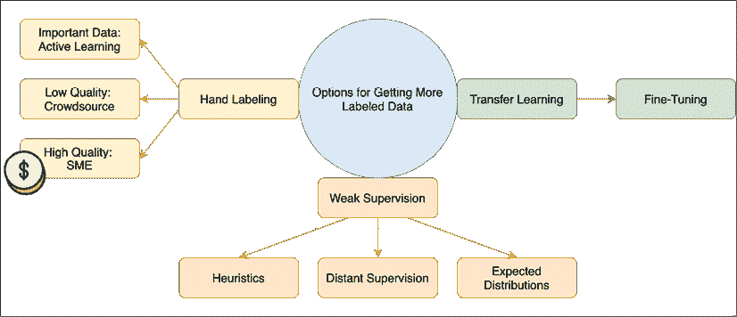
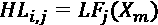
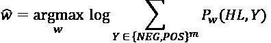
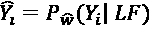
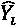
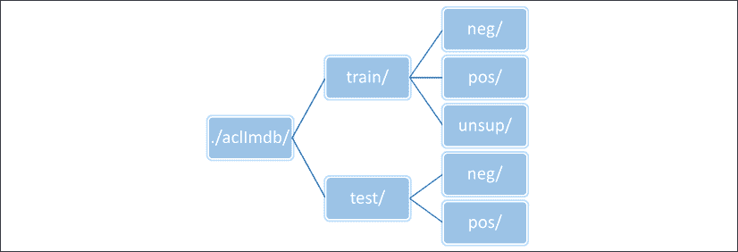
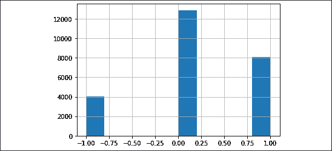
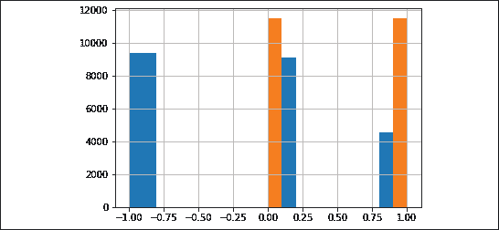
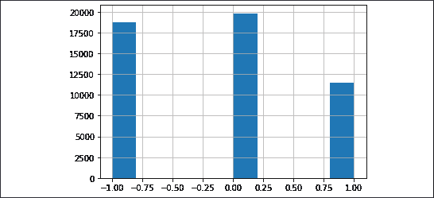
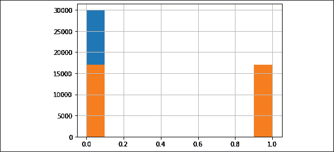

# 第八章：使用 Snorkel 进行弱监督学习分类

像 BERT 和 GPT 这样的模型利用大量的未标注数据和无监督训练目标（例如 BERT 的**掩码语言模型**（**MLM**）或 GPT 的下一个单词预测模型）来学习文本的基本结构。少量任务特定数据用于通过迁移学习微调预训练模型。这些模型通常非常庞大，拥有数亿个参数，需要庞大的数据集进行预训练，并且需要大量计算能力进行训练和预训练。需要注意的是，解决的关键问题是缺乏足够的训练数据。如果有足够的领域特定训练数据，BERT 类预训练模型的收益就不会那么大。在某些领域（如医学），任务特定数据中使用的词汇对于该领域是典型的。适量增加训练数据可以大大提高模型的质量。然而，手工标注数据是一项繁琐、资源密集且不可扩展的任务，尤其是对于深度学习所需的大量数据而言。

本章讨论了一种基于弱监督概念的替代方法。通过使用 Snorkel 库，我们在几小时内标注了数万个记录，并超越了在*第三章*中使用 BERT 开发的模型的准确性，*命名实体识别（NER）与 BiLSTM、CRF 和维特比解码*。本章内容包括：

+   弱监督学习概述

+   生成模型和判别模型之间差异的概述

+   使用手工特征构建基准模型以标注数据

+   Snorkel 库基础

+   使用 Snorkel 标签函数大规模增强训练数据

+   使用噪声机器标注数据训练模型

理解弱监督学习的概念至关重要，因此我们先从这个概念开始。

# 弱监督学习

近年来，深度学习模型取得了令人难以置信的成果。深度学习架构消除了特征工程的需求，只要有足够的训练数据。然而，深度学习模型学习数据的基本结构需要大量数据。一方面，深度学习减少了手工特征制作所需的人工工作，但另一方面，它大大增加了特定任务所需的标注数据量。在大多数领域，收集大量高质量标注数据是一项昂贵且资源密集的任务。

这个问题可以通过多种方式解决。在前面的章节中，我们已经看到了使用迁移学习在大数据集上训练模型，然后再针对特定任务微调模型。*图 8.1* 展示了这种方法以及其他获取标签的方法：



图 8.1：获取更多标注数据的选项

手动标记数据是一种常见的方法。理想情况下，我们有足够的时间和金钱来雇佣**专业学科专家（SMEs）**手动标记每一条数据，这是不切实际的。考虑标记肿瘤检测数据集并雇佣肿瘤学家来进行标记任务。对于肿瘤学家来说，标记数据可能比治疗肿瘤患者的优先级低得多。在以前的公司，我们组织了披萨派对，我们会为人们提供午餐来标记数据。一个人可以在一个小时内标记大约 100 条记录。每月为 10 人提供午餐一年，结果是 12,000 条标记记录！这种方案对于模型的持续维护非常有用，我们会对模型无法处理或置信度较低的记录进行采样。因此，我们采用了主动学习，确定标记数据对分类器性能影响最大的记录。

另一个选择是雇佣标记人员，他们不是专家，但更为丰富且更便宜。这是亚马逊机械土耳其服务采取的方法。有大量公司提供标记服务。由于标记者不是专家，同一条记录可能会由多人标记，并且会使用类似多数表决的机制来决定记录的最终标签。通过一名标记者标记一条记录的收费可能会因为关联标签所需的步骤复杂性而从几分钱到几美元不等。这种过程的输出是一组具有高覆盖率的嘈杂标签，只要您的预算允许。我们仍需找出获取的标签质量，以确定这些标签如何在最终模型中使用。

弱监督试图以不同的方式解决问题。假如，使用启发式方法，一位**专业学科专家（SME）**可以在几秒钟内手工标记成千上万条记录？我们将使用 IMDb 电影评论数据集，并尝试预测评论的情感。我们在*第四章*中使用了 IMDb 数据集，*BERT 迁移学习*，我们探索了迁移学习。使用相同的示例展示一个替代的技术来展示迁移学习是合适的。

弱监督技术不必用作迁移学习的替代品。弱监督技术有助于创建更大的领域特定标记数据集。在没有迁移学习的情况下，一个更大的标记数据集即使来自弱监督的嘈杂标签，也会提高模型性能。然而，如果同时使用迁移学习和弱监督，模型性能的提升将更为显著。

一个简单的启发式函数示例用于将评论标记为具有积极情感的伪代码如下所示：

```py
if movie.review has "amazing acting" in it:
then sentiment is positive 
```

虽然这对于我们的用例看起来是一个微不足道的例子，但你会惊讶于它的有效性。在更复杂的设置中，一位肿瘤学家可以提供一些这些启发式规则，并定义一些标注函数来标注一些记录。这些函数可能会相互冲突或重叠，类似于众包标签。获取标签的另一种方法是通过*远程监督*。可以使用外部知识库（如 Wikipedia）通过启发式方法为数据记录标注。在**命名实体识别**（**NER**）的用例中，使用地名表来将实体匹配到已知实体列表，如*第二章*《使用 BiLSTM 理解自然语言中的情感》所讨论。在实体之间的关系抽取中，例如*员工属于*或*配偶是*，可以从实体的 Wikipedia 页面中提取关系，进而标注数据记录。还有其他获取这些标签的方法，例如使用对生成数据的底层分布的深刻理解。

对于给定的数据集，标签可以来自多个来源。每个众包标签员都是一个来源。每个启发式函数（如上面展示的“惊人的演技”函数）也是一个来源。弱监督的核心问题是如何将这些多个来源结合起来，生成足够质量的标签供最终分类器使用。模型的关键点将在下一节描述。

本章中提到的领域特定模型被称为分类器，因为我们所取的示例是电影评论情感的二分类。然而，生成的标签可以用于多种领域特定的模型。

## 弱监督与标注函数的内部工作原理

少数启发式标注函数覆盖率低、准确度不完美，但仍能帮助提高判别模型准确度的想法听起来很棒。本节提供了一个高层次的概述，介绍了它是如何工作的，然后我们将在 IMDb 情感分析数据集上实践这一过程。

我们假设这是一个二分类问题进行说明，尽管该方案适用于任意数量的标签。二分类的标签集为{NEG, POS}。我们有一组未标记的数据点，`X`，包含`m`个样本。

请注意，我们无法访问这些数据点的实际标签，但我们用`Y`表示生成的标签。假设我们有`n`个标注函数*LF*[1]到*LF*[n]，每个函数生成一个标签。然而，我们为弱监督添加了另一个标签——一个弃权标签。每个标注函数都有选择是否应用标签或放弃标注的能力。这是弱监督方法的一个关键方面。因此，标注函数生成的标签集扩展为{NEG, ABSTAIN, POS}。

在这种设置下，目标是训练一个生成模型，该模型建模两个方面：

+   给定数据点的标注函数弃权的概率

+   给定标注函数正确分配标签到数据点的概率

通过在所有数据点上应用所有标注函数，我们生成一个*m × n*的矩阵，表示数据点及其标签。由启发式标注函数*LF*[j]对数据点`X[i]`生成的标签可以表示为：



生成模型试图通过标注函数之间的共识与分歧来学习参数。

**生成模型与判别模型**

如果我们有一组数据`X`，以及与数据对应的标签`Y`，我们可以说，判别模型试图捕捉*条件概率*p(Y | X)*。生成模型则捕捉*联合概率 p(X, Y)*。顾名思义，生成模型可以生成新的数据点。我们在*第五章*中看到生成模型的例子，*通过 RNN 和 GPT-2 生成文本*，在那里我们生成了新闻头条。**GANs**（**生成对抗网络**）和自编码器是著名的生成模型。判别模型则对给定数据集中的数据点进行标注。它通过在特征空间中划分一个平面，将数据点分成不同的类别。像 IMDb 情感评论预测模型这样的分类器通常是判别模型。

如可以想象，生成模型在学习数据的整个潜在结构方面面临着更具挑战性的任务。

生成模型的参数权重，`w`，可以通过以下方式估计：



注意，观察到的标签的对数边际似然性会因预测标签`Y`而因式分解。因此，该生成模型是以无监督方式工作的。一旦生成模型的参数被计算出来，我们就可以预测数据点的标签，表示为：



其中，`Y[i]`表示基于标注函数的标签，表示生成模型的预测标签。这些预测标签可以被传递给下游的判别模型进行分类。

这些概念在 Snorkel 库中得到了实现。Snorkel 库的作者是引入*数据编程*方法的关键贡献者，该方法在 2016 年神经信息处理系统会议（Neural Information Process Systems conference）上以同名论文形式发表。Snorkel 库在 2019 年由 Ratner 等人在题为*Snorkel: rapid training data creation with weak supervision*的论文中正式介绍。苹果和谷歌分别发布了使用 Snorkel 库的论文，分别是关于*Overton*和*Snorkel Drybell*的论文。这些论文可以提供关于使用弱监督创建训练数据的数学证明的深入讨论。

尽管底层原理可能很复杂，但在实践中，使用 Snorkel 进行数据标注并不难。让我们通过准备数据集开始吧。

# 使用弱监督标签来改进 IMDb 情感分析

对 IMDb 网站上的电影评论进行情感分析是分类类型**自然语言处理**（**NLP**）模型的标准任务。我们在第四章中使用了这些数据来演示使用 GloVe 和 VERT 嵌入进行迁移学习。IMDb 数据集包含 25,000 个训练示例和 25,000 个测试示例。数据集还包括 50,000 条未标记的评论。在之前的尝试中，我们忽略了这些无监督的数据点。增加更多的训练数据将提高模型的准确性。然而，手动标注将是一个耗时且昂贵的过程。我们将使用 Snorkel 驱动的标注功能，看看是否能够提高测试集上的预测准确性。

## 预处理 IMDb 数据集

之前，我们使用了`tensorflow_datasets`包来下载和管理数据集。然而，为了实现标签功能的编写，我们需要对数据进行更低级别的访问。因此，第一步是从网络上下载数据集。

本章的代码分为两个文件。`snorkel-labeling.ipynb`文件包含用于下载数据和使用 Snorkel 生成标签的代码。第二个文件`imdb-with-snorkel-labels.ipynb`包含训练有无额外标注数据的模型的代码。如果运行代码，最好先运行`snorkel-labeling.ipynb`文件中的所有代码，以确保生成所有标注数据文件。

数据集包含在一个压缩档案中，可以通过如下方式下载并解压，如`snorkel-labeling.ipynb`所示：

```py
(tf24nlp) $ wget https://ai.stanford.edu/~amaas/data/sentiment/aclImdb_v1.tar.gz
(tf24nlp) $ tar xvzf aclImdb_v1.tar.gz 
```

这将解压档案到`aclImdb`目录中。训练数据和无监督数据位于`train/`子目录中，测试数据位于`test/`子目录中。还有一些额外的文件，但它们可以忽略。下面的*图 8.2*展示了目录结构：



图 8.2：IMDb 数据的目录结构

评论以单独的文本文件形式存储在叶目录中。每个文件的命名格式为`<review_id>_<rating>.txt`。评论标识符从 0 到 24999 按顺序编号，用于训练和测试示例。对于无监督数据，最高评论编号为 49999\。

评分是一个介于 0 到 9 之间的数字，仅在测试和训练数据中有意义。这个数字反映了对某个评论给出的实际评分。`pos/`子目录中的所有评论情感为正面，`neg/`子目录中的评论情感为负面。评分为 0 到 4 被视为负面，而评分为 5 到 9（包括 9）则视为正面。在这个特定的示例中，我们不使用实际评分，只考虑整体情感。

我们将数据加载到`pandas` DataFrame 中，方便处理。定义了一个便捷函数，将子目录中的评论加载到 DataFrame 中：

```py
def load_reviews(path, columns=["filename", 'review']):
    assert len(columns) == 2
    l = list()
    for filename in glob.glob(path):
        # print(filename)
        with open(filename, 'r') as f:
            review = f.read()
            l.append((filename, review))
    return pd.DataFrame(l, columns=columns) 
```

上述方法将数据加载到两列中——一列为文件名，另一列为文件的文本。使用这种方法，加载了无监督数据集：

```py
unsup_df = load_reviews("./aclImdb/train/unsup/*.txt")
unsup_df.describe() 
```

|  |
| --- |

```py
filename 
```

|

```py
review 
```

|

| --- | --- | --- |
| --- | --- | --- |

|

```py
count 
```

|

```py
50000 
```

|

```py
50000 
```

|

|

```py
unique 
```

|

```py
50000 
```

|

```py
49507 
```

|

|

```py
top 
```

|

```py
./aclImdb/train/unsup/24211_0.txt 
```

|

```py
Am not from America, I usually watch this show... 
```

|

|

```py
freq 
```

|

```py
1 
```

|

```py
5 
```

|

训练和测试数据集使用略有不同的方法：

```py
def load_labelled_data(path, neg='/neg/', 
                       pos='/pos/', shuffle=True):
    neg_df = load_reviews(path + neg + "*.txt")
    pos_df = load_reviews(path + pos + "*.txt")
    neg_df['sentiment'] = 0
    pos_df['sentiment'] = 1
    df = pd.concat([neg_df, pos_df], axis=0)
    if shuffle:
        df = df.sample(frac=1, random_state=42)
    return df 
```

该方法返回三列——文件名、评论文本和情感标签。如果情感为负，则情感标签为 0；如果情感为正，则情感标签为 1，这由评论所在的目录决定。

现在可以像这样加载训练数据集：

```py
train_df = load_labelled_data("./aclImdb/train/")
train_df.head() 
```

|  |
| --- |

```py
filename 
```

|

```py
review 
```

|

```py
sentiment 
```

|

| --- | --- | --- | --- |
| --- | --- | --- | --- |

|

```py
6868 
```

|

```py
./aclImdb/train//neg/6326_4.txt 
```

|

```py
If you're in the mood for some dopey light ent... 
```

|

```py
0 
```

|

|

```py
11516 
```

|

```py
./aclImdb/train//pos/11177_8.txt 
```

|

```py
*****Spoilers herein*****<br /><br />What real... 
```

|

```py
1 
```

|

|

```py
9668 
```

|

```py
./aclImdb/train//neg/2172_2.txt 
```

|

```py
Bottom of the barrel, unimaginative, and pract... 
```

|

```py
0 
```

|

|

```py
1140 
```

|

```py
./aclImdb/train//pos/2065_7.txt 
```

|

```py
Fearful Symmetry is a pleasant episode with a ... 
```

|

```py
1 
```

|

|

```py
1518 
```

|

```py
./aclImdb/train//pos/7147_10.txt 
```

|

```py
I found the storyline in this movie to be very... 
```

|

```py
1 
```

|

虽然我们没有使用原始分数进行情感分析，但这是一个很好的练习，你可以尝试预测分数而不是情感。为了帮助处理原始文件中的分数，可以使用以下代码，该代码从文件名中提取分数：

```py
def fn_to_score(f):
    scr = f.split("/")[-1]  # get file name
    scr = scr.split(".")[0] # remove extension
    scr = int (scr.split("_")[-1]) #the score
    return scr
train_df['score'] = train_df.filename.apply(fn_to_score) 
```

这会向 DataFrame 添加一个新的*分数*列，可以作为起始点使用。

测试数据可以通过传递不同的起始数据目录，使用相同的便捷函数加载。

```py
test_df = load_labelled_data("./aclImdb/test/") 
```

一旦评论加载完成，下一步是创建一个分词器。

## 学习子词分词器

可以使用`tensorflow_datasets`包学习子词分词器。请注意，我们希望在学习此分词器时传递所有训练数据和无监督评论。

```py
text = unsup_df.review.to_list() + train_df.review.to_list() 
```

这一步创建了一个包含 75,000 项的列表。如果检查评论文本，可以发现评论中包含一些 HTML 标签，因为这些评论是从 IMDb 网站抓取的。我们使用 Beautiful Soup 包来清理这些标签。

```py
txt = [ BeautifulSoup(x).text for x in text ] 
```

然后，我们学习了包含 8,266 个条目的词汇表。

```py
encoder = tfds.features.text.SubwordTextEncoder.\
                build_from_corpus(txt, target_vocab_size=2**13)
encoder.save_to_file("imdb") 
```

该编码器已保存到磁盘。学习词汇表可能是一个耗时的任务，并且只需要做一次。将其保存到磁盘可以在随后的代码运行中节省时间。

提供了一个预训练的子词编码器。它可以在与本章对应的 GitHub 文件夹中找到，并命名为`imdb.subwords`，如果你想跳过这些步骤，可以直接使用它。

在我们使用 Snorkel 标注的数据构建模型之前，先定义一个基准模型，以便在添加弱监督标签前后，比较模型的性能。

## 一个 BiLSTM 基准模型

为了理解额外标注数据对模型性能的影响，我们需要一个比较的基准。因此，我们设定一个之前见过的 BiLSTM 模型作为基准。有几个数据处理步骤，比如分词、向量化和填充/截断数据的长度。由于这些代码在第 3 和第四章中已经出现过，因此为了完整性，在此处进行了重复，并附上简明的描述。

Snorkel 在训练数据大小是原始数据的 10 倍到 50 倍时效果最佳。IMDb 提供了 50,000 条未标注的示例。如果所有这些都被标注，那么训练数据将是原始数据的 3 倍，这不足以展示 Snorkel 的价值。因此，我们通过将训练数据限制为仅 2,000 条记录，模拟了大约 18 倍的比例。其余的训练记录被视为未标注数据，Snorkel 用来提供噪声标签。为了防止标签泄露，我们将训练数据进行拆分，并存储为两个独立的数据框。拆分的代码可以在 `snorkel-labeling.ipynb` 笔记本中找到。用于生成拆分的代码片段如下所示：

```py
from sklearn.model_selection import train_test_split
# Randomly split training into 2k / 23k sets
train_2k, train_23k = train_test_split(train_df, test_size=23000, 
                                      random_state=42, 
                                      stratify=train_df.sentiment)
train_2k.to_pickle("train_2k.df") 
```

使用分层拆分方法以确保正负标签的样本数量相等。一个包含 2,000 条记录的数据框被保存，并用于训练基准模型。请注意，这可能看起来像是一个人为构造的示例，但请记住，文本数据的关键特点是数据量庞大；然而，标签则稀缺。通常，标注数据的主要障碍是所需的标注工作量。在我们了解如何标注大量数据之前，先完成基准模型的训练以作比较。

### 分词和向量化数据

我们对训练集中的所有评论进行分词，并将其截断/填充为最多 150 个词元。评论通过 Beautiful Soup 处理，去除任何 HTML 标记。所有与此部分相关的代码都可以在 `imdb-with-snorkel-labels.ipynb` 文件中的 *Training Data Vectorization* 部分找到。这里仅为简便起见展示了部分代码：

```py
# we need a sample of 2000 reviews for training
num_recs = 2000
train_small = pd.read_pickle("train_2k.df")
# we dont need the snorkel column
train_small = train_small.drop(columns=['snorkel'])
# remove markup
cleaned_reviews = train_small.review.apply(lambda x: BeautifulSoup(x).text)
# convert pandas DF in to tf.Dataset
train = tf.data.Dataset.from_tensor_slices(
                             (cleaned_reviews.values,
                             train_small.sentiment.values)) 
```

分词和向量化通过辅助函数进行，并应用于整个数据集：

```py
# transformation functions to be used with the dataset
from tensorflow.keras. pre-processing import sequence
def encode_pad_transform(sample):
    encoded = imdb_encoder.encode(sample.numpy())
    pad = sequence.pad_sequences([encoded], padding='post', maxlen=150)
    return np.array(pad[0], dtype=np.int64)  
def encode_tf_fn(sample, label):
    encoded = tf.py_function(encode_pad_transform, 
                                       inp=[sample], 
                                       Tout=(tf.int64))
    encoded.set_shape([None])
    label.set_shape([])
    return encoded, label
encoded_train = train.map(encode_tf_fn,
                 num_parallel_calls=tf.data.experimental.AUTOTUNE) 
```

测试数据也以类似的方式进行处理：

```py
# remove markup
cleaned_reviews = test_df.review.apply(
lambda x: BeautifulSoup(x).text)
# convert pandas DF in to tf.Dataset
test = tf.data.Dataset.from_tensor_slices((cleaned_reviews.values, 
                                        test_df.sentiment.values))
encoded_test = test.map(encode_tf_fn,
                 num_parallel_calls=tf.data.experimental.AUTOTUNE) 
```

一旦数据准备好，下一步就是搭建模型。

### 使用 BiLSTM 模型进行训练

创建和训练基准模型的代码位于笔记本的 *Baseline Model* 部分。创建了一个适中的模型，重点展示了无监督标注带来的提升，而非模型复杂性。此外，较小的模型训练速度更快，且能进行更多迭代：

```py
# Length of the vocabulary 
vocab_size = imdb_encoder.vocab_size 
# Number of RNN units
rnn_units = 64
# Embedding size
embedding_dim = 64
#batch size
BATCH_SIZE=100 
```

该模型使用一个小的 64 维嵌入和 RNN 单元。创建模型的函数如下：

```py
from tensorflow.keras.layers import Embedding, LSTM, \
                                    Bidirectional, Dense,\
                                    Dropout

dropout=0.5
def build_model_bilstm(vocab_size, embedding_dim, rnn_units, batch_size, dropout=0.):
    model = tf.keras.Sequential([
        Embedding(vocab_size, embedding_dim, mask_zero=True,
                  batch_input_shape=[batch_size, None]),
        Bidirectional(LSTM(rnn_units, return_sequences=True)),
        Bidirectional(tf.keras.layers.LSTM(rnn_units)),
        Dense(rnn_units, activation='relu'),
        Dropout(dropout),
        Dense(1, activation='sigmoid')
      ])
    return model 
```

添加适量的 dropout，以使模型具有更好的泛化能力。该模型大约有 70 万个参数。

```py
bilstm = build_model_bilstm(
  vocab_size = vocab_size,
  embedding_dim=embedding_dim,
  rnn_units=rnn_units,
  batch_size=BATCH_SIZE)
bilstm.summary() 
```

```py
Model: "sequential"
_________________________________________________________________
Layer (type)                 Output Shape              Param #   
=================================================================
embedding_4 (Embedding)      (100, None, 64)           529024    
_________________________________________________________________
bidirectional_8 (Bidirection (100, None, 128)          66048     
_________________________________________________________________
bidirectional_9 (Bidirection (100, 128)                98816     
_________________________________________________________________
dense_6 (Dense)              (100, 64)                 8256      
_________________________________________________________________
dropout_6 (Dropout)          (100, 64)                 0         
_________________________________________________________________
dense_7 (Dense)              (100, 1)                  65        
=================================================================
Total params: 702,209
Trainable params: 702,209
Non-trainable params: 0
_________________________________________________________________ 
```

该模型使用二元交叉熵损失函数和 ADAM 优化器进行编译，并跟踪准确率、精确度和召回率指标。该模型训练了 15 个周期，可以看出模型已达到饱和：

```py
bilstm.compile(loss='binary_crossentropy', 
             optimizer='adam', 
             metrics=['accuracy', 'Precision', 'Recall'])
encoded_train_batched = encoded_train.shuffle(num_recs, seed=42).\
                                    batch(BATCH_SIZE)
bilstm.fit(encoded_train_batched, epochs=15) 
```

```py
Train for 15 steps
Epoch 1/15
20/20 [==============================] - 16s 793ms/step - loss: 0.6943 - accuracy: 0.4795 - Precision: 0.4833 - Recall: 0.5940
…
Epoch 15/15
20/20 [==============================] - 4s 206ms/step - loss: 0.0044 - accuracy: 0.9995 - Precision: 0.9990 - Recall: 1.0000 
```

如我们所见，即使在使用 dropout 正则化后，模型仍然对小规模的训练集发生了过拟合。

**Batch-and-Shuffle 或 Shuffle-and-Batch**

请注意上面代码片段中的第二行代码，它对数据进行了打乱和批处理。数据首先被打乱，然后再进行批处理。在每个周期之间对数据进行打乱是一种正则化手段，有助于模型更好地学习。在 TensorFlow 中，打乱数据顺序是一个关键点。如果数据在打乱之前就被批处理，那么只有批次的顺序会在喂入模型时发生变化。然而，每个批次的组成在不同的周期中将保持不变。通过在批处理之前进行打乱，我们确保每个批次在每个周期中都不同。我们鼓励您在有和没有打乱数据的情况下进行训练。虽然打乱会稍微增加训练时间，但它会在测试集上带来更好的性能。

让我们看看这个模型在测试数据上的表现：

```py
bilstm.evaluate(encoded_test.batch(BATCH_SIZE)) 
```

```py
250/250 [==============================] - 33s 134ms/step - loss: 2.1440 - accuracy: 0.7591 - precision: 0.7455 - recall: 0.7866 
```

模型的准确率为 75.9%。模型的精度高于召回率。现在我们有了基准线，我们可以查看弱监督标注是否能帮助提升模型性能。这将是下一部分的重点。

# 使用 Snorkel 进行弱监督标注

IMDb 数据集包含 50,000 条未标记的评论。这是训练集大小的两倍，训练集有 25,000 条已标记的评论。如前一部分所述，我们从训练数据中预留了 23,000 条记录，除了用于弱监督标注的无监督集。Snorkel 中的标注是通过标注函数来完成的。每个标注函数可以返回可能的标签之一，或者选择不进行标注。由于这是一个二分类问题，因此定义了相应的常量。还展示了一个示例标注函数。此部分的所有代码可以在名为 `snorkel-labeling.ipynb` 的笔记本中找到：

```py
POSITIVE = 1
NEGATIVE = 0
ABSTAIN = -1
from snorkel.labeling.lf import labeling_function
@labeling_function()
def time_waste(x):
    if not isinstance(x.review, str):
        return ABSTAIN
    ex1 = "time waste"
    ex2 = "waste of time"
    if ex1 in x.review.lower() or ex2 in x.review.lower():
        return NEGATIVE
    return ABSTAIN 
```

标注函数由 Snorkel 提供的 `labeling_function()` 注解。请注意，需要安装 Snorkel 库。详细的安装说明可以在 GitHub 上本章的子目录中找到。简而言之，Snorkel 可以通过以下方式安装：

```py
(tf24nlp) $ pip install snorkel==0.9.5 
```

您看到的任何警告都可以安全忽略，因为该库使用了不同版本的组件，如 TensorBoard。为了更加确定，您可以为 Snorkel 及其依赖项创建一个单独的 `conda`/虚拟环境。

本章的内容得以实现，离不开 Snorkel.ai 团队的支持。Snorkel.ai 的 Frederic Sala 和 Alexander Ratner 在提供指导和用于超参数调优的脚本方面发挥了重要作用，从而最大限度地发挥了 Snorkel 的效能。

回到标签函数，以上的函数期望来自 DataFrame 的一行数据。它期望该行数据包含“review”这一文本列。该函数尝试检查评论是否表示电影或节目是浪费时间。如果是，它返回负面标签；否则，它不会对该行数据进行标记。请注意，我们正在尝试使用这些标签函数在短时间内标记数千行数据。实现这一目标的最佳方法是打印一些随机的正面和负面评论样本，并使用文本中的某些词汇作为标签函数。这里的核心思想是创建多个函数，它们能对子集行数据有较好的准确性。让我们检查训练集中一些负面评论，看看可以创建哪些标签函数：

```py
neg = train_df[train_df.sentiment==0].sample(n=5, random_state=42)
for x in neg.review.tolist():
    print(x) 
```

其中一条评论开头是“一个非常俗气且乏味的公路电影”，这为标签函数提供了一个想法：

```py
@labeling_function()
def cheesy_dull(x):
    if not isinstance(x.review, str):
        return ABSTAIN
    ex1 = "cheesy"
    ex2 = "dull"
    if ex1 in x.review.lower() or ex2 in x.review.lower():
        return NEGATIVE
    return ABSTAIN 
```

负面评论中出现了许多不同的词汇。这是负面标签函数的一个子集，完整列表请参见笔记本：

```py
@labeling_function()
def garbage(x):
    if not isinstance(x.review, str):
        return ABSTAIN
    ex1 = "garbage"
    if ex1 in x.review.lower():
        return NEGATIVE
    return ABSTAIN
@labeling_function()
def terrible(x):
    if not isinstance(x.review, str):
        return ABSTAIN
    ex1 = "terrible"
    if ex1 in x.review.lower():
        return NEGATIVE
    return ABSTAIN
@labeling_function()
def unsatisfied(x):
    if not isinstance(x.review, str):
        return ABSTAIN
    ex1 = "unsatisf"  # unsatisfactory, unsatisfied
    if ex1 in x.review.lower():
        return NEGATIVE
    return ABSTAIN 
```

所有负面标签函数都添加到一个列表中：

```py
neg_lfs = [atrocious, terrible, piece_of, woefully_miscast, 
           bad_acting, cheesy_dull, disappoint, crap, garbage, 
           unsatisfied, ridiculous] 
```

检查负面评论的样本可以给我们很多想法。通常，领域专家的一点小小努力就能产生多个易于实现的标签函数。如果你曾经看过电影，那么对于这个数据集来说，你就是专家。检查正面评论的样本会导致更多的标签函数。以下是识别评论中正面情感的标签函数示例：

```py
import re
@labeling_function()
def classic(x):
    if not isinstance(x.review, str):
        return ABSTAIN
    ex1 = "a classic"
    if ex1 in x.review.lower():
        return POSITIVE
    return ABSTAIN
@labeling_function()
def great_direction(x):
    if not isinstance(x.review, str):
        return ABSTAIN
    ex1 = "(great|awesome|amazing|fantastic|excellent) direction"
    if re.search(ex1, x.review.lower()):
        return POSITIVE
    return ABSTAIN
@labeling_function()
def great_story(x):
    if not isinstance(x.review, str):
        return ABSTAIN
    ex1 = "(great|awesome|amazing|fantastic|excellent|dramatic) (script|story)"
    if re.search(ex1, x.review.lower()):
        return POSITIVE
    return ABSTAIN 
```

所有正面标签函数可以在笔记本中看到。与负面函数类似，定义了正面标签函数的列表：

```py
pos_lfs = [classic, must_watch, oscar, love, great_entertainment,
           very_entertaining, amazing, brilliant, fantastic, 
           awesome, great_acting, great_direction, great_story,
           favourite]
# set of labeling functions
lfs = neg_lfs + pos_lfs 
```

标签的开发是一个迭代过程。不要被这里显示的标签函数数量吓到。你可以看到，它们大部分都非常简单。为了帮助你理解工作量，我花费了总共 3 小时来创建和测试标签函数：

请注意，笔记本中包含了大量简单的标签函数，这里仅展示了其中的一个子集。请参考实际代码获取所有标签函数。

该过程包括查看一些样本并创建标签函数，然后在数据的子集上评估结果。查看标签函数与标记示例不一致的示例，对于使函数更精确或添加补偿函数非常有用。那么，让我们看看如何评估这些函数，以便进行迭代。

## 对标签函数进行迭代

一旦定义了一组标注函数，它们就可以应用于 pandas DataFrame，并且可以训练一个模型来计算在计算标签时分配给各个标注函数的权重。Snorkel 提供了帮助执行这些任务的函数。首先，让我们应用这些标注函数来计算一个矩阵。这个矩阵的列数等于每一行数据的标注函数数量：

```py
# let's take a sample of 100 records from training set
lf_train = train_df.sample(n=1000, random_state=42)
from snorkel.labeling.model import LabelModel
from snorkel.labeling import PandasLFApplier
# Apply the LFs to the unlabeled training data
applier = PandasLFApplier(lfs)
L_train = applier.apply(lf_train) 
```

在上述代码中，从训练数据中提取了 1000 行数据样本。然后，将之前创建的所有标注函数列表传递给 Snorkel，并应用于这个训练数据的样本。如果我们创建了 25 个标注函数，那么 `L_train` 的形状将会是 (1000, 25)。每一列代表一个标注函数的输出。现在可以在这个标签矩阵上训练一个生成模型：

```py
# Train the label model and compute the training labels
label_model = LabelModel(cardinality=2, verbose=True)
label_model.fit(L_train, n_epochs=500, log_freq=50, seed=123)
lf_train["snorkel"] = label_model.predict(L=L_train, 
                                      **tie_break_policy=****"abstain"**) 
```

创建一个 `LabelModel` 实例，参数指定实际模型中有多少个标签。然后训练这个模型，并为数据子集预测标签。这些预测的标签将作为 DataFrame 的新列添加进去。请注意传递给 `predict()` 方法的 `tie_break_policy` 参数。如果模型在标注函数的输出中有冲突，并且这些冲突在模型中得分相同，该参数指定如何解决冲突。在这里，我们指示模型在发生冲突时放弃标记记录。另一个可能的设置是 "random"，在这种情况下，模型将随机分配一个被绑定标注函数的输出。这两个选项在手头问题的背景下的主要区别是精确度。通过要求模型在标记时放弃，我们可以获得更高的精确度结果，但标记的记录会更少。随机选择一个被绑定函数的输出会导致更广泛的覆盖率，但质量可能较低。可以通过分别使用这两个选项的输出来训练同一个模型来测试这一假设。鼓励您尝试这些选项并查看结果。

由于选择了放弃策略，可能并没有对所有的 1000 行进行标注：

```py
pred_lfs = lf_train[lf_train.snorkel > -1]
pred_lfs.describe() 
```

|  |
| --- |

```py
sentiment 
```

|

```py
score 
```

|

```py
snorkel 
```

|

| --- | --- | --- | --- |
| --- | --- | --- | --- |

|

```py
count 
```

|

```py
598.000000 
```

|

```py
598.000000 
```

|

```py
598.000000 
```

|

在 1000 条记录中，只有 458 条被标记。让我们检查其中有多少条标记错误的。

```py
pred_mistake = pred_lfs[pred_lfs.sentiment != pred_lfs.snorkel]
pred_mistake.describe() 
```

|  |
| --- |

```py
sentiment 
```

|

```py
score 
```

|

```py
snorkel 
```

|

| --- | --- | --- | --- |
| --- | --- | --- | --- |

|

```py
count 
```

|

```py
164.000000 
```

|

```py
164.000000 
```

|

```py
164.000000 
```

|

使用 Snorkel 和我们的标注函数标注了 598 条记录，其中 434 条标签正确，164 条记录被错误标注。标签模型的准确率约为 72.6%。为了获得更多标注函数的灵感，你应该检查一些标签模型产生错误结果的行，并更新或添加标注函数。如前所述，约花了 3 个小时迭代并创建了 25 个标注函数。为了从 Snorkel 中获得更多效果，我们需要增加训练数据量。目标是开发一种方法，快速获得大量标签，而不需要太多人工干预。在这个特定案例中，可以使用的一种技术是训练一个简单的朴素贝叶斯模型，获取与正面或负面标签高度相关的词汇。这是下一节的重点。**朴素贝叶斯**（**NB**）是许多基础 NLP 书籍中涵盖的一种基本技术。

# 用于寻找关键词的朴素贝叶斯模型

在这个数据集上构建 NB 模型需要不到一个小时，并且有潜力显著提高标注函数的质量和覆盖面。NB 模型的核心代码可以在`spam-inspired-technique-naive-bayes.ipynb`笔记本中找到。请注意，这些探索与主要的标注代码无关，如果需要，可以跳过这一部分，因为这一部分的学习成果会应用于构建更好的标注函数，这些函数在`snorkel-labeling.ipynb`笔记本中有详细介绍。

基于 NB 的探索的主要流程是加载评论、去除停用词、选择前 2000 个词来构建一个简单的向量化方案，并训练一个 NB 模型。由于数据加载与前面章节讲解的相同，因此本节省略了细节。

本节使用了 NLTK 和`wordcloud` Python 包。由于我们在*第一章*《NLP 基础》中已经使用过 NLTK，它应该已经安装。`wordcloud`可以通过以下命令安装：

`(tf24nlp) $ pip install wordcloud==1.8`

词云有助于整体理解正面和负面评论的文本。请注意，前 2000 个词的向量化方案需要计数器。定义了一个方便的函数，它清理 HTML 文本，并删除停用词，将其余部分进行分词，代码如下：

```py
en_stopw = set(stopwords.words("english"))
def get_words(review, words, stopw=en_stopw):
    review = BeautifulSoup(review).text        # remove HTML tags
    review = re.sub('[^A-Za-z]', ' ', review)  # remove non letters
    review = review.lower()
    tok_rev = wt(review)
    rev_word = [word for word in tok_rev if word not in stopw]
    words += rev_word 
```

然后，正面评价被分离出来，并生成一个词云以便于可视化：

```py
pos_rev = train_df[train_df.sentiment == 1]
pos_words = []
pos_rev.review.apply(get_words, args=(pos_words,))
from wordcloud import WordCloud
import matplotlib.pyplot as plt
pos_words_sen = " ".join(pos_words)
pos_wc = WordCloud(width = 600,height = 512).generate(pos_words_sen)
plt.figure(figsize = (12, 8), facecolor = 'k')
plt.imshow(pos_wc)
plt.axis('off')
plt.tight_layout(pad = 0)
plt.show() 
```

上述代码的输出如*图 8.3*所示：


图 8.3：正面评价词云

不足为奇的是，*movie* 和 *film* 是最大的词。然而，在这里可以看到许多其他建议的关键词。类似地，也可以生成负面评价的词云，如*图 8.4*所示：


图 8.4：负面评价词云

这些可视化结果很有趣；然而，训练模型后会得到更清晰的画面。只需要前 2000 个单词就可以训练模型：

```py
from collections import Counter
pos = Counter(pos_words)
neg = Counter(neg_words)
# let's try to build a naive bayes model for sentiment classification
tot_words = pos + neg
tot_words.most_common(10) 
```

```py
[('movie', 44031),
 ('film', 40147),
 ('one', 26788),
 ('like', 20274),
 ('good', 15140),
 ('time', 12724),
 ('even', 12646),
 ('would', 12436),
 ('story', 11983),
 ('really', 11736)] 
```

合并计数器显示了所有评论中最常出现的前 10 个单词。这些被提取到一个列表中：

```py
top2k = [x for (x, y) in tot_words.most_common(2000)] 
```

每个评论的向量化相当简单——每个 2000 个单词中的一个都会成为给定评论的一个列。如果该列所表示的单词出现在评论中，则该列的值标记为 1，否则为 0。所以，每个评论由一个由 0 和 1 组成的序列表示，表示该评论包含了哪些前 2000 个单词。下面的代码展示了这一转换：

```py
def featurize(review, topk=top2k, stopw=en_stopw):
    review = BeautifulSoup(review).text        # remove HTML tags
    review = re.sub('[^A-Za-z]', ' ', review)  # remove nonletters
    review = review.lower()
    tok_rev = wt(review)
    rev_word = [word for word in tok_rev if word not in stopw]
    features = {}
    for word in top2k:
        features['contains({})'.format(word)] = (word in rev_word)
    return features
train = [(featurize(rev), senti) for (rev, senti) in 
                        zip(train_df.review, train_df.sentiment)] 
```

训练模型相当简单。请注意，这里使用的是伯努利朴素贝叶斯模型，因为每个单词都是根据它在评论中是否存在来表示的。或者，也可以使用单词在评论中的频率。如果在上述评论向量化过程中使用单词的频率，那么应该使用朴素贝叶斯的多项式形式。

NLTK 还提供了一种检查最具信息性特征的方法：

```py
classifier = nltk.NaiveBayesClassifier.train(train)
# 0: negative sentiment, 1: positive sentiment
classifier.show_most_informative_features(20) 
```

```py
Most Informative Features
       contains(unfunny) = True      0 : 1      =     14.1 : 1.0
         contains(waste) = True      0 : 1      =     12.7 : 1.0
     contains(pointless) = True      0 : 1      =     10.4 : 1.0
     contains(redeeming) = True      0 : 1      =     10.1 : 1.0
     contains(laughable) = True      0 : 1      =      9.3 : 1.0
         contains(worst) = True      0 : 1      =      9.0 : 1.0
         contains(awful) = True      0 : 1      =      8.4 : 1.0
        contains(poorly) = True      0 : 1      =      8.2 : 1.0
   contains(wonderfully) = True      1 : 0      =      7.6 : 1.0
         contains(sucks) = True      0 : 1      =      7.0 : 1.0
          contains(lame) = True      0 : 1      =      6.9 : 1.0
      contains(pathetic) = True      0 : 1      =      6.4 : 1.0
    contains(delightful) = True      1 : 0      =      6.0 : 1.0
        contains(wasted) = True      0 : 1      =      6.0 : 1.0
          contains(crap) = True      0 : 1      =      5.9 : 1.0
   contains(beautifully) = True      1 : 0      =      5.8 : 1.0
      contains(dreadful) = True      0 : 1      =      5.7 : 1.0
          contains(mess) = True      0 : 1      =      5.6 : 1.0
      contains(horrible) = True      0 : 1      =      5.5 : 1.0
        contains(superb) = True      1 : 0      =      5.4 : 1.0
       contains(garbage) = True      0 : 1      =      5.3 : 1.0
         contains(badly) = True      0 : 1      =      5.3 : 1.0
        contains(wooden) = True      0 : 1      =      5.2 : 1.0
      contains(touching) = True      1 : 0      =      5.1 : 1.0
      contains(terrible) = True      0 : 1      =      5.1 : 1.0 
```

整个过程是为了找出哪些单词对预测负面和正面评论最有用。上面的表格显示了这些单词及其可能性比率。以输出的第一行中的单词*unfunny*为例，模型表示含有*unfunny*的评论比含有它的正面评论要负面 14.1 倍。标签函数是通过这些关键词更新的。

在分析`snorkel-labeling.ipynb`中标签函数分配的标签后，可以看到负面评论比正面评论标注得更多。因此，标签函数为正面标签使用的单词列表比负面标签使用的单词列表要大。请注意，数据集不平衡会影响整体训练准确性，特别是召回率。以下代码片段展示了使用上述通过朴素贝叶斯发现的关键词来增强标签函数：

```py
# Some positive high prob words - arbitrary cutoff of 4.5x
'''
   contains(wonderfully) = True       1 : 0      =      7.6 : 1.0
    contains(delightful) = True       1 : 0      =      6.0 : 1.0
   contains(beautifully) = True       1 : 0      =      5.8 : 1.0
        contains(superb) = True       1 : 0      =      5.4 : 1.0
      contains(touching) = True       1 : 0      =      5.1 : 1.0
   contains(brilliantly) = True       1 : 0      =      4.7 : 1.0
    contains(friendship) = True       1 : 0      =      4.6 : 1.0
        contains(finest) = True       1 : 0      =      4.5 : 1.0
      contains(terrific) = True       1 : 0      =      4.5 : 1.0
           contains(gem) = True       1 : 0      =      4.5 : 1.0
   contains(magnificent) = True       1 : 0      =      4.5 : 1.0
'''
wonderfully_kw = make_keyword_lf(keywords=["wonderfully"], 
label=POSITIVE)
delightful_kw = make_keyword_lf(keywords=["delightful"], 
label=POSITIVE)
superb_kw = make_keyword_lf(keywords=["superb"], label=POSITIVE)
pos_words = ["beautifully", "touching", "brilliantly", 
"friendship", "finest", "terrific", "magnificent"]
pos_nb_kw = make_keyword_lf(keywords=pos_words, label=POSITIVE)
@labeling_function()
def superlatives(x):
    if not isinstance(x.review, str):
        return ABSTAIN
    ex1 = ["best", "super", "great","awesome","amaz", "fantastic", 
           "excellent", "favorite"]
    pos_words = ["beautifully", "touching", "brilliantly", 
                 "friendship", "finest", "terrific", "magnificent", 
                 "wonderfully", "delightful"]
    ex1 += pos_words
    rv = x.review.lower()
    counts = [rv.count(x) for x in ex1]
    if sum(counts) >= 3:
        return POSITIVE
    return ABSTAIN 
```

由于基于关键字的标签函数非常常见，Snorkel 提供了一种简单的方法来定义这样的函数。以下代码片段使用两种编程方式将单词列表转换为标签函数集合：

```py
# Utilities for defining keywords based functions
def keyword_lookup(x, keywords, label):
    if any(word in x.review.lower() for word in keywords):
        return label
    return ABSTAIN
def make_keyword_lf(keywords, label):
    return LabelingFunction(
        name=f"keyword_{keywords[0]}",
        f=keyword_lookup,
        resources=dict(keywords=keywords, label=label),
    ) 
```

第一个函数进行简单匹配并返回特定标签，或者选择不标注。请查看`snorkel-labeling.ipynb`文件，了解迭代开发的完整标签函数列表。总的来说，我花了大约 12-14 小时进行标签函数的开发和研究。

在我们尝试使用这些数据训练模型之前，让我们先评估一下该模型在整个训练数据集上的准确性。

## 评估训练集上的弱监督标签

我们应用标签函数并在整个训练数据集上训练一个模型，只是为了评估该模型的质量：

```py
L_train_full = applier.apply(train_df)
label_model = LabelModel(cardinality=2, verbose=True)
label_model.fit(L_train_full, n_epochs=500, log_freq=50, seed=123)
metrics = label_model.score(L=L_train_full, Y=train_df.sentiment, 
                            tie_break_policy="abstain",
                            metrics=["accuracy", "coverage", 
                                     "precision", 
                                     "recall", "f1"])
print("All Metrics: ", metrics) 
```

```py
Label Model Accuracy:     78.5%
All Metrics:  {**'accuracy': 0.7854110013835218, 'coverage': 0.83844**, 'precision': 0.8564883605745418, 'recall': 0.6744344773790951, 'f1': 0.7546367008509709} 
```

我们的标签函数集覆盖了 25,000 条训练记录中的 83.4%，其中 85.6%是正确标签。Snorkel 提供了分析每个标签函数表现的能力：

```py
from snorkel.labeling import LFAnalysis
LFAnalysis(L=L_train_full, lfs=lfs).lf_summary() 
```

```py
 j Polarity  Coverage  Overlaps  Conflicts
atrocious             0      [0]   0.00816   0.00768    0.00328
terrible              1      [0]   0.05356   0.05356    0.02696
piece_of              2      [0]   0.00084   0.00080    0.00048
woefully_miscast      3      [0]   0.00848   0.00764    0.00504
**bad_acting            4      [0]   0.08748   0.08348    0.04304**
cheesy_dull           5      [0]   0.05136   0.04932    0.02760
bad                  11      [0]   0.03624   0.03624    0.01744
keyword_waste        12      [0]   0.07336   0.06848    0.03232
keyword_pointless    13      [0]   0.01956   0.01836    0.00972
keyword_redeeming    14      [0]   0.01264   0.01192    0.00556
keyword_laughable    15      [0]   0.41036   0.37368    0.20884
negatives            16      [0]   0.35300   0.34720    0.17396
classic              17      [1]   0.01684   0.01476    0.00856
must_watch           18      [1]   0.00176   0.00140    0.00060
oscar                19      [1]   0.00064   0.00060    0.00016
love                 20      [1]   0.08660   0.07536    0.04568
great_entertainment  21      [1]   0.00488   0.00488    0.00292
very_entertaining    22      [1]   0.00544   0.00460    0.00244
**amazing              23      [1]   0.05028   0.04516    0.02340**
great                31      [1]   0.27728   0.23568    0.13800
keyword_wonderfully  32      [1]   0.01248   0.01248    0.00564
keyword_delightful   33      [1]   0.01188   0.01100    0.00500
keyword_superb       34      [1]   0.02948   0.02636    0.01220
keyword_beautifully  35      [1]   0.08284   0.07428    0.03528
superlatives         36      [1]   0.14656   0.14464    0.07064
keyword_remarkable   37      [1]   0.32052   0.26004    0.14748 
```

请注意，这里展示的是输出的简短版本。完整的输出可以在笔记本中查看。对于每个标签函数，表格展示了其产生的标签和函数的覆盖范围——即，它为多少条记录提供标签，多少条记录与其他函数产生相同标签重叠，以及多少条记录与其他函数产生不同标签冲突。正标签和负标签函数已被突出显示。`bad_acting()`函数覆盖了 8.7%的记录，但大约 8.3%的时间与其他函数重叠。然而，它与产生正标签的函数发生冲突的时间大约是 4.3%。`amazing()`函数覆盖了大约 5%的数据集，发生冲突的时间大约为 2.3%。这些数据可以用来进一步微调特定的函数，并检查我们如何划分数据。*图 8.5*展示了正标签、负标签和弃权标签之间的平衡：



图 8.5：Snorkel 生成的标签分布

Snorkel 提供了几种超参数调优的选项，以进一步提高标签的质量。我们通过网格搜索参数来找到最佳训练参数，同时排除那些在最终输出中增加噪声的标签函数。

超参数调优通过选择不同的学习率、L2 正则化、训练轮数和使用的优化器来进行。最后，通过设定阈值来决定哪些标签函数应该保留用于实际的标签任务：

```py
# Grid Search
from itertools import product
lrs = [1e-1, 1e-2, 1e-3]
l2s = [0, 1e-1, 1e-2]
n_epochs = [100, 200, 500]
optimizer = ["sgd", "adam"]
thresh = [0.8, 0.9]
lma_best = 0
params_best = []
for params in product(lrs, l2s, n_epochs, optimizer, thresh):
    # do the initial pass to access the accuracies
    label_model.fit(L_train_full, n_epochs=params[2], log_freq=50, 
                    seed=123, optimizer=params[3], lr=params[0], 
                    l2=params[1])

    # accuracies
    weights = label_model.get_weights()

    # LFs above our threshold 
    vals = weights > params[4]

    # the LM requires at least 3 LFs to train
    if sum(vals) >= 3:
        L_filtered = L_train_full[:, vals]
        label_model.fit(L_filtered, n_epochs=params[2], 
                        log_freq=50, seed=123, 
                        optimizer=params[3], lr=params[0], 
                        l2=params[1])
        label_model_acc = label_model.score(L=L_filtered, 
                          Y=train_df.sentiment, 
                          tie_break_policy="abstain")["accuracy"]
        if label_model_acc > lma_best:
            lma_best = label_model_acc
            params_best = params

print("best = ", lma_best, " params ", params_best) 
```

Snorkel 可能会打印出一个警告，提示指标仅在非弃权标签上进行计算。这是设计使然，因为我们关注的是高置信度的标签。如果标签函数之间存在冲突，我们的模型会选择放弃为其提供标签。打印出的最佳参数是：

```py
best =  0.8399649430324277  params  (0.001, 0.1, 200, 'adam', 0.9) 
```

通过这个调优，模型的准确率从 78.5%提高到了 84%！

使用这些参数，我们标注了来自训练集的 23k 条记录和来自无监督集的 50k 条记录。对于第一部分，我们标注了所有 25k 条训练记录，并将其分成两组。这个特定的分割部分在上面的基准模型部分中提到过：

```py
train_df["snorkel"] = label_model.predict(L=L_filtered, 
                               tie_break_policy="abstain")
from sklearn.model_selection import train_test_split
# Randomly split training into 2k / 23k sets
train_2k, train_23k = train_test_split(train_df, test_size=23000, 
                                       random_state=42, 
                                       stratify=train_df.sentiment)
train_23k.snorkel.hist()
train_23k.sentiment.hist() 
```

代码的最后两行检查标签的状态，并与实际标签进行对比，生成*图 8.6*中所示的图表：



图 8.6：训练集中标签与使用 Snorkel 生成的标签的对比

当 Snorkel 模型放弃标签时，它会为标签分配-1。我们看到模型能够标注更多的负面评论，而不是正面标签。我们过滤掉 Snorkel 放弃标注的行并保存记录：

```py
lbl_train = train_23k[train_23k.snorkel > -1]
lbl_train = lbl_train.drop(columns=["sentiment"])
p_sup = lbl_train.rename(columns={"snorkel": "sentiment"})
p_sup.to_pickle("snorkel_train_labeled.df") 
```

然而，我们面临的关键问题是，如果我们用这些噪声标签（准确率为 84%）增强训练数据，这会使我们的模型表现更好还是更差？请注意，基准模型的准确率大约为 74%。

为了回答这个问题，我们对无监督数据集进行标注，然后训练与基准相同的模型架构。

## 为未标记数据生成无监督标签

正如我们在上一部分看到的，我们对训练数据集进行了标注，运行模型在数据集的未标注评论上也非常简单：

```py
# Now apply this to all the unsupervised reviews
# Apply the LFs to the unlabeled training data
applier = PandasLFApplier(lfs)
# now let's apply on the unsupervised dataset
L_train_unsup = applier.apply(unsup_df)
label_model = LabelModel(cardinality=2, verbose=True)
label_model.fit(L_train_unsup[:, vals], n_epochs=params_best[2], 
                optimizer=params_best[3], 
                lr=params_best[0], l2=params_best[1], 
                log_freq=100, seed=42)
unsup_df["snorkel"] = label_model.predict(L=L_train_unsup[:, vals], 
                                   tie_break_policy="abstain")
# rename snorkel to sentiment & concat to the training dataset
pred_unsup_lfs = unsup_df[unsup_df.snorkel > -1]
p2 = pred_unsup_lfs.rename(columns={"snorkel": "sentiment"})
print(p2.info())
p2.to_pickle("snorkel-unsup-nbs.df") 
```

现在标签模型已经训练完成，预测结果被添加到无监督数据集的额外列中。模型对 50,000 条记录中的 29,583 条进行了标注。这几乎等于训练数据集的大小。假设无监督数据集的错误率与训练集上的错误率相似，我们就向训练集中添加了约 24,850 条正确标签的记录和约 4,733 条错误标签的记录。然而，这个数据集的平衡性非常倾斜，因为正面标签的覆盖仍然很差。大约有 9,000 个正面标签，覆盖超过 20,000 个负面标签。笔记本中的*增加正面标签覆盖率*部分通过添加更多关键词函数来进一步提高正面标签的覆盖率。

这导致数据集稍微更平衡，如下图所示：



图 8.7：对无监督数据集应用进一步改进的标注函数，改善了正面标签的覆盖

该数据集已保存到磁盘，以便在训练过程中使用：

```py
p3 = pred_unsup_lfs2.rename(columns={"snorkel2": "sentiment"})
print(p3.info())
p3.to_pickle("snorkel-unsup-nbs-v2.df") 
```

已标记的数据集保存到磁盘，并在训练代码中重新加载，以便更好的模块化和易于阅读。在生产管道中，可能不会持久化中间输出，而是直接将其馈入训练步骤。另一个小考虑因素是分离虚拟/conda 环境来运行 Snorkel。为弱监督标注创建一个单独的脚本也可以使用不同的 Python 环境。

我们将重点重新放回到`imdb-with-snorkel-labels.ipynb`笔记本，该笔记本包含用于训练的模型。该部分的代码从*使用 Snorkel 标注数据*部分开始。新标注的记录需要从磁盘加载、清理、向量化并填充，才能进行训练。我们提取标注的记录并去除 HTML 标记，如下所示：

```py
# labelled version of training data split
p1 = pd.read_pickle("snorkel_train_labeled.df")
p2 = pd.read_pickle("snorkel-unsup-nbs-v2.df")
p2 = p2.drop(columns=['snorkel']) # so that everything aligns
# now concatenate the three DFs
p2 = pd.concat([train_small, p1, p2]) # training plus snorkel labelled data
print("showing hist of additional data")
# now balance the labels
pos = p2[p2.sentiment == 1]
neg = p2[p2.sentiment == 0]
recs = min(pos.shape[0], neg.shape[0])
pos = pos.sample(n=recs, random_state=42)
neg = neg.sample(n=recs, random_state=42)
p3 = pd.concat((pos,neg))
p3.sentiment.hist() 
```

原始训练数据集在正负标签上是平衡的。然而，使用 Snorkel 标记的数据存在不平衡问题。我们平衡数据集，并忽略那些多余的负标签记录。请注意，基准模型使用的 2,000 条训练记录也需要添加进去，总共得到 33,914 条训练记录。如前所述，当数据量是原始数据集的 10 倍到 50 倍时，这个方法非常有效。在这里，如果将 2,000 条训练记录也算在内，我们达到了接近 17 倍的比例，或者是 18 倍。



图 8.8：使用 Snorkel 和弱监督后的记录分布

如上图*Figure 8.8*所示，蓝色的记录被丢弃以平衡数据集。接下来，数据需要使用子词词汇进行清洗和向量化：

```py
# remove markup
cleaned_unsup_reviews = p3.review.apply(
                             lambda x: BeautifulSoup(x).text)
snorkel_reviews = pd.concat((cleaned_reviews, cleaned_unsup_reviews))
snorkel_labels = pd.concat((train_small.sentiment, p3.sentiment)) 
```

最后，我们将 pandas DataFrame 转换为 TensorFlow 数据集，并进行向量化和填充：

```py
# convert pandas DF in to tf.Dataset
snorkel_train = tf.data.Dataset.from_tensor_slices((
                                   snorkel_reviews.values,
                                   snorkel_labels.values))
encoded_snorkel_train = snorkel_train.map(encode_tf_fn,
                 num_parallel_calls=tf.data.experimental.AUTOTUNE) 
```

我们准备好尝试训练我们的 BiLSTM 模型，看看它是否能在这个任务上提高性能。

## 在 Snorkel 的弱监督数据上训练 BiLSTM

为了确保我们在比较相同的事物，我们使用与基准模型相同的 BiLSTM。我们实例化一个模型，嵌入维度为 64，RNN 单元数为 64，批量大小为 100。该模型使用二元交叉熵损失和 Adam 优化器。模型训练过程中，会跟踪准确率、精确度和召回率。一个重要的步骤是每个周期都打乱数据集，以帮助模型保持最小的误差。

这是一个重要的概念。深度模型基于假设损失是一个凸面，梯度沿着这个凸面下降到底部。实际上，这个面有很多局部最小值或鞍点。如果模型在一个小批次中陷入局部最小值，由于跨越多个周期时，模型不断接收到相同的数据点，它将很难从局部最小值中跳出来。通过打乱数据，改变数据集及其顺序，模型可以更好地学习，从而更快地跳出这些局部最小值。此部分的代码位于`imdb-with-snorkel-labels.ipynb`文件中：

```py
shuffle_size = snorkel_reviews.shape[0] // BATCH_SIZE * BATCH_SIZE
encoded_snorkel_batched = encoded_snorkel_train.shuffle( 
                                  buffer_size=shuffle_size,
                                  seed=42).batch(BATCH_SIZE,
                                  drop_remainder=True) 
```

请注意，我们缓存了所有将成为批次一部分的记录，以便实现完美的缓冲。这会带来训练速度略微变慢和内存使用量增加的代价。同时，由于我们的批量大小是 100，数据集有 35,914 条记录，我们丢弃了剩余的记录。我们训练模型 20 个周期，略多于基准模型。基准模型在 15 个周期时就发生了过拟合，因此再训练也没有意义。这个模型有更多的数据可以训练，因此需要更多的周期来学习：

```py
bilstm2.fit(encoded_snorkel_batched, epochs=20) 
```

```py
Train for 359 steps
Epoch 1/20
359/359 [==============================] - 92s 257ms/step - loss: 0.4399 - accuracy: 0.7860 - Precision: 0.7900 - Recall: 0.7793
…
Epoch 20/20
359/359 [==============================] - 82s 227ms/step - loss: 0.0339 - accuracy: 0.9886 - Precision: 0.9879 - Recall: 0.9893 
```

该模型达到了 98.9%的准确率。精确度和召回率的数值非常接近。在测试数据上评估基线模型时，得到了 76.23%的准确率，这明显证明它对训练数据发生了过拟合。当评估使用弱监督标签训练的模型时，得到以下结果：

```py
bilstm2.evaluate(encoded_test.batch(BATCH_SIZE)) 
```

```py
250/250 [==============================] - 35s 139ms/step - loss: 1.9134 - accuracy: 0.7658 - precision: 0.7812 - recall: 0.7386 
```

这个在弱监督噪声标签上训练的模型达到了 76.6%的准确率，比基线模型高出 0.7%。还要注意，精确度从 74.5%提高到了 78.1%，但召回率有所下降。在这个玩具设置中，我们保持了许多变量不变，例如模型类型、dropout 比例等。在实际环境中，我们可以通过优化模型架构和调整超参数进一步提高准确率。还有其他选项可以尝试。记住，我们指示 Snorkel 在不确定时避免标注。

通过将其改为多数投票或其他策略，训练数据的量可以进一步增加。你也可以尝试在不平衡的数据集上训练，看看其影响。这里的重点是展示弱监督在大规模增加训练数据量方面的价值，而不是构建最佳模型。然而，你应该能够将这些教训应用到你的项目中。

花些时间思考结果的原因是非常重要的。在这个故事中隐藏着一些重要的深度学习教训。首先，在模型复杂度足够的情况下，更多的标注数据总是好的。数据量和模型容量之间是有相关性的。高容量的模型可以处理数据中的更复杂关系，同时也需要更大的数据集来学习这些复杂性。然而，如果模型保持不变且容量足够，标注数据的数量就会产生巨大的影响，正如这里所证明的那样。通过增加标注数据量，我们能提高的效果是有限的。在 Chen Sun 等人于 ICCV 2017 发布的论文《*重新审视深度学习时代数据的非理性有效性*》中，作者研究了数据在计算机视觉领域中的作用。他们报告说，随着训练数据量的增加，模型的性能呈对数增长。他们报告的第二个结果是，通过预训练学习表示会显著帮助下游任务。本章中的技术可以应用于生成更多的数据用于微调步骤，这将大大提升微调模型的性能。

第二个教训是关于机器学习基础的——训练数据集的打乱对模型性能有不成比例的影响。在本书中，我们并不是总这样做，以便管理训练时间。对于训练生产模型，重要的是关注一些基础，如在每个 epoch 之前打乱数据集。

让我们回顾一下在这一章中学到的内容。

# 总结

很明显，深度模型在拥有大量数据时表现非常好。BERT 和 GPT 模型展示了在大量数据上进行预训练的价值。对于预训练或微调，获得高质量的标注数据仍然非常困难。我们结合弱监督学习和生成模型的概念，以低成本标注数据。通过相对较少的努力，我们能够将训练数据量扩展 18 倍。即使额外的训练数据存在噪声，BiLSTM 模型仍然能够有效学习，并比基线模型提高了 0.6%。

表示学习或预训练会导致迁移学习，并使微调模型在下游任务中表现良好。然而，在许多领域，如医学，标注数据的数量可能较少或获取成本较高。运用本章所学的技术，训练数据的数量可以通过少量的努力迅速扩展。构建一个超越当前最先进水平的模型有助于回顾一些深度学习的基本经验教训，比如更大的数据如何显著提升性能，以及更大的模型并不总是更好的。

现在，我们将重点转向对话式人工智能。构建对话式 AI 系统是一项非常具有挑战性的任务，涉及多个层面。到目前为止，本书所涵盖的内容可以帮助构建聊天机器人系统的各个部分。下一章将介绍对话式 AI 或聊天机器人系统的关键组成部分，并概述构建它们的有效方法。
