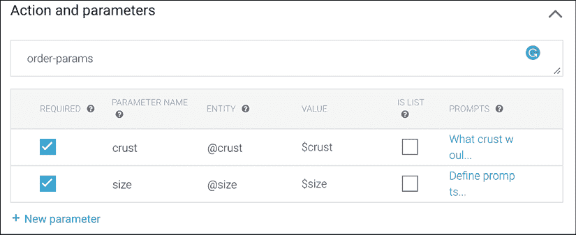

# 第九章：使用深度学习构建对话式 AI 应用

对话的艺术被认为是人类独有的特质。机器与人类进行对话的能力已经成为多年来的研究课题。艾伦·图灵提出了现在著名的图灵测试，旨在检验人类能否通过书面信息与另一个人类和机器进行对话，并正确识别每个参与者是机器还是人类。近年来，像亚马逊的 Alexa 和苹果的 Siri 这样的数字助手在对话式 AI 方面取得了显著进展。本章讨论了不同的对话式代理，并将前几章学到的技术置于实际背景中。虽然构建对话式代理有多种方法，但我们将重点讨论近年来的深度学习方法，并涵盖以下主题：

+   对话式代理及其通用架构概览

+   构建对话式代理的端到端流程

+   不同类型对话式代理的架构，例如

    +   问答机器人

    +   填槽型或任务导向型机器人

    +   通用对话机器人

我们将从对话式代理的一般架构概述开始。

# 对话式代理概述

对话式代理通过语音或文本与人进行互动。Facebook Messenger 是一个基于文本的代理示例，而 Alexa 和 Siri 是通过语音互动的代理示例。无论是哪种情况，代理都需要理解用户的意图并作出相应的回应。因此，代理的核心部分将是**自然语言理解**（**NLU**）模块。该模块将与**自然****语言生成**（**NLG**）模块进行交互，向用户提供回应。语音代理与基于文本的代理的不同之处在于，它们拥有一个额外的模块，用于将语音转换为文本，反之亦然。我们可以想象该系统对于语音激活代理的逻辑结构如下：

图 9.1：对话式 AI 系统的概念架构

语音系统和文本系统之间的主要区别在于用户与系统的互动方式。上述*图 9.1*中“语音识别与生成”部分右侧的所有其他部分，在这两种类型的对话式 AI 系统中都是相同的。

用户通过语音与代理进行交流。代理首先将语音转换为文本。在过去几年中，这一领域取得了许多进展，对于像英语这样的大语言，它通常被认为是一个已解决的问题。

英语在全球许多国家都被使用，这导致了多种不同的发音和方言。因此，像苹果这样的公司开发了不同口音的模型，例如英式英语、印度英语和澳大利亚英语。下图 *Figure 9.2* 显示了在运行 iOS 13.6 的 iPhone 11 上的 Siri 控制面板中，一些英语和法语口音。法语、德语以及其他一些语言也有多个变体。另一种方式是将口音和语言分类模型作为第一步，然后通过适当的语音识别模型处理输入：

图 9.2：Siri 中的语言变体用于语音识别

对于虚拟助手，有特定的模型用于唤醒词检测。该模型的目标是在检测到唤醒词或短语（例如“OK Google”）时启动机器人。唤醒词会触发机器人监听用户的发言，直到对话完成。一旦用户的语音被转换为文本，就可以应用本书中多个章节提到的各种自然语言处理（NLP）技术。*Figure 9.1* 中 NLP 框内显示的元素可以视为概念性的。根据系统和任务的不同，这些组件可能是不同的模型，或者是一个端到端的模型。然而，考虑如图所示的逻辑划分是很有帮助的。

理解用户的命令和意图是至关重要的一部分。意图识别对于像亚马逊的 Alexa 或苹果的 Siri 这样的通用系统至关重要，因为它们具有多种功能。根据识别的意图，可能会调用特定的对话管理系统。对话管理可能会调用由履行系统提供的 API。在银行聊天机器人中，命令可能是获取最新余额，而履行可能是一个从银行系统中提取最新余额的系统。对话管理器会处理余额并使用 NLG 系统将余额转换为适当的句子。请注意，这些系统中有些是基于规则的系统，而另一些则使用端到端深度学习。问答系统就是端到端深度学习系统的一个例子，在这种系统中，对话管理和自然语言理解（NLU）是一个整体。

会话式人工智能应用有多种类型，其中最常见的包括：

+   任务导向或槽填充系统

+   问答系统

+   机器阅读理解

+   社交或闲聊聊天机器人

以下各节将描述这些类型。

## 任务导向或槽填充系统

任务导向系统是为了完成特定任务而专门构建的。任务的一些例子包括订披萨、获取银行账户的最新余额、打电话、发送短信、开灯等。大多数虚拟助手所暴露的功能可以归类为此类。一旦确定了用户的意图，控制权就会转交给管理特定意图的模型，收集完成任务所需的所有信息并与用户管理对话。命名实体识别（NER）和词性标注（POS）检测模型在这样的系统中扮演着至关重要的角色。假设用户需要填写一个包含一些信息的表单，而机器人与用户进行互动以获取完成任务所需的信息。我们以订披萨为例。下表展示了这个过程中的简化选择示例：

| 大小 | 底边 | 配料 | 外卖 | 数量 |
| --- | --- | --- | --- | --- |
| 小中大 XL | 薄底常规深盘无麸质 | 芝士墨西哥辣椒菠萝意大利辣香肠 | 外卖送货 | 12… |

这里是一个与机器人对话的虚构示例：

图 9.3：一个可能的披萨订购机器人对话示例

机器人跟踪所需信息，并随着对话的进展不断标记其已收到的信息。一旦机器人收集到完成任务所需的所有信息，它就可以执行任务。注意，为了简洁起见，一些步骤（如确认订单或客户要求披萨配料选项）已被省略。

在今天的世界中，像 Dialogflow（Google Cloud 的一部分）和 LUIS（Azure 的一部分）这样的解决方案简化了构建此类对话代理的过程，只需配置即可。让我们看看如何使用 Dialogflow 实现一个简单的机器人，完成上述披萨订购任务的一部分。注意，为了简化配置并使用 Dialogflow 的免费层，示例保持简小。第一步是访问 [`cloud.google.com/dialogflow`](https://cloud.google.com/dialogflow)，这是该服务的主页。Dialogflow 有两个版本——Essentials 或 ES 版和 CX 版。CX 是高级版，具有更多功能和控制。Essentials 是简化版，提供免费层，非常适合构建机器人的试用版。向下滚动页面，直到看到 Dialogflow Essentials 部分，并点击 **进入控制台** 链接，如下图 *图 9.4* 所示：

图 9.4：Dialogflow 控制台访问

点击控制台可能需要服务授权，您可能需要使用您的 Google Cloud 账户登录。或者，您可以导航到 [dialogflow.cloud.google.com/#/agents](http://dialogflow.cloud.google.com/#/agents) 查看已配置的代理列表。此屏幕如*图 9.5*所示：

图 9.5：Dialogflow 中的代理配置

可以通过点击右上角的蓝色**创建代理**按钮来创建一个新代理。如果您看到不同的界面，请确保您正在使用 Dialogflow Essentials。您也可以使用以下 URL 进入代理部分：[`dialogflow.cloud.google.com/#/agents`](https://dialogflow.cloud.google.com/#/agents)。这将打开新的代理配置屏幕，如*图 9.6*所示：

图 9.6：创建新代理

请注意，这不是 Dialogflow 的全面教程，因此我们将使用几个默认值来说明构建插槽填充机器人（slot-filling bot）的概念。点击**创建**将构建一个新机器人并加载屏幕，如*图 9.7*所示。构建机器人的主要部分是定义意图。我们机器人的主要意图是订购披萨。在创建意图之前，我们将配置几个实体：

图 9.7：一个准备配置的简化代理

这些实体是机器人在与用户对话时将填写的插槽。在此案例中，我们将定义两个实体——披萨底座和披萨大小。点击左侧“实体”（Entities）旁边的**+**符号，您将看到以下屏幕：

图 9.8：在 Dialogflow 中配置披萨底座实体的选项

左侧的值表示披萨底座（crust）实体的值，右侧的多个选项或同义词是用户可以输入或说出的与每个选择对应的术语。我们将配置四个选项，分别对应上表中的内容。另一个实体将用于配置披萨的大小。配置后的实体如*图 9.9*所示：

图 9.9：大小实体的配置

现在我们可以开始构建意图了。点击左侧导航栏中**意图**部分旁边的**+**号。我们将这个意图命名为`order`，因为这个意图将从用户那里获取外壳和尺寸选项。首先，我们需要指定一组训练短语，这些短语将触发这个意图。一些这样的训练短语示例如“我想点披萨”或“我能要一份披萨吗？”。*图 9.10*显示了一些为该意图配置的训练短语：

图 9.10：触发订单意图的训练短语

这张图中隐藏了大量的机器学习和深度学习，Dialogflow 对其进行了简化。例如，平台可以处理文本输入以及语音输入。这些训练示例是具有代表性的，实际的表达方式不需要与这些表达直接匹配。

下一步是定义我们从用户那里需要的参数。我们添加一个包含两个参数的操作——尺寸和外壳。请注意，**实体**列将参数与定义的实体及其值相关联。**值**列定义了一个变量名称，可在未来的对话或与 API 集成时使用：

图 9.11：订单意图所需的参数

对于每个参数，我们需要指定一些代理将用来询问用户信息的提示语。下面的*图 9.12*显示了一些尺寸参数的示例提示。您可以选择为提示配置自己的表达方式：

图 9.12：尺寸参数的提示选项

配置意图的最后一步是收集信息后配置响应。该配置在**响应**部分完成，如*图 9.13*所示：

图 9.13：订单意图的响应配置

注意响应文本中使用了`$size.original`和`$crust.original`。它使用用户在下单时使用的原始术语，在重复订单时将其复述。最后，注意我们将这个意图设置为对话的结束，因为我们已经获取了所需的所有信息。我们的机器人已经准备好进行训练和测试。在配置完训练短语、动作和参数，以及响应后，请点击页面顶部的蓝色**保存**按钮。页面底部还有一个名为"fulfilment"的部分，允许将意图与 Web 服务连接以完成该意图。可以通过右侧进行机器人测试。请注意，尽管我们仅配置了文本，Dialogflow 同时支持文本和语音界面。这里我们演示的是文本界面，鼓励你也尝试语音界面：

图 9.14：显示响应处理和变量设置的对话示例

基于云的解决方案使得为一般用途构建面向任务的对话代理变得相当容易。然而，为了医疗等特定领域构建代理可能需要定制化的构建。让我们来看一下构建这种系统特定部分的选项：

+   **意图识别**：识别意图的最简单方法是将其视为一个分类问题。给定一个发声或输入文本，模型需要将其分类为几个意图。可以使用标准的基于 RNN 的架构，像前面章节中提到的那些，来适应这一任务。

+   **槽标记**：标记句子中使用的槽，以对应输入，可以将其视为一个序列分类问题。这与第二章中用于标记文本序列中命名实体的方法类似。双向 RNN 模型在这个部分非常有效。

这些部分可以开发不同的模型，也可以结合在一个端到端的模型中，并配备对话管理器。可以使用专家生成的一组规则，或使用 CRFs（详见*第二章*，*使用 BiLSTMs 理解自然语言中的情感*）来构建对话状态跟踪系统。最近的研究方法包括 Mrkšić等人在 2017 年提出的神经信念跟踪器，该方法在他们的论文《Neural Belief Tracker: Data-Driven Dialogue State Tracking》中有所介绍。该系统需要三个输入：

1.  最后的系统输出

1.  最后的用户发言

1.  一个来自可能的候选槽的槽值对

这三种输入通过内容模型和语义解码模型进行组合，并输入到二分类决策（softmax）层，以生成最终输出。深度强化学习正被用来优化整体对话策略。

在自然语言生成（NLG）部分，最常见的方法是定义一组可以动态填充的模板。这个方法在前面的图示*图 9.13*中展示过。神经网络方法，如 Wen 等人在 2015 年发表的论文*基于语义控制的 LSTM 自然语言生成用于对话系统*中提出的语义控制 LSTM，正在积极研究中。

现在，让我们进入另一个有趣的对话代理领域——问答和机器阅读理解。

# 问答和机器阅读理解（MRC）对话代理

聊天机器人可以通过基于**知识库**（**KB**）中包含的信息进行训练，来回答问题。这种设置称为问答设置。另一个相关领域是**机器阅读理解**或**MRC**。在 MRC 中，问题需要根据与查询一同提供的一组段落或文档进行回答。这两个领域都正看到大量的初创企业活动和创新。通过这两种类型的对话代理，可以实现大量商业应用场景。例如，将财务报告交给机器人，回答诸如“根据财务报告，收入增长多少”的问题，就是 MRC 的一个例子。组织拥有大量的数字化信息库，每天都有新信息涌入。构建这样的代理可以帮助知识工作者快速处理和解析大量信息。像 Pryon 这样的初创公司正在提供对话式 AI 代理，这些代理融合、摄取并适应各种结构化和非结构化数据，形成统一的知识领域，终端用户可以通过自然语言提问的方式来发现信息。

知识库（KB）通常由主体-谓词-宾语三元组组成。主体和宾语是实体，而谓词表示它们之间的关系。KB 可以表示为知识图谱，其中主体和宾语是节点，通过谓词边连接。一个大的挑战是如何在实际中维护这样的知识库和图谱。大多数深度 NLP 方法集中于判断给定的主体-谓词-宾语三元组是否为真。通过这种重新表述，问题被简化为二分类问题。有几种方法，包括使用 BERT 模型，这些方法可以解决分类问题。这里的关键是学习知识库的嵌入，然后在此嵌入之上构建查询。Dat Nguyen 的调查论文*实体和关系嵌入模型用于知识图谱补全的综述*提供了各种主题的精彩概述，可以深入了解。接下来，我们将专注于 MRC 这一部分内容。

MRC（机器阅读理解）是一个具有挑战性的任务，其目标是回答关于给定一组段落或文档的任何问题。这些段落在预先并不已知，且长度可能不同。最常用的评估模型的研究数据集是**斯坦福问答数据集**，也就是通常所说的**SQuAD**。该数据集包含了 10 万个问题，涉及不同的维基百科文章。模型的目标是输出文章中回答问题的文本跨度。微软基于必应查询发布了一个更具挑战性的数据集，称为**机器阅读理解（MAchine Reading COmprehension）**数据集，或简称**MARCO**。该数据集包含超过 100 万个匿名问题，涵盖超过 880 万个段落，提取自 350 多万个文档。该数据集中的一些问题可能无法根据段落内容找到答案，而 SQuAD 数据集则没有此问题，这使得 MARCO 成为一个具有挑战性的数据集。与 SQuAD 相比，MARCO 的第二个挑战性在于它要求从多个段落中合成信息来生成答案，而 SQuAD 则要求标注给定段落中的文本跨度。

BERT 及其变体，例如在 2020 年 ICLR 上发布的*ALBERT：一种轻量级 BERT 用于自监督学习语言表示*，构成了今天大多数竞争性基准的基础。BERT 架构非常适合这个任务，因为它允许传入由[SEP]标记分隔的两段输入文本。BERT 论文评估了他们的语言模型在多个任务上的表现，包括在 SQuAD 任务上的表现。问题标记形成对中的第一部分，段落/文档形成第二部分。输出标记对应第二部分，即段落，根据是否表示跨度的起始或结束，给出评分。

架构的高级图示见于*图 9.15*：

图 9.15：BERT 微调方法用于 SQuAD 问答

问答的一个多模态方面是视觉问答（Visual QA），在*第七章*，*多模态网络与图像描述（使用 ResNets 和 Transformer）*中简要介绍过。与图像描述所提议的架构类似，能够处理图像和文本标记的架构被用于解决这一挑战。

上述 QA 设置称为单轮对话，因为用户提出一个问题，并且提供了一个需要回答问题的段落。然而，人们的对话是来回交替的。这种设置称为多轮对话。后续问题可能包含先前问题或答案的上下文。多轮对话中的一个挑战是指代消解。考虑以下对话：

**用户**：您能告诉我账户#XYZ 中的余额吗？

**机器人**：您的余额是$NNN。

**用户**：您能从*那个*账户转账$MM 到账户#ABC 吗？

第二个指令中的“that”指的是账户 #XYZ，这是在提问者的第一个问题中提到的。这称为共指解析。在多轮对话中，解析共指可能会根据引用之间的距离变得相当复杂。在这一领域，关于一般对话机器人已经取得了若干进展，接下来我们将讨论这一部分内容。

# 一般对话代理

Seq2seq 模型为学习多轮一般对话提供了最佳的灵感。一个有用的思维模型是机器翻译模型。与机器翻译问题类似，对前一个问题的回答可以被看作是将该输入翻译成另一种语言——即回答。通过传入前几轮对话的滑动窗口，而不仅仅是上一轮问题/陈述，可以将更多的上下文编码到对话中。术语“开放领域”常用来描述这一领域的机器人，因为对话的领域不是固定的。机器人应该能够讨论各种话题。这个领域有几个问题是独立的研究课题。

缺乏个性或过于平淡是其中一个问题。对话非常干涩。举个例子，我们在前几章中见过使用温度超参数来调整响应可预测性的方法。由于对话中的不具体性，对话代理有很大的倾向生成“我不知道”这样的回答。可以使用包括 GAN 在内的多种技术来解决这个问题。Facebook 的张等人撰写的 *Personalizing Dialogue Agents* 论文概述了用来解决这一问题的一些方法。

最近有两个例子突出了类人评论生成的最新技术，分别来自 Google 和 Facebook。Google 发布了一篇名为 *Towards a Human-like Open-Domain Chatbot* 的论文，介绍了一个名为 Meena 的聊天机器人，拥有超过 26 亿个参数。核心模型是一个 seq2seq 模型，采用 **演化 Transformer** (**ET**) 块进行编码和解码。模型架构中，编码器有一个 ET 块，解码器有 13 个 ET 块。ET 块是通过对 Transformer 架构进行 **神经架构搜索** (**NAS**) 发现的。该论文提出了一种新的人工评估指标，称为 **合理性与特异性平均值** (**SSA*)。目前文献中提出了多种评估开放领域聊天机器人的不同指标，但缺乏统一的标准。

Facebook 在[`ai.facebook.com/blog/state-of-the-art-open-source-chatbot/`](https://ai.facebook.com/blog/state-of-the-art-open-source-chatbot/)上描述了另一个开放域聊天机器人的例子。本文基于多年的研究，结合了个性化、同理心和知识库（KBs）方面的工作，形成了一个名为 BlenderBot 的混合模型。与谷歌的研究类似，使用了不同的数据集和基准来训练这个聊天机器人。该机器人的代码已分享在[`parl.ai/projects/recipes/`](https://parl.ai/projects/recipes/)。由 Facebook 研究团队开发的 ParlAI 通过[`github.com/facebookresearch/ParlAI`](https://github.com/facebookresearch/ParlAI)提供了多个聊天机器人模型。

这是一个非常热门的研究领域，很多工作正在其中展开。要全面覆盖这个话题将需要一本独立的书。希望你通过本书学到了许多可以结合使用的技术，来构建出令人惊艳的对话式智能体。让我们总结一下。

# 总结

我们讨论了各种类型的对话式智能体，如任务导向型、问答型、机器阅读理解型和一般闲聊型机器人。构建一个对话式 AI 系统是一项非常具有挑战性的任务，涉及许多层面，并且是一个活跃的研究和开发领域。本书前面讨论的内容也有助于构建聊天机器人的各个部分。

# 结语

首先，恭喜你读完了本书。我希望本书能帮助你打下坚实的高级 NLP 模型基础。这类书籍面临的主要挑战是，它可能在印刷出版时就已经过时。关键在于，新发展是基于过去的进展；例如，Evolved Transformer 基于 Transformer 架构。了解本书中呈现的所有模型将为你提供坚实的基础，并显著减少你理解新发展所需的时间。每一章的有影响力和重要的论文也已在 GitHub 仓库中提供。我期待看到你接下来会发现和构建什么！
