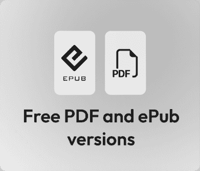
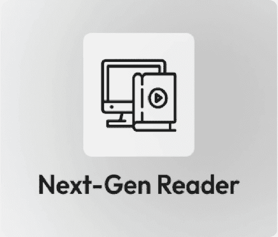

# 前言

生成式 AI，特别是代理式 AI，正迅速成为现代企业技术的支柱。代理式 AI 意味着设计系统，其中大型语言模型（LLMs）不仅作为单一的文本生成器，而且作为分布式推理引擎，每个都能感知其环境，做出决策，并采取行动以共同实现特定目标。在众多优势中，代理式 AI 允许自动化复杂的认知工作流程。这减少了在多步骤过程中对人类干预的需求，从而使得能够创建自适应、自主的系统，这些系统能够在整个组织中扩展专业知识，同时将人类批准整合到最关键的过程中。

在这个领域的所有新兴技术中，有许多框架及其抽象模式，这些模式允许创建这些代理。本书专注于支撑稳健代理系统的通用架构模式，同时利用像谷歌的 Gemini 模型和代理开发工具包（ADK）这样的强大工具，以及像 LangGraph 和 CrewAI 这样的流行框架。这些工具在今天至关重要，因为除了处于行业前沿之外，它们还提供了以下优势：

+   它们允许创建能够推理、计划和利用工具与真实世界互动的代理。

+   他们支持多个代理之间的复杂协调，考虑依赖关系和共享上下文。

+   它们为治理、保护和监控生产中的自主系统提供了基础设施。

在这本致力于设计和构建日益复杂的代理式 AI 的书中，我们首先将讨论企业生成式 AI 的格局，“代理式”LLMs 的选择和适应，如何构建智能代理的结构，以及如何使用成熟度模型来治理和整合这些系统。

一旦理解了基础概念和代理结构，我们将讨论构建结合代理的稳健系统的实用设计模式。我们将探讨如何协调多个代理，确保可解释性和合规性，实现容错性，以及设计有效的人机交互。

最后，我们将通过查看高级实现和实际用例来结束本书，包括构建自我改进的系统、企业采用的高级详细路线图，以及使用现代框架的金融工作流程的单代理和多代理系统的实际编码示例。

本书将指导您了解设计和构建代理系统的全面模式语言，并还将涵盖使用 Google ADK、CrewAI 和 LangGraph 等工具整合和实施这些模式的具体配方。

本书描述的大多数代理配置都是使用 Google 的 Gemini 模型和 Python 进行说明的，但你也可以将这些架构模式应用到其他 LLM 和框架中。

在这本书中，我想分享我们在与企业合作以及与全球 AI 社区互动过程中遇到的真实的、实用的代理人工智能场景的经验。

# 本书面向的对象

本书面向软件架构师、高级开发者、AI 工程师和技术领导者，他们希望超越简单的聊天机器人原型，构建健壮、生产级的代理系统。为了充分利用这本代理人工智能书籍，需要具备 Python 编程经验、基本机器学习概念，以及基于 API 的开发熟悉度。

# 本书涵盖的内容

*第一章*，*GenAI in the Enterprise: Landscape, Maturity, and Agent Focus*，详细介绍了 GenAI 的变革潜力，引入了代理系统的核心概念，并提出了 GenAI 成熟度模型作为采用的战略路线图。

*第二章*，*Agent-Ready LLMs: Selection, Deployment, and Adaptation*，介绍了选择合适基础模型的准则、高效部署和服务的策略，以及用于管理代理生命周期的 AgentOps 学科。

*第三章*，*The Spectrum of LLM Adaptation for Agents: RAG to Fine-tuning*，探讨了针对 LLM 进行专业化的技术，从动态上下文检索（RAG）和上下文学习到参数高效的微调。

*第四章*，*Agentic AI Architecture: Components and Interactions*，剖析了代理的基本结构——*感知*、*推理*、*计划*、*行动*——并检查了代理智能操作所需的架构特性和数据上下文。

*第五章*，*Multi-Agent Coordination Patterns*，涵盖了管理代理之间协作的策略，包括***代理路由器***、任务委托框架（***监督者*** vs. ***蜂群***）、以及协商和共识的模式。

*第六章*，*Explainability and Compliance Agentic Patterns*，详细介绍了确保责任制的模式，如***指令忠实度审计***和***分形思维链（FCoT）嵌入***，以创建透明且可审计的推理路径。

*第七章*，*Robustness and Fault Tolerance Patterns*，介绍了如***自适应重试***、***断路器***、和***并行执行共识***等架构保障措施，以确保代理在面对错误和不确定性时保持可靠性。

*第八章*，*Human-Agent Interaction Patterns*，考察了 AI 与人类之间的接口，涵盖了委托、无缝移交以及高风险决策中的人机交互策略。

*第九章*，*代理级模式*，专注于单个代理的内部能力，探讨了管理代理特定内存、结构化推理和多模态感知的模式。

*第十章*，*生产就绪的系统级模式*，讨论了企业部署所需的整体基础设施，包括安全模式、发现注册表和事件驱动的反应模式。

*第十一章*，*高级适应：构建学习型代理*，探讨了自我改进系统的前沿，涵盖了合成数据生成、自动评分和协同进化的代理训练的“飞轮”效应。

*第十二章*，*实用路线图：按成熟度级别实现代理模式*，提供了一个综合指南，逐步采用这些模式，将它们映射到从基础到高级的组织成熟度特定阶段。

*第十三章*，*用例：单一代理处理贷款*，通过一个处理复杂金融工作流的单体代理的实际实现，展示了 FCoT 和工具在代码中的应用。

*第十四章*，*用例：贷款处理的多代理系统*，将前面的用例演变为分布式多代理系统，展示了专业代理如何协作处理接收、风险和合规性。

*第十五章*，*代理框架 – 用例：使用 CrewAI 和 LangGraph 的贷款处理多代理系统*，通过重新实现贷款处理场景来比较和对比流行的行业框架，突出不同抽象模型的优势。

*第十六章*，*结论：规划您的代理人工智能之旅*，总结了关键架构原则，提供了一个越来越复杂的实践者路线图和行动计划，并提供了对代理劳动力未来的最终观点。

# 为了充分利用这本书

+   您应该对 Python 编程和面向对象设计原则有基本的理解。

+   您应该熟悉基本的生成式人工智能概念，例如什么是大型语言模型（LLM）以及提示是如何工作的。

+   推荐使用 Python 开发环境（例如 Jupyter Notebooks 或 Google Colab）来运行代码示例。

+   您将需要 Google Gemini（通过 Google AI Studio 或 Vertex AI）的 API 密钥来执行用例章节中提供的特定实现示例。

## 下载示例代码文件

书籍的代码包托管在 GitHub 上，网址为[`github.com/PacktPublishing/Agentic-Architectural-Patterns-for-Building-Multi-Agent-Systems`](https://github.com/PacktPublishing/Agentic-Architectural-Patterns-for-Building-Multi-Agent-Systems)。我们还有其他来自我们丰富图书和视频目录的代码包，可在[`github.com/PacktPublishing`](https://github.com/PacktPublishing)找到。查看它们吧！

## 下载彩色图像

我们还提供了一份包含本书中使用的截图/图表的彩色图像的 PDF 文件。您可以从这里下载：[`packt.link/gbp/9781806029570`](https://packt.link/gbp/9781806029570)

## 使用的约定

本书使用了多种文本约定。

`CodeInText`: 表示文本中的代码单词、数据库表名、文件夹名、文件名、文件扩展名、路径名、虚拟 URL、用户输入和 Twitter 昵称。例如：“每个子代理是一个`LLMAgent`实例，它被设计和调整以成为特定复合任务或狭窄领域的专家。”

代码块设置如下：

```py
class LoanApprovalAgent:
    CONFIDENCE_THRESHOLD = 0.95
def process_application(self, application_data):
        # ... initial processing steps ...
# Analyze property appraisal
        property_analysis = self.analyze_property(application_data.appraisal)

        if property_analysis['confidence'] < self.CONFIDENCE_THRESHOLD:
            # 1\. Package the context for human review
            review_package = {
                "application_id": application_data.id,
                "issue": "Property data discrepancy",
                "details": property_analysis['details']
            }
```

任何命令行输入或输出都如下所示：

```py
🧠 THOUGHT from the log: RECAP: Okay, so I've got a loan application here... My team of specialized agents are set up to handle each stage... REASON: The first agent, the document_validator, requires the entire application data... Once validated, I'll extract the customer ID and feed that to the credit_checker... VERIFY: I've verified that each agent's input matches their expected data contract... Now, it's time to execute...
```

**粗体**: 表示新术语、重要单词或您在屏幕上看到的单词。例如，菜单或对话框中的单词在文本中如下所示。例如：“**生成式 AI**（**GenAI**）是**人工智能**（**AI**）的一个领域，它允许系统通过从大量数据集中的潜在模式中学习来创建新内容、推理、理解上下文并做出推荐。”

警告或重要提示如下所示。

技巧和窍门如下所示。

# 联系我们

我们始终欢迎读者的反馈。

**一般反馈**: 如果您对本书的任何方面有疑问或有任何一般性反馈，请通过`customercare@packt.com`给我们发邮件，并在邮件主题中提及书籍的标题。

**勘误**: 尽管我们已经尽最大努力确保内容的准确性，但错误仍然可能发生。如果您在这本书中发现了错误，如果您能向我们报告，我们将不胜感激。请访问[`www.packt.com/submit-errata`](https://http://www.packt.com/submit-errata)，点击**提交勘误**，并填写表格。

**盗版**: 如果您在互联网上发现任何形式的我们作品的非法副本，如果您能提供位置地址或网站名称，我们将不胜感激。请通过`copyright@packt.com`与我们联系，并附上材料的链接。

**如果您** **想** **成为** **作者**: 如果您在某个领域有专业知识，并且您有兴趣撰写或为书籍做出贡献，请访问[`authors.packt.com/`](https://http://authors.packt.com/)。

# 与您的书籍一起享受免费福利

本书附带免费福利以支持您的学习。现在激活它们以获得即时访问（有关说明，请参阅“*如何解锁*”部分）。

以下是你购买后可以立即解锁的内容快速概览：

| **PDF 和** **ePub** **副本** | **下一代基于 Web 的阅读器** |
| --- | --- |
|  |  |
|  任何设备上阅读此书的 DRM 免费 PDF 副本。 使用 DRM 免费的 ePub 版本与您喜欢的电子阅读器。 多设备进度同步：在任何设备上继续阅读。 高亮和笔记：捕捉想法，将阅读转化为持久的知识。 书签：保存并随时回顾关键部分。 暗黑模式：切换到暗色或棕褐色主题以减少眼睛疲劳。 |

## 如何解锁

扫描二维码（或访问[packtpub.com/unlock](https://packtpub.com/unlock)）。通过书名搜索此书，确认版本，然后按照页面上的步骤操作。


*注意：请妥善保管您的发票。直接从* *Packt* *购买不需要发票*

# 分享您的想法

一旦您阅读了《构建多智能体系统的代理架构模式》，我们非常乐意听到您的想法！扫描下面的二维码直接进入此书的亚马逊评论页面并分享您的反馈。


[`packt.link/r/180602957X`](https://packt.link/r/180602957X)

您的评论对我们和科技社区非常重要，并将帮助我们确保我们提供高质量的内容。
