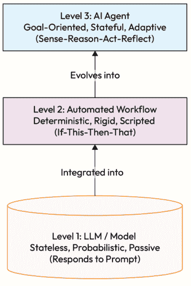
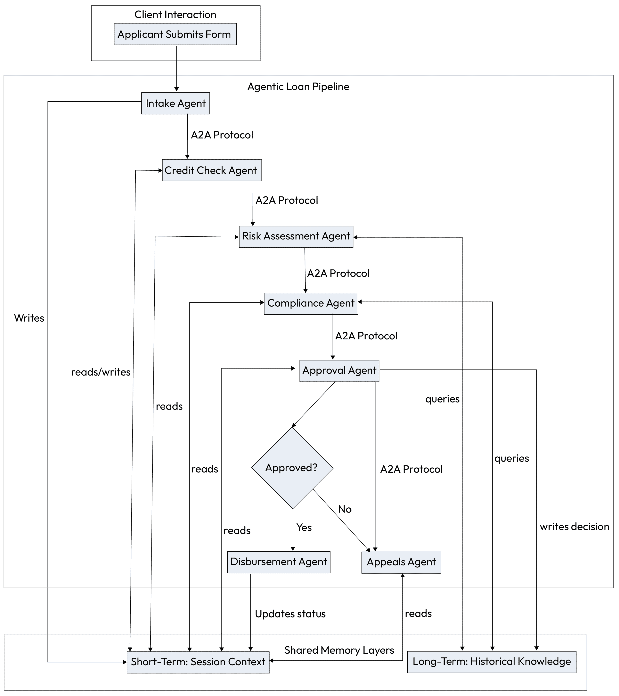
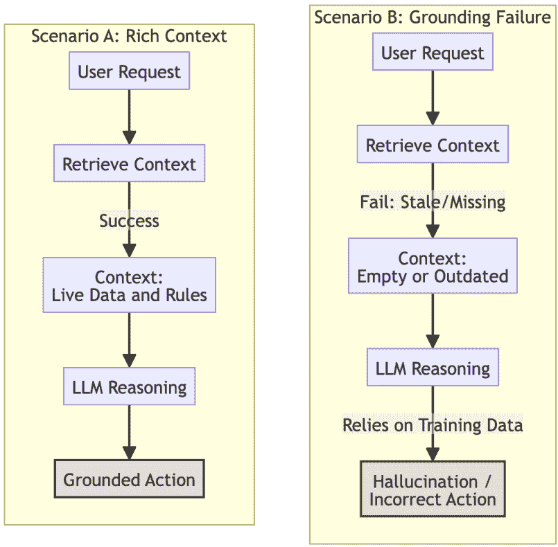
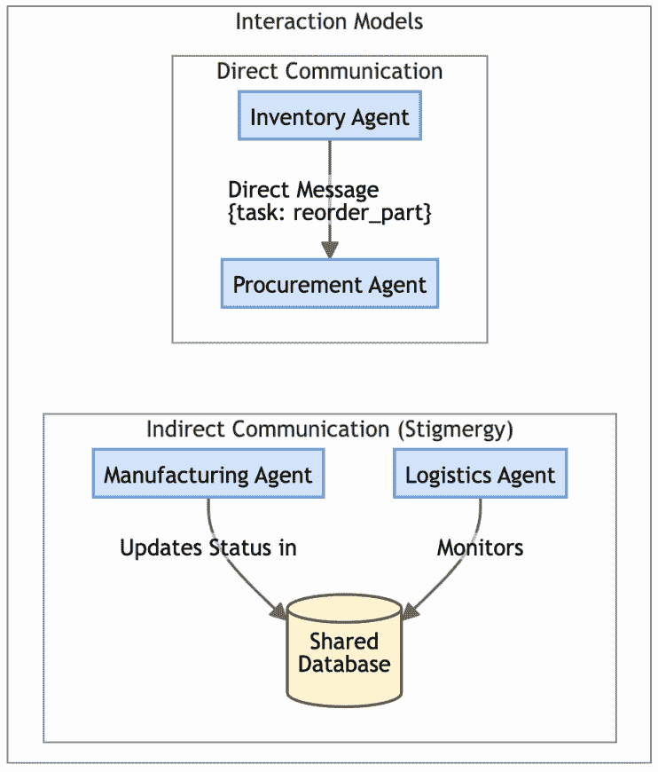
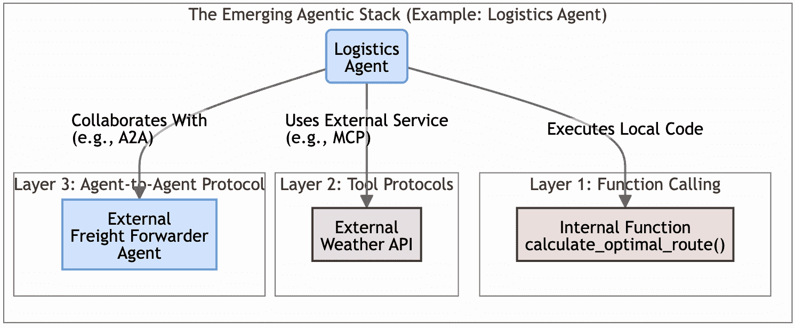

# 第四章：代理人工智能架构：组件和交互

在本书的第一部分，我们为理解生成式人工智能奠定了基础，描述了其向更复杂、分布式人工智能的进步及其向更自主系统的演变。我们探讨了 GenAI 在企业中的变革潜力，绘制了一条使用代理人工智能成熟度模型走向更高级能力的路径，然后重点介绍了 LLMs 作为这些智能系统认知引擎的关键作用。

*第二章和第三章* 详细介绍了选择、部署、优化和调整 LLMs 的关键考虑因素，通过从 RAG 到微调等技术的应用，以确保它们真正“适合代理”。我们确定，为代理任务准备 LLM 当然包括提示工程，但这远远不止于此。它还涉及定义模型如何解释用户意图以及通过函数调用与工具（APIs）交互；代理需要精心准备，以便在更大的操作结构中作为可靠的推理核心。

在为代理的认知核心打下基础后，本章将重点转向开发稳健有效的代理人工智能系统所需的实际架构。

我们本章首先考察代理人工智能的基本架构，重点关注将代理与更简单的 AI 交互区分开来的核心组件、职责和独特能力。在之前的章节中，我们已经确定了 LLMs 作为推理引擎的重要性，它们能够适应来自其上下文环境的传入感官输入，并相应地修订行动计划。

然后，我们转换视角：无论能力如何强大，LLM 都不是最终产品，而是更广泛、分布式操作结构中的一个关键组件。这标志着设计范式的一个关键转变：*从单体系统到动态的智能、基于角色的 AI 代理生态系统*。

然后，我们将剖析代理的解剖结构，检查其基本构建块，从它如何接收目标和感知其环境到它如何对其采取行动。我们将探讨数据存储和环境上下文在代理智能行为中的关键作用。最后，我们将介绍各种代理交互模型和关键特性，这些特性定义了这些系统的操作和协作方式。理解这一架构是设计并实现我们在第二部分将要探讨的强大代理模式的第一步。

在本章中，我们将涵盖以下主题：

+   定义代理：核心概念和能力

+   代理的解剖结构

+   代理的数据存储和环境上下文

+   代理交互模型和关键特性

+   代理架构的技术考虑因素

让我们先明确地定义什么是人工智能代理。

# 定义代理：核心概念和能力

在*第一章*中，我们介绍了 idx_6efcb56a 代理人工智能系统的概念。在这里，巩固我们对人工智能代理的定义至关重要。

一个 AI 代理可以被理解为一种系统，通常由 LLM 提供动力，旨在感知其环境，做出决策，并采取行动以实现特定目标。这个定义描述了一个更自主的实体，它具有持续的目标，并超越了仅仅对提示做出反应。

几个关键特征 idx_8e9618c2 区分了真正的 AI 代理与更基本的 LLM 交互：

+   **自主性**：代理拥有一定程度的自我治理能力，使它们能够独立地实现目标，而无需持续的直接人类干预。一旦设定了目标，代理就可以确定达到该目标所需的步骤。

+   **反应性（或** **感知****）：代理能够感知其操作环境，并对其中的变化或事件做出反应。这种“感知”是代理行为的关键方面。

+   **主动性（或** **目标导向****）：代理不仅做出反应；它们采取主动，并以目标为导向行事。它们努力实现其定义的目标，这可能涉及复杂的规划和执行任务。

+   **社交能力（** **可选但常见，尤其是在多代理系统中）**：许多代理，尤其是多代理系统中的代理，可以与其他代理和人类进行交互和沟通。它们使用约定的语言和协议来协作、谈判或协调行动。

明确区分代理 AI 与简单的 LLM 交互和传统的自动化工作流程至关重要。虽然 LLMs、自动化工作流程和 AI 代理在现代系统中都发挥作用，但它们代表了根本不同的能力和自主性水平，如下面的层次结构所示。

图 4.1 – 自主性的层次结构

## LLMs

LLMs 作为 idx_18ea3cd7 代理的基础推理核心或“大脑”；它们是推动理解、规划和内容生成的引擎。在我们的讨论中，我们将 LLM 和 MMMs 这两个术语同义使用，尽管在技术上它们之间的区别是重要的。

**多模态模型（MMMs）**代表了 idx_a2bdf8e4 在这一层的重要进化。与早期 idx_95be22a9 仅基于文本数据集训练的模型不同，现代 MMMs（如 Google Gemini 3）在文本、代码、图像、音频和视频的庞大数据集上训练。这使得它们能够将不同的模态投影到共享的语义空间中，从而实现输入的本地推理。例如，一个 MMM 可以分析仪表盘的截图来诊断系统错误，或者通过音频文件来提取情感，而不依赖于单独的、不连贯的翻译模型。

然而，一个 MMM 不是一个代理。尽管这些感知能力很先进，但模型本身仍然本质上是无状态的、被动的。它处理输入并预测输出，但它不会主动采取行动、维持自己的长期记忆或独立追求目标。它只会在被提示时做出响应。

这与集中式、反应式模型形成对比，后者是分布式的、具有代理系统的系统，它们在群体、联盟或社会中协同工作。虽然模型提供了原始智能，但周围代理架构将这种被动潜力转化为主动、目标导向的行为。

## 自动化工作流程

一个自动化的工作流程，或 AI 编排，是一系列任务，其中一些是预先确定的和确定性的，而其他可能是非确定性的，依赖于意图解释和函数调用。

可以将其视为执行一系列“如果这个，那么那个”步骤的脚本。虽然它执行操作，但它具有确定性和刚性，遵循固定的路径。它缺乏推理、动态规划或适应不可预见情况的能力。

## AI 代理

AI 代理是三者中最复杂的。它是一个完整的系统，使用 LLM 作为其“大脑”来自主实现目标。代理是目标导向的、有状态的、可适应的。与简单的流程不同，代理可以对其环境进行推理，制定动态计划，使用工具执行该计划，并从结果中学习以改进其未来的表现。

例如，当被提示时，一个 LLM 可能会起草一封电子邮件。一个自动化的工作流程可能会在每周一早上 9 点发送预先编写的电子邮件。然而，一个 AI 代理可能被分配管理整个收件箱，主动对电子邮件进行分类，使用工具根据电子邮件内容安排会议，并在必要时提醒用户紧急事项，同时随着时间的推移学习用户的偏好。

为了进一步阐明这些差异，以下表格提供了一个直接的比较：

| **特征** | **LLM** | **自动化** **工作流程** | **AI** **代理** |
| --- | --- | --- | --- |
| 核心功能 | 根据提示生成文本、回答问题、综合信息。 | 执行预定义的、静态的任务序列。 | 自主实现特定目标。 |
| 决策 | 模式匹配和概率性文本生成。不做出决策。 | 基于硬编码的“如果这个，那么那个”逻辑。不进行推理。 | 进行推理、制定计划并做出动态决策以解决复杂问题。 |
| 状态和记忆 | 无状态：每次交互都是新的（尽管可以传递上下文）。 | 通常无状态；不记得过去的执行。 | 有状态：维护短期和长期记忆以学习和适应。 |
| 适应性 | 除非微调或由新的提示技术支持，否则不会适应。 | 刚硬的：对流程的任何更改都需要重新编程工作流。 | 高度适应性强；从经验中学习并对环境中的变化做出反应。 |
| 交互模型 | 接收提示，返回响应。 | 由事件触发，执行固定脚本。 | 在持续的感觉-推理-计划-行动循环中运行以追求其目标。 |
| 失败处理 | 被动的/无：可能在未意识到失败的情况下生成看似合理但错误的信息（幻觉）。 | 刚硬的/脆弱的：在违反特定规则时硬性失败或触发预置的异常路径（例如，“停止并警告管理员”）。 | 弹性的/自我纠正的：可以检测错误，反思原因，并自主地采用不同的策略或工具重试。 |

表 4.1 – 比较 LLMs、自动化工作流和 AI 代理

从本质上讲，代理是一个系统，它整合并提升了其他两个系统的能力。它利用 LLM 的推理能力，但将其置于一个允许自主、目标驱动的任务执行结构中，这是静态工作流所不能做到的。

在这些基础概念和区分建立之后，我们现在来考察那些赋予这些强大代理特性生命力的内部结构。

# 代理的解剖结构

如前所述 idx_9777fe61，AI 代理的功能可以通过其核心组件来理解。虽然我们之前的讨论提供了一个高级概述，但本节从架构的角度重新审视了该解剖结构。

我们现在将这些组件不仅视为概念，而且视为使代理的持续操作循环功能化的功能构建块：感知环境、推理以形成计划，并采取行动以实现其目标。理解这种结构对于实现后续的设计模式至关重要。

每个单独的代理都拥有以下构建块组成的内部结构，这些构建块在下面的表中总结了它们的架构角色：

| **组件** | **核心功能（**摘要**） | **架构角色** **和** **实现** |
| --- | --- | --- |
| 目标（通过指令指定） | 代理寻求实现的目标或期望的结果。 | 定义代理的目标函数并指导其高级规划。作为配置参数或可以更新的动态状态实现。 |
| 感知（感知） | 从其环境（数字或物理）收集信息和数据。 | 作为输入层。通过 API 监听器、数据流处理器或标准化协议（如模型上下文协议[MCP]）实现。 |
| 推理（认知） | 分析和解释感知信息的核心处理单元。 | 这是认知核心，其中集成了准备好的代理 LLM。它解释输入，根据目标评估它们，并制定高级策略。 |
| 计划 | 根据推理洞察制定一系列动作以实现其目标。 | 战术层，也由 LLM 驱动。它将 *推理* 组件中的高级策略分解为具体的、有序的可执行步骤或工具调用。 |
| 行动（行动） | 使用可用的工具在环境中执行计划中的动作。 | 作为输出层。通过调用工具实现：调用外部 API、执行代码、向执行器发送命令或生成响应。 |
| 记忆 | 存储代理的知识、经验和状态，为决策提供上下文。 | 管理状态。使用短期变量实现当前任务，使用如向量数据库的 RAG 或用户偏好的长期持久存储。 |
| 协调 | 与其他代理互动，以协调动作并朝着集体目标（主要在多代理系统中）协作。 | 代理间通信层。此组件管理任务的整个生命周期，跟踪标准化的代理到代理（A2A）状态，如提交、工作、输入所需和完成。它通过如 Agent2Agent（A2A）协议等协议实现，使代理能够在分布式边界上确定性地委托工作并同步状态。 |

表 4.2 – 代理组件的架构角色

这些建筑 idx_c1047049 块不是静态的；它们在一个连续的循环中运行。代理 *感知* 它的环境，根据其 *目标* 和 *记忆* 对新信息进行 *推理*，制定 *计划*，然后对环境 *行动*。

此行动的结果将在下一次迭代中被感知，从而形成一个强大的反馈循环，使代理能够随着时间的推移学习和适应其行为。正是这个动态的操作循环（建立在这些架构组件之上），是我们将在本书的其余部分探索的更复杂行为和设计模式的基础。

为了将这些架构概念从理论转化为实践，我们现在将探索两个不同的案例研究。这些例子被特别选择来展示代理在不同复杂度级别上的解剖结构。

首先，我们将考察一个旅行规划代理，这是一个相关的单代理系统，它清楚地说明了核心构建块——*目标*、*感知*、*推理*、*计划*、*行动* 和 *记忆*——如何协同工作，从开始到结束满足用户的需求。

然后，我们将分析一个代理贷款处理系统，它展示了更复杂的多代理架构。这个企业级示例将突出多个专业代理如何协作、协调和共享上下文来管理复杂、端到端的企业工作流程。

这些案例研究共同提供了一个实用的视角，通过这个视角可以理解单个代理的基本组件以及多代理系统在实际操作中的架构原则。

## 案例研究：旅行规划代理

为了更好地说明这些构建块如何协同工作，让我们考虑一个实际例子：一个自主的旅行规划代理。该代理的主要目标是根据用户的自然语言请求预订完整的旅行行程，通过与各种外部系统交互来完成其任务。

下表根据本例的上下文分解了代理解剖的每个组件：

| **解剖** **组件** | **旅行规划代理** **示例** |
| --- | --- |
| 目标 | 代理的主要目标是满足用户的请求：“下个月预订往返巴黎的往返机票和 4 星级酒店，住宿 5 晚，总费用不超过 2500 美元。”这个目标是动态的，如果用户改变主意或提供新的约束，则可以更新。 |
| 感知（感知） | 代理通过处理用户的自然语言请求来收集初始信息。它通过接收来自外部系统的数据继续“感知”，例如来自航空公司 API 的可用航班列表或来自酒店预订服务的定价信息。 |
| 推理（认知） | LLM 核心分析用户的明确偏好（“巴黎”、“4 星级”、“5 晚”）和隐含意图。它解释航班和酒店搜索的结构化数据，将选项与预算约束进行比较，并执行复杂的推理以确定最佳行程。 |

| 计划 | 基于其推理，代理制定了一系列步骤：

1.  将用户请求分解为子任务（机票预订、酒店预订）。

1.  执行航班搜索。

1.  执行酒店搜索。

1.  分析结果以找到满足所有约束的有效组合。

1.  向用户展示最终行程以供确认。

1.  执行最终预订操作。

|

| 行动（行动） | 代理通过使用可用工具执行其计划。这包括调用航班搜索 API（例如，`search_flights``(destination="``CDG``",` `month="next")`)和酒店 API（例如，`find_hotels``(city="Paris", rating=4, nights=5)`）。确认后，它再次通过调用预订函数和生成最终确认消息，以及更新用户的长期配置文件以包含这些新偏好，以供未来交互使用。 |
| --- | --- |
| 记忆 | 智能体使用短期记忆来存储用户的偏好、它找到的航班和酒店选项以及当前任务的对话历史。它可能使用长期记忆来回忆用户过去互动中偏好的航空公司或酒店连锁，以实现未来建议的个性化。 |
| 坐标 | 如果这是一个多智能体系统，旅行社可能会与其他专业智能体进行协调。例如，在预订主要行程后，它可以通过发送“找到并预订卢浮宫博物馆的门票”之类的消息，将任务委托给“短途旅行代理”，共同为实现规划整个行程的集体目标而努力。 |

表 4.3 – 用例中的智能体组件

这个 idx_17635f4b 示例 idx_4776469dd 展示了智能体解剖结构的抽象组件如何转化为具体操作。通过持续循环地感知用户需求、推理选项、规划步骤并通过工具采取行动，使智能体能够从简单的请求发展到复杂且成功完成的任务。

## 案例研究：智能体贷款处理系统

这是对 *图 1.1* *–* *智能体解剖结构* 在贷款处理案例研究中的应用，使用您描述的智能体架构的每个组件 idx_ab7f7241。这把理论映射到实践中，展示了智能体系统如何在全栈、多智能体贷款审批工作流程中运行。

金融机构部署多智能体系统来自动化和优化其贷款申请流程。工作流程从最初的客户互动到最终的发放，涉及数据验证、信用评估、风险评估、合规性检查和最终批准。每个智能体专注于该管道的特定阶段，使用 A2A 协议进行通信和协调任务，同时访问共享内存层以保持一致的上下文。

图 4.2 – 用例示例：智能体贷款处理

| **组件** | **贷款处理智能体** **示例** |
| --- | --- |
| 目标 | 每个智能体都有一个与其角色相对应的专业目标：`录入智能体`：收集完整的申请人数据。`信用检查智能体`：验证信用历史并标记异常。`风险评估智能体`：评估申请人的风险配置文件。`合规性智能体`：验证是否符合监管规则。`批准智能体`：根据全面输入做出最终的贷款决定。 |

| 感知（感知） | 智能体通过以下方式收集数据：

+   录入表格（自然语言，结构化数据）

+   对信用局的 API 调用

+   内部 CRM 和 KYC 数据库

+   文档 OCR

+   实时市场数据（用于可变利率贷款）

每个智能体使用 MCP 来根据上下文访问一致的结构化和非结构化数据环境。 |

| 理由（认知） | 由大型语言模型（LLM）驱动，智能体推理：

+   财务文件语义（例如，工资条、银行对账单）

+   政策规则和风险指南

+   从申请人查询中推断出的意图

+   数据中的矛盾（例如，收入不匹配）

认知核心评估输入与代理目标的一致性。|

| 计划 | 计划是针对特定代理的：

+   `Intake Agent`计划对缺失信息进行后续处理。

+   `Credit Check Agent`计划查询哪些信用局（例如，Equifax、TransUnion）以及顺序，并定义处理 API 失败或数据差异的策略。

+   `Risk Agent`根据贷款类型选择评分模型。

+   `Compliance Agent`根据司法管辖区选择所需的检查。

+   `Approval Agent`构建一个决策树，整合来自其他代理的输出。

|

| 行动（动作） | 代理通过以下方式行动：

+   发送验证电子邮件

+   在 CRM 中更新贷款状态

+   调用 API 检索或写入数据

+   生成合规审计跟踪

+   完成任务后触发下游代理

|

| 记忆 | 两层：

+   **短期**：申请人特定的会话记忆

+   **长期**：聚合的欺诈模式、历史决策、监管变化

记忆允许基于学习的改进（例如，调整新的风险指标）。|

| 协调 | 协调是通过**A2A 协议**（Google 的 Agent2Agent 互操作性协议）实现的，它作为通信层：

+   为代理提供一个安全和标准的渠道，以便委派任务和交换信息。

+   允许代理向委派代理报告任务状态（例如，`working`、`completed`、`failed`）。

+   实现互操作性，允许基于不同平台构建的代理能够协作，而无需共享其内部记忆或逻辑。

|

表 4.4 – 贷款处理中的代理解剖组件

### 说明性流程：贷款申请生命周期

1.  客户 idx_a166985e 提交贷款申请 → `Intake Agent`解析并存储在共享内存中。

1.  `Credit Check Agent`被触发 → 通过 API 检索 FICO 和信用历史。

1.  `Risk Agent`根据信用、收入和贷款金额进行推理 → 分配风险评分。

1.  `Compliance Agent`检查 KYC、AML、GDPR 和本地银行规则。

1.  `Approval Agent`整合输入，解决冲突，并做出批准决定。

1.  如果被拒绝，`Appeals Agent`可能会提供替代产品（例如，担保贷款）。

1.  `Disbursement Agent`执行资金释放并更新后端系统。

### 通过 A2A 进行多代理协调

代理通过使用定义良好的协议（如 A2A）相互发送结构化任务进行协作。这是一种直接通信形式，其中发送代理明确地将工作委派给特定的接收代理。

例如，而不是将评分发布到通用总线上，协调代理会首先将任务发送给`Risk Agent`。在收到结果后，它会发送一个*新的*任务给`Approval Agent`，包括作为有效负载的一部分的风险评分。这创建了一个清晰、可审计的委派链。

争议或边缘情况（例如，边缘信用评分）可以引发审议循环。这通过一系列 A2A 消息来处理，其中代理可以交换出价、还价或升级任务到不同的代理或人类以解决。

将代理解剖学应用于贷款处理的好处包括以下内容：

+   **响应性**：代理对实时数据的变化做出反应（例如，信用评分波动）。

+   **设计合规性**：在代理和共享策略层内嵌入的模块化规则。

+   **透明度**：内存日志和推理轨迹有助于审计和监管检查。

+   **适应性**：代理可以独立进化；例如，可以将 `Risk Agent` 替换为更新的 LLM 模型。

这些好处展示了代理的内部结构如何使其表现出智能和弹性行为。然而，这种智能并非仅仅来自其内部设计；它关键地依赖于其从环境中可以访问的丰富和相关的数据。我们现在将检查代理依赖的各种数据存储和上下文来源，以有效地感知、推理和行动。

# 代理的数据存储和环境上下文

正如我们在 *第一章* 中强调的，*上下文为王*，这一原则对于必须做出明智决策并采取适当行动的代理系统尤其正确。代理严重依赖其周围的各种数据存储和上下文信息，以有效地感知、推理和行动。

下图展示了这一高风险动态。它对比了一个健康的、接地的工作流程，其中丰富的上下文使得能够对特定的故障模式进行准确的推理，而陈旧的内存或检索失败会导致不正确的行动。

图 4.3 – 上下文输入与接地故障对比

代理的环境上下文 idx_d7771755 可以广泛分为以下类别：

+   **数字业务上下文**：Thisidx_c7710af7 包括代理可能在企业或在线环境中与之交互或从中获取信息的所有相关数字数据源。关键类型包括以下内容：

    +   **非结构化数据**：Thisidx_9b7c642d 包含了在文本文档（报告、电子邮件、文章）、图像、音频和视频文件中找到的大量信息。大型语言模型在处理和理解非结构化文本方面特别擅长。

    +   **向量存储**：这些 idx_23fb40ae 专用数据库对于在嵌入上进行高效相似性搜索至关重要。当代理需要找到与查询语义相似的信息时，向量存储允许基于意义而不是仅仅基于关键词进行快速检索。这是许多 RAG 系统的核心组件。实现通常分为两类：开源库和数据库（例如，FAISS、Weaviate、Chroma）用于 idx_722a307d 本地或自托管控制，以及商业托管服务（例如，Pinecone、Google Vertex AI Vector Search）用于可扩展性和易于管理。

    +   **结构化数据**：这 idx_004300a6 指的是通常在关系型数据库或电子表格中找到的有序数据。它提供了定义良好的数据点，代理可以查询以执行特定任务，例如检索客户记录或产品信息。

    +   **知识图谱**：这些 idx_00fe1a7b 将信息表示为实体及其关系的网络，提供对领域结构化和语义化的理解。知识图谱对于需要执行涉及相互关联概念的复杂推理的代理特别有用。

+   **物理环境上下文**：对于旨在与真实世界交互的代理，例如 idx_d114318d 机器人或物联网驱动的系统，这包括以下内容：

    +   **传感器**：如相机、麦克风、温度传感器和 GPS 定位器等 idx_9067a8d0 设备提供有关物理环境的数据。

    +   **执行器**：如机械臂、电机或开关等 idx_7c14d829 组件允许代理执行物理动作或操纵其环境中的物体。

有效的代理 idx_35346520 通常需要整合来自多种类型数据存储的信息，并且必须能够从这些不同的上下文中综合信息，以构建对其情况的全面理解。

为了使这些概念具体化，让我们 idx_72c5ee65 考虑一个**供应链管理**代理，该代理的任务是实时监控和优化公司的库存和物流。此代理必须处理来自各种数字系统的信息，并可能与物理仓库组件交互以应对干扰。

以下表格展示了该代理如何与不同的数据存储和 idx_324c5213 环境 idx_7927b95d 上下文交互以履行其职责。

| **上下文/数据** **存储** | **供应链管理** **代理** **示例** |
| --- | --- |
| 数字业务上下文 | 这是指代理运行的数字世界，包括公司的所有运营数据。 |
| 非结构化数据 | 代理处理装运清单（PDF 文件）、来自电子邮件的供应商延误通知以及关于港口罢工或天气事件的新闻报道，以了解潜在的干扰。 |
| 向量存储 | 当检测到新的地缘政治事件时，代理使用向量存储执行关于类似过去事件如何影响航道的内部白皮书语义搜索，检索最相关的历史背景。 |
| 结构化数据 | 代理查询关系型数据库以获取特定产品 SKU 的当前库存水平，检查预期交货日期，并获取仓库容量信息。 |
| 知识图谱 | 代理利用知识图谱来理解供应商、制造工厂、配送中心和最终零售目的地之间复杂的多级关系。这使得它可以推断出单个组件供应商的延误将影响三个特定的产品线。 |
| 物理环境上下文 | 这包括代理可以感知和对其采取行动的真实世界元素，通常通过物联网设备。 |
| 传感器 | 代理从送货卡车上的 GPS 跟踪器、冷藏集装箱中的温度传感器（以确保产品完整性）以及仓库装卸区中的 RFID 扫描仪接收连续的数据流，确认货物的到达。 |
| 执行器 | 如果代理预测主要路线将发生重大中断，它可能会自动触发智能仓库中的执行器，例如输送带或机械臂，将受影响的托盘转移到不同的装卸区，以采用替代的运输路线。 |

表 4.5 – 数据存储和环境上下文示例

这个供应链 idx_889c069c 示例突出了有效的代理必须流畅地整合来自广泛来源的信息，从结构化库存数据库到非结构化新闻源和现实世界的传感器数据。感知和推理这些不同上下文的能力使其能够表现出智能和主动的行为。

在探讨了代理的内部结构和它依赖的外部数据之后，现在让我们检查这些组件能够实现的架构特性以及代理如何相互交互。

# 代理交互模型和关键特性

之前讨论的架构组件和上下文意识产生了几个强大的特性，这些特性是精心设计的代理系统固有的。这些特性定义了代理的操作方式、它们可以如何构建以及它们如何相互以及与它们的环境互动。理解这些特性是欣赏基于代理的方法提供的优势的关键。

为了详细探讨这些优势，本节将深入探讨两个关键领域。我们将首先检查从代理的设计中产生的内在架构特性，例如模块化、可扩展性和适应性。然后，我们将过渡到实际的代理交互模型，探讨代理如何直接和间接地进行沟通，并介绍使这种协作成为可能的新兴技术堆栈。

## 架构特性

如我们之前简要概述的，一个精心设计的代理架构会产生几个强大的特性，这些特性有助于其灵活性、鲁棒性和智能性。为了避免重复，本节将不会重新定义这些概念，而是通过我们正在进行的**供应链管理代理**系统 idx_e1ca656a 作为连贯的例子来说明它们如何转化为实际效益。

下表 idx_a0fa2a20 展示了每个关键架构特性在实际中的应用：

| **架构** **特性** | **在供应链管理系统中的** **示例** |
| --- | --- |
| 模块化 | 供应链系统需要为其运输发票集成增强的欺诈检测。而不是重建现有的`InventoryAgent`，开发了一个新的、专门的`InvoiceFraudAgent`并添加到工作流程中。如果欺诈检测模型需要更新，只有那个特定的代理受到影响。 |
| 可扩展性 | 在高峰假日运输季节，系统通过动态部署多个`LogisticsAgent`实例并行处理来自送货车辆的 GPS 数据的大幅增加。负载均衡器将这些路线优化任务分配到这些实例上，确保系统保持响应性。 |
| 适应性 | `SupplierCommsAgent`观察到来自“供应商-X”的电子邮件中包含“生产延迟”短语，这些电子邮件始终出现在关键的库存短缺之前。利用这种学习到的相关性，代理调整其行为，自动将包含这些关键词的任何未来电子邮件升级为“紧急”，并立即向`InventoryAgent`发出警报。 |
| 多模态交互 | 在仓库中，`ReceivingDockAgent`首先处理基于文本的运输清单（PDF），然后使用相机对收到的托盘进行视觉检查，以检查损坏的箱子（图像数据）。它根据这些综合信息采取行动，只有当视觉检查与清单的描述匹配时，才更新库存系统。 |
| 协作 | `DisruptionMonitoringAgent`从新闻源检测到港口关闭，并在共享数据库中更新状态。`InventoryAgent`感知到这种变化，并向`LogisticsAgent`发送直接消息，请求替代运输路线，从而在两个代理之间启动协作解决方案。 |

表 4.6 – 供应链管理代理的架构特性

此表 idx_7dcb29fedemonstrates how these inherent features manifest in a practical idx_155af4c4application. Now, let's shift from these high-level properties to the specific models that govern how agents interact with one another.

## 代理交互模型

当多个 idx_e45df7c7 代理在相同的环境中操作时，它们交互的方式成为系统设计的关键方面。所选模型决定了代理如何协调、共享信息并共同实现目标。

为了促进这种协调，代理系统通常采用两种基本的交互模型，它们在代理如何交换信息方面有所不同：

+   **直接通信**：在这个模型中，代理使用通用语言和协议明确地向彼此发送消息。

    **示例**：`InventoryAgent`检测到库存低，并向`ProcurementAgent`发送直接消息`{"task": "``reorder_part``", "``part_id``": "XYZ-123", "quantity": 500}`。

+   **间接通信（**蚁群式通信**）**：代理可以通过观察 idx_1a821a74 并修改共享环境（如数据库）来间接交互。

    **示例**：`ManufacturingAgent` 更新共享数据库中的记录为 `{"status": "complete"}`。监控此数据库的 `LogisticsAgent` 看到状态变化，并启动装运过程。

图 4.4 – 代理交互模型

虽然 idx_8a0bde9b 这些模型描述了通信的概念性方法，但它们的实际实现依赖于一个新兴的技术堆栈。正如我们之前所介绍的，这个堆栈由互补的层组成，这些层能够实现不同形式的交互。在这里，我们回顾这些层，以详细说明它们如何在实践中促进代理到工具和代理到代理的通信：

+   **层 1：功能** **调用**：此 idx_e5b42452 是基本交互层，其中代理的 LLM 触发一个本地工具。它允许模型在单个应用程序运行时内智能地识别使用哪个工具、何时调用以及使用哪些参数。这是使 LLMs 不仅仅成为文本生成器，并使其能够采取行动的第一步。其主要限制是开发者负责在同一环境中托管、运行和确保工具的安全。

    **示例**：`LogisticsAgent` 的 LLM 确定需要找到最有效的配送路径，并生成对其内部 `calculate_optimal_route()` 函数的调用。

+   **层 2：工具** **协议**：此 idx_af5731d6 层为代理提供了一种标准化的方式，以便发现和使用外部工具作为可互操作的服务。例如，Anthropic 的 **模型上下文协议**（**MCP**）将工具的托管和执行与代理本身解耦。这代表了一种从框架特定解决方案（如 LangChain 的 ToolExecutor 或 LangGraph 路由器）的重大进步。虽然这些强大的开源工具在特定应用程序的运行时内管理执行（通常需要共享依赖项），但如 MCP 这样的协议允许通过模式定义工具，并独立托管。这使得任何符合规范的系统都可以在进程或网络边界之外发现和调用它们，有效地将工具转变为像 REST API 一样的便携式服务。

    **示例**：为了考虑天气，`LogisticsAgent` 使用工具协议来发现和连接到第三方天气服务 API，将实时风暴数据拉入其路线计算，而无需紧密耦合到该特定 API 的实现。

+   **第三层：代理到代理协议**：这是最高层，专注于独立代理之间的协作，这些代理可能运行在不同的框架或不同的企业中。虽然存在专有或框架特定的委托方法，但如**代理到代理**（**A2A**）这样的协议专注于代理协作的通用标准。它提供了一个委托结构化任务、管理异步工作流和实现复杂、多代理协调的标准，有效地充当通用翻译器或“AI 代理的 SMTP”。

    **示例**：在计算路线后，`LogisticsAgent`需要预订海运。它使用 A2A 协议向一个完全独立的由第三方物流公司运营的`FreightForwarderAgent`发送结构化任务。

图 4.5 – 持续出现的代理栈

许多复杂的系统采用混合方法，使用函数调用进行内部操作，使用高级协议进行外部协作。

# 代理架构的技术考虑

建立稳健且有效的代理系统，正如我们在本章中架构的那样，是一项技术要求很高的任务。正如我们在对生产挑战的高级概述中首先确定的，成功部署这些代理需要解决几个关键的技术障碍。

而不是重申这些挑战，本节将它们直接与我们已经详细说明的代理解剖学联系起来。下表将这些关键技术考虑映射到它们影响的最具体架构组件，从而更清晰地了解这些挑战在设计中的体现。

| **技术考虑** | **受影响的主要架构组件** |
| --- | --- |
| 数据处理和集成 | 感知、内存 |
| 知识表示 | 推理、内存 |
| LLM 集成和编排 | 推理、计划、协调 |
| 可靠的工具使用机制 | 行动 |
| 状态管理和内存 | 内存 |
| 代理群体可扩展性 | 协调、整体系统架构 |
| 代理间通信效率 | 协调 |
| 安全性和治理 | 推理（提示注入）、行动（沙盒）、内存（隐私）、协调（身份验证/授权） |

表 4.7 – 将技术挑战映射到代理组件

成功解决这些技术考虑因素涉及逐步完善这些能力的过程，这个过程与 GenAI 成熟度模型的各个阶段相一致。

对代理解剖学、它们对数据的依赖以及它们交互模型的研究为理解更复杂的代理行为奠定了基础。在接下来的章节中，我们将在此基础上构建，以检查利用这些组件解决构建复杂 AI 系统中常见挑战的具体设计模式。

# 摘要

本章基于*第一部分*的基础概念，为 LLM 驱动的代理系统提供了一个详细的架构蓝图。我们通过定义使系统“代理化”的因素，剖析了使智能行为成为可能的核心组件，并将技术挑战直接映射到这个新的架构框架中。

关键要点如下：

+   **代理不仅仅是 LLM**：人工智能代理是一个由其自主性、目标导向性和感知、推理、行动能力所定义的完整系统。它使用 LLM 作为其认知核心，但与简单的无状态 LLM 交互不同。

+   **代理的解剖结构**：我们通过它们在连续操作循环中的架构角色——*目标*、*感知*、*推理*、*计划*、*行动*、*记忆*和*协调*——来构建基本构建块，展示了代理如何从感知到目标导向的行动。

+   **上下文对智能至关重要**：代理的有效性严重依赖于其环境。它必须从丰富的数字数据存储（如数据库和知识图谱）和可能的物理数据源（如传感器）中汲取信息，以做出明智的决策。

+   **交互定义系统**：代理系统以其模块化和可扩展性等特征为特点。代理通过直接和间接的通信模型进行交互，这些模型越来越多地由功能调用、工具使用和代理间协作的实际协议栈所支持。

+   **架构是模式的基础**：理解本章中概述的核心架构是设计和实施解决现实世界商业问题的特定、可重复的代理模式的基本先决条件，我们将在此书的其余部分探讨这些模式。

在本章中，我们为单个代理建立了架构蓝图。我们现在准备探索如何将这些代理组织成强大、协作的系统。在下一章中，我们将深入探讨第一组关键设计模式：多代理协调模式。

这些模式提供了管理多个代理如何交互、共享信息和共同应对超出单个代理范围挑战所需策略和解决方案。

# 免费订阅电子书

新框架、演进的架构、研究突破、生产故障——*AI_Distilled*将噪音过滤成每周简报，供与 LLM 和 GenAI 系统实际操作的研究人员和工程师使用。现在订阅，即可获得免费电子书，以及每周的洞察力，帮助您保持专注并获取信息。

在[`packt.link/8Oz6Y`](https://packt.link/8Oz6Y)或扫描下面的二维码订阅。

