# 第五章：多智能体协调模式

在上一章中，我们为单个智能体建立了架构蓝图，探讨了它们的解剖结构和核心能力。我们看到，一个设计良好的单个智能体可以成为自动化任务的强大工具。然而，最复杂和有价值的商业挑战往往超出了任何单个智能体的能力。正如公司依赖于一支专业的员工团队一样，高级人工智能解决方案需要一支协作的专业智能体团队。

本章致力于使这种协作成为可能的**协调模式**。当多个自主智能体在共享环境中操作时，它们的行动必须协调一致，以避免冲突、管理资源并实现总体目标。

为了使这些模式尽可能实用，我们将采取“路在脚下”的方法。在深入研究每个模式的技术细节之前，我们首先将提供一个实施的战略指南。

本指南与我们的通用人工智能成熟度模型相一致，为逐步采用协调模式提供路线图，从构建基础、可预测的工作流程到编排高级、自主集体。通过首先理解整体情况，您将拥有欣赏每个特定模式如何适应以及为什么它很重要的背景。

在本章中，我们将涵盖以下主题：

+   实施协调模式的战略指南

+   智能体路由器模式（基于意图的路由）

+   任务委派框架

+   智能体组成拓扑

+   多智能体规划

+   知识共享

+   多智能体环境中的工具路由

+   协议

+   智能体协商

+   资源分配

+   冲突解决

+   形成控制

# 实施协调模式的战略指南

协调模式与通用人工智能成熟度模型之间的关系，不仅仅是将 idx_1249213aa 模式分配给特定级别。相反，它是一个演变：随着组织从单智能体系统（第 1-3 级）发展到多智能体系统（第 4 级），这些协调模式的实施变得更加动态、复杂和去中心化。

为了使这次讨论更加具体，让我们回顾一下我们在第*3*章中讨论的代理人工智能成熟度级别。

| **成熟度级别** | **描述** | **可扩展性见解** | **合规性见解** | **关键模式/方法** |
| --- | --- | --- | --- | --- |
| 1\. 基本代理系统 | 单个智能体处理特定、定义明确的任务，半自主地使用简单、预定义的工作流程和函数调用外部 API 或工具。 | 可适应但僵化。工作流程相对固定，这限制了创新潜力。 | 由于任务定义明确，管理简单，因此易于管理，最小化了政策违规的风险。 | 单智能体基线、静态函数调用、看门狗超时、智能体呼叫人类。 |
| 2. 动态单代理工作流 | 单个代理可以根据手头的问题动态地从多种预选工具或 API 中进行选择，从而实现更灵活的问题解决。 | 更通用且高效，因为代理可以通过选择适当的工具来解决更复杂的问题。 | 由于预选了经过批准的工具，因此易于管理，但随着自主性的增加，需要仔细监控代理的行为。 | 代理路由器（基本），动态工具选择，简单 RAG，简单重试。 |
| 3. 带有 ReAct 和 Reflexion 的内省模式 | 单个代理使用 ReAct 和 Reflexion 模式等包含逐步推理和自我反思的方法。这使得它们能够从自己的行为中学习并通过反馈循环进行自我纠正。 | 反馈和自我纠正的引入使代理能够处理更复杂的任务并在时间上不断改进，为可扩展性创造了路径。 | 实时监控和纠正机制变得至关重要，以确保代理在学习过程中与政策保持一致。 | ReAct，Reflexion，指令忠实度审计，带有提示突变的自适应重试。 |
| 4. 多代理系统 | 多个专业化的代理协作处理复杂任务。每个代理专注于不同的、不重叠的功能，它们的协调允许并行处理。 | 适用于大规模环境。任务可以分配给多个代理，从而实现复杂工作流的并行高效处理。 | 管理起来更复杂。需要监控系统以确保所有半自主代理以符合规定的方式协作。 | 管理架构，多代理规划，共享认知记忆，事件驱动反应性，工具/代理注册。 |
| 5. 带有元代理的高级多代理协调 | 引入了一个“元代理”来监督和协调其他代理。这允许动态任务重新分配和实时计划调整。 | 提高了适应性。由于元代理优化了任务分配，系统即使在不断变化的环境中也能有效地扩展。 | 元代理作为监管者，通过调整工作流程和按需重新分配任务，帮助保持政策的一致性。 | 元代理，黑板拓扑，资源分配，合同网市场，监督树。 |
| 6. 自纠正智能体：具有自我学习反馈机制的智能体工作流程 | 高级多智能体系统使用复杂的多轮反馈循环。智能体通过迭代地批评、纠正和改进彼此的输出，从而实现持续的过程改进。 | 具有内置的持续改进，高度可扩展。这些系统可以实时进化，使其在动态任务中极为高效。 | 最复杂的。需要自动合规性检查和自我纠正操作，以确保智能体在适应政策的同时保持一致。 | 协商、智能体谈判、冲突解决、分形 CoT、协同进化的智能体训练、信任衰减 |

表 5.1 – 智能体 AI 成熟度模型

现在，我们已经将协调模式映射到我们的成熟度级别，让我们探索一个组织如何通过建立基础、结构化的工作流程开始其进入多智能体系统（第 4 级）的旅程。在这个阶段，重点是稳定性和从孤立智能体向结构化协作的转变。

注意：在本章后续内容中，提到的级别指的是 *表 5.1* 中概述的 Agentic AI 成熟度模型中的级别。

### 多智能体系统：基础协调（第 4 级）

在多智能体系统的这个基本或基础阶段，主要目标是建立一个功能性的、可预测的、可审计的系统，其中多个智能体可以成功地在定义良好的工作流程中协作。协调通常是明确的，并且从上到下进行管理。架构选择倾向于清晰的控制和集中编排，而不是复杂的去中心化自主性。

这种基础协调风格的关键特征包括以下内容：

+   **任务** **委派和** **规划**：在这个级别最常见的方法是**主管架构**。在这个架构中，我们有一个中央协调智能体，它易于构建、调试和管理。这个协调器使用**多智能体规划**来分解任务并将它们分配给专门的“工人”智能体。计划通常是静态的或半静态的，反映了结构化的业务流程。

+   **信息和** **资源** **管理**：通过简单的**共享认知记忆**，如共享数据库，实现**知识** **共享**。基本的**资源分配**和**冲突解决**由主管集中处理，主管使用预定义的政策集或优先级规则。

+   **交互** **模型**：在这个级别的智能体通常不会相互协商。主管决定工作流程，并依靠其等级权威来解决冲突。

### 高级多智能体协调和自纠正（第 5-6 级）

这个多智能体系统的高级水平代表了智能体自主性的重大飞跃。该系统旨在处理模糊性，适应不可预见的事件，并在解决方案路径未知的情况下解决问题。协调性变得更加涌现和去中心化。重点从自上而下的指挥结构转移到在智能体之间启用“社会”能力，使他们能够解决冲突，对齐目标，并实时调整其集体策略。

这种高级协调风格的关键方面包括以下内容：

+   **进化的** **委** **托和** **计** **划**：系统可能朝着更具有弹性的***蜂群架构***或采用***混合模型***的方向发展。计划变得动态，使系统能够实时适应。

+   **高级“社会”** **交** **互**：在六级中最重要的转变是引入了规范自主智能体之间交互的模型：

    +   ***共识***：当智能体有冲突的数据时，他们可以进行迭代辩论，以达成共识。

    +   ***谈判***：具有竞争目标的智能体可以直接协商妥协，从而实现更灵活和更优的结果。

+   **专门** **的** **协调**：对于与物理世界交互的系统，***编队控制***变得至关重要，允许一组智能体（如无人机或机器人）自我组织并保持集体结构。

四级基础智能体系统和六级多智能体系统之间的主要区别在于，从集中管理、可预测的工作流程转变为去中心化、自适应和更自主的集体。以下表格对比了在每个成熟阶段如何实现关键架构方面。

| **架构方面** | **多智能体系统（四级）** | **高级和自我修正系统（五级和六级）** |
| --- | --- | --- |
| **主要目标** | 建立一个功能性强、可预测和可审计的工作流程。 | 处理模糊性，适应不可预见的事件，并解决动态问题。 |
| 协调模型 | 自上而下和明确，由中央权威管理。 | 自下而上和涌现，源于智能体之间的交互。 |
| 主要架构 | 监督架构：一个中心协调智能体指导工作流程。 | 蜂群或混合架构：智能体作为对等网络或自我组织团队运行。 |
| 计划方法 | 静态计划：监督者分解任务并制定一个主要固定的计划。 | 动态计划：计划是自适应的，可以实时修改。 |
| 知识共享 | 简单共享内存：主要用于在智能体之间传递状态。 | 丰富的共享认知记忆：用于构建集体智慧。 |
| 冲突解决 | 集中式和基于策略的：监督者根据预定义的规则解决冲突。 | 自主和协商的：代理通过协商和共识直接解决冲突。 |

表 5.3 – 协调模式与成熟度级别的映射

现在我们已经定义了多代理系统（Level 4）和高级系统的高级别 idx_f978f770 架构，无论是集中式监督 idx_cf6f009b 还是去中心化集群，我们面临一个紧迫的实践挑战：交通控制。仅仅有层次结构是不够的；系统需要一个具体的机制来分析传入的请求并将其调度到正确的专家。监督者实际上如何知道关于'Q3 审计日志'的查询应该发送给合规代理而不是销售代理？这把我们带到了我们的第一个基础协调模式：***代理路由器***。

# 代理路由器模式（基于意图的路由）

***代理路由器***是 idx_ab9c3650 的基础模式，用于将用户的意图与其执行的特定代理解耦。在早期或简单的系统中，开发者通常依赖于硬编码的条件逻辑（例如，如果查询中有“销售”：`call_sales_agent`）。然而，在企业规模上，有数十个专业代理，这种方法变得脆弱且难以管理。***代理路由器***通过引入一个专门的架构层来解决这个问题，该层充当一个复杂的交换机。

这种模式结合了两种不同的机制：语义意图提取（理解“是什么”）和图约束路由（决定“谁”）。通过分离这些关注点，系统可以扩展以支持新的代理和功能，而无需重写核心编排逻辑。它作为代理协调的“Hello World”，是智能调度所需的最小可行核心。

## 上下文

一个系统拥有 idx_279f80f0a 一系列专门代理，每个代理都有独特的 idx_2f6a5b24 能力。用户通过自然语言与系统交互，这种语言通常含糊不清，措辞多变，或包含无关的噪音。

## 问题

如何使 idx_f6e927b6 系统能够准确地将非结构化、可变的 idx_c67bb1d2 自然语言请求映射到最适合处理它的特定代理，而不会“幻觉”能力或依赖于脆弱的关键词匹配？问题空间中的力量包括以下方面：

+   **模糊性**与**精确性**：用户 idx_0689cd01 的输入是模糊的、idx_1d1bea26 非结构化的，但代理执行需要精确、结构化的命令。

+   **可扩展性**与**维护性**：添加新的代理不应需要重写中央路由逻辑。系统必须动态地适应增长的能力。

+   **安全性** **与** **幻觉**：系统必须确保请求永远不会路由到无法处理的代理，避免代理尝试执行其安全范围之外的任务的风险。

## 解决方案

**代理** **路由器** **模式**实现了两步过程。首先，它使用具有严格模式的 LLM 进行语义意图提取，将原始查询转换为包含标准化动作（动词）和资源（名词）的结构化“意图对象”。其次，它使用图约束路由，查询查找表或知识图以找到哪个代理声称具有在该特定资源上执行该特定动作的能力。如果图中存在有效路径，则请求被路由；否则，它被拒绝为不受支持。

## 示例：路由合规请求

用户询问：“Q3 财务项目的最新安全审计在哪里？”以下是工作流程：

1.  **意图** **提取**：路由器分析文本并提取结构化意图：`{Action: "Find", Resource: "Document", Params: {"type": "audit", "period": "Q3"}}`。

1.  **图** **查找**：路由器查询其能力图以查找元组（`Find`，`Document`）。

1.  **评估**：

    +   `SalesAgent`已注册为（`Find`，`SalesReport`）→ **不匹配**。

    +   `ComplianceAgent`已注册为（`Find`，`Document`）→ **匹配**。

1.  **调度**：路由器实例化`ComplianceAgent`并传递参数。

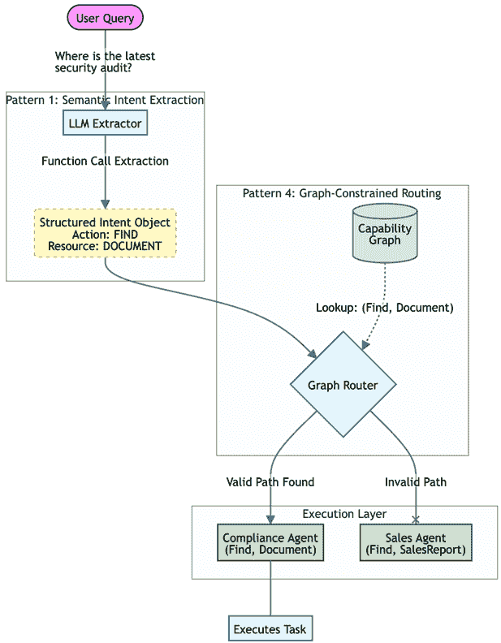

图 5.1 – 代理路由器模式

## 示例实现

以下 Python 示例实现展示了**代理路由器**的实际应用。此示例使用 Pydantic 定义严格的“词汇”，这是一组系统理解的允许动作和资源。

逻辑分为两部分：首先，我们建立`RoutingIntent`模式，它作为用户请求和代理之间的合同。其次，我们构建`AgentRouter`类，它维护一个能力图。此图作为事实来源，将特定的动作-资源对映射到最适合该任务的特定代理。在生产环境中，将使用 LLM 从用户的自然语言输入中提取这些结构化意图，然后再将它们传递给此路由逻辑。

```py
from pydantic import BaseModel
from typing import Literal, List, Tuple
# 1\. Define the "Vocabulary" of the system
ActionType = Literal["find", "analyze", "create"]
ResourceType = Literal["sales_report", "server_log", "document"]

class RoutingIntent(BaseModel):
    action: ActionType
    resource: ResourceType
    parameters: dict
class AgentRouter:
    def __init__(self):
        # The Capability Graph: Maps (Action, Resource) -> Agent Name
self.capability_graph = {
            ("find", "sales_report"): "SalesAgent",
            ("analyze", "sales_report"): "SalesAgent",
            ("find", "document"): "ComplianceAgent",
            ("create", "server_log"): "DevOpsAgent"
        }

    def route_request(self, intent: RoutingIntent):
        # 1\. Lookup the capability in the graph
        key = (intent.action, intent.resource)

        target_agent_name = self.capability_graph.get(key)

        # 2\. Safety Check: If no link exists in the graph, block the request
if not target_agent_name:
            return f"Error: No agent exists that can '{intent.action}' a '{intent.resource}'."
# 3\. Dispatch (Simplified)
return self.dispatch_to_agent(target_agent_name, intent.parameters)

    def dispatch_to_agent(self, agent_name, params):
        print(f"Routing to {agent_name} with params: {params}")
        # In real code, this would instantiate the agent class and call .run()
return "Success"
```

## 后果

+   **优点**：

    +   **解耦**：提取层不需要知道代理名称，代理也不需要解析自然语言。它们通过结构化的“意图对象”进行通信。

    +   **可扩展性**：要添加新代理，您只需在图中注册其能力。路由逻辑保持不变。

    +   **安全性**：图充当白名单。路由器实际上无法向代理发送“删除数据库”命令，除非该特定链接在图中明确定义。

+   **缺点**：

    +   **延迟**：意图提取步骤需要 LLM 调用，这会在任何实际工作开始之前增加延迟。

    +   **模式** **刚性**：如果用户请求的内容不符合预定义的 `Action`/`Resource` 枚举，提取可能会失败或降级。

## 实施指南

***Agent Router*** 的成功在很大程度上依赖于您模式定义的质量。在定义 idx_1b599c7a 动作（动词）和资源（名词）时，追求一个“金发姑娘”级别的抽象度。如果它们过于细化（例如，`FindPDF`，`FindWordDoc`），路由图会变得庞大且难以维护。如果它们过于宽泛（例如，`DoWork`），路由器将失去有效区分代理的能力。对于大多数企业系统来说，一组 10-20 个规范的动作和资源通常就足够了。

对于语义意图提取步骤，在 LLM 中利用函数调用（或工具使用）模式比简单的提示工程更推荐。函数调用强制执行严格的 JSON 输出结构，消除了与自由文本响应常见的解析错误。

最后，考虑在路由层实现语义缓存。在企业环境中，用户经常提出类似的问题（例如，“给我展示销售报告”）。通过嵌入用户的查询并检查向量数据库中的先前类似请求，您可以完全绕过 LLM 提取步骤，对于重复查询，这可以显著降低延迟和成本。

你将面临的第一 idx_59aceac3 个也是最重要的决定是确定你系统的控制结构。正如人类组织需要一个明确的管理风格，无论是层级还是扁平，你的代理系统需要一个定义明确的模型来分配工作。这把我们带到了 ***任务委派框架***，这些是“操作系统”，它们控制流程和责任。

# 任务委派框架

多代理系统需要一个高级结构来管理任务的启动、分配给代理以及如何跟踪到完成。没有明确的框架，可能难以管理复杂的流程，确保任务被路由到正确的专家，并保持整体系统的一致性。

核心挑战在于定义工作如何在系统中流动的总体模型：任务如何分配，谁对进度负责，以及如何确保最终目标。依赖临时的委派往往会导致任务丢失，责任不明确，以及难以调试或扩展的架构。

***任务委派*** 模式通过建立决定代理如何组织以及如何接收工作的架构模型来应对这一挑战。它不仅仅是一个个体交互的模式，它还作为系统的“操作系统”，塑造控制流和通信。选择正确的框架是设计多代理系统时最重要的早期决策之一，因为它为端到端的工作管理奠定了基础。

不同的框架带来不同的权衡。分层框架提供了清晰的权力线，更容易监控，因此在审计性和可预测性至关重要的企业应用中是一个常见的选择。相比之下，去中心化框架提供了更大的灵活性和弹性，更适合创意或高度动态的领域，在这些领域中，解决方案的路径无法预先定义。任务委派的最常见两种方法分别是**监督架构**（**Supervisor Architecture**）和**Swarm Architecture**。

## 监督架构（集中式协调）

**监督架构**（**Supervisor Architecture**）是一种针对**多智能体系统**（**multi-agent systems**）的核心模式，其中单个中心**协调器**（**orchestrator**）智能体负责管理和**直接**（**directs**）其他专业“工作者”智能体的工作流程。这种模型反映了传统的分层管理结构，其中协调器接收一个高级目标，将其分解为一系列子任务，并将它们委派给适当的工人。这种模式提供了清晰的、自上而下的控制，非常适合结构化、可预测的业务流程。

这种模式代表了一种确保企业应用中系统化、可审计和可重复的**过程**（**process**）的基础方法。它将管理复杂工作流程的负担从用户转移到自主人工智能系统，同时仍然保持一个中央控制点和监督点。

### 背景

一个复杂的**任务**（**task**）需要执行多个步骤，通常是顺序的或条件性的。系统需要确保过程正确执行，具有清晰的指挥链和责任链。

### 问题

如何使一个**多智能体系统**（**multi-agent system**）可靠且可预测地执行一个需要多个步骤和专门能力的复杂任务？系统必须管理数据流并控制操作顺序，而无需持续的人类干预。问题空间中的力量包括以下方面：

+   **可预测性与灵活性**：结构化工作流程是可预测且易于管理的，但它可能缺乏适应意外情况的灵活性。

+   **集中化与瓶颈**：集中化控制简化了治理和调试，但可能创建一个单一故障点和性能瓶颈。

+   **专业化与协调开销**：使用专业智能体可以提高单个任务的效率，但会增加管理其交接和整体协调的复杂性。

### 解决方案

***Supervisor Architecture***模式通过指派单个代理处理所有协调来解决此问题。编排器的主要功能是解释用户的请求，制定计划（无论是预编程的还是动态生成的），然后根据需要调用工人代理。编排器接收每个工人代理的输出，并使用它来决定下一步，确保以受控和深思熟虑的方式实现整体目标。

### 示例：集中贷款处理

用户 idx_c7f1cfef 向`LoanOrchestratorAgent`提交贷款申请。以下是工作流程：

1.  **编排（****监督者的** **r****ole）**：编排器接收高级任务：“处理这个贷款申请。”

1.  **委派**：编排器将应用程序发送到`DocumentValidationAgent`。

1.  **执行**：`DocumentValidationAgent`执行其任务并将结果返回给编排器。

1.  **条件** **d****elegation**：根据结果（例如，文档有效），编排器然后将下一步委托给`CreditCheckAgent`。

1.  **完成**：编排器从`RiskAssessmentAgent`接收最终风险评分，组装摘要并做出最终决定，完成顶级任务。

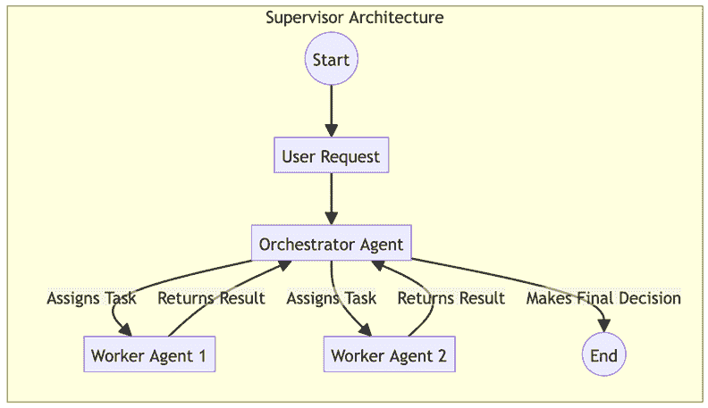

图 5.2 – Supervisor Architecture 工作流程

### 示例实现

以下 idx_6abc6cd5 代码展示了应用于企业贷款审批流程的***Supervisor***架构。在这个第 4 级实现中，`LoanOrchestratorAgent`作为中央权威，管理整个工作流程的状态和顺序。请注意，编排器本身不执行验证或信用检查；相反，它维护一支专业的工人代理团队。这种关注点的分离使得监督者可以专注于高级业务逻辑和条件分支，例如，如果文档无效，则决定停止流程，而专业的代理处理个别任务的执行。这种结构为高度监管的金融环境提供了可预测性和清晰的审计轨迹。

```py
class LoanOrchestratorAgent:
    def __init__(self):
        self.doc_validator = DocumentValidationAgent()
        self.credit_checker = CreditCheckAgent()
        self.risk_assessor = RiskAssessmentAgent()

    def handle_loan_application(self, application_data):

        # Step 1: Delegate document validation
        validation_result = self.doc_validator.validate(application_data)

        if validation_result != "valid":
            return "Application Rejected: Invalid Documents"
# Step 2: Delegate credit check
        credit_report = self.credit_checker.check(application_data.applicant_id)

        if credit_report.score < 600:
            return "Application Rejected: Low Credit Score"
# Step 3: Delegate risk assessment
        risk_assessment = self.risk_assessor.assess(application_data, credit_report)

        # Step 4: Assemble final result and make decision
        final_decision = self.make_final_decision(risk_assessment)

        return final_decision
```

### 后果

+   **优点**：

    +   **可预测性**：Supervisor 模型提供了一个清晰、可预测的流程，使得 idx_874dc0b9it 简单易监控、调试和审计

    +   **治理**：集中控制简化了业务规则和合规要求的执行

+   **缺点**：

    +   **可扩展性**：随着系统规模的扩大，单个编排器可能会成为性能瓶颈

    +   **单点故障**：如果编排器失败，整个工作流程将停止

### 实施指南

在实现**管理者架构**时，最重要的设计原则是保持严格的关注点分离，以避免创建一个“全能代理”。协调器应仅负责协调，即路由任务、跟踪状态和根据结果做出决策，而不是执行特定领域的逻辑。所有实质性工作都应封装在专门的工人代理中。这使协调器保持轻量级，并防止逻辑变得混乱、难以管理。

在这个集中式模型中，可靠性依赖于稳健的状态管理。因为管理者是一个单点故障，系统必须在每个工作流程步骤之后实施状态持久化，通常称为“检查点”。LangGraph 等框架专门为此目的而设计，允许系统将图状态持久化到数据库中。这确保了如果协调器或底层基础设施失败，工作流程可以精确地从上次停止的地方恢复，而不会丢失数据。

最后，管理者与其工人之间的通信必须是确定的。依赖自由形式的自然语言进行交接是不稳定的。相反，应强制执行严格的输出模式（使用 Pydantic 或 JSON 模式等工具），以便协调器接收可以程序化解析的结构化数据。此外，管理者应作为故障的中心处理者；如果工人失败或挂起，管理者必须具备重试操作、将其路由到备用代理或优雅失败的逻辑，以保护更广泛的系统免受单个代理错误的影响。

虽然集中式的**管理者****架构**在可管理和可审计性方面表现出色，但它并不是万能的解决方案。在环境不可预测或系统必须承受单个组件的故障而不会停止的情况下，严格的层次结构可能成为一种负担。为了实现真正的鲁棒性和适应性，我们必须探索光谱的另一端：一种控制分布在同伴之间的分布式方法。

## 群体架构（自涌现的分布式协调）

在**群体架构**中，没有中央领导者。相反，代理作为对等网络运行，以自涌现、自组织的模式协作解决问题。一项任务通常被广播到整个专门的代理组，然后根据他们的能力“投标”或自我选择任务。工作流程从代理之间的交互中产生，而不是由中央管理者明确指定。

这种模式特别适合创造性任务、动态问题解决和需要高弹性的环境。它利用代理的集体智慧，使系统能够实时适应和进化。

### 环境

一个复杂的 idx_ac6268f2 任务是动态的和非结构化的，或者系统需要高度适应变化，单个故障点是不可接受的，而问题解决过程更适合并行、自主的行动，而不是僵化的、顺序的流程。

### 问题

如何让一群自主代理在没有中央协调者的情况下有效地协作以实现共同目标？系统需要一个机制来以去中心化和弹性的方式发现任务、移交和完成。问题空间中的力量包括以下内容：

+   **自主性** **与** **协调**：最大化代理的自主性可以提高弹性和适应性，但 idx_cbdc5ac0a 缺乏明确的协调可能导致重复工作或目标不一致。

+   **可扩展性** **与** **开销**：去中心化网络可以水平扩展而不出现瓶颈，但这需要一个高效的通信协议来管理代理间的交流。

+   **涌现** **行为** **与** **可预测性**：群集的自组织特性可以导致高度创造性和适应性解决方案，但最终结果可能不太可预测，更难调试。

### 解决方案

群集架构模式通常依赖于共享的通信或任务板。任务被发布，任何 idx_c7b437b8 代理都可以在他们准备好工作时从板上“拉取”任务。一旦代理完成其部分，它就会在板上更新任务的状态，使其对工作流程中的下一个专业代理可用。这允许异步、并行处理，并消除了对单一控制点的依赖。

### 示例：去中心化内容创作

一个关于“撰写关于太阳能的 idx_fd4fb711a 博客文章”的任务被发送到一个代理群。以下是工作流程：

1.  **任务** **广播**：任务被发布在一个共享的任务板上。

1.  **自我选择**：一个`ResearchAgent`检查板，识别任务的状态（`new`），并自行选择它。

1.  **执行** **和** **更新**：`ResearchAgent`收集事实，将发现更新到任务中，并将状态更改为`researched`。

1.  **移交**：一个`DraftingAgent`看到“已研究”状态，提取任务，撰写草案，并将状态更新为`drafted`。

1.  **完成**：一个`EditorAgent`进行最终校对，并将任务标记为`complete```。

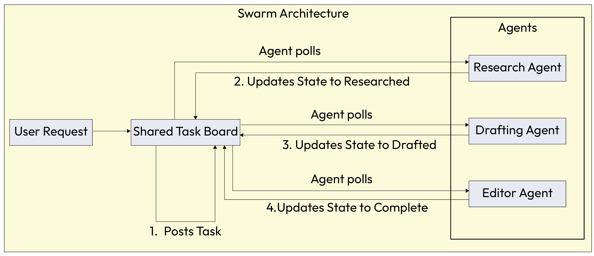

图 5.3 – 群集架构工作流程

### 示例实现

以下示例实现演示了一个***群集架构***，突出了从 idx_91a2ef36 自上而下的命令到第 6 级涌现的、去中心化协调的转变。在这个模型中，代理作为网络中的对等体操作，利用`shared_task_board`来管理项目的生命周期。

与由主管指导不同，每个代理，例如`ResearchAgent`或`DraftingAgent`，独立监控任务板的状态。当代理识别到与其专业能力相匹配的任务状态时，它会“认领”这项工作，执行其逻辑，并更新共享状态。这种解耦的、基于拉的交互模型使得系统在流程自然通过本地代理决策而不是静态、预编程计划演变时，能够保持高度弹性和灵活。

```py
class ResearchAgent:
    def check_for_tasks(self, shared_task_board):
        task = shared_task_board.get("task_id_123")
        if task.status == "new":
            facts = self.gather_facts(task.topic)
            task.data["research"] = facts
            task.status = "researched" # Update status for next agent
print("ResearchAgent completed work.")

class DraftingAgent:
    def check_for_tasks(self, shared_task_board):
        task = shared_task_board.get("task_id_123")
        if task.status == "researched":
            draft = self.write_draft(task.data["research"])
            task.data["draft_content"] = draft
            task.status = "drafted" # Update status for next agent
print("DraftingAgent completed work.")

class EditorAgent:
    def check_for_tasks(self, shared_task_board):
        task = shared_task_board.get("task_id_123")
        if task.status == "drafted":
            final_text = self.proofread(task.data["draft_content"])
            task.data["final_text"] = final_text
            task.status = "complete"
print("EditorAgent completed work.")
```

### 后果

+   **优点**：

    +   **弹性**：缺乏中央控制器意味着没有单点故障。即使某些代理离线，系统仍可继续运行。

    +   **可扩展性**：对等性质允许系统通过简单地向蜂群添加更多代理来实现水平扩展。

+   **缺点**：

    +   **可调试性**：任务的非线性流动可能导致系统行为难以调试和预测。

    +   **治理**：在没有中央权威的情况下，执行业务规则或确保合规可能具有挑战性。

### 实施指南

设计多代理系统时，一个好的起点是采用集中式方法。对于大多数企业应用，**主管架构**更容易构建、调试和治理，因为它提供了清晰的职责线和监控的中心点。

然而，一些应用可能随着时间的推移从去中心化中受益。**蜂群架构**系统对故障具有更强的抵抗力和对变化条件的适应性，使它们非常适合需要代理自主权的动态环境。在实践中，许多复杂系统采用混合模型。顶级协调器管理整体业务流程，但将大型子目标委派给自我组织的“蜂群”或“船员”代理，这些代理之间自行处理执行细节。这种平衡结合了中央控制的清晰性和分布式决策的适应性。

下表提供了这两种主要模型特性的直接比较。

| **特性** | **主管架构（集中式）** | **蜂群架构（去中心化）** |
| --- | --- | --- |
| **控制流程** | 层次化：单个协调器将任务委派给工作代理。 | 对等：代理自行选择或将任务传递给其他代理。 |
| **协调** | 显式和自上而下：主管管理工作流程。 | 自发和自下而上：协调源于本地交互。 |
| **模块化** | 高：在主管下可以轻松添加或替换专业代理。 | 高：代理是自主的，可以从蜂群中添加或删除。 |
| **主要好处** | 可预测性和清晰的监督。更容易调试和治理。 | 弹性和适应性。没有单点故障。 |
| **关键** **d****rawback** | 监督者可能成为性能瓶颈或单一故障点。 | 可能难以治理和调试。整体行为可能不太可预测。 |
| **最佳** **f****or** | 结构化业务流程，具有明确步骤的工作流程（例如，贷款处理）。 | 创造性任务，动态问题解决，需要高弹性的环境。 |

表 5.2 – 任务委派架构比较

在 idx_16076439a 集中式***监督者***和分布式***S******warm***之间做出选择，为你的代理建立了高级的“操作系统”；它定义了权力的流动。然而，现实世界的问题通常需要更具体的结构安排来有效地管理和交互数据。

例如，如何处理解决方案必须逐步演变的问题？或者，当能力波动时，如何找到最适合任务的代理？为了解决这些特定挑战，我们转向***代理组成拓扑***。这些架构模式定义了代理之间的结构关系。

# 代理组成拓扑

当前的 idx_1e08cedddelegation 框架定义了通用的“参与规则”（集中式与分布式），而具体的组成拓扑则更详细地描述了代理和数据在结构上的排列。这些模式解决了与知识收敛、基于市场的任务分配和容错性相关的特定挑战。

## 黑板知识中心

在复杂的 idx_44b76688 问题解决 idx_054e8636 场景中，多个专业代理必须向正在形成的解决方案贡献部分或不确定的事实。随着新信息的到来，任务会动态演变，需要支持向解决方案收敛的系统以及严格的信息来源。

### 背景

该系统 idx_8333f3fe 涉及定义不明确或复杂的问题，其中没有任何单个代理拥有解决整个问题的所有必要知识。解决方案需要从各种“专家”的增量贡献，而这些专家的贡献顺序不能完全预先确定。

### 问题

如何在 idx_ea5eb1c3 多个独立的代理之间协作，以形成一个正在发展的解决方案，而不需要直接、紧密耦合的通信渠道，这些渠道在规模扩大时将变得难以管理？问题空间中的力量包括以下方面：

+   **共享** **u****nderstanding v****ersu****s** **r****ace** **c****onditions**：代理需要有一个统一的关于问题 idx_f7ba5def 状态的观点，但同时更新可能导致冲突。

+   **Openness to** **c****ontributions v****ersu****s** **q****uality** **c****ontrol**：系统需要接受来自各种专家的贡献，但必须过滤掉低质量或幻觉数据。

+   **全局** **c****onsistency v****ersu****s** **a****gent** **a****utonomy**：代理需要独立行动，但最终解决方案必须全局一致。

### 解决方案

***黑板知识库***模式实现了一个中央存储库，即黑板，它持有类型化、版本化的“事实”和“假设”。知识源（代理）不直接通信；相反，它们将更新发布到黑板。一个控制器仲裁过程阶段（发布→评估→整合），确保贡献得到验证，并且解决方案逻辑上收敛。

### 示例：协同医疗诊断

一位患者出现复杂、模糊的症状。以下是工作流程：

1.  **发布**：`SymptomAnalysisAgent`将`Patient has fever and rash`发布到黑板。

1.  **触发条件**：看到“皮疹”，`DermatologyAgent`被触发，分析图像，并发布`Rash indicates potential viral infection (Confidence: 0.8)`。

1.  **细化**：`VirologyAgent`读取这个假设，并发布一个请求`Blood Test Results`。

1.  **收敛**：控制器评估集体事实，直到`DiagnosisAgent`以足够的置信度综合出最终诊断。

### 示例实现

以下代码提供了***黑板知识库***模式的基石实现。这种架构专门设计用于复杂、非线性问题，如医疗诊断或欺诈检测，解决方案通过多个专业专家的增量贡献而产生。

在这个实现中，`Blackboard`类充当一个集中式、线程安全的“事实”和“假设”存储库。请注意，代理之间不直接通信；相反，它们将带有相关置信度和时间戳的发现“发布”到黑板上。这种结构允许一个单独的控制器仲裁问题解决过程，确保系统向全局一致解收敛，同时在黑板的历史中保持完整的、可审计的“思维链”。

```py
class Blackboard:
    def __init__(self):
        self.facts = []

    def post_hypothesis(self, agent_id, hypothesis, confidence):
        entry = {"agent": agent_id, "data": hypothesis, "conf": confidence, "timestamp": now()}
        self.facts.append(entry)
        return entry

class Controller:
    def run_cycle(self, problem_state):
        # 1\. Selection: Determine which agents can contribute to current state
        eligible_agents = self.select_knowledge_sources(problem_state)

        # 2\. Execution: Agents write to blackboard
for agent in eligible_agents:
            hypothesis = agent.generate_hypothesis(problem_state)
            self.blackboard.post_hypothesis(agent.id, hypothesis)

        # 3\. Evaluation: Validator checks for convergence or conflicts
if self.validator.check_convergence(self.blackboard.facts):
            return self.validator.synthesize_solution()
```

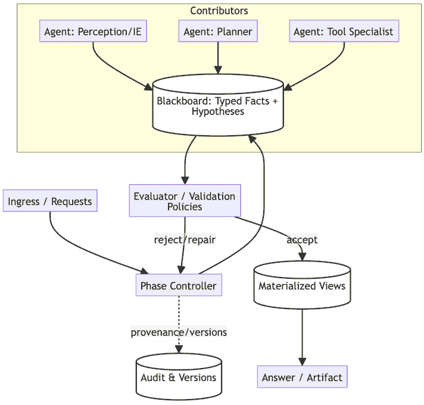

图 5.4 – 黑板拓扑

### 后果

+   **优点**:

    +   **灵活性**：非常适合不明确的问题，前进路径不明确，需要迭代贡献

    +   **可审计性**：只读日志提供了解决方案演变的清晰历史，这对于解释系统的“思维链”至关重要

+   **缺点**:

    +   **延迟**：中央写入和评估步骤引入了延迟，使其比直接消息传递慢

    +   **瓶颈**：如果黑板没有正确分片或索引，控制器可能会成为吞吐量瓶颈

### 实现指南

这种模式最适合当你有大量“弱”专家（专业但有限的代理）或当有对可追溯收敛的迫切需求时。然而，避免在低延迟、简单的工具任务中使用它，因为管理黑板状态的开销超过了其好处。为了保持卫生，实施“清理策略”或“遗忘机制”来修剪旧或无效的事实；否则，黑板可能会变成一个嘈杂的草稿本，降低代理性能。

**黑板**模式关注的是一群代理如何通过共享知识状态逐步收敛到解决方案。然而，当主要挑战从“如何解决问题”转变为在波动池中的专家中“谁最适合处理特定任务”时，我们就从中心知识中心转向了动态、市场驱动的做法：**合同网市场**。

## 合同网市场（调解员 + 投标）

一个系统面临各种复杂性和领域广泛的任务。可用的能力是异构和动态的；代理可能会上线或离线，或者它们的负载可能会变化。你需要运行时选择最佳匹配的代理，而不是硬编码分配。

### 上下文

你在一个分布式环境中操作，拥有多样化的代理池。这些代理的能力重叠，但它们的可用性、成本和性能特征动态变化。静态路由逻辑是脆弱且低效的，因为它无法考虑实时负载或特定任务的细微差别。

### 问题

当最佳选择取决于动态因素，如可用性、成本和信心，这些只有在运行时才知道时，如何将任务分配给最合适的代理？问题空间中的力量包括以下内容：

+   **专业化与路由开销**：你想要高度专业化的代理，但手动将任务路由到它们是复杂的

+   **竞争性投标与协调成本**：投标确保最佳代理获得任务，但拍卖过程需要时间和计算资源

+   **探索与服务水平协议（SLA）**：你想要探索最佳选项，同时不错过执行截止日期。

### 解决方案

实施一个**合同网协议**，一种基于市场的谈判机制。一个律师（或经理）向潜在工作者广播任务公告。投标人（代理）评估公告并正式投标，包含他们的能力、成本、预计到达时间（ETA）和信心分数。然后律师作为颁奖者，将任务分配给效用分数最高的代理。

### 示例：选择云提供商代理

一个用户想要训练一个大模型，但预算很严格。以下是工作流程。

1.  **公告**：`TrainingSolicitor` 广播：“任务：训练模型 X。约束：最大成本 $100。”`

1.  **出价**：

    1.  `AWS_Agent` 报价：`$90，预计时间 2 小时`。

    1.  `Azure_Agent` 报价：`$85，预计时间 2.5 小时`。

    1.  `OnPrem_Agent` 报价：`$10，预计时间 12 小时`。

1.  **奖励**：请求者权衡时间和金钱，将合同授予 `AWS_Agent` 以获得最佳平衡。

### 示例实现

以下示例实现说明了 ***合同网市场*** 模式，突出展示了 idx_627c0871 如何使第 6 级系统超越硬编码逻辑，转向动态、市场驱动的任务分配模型。

代码定义了两个主要角色：`Solicitor`，负责管理拍卖过程，以及 `BidderAgent`，代表一个专业资源。通过广播公告并基于效用函数评估传入的报价，例如平衡模型置信度与计算成本，系统确保每个任务都由最适合当时特定要求的代理处理。这种去中心化的谈判使系统高度适应企业环境，其中代理的可用性和 API 成本实时波动。

```py
class Solicitor:
    def request_task_fulfillment(self, task):
        # 1\. Announce task to all available subscribers
        bids = self.broadcast_announcement(task)

        # 2\. Evaluate bids based on utility function (Confidence vs Cost)
        best_bid = self.evaluate_bids(bids)

        if best_bid:
            # 3\. Award contract
            result = best_bid.agent.execute_contract(task)
            return result
        else:
            raise NoBidsException()

class BidderAgent:
    def receive_announcement(self, task):
        if not self.can_handle(task):
            return None # Refusal
# Calculate cost and confidence
        cost = self.estimate_compute_cost(task)
        confidence = self.assess_capability(task)

        return Bid(agent=self, cost=cost, confidence=confidence)
```

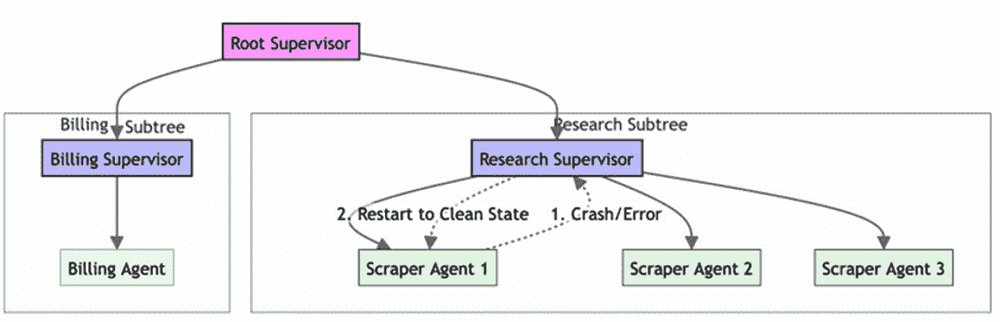

图 5.5 – 合同网协议

### 后果

+   **优点**：

    +   **自适应选择**：系统无需代码更改即可动态适应代理可用性和功能的变化

    +   **高利用率**：将请求者与提供者解耦，确保工作流向最适合该任务的代理

+   **缺点**：

    +   **拍卖延迟**：谈判过程在开始工作之前引入了开销

    +   **游戏风险**：如果没有对真实出价的激励，代理可能会夸大其信心以赢得任务

### 实施指南

当你有一个大型的、可变工具集，或者当优化动态因素，如 idx_c6fbe02das 成本或速度时，请使用此模式。然而，对于固定、可预测的工作流程，静态路由（如意图感知路由）更简单、更快，因此应避免使用此模式。为了防止无限等待，请求者必须对收到报价的截止日期进行严格规定。此外，考虑为出价者实施“声誉评分”，以惩罚那些赢得合同但未能提供优质结果的代理。

基于市场的分配在优化动态环境中效率和高成本方面是理想的，其中多个专家可用。然而，在企业系统中，代理执行高风险或危险操作时，效率必须与绝对稳定性和容错性相平衡。这使我们想到了从高度可用的分布式系统领域借用的一种模式，即 ***带有受保护功能的监督树***。

## 带有受保护功能的监督树

**带有受保护能力的监督树*** 是一种旨在包含 idx_2d6952d0 故障并强制执行多代理系统中的安全边界的架构模式。它不是允许单个代理的错误传播并使整个应用程序崩溃，而是将代理组织成一个层次树，其中监督者负责监控其下属的健康和行为。它结合了“让它崩溃”的“演员模型”哲学和严格的权限保护，确保代理只能访问其特定角色所需的特定工具，同时提供了一个结构化的自动恢复和自我修复机制。

### 上下文

这种模式 idx_e74aca6dis 来自于演员模型（在 Erlang 和 Akka 系统中闻名）并将其应用于代理人工智能。在许多代理执行自主、可能存在风险的工具调用（如执行生成的代码、抓取网页或与不稳定的外部 API 交互）的系统中，这一点至关重要。

### 问题

如何在不会使整个应用程序崩溃的同时，允许自主代理有足够的自由操作来控制来自自主代理的故障？问题空间中的力量包括以下方面：

+   **安全 vs. 速度**：我们希望代理能够自主且快速地行动，但一个子代理中未处理的 idx_8e112486 异常可能会向上传播并杀死主协调器

+   **隔离 vs. 协调**：代理需要共享数据以进行协作，但如果它们直接共享内存，一个代理中的损坏状态可能会感染其他代理

+   **开发者敏捷性 vs. 政策执行**：开发者需要快速添加新功能，但授予每个代理完整的系统访问权限违反了最小权限原则

### 解决方案

实现 idx_453745e3a **监督树**，其中代理按层次组织。监督者是专门负责管理其子代（工作代理）生命周期的代理。如果一个子代崩溃或违反了政策，监督者会检测到故障并应用恢复策略（例如，重新启动子代）。权限 idx_39121ab7 按子树授予，确保“研究”分支无法访问“账单”工具。

### 示例：弹性网页抓取器

1.  **Spawn**：`Root Supervisor` 生成一个 `ResearchSupervisor`，该 `ResearchSupervisor` 生成三个 `ScraperAgents`。

1.  **故障**：一个 `ScraperAgent` 遇到 idx_1ca4a2a4a 阻塞验证码并抛出致命错误（或陷入循环）。

1.  **检测**：`ResearchSupervisor` 检测到崩溃信号。

1.  **恢复**：遵循“一对一”策略，监督者仅重新启动具有新鲜状态的失败的 `ScraperAgent`，而其他代理继续运行。故障被控制住了。

### 示例实现

以下示例代码说明了 ***带有守卫能力的监督树*** 模式，重点关注系统如何隔离风险和自动化恢复。在此实现中，`SupervisorAgent` 作为生命周期管理器，明确地为每个工作代理定义边界。通过在初始化时仅向子代理提供有限工具集，系统确保一个分支的妥协或失败不会暴露另一个分支中的敏感能力。这种结构，加上定义的恢复策略，例如 "`ONE_FOR_ONE`"，即使在处理不可预测的外部工具时，也允许系统保持弹性并自我修复。

```py
class SupervisorAgent:

    def __init__(self, strategy="ONE_FOR_ONE"):
        self.children = []
        self.strategy = strategy

    def spawn_child(self, agent_cls, tools):
        # Isolate capabilities by passing specific tools only to this child
        child = agent_cls(allowed_tools=tools)
        self.children.append(child)
        return child

    def monitor_loop(self):
        # Continuously check health of children
for child in self.children:
            if child.status == "CRASHED" or child.status == "POLICY_VIOLATION":
                self.handle_failure(child)

    def handle_failure(self, failed_agent):
        log_incident(failed_agent.id, failed_agent.error)

        if self.strategy == "ONE_FOR_ONE":
            print(f"Restarting agent {failed_agent.id} to clean state.")
            failed_agent.restart()
        elif self.strategy == "ESCALATE":
            # If the supervisor can't handle it, crash itself to signal up the tree
raise SupervisorFailureException(failed_agent)
```

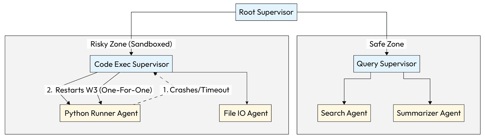

图 5.6 – 带有守卫能力的监督树

### 后果

+   **优点**：

    +   **高弹性**：自动 idx_04cb4236 错误恢复确保系统可以在没有人为干预的情况下自我修复

    +   **爆炸半径控制**：在风险分支（例如，网络爬虫）中的崩溃不会影响安全分支或根协调器

+   **缺点**：

    +   **复杂性**：增加架构编排；开发者必须从树和生命周期管理的角度思考

    +   **通信开销**：跨树通信需要明确的网关（邮箱），因为代理不能只是“抓取”来自兄弟节点的数据

### 实施指南

此模式对于使用不稳定工具（如网络浏览或代码执行）的生产系统至关重要。对于简单、单次使用的工具，避免使用深度监督树，因为设置开销 idx_ab58f748 主导了执行时间。在定义恢复策略时，确保您实现了“退避逻辑”。如果一个子代理在 1 秒内崩溃 5 次，停止重启它以防止“崩溃循环”消耗资源。始终强制子代理不能绕过其监督器直接与根通信。

建立拓扑结构为您的系统赋予形状，但仅仅形状本身并不能解决问题。一旦您的代理被组织起来，无论是在群体、层次结构还是市场中，他们需要一个过程来应对复杂的目标。他们需要查看高层次目标，例如“推出产品”，并找出实现它的步骤序列。这是多代理规划（Multi-Agent Planning）的领域，它是推动集体前进的认知引擎。

# 多代理规划

一旦建立了高级委派框架（例如，集中式监督者或去中心化群体），系统就需要一个具体的方法来应对复杂目标。单个高级目标，如“推出新产品”，不能由任何单个智能体直接执行。它需要一个深思熟虑的过程，将目标分解为一系列协调的、较小的动作，这些动作可以分配给专门的智能体。这就是**多智能体规划**模式的核心目的。它为系统提供了一个结构化的方法来分析复杂目标，并创建一个连贯、可执行的计划，智能地将工作负载分配给智能体团队。

## 背景

系统已经面临了一个过于庞大或复杂，以至于任何单个智能体都无法单独解决的问题。整体目标是明确的，但实现它的步骤和劳动分工并不明确。系统需要一个连贯的计划，利用其各种智能体的专业技能。

## 问题

如何让一组自主智能体协作创建和执行一个统一的计划以实现共同目标？没有共享的计划，智能体可能会执行重复的工作，以错误的顺序执行步骤，或者未能有效地结合他们的结果，导致效率低下或彻底失败。问题空间中的力量包括以下方面：

+   **分解**与**内聚**：将大型目标分解为较小的任务是必要的，但系统必须确保子任务保持内聚并有助于整体目标。

+   **专业化**与**协调**开销：使用专业化的智能体可以提高单个任务的效率，但增加了管理其交接和整体协调的复杂性。

+   **静态**与**动态**规划：预定义的计划是可预测的，但缺乏适应新信息或意外挑战的灵活性。

## 解决方案

**多智能体规划**模式通过建立一个机制来分解高级目标为图或一系列可管理的子任务，并将这些任务分配给最合适的智能体来解决这个问题。这个过程，通常被称为*协作*任务分解，通常由集中式框架中的协调器智能体处理。计划本身成为了一个共享的工件，指导集体的行为。

## 示例：市场分析报告生成

一个高级目标“为产品 X 生成全面的市场分析报告”被委派给使用**多智能体规划**的系统。协调器将这个目标分解为一系列子任务。

1.  `gather_sales_data`：分配给`DataRetrieverAgent`。

1.  `analyze_competitor_chatter`：分配给`SocialMediaMonitoringAgent`。

1.  `summarize_analyst_reports`：分配给`FinancialDocsAgent`。

1.  `synthesize_findings_and_draft_report`: 分配给 `ReportWriterAgent`。

这些子任务可以并行或顺序执行，由协调器或通过代理之间的直接通信来管理依赖。

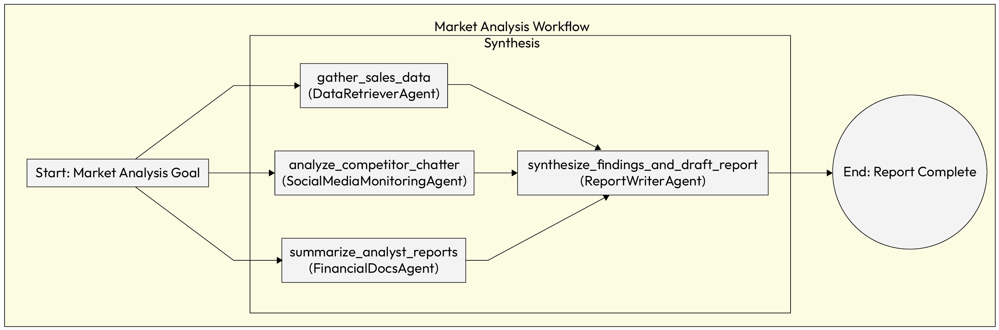

图 5.7 – 多代理规划工作流程

## 实施示例

以下示例实现展示了 ***多代理规划*** 模式，展示了如何将复杂的目标分解为可执行的子任务。在此场景中，`MarketAnalysisOrchestrator` 扮演主要规划者的角色，确定需要哪些专业代理来完成市场研究请求。

通过利用 `concurrent.futures` 库，协调器并行执行独立的数据收集任务，显著降低了工作流程的整体延迟。一旦从各个专家那里检索到基础数据，协调器通过将所有发现传递给报告编写者来管理最终依赖，确保最终输出的一致性和可靠性。

```py
import concurrent.futures

class MarketAnalysisOrchestrator:
    def __init__(self, data_retriever_agent, social_media_agent, financial_docs_agent, report_writer_agent):
        self.data_retriever = data_retriever_agent
        self.social_media = social_media_agent
        self.financial_docs = financial_docs_agent
        self.report_writer = report_writer_agent

    def generate_report(self, product_name):

        # 1\. Decompose the high-level goal into a plan
        plan = {
            "task1": {"agent": self.data_retriever, "input": product_name},
            "task2": {"agent": self.social_media, "input": product_name},
            "task3": {"agent": self.financial_docs, "input": product_name}
        }

        # 2\. Execute independent tasks in parallel
with concurrent.futures.ThreadPoolExecutor() as executor:
            future_to_task = {
                executor.submit(plan[key]["agent"].run, plan[key]["input"]): key
                for key in plan
            }

            results = {}

            for future in concurrent.futures.as_completed(future_to_task):
                task_name = future_to_task[future]
                try:
                    results[task_name] = future.result()
                except Exception as exc:
                    print(f'{task_name} generated an exception: {exc}')

        # 3\. Execute dependent tasks
        sales_data = results.get("task1")
        competitor_chatter = results.get("task2")
        analyst_summaries = results.get("task3")

        final_report = self.report_writer.run(
            sales_data, competitor_chatter, analyst_summaries
        )

        return final_report
```

## 后果

+   **赞成**:

    +   **效率**: 此 idx_43582a3c 模式通过利用代理专业化和并行执行来解决复杂问题，从而提高效率和能力

    +   **利用** **专** **业化**: 通过将任务分配给专业代理，系统可以实现比单个通用代理更高的质量结果

+   **反对**:

    +   **协调** **开销**: idx_4f93b717 规划过程本身消耗资源，如果设计不当，可能会成为瓶颈

    +   **风险** **of** **僵化**: 一个静态的计划如果环境发生变化或子任务失败，可能会失败

## 实施指南

为了减轻僵化和协调开销的风险，计划应保持灵活性，而不是 idx_0a0e1ef7 静态。系统必须能够根据新信息或失败的子任务调整计划。明确定义子任务之间的依赖关系对于确保顺利交接和防止执行错误至关重要。

现在我们已经探讨了编排多代理系统和分解复杂问题的蓝图，下一步合乎逻辑的步骤是了解这些代理如何交换信息。***知识共享*** 模式为代理之间如何交流以共享数据、协调行动和管理依赖提供了基础原则。

# 知识共享

一旦多代理系统有一个连贯的计划，每个代理的执行质量在很大程度上取决于它所拥有的知识。如果代理在信息孤岛中运作，整个系统就无法从个别代理随着时间的推移获得的独特见解和学习中受益。**知识共享** **模式** 直接解决这一挑战，提供了一种创建集体智慧并确保一个代理发现的有价值信息可以被所有代理访问的机制，使整个系统更加有效和适应。

## 背景

在多代理系统中，个别代理通常通过他们的经验获得有价值的信息或学习新技能。例如，一个代理可能学会了查询特定数据库的最有效方法，而另一个代理可能学会了识别一种新的客户投诉类型。如果没有共享机制，这种知识将保留在个别代理的孤岛中。

## 问题

如何将一个代理获得的有价值知识或经验与其他系统中的代理共享，以提高群体的集体智慧？如果没有共享机制，每个代理都必须独立学习一切，这既低效又导致系统整体能力低于其各部分之和。问题空间中的力量包括以下方面：

+   **孤岛化** **知识** **与** **集体** **智慧**：虽然将知识保留在单个代理处更容易，但这样做会阻止整个系统随着时间的推移学习和改进

+   **编写** **与** **检索** **努力** **的** **简便性**：系统需要一种简单的方法让代理将新知识写入共享存储库，但存储库也必须结构化，以便其他代理能够高效且准确地检索

+   **知识** **传播** **与** **完整性**：广泛分享知识可以加速问题解决，但也伴随着传播错误或过时信息的风险

## 解决方案

**知识共享** **模式** 实现了一个 **共享认知记忆**，这是一个全局的、持久的 **数据存储**，所有代理都可以从中读取和写入。这种共享记忆，可以是简单的知识图谱、向量数据库或其他形式的持久存储，超越了简单的消息传递。它创建了一个集中的知识库，使整个系统能够从其个别成员的经验中学习，防止理解碎片化和语义漂移。

## 示例：共享的客户服务解决方案

为了说明**共享认知记忆**的实际影响，考虑一个在大规模客户支持环境中的场景。在这个例子中，系统超越了简单的反应式响应，建立了一个持续的知识库。通过允许代理向中心向量数据库贡献和查询，组织确保一个代理发现的解决方案立即成为整个集体的资产，减少重复的故障排除并提高解决复杂问题的速度。

1.  `Agent_A`发现`ProWidget X`上的`错误 503`问题可以通过让用户清除他们的设备缓存来持续解决。

1.  `Agent_A`将这个成功的解决方案写入共享向量数据库。

1.  几周后，`Agent_B`遇到了一个有类似问题的用户。它对共享知识库进行了语义搜索，并立即找到了`Agent_A`提供的解决方案，第一次尝试就解决了问题。

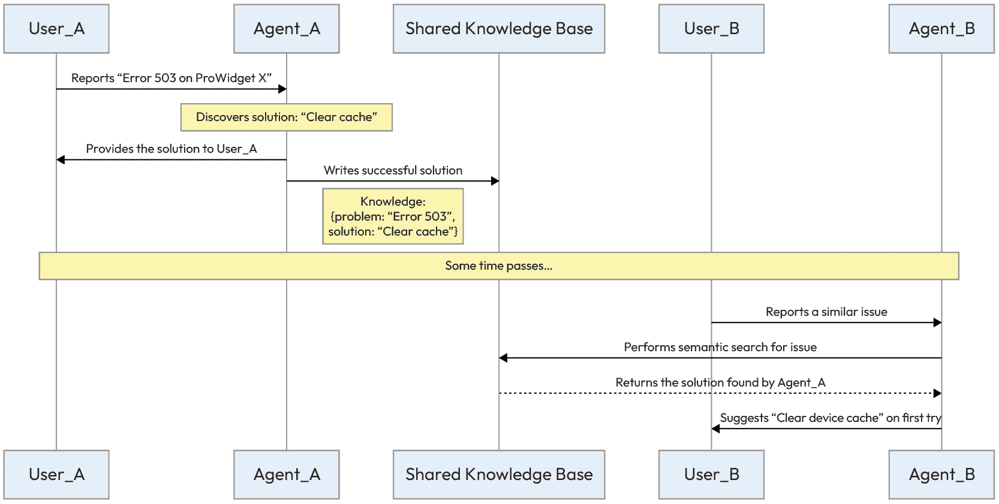

图 5.8 – 代理信息共享

这个序列说明了共享记忆如何使整个多代理系统能够随着时间的推移从其个别成员的经验中学习和改进。

## 示例实现

以下实现提供了一个具体了解代理如何与**共享认知记忆**交互的视角。在这个 Python 示例中，我们使用一个概念向量数据库作为机构知识的全局存储。代码演示了知识条目的生命周期，首先展示了`AgentA`如何识别一个成功的解决方案并将其提交到共享库，然后展示了`AgentB`如何在面对类似查询时执行语义搜索以检索该确切上下文。这种模式对于构建每次交互都变得更智能的系统至关重要，因为它防止了当知识在个体会话历史中隔离时发生的“健忘”。

```py
# Shared Knowledge Base (e.g., a Vector Database)
SHARED_KNOWLEDGE_BASE = VectorDatabase()

class AgentA:
    def handle_issue(self, user_query):
        if "Error 503 on ProWidget X" in user_query:
            solution = "Have the user clear their device's cache."
# ... solves the user's problem ...
# Write the successful solution to shared memory
            knowledge_entry = {
                "problem_description": "Error 503 on ProWidget X",
                "solution_steps": solution
            }

            SHARED_KNOWLEDGE_BASE.add_entry(knowledge_entry)

            print("AgentA learned and shared a new solution.")

class AgentB:
    def handle_issue(self, user_query):
        # Search the shared knowledge base for similar problems
        relevant_solutions = SHARED_KNOWLEDGE_BASE.semantic_search(user_query)

        if relevant_solutions:
            # Use the solution found by another agent
            solution = relevant_solutions[0].solution_steps
            print(f"AgentB found a solution from the knowledge base: {solution}")
            return solution
        else:
            # Handle the issue using its own logic
            ...
```

## 后果

+   **优点**：

    +   **集体** **智能**：最显著的好处是，系统比其各部分的总和更强大，因为它可以从所有代理的集体经验中持续学习。

    +   **效率**：代理可以通过利用现有的知识而不是每次都从头开始来解决重复性问题

+   **缺点**：

    +   **数据** **完整性**：存在传播错误或恶意信息的风险

    +   **治理** **开销**：需要一个系统来管理、验证和修剪知识库，以保持其准确性和可靠性

## 实现指南

要实现一个成功的知识共享架构，实践者必须关注几个基础原则，首先是知识表示。对于具体、客观的事实，系统应使用结构化格式，如 JSON，而在向量数据库中保留非结构化文本，以存储更细微、基于经验的知识。

除了简单的存储之外，维护知识来源至关重要，因为跟踪所有共享知识的来源允许架构师评估其可靠性，并在错误信息传播时更有效地调试系统。

最后，一个稳健的设计应包含信任和验证机制，这可能包括允许代理对其同伴贡献的信息进行评分或验证，甚至委托一个专门的“治理代理”定期审查和修剪知识库，以确保其持续准确和相关性。

一个精心设计的计划和共享的知识库为代理提供了做出明智决策所需的智能。然而，代理将决策转化为具体成果的能力通常取决于其与外部世界互动的能力。这正是工具，如 API、函数和数据库，发挥作用的地方。这引入了一个新的协调挑战：在一个有许多专业代理和工具的系统里，我们如何确保正确的代理为特定任务调用正确的工具？***多代理环境中的工具路由***模式通过提供一个框架来有效地管理和指导系统内工具的使用来解决这一问题。

# 多代理环境中的工具路由

虽然***知识共享***模式确保了代理能够访问最佳集体信息，但它们将知识转化为有效行动的能力通常取决于使用外部工具。

这引入了一个新的协调挑战：在一个有许多专业代理和工具的系统里，我们如何确保正确的代理调用正确的工具或为特定任务进行委托？***多代理环境中的工具路由***模式通过提供一个框架来有效地管理和指导系统内工具的使用来解决这一问题。

## 环境

多代理系统有权访问各种工具（API、函数、数据库），可用于执行操作。当任务需要特定能力时，系统必须决定哪个代理应该调用哪个工具。

## 问题

在一个有许多代理和工具的系统里，你如何确保为给定的子任务选择正确的工具，并由最合适的代理调用？代理的目标与其使用的工具之间的不匹配可能导致性能下降、结果错误或资源浪费。问题空间中的力量包括以下方面：

+   **Accuracy versus flexibility**: 严格的、硬编码的路由图确保已知 idx_c6966a11 任务的高准确性，但缺乏处理意外请求的灵活性。

+   **Centralization versus bottleneck**: 中央路由简化了路由逻辑，但可能成为高流量系统中的单点故障或性能瓶颈。

+   **Tool specialization versus tool discovery**: 代理从拥有一个小型、专用的工具集受益，但它们需要一种机制来发现新工具或外部工具，如果需要的话。

## 解决方案

**Tool Routing** 模式通过为每个代理或 idx_b47569dda 中央监督员提供只描述其相关工具的特定提示，提高了专注度并减少了决策疲劳。不是每个代理都能访问到每个工具，能力被限制。协调器或专门的路由代理负责将任务路由到最适合该工作的专用工具集的代理。这种方法确保代理在明确定义的能力范围内高效运行，从而带来更准确和可靠的工具调用。

## 示例：智能个人助理

考虑 idx_e649839ca 个人助理机器人，它需要处理从检查股价到预订航班的各种用户查询。

1.  **User request**: 用户询问，“谷歌当前的股价是多少？”

1.  **Classification**: 中央 `Router Agent` 分析意图并将请求分类为 `financial_query`。

1.  **Routing**: 根据这种分类，`Router Agent` 将任务委托给 `FinancialAgent`，它持有特定的市场数据 API 密钥和工具。

1.  **Specialized execution**: `FinancialAgent` 使用其 `get_stock_price` 工具来获取数据。

1.  **Completion**: 结果返回给用户，而 `WeatherAgent` 和 `TravelAgent` 保持未受干扰，防止它们产生错误的答案或误用工具。

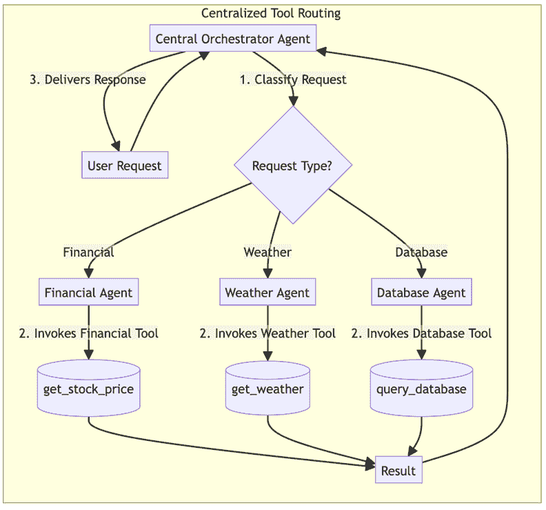

图 5.9 – 集中式工具路由示例实现

## 示例实现

一个 `CentralOrchestrator` 代理 idx_ca1650daroutes 将用户的请求根据请求的分类路由到正确的专业代理。

```py
class CentralOrchestrator:
    # This map defines which agent is responsible for which type of task
    AGENT_ROUTING_MAP = {
        "financial_query": "FinancialAgent",
        "weather_query": "WeatherAgent",
        "database_query": "DatabaseAgent"
    }

    def classify_request(self, user_request):
        # Uses an LLM to classify the request type
# For example, "What is the current stock price of Google?" -> "financial_query"
# Or, "What is the weather like in London today?" -> "weather_query"
return self.llm.classify(user_request)

    def handle_request(self, user_request):
        # 1\. Determine the type of request
        request_type = self.classify_request(user_request)

        # 2\. Find the correct agent from the routing map
        target_agent_name = self.AGENT_ROUTING_MAP.get(request_type)

        if target_agent_name:
            # 3\. Delegate the request to the specialized agent
print(f"Routing request to {target_agent_name}")
            target_agent = self.get_agent_instance(target_agent_name)
            result = target_agent.process(user_request)
            return result
        else:
            return "Sorry, I don't have an agent capable of handling that request."
class FinancialAgent:
    # This agent ONLY knows about financial tools
def process(self, request):
        # Uses its internal LLM to decide which of its specific tools to use
# e.g., self.llm.decide_tool(request, available_tools=[get_stock_price_tool])
        ...
class WeatherAgent:
    # This agent ONLY knows about weather tools
def process(self, request):
        # Uses its internal LLM to decide which of its specific tools to use
# e.g., self.llm.decide_tool(request, available_tools=[get_current_weather_tool])
        ...
```

## Consequences

+   **Pros**:

    +   **Higher accuracy**: 通过限制每个代理的工具选项，系统减少了 idx_319392dathe 错误工具调用的机会，从而带来更可靠的成果。

    +   **Focus**: 代理在其领域内变得高度专业化，提高了效率和性能。

+   **Cons**:

    +   **Rigidity**: 如果一个任务意外需要代理预定义集之外的工具，这种模式可能不够灵活。

    +   **Upfront design**: 需要仔细的前期设计和维护路由图或代理能力。

## 实施指导

对于拥有大量工具的系统，考虑创建一个代理可以查询的工具注册表。这比硬编码的工具-代理分配提供了更动态的路由。路由逻辑也可以委托给一个专门的由 LLM（大型语言模型）驱动的路由代理，该代理使用函数调用选择正确的代理及其相关工具，提供更大的灵活性。

确保正确的代理使用正确的工具是协调行动的关键步骤。然而，为了使该行动有效，它必须基于对环境的清晰和一致的理解。但当不同的代理对同一环境有不同的感知，导致数据冲突时会发生什么？系统需要一种方式来调和这些差异，并在采取行动之前就单一的真实版本达成一致。这就是**共识**模式解决的问题。

# 共识

在任何分布式系统中，实现共享视角是一个基本挑战。对于多代理系统，其中自主代理根据对世界的感知做出决策，这个挑战更为严峻。

**共识**模式提供了一系列协议，使一群代理能够就特定数据或系统的状态达成一致。这不仅仅是投票；它是一个结构化的沟通和收敛过程，确保系统能够从一个单一、可靠的观点运行，防止由于采取矛盾信息而产生的错误。

## 上下文

在分布式系统中，多个代理可能有权访问关于环境状态的不同的、不完整的或甚至相互冲突的**信息**。为了进行协调行动，代理必须首先就单一、共享的理解达成一致。

## 问题

如何让一群自主代理在存在噪声数据或轻微分歧的情况下，就特定值或状态达成保证的一致意见？如果没有共识机制，代理可能会根据矛盾的信息采取行动，导致系统级故障或低效。问题空间中的力量包括以下方面：

+   **一致性与个体准确性**：代理可能有高度准确但相互冲突的个体数据点。共识过程迫使他们就单一值达成妥协，这可能以牺牲一些个体精度为代价。

+   **收敛与时间**：达成共识的过程可能耗时，尤其是在一个大型代理网络中。系统必须在可靠的结果和及时决策的需求之间取得平衡。

+   **诚实代理与恶意代理**：共识算法必须足够健壮，能够处理噪声和轻微分歧，同时还需要一种机制来识别和隔离那些故意提供虚假信息以破坏过程的代理。

## 解决方案

**共识**模式 idx_ade51d43 提供了一种协议，通过该协议代理可以收敛到一个共同的状态，通常是通过迭代辩论。在这个模型中，代理广播他们当前的信念，接收他人的信念，并根据预定义的规则调整自己的信念。这个过程重复进行，直到所有代理的状态在可接受的容差范围内收敛。这种方法确保在采取任何行动之前，对共享状态有一个稳健且经过验证的理解。

## 示例：财务预测辩论

一家金融 idx_2f08a41aservices 公司使用一组代理为公司的下季度收入生成共识预测。每个代理有不同的观点或模型。

1.  **初始预测（第 1 轮）**：协调代理从团队请求预测。

    +   一个分析积极市场趋势的`OptimistAgent`预测$110M。

    +   一个专注于潜在供应链风险的`PessimistAgent`预测$95M。

    +   一个使用历史绩效数据的`RealistAgent`预测$102M。

1.  **迭代辩论（第 2 轮）**：代理们相互分享他们的预测。他们各自计算平均预测（$102.3M）并将自己的值部分调整到这个均值。

1.  **收敛**：共享和调整的过程持续进行。每一轮中，最高和最低预测之间的范围都会缩小，直到所有预测都在预定义的容差范围内。

1.  **行动**：系统宣布最终共识预测为$103M，然后用于告知公司的投资策略。

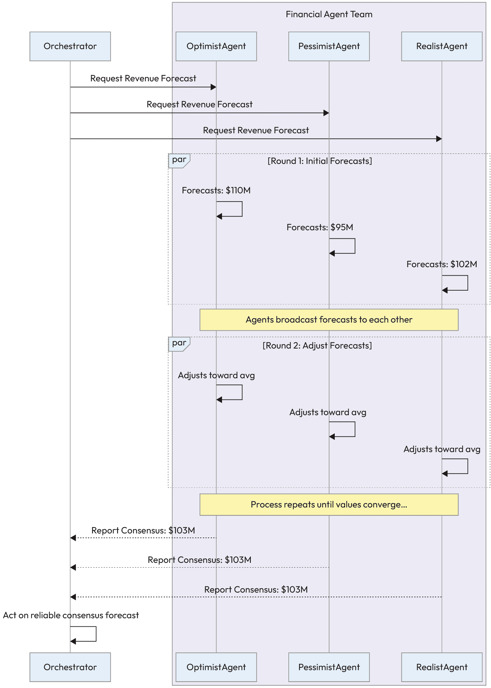

图 5.10 – 代理共识工作流程

## 示例实现

以下示例实现展示了**共识**模式，重点关注一组代理如何通过迭代收敛达成共识。在这个第 6 级架构中，`ConsensusManager`充当一组专业金融代理之间结构化辩论的促进者。

而不是简单地平均不同的数据点，经理执行一个多轮协议，其中每个代理观察集体均值并根据其内部逻辑调整自己的假设。这个过程一直持续到个别预测落在指定的容差范围内，确保最终的决定不仅是一个统计上的中间点，而且是通过所有自主成员的积极参与而达成的验证协议。

```py
class ConsensusManager:
    def get_consensus_forecast(self, agents, tolerance=1.0, max_rounds=5):
        # Round 1: Get initial forecasts
        forecasts = {agent.name: agent.get_initial_forecast() for agent in agents}

        for round_num in range(1, max_rounds + 1):

            # Check for convergence
            max_forecast = max(forecasts.values())
            min_forecast = min(forecasts.values())

            if (max_forecast - min_forecast) <= tolerance:
                print(f"Consensus reached in round {round_num}.")
                return sum(forecasts.values()) / len(forecasts)

            # Share and adjust
            average_forecast = sum(forecasts.values()) / len(forecasts)

            for agent in agents:
                # Each agent adjusts its forecast towards the average
                current_forecast = forecasts[agent.name]
                adjusted_forecast = agent.adjust_forecast(
                    current_forecast, average_forecast
                )
                forecasts[agent.name] = adjusted_forecast

        print("Max rounds reached. No consensus.")
        return sum(forecasts.values()) / len(forecasts)  # Fallback to average
class FinancialAgent:
    def __init__(self, name, initial_forecast_value):
        self.name = name
        self.initial_forecast = initial_forecast_value

    def get_initial_forecast(self):
        return self.initial_forecast

    def adjust_forecast(self, current_forecast, average_forecast, adjustment_factor=0.5):
        # Adjusts the forecast by a certain factor towards the average
return current_forecast + (average_forecast - current_forecast) * adjustment_factor
```

## 后果

+   **优点**：

    +   **可靠性**：通过促进结构化的辩论，**共识**模式增加了 idx_05664eb6 系统决策的可靠性和鲁棒性。它确保行动基于共享的、经过验证的理解，而不是基于单一、可能存在缺陷的数据点。

    +   **容错**：该过程本身具有鲁棒性，因为单个代理未能参与或提供有效响应并不一定会使整个过程停止。

+   **缺点**：

    +   **延迟**：共识协议引入了自然的延迟，因为它们需要多轮通信和计算。这使得它们不适合需要即时决策的实时系统。

    +   **复杂性**：实现一个健壮的共识协议是复杂的，需要仔细考虑边缘情况，例如代理失败、网络分区和恶意行为者。

## **实施指南**

为了确保共识协议的成功，必须将其设计整合到几个核心原则中。首先，建立明确的终止条件至关重要，例如最大轮数或特定的收敛阈值，以防止系统进入无限循环。其次，收敛算法应作为代理调整其状态的主要逻辑，这可以从简单的数值平均到更复杂的基于代理历史可靠性的个人意见加权方法。最后，从业者必须优先考虑可解释性，通过记录辩论的推理和中间状态，因为这创建了一个关键的审计轨迹，使利益相关者能够确切了解最终共识是如何达成的。

虽然共识有助于代理就事实达成一致，但它并不能解决他们的目标直接对立的情况。下一个模式，**协商**，为代理提供了一个框架，以解决这些竞争利益并找到互利的结果。

# **代理协商**

当代理自主行动时，他们通常有自己的目标，这些目标可能并不总是与其他代理的目标完美一致。这可能导致代理在资源或行动方案偏好上存在竞争性主张或冲突。

而不是简单地采用自上而下的决策，这种决策可能对所有相关方来说都不是最优的，更复杂的方法是允许代理自己解决冲突。**协商**模式为此类交互提供了一种结构化的协议。

## **上下文**

多个**自主**代理，通常有自己的自我利益或冲突的目标，需要达成一个相互可接受的协议来实现任务或解决争端。

## **问题**

如何让自私的代理在没有中央权威指定结果的情况下达成互利协议？一个固定且不可协商的方法可能导致僵局或次优结果，从而错过潜在的“双赢”解决方案。问题空间中的力量包括以下方面：

+   **自主性与一致性**：代理需要追求他们特定的目标，但系统必须确保他们的个人成功不会以牺牲集体目标为代价。

+   **公平与效率**：协商的理想结果应该是“双赢”的局面，其中所有各方都满意，但达成此类协议所需的时间和计算能力必须与及时决策的需求相平衡。

+   **策略行为与透明度**：虽然复杂的协商策略可能导致最佳结果，但它们往往使决策背后的推理更难审计并向人类利益相关者解释。

## 解决方案

**协商**模式为代理提供了一种结构化的协议，用于进行来回对话，以找到折衷方案。这种模式深受博弈论的影响，其中代理被视为理性的行为者，试图最大化自己的效用。

典型的协商协议包括启动（初始出价）、评估和回应（接受、拒绝或反要约）。该过程重复进行，直到达成协议或满足终止条件。

## 示例：协商共享资源

在数据处理环境中，两个代理 idx_2ea1b269 需要使用单个高性能 GPU 服务器来执行他们的任务。`ResourceManagerAgent`监督服务器，并在出现冲突时启动协商。

+   `AnalyticsAgent` **目标**：运行一个需要 2 小时处理窗口的时效性高优先级财务模型，理想情况下从凌晨 2:00 开始。

+   `TrainingAgent` **目标**：运行一个常规、低优先级的模型重新训练作业，需要 4 小时窗口，也计划在凌晨 2:00 进行。

由`ResourceManagerAgent`调解的协商展开：

1.  **冲突检测**：`AnalyticsAgent`和`TrainingAgent`都请求在凌晨 2:00 锁定 GPU 服务器。`ResourceManagerAgent`检测到冲突。

1.  **启动**：`ResourceManagerAgent`通知两个代理冲突情况，并要求他们说明优先级和灵活性。

1.  `AnalyticsAgent` **回应**：`{"priority": "high", "duration": "2 hours", "flexibility": "low"}`。

1.  `TrainingAgent` **回应**：`{"priority": "low", "duration": "4 hours", "flexibility": "medium"}`。

1.  **评估与提案**：`ResourceManagerAgent`的政策是优先处理`high`优先级 idx_31bc5d54 任务。它要求`TrainingAgent`提出一个新的时间。

1.  **反要约**：`TrainingAgent`检查日程安排并提出折衷方案。

    +   提供方案：`我可以推迟我的任务。我建议在 AnalyticsAgent 的 2 小时窗口完成后，立即在凌晨 4:00 开始我的 4 小时工作。`

1.  **协议**：`ResourceManagerAgent`确认新日程安排解决了冲突并满足所有约束。它向两个代理发送确认。

1.  **确认**：`达成协议。AnalyticsAgent 计划于凌晨 2:00 至 4:00 执行。TrainingAgent 计划于凌晨 4:00 至 8:00 执行。`

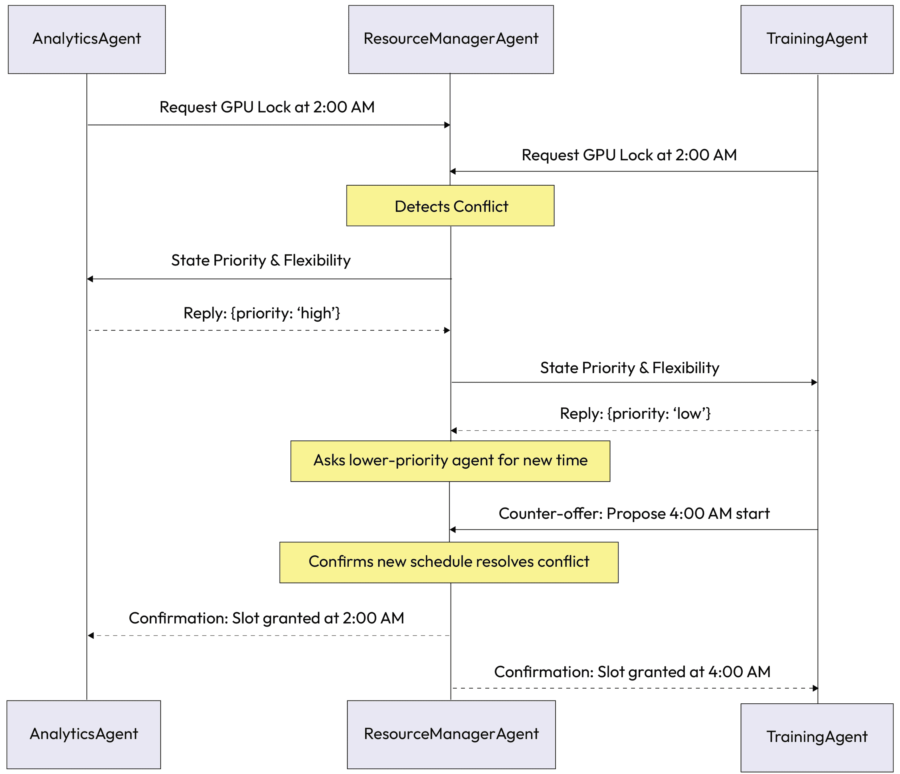

图 5.11 – 代理协商工作流程

在此 idx_687c7a9d 场景中，代理成功协商了一个新的日程安排，该安排尊重任务优先级，确保最关键的工作按时完成，而不需要人工干预。

## 示例实现

以下示例实现展示了在 idx_1b9dbca9 资源管理背景下***代理协商***模式。在此场景中，`ResourceManagerAgent`充当调解者，识别自主对等体之间的调度冲突。代码不是强加一个固定的决策，而是说明了协商协议的第一阶段，其中调解者评估任务优先级，并通过要求低优先级代理提出反提案来启动对话。这种方法使系统能够找到相互可接受的解决方案，同时尊重业务约束，并保持 idx_996c5f6b 个体代理的自主性。

```py
class ResourceManagerAgent:
    def handle_requests(self, request1, request2):
        if request1.time == request2.time:  # Conflict detected
# Determine which agent is lower priority
if request1.priority < request2.priority:
                lower_priority_agent = Agent1
                higher_priority_agent = Agent2
            else:
                lower_priority_agent = Agent2
                higher_priority_agent = Agent1

            # Ask the lower-priority agent to propose a new time
            new_proposal = lower_priority_agent.propose_new_time()

            # Check if the new proposal resolves the conflict
if self.is_conflict_resolved(new_proposal, higher_priority_agent.request):
                self.grant_slot(higher_priority_agent, higher_priority_agent.request.time)
                self.grant_slot(lower_priority_agent, new_proposal.time)
                return "Agreement Reached"
else:
                # Fallback or further negotiation rounds
return "Negotiation Failed"
def is_conflict_resolved(self, proposal, existing_request):
        # Logic to check if the proposed time slot is available
pass
def grant_slot(self, agent, time):
        # Logic to update the schedule and inform the agent
pass
class TrainingAgent:  # (Lower Priority)
def propose_new_time(self):
        # Agent logic to find the next best available slot
        new_time = "4:00 AM"
print(f"I am lower priority. I can defer. I propose to start at {new_time}.")
        return Proposal(time=new_time)

class Proposal:
    def __init__(self, time):
        self.time = time
```

## 后果

+   **优点**：

    +   **灵活性**：此模式允许灵活的、动态的协议，与僵化的、固定的政策相比，可以为所有各方带来更好的结果。

    +   **最优性**：它能够发现“双赢”解决方案，这些解决方案可能对中央权威或预编程规则不明显。

+   **缺点**：

    +   **时间和复杂性**：协商可能耗时且计算密集，且无法保证达成协议。

    +   **无保证**：如果没有回退机制，过程可能无法产生解决方案，导致死锁。

## 实施指南

明确定义清晰的终止条件和回退位置。如果没有达成协议会发生什么？代理应该有一个 B 计划。记录整个出价和反出价序列，以便于审计和便于人工监督。

虽然 idx_228276ad 协商是一种有效模式，用于解决两个或多个代理之间的特定冲突，但系统通常面临更广泛的挑战，即在许多竞争性代理之间分配有限的资产池。

这需要一种更系统的方法来管理供需。**资源分配**模式为这一系统级挑战提供了框架。

# 资源分配

在任何复杂的系统中，资源都是有限的。无论是计算能力、网络带宽、访问特定 API，还是物理资产，如机器人臂，通常需求大于供应。当多个代理同时需要相同的有限资源时，系统需要一种公平且高效的方法来决定谁得到什么。

**资源分配**模式提供了一种结构化的方法来管理这种分配，超越了简单的“先到先得”逻辑，转向一个更智能和目标导向的模型。

## 上下文

一个多代理 idx_b95bf785 系统拥有有限的资源池，例如网络带宽、计算能力或 API 调用配额，这些资源必须分配给具有竞争需求的多个代理。

## 问题

系统如何以高效、公平且与整体系统目标一致的方式在竞争的代理之间分配有限的资源？如果没有明确的分配策略，多代理系统可能会遇到竞争、瓶颈和次优性能。问题空间中的力量包括以下内容：

+   **吞吐量与公平性**：该系统旨在通过优先处理高价值任务来最大化整体生产力，但同时也必须防止饥饿，即低优先级代理永远无法获得其正常运作所需的资源。

+   **集中控制与开销**：中央分配器提供了一个全局的优先级视图并确保一致性，但随着代理和请求数量的增加，它可能成为性能瓶颈或单一故障点。

+   **可预测性与适应性**：固定的分配规则简单且可预测，但它们往往无法考虑到任务重要性的动态变化或需要立即重新分配资源的突发环境变化。

## 解决方案

**资源分配** 模式 idx_5f645893 实现了一种管理资源分配的机制。关键方法包括以下内容：

+   **集中** **分配器**：一个专门的代理，如经理，根据对系统优先级和资源可用性的全局视图做出分配决策。

+   **拍卖** **机制**：代理使用内部货币或优先级分数“出价”获取资源，最高出价者赢得指定期限内的资源。当代理本身可以量化任务的真实价值时，这种方法很有用。

+   **公平** **分配** **算法**：在公平至关重要的场合，可以使用算法来 idx_b229dfcd 计算可能公平的资源分配，例如以某种方式分配资源，使得没有任何代理会羡慕另一个代理的份额。

## 示例：智能工厂中的自主机器人分配

一个智能工厂使用有限的**自主移动** **机器人**（AMRs）车队来运输材料。一个中央 `AMR_DispatcherAgent` 根据任务优先级分配这些机器人，以最大化工厂产出。

1.  `ProductionLine_A_Agent` 向 AMR 发送一个 `高优先级` 请求，以交付一个关键组件，并警告生产线即将停机。

1.  `WarehouseAgent` 向 AMR 发送一个 `低优先级` 请求，以执行常规库存周期盘点。

1.  `ShippingAgent` 向 AMR 发送一个 `中等优先级` 请求，以将成品移动到装货码头，以便两小时后发货。

`AMR_DispatcherAgent`评估这些竞争性请求。根据其优先级规则，它立即将下一个可用的 AMR 分配给`ProductionLine_A_Agent`以防止昂贵的生产线停工。然后，它将一个 AMR 分配给`ShippingAgent`以满足装运截止日期。`WarehouseAgent`的低优先级请求被放入队列，并且只有在机器人可用且没有更高优先级任务等待时才会得到满足。

这个基于优先级的分配工作流程可以可视化如下：

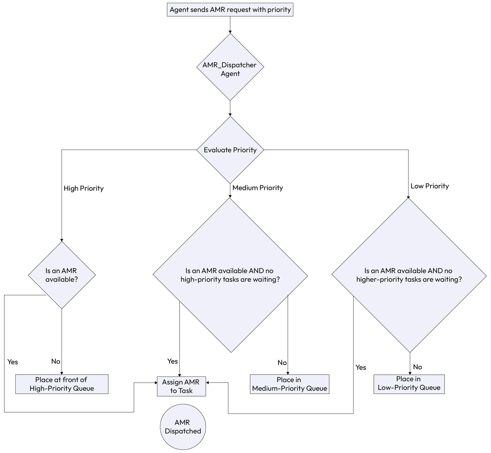

图 5.12 – 资源分配

## 示例实现

以下 idx_e2f9d9f1 实现通过 AMR 调度器展示了***资源分配***模式。在这个高级协调（第 5 级）场景中，系统通过处理通过分层优先级队列传入的请求来管理有限的物理机器人车队。

代码展示了`AMR_DispatcherAgent`如何作为一个集中控制器，评估来自不同部门任务的紧迫性，例如生产中的关键组件与日常库存盘点相比，并确保最具影响力的工作分配给下一个可用的机器人。这种方法有效地平衡了工厂 idx_fc800df8floor 的竞争需求，同时防止资源争用并确保系统级目标，如避免生产线停工，始终得到优先考虑。

```py
class AMR_DispatcherAgent:

    def __init__(self):
        # Queues for holding requests of different priorities
self.high_priority_queue = []
        self.medium_priority_queue = []
        self.low_priority_queue = []
        self.available_amrs = [AMR1(), AMR2(), AMR3()]

    def receive_request(self, request):
        if request.priority == "high":
            self.high_priority_queue.append(request)
        elif request.priority == "medium":
            self.medium_priority_queue.append(request)
        else:
            self.low_priority_queue.append(request)

        self.dispatch()

    def dispatch(self):
        if not self.available_amrs:
            return # No robots available right now
# Process highest priority requests first
if self.high_priority_queue:
            task = self.high_priority_queue.pop(0)
            robot = self.available_amrs.pop(0)
            robot.assign_task(task)

        elif self.medium_priority_queue:
            task = self.medium_priority_queue.pop(0)
            robot = self.available_amrs.pop(0)
            robot.assign_task(task)

        elif self.low_priority_queue:
            task = self.low_priority_queue.pop(0)
            robot = self.available_amrs.pop(0)
            robot.assign_task(task)

class AMR1:
    def assign_task(self, task):
        print(f"AMR1 is assigned a {task.priority} priority task: {task.name}")

class AMR2:
    def assign_task(self, task):
        print(f"AMR2 is assigned a {task.priority} priority task: {task.name}")

class AMR3:
    def assign_task(self, task):
        print(f"AMR3 is assigned a {task.priority} priority task: {task.name}")

class Request:
    def __init__(self, name, priority):
        self.name = name
        self.priority = priority

# Example Usage:
dispatcher = AMR_DispatcherAgent()
dispatcher.receive_request(Request("deliver critical component", "high"))
dispatcher.receive_request(Request("move finished goods", "medium"))
dispatcher.receive_request(Request("perform inventory count", "low"))
```

## 后果

+   **优点**：

    +   **优化**：确保 idx_07821669 稀缺资源被引导到最关键的任务上，最大化系统的整体效用，而不仅仅是满足最快的代理

    +   **稳定性**：防止资源争用、死锁和可能导致系统崩溃或不可预测行为的竞争条件

+   **缺点**：

    +   **开销**：分配过程（无论是集中计算还是去中心化拍卖）在任务实际执行之前引入了延迟

    +   **饥饿风险**：设计不当的分配规则可能导致低优先级代理永远无法获得其正常运作所需的资源，需要采取保护措施

## 实施指南

分配的逻辑必须透明且明确。无论基于优先级、竞标还是公平性，这种清晰度对于调试和可解释性至关重要。在基于拍卖的系统里，规则应设计成鼓励代理提出其真实价值，这一原则被称为激励兼容性。

这防止了 idx_20bb7dc4 代理为了获得优势而错误地表示其需求。分配机制还应能够适应变化的情况，并在出现更关键的任务时优先处理较低优先级任务。

通过实施明确的资源分配策略，多智能体系统可以超越简单且通常低效的竞争。这确保了关键系统资源被高效地使用，并指向最重要的任务，从而提高整体系统性能并将行动与全球优先事项保持一致。它为管理复杂代理生态系统的运营成本和约束提供了一个稳定的基石。

一个稳健的资源分配计划对于防止一种常见的冲突是必不可少的。然而，多智能体系统中的分歧可能不仅仅源于资源稀缺。代理可以制定或持有相互不兼容的计划或目标，导致潜在的死锁或不安全条件。

下一个模式，**冲突解决**，提供了检测和调解这些直接冲突所需的机制。

# 冲突解决

当自主代理 idx_e999b590 追求其目标时，它们不可避免地会在某些时候以创建直接冲突的方式交叉路径。一个代理将机器人臂移动到特定位置的计划可能与另一个代理使用相同空间的计划发生冲突。

两个金融代理可能会为同一股票生成相反的交易建议。**冲突解决**模式对于系统稳定性至关重要，它提供了一个结构化的框架来识别这些争议点并解决它们，以避免系统故障并符合系统的总体目标。

## 背景

在一个多代理 idx_3852f759 系统中，两个或更多代理可能会有冲突的计划行为或目标。例如，两个物流代理可能会同时尝试将他们的卡车通过同一条狭窄的街道。

## 问题

系统如何解决代理之间的分歧或冲突计划，以避免死锁、不安全条件或次优结果？允许代理进行冲突行为可能导致系统故障、低效的振荡或不连贯的策略。问题空间中的力量包括以下内容：

+   **安全性与操作速度**：确保不采取任何冲突行为可以防止系统故障或物理损坏，但检测和解决过程会增加延迟，可能会减慢高频操作。

+   **集中式权威与分布式敏捷性**：一位主管可以提供决定性和一致的解决方案，但依赖于一个控制中心可能会造成瓶颈，限制个别代理的响应能力。

+   **逻辑一致性与目标达成**：解决冲突通常需要至少一个代理放弃或修改其当前计划，这可能会以牺牲特定任务的最优结果为代价，以保持更广泛系统的完整性。

## 解决方案

**冲突解决**模式提供了一种结构化的机制来检测和解决冲突。而不是让代理陷入困境，这个模式引入了一个调解过程。选择哪种方法取决于系统的架构、冲突的性质以及需要决定性的、自上而下的控制或更动态、自发的协议的需求。

让我们探讨一些常见的方法：

### 层次化解决

指定的**监督者**或**协调代理**有权推翻冲突代理并强制 idx_ba35a08ba 做出决定。这是最直接的方法，提供明确和可预测的结果。它特别适用于需要全局视角和明确权力界限的系统，类似于传统的管理结构。

这通常是企业应用中的默认选择，在这些应用中，合规性、安全性和可审计的决定至关重要。监督者作为单一的真实点，防止系统陷入犹豫不决或僵局。

### 基于策略的解决

该系统有一套预定义的政策或规则，自动规范如何解决某些类型的 idx_47406698 冲突。这是一个高度可靠且可审计的方法。例如，一项政策可能规定“安全关键型代理始终优先于效率优化型代理”或“处理面向客户任务的代理优先于内部报告代理。”

解决方案是确定性和一致的。这种方法之所以强大，是因为它将决策逻辑外部化，使得人类更容易理解、修改和审计系统的行为，而无需了解每个个别代理的内部状态。

### 谈判

冲突代理可以进入**谈判过程**（使用**谈判**模式）以找到双方都能接受的妥协。这种自下而上的方法适用于存在“双赢”或“少输”结果的空间，并且代理人有足够的复杂性做出让步和评估反要约。

与自上而下的命令式方法不同，这种方法允许直接参与冲突的代理人在系统约束范围内找到与其个人目标最一致的解决方案。它促进了适应性，并能比僵化、预定义的政策带来更细致和创造性的解决方案。

### 博弈论解决

对于高度 idx_8fe99a88 复杂的场景，冲突可以被建模为一个正式的游戏。每个代理的可能行动都被分配了收益或 idx_579c8fe7 成本，系统可以确定一个稳定的结局，例如**纳什****e****quilibrium**，在这种状态下，没有任何代理能通过单方面改变其策略而受益。

这种方法计算密集，但可以用来设计可能稳定且将个体代理的自我利益与全球目标对齐的系统。通过正式化冲突，这种方法允许进行更深入的分析，并可用于设计 idx_695ff934 系统，其中期望的合作行为自然地从代理对其自身目标的理性追求中产生。

## 示例：解决企业工作流冲突

在贷款 idx_bc98a463 处理系统中，两个代理有冲突的目标：

+   `ThroughputAgent` 优化以每小时处理尽可能多的贷款申请，以满足业务 KPI 的速度要求

+   `FairnessAgent` 被委以对应用程序批次进行计算密集型分析的任务，以检查人口统计偏差，这可能会减慢处理过程。

当 `ThroughputAgent` 尝试直接将一批应用程序推送到最终审批阶段以保持其速度时，`FairnessAgent` 会将该批次标记为需要详细审查，这将花费 20 分钟。

1.  **冲突检测**：`ThroughputAgent` 的“将批次推进审批”计划和 `FairnessAgent` 的“为公平审查保持批次”计划被记录为在中央 `SupervisorAgent` 中的互斥操作。

1.  **基于策略** **的** **解决方法**：`SupervisorAgent` 咨询其内部策略框架。它找到一个不可协商的政策：`所有贷款批次在进入审批阶段之前必须获得 FAIRNESS_PASSED 状态。合规性和道德指南优先于与速度相关的 KPI。`

1.  **解决方法**：`SupervisorAgent` 使 `ThroughputAgent` 的计划无效。它向 `ThroughputAgent` 发送指令，要求其 `暂停并等待公平检查完成`。然后它向 `FairnessAgent` 确认它有优先权继续其分析。

1.  **继续**：一旦 `FairnessAgent` 完成检查并将批次状态更新为 `FAIRNESS_PASSED`，`SupervisorAgent` 然后允许 `ThroughputAgent` 恢复其任务。

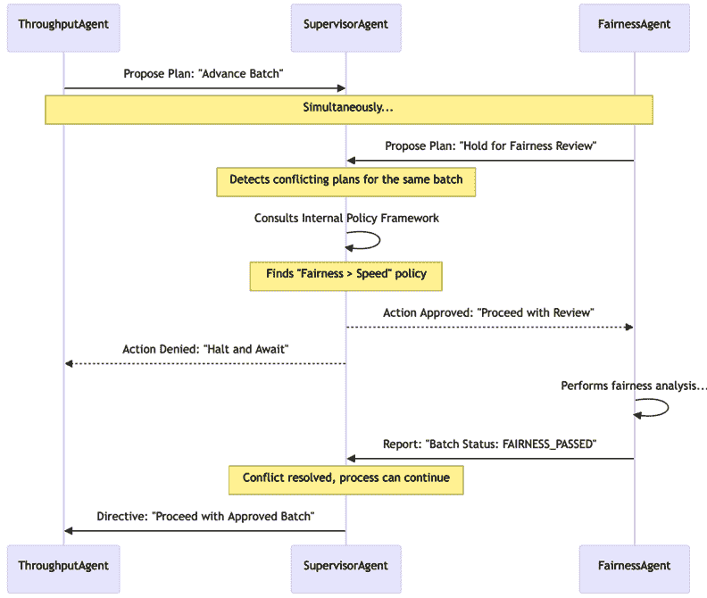

图 5.13 – 冲突解决工作流程

## 示例实现

以下实现演示了在企业 idx_21167c44 贷款处理系统中的 ***冲突解决** *模式。在这个例子中，`SupervisorAgent` 作为两个具有对立目标的代理之间的调解人：一个专注于最大化吞吐量，另一个专注于确保人口统计公平性。

代码说明了基于策略的解决方法，其中主管评估提出的计划与不可协商的合规框架。通过优先考虑公平审查而不是高速计划，系统确保了道德指南得到遵守，而无需代理自己理解更广泛的公司政策。这种集中调解防止系统进入逻辑不一致的状态或继续进行未经审查的决定。

```py
class SupervisorAgent:

    def __init__(self):
        # Policies define the rules of engagement
self.POLICY_FRAMEWORK = {
            "FAIRNESS_CHECK_REQUIRED": True
        }

    def handle_proposed_plans(self, plan1, plan2):
        if self.is_conflicting(plan1, plan2):
            print("Conflict Detected!")

            # Apply Policy-Based Resolution
if self.POLICY_FRAMEWORK["FAIRNESS_CHECK_REQUIRED"]:
                if plan1.action == "HOLD_FOR_FAIRNESS_REVIEW":
                    # FairnessAgent's plan has priority
self.approve_plan(plan1)
                    self.deny_plan(plan2, reason="Fairness check must complete first.")
                else:
                    # ThroughputAgent's plan must wait
self.approve_plan(plan2)
                    self.deny_plan(plan1, reason="Fairness check must complete first.")
            else:
                # Other resolution logic
pass
def is_conflicting(self, plan1, plan2):
        # A simple example of a conflicting condition
return plan1.target == plan2.target and plan1.action != plan2.action

    def approve_plan(self, plan):
        print(f"Approving plan: {plan.name}")

    def deny_plan(self, plan, reason):
        print(f"Denying plan: {plan.name}. Reason: {reason}")

class Plan:

    def __init__(self, name, target, action):
        self.name = name
        self.target = target
        self.action = action

# Example Usage:
supervisor = SupervisorAgent()

plan1 = Plan("Fairness Check", "Loan Batch 123", "HOLD_FOR_FAIRNESS_REVIEW")
plan2 = Plan("Advance to Approval", "Loan Batch 123", "ADVANCE_TO_APPROVAL")

supervisor.handle_proposed_plans(plan1, plan2)
```

## 后果

+   **优点**：

    +   **一致性**：确保系统不会陷入矛盾或死锁状态，保持整体操作的完整性

    +   **安全性**：防止智能体意外相互干扰的危险情况（例如，物理机器人碰撞或逻辑数据损坏）

+   **缺点**：

    +   **延迟**：冲突检测和解决引入了计算开销，可能会减慢系统的响应时间

    +   **复杂性**：为每个可能的冲突场景设计稳健的政策或协商协议会显著增加工程工作量

## 实施指南

任何冲突解决策略的成功都取决于几个核心原则，这些原则确保了系统的稳定性和可靠性。这些原则不仅仅是技术细节；它们是设计一个具有弹性的多智能体系统的基石。

### 冲突检测：第一步

在冲突得到解决之前，必须首先检测到它。这是过程中的一个关键部分，但往往被低估。这就像有一个早期预警系统。最直接的方法是有一个集中式管理者智能体，它监控所有智能体的行动和计划。

例如，如果两个智能体注册了使用同一有限资源的计划，管理者可以立即 idx_164a2787 标记冲突。其他方法包括使用资源锁定机制，其中智能体“锁定”它打算使用的资源，或者要求智能体在执行前在一个共享空间中注册它们的预期行为。

### 可解释的解决方案：审计跟踪

当冲突得到解决时，系统仅仅继续进行是不够的。决策背后的 idx_bca83ce3 理由必须被记录。审计跟踪对于调试、合规性和建立对系统的信任至关重要。日志应清楚地说明为什么选择了特定的解决方案。

例如：“智能体 B 的计划被批准，因为政策[编号]规定，安全关键任务优先于所有其他任务。”这种透明度允许人类操作员理解系统的行为，并验证它是否按预期运行。

### 定义升级路径：人工介入

在理想的世界里，所有冲突都会自动解决。在现实中，总会有一些关键、不可预见 idx_b6584db3 的情况，系统的自动化机制会失败或无法得出结论。对于这些情况，必须有明确且可靠的升级路径。

企业系统中的最终后备方案几乎总是需要人工介入，即一个可以审查冲突背景并做出最终判断的人类操作员。系统应该设计成将所有必要信息传递给人类，以便做出快速、明智的决定。

### 通过模拟来理解：测试弹性

在部署多智能体系统之前，特别是使用复杂的协商或博弈论模型的多智能体系统，在广泛的各种条件下模拟智能体之间的交互至关重要。

这种实践有助于测试冲突解决策略，并识别潜在的僵局或不良的涌现行为。通过在一个安全的环境中模拟冲突及其解决，开发者可以微调系统的政策和协议，确保在面对现实世界挑战时，系统能够维持一致性和稳定性。

### 一致性和稳定性的基础

在多智能体系统中，需要明确的协议来解决冲突，以确保整体系统能够在构成其的智能体具有不同的目标、观点或得出相反结论的情况下，维持其一致性和稳定性。

这可以防止代价高昂的僵局，并确保系统可以继续有效地运行，做出符合全局优先级的决策，而不是陷入内部争端。这是构建能够优雅地处理任何复杂、去中心化环境中自然产生的摩擦的弹性系统的基本模式。

解决逻辑冲突和管理资源以确保智能体能够一起在抽象任务上工作至关重要。然而，协调挑战并不总是关于目标或数据；有时它们是关于智能体本身的物理（或逻辑）排列。在机器人技术或复杂模拟等领域，一组智能体能够作为一个具有特定结构（如蜂群）的统一整体行动的能力，对于项目的成功至关重要。

这就是**形成控制**模式变得至关重要的地方。

# 形成控制

**形成控制**模式是一种集体移动和空间组织的设计原则，用于一组智能体。与处理抽象任务或资源的模式不同，这个模式专门用于一组智能体必须在一个环境中移动时保持相对于彼此的特定物理或逻辑结构的情况。

它使一群智能体能够作为一个单一、协调的实体行动，流畅地应对变化，而不需要一个集中的控制器。

## 上下文

该系统涉及一组智能体，这些智能体在移动或在一个环境中行动时需要保持相对于彼此的特定物理或逻辑结构。这在机器人技术、复杂模拟和需要统一、集体行动的场景中很常见。

## 问题

如何使一群代理动态地维持集体编队，而不需要一个刚性的、集中的控制器来指定每个代理的确切位置？依赖单个领导者会创建一个单点故障，并且难以适应障碍物或环境变化。这可能导致碰撞、编队损坏或导航效率低下。问题空间中的力量包括以下内容：

+   **全局一致性 versus 局部感知**：编队需要保持特定的全局形状，但个体代理通常只能访问其直接邻居的信息，这使得在大型群体中保持完美的编队变得困难。

+   **结构刚性 versus 避障**：编队必须保持在预定义的编队中以满足其目标，但个体代理也必须能够从该结构中偏离，以绕过环境危害或避免碰撞。

+   **通信延迟 versus 同步速度**：精确的编队控制需要代理之间快速更新以保持对齐，但高频通信可能会饱和网络或增加电池供电代理（如无人机或移动机器人）的功耗。

## 解决方案

**编队控制**模式通过分散控制逻辑使一群代理能够自我组织。核心思想是每个代理基于其直接邻居的位置和状态做出决策，而不是遵循来自中央领导者的命令。每个代理都被编程了一个简单的控制规则集，该规则集规定了其与指定邻居之间的期望距离和方位。这种方法允许编队灵活地适应障碍物和环境变化，因为每个代理的局部反应通过编队级联，导致集体、涌现的反应。

## 示例：农业无人机编队

想象一支农业无人机编队，其任务是精确地以网格编队在大片田野上喷洒农药，以确保均匀覆盖。

1.  **编队** **规则**：每架无人机都被编程了一个简单的规则：`保持在你左邻 10 米的位置，并与你的前方邻居直接对齐。`

1.  **协调** **移动**：随着领航无人机向前移动，编队中的每架无人机都跟随，不断调整自己的速度和位置，基于其邻居的位置以保持网格。

1.  **动态** **适应**：位于编队中间的无人机`Drone_C`在其路径上直接检测到一棵树。它自主执行规避机动，减速并绕过障碍物飞行。

1.  **自我** **组织**：紧邻`Drone_C`的无人机感知到其位置的变化。`Drone_B`（在其左侧）和`Drone_D`（在其右侧）减速以避免碰撞。在`Drone_C`后面的无人机也减速以保持间距。

1.  **重新编队**：一旦`Drone_C`清除了障碍，它就会加速回到其指定的位置。其邻居感知到这种纠正并调整自己的速度，无缝地重新建立完美的编队，这一切都不需要任何中央命令。

该编队中任何单个代理的核心逻辑循环可以在以下图中可视化：

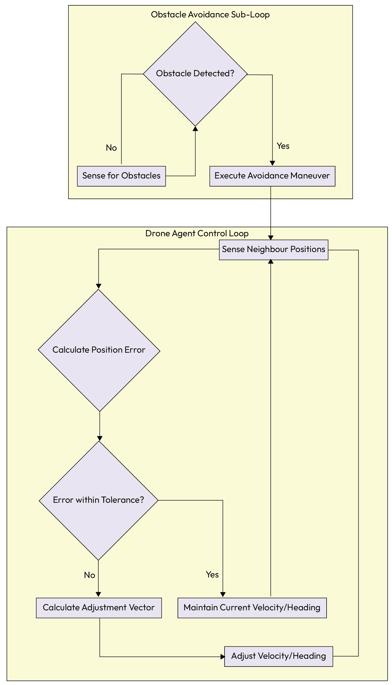

图 5.14 – 编队控制的单个代理控制循环

## 示例实现

以下实现通过简化的 idx_d4da2231 无人机集群模拟演示了***编队控制***模式。在这个例子中，每个`DroneAgent`使用去中心化的控制循环运行，其移动由相对于指定邻居的固定偏移量决定。

代码说明了集体结构是如何从局部规则而不是中央命令中产生的。每个代理持续感知其邻居的位置，根据预定义的偏移量计算自己的期望坐标，并应用速度调整来纠正任何错误。这种局部化的方法使得整个编队保持流动性和弹性，因为集群可以适应个体的偏差或环境变化，而无需全局路径规划者。

```py
class DroneAgent:

    DESIGNATED_OFFSET = Vector(10, 0)  # e.g., 10 meters to the right
def control_loop(self):

        while True:

            # 1\. Sense neighbor's position
            neighbor_position = self.get_neighbor_position()
            my_position = self.get_my_position()

            # 2\. Calculate the desired position based on the neighbor
            desired_position = neighbor_position + self.DESIGNATED_OFFSET

            # 3\. Calculate the error between current and desired position
            position_error = desired_position - my_position

            # 4\. Check if adjustment is needed
if NORM(position_error) > TOLERANCE:

                # 5\. Calculate an adjustment vector to correct the error
                adjustment_vector = self.calculate_adjustment(position_error)
                self.adjust_velocity(adjustment_vector)

            else:
                self.maintain_velocity()

            # An obstacle avoidance sub-loop would also be running
            ...
```

## 后果

+   **优点**：

    +   **可扩展性**：编队可以扩展到包括数百或数千个代理 idx_bcaf9515，而不会增加任何单个控制器的计算负载，因为决策是局部的

    +   **弹性**：系统对单个代理的故障具有鲁棒性；如果其中一个代理掉队，邻居会自然地关闭差距

+   **缺点**：

    +   **局部** **最优**：仅基于局部信息的代理可能会陷入复杂障碍（如死胡同），而全局规划者可以轻易避开这些障碍

    +   **稳定性** **风险**：控制法则调校不当可能导致振荡，其中代理持续过度纠正其位置，导致编队抖动

## 实施指南

要成功实施***编队控制***模式，必须解决几个技术问题，首先是邻居发现的需求。代理需要一个可靠的 idx_3df8d9e1 机制来识别和跟踪其相关同伴的状态，这可以通过直接、低延迟的通信实现，例如本地网状网络，或者通过观察共享状态表示。该模式的核心在于控制法则，即特定规则，它规定了代理如何相对于其他代理调整其位置。这些法则必须使用控制理论的原则仔细设计，以确保编队保持稳定，并在压力下不会振荡或解体。最后，在物理环境中部署之前，使用模拟来测试和改进这些控制法则是必不可少的，这提供了一种安全且成本效益高的方法来迭代集体行为。

通过***形成控制***模式，我们结束了对多智能体协调基本模式的探索。我们从高级任务委派和规划出发，经历了协商、资源管理和现在，空间组织的复杂动态。

现在，让我们回顾本章的关键教训。

# 摘要

本章探讨了使多个自主智能体能够作为一个统一且智能的系统一起工作的基本模式。我们确定，从单一智能体到多智能体系统的转变引入了一个新的复杂性层次，需要结构化的解决方案来处理协作、竞争和通信。这些模式为构建健壮、可扩展和一致的多智能体系统提供了建筑蓝图。我们不仅详细介绍了这些个别模式，还把它们置于 GenAI 成熟度模型中，展示了它们的应用如何随着系统从基础层向自主层的发展而演变。

我们首先建立了高级***任务委派框架***（***监督者***与***蜂群***）并探讨了具体的***智能体组成拓扑结构***，例如用于共享知识演化的***黑板***、基于市场的任务分配的***合同网***和用于容错性的***监督树***。从那里，我们深入探讨了协作的具体机制，包括用于任务分解的***多智能体规划***、用于创建集体智慧的***知识共享***以及用于管理能力的***工具路由***。

接下来的讨论转向了管理任何分布式系统中出现的自然摩擦。我们探索了一系列旨在优雅地处理分歧和竞争的图案，包括***共识***、***协商***、***资源分配***和***冲突解决***。最后，我们考察了需要空间协调的系统所采用的***形成控制***图案。

关键要点如下：

+   **协调是架构化的，而非假设的**：有效的多智能体系统建立在一组明确的协调模式之上，这些模式定义了它们如何委派任务、规划和交互。

+   **框架和拓扑结构决定了控制流**：架构的选择——无论是集中式的***监督者***、去中心化的***蜂群***还是如***黑板***这样的专用拓扑结构——塑造了系统在可预测性和适应性之间的平衡。

+   **协作需要共享的上下文**：智能体需要共享的计划（***多智能体规划***）和共享的知识库（***知识共享***）才能有效地一起工作，并在时间上作为一个集体不断改进。

+   **不一致性协议至关重要**：为了防止混乱和死锁，系统需要结构化的模式来管理竞争，包括就事实达成一致的***共识***，解决目标冲突的***谈判***，以及处理直接冲突的***冲突解决***。

+   **协调扩展到执行和环境**：有效的协调不仅限于抽象规划，还包括具体行动，例如管理哪个智能体使用哪种工具（***工具路由***）以及它们如何物理或逻辑地排列（***编队控制***）。

+   **协调的进化方法**：协调模式的选择和复杂性直接映射到系统的成熟度。基础多智能体系统（第 4 级）依赖于集中式、可预测的模式，如***监督者***，而高级和自我纠正的系统（第 5-6 级）则需要动态和去中心化的模式，如***谈判***、***共识***和元智能体来管理涌现行为。

通过深思熟虑地应用这些协调模式，开发者可以构建比各个部分总和更强大的复杂多智能体系统，使他们能够以稳健、可扩展和智能的方式应对复杂、现实世界的挑战。

在探索了协调多个智能体行动的基本模式之后，我们为构建能够集体解决复杂问题的系统打下了坚实的基础。我们现在知道如何让它们制定计划、共享知识和解决冲突。

然而，仅仅创建一个有效的系统对于生产级和企业环境来说是不够的。我们还必须确保这些自主系统是透明的、可审计的，并且在其严格的伦理和监管边界内运行。

在下一章中，我们将重点从协调转移到问责制，探讨使智能体系统值得信赖的关键模式。

# 获取此书的 PDF 版本和独家额外内容

扫描二维码（或访问[packtpub.com/unlock](https://packtpub.com/unlock)）。通过书名搜索此书，确认版本，然后按照页面上的步骤操作。


*注意：请妥善保管您的发票。直接从* *Packt* *购买不需要发票*
