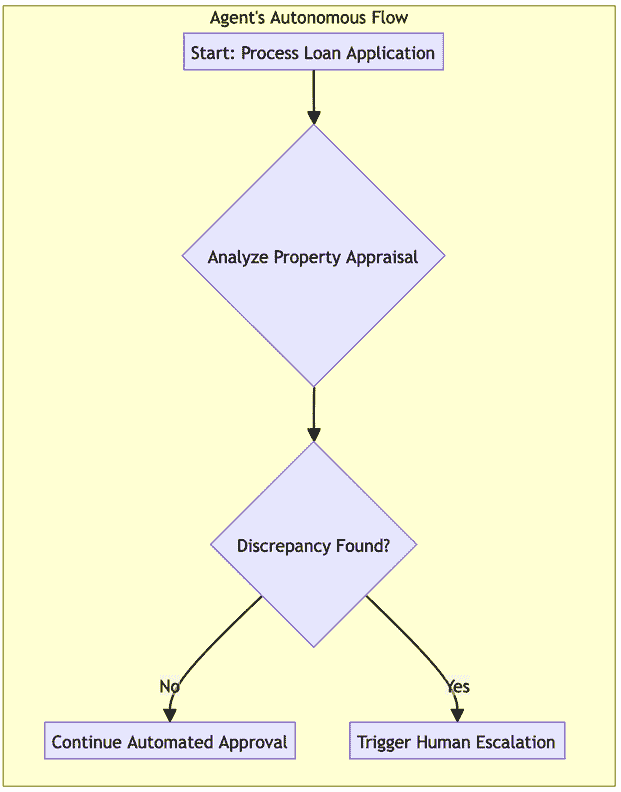
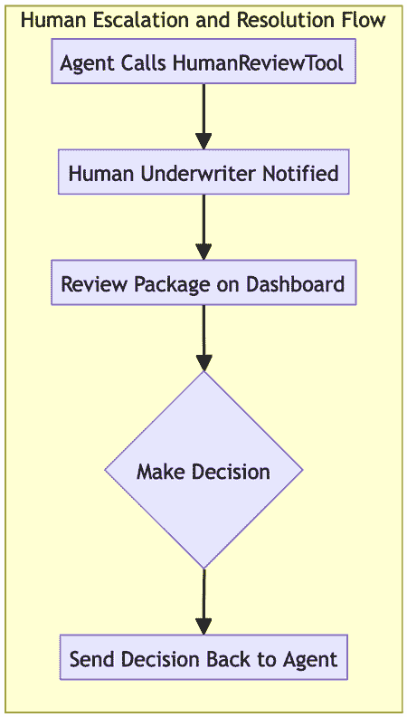
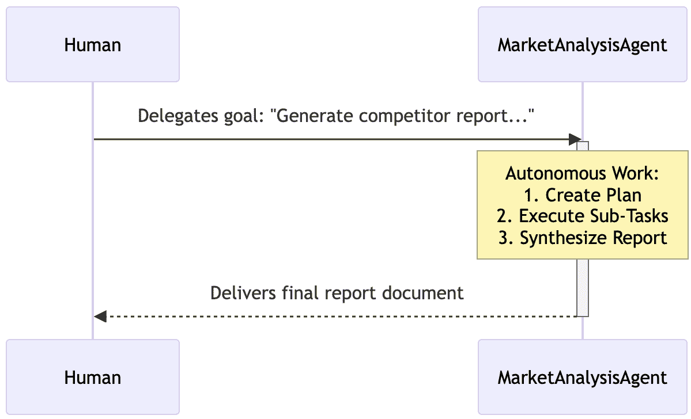
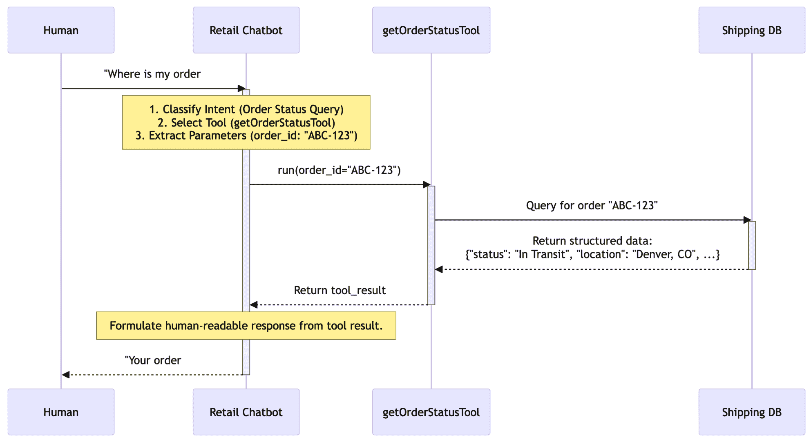
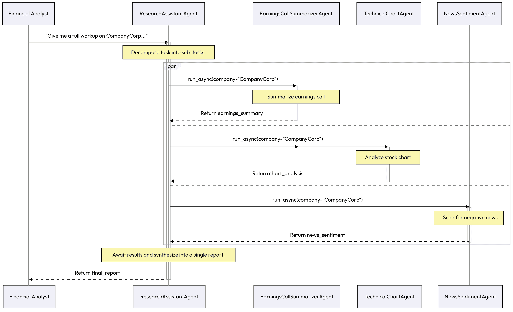
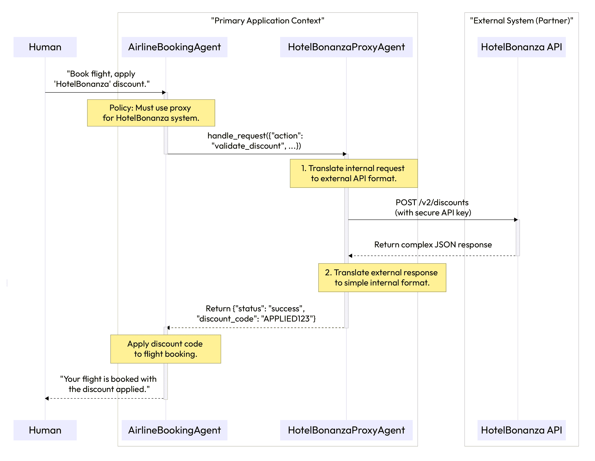

# 第八章：人机交互模式

在前几章中，我们建立了构建具有协调性、合规性和鲁棒性的智能体系统的架构模式。一个可靠且透明的系统是所有关键关系中最重要的基础：即人工智能代理与其人类用户之间的关系。为了使智能体系统超越后端自动化，真正增强人类知识工作者的能力，它们与人们的互动必须直观、值得信赖且有效。

本章致力于规范这一关键界面的模式。为了使这些模式尽可能具有可操作性，我们将采取“事前规划”的方法。在详细说明每个个别模式之前，我们首先将提供一个实施战略指南。该指南介绍了一个成熟度模型，该模型将模式组织成一个清晰、渐进的路线图，从简单的交易型机器人到主动的、协作的合作伙伴。

通过首先理解大局，您将拥有欣赏每个特定模式如何适应以及为什么它对于构建既强大又安全、可用，最终被设计为其服务的受众所采用的智能体系统至关重要的背景。

在本章中，我们将涵盖以下主题：

+   实施人机交互模式的战略指南

+   代理调用人类（人类在回路中的升级）

+   人类代表到代理

+   人类调用代理

+   代理代表到代理

+   代理调用代理

# 实施人机交互模式的战略指南

了解人机交互的个别模式是第一步。下一步是将它们战略性地应用于构建既强大又值得信赖的系统。一次性实施所有模式不仅不切实际，对于早期阶段的系统来说通常也不必要。正确的方法是随着您系统的复杂性和对复杂、协作工作流程的需求逐渐增长，逐步采用这些模式。

## 人机交互级别

面对一个全面的模式语言时，一个常见的问题是，“我从哪里开始？”一次性实施所有这些模式不仅不切实际，对于早期阶段的系统来说通常也不必要。成功的关键是逐步采用，建立一个简单、可靠的交互基础，并在您的智能体系统在复杂性和责任方面增长时，添加更复杂的自主和协作层。

下面的成熟度模型为这一旅程提供了战略路线图。它将人机交互模式组织成五个不同的级别，从基本的交易型机器人到主动的、协作的数字助手。通过确定您系统的当前需求和未来目标，您可以使用此模型选择在正确的时间实施的正确模式集。

| **级别** | **能力** | **启用** **模式** | **摘要** |
| --- | --- | --- | --- |
| 1. 事务性系统 | 直接、单轮交互 | Human Calls Agent | 系统作为响应性工具，以速度和准确性处理简单、定义明确的命令和查询 |
| 2. 辅助自动化 | 基本委派和升级 | Human Delegates to AgentAgent Calls Human | 系统可以承担简单的多步任务，但了解其局限性，在模糊或需要批准时可靠地升级到人类 |
| 3. 协作系统 | 内部多代理工作流程 | Agent Delegates to Agent | 系统可以通过协调一组内部专家代理（对用户隐藏）来解决复杂问题 |
| 4. 安全且可互操作的生态系统 | 安全的外部交互 | Agent Calls Proxy Agent | 系统可以安全可靠地与第三方系统交互，实现跨企业协作 |
| 5. 积极个性化的合作伙伴 | 预测性、上下文感知的协作 | 所有模式，结合长期记忆 | 系统从工具进化为合作伙伴，学习用户偏好，并积极协助实现复杂目标 |

表 8.1 – 采用人类-代理交互模式的成熟度模型

此成熟度 idx_81434e72 模型提供了 *何时*（采用顺序指南）。然而，为了有效地实施这些模式，我们还需要了解 *何地*（它们如何适应生产级系统的不同功能层）。以下架构为将这些模式集成到一个统一的整体中提供了一个实际蓝图。

## 系统集成架构：这些模式如何协同工作

此架构展示了如何将 idx_b904c171 模式组织成完整应用程序中的功能层。这些层确保了从面向用户的界面到安全处理外部通信的明确分离：

+   **用户** **界面** (**UI**)**层**：这是与人类用户直接接触的点。所有交互都从这里发起。

    **启用模式**：***Human Calls Agent***（用于直接命令）和***Human Delegates to Agent***（用于复杂目标）。

+   **编排** **和** **主要** **代理** **层**：此层托管用户交互的主要代理（例如，`TravelPlannerAgent` 和 `ResearchAssistantAgent`）。它负责高级规划、分解用户目标，并管理整体工作流程。

    **启用模式**：它接收委派的任务，并启动对专家层的 ***Agent Delegates to Agent*** 调用。它还负责通过 ***Agent Calls Human*** 模式处理升级。

+   **专家** **和** **工作者** **代理** **层**：此层包含执行核心业务逻辑的功能性、细粒度代理（例如，`FlightBookingAgent` 和 `NewsSentimentAgent`）。

    **启用的模式**：它执行通过 ***Agent Delegates to Agent*** 模式接收到的任务，并在必要时通过安全层发起外部请求。

+   **安全和代理层**：这是一个专门、隔离的层，负责所有外部通信。

    **启用的模式**：它通过 ***Agent Calls Proxy Agent*** 模式 idx_dbfb5cb2 托管代理，这些代理作为安全网关，通过第三方 API 或其他企业系统进行交互。这一层是唯一一个拥有与外界交互的凭证和逻辑的层。

要了解这些模式如何在现实世界场景中相互连接，让我们通过一个常见的企业任务：预订企业差旅来进行分析。

## 实践中的模式链：企业差旅预订示例

这个例子说明了 idx_62371dd6 不同的交互和委托模式如何链在一起，以满足复杂的用户目标，当系统达到其操作极限时，系统会无缝升级以获取人类输入。

这个例子说明了这些模式如何在实际的工作流程中协同工作，以满足复杂的用户请求。

这里是差旅预订流程：

1.  ***人类到代理***：用户告诉 `TravelOrchestratorAgent` 执行以下操作：`为我预订下周去纽约办公室的行程，以参加 Q3 规划会议。为我预订可退款的航班和一家我们` `公司首选` `的酒店。`

1.  ***代理委托给代理***：`TravelOrchestratorAgent` 将目标分解并委托子任务：

    +   它向其专家 `FlightBookingAgent` 发送 `Find refundable flights to JFK for next week`

    +   它向其专家 `HotelBookingAgent` 发送 `Find rooms at corporate hotel in NYC for next week`

1.  ***代理调用代理代理***：`FlightBookingAgent` 必须使用公司的安全旅行门户（Concur）。它调用一个 `ConcurProxyAgent`，传递航班标准。代理是唯一一个拥有 API 密钥，可以安全地与 Concur 服务交互的代理。

1.  ***代理调用人类***：`HotelBookingAgent` 发现首选酒店已售罄。它确定了另外两家获批准的酒店，但无法自行决定。它触发了升级：`公司酒店不可用。您更倾向于` `酒店 A（靠近办公室）还是酒店 B（更好的设施）？`编排器暂停了工作流程。

1.  ***人类调用代理***：用户收到通知并回复：“预订酒店 A。”这是一个直接、事务性的命令，解决了歧义。

1.  `TravelOrchestratorAgent` 收到人类的决定，指导 `HotelBookingAgent` 继续操作，收集 idx_57fd60e8 所有专家的最终确认，并向用户展示完整的行程。

与我们在*第七章*中的方法一致，我们在本章中包括了针对模式链和评估指标的专用部分。虽然第五章和第六章中探索的基础模式侧重于代理协调和可观察性的内部逻辑，而第七章和第八章则侧重于系统与真实世界接触的关键点。在人类-代理交互中，“成功”通常被视为主观的。然而，对于一个企业级系统来说，我们必须超越轶事反馈，将用户体验转化为客观、可衡量的数据。通过链式这些交互模式并应用以下指标，您可以量化您的人类在环工作流程的效率，并确保您的代理为所协助的知识工作者提供了真实、可衡量的价值。

## 测量成功：按模式评估的评估指标

在一个生产级系统中，useridx_d7c522f2 的体验不能是意见的问题；它必须被衡量。实施这些模式需要仔细的设计和开发，因此团队必须能够量化他们提供的价值。通过为每个模式定义清晰的指标，您可以跟踪其有效性，诊断弱点，并证明对以用户为中心的代理架构的持续投资是合理的。

以下表格提供了示例指标和仪表策略，以帮助您衡量这些关键交互模式的影响。

| **模式** | **指标** | **仪表** |
| --- | --- | --- |
| 代理呼叫人类 | 升级率/解决时间 | 记录每个升级事件。测量从升级到人类响应以及后续任务恢复的时间。 |
| 人类委派给代理 | 任务成功率/用户满意度 | 跟踪委派目标的端到端完成率。通过简单的用户调查（CSAT/NPS）进行跟进。 |
| 人类呼叫代理 | 首次接触解决率/平均响应时间 | 测量单次交互中解决问题的百分比。跟踪从用户输入到最终响应的端到端延迟。 |
| 代理委派给代理 | 协调开销/子任务失败率 | 记录每个代理间委派和响应的时间戳，以衡量增加的延迟。跟踪专家代理返回的错误。 |
| 代理呼叫代理 | 外部 API 错误率/安全事件 | 监控代理的日志，以监测失败的或超时的 API 调用。在代理的隔离环境中实施安全监控。 |

表 8.2 – 评估模式的示例指标。

通过定义 idx_09cea4e6 清晰的指标，我们将“良好用户体验”的抽象目标转化为我们代理系统可感知、可衡量的质量。这种数据驱动的方法对于证明这些模式所代表的架构选择是必要的，并且对于推动持续改进至关重要。我们现在已经完成了对构建与人类有效协作的系统的深入研究，拥有了一套全面的模式语言以及评估其影响的方法。

让我们详细探讨***人-代理***交互模式。

# 代理呼叫人类（人类在回路升级）

虽然代理 idx_c30cf1c0 系统的目标是最大化自动化，但有些情况下，代理由于设计或必要性，必须暂停并寻求人类帮助。这可能会发生在代理对其决策的信心低于临界阈值时，当它遇到高度模糊的数据时，或者当一项任务涉及高风险决策，公司政策要求人类批准时。

***代理呼叫人类***模式为这一关键过程提供了一个结构化的机制。它定义了一个代理优雅地暂停其操作、打包必要上下文并请求人类专家决策的正式升级路径，确保自动化和人类监督可以无缝协作。

## 上下文

在其 idx_d89ec2ba 操作过程中，一个自主代理遇到了它自己无法解决的问题。系统需要最大化自动化以提高效率，但它也必须允许人类监督以确保安全并处理代理能力之外的边缘情况。

## 问题

代理如何优雅地 idx_7d022fed 暂停其自主操作并升级到人类进行干预？管理不善的升级可能会造成干扰，提供不足以做出决策的上下文，或未能正确捕捉人类的响应，从而破坏整个工作流程。

## 解决方案

***代理呼叫人类***模式实现 idx_094db84c 了一种正式的升级机制，通常被称为“人类在回路”检查点。当一个代理识别出需要人类干预的情况时，它会将当前状态和所有相关上下文打包成一个结构化请求。然后，通过专门的 UI 或任务队列将该请求路由给人类操作员。代理的工作流程暂停，直到人类提供决策，然后该决策被反馈到系统中，使代理能够带着新的、经过人类验证的信息继续其任务。

## 示例：解决贷款申请的模糊性

一个贷款审批系统 idx_52d520cf 使用代理 idx_340147a0 处理抵押贷款申请：

+   `LoanApprovalAgent`的目标是在信心低于 95%之前自主处理申请

+   **人**类**承保人**的目标是审查代理升级的模糊案例并做出最终判断

人类在回路的工作流程如下：

1.  **触发器**: `LoanApprovalAgent`成功验证了申请人的收入和信用评分。然而，在分析物业评估时，它检测到评估的面积（1,800 平方英尺）与物业税务记录（1,500 平方英尺）之间存在重大差异，导致其信心下降。

1.  **包上下文**: 代理创建了一个包含申请人 ID、冲突文档链接和摘要的“审查包”，摘要内容为“评估和税务记录中发现的物业面积差异。需要人工审查以验证物业价值。”

1.  **升级**: 它调用`HumanReviewTool`，将包推送到人类核保员的仪表板。

1.  **暂停**: 对于此特定应用程序，代理的工作流程被暂停，等待审查结果。

1.  **人类决策**: 核保员审查文件，确定这是税务记录中的文书错误，并通过 UI 提供决策，表示`"VALIDATE_APPRAISAL"`。

1.  **恢复**: 代理接收到结构化的决策，更新其内部状态以反映人类的覆盖，并继续审批流程的下一步。

以下图表说明了代理如何暂停其工作流程，为人类打包上下文，然后根据人类的决策继续其任务。



图 8.1 – 代理呼叫人工升级流程



图 8.2 – 代理呼叫人工升级流程（续）

## 示例实现

以下代码`idx_e1355446snippet idx_05b223c4`展示了在 Python 中如何构建`***Agent Calls Human***`模式。注意代理如何评估其自身信心与预定义阈值，并使用专门的`HumanReviewSystem`来管理在等待外部决策时的“暂停”状态。

```py
class LoanApprovalAgent:
    CONFIDENCE_THRESHOLD = 0.95
def process_application(self, application_data):
        # ... initial processing steps ...
# Analyze property appraisal
        property_analysis = self.analyze_property(application_data.appraisal)

        if property_analysis['confidence'] < self.CONFIDENCE_THRESHOLD:
            # 1\. Package the context for human review
            review_package = {
                "application_id": application_data.id,
                "issue": "Property data discrepancy",
                "details": property_analysis['details']
            }

            # 2\. Call the human review system and pause
            human_decision = HumanReviewSystem.request_decision(review_package)

            # 3\. Act on the human's decision
if human_decision['action'] == "VALIDATE_APPRAISAL":
                self.log("Human validated appraisal. Resuming process.")
                # ... continue processing ...
return "Status: Approved"
else:
                self.log("Human rejected appraisal. Halting process.")
                return "Status: Rejected by Underwriter"
else:
            # ... continue with high-confidence automated processing ...
return "Status: Approved"
class HumanReviewSystem:
    @staticmethod
def request_decision(package):
        # In a real system, this would push to a UI and wait for a callback.
# Here, we simulate the human's response.
print(f"--> Escalation sent to Human Review Dashboard: {package['issue']}")
        return {"action": "VALIDATE_APPRAISAL"}
```

## 后果

+   **优点**:

    +   **安全和信任**: 此模式对于构建安全和值得信赖的系统至关重要。它确保关键或模糊的决策由人类审查，从而降低了昂贵自动化错误的几率。

    +   **处理边缘情况**: 它提供了一种强大的机制来处理代理可能未接受过培训的不可避免的边缘情况和新型情况。

+   **缺点**:

    +   **瓶颈**: 在线的人类可能成为性能瓶颈。系统的整体速度受限于人类操作员的可用性和响应能力。

## 实施指南

在实现此模式时，应仔细设计面向人类用户界面的设计。它应简洁地呈现上下文，并为人类提供一种结构化的方式来输入他们的决策（例如，按钮和表单），以最大限度地减少歧义。确保系统具有强大的机制来管理代理的“暂停”状态，包括超时和如果人类在一定时间内未响应的默认操作。

虽然***代理呼叫人类***模式为自动化达到极限时提供了关键的安全网，但大多数交互都是由用户发起的。接下来，我们将探讨如何让人类有效地将工作委托给代理的模式，从复杂、长期运行的任务开始。

# **人类委托给代理**

代理式 AI 系统由 idx_5ff08e62 其自主操作以实现复杂目标的能力定义，超越了简单的问答交互。***人类委托给代理***模式 idx_57281474 捕捉了这种能力的本质。人类用户不是提供逐步指令，而是将一个高级的、通常是模糊的目标委托给代理。这种模式使人类-人工智能关系发生了根本性的转变：从直接的命令和控制到一种伙伴关系，其中人类设定战略方向，代理管理战术执行。

**注意：两种** **模糊性** **的方面——** **委派** **与** **升级**

初看起来，这种模式可能似乎与***代理呼叫人类***相矛盾。然而，它们并不矛盾，而是互补的，定义了稳健伙伴关系的两个方面：

+   **人类委托给代理（** **战略模糊性** **）**：在这里，人类给代理一个高级的、“模糊”的战略目标（例如，“生成一个竞争对手报告”）。代理的主要任务是创建一个具体的、逐步的计划来解决这个问题。

+   **代理呼叫人类（** **战术模糊性** **）**：这种模式是安全网。当代理在执行其计划时遇到一个新出现的、无法或不应单独解决的战术问题（例如，“竞争对手的价格数据被密码保护，我应该跳过它还是等待？”）时，就会触发。

简而言之，一个有能力的代理可以*解决*用户的初始战略模糊性。一个安全的代理知道何时*升级*新的战术模糊性。

这是 idx_9b1f6801 模式，它最接近于 idx_44c9d5a9 流行的 AI“个人助理”或“副驾驶”或“共同科学家”的愿景，这种 AI 可以在最少监督的情况下完成整个任务。这对于耗时、重复或需要导航多个系统和数据源的任务尤其有用。

## **上下文**

一个人类 idx_dabd0f75 用户有一个高级目标或一个复杂、多步骤的任务要完成，但他们不想或不能手动执行每个步骤。他们希望将整个流程委托给一个有能力的自主系统。

## **问题**

用户如何有效地将一个复杂的目标委托给一个 AI 代理？系统必须能够从高级指令中准确捕捉用户的意图，在一段较长的时间内自主运行，并且无需持续的人类指导就能保持与原始目标的对齐。

## **解决方案**

**人类委托到代理**模式将交互结构化为一个清晰的交接。用户提供一个高级目标。然后代理进入一个自主循环，首先创建一个详细计划来实现该目标，将其分解为更小的、可执行的子任务。然后执行该计划，使用其工具和推理能力处理每个步骤。代理可能会提供定期更新或请求澄清，如果遇到无法恢复的歧义，但否则它将独立操作，直到最终目标实现。

## 示例：委托市场研究

市场经理将一项研究任务委托给`MarketAnalysisAgent`：

1.  **用户的委托目标**：经理下达命令：“为我们在欧洲市场的新'ProWidget X'生成前三大竞争对手的报告。重点关注他们的定价、关键功能和最近的客户情感。我需要明天初稿。”

1.  **代理生成的计划**：`MarketAnalysisAgent`接收到目标并将其分解为一个内部计划：

    1.  **识别竞争对手**：使用网络搜索工具在欧洲寻找`'ProWidget X'`的主要竞争对手。

    1.  **获取定价**：对于每个竞争对手，使用财务数据 API 查找产品定价。

    1.  **分析情感**：对于每个任务，使用产品评论聚合器总结过去 6 个月的客户情感。

    1.  **综合报告**：将所有收集到的数据整合到一个结构化的报告文档中。

    1.  **交付**：通过电子邮件将最终报告发送给经理。

1.  **自主执行**：该代理按顺序执行每个子任务，使用其工具并在其内存中存储中间发现，而不需要进一步的人为输入。

1.  **完成**：一旦报告起草完毕，代理会发送一封电子邮件给市场经理，附上文档，完成最初委托的目标。



图 8.3 – 人类委托到代理的工作流程

## 示例实现

以下示例代码展示了从战略目标到战术执行的转变。在这个例子中，`MarketAnalysisAgent`充当协调者，首先调用一个 LLM 生成一个结构化计划。然后它遍历该计划，动态调用必要的工具，如网络搜索和情感分析，以自主地完成用户的广泛目标。

```py
# --- Placeholder Tool Definitions ---
class WebSearchTool:
    def run(self, query):
        return ["Competitor A", "Competitor B", "Competitor C"]

class ReviewAggregatorTool:
    def run(self, competitors):
        return {"Competitor A": "Positive", "Competitor B": "Mixed"}

# --- Agent Definition ---
class MarketAnalysisAgent:
    def __init__(self):
        self.web_search_tool = WebSearchTool()
        self.review_aggregator_tool = ReviewAggregatorTool()

    def _llm_create_plan(self, goal):
        # In a real system, this would be an LLM call to generate a plan.
print("AGENT: Generating plan from high-level goal...")
        return [
            {"step": 1, "action": "identify_competitors", "query": "competitors for ProWidget X in Europe"},
            {"step": 2, "action": "analyze_sentiment"},
            {"step": 3, "action": "synthesize_report"}
        ]

    def _llm_synthesize_report(self, data):
        # Simulates using an LLM to write the final report.
print("AGENT: Synthesizing final report...")
        return (
            f"Market Research Report:\n"
f"Competitors: {data['competitors']}\n"
f"Sentiment: {data['sentiment']}"
        )

    def send_email(self, to, document):
        print(f"AGENT: Emailing report to {to}.")

    def execute_delegated_task(self, high_level_goal: str):
        # 1\. Use an LLM to create a plan from the goal
        plan = self._llm_create_plan(high_level_goal)

        # 2\. Execute the plan
        research_data = {}

        for step in plan:
            print(f"AGENT: Executing Step {step['step']}: {step['action']}")

            if step['action'] == 'identify_competitors':
                competitors = self.web_search_tool.run(query=step['query'])
                research_data['competitors'] = competitors

            elif step['action'] == 'analyze_sentiment':
                sentiment = self.review_aggregator_tool.run(
                    competitors=research_data.get('competitors')
                )
                research_data['sentiment'] = sentiment

            # ... other steps would be executed here ...
# 3\. Final step: Synthesize and deliver
        final_report = self._llm_synthesize_report(research_data)
        self.send_email(to="manager@example.com", document=final_report)

        return "Task Complete. Report has been sent."
# --- Execute the Delegation ---

agent = MarketAnalysisAgent()
goal = "Generate a report on the top competitors for 'ProWidget X'..."
agent.execute_delegated_task(goal)
```

## 后果

+   **优点**：

    +   **效率**：这种模式对用户生产力极为强大，因为它允许人类将复杂且耗时的任务卸载到自主系统中。

    +   **能力**：它能够解决对于简单单次提示交互来说太大或太复杂的问题。

+   **缺点**：

    +   **风险不匹配**：主要风险是代理误解了初始的高级目标，并投入大量资源执行与用户真实意图不一致的计划。

## 实施指南

为了减轻 idx_4b927d51 不匹配的风险，考虑实施一个 *计划确认* 步骤。在代理生成其初始计划（示例中的 *步骤 2*）后，它可以向用户展示该计划，以便在开始自主执行之前快速获得“进行/不进行”的批准。这个小检查点确保代理对目标的解释是正确的，而无需用户监督每一步。

委托复杂目标是强大的功能，但许多交互更简单、更直接。现在我们已经看到代理如何处理高级目标，让我们来检查管理即时、交易性请求的基础模式：***人工呼叫代理***。

# 人工呼叫代理

并非每个人类-代理交互 idx_a9ba3104 都是一个漫长、复杂的委托。通常，用户需要 idx_f2b893b5a 特定的信息或希望立即执行单个、定义明确的操作。对于这些交易性和直接查询，用户期望快速、准确且简洁的响应。

***人工呼叫代理*** 模式结构化这个基本的请求-响应周期。它是构建常见应用（如聊天机器人和语音助手）的基础，在这些应用中，代理的主要角色是作为工具或信息的直接接口。

## 上下文

用户需要特定的信息或希望立即执行单个、定义明确的操作。这种交互是交易的，用户期望快速、准确且无需不必要的对话步骤的响应。

## 问题

如何让系统 idx_54f89b85 提供直接、响应迅速且准确的交易查询答案？代理必须快速理解用户的直接指令，使用适当的工具获取信息或执行操作，并简洁地返回结果。

## 解决方案

***人工呼叫代理*** 模式将交互结构化为直接、请求-响应周期。用户的查询被视为直接调用。代理的主要逻辑是分类用户的意图，选择满足该意图的最佳工具，使用从查询中提取的必要参数执行该工具，并将结果返回给用户，通常带有最少的对话填充。这种模式是构建聊天机器人、语音 idx_a982b14c 助手和其他直接交互工具的基础。

## 示例：检查订单状态

用户通过与零售 idx_6f775919 聊天机器人互动来查询他们的包裹位置：

+   **用户的直接指令**：用户输入，`我的订单号 ABC-123 在哪里？`

+   **代理逻辑（意图分类与工具选择）**：代理的 LLM 内核立即将其识别为“订单状态查询”，并确定 `getOrderStatusTool` 是适当的工具来调用。

+   **参数提取**：LLM 提取订单 ID，`ABC-123`，作为工具的必要参数。

+   **工具执行**：代理调用工具：`getOrderStatusTool`(``order_id``="ABC-123")`。工具内部查询公司的运输数据库，并返回结构化数据：`{"status": "In Transit", "location": "Denver, CO", "``estimated_delivery``": "2025-09-22"}`。

+   **响应生成**：代理的 LLM 接收工具的输出并将其格式化为清晰、简洁、易于阅读的响应。

+   **返回给用户**：聊天机器人回复：“您的订单号 ABC-123 目前正在丹佛，科罗拉多州运输中，预计交付日期为 2025 年 9 月 22 日。”



图 8.4 – 人类呼叫代理序列

## 示例实现

下面的示例实现展示了典型的“请求-响应”周期，这在事务性系统中很常见。在这种情况下，`RetailBotAgent`针对速度和准确性进行了优化。它主要将 LLM 用作智能路由器，识别用户的意图，提取必要的参数（如订单 ID），并调用特定的`OrderStatusTool`从后端系统检索实时数据。

```py
# --- Placeholder Tool and LLM Definitions ---
class OrderStatusTool:
    def get_schema(self):
        return {
            "name": "getOrderStatusTool",
            "parameters": {"order_id": "string"}
        }

    def run(self, order_id):
        return {
            "status": "In Transit",
            "location": "Denver, CO",
            "estimated_delivery": "2025-09-22"
        }

# --- Agent Definition ---
class RetailBotAgent:
    def __init__(self):
        self.order_status_tool = OrderStatusTool()

        # The agent's LLM is pre-configured with the tool's schema
# self.llm = LanguageModel(tools=[self.order_status_tool.get_schema()])
def handle_user_query(self, query: str):
        # 1\. LLM determines which tool to call and with what parameters
# llm_response = self.llm.generate(f"User query: {query}")
# In a real system, the LLM would populate the following based on the query.
# We simulate the LLM's decision here for clarity.

        tool_to_call = "getOrderStatusTool"
        params = {"order_id": "ABC-123"}

        if tool_to_call == "getOrderStatusTool":
            # 2\. Extract parameters and execute the tool
            tool_result = self.order_status_tool.run(
                order_id=params['order_id']
            )

            # 3\. Generate a final response based on the tool's output
# final_response_prompt = f"Data: {tool_result}. Formulate a helpful response."
# final_response = self.llm.generate(final_response_prompt)
# We simulate the final generation step here.
            final_text = (
                f"Your order #{params['order_id']} is currently {tool_result['status']} "
f"in {tool_result['location']}, with an estimated delivery date of "
f"September 22, 2025."
            )

            return final_text
        else:
            return "I'm sorry, I can only help with order status inquiries."
# --- Execute the Interaction ---

agent = RetailBotAgent()
user_query = "Where is my order #ABC-123?"
response = agent.handle_user_query(user_query)
print(response)
```

## 后果

+   **优点**：

    +   **速度和效率**：此模式针对速度优化，非常适合构建高度响应的事务性助手。

    +   **简单性**：逻辑简单明了，使其成为最容易实现和调试的代理模式之一。

+   **缺点**：

    +   **有限范围**：它不适合复杂的多步骤任务或长期目标。它擅长于定义明确、单一目的的交互。

## 实施指南

实施此模式的关键是强大的**工具定义**。代理可用的工具应附带清晰的描述，并且它们的参数应该是强类型化的（意味着每个参数都明确定义了其数据类型，例如字符串、整数或布尔值）。这些元数据允许 LLM 准确选择正确的工具并从用户的对话查询中提取必要的参数。

这三种模式——**代理呼叫人类**、**人类委托给代理**和**人类呼叫代理**——定义了用户和系统之间的主要接口。为了使这些无缝体验成为可能，我们现在将探讨两个至关重要的内部模式，这些模式决定了代理如何在幕后协作以完成用户请求，首先是主要代理如何将工作委托给一组专家。

# 代理委托给代理

通常，用户会将一个复杂的任务委托给单个主要代理，但成功完成它需要一组主要代理不具备的专业技能。为了满足这样的请求，系统需要一种方法来分解用户的高级目标，并将产生的子任务路由到正确的专家，同时保持为用户提供无缝的体验。

**代理委托给代理**模式实现了这种分层或协作结构。一个主要的“主管”代理充当项目经理，将用户的整体目标分解成更小的任务，并将每个任务委托给适当的专门“工人”代理。这允许系统结合多个专家的技能，解决单个代理单独无法处理的复杂问题。

## 背景

一个主要 idx_e58b281c 代理（例如，协调者）从用户那里接收了一个复杂的任务，该任务需要多个专业技能或知识领域来完成。

## 问题

如何使一个 idx_2a2558a6 代理系统在没有压倒单个“通才”代理或要求用户直接与多个专门代理交互的情况下，满足用户的复杂请求？

## 解决方案

**代理委托给代理**模式 idx_9ea23a40 实现了一个分层结构，通常使用一个主管（协调者）架构。用户与一个单一的主要代理交互，该代理分析用户的请求并充当“项目经理”，将整体目标分解成更小的子任务。然后，它将每个子任务委托给适当的专门“工人”代理，这些代理具有处理它的特定工具和知识。主要代理收集来自工人代理的结果，并为用户综合最终的响应，使内部协作对用户不可见。

## 示例：全面财务分析

一个金融 idx_8e759cbb 分析师将任务委托给他们的 idx_6ea3ab7e 主要`ResearchAssistant`代理：

1.  **人类的委托目标**：分析师问道，“给我一份关于 CompanyCorp.的全面分析。我需要他们最近一次收益电话会议的总结、他们股票图表的技术分析，以及检查任何最近的负面新闻。”

1.  **主要代理的分解计划**：`ResearchAssistant`代理规划任务：

    +   **子任务 1**：总结第一季度收益电话会议的记录

    +   **子任务 2**：分析 3 个月股票图表的支持和阻力水平

    +   **子任务 3**：扫描过去 7 天的新闻来源以寻找负面情绪

1.  **代理到代理**委托：`ResearchAssistant`代理将这些子任务委托给其专家团队：

    +   它将总结任务发送到`EarningsCallSummarizerAgent`

    +   它将图表分析任务发送到`TechnicalChartAgent`

    +   它将新闻扫描任务发送到`NewsSentimentAgent`

1.  **专家执行**：每个专家代理使用其专用工具执行其任务，并将结果返回给协调者。

1.  **综合和响应**：`ResearchAssistant`代理收集所有分析的部分，将它们综合成一个 idx_f77d909f 单一、连贯的报告，并呈现给人类分析师。



图 8.5 – 代理委托给代理架构

## 示例实现

以下`idx_74f9cc5a`示例代码展示了使用 Python 的`asyncio`进行并发执行的分层多智能体设置。在这个实现中，`ResearchAssistantAgent`充当监督者。它不是自己执行技术工作，而是将广泛的金融查询分解成具体任务，并将它们委托给专业智能体。这种模块化方法允许每个工作智能体维护自己的专业`idx_65f1d0e1`工具和逻辑，而监督者则专注于将它们的集体输出综合成一个最终、连贯的报告。

```py
import asyncio

# --- Placeholder Specialist Agent Definitions ---
class EarningsCallSummarizerAgent:
    async def run_async(self, company):
        return f"Earnings summary for {company} is positive."
class TechnicalChartAgent:
    async def run_async(self, company):
        return f"Chart analysis for {company} shows a bullish trend."
class NewsSentimentAgent:
    async def run_async(self, company):
        return f"News sentiment for {company} is neutral."
# --- The Orchestrator Agent ---
class ResearchAssistantAgent:
    def __init__(self):
        self.summarizer_agent = EarningsCallSummarizerAgent()
        self.chart_agent = TechnicalChartAgent()
        self.news_agent = NewsSentimentAgent()

    def _llm_synthesize(self, earnings, chart, news):
        # In a real system, an LLM would synthesize this into a polished report.
return f"Financial Workup:\n- {earnings}\n- {chart}\n- {news}"
async def generate_workup(self, company_name: str):
        print(
            f"Orchestrator: Decomposing task for {company_name} "
f"and delegating to specialists..."
        )

        # Decompose and delegate tasks to run in parallel
        earnings_summary_task = self.summarizer_agent.run_async(company=company_name)
        chart_analysis_task = self.chart_agent.run_async(company=company_name)
        news_sentiment_task = self.news_agent.run_async(company=company_name)

        # Await and collect results from all specialists
        earnings_summary, chart_analysis, news_sentiment = await asyncio.gather(
            earnings_summary_task,
            chart_analysis_task,
            news_sentiment_task
        )

        print("Orchestrator: All specialist agents have returned their results.")

        # Synthesize results into a final report
        final_report = self._llm_synthesize(
            earnings_summary,
            chart_analysis,
            news_sentiment
        )
        return final_report

# --- Execute the Delegation ---
async def main():
    orchestrator = ResearchAssistantAgent()
    report = await orchestrator.generate_workup("CompanyCorp")
    print("\n--- Final Report Presented to User ---")
    print(report)

asyncio.run(main())
```

## 后果

+   **优点**：

    +   **模块化和专业化**：这个模式允许创建高度能干且可维护的系统。每个智能体可以成为其领域的专家，并且它们可以独立开发、测试和更新。

    +   **增强能力**：通过结合多个专家的技能，系统可以解决任何单个智能体都无法处理的更复杂问题。

+   **缺点**：

    +   **调度开销**：系统的性能和可靠性高度依赖于`idx_aea3091a`调度智能体。设计任务分解、委托和结果综合的逻辑增加了复杂性，并可能引入延迟。

## 实施指南

调度器的`idx_e873360d`规划能力是这个模式中最关键的部分。对于简单、可预测的工作流程，分解计划可以是一个静态、预定义的智能体调用序列。对于更复杂和动态的任务，调度器本身可能需要使用 LLM 来生成一个多步骤计划，如示例所示。

组织内部智能体团队（即智能体网格）允许系统解决复杂问题。然而，许多企业工作流程需要与外部、第三方系统交互。本章的最后一个模式，即***智能体调用代理智能体***，提供了一个安全和模块化的蓝图来管理这些关键的外部通信。

# 智能体调用代理智能体

通常，一个`idx_d0b84c15`智能体需要与位于不同安全上下文中的外部系统交互，例如第三方合作伙伴的 API 或敏感的内部数据库。给主要智能体直接访问每个可能需要联系的外部系统的凭证是一个重大的安全风险，也是集成噩梦。系统需要一种安全可靠的方式来管理这些交互。

***智能体调用代理智能体***模式通过引入一个专门的中间件，称为“代理”，作为通向外部系统的安全且标准化的网关来实现这一点。这解耦了核心智能体逻辑与外部集成的复杂性，并集中执行安全执行。

## 上下文

在满足用户请求的过程中，代理需要与外部系统交互。由于安全策略、网络边界或希望抽象化外部系统的复杂性，不允许直接从主代理访问。

## 问题

如何使一个代理能够安全可靠地与外部系统交互，而不与它紧密耦合，并且不损害安全性？

## 解决方案

**代理调用代理**模式 idx_710d25cd 引入了一个专门的中间代理，即代理，它充当安全且标准化的网关。主代理不会直接调用外部系统。相反，它向代理代理发送一个简单的内部请求。代理是唯一持有与外部系统通信所需凭证和逻辑的组件。它将主代理的请求转换为外部系统所需的具体格式，处理安全交互，然后将（通常是复杂的）响应转换回主代理可以使用的一个简单、标准化的格式。

## 示例：跨企业忠诚度计划

用户正在使用`AirlineBookingAgent`预订航班，并希望从合作伙伴酒店连锁忠诚度计划中应用折扣：

+   **主代理（**`AirlineBookingAgent`**）**：管理用户的航班预订工作流程

+   **代理代理（**`HotelBonanzaProxyAgent`**）**：安全地管理所有与外部`HotelBonanza` API 的通信

+   **外部系统**：`HotelBonanza`合作伙伴 API

交互是安全且高效处理的：

1.  **用户请求**：用户告诉`AirlineBookingAgent`：`预订飞往伦敦的航班并应用我的'``HotelBonanza``'忠诚度折扣。`

1.  **主代理操作**：`AirlineBookingAgent`知道它不允许直接访问`HotelBonanza`系统。

1.  **调用代理**：它使用一个简单的内部请求调用`HotelBonanzaProxyAgent`：`{"action": "``validate_discount``", "``user_id``": "``user123``", "``loyalty_code``": "HB-XYZ"}`。

1.  **代理执行**：唯一的拥有秘密 API 密钥的代理`HotelBonanzaProxyAgent`接收请求。它格式化外部`HotelBonanza`系统所需的特定 API 调用，并安全地发送它。

1.  **外部响应**：`HotelBonanza` API 返回一个复杂的 JSON 对象，确认折扣。

1.  **代理翻译**：代理代理解析此响应，提取必要的信息（一次性使用的折扣代码），并将简单的、标准化的响应返回给主代理：`{"status": "success", "``discount_code``": "``APPLIED123``"}`。

1.  **任务完成**：`AirlineBookingAgent`接收此简单响应，并将代码应用于航班预订，完成用户的请求，而无需处理外部 idx_472df84b 凭证或 idx_cd84c58b 复杂 API 逻辑。



图 8.6 – 代理调用代理模式以实现安全交互

## 示例实现

以下实现突出了核心业务逻辑和外部系统集成之间的关注点分离。`AirlineBookingAgent`（主代理）在高度信任的环境中运行，但缺乏访问其网络外部的凭证。它使用简单的内部词汇进行通信。《HotelBonanzaProxyAgent》相反，位于安全、隔离的上下文中；它独自持有敏感的 API 密钥，并拥有将内部请求转换为外部第三方提供商所需复杂格式的特定逻辑。

```py
# --- Placeholder for external interaction ---
def http_post(url, data, headers):

    print(f"PROXY: Calling external API at {url}...")

    # Simulate a complex response from the external API
return {"external_status": "OK", "data": {"one_time_code": "APPLIED123", "valid_until": "2025-09-22"}}

# --- Resides in the main application context ---
class AirlineBookingAgent:

    def apply_partner_discount(self, user_id, loyalty_code):

        # The primary agent only knows about the internal proxy

        proxy = HotelBonanzaProxyAgent()

        proxy_request = {

            "action": "validate_discount",

            "user_id": user_id,

            "loyalty_code": loyalty_code

        }

        # The call is simple and uses internal language

        proxy_response = proxy.handle_request(proxy_request)

        return proxy_response.get('discount_code')

# --- Resides in a secure, isolated context ---
class HotelBonanzaProxyAgent:

    def __init__(self):

        # This proxy is the only component with the secret API key
# self.api_key = load_secret("HOTEL_BONANZA_API_KEY")
self.api_key = "SECRET_API_KEY"
def handle_request(self, internal_request: dict):

        # 1\. Translate the internal request into the external API format

        external_request = {"user": internal_request["user_id"], "code": internal_request["loyalty_code"]}

        # 2\. Securely call the external system

        external_response = http_post(

            "https://api.hotelbonanza.com/v2/discounts",

            data=external_request,

            headers={"Authorization": f"Bearer {self.api_key}"}

        )

        # 3\. Translate the complex external response back to a simple internal format
if external_response.get("external_status") == "OK":

            return {"status": "success", "discount_code": external_response["data"]["one_time_code"]}

        else:

            return {"status": "failure", "discount_code": None}

# --- Execute the Workflow ---

booking_agent = AirlineBookingAgent()

discount = booking_agent.apply_partner_discount("user123", "HB-XYZ")

print(f"Booking Agent received discount code: {discount}")
```

## 后果

+   **优点**：

    +   **安全性**：此模式通过集中和隔离对外部系统的访问，显著增强了安全性。主代理永远不会处理敏感凭证，从而减少了攻击面。

    +   **解耦和可维护性**：它将主要代理系统从外部 API 的复杂性中解耦。如果合作伙伴的 API 发生变化，只需更新代理即可；主代理保持不变。

+   **缺点**：

    +   **延迟**：它在通信链中引入了额外的“跳跃”，这可能会增加延迟。这使得它不太适合需要极低延迟响应的交互。

## 实施指南

使用此模式在您的内部代理系统和外部世界之间建立明确的**安全边界**。代理应该是有必要网络访问和凭证以访问特定外部服务的唯一组件。确保主代理和代理之间的内部通信协议简单且标准化，有效地创建一个抽象外部复杂性的内部 API。

这些交互模式，从高级委派到安全代理调用，为设计人类和代理能够有效协作的系统提供了一个全面的工具包。现在我们已经探讨了单个构建块，下一步是了解如何策略性地应用它们。

让我们退一步，总结一下我们在摘要中确立的关键原则。

# 摘要

本章探讨了治理人类和 AI 代理之间接口的关键模式。我们已经确定，为了使代理系统真正有用和可信，它们与人们的交互必须有意设计，清晰且考虑安全。这些模式为管理人类-代理协作的范围提供了架构解决方案，从直接命令到复杂、长期委派。

关键要点如下：

+   **交互多样性**：人类和代理之间的关系不是单一的。它从快速、交易性的调用（**人类调用代理**）到复杂、长期移交（**人类委派给代理**）。一个健壮的系统必须支持这些不同的模式。

+   **升级是核心特性，而非失败**：智能系统必须了解自己的限制。《**代理呼叫人类**》模式是确保安全和处理模糊性的基本机制，使人类成为架构的核心部分。

+   **协作应该是无缝的**：用户不应承担多代理系统内部复杂性的负担。《**代理委托给代理**》和《**代理呼叫代理代理**》模式提供了创建复杂、多部分工作流程的蓝图，从用户的角度来看，这些工作流程仍然简单且连贯。

+   **建立信任是最终目标**：所有这些模式，以不同的方式，都是为了建立和维护用户信任。它们通过确保代理理解用户意图、与目标保持一致、在需要时提供透明度，并在用户代表下安全操作来实现这一点。

通过深思熟虑地应用这些交互模式，我们不仅创造了工具，而且开始设计真正的 AI 协作伙伴。这些模式为构建可以安全有效地集成到人类工作流程中的代理系统提供了基础，释放了这一变革性技术的全部潜力。

现在我们对如何构建人机关系有了坚实的理解，我们准备专注于代理本身。在下一章中，我们将探讨代理级别的模式，这些模式涉及单个代理的内部设计和能力，使它们能够感知环境、做出决策，并以更高的智能和自主性行动。

# 免费订阅电子书

新框架、演进的架构、研究动态、生产分解——*AI_Distilled*将噪音过滤成每周简报，供工程师和研究人员使用，他们亲手与 LLMs 和 GenAI 系统打交道。现在订阅，即可获得免费电子书，以及每周的洞察力，帮助您保持专注并获取信息。

在[`packt.link/8Oz6Y`](https://packt.link/8Oz6Y)订阅或扫描下面的二维码。


