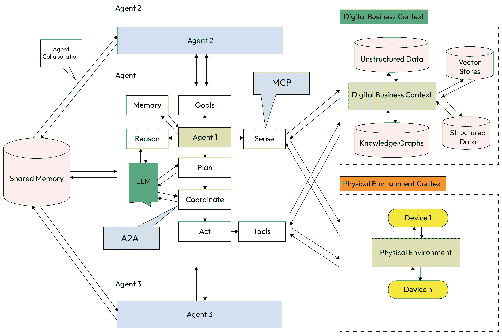
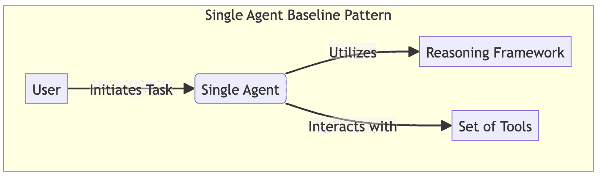
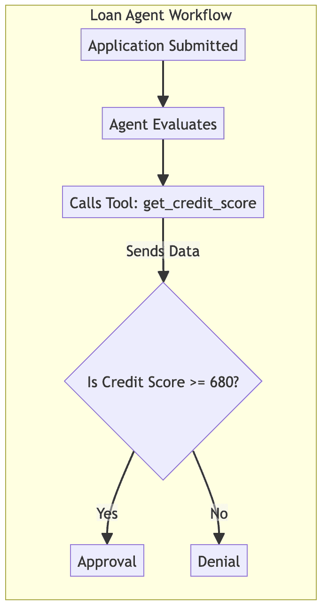
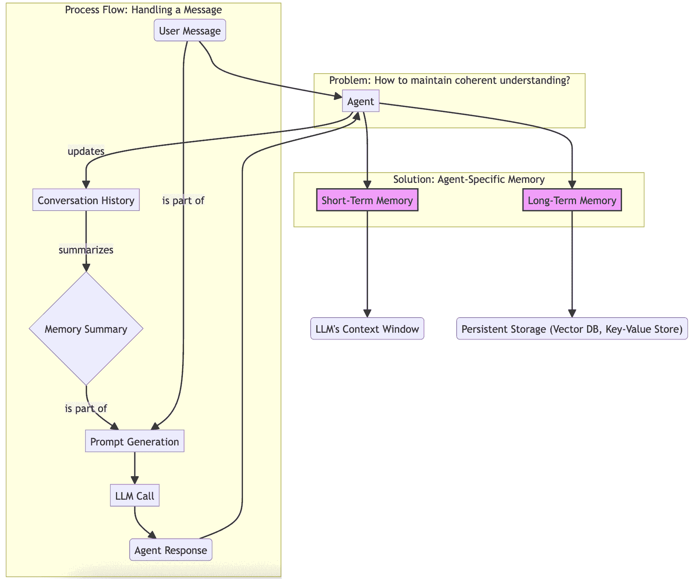
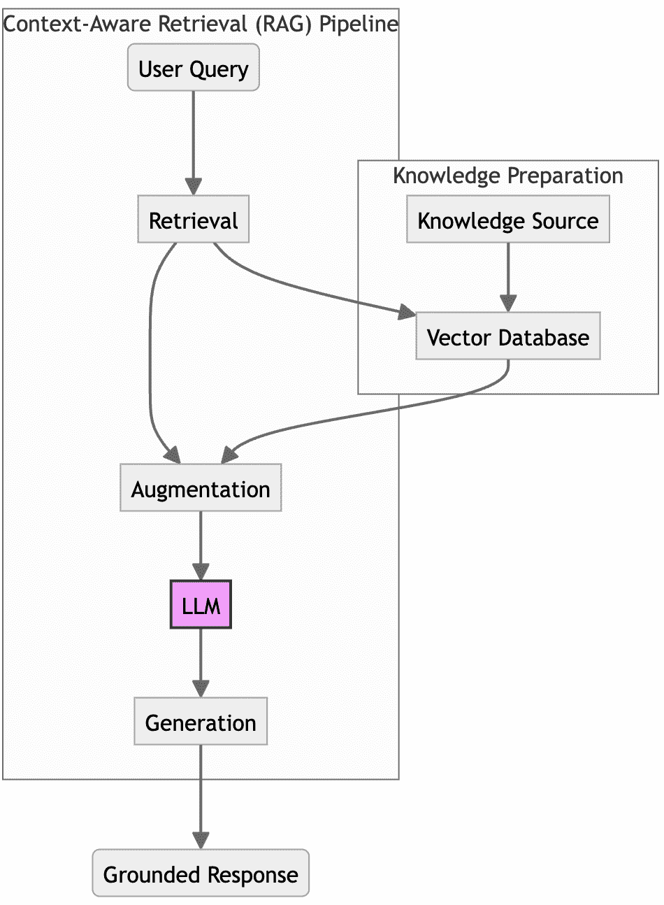
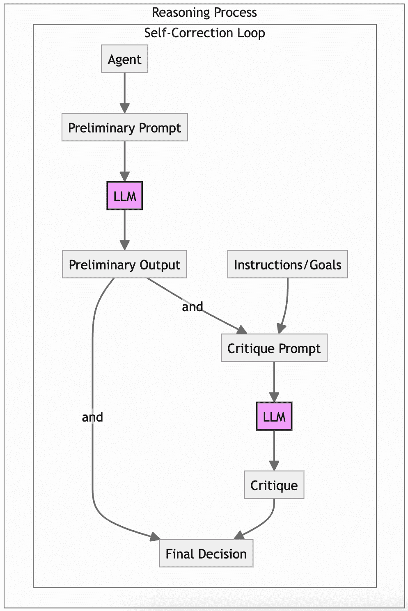
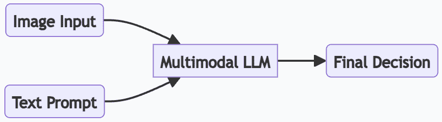

# 第九章：代理级模式

在前面的章节中，我们探讨了支配多个代理在强大系统架构内协作的模式。现在，我们将聚焦于任何此类生态系统的基本单元：单个自主代理。本章致力于定义代理内部架构并使其核心组件活跃起来的代理级模式。

这些模式构成了代理基本能力的蓝图：它如何感知其环境，如何管理其内存，如何构建其推理，以及它如何作用于世界。

精通这些个别模式是构建用于生产级企业解决方案的复杂、协作多代理系统的第一步。

为了使这些模式尽可能实用，我们将采取“事前有地图”的方法，从提供代理发展成熟度模型的战略指南开始。通过首先理解大局，您将拥有欣赏每个特定模式如何适应以及为什么它对于构建不仅强大而且可靠且具有目的性的代理至关重要的背景。

在本章中，我们将涵盖以下主题：

+   实施代理级模式的战略指南

+   单个代理基线

+   代理特定上下文和内存

+   RAG

+   结构化推理和自我纠正

+   多模态感官输入

+   企业推广指南

+   衡量成功：按模式评估指标

让我们从探索这个战略指南和代理成熟度模型开始。

# 实施代理级模式的战略指南

知道 idx_314541a9 个别模式是第一步。下一步是将它们战略性地应用，构建既强大又实用的代理。正确的方法是逐步采用这些能力，将它们分层以匹配代理角色日益增长复杂性和责任。

## 实现代理能力所需的组件

成熟度模型为开发代理提供了 idx_f2f10afaa 战略路线图，从简单的工具用户发展到复杂的、敏锐的专业人士。通过确定您的代理所需的能力，您可以选择在正确的时间实施正确的模式集。

让我们更深入地探讨实现代理能力所需的组件，如图 1 章中介绍的代理解剖图所示。这些模式描述了单个代理内部组件之间的交互，如图中所示。



图 9.1 – 代理解剖结构

在*第四章*中，我们根据动词和动作定义了智能体的解剖结构，例如*感知*、*推理*、*计划*、*行动*和*回忆*（记忆），作为自主系统的基本构建块。我们把这些动词比作智能体的“器官”，这些器官执行操作，允许智能体在一个连续的操作循环中运行。

然而，*了解*解剖结构只是第一步。为了过渡到生产就绪的系统，我们需要应用特定的**智能体级模式**，这些模式将这些组件适应企业数据和业务流程自动化所需的复杂逻辑的现实情况。以下表格将我们之前探索的解剖组件映射到本章中涵盖的设计模式，将我们的重点从智能体是什么转移到每个能力如何被工程化以实现可靠性和可扩展性。

| **组件** | **能力** | **通过模式实现的组件间交互** | **总结** |
| --- | --- | --- | --- |
| 行动和工具 | 执行直接命令并使用简单工具 | 单智能体基线 | 智能体作为基本的自动化工具。它使用*行动*块来执行工作流程，并使用*工具*块来与外部 API 接口。 |
| 记忆 | 处理多轮对话并记住关键事实 | 智能体特定记忆 | 智能体变得有状态。*记忆*组件持续会话历史和用户偏好以保持上下文。 |
| 记忆 | 访问并推理外部、特定领域的数据 | 基于上下文的检索（RAG） | 智能体基于事实知识。*记忆*组件被增强以检索外部数据，减少幻觉。 |
| 推理和计划 | 透明地推理并纠正自己的错误 | 结构化推理和自我纠正 | 智能体变得可靠。它使用*推理*组件来思考问题，并使用*计划*组件来结构化复杂任务。 |
| 感知 | 理解并处理来自文档和 UI 的视觉信息 | 多模态感官输入 | 智能体作为通向世界的大门。在处理之前，*感知*组件会摄取多模态输入（图像、音频） |

表 9.1 - 采用智能体级模式的组件和模式

## 内部智能体架构：模式如何相互配合

这些 idx_73732a15 模式不是孤立的特征，而是智能体内部架构的集成组件。它们增强了智能体的核心认知循环*感知 -**-**>* *推理 -**-**>* *行动*：

+   **感知层**：这是智能体通向世界的大门。它处理原始输入并为推理引擎准备数据。

    **模式启用**：***多模态感官输入***使这一层能够处理不仅仅是文本，还包括图像、声音和其他数据格式。

+   **记忆** **和** **知识** **层**：这一层为代理提供了有效推理所需的环境。它不是核心循环的一部分，但作为认知层的关键资源。

    **启用的模式**：***代理特定记忆***提供会话历史和用户偏好，而***RAG***检索器按需检索外部知识。

+   **认知** **和** **推理** **层**：这是代理的“大脑”，由 LLM 提供动力。它制定计划、做出决策并制定回应。

    **启用的模式**：***结构化推理***和***自我校正***模式在此处运行，确保代理的思维过程是稳健的、透明的，并与其目标一致。

+   **行动** **层**：这一层执行认知层做出的决策。这是代理与其环境互动的地方。

    **启用的模式**：***单个代理基线***定义了代理使用此层中存放的工具（API 和函数）以产生变化的核心能力。

现在，让我们根据之前成熟度模型表中的描述，逐一探索每种模式的细节。请注意，为了从成熟度的一个级别过渡到下一个级别，您需要考虑实施下一个成熟度级别的模式。这样，它将为您提供一个非常清晰的路径，从您目前的位置到您想要达到的位置，从企业对代理人工智能的复杂度、能力、采用率和成熟度水平。

# 单个代理基线

在深入研究更复杂的模式之前，让我们建立一个基线。***单个代理基线***模式代表了 idx_0a90e914 代理系统的最简单形式，其中单个代理被分配处理完整工作流程的任务，通过访问各种工具。它是大多数代理实现的起点，并作为衡量更高级架构的基准。

## 环境

这种 idx_0e1d6f56 模式非常适合那些足够复杂以至于需要使用工具，但又不必要多个协作代理开销的任务。它是构建面向任务的代理系统的最常见起点。

## 问题

如何构建一个基本但功能齐全的代理，使其能够执行一系列半自主行动以实现目标？

## 解决方案

该 idx_98d2ef7dsolution 方案涉及创建一个由 LLM 驱动的单个代理。这个代理提供了一套工具（函数或 API）和一个在指令提示中描述的目标。使用推理框架 idx_24ff7c12，如**ReAct**（**Reason-Act**）或更复杂的**分形思维链**（**FCoT**），代理的 LLM 核心独立决定调用哪些工具、以何种顺序以及使用何种参数来收集信息并完成任务。整个思维过程（即推理）和执行逻辑（即计划）都包含在这个单个代理中。

以下图示说明了此架构。*图 9.2*显示了通用的高级模式，而*图 9.3*提供了更具体的流程，说明此代理如何处理具体任务。



图 9.2 – 单个代理基线模式

现在我们已经看到了高级架构，让我们通过一个具体示例来了解此模式是如何实现的。

## 示例：一个简单的贷款批准代理

一家银行 idx_55168203 希望自动化贷款申请的初步审查。任务分配给`SingleLoanAgent`：

+   **代理的目标**：根据信用评分阈值`680`决定是否批准或拒绝贷款申请。

+   **可用工具**：一个`get_credit_score`工具，可以检索给定申请人 ID 的分数

代理的执行流程如下：

1.  **接收任务**：代理被赋予以下目标：`处理申请人的贷款申请，申请人为'john_doe_123'，贷款金额为 50000。`

1.  **推理**：代理的 LLM 确定，为了评估贷款，它首先需要申请人的信用评分。

1.  **工具选择和执行**：它确定`get_credit_score`工具是正确的选择。它使用`applicant_id='john_doe_123'`参数调用该工具。

1.  **观察**：工具执行并返回值为`720`。

1.  **最终推理和行动**：代理现在拥有所有必要的信息。它将 idx_0bc94b14 的分数（`720`）与所需的阈值（`680`）进行比较。由于分数足够，它得出结论，最终行动是批准贷款。

1.  **响应**：代理返回最终答案：`批准`。



图 9.3 – 单个代理贷款代理工作流程

## 示例实现

这里是一个简化 idx_7264f974 的单个代理贷款申请实现。为了清晰起见，模拟了 LLM 的推理和决策步骤：

```py
# A mock tool for the agent to use
def get_credit_score(applicant_id: str) -> int:
    """Retrieves the credit score for a given applicant ID."""
print(f"TOOL CALLED: Getting credit score for {applicant_id}...")
    # In a real system, this would call an external API
if applicant_id == "john_doe_123":
        return 720
return 640
class SingleLoanAgent:
    def __init__(self):
        # The agent has a dictionary of available tools
self.tools = {"get_credit_score": get_credit_score}

    def process_application(self, applicant_id: str, loan_amount: int):
        """Processes a loan application for a given applicant."""
print(f"\nAGENT: Received task for applicant {applicant_id}.")

        # 1> Agent reasons it needs the credit score and calls the tool
        credit_score = self.tools"get_credit_score"
        print(f"AGENT: Observed credit score is {credit_score}.")

        # 2> Agent reasons about the final decision based on the tool's output
# In a real system, this would be a second LLM call
        prompt = f"""
        Evaluate the following loan application.
        Applicant ID: {applicant_id}
        Credit Score: {credit_score}
        Loan Amount: ${loan_amount}
        Based on a credit score threshold of 680, should this loan be 'Approved' or 'Denied'?
        """
# Simulate the LLM making a decision based on the tool's output
        response = "Approved" if credit_score >= 680 else "Denied"
print(f"AGENT DECISION: The loan for {applicant_id} is {response}.")
        return response

# --- Execute the Workflow ---
loan_agent = SingleLoanAgent()
loan_agent.process_application(applicant_id="john_doe_123", loan_amount=50000)
```

## 后果

+   **优点**:

    +   **简单性**：主要优势在于实现和调试的简单性。与多代理系统相比，管理并观察单个代理的行为和状态更容易。

+   **缺点**:

    +   **可扩展性**：随着工具数量或领域复杂性的增加，此架构的可扩展性不佳。单个代理可能会过载，其提示可能变得过于复杂而难以有效管理，从而导致性能下降和错误发生的可能性增加。

## 实施指南

***单个代理基线***提供了一个完整、自包含的执行循环，允许代理通过函数调用使用工具来实现特定目标。然而，这个简单的代理是无状态的；它没有过去交互的记忆，并且将每个新任务都视为第一次。为了创建更智能和个性化的体验，代理必须能够记住它可以通过某种共享内存访问之前发生的事情。

下一个模式，***代理特定的上下文和记忆***，解决了这一基本需求。它为代理配备了其自身的状态管理系统，使其能够随着时间的推移维持对其任务和环境的连贯理解。

# 代理特定的上下文和记忆

为了使代理能够智能地行动，它必须意识到其上下文（感知其当前环境）并记住 idx_7c0b220f 在该环境中过去的交互。***代理特定的上下文和记忆***模式解决了代理维持和利用其自身专用上下文信息以指导其决策过程的需求。这包括其初始指令/目标以及其编排链：即，如果它有一个父 AI 编排器，则从其父 AI 编排器下达的指令；否则，它将依赖于直接给予它的指令和目标。这使代理从简单的命令执行者提升为可以学习和适应的状态实体。

## 上下文

这种模式对于任何需要执行超出简单、一次性命令的任务的代理至关重要。它是对话代理、长期任务自动化以及任何过去事件影响未来行动的系统的根本。

## 问题

如何 idx_b934e9bdd 代理在一段时间内保持对其任务和上下文环境的连贯理解，尤其是在多回合交互中？

## 解决方案

解决方案是 idx_5fb4cd2dto 为每个代理配备其自身的记忆或状态管理系统。这允许代理构建对其上下文的持久理解，与它接收到的即时指令相分离。这种记忆通常分为两种类型：

+   **[状态管理] 短期记忆**：通常在 LLM 的上下文窗口内管理，它保存当前任务或对话的即时历史。使用总结或最近消息的滑动窗口等技术来保持上下文的相关性和简洁性。

+   **长期记忆**：一种更持久的存储机制，如向量数据库或键值存储。在这里，代理可以存储和检索关键事实、用户偏好和过去结论，以供未来会话使用。**检索增强生成**（**RAG**）是访问这种记忆的常见模式。

**注意**

将整个对话历史简单地喂入 LLM 的上下文窗口通常是适得其反的。研究表明，模型倾向于忘记长上下文中“丢失在中间”的信息，并且可能会被无关的噪音所分散。有效的记忆管理至关重要。

## 示例：具有状态的对话贷款代理

用户 idx_9677e938 与对话代理互动以启动贷款申请。代理使用记忆来维持连贯的对话：

+   **代理目标**：在多个回合中引导用户完成贷款申请，记住对话的上下文

状态交互展开：

1.  **第 1 轮（****用户****）**：`我需要申请房贷。`

1.  **回合 1（**代理**）**：代理响应，`我可以帮您。申请人的 ID 是多少？`然后它更新其短期记忆摘要为`用户正在询问房屋贷款。`

1.  **回合 2（**用户**）**：`我的 ID 是'jane_doe_456'。`

1.  **回合 2（**代理**）**：代理收到新消息。它将记忆摘要与新消息结合，形成一个完整的画面。它理解`'jane_doe_456'`是房屋贷款查询的申请人 ID。它回应，`谢谢。Jane Doe 的贷款金额是多少？`并再次更新其记忆。

由于其 idx_1a411e04 记忆，代理避免了提出重复问题，并保持自然、逻辑的对话流程。



图 9.4 – 代理特定记忆

## **示例实现**：

此示例 idx_83038b47 展示了管理短期记忆的简单综合方法：

```py
class ConversationalLoanAgent:
    def __init__(self):
        self.conversation_history = []
        self.memory_summary = "No prior conversation."
def _update_memory(self):
        """Summarizes the conversation to manage context size."""
# In a real implementation, this would be an LLM call to summarize.
if len(self.conversation_history) > 1:
            last_exchange = (
                f"User: '{self.conversation_history[-2]['content']}', "
f"Agent: '{self.conversation_history[-1]['content']}'"
            )
            self.memory_summary = (
                "The conversation is about a loan application. "
f"The last topic was: {last_exchange}"
            )

        print(f"MEMORY UPDATED: {self.memory_summary}")

    def handle_message(self, user_message: str):
        """Handles a new message from the user in a conversation."""
self.conversation_history.append(
            {"role": "user", "content": user_message}
        )

        # The agent's prompt includes the memory summary for context
        prompt = f"""
        Conversation Summary: {self.memory_summary}
        Latest User Message: "{user_message}"
        Respond to the user's latest message in a helpful manner.
        """
# Simulate LLM response based on the full context
# response = self.llm.generate(prompt)
if "loan" in user_message:
            response = "I can help with that. What is the applicant's ID?"
else:
            response = "Thank you. What is the loan amount?"
self.conversation_history.append(
            {"role": "agent", "content": response}
        )

        self._update_memory()
        return response

# --- Execute the Workflow ---
agent = ConversationalLoanAgent()
print("--- Turn 1 ---")
agent.handle_message("I need to apply for a home loan.")
print("\n--- Turn 2 ---")
agent.handle_message("My ID is 'jane_doe_456'.")
```

## **后果**：

+   **优点**：

    +   **状态行为** **和** **个性化**：这种模式是使行为连贯、具有状态性的关键。它允许代理从经验中学习，记住用户偏好，并随着时间的推移调整其行为。

+   **缺点**：

    +   **复杂性和上下文漂移**：实现一个健壮的记忆系统增加了复杂性。管理不善的记忆可能导致代理回忆起过时或不相关信息，这种现象称为上下文漂移，可能会降低性能。

## 实现指南

对于 idx_4d55fbf3 短期记忆，可以从简单的策略开始，例如使用最后 *N* 个对话回合的“滑动窗口”或如示例中所示的综合方法。对于长期记忆，连接到向量数据库的 RAG 系统是标准方法。在长期记忆中存储什么信息要慎重考虑；关注高价值数据，如用户资料、关键决策和最终事实，以避免将噪声污染到记忆中。

给代理一个一般或共享的记忆允许它保持对任务或对话的连贯内部模型。然而，为了将其推理建立在外部、事实知识上，它需要一个更专业的机制来按需访问特定信息。

idx_507e37f 的下一个模式，RAG，提供了这种能力，允许代理查询庞大的知识库以找到相关信息并增强其响应，显著降低幻觉的风险。

# 使用 RAG 感知

虽然 idx_3582a72d 代理的一般记忆提供了**对话**上下文，但 RAG 模式提供了将推理建立在**外部、事实**知识上的具体机制。这是增强代理性能、减少幻觉并使其与专有或实时信息连接的最有效和最广泛采用的模式之一。

## **上下文**：

当代理的任务需要超越 LLM 静态、预训练知识的准确性时，此模式 idx_b43e030e 至关重要。它在客户支持、研究、法律分析和任何必须基于特定文档集做出决定的领域中得到广泛应用。

## **问题**

LLMs 是 idx_9c027157 在庞大的但静态的数据集上预训练的，这意味着它们的知识可能过时或缺乏企业特定上下文。代理如何访问和推理最新的、专有的或特定领域的知识，而无需昂贵的重新训练？

## 解决方案

**RAG**模式 idx_7a0c0ce 通过一个管道连接代理到一个或多个外部知识源，在 LLM 生成响应之前，用相关的检索事实增强其提示。该过程涉及以下步骤：

1.  **索引**：企业文档被清理、分成可管理的块，并转换为向量嵌入，然后存储在向量数据库中。

1.  **检索**：当代理收到查询时，系统根据语义相似性从向量数据库中检索最相关的文档块。

1.  **增强**：检索到的块被插入到代理的提示中，作为 LLM 的额外上下文。

1.  **生成**：LLM 使用这个增强的上下文来生成一个基于提供信息的响应。

**提示**

RAG 的复杂性可以有所不同。**简单 RAG**涉及直接的检索和生成工作流程，而**进化的 RAG**引入了能够执行查询重构或迭代检索等任务的专用代理。

## 示例：一个 RAG 启用贷款代理

`SingleLoanAgent`需要 idx_f89e6dd1 根据最新的、最复杂的内部贷款政策做出决定：

+   **代理目标**：通过咨询最新的内部政策文件来评估高价值贷款申请

+   **知识来源**：包含银行所有贷款政策的向量数据库

RAG 增强的工作流程如下：

1.  **接收任务**：代理收到一份 750,000 美元的贷款申请。

1.  **检索**：在做出决定之前，代理使用以下查询对其`RAGRetriever`工具进行查询：`高价值贷款的策略`。检索器在向量数据库上执行语义搜索，并找到一个文档块，其中声明`策略 #23B：超过 50 万美元的贷款需要 740 分的信用评分和人工审查。`

1.  **增强**：代理的推理提示通过检索到的策略进行了增强。

1.  **基于事实的推理**：代理的 LLM 现在使用这个新上下文进行推理。它看到申请人的分数`720`低于此规模贷款所需的`740`。

1.  **基于事实的响应**：代理返回一个明确基于检索策略的决定：`由于根据策略 #23B 对高价值贷款的信用评分不足而被拒绝。`



图 9.5 – 基于上下文的检索（RAG）代理

## 示例实现

这个 idx_1315dddc 示例模拟了一个 RAG 系统，其中代理检索相关政策文件以做出更细微的决定：

```py
# --- RAG Components Simulation ---
class RAGRetriever:
    def __init__(self):
        # In a real system, this connects to a vector database
self.knowledge_base = {
            "high_value_loan": "Policy #23B: Loans over $500,000 require a credit score of 740.",
            "standard_loan": "Policy #17A: Standard loans require a credit score of 680."
        }

    def retrieve(self, query: str) -> str:
        """Retrieves a relevant document based on the query."""
if (
            "high value" in query.lower()
            or "500000" in query
            or "750000" in query
        ):
            return self.knowledge_base["high_value_loan"]

        return self.knowledge_base["standard_loan"]

# --- RAG-Enabled Agent ---
class RAGEnabledLoanAgent:
    def __init__(self):
        self.retriever = RAGRetriever()
        # self.tools = {"get_credit_score": get_credit_score} from previous pattern
def process_application(self, applicant_id: str, loan_amount: int):
        # credit_score = self.tools"get_credit_score"

        credit_score = 720 # Simulating tool call for this example
# 1> Retrieve relevant context before reasoning
        retrieved_context = self.retriever.retrieve(
            f"policy for loan of ${loan_amount}"
        )

        print(f"CONTEXT RETRIEVED: {retrieved_context}")

        # 2> Augment the prompt with the retrieved context
        prompt = f"""
        CONTEXT: {retrieved_context}
        TASK: Evaluate the loan for {applicant_id}
        with a score of {credit_score} and amount of ${loan_amount}.
        State your reasoning based on the provided context.
        """
# 3> Simulate the LLM's grounded reasoning
# response = self.llm.generate(prompt)
if loan_amount > 500000 and credit_score < 740:
            response = (
                "Denied due to high loan amount and insufficient "
"credit score as per Policy 23B."
            )
        elif credit_score < 680:
            response = (
                "Denied due to credit score below the threshold "
"in Policy 17A."
            )
        else:
            response = "Approved."
print(f"AGENT DECISION: {response}")
        return response

# --- Execute Workflow ---
rag_agent = RAGEnabledLoanAgent()
rag_agent.process_application(
    applicant_id="jane_doe_456",
    loan_amount=750000
)
```

## 后果

+   **优点**：

    +   **准确性和可信度**：RAG 通过将代理的响应基于事实数据来大幅减少幻觉并提高其准确性。这建立了用户对系统输出的信任。

    +   **知识新鲜度**：它允许通过简单地更新知识源来实时更新代理的知识，而无需重新训练 LLM。

+   **缺点**：

    +   **对检索质量的依赖性**：RAG 系统的性能高度依赖于索引数据的质量和检索机制的有效性。如果检索器检索到不相关的上下文，它可能会混淆 LLM 并降低响应质量。

    +   **上下文漂移**：一种称为**RAG 漂移**的现象 idx_6aad7ae0 可能发生，其中索引知识本身变得陈旧或过时，导致性能随时间下降。

## 实施指南

你检索 idx_d44701bc 的质量至关重要。投资于一个强大的文档处理管道，有效地清理和分块源数据。嵌入模型和向量数据库的选择应针对您的特定领域。对于复杂查询，考虑实现代理 RAG，其中专门的代理可以细化用户的初始查询，进行迭代搜索，并从多个检索到的文档中综合结果，为 LLM 提供最佳可能的上下文。

**RAG**模式为代理提供了进行有效推理所需的外部知识。然而，仅仅拥有正确的信息是不够的；代理还必须有一个强大的内部过程来思考这些信息，以便得出可靠的结论。

下一组模式，专注于**结构化推理和自我纠正**，提供了引导代理思维过程的技巧，使其更加逻辑、透明，并与目标一致。

# 结构化推理和自我纠正

代理推理的能力是其自主性的核心。这个模式系列专注于构建代理的内部思维过程，以提高其推理质量并实现自我纠正，超越简单的单步决策。

## 背景

这些 idx_08383642 模式在代理结论的可靠性和可解释性至关重要的情况下使用。它们在复杂、多步骤的任务中特别有价值，在这些任务中，代理误解其指令或未能考虑所有相关约束的风险很高。

## 问题

你如何确保代理的推理过程是逻辑的、透明的，并与其核心指令一致，尤其是在复杂、多步骤的任务中？

## 解决方案

解决方案是 idx_175fc8c8，以实现高级提示技术和内部验证循环，引导 LLM 的推理过程并鼓励其审查自己的工作。这些技术通常组合在一起：

+   **持久指令锚定**（来自*第六章*）：关键指令或目标使用不同的标签（例如，`#OBJECTIVE:`）嵌入到提示中，并在上下文的开始和结束时重复或放置，以解决“中间丢失”问题。

+   **指令忠实度审计（自我纠正）**（来自*第六章*）：代理被设计在最终确定之前对自己的输出进行自我审查。这是一个多步骤的过程：首先，代理生成初步响应；然后，它运行一个“批评”步骤，其中它评估自己的输出与原始指令和上下文。

+   **思维链（CoT）及其** **“****基础**”**变体：不是要求立即给出答案，而是提示代理“逐步思考”。这迫使 LLM 外部化其推理过程，这通常会导致更准确的结果，并提供其逻辑的清晰审计轨迹。变体包括思维图、思维树等。

+   **分形思维链（FCoT）**：使用越来越详细的内容视窗，我们 idx_0f2ca5f7 聚焦于 idx_50acaecf 不同粒度级别，从宏观到中观，最后到微观。在每一级，我们定义并应用双重目标函数：一个最大化我们感兴趣的因素，另一个最小化该因素。在每次迭代/循环中，我们自我反思并纠正前一轮推理中遗漏的内容。



图 9.6 – 一个自我纠正循环，其中代理生成初步输出，然后根据其目标进行批评，从而得到更可靠的最终结果

## 示例：一个自我纠正的贷款代理

一个`RAGEnabledLoanAgent`使用 idx_bb479c07 自我纠正循环来确保其决定完全符合通过 RAG 检索到的复杂政策：

+   **代理目标**：评估高价值贷款并提供一个正确且完整应用相关内部政策的决定

+   **检索到的上下文**：代理检索到`政策 #23B：超过 500,000 美元的贷款需要 740 分的信用评分和人工审查。`

自我纠正工作流程展开：

1.  **初始推理（CoT）**：代理收到一份 720 分信用评分的 75 万美元贷款申请。它使用 CoT 生成初步决定：`步骤 1：贷款是高价值的。步骤 2：政策 #23B 适用。步骤 3：720 分的评分低于 740 分。初步决定：拒绝。`

1.  **自我批评**：在返回答案之前，代理的内部审计员被提示回顾针对检索到的上下文的初步决定，具体寻找遗漏的细节。

1.  **识别到的修正**：批评步骤识别到一个错误：`批评：拒绝的决定是正确的，但推理是不完整的。政策#23B 还提到，该申请有资格进行'人工审查'。这个选项应该包含在最终答案中。`

1.  **最终，修正后的输出**：代理将批评意见纳入，生成一个更完整和更准确的最终决策：`最终决策：根据政策#23B 自动批准被拒绝。然而，该申请有资格进行人工审查。`

## 示例实现

以下 idx_a741ff37 实现演示了一个利用批评循环的`SelfCorrectingAgent`。该代理不是返回第一个结果，而是被安排暂停，审查其初步输出与检索到的政策约束之间的差异，并在必要时生成修正后的最终响应：

```py
class SelfCorrectingAgent:
    def __init__(self):
        # self.tools = {"get_credit_score": get_credit_score} from previous pattern
# self.retriever = RAGRetriever() from previous pattern
pass
def process_with_self_correction(self, applicant_id: str, loan_amount: int):
        # credit_score = self.tools"get_credit_score"
# context = self.retriever.retrieve(f"policy for ${loan_amount}")

        credit_score = 720
        context = (
            "Policy 23B: Loans over $500,000 require a credit score "
"of 740 and a manual review."
        )

        # 1> Generate a preliminary decision using CoT and Anchoring
        preliminary_prompt = f"""
        OBJECTIVE: Provide an initial loan decision based on the context.
        CONTEXT: {context}
        DATA: Applicant {applicant_id} has score {credit_score},
        wants ${loan_amount}.
        Think step-by-step and provide a preliminary decision.
        """
# Simulate LLM generating the first draft
        preliminary_decision = (
            f"Step 1: Loan is ${loan_amount}, which is high-value. "
f"Step 2: Policy 23B applies. "
f"Step 3: Score is {credit_score}, which is less than 740\. "
f"Step 4: PRELIMINARY DECISION: Denied."
        )

        print(f"PRELIMINARY REASONING: {preliminary_decision}")

        # 2> Generate a critique of the preliminary decision
        critique_prompt = f"""
        OBJECTIVE: You are an auditor. Verify if the preliminary decision
        correctly follows all rules in the context.
        CONTEXT: {context}
        PRELIMINARY DECISION: {preliminary_decision}
        Does the decision correctly apply the policy?
        Is there anything missed? For example, does the policy mention
        a manual review?
        """
# Simulate LLM generating the critique
        critique = (
            "Critique: The decision to deny is correct, but Policy 23B "
"also mentions a 'manual review' as an option. "
"The reasoning should include this."
        )

        print(f"SELF-CRITIQUE: {critique}")

        # 3> Generate a final, corrected decision
# final_prompt = f"..."

        final_decision = (
            "FINAL DECISION: Denied for automatic approval based on Policy 23B. "
"However, the application is eligible for a manual review."
        )

        print(f"FINAL AGENT DECISION: {final_decision}")
        return final_decision

# --- Execute Workflow ---
self_correcting_agent = SelfCorrectingAgent()
self_correcting_agent.process_with_self_correction(
    "jane_doe_456",
    750000
)
```

## 后果

+   **优点**：

    +   **可靠性和透明度**：这些模式导致更稳健、可靠和透明的推理。外部化的思维过程使得开发者更容易调试代理行为，审计员也更容易理解决策的原因。

+   **缺点**：

    +   **延迟和成本**：这些技术由于额外的推理或验证步骤而增加了延迟和计算成本。例如，自纠正循环需要至少两个单独的 LLM 调用而不是一个。

## 实施指南

将这些模式组合起来以产生最大效果。在所有复杂的提示中使用***持久指令锚定***以保持代理在任务上。使用***思维链**来执行初始推理遍历，以生成透明、逐步的分析。最后，对于高风险决策，添加一个***自我纠正***循环，其中第二个提示明确要求 LLM 扮演批评者或审计员的角色，以审查初始 CoT 推理与原始上下文和约束之间的差异。

结构化推理模式为代理提供了一个稳健的内部思维过程。然而，现实世界中的大部分数据并非基于文本。为了真正有效，代理必须能够感知和理解视觉信息，如文档、图表和用户界面。下一个模式，***多模态感官输入***，为代理提供了这种关键能力，使他们能够以与人类相同的方式观察和解释世界。

# 多模态感官输入

为了在依赖于视觉文档和用户界面的工作流程中有效运行 idx_67a53907，代理必须能够处理不仅仅是文本。***多模态感官输入***模式扩展了代理的感知范围，使其能够将图像、截图和视觉数据作为其推理过程的一部分进行解释。这使得代理从简单的聊天机器人转变为真正的共飞行员，能够以视觉方式理解其环境。

## 上下文

这种 idx_2386189e 模式对于金融（处理发票）、医疗保健（分析医疗表格）和物流（读取运输标签）等文档密集型行业的代理至关重要。它特别相关，因为企业要求代理将截图、发票或产品图像作为其工作流程的一部分进行解释。

## 问题

如何使代理在依赖于视觉文档和用户界面的工作流中有效地运行？

## 解决方案

解决方案是 idx_a4c97f06 将多模态功能集成到代理的感知组件中。这允许代理处理图像，通过**光**学**字**符**识**别**（**OCR**）提取文本，并理解空间布局以执行操作。有两种主要的实现方法，在控制性和简单性之间提供权衡：

+   **实现一个专用工具的管道**：这种方法使用一系列单一用途的模型或服务。代理首先将图像发送到专用工具，例如 OCR 服务，以提取文本。然后，提取的文本被传递到单独的 LLM 进行推理。这种方法提供了对每个步骤过程更大的控制。

+   **采用原生多模态模型**：一种更先进的方法是使用一个内在的多模态基础模型，例如谷歌的 Gemini 系列模型。这些模型被训练以同时处理图像、文本、音频和视频输入。代理可以直接将图像和文本提示输入到模型中，模型在单步中处理视觉解析和推理。

虽然这两种方法描述了代理如何处理感官数据，但一个相关的挑战是如何从其环境中安全可靠地获取这些数据。这对于代理来说尤为重要，因为代理不仅感知其数字环境，还感知物理世界。正在出现标准化的协议来规范这种信息交换：

+   **模型上下文协议**（**MCP**）：MCP 为代理提供了一个标准化的、安全的方式，使其能够从其自身组织中发现和交互工具。它作为开发单个代理的基本构建块，允许代理安全地获取资源（例如来自物联网设备）或作为推理过程输入的上下文信息。

+   **代理到代理**（**A2A**）**协议**：A2A 协议是为代理到代理通信设计的，通常跨越组织边界。它是创建复杂工作流或多代理编排器的构建块，允许不同的代理（例如，来自您公司的一个和来自合作伙伴的一个）安全通信以实现共同目标，处理诸如授权和身份验证（例如，OAuth）等要求。

## 示例：从图像中处理贷款申请

一名贷款代理 idx_2e2aa7b 需要处理已作为扫描图像提交的申请：

+   **代理目标**：从贷款申请图像中提取关键信息并做出初步决定

+   **管道方法**:

    1.  **感知**：代理接收申请表图像。

    1.  **工具使用（OCR）**：它将图像发送到专门的`ocr_service`工具。

    1.  **观察**：工具返回提取的文本：“申请人：约翰·多伊，贷款金额：$600,000。”

    1.  **原因**：代理现在将提取的文本传递给其 LLM 核心以执行最终推理和决策。


图 9.7 – 通过多模态管道进行的多模态处理

+   **原生多模态方法**:

    +   **感知**：代理接收图像和文本提示：“分析这个贷款申请表图像并做出决定。”

    +   **原因**：它将图像和文本直接发送到原生多模态 LLM。单个模型在一步中执行 OCR 和决策，返回完整分析。



图 9.8 – 原生多模态 LLM 多模态处理

## 示例实现

以下代码对比了两种实现策略。首先，`PipelineMultimodalAgent`演示了基于工具的方法，其中专业 OCR 服务提取文本，然后传递给 LLM。其次，`NativeMultimodalAgent`展示了简化方法，直接将图像传递给多模态模型以进行同时分析和推理：

```py
# --- Implementation 1: Pipeline of Specialized Tools ---
def ocr_service(image_bytes: bytes) -> str:
    """Mock OCR service that extracts text from an image."""
# In a real system, a call to a service like Google Cloud Document AI would be made
print("TOOL CALLED: OCR Service")
    return "Applicant: John Doe, ID: john_doe_123, Loan Amount: $600,000"
class PipelineMultimodalAgent:
    def process_application_from_image(self, image_file: bytes):
        """Processes a loan application submitted as an image using a pipeline."""
print("\n--- AGENT PERCEPTION (Pipeline) ---")

        # Step 1: Use an external tool for OCR
        extracted_text = ocr_service(image_file)
        print(f"OCR EXTRACTION: '{extracted_text}'")

        # Step 2: Use an LLM to reason over the extracted text
print("AGENT REASONING: Sending extracted text to LLM for decision.")

        # ... additional agent logic here ...
return "Decision based on pipeline processing."
# --- Implementation 2: Native Multimodal Model ---
# Placeholder for a native multimodal LLM
class NativeMultimodalLLM:
    def generate_content(self, text_prompt: str, image_file: bytes) -> str:
        """Simulates a native multimodal model call."""
print("MODEL: Receiving image and text simultaneously...")
        return (
            "Interpreting image data... Extracted text: "
"'Applicant: John Doe, ID: john_doe_123, Loan Amount: $600,000'. "
"Final analysis: Approved."
        )

class NativeMultimodalAgent:
    def __init__(self):
        self.llm = NativeMultimodalLLM()

    def process_application_from_image(self, image_file: bytes):
        """Processes a loan application with a native multimodal model."""
print("\n--- AGENT PERCEPTION (Native Multimodal) ---")

        prompt = "Analyze this loan application form image and provide a decision."
        response = self.llm.generate_content(
            text_prompt=prompt,
            image_file=image_file
        )

        print(f"MODEL RESPONSE: '{response}'")

        # ... additional agent logic to parse response and act ...
return "Decision based on native multimodal processing."
# --- Execute Workflows ---
dummy_image = b"some_image_bytes"

pipeline_agent = PipelineMultimodalAgent()
pipeline_agent.process_application_from_image(dummy_image)

native_agent = NativeMultimodalAgent()
native_agent.process_application_from_image(dummy_image)
```

## 后果

+   **优点**:

    +   **扩展用例**：这种模式显著扩大了代理的应用用例，使其从基于语言的工具转变为可以与人类使用相同界面的数字助手。例如，多模态代理可以通过解释审批工作流程中的图像来减少索赔处理时间。

+   **缺点**:

    +   **成本和延迟**：多模态模型在计算上更昂贵，并且可能具有更高的延迟。它们通常需要专用基础设施（例如 GPU）以及与纯文本模型不同的测试和验证方法。

## 实施指南

根据您的具体需求选择您的 idx_47839ff6 方法。*管道*方法通常是一个好的起点，因为它允许您使用最佳级别的专业服务（例如高度准确的 OCR 工具），并且对每个步骤提供了更多的控制和可观察性。*原生多模态模型方法*更易于编排，对于需要深入、全面理解图像和文本的任务可能更强大，但可能提供更细粒度的控制。

虽然我们探索的模式定义了智能体内部认知循环的“什么”和“如何”，但对于企业来说，挑战在于确定“何时”。从理论蓝图过渡到实际生产环境需要一种平衡雄心和可靠性的战术序列。在下一节中，我们将将这些模式转化为分阶段路线图，确保每个能力都建立在稳定信任和可衡量成功的基础上。

# 企业推广指南

与成熟度模型对齐的分阶段实施是部署有能力的智能体的最有效方法。这允许您的团队建立信任和可靠性的基础，随着系统的扩展，逐步添加更高级的能力。

| **阶段** | **实现模式** | **理由** |
| --- | --- | --- |
| 第一阶段：基础自动化 | 单个智能体基线，智能体特定记忆 | 从一个简单的、事务性的智能体开始，用于高容量、低风险的任务（例如，内部 IT 帮助台机器人）。这证明了即时的价值并建立了核心基础设施。 |
| 第二阶段：建立专业知识 | 上下文感知检索（RAG） | 通过将其连接到知识库（例如，技术文档）来增强智能体。这使得智能体成为信息来源的信任者。 |
| 第三阶段：高度信任的自主性 | 结构化推理，多模态输入 | 对于关键流程，添加自我纠正以提高可靠性和处理真实世界视觉数据的能力。这使高风险工作流程成为可能，例如处理扫描发票并自我审计其工作以供批准的财务智能体。 |

表 9.2 – 智能体能力示例部署序列

# 按模式衡量成功：评估指标

为了证明架构选择的合理性，必须量化每个模式的价值。定义清晰的指标允许您跟踪有效性并推动持续改进。

| **模式** | **指标** | **仪表** |
| --- | --- | --- |
| 单个智能体基线 | 任务完成率/工具调用成功率 | 记录每个任务的最终结果（成功/失败）。监控日志以查找失败的或错误的工具 API 调用。 |
| 智能体特定记忆 | 会话一致性评分/重复问题减少 | 使用人工评分员评分对话质量。跟踪用户需要重复智能体应记住的信息的频率。 |
| 上下文感知检索（RAG） | 幻觉率/事实准确性评分 | 将响应与黄金数据集进行比较，以衡量虚构信息的频率。 |
| 结构化推理 | 自我纠正触发率/最终错误率降低 | 跟踪批判步骤识别缺陷的频率。比较初步输出与最终输出的错误率。 |
| 多模态感官输入 | 视觉任务中的数据提取准确度/成功率 | 将 OCR 或字段提取的准确性与地面实况数据进行比较。跟踪需要图像输入的工作流程的任务完成情况。 |

表 9.3 – 评估代理级模式的示例指标

# 摘要

本章探讨了定义单个自主代理能力的必要模式。我们确定构建一个强大的代理是一个逐步的过程，从简单的基线开始，并逐步添加更复杂的行为，如记忆、知识检索、推理和感知。

关键要点如下：

+   **代理是构建的，而不是召唤的**：一个有能力的代理是精心设计的选择的结果。所讨论的模式提供了这些选择的蓝图。

+   **简单开始，智能扩展**：通往复杂代理的战略路径始于***单个代理基线***，随着代理责任的增加，逐步添加如***记忆***、***RAG***和***结构化推理***等模式。

+   **基础和可靠性至关重要**：对于一个在企业环境中被信任的代理，它必须基于事实（***RAG***）并且其推理必须稳健且透明（***自我纠正***）。

+   **感知是下一个前沿**：使用***多模态*** ***感官输入***模式处理视觉信息的能力，使代理从基于文本的处理器提升为真正的协同驾驶员，能够在以人为中心的流程中操作。

通过深思熟虑地应用这些模式，我们可以设计出可靠、智能且适合目的的个体代理。这些有能力的代理是任何更大系统的基本构建块。现在我们已经对如何构建单个、有能力的代理有了坚实的理解，我们准备探索这些构建块如何被组装。在下一章中，我们将检查系统级模式，这些模式涉及多个代理如何在统一且稳健的架构中交互、协作和治理。

# 获取此书的 PDF 版本和独家额外内容

扫描二维码（或访问[packtpub.com/unlock](https://packtpub.com/unlock)）。通过名称搜索此书，确认版本，然后按照页面上的步骤操作。


*注意：请保留您的发票。直接从* *Packt* *购买不需要发票。*
