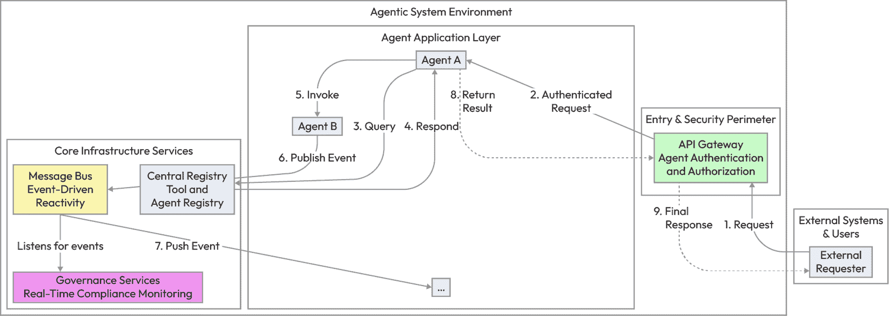
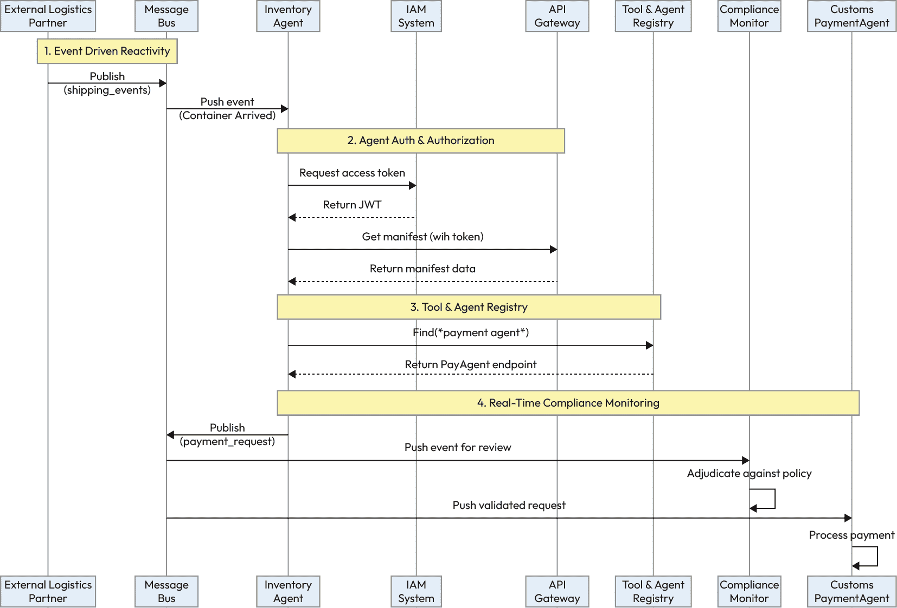
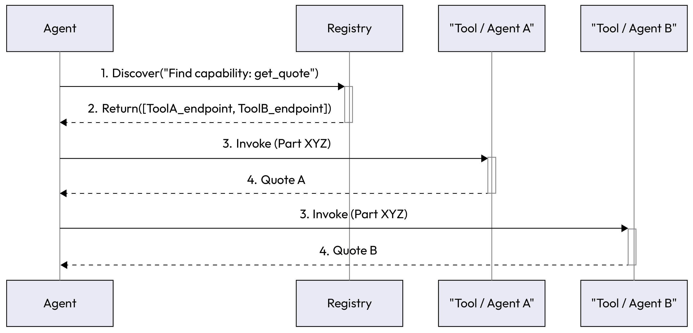
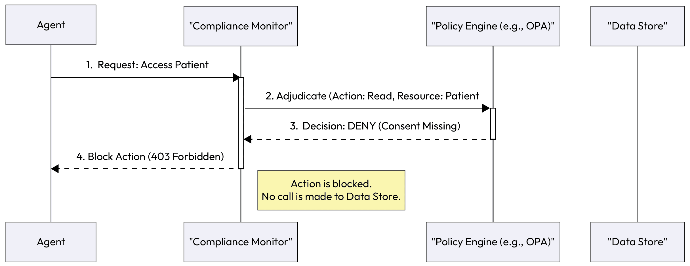
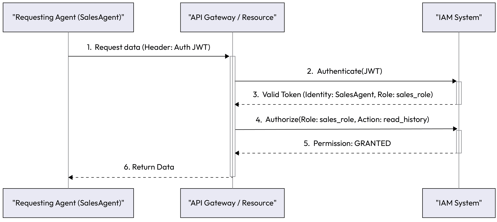
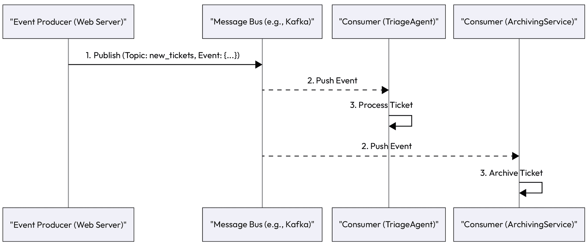

# 第十章：生产就绪的系统级模式

在前面的章节中，我们仔细检查并组装了代理人工智能的构建块。我们设计了具有记忆和推理能力的单个代理，使它们能够在复杂任务上协调，并为构建既稳健又负责任的代理所固有的挑战提供解决方案。实际上，我们已经为设计和构建高度有能力、智能的代理演员铺平了道路。现在，我们必须构建它们将生活和运作的情境世界。

如我们所知，多代理系统不仅仅是代理的集合。在许多方面，它反映了现代微服务架构，但有一个关键的区别。不是静态服务执行僵化的代码，其组件是具有推理和目标导向的自主代理。为了有效地协作并激活企业级应用，这种分布式智能需要一个完整的编排单元、政策遵守和共享基础设施。这一现实要求我们将关注点从代理本身转移到包含它的整体系统架构。因此，在本章中，我们将介绍为生产级多代理系统提供架构支撑的系统级模式。这些模式解决了任何企业应用的非协商性需求，回答了以下关键问题：

+   服务和代理如何动态地发现彼此？

+   我们如何强制执行自主代理的安全、身份和访问控制？

+   我们如何实时监控和执行合规规则？

+   系统如何异步且大规模地对外部事件做出反应？

为了尽可能使这些模式具有可操作性，我们将采用以系统为先导的方法。基于*第四章*中的代理级架构，我们将关注点从代理的内部运作转移到其所在的生态系统。在详细说明每个单独的模式之前，我们将优先考虑架构而非实现，通过展示战略指南来实现。这个指南与我们的 GenAI 成熟度模型相一致，为这些架构模式成为系统从单个代理发展到协作生态系统时的关键需求提供了路线图。

通过首先理解大局，你将拥有欣赏每个特定模式如何适应以及为什么它对于将代理概念证明转变为可靠、安全和稳健的生产环境至关重要的背景。

在本章中，我们将涵盖以下主题：

+   实施系统级模式的战略指南

+   工具和代理注册

+   实时合规监控

+   代理认证和授权

+   事件驱动反应性

# 实施系统级模式的战略指南

理解这些个别的建筑模式是构建强大代理系统的第一步。下一步，更关键的一步是将它们战略性地应用，以创建一个安全、可扩展且为企业准备就绪的基础设施。对于第一天概念验证来说，没有必要也不建议实施所有这些模式。正确的方法是随着您系统的复杂性、风险概况和规模要求的增长，逐步采用它们。

## 将系统级模式映射到 GenAI 成熟度模型

面对这些基础模式时，一个常见的问题就是，“我需要多少才能开始？”答案完全取决于您在代理人工智能旅程中的位置。为单个非关键代理实现高度可用的工具注册表是过度设计。相反，部署一个处理敏感数据但没有强大身份验证和合规性的多代理系统是疏忽的。

我们将转向 GenAI 成熟度模型，为这一旅程提供战略路线图。它将帮助您将这些建筑模式与您系统的当前能力和未来抱负相一致，确保您在正确的时间构建正确的基石。

| **级别** | **能力** | **启用** **p** **atterns** | **摘要** |
| --- | --- | --- | --- |
| 第 3 级 – 代理就绪型 LLMs | 基础模型和工具 | 对安全和反应性的初步思考：基本的 IAM（服务账户）和简单的反应性（webhooks） | 在部署任何代理之前，关于安全（IAM 集成）和通信（事件基础设施）的基础决策应包含在平台设计中。 |
| 第 4 级 – 单代理系统 | 量产级单代理 | 代理身份验证和授权、事件驱动反应性和实时合规性监控 | 随着第一个代理进入生产，安全性是不可或缺的。代理必须对其环境做出反应，如果它处理敏感任务，合规性监控变得至关重要。 |
| 第 5 级 – 多代理系统 | 协作型代理生态系统 | 工具和代理注册表 | 一旦两个或更多代理需要动态协作，注册表就成为架构的基石，在整个系统中实现发现和松散耦合。 |

表 10.1 – 将系统级模式映射到 GenAI 成熟度模型

此成熟度模型提供了“何时”的指导，即采用顺序和进度的指南。为了有效地实施这些模式，我们还需要了解“何地”，即它们如何适应量产级系统的不同功能层。

## 系统集成架构：生产就绪蓝图

此架构展示了系统级模式如何形成一个完整代理应用程序的操作骨干。这些组件不是任何单个代理的一部分，而是为所有代理提供一个安全高效的环境：

+   **API 网关（安全** **和** **入口点）**：这是所有请求进入代理系统的单一、加固的入口点。

    **模式启用**：***代理*** ***身份验证*** ***和*** ***授权***。检查签名、过期时间、受众声明和范围，并强制执行令牌轮换，以确保安全的、最小权限的代理间通信。

+   **消息总线/****事件流（反应性骨干）**：这是异步通信的中枢神经系统。

    **模式启用**：***事件-******驱动*** ***反应性***。代理通常通过作为连续消费者或通过长期存在的流连接来感知事件。当新事件到达已订阅的主题时，代理的`Sense`组件被触发，立即启动其推理循环。这允许系统在不直接耦合的情况下对变化做出反应。

+   **中央注册表（发现** **和** **目录）**：这是系统的“黄页”，允许动态发现。

    **模式启用**：***工具和*** ***代理注册表***。所有可发现的代理和工具在此注册其能力和端点。

+   **治理服务（监督** **和** **合规性）**：这是一个专门的层，用于观察和治理代理行为。

    **模式启用**：***实时*** ***合规性监控***。合规性服务或代理订阅消息总线或充当网关，拦截并裁决针对中央策略引擎的操作。为了满足企业标准，此层在操作级别（例如，`批准贷款`）、行级别（特定记录）和字段级别（例如，阻止 PII/PHI）强制执行约束。这确保在任何操作进行之前实现细粒度的合规性。

为了可视化这些组件如何创建一个统一的系统，以下图表展示了生产就绪的蓝图。它显示了外部请求如何通过安全边界流入应用程序环境，在那里代理与支持发现、通信和治理的核心基础设施服务进行交互。



图 10.1 – 一个系统集成架构，展示了系统级模式为代理应用程序提供基础基础设施

建筑蓝图显示了系统组件之间的关系。为了使这一概念具体化，以下示例从开始到结束追踪一个单一的业务事件，展示了这些模式如何在现实世界的序列中链接在一起。

## 实践中的模式链：一个自动化的供应链示例

要了解这些 idx_f47776ee 模式如何连接，让我们通过一个自动供应链管理场景进行演练。此示例展示了架构模式如何协同工作以安全且大规模地处理外部事件：

1.  **事件驱动反应性**：来自外部物流合作伙伴的 webhook 的消息发布到系统消息总线上的`shipping_events`主题。该事件指示一个集装箱抵达港口。

1.  **事件驱动反应性**：一个`InventoryAgent`订阅了这个主题。新消息触发它采取行动。其目标是验证容器的内容并更新库存。

1.  **代理身份验证** **和** **授权**：为了获取容器的清单，`InventoryAgent`需要访问`ShippingAPI`。它首先使用其服务账户凭证从 IAM 系统请求访问令牌。

1.  **代理身份验证** **和** **授权**：`InventoryAgent`调用`ShippingAPI`，展示其令牌。API 网关拦截调用，验证令牌，并确认代理具有`read:manifest`权限。

1.  **工具和代理注册表**：在处理完清单后，`InventoryAgent`确定它必须通知财务部门。它查询***工具和代理注册表***以“找到 idx_4b1c88d7 一个可以处理海关支付的代理”。注册表返回`CustomsPaymentAgent`的端点。

1.  **实时合规性监控**：`InventoryAgent`向`CustomsPaymentAgent`发送请求以启动支付。`ComplianceMonitor`从消息总线拦截此事件。它将支付金额与其策略引擎进行核对，并验证供应商是否在批准名单上，记录合规性检查事件。

1.  `CustomsPaymentAgent`接收已验证的请求并安全地完成其任务。

**行动中的弹性**：**处理** **一个** **失败** **路径**

为了说明系统弹性，考虑一下如果`InventoryAgent`的访问令牌在*步骤 4*时已过期：

+   **失败**：`ShippingAPI`以`401 未授权`错误拒绝调用。

+   **恢复**：代理的内部逻辑捕获此特定错误代码，而不是崩溃。它自动与 IAM 系统重新进行身份验证，获取新的令牌，并重新尝试向`ShippingAPI`发送请求。

+   **结果**：工作流程自动恢复，展示了系统级安全模式如何与代理级鲁棒性协同工作以处理常见的中断。

以下序列图可视化了整个工作流程，展示了不同代理和基础设施服务在协作处理事件过程中的交接和交互。



图 10.2 – 一个序列图，展示了系统级模式如何在自动供应链工作流程中链式连接

这个供应链示例展示了这些架构模式如何相互交织以创建一个强大、自动化的工作流程。然而，构建这样的系统并非一蹴而就。为了弥合理论与实践以及成功的企业部署之间的差距，分阶段的方法是必不可少的。以下部分提供了一个实际推广序列的指南，以帮助您逐步实施这些模式。

## 企业推广指南

采用这些 idx_25729afearchitectural patterns 需要一种深思熟虑、分阶段的策略。将实施与成熟度模型对齐确保在添加复杂性之前构建一个稳定、安全的基础。

| **阶段** | **要实施的模式** | **理由** |
| --- | --- | --- |
| 第一阶段：确保基础 | 代理身份验证和授权 | 对于第一个生产代理（第 4 级），安全性至关重要。从第一天开始就与您的企业 IAM 系统集成。将代理视为一等服务身份。 |
| 第二阶段：启用反应性和监督 | 事件驱动反应和实时合规性监控 | 随着系统承担更多关键任务，通过事件总线解耦组件以实现可扩展性。为涉及敏感数据、PII 或金融交易的任何工作流程引入合规性监控。 |
| 第三阶段：扩展生态系统 | 工具和代理注册表 | 当您准备好转向真正的多代理系统（第 5 级）时，需要一个注册表来管理复杂性和使代理之间实现动态协作。 |

表 10.2 – 系统级模式的分阶段推广

在确立了战略路线图和定义成功的性能指标之后，我们已经从系统级架构的"为什么"和"多少"转向了实际的"如何"。现在，我们将深入了解每个模式的详细实施，从真正动态和松耦合生态系统的基础组件 idx_3753b0ff 开始："**工具和代理注册表**"。

# 工具和代理注册表

随着代理生态系统 idx_e7f4c482 的发展，专业代理和可用工具的数量可以迅速扩展。一种静态、硬编码的方法，其中代理事先知道彼此的功能，变得脆弱且难以维护。"**工具和代理注册表**"模式为服务发现提供了一种动态和可扩展的解决方案。

## 背景

这种模式对于任何多代理或工具密集型系统至关重要，您希望促进松耦合并允许系统进化。它是使代理能够动态发现和利用在设计时未明确编程知道的能力的基础。

## 问题

代理 idx_1b067db0 如何找到合适的工具或具有所需能力（和工具）的另一个代理来完成一项任务，尤其是在一个大型、不断发展的系统中，新工具和代理不断被添加？

## 解决方案

解决方案是 idx_7e0dd282 实现一个集中的**注册表**，这是一个作为系统能力“黄页”的服务：

1.  **注册**：当新的工具或代理部署时，它会将自己注册到注册表中。它提供有关其能力的元数据，例如函数名称（例如，`get_supplier_quote`），对其所做事情的天然语言描述，其输入/输出模式，以及其网络端点。

1.  **发现**：当代理需要一种能力时，它会查询注册表而不是使用硬编码的调用。它可以按名称搜索，或者更强大的是，按语义意义（例如，`找到一个可以预订航班的工具`）搜索。

1.  **调用**：注册表返回匹配的服务及其端点列表。请求代理然后使用此信息直接调用服务。

此模式有效地将能力知识与其实现解耦。

此图说明了动态发现过程。代理查询中央注册表以找到工具，接收必要的信息，然后直接调用工具。



图 10.3 – 工具和代理注册模式解耦了代理与工具实现

## 示例：一个动态采购系统

`ProcurementAgent`需要 idx_fed05145 获取特定零件的报价。公司有多种方法来做这件事，包括首选供应商的内部 API 和一个用于公共站点的网络抓取工具：

1.  **注册**：`PreferredVendorAPITool`和`WebScrapingQuoteTool`都向工具注册表注册自己，每个都宣传一个`get_quote`能力。

1.  **发现**：`ProcurementAgent`收到一个任务：`获取零件#XYZ 的最佳价格`。它要求其 LLM 制定计划，该计划包括获取报价。然后代理查询注册表：`找到所有具有` `get_quote` `能力的工具`。

1.  **调用**：注册表返回工具的端点。代理的推理逻辑决定并行调用两者以找到最佳价格。它根据注册表提供的模式格式化每个工具的请求并执行调用。

如果下个月添加了新的`InternationalVendorAPITool`，则不需要对`ProcurementAgent`进行任何更改。一旦新工具注册，代理将自动发现并使用它。

## 示例实现

这里是一个简化的 idx_fd2ed40cPython 实现，展示了动态工具注册表的核心逻辑。此示例显示了工具如何根据其能力注册并由代理发现：

```py
# --- 1\. Define the Central Tool Registry ---
class ToolRegistry:
    def __init__(self):
        # The registry stores tools indexed by their capability
self.registry = {}

    def register_tool(
        self, tool_name: str, capability: str, endpoint: object,
        schema: dict
 ):
        """Registers a new tool's capability and how to call it."""
if capability not in self.registry:
            self.registry[capability] = []

        tool_info = {
            "name": tool_name,
            "endpoint": endpoint,
            "schema": schema
        }
        self.registry[capability].append(tool_info)
        print(f"REGISTRY: Registered '{tool_name}' with capability '{capability}'.")

    def discover_tools(self, capability: str) -> list:
        """Finds all tools that match a given capability."""
print(f"REGISTRY: Discovery query for capability '{capability}'.")
        return self.registry.get(capability, [])

# --- 2\. Define Mock Tools (as functions) ---
def preferred_vendor_api(part_id: str) -> dict:
    """Internal API for preferred vendors."""
print(f"   -> TOOL (PreferredVendor): Getting quote for {part_id}...")
    return {"source": "PreferredVendorAPI", "price": 95.00}

def web_scraping_quote_tool(part_id: str) -> dict:
    """Scraping tool for public sites."""
print(f"   -> TOOL (WebScraper): Getting quote for {part_id}...")
    return {"source": "WebScraper", "price": 98.50}

# --- 3\. Setup and Registration ---
# Initialize the central registry
GLOBAL_REGISTRY = ToolRegistry()

# Register the tools
GLOBAL_REGISTRY.register_tool(
    tool_name="PreferredVendorAPITool",
    capability="get_quote",
    endpoint=preferred_vendor_api,
    schema={"part_id": "string"}
)

GLOBAL_REGISTRY.register_tool(
    tool_name="WebScrapingQuoteTool",
    capability="get_quote",
    endpoint=web_scraping_quote_tool,
    schema={"part_id": "string"}
)

# --- 4\. Agent Implementation ---
class ProcurementAgent:
    def __init__(self, registry: ToolRegistry):
        self.registry = registry

    def get_best_price(self, part_id: str):
        print(f"\nAGENT: Received task to get best price for {part_id}.")

        # 2\. Discovery: Agent queries the registry, not its own code
        capability_to_find = "get_quote"
        found_tools = self.registry.discover_tools(capability_to_find)

        if not found_tools:
            return f"Error: No tools found with capability '{capability_to_find}'."
print(f"AGENT: Discovered {len(found_tools)} tools. Invoking all...")

        # 3\. Invocation: Agent calls the discovered tools
        results = []
        for tool in found_tools:
            # Assumes all tools for 'get_quote' have the same schema
            tool_function = tool["endpoint"]
            result = tool_function(part_id=part_id)
            results.append(result)

        # Agent's reasoning logic to find the best price
        best_quote = min(results, key=lambda x: x["price"])
        print(f"AGENT: Best price found: {best_quote}")
        return best_quote

# --- Execute the Workflow ---
procurement_agent = ProcurementAgent(registry=GLOBAL_REGISTRY)
procurement_agent.get_best_price("Part #XYZ")
```

## 后果

+   **优点**：

    +   **模块化和可扩展性**：它促进了一个高度模块化和可扩展的架构。可以在不更改现有代理的任何代码的情况下向系统中添加新能力。

    +   **弹性**：如果特定的工具或代理实例出现故障，注册表可以提供替代方案，允许系统绕过故障。

+   **缺点**：

    +   **单点故障**：注册表本身可能成为单点故障。它必须设计为高可用性和弹性。

    +   **开销**：它为发现添加了额外的网络跳数，这可能会引入少量 latency。注册表也必须维护。

## 实施指南

对于简单情况，共享的 idx_d238062bd 数据库甚至是一个维护良好的 JSON 文件可以充当注册表。对于企业系统，如**Consul**或**etcd**之类的专用服务发现工具更为稳健。成功注册的关键是描述能力的良好定义和丰富的元数据模式。

现在我们已经建立了一个机制，使代理能够动态地找到他们需要的功能，我们必须解决另一个关键问题：确保他们的行为是安全和允许的。下一个模式提供了一个治理框架。

# 实时合规监控

在金融、医疗保健和法律等受监管行业 idx_78d5ea06 中，代理系统不能是“黑盒”。它们的行为必须可审计并严格遵守外部法规和内部政策。“实时合规监控”模式提供了一种持续自动治理的机制。

## 上下文

对于处理敏感数据、执行高风险交易或在受 GDPR、HIPAA 或金融合规规则等法规管辖的领域运营的任何代理系统，此模式至关重要 idx_1a9b5802。

## 问题

如何确保系统 idx_d5f643c4 的自主代理的行为持续遵守复杂且动态的规则集，在违规发生之前防止违规，而不仅仅是事后检测？

## 解决方案

解决方案是 idx_f3799ab9 实现一个专门的、系统级的**合规监控器**，这可以是一个专门的代理或一个专门的策略引擎服务。此监控器充当治理层：

1.  **集中式策略引擎**：使用策略引擎 idx_7fac7c96（如**Open Policy Agent**（**OPA**））以机器可读的格式定义所有规则和法规。

1.  **事件拦截**：监控器订阅系统级事件总线或充当关键操作的网关。它检查每个重要事件（例如，代理请求数据或代理与外部方通信）。

1.  **实时裁决**：对于每个事件，监控器都会查询策略引擎以验证超出标准授权的上下文感知约束。虽然 AuthZ 检查代理是否可以访问资源（权限），但合规监控器会检查是否应该允许其访问，基于当前状态（例如，“代理 X 有读取记录的权限，但它是否有针对此特定研究目的的有效用户同意？”）。

1.  **执行**：如果操作符合规定，则允许其进行。如果违反了政策，监控器将阻止操作，记录合规违规，并可以触发对人类监督员的警报。

此图显示了合规代理或监控器如何拦截操作。在允许或拒绝操作之前，它将操作与中央 idx_f8eaa6a0 策略引擎进行比对，确保所有操作都遵循预定义的规则。



图 10.4 – 实时合规监控模式拦截策略裁决操作

## 示例：符合 HIPAA 标准的医疗代理

一个代理，`ResearchQueryAgent`，负责 idx_350a085f idx_409cbff9 查找符合某些临床研究标准的患者记录：

1.  **操作**：代理尝试访问 `Patient #12345` 的患者数据库。

1.  **拦截**：一个 `HIPAAComplianceAgent` 拦截了这个数据访问请求。

1.  **裁决**：它根据请求的上下文检查其策略引擎：

    +   **规则**：只有在有明确的、可审计的“临床研究”同意的情况下，才能访问患者的记录

    +   **检查**：合规代理查询同意数据库，发现 Patient #12345 只同意用于“计费目的”的数据使用

1.  **执行**：策略引擎返回 `DENY`。然后，`HIPAAComplianceAgent` 阻止 idx_14e71485 数据库 idx_86a73833 查询，防止 HIPAA 违规。它记录被拒绝的尝试并发出警报以供审查。

## 示例实现

这里是一个基于 HIPAA 合规医疗代理示例的 ***实时合规监控*** 模式的 idx_301c72cb 实现示例。此代码模拟了中央监控器拦截代理的操作，将其与策略引擎进行比对，并在违反规则时阻止操作：

```py
# --- Mock Database / Services ---
# Mock database of patient consent records
PATIENT_CONSENT_DB = {
    "Patient-12345": ["billing"],
    "Patient-67890": ["billing", "clinical_research"]
}

# Mock policy engine (can be a simple function or a dedicated service)
def policy_engine_adjudicate(
    action: str, resource_id: str, consent_types: list
) -> bool:
    """
    Checks if an action is compliant.
    Returns True for 'ALLOW' and False for 'DENY'.
    """
if action == "access_patient_record_for_research":
        # Rule: Must have 'clinical_research' consent
return "clinical_research" in consent_types
    return False # Default deny
# --- Agent and Monitor Implementation ---
class HIPAAComplianceMonitor:
    """
    Acts as the compliance agent/monitor.
    It intercepts actions and checks them against the policy engine.
    """
def __init__(self, consent_db):
        self.consent_db = consent_db

    def intercept_and_adjudicate(
        self, agent_name: str, action: str, patient_id: str
 ) -> dict:
        """
        Intercepts an agent's action, checks policy, and enforces a decision.
        """
print(f"MONITOR: Intercepted action '{action}' from '{agent_name}' for '{patient_id}'.")

        # 1\. Get relevant context (patient's consent)
        patient_consent = self.consent_db.get(patient_id, [])
        print(f"MONITOR: Found consent for '{patient_id}': {patient_consent}")

        # 2\. Adjudication: Ask the policy engine for a decision
        is_allowed = policy_engine_adjudicate(
            action, patient_id, patient_consent)

        # 3\. Enforcement
if is_allowed:
            print(f"MONITOR: Action ALLOWED.")
            return {"status": "ALLOW"}
        else:
            print(f"MONITOR: Action DENIED. (Reason: Missing required consent 'clinical_research')")
            # In a real system, this logs a formal compliance breach alert
return {"status": "DENY",
                "reason": "Missing required consent 'clinical_research'"}

class ResearchQueryAgent:
    """
    The agent performing the work. It must send its actions
    through the compliance monitor.
    """
def __init__(self, monitor: HIPAAComplianceMonitor):
        self.monitor = monitor

    def access_patient_data(self, patient_id: str):
        print(f"\nAGENT (ResearchQueryAgent): Attempting to access data for '{patient_id}'...")

        action_to_perform = "access_patient_record_for_research"
# Send action to the monitor for approval *before* execution
        decision = self.monitor.intercept_and_adjudicate(
            agent_name="ResearchQueryAgent",
            action=action_to_perform,
            patient_id=patient_id
        )

        # Only proceed if the action was allowed
if decision["status"] == "ALLOW":
            print(f"AGENT: Access granted. Fetching data for {patient_id}...")
            # ... database.query(patient_id) ...
return f"Successfully retrieved data for {patient_id}."
else:
            print(f"AGENT: Access denied. Aborting task.")
            return f"Error: Could not access data for {patient_id}. Reason: {decision['reason']}"
# --- Execute the Workflow ---
# 1\. Initialize the monitor with the consent database
compliance_monitor = HIPAAComplianceMonitor(consent_db=PATIENT_CONSENT_DB)

# 2\. Initialize the agent and pass it the monitor
research_agent = ResearchQueryAgent(monitor=compliance_monitor)

# 3\. Run Scenario 1: The Non-Compliant Request (Patient-12345)
# This patient only has 'billing' consent.
result_1 = research_agent.access_patient_data("Patient-12345")
print(f"FINAL RESULT 1: {result_1}")

# 4\. Run Scenario 2: The Compliant Request (Patient-67890)
# This patient has 'clinical_research' consent.
result_2 = research_agent.access_patient_data("Patient-67890")
print(f"FINAL RESULT 2: {result_2}")
```

## 后果

+   **优点**:

    +   **信任和安全**: 建立信任并确保系统安全合法运行至关重要。它为所有操作提供可审计的记录。

    +   **动态治理**：策略可以在中央引擎中更新，而无需重新部署代理，使系统能够快速适应新的法规。

+   **缺点**:

    +   **性能开销**：将每个操作与策略引擎进行比对会增加延迟。此模式应谨慎应用于敏感或关键操作。

    +   **复杂性**：它需要设置和维护一个单独的策略引擎和 idx_bab5ca05 精心设计的规则集。

## 实施指南

建议使用标准的 idx_be586348 策略语言，如 **Rego**（用于 OPA）。为了效率，不需要检查每个单独的操作。关注创建策略“瓶颈”以处理关键交互，例如访问数据存储、外部 API 和与用户的通信。

虽然合规性监控管理允许执行的操作，但其规则通常基于执行操作的人。为了确保这个检查的安全性，系统不能仅仅信任代理自我声明的身份。它必须能够可验证地证明它。这种对安全、经过身份验证的身份的依赖是一个基本的前提条件，这直接导致下一个模式：***代理身份验证和授权***。

# 代理身份验证和授权

当代理可以代表系统、用户或组织自主行动时，安全性成为首要关注的问题。一个未受保护的代理不仅是一个漏洞；它对应用程序来说是生存风险。它可以被操纵以泄露敏感数据、执行欺诈交易或造成系统级损害。

因此，在我们能够信任一个代理执行任何有意义的任务之前，我们必须能够用加密的确定性回答两个基本的安全问题：*这个代理是谁？*（**身份验证**）和*这个代理被允许做什么？*（**授权**）。

## 背景

这种模式是任何非简单、孤立的单体代理系统不可或缺的要求。当代理需要访问受控资源（API、数据库等）、与其他具有不同权限级别的代理交互或执行具有现实世界后果的操作时，这是至关重要的。

## 问题

如何在分布式、动态的环境中安全地管理代理身份并执行访问控制，以防止未经授权的操作、数据泄露或恶意接管代理能力？

## 解决方案

解决方案是将代理系统与一个强大的**身份和访问管理**（**IAM**）框架集成，将代理视为具有数字身份的一等公民，类似于用户或服务：

1.  **身份验证（验证身份）**：当代理部署时，会发放一个唯一的、可验证的凭证。这通常是一个**服务账户**，可以生成短期有效的加密令牌（例如，JSON Web Tokens (JWTs)）。代理对系统其他部分的每个请求都必须使用其令牌进行签名。接收服务验证此令牌以确认代理的身份。

1.  **授权（执行权限）**：一旦代理被身份验证，系统必须检查它被允许做什么。这是通过访问控制策略来管理的。使用**基于角色的访问控制**（**RBAC**），代理被分配角色（例如，`billing_analyst`，`read_only_reporter`），权限被授予角色，而不是单个代理。当经过身份验证的代理发出请求时，资源服务器会检查代理的角色是否具有执行该特定操作所需的权限。

    **高安全性增强**

    在需要最大完整性的环境中，标准的 OAuth 2.0 客户端凭证流通常与针对 idx_f1e32533 旋转的**JSON Web Key Set**（**JWKS**）验证的签名 JWT 相结合。此外，可以强制执行**双向 TLS**（**mTLS**），在传输层验证客户端代理和 idx_559b7ac4 服务器，防止令牌拦截并确保端到端信任。

此图详细说明了安全流程。一个代理向资源展示其凭证（JWT）。API 网关验证令牌并检查代理基于角色的权限，在授予访问权限之前。



图 10.5 – 代理身份验证和授权模式使用标准 IAM 协议确保交互

## 示例：多部门分析系统

一家公司有一个 idx_4e0eb810 中央的`CustomerDataAgent`，它守护着主要的客户数据库。还有两个其他代理，称为`SalesAgent`和`MarketingAgent`：

1.  **身份验证**：`SalesAgent`需要获取客户的购买历史。它从其服务账户生成 JWT 并将其包含在其请求到`CustomerDataAgent`的请求头中。`CustomerDataAgent`的 API 网关验证令牌签名，确认请求是合法来自`SalesAgent`的。

1.  **授权**：网关在确认代理的身份后，检查其角色：`sales_role`。它咨询其访问控制列表，看到`sales_role`被允许读取`purchase_history`和`contact_info`字段。然而，`MarketingAgent`（具有`marketing_role`）仅被允许读取匿名、汇总的数据。如果`SalesAgent`试图访问受限制的字段，例如支付详情，授权检查将失败，请求将被拒绝，并返回`403 Forbidden`错误。

## 示例实现

为了说明这个 idx_a0d195d7 模式，让我们使用多部门分析系统。我们将有一个中央的`CustomerDataAgent`守护数据库，同时`SalesAgent`和`MarketingAgent`试图访问它。此示例将展示系统首先验证*谁*在请求（身份验证），然后检查*他们*被允许做什么（授权）：

```py
# --- 1\. Define the Access Control List (ACL) ---
# This defines what each role is allowed to do.
ROLE_PERMISSIONS = {
    "sales_role": ["read_purchase_history", "read_contact_info"],
    "marketing_role": ["read_aggregated_data"]
}

# --- 2\. Define the Protected Resource (the Data Agent) ---
class CustomerDataAgent:
    def __init__(self, acl):
        self.acl = acl
        # Mock database of protected data
self.database = {
            "purchase_history": {"items": ["Laptop", "Mouse"]},
            "contact_info": {"email": "j.doe@example.com"},
            "payment_details": {"card": "xxxx-xxxx-xxxx-1234"},
            "aggregated_data": {"total_sales": 10000}
        }

    def get_data(self, requested_action: str, agent_token: str):
        """
        Handles a data request, checking auth and authorization.
        'agent_token' is a simple string representing the agent's role.
        """
print(f"\n--- New Request ---")
        print(f"AGENT (Role: {agent_token}) requests: '{requested_action}'")

        # 1\. Authentication (Who is this?)
# We simply trust the token is the role for this example.
        agent_role = agent_token
        if agent_role not in self.acl:
            print(f"DENIED (401): Role '{agent_role}' does not exist.")
            return "Error: 401 Unauthorized"
# 2\. Authorization (What are they allowed to do?)
        allowed_actions = self.acl.get(agent_role)
        if requested_action not in allowed_actions:
            print(f"DENIED (403): Role '{agent_role}' cannot perform '{requested_action}'.")
            return "Error: 403 Forbidden"
# 3\. Grant Access
        data = self.database.get(requested_action)
        print(f"ALLOWED (200): Access granted.")
        return f"Success: {data}"
# --- 3\. Execute the Workflow ---
# Initialize the system
data_agent = CustomerDataAgent(acl=ROLE_PERMISSIONS)

# Define the agents' "tokens" (their roles)
SALES_AGENT_TOKEN = "sales_role"
MARKETING_AGENT_TOKEN = "marketing_role"
# --- Scenario 1 (Success) ---
# Sales agent requests allowed data
result_1 = data_agent.get_data("read_purchase_history", SALES_AGENT_TOKEN)
print(result_1)

# --- Scenario 2 (Authorization Failure) ---
# Sales agent requests forbidden data
result_2 = data_agent.get_data("read_payment_details", SALES_AGENT_TOKEN)
print(result_2)

# --- Scenario 3 (Success) ---
# Marketing agent requests allowed data
result_3 = data_agent.get_data(
    "read_aggregated_data", MARKETING_AGENT_TOKEN)
print(result_3)
```

## 后果

+   **优点**：

    +   **安全性**：提供基本的安全保证。它防止代理冒充并确保最小权限原则，即代理只能执行他们绝对需要的操作。

    +   **可审计性**：创建一个清晰的、可审计的日志，记录哪个代理执行了哪些操作以及何时执行。

+   **缺点**：

    +   **基础设施复杂性**：需要设置和管理适当的 IAM 系统，包括服务账户、令牌发行和政策定义。这增加了运营开销。

    +   **开发开销**：代理开发人员必须在他们的代码中正确实现令牌处理和管理。

## 实施指南

不要在安全方面重新发明轮子。实现自己的认证或授权协议是一种常见的反模式，通常会导致安全漏洞。

利用标准、经过实战检验的企业级安全协议。现代行业标准是**OAuth 2.0**用于授权和**OpenID Connect**（**OIDC**）用于认证。

理解 OAuth 2.0**机器到机器**（**M2M**）流程。由于代理是自动化服务，它们不需要人类输入密码。适用于此场景的适当 OAuth 2.0 流程是客户端凭证流程。以下是其工作原理：

1.  **设置**：您将您的代理注册为客户端，与您的中央授权服务器（例如，Okta、Microsoft Entra ID（前称 Azure Active Directory）或 Google IAM）进行交互。您将收到一个`client_id`值和一个`client_secret`值。

1.  **令牌请求**：当代理需要访问受保护资源时，它将`client_id`和`client_secret`呈现给授权服务器的令牌端点。

1.  **令牌发行**：服务器验证这些凭证并向代理颁发一个短期有效的访问令牌（通常是 JWT）。

1.  **API 调用**：代理将其访问令牌包含在其请求的受保护资源（例如，另一个代理的 API）的`Authorization`头中。

1.  **验证**：资源服务器（或其前面的 API 网关）验证令牌以确保其真实性且未过期，然后检查与令牌关联的权限（作用域）以授权特定操作。

使用 API 网关集中执行。而不是让每个代理或工具实现自己的令牌验证逻辑，将此功能集中到 API 网关中。网关作为您系统的安全入口点。它负责以下方面：

+   截获所有传入的请求

+   验证 JWT 访问令牌

+   执行初始授权检查

+   将验证过的请求，以及代理的身份和权限，传递给下游服务

这种方法显著简化了单个代理的代码，因为它们可以信任他们收到的任何请求都已经过认证和授权。

## 关键资源和进一步阅读

为了正确实现此模式，您的团队应该熟悉这些核心技术。

+   **OAuth 2.0 网站**：对于概念概述和官方规范链接的最佳起点是[`oauth.net/`](https://oauth.net/)。

+   **RFC 6749**：对于深入的技术理解，这是 OAuth 2.0 授权框架的官方规范。

+   **JWT 调试器**：这是一个调试 JWT 的必备工具。您可以将令牌粘贴进去以解码其有效载荷并验证其签名（[`www.jwt.io/`](https://www.jwt.io/))。

+   **身份提供者文档**：最佳实用指南将来自您选择的**身份提供者**（**IdP**），例如 Okta、Auth0、Microsoft Entra ID（以前称为 Azure AD）或 Google Cloud IAM。它们提供逐步教程，用于实现客户端凭据流。

+   **密钥管理**：代理的`client_id`和`client_secret`值是高度敏感的凭证。它们永远不应该在您的应用程序中硬编码。使用专门的密钥管理工具，如 HashiCorp Vault、AWS Secrets Manager 或 Google Secret Manager，在运行时存储和安全管理它们。

在可以被发现、管理和安全性的代理存在下，我们拥有了强大系统的核心组件。本章的最后一个模式解决了这个系统如何有效地对其周围动态世界做出反应的问题，确保它不仅安全，而且响应迅速。

# 事件驱动反应性

代理通常需要（近）实时地响应外部世界发生的事情：一封新邮件到达，股票价格变动，或新文件上传。不断轮询源以获取更新是不高效的，并且扩展性差。**事件驱动反应性**模式提供了一个更加优雅且可扩展的解决方案。

## 上下文

当一个代理系统需要对外部系统、用户或甚至其他代理的异步、不可预测事件做出响应时，会使用这种模式。这是构建反应性、实时应用的基础。

## 问题

如何使一个代理系统在没有浪费资源进行持续轮询的情况下，对外部或内部触发做出有效反应？

## 解决方案

为了消除轮询的低效率，我们必须反转通信流程。解决方案是在基于事件驱动的架构上构建系统，该架构由中央消息总线或事件流促进。这种架构依赖于三个核心组件之间的交互：

+   **事件生产者**：生成事件（例如，处理新用户注册的 Web 服务器或物联网传感器）的系统被称为**生产者**。它们将描述事件的简短、自包含的消息发布到消息总线上的特定主题。

+   **消息总线**：一个专门的基础设施组件（如 Apache Kafka、RabbitMQ 或 Google Cloud Pub/Sub），它接收生产者的消息并将它们路由到感兴趣的消费者。

+   **事件消费者（**代理**）**：需要响应事件的代理被称为**消费者**。它们订阅它们关心的主题。消息总线负责在消息发布后立即将消息推送给它们。这种基于推送的模式触发了代理的感知-计划-行动循环。

代理不会问，“有什么新的事情吗？”系统会告诉代理，“这里有新的事情。”

要使此架构具有弹性，三个运营控制是必不可少的。必须实施 **背压** 机制以防止事件洪水超过代理的速率限制。**死信队列**（**DLQs**）应 idx_728df5d9be 配置以捕获导致代理崩溃的格式错误事件，防止“毒丸”阻塞队列。最后，代理操作必须设计为 **幂等性**，确保如果消息总线重新投递事件（在分布式系统中很常见），代理不会执行相同的操作两次（例如，向客户重复收费）。

下图显示了解耦的异步工作流程。生产者将事件发布到 messageidx_4877d4b0 总线，然后总线将消息推送到任何已订阅的代理，触发它们实时行动。



图 10.6 – 事件驱动反应性模式通过中心消息总线实现可扩展和响应性系统

## 示例：自动客户支持系统

要在 idx_91fe83a8 行动中看到此模式，让我们看看自动客户支持系统。当用户提交新票据时，系统使用事件总线立即触发多个独立的过程。这种“推送”模型允许 `TriageAgent` 和 `ArchivingService` 实时响应，而无需不断轮询数据库以获取新工作：

1.  **生产者**：用户通过网页表单提交新的支持票据。网络服务器将消息发布到 Kafka 上的 `new_tickets` 主题。

1.  **消息总线**：Kafka 接收消息并看到有两个服务已订阅此主题。

1.  **消费者**:

    +   `TriageAgent` 接收到事件。代理立即被触发，读取票据内容，使用 LLM 对其优先级和类别（例如，“账单”、“紧急”）进行分类，并将新的、丰富的事件发布到 `triaged_tickets` 主题。

    +   `ArchivingService` 还会接收到原始事件，并立即将原始票据的副本写入长期数据仓库以进行数据分析。

`TriageAgent` 不需要轮询数据库。它被事件立即激活，使整个系统高度响应。

## 示例实现

下面的 idx_e428cb19Python 示例模拟了此事件驱动的工作流程。我们将为消息总线和代理创建模拟类以演示信息流：

```py
import time

class MessageBus:
    """A simple mock message bus (like Kafka or Pub/Sub)."""
def __init__(self):
        # Stores subscribers as: {"topic_name": [list_of_callbacks]}
self.subscriptions = {}
        print("BUS: Message Bus initialized.")

    def subscribe(self, topic: str, callback_function):
        """Allows a consumer (agent) to subscribe to a topic."""
if topic not in self.subscriptions:
            self.subscriptions[topic] = []
        self.subscriptions[topic].append(callback_function)
        # Get the name of the class that owns the callback
        consumer_name = callback_function.__self__.__class__.__name__
        print(f"BUS: '{consumer_name}' subscribed to topic '{topic}'.")

    def publish(self, topic: str, message: dict):
        """A producer calls this to publish an event."""
print(f"\nBUS: New message published to topic '{topic}': {message}")
        if topic in self.subscriptions:
            # Push the message to all subscribed consumers
for callback in self.subscriptions[topic]:
                callback(message)  # Trigger the consumer's method
class TriageAgent:  # Consumer 1
def __init__(self, bus: MessageBus):
        self.bus = bus
        # Subscribe to the 'new_tickets' topic
self.bus.subscribe("new_tickets", self.handle_new_ticket)

    def handle_new_ticket(self, ticket_data: dict):
        """This is the callback function triggered by the bus."""
print("AGENT (Triage): Received new ticket. Classifying...")
        # Simulate LLM classification logic
        priority = "Urgent" if "payment" in ticket_data['content'].lower() else "Medium"
        category = "Billing" if "payment" in ticket_data['content'].lower() else "Technical"

        enriched_ticket = {
            **ticket_data,
            "priority": priority,
            "category": category
        }

        # Publish the enriched ticket to a new topic
self.bus.publish("triaged_tickets", enriched_ticket)

class ArchivingService:  # Consumer 2
def __init__(self, bus: MessageBus):
        self.bus = bus
        # Subscribe to the same 'new_tickets' topic
self.bus.subscribe("new_tickets", self.archive_ticket)

    def archive_ticket(self, ticket_data: dict):
        """This callback is also triggered by the 'new_tickets' event."""
print(f"AGENT (Archive): Received ticket {ticket_data['id']}. Writing to data warehouse...")
        # Simulate database write
        time.sleep(0.5)
        print(f"AGENT (Archive): Wrote {ticket_data['id']} to warehouse.")

class WebServer:  # Producer
def __init__(self, bus: MessageBus):
        self.bus = bus

    def submit_ticket(self, ticket_content: str, user: str):
        ticket_id = f"TKT-{hash(ticket_content)}"
print(f"\nSERVER: User '{user}' submitted a new ticket.")
        new_ticket = {
            "id": ticket_id,
            "user": user,
            "content": ticket_content
        }
        # Publish the event to the bus
self.bus.publish("new_tickets", new_ticket)

# --- Execute the Workflow ---
message_bus = MessageBus()

# 1\. Initialize the Consumers (Agents)
# They automatically subscribe when created
triage_agent = TriageAgent(bus=message_bus)
archiving_service = ArchivingService(bus=message_bus)

# 2\. Initialize the Producer
web_server = WebServer(bus=message_bus)

# 3\. Simulate a user submitting a ticket
web_server.submit_ticket(
    ticket_content="I can't access my payment history.",
    user="user@example.com"
)
```

## 后果

+   **优点**:

    +   **可扩展性和解耦**：此模式创建了一个高度可扩展和解耦的系统。生产者不需要知道消费者是谁，反之亦然。您可以在不更改生产者的情况下添加更多代理来消费事件。

    +   **响应性**：系统变得高度反应性，并在近乎实时的情况下运行，因为代理在事件发生时被触发。

+   **缺点**:

    +   **复杂性**：它引入了部署和管理消息总线的运营复杂性。异步编程也可能比简单的请求-响应模型更难调试。

    +   **保证交付**：你必须正确配置消息总线以处理消息交付保证（例如，"至少一次"交付）并管理 idx_1541ede4 潜在的消息失败。

## 实施指南

为你的事件 idx_9936260e 有效负载定义一个清晰、版本化的 idx_848c522a 架构（例如，使用**Avro**或**Protobuf**）以确保生产者和消费者能够随着时间的推移可靠地通信。在考虑自托管解决方案（如 Kafka）之前，先从托管服务（如 Google Pub/Sub 或 Amazon SQS/SNS）开始，以减少运营负担。

我们现在已经探讨了构建生产就绪智能体系统的四个基础模式：通过注册表的动态发现、通过身份验证的强大安全性、通过合规性监控的自动化治理以及通过事件驱动架构的可扩展响应性。

理解这些组件本身是必要的，但知道何时以及如何部署它们才是区分成功系统和脆弱系统的关键。我们在本章开头提供的战略指南为将模式集成到你的智能体系统从单个智能体发展到复杂的企业级生态系统提供了一个实用的路线图。

通过一套全面的模式语言和明确的实现方法，我们现在已经深入研究了生产级智能体 AI 的基本架构。现在让我们回顾并总结我们已确立的关键原则。

# 摘要

本章将我们的关注点从单个智能体的内部能力转移到使它们能够作为一个统一的企业级多智能体系统或应用程序运作的关键、整体和外部架构。我们超越了智能体的思维，进入了它所居住的"城市"，即确保它能够通信、安全行动并有效扩展的基础设施。这些系统级模式展示了将有希望的智能体概念证明转变为可靠、安全且生产就绪的应用程序，并具有可证明的回报率的蓝图。

关键要点如下：

+   **安全性是基础**：智能体的身份和权限不是可选功能。"**智能体身份验证和授权**"模式是任何智能体执行有意义动作的系统不可或缺的第一步。没有它，信任是不可能的。

+   **解耦实现规模和演进**：生产系统是动态的。"**事件驱动反应性**"模式确保系统是响应的和可扩展的，而"**工具和智能体注册表**"模式允许生态系统增长和演进，而无需不断更改代码，促进模块化和弹性架构。

+   **治理必须自动化**：在高风险环境中，希望不能成为策略。**实时合规监控**模式将治理直接嵌入到系统的结构中，确保自主行为自动且持续地遵守规则和法规。

+   **生产就绪是一个架构选择**：这些模式共同代表了一种思维方式的转变。它们是满足区分健壮应用程序和脆弱实验的非功能性需求（安全性、可扩展性、治理和可靠性）所需的故意架构决策。

使用这些系统级模式确保包含设计任何严肃的智能体 AI 项目所需的基础设施架构词汇。在充分理解了智能体级和系统级模式之后，我们现在已经完全准备好了解它们是如何结合在一起的。

在建立了我们的智能体所居住的“城市”的安全、响应和治理之后，我们已经解决了生产就绪的外部要求。然而，要使系统真正达到企业级，智能体本身必须超越静态指令。在下一章《高级适应：构建学习型智能体》中，我们将探讨如何通过实施反馈循环、微调和专门的学习模式，从固定行为转向动态智能，使您的智能体在每次交互中都能得到改进。

# 订阅免费电子书

新框架、演进的架构、研究更新、生产故障——*AI_Distilled*将噪音过滤成每周简报，供与 LLMs 和 GenAI 系统实际工作的工程师和研究人员参考。现在订阅，即可获得免费电子书，以及每周的洞察力，帮助您保持专注并获取信息。

在[`packt.link/8Oz6Y`](https://packt.link/8Oz6Y)订阅或扫描下面的二维码。


