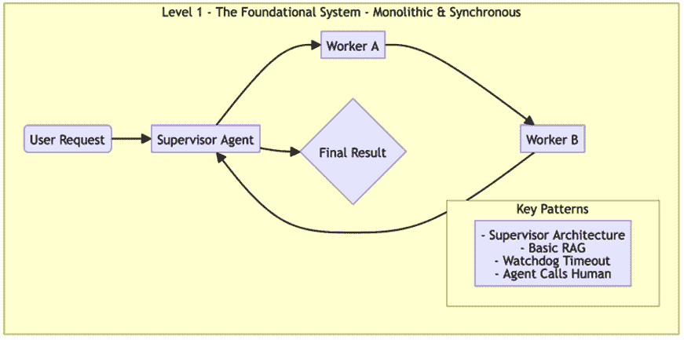
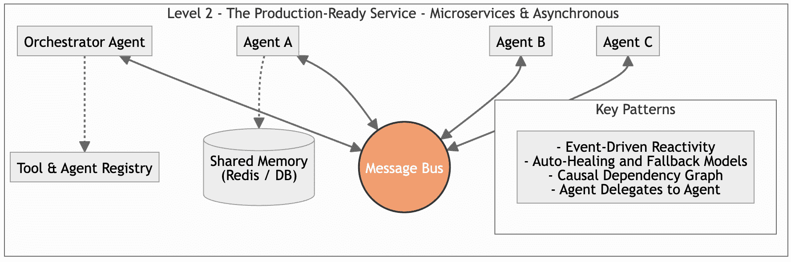
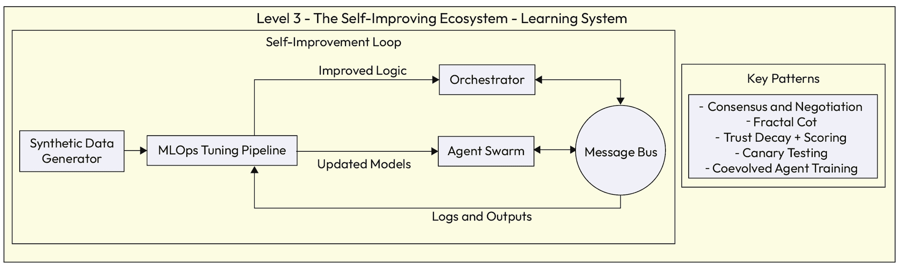

# 第十二章：通过成熟度级别实施代理模式的实用路线图

在前面的章节中，我们探讨了设计模式和架构模式的一个全面的模式语言，这些模式专注于构建代理人工智能系统。我们涵盖了几个模式的类别：多代理协调、可解释性和合规性、鲁棒性和容错性、人机交互以及个体代理的核心能力。有了这样一个丰富的工具包，自然而然且最紧迫的问题变成了：*我从哪里开始？*

一次性实施所有模式不仅不切实际，而且通常也不必要。成功部署代理人工智能的关键是**渐进式采用**，也就是说，先建立一个坚实的核心能力基础，然后随着系统的复杂性、规模和责任的增加，逐步添加更复杂的模式。

这种方法提供了一个重要的路线图：对于那些想要简单实施的人，他们可以专注于基础层，而对于那些需要最高程度复杂度的人，高级层则作为一个百科全书式的参考。

本章阐述了该路线图，将第二部分讨论的模式综合为三个不同的成熟度级别。请注意，我们将最初在*第三章*中概述的六个代理人工智能成熟度级别简化为六个级别，通过将两个级别映射到一个级别，从而得到基本、中级和高级成熟度级别。

+   **级别 1** **–** **基础系统（基本成熟度）**：此级别详细说明了构建一个功能性的、单进程代理系统所需的最小模式集，该系统可以在生产环境中部署。它侧重于运行一个可靠的证明概念，以验证核心业务逻辑。

+   **级别 2** **–** **生产就绪服务（中级成熟度）**：此级别侧重于将基础系统重构为解耦的、有弹性的和可观察的微服务集。它引入了可扩展性、异步通信和鲁棒容错性的模式。

+   **级别 3** **–** **自我改进的生态系统（高级成熟度）**：此级别代表了代理人工智能的尖端。它结合了自我优化、深度领域专业化和自适应学习的模式，创建了一个不仅执行任务而且随着时间的推移积极改进的系统。

通过遵循此路线图，您可以战略性地选择和实施正确的模式集，确保您的进入代理人工智能之旅既雄心勃勃又可实现。

# 级别 1 – 基础系统（基本成熟度）

在这个级别要实现的架构目标是快速构建和验证代理 idx_11c3eab0 工作流程的核心逻辑，在一个单一、单体和同步的应用程序中。目标是创建一个功能系统，证明代理方法的价值，即使它尚未针对规模或弹性进行优化。

*图 12.1*展示了第 1 级系统的架构。它描绘了一个单体、同步工作流程，其中中心监督代理作为唯一的协调器，依次将任务委派给工作 idx_3ff11c2dagents 以产生最终结果。注意架构 idx_4aae89eb 如何明确地整合关键“安全网”模式，如***看门狗超时***和***代理调用人工***，以确保即使在生产环境中，这种简单的设计也保持可靠和可控。

图 12.1 – 第 1 级模式

在建立这个视觉 idx_5e7d50cf 蓝图之后，让我们来探讨定义这个成熟级别的指导设计哲学。

## 核心架构原则

在这个基础层面，指导原则是简洁性，以实现快速验证。主要目标 idx_8e73098bis 是证明代理工作流程的商业价值，而不需要分布式系统的开销。为此，系统被构建为一个单一、单体应用程序，其中中心协调器同步调用工作代理。这种可预测的设计确保系统易于开发和调试，提供通往功能原型的最快路径。

## 实现模式

要构建一个 idx_34541c61 基础系统，你应该关注每个类别中最基本的模式，包括以下内容：

+   **协调和规划（来自*第五章*）**：

    +   ***任务委派框架（监督架构）***：这是自然的起点。一个单一、中心的协调器代理负责整个工作流程，提供清晰的指挥链。

    +   ***多代理规划***：协调器使用此模式执行基本任务分解，将用户的请求分解为硬编码或简单、动态的步骤序列。

+   **可解释性和合规性（来自*第六章*）**：

    +   ***基本审计日志***：虽然完整的***因果依赖图***可能有些过度，但每个动作和决策都必须记录到带有时间戳、代理 ID 和结果的文件或控制台。这是调试和问责制的不可协商的最低要求。

+   **鲁棒性和容错性（来自*第七章*）**：

    +   ***看门狗超时监督器***：这是一个关键的安全网。将所有代理调用，特别是 idx_479583f6 涉及外部 API 的调用，用超时包装，以防止单个挂起的代理冻结整个应用程序。

    +   ***简单的重试机制***：实现一个基本的循环，以固定次数重试失败的任务。这处理瞬态网络错误或 API 闪烁。

+   **人机交互（来自*第八章*）**：

    +   ***人类呼叫代理***：这是事务性、基于命令的任务的主要输入机制。

    +   ***代理呼叫人类***：这是基本的安全阀。当系统遇到关键错误或低置信度情况时，它必须有一个简单、可靠的停止并升级到人类的方式。

+   **代理级能力（来自*第九章*）**：

    +   ***单一代理基线***：这定义了您的工人代理的结构，每个代理都配备了一套特定的工具。

    +   ***代理特定内存（短期）***：至少，代理需要一种管理当前会话上下文的方法，例如存储对话历史。

    +   ***上下文感知检索（简单 RAG）***：为了使代理接地并防止基本幻觉，通过简单的 RAG 管道将其连接到单个核心知识源。

+   **系统级基础设施（来自*第十章*）**：

    +   ***代理身份验证*** ***和*** ***授权***：即使在单体系统中，如果代理需要访问内部 API 或数据库，它也必须使用具有明确定义、最小权限的受保护服务账户来执行此操作。

## 实现重点

为了实现*图 12.1*中所示的快速验证，实现策略有意以速度和简单性为代价来换取可扩展性。不是构建一个服务器的分布式网络，而是专注于创建一个自包含、可执行的原型：

+   **单一进程架构**：如图所示，整个工作流程——从*Supervisor*到*Worker* *B*——应在单个应用程序或脚本中运行。这消除了网络延迟和分布式系统故障，允许开发者在单个 IDE 窗口中调试整个逻辑流程。

+   **硬编码编排**：连接*Supervisor Agent*与其工人的逻辑是静态的。与通过注册表动态发现代理的高级系统不同，第 1 级实现硬编码了关系（例如，“如果步骤 A 完成，则调用 Worker B”）。这反映了图中的显式箭头，确保工作流程是确定性的且易于追踪。

+   **内存状态管理**：数据通过菱形决策节点和工人 idx_b27cb64bagents 流动时，不需要复杂的外部数据库。状态通过在函数之间传递上下文对象（例如 Python 字典）来简单地管理。这保持了架构的扁平化，并在验证阶段消除了管理持久存储的开销。

通过接受这些工程限制，我们以立即执行为代价换取长期灵活性。让我们看看这些选择导致的系统的具体操作特性。

## 结果系统和后果

结果是一个功能但脆弱的系统。它可以在“快乐路径”上成功执行其预期的流程，并处理最基本错误。然而，它不可扩展，由于其同步特性，具有高延迟 idx_dcaba8c7，并且无法在组件崩溃时生存。它的主要价值在于验证代理工作流和核心推理逻辑可以有效地解决业务问题。这种价值证明为重新架构系统以适应第二级的规模和弹性所需的重大工程投资提供了正当理由。

这些操作瓶颈（紧密耦合和阻塞执行）为必要的演变奠定了基础。为了将这个脆弱的原型转变为一个健壮的企业资产，我们必须打破单体。这种必要性直接引导我们进入第二级，在那里我们通过重新架构系统为一个由弹性、异步的微服务组成的集合来解决这些漏洞。

**注意**

许多组织可能会发现，一个构建良好的第一级系统对于内部非关键自动化任务来说是足够的。并非每个代理系统都需要发展到最高成熟度级别。

# 第二级 – 生产就绪服务（中级成熟度）

达到这一级的主要目标是重新架构基础原型为一个解耦、可扩展、弹性、可观察的异步微服务集合。目标是构建一个 idx_689fa2a7a 生产就绪的系统，该系统成本效益高、安全可靠，足以应对现实世界的商业运营。

下图描述了从单体到分布式网络的转变。中央 idx_03294beamessage 总线取代了直接函数调用，充当使**事件驱动反应性**成为可能的神经系统。请注意，*代理 A*、*代理 B*和*代理 C*不再依赖于指挥官进行每个即时指令；相反，它们订阅相关事件，允许异步和并行执行。

图 12.2 – 第二级成熟度

这种架构引入了专门的基础设施来支持这种复杂性：***工具*** ***和*** ***代理注册表***允许指挥器动态发现可用的服务（支持***代理代表代理***模式），而***共享*** ***内存***（如 Redis）确保 idx_7a068738 状态在单个代理之外持久化。这种分离确保如果一个代理崩溃，它可以自动修复而不会丢失正在进行的交易上下文。

## 核心架构原则

在这个中间级别，指导原则是解耦以实现可扩展性和弹性。与 idx_cda123f9monolithic 原型不同，一个生产就绪的系统必须能够承受组件故障并处理波动负载而不会崩溃。然而，向微服务的转变应由必要性驱动。微服务引入了显著的操作复杂性，因此只有在单体方法不再满足系统对规模、故障隔离或团队速度的要求时，才建议进行这种架构转变。

当这种转变是合理的时候，架构依赖于三个基本的结构变化：

+   **通过** **消息** **总线** **的** **异步** **通信**：*代理 A* 不是直接调用 *代理 B* 并等待响应（阻塞执行），而是将事件发布到中央消息总线。相关的代理订阅这些事件并并行处理它们。这种解耦防止单个缓慢的代理创建瓶颈，从而冻结整个系统。

+   **服务** **隔离**：每个代理作为一个独立的服务（通常是容器化）运行。如果 *代理 A* 由于错误或内存泄漏而崩溃，*代理 B* 和 *代理 C* 仍然不受影响。这种隔离是 **自动** **自我** **修复** 的基础；基础设施可以检测到崩溃并自动重启特定的失败代理，而无需关闭应用程序。

+   **外部化** **状态**：在级别 1 中，应用程序状态存在于脚本的内存中。在级别 2 中，状态被推送到 ***S******hared*** ***M******emory***（例如 Redis 或数据库）。这确保了如果代理被重启，它可以从共享的 idx_e80c34f7 存储中检索当前上下文或任务状态并立即继续工作，从而促进 ***I******ncremental*** ***C******heckpointing***。

## 实现模式

这个级别在基础模式的基础上构建，并引入了更复杂的解决方案，包括以下内容：

+   **协调** **和** **规划（来自** *第五章***）**：

    +   ***混合委托框架***：系统可能演变为混合模型，其中顶级协调器将任务委托给自我组织的蜂群或“船员”代理。

    +   ***知识共享***：简单的 idx_763d6b01 内存状态被替换为持久化的、***S******hared*** ***E******pistemic*** ***M******emory***（例如，Redis 缓存或专用数据库），所有代理都可以访问。为了确保生产稳定性，此实现必须包括并发控制以 idx_466e932eprevent 竞态条件，**TTL**（生存时间）策略以维护数据卫生，以及语义索引以确保高效检索。

+   **可解释性** **和** **合规性（来自** *第六章***）**：

    +   ***指令保真度审计*****和** ***持久指令锚定***：这些现在已正式实施，以防止在更复杂、多跳工作流程中的指令漂移

    +   ***因果依赖图*** **（来自** *第七章***)**：基本的日志记录升级为结构化、可审计的图，追踪每个决策的完整血统。

+   **鲁棒性和容错性（来自** *第七章***)**：

    +   ***自适应重试与提示变异***：简单的重试通过修改失败时的提示逻辑得到增强。

    +   ***自动恢复代理复活*** ***和*** ***增量检查点***：系统 idx_2f377d94 现在可以自动重启崩溃的代理服务，并从最后保存的状态恢复长时间运行的任务。为了防止由持续错误引起的无限“崩溃循环”，此机制必须由指数退避策略和最大重试阈值来管理。

    +   ***回退模型调用***：为 LLM API 中断提供业务连续性计划。

    +   ***速率限制调用***：保护下游 API 并管理成本。

+   **人机交互（来自** *第八章***)**：

    +   ***代理委托给代理***：多代理协作的内部复杂性现在从用户那里抽象出来。

    +   ***代理调用代理***：安全地管理所有与外部、第三方系统的交互。

+   **代理级能力（来自** *第九章***)**：

    +   ***高级 RAG***：RAG 管道通过诸如重新排序和查询转换等技术得到增强，以改善检索质量。

+   **系统级基础设施（来自** *第十章***)**：

    +   ***工具和代理注册表***：这对于微服务架构至关重要，允许代理动态发现彼此

    +   ***事件驱动反应性***：整个系统围绕一个中心消息总线（如 Kafka 或 Google Cloud Pub/Sub）重新架构，实现异步、可扩展的通信。

## 实现重点

要构建我们在*图 12.2*中引入的架构 idx_179dcd25，实现重点从编写逻辑转向工程基础设施。目标是创建一个环境，使解耦的组件能够可靠地在大规模上运行：

+   **容器化（Docker）**：如图所示，*代理 A*、*代理 B*和*代理 C*是不同的实体。在实践中，每个代理都打包到自己的容器中，并包含其特定的依赖项（例如，Python 库、驱动程序）。这种隔离防止了“依赖地狱”，并确保更新*代理 A*的环境不会意外地破坏代理 B。

+   **编排（Kubernetes）**：管理数十个独立的容器需要一个编排器。Kubernetes 充当了管理图中代理生命周期的无形之手。它处理自动恢复（检测*代理 B*是否崩溃并自动重启它）和水平扩展（如果负载增加，则启动多个*代理 C*的副本），确保了这一成熟级别所承诺的弹性。

+   **事件** **基础设施（消息总线）**：*图 12.2*中的中心圆圈代表了一个健壮的消息代理（如 Apache Kafka、RabbitMQ 或 Google Cloud Pub/Sub）的实现。这里的实现重点在于定义清晰的**主题**和 idx_9cadc97aschemas，以便代理可以发布和订阅事件，而无需知道另一端是谁，从而实现真正的**事件驱动** **反应性**。

+   **基础设施即代码（IaC）** **和** **CI/CD**：因为系统不再是单个脚本，手动部署是危险的且不可扩展的。在这个层面的实现需要使用**Terraform**等工具定义基础设施（注册表、Redis 或消息总线），并建立 CI/CD 管道。这允许单个代理独立更新、测试和部署，最小化在更新过程中出现系统级回归的风险。

向这种分布式模型的转变解决了第 1 级的不稳定问题，但它在系统操作和失败方面引入了新的动态。

## 结果系统和后果

系统现在是一个健壮的、可观察的和安全的 production 服务。它可以扩展以处理现实世界的负载，从常见的故障中恢复，并由运维团队维护。这种弹性的后果是架构复杂性的显著增加。管理数十个专业微服务的分布式系统需要成熟的 DevOps 和 MLOps 文化。

然而，稳定性并不等同于智能。第 2 级系统，尽管其稳健性，仍然保持静态：它明天执行的逻辑与今天相同。为了释放代理 AI 的真实变革潜力，我们必须超越单纯的执行，转向适应。这把我们带到了成熟度的最终前沿，我们将稳定的架构转变为一个持续学习的动态引擎。

# 第 3 级 – 自我改进的生态系统（高级成熟度）

在这个层面，主要的架构目标是使生产就绪服务演变成一个前沿的、自我改进的系统，该系统能够发展深厚的领域专业知识并通过自动反馈循环和战略分析优化其自身性能 idx_f5f3928b。

下图说明了从静态执行引擎到循环学习机的转变。与之前级别的线性流程不同，此架构由自我改进循环主导。注意日志和输出不仅被存储以供审计（如第 2 级），还被管道回输到 MLOps 调优管道中。此管道使用合成数据生成器来增强现实世界经验，创建一个丰富的训练数据集，该数据集产生更新的模型和改进的逻辑。然后，这些改进持续部署回编排器和代理群，确保系统在每次交易中变得更聪明。

图 12.3 – 第 3 级模式

在考虑到这种闭环架构的情况下，让我们来探讨使这种进化成为可能的指导原则。

## 核心架构原则

核心原则 idx_b515e993 在这里是**自我优化**。系统不再是静态的；它是一个 idx_94b0b6ded 动态的学习生态系统。它不仅被设计来执行其任务，还设计来衡量其自身性能，从其成功和失败中学习，并随着时间的推移调整其行为以变得更加有效和高效。

为了实现这种自主改进的状态，架构依赖于三个基本支柱：

+   **闭环学习**：该架构被设计用来捕获其自身的输出——无论是成功还是失败——并将它们用作训练数据。通过将 MLOps 调优管道直接集成到运行时，系统可以微调其模型（使用如**协同进化代理** **训练**等模式）以适应数据分布的变化，而无需手动工程干预。

+   **涌现** **协调**：而不是仅仅依赖自上而下的编排，代理被赋予了“社交”技能。如**共识与谈判**等模式允许**代理** **群**自主解决模糊性 idx_8f2c3726 和资源冲突，减轻中央编排器的负担，并使系统能够处理新颖、未定义的场景。

+   **安全** **进化**：由于系统是动态变化的，稳定性通过 idx_6c0d0132 严格的自动化测试来管理。**金丝雀测试**和**信任衰减**确保 idx_d60a1a50“改进”的逻辑在完全信任之前与实际性能指标进行验证，防止系统演变过程中的回归。

## 实现模式

此级别 idx_1a8572a 引入了最先进的模式，专注于学习、战略评估和复杂协作，包括以下内容：

+   **协调** **和** **规划（来自** *第五章**）**：

    +   ***共识、协商** **和** ***冲突解决***：系统现在拥有“社交”技能，可以自主处理模糊性和分歧。代理可以辩论冲突数据，协商资源，并解决冲突计划，而无需自上而下的指令。

+   **可解释性** **和** **合规性（来自** *第六章***)**：

    +   ***分形 CoT 嵌入***：代理使用这种高级推理模式进行递归自我纠正，使它们能够捕捉自己的逻辑错误并根据新证据修改计划

+   **鲁棒性和容错性（来自** *第七章***)**：

    +   ***代理间的多数投票***：对于最重要的决策，使用一组代理以实现极端可靠性

    +   ***信任衰减** **和** **评分**：协调器实现了一个声誉系统，以自适应地将任务路由到最可靠的代理

    +   ***金丝雀代理测试***：新代理版本可以安全地部署到生产环境中，而不会影响系统稳定性

+   **代理级能力（来自** *第九章***)**：

    +   ***代理 RAG*** **和** ***图-向量混合检索***：系统构建并维护自己的丰富知识图谱，将其与向量搜索相结合，以实现最先进的领域专业知识

+   **持续改进** **和** **调整（来自** *第三章* **和** *第十四章**）**：

    +   ***混合工作流程代理架构*** **（规划器 + 评分器）**：系统使用生成器-评估器配对来创建和审查其自身的工作流程

    +   ***协同进化的代理训练***：规划器和评分器代理通过结合 SFT、DPO 和迭代学习同步改进

    +   ***偏好控制的合成数据生成***：为了防止代理之间出现失控的分歧或勾结，即代理强化共享偏见或陷入满足彼此怪癖而不是业务目标的陷阱，此生成过程需要严格的离线评估基准和定期的人机交互验证

    +   ***自定义评估指标***：为准确测量工作流程质量，开发了特定领域的指标（例如 **STEPScore**）

## 实施重点

为了实现*图 12.3*中显示的自我改进循环，工程重点从应用逻辑转移到构建复杂的 MLOps 和 DataOps 基础设施。目标是关闭执行和训练之间的循环，而无需人工干预：

+   **自动化** **数据** **合成**：如图表左侧的**合成数据生成器**框所示，系统不能仅依赖于有机用户数据，这些数据通常稀疏或噪声。实施需要构建管道，其中规划器代理生成场景，评分器代理对其进行标记，创建一个干净的训练数据集。

+   **持续** **调整** **管道**：**MLOps 调整管道**是这个架构的引擎。与第 2 级不同，那里的 idx_bf8ad485 模型是静态资产，这一级需要基础设施（如 Kubeflow 或 Vertex AI 管道），这些基础设施可以自动摄取数据，触发微调（SFT）或 DPO 作业，并生成更新后的模型。

+   **反馈** **循环** **集成**：从**日志与输出**回流到管道的箭头代表了关键的数据工程挑战：将原始执行日志转换为结构化的训练示例。这需要实施**自定义评估指标**（如 STEPScore），以编程方式评估代理性能，并向调整管道发出信号，告知哪些方面需要加强。

+   **安全** **模型** **推广**：从**更新后的模型**到**代理群**的箭头意味着一个稳健的部署策略。在这里的实施需要**金丝雀测试**基础设施，在允许新模型接管全部生产流量之前，自动评估新模型与控制 idx_925ee63egroup 的对比。

这个架构将系统从静态效用转变为随着时间的推移而增值的资产。

## 结果系统和后果

结果是一个最先进系统，作为其领域的动态、演化的专家。它不仅提供准确的答案，还提高自己的能力，加固其防御，并通过与业务对齐的指标展示其战略价值。这种复杂性的代价是极端的复杂性和对维护自动化知识创造和训练循环所需的基础设施和专业知识的大规模、持续投资。

# 您的代理路线图：战略反思指南

您现在已经看到了从简单的基础系统到复杂、自我优化的 idx_250242d1ecosystem 的发展路线图。这个模型提供了*什么*，一个可能性和模式的目录。然而，最重要的步骤是将这个地图转化为您自己项目的具体计划，即*如何*和*何时*。

以下部分旨在促进这种转化，将您从架构理论引导到战略行动。不要将其视为测试，而应将其视为与团队进行的结构化对话，以规划您的代理系统演化的路线。

## 旅程开始了：您现在在哪里？

要成功导航这个路线图并规划您的特定路线，您必须首先确定您的起点。每个成功的代理系统都始于对其当前状态 idx_cb384410 和直接目标的诚实施评估。从询问您的团队开始：*这是一个全新的、探索性的概念验证，还是我们试图扩展一个现有的、可能脆弱的自动化* **系统**？* 答案将从根本上塑造您的下一步行动。

你近期的首要商业目标是你的指南针。你是在尝试简单地验证一个代理工作流程可以解决一个特定问题吗？如果是这样，你的焦点完全集中在第一级。

或者目标是构建一个具有弹性和可扩展性的服务，能够处理现实世界的负载？这指引你走向第二级。

或者你处于前沿，目标是创建一个自我改进的专家，成为持久的竞争优势。这是通往第三级的雄心之路。

最后，考虑你团队当前的专业知识。你是否精通分布式系统和 MLOps，或者这是一个新的领域？诚实将防止你过度设计一个你无法维护的系统。

这种初步反思的结果是明确地识别出哪个成熟度级别最能描述你的直接、实际目标。这定义了你的初始或下一实施的范围，确保你解决当前正确的正确问题。

## 奠定基础：你的最小可行代理是什么？

一旦你确定了起点和战略目标，下一步就是执行。如果你的评估将你定位在第二级或第三级，你可能想立即提供复杂的微服务或编排集群。然而，成功的代理工程需要逐步验证的纪律。

不论你的最终目标是什么，一个新代理工作流程的开发生命周期应该从建立一个**L****evel 1** **f****oundational** **s****ystem**作为验证步骤开始。不要把它当作你的最终架构目标，而把它看作你的工程过程的**minimum viable agent** (**MVA**)阶段。即使是复杂的工程团队也会使用这个阶段来在受控的单一环境中隔离和完美化代理的推理逻辑、工具交互和安全防护，然后再添加分布式系统的复杂性。

抵制过度工程化初始逻辑的冲动。问你的团队：*W**hat is the simplest possible version of this system that proves our core business logic works?*

最初能否由一个单独的***Supervisor Architecture***来管理？这允许你在引入分布式架构的延迟和跟踪挑战之前调试认知错误和提示逻辑。从那里开始，关注最关键的风险。如果代理调用外部 API，一个***Watchdog Timeout***不是奢侈品；它是必需的。如果系统可能陷入模糊状态，一个安全的***Agent Calls Human***逃生口是不可或缺的。

通过首先在这个基础级别验证你的模式，你确保当你扩展到第二级或第三级时，你是在扩展一个已经从根本上功能性和安全的系统。

## 为规模而构建：你的生产路径是什么？

一个成功的 1 级原型必然会产生对更多需求的渴望——更多的用户、更多的功能、更多的代理。这就是当简单、单一架构的局限性变得明显的时候。通往生产就绪的 2 级服务的道路是一个专注于弹性和规模的故意重构。

从识别将导致这种演变的特定触发因素开始这个阶段。这将是一个每日用户数达到一定数量吗？是需要添加三个或四个以上的专业代理吗？或者是对长时间运行、异步处理的需求，这是简单的脚本无法处理的？提前定义这些触发因素将使扩展决策从反应性恐慌转变为有计划的行动。

接下来，优先考虑哪些 2 级模式对你的系统可靠性最为关键。如果可用性是最重要的指标，那么像**自动恢复代理复苏**和**回退模型调用**这样的模式是你的首要任务。如果实时响应是关键，那么围绕一个中心消息总线构建的**事件驱动反应性**模型是必不可少的。当你设想添加更多专业代理时，发现的问题变得至关重要，直接引导你规划一个**工具和代理注册表**。

这份反思提供了一个战略计划，概述了不仅你要构建什么，还要何时以及为什么需要投资于更复杂、基于微服务的架构来满足不断增长的需求。

## 追求自主性：你的北极星是什么？

并非每个系统都需要达到代理成熟度的顶峰，但了解可能性的确可以指导你的长期战略，并防止你做出阻碍未来创新的早期架构决策。这是设想你的 3 级系统——你的北极星阶段。

提出重大问题：我们的核心业务问题是否需要系统随着时间的推移学习和适应才能真正有效？如果答案是肯定的，那么通往 3 级的方法是一个战略性的必要条件。你的系统“自我改进”版本会是什么样子？它会从隐式用户反馈中学习以个性化其响应吗？它会自动进行 A/B 测试不同的工作流程以找到最有效的路径吗？这个愿景将引导你走向像**信任衰减**、**评分**和**协同进化的代理训练**这样的高级模式。

最后，考虑风险。系统做出的个别决策是否至关重要，以至于一个错误可能会产生重大后果？如果是这样，那么像**共识**和**多数投票**这样的高级模式的高成本和复杂性不仅是有理由的，而且是构建可信赖系统的必要条件。

这个关于你的代理系统的长期愿景将指导你的战略投资，并确保你的架构足够灵活，能够吸收必将到来的快速进步。

## 路线图摘要表

下表提供了本战略指南的浓缩总结。将其用作快速参考，以将您项目的目标与每个成熟级别的关键决策和模式对齐：

| **成熟度级别** | **战略重点** | **关键架构决策** | **关键模式考虑** | **团队关键问题** |
| --- | --- | --- | --- | --- |
| **成熟度级别** | **战略重点** | **关键架构决策** | **关键模式考虑** | **团队关键问题** |

+   监督架构

+   看门狗超时

+   代理呼叫人类

+   基本 RAG

| “这个系统的最简单版本是什么，它能够安全地工作并证明其价值？” |
| --- |
| 2 级 – 生产就绪 | 实现稳定性和可扩展性 | 集中式与分布式 | 有状态服务与无状态服务 |

+   事件驱动反应性

+   自动恢复

+   工具和代理注册表

+   因果依赖图

| “这个系统如何处理 10 倍于当前的负载并在没有人为干预的情况下从故障中恢复？” |
| --- |
| 3 级 – 自我改进 | 实现学习和适应 | 静态工作流程与动态工作流程 | 基于规则的与学习行为 |

+   一致性与协商

+   分形 CoT

+   信任衰减和评分

+   协同进化的代理训练

| “如果这个系统能够自主学习和适应，我们的业务是否能够获得竞争优势？” |
| --- |

表 12.1 – 实施代理模式的战略总结

一致性与协商

# 摘要

本章在个体设计模式的理论知识与构建完整代理系统的实际现实之间架起了一座关键桥梁。我们通过引入一个战略性的、三级成熟度模型来回答“我从哪里开始？”的基本问题，该模型作为实施的实际路线图。这种方法允许组织逐步采用代理 AI，将架构复杂性与其特定的业务目标和运营准备对齐。

我们首先定义了 1 级，即基础系统，它侧重于简单性和快速实现价值。通过使用单体、同步架构和如***监督架构***和***看门狗超时***等核心模式，这一级别允许以安全、易懂的方式快速验证代理工作流程的核心逻辑。

接下来，我们详细阐述了通往 2 级，即生产就绪服务的路径。这一阶段涉及将基础系统有意识地重构为一个解耦的、弹性的和可扩展的微服务集合。通过采用如***事件驱动反应性***、***自动恢复代理复苏***和***工具和代理注册表***等模式，这一级别创建了一个健壮的、可观察的和值得信赖的系统，适用于现实世界的商业运营。

最后，我们探讨了 Level 3，一个自我改进的生态系统。这一高级阶段引入了深度领域专业化和自主学习的模式，例如用于复杂协作的 ***Consensus*** 和 ***Negotiation***，以及用于持续自我优化的 ***Coevolved Agent Training***。这一级别代表了从静态工具到动态、学习伙伴的代理应用的转变。

本章的关键要点如下：

+   **逐步** **采用**：构建一个复杂的代理系统是一个过程，而不是一个单一步骤。从提供价值的简单架构开始，随着系统需求的演变，有意识地逐步增加复杂性。

+   **使架构与目标** **对齐**：您选择的模式应直接反映您的战略目标——无论是验证一个概念、实现生产稳定性，还是创建一个自我改进的资产。

+   **策略** **先于** **实施**：在写下任何一行代码之前，**策略** **反思** **指南** 鼓励您提出将定义您项目范围、架构和长期愿景的关键问题。

拿着这份战略路线图，您现在不仅拥有了个人蓝图（模式），还拥有了一个全面的构建计划。为了使这一切成为现实，接下来的章节将从架构理论转向实际应用，展示这些模式和成熟度级别如何结合来解决我们详细用例中的现实世界商业问题。

# 订阅免费电子书

新框架、演进的架构、研究突破、生产故障——*AI_Distilled* 将噪音过滤成每周简报，供那些与 LLMs 和 GenAI 系统实际操作工程师和研究人员参考。现在订阅，即可获得免费电子书，以及每周的洞察力，帮助您保持专注并获取信息。

在 [`packt.link/8Oz6Y`](https://packt.link/8Oz6Y) 订阅或扫描下面的二维码。

