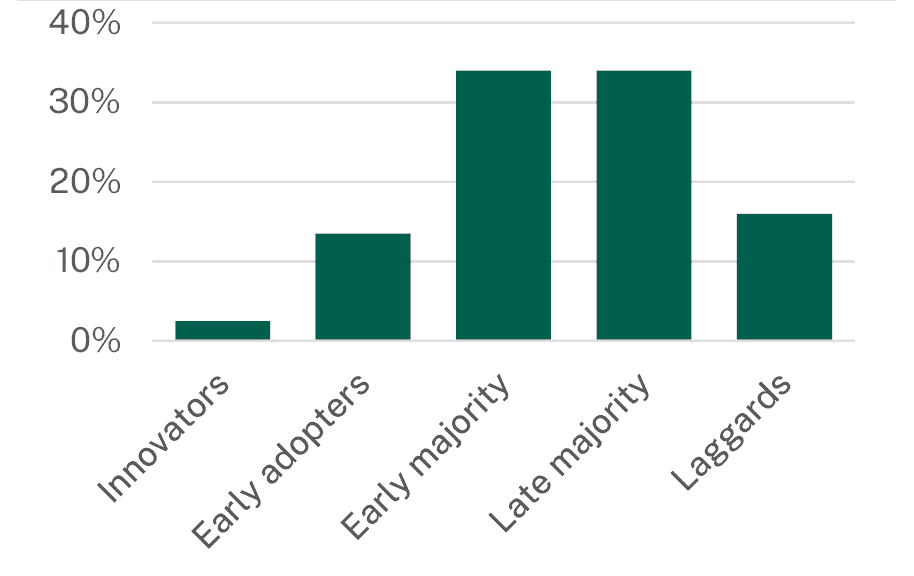
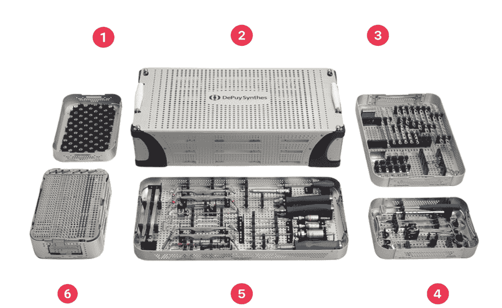
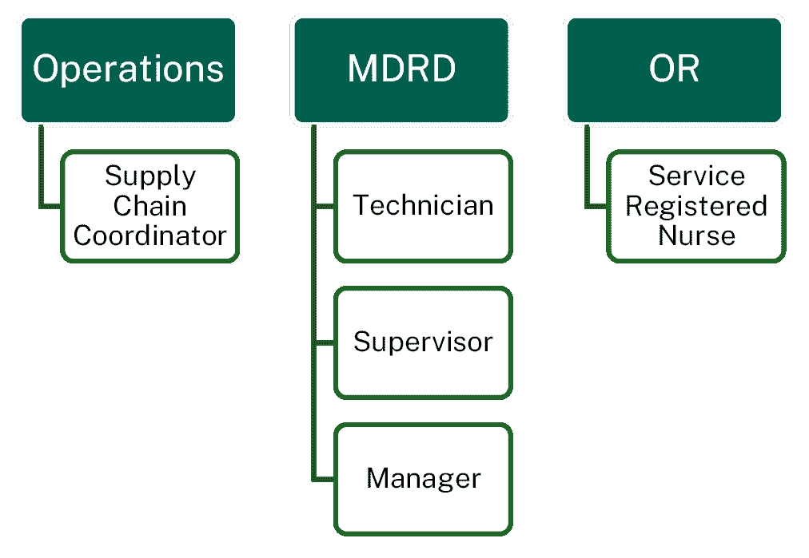
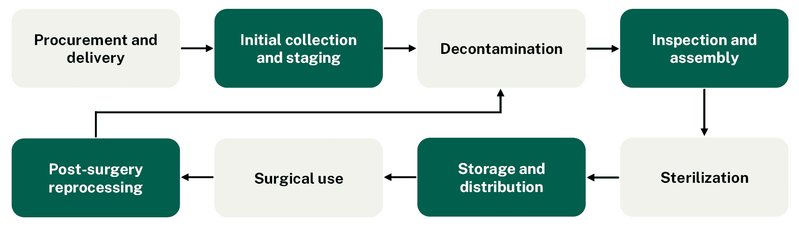
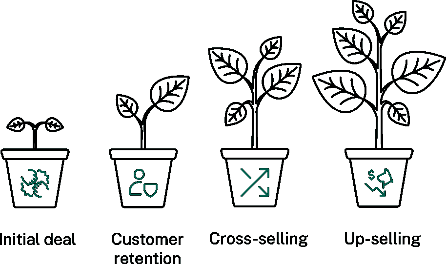
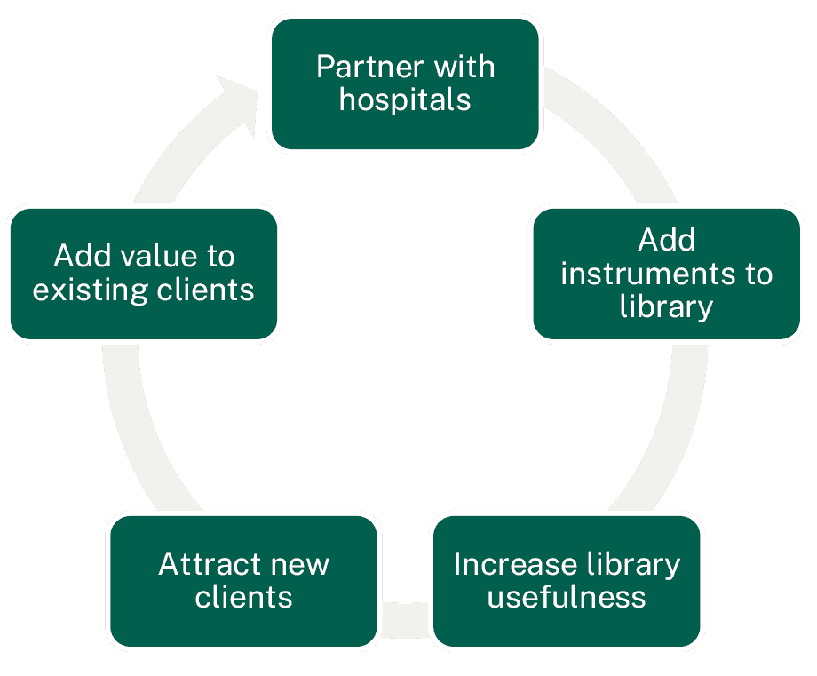

医疗保健格局

为了有效进入市场，Medloaner 需要深入了解美国医疗保健系统的动态，包括组织结构、激励措施、对创新的态度以及监管问题。

简而言之

+   运营创新落后于临床创新至少 15-20 年。数据存在但分散，医院部门的垂直结构构成了组织孤岛的挑战。基普通过他的用户访谈发现，这里对创新的需求非常强烈。

+   对 HIPAA（或等效）法规的恐惧普遍存在。合规的高成本是 AI 在医疗保健领域采用和创新的一个重要障碍。

+   当前的美国医疗保健系统过于关注短期收入。医院抵制采用那些不直接带来收入的提高效率的技术。

+   尽管数据可用，但并没有数据经济。基普将其与广告技术行业进行了对比，提到了像[LiveRamp](https://liveramp.com/)这样的身份供应商，该供应商声称是“跨所有云、围墙花园和媒体平台的唯一互操作数据协作平台”。

我们仍然有那些滞后者在组织内部部门中掌权。”

– 基普·波格列本科

技术采用生命周期

根据这个模型（埃弗雷特·罗杰斯，1962 年），随着时间的推移，任何新技术都会经历五个阶段被采用[（https://www.hightechstrategies.com/innovation-adoption-curve/）]，包括：

+   创新者（2.5%）

+   早期采用者（13.5%）

+   早期多数（34%）

+   后期多数（34%）

+   滞后者（16%）

图 1：技术采用生命周期。

采用率受不同因素的影响。罗杰斯确定了五个因素：相对优势、兼容性、复杂性、可试性和可观察性。

在某些表述中，存在一个“[鸿沟](https://learning.dell.com/content/dam/dell-emc/documents/en-us/2022KS_Khurana-Technology_Adoption_Curve.pdf)”——由杰弗里·A·摩尔在他的书《跨越鸿沟》（https://www.goodreads.com/en/book/show/61329.Crossing_the_Chasm）中普及——描述了早期采用者和早期多数之间的差距，反映了理想主义者与实用主义者之间的心态差异，后者只有在看到其他组织和客户也这样做之后才会跃进采用。

HIPAA 问题

1996 年的健康保险可携带性和问责法案（HIPAA）是一项[美国法律](https://www.hhs.gov/hipaa/index.html)，它保护了[受保护健康信息](https://privacyruleandresearch.nih.gov/pr_07.asp)（PHI）的隐私和安全，以及其他事项。该法律相当于对医疗历史共享的严格锁定。包含[标识符](https://www.ncbi.nlm.nih.gov/books/NBK500019/)的数据，可能将其与特定患者联系起来，不能共享，包括姓名、地址和社会安全号码。

HIPAA 还意味着像 Medloaner 这样的分包商与医疗保健实体一样，对任何数据泄露承担连带责任。由于提供这些产品和服务需要承受沉重的监管负担，因此附加成本较高——这意味着律师费用昂贵。Kip 说：“有一些公司与 [电子健康记录](https://www.cms.gov/priorities/key-initiatives/e-health/records) (EHRs) 合作，有几家成功的初创公司，但由于 HIPAA，它们总是资金短缺。” [Acritas 2017 年的报告](https://phillipskaiser.com/wp-content/uploads/2018/06/acritas_legal_spend_report_2017.pdf) 发现，美国公司的法律部门在收入相对的世界范围内花费最多，其中“制药”和“医疗保健”的法律支出分别位列第 7 和第 9。

根据 Kip 的说法，HIPAA 非常棘手的原因是它实际上是基于用例的。作为一个分包商，在你的风险评估中，你需要能够识别所有可能发生潜在数据泄露的用例，这是一个困难的任务。策略中的不可避免漏洞可能导致罚款和诉讼，尤其是在网络攻击之后，这些攻击已导致历史上一些最大的 HIPAA 违规事件。[最大的 HIPAA 违规事件](https://www.thinksecurenet.com/blog/top-10-settlements-fines-hipaa/)。

Medloaner by numbers

3

在他们签署合同之前与 HHS 就 PHI 和加拿大 HIPAA 相似法规进行的讨论

1

与供应商进行的严格网络安全评估，其中 Medloaner 被问到诸如“你的网络状况如何？”和“你将如何与医院现有的计算机网络集成？”等问题。HHS 唯一获批准的手机是 iPhone 7，这是苹果公司在 [2016 年](https://www.apple.com/newsroom/2016/09/apple-introduces-iphone-7-iphone-7-plus/) 推出的，并在三年后 [停产](https://endoflife.date/iphone)。

7-8

在开始构建概念验证之前，与医疗保健系统的人交谈所花费的月份

50-60

与行业专业人士进行的访谈

106

骨科手术中独特的托盘类型

20

用于早期模型开发的初始数据集中的托盘

手术器械问题

手术包是一个精心准备的医疗仪器和工具的必备集合，以满足手术程序的具体要求。

图 2：手术包的组成部分。1) 辅助托盘 2) 图形箱 3) 标准板托盘 4) 减压托盘 5) 插入托盘 6) 螺丝架。

HHS 在其医疗设备再处理部门 (MDRD) 和无菌处理部门 (SPD) 中存在可识别的低效率，这些部门依赖手动方法进行跟踪、清洁、检查和组装手术包。

HHS 医院使用两种不同类型的包：

+   内部包，它们是医院库存的永久部分。

+   借用工具包，由供应商管理，使用后需要订购并归还。

借用工具包将尖端技术带入医院，但具有更复杂的处理要求，并创造了更高的运营负担：额外的检查步骤、双重灭菌（每套工具包按照 [CSA 标准](https://www.csagroup.org/standards/?srsltid=AfmBOorTKMw5jNyctkTTBCEdZg9ULM4jsUsX0EZswVm1Lqh7tdrpGz6I) 需要每套工具包 48 小时的处理时间）、使用前后的合规性检查、细致的跟踪和紧急处理。

问题概述

现有的 MDRD 工作流程面临几个关键问题。

手术工具包利用率不足：医院跟踪的是整个工具包，而不是组件。Medloaner 发现手术工具包中有 20% 的仪器从未使用，但仍然被包含在内，不必要的运输和处理导致财务浪费和存储效率低下。

丢失或错放仪器：供应商提供的报告中常见 1-2 项错误物品或不一致。除此之外，在仪器灭菌后，工具包中可能会有标签混淆。仪器也可能从其他工具包中取出以补充缺失的物品，而无需记录变化。缺失的物品会导致寻宝游戏，MDRD 的工作人员必须在各部门之间寻找工具。

STAT：Medloaner 的一个客户每周因丢失或错放库存而损失 11,000 美元。

手动流程导致错误和低效率：缺乏数字跟踪系统迫使 MDRD 技术人员依赖手动流程进行计数、组装、拆卸和灭菌。这是耗时、易出错并导致精神疲劳的原因。技术人员还可能需要重新灭菌在消毒过程中未正确放置的仪器，这对工作流程有巨大影响。

由于不同类型的工具包和手术需求导致的运营延误。高优先级工具包通常需要紧急处理，这会打乱计划的工作流程并消耗资源。单一髋关节手术可能需要 9 个以上的借用托盘，这会压垮 MDRD 的工作人员。

如果那个部门停止运作，将不会有任何手术进行。即使是像拆线这样简单的事情。这实际上是医院的脉搏。”

– Kip Pogrebenko

用户访谈

在追求效率与成本效益平衡的过程中，Medloaner 试图了解参与该流程的各方痛点和关键绩效指标（KPI）。

图 3：Medloaner 在 HHS 医院中与之交流的角色。

他们确定了 5 个客户角色：

+   MDRD 内部有 3 个角色：技术人员、主管、经理。这些角色通常关注手术工具包到达手术室（OR）的时间等指标。

+   采购部门内有 1 个角色：供应链协调员。这个角色关注工具包利用率、仪器利用率、每套工具包收入和每件仪器的收入等指标。

+   手术室（OR）内的 1 个角色：服务注册护士（SRN）。

内部支持者：了解 MDR 部门

Kip 为我们描绘了 MDR 部门的员工形象：

+   对医院功能至关重要。

+   技术人员工作过度且不受重视。“通常，这是一份低收入的工作，他们被要求至少做两倍于他们应该做的事情。”

+   渴望拥抱新技术。“他们一直在连续地谈论，因为他们最终意识到你就是那个可以让他们生活更轻松的人。他们都希望创新，但由于组织中的隔阂，阻力巨大。”

+   可能非常强大的内部支持者。

图 4：Kip 描述的 MDRD 工作流程。

![TL Logo]

反馈触点 1：

我们重视尖锐的反馈。

对这一部分有什么快速的想法？](https://forms.office.com/e/5TN9a1d5LB)

Medloaner 的解决方案

解决 HIPAA 问题：一个新颖的数据层

Medloaner 的解决方案避免使用任何可以识别患者个人的信息，因此避免了完全处理 HIPAA 的需要。他们关于特定手术收集的唯一信息是：

+   ① [手术类型](https://www.facs.org/for-medical-professionals/education/online-guide-to-choosing-a-surgical-residency/guide-to-choosing-a-surgical-residency-for-medical-students/faqs/specialties/)：例如，骨科。

+   ② 手术子类别：例如，膝关节手术或肩关节手术。

此外，Medloaner 的关键洞察是跟踪和收集每个③单个手术器械的数据，而不是停留在手术包的更高层次。

每家医院的需求当然都不同，他们通过用户研究了解到，他们的解决方案也必须针对每家医院的④数据管理进行定制，以及医院利用的不同软件系统之间的关系。

与由顾问、业务分析师、数据科学家和数据工程师组成的 HHS 内部团队一起，他们设计了一个新颖的数据层，将所有这些数据集（① ② ③ ④）整合在一起。有一个检查系统来确保没有任何 PHI 或患者 ID，或任何患者信息泄露。

其余的技术都由这个数据层提供支持。

一个关键洞察：仪器级数据

Kip 描述了之前在仪器级解决方案上的尝试：

我认识的人实施了一个 RFID 跟踪系统。想象一下，你必须用特定的标签标记手术包的每一个组件，想象一下如果这些标签在 120°C、150°C 的消毒过程中会发生什么。要么是蒸汽，如果非常精细，它将通过特定的化学物质进行处理，然后它也必须经过灭菌。所以这些标签经常丢失。这就是为什么那个解决方案从未真正起飞。”

-- Kip Pogrebenko

很容易看出 Medloaner 基于计算机视觉的跟踪模型是如何从这一洞察中学习的。

没有仪器级跟踪，通常观察到的故障模式表明，魔鬼藏在细节中。

失败模式#1

技术员 1 进来，拿起需要消毒的手术包。他们拆下所有东西，将标有#25 的金属标签放入该包的所有隔间中，然后送往清洗区。技术员 1 离开。

技术员 2 进来，看到一摞标有#25 的标签。他们不知道这摞标签已经被使用过。他们拿起这摞标签，把它们扔进另一个手术包里。

两个包从灭菌回来后，它们都被混合在一起。

失败模式#2

手术包已经准备就绪，可以送往手术室。一名护士注意到缺少了一个关键工具。他们打开存储中可能包含该工具的任何箱子。他们拿起它，打包，用运动胶带将其粘到手术包上，然后送往手术室。

原始套件缺少那个工具，但现在另一个包也缺少了。但这个变化从未被记录。

Medloaner 的解决方案持续收集的仪器级数据包括：

+   工具类型

+   工具移动

+   工具供应商和制造商

+   工具在包内的定位（轮廓）

这些数据提供了对以下内容的洞察：

+   工具利用率：识别常用和少用工具以优化包配置并减少浪费。

+   库存管理：提高跟踪并减少丢失或错放工具的频率。

+   清洁程度和包完整性：评估清洁效果并自动化完整性检查可以提高准确性，减轻人为错误的风险，并减少 MDRD 技术人员的负担。

+   工作流程效率：分析工具流动以识别瓶颈和改进区域，优化库存水平，并预测高优先级案例。

Medloaner 的概念验证使用了人工智能和计算机视觉来实现这些目标。接下来的几个子主题将探讨这是如何实现的。

模型：基于 AI 的自动化

基普描述了模型处理不同概念的两种级别：

我们训练了多个模型。我们有一个针对设备类型的通用模型，然后按供应商和制造商进行细分。这样我们能够识别任何单个设备，无论它在哪里。但然后模型更高一级的层理解“一组配置”。

– 基普·波格雷本科

该模型与围手术期资源（PR）管理系统或库存管理系统集成，因此系统了解所有特定工具的形状，将它们组合起来，并帮助技术人员确保它们位于适当的工具托盘的正确位置。基普将其描述为“你的巨型方程式系统”。

技术栈

对于模型本身，Medloaner 经历了几次重构，核心哲学是避免使用商业包。他们使用了：

+   [OpenCV](https://opencv.org/) 用于第一个概念验证。

+   第二次迭代中使用的[Meta](https://www.meta.com/)的开源库，这使他们能够解决图像识别更具挑战性的方面。Kip 以托盘上看起来相同的螺丝为例，但实际上长度不同。

Medloaner 面临的困难图像识别任务

+   多级套件：难以在单一图像中看到所有仪器。

+   仪器尺寸不一：难以区分，例如，不同直径的螺丝。

+   来自供应商的不一致参考图像：难以正确标记仪器。

同时，团队正在基于 Meta 库的内部工作原理构建他们自己的内部解决方案，这样他们就可以避免供应商锁定。

“如果 Meta 明天倒闭，谁会维护这些包？”

– Kip Pogrebenko

对于他们新颖的数据层，Medloaner 使用[Amazon Redshift](https://aws.amazon.com/redshift/)进行数据仓库。他们选择 Redshift 是因为其作为行业标准的位置，但也因为“它紧密地类似于关系数据库管理结构，但它也允许您存储非结构化数据”。[Redshift 的替代方案](https://www.gartner.com/reviews/market/cloud-database-management-systems/vendor/amazon-web-services/product/amazon-redshift/alternatives)包括 SQL Server、MongoDB Atlas、Databricks 和 Google BigQuery。

当我们谈论数据时，一般来说，你有结构化和非结构化数据。你希望你的数据仓库解决方案能够容纳这两种类型的数据，因为非结构化数据中有许多见解。”

– Kip Pogrebenko

“现在随着人工智能技术的进步，处理非结构化数据并创建符合您要求的结构要容易得多。”TechLeader 在另一篇报告中覆盖了[Lucidis AI](https://lucidis.ai/)解决内部数据混乱的方案，即通过生成式 AI 将工作订单处理时间缩短 80%。

可量化的改进

虽然还处于初期阶段，但 Medloaner 已经能够为 HHS 展示一些显著的操作收益：

+   时间节省：将套件处理时间从每托盘 10 分钟减少到 1 分钟。

+   成本效益：将年度库存验证成本降低了 90%，从 160 万美元降至 16 万美元。

+   减少错误：减少托盘组装中的人为错误，防止延误并提高手术结果。

+   提高生产力：允许 MDRD 技术人员专注于高价值任务，提高士气和效率。

重要的是要记住，适当消毒的手术包还可以降低感染和程序并发症的风险。这项技术的意义是显而易见的——它远远超出了纯效率提升，进入了更好的患者安全领域。这就是医疗保健行业创新的本质。

商业挑战

挑战 #1：犹豫不决的客户

在早期阶段，Medloaner 带着他们的初始软件原型，与美国的大量医疗保健团体、设备制造商、设备分销商和集团采购组织（GPOs）进行了交谈。

我们被问到的第一个问题是，“我们如何利用您的技术来推动收入？””

– Kip Pogrebenko

他们努力阐述一个能够引起这些群体共鸣的明确价值主张，这些群体主要关注收入生成，对 Medloaner 的技术带来的间接效果不感兴趣。他们告诉 Kip，当他有了第一个客户后再回来。

解决方案#1：重新评估目标地理区域和市场策略

当 Kip 开始学习时，Medloaner 暂停了业务。他上了三节哈佛商学院的在线课程，并学习了更多关于专业化的策略。

资源：哈佛商学院（在线）教给 Kip 的知识，每门课程费用为 1,850 美元：

+   [颠覆性策略](https://online.hbs.edu/courses/disruptive-strategy/)

+   [商业策略](https://online.hbs.edu/courses/business-strategy/)

+   [策略执行](https://online.hbs.edu/courses/strategy-execution/)

Kip 决定将 Medloaner 的第一个关注区域从美国转移到加拿大，因为他们在公共资助模式下运营，因此在理论上对直接收入的重视程度较低。

“加拿大不关心收入。加拿大医疗保健系统所做的是，他们预测手术数量，在我们的案例中是每年，然后他们向政府报告。由于政府补贴，所有医疗保健系统的手术价格大致相同。根据这个预测，政府将资助医院，并在年底提交报告。”

某些省份使用[基于活动的资金模式](https://healthcarefunding.ca/key-issues/activity-based-funding/)（ABF），根据该模式，如果医院在未来的预算分配中进行的手术数量多于或少于预期，资金可能会[增加或撤回](https://pmc.ncbi.nlm.nih.gov/articles/PMC9235246/)。因此，如果受此模式约束的医院提高自身效率，它将直接从收入中看到好处。“对于加拿大市场来说，提高效率是最重要的。”

|  | 加拿大 | 美国 |
| --- | --- | --- |
| 资金模式 | 单一支付者([医疗保险](https://www.canada.ca/en/health-canada/services/canada-health-care-system.html)，地区有 13 个计划) | 私人保险，政府项目，自付费用 |
| 2023 年医疗保健支出[占 GDP 的百分比](https://www.statista.com/statistics/268826/health-expenditure-as-gdp-percentage-in-oecd-countries/) | 占 GDP 的 11.2% | 占 GDP 的 16.5% |

表格 1：加拿大与美国医疗保健系统对比。

挑战#2：从竞争对手的失败中吸取正确的教训

几乎所有 Medloaner 的竞争对手都已经倒闭。在剩余的竞争对手中，一个例子是总部位于英国的初创公司[Scalpel AI](https://scalpel.ai/)，它在 2024 年 10 月获得了资金。

Kip 提到的一个困难是支持像摄像机这样的硬件的费用，以及必须依赖第三方供应商。失败的竞争对手解决方案也增加了现有医院物流的复杂性，给流程中增加了额外的步骤而不是减少。

其中一些在设备方面依赖于第三方供应商。所有那些带有附加摄像头的框架和视频输入，手术套件本应滑到摄像头下面。他们给了第三方供应商太多的权力。“这就是供应商的权力。”

– Kip Pogrebenko

波特五力模型（1979）

这[基础框架](https://www.isc.hbs.edu/strategy/business-strategy/Pages/the-five-forces.aspx)来自哈佛商学院教授和商人迈克尔·波特，它定义了任何行业中支配动态的五个竞争力量。这些是：

+   现有竞争对手之间的竞争，其动力来源于：

+   供应商的议价能力

+   买家的议价能力

+   新进入者的威胁

+   替代产品的威胁

进行五力分析使公司对其相对于整个行业的竞争地位有更清晰的认识。

特别是，Kip 强调了他的主要竞争对手 [ORtelligence](https://www.ortelligence.com/)，它是 Medloaner 的 Uber，也在我们的采访几个月前“停止存在”。Medloaner 投入大量时间来弄清楚原因，因为它们之间有相似之处：两家公司都以计算机视觉为基础，并且它们独立构建了所有相同的额外收入流。

他们发现 ORtelligence 想要收取高昂的入门费，要求医院为每个手术套件支付 5000 美元的费用，以覆盖对每个套件进行成像和分析的成本，以及训练其模型识别套件内的工具。对于可能循环使用数百个手术套件的普通医院来说，这显得过于昂贵。“在没有[他们]知道这项技术是否能够工作的情况下，很难向医疗保健集团的 CIO 解释这一成本。”这是一个针对每个医院的定制解决方案，并且没有针对可扩展性进行优化。

解决方案 #2：改变资金模式

Medloaner 选择了一条不同的道路，选择依赖政府补助和筹款，这样他们就能追求建立一个全面的手术套件图像库的最终目标，这是“从财务角度来看，没有人[其他]想要建设和工作的”。这使得他们能够以极低的前期成本向医院提供更具吸引力的价值主张，“几乎为零”。

Medloaner 专注于推出试点方案以打开市场，为“占地和扩张”策略打下基础，而美国则是一个稍远的目标。

占地和扩张

[着陆与扩张](https://userpilot.com/blog/land-and-expand/) 是一种增长策略，它侧重于与客户达成一个小规模的初始交易（“着陆”），然后利用这个立足点进行交叉销售和升级销售（“扩张”）。

图表 5：着陆与扩张实现增长的草图。

客户保留是这个策略的关键方面。

向标准分类法迈进

目前，Medloaner 专注于解决 HHS 的痛点，首先分析高流动性和高差异性的手术包——那些使用最频繁的，以及那些经常缺少工具的。

然而，吉普充满热情地谈论了他综合手术包图像库的潜力，一旦建成。他的目标是将“最终能够识别每一个手术包”。这是可能的，因为世界上每个医疗设备都有一个独特的参考 ID。

我们正在创建一个标准分类法，如果你愿意的话。这个分类法今天还不存在，但一旦有了标准分类法，那就是你的网络效应。”

– 吉普·波格列布科

网络效应

[网络效应](https://online.hbs.edu/blog/post/what-are-network-effects) 发挥作用时，产品的价值通常取决于用户数量，通常是正面的。它们可以是直接的或间接的。

Medloaner 与越来越多的医院合作，他们需要将更多的手术工具添加到他们的图像库中，这将使图书馆更有用——既是为了吸引新客户，也是为了为现有客户增加价值。

图表 6：Medloaner 的图像库如何创造网络效应。

其他标准分类法包括联合国粮食及农业组织的 [AGRAVOC](https://www.fao.org/agrovoc/) 和 [杜威十进制分类法](https://www.oclc.org/en/dewey/webdewey.html)（DDC）。

跨行业视角

吉普在我们的采访过程中做出了一系列跨行业的参考。他在历史上各个时期对人工智能和创新的看法之间有许多相似之处，包括：

+   马车行业对汽车的抵制（20 世纪）。

+   蜡烛制造商对电的抵制（19 世纪）。

他反思了当自动柜员机出现时，银行柜员的角色如何改变，从“只是数钱”的人变成了全能的客户代表，可以进行交叉销售。“AI 也会发生同样的情况，这将在两年内发生。在两年内，将有一代新的知识工作者，他们将非常习惯于人工智能技术，他们将无法想象一个没有这些技术的未来。”

驱动革命的人，他们还没有购买力。”

– 吉普·波格列布科

Salesforce 和 Epic Systems

最有趣的是 Kip 对 [Salesforce](https://www.salesforce.com/) 和 [Epic](https://www.epic.com/) 的比较，这涉及到美国医疗保健行业的具体细节，也涉及到 Kip 对内部倡导者的想法。

Kip 举例说明了 Salesforce 如何在企业管理领域实现广泛的应用。他们部分是通过针对中级销售经理提供其软件的简化版本，而不是仅仅尝试直接向高层管理人员销售，来实现这一目标。这些经理成为了软件在其组织内部使用的倡导者，从而导致了自下而上的采用方法。

Epic Systems 与 Salesforce

Epic 是美国医院中占主导地位的电子健康记录系统。根据其网站，全球超过 3.25 亿人拥有 Epic 的记录。

Salesforce 是领先的客户关系管理（CRM）平台。

两个系统都需要进行大量的定制和集成工作才能有效实施。

“为了让你更好地了解 Epic 是什么，它就像 Salesforce。你不能只是部署 Salesforce 就开始使用。它需要大量的手动工作，大量的定制工作。这就是为什么 Salesforce 周围有一个庞大的经济体。各种承包商、分包商、公司简化你的工作流程，让你的生活变得更轻松。

“与 Epic 一样，除非医疗保健组织中有人为你敲门，否则很难敲开 Epic 的门。所以这就是挑战。我们最初非常高兴。‘哦，Epic。这应该很容易。’但并不容易。它是许多事情的严肃守门人。”

Medloaner 知道他们必须利用他们对 MDRD 员工的访问，包括技术人员和管理人员——他们对手动处理问题的深入、实际的理解，他们与医院系统日常的互动，以及自动化如何解决他们的问题。“我们必须找到内部倡导者并与他们合作。一旦他们理解了，他们就成为了我们背后的推动力。”

他们有如此多的想法！比如，我们可以做这个。我们可以做那个。我们可以去掉这些。我们可以部署一些类似的东西。我们可以创建一个简单的电子表格来跟踪这个和那个。这真是太令人震惊了。”

– Kip Pogrebenko

Medloaner 的下一步计划

Medloaner 的当务之急是最终确定他们的最小可行产品（MVP），它将包括：

+   手术包组装、拆卸和灭菌的数字化说明。

+   工具采购订单（PO）跟踪。

在他们的最小可行产品（MVP）中，他们旨在展示五个重要的指标，包括两个情感和社会指标。本报告未讨论的解决方案的一个组成部分与社会证明相关：为了直接解决技术人员的精神疲劳，Medloaner 引入了具有排行榜和奖励等功能的游戏化。

短期路线图

+   在四个 HHS 医院进行 alpha 版本发布。

+   为选定的医疗保健机构进行试点发布。Kip 目前正在与美国两家大型医疗保健集团进行对话，其中一家是密歇根州最大的医疗保健集团。

+   同时，Medloaner 正在构建一个全面的手术包图像库，这将在其长期战略中发挥重要作用。

可丢弃的手术包：一个挑战目标

Kip 的挑战目标，他认为三年内可以实现，就是生产可生物降解材料（如高级塑料）制成的可丢弃手术包。

这些手术包将针对小型、局部化的手术，如 ACL 替换，并且将以传统手术包成本的一小部分提供。Kip 认为这是在乌克兰等发展中国家（Kip 来自那里）以及像加沙这样的地区（医疗保健生态系统可能需要重建）实现手术护理民主化的方式。他也提到了加沙这样的地区。

战火纷飞的乌克兰无法承担使用那些标准手术包的 150,000 美元每例手术费用。如果我们能以成本的一小部分提供可丢弃的手术包，比如说 10,000 美元呢？”

– Kip Pogrebenko

根据 Kip 的说法，大多数手术是骨科手术，它们当然占到了年度医院收入的大部分。马萨诸塞州医疗保健分析平台 Definitive Healthcare 发现，仅 2022 年就进行了超过 [1.4 百万例膝关节和髋关节置换手术](https://www.definitivehc.com/blog/how-many-orthopedic-surgeons-in-us)——恢复关节功能的手术。

这意味着骨科手术是医疗设备公司的首要目标。

数据经济

在这份报告中，我们触及了数据经济这一广泛的话题。

Kip 的最终愿景是有一个“医疗保健领域的亚马逊”——一个数据驱动的市场，在提高质量的同时降低成本，类似于 [LiveRamp](https://liveramp.com/) 在广告技术领域的应用。LiveRamp 依赖于 [“高级加密技术”](https://liveramp.com/about/) 和多方计算（MPC），这是一种密码学技术，用于保护其数据。

对于行业利益相关者和政策制定者，Kip 有以下这些话：

分享意味着关爱。如果你允许医疗保健机构为了公共利益共享数据，并创建必要的护栏以确保患者数据安全，那么这对整个社会来说将是一个巨大的增值。因此，他们需要鼓励医疗保健企业尝试处理法规——但唯一鼓励他们处理的方式就是放宽这些法规，对吧？”

– Kip Pogrebenko

面对像 HIPAA 这样的法律带来的挑战并不容易克服。Medloaner 选择规避这些担忧，并将他们的技术从所有患者数据中隔离出来。尽管如此，他们仍然不得不经历许多关于 PHI 的讨论。Kip 并不认为 Medloaner 的方法就是唯一途径。

区块链促进者

Kip 认为区块链技术可能是解决信息安全问题的长期解决方案。通过使用区块链匿名化患者数据同时保留其粒度，可以用于研发的极其丰富的信息库，而不会损害患者隐私。

考虑疾病处方。所有 sorts of procedures, treatment plans, all that stuff。我们在 EHR 系统中拥有信息宝库。但它被严密保护...我们本可以预测 COVID-19。”

– Kip Pogrebenko

区块链的去中心化系统将允许患者控制并可能货币化他们的数据。医疗保健的财务负担可能很高，可以通过个人数据为医疗保健系统其他部分提供的价值来抵消，例如作为小额股息或医疗保险折扣。Kip 想象了一个数据经济，研究人员、医疗保健提供者和患者可以以安全和道德的方式共享并从数据中获益。

Kip 作为导师：一家乌克兰乳腺扫描初创公司

“我在乌克兰一个政府孵化器中辅导几家初创公司，我们正在与一家创建乳腺扫描仪以识别乳腺图像是否有良性或恶性肿瘤的公司测试这个想法。

技术已经准备好使用，但现在我们正在研究如何整合它，创建一个类似于匹配引擎的市场，在肿瘤学家和患者之间。作为患者，你可以上传你的扫描结果，然后根据结果，系统将根据历史数据、这些医生的成功率将你与肿瘤学家匹配——这样，你就创造了这种数据经济。乌克兰的法规不那么严格。因此，有办法进行实验。”

Kip 甚至提出了一种可行的下一步行动方案，即从不太敏感的数据开始，例如普通感冒、支气管炎或肺炎，以测试有效性和建立信任。

这种策略可能为更广泛的采用铺平道路，并向怀疑者展示一个更数据驱动的医疗保健经济的益处。

结论

在其迄今为止的旅程中，Medloaner 已经表现出愿意理解其业务背景并调整其策略的意愿。

Kip 的团队开发了一种技术解决方案来解决许多潜在进入医疗保健行业的参与者视为障碍的监管问题——但这一行业的科技领导者也可以从中吸取教训。

+   围绕监管环境进行设计：技术领导者应仔细考虑他们希望其解决方案如何与现有法规互动，并探索允许进步的变通方案。Medloaner 尚未攻克美国医疗保健市场，但他们的基础工作使他们能够顺利应对挑战。

+   寻找内部支持者：成功实施新技术，尤其是在创新缓慢的行业中，可能取决于赋权内部支持者——基层用户可以帮助你倡导变革。

+   了解你的策略：Medloaner 采取了一种颠覆性的策略——利用政府拨款建立手术工具库，这使他们在竞争对手可能收取入职费用的情况下具有竞争优势，并为他们实现规模化和网络效应奠定了基础。

+   将数据视为战略资产：Medloaner 的案例强调了将数据收集和分析视为识别先前隐藏的问题和开发创新解决方案的机会的重要性。

进入市场、平衡短期收益与长期规划、应对监管环境以及进行稳健的竞争对手分析的业务挑战似乎在 Medloaner 的特定案例中超过了技术挑战——这可能是医疗初创公司普遍面临的故事。

当前和未来的医疗科技领导者现在面临着解锁真正的医疗数据经济的挑战。

战略家的下一步

+   [告诉我们](https://forms.office.com/e/phjke9DVKd): 哪些内部支持者对你的成功贡献最大？

+   [告诉贡献者](https://www.linkedin.com/in/kpogrebenko/): 你最不同意 CEO Kip 的哪些观点？

+   为自己回答：在你的组织中，哪些团队将最能从生成式 AI 转型中受益，哪些团队将受益最少？

愿景家的下一步

+   [告诉我们](https://forms.office.com/e/phjke9DVKd): 你在哪里看到传统市场出现的主要裂缝，你将如何设计来应对它们？

+   [告诉贡献者](https://www.linkedin.com/in/kpogrebenko/): CEO Kip 能帮助你解决哪些问题？

+   为自己回答：你目前在你组织里能采取的最高风险、最高回报的赌注是什么？

参考文献

+   OECD (2024) 后疫情世界中的医疗供应链安全 | OECD. 可在：[`www.oecd.org/en/publications/2024/02/securing-medical-supply-chains-in-a-post-pandemic-world_3c8cef7c.html`](https://www.oecd.org/en/publications/2024/02/securing-medical-supply-chains-in-a-post-pandemic-world_3c8cef7c.html) (访问日期：2025 年 1 月 24 日)。

+   Medloaner (2024) Medloaner. 可在：[`www.medloaner.com/`](https://www.medloaner.com/) (访问日期：2025 年 1 月 24 日)。

+   Hamilton Health Sciences (2023) 主页 – Hamilton Health Sciences. 可在：[`www.hamiltonhealthsciences.ca/`](https://www.hamiltonhealthsciences.ca/) (访问日期：2025 年 1 月 24 日)。

+   HighTech Strategies (2025) 创新采用曲线：采用者细分档案。可在：[`www.hightechstrategies.com/innovation-adoption-curve/`](https://www.hightechstrategies.com/innovation-adoption-curve/) (访问日期：2025 年 1 月 24 日)。

+   Porter, M.E. (2008) 形塑战略的五大竞争力量。可在以下网址获取：[`hbr.org/2008/01/the-five-competitive-forces-that-shape-strategy`](https://hbr.org/2008/01/the-five-competitive-forces-that-shape-strategy)（访问日期：2025 年 1 月 24 日）。

+   UserPilot (2025) 如何通过“土地和扩张”策略推动增长。可在以下网址获取：[`userpilot.com/blog/land-and-expand/`](https://userpilot.com/blog/land-and-expand/)（访问日期：2025 年 1 月 24 日）。

+   哈佛商学院（2020）什么是网络效应？| HBS 在线。可在以下网址获取：[`online.hbs.edu/blog/post/what-are-network-effects`](https://online.hbs.edu/blog/post/what-are-network-effects)（访问日期：2025 年 1 月 24 日）。

+   LiveRamp（无日期）LiveRamp：首选的数据协作平台。可在以下网址获取：[`liveramp.com/`](https://liveramp.com/)（访问日期：2025 年 4 月 2 日）。

+   Khurana R.，Hegde A.和 Jaiswal S. (2022) 技术采用曲线，戴尔技术。可在以下网址获取：[`learning.dell.com/content/dam/dell-emc/documents/en-us/2022KS_Khurana-Technology_Adoption_Curve.pdf`](https://learning.dell.com/content/dam/dell-emc/documents/en-us/2022KS_Khurana-Technology_Adoption_Curve.pdf)（访问日期：2025 年 4 月 2 日）。

+   Moore, G.A. (1991) 跨越鸿沟：向主流客户营销和销售技术产品。纽约：哈珀柯林斯出版社

+   美国卫生与公众服务部（无日期）HIPAA 首页 | HHS.gov。可在以下网址获取：[`www.hhs.gov/hipaa/index.html`](https://www.hhs.gov/hipaa/index.html)（访问日期：2025 年 1 月 24 日）。

+   美国国立卫生研究院隐私规则和研究（2007）HIPAA 隐私规则及其对研究的影响。可在以下网址获取：[`privacyruleandresearch.nih.gov/pr_07.asp`](https://privacyruleandresearch.nih.gov/pr_07.asp)（访问日期：2025 年 1 月 24 日）。

+   CMS (2024) 电子健康记录 | CMS。可在以下网址获取：[`www.cms.gov/priorities/key-initiatives/e-health/records`](https://www.cms.gov/priorities/key-initiatives/e-health/records)（访问日期：2025 年 1 月 24 日）。

+   Acritas (2017) 法律支出模式报告。可在以下网址获取：[`phillipskaiser.com/wp-content/uploads/2018/06/acritas_legal_spend_report_2017.pdf`](https://phillipskaiser.com/wp-content/uploads/2018/06/acritas_legal_spend_report_2017.pdf)（访问日期：2025 年 4 月 2 日）。

+   国家生物技术信息中心（NCBI）(2024) 健康保险可携带性和问责制法案（HIPAA）合规性。可在以下网址获取：[`www.ncbi.nlm.nih.gov/books/NBK500019/`](https://www.ncbi.nlm.nih.gov/books/NBK500019/)（访问日期：2025 年 1 月 24 日）。

+   ThinkSecureNet (2024) 2024 年最大的 11 起 HIPAA 违规诉讼和和解（更新）。可在以下网址获取：[`www.thinksecurenet.com/blog/top-10-settlements-fines-hipaa/`](https://www.thinksecurenet.com/blog/top-10-settlements-fines-hipaa/)（访问日期：2025 年 1 月 24 日）。

+   苹果 (2016) 苹果推出 iPhone 7 & iPhone 7 Plus – 苹果。可在：[`www.apple.com/newsroom/2016/09/apple-introduces-iphone-7-iphone-7-plus/`](https://www.apple.com/newsroom/2016/09/apple-introduces-iphone-7-iphone-7-plus/)（访问日期：2025 年 4 月 2 日）。

+   endoflife.date (2025) 苹果 iPhone — endoflife.date。可在：[`endoflife.date/iphone`](https://endoflife.date/iphone)（访问日期：2025 年 4 月 2 日）。

+   CSA Group (2025) CSA 标准 – 标准开发小组 | CSA Group。可在：[`www.csagroup.org/standards/?srsltid=A fmBOorTKMw5jNyctkTT BCEdZg9ULM4jsUsX0EZsw Vm1Lqh7tdrpGz6I`](https://www.csagroup.org/standards/?srsltid=AfmBOorTKMw5jNyctkTTBCEdZg9ULM4jsUsX0EZswVm1Lqh7tdrpGz6I)（访问日期：2025 年 4 月 2 日）。

+   美国外科医师学会 (2025) 外科专业有哪些？ | ACS。可在：[`www.facs.org/for-medical-professionals/education/online-guide-to-choosing-a-surgical-residency/guide-to-choosing-a-surgical-residency-for-medical-students/faqs/specialties/`](https://www.facs.org/for-medical-professionals/education/online-guide-to-choosing-a-surgical-residency/guide-to-choosing-a-surgical-residency-for-medical-students/faqs/specialties/)（访问日期：2025 年 1 月 24 日）。

+   OpenCV (2025) OpenCV – 开放计算机视觉库。可在：[`opencv.org/`](https://opencv.org/)（访问日期：2025 年 1 月 24 日）。

+   Meta (2025) Meta – 购买 MR、VR 头戴设备和 AI 眼镜 | Meta Store。可在：[`www.meta.com/`](https://www.meta.com/)（访问日期：2025 年 1 月 24 日）。

+   亚马逊网络服务 (2024) 云数据仓库 – Amazon Redshift – AWS。可在：[`aws.amazon.com/redshift/`](https://aws.amazon.com/redshift/)（访问日期：2025 年 1 月 24 日）。

+   Gartner (2025) 2025 年顶级 Amazon Redshift 竞争对手和替代方案。可在：[`www.gartner.com/reviews/market/cloud-database-management-systems/vendor/amazon-web-services/product/amazon-redshift/alternatives`](https://www.gartner.com/reviews/market/cloud-database-management-systems/vendor/amazon-web-services/product/amazon-redshift/alternatives)（访问日期：2025 年 1 月 24 日）。

+   Lucidis.ai (2025) 使用 AI 驱动的机器视觉驯服数据混乱。可在：[`lucidis.ai/`](https://lucidis.ai/)（访问日期：2025 年 1 月 24 日）。

+   哈佛商学院 (2025) 创新破坏在线课程 | HBS Online。可在：[`online.hbs.edu/courses/disruptive-strategy/`](https://online.hbs.edu/courses/disruptive-strategy/)（访问日期：2025 年 1 月 24 日）。

+   哈佛商学院 (2025) 在线商业策略课程 | HBS Online。可在：[`online.hbs.edu/courses/business-strategy/`](https://online.hbs.edu/courses/business-strategy/)（访问日期：2025 年 1 月 24 日）。

+   哈佛商学院 (2025) 策略执行在线课程 | HBS Online。可在：[`online.hbs.edu/courses/strategy-execution/`](https://online.hbs.edu/courses/strategy-execution/)（访问日期：2025 年 1 月 24 日）。

+   健康服务与政策研究中心（无日期）基于活动的资金。可在：[`healthcarefunding.ca/key-issues/activity-based-funding/`](https://healthcarefunding.ca/key-issues/activity-based-funding/)（访问日期：2025 年 4 月 10 日）。

+   Laberge, M.，Brundisini, F.K.，Champagne, M.，和 Daniel, I.（2022）“加拿大医院资金改革：安大略省和魁北克省策略的叙事综述”，健康研究政策与系统，20，文章 76。可在：[`pmc.ncbi.nlm.nih.gov/articles/PMC9235246/`](https://pmc.ncbi.nlm.nih.gov/articles/PMC9235246/)（访问日期：2025 年 4 月 10 日）。

+   加拿大政府（2023）关于加拿大医疗保健系统 – Canada.ca。可在：[`www.canada.ca/en/health-canada/services/canada-health-care-system.html`](https://www.canada.ca/en/health-canada/services/canada-health-care-system.html)（访问日期：2025 年 1 月 24 日）。

+   Statista（2024）按国家划分的医疗保健支出占 GDP 的百分比 2023\. 可在：[`www.statista.com/statistics/268826/health-expenditure-as-gdp-percentage-in-oecd-countries/`](https://www.statista.com/statistics/268826/health-expenditure-as-gdp-percentage-in-oecd-countries/)（访问日期：2025 年 1 月 24 日）。

+   Scalpel.ai（2022）Scalpel AI。可在：[`scalpel.ai/`](https://scalpel.ai/)（访问日期：2025 年 1 月 24 日）。

+   ORtelligence（2022）ORtelligence。可在：[`www.ortelligence.com/`](https://www.ortelligence.com/)（访问日期：2025 年 1 月 24 日）。

+   联合国粮食及农业组织（FAO）（2025）主页 | AGROVOC。可在：[`www.fao.org/agrovoc/`](https://www.fao.org/agrovoc/)（访问日期：2025 年 1 月 24 日）。

+   OCLC（2025）WebDewey | OCLC。可在：[`www.oclc.org/en/dewey/webdewey.html`](https://www.oclc.org/en/dewey/webdewey.html)（访问日期：2025 年 1 月 24 日）。

+   哈佛商学院（2020）什么是网络效应？| HBS 在线。可在：[`online.hbs.edu/blog/post/what-are-network-effects`](https://online.hbs.edu/blog/post/what-are-network-effects)（访问日期：2025 年 1 月 24 日）。

+   Salesforce（2025）#1 CRM 软件 | Salesforce UK。可在：[`www.salesforce.com/`](https://www.salesforce.com/)（访问日期：2025 年 1 月 24 日）。

+   Epic Systems（2025）Epic | 以患者为中心...。可在：[`www.epic.com/`](https://www.epic.com/)（访问日期：2025 年 1 月 24 日）。

+   Epic Systems（2025）关于 | Epic。可在：[`www.epic.com/about/`](https://www.epic.com/about/)（访问日期：2025 年 1 月 24 日）。

+   Definitive Healthcare（2023）美国有多少矫形外科医生在执业？。可在：[`www.definitivehc.com/blog/how-many-orthopedic-surgeons-in-us`](https://www.definitivehc.com/blog/how-many-orthopedic-surgeons-in-us)（访问日期：2025 年 1 月 24 日）。

+   LiveRamp（2025）关于我们 | LiveRamp。可在：[`liveramp.com/about/`](https://liveramp.com/about/)（访问日期：2025 年 1 月 24 日）。

## 第四章：内容

1.  致谢

1.  关于贡献者

1.  执行摘要

1.  医疗保健格局

1.  外科器械问题

1.  Medloaner 的解决方案

1.  商业挑战

1.  跨行业视角

1.  Medloaner 的下一步

1.  数据经济

1.  结论

1.  参考文献

## 地标

1.  封面

1.  目录
