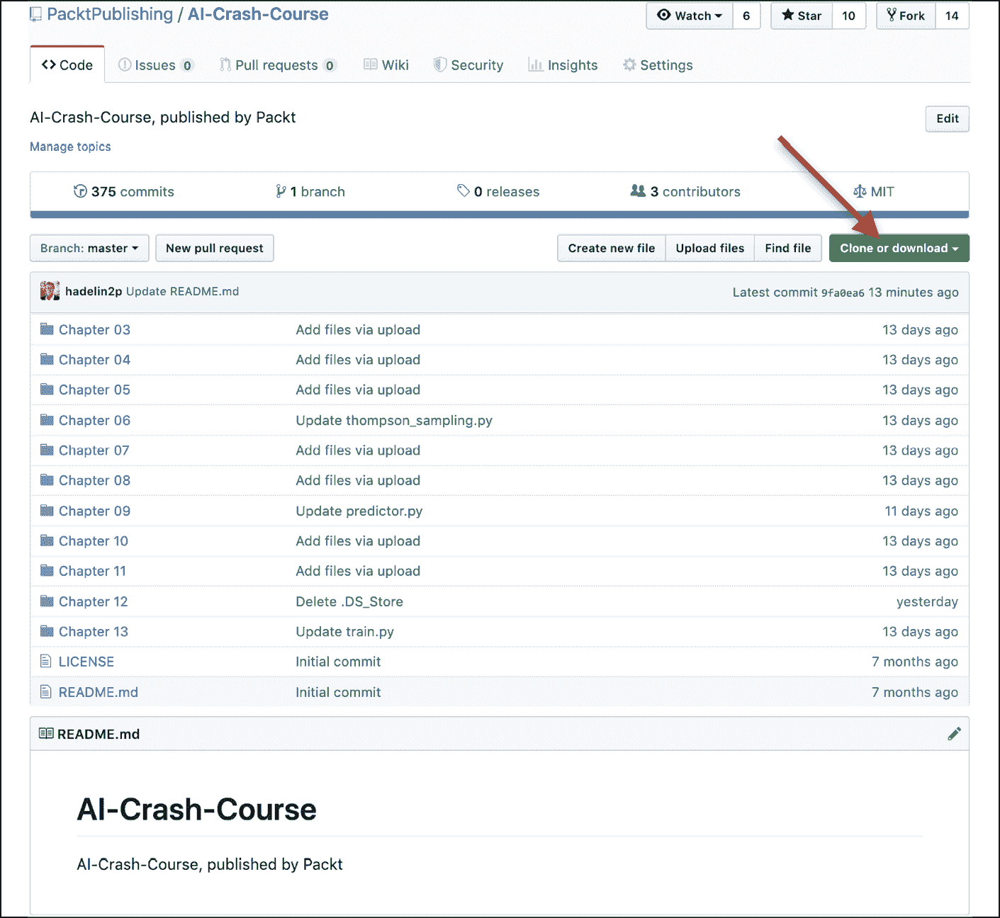
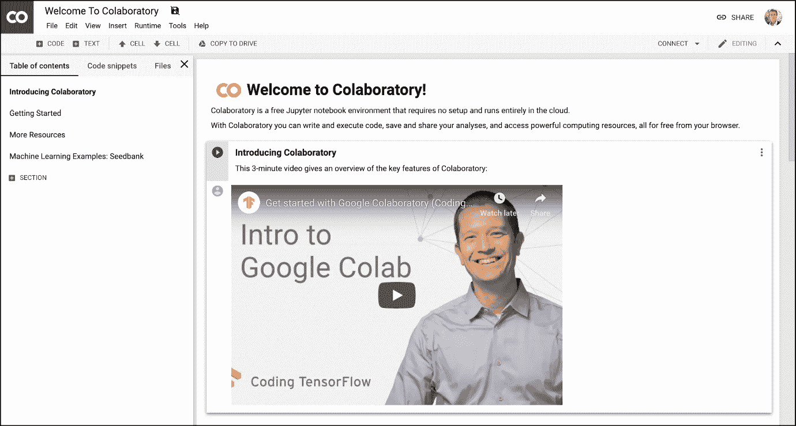
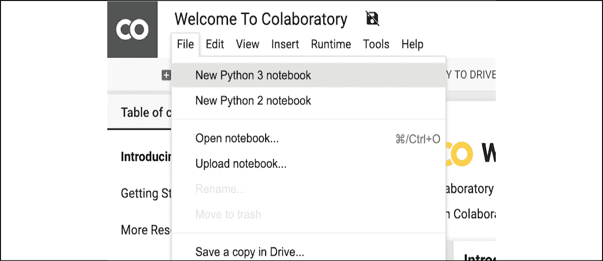
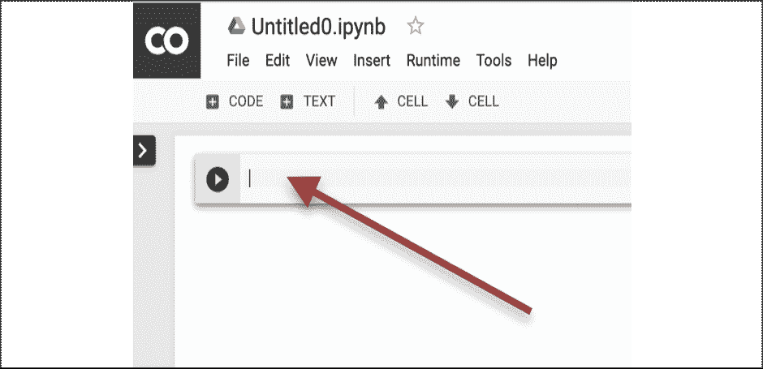
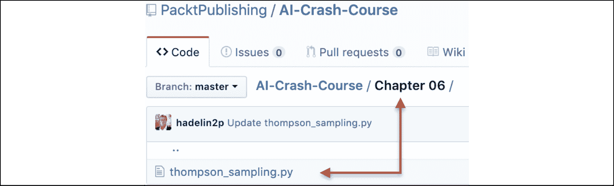
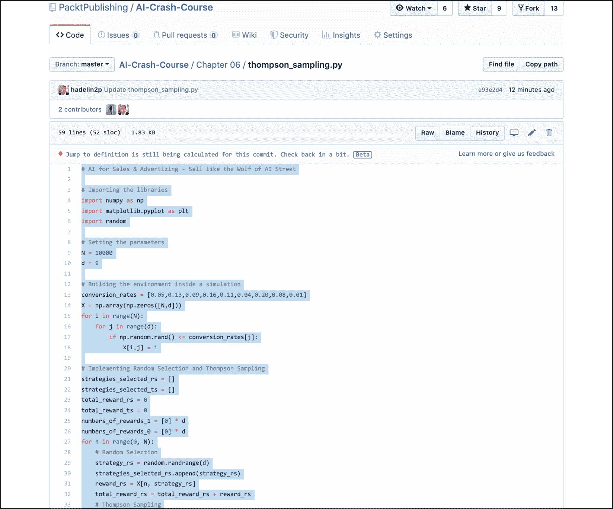
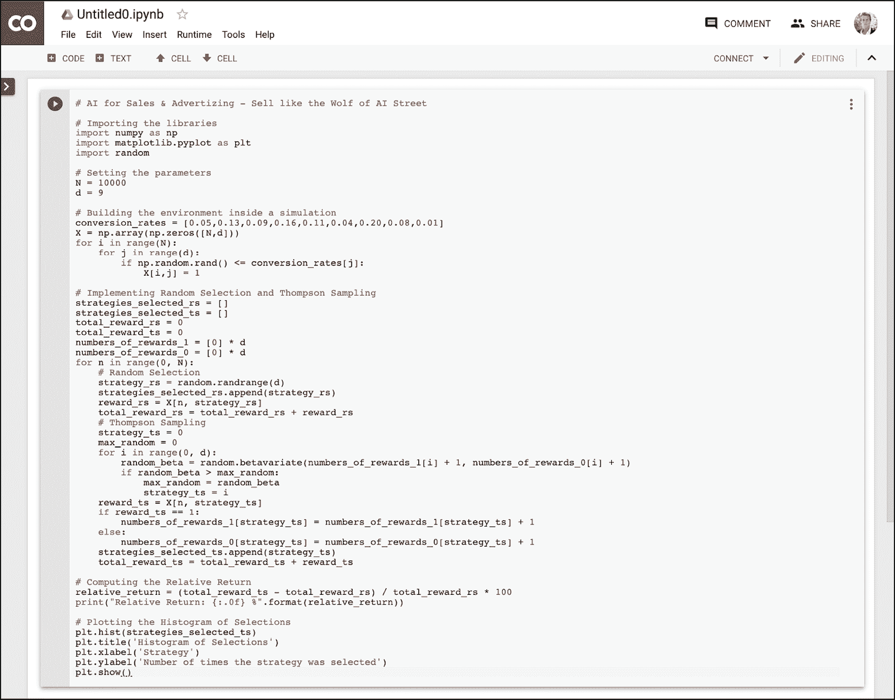

# 第二章：发现你的 AI 工具包

在上一章，你开始了 AI 之旅。在继续之前，你需要准备好 AI 工具包。本书不仅仅是理论；它还包含了一个易于使用的工具包，里面包含了所有 AI 模型的 Python 文件，得益于强大的 Google Colaboratory 平台，这些文件已经准备好可以直接运行，你将在本章中进一步了解该平台。

为了丰富你的 AI 工具包，我准备了一个 GitHub 页面，里面包含了所有的 AI 实现代码供你下载，并且提供了 Python 笔记本的 Google Colab 链接，所有代码都可以通过简单的插拔式操作来执行。

## GitHub 页面

你可以从以下 GitHub 页面下载到本书的所有代码：

[`github.com/PacktPublishing/AI-Crash-Course`](https://github.com/PacktPublishing/AI-Crash-Course)

要下载代码，你只需点击 **Clone or download** 按钮，然后点击 **Download Zip**：

图 1：GitHub 仓库

然后，一旦你下载了这些代码，随便使用你喜欢的 Python **集成开发环境**（**IDE**）打开它们，无论是 Jupyter Notebook、Spyder、一个简单的文本编辑器，甚至是你的终端。

如果你从未使用过 Python 编程，并且不知道如何用 Python 编辑器打开这些文件，也不用担心；我为你准备了最佳且最简单的解决方案：Colaboratory（或 Google Colab）。

## Colaboratory

Colaboratory 是一个免费的开源 Python 开发环境，无需任何配置，完全在云端运行。它包含了所有 AI 实现所需的预装包，这样你只需通过简单的插拔式操作即可运行这些代码。这里的“插入”是指将代码复制并粘贴到新的 Colab 文件中（接下来我会解释如何打开一个），而“播放”则是指点击播放按钮（下面会有示例）。

这是 Colaboratory 主页的链接：

[`colab.research.google.com/notebooks/welcome.ipynb`](https://colab.research.google.com/notebooks/welcome.ipynb)

你应该会看到像这样的页面：

图 2：Colaboratory – 主页

点击左上角的 **文件**，然后点击 **新建 Python 3 笔记本**：

图 3：Colaboratory – 打开一个笔记本

然后你会看到这个界面。将你的 Python 代码粘贴到单元格中（红色箭头指示）。这就是“插入”部分：

图 4：Colaboratory – "插入"部分

我推荐为本书中的每个模型使用独立的 Colaboratory 笔记本。

现在让我们来看看“播放”部分。在 `Chapter 06` 文件夹中打开 Thompson Sampling 模型，代码实现位于 `thompson_sampling.py` 文件中：

图 5：GitHub – 打开 Thompson Sampling

从 Python 文件中复制完整的代码；现在不需要担心理解代码（或结果）。一切将在*第六章*中逐步讲解，*销售与广告的 AI——像 AI 街头的狼一样销售*：

图 6：GitHub – 复制 Thompson Sampling

接下来，将其粘贴到 Colaboratory 中（在*图 4*中由箭头标出的单元格内）。然后我们会得到如下结果：

图 7：粘贴 Thompson Sampling

现在我们准备好进行“播放”部分了！只需点击下面的“播放”按钮：

图 8：“播放”部分

然后代码会执行。现在不需要关注结果，因为一切将在*第六章*中讲解，*销售与广告的 AI——像 AI 街头的狼一样销售*。

一切就绪！你现在拥有了一个 AI 工具包，它将帮助你跟随书中的每个示例进行学习。

在你真正开始 AI 之旅之前，必须确保你具备正确的基础编码知识。在成为 AI 大师之前，这一点至关重要。如果你对 Python 经验较少或没有经验，请确保在*第三章*，*Python 基础——学习如何用 Python 编程*中学习 Python，作为进入机器人世界的最后准备阶段。

## 总结

在本章中，你已经准备好了行李，装上了我们的 AI 工具包，里面不仅包括了本书中的多种 AI 模型，还包括了非常易于使用的 Google Colaboratory 环境。你已经看到如何轻松地将我们的模型从 GitHub 插件到 Colaboratory。现在，你只需要具备编程技能，就可以开始真正的旅程了。在下一章，你将有机会学习——或者复习——你的 Python 基础知识。
