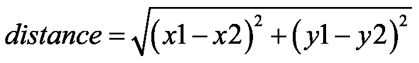
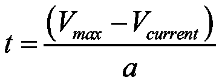
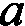

# 第三章：Python 基础 – 学习如何编写 Python 代码

本章适合那些对 Python 编程语言几乎没有或完全没有经验的人。如果你已经知道如何使用`for`/`while`循环、方法和类，你可以跳过本章，之后也不会遇到问题。

然而，如果你以前没有使用过 Python，或者只是稍微用过一点，我强烈建议你按照本指南进行学习。你将学习到我在上一段中提到的 Python 元素，完全理解本书中的代码，并能够独立编写 Python 代码。我还会在本章中提供一些额外的练习，叫做“作业”，我强烈建议你完成它们。

在你开始之前，打开你的 Python 编辑器。我推荐使用 Google Colab 笔记本，它在上一章的 AI 工具包中已介绍给你。所有代码和作业解答都可以在本书 GitHub 页面的`Chapter 3`中找到，对应的部分文件夹里。里面有两个 Python 文件：一个（与章节同名）是本书中使用的代码，而`homework.py`文件是练习的解决方案。每个作业的指示将在每节的末尾提供。

本章将涵盖以下主题：

+   显示文本

+   变量和运算

+   列表和数组

+   `if`语句和条件

+   `for`和`while`循环

+   函数

+   类和对象

尤其是如果你是从零开始，按顺序覆盖每一部分，并记得尝试做作业。让我们开始吧！

## 显示文本

我们将从介绍任何编程语言的最常见方法开始；你将学会如何在 Python 控制台中显示一些文本。控制台是每个 Python 编辑器的一部分，它显示我们想要的信息或任何发生的错误（让我们希望没有错误！）。

在控制台中显示内容的最简单方法是使用`print()`方法，就像这样：

```py
# Displaying text
print('Hello world!') 
```

`print`上面的文本，从`#`开始，是注释。执行代码时，注释会被忽略，只对你可见。

在 Google Colab 中运行这段简短的代码后，你将看到如下输出：

```py
Hello world! 
```

总之，只需将你想显示的内容放入`print`方法的括号中——用引号括起来的文本，像这个例子一样，或者变量。

如果你对变量是什么感到好奇，那太好了——你将在这个练习之后学习它们。

### 练习

只使用一个`print()`方法，尝试显示两行或更多行内容。

**提示**：试试使用`\n`符号。

解决方案可以在 GitHub 页面上的`Chapter 03/Displaying Text/homework.py`文件中找到。

## 变量和运算

变量只是分配在计算机内存中某个地方的值。它们类似于数学中的变量。它们可以是任何东西：文本，整数或浮点数（小数点后带有精度的数字，例如 2.33）。

要创建一个新变量，你只需要写这个：

```py
x = 2 
```

在这种情况下，我们命名了一个变量`x`并将其值设置为`2`。

就像数学中一样，你可以对这些变量执行一些操作。最常见的操作是加法，减法，乘法和除法。在 Python 中，写法如下：

```py
x = x + 5   #x += 5
x = x - 3   #x -= 3
x = x * 2.5 #x *= 2.5
x = x / 3   #x /= 3 
```

如果你第一次看到它，它可能没有太多意义 - 我们怎么能写出`x = x + 5`呢？

在 Python 中，以及大多数编程语言中，“=”符号并不意味着两个术语相等。它意味着我们将新的`x`值与旧的`x`值相关联，加上 5。理解这一点非常重要，这不是一个等式，而是创建一个与之前同名的新变量。

你也可以将这些操作写在右侧的注释中显示。通常你会看到它们以这种方式编写，因为这样更节省空间。

你也可以对其他变量执行这些操作，例如：

```py
y = 3
x += y
print(x) 
```

在这里，我们创建了一个新变量`y`并将其设置为`3`。然后，我们将它添加到我们现有的`x`中。当你运行这段代码时，也会显示`x`的值。

那么，经过所有这些操作后，`x`的结果是什么？如果你运行这段代码，你会得到这个结果：

```py
6.333333333333334 
```

如果你手工计算这些操作，你会发现`x`确实等于`6.33`。

### 练习

尝试找到一种方法来将一个数的幂提高到另一个数。

**提示**：尝试使用 Python 的`pow()`内置函数。

解决方案可以在 GitHub 页面上的`Chapter 03/Variables/homework.py`文件中找到。

## 列表和数组

列表和数组可以用表格表示。想象一下**一维**（1D）向量或矩阵，你刚刚想象到了一个列表/数组。

列表和数组可以包含数据。数据可以是任何东西 - 变量，其他列表或数组（这些称为多维列表/数组），或者某些类的对象（我们稍后会学习它们）。

例如，这是一个包含整数的一维列表/数组：


这是一个**二维**（2D）列表/数组的示例，也包含整数：


要创建一个二维列表，你必须创建一个列表的列表。创建列表非常简单，就像这样：

```py
L1 = list()
L2 = []
L3 = [3,4,1,6,7,5]
L4 = [[2, 9, -5], [-1, 0, 4], [3, 1, 2]] 
```

在这里，我们创建了四个列表：`L1`，`L2`，`L3`和`L4`。前两个列表是空的 - 它们没有任何元素。后两个列表中有一些预定义的值。`L3`是一个一维列表，与第一张图片中的相同。`L4`是一个二维列表，与第二张图片中的相同。正如你所看到的，`L4`实际上由三个较小的 1D 列表组成。

每当我提到数组时，我通常指的是"NumPy"数组。NumPy 是一个 Python 库（库是一个包含预先编写的程序的集合，允许你在不编写代码的情况下执行很多操作），广泛用于列表/数组操作。你可以将 NumPy 数组视为一种特殊类型的列表，具有许多附加的功能。

要创建一个 NumPy 数组，你需要指定大小并使用初始化方法。下面是一个例子：

```py
import numpy as np
nparray = np.zeros((5,5)) 
```

在第一行，我们导入了 NumPy 库（正如你所看到的，要导入库，必须写`import`），然后通过使用`as`，我们给 NumPy 取了一个缩写`np`，以便于使用。接着，我们创建了一个新数组，命名为`nparray`，这是一个 5 x 5 的二维数组，全部元素为零。初始化方法是`.`后面的部分；在这个例子中，我们通过`zeros`函数将数组初始化为零。

为了访问列表或数组中的值，你需要提供该值的索引。例如，如果你想更改`L3`列表中的第一个元素，你必须找到它的索引。在 Python 中，索引从`0`开始，所以你需要写`L3[0]`。实际上，你可以写`print(L3[0])`并执行，它会显示你期望的数字`3`。

访问多维列表/数组中的单个值时，你需要输入与维度数目相同的索引。例如，要从`L4`列表中获取`0`，你需要写`L4[1][1]`。`L4[1]`会返回整个第二行，它是一个列表。

### 练习

尝试找出`L4`列表中所有数字的平均值。这里有多种解法。

**提示**：最简单的解决方案是使用 NumPy 库。你可以在这里查看它的一些函数：[`docs.scipy.org/doc/numpy/reference/`](https://docs.scipy.org/doc/numpy/reference/)

解决方案已提供在 GitHub 页面的`Chapter 03/Lists and Arrays/homework.py`文件中。

## if 语句和条件

现在，我想向你介绍编程中一个非常有用的工具——`if`条件语句！

它们广泛用于检查一个语句是否为真。如果给定的语句为真，则会执行一些代码中的指令。

我将通过一些简单的代码向你展示这个主题，这段代码可以判断一个数字是正数、负数还是零。代码非常简短，所以我会一次性展示全部内容：

```py
a = 5
if a > 0:
    print('a is greater than 0')
elif a == 0:
    print('a is equal to 0')
else:
    print('a is lower than 0') 
```

在第一行，我们引入了一个新变量`a`，并将其值设为`5`。这就是我们要检查值的变量。

在下一行中，我们检查这个变量是否大于`0`。我们通过使用`if`条件语句来做到这一点。如果`a`大于`0`，则执行缩进块中的指令；在这个例子中，只有一条指令，就是显示消息`a is greater than 0`。

然后，如果第一个条件失败，即`a`小于或等于`0`，我们将进入下一个条件，后者通过`elif`引入（`elif`是`else if`的缩写）。此语句将检查`a`是否等于零。如果是，我们执行缩进的指令，显示一条消息：`a 等于 0`。

最终条件通过`else`引入。`else`条件中的指令会在其他条件都失败时执行。在这种情况下，两个条件都失败意味着`a` < `0`，因此我们将显示`a 小于 0`。

很容易预测我们的代码将返回什么。它将是第一条指令，`print('a is greater than 0')`。事实上，一旦运行这段代码，你会得到如下输出：

```py
a is greater than 0 
```

简而言之，`if`用于引入语句检查和第一个条件，`elif`用于检查我们想要的多个进一步条件，而`else`是当所有其他语句都失败时的真语句。

还需要注意的是，一旦一个条件为真，其他条件将不再检查。所以，在这种情况下，一旦我们进入第一个条件并且发现它为真，我们就不再检查其他语句。如果你想检查其他条件，你需要将`elif`和`else`语句替换为新的`if`语句。新的`if`会检查新的条件；因此，`if`中的条件总是会被检查。

### 练习

构建一个条件，检查一个数字是否能被 3 整除。

**提示**：你可以使用一种称为模运算的数学表达式，它在使用时返回两个数字相除后的余数。在 Python 中，模运算用`%`表示。例如：

5 % 3 = 2

71 % 5 = 1

解决方案可以在 GitHub 页面上的`Chapter 03/If Statements/homework.py`文件中找到。

## `for` 和 `while` 循环

你可以把循环看作是不断重复相同的指令，直到满足某个条件打破循环。例如，之前的代码不是一个循环；因为它只执行了一次，所以我们只检查了一次`a`。

Python 中有两种循环类型：

+   `for` 循环

+   `while` 循环

`for` 循环有一个特定的迭代次数。你可以将一次迭代看作是`for`循环中指定指令的单次执行。迭代次数告诉程序循环内的指令应该执行多少次。

那么，如何创建一个`for`循环呢？很简单，就像这样：

```py
for i in range(1, 20):
    print(i) 
```

我们通过编写`for`来初始化这个循环，以指定循环类型。然后，我们创建一个变量`i,`，它将与`range(1,20)`中的整数值关联。这意味着当我们第一次进入这个循环时，`i`将等于`1`，第二次时将等于`2`，以此类推，一直到`19`。为什么是`19`？这是因为在 Python 中，区间的上界是排除的，因此在最后一次迭代时，`i`将等于`19`。至于我们的指令，在这种情况下，它只是通过使用`print()`方法在控制台显示当前的`i`。还需要理解的是，主代码在`for`循环完成之前不会继续执行。

这是我们执行代码后得到的结果：

```py
1
2
3
4
5
6
7
8
9
10
11
12
13
14
15
16
17
18
19 
```

你可以看到我们的代码显示了所有大于 0 且小于 20 的整数。

你也可以使用`for`循环按以下方式遍历列表中的元素：

```py
L3 = [3,4,1,6,7,5]
for element in L3:
    print(element) 
```

这里我们回到我们的`L3`一维列表。该代码会遍历`L3`列表中的每个元素并显示它。如果你运行它，你将看到从`3`到`5`的所有元素。

另一方面，`while`循环需要一个停止条件。它会继续执行，直到给定的条件满足为止。以这个`while`循环为例：

```py
stop = False
i = 0
while stop == False:  # alternatively it can be "while not stop:"
    i += 1
    print(i)
    if i >= 19:
        stop = True 
```

在这里，我们创建了一个名为`stop`的新变量。这种类型的变量叫做布尔变量，因为它只能赋值为`True`或`False`。然后，我们创建了一个名为`i`的变量，来计算我们的`while`循环执行了多少次。接下来，我们创建了一个`while`循环，只有当变量`stop`为`False`时它才会继续执行；只有当`stop`被更改为`True`时，循环才会停止。

在循环中，我们将`i`增加 1，显示它，并检查它是否大于或等于`19`。如果大于或等于`19`，我们将`stop`设置为`True`；一旦我们将`stop`设置为`True`，循环将中断！

执行这段代码后，你将看到与`for`循环示例完全相同的输出，即：

```py
1
2
3
4
5
6
7
8
9
10
11
12
13
14
15
16
17
18
19 
```

同时，非常重要的一点是你可以将`for`和`while`循环嵌套使用。例如，为了显示我们之前创建的 2D 列表`L4`中的所有元素，你需要创建一个`for`循环来遍历每一行，然后在这个循环内再创建一个`for`循环来遍历每一行中的每个值。像这样：

```py
L4 = [[2, 9, -5], [-1, 0, 4], [3, 1, 2]]
for row in L4:
    for element in row:
        print(element) 
```

执行这段代码会得到以下输出：

```py
2
9
-5
-1
0
4
3
1
2 
```

这与`L4`列表相匹配。

总结一下，`for`和`while`循环使我们能够轻松地执行重复任务。`for`循环总是作用于一个预定义的范围；你可以准确知道它们什么时候停止。`while`循环作用于一个未定义的范围；仅凭它们的`stop`条件，你可能无法判断会执行多少次迭代。`while`循环会一直执行，直到满足特定条件为止。

### 练习

编写能够计算正整数变量阶乘的`for`和`while`循环。

**提示**：阶乘是一个数学函数，返回所有小于或等于该函数参数的正整数的乘积。这个公式是：

`f`(`n`) = `n` * (`n` – 1) * (`n` – 2) *...* 1

其中：

+   `f`(`n`) – 阶乘函数

+   `n` – 目标整数，我们要计算该整数的阶乘

该函数在数学中由`!`表示，例如：

5! = 5 * 4 * 3 * 2 * 1 = 120

4! = 4 * 3 * 2 * 1 = 24

解决方案可以在 GitHub 页面的`Chapter 03/For and While Loops/homework.py`文件中找到。

## 函数

函数在你想要提高代码可读性时非常有用。你可以把它们看作是主代码流程外的代码块。函数会在被主代码调用时执行。

你可以这样写一个函数：

```py
def division(a, b):
    result = a / b
    return result
d = division(3, 5)
print(d) 
```

前三行是新创建的一个名为`division`的函数，后两行是主代码的一部分。

你可以通过编写`def`来创建一个函数，然后写下函数的名称。名称后面加上括号，并在其中写下函数的参数；这些是你可以在函数内使用的变量，是主代码与函数之间的连接部分。在这个例子中，我们的函数接受两个参数：`a`和`b`。

然后，当我们调用我们的函数时，我们做的就是计算`a`除以`b`并将这个除法结果称为`result`。接着，在函数的最后一行，我们说`return`，这样当我们在代码中调用这个函数时，它就会返回一个值。在这种情况下，返回的值是`result`。

接下来，我们回到主代码中并调用我们的函数。我们通过写`division`来做到这一点，然后在括号内输入我们想要除的两个数字。记住，`division`函数返回的是这次除法的`result`；因此，我们创建了一个变量`d`来保存这个返回值。在最后一行，我们简单地显示`d`来检查这段代码是否真的有效。如果你运行它，你将看到输出：

```py
0.6 
```

正如你手动验证的那样，3 除以 5 的确是 0.6；你也可以用其他数字进行测试。

在实际的代码中，函数可能会更长，有时甚至会调用其他函数。你会在本书的其他章节中看到它们的广泛应用。它们还提高了代码的可读性，正如你稍后会看到的那样；如果没有函数，我提供的代码将无法理解。

### 练习

构建一个函数来计算二维平面上两点之间的距离：一个点的坐标为`x1`和`y1`，另一个点的坐标为`x2`和`y2`。

**提示**：你可以使用以下公式：



解决方案可以在 GitHub 页面的`Chapter 03/Functions/homework.py`文件中找到。

## 类和对象

类和函数一样，都是位于主代码之外的另一部分代码，只有在主代码中调用时才会执行。对象是相应类的实例，存在于我们代码的主流程中。为了更好地理解它，可以将类视为某物的计划，例如一辆车的计划。它包含了某些组件的外观以及它们如何相互协作。Python 中的类是某物的一种通用计划。

你可以将对象视为基于计划构建的现实世界中的构造物。例如，一辆真实、可工作的自动驾驶汽车就是一个对象的例子。你创建了一个车的计划（即类），然后你根据这个计划建造一辆车（即对象）。当然，当你有了某物的计划时，你可以根据这个计划创建任意多个副本；例如，你可以运行一个生产线来生产汽车。

为了让你对类有更深入的了解，我们将创建一个简单的`bot`。我们从编写一个类开始，像这样：

```py
class Bot():

    def __init__(self, posx, posy):
        self.posx = posx
        self.posy = posy

    def move(self, speedx, speedy):
        self.posx += speedx
        self.posy += speedy 
```

我们写`class`来指定我们正在创建一个新的类，我们将其命名为`Bot`。然后，一个非常重要的步骤是编写`__init__()`方法，这是创建类时的必要步骤。每当在代码的主流程中创建该类的对象时，这个函数会自动调用。

类中的所有函数都需要接受`self`作为一个参数。那么，`self`是什么？这个参数指定了这个函数及其变量（变量名以`self`为前缀）是这个类的一部分。只有在我们拥有该类的对象时，才能调用`self`变量。我们的`bot`的`__init__()`方法同样接受两个参数，`posx`和`posy`，这将是我们`bot`的初始位置。

我们还创建了一个方法，它将通过增加或减少`posx`和`posy`来移动我们的`bot`。方法是一个嵌入类中的函数。你可以将其视为一种说明，描述当我们拥有一个计划时，某个事物应该如何工作。例如，回到汽车的例子，方法可以定义我们的发动机或变速箱的工作方式。

现在，你可以创建该类的一个对象了。记住，这将是一个基于计划（`class`）构建的现实世界中的对象。之前，类是预定义的，并未与代码一起工作。创建对象后，类便成为了你主代码的一部分。我们可以通过如下方式实现：

```py
bot = Bot(3, 4) 
```

这将创建一个`Bot`类的新对象；我们将这个对象命名为`bot`。我们还需要指定`Bot`类的`__init__()`方法所接受的两个参数，分别是`posx`和`posy`。这不是可选的；在创建对象时，你必须始终指定`__init__()`方法中给出的所有参数。

现在，在主代码中，你可以移动`bot`并显示它的新位置，像这样：

```py
bot.move(2, -1)
print(bot.posx, bot.posy) 
```

在第一行中，我们使用了 `Bot` 类中的 `move` 方法。如你所见，在其定义中，`move` 需要两个参数。这两个参数分别指定了我们将增加 `posx` 和 `posy` 的量。然后我们只需显示新的 `posx` 和 `posy`。这就是 `self` 起作用的地方；如果在我们的 `Bot` 类中，`posx` 和 `posy` 前面没有加上 `self`，我们就无法通过该方法访问它们。运行此代码会得到如下结果：

```py
5 3 
```

如你所见，结果显示我们的机器人在 `x` 轴上向前移动了两个单位，在 `y` 轴上向后移动了一个单位。记住，`posx` 最初设置为 `3`，并且通过 `Bot` 类的 `move` 方法增加了 `2`；`posy` 最初设置为 `4`，并通过相同的 `move` 方法减少了 `1`。

编写一个 `Bot` 类的一个巨大优势是，现在我们可以创建任意数量的机器人，而无需增加任何代码。简而言之，**对象是类的副本，我们可以创建任意数量的对象。**

总之，你可以把类看作是一个包含预定义指令并封装在方法中的集合，而对象可以看作是类的一个实例，它在我们的代码中是可访问的，并与代码一同运行。

### 练习

你的最终挑战是构建一个非常简单的汽车类。作为参数，汽车对象应该接收汽车能达到的最高速度（单位为 m/s），以及汽车的加速度（单位为 m/s²）。我还挑战你构建一个方法，计算汽车从当前速度加速到最高速度所需的时间，已知加速度（使用当前速度作为该方法的参数）。

**提示**：要计算所需时间，你可以使用以下公式：



其中：

+    – 达到最高速度所需的时间

+    – 最高速度

+    – 当前速度

+    – 加速度

解决方案在 GitHub 页面上的 `Chapter 03/Classes/homework.py` 文件中提供。

## 总结

在本章中，我们介绍了学习 Python 基础知识所需的内容，帮助你跟上本书中的代码，从向控制台发送简单的文本显示，到编写你的第一个 Python 类。现在，你已经具备了继续你人工智能之旅所需的所有技能；在*第四章*，*人工智能基础技术*中，我们将开始研究人工智能的基础技术。
