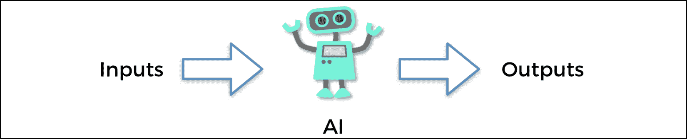
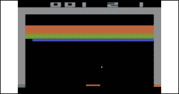
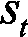
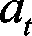
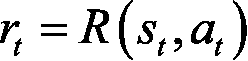
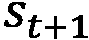
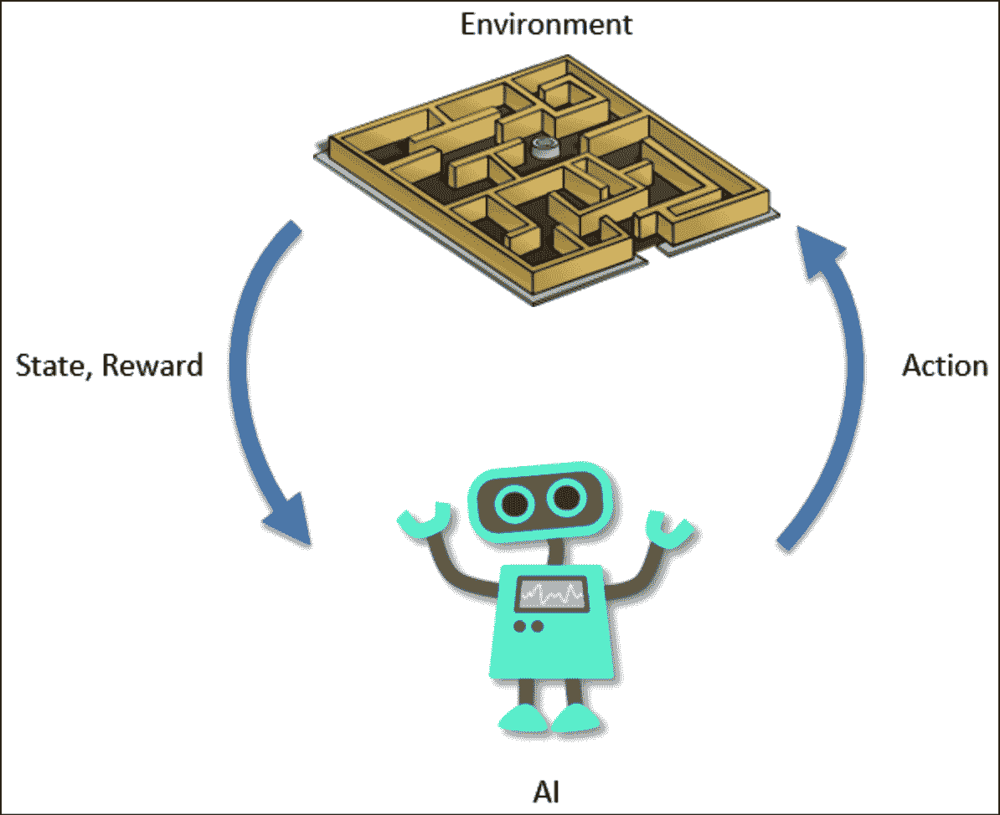

# 第四章：人工智能基础技术

在本章中，你将正式开始学习人工智能理论。你将从强化学习这一人工智能的主要分支开始，并学习支撑每一个强化学习模型的五个原则。这些原则将为你提供理论基础，帮助你理解本书中所有即将出现的人工智能模型。

## 什么是强化学习？

当人们今天提到人工智能时，有些人会想到机器学习，而另一些人则会想到强化学习。我属于后者。我一直认为机器学习是具有学习某些关联性的统计模型，它们通过这些关联性进行预测，而无需明确的编程。

虽然这在某种程度上是一种人工智能的表现，但机器学习并不包含像我们人类那样进行行动和与环境互动的过程。事实上，作为智能的存在，我们不断进行以下的行为：

1.  我们观察一些输入，不论是通过眼睛看到的，耳朵听到的，还是我们记得的。

1.  这些输入随后会在我们的大脑中处理。

1.  最终，我们做出决策并采取行动。

与环境互动的这一过程是我们试图在人工智能领域重现的内容。为此，人工智能的一个分支——强化学习，致力于此。它是最接近我们思考方式的人工智能形式；如果我们把人工智能看作是试图模仿（或超越）人类智能的科学，那么它就是人工智能中最先进的形式。

强化学习在人工智能的商业应用中也取得了最令人印象深刻的成果。例如，阿里巴巴利用强化学习将其在线广告的投资回报率提高了 240%，而无需增加广告预算（参见[`arxiv.org/pdf/1802.09756.pdf`](https://arxiv.org/pdf/1802.09756.pdf)，第 9 页，表格 1 最后一行（DCMAB））。我们将在本书中处理相同的行业应用！

## 强化学习的五个原则

让我们开始建立你对强化学习如何工作的第一批直觉。这些是强化学习的基本原则，它们将为你在人工智能领域打下坚实的基础。

以下是五个原则：

1.  **原则 #1**：输入与输出系统

1.  **原则 #2**：奖励

1.  **原则 #3**：人工智能环境

1.  **原则 #4**：马尔可夫决策过程

1.  **原则 #5**：训练与推理

在接下来的章节中，你将依次阅读每个内容。

### 原则 #1 – 输入与输出系统

第一步是理解，今天所有的人工智能模型都基于输入和输出的共同原则。每一种形式的人工智能，包括机器学习模型、聊天机器人、推荐系统、机器人，当然也包括强化学习模型，都会接收某些东西作为输入，并返回另一种东西作为输出。

图 1：输入和输出系统

在强化学习中，这些输入和输出有一个特定的名称：输入叫做状态，或输入状态。输出是 AI 执行的动作。中间的部分，只有一个函数，它以状态为输入，返回动作作为输出。这个函数叫做策略。记住这个名字，“策略”，因为你会在 AI 文献中经常看到它。

以自动驾驶汽车为例。试着想象一下，在这种情况下输入和输出是什么。

输入是嵌入式计算机视觉系统所看到的内容，输出则是汽车的下一步动作：加速、减速、左转、右转或刹车。请注意，任何时候（`t`），输出可能是多个动作同时执行。例如，自驾车可以在加速的同时左转。同样，每个时刻（`t`）的输入也可以由多个元素组成：主要是计算机视觉系统观察到的图像，但也包括一些汽车参数，如当前速度、油箱剩余的油量等。

这就是人工智能的第一个重要原则：它是一个智能系统（一个策略），它接受一些元素作为输入，在中间进行处理，然后返回一些动作作为输出。记住，输入也叫做**状态**。

下一个重要的原则是奖励。

### 原则#2 – 奖励

每个 AI 的表现都通过奖励系统来衡量。这一点毫不复杂；奖励只是一个度量标准，用来告诉 AI 它随时间的表现如何。

最简单的例子是二元奖励：0 或 1。想象一个 AI 需要猜测一个结果。如果猜对了，奖励是 1；如果猜错了，奖励是 0。这可能就是定义 AI 奖励系统的方式；实际上，它可以简单到如此！

然而，奖励不一定是二元的。它可以是连续的。考虑一下著名的*Breakout*游戏：

图 2：Breakout 游戏

想象一个 AI 在玩这个游戏。试着思考在这种情况下奖励是什么。它可能仅仅是得分；更准确地说，得分就是在一局游戏中随时间积累的奖励，而奖励可以定义为得分的**导数**。

这是我们可以为这个游戏定义奖励系统的众多方式之一。不同的 AI 将有不同的奖励结构；我们将在本书中为五个不同的实际应用构建五个奖励系统。

牢记这一点：AI 的最终目标总是**最大化**随时间积累的奖励。

这些就是人工智能当前存在的前两个基本而根本的原则；输入输出系统和奖励。接下来要考虑的是 AI 环境。

### 原则#3 – AI 环境

第三个原则是我们所说的“AI 环境”。它是一个非常简单的框架，你需要在每个时间点（`t`）定义三件事：

+   输入（状态）

+   输出（动作）

+   奖励（性能指标）

对于今天构建的每一个基于强化学习的 AI，我们始终定义一个由上述元素组成的环境。然而，理解一个 AI 环境中不仅仅有这三种元素是很重要的。

例如，如果你正在构建一个 AI 来打败一款赛车游戏，那么环境还会包含该游戏的地图和游戏玩法。或者，在自动驾驶汽车的例子中，环境还会包含 AI 行驶的所有道路以及围绕这些道路的物体。但你在构建任何 AI 时，总是能找到的共同点就是状态、动作和奖励这三个元素。下一个原则，马尔可夫决策过程，讲述了它们在实践中是如何运作的。

### 原则 #4 – 马尔可夫决策过程

马尔可夫决策过程，或 MDP，简单来说，是一种模型，描述 AI 如何随着时间与环境互动。该过程从`t` = 0 开始，然后在每个后续的迭代中，也就是在`t` = 1，`t` = 2，… `t` = `n`单位时间时（单位可以是任何东西，例如 1 秒），AI 遵循相同的过渡格式：

1.  AI 观察当前状态，。

1.  AI 执行动作，。

1.  AI 收到奖励，。

1.  AI 进入下一个状态，。

强化学习中 AI 的目标始终是一样的：最大化随着时间积累的奖励总和，也就是在每次过渡时收到的所有的总和。

以下图示将帮助你更好地理解并记住 MDP，它是强化学习模型的基础：

图 3：马尔可夫决策过程

现在，四个基本支柱已经在塑造你对 AI 的直觉。再加上最后一个重要的支柱，就完成了你对 AI 理解的基础。最后一个原则是训练与推理；在训练阶段，AI 进行学习，而在推理阶段，AI 进行预测。

### 原则 #5 – 训练与推理

你需要理解的最后一个原则是训练和推理之间的区别。构建 AI 时，有一个阶段是训练模式，另一个阶段是推理模式。我将从训练模式开始解释这意味着什么。

#### 训练模式

现在你已经从前三个原则中理解到，构建 AI 的第一步是建立一个环境，在这个环境中，输入状态、输出动作和奖励系统需要明确定义。从第四个原则，你也能理解到，在这个环境中我们将构建一个 AI 来与之交互，尽力最大化随着时间积累的总奖励。

简单来说，会有一个初步的（且漫长的）时间段，在这段时间里，AI 将接受训练以完成目标。这个时间段被称为训练期；我们也可以说 AI 处于训练模式。在此期间，AI 会不断尝试完成某个目标，直到成功为止。在每次尝试后，AI 模型的参数都会被调整，以便下次表现得更好。

比如说，假设你正在构建一辆自动驾驶汽车，你希望它从*Ａ*点开到*Ｂ*点。我们还假设存在一些障碍物，你希望自动驾驶汽车能够避开它们。训练过程如下：

1.  你选择一个 AI 模型，可能是汤普森采样（*第五章*和*第六章*），Q 学习（*第七章*和*第八章*），深度 Q 学习（*第九章*、*第十章*和*第十一章*）甚至深度卷积 Q 学习（*第十二章*和*第十三章*）。

1.  你初始化模型的参数。

1.  你的 AI 尝试从*Ａ*到*Ｂ*（通过观察状态并执行其行动）。在第一次尝试中，AI 越接近*Ｂ*，你给它的奖励就越高。如果它没能到达*Ｂ*或者碰到障碍，你就给 AI 一个非常差的奖励。如果它成功到达*Ｂ*且没有撞到任何障碍，你就给它一个极好的奖励。这就像你训练一只狗坐下：如果狗坐下了，你给它奖励或说“好狗”（正面奖励）。如果狗不听话，你就给予它必要的惩罚（负面奖励）。这个过程就是训练，在强化学习中是一样的。

1.  在尝试结束时（也称为一个回合），你会调整模型的参数，以便下次做得更好。这些参数的修改是智能化的，可以通过迭代的方程（Q 学习）来完成，或者使用机器学习和深度学习技术，如随机梯度下降或反向传播。所有这些技术将在本书中讲解。

1.  你需要不断重复步骤 3 和 4，直到达到理想的性能；也就是说，直到你拥有一辆完全安全的自动驾驶汽车！

所以，这就是训练。那么，推理呢？

#### 推理模式

推理模式仅在你的 AI 完全训练好并准备好表现时开始。在推理模式下，AI 只需通过执行行动来与环境互动，以完成在训练模式下曾经训练过的目标。在推理模式中，每个回合结束后，AI 的参数不会被修改。

比如，假设你拥有一家为企业提供定制 AI 解决方案的 AI 公司，且其中一个客户要求你开发一个 AI 来优化智能电网中的流量。首先，你会进入研发阶段，在这个阶段，你将训练 AI 来优化这些流量（训练模式），一旦达到了一个良好的性能水平，你就会将 AI 交付给客户并进入生产阶段。你的 AI 只通过观察电网的当前状态并执行它被训练过的动作来调节智能电网中的流量。这就是推理模式。

有时候，环境可能会发生变化，这时你必须在训练模式和推理模式之间快速切换，以便让你的 AI 适应环境中的新变化。一个更好的解决方案是每天训练你的 AI 模型，并使用最新训练的模型进入推理模式。

这就是每个人工智能（AI）共有的最后一个基本原则。恭喜你——现在你已经对人工智能有了坚实的基础理解！既然你掌握了这些，你已经准备好在下一章中处理你的第一个 AI 模型：一个简单但非常强大的模型，至今在商业和营销中仍被广泛使用，用来解决一个有着迷人名字的多臂赌博机问题。

## 总结

在本章中，你从强化学习的角度学习了人工智能的五个基本原则。首先，AI 是一个系统，它将观察（值、图像或任何数据）作为输入，并返回一个要执行的动作作为输出（原则#1）。然后，有一个奖励系统，帮助它衡量其性能。AI 会通过试错法学习，根据它随着时间获得的奖励（原则#2）。输入（状态）、输出（动作）和奖励系统定义了 AI 环境（原则#3）。AI 通过马尔可夫决策过程与这个环境互动（原则#4）。最后，在训练模式下，AI 通过迭代更新其参数，学习如何最大化总奖励；而在推理模式下，AI 只是执行其动作，贯穿整个过程而不更新任何参数——也就是说，不进行学习（原则#5）。

在下一章中，你将学习汤普森采样（Thompson Sampling），一个简单的强化学习模型，并使用它来解决多臂赌博机问题。
