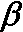
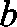

# 第五章：你的第一个 AI 模型 —— 小心赌博机！

在本章中，你将掌握你的第一个 AI 模型！你将创建一个模型来解决非常著名的多臂赌博机问题。这是 AI 中的经典问题，也广泛应用于许多现实世界的商业问题中。

## 多臂赌博机问题

想象你在拉斯维加斯，你最喜欢的赌场里。你所在的房间里有五台老虎机。每台老虎机的游戏规则相同：你下注一定金额，比如 1 美元，拉动把手，机器要么拿走你的钱，要么给你两倍的钱。还记得我们在上一章讨论的奖励吗？假设如果机器拿走你的钱，你的奖励是 -1；如果机器还给你两倍的钱，你的奖励是 +1。

如你所见，你已经开始定义一个 AI 环境了，提醒一下，这是解决 AI 问题时至关重要的步骤。到目前为止，AI 还没有出现，但它很快就会到来。你总是从定义环境开始。

你已经定义了奖励；稍后你将定义状态（输入）和动作（输出）。现在，仍在定义环境的过程中，假设你以某种方式知道其中一台老虎机比其他老虎机在你拉动其把手时，给你 +1 奖励的概率更高。你知道这个信息并不重要，但它必须是问题假设的一部分。请放心，这个假设在上述现实世界的商业问题中总是能自然得到验证，这些问题可以应用多臂赌博机问题。

你的目标，和任何 AI 环境一样，是在游戏过程中获得最高的累积奖励。假设你将总共投注 1,000 美元，也就是说你将投注 1 美元，1,000 次，每次都拉动其中任何一台老虎机的把手。问题是：

你应该采取什么策略，以便在玩 1,000 次后，能够获得最多的钱带回家？

你策略的第一步必须是在最少的次数内，找出这五台老虎机中哪个有最高的概率给你 +1 奖励。换句话说，你必须快速找出成功率最高的老虎机。然后，一旦你找到了，你只需继续在那台最成功的老虎机上进行游戏。

找到最成功的老虎机并不难；一种简单的策略是分别在这五台老虎机上各玩 100 次，然后在最后查看哪一台给你带来了更多的钱。从统计学的角度来看，这样做能够让你有很大机会找到那个最慷慨的老虎机。

挑战就在于“快速”。最难的部分是 **在最少的试验次数内** 找到最好的老虎机。这就是你第一个 AI 模型派上用场的地方。

## 汤普森采样模型

你将立即构建这个模型。现在，你将实现这个方法的一个简单版本，之后会展示其背后的理论。我们开始吧！

如我们之前定义的，我们的问题是要从多个老虎机中找到中奖概率最高的那个。一个不太理想的解决方案是对每台老虎机玩 100 轮，看看哪台的中奖率最高。一个更好的解决方案是使用一种叫做汤普森采样（Thompson Sampling）的方法。

我不会深入讲解其背后的理论，稍后我们会讨论。现在，只需要知道，汤普森采样（Thompson Sampling）使用一个分布函数（分布的相关内容将在本章中进一步解释），这个函数叫做 Beta，它接受两个参数。为了简化，我们可以假设，第一个参数越大，我们的老虎机就越好；第二个参数越大，我们的老虎机就越差。

因此，我们可以将这个函数定义为：


其中：

+   `x` – 从我们的 Beta 分布中随机选择的一个值

+    – 我们的 Beta 函数

+   `a` – 第一个参数

+   `b` – 第二个参数

如果你现在还不完全理解这些内容，别担心；你之后会读到相关内容。

### 编写模型

让我们开始编写解决方案的代码。所有这些代码也可以在本书的 GitHub 页面的`Chapter 05`文件夹中找到。我们从第一段代码开始：

```py
# Importing the libraries
import numpy as np 
```

你只需要一个库，叫做 NumPy。这个库非常有用，尤其是在处理多维数组和列表时。将它简写为`np`，这是行业标准，这样使用起来会更方便。

现在我们必须理解一个非常重要的概念。你正在创建一个模拟，其目的是模拟现实生活中的情况。在现实中，每台老虎机都有一定的中奖概率，并且有些机器的中奖概率高于其他机器。因此，在模拟这个环境时，你也需要做同样的事情。然而，需要记住的是，我们的 AI 并不知道这些预定义的中奖概率。它不能直接读取这些概率，并基于这些概率判断哪个机器是最好的。

对于这个例子，我们将这个中奖机会的列表称为`conversionRates`。

```py
# Setting conversion rates and the number of samples
conversionRates = [0.15, 0.04, 0.13, 0.11, 0.05]
N = 10000
d = len(conversionRates) 
```

这里，你有五台老虎机。它们每台有不同的中奖概率；例如，老虎机编号 1 的中奖概率是 15%。接着你创建一个样本数量`N`。记住，你是在做模拟，所以你需要一个预定义的数据集，告诉你在游戏时是否获胜。你还引入了一个变量`d`，表示你的中奖率列表的长度，也就是老虎机的数量。使用这样的简短变量名非常有用，因为如果不这样做，代码会更长，且不易阅读。

你知道接下来该怎么做了吗？你正在运行一个模拟，因此需要为每个样本的每个老虎机预定义一个胜负结果。我强烈建议你自己先尝试做这一步。你需要有一个集合，告诉你在某个时刻`i`，通过玩某个老虎机你是否获胜。答案在下一个代码片段中。

```py
# Creating the dataset
X = np.zeros((N, d))
for i in range(N):
    for j in range(d):
        if np.random.rand() < conversionRates[j]:
            X[i][j] = 1 
```

在第一行，你创建了一个充满零的二维数组，大小为`N * d`。这意味着你创建了一个`N`（在这个例子中为`10000`）行和`d`（在这个例子中为`5`）列的数组。然后，在一个`for`循环中，你遍历了这个二维数组`X`中的每一行。在一个嵌套的`for`循环中，你遍历了该行中的每一列。在前面代码片段的第 5 行，对于每个老虎机（每一列），我们检查从范围(0,1)中得到的随机浮动数是否小于相应老虎机的转换率。

这就像是在玩老虎机；由于从这个范围中得到任何浮动数的机会是均等的，得到一个小于`x`的数字的机会（其中`x`也在区间(0,1)内）等于`x`。例如，当`d` = 0.15 时，在 100 次中有 15 次会得到一个小于 0.15 的浮动数，因此老虎机 1 的高奖励概率是 15%。换句话说，如果随机浮动数较小，那么意味着你在某个时刻玩这个特定的机器时会赢。

为了确保你理解，如果你的数据集`X`中的`N`个样本之一看起来像这样：`[0, 1, 0, 0, 1]`，那么在这个时刻，通过玩老虎机编号 2 或 5 你会赢。

接下来，你需要创建两个数组，用来记录你玩每个老虎机时获胜和失败的次数，像这样：

```py
# Making arrays to count our losses and wins
nPosReward = np.zeros(d)
nNegReward = np.zeros(d) 
```

将它们命名为`nPosReward`（获胜次数）和`nNegReward`（失败次数）。

现在，你已经创建了一个模拟集合和这两个计数器，你可以开始编写一些 Thompson Sampling 代码了。请记住，理论和另一个示例稍后会讲解。

接下来，初始化一个`for`循环，遍历数据集中的每个样本并选择最佳老虎机。最初，只需要创建两个变量，一个叫`selected`，它会告诉你选择了哪个老虎机，另一个叫`maxRandom`，你将用它来获得所有老虎机中最高的 Beta 分布猜测：

```py
# Taking our best slot machine through beta distribution and updating its losses and wins
for i in range(N):
    selected = 0
    maxRandom = 0 
```

现在你可以理解 Thompson Sampling 的核心了。你将从我们的 Beta 分布中随机猜测，并找出所有老虎机中的最高值。

你可以使用 NumPy 中的方法`np.random.beta(a,b)`来返回这个随机猜测。知道这一点后，试着自己找出最高的猜测和最好的机器吧！即使失败也完全没关系——我们还没讲到理论——我会给你一个答案的。祝你好运！

希望你已经试过了。不管是否成功，这里是我的答案：

```py
 for j in range(d):
        randomBeta = np.random.beta(nPosReward[j] + 1, nNegReward[j] + 1)
        if randomBeta > maxRandom:
            maxRandom = randomBeta
            selected = j 
```

你没有漏掉任何内容—这就是完成该任务所需的所有代码。你创建了一个`for`循环来遍历每个老虎机并找出最好的一个。对于每个老虎机索引`j`（记住你依然在大的`for`循环中，索引为`i`），你从我们的 Beta 分布中进行一次随机抽样，叫做`randomBeta`，并检查它是否大于`maxRandom`。

如果是的话，那么你将重新分配`maxRandom`的值为`randomBeta`，并将`selected`设置为这个新的最大猜测老虎机`j`的索引。还值得提一下的是，Beta 函数的`a`和`b`参数在此处的含义；它们是我们在特定老虎机上获得的胜利和失败次数。记住，第一个参数越大越好，我们的随机猜测也会越高；第二个参数越大越糟，我们的随机猜测也会越低。

现在你已经选择了最好的老虎机，接下来你认为应该做什么？

你需要根据是否获胜来更新`nPosReward`或`nNegReward`。我们可以通过以下代码来实现：

```py
 if X[i][selected] == 1:
        nPosReward[selected] += 1
    else:
        nNegReward[selected] += 1 
```

在这里，你可以看到你之前创建的`X`数组的使用。你通过检查`X`数组中相应位置是否为`1`来判断是否赢得了这一轮。如果赢了，你就通过在`nPosReward`中相应的索引加`1`来更新该机器的奖励。如果输了，你则在`nNegReward`中同样的位置加`1`。你可以清楚地看到，如果你赢了，下一次你从 Beta 分布中抽到的该机器的随机猜测值会更高；如果你输了，随机猜测值则会更低。

这段代码已经能正常工作，虽然值得添加几行代码来展示你的代码认为哪个老虎机是最好的：

```py
# Showing which slot machine is considered the best
nSelected = nPosReward + nNegReward 
for i in range(d):
    print('Machine number ' + str(i + 1) + ' was selected ' + str(nSelected[i]) + ' times')
print('Conclusion: Best machine is machine number ' + str(np.argmax(nSelected) + 1)) 
```

在这里，你只需展示你的算法选择了多少次每个老虎机。为了得到这些数字，你可以将`nPosReward`和`nNegReward`的列表相加。在最后一行，你展示了选择次数最多的老虎机，从而确定其为被认为最好的老虎机。

现在，你可以直接运行代码并查看结果：

```py
Machine number 1 was selected 7927.0 times
Machine number 2 was selected 82.0 times
Machine number 3 was selected 1622.0 times
Machine number 4 was selected 306.0 times
Machine number 5 was selected 63.0 times
Conclusion: Best machine is machine number 1 
```

如我们所见，你的算法**快速**找到了 1 号机器是最好的。它在大约 2000 轮（2000 个样本）后找到了答案。

### 理解模型

Thompson Sampling 是目前为止解决这种问题的最佳模型；在本章的结尾，你将看到与另一种方法的对比。它的魔力是这样运作的。首先，我们做的事情显然是依次玩每个老虎机的转盘。我们开始吧：

**第 1 轮**：我们玩的是老虎机 1 号的转盘。假设我们获得了奖励 0。

**第 2 轮**：我们玩的是老虎机 2 号的转盘。假设我们获得了奖励 1。

**第 3 轮**：我们玩的是老虎机 3 号的转盘。假设我们获得了奖励 0。

**第 4 轮**：我们玩的是老虎机 4 号的转盘。假设我们获得了奖励 0。

**第 5 轮**：我们玩老虎机 5 的臂。假设我们获得了奖励 1。

那么，你认为我们为什么要这么做？我们这么做只是为了从每个老虎机收集一些初步信息。这些信息将在未来的轮次中使用。

现在，事情开始变得有趣了。第 6 轮我们该怎么做？我们要玩哪个臂？

好吧，我们需要回顾一下前五轮发生了什么。对于每个老虎机，我们引入两个新变量，一个是统计老虎机返回 0 奖励的次数，另一个是统计老虎机返回 1 奖励的次数。

我们将这些变量表示为  和 ，其中  是老虎机编号 `i` 在第 `n` 轮之前返回奖励 0 的次数，而  是老虎机编号 `i` 在第 `n` 轮之前返回奖励 1 的次数。这两个变量在我们的代码中分别表示为 `nNegReward` 和 `nPosReward`。所以，根据我们在第 5 轮时所获得的数据，以下是这些变量的值示例：

 表示老虎机 1 在 1 轮中返回了 1 次失败。

 表示老虎机 1 在 1 轮中返回了 0 次胜利。

 表示老虎机 2 在 1 轮中返回了 0 次失败。

 表示老虎机 2 在 1 轮中返回了 1 次胜利。

 表示老虎机 5 在 4 轮中返回了 0 次失败。

 表示老虎机 5 在 4 轮中返回了 0 次胜利。

 表示老虎机 5 在 5 轮中返回了 0 次失败。

 表示老虎机 5 在 5 轮中返回了 1 次胜利。

好了，这部分比较简单。好消息是，我们已经创建了所有 AI 所需的变量。坏消息是，现在开始进入难部分——数学。如果你认为数学是好消息，我喜欢你的精神；但如果你不喜欢数学，也别担心，我不会让你失望的。

### 什么是分布？

我们 AI 旅程的下一步是引入数学中的分布。为此，我将用我自己的话给你一个简单的定义，而不是那些你在数学书籍中找到的非常正式的定义。我想确保每个人都能理解。定义是这样的：一个变量的分布是一个函数，它会为变量可能取的每个值，提供这个变量等于该值的概率。

让我们通过一个例子真正理解它：


图 1：正态分布

在前面的图中，你可以看到一个分布的例子。现在，记住在我给你的定义中，我提到了两个量度：“变量可能取的值的范围”，以及“该变量等于该值的概率”。在任何分布中，`x` 轴上是变量可能取的值的范围，`y` 轴上是该变量等于每个值的概率。

如果还不清楚，不用担心。为了扩展我们的例子，假设在前面的图中，这个变量是某个特定国家的人们的年薪。

在 `x` 轴上，我们会有年薪范围，从最低工资到最高工资，假设从 15,000 美元到 150,000 美元。而在 `y` 轴上，我们会有一个人拥有该薪资的概率。

现在应该更有意义了。对于低薪水，曲线较低，这意味着一个人年薪大约 15,000 美元的概率较低。

然后，直到 `x` 轴的中心，标记为 ，即薪水的平均值，人的薪水的概率会增加。假设  等于 45,000 美元。我们直观地理解，一个特定国家的个人年薪 45,000 美元的概率最高，简单来说，因为大多数人的年薪大约是 45,000 美元。正因为如此，图中的分布在这个薪水上是最高的。

当我们走高于年薪 45,000 美元的区域时，赚取这种薪水的人会越来越少，因此赚取此类薪水的概率会减少，直到超过年薪 150,000 美元，几乎没有人能赚到这么多，从而导致接近零的概率。

好的，这就是直观解释的分布。现在，你需要知道有许多类型的分布：高斯分布（看起来像前面的图形）、正态分布（均值为 0，方差为 1 的高斯分布）、Beta 分布，等等。

这是下一步：**Beta 分布**。Beta 分布是我们为解决赌博机问题而构建的人工智能的核心。以下是 Beta 分布的样子：


图 2：三种 Beta 分布

让我们做一些练习，以确保你理解分布的运作方式。假设这三种分布对应着三个不同的国家，且再次假设它们是这些国家的薪水分布。哪个国家的薪水最高？是紫色的那个，绿色的，还是黄色的？答案当然是黄色的！正是在这个国家，我们对最高薪水的概率是正的（记住，薪水在 `x` 轴上，概率在 `y` 轴上）。

这只是一个简单的测试，确保你跟上了我的思路。现在，你不需要记住 Beta 分布的确切公式，但你必须知道它有两个参数，并且了解这些参数如何影响分布。不要忘记，当我们在实际解决问题时已经提到过这一点，现在它将得到更加详细的解释。

如果我们再次将这两个参数记作 `a` 和 `b`，我们可以用以下方式表示 Beta 分布：


你可能会问刚才发生了什么——为什么会出现 ？别担心，我们会揭开所有的谜团。在上面的公式中， 是概率， 是仅关于  的函数， 是工资，而  是任何 Beta 分布中都有的两个参数。再说一次，你不需要知道函数  的确切定义，但只需记住其曲线形状，如前面的图所示。

然而，现在你需要真正理解的，是两个参数  和  的作用。接下来是你必须知道并在脑海中形象化的两点：

1.  给定两个具有相同参数  的 Beta 分布，具有更大参数  的分布会向右偏移更多。

1.  给定两个具有相同参数  的 Beta 分布，具有更大参数  的分布会向左偏移更多。

就是这样！这足以让你直观地理解我们的 AI 将如何解决强盗问题。换句话说，参数  越大，Beta 分布就越向右偏移，而参数  越大，Beta 分布就越向左偏移。

让我们来练习一下！如果我给你以下三个 Beta 分布：

1.  

1.  

1.  

你能告诉我下面图中的三个 Beta 分布大概是什么样子吗？


图 3：三个 Beta 分布

根据以上两点， 是紫色的， 是黄色的，而 是绿色的。如果你猜对了，恭喜你！

现在你已经准备好解决我们的强盗问题了。但让我先问你一个问题，这个问题可能会让你比这本书更快地理解其中的奥秘：

如果，X 轴不是国家的工资，而是赌场中机器的成功率，并且每一个 Beta 分布代表一个特定的老虎机，你会选择哪一个来下注 1,000 美元？

你会选择黄色的那个！

当然！这个分布具有最高转化率的正概率，因为它是最偏右的那个。

这在本章之前的代码部分已经讨论过；我在那里告诉你，参数越大的老虎机越好。事实上，Beta 分布会更多地偏向右侧，意味着这个老虎机更有可能给我们带来胜利。而第二个参数越大，老虎机就越差，现在，Beta 分布会偏向左侧，意味着这个机器给我们带来胜利的机会更小。

现在有另一个问题，在解决我们的赌博机问题之前。记住你有五个老虎机可以玩，试着回答这个问题：如果这五个老虎机与以下五个成功率的 Beta 分布相关联：

、、、 和 ，

你会选择哪一个来下注 1,000 美元？

答案是 !

当然，还是那个！因为它的参数  最大，且参数  最小，所以它最偏向右侧，因此具有最高转化率的正概率。

如果你还在跟着我走，那么你绝对准备好理解 AI 的魔力了。如果没有，请再阅读这一部分。在下一部分，我将最终揭示第 5 轮之后会发生什么。

### 解决 MABP 问题

接下来，在每轮游戏之前，我们将为每个老虎机分配一个特定的 Beta 分布。在每轮 `n` 中，老虎机编号 `i` (`i`=1,2,3,4,5) 将与以下 Beta 分布关联：


在这里，你应该回想以下内容：

+    是老虎机编号  在第  轮之前返回 1 奖励的次数。

+    是老虎机编号  在第  轮之前返回 0 奖励的次数。

记住，在 Beta 分布  中，参数  越高，分布就越向右移动。参数  越高，分布就越向左移动。因此，由于在每一轮  和每个老虎机中，参数  是到第  轮为止返回 1 的次数（加 1），而参数  是到第  轮为止返回 0 的次数（加 1），这意味着以下几点：老虎机返回 1（成功）的次数越多，它的分布就会越向右移动；老虎机返回 0（失败）的次数越多，它的分布就会越向左移动。

恭喜你，如果你自己弄明白了  和  应该是什么。我们已经在上面的实用教程中使用过它们；我们有两个数组，`nPosReward` 和 `nNegReward`，它们分别对应  和 。

一旦你理解了这一点，尝试在我给你答案之前弄清楚策略。

好的，你即将看到魔法。我们将要做的是，在每一轮玩老虎机之前，从对应五台老虎机的五个分布中随机抽取一个值。如果你不清楚这是什么意思，我来解释一下。让我再次给你展示三条 Beta 分布的图像：


图 4：三条 Beta 分布

我说的随机抽取是什么意思？首先，记住在我们的老虎机问题中，`x` 轴上是从 0 到 1 的成功率。例如，`x` = 0.25 意味着机器有 25%的时间返回 1 的奖励（成功）。然后，在 `y` 轴上，我们仍然有这些成功率的概率。

让我们聚焦于一个分布，例如紫色分布。从该分布中随机抽取意味着什么呢？很简单，就是我们在 `x` 轴上随机选择一个分布值为正的位置，这样，在概率最高的 `x` 值就会有更大的机会被选中。例如，假设紫色曲线的最高点对应 `x` = 0.2 和 `y` = 0.35。

然后，从那个紫色分布中随机抽取意味着我们有 35%的概率选到成功率为 20%的值。为了推广这个概念，假设  是与紫色分布相关的函数，那么从该紫色分布中随机抽取意味着对于 `x` 轴上的每个成功率 `x`，我们有  的概率选择 `x`。这就是“从分布中随机抽取”的含义，这也叫做“从分布中采样”。

现在你理解了这一点，接下来让我们回顾一下进度。我们之前提到，在每一轮游戏之前，我们会从每台老虎机对应的五个 Beta 分布中进行随机抽取。因此，我们得到五个值，分别对应五台老虎机的 `x` 轴。接下来，问题就来了，这是决定你是否理解策略直觉的关键问题。

**根据你自己的理解，你会选择玩哪个老虎机，基于这五个值的观察？** 我真心希望你能花点时间来回答这个问题，因为现在我们正处于策略的核心部分（你也可以看看我们之前写的代码）。答案可以在下一个段落中找到。

我真心希望你能自己试着搞明白：你接下来要玩的老虎机是我们从五次随机抽样中获得的最高值对应的那个。为什么？因为最高的随机抽样值对应着最高的成功率，而对于这个最高成功率，关联的 Beta 分布在该成功率附近具有正的概率。

由于我们希望最大化我们所玩的机器的成功率（因为我们想赚钱），我们必须选择那个 Beta 分布在最高成功率附近具有正概率的老虎机。在下图中，那就是黄色分布。


图 5：三种 Beta 分布

现在，我们必须退一步。我曾多次身处你现在的境地，尤其是在学习一些新知识时，那些技术性的内容有时让人感到不知所措。在这种情况下，最好的做法就是退一步，而我们现在正是这样做的——回顾一下策略及其直觉。

### 三步法的汤普森抽样策略

在我们玩完前五轮中的每台老虎机之后，AI 在每一轮的操作如下所示 ：

1.  对于每个老虎机 `i` (`i`=1,2,3,4,5)，我们从其 Beta 分布中进行一次随机抽取 ：

    

    其中：

     是老虎机编号  在第  轮次之前返回 1 奖励的次数。

     是老虎机编号  在第  轮次之前返回 0 奖励的次数。

1.  我们拉动了老虎机的手柄 ，该老虎机的抽样值最高 ：

    

1.  我们不忘更新  或 ：

    如果所玩的老虎机  返回了 1 奖励：

    

    如果所玩的老虎机  返回了 0 奖励：

    

然后，我们在每一回合重复这三步，直到我们花完了 1,000 美元。这种策略被称为汤普森抽样法，它是 AI 的一个特定分支——强化学习中的一个基础但强大的模型。

### 塑造你汤普森抽样直觉的最后一笔

你对这个方法为什么有效以及它是如何有效的直觉应该是这样的（尽量记住它或者在图示上可视化）：

每个老虎机都有自己独特的 Beta 分布。在每一回合中，转换率最高的老虎机的 Beta 分布会逐渐向右移动，而转换率较低的策略的 Beta 分布会逐渐向左移动（步骤 1 和步骤 3）。因此，由于步骤 2 的原因，转换率最高的老虎机会越来越频繁地被选择。

看！恭喜你——你刚刚学会了一个强大的 AI 模型，这是你旅程中的一个重要步骤。为了展示汤普森抽样法的实际应用，并验证它确实有效，我不会强迫你去赌场试一试；我们将在*第六章*，*面向销售和广告的 AI —— 像 AI 街的狼一样卖东西*中，将它应用于另一个现实中的模型。

最后，让我用一个问题结束这部分理论教程。记得在书的前面我告诉过你，我们今天构建的任何 AI 都会接受一个状态作为输入，返回一个要执行的动作作为输出，执行该动作后会得到一个奖励（正向或负向）。**对于这个特定的强盗问题，输入状态是什么？执行的动作是什么？获得的奖励是什么？** 在阅读下一个段落之前，先思考一下。

下面是答案：

+   输入状态是我们当前所处的具体回合，包含两个参数的信息！[](img/B14110_05_087.png) 和 。

+   输出的动作是从选中的老虎机中拉动的臂。

+   奖励是 1 或 0，如果老虎机返还是我们投入的两倍金额，则奖励为 1；如果我们输掉了一美元，则奖励为 0。

如果你答对了这一题，恭喜你，同时也祝贺你成功挑战了第一个 AI 模型——汤普森抽样法。别忘了，在*第六章*，*面向销售和广告的 AI —— 像 AI 街的狼一样卖东西*，我们将这一方法应用于实践，解决了一个真实的商业问题。

### 汤普森抽样法与标准模型的对比

当我第一次学习汤普森抽样法时，我心里有一个主要问题：它真有这么好吗？事实上，如果你分别运行标准模型（“标准模型”指的是每个老虎机都玩一定次数）和汤普森抽样法，你可能看不出太大差别；你可能得出结论，它们的效果差不多。

为了验证 Thompson Sampling 是否真的没有优势，我编写了代码，在许多不同的场景中测试这两种解决方案。测试的变更包括：样本数量（200 或 1,000 或 5,000）、老虎机数量（从 3 到 20）、以及转化率范围（可设置的转化率范围：0-0.1；0-0.3；0-0.5）。

每个场景都被测试了 100 次，以计算每个模型的准确率。

结果和使用的代码分别保存在本书 GitHub 页面 `Chapter 05` 中的 `resultsModified.xlsx` 和 `comparison.py` 文件中。在这里，你可以看到一些从该 Excel 文件中提取的图表，展示了两种模型的表现：


图 6：准确率与老虎机数量的关系（200 个样本）

*图 6* 中的第一张图展示了两种模型在不同老虎机数量下的准确率。样本数量设置为 200，转化率范围设置为 0-0.1，这意味着这些转化率之间的差异较小。这是本次对比中的最严苛设置。总体而言，Thompson Sampling 的表现优于标准模型（提高了 22%）。


图 7：准确率与老虎机数量的关系（5,000 个样本）

*图 7* 中的第二张图展示了在最简单条件下的表现。样本数量设置为 5,000，转化率范围设置为 0-0.5，这意味着差异非常明显。Thompson Sampling 的整体准确率下降小于标准解法的准确率下降。Thompson Sampling 这次表现显著更好（提高了 41%）。

考虑所有场景后，Thompson Sampling 的平均准确率为 57%，标准模型的准确率为 43%。考虑到测试的是非常严苛的场景（例如，仅有 200 个样本，转化率范围为 0-0.1，以及 20 台老虎机），这一差异非常显著。

## 总结

Thompson Sampling 是一种强大的采样技术，使你能够快速找出一组未知转化率中最高的那个。它总是应用于同一个框架，即多臂老虎机问题，经典意义上该问题由几台老虎机组成，每台老虎机具有不同的正面结果转化率。我们已经初步了解了这种 AI 如何比标准方法更好、更快地解决这个问题。

在下一章中，我们将进行一次完整的实践活动，展示如何利用多臂老虎机框架轻松地建模一个商业问题——在线广告，并且如何通过 Thompson Sampling 带来显著的附加值。
