# 第六章：销售和广告中的人工智能 – 像《AI 街头的狼》一样销售

现在是时候将你新学到的技能付诸实践，开始编码，提升你的人工智能技能了！你已经学会了所有关于汤普森采样的知识，现在是时候实施这个人工智能模型来解决一个现实问题，最大化电子商务企业的销售额。

在这个实践练习中，你将真正采取行动，亲自构建人工智能来解决问题。保持积极性非常重要，因为这是你将有机会通过实践来学习的地方，而实践是最有效的学习方式；实践造就完美。换句话说，我希望你成为这次人工智能冒险的英雄。是你，而不是我。准备好了吗？

## 待解决问题

想象一个拥有数百万客户的电子商务企业。这些客户是偶尔在网站上购买产品的人，购买的产品会送到他们家里。企业的经营情况良好，但执行董事会决定采取行动计划来最大化收入。

这个计划包括为客户提供订阅高级计划的选项，这将为他们带来一些福利，如折扣、特价等。这个高级计划的年费为 200 美元，而这个电子商务企业的目标当然是让尽可能多的客户订阅这个高级计划。让我们做一些快速的数学计算，激励我们构建一个人工智能来最大化这个企业的收入。

假设这个电子商务企业有 1 亿客户。现在考虑两种策略来将客户转化为高级计划：一种差的，转化率为 1%，另一种好的，转化率为 11%。如果企业部署了差的策略，一年后它将从高级计划订阅中获得总计：100,000,000 × 0.01 × 200 = 2 亿美元的额外收入。

另一方面，如果企业部署了好的策略，一年后将从高级计划订阅中获得总计：100,000,000 × 0.11 × 200 = 22 亿美元的额外收入。通过找出最佳策略来部署，企业通过增加 20 亿美元的收入最大化了其收益。

在这个乌托邦式的例子中，我们只有两种策略，而且我们知道它们的转化率。在我们的案例研究中，我们将面临九种不同的策略。我们的人工智能完全不知道哪种是最好的，也没有任何关于它们转化率的先验信息。

然而，我们会假设这九种策略每一种都有固定的转化率。这些策略是市场团队经过精心设计和巧妙策划的，每种策略的目标都是将尽可能多的客户转化为高级计划订阅者。然而，这九种策略是不同的。它们有不同的形式、不同的套餐、不同的广告和不同的特惠，目的是说服客户订阅高级计划。当然，市场团队并不知道哪种策略会是最佳的。让我们总结一下这九种策略的特点差异：

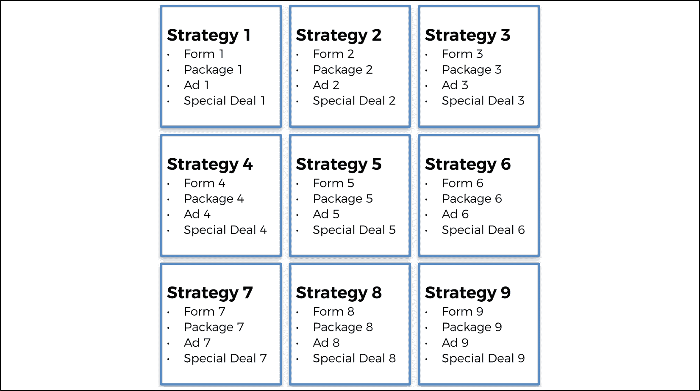

图 1：九种策略——哪一种卖得最好？

市场团队希望尽快找出哪种策略的转化率最高，并且以最小的投入实现这一目标。他们知道，找到并实施最佳策略可以显著提高业务收入。市场专家们也选择不直接向他们的 1 亿客户发送电子邮件，因为那样做既昂贵又可能会导致过多客户被垃圾邮件骚扰。相反，他们将通过在线学习微妙地寻找最佳策略。那么，什么是在线学习呢？它指的是每当客户浏览电子商务网站时，部署不同的策略。

当客户浏览网站时，他们会突然看到一个弹出广告，建议他们订阅高级计划。对于每个浏览网站的客户，只有九种策略中的一种会被展示。然后，用户会选择是否采取行动并订阅高级计划。如果客户订阅了，则策略成功；否则，策略失败。我们进行的客户测试越多，收集的反馈就越多，我们对最佳策略的认识也就越清晰。

当然，我们不会手动、通过视觉或简单的数学来解决这个问题。相反，我们希望实现最智能的算法，它能在最短的时间内找出最佳策略。这有两个原因：首先，因为每次部署策略都会产生成本（例如，来自弹出广告的成本）；其次，因为公司希望尽量减少广告对客户的骚扰。

## 在模拟中构建环境

本节内容非常特殊，因为有一些关键点需要理解，这些并不是一开始就显而易见的。之所以有这个警告，是因为我在教授这门课程时的经验；我的许多学生曾经很难理解，为什么我们在这个问题中必须做一个模拟。

当我开始时也是这样的！如果你已经理解了为什么我们必须做模拟，那太好了——这意味着你已经把在线学习内化了。如果没有，请跟着我来，让我仔细为你解释。

为了理解，我们从现实生活中会发生什么开始：你只需将九种策略中的“号召性广告”弹窗展示给正在浏览网站的客户，每次只展示给一个客户。你需要一位一位客户地展示，因为每个客户你都需要收集他们的反馈：客户是否选择订阅高级计划。如果客户选择，奖励为 1；如果不选择，奖励为 0。过程如下：

**第 1 轮**：我们将*策略 1*的*广告 1*展示给客户*客户 1*，并检查客户是否选择订阅。如果选择，则获得 1 的奖励；如果不选择，则获得 0 的奖励。收集到奖励后，我们继续进行下一个客户（下一轮）。

**第 2 轮**：我们将*策略 2*的*广告 2*展示给新客户*客户 2*，并检查客户是否选择订阅。如果选择，则获得 1 的奖励；如果不选择，则获得 0 的奖励。收集到奖励后，我们继续进行下一个客户（下一轮）。

…

**第 9 轮**：我们将*策略 9*的*广告 9*展示给新客户*客户 9*，并检查客户是否选择订阅。如果选择，则获得 1 的奖励；如果不选择，则获得 0 的奖励。收集到奖励后，我们继续进行下一个客户（下一轮）。

**第 10 轮**：我们终于开始激活汤普森采样！我们使用汤普森采样 AI 来告诉我们哪个广告具有最强的魔力，能够将最多客户转化为订阅高级计划。我们想要那笔额外收入！AI（由汤普森采样提供支持）选择 9 个广告中的一个展示给新客户*客户 10*，然后检查客户是否选择订阅。如果选择，则获得 1 的奖励；如果不选择，则获得 0 的奖励。收集到奖励后，我们继续进行下一个客户（下一轮）。

**第 11 轮**：AI（由汤普森采样提供支持）选择 9 个广告中的一个展示给新客户，假设是*客户 11*，然后检查客户是否选择订阅。如果选择，则获得 1 的奖励；如果不选择，则获得 0 的奖励。收集到奖励后，我们继续进行下一个客户（下一轮）。

好的，我停下来了！你明白了。这个过程会一直持续下去，持续几百轮，或者至少直到 AI 找出最好的广告——那个转化率最高的广告。

这就是现实生活中的情况。在每一轮中，我们不需要其他任何东西；如果你查看汤普森采样算法，你会发现每一轮它只需要知道每个广告在前几轮中获得 1 奖励的次数，以及获得 0 奖励的次数。总之，这是一个非常重要的结论：汤普森采样完全不需要知道广告的转化率就能找出最好的广告。

然而，为了模拟这个应用，我们需要为每个广告分配一个转化率。原因很简单：如果我们不这么做，就无法验证汤普森抽样是否确实找到了最佳广告。这只是为了验证 AI 是否正常工作！

我们将为这九种策略分配不同的转化率。这个模拟的目的只是为了检查 AI 是否能够找到转化率最高的广告。让我将这一点重新表述为两个关键点：

1.  汤普森抽样在任何时候都不需要知道转化率，以便找出最高的那个。

1.  我们之所以提前知道这些转化率，是因为我们正在进行模拟，目的是检查汤普森抽样是否能够找出转化率最高的广告。

现在我们已经解决了这个问题，接下来让我们设定这些转化率。我们假设这九种策略的转化率如下：

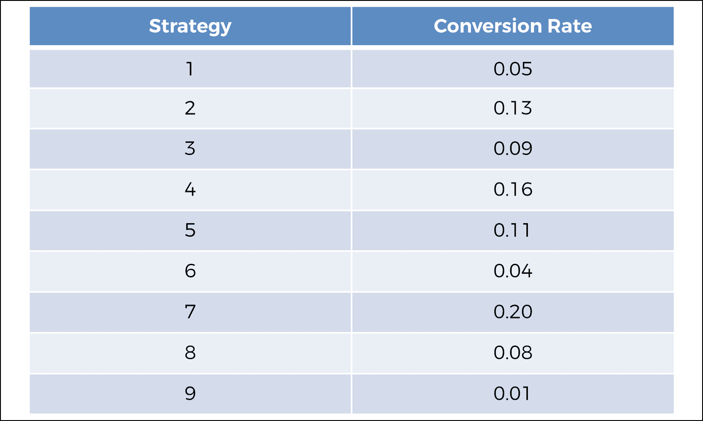

图 2：九种策略的转化率

现在，我们在幕后提前知道哪种策略的转化率最高：**策略 7**。然而，汤普森抽样并不知道这一点。如果你注意到，你会看到汤普森抽样在执行其算法时，从未使用过转化率。它只知道前几轮中成功（订阅）和失败（未订阅）的次数。你可以在代码中最清楚地看到这一点。

最后，请务必记住，在现实情况下，我们是无法知道这些转化率的具体数值的。我们在这里只知道它们是为了模拟的目的，这样我们最终才能检查出我们的 AI 是否找到了最佳策略——在我们的模拟中，这就是*策略 7*。

接下来的问题是：我们到底如何运行这个模拟呢？

### 运行模拟

首先，让我们回顾一下环境的不同组成部分（状态、动作和奖励）：

1.  状态就是特定的客户，我们将在其身上部署策略并向其展示该策略的广告。

1.  动作是选择部署给客户的策略。

1.  如果客户订阅了高级计划，则奖励为 1，反之为 0。

那么，假设这个电子商务公司想要通过 10,000 个客户来进行实验，找出最佳策略。为什么选择 10,000？因为从统计学角度来看，这已经是一个足够大的样本量，能够代表整个客户群。那么，我们如何基于之前设定的广告转化率来模拟这 10,000 个客户的反应呢？我们没有其他选择，只能拿出像 Excel 或 Google Sheets 这样的电子表格来模拟这 10,000 个客户对每一条广告的反应。我们将按照以下方式进行，这其实是一个很巧妙的技巧。

我们将创建一个包含 10,000 行和 9 列的矩阵。每一行对应一个特定的客户，每一列对应一个特定的策略。为了更清楚地说明，假设：

第一行对应于*客户 1*。

第二行对应于*客户 2*。

…

第 10000 行对应于*客户 10000*。

第一列对应于*策略 1*。

第二列对应于*策略 2*。

…

第九列对应于*策略 9*。

在这个矩阵的单元格中，我们会根据这 10,000 个客户对 9 个策略的反应来放置奖励 1 或 0。反应是正面（订阅）还是负面（不订阅）。这就是“相当不错的技巧”的用武之地。为了模拟这 10,000 个客户对 9 个广告的反应，同时考虑到这些广告的转化率，我们做了以下处理：

对于每个客户（行）和每个策略（列），我们从 0 到 1 之间随机抽取一个数字。如果这个随机数小于策略的转化率，则奖励为 1；如果随机数大于策略的转化率，则奖励为 0。为什么这么做有效？因为这样，我们就能保证每个策略对于每个客户都能保持`p`%的概率获得奖励 1，其中`p`是应用于该客户的策略的转化率。

例如，我们来看一下*策略* `4`，它的转化率是 0.16。对于每个客户，我们从 0 到 1 之间随机抽取一个数字。这个随机数有 16%的概率位于 0 到 0.16 之间，剩下的 84%概率位于 0.16 到 1 之间。因此，当我们的随机数位于 0 到 0.16 之间时，我们得到 1，而当它位于 0.16 到 1 之间时，我们得到 0。这意味着我们有 16%的概率得到 1，84%的概率得到 0。

这完全模拟了当*策略 4*应用于某个客户时，该客户有 16%的概率订阅高级计划；这正好对应于获得奖励 1。

希望你喜欢这个技巧。它相当经典，但在 AI 中经常使用，了解它对你来说很重要。我们将这个技巧应用于每一对（客户，策略），即这 10,000 x 9 个组合，得到如下矩阵（此图只展示了前 10 行）：

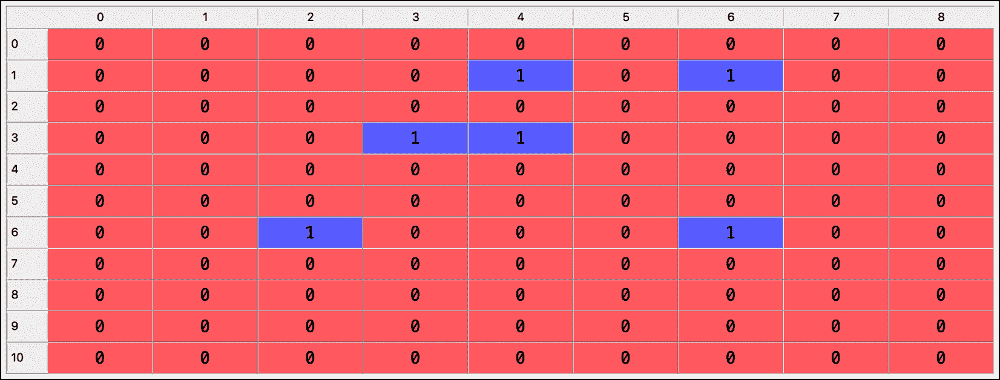

图 3：奖励的模拟矩阵

让我们详细分析前三行：

1.  第一位客户（索引为*`0`*的行）在接触到任何策略时都不会订阅高级计划。

1.  第二位客户（索引为*`1`*的行）只有在接触到*策略 5*或*策略* `7`时才会订阅高级计划。

1.  第三位客户（索引为*`2`*的行）在任何策略下都不会订阅高级计划。

我们已经可以在这个预览中看到我们的小技巧奏效了；具有最低转化率的广告（策略 1、6 和 9）在前 11 位顾客中只有 0 的奖励，而具有最高转化率的广告（策略 4 和 7）已经有一些 1 的奖励。请注意，这里 Python 表中的索引从 0 开始；在 Python 中总是这样的，不幸的是我们无法改变这一点。不过，别担心，你会习惯的！

如果你是代码爱好者，生成这个模拟的代码将在本章稍后展示。

我们的下一步是退后一步并回顾一下。

### 回顾

我们准备好模拟汤普森抽样在连续 10,000 名顾客身上的行动，这些顾客逐一被接触到的九种策略之一，感谢之前的矩阵，它将精确模拟顾客决定是否订阅高级计划的决策。

如果对应于特定顾客和特定选择的策略的单元格为 1，那么这就模拟了顾客订阅高级计划。如果单元格为 0，则模拟拒绝。汤普森抽样将收集每个顾客是否订阅高级计划的反馈，逐个顾客进行。然后，借助其强大的算法，它将迅速找出具有最高转化率的策略。

这个策略是部署在数百万客户身上的最佳策略，最大化公司从这个新收入流的收入。

## AI 解决方案和直觉复习

在你享受看到你的 AI 在行动之前，让我们回顾一下，并将整个汤普森抽样 AI 模型适应这个新问题。

顺便说一句，如果你不喜欢这个电子商务业务应用程序，完全可以想象自己回到赌场，周围有九台老虎机，其转化率与我们的策略所给出的转化率相同。这正是相同的情景；这九种策略可能很可能就像九台老虎机，给出相同的转化率，无论是 1（赚钱）还是 0（失去钱）。你的目标是尽快找出哪台老虎机有最大的中奖机会！完全由你决定。不妨选择去拉斯维加斯或 AI 街区，但是在本章中，我将坚持我们的电子商务。

首先，让我们提醒自己，每次向新顾客展示广告都被视为新的一轮，`n`，并选择我们的九种策略之一来尝试转化（订阅高级计划）。目标是在尽可能少的轮数内找出最佳策略（与具有最高转化率的广告相关）。以下是汤普森抽样的工作原理：

### AI 解决方案

对于每一轮 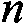 超过 10,000 轮，重复以下三个步骤：

**步骤 1**：对于每个策略 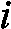，从以下分布中随机抽取一个值：

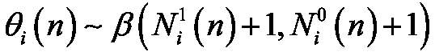

其中：

1.  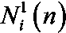 是策略 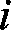 在回合 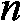 之前获得 1 奖励的次数。

1.  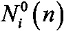 是策略 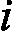 在回合 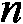 之前获得 0 奖励的次数。

**步骤 2**：选择具有最高 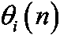 的策略 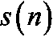：

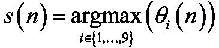

**步骤** *`3`*：根据以下条件更新 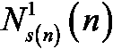 和 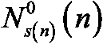：

1.  如果选择的策略 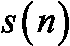 获得了 1 奖励：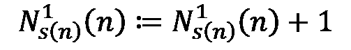

1.  如果选择的策略 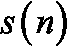 获得了 0 奖励：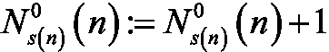

现在我们已经看过了数学步骤，让我们回顾一下这些步骤背后的直觉。

### 直觉

每个策略都有自己独特的 Beta 分布。随着回合的进行，具有最高转化率的策略的 Beta 分布将逐渐向右移动，而具有较低转化率的策略的 Beta 分布将逐渐向左移动（*步骤 1* 和 `3`）。因此，在 *步骤 2* 中，具有最高转化率的策略将被越来越多地选择。以下是展示三种策略的三种 Beta 分布的图表，帮助你可视化这一过程：

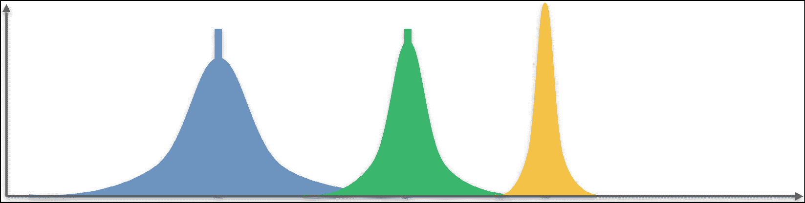

图 4：三种 Beta 分布

你已经退后一步并进行了复习；我认为你现在已经准备好进行实现了！在接下来的章节中，你将把所有理论付诸实践——换句话说，付诸于代码。

## 实现

你将在本章中逐步开发代码，但请记住，我已经提供了此应用程序的汤普森采样完整实现；你可以在本书的 GitHub 页面（[`github.com/PacktPublishing/AI-Crash-Course`](https://github.com/PacktPublishing/AI-Crash-Course)）上找到。如果你想尝试并运行代码，可以在 Colaboratory、Anaconda 中的 Spyder 或者你喜欢的 IDE 上进行。

### 汤普森采样与随机选择

在实现汤普森采样的同时，你还将实现随机选择算法，该算法将在每一回合中随机选择一个策略。这将作为你评估汤普森采样模型性能的基准。当然，汤普森采样和随机选择算法将在同一个模拟环境中竞争，也就是说，在相同的环境矩阵上进行竞争。

#### 性能度量

最后，在整个模拟完成后，你可以通过计算相对回报来评估汤普森采样的性能，定义如下公式：

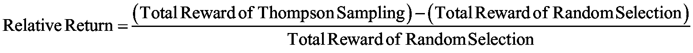

你还将有机会绘制所选广告的直方图，以便检查具有最高转化率的策略（*策略 7*）是否是被选中最多的。

### 让我们开始编写代码

首先，导入以下三个必需的库：

1.  `numpy`，你将用它来构建环境矩阵。

1.  `matplotlib.pyplot`，你将用它来绘制直方图。

1.  `random`，你将用它来生成模拟所需的随机数。

以下是从 GitHub 提取的代码：

```py
# AI for Sales & Advertizing - Sell like the Wolf of AI Street
# Importing the libraries
import numpy as np
import matplotlib.pyplot as plt
import random 
```

然后设置客户数量和策略的参数：

1.  `N` = 10,000 个客户。

1.  `d` = 9 种策略。

**代码**：

```py
# Setting the parameters
N = 10000
d = 9 
```

然后，通过构建一个环境矩阵来创建模拟，该矩阵有 10,000 行代表客户，9 列代表策略。每一回合，对每个策略，你都从 0 到 1 之间随机抽取一个数字。如果这个随机数字低于该策略的转换率，奖励为 1；否则奖励为 0。环境矩阵在代码中命名为`X`。

**代码**：

```py
# Building the environment inside a simulation
conversion_rates = [0.05,0.13,0.09,0.16,0.11,0.04,0.20,0.08,0.01]
X = np.array(np.zeros([N,d]))
for i in range(N):
    for j in range(d):
        if np.random.rand() <= conversion_rates[j]:
            X[i,j] = 1 
```

现在环境已经准备好，你可以开始实现 AI 了。首先一步是引入并初始化实现过程中需要的变量：

1.  `strategies_selected_rs`：一个列表，存储 Random Selection 算法在各回合中选择的策略。初始化为空列表。

1.  `strategies_selected_ts`：一个列表，存储 Thompson Sampling AI 模型在各回合中选择的策略。初始化为空列表。

1.  `total_rewards_rs`：Random Selection 算法在各回合中累计的总奖励。初始化为 0。

1.  `total_rewards_ts`：Thompson Sampling AI 模型在各回合中累计的总奖励。初始化为 0。

1.  `number_of_rewards_1`：一个包含 9 个元素的列表，每个元素记录每个策略收到 1 奖励的次数。初始化为包含 9 个零的列表。

1.  `number_of_rewards_0`：一个包含 9 个元素的列表，每个元素记录每个策略收到 0 奖励的次数。初始化为包含 9 个零的列表。

**代码**：

```py
# Implementing Random Selection and Thompson Sampling
strategies_selected_rs = []
strategies_selected_ts = []
total_reward_rs = 0
total_reward_ts = 0
numbers_of_rewards_1 = [0] * d
numbers_of_rewards_0 = [0] * d 
```

接下来，你需要开始`for`循环，遍历环境矩阵的 10,000 行（即客户）。在每一回合，你将得到两个独立的策略选择：一个来自 Random Selection 算法，另一个来自 Thompson Sampling。

我们从 Random Selection 算法开始，它每回合随机选择一个策略。

**代码**：

```py
for n in range(0, N):
    # Random Selection
    strategy_rs = random.randrange(d)
    strategies_selected_rs.append(strategy_rs)
    reward_rs = X[n, strategy_rs]
    total_reward_rs = total_reward_rs + reward_rs 
```

接下来，你需要按照之前提供的*步骤 1*、*步骤 2*和*步骤 3*实现 Thompson Sampling。我建议在编写下一部分代码之前，再次回顾这些步骤，并尝试自己先编写代码，而不是直接查看我的解决方案。这是你进步的最佳方式；实践出真知。你已经拥有了编写代码所需的所有元素，甚至在*第五章*《你的第一个 AI 模型——小心强盗！》中有类似的代码。祝你好运！以下是解决方案。

你应该一步一步实现 Thompson Sampling，从第一步开始。让我们回顾一下它：

**步骤 1**：对于每个策略 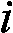，从以下分布中随机抽取一个值：

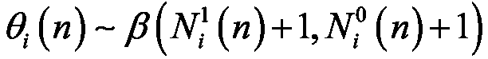

其中：

1.  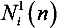 是策略 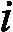 在第  轮次之前获得奖励 1 的次数。

1.  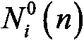 是策略 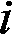 在第 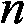 轮次之前获得奖励 0 的次数。

让我们看看 *步骤 1* 是如何实现的。

编写第二个 `for` 循环，遍历这 9 个策略，因为你需要从每个策略的 Beta 分布中进行一次随机抽取。

从 Beta 分布中抽取的随机数是通过从 `random` 库中引入的 `betavariate()` 函数生成的，该函数在一开始时就已被导入。

**代码**：

```py
 # Thompson Sampling
    strategy_ts = 0
    max_random = 0
    for i in range(0, d):
        random_beta = random.betavariate(numbers_of_rewards_1[i] + 1, numbers_of_rewards_0[i] + 1) 
```

现在实现 *步骤 2*，即：

**步骤 2**：选择具有最高 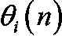 的策略 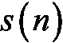：

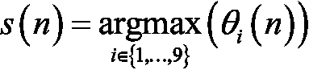

要实现 *步骤 2*，你需要待在第二个 `for` 循环中，它遍历 9 个策略，并使用一个简单的技巧，借助 `if` 条件来找出最高的 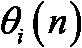。

诀窍如下：在迭代策略时，如果你发现一个随机抽取（`random_beta`）大于迄今为止获得的最大随机抽取值（`max_random`），那么该最大值就更新为这个更高的随机抽取值。

**代码**：

```py
 # Thompson Sampling
    strategy_ts = 0
    max_random = 0
    for i in range(0, d):
        random_beta = random.betavariate(numbers_of_rewards_1[i] + 1, numbers_of_rewards_0[i] + 1)
        if random_beta > max_random:
            max_random = random_beta
            strategy_ts = i
    reward_ts = X[n, strategy_ts] 
```

最后，让我们实现 *步骤 3*，这是最简单的一步：

**步骤 3**：根据以下条件更新 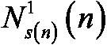 和 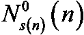：

1.  如果选择的策略 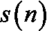 收到奖励 1：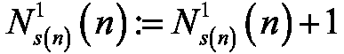

1.  如果选择的策略 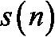 收到奖励 0：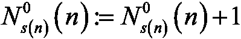

简单地使用完全相同的两个 `if` 条件，将它们转化为代码实现。

**代码**：

```py
 # Thompson Sampling
    strategy_ts = 0
    max_random = 0
    for i in range(0, d):
        random_beta = random.betavariate(numbers_of_rewards_1[i] + 1, numbers_of_rewards_0[i] + 1)
        if random_beta > max_random:
            max_random = random_beta
            strategy_ts = i
    reward_ts = X[n, strategy_ts]
    if reward_ts == 1:
        numbers_of_rewards_1[strategy_ts] = numbers_of_rewards_1[strategy_ts] + 1
    else:
        numbers_of_rewards_0[strategy_ts] = numbers_of_rewards_0[strategy_ts] + 1 
```

接下来，别忘了将步骤 2 中选择的策略添加到我们的策略列表（`strategies_selected_ts`）中，并计算汤普森采样在各轮中累计的总奖励（`total_reward_ts`）。

**代码**：

```py
 # Thompson Sampling
    strategy_ts = 0
    max_random = 0
    for i in range(0, d):
        random_beta = random.betavariate(numbers_of_rewards_1[i] + 1, numbers_of_rewards_0[i] + 1)
        if random_beta > max_random:
            max_random = random_beta
            strategy_ts = i
    reward_ts = X[n, strategy_ts]
    if reward_ts == 1:
        numbers_of_rewards_1[strategy_ts] = numbers_of_rewards_1[strategy_ts] + 1
    else:
        numbers_of_rewards_0[strategy_ts] = numbers_of_rewards_0[strategy_ts] + 1
    strategies_selected_ts.append(strategy_ts)
    total_reward_ts = total_reward_ts + reward_ts 
```

然后计算最终得分，这是相对于我们基准的汤普森采样的相对回报，基准是随机选择：

**代码**：

```py
# Computing the Relative Return
relative_return = (total_reward_ts - total_reward_rs) / total_reward_rs * 100
print("Relative Return: {:.0f} %".format(relative_return)) 
```

### 最终结果

执行此代码后，我得到了 91% 的最终相对回报。换句话说，汤普森采样几乎将我的随机选择基准的性能提高了两倍。还不错吧！

最后，绘制所选策略的直方图，以检查 *策略 7*（索引 6）是否是被选中的最多的策略，因为它具有最高的转换率。为此，使用 `matplotlib` 库中的 `hist()` 函数。

**代码**：

```py
# Plotting the Histogram of Selections
plt.hist(strategies_selected_ts)
plt.title('Histogram of Selections')
plt.xlabel('Strategy')
plt.ylabel('Number of times the strategy was selected')
plt.show() 
```

这是最激动人心的时刻——代码完成了（顺便说一句，恭喜你），你可以享受结果了。拥有最终的相对回报很好，但用干净的可视化图表展示结果会更好。执行最终代码后，你就能得到这一点：

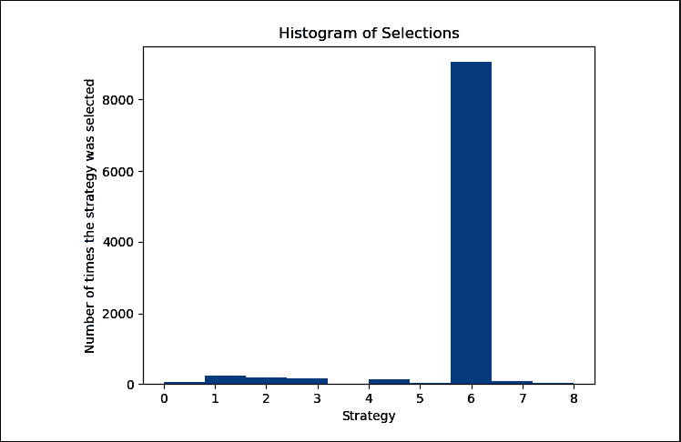

图 5：选择的直方图

你可以看到，索引 *`6`* 的策略，*策略 7*，是被选中的最多的。汤普森采样法很快就能将其识别为最佳策略。事实上，如果你重新运行相同的代码，但只使用 1,000 个客户，你会发现汤普森采样法仍然能够识别 *策略 7* 为最佳策略。

汤普森采样法为这个电子商务企业做得非常出色。它不仅能够在少量轮次内识别出最佳策略——这意味着较少的客户，从而节省广告和运营成本——而且它还能够清晰地找出转换率最高的策略。

如果这个电子商务企业有 5000 万个客户，并且高级计划的价格是每年 200 美元，那么部署这项最佳策略，且转换率为 20%，将产生额外的收入：50,000,000 × 0.2 × 200 美元 = 20 亿美元！

换句话说，汤普森采样法清晰而迅速地让这个电子商务企业在销售和广告方面大获成功，甚至可以说它真的是 AI 街头的“狼”。

现在，休息一下吧，你值得拥有。放松一下，一旦你充电完毕，准备好迎接新的 AI 探险，我也会在这里，准备好开始下一章。很快再见！

## 总结

在这个第一个实践教程中，你实现了汤普森采样法来解决多臂老虎机问题，应用于广告活动中。汤普森采样法能够迅速找到最佳的商业策略，这是随机选择法无法做到的。总的来说，你实现了 91% 的相对回报，这在做出一些假设后，将额外带来 20 亿美元的收入。你仅用一个文件、不到 60 行代码就实现了这一切。相当惊人，对吧？
