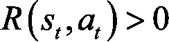

# 第七章：欢迎来到 Q 学习

各位女士们，先生们，事情即将变得比以往更有趣。我们即将处理的下一个模型是今天许多人工智能的核心；机器人、自动驾驶车辆，甚至视频游戏的 AI 玩家都在使用 Q 学习作为核心模型。它们中的一些甚至将 Q 学习与深度学习结合，创造出了一个更高级的 Q 学习版本，叫做深度 Q 学习，我们将在*第九章*《成为人工智能专家——深度 Q 学习》中讲解。

所有的 AI 基础仍然适用于 Q 学习，具体如下：

1.  Q 学习是一个强化学习模型。

1.  Q 学习基于输入（状态）和输出（动作）的原理。

1.  Q 学习在一个预定义的环境中工作，包括状态（输入）、动作（输出）和奖励。

1.  Q 学习是通过马尔可夫决策过程建模的。

1.  Q 学习使用一种训练模式，在这个模式中，学习到的参数称为 Q 值，还有一种推理模式。

现在我们可以再添加两个基本原理，这次是特定于 Q 学习的：

1.  状态是有限的（没有无限多的可能输入）。

1.  动作是有限的（只能执行有限的动作）。

就这样！没有更多需要记住的基础了；现在我们可以真正深入探讨 Q 学习，你会发现它其实并不难，而且非常直观。

为了解释 Q 学习，我们将使用一个例子，这样你就不会迷失在纯粹的理论中，也能直观地理解发生了什么。顺便说一句：欢迎来到迷宫。

## 迷宫

你将学习 Q 学习在迷宫中的工作原理。我们现在就来画出我们的迷宫；它在这里：

图 1：迷宫

我知道，这个迷宫是你见过的最简单的迷宫。这对于简化问题很重要，这样你可以主要专注于人工智能如何发挥它的魔力。想象一下，如果你因为迷宫而迷失在这一章，而不是因为 AI 公式的话，那可就糟糕了！关键是你有一个清晰的迷宫，你可以想象人工智能是如何从起点走到终点的。

说到开始和结束，想象一下一个小机器人在这个迷宫中，从*`E`*（入口）点开始。它的目标是找到通向*`G`*（目标）点的最快路径。我们人类能在瞬间搞定，但那只是因为我们的迷宫太简单了。你将要构建的是一个能够从起点走到终点的人工智能，不管迷宫有多复杂。我们开始吧！

### 开始

这是一个问题：你认为第一步应该是什么？

我将给你三个可能的答案：

1.  我们开始写一些数学方程。

1.  我们构建环境。

1.  我们尝试通过汤普森采样（上一章的 AI 模型）使其工作。

正确答案是……

2\. 我们构建环境。

这很简单，但我想通过提问来强调这一点，以确保你记住构建 AI 时这一点必须始终是第一步。在明确理解问题后，构建 AI 解决方案的第一步始终是设置环境。

这引出了一个进一步的问题：

构建该环境时，具体需要采取哪些步骤？

尝试记住答案——你已经学过了——然后继续阅读以进行回顾。

1.  首先，你将定义状态（你 AI 的输入）。

1.  其次，你将定义可以执行的动作（你 AI 的输出）。

1.  第三，你将定义奖励。记住，奖励是 AI 在某个状态下执行动作后获得的结果。

现在我们已经掌握了基础，你可以开始处理定义环境的第一步。

### 构建环境

为了构建环境，我们需要定义状态、动作和奖励。

#### 状态

让我们从状态开始。你认为这个问题的状态是什么？记住，状态是你 AI 的输入。它们应该包含足够的信息，让 AI 能够采取一种行动，从而带领它实现最终目标（到达 E 点）。

在这个模型中，我们没有太多选择。在特定时间或特定迭代时，状态将仅仅是 AI 当时的位置。换句话说，它将是 *`A`* 到 *`L`* 之间的字母，表示 AI 在特定时刻所在的位置。

正如你可能猜到的，构建环境之后的下一步是编写 AI 核心的数学方程式，为了帮助你做到这一点，将状态编码为独特的整数要比将其保持为字母更加容易。这正是我们将要做的，使用以下映射：

图 2：位置与状态映射

请注意，我们遵守 Q 学习的第一个基本原则，即：**状态的数量是有限的**。

让我们继续讨论动作。

#### 动作

动作将简单地是 AI 从一个位置移动到下一个位置的下一步。例如，假设 AI 当前在 *`J`* 位置，AI 可以执行的可能动作是前往 *`I`*、*`F`* 或 *`K`*。同样，由于你将使用数学方程式，你可以将这些动作用与状态相同的索引进行编码。

根据之前的示例，假设 AI 在特定时间位于 *`J`* 位置，AI 可以执行的可能动作是 *`5`*、*`8`* 和 **10**，根据我们之前的映射：索引 *`5`* 对应 *`F`*，索引 *`8`* 对应 *`I`*，索引 **10** 对应 *`K`*。

因此，可能的动作只是可以到达的不同位置的索引：

可能的动作 = {0,1,2,3,4,5,6,7,8,9,10,11}

请注意，我们再次遵循 Q 学习的第二个基本原则，即：**动作的数量是有限的**。

显然，在一个特定的位置时，有些动作是 AI 无法执行的。以之前的例子为例，如果 AI 处于位置*`J`*，它能执行动作*`5`*、*`8`*和**10**，但无法执行其他动作。你可以通过为无法执行的动作指定 0 奖励，为能够执行的动作指定 1 奖励来确保这一点。这就涉及到了奖励。

#### 奖励

你离构建环境已经不远了——最后，你需要定义一个奖励系统。更具体地说，你需要定义一个奖励函数 `R`，它接受状态 `s` 和动作 `a` 作为输入，并返回一个数值奖励 `r`，即 AI 在状态 `s` 下执行动作 `a` 时将获得的奖励：

R: (s, a)  

那么，如何为我们的案例研究构建这样的函数呢？这里很简单。由于有离散且有限的状态数量（从 0 到 11 的索引），以及离散且有限的动作数量（同样是从 0 到 11 的索引），构建奖励函数 `R` 的最佳方法就是直接构建一个矩阵。

你的奖励函数将是一个恰好有 12 行 12 列的矩阵，其中行对应状态，列对应动作。这样，在你的函数 R 中： (s, a)  ，`s` 将是矩阵的行索引，`a` 将是矩阵的列索引，而 `r` 将是矩阵中索引为(`s`, `a`)的单元格的值。

要构建这个奖励矩阵，首先你需要为 12 个位置中的每一个指定一个奖励。对于机器人不能执行的动作，给予 0 奖励；对于机器人能执行的动作，给予 1 奖励。通过对每个位置执行这一步，你将得到一个奖励矩阵。我们从第一个位置：位置*`A`*开始，一步一步地构建它。

当机器人处于位置*`A`*时，它只能前往位置*`B`*。因此，由于位置*`A`*的索引为 0（矩阵的第一行），而位置*`B`*的索引为 1（矩阵的第二列），所以奖励矩阵的第一行将在第二列标记 1，其他列则为 0，如下所示：

图 3：奖励矩阵 - 第一步

让我们继续讨论位置*`B`*。当机器人处于位置*`B`*时，它只能前往三个不同的位置：*`A`*、*`C`*和*`F`*。由于*`B`*的索引为 1（第二行），而*`A`*、*`C`*和*`F`*分别有索引 0、2 和 5（第一列、第三列和第六列），因此奖励矩阵的第二行将在第一列、第三列和第六列上标记 1，其他列则为 0：

图 4：奖励矩阵 - 第二步

*`C`*（索引为 2）仅与*`B`*和*`G`*（索引为 1 和 6）相连，因此奖励矩阵的第三行是：

图 5：奖励矩阵 – 步骤 3

对所有其他地点做相同的操作，最终你将得到最终的奖励矩阵：

图 6：奖励矩阵 - 步骤 4

这就是如何初始化奖励矩阵的方式。

但是等一下——你其实还没有完成。还有一件最后的事情需要做。这一步至关重要，需要理解。事实上，让我问你一个问题，最终问题，这将检查你的直觉是否已经开始形成：

**你如何让 AI 知道它必须去那个优先级最高的地点 G？**

这很简单——你只需通过奖励来玩弄它。你必须记住，在强化学习中，一切都从奖励开始。如果你为地点*`G`*分配一个高奖励，例如 1000，那么 AI 将自动试图去获取这个高奖励，仅仅因为它比其他地点的奖励要大。

简而言之，这是强化学习中需要理解和记住的一个基本点，**AI 始终在寻找最高的奖励**。这就是为什么到达地点*`G`*的诀窍就是给予它比其他地点更高的奖励。

目前，手动在对应地点*`G`*的单元格中放入一个高奖励（1000），因为它是我们希望 AI 前往的目标地点。由于地点*`G`*的索引是 6，我们就在第 6 行第 6 列的单元格中放置 1000 的奖励。相应地，我们的奖励矩阵变为：

图 7：奖励矩阵 - 步骤 5

你已经定义了奖励！你通过构建这个奖励矩阵实现了这一点。重要的是要理解，这通常是我们在进行 Q 学习时定义奖励系统的方式。

在*第九章*，*与人工大脑一同成长——深度 Q 学习*中，你将看到我们将以非常不同的方式进行，并且构建环境的过程会更加简单。事实上，深度 Q 学习是 Q 学习的高级版本，它在今天的 AI 中被广泛使用，远远超过了简单的 Q 学习模型。但是，你必须首先深入理解 Q 学习，才能为深度 Q 学习做好准备。

既然你已经定义了状态、动作和奖励，你就完成了环境的构建。这意味着你已经准备好处理下一步，构建将在你刚刚定义的这个环境中发挥作用的 AI。

### 构建 AI

现在，您已经构建了一个明确定义了目标并有相关奖励系统的环境，是时候构建 AI 了。我希望您已经准备好迎接一点数学挑战。

我将把第二步分解成几个子步骤，引导你完成最终的 Q 学习模型。为此，我们将按以下顺序讲解 Q 学习核心的三个重要概念：

1.  Q 值

1.  时间差

1.  贝尔曼方程

让我们开始了解 Q 值。

#### Q 值

在你开始深入 Q 学习的细节之前，我需要解释 Q 值的概念。它是这样运作的：

对于每一对状态和动作（`s`，`a`），我们将关联一个数值`Q`（`s`，`a`）：

我们将说`Q`（`s`，`a`）是“在状态`s`下执行动作`a`的 Q 值。”

现在我知道你脑海中可能会问这样的问题：这个 Q 值是什么意思？它代表什么？我到底该怎么计算它？这些都是我第一次学习 Q 学习时心里想的问题。

为了回答这些问题，我需要引入时间差。

#### 时间差（Temporal difference）

这就是数学真正发挥作用的地方。假设我们处于一个特定的状态！，在特定的时间`t`。我们随机执行一个动作，任何一个动作都可以。这样我们就进入了下一个状态！，并获得了奖励！。

时间差在时间`t`时刻，记作！，是以下两者的差：

1.  ，即执行动作！在状态！下获得的奖励！，加上在未来状态！下执行的最佳动作的 Q 值，按一个因子！折扣，这个因子被称为折扣因子。

1.  和！，即在状态！下执行动作！的 Q 值。

这导致了：

你可能会觉得太棒了，理解了所有术语，但你可能也在想：“那到底是什么意思？”别担心——这正是我在学习这个过程时的想法。

我将一边解释，一边提升你的 AI 直觉。首先要理解的是，时间差（temporal difference）表示 AI 学习的好坏。它是如何运作的，关于训练过程（在这个过程中 Q 值被学习）如下：

1.  在训练的开始，Q 值被设置为零。由于 AI 的目标是获取好的奖励（这里是 1 或 1000），它在寻找高的时间差（参见 TD 公式）。因此，在前几次迭代中，如果！很高，AI 会得到一个“愉快的惊讶”，因为这意味着 AI 能够找到一个好的奖励。另一方面，如果！很小，AI 就会感到“沮丧”。

1.  当 AI 获得了很大的奖励时，导致这个巨大奖励的（状态，动作）的特定 Q 值会增加，这样 AI 就可以记住如何达到那个高奖励（你将在下一节中看到确切的增加方式）。例如，假设是在状态  中执行的动作  导致了那个高奖励 。这意味着 Q 值  会自动增加（请记住，你将在下一节中看到具体如何增加）。这些增加的 Q 值是重要信息，因为它们向 AI 指示了哪些过渡通向了好的奖励。

1.  AI 的下一步不仅是寻找很大的奖励，同时也要同时寻找高 Q 值。为什么？因为高 Q 值才是导致大奖励的那些。事实上，高 Q 值会导致更高的 Q 值，它们自己又会导致更高的 Q 值，最终导致最高奖励（1000）。这就是时差公式中  的作用。当你将这一切付诸实践时，一切都会变得清晰明了。AI 寻找高 Q 值，一旦找到，又会增加（状态，动作）的 Q 值，因为它们指示了通向目标的正确路径。

1.  在某些时候，AI 将知道所有导致好的奖励和高 Q 值的过渡。由于这些过渡的 Q 值随时间已经增加，最终时差会减小。事实上，我们越接近最终目标，时差就变得越小。

总之，时差就像一个临时的内在奖励，AI 会在训练开始时试图找到这些大值。最终，随着训练接近尾声——即接近最终目标时，AI 将最小化这个奖励。

这正是你必须记住的时差的直觉，因为它确实会帮助你理解 Q 学习的魔力。说到那种魔力，我们即将揭示这个难题的最后一部分。

现在你明白了，AI 将迭代一些 Q 值向高时差的更新，这些时差最终会减小。但它是如何做到的呢？这个问题有一个具体的答案——贝尔曼方程，强化学习中最著名的方程。

#### 贝尔曼方程

为了执行更好、更有效的动作，引导 AI 达到目标，当你发现时间差较大时，必须增加动作的 Q 值。剩下的唯一问题是：AI 如何更新这些 Q 值？强化学习的先驱理查德·贝尔曼为此提供了答案。在每次迭代中，你通过以下方程更新从 t-1（上一次迭代）到 t（当前迭代）的 Q 值，这就是著名的 Bellman 方程：

其中  是学习率，决定了 Q 值学习的速度。它的值通常介于 0 和 1 之间，比如 0.75。 的值越低，Q 值的更新就越小，Q-learning 所需的时间就越长。它的值越高，Q 值的更新就越大，Q-learning 的速度就越快。正如你在这个方程中清楚地看到的那样，当时间差  较大时，Q 值  会增加。

#### 强化学习直觉

现在你已经掌握了所有 Q-learning 的元素——顺便说一句，祝贺你——让我们将这些元素连接起来，强化你对 AI 的直觉。

Q 值衡量的是与一对动作和状态相关的“好惊讶”或“挫败感”的积累 。

在时间差较大的“好惊讶”情况下，AI 会得到强化；而在时间差较小的“挫败感”情况下，AI 会变得较弱。

我们希望学习出能给 AI 带来最大“好惊讶”的 Q 值，而这正是 Bellman 方程通过在每次迭代中更新 Q 值所做的事情。

你已经学到了不少新信息，尽管你已经完成了一个将所有知识点连接起来的直觉部分，但这还不足以真正掌握 Q-learning。下一步是后退一步，最好的方法是从头到尾过一遍完整的 Q-learning 过程，这样它在你脑中就会变得清晰透彻。

## 完整的 Q-learning 过程

让我们总结一下整个 Q-learning 过程的不同步骤。为了明确，整个过程的唯一目的是在一定数量的迭代中更新 Q 值，直到 Q 值不再更新（我们称这一点为收敛）。

迭代次数取决于问题的复杂性。对于我们的问题，1,000 次迭代就足够了，但对于更复杂的问题，你可能需要考虑更高的迭代次数，比如 10,000 次。简而言之，Q-learning 过程就是我们训练 AI 的部分，之所以叫 Q-learning，是因为这是一个学习 Q 值的过程。接下来，我会解释推理部分（纯预测）发生了什么，这部分总是在训练后进行。完整的 Q-learning 过程从训练模式开始。

### 训练模式

**初始化（第一次迭代）**：

对于所有状态 `s` 和动作 `a` 的组合，Q 值被初始化为 0。

**下一次迭代**：

在每次迭代 `t` ≥ 1 时，你会重复以下步骤若干次（由你作为开发者选择）：

1.  你从可用的状态中选择一个随机状态 。

1.  从该状态出发，你执行一个随机动作 ，该动作可以导致下一个可能的状态，即使得 。

1.  你到达下一个状态 ，并获得奖励 。

1.  你计算时间差异 :

1.  你通过应用贝尔曼方程更新 Q 值：

在这个过程结束时，你将获得不再更新的 Q 值。这意味着只有一个结果：你准备好通过进入推理模式来破解迷宫了。

### 推理模式

训练完成，现在开始推理。提醒一下，推理部分是当你有了一个完全训练好的模型，准备用来进行预测时。在我们的迷宫中，你将要做出的预测是执行哪些动作，以便将你从起点（位置 *`E`*）带到终点（位置 *`G`*）。所以，问题是：

你如何使用学习到的 Q 值来执行动作？

好消息；对于 Q-learning 这是非常简单的。当处于某一状态  时，你只需执行在该状态下具有最高 Q 值的动作 ：

就是这样——通过在每个位置（每个状态）执行此操作，你将通过最短路径到达最终目的地。我们将在实际活动或下一章中实现这个过程并查看结果。

## 总结

本章我们研究了 Q-learning 模型，该模型仅应用于具有有限数量输入状态和有限数量可执行动作的环境。

在执行 Q-learning 时，AI 通过迭代过程学习 Q 值，从而使得 (状态，动作) 对的 Q 值越高，AI 越接近最高奖励。

在每次迭代中，Q 值通过贝尔曼方程进行更新，该方程仅仅是将时间差异与学习率因子折扣相加。我们将在下一章中进行完整的实际 Q-learning 活动，将其应用于一个真实的商业问题。
