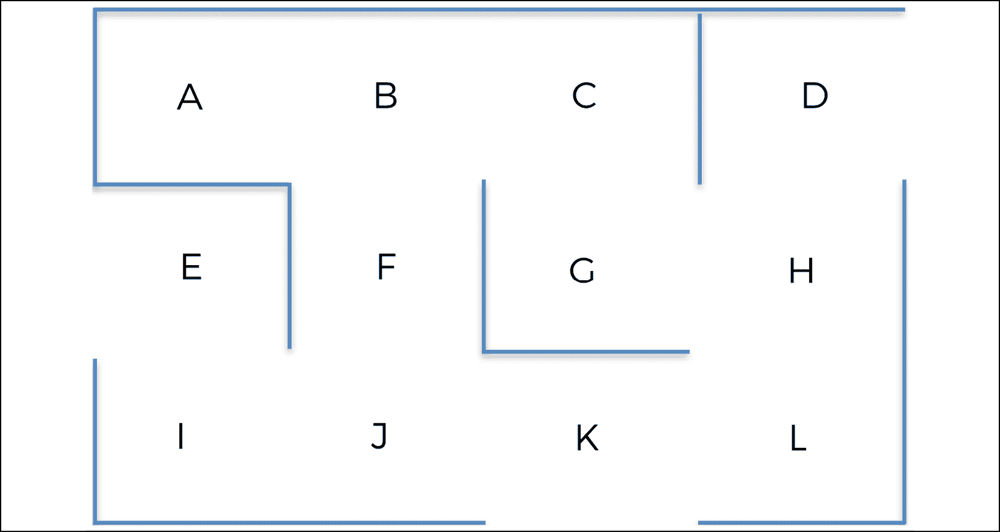
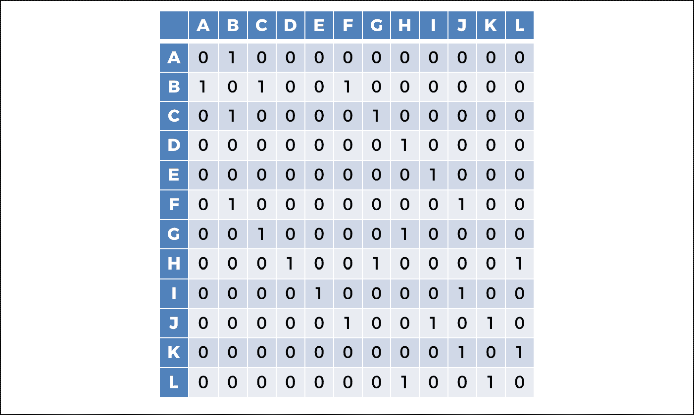
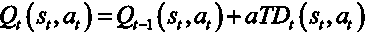
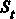

# 第八章：物流中的人工智能——仓库中的机器人

现在是我们人工智能之旅的下一步了。书的开头我曾告诉你，人工智能在运输和物流方面具有巨大的价值，特别是自动驾驶配送车辆，它们能加速物流流程。这些技术通过电子商务产业为经济带来了巨大的推动。

在这一章中，我们将为这种应用构建一个人工智能。我们将使用的模型当然是 Q 学习（我们将深度 Q 学习留给自动驾驶汽车）。Q 学习是一个简单但强大的人工智能模型，可以优化仓库中的移动流，这是你将在这里解决的现实问题。为了便于这一旅程，你将使用一个你已经熟悉的环境：我们在上一章看到的迷宫。

不同之处在于，这次迷宫实际上是某个企业的仓库。它可以是任何一种企业：电子商务企业、零售企业，或者任何一个销售产品给顾客并拥有仓库来存储大量产品的企业。

再看看这个迷宫，现在它变成了一个仓库：


图 1：仓库

在这个仓库里，产品存放在 12 个不同的位置，用 **A** 到 **L** 的字母标记：



图 2：仓库中的位置

当客户下订单时，机器人会在仓库内移动，收集待配送的产品。那就是你的人工智能！它长这样：


图 3：仓库机器人

这 12 个位置都连接到计算机系统，该系统实时对这些 12 个位置的产品收集优先级进行排序。举个例子，假设在某个特定时间 *t*，它返回如下排序：


图 4：最高优先级的位置

位置 **G** 排在第一位，这意味着它是最高优先级的，因为它包含一个必须立即收集并配送的产品。我们的机器人必须根据当前位置通过最短的路线到达位置 **G**。我们的目标实际上是构建一个人工智能，它能返回这条最短路线，无论机器人在哪里。

但是我们可以做得更好。这里，位置 **K** 和 **L** 排在前三位。因此，为我们的机器人实现一个选项，允许它通过一些中介位置再到达最终的最高优先级位置，将是非常有意义的。

系统如何计算位置的优先级超出了本案例研究的范围。原因是，计算这些优先级的方式有很多种，从简单的规则或算法，到确定性计算，再到机器学习。但其中大多数方式都不是我们今天所说的 AI。我们在这次练习中真正想要关注的是核心 AI，包括强化学习和 Q 学习。为了本例的目的，我们可以简单地说，位置**G**是最高优先级的，因为公司的一个最忠实的铂金级客户下了一个紧急订单，产品存放在位置**G**，因此必须尽快交付。

总结来说，我们的使命是构建一个 AI，它始终会选择从任意起点出发，走最短的路线到达优先级最高的位置，并且可以选择经过一个位于前三个优先级中的中介位置。

## 构建环境

在构建 AI 时，我们首先需要做的是定义环境。定义环境总是需要以下三个元素：

+   定义状态

+   定义动作

+   定义奖励

这三个元素在前一章关于 Q 学习的内容中已经定义过了，但我们来快速回顾一下它们是什么。

### 状态

在特定时刻*t*，状态是机器人在该时刻*t*所在的位置。不过，请记住，你需要对位置名称进行编码，这样我们的 AI 才能进行计算。

为了避免让你失望，尽管有关于 AI 的疯狂炒作，我们还是要保持现实，理解 Q 学习不过是一堆数学公式；就像其他任何 AI 模型一样。我们让编码的整数从 0 开始，仅仅是因为 Python 中的索引从 0 开始：


图 5：位置到状态的映射

### 动作

动作是机器人可以前往的下一个可能目的地。你可以用与状态相同的索引对这些目的地进行编码。因此，AI 可以执行的动作总列表如下：

```py
actions = [0,1,2,3,4,5,6,7,8,9,10,11] 
```

### 奖励

请记住，在特定位置时，机器人无法执行某些动作。例如，如果机器人处于位置**J**，它可以执行动作 5、8 和 10，但无法执行其他动作。你可以通过为无法执行的动作赋予奖励 0，为可以执行的动作赋予奖励 1 来指定这一点。

这将引导你构建以下奖励矩阵：



图 6：奖励矩阵

### AI 解决方案回顾

在实施模型之前，回顾一下模型总是有益的！让我们回顾一下 Q 学习过程的步骤；这一次，我们将其调整到你的新问题上。让我们欢迎 Q 学习重新登场：

#### 初始化（第一次迭代）

对于所有状态*s*和动作*a*的组合，Q 值初始化为 0：


#### 下一步迭代

在每次迭代中，*t* ≥ 1，AI 将重复以下步骤：

1.  它从可能的状态中选择一个随机状态！[](img/B14110_08_002.png)：

1.  它执行一个随机动作 ，这个动作可能导致下一个可能的状态，即： ：

1.  它到达下一个状态 ，并获得奖励 。

1.  它计算时间差异！[](img/B14110_08_009.png)：

1.  它通过应用贝尔曼方程来更新 Q 值：

我们将在 1,000 次迭代中重复这些步骤。为什么是 1,000？选择 1,000 是因为我在这个特定环境中的实验结果。我选择了一个足够大的数字，使得 Q 值能够在训练过程中收敛。100 次迭代不够大，但 1,000 次足够了。通常，你可以选择一个非常大的数字，例如 5,000，这样你就会看到收敛（即 Q 值不再更新）。不过，这取决于问题的复杂性。如果你正在处理一个更复杂的环境，例如仓库中有数百个位置，你可能需要更多的训练迭代次数。

这就是整个过程。现在，你将从零开始在 Python 中实现它！

你准备好了吗？我们开始吧。

## 实现

好的，让我们来挑战这个。不过首先，试着自己先搞定它，别等我来。虽然这是我们一起走的旅程，但如果你能提前走几步，我也不介意。你在 AI 上变得独立的速度越快，你就越能发挥它的奇迹。试着按照之前提到的 Q-learning 过程来实现，完全按照原样来。即使你没有实现所有内容也没关系，重要的是你要尝试。

这已经是足够的指导了；不管你多么成功，还是让我们一起看看解决方案吧。

首先，开始导入你将在这个实现中使用的库。这次只需要一个库：`numpy` 库，它提供了一种方便的方式来处理数组和数学运算。给它起个快捷名称 `np`。

```py
# AI for Logistics - Robots in a warehouse
# Importing the libraries
import numpy as np 
```

然后，设置模型的参数。这些包括折扣因子 *γ* 和学习率！[](img/B14110_08_0311.png)，它们是 Q-learning 模型的唯一参数。分别赋值为 `0.75` 和 `0.9`，这两个值是我随便选的，但通常是一个不错的选择。如果你不知道该使用什么，这些值是一个不错的起点。不过，你也可以使用类似的值，结果会相同。

```py
# Setting the parameters gamma and alpha for the Q-Learning
gamma = 0.75
alpha = 0.9 
```

前两个代码部分只是引导部分，在你真正开始构建 AI 模型之前。下一步是开始我们实现的第一部分。

现在试着记住你需要做的事情，这是构建 AI 的第一个通用步骤。

你需要构建环境！

我只是想再次强调一下，这真的很重要。环境将是你代码的第一部分：

### 第一部分 – 构建环境

让我们来看看这个实现的整体结构，这样你可以稍微退后一步。你的代码将分为三部分：

+   **第一部分** – 构建环境

+   **第二部分** – 使用 Q 学习构建 AI 解决方案（训练）

+   **第三部分** – 进入生产（推理）

让我们从第一部分开始。首先，定义状态、动作和奖励。首先定义状态，使用一个 Python 字典将位置名称（从 A 到 L 的字母）映射到状态（从 0 到 11 的索引）。将这个字典命名为`location_to_state`：

```py
# PART 1 - BUILDING THE ENVIRONMENT
# Defining the states
location_to_state = {'A': 0,
                     'B': 1,
                     'C': 2,
                     'D': 3,
                     'E': 4,
                     'F': 5,
                     'G': 6,
                     'H': 7,
                     'I': 8,
                     'J': 9,
                     'K': 10,
                     'L': 11} 
```

然后，用一个简单的从 0 到 11 的索引列表定义动作。记住，每个动作索引对应于该动作引导到的下一个位置：

```py
# Defining the actions
actions = [0,1,2,3,4,5,6,7,8,9,10,11] 
```

最后，定义奖励，通过创建一个奖励矩阵，其中行对应当前状态 ，列对应导致下一个状态的动作 ，单元格包含奖励 。如果一个单元格包含 1，意味着 AI 可以从当前状态  执行动作 ，到达下一个状态 。如果一个单元格  包含 0，意味着 AI 无法从当前状态  执行动作  到达任何下一个状态 。

现在，你可能记得这个非常重要的问题，它的答案是强化学习的核心。

你将如何让 AI 知道它必须去那个优先级最高的位置 **G**？

一切都与奖励相关。

我必须再次强调，记住这一点。如果你给 **G** 位置分配一个高奖励，那么 AI 通过 Q 学习过程将学会以最有效的方式获取这个高奖励，因为它比到达其他位置的奖励要大。

记住这个非常重要的规则：当 AI 使用 Q 学习（或者你很快会学到的深度 Q 学习）时，它总是会学习通过最快的路径达到最高奖励，同时避免因负奖励而惩罚 AI。这就是为什么达到 **G** 位置的诀窍仅仅是给它赋予比其他位置更高的奖励。

首先手动放入一个高奖励，任何大于 1 的数字都可以，只要它大于 1，放在对应 **G** 位置的单元格中；**G** 位置是机器人必须去的优先级最高的位置，以便收集产品。

由于 **G** 位置的编码索引状态为 6，因而在第 6 行第 6 列的单元格中放入一个 `1000` 的奖励。稍后，我们将通过实现一种自动去往优先级最高位置的方法来改进你的解决方案，无需手动更新奖励矩阵，并且保持初始化为 0 和 1，这正是它应有的样子。目前，这是你的奖励矩阵，包括手动更新部分。

```py
# Defining the rewards
R = np.array([[0,1,0,0,0,0,0,0,0,0,0,0],
              [1,0,1,0,0,1,0,0,0,0,0,0],
              [0,1,0,0,0,0,1,0,0,0,0,0],
              [0,0,0,0,0,0,0,1,0,0,0,0],
              [0,0,0,0,0,0,0,0,1,0,0,0],
              [0,1,0,0,0,0,0,0,0,1,0,0],
              [0,0,1,0,0,0,1000,1,0,0,0,0],
              [0,0,0,1,0,0,1,0,0,0,0,1],
              [0,0,0,0,1,0,0,0,0,1,0,0],
              [0,0,0,0,0,1,0,0,1,0,1,0],
              [0,0,0,0,0,0,0,0,0,1,0,1],
              [0,0,0,0,0,0,0,1,0,0,1,0]]) 
```

这完成了第一部分。现在，让我们开始第二部分的实现。

### 第二部分 – 使用 Q 学习构建 AI 解决方案

为了构建你的 AI 解决方案，按照之前提供的 Q 学习算法逐步进行。如果你在自己实现 Q 学习时遇到了困难，现在是复仇的时刻了。接下来的一切都完全是之前的 Q 学习过程翻译成代码。

现在你已经在脑海中理解了，试着再次独立编写代码吧。你能做到的！

恭喜你尝试了，不管结果如何。接下来，让我们检查一下你是否做对了。

首先，通过创建一个全是 0 的 Q 值矩阵来初始化所有的 Q 值，其中行对应当前状态 ，列对应到达下一个状态的动作 ，单元格包含 Q 值 。

```py
# PART 2 - BUILDING THE AI SOLUTION WITH Q-LEARNING

# Initializing the Q-values
Q = np.array(np.zeros([12,12])) 
```

然后，用一个循环执行 Q 学习过程，进行 1,000 次迭代，重复 Q 学习过程中的每一个步骤 1,000 次。

```py
# Implementing the Q-Learning process
for i in range(1000):
    current_state = np.random.randint(0,12)
    playable_actions = []
    for j in range(12):
        if R[current_state, j] > 0:
            playable_actions.append(j)
    next_state = np.random.choice(playable_actions)
    TD = R[current_state, next_state] + gamma * Q[next_state, np.argmax(Q[next_state,])] - Q[current_state, next_state]
    Q[current_state, next_state] = Q[current_state, next_state] + alpha * TD 
```

现在你已经到达了旅程中的第一个真正令人兴奋的步骤。你实际上已经准备好启动 Q 学习过程并获得最终的 Q 值。执行你到目前为止实现的全部代码，并通过以下简单的打印语句来可视化 Q 值：

```py
print("Q-values:")
print(Q.astype(int)) 
```

这是我得到的结果：

```py
Q-values:
[[   0 1661    0    0    0    0    0    0    0    0    0    0]
 [1246    0 2213    0    0 1246    0    0    0    0    0    0]
 [   0 1661    0    0    0    0 2970    0    0    0    0    0]
 [   0    0    0    0    0    0    0 2225    0    0    0    0]
 [   0    0    0    0    0    0    0    0  703    0    0    0]
 [   0 1661    0    0    0    0    0    0    0  931    0    0]
 [   0    0 2213    0    0    0 3968 2225    0    0    0    0]
 [   0    0    0 1661    0    0 2968    0    0    0    0 1670]
 [   0    0    0    0  528    0    0    0    0  936    0    0]
 [   0    0    0    0    0 1246    0    0  703    0 1246    0]
 [   0    0    0    0    0    0    0    0    0  936    0 1661]
 [   0    0    0    0    0    0    0 2225    0    0 1246    0]] 
```

如果你在 Anaconda 的 Spyder 中工作，那么为了更清晰地看到，你甚至可以直接在变量浏览器中查看 Q 值矩阵，只需双击 Q。然后，要将 Q 值显示为整数，可以点击**格式**并输入浮动格式`%.0f`。这样你就会得到如下结果，这样更清晰，因为你可以看到 Q 矩阵中行和列的索引：


图 7：Q 值矩阵

现在你已经有了 Q 值矩阵，你可以进入生产阶段了——可以继续进行实现的第三部分。

### 第三部分 – 进入生产阶段

换句话说，你现在进入了推理模式！在这一部分，你将计算从任何起始位置到任何终极目标位置的最佳路径。这里的思路是实现一个`route`函数，它接受起始位置和终止位置作为输入，并返回一个包含最短路径的 Python 列表。起始位置对应我们自主仓库机器人在某一时刻的位置，终止位置对应机器人必须去的优先位置。

由于你需要输入的是位置的名称（用字母表示），而不是位置的状态（用索引表示），你需要一个字典，将位置的状态（用索引表示）映射到位置的名称（用字母表示）。这是第三部分的第一个任务，使用一个技巧来反转你之前的字典`location_to_state`，因为你只需要从这个字典中获取精确的反向映射：

```py
# PART 3 - GOING INTO PRODUCTION

# Making a mapping from the states to the locations
state_to_location = {state: location for location, state in location_to_state.items()} 
```

现在，请集中注意力——如果这些点在你的脑海中还没有完全连接，现在是它们连接的时候了。我将向你展示机器人是如何计算出最短路径的准确步骤。

你的机器人将从位置 **E** 移动到位置 **G**。以下是它是如何做到的解释——我将列出过程的不同步骤。请在我讲解时关注 Q 值矩阵：

1.  AI 从起始位置 **E** 开始。

1.  AI 获得位置 **E** 的状态，根据你的 `location_to_state` 映射，这是 。

1.  在我们的 Q 值矩阵的索引行  中，AI 选择具有最大 Q 值（`703`）的列。

1.  该列的索引为 8，因此 AI 执行索引 8 的操作，这将引导它进入下一个状态 。

1.  AI 获取状态 8 的位置，根据我们的 `state_to_location` 映射，这是位置 **I**。由于下一个位置是位置 **I**，**I** 被添加到 AI 的包含最佳路径的列表中。

1.  然后，从新位置 **I** 开始，AI 重复之前的五个步骤，直到到达最终目的地位置 **G**。

就是这样！这正是你需要实现的内容。你需要将其通用化到任何起始和结束位置，最好的方法是通过一个接受两个输入的函数来实现：

1.  `starting_location`: AI 启动的起始位置

1.  `ending_location`: 它必须到达的最高优先级位置

并返回最佳路径。因为我们在谈论路径，你可以调用该函数 `route()`。

在 `route()` 函数中，理解的一个重要点是，由于你不知道 AI 在起始位置和结束位置之间需要经过多少个位置，你必须创建一个 `while` 循环，重复之前描述的 5 步骤，并在到达最高优先级的结束位置时停止。

```py
# Making the final function that will return the optimal route
def route(starting_location, ending_location):
    route = [starting_location]
    next_location = starting_location
    while (next_location != ending_location):
        starting_state = location_to_state[starting_location]
        next_state = np.argmax(Q[starting_state,])
        next_location = state_to_location[next_state]
        route.append(next_location)
        starting_location = next_location
    return route 
```

恭喜！你的 AI 现在准备好了。它不仅实现了训练过程，还有推理模式下运行的代码。到目前为止，唯一不太完美的是你仍然需要手动更新奖励矩阵；但别担心，我们稍后会解决这个问题。在我们解决这个问题之前，先检查一下你是否已经在这里获得了阶段性的胜利，然后我们可以继续进行改进。

```py
# Printing the final route
print('Route:')
route('E', 'G') 
```

以下是输出：

```py
Route:
Out[1]: ['E', 'I', 'J', 'F', 'B', 'C', 'G']
Out[2]: ['E', 'I', 'J', 'K', 'L', 'H', 'G'] 
```

完美——在测试时，我运行了两次代码从 E 到 G，这就是为什么你会看到前两个输出的原因。返回了两条可能的最佳路径：一条经过 F，另一条经过 K。

这是一个良好的开端。你有了第一版运作良好的 AI 模型。现在，让我们改进你的 AI，将它提升到更高的水平。

你可以通过两种方式改进人工智能。首先，通过自动化奖励分配到最高优先级的位置，这样你就不必手动进行操作。其次，添加一个功能，让人工智能在前往最高优先级位置之前可以选择经过一个中间位置——该中间位置应当位于前三个优先级位置之内。

在我们的最高优先级位置排名中，第二高优先级的位置是位置 K。因此，为了优化仓库流动，你的自动仓库机器人必须经过位置 K，收集产品，然后再前往最高优先级位置 G。实现这一目标的一种方法是，在`route()`函数的过程中选择经过一个中间位置。这正是你将作为第二个改进来实现的内容。

首先，让我们实现第一个改进，即自动化奖励分配。

### 改进 1——自动化奖励分配

这样做的方法分为三个步骤。

**第 1 步**：返回到最初的奖励矩阵，像之前那样只包含 1 和 0。代码的第一部分变成如下，并将被包含在最终代码中：

```py
# PART 1 - BUILDING THE ENVIRONMENT

# Defining the states
location_to_state = {'A': 0,
                     'B': 1,
                     'C': 2,
                     'D': 3,
                     'E': 4,
                     'F': 5,
                     'G': 6,
                     'H': 7,
                     'I': 8,
                     'J': 9,
                     'K': 10,
                     'L': 11}

# Defining the actions
actions = [0,1,2,3,4,5,6,7,8,9,10,11]

# Defining the rewards
R = np.array([[0,1,0,0,0,0,0,0,0,0,0,0],
              [1,0,1,0,0,1,0,0,0,0,0,0],
              [0,1,0,0,0,0,1,0,0,0,0,0],
              [0,0,0,0,0,0,0,1,0,0,0,0],
              [0,0,0,0,0,0,0,0,1,0,0,0],
              [0,1,0,0,0,0,0,0,0,1,0,0],
              [0,0,1,0,0,0,1,1,0,0,0,0],
              [0,0,0,1,0,0,1,0,0,0,0,1],
              [0,0,0,0,1,0,0,0,0,1,0,0],
              [0,0,0,0,0,1,0,0,1,0,1,0],
              [0,0,0,0,0,0,0,0,0,1,0,1],
              [0,0,0,0,0,0,0,1,0,0,1,0]]) 
```

**第 2 步**：在代码的第二部分，复制一份你的奖励矩阵（称之为`R_new`），在其中`route()`函数可以自动更新结束位置单元格的奖励。

为什么需要复制？因为你必须保持原始奖励矩阵初始化为 1 和 0，以便将来在你需要前往新的优先级位置时进行修改。那么，`route()`函数如何自动更新结束位置单元格的奖励呢？这个很简单：由于结束位置是`route()`函数的输入之一，因此通过使用你的`location_to_state`字典，你可以非常容易地找到该单元格并将其奖励更新为`1000`。下面是如何实现的：

```py
# Making a function that returns the shortest route from a starting to ending location
def route(starting_location, ending_location):
    R_new = np.copy(R)
    ending_state = location_to_state[ending_location]
    R_new[ending_state, ending_state] = 1000 
```

**第 3 步**：你必须将整个 Q 学习算法（包括初始化步骤）包含在`route()`函数中，在我们更新奖励矩阵复制（`R_new`）中的奖励后执行。在你之前的实现中，Q 学习过程是在原始奖励矩阵上进行的。现在，原始版本需要保持原样，即仅初始化为 1 和 0。因此，你必须将 Q 学习过程包含在`route()`函数中，并使其在奖励矩阵的复制`R_new`上执行，而不是原始奖励矩阵`R`。下面是如何实现的：

```py
# Making a function that returns the shortest route from a starting to ending location
def route(starting_location, ending_location):
    R_new = np.copy(R)
    ending_state = location_to_state[ending_location]
    R_new[ending_state, ending_state] = 1000
    Q = np.array(np.zeros([12,12]))
    for i in range(1000):
        current_state = np.random.randint(0,12)
        playable_actions = []
        for j in range(12):
            if R_new[current_state, j] > 0:
                playable_actions.append(j)
        next_state = np.random.choice(playable_actions)
        TD = R_new[current_state, next_state] + gamma * Q[next_state, np.argmax(Q[next_state,])] - Q[current_state, next_state]
        Q[current_state, next_state] = Q[current_state, next_state] + alpha * TD
    route = [starting_location]
    next_location = starting_location
    while (next_location != ending_location):
        starting_state = location_to_state[starting_location]
        next_state = np.argmax(Q[starting_state,])
        next_location = state_to_location[next_state]
        route.append(next_location)
        starting_location = next_location
    return route 
```

完美；第二部分已经准备好！以下是第二部分的最终完整代码：

```py
# PART 2 - BUILDING THE AI SOLUTION WITH Q-LEARNING

# Making a mapping from the states to the locations
state_to_location = {state: location for location, state in location_to_state.items()}

# Making a function that returns the shortest route from a starting to ending location
def route(starting_location, ending_location):
    R_new = np.copy(R)
    ending_state = location_to_state[ending_location]
    R_new[ending_state, ending_state] = 1000
    Q = np.array(np.zeros([12,12]))
    for i in range(1000):
        current_state = np.random.randint(0,12)
        playable_actions = []
        for j in range(12):
            if R_new[current_state, j] > 0:
                playable_actions.append(j)
        next_state = np.random.choice(playable_actions)
        TD = R_new[current_state, next_state] + gamma * Q[next_state, np.argmax(Q[next_state,])] - Q[current_state, next_state]
        Q[current_state, next_state] = Q[current_state, next_state] + alpha * TD
    route = [starting_location]
    next_location = starting_location
    while (next_location != ending_location):
        starting_state = location_to_state[starting_location]
        next_state = np.argmax(Q[starting_state,])
        next_location = state_to_location[next_state]
        route.append(next_location)
        starting_location = next_location
    return route 
```

如果你多次执行这个新代码，起点和终点分别为**E**和**G**，你将得到与之前相同的两个可能的最优路径。你还可以尝试`route()`函数，尝试不同的起点和终点。试试看吧！

### 改进 2——添加中间目标

现在，让我们来解决第二个改进问题。添加一个通过中间位置**K**的选项问题有三种可能的解决方案。当你看到它们时，你会明白我之前说过的“强化学习的一切都是通过奖励来工作的”是什么意思。

只有一个解决方案适用于每一个起始点，但我想给你三个解决方案，以帮助你加深直觉。为了帮助你理解，这里是我们的仓库布局的提醒：


图 8：仓库中的位置

**解决方案 1**：给从位置**J**到位置**K**的动作一个高奖励。这个高奖励必须大于 1，且小于 1,000。它必须大于 1，这样 Q 学习过程才会偏向于从**J**到**K**的动作，而不是从**J**到**F**的动作，因为后者的奖励为 1。它还必须小于 1,000，这样最高的奖励才能保持在最高优先级的位置，确保 AI 最终到达那里。例如，在你的奖励矩阵中，你可以给第 9 行第 10 列的单元格一个高奖励`500`，因为该单元格对应的是从位置**J**（状态索引 9）到位置**K**（状态索引 10）的动作。这样，你的 AI 机器人在从位置**E**到位置**G**时，就会始终经过位置**K**。在这种情况下，奖励矩阵的样子应该是：

```py
# Defining the rewards
R = np.array([[0,1,0,0,0,0,0,0,0,0,0,0],
              [1,0,1,0,0,1,0,0,0,0,0,0],
              [0,1,0,0,0,0,1,0,0,0,0,0],
              [0,0,0,0,0,0,0,1,0,0,0,0],
              [0,0,0,0,0,0,0,0,1,0,0,0],
              [0,1,0,0,0,0,0,0,0,1,0,0],
              [0,0,1,0,0,0,1,1,0,0,0,0],
              [0,0,0,1,0,0,1,0,0,0,0,1],
              [0,0,0,0,1,0,0,0,0,1,0,0],
              [0,0,0,0,0,1,0,0,1,0,500,0],
              [0,0,0,0,0,0,0,0,0,1,0,1],
              [0,0,0,0,0,0,0,1,0,0,1,0]]) 
```

这个解决方案并不适用于所有情况，实际上它只适用于起始点**E**、**I**和**J**。这是因为`500`的权重只能影响 AI 是否应该从**J**到**K**的决策；它不会改变 AI 在最初选择是否去**J**的可能性。

**解决方案 2**：给从位置**J**到位置**F**的动作一个差奖励。这个差奖励必须小于 0。通过惩罚这个动作，Q 学习过程就不会偏向于从**J**到**F**的动作。例如，在你的奖励矩阵中，你可以给第 9 行第 5 列的单元格一个差奖励`-500`，因为该单元格对应的是从位置**J**（状态索引 9）到位置**F**（状态索引 5）的动作。这样，你的自动化仓库机器人在前往位置**G**时，就永远不会从位置**J**到位置**F**。在这种情况下，奖励矩阵的样子应该是：

```py
# Defining the rewards
R = np.array([[0,1,0,0,0,0,0,0,0,0,0,0],
              [1,0,1,0,0,1,0,0,0,0,0,0],
              [0,1,0,0,0,0,1,0,0,0,0,0],
              [0,0,0,0,0,0,0,1,0,0,0,0],
              [0,0,0,0,0,0,0,0,1,0,0,0],
              [0,1,0,0,0,0,0,0,0,1,0,0],
              [0,0,1,0,0,0,1,1,0,0,0,0],
              [0,0,0,1,0,0,1,0,0,0,0,1],
              [0,0,0,0,1,0,0,0,0,1,0,0],
              [0,0,0,0,0,-500,0,0,1,0,1,0],
              [0,0,0,0,0,0,0,0,0,1,0,1],
              [0,0,0,0,0,0,0,1,0,0,1,0]]) 
```

这个解决方案并不适用于所有情况，实际上它只适用于起始点**E**、**I**和**J**。和解决方案 1 一样，这是因为`-500`的权重只能影响 AI 是否应该从**J**到**F**的决策；它不会改变 AI 最初选择是否去**J**的可能性。

**方案 3**：新增一个 `best_route()` 函数，接受三个输入：起始地点、中介地点和结束地点，该函数将调用你之前的 `route()` 函数两次；第一次从起始地点到中介地点，第二次从中介地点到结束地点。

前两个方案可以手动轻松实现，但自动实现起来则比较棘手。你可以轻松地自动获得中介地点的索引，但很难得到导致 AI 到达该中介地点的路径，因为它依赖于起点和终点。如果你尝试实现第一个或第二个方案，你就会明白我的意思。此外，方案 1 和方案 2 并不能作为全局解决方案。

只有方案 3 能保证 AI 在前往最终地点之前会经过一个中介地点。

因此，我们将实现方案 3，该方案只需额外增加两行代码，我已在 *第三部分 – 进入生产阶段* 中包含了该代码：

```py
# PART 3 - GOING INTO PRODUCTION

# Making the final function that returns the optimal route
def best_route(starting_location, intermediary_location, ending_location):
    return route(starting_location, intermediary_location) + route(intermediary_location, ending_location)[1:]

# Printing the final route
print('Route:')
best_route('E', 'K', 'G') 
```

很简单，对吧？有时候，最佳的解决方案往往是最简单的。这里的情况就是如此。如你所见，第三部分包括了运行最终测试的代码。如果 AI 能在从地点 **E** 到地点 **G** 的最短路径上经过 **K** 地点，那么这个测试就会成功。你可以多次执行这段全新的代码，你总会得到相同的预期输出：

```py
Route:
['E', 'I', 'J', 'K', 'L', 'H', 'G'] 
```

恭喜你！你已经开发出了一个完全功能的 AI，采用 Q 学习算法，能够解决物流优化问题。通过这个 AI 机器人，我们现在可以从任何地点出发，前往任何新的最高优先级地点，同时优化路径以便在第二优先级的中介位置收集产品。做得不错！如果你对物流有些厌倦，可以随时想象自己回到迷宫中，并使用 `best_route()` 函数，随意设置起点和终点，看看你创建的 AI 有多么灵活。玩得开心！当然，你也可以在 GitHub 页面上获取完整的代码。

## 总结

在本章中，你实现了一个 Q 学习解决方案，用于解决业务问题。你需要找到通往仓库某个位置的最佳路线。不仅如此，你还实现了额外的代码，允许你的 AI 按照需要进行多个中介停靠点。基于获得的奖励，AI 能够找到经过这些停靠点的最佳路线。这就是用于仓库机器人的 Q 学习方法。接下来，让我们进入深度 Q 学习！
