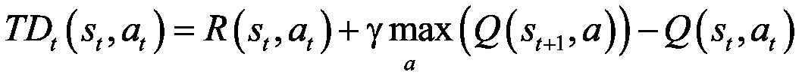
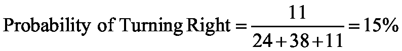
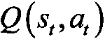
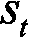

# 第九章：使用人工智能大脑——深度 Q 学习

下一个 AI 模型非常棒，因为它是第一个真正受到人类智能启发的 AI 模型。我希望你已经准备好在 AI 之旅的下一步中大展拳脚；这本书不仅是 AI 的速成课程，也是深度学习的入门介绍。

今天，一些顶尖的 AI 模型已经融合了深度学习。它们形成了一个新的 AI 分支，叫做深度强化学习。本章将介绍的模型属于这个分支，称为深度 Q 学习。你已经知道 Q 学习的原理，但可能对深度学习和**人工神经网络**（**ANNs**）一无所知；我们将从这些内容开始。当然，如果你是深度学习的专家，你可以跳过本章的前几节，但要考虑到，回顾一下基本知识也无妨。

在我们开始讲解理论之前，你将从写出实际可运行的 Python 代码开始。你首先会创建一些 AI，接下来我会帮助你理解它。现在，我们将构建一个人工神经网络来预测房价。

## 预测房价

我们想要做的是根据一些变量预测某个房子的价格。为了实现这个目标，你需要遵循以下四个步骤：

1.  获取一些关于房屋销售的历史数据；在这个例子中，你将使用一份包含大约 20,000 套房子的西雅图数据集。

1.  在你的代码中导入这些数据，同时对变量应用一些缩放（我会在过程中解释缩放）。

1.  使用任何库构建人工神经网络——你将使用 Keras，因为它简单且可靠。

1.  训练你的人工神经网络（ANN），并获得结果。

现在你已经了解了未来代码的结构，你可以开始编写代码了。由于你将使用的所有库都可以在 Google Colab 中找到，因此你可以轻松地使用它来完成这项任务。

### 上传数据集

从创建一个新的 Google Colab 笔记本开始。一旦创建了新笔记本，在你开始编码之前，你需要上传数据集。你可以在 GitHub 的`第九章`文件夹中找到这个数据集，名为`kc_house_data.csv`。


图 1：GitHub – 第九章

一旦完成，你可以通过以下方式将其上传到 Colab：

1.  点击这里的小箭头：

    图 2：Google Colab – 上传文件（1/3）

1.  在弹出的窗口中，进入**文件**。你应该会看到类似这样的内容：

    图 3：Google Colab – 上传文件（2/3）

1.  点击**上传**，然后选择你保存`kc_house_data`数据集的文件位置。

1.  完成后，你应该会得到一个包含我们数据集的新文件夹，像这样：

    图 4：Google Colab – 上传文件（3/3）

太棒了！现在你可以开始编码了。

### 导入库

每次开始编码时，你应该先导入必要的库。因此，我们的代码从这些行开始：

```py
# Importing the libraries   #3
import pandas as pd   #4
import numpy as np   #5
import keras   #6
from sklearn.model_selection import train_test_split   #7
from sklearn.preprocessing import MinMaxScaler   #8
from keras.layers import Dense, Dropout   #9
from keras.models import Sequential   #10
from keras.optimizers import Adam   #11 
```

在第 4 和第 5 行，在注释之后，你导入了 `pandas` 和 `numpy` 库。Pandas 将帮助你读取数据集，而 NumPy 在处理数组或列表时非常有用；你将用它来删除数据集中一些不必要的列。

在接下来的两行代码中，你从 Scikit-Learn 库中导入了两个有用的工具。第一个工具帮助你将数据集拆分成训练集和测试集（你应该始终有这两者；AI 模型在训练集上进行训练，然后在测试集上进行测试），第二个工具是一个缩放器，稍后你在缩放值时会用到它。

第 9、10 和 11 行负责导入 `keras` 库，你将在其中构建神经网络。每个工具稍后会在代码中使用。

现在你已经导入了库，可以开始读取数据集。只需使用之前导入的 Pandas 库，通过这一行代码来完成：

```py
# Importing the dataset   #13
dataset = pd.read_csv('kc_house_data.csv')   #14 
```

由于你在导入 Pandas 库时使用了 `pd` 作为缩写，因此可以利用它来简化代码。在调用 Pandas 库时使用 `pd`，然后你可以使用它的函数之一 `read_csv`，顾名思义，它用于读取 csv 文件。接着在括号中输入文件名，你的文件名是 `kc_house_data.csv`，不需要其他参数。

现在我给你一个小练习！看一下数据集，尝试判断哪些变量对我们的价格预测有影响。相信我，并不是所有变量都有用。我强烈建议你先尝试自己做，尽管我们将在下一节讨论这些变量。

### 排除的变量

你能分辨出哪些变量是必要的，哪些不是吗？如果没有关系，我们现在就来解释它们及其相关性。

以下表格解释了我们数据集中每一列的含义：

| **变量** | **描述** |
| --- | --- |
| Id | 每个家庭的唯一 ID |
| Date | 房屋售出的日期 |
| Price | 房屋售出时的价格 |
| Bedrooms | 卧室数量 |
| Bathrooms | 卫生间的数量；0.5 代表有马桶但没有淋浴的房间 |
| Sqft_living | 公寓内部生活空间的平方英尺数 |
| Sqft_lot | 土地空间的平方英尺数 |
| Floors | 楼层数 |
| Waterfront | 如果公寓没有面朝海滨，则为 0；如果有则为 1 |
| View | 视野质量的值，范围为 0-4，取决于房产视野的好坏 |
| 条件 | 定义属性条件的 1-5 的值 |
| Grade | 从 1 到 13 的值，表示建筑的设计和构造 |
| Sqft_above | 地面以上的室内空间的平方英尺数 |
| Sqft_basement | 地下室的平方英尺数 |
| Yr_built | 房屋建造的年份 |
| Yr_renovated | 房屋翻修的年份（如果没有翻修则为 0） |
| Zipcode | 房屋所在区域的邮政编码 |
| Lat | 纬度 |
| Long | 经度 |
| Sqft_living15 | 最近 15 个邻居住宅内部生活空间的平方英尺 |
| Sqft_lot15 | 最近 15 个邻居土地面积的平方英尺 |

结果是，在这 21 个变量中，只有 18 个是有效的。因为像 Id、Date 和 Zipcode 这样的唯一类别型值对你的预测没有任何影响。Price 是你的预测目标，因此你也应该将其从变量中去除。完成这些之后，你将剩下 17 个独立变量。

现在我们已经解释了所有变量，并决定了哪些是相关的，哪些是不相关的，你可以回到你的代码了。你将排除这些不必要的变量，并将数据集拆分为特征和目标（在我们的例子中，目标是价格）。

```py
# Getting separately the features and the targets   #16
X = dataset.iloc[:, 3:].values   #17
X = X[:, np.r_[0:13,14:18]]   #18
y = dataset.iloc[:, 2].values   #19 
```

在第 17 行，你从数据集中选择所有行和从第四列开始的所有列（因为你排除了 Id、Date 和 Price），并将这个新集称为`X`。你使用`.iloc`来切片数据集，然后使用`.values`将其转换为 NumPy 对象。这些将是你的特征。

接下来你需要排除 Zipcode，遗憾的是它正好位于特征集的中间。因此，你必须使用 NumPy 函数（`np.r_`）来分割`X`，排除你选择的列（在这个案例中是第 14 列。13 是这列的索引，因为 Python 的索引是从零开始的；值得一提的是，Python 中的上界是排除的，所以我们写`0:13`），然后再将它们合并成一个新的数组。在下一行，你获取你的预测目标并将其称为`y`。这对应于数据集中的第三列，即 Price。

### 数据准备

现在你已经分离了重要的特征和目标，你可以将`X`和`y`拆分成训练集和测试集。我们用以下这行代码来做到这一点：

```py
# Splitting the dataset into a training set and a test set   #21
X_train, X_test, y_train, y_test = train_test_split(X, y, test_size = 0.2, random_state = 0)   #22 
```

这是进行任何机器学习时非常重要的一步。你总是需要有一个训练集来训练你的模型，以及一个测试集来测试它。你通过之前导入的`train_test_split`函数来执行这个操作。执行后，你将得到`X_train`，它的大小与`y_train`相等，每个都正好是我们之前`X`和`y`集的 80%。`X_test`和`y_test`则由剩下的 20%的`X`和`y`组成。

现在你已经有了训练集和测试集，你认为接下来的步骤是什么？嗯，你需要对数据进行缩放。

#### 数据缩放

现在你可能会想，为什么你要进行这样的操作？你已经有了数据，为什么不直接构建并训练神经网络呢？

这里有个问题；如果我们保持数据不变，你会发现你的人工神经网络（ANN）无法学习。原因在于，不同的变量会根据它们的值对你的预测产生不同程度的影响。

看看这个图示，说明我想表达的意思，这个图基于一个有 3 个卧室和 1350 平方英尺生活空间的房产。


图 5：3 卧室和 1350 平方英尺的居住面积示例

你可以清楚地看到，卧室数量不会像`Sqft_living`那样显著影响预测。即使是我们人类，也看不出在这张图上零卧室和三卧室之间有什么区别。

解决这个问题的众多方法之一是将所有变量缩放到 0 和 1 之间。我们通过计算以下公式来实现这一点：


其中：

+   `x` – 在我们这个例子中是列中的每个值

+   `x[min]` – 列中所有值的最小值

+   `x[max]` – 列中所有值的最大值

+   `x[scaled]` – 执行缩放后的`x`

在进行缩放之后，我们之前的图表现在看起来是这样的：


图 6：缩放后相同的图表

现在我们可以毫无疑问地说，卧室数量将对房价产生类似的影响，和`Sqft_living`一样。我们可以清楚地看到零卧室和三卧室之间的差异。

那么，如何在代码中实现这一点呢？既然你知道公式了，我建议你自己尝试一下。如果失败了也不用担心，我会在下一段向你展示一种非常简单的实现方法。

如果你能够自己完成数据缩放，那么恭喜你！如果没有，继续阅读接下来的部分来查看答案。你可能已经注意到你导入了 Scikit-learn 库中的`MinMaxScaler`类。你可以使用这个类来缩放变量，代码如下：

```py
# Scaling the features   #24
xscaler = MinMaxScaler(feature_range = (0,1))   #25
X_train = xscaler.fit_transform(X_train)   #26
X_test = xscaler.transform(X_test)   #27
#28
# Scaling the target   #29
yscaler = MinMaxScaler(feature_range = (0,1))   #30
y_train = yscaler.fit_transform(y_train.reshape(-1,1))   #31
y_test = yscaler.transform(y_test.reshape(-1,1))   #32 
```

这段代码创建了两个缩放器，一个用来缩放特征，另一个用来缩放目标。将它们分别称为`xscaler`和`yscaler`。`feature_range`参数指定你希望数据缩放到的范围（在你的例子中是从 0 到 1）。

然后你使用`fit_transform`方法，它会对`X_train`和`y_train`进行缩放，并根据这两个数据集调整缩放器（该方法的`fit`部分会设置`x[min]`和`x[max]`）。之后，你使用`transform`方法对`X_test`和`y_test`进行缩放，而不调整`yscaler`和`xscaler`。

在缩放`y`变量时，必须使用`.reshape(-1,1)`将其重塑，以便创建一个假的第二维（这样代码就可以将这个一维数组当作具有一列的二维数组来处理）。我们需要这个假的第二维来避免格式错误。

如果你仍然不明白为什么我们必须使用缩放，请再次阅读这一部分内容。等到我们学习完理论部分后，你会更加明白。

最后，你可以开始构建神经网络了！请记住，所有的理论内容会在后面的章节中讲解，所以如果你遇到理解上的困难，别怕，我会帮助你理清思路。

### 构建神经网络

要构建神经网络，你可以使用一个非常可靠且易于使用的库——Keras。让我们直接开始编写代码：

```py
# Building the Artificial Neural Network   #34
model = Sequential()   #35
model.add(Dense(units = 64, kernel_initializer = 'uniform', activation = 'relu', input_dim = 17))   #36
model.add(Dense(units = 16, kernel_initializer = 'uniform', activation = 'relu'))   #37
model.add(Dense(units = 1, kernel_initializer = 'uniform', activation = 'relu'))   #38
model.compile(optimizer = Adam(lr = 0.001), loss = 'mse', metrics = ['mean_absolute_error'])   #39 
```

在代码块的第 35 行，你通过使用 Keras 库中的`Sequential`类来实例化你的模型。

接下来，你添加一行代码，为你的神经网络添加一个包含 64 个神经元的新层。`kernel_initializer`是一个定义层中初始权重创建方式的参数，`activation`是该层的激活函数，`input_dim`是输入大小；在你的情况下，这些是定义房价的 17 个特征。

接下来，你添加两个新层，一个有 16 个神经元，另一个有 1 个神经元，作为神经网络的输出。

```py
compile method, which describes how you want to train your net. Inside this compile method, optimizer is the tool that performs backpropagation, lr is the learning rate—the speed at which the weights in the ANN are updated. loss is how you want to calculate the error of the output (I have decided to go for the mean squared error mse), and metrics is just a value that will help you visualize performance—you can use mean absolute error.
```

如果你现在不知道我在讲什么，什么是激活函数、损失函数和优化器，你不用担心。你很快就会理解它们，当我们在后面的章节中讲解理论时。

### 训练神经网络

现在你已经建立了模型，终于可以开始训练它了！

```py
# Training the Artificial Neural Network   #41
model.fit(X_train, y_train, batch_size = 32, epochs = 100, validation_data = (X_test, y_test))   #42 
```

这个简单的一行代码负责学习。

作为该`fit`方法的前两个参数，你输入了`X_train`和`y_train`，它们是你的模型将用于训练的集合。然后是一个名为`batch_size`的参数；它定义了在数据集中的多少条记录后，权重会被更新（损失会在`batch_size`输入后进行累加和反向传播）。接下来是`epochs`，这个值定义了你的模型将对整个`X_train`和`y_train`集合学习多少次。最后一个参数是`validation_data`，在这里，你可以看到，你放入了`X_test`和`y_test`。这意味着在每次 epoch 后，你的模型都会在这个数据集上进行测试，但不会从中学习。

### 显示结果

你快完成了；只剩下一个非强制性的步骤了。你计算测试集上的绝对误差，并查看它的真实未缩放预测值（实际价格，而非(0,1)区间内的值）。

```py
# Making predictions on the test set while reversing the scaling   #44
y_test = yscaler.inverse_transform(y_test)   #45
prediction = yscaler.inverse_transform(model.predict(X_test))   #46
#47
# Computing the error rate   #48
error = abs(prediction - y_test)/y_test   #49
print(np.mean(error))   #50 
```

在第 45 行，你将`y_test`重新缩放回去。然后，你对测试集的特征进行预测，并将其也重新缩放回来，因为预测值也已经被缩小。

在最后两行，你使用公式计算绝对误差：


由于预测值和`y_test`都是 NumPy 数组，你可以直接使用`/`符号进行除法运算。在最后一行，你使用 NumPy 函数计算平均误差。

太棒了！现在你已经完成所有工作，终于可以运行这段代码并查看结果了。


图 7：结果

如最后一行所示，结果已经显示出来。我的情况下，平均误差是 13.5%。这个结果非常好！

现在我们可以进入深度学习背后的理论，了解神经网络是如何工作的。

## 深度学习理论

这是我们的攻坚计划，准备转行成为深度学习高手：

1.  神经元

1.  激活函数

1.  神经网络是如何工作的？

1.  神经网络是如何学习的？

1.  正向传播和反向传播

1.  梯度下降，包括批量法、随机法和小批量法

希望你对这一部分感到兴奋——深度学习是一个很棒且强大的学习领域。

### 神经元

神经元是人工神经网络的基本构建模块，它们基于大脑中的神经元细胞。

#### 生物神经元

以下图片是现实生活中的神经元，它们被涂抹到玻片上，稍微上了些颜色，并通过显微镜观察：


图 8：神经元

正如你所看到的，它们有一个中央主体，周围有许多不同的分支。问题是：我们如何将它在机器中重现呢？我们真的希望在机器中重现它，因为深度学习的整个目的就是模仿人脑的工作方式，希望通过这样做创造出一些惊人的东西：一个强大的学习机器基础设施。

为什么我们希望这样做？因为人脑恰好是地球上最强大的学习工具之一。我们希望，如果我们能够重现它，那么我们将拥有与之同样令人惊叹的东西。

我们目前面临的挑战，创建人工神经网络的第一步，是重现一个神经元。那么我们该如何做到这一点呢？首先，让我们仔细看看神经元到底是什么。

1899 年，神经学家圣地亚哥·拉蒙·卡哈尔将神经元染色后放在实际的脑组织上，并用显微镜观察它们。观察时，他画下了他所看到的内容，这和我们之前看到的玻片图非常相似。如今，技术已经取得了很大进步，使我们能够更近距离、更详细地观察神经元。这意味着我们可以将它们的外观以示意图的形式绘制出来：


图 9：神经元的结构

这个神经元在与其邻近的神经元之间交换信号。树突是信号的接收器，轴突是信号的传递器。

神经元的树突与其他神经元的轴突连接。当神经元发射信号时，信号沿着轴突传递，并传递给下一个神经元的树突。这就是它们的连接方式，也是神经元工作的方式。现在我们可以从神经科学转向技术领域了。

#### 人工神经元

以下是神经元在人工神经网络中的表现方式：


图 10：带有单个神经元的人工神经网络

就像人类神经元一样，它接收一些输入信号，并且有一个输出信号。连接输入信号到神经元，以及神经元到输出信号的蓝色箭头，就像人类神经元中的突触。

在这个人工神经元中，输入和输出信号究竟是什么呢？输入信号是缩放后的独立变量，构成了环境的状态。例如，在本书稍后会编写的服务器冷却实际示例中（*第十一章*，*面向商业的 AI – 使用深度 Q 学习最小化成本*），这些输入信号包括服务器的温度、用户数量和数据传输率。输出信号是输出值，在深度 Q 学习模型中，这些值始终是 Q 值。了解了这些之后，我们可以对机器的神经元做一个通用的表示：


图 11：神经元 – 输出值

为了完成对神经元的描述，我们需要添加这个表示中缺失的最后一个元素，这也是最重要的元素：权重。

每个突触（蓝色箭头）都会被分配一个权重。权重越大，通过突触的信号就越强。理解这一点的关键是，这些权重就是机器随时间更新的部分，以改进其预测。让我们将它们添加到之前的图表中，确保你能清楚地看到它们：


图 12：神经元 – 权重

这就是神经元。接下来需要理解的是激活函数；它是神经元在给定一组输入时决定产生何种输出的方式。

### 激活函数

激活函数是*！[](img/B14110_09_050.png)*，它在神经元内部工作，输入是输入值的加权和，返回的输出值如下面的图所示：


图 13：激活函数

如下所示：


你下一个问题可能是：*！[](img/B14110_09_050.png)* 究竟是什么函数？

它们可能有很多种，但在这里我们将描述三种最常用的，包括你在实际活动中会使用的那种：

1.  阈值激活函数

1.  Sigmoid 激活函数

1.  整流激活函数

让我们通过逐一查看它们来进一步推动你的专业知识。

#### 阈值激活函数

阈值激活函数仅由以下公式定义：


并且可以用以下曲线表示：


图 14：阈值激活函数

这意味着通过神经元的信号是不连续的，并且只有在以下情况下才会激活：


现在让我们看看下一个激活函数：Sigmoid 激活函数。Sigmoid 激活函数是人工神经网络中最有效且最广泛使用的激活函数，尤其是在通向输出层的最后一个隐藏层中。

#### Sigmoid 激活函数

Sigmoid 激活函数由以下公式定义：


并且可以用以下曲线表示：


图 15：Sigmoid 激活函数

这意味着通过神经元传递的信号是连续的，并且会一直被激活。而且值越高：


信号越强。

现在让我们来看一下另一个广泛使用的激活函数：修正线性激活函数（rectifier activation function）。你会在大多数深度神经网络中找到它，但主要是在早期的隐藏层，而不像 sigmoid 函数，它主要用于最后一个隐藏层，通向输出层。

#### 修正线性激活函数

修正线性激活函数的定义非常简单，如下所示：


因此，它由以下曲线表示：


图 16：修正线性激活函数

这意味着通过神经元传递的信号是连续的，只有当值满足特定条件时才会被激活：


输入加权和越高，信号越强。

这引出了一个问题：你应该选择哪个激活函数，或者说，如何知道选择哪个激活函数？

好消息是，答案很简单。其实它取决于作为因变量返回的是什么。如果是二元结果，即 0 或 1，那么一个好的选择是阈值激活函数。如果你想要返回的是因变量为 1 的概率，那么 sigmoid 激活函数是一个非常合适的选择，因为它的 sigmoid 曲线非常适合建模概率。

回顾一下，下面是这个图中突出显示的小蓝图：


图 17：激活函数蓝图

记住，修正线性激活函数应该在具有多个隐藏层的深度神经网络中的隐藏层中使用，而 sigmoid 激活函数应该用于最后一个隐藏层，通向输出层。

让我们在下面的图中突出显示这一点，以便你能更好地视觉化并记住它：


图 18：不同层中的激活函数

我们进展得很快！你已经掌握了相当多的深度学习知识。但这还没有结束——让我们继续下一部分，解释神经网络到底是如何工作的。

### 神经网络是如何工作的？

为了说明这一点，我们回到预测房地产价格的问题。我们有一些独立变量，用来预测房屋和公寓的价格。为了简化并能够将所有内容表示在图表中，假设我们唯一的独立变量（我们的预测变量）是以下内容：

1.  面积（平方英尺）

1.  卧室数量

1.  到市中心的距离（英里）

1.  年龄

我们的因变量是我们预测的公寓价格。以下是深度学习中“魔法”是如何运作的。

每个独立的、经过缩放的变量都会被分配一个权重，使得权重越高，独立变量对因变量的影响就越大；也就是说，它将是一个更强的因变量预测器。

一旦新的输入进入神经网络，信号就会从每个输入开始前向传播，最终到达隐藏层的神经元。

在每个隐藏层神经元内部，都会应用激活函数，权重越小，激活函数就越会阻止来自该输入的信号，而权重越大，激活函数则越容易让该信号通过。

最后，所有从隐藏神经元传来的信号（经过激活函数的部分阻断）都会前向传播到输出层，返回最终结果：价格预测。

这是神经网络如何工作的可视化：


图 19：神经网络的工作原理 – 房地产价格预测示例

这只是故事的一半。现在我们知道神经网络如何工作，我们需要了解它是如何学习的。

### 神经网络是如何学习的？

神经网络通过在多次迭代中更新所有输入和隐藏神经元的权重（当有多个隐藏层时），始终朝着同一个目标前进：减少预测值和实际值之间的损失误差。

为了让神经网络学习，我们需要实际的值，这些值也称为目标。在我们前面的房地产定价示例中，实际值就是从我们的数据集中提取的房屋和公寓的真实价格。这些真实价格依赖于之前列出的独立变量（面积、卧室数量、距离城市的距离和房龄），而神经网络通过以下过程学习更好地预测这些价格：

1.  神经网络前向传播来自输入的信号；独立变量 、、 和 。

1.  然后它在输出层获得预测价格 。

1.  接着计算预测价格 （预测值）和实际价格 `y`（目标值）之间的损失误差 `C`：

1.  然后这个损失误差会在神经网络中反向传播，从我们表示的右侧传播到左侧。

1.  然后，神经网络在每个神经元上运行一种叫做梯度下降的技术（我们将在下一节中讨论），以更新权重，朝着减少损失的方向前进，也就是更新为减少损失误差 `C` 的新权重。

1.  然后这个过程会反复执行多次，每次都用新的输入和新的目标，直到我们得到期望的性能（早停）或最后一次迭代（实现中的迭代次数）。

让我们在下一节的两幅单独的图表中展示这个整个过程的两个主要阶段，即前向传播和反向传播的两个主要阶段。

### 前向传播和反向传播

**第一阶段：前向传播**：

下面是信号如何在人工神经网络中进行前向传播的方式，从输入到输出：


图 20：前向传播

一旦信号通过整个网络传播，就会计算损失误差 `C`，以便进行反向传播。

**第二阶段：反向传播**：

在前向传播后，接着进行反向传播，期间损失误差 `C` 从输出传播回神经网络的输入。


图 21：反向传播

在反向传播期间，权重会更新以减少预测（输出值）与目标（实际值）之间的损失误差 `C`。它们是如何更新的？这就是梯度下降发挥作用的地方。

### 梯度下降

梯度下降是一种优化技术，帮助我们找到代价函数的最小值，就像前面我们所得到的损失误差 `C` 一样：


让我们用最直观的方式来可视化它，就像碗中的这个球（上面稍微加点数学）：


图 22：梯度下降（1/4）

想象这是一个碗的横截面，我们往里面放入一个小红球，让它找到碗底的位置。经过一段时间，它会停下来，找到碗底的甜点位置。

您可以将梯度下降理解为同样的方式。它从碗中的某个位置（参数的初始值）开始，并尝试找到碗底，或者换句话说，代价函数的最小值。

让我们通过上述图像中显示的示例来进行说明。参数的初始值设置了我们球的位置。基于此，我们得到一些预测结果，然后将其与目标值进行比较。这两组之间的差异就是当前参数集的损失。

然后计算成本函数的一阶导数，关于参数的导数。这就是“梯度”一词的来源。在这里，这一阶导数给出了球所在曲线的切线斜率。如果斜率是负的，就像前面的图像上那样，我们向右边迈下一步。如果斜率是正的，我们向左边迈下一步。

因此，“下降”这个名字来源于我们总是朝着下坡的方向迈下一步，就像下图中所示：


图 23：梯度下降（2/4）

在下一个位置，我们的球停在了一个正斜坡上，所以我们必须向左迈出下一步：


图 24：梯度下降（3/4）

最终，通过重复相同的步骤，球最终会停在碗底：


图 25：梯度下降（4/4）

就是这样！这就是梯度下降在一维（一个参数）中的运作方式。现在你可能会问：“好极了，但它如何扩展？”我们看到了一维优化的例子，但二维或三维呢？

这是一个很好的问题。梯度下降保证了这种方法在需要的维度上可以扩展，前提是成本函数是凸的。事实上，如果成本函数是凸的，梯度下降将找到成本函数的绝对最小值。以下是一个二维的例子：


图 26：梯度下降——凸的成本函数保证收敛

然而，如果成本函数不是凸的，梯度下降将只会找到局部最小值。这里是一个三维的例子：


图 27：非凸函数（左）的非收敛例子（右）

现在我们理解了梯度下降的基本原理，我们可以研究它最先进且最有效的版本：

1.  批量梯度下降

1.  随机梯度下降

1.  小批量梯度下降

“梯度下降”，“批量梯度下降”，“小批量梯度下降”，“随机梯度下降”，有这么多术语，对于像你这样的初学者可能会感到非常困惑。别担心——我会帮助你的。

所有这些版本的梯度下降之间的主要区别在于我们如何将数据输入模型，以及我们多频繁地更新我们的参数（权重）来移动我们的小红球。我们先从解释批量梯度下降开始。

#### 批量梯度下降

批量梯度下降是当我们有一批输入（与单个输入相对）输入神经网络时，前向传播它们，最终获得一批预测，这些预测会与一批目标进行比较。然后，计算预测和目标之间的全局损失误差，作为每个预测与其关联目标之间损失误差的总和。

这个全局损失被反向传播到神经网络中，在那里进行梯度下降或随机梯度下降，以根据每个权重对该全局损失误差的责任大小来更新所有权重。

这里是一个批量梯度下降的例子。要解决的问题是根据学习时间（Study Hrs）和睡眠时间（Sleep Hrs），预测学生在考试中的得分（从 0 到 100 %）：


图 28：批量梯度下降

在前面的图示中，值得注意的一点是，这些并不是多个神经网络，而是由不同的权重更新表示的单个神经网络。正如我们在这个批量梯度下降的例子中看到的那样，我们将所有数据一次性输入模型。

这产生了权重的集体更新，并加速了网络的优化。然而，这也有不好的方面。再次出现了可能陷入局部最小值的情况，正如我们在以下图形中看到的那样：


图 29：陷入局部最小值

我们之前已经解释了这一现象的原因：是因为前面图示中的成本函数不是凸函数，这种优化方法（简单的梯度下降）要求成本函数是凸的。如果不是这样，我们就可能会陷入局部最小值，无法找到全局最小值和最佳参数。另一方面，这里是一个凸成本函数的例子，和我们之前看到的那个相同：


图 30：凸函数的例子

简单来说，如果一个函数只有一个全局最小值，它就是凸函数。凸函数的图形呈碗状。然而，在大多数问题中，包括商业问题，成本函数通常不是凸函数（如以下 3D 图示例所示），因此，简单的梯度下降法无法表现良好。这就是随机梯度下降发挥作用的地方。


图 31：非凸函数（左）未收敛的例子（右）

#### 随机梯度下降

**随机梯度下降**（**SGD**）来拯救局面。它提供了更好的整体结果，防止算法陷入局部最小值。然而，正如其名字所示，它是随机的，换句话说，它是有随机性的。

由于这种特性，无论你运行多少次算法，过程都会略有不同，无论初始化如何。

SGD 不是一次性在整个数据集上运行，而是逐个输入。过程是这样的：

1.  输入一个单一的观察值。

1.  将该输入前向传播以得到单一预测值。

1.  计算预测值（输出）与目标值（实际值）之间的损失误差。

1.  将损失误差反向传播到神经网络中。

1.  使用梯度下降更新权重。

1.  对整个数据集重复步骤 1 至 5。

让我们展示前面提到的例子中前 3 次迭代的情况，这里预测的是考试分数：

**第一行观察输入**：


图 32：随机梯度下降 - 第一行观察输入

**第二行观察输入**：


图 33：随机梯度下降 - 第二行观察输入

**第三行观察输入**：


图 34：随机梯度下降 - 第三行观察输入

前面三个图示都是 SGD 更新过程中某个权重的示例。如我们所见，每次我们只将数据集中的一行观测输入神经网络，然后根据该行数据更新权重，并继续输入下一行数据。

初看之下，SGD 似乎更慢，因为我们将每一行数据分别输入。但实际上，它要快得多，因为我们不需要将整个数据集加载到内存中，也不需要等待整个数据集通过模型来更新权重。

为了总结这一部分，让我们用下面的图表回顾批量梯度下降和 SGD 之间的区别：


图 35：批量梯度下降与随机梯度下降

现在我们可以考虑一种折衷的方法：小批量梯度下降。

#### 小批量梯度下降

小批量梯度下降结合了两者的优点，将批量梯度下降与随机梯度下降（SGD）结合起来。实现方法是通过将小批量数据馈送到人工神经网络中，而不是一行一行地馈送单一输入观测值，或者一次性将整个数据集馈送进网络。

这种方法比经典的 SGD 更快，同时仍能防止你陷入局部最小值。小批量梯度下降也很有帮助，特别是当你没有足够的计算资源将整个数据集加载到内存中，或者没有足够的处理能力来充分利用 SGD 时。

这就是关于神经网络的全部内容！现在你已经准备好将神经网络的知识与 Q-learning 的知识结合起来了。

## 深度 Q-learning

你已经了解了深度学习的基础，并且已经熟悉了 Q-learning；由于深度 Q-learning 是将 Q-learning 与深度学习结合起来的，你现在准备好直观地掌握深度 Q-learning，并充分理解它。

在我们开始之前，试着猜一猜这将如何运作。我希望你花点时间思考一下，如何将 Q-learning 整合到人工神经网络（ANN）中。

首先，你可能已经猜到了神经网络的输入和输出是什么。人工神经网络的输入当然是环境的输入状态，它可能是一个 1 维的向量，编码了环境中的变化，或者是一张图像（就像自动驾驶汽车所看到的那样）。输出则是每个动作的 Q 值集，即它将是一个 1 维的向量，包含多个 Q 值，每个 Q 值对应一个可执行的动作。然后，就像之前一样，AI 会选择具有最大 Q 值的动作并执行。

简单来说，这意味着我们不再通过贝尔曼方程（简单的 Q-learning）进行迭代更新来预测 Q 值，而是通过人工神经网络来预测 Q 值，神经网络的输入是状态信息，输出则是不同动作的 Q 值。

这就引出了一个问题：我们知道要预测什么很好，但在训练 AI 时，这些预测的目标（实际值）是什么呢？提醒一下，目标是实际值，或者说你希望预测的理想值：你的预测越接近目标，就越正确。因此，我们计算预测与目标之间的损失误差 `C`，以便通过反向传播与随机或小批量梯度下降来减少它。

当我们做简单的房价预测时，目标是显而易见的。它们只是数据集中可以获得的价格。但当你在训练自动驾驶汽车时，Q 值的目标是什么呢？这就不那么明显了，尽管它是 Q 值和奖励的显式函数。

答案是深度 Q 学习中的一个基本公式。输入状态  的目标是：


其中  是最后获得的奖励， 是折扣因子，如前所述。

你认出目标的公式了吗？如果你记得 Q 学习，你应该不难回答这个问题。

当然在时间差分中！记住，时间差分定义为：



所以现在很明显了。目标就是时间差分左边的第一个元素：


所以我们得到：


请注意，在开始时，Q 值为零，因此目标仅仅是奖励。

在我们能说自己真正理解深度 Q 学习之前，还有一个关键点：Softmax 方法。

### Softmax 方法

这是我们准备好将一切组合成深度 Q 学习之前的最后一块拼图。Softmax 方法是我们在预测 Q 值后选择执行动作的方式。在 Q 学习中，这很简单；执行的动作是 Q 值最高的那个。那是 argmax 方法。在深度 Q 学习中，情况不同了。问题通常更加复杂，因此，为了找到最优解，我们必须经历一个叫做 **探索** 的过程。

探索包括以下内容：我们不会执行具有最大 Q 值的动作（称为利用），而是将每个动作的概率与其 Q 值成正比，即 Q 值越高，概率越高。这样就创建了一个可执行动作的分布。最终，执行的动作将从这个分布中随机抽取。让我用一个例子来说明。

假设我们正在构建一辆自动驾驶汽车（实际上我们会在 *第十章，自动驾驶车辆 AI - 构建自动驾驶汽车* 中实现）。假设可以执行的动作很简单：前进、左转或右转。

然后，在某个特定时刻，假设我们的 AI 预测了以下 Q 值：

| 向前移动 | 向左转 | 向右转 |
| --- | --- | --- |
| 24 | 38 | 11 |

我们可以创建所需概率分布的方法是将每个 Q 值除以三个 Q 值的总和，每次得到一个特定动作的概率。让我们进行这些求和：

向左转的概率

完美——这些概率加起来为 1，并且与 Q 值成比例。这为我们提供了动作的分布。为了执行一个动作，Softmax 方法从这个分布中随机抽取一个动作，即：

+   向前移动的动作有 33%的概率被选择。

+   向左转的动作有 52%的概率被选择。

+   向右转的动作有 15%的概率被选择。

你能感受到 Softmax 和 argmax 之间的区别吗？你理解为什么它被称为探索而不是开发吗？在使用 argmax 时，动作*向左转*将是唯一确定执行的动作。这就是开发。但在使用 Softmax 时，尽管*向左转*是被选择的概率最高的动作，但仍然有可能选择其他动作。

现在，当然，问题是：为什么我们要这么做？原因很简单：我们想要探索其他动作，以防它们导致的状态转移带来比纯开发更高的奖励。这通常发生在复杂问题中，而深度 Q 学习正是用来解决这类问题的。深度 Q 学习通过其先进的模型找到了解决方案，同时也通过探索动作实现。这是 AI 中的一种技术，叫做策略探索（Policy Exploration）。

正如之前所说，下一步是退一步。我们将回顾一下深度 Q 学习是如何工作的。

### 深度 Q 学习回顾

深度 Q 学习是将 Q 学习与人工神经网络（ANN）结合的过程。

输入是编码向量，每个向量定义了环境的一个状态。这些输入进入一个 ANN，其中输出包含每个动作的预测 Q 值。

更准确地说，如果有`n`个可能的动作可以由 AI 执行，那么人工神经网络的输出将是一个包含`n`个元素的 1D 向量，每个元素对应于当前状态下可以执行的每个动作的 Q 值。然后，所执行的动作是通过 Softmax 方法选择的。

因此，在每个状态下 ：

1.  预测是 Q 值 ，其中  是通过 Softmax 方法执行的。

1.  目标是 。

1.  预测与目标之间的损失误差是时间差分的平方：

这个损失误差会通过反向传播传入神经网络，并且根据它们对误差的贡献，通过随机梯度下降或小批量梯度下降更新权重。

### 经验回放

你可能注意到，到目前为止，我们只考虑了从一个状态  到下一个状态  的过渡。这样做的问题在于， 与  大部分时间是高度相关的；因此，神经网络的学习进展不大。

如果我们每次不仅仅考虑最后一个过渡，而是考虑最近的 `m` 个过渡，其中 `m` 是一个较大的数值，这样可能会有所改进。这一组最近的 `m` 个过渡被称为经验回放记忆，或简称为内存。从这个内存中，我们会随机抽取一些过渡状态，组成小批量数据。然后，我们用这些批量数据训练神经网络，并通过小批量梯度下降来更新权重。

### 整个深度 Q 学习算法

让我们总结一下整个深度 Q 学习过程的不同步骤。

初始化：

1.  将经验回放的内存初始化为空列表 `M`。

1.  选择一个最大内存大小。

在每个时间点 `t`，我们重复以下过程，直到一个周期结束：

1.  预测当前状态的 Q 值 。

1.  执行 Softmax 方法选择的动作：

1.  获取奖励 。

1.  达到下一个状态 。

1.  将过渡状态  添加到内存 `M` 中。

1.  从一个随机批次中取出 **** 的过渡状态。对于随机批次中的所有过渡状态  ：

    +   获取预测值： 

    +   获取目标值： 

    +   计算整个批次的预测值与目标之间的损失 :

    +   将这个损失误差通过反向传播回到神经网络，并通过随机梯度下降，更新权重以反映它们对损失误差的贡献。

你刚刚解锁了完整的深度 Q 学习过程！这意味着你现在能够在多个领域构建强大的现实世界 AI 应用。以下是一些深度 Q 学习能够创造显著附加价值的应用场景：

1.  **能源**：正是深度 Q 学习模型帮助 DeepMind AI 将 Google 数据中心的冷却费用减少了 40%。此外，深度 Q 学习还能优化智能电网的运行；换句话说，它能让智能电网变得更智能。

1.  **交通**：深度 Q 学习可以优化交通信号灯控制，以减少交通拥堵。

1.  **自动驾驶汽车**：深度 Q 学习可以用于构建自动驾驶汽车，我们将在本书的下一章进行说明。

1.  **机器人技术**：今天，许多先进的机器人都采用了深度 Q 学习。

1.  **以及更多**：化学、推荐系统、广告等等——甚至是视频游戏，正如你在*第十三章*中所发现的，*AI 与游戏——成为贪吃蛇游戏的高手*，在这一章中，你将使用深度卷积 Q 学习训练 AI 玩贪吃蛇游戏。

## 总结

你在这一章学到了很多内容；我们首先讨论了人工神经网络（ANNs）。ANNs 由多个层次的神经元构成，每一层的神经元与上一层的所有神经元连接，每一层都有自己的激活函数——该函数决定了每个输出信号应该被屏蔽多少。

神经网络进行预测的步骤称为前向传播，而进行学习的步骤称为反向传播。反向传播有三种主要类型：批量梯度下降、随机梯度下降和最佳的迷你批量梯度下降，它结合了前两种方法的优点。

我们在这一章最后讨论的内容是深度 Q 学习。这种方法利用神经网络预测采取某些行动的 Q 值。我们还提到了经验回放记忆，它为我们的 AI 存储了大量经验。

在下一章，你将通过编写代码实践这一切，打造你自己的自动驾驶汽车。
