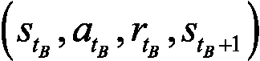
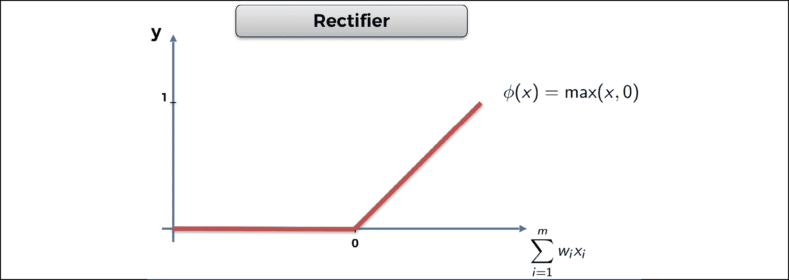
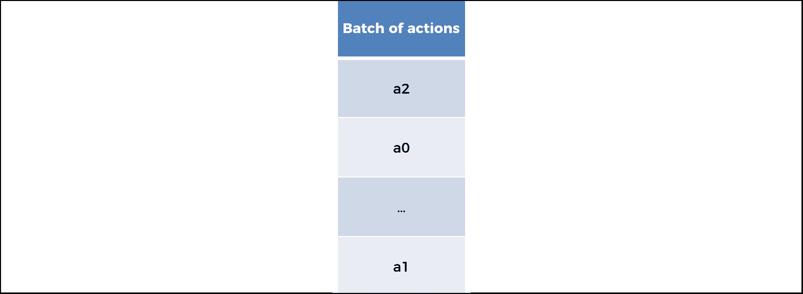
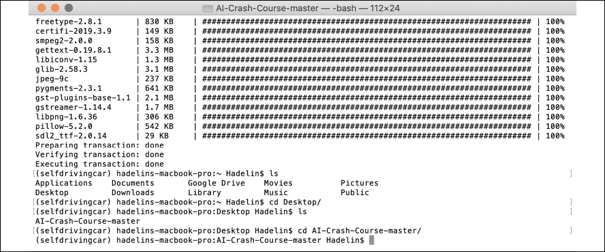
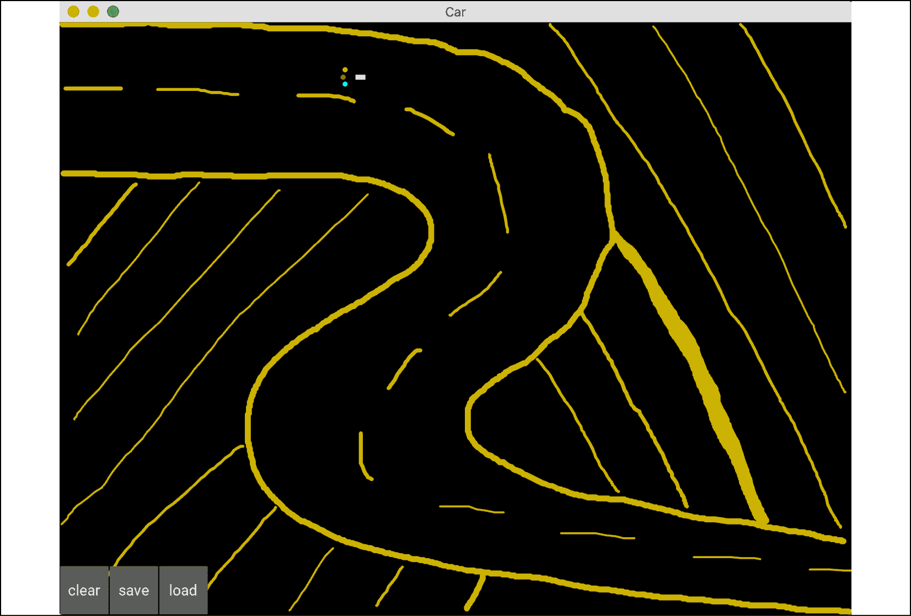

# 第十章：自主车辆的人工智能——构建一辆自动驾驶汽车

我真是非常激动，期待你开始这个新章节。这可能是本书中最具挑战性，同时也是最有趣的冒险。你将从零开始，使用强大的深度 Q 学习模型，构建一辆 2D 地图上的自动驾驶汽车。我觉得这真是令人兴奋！

快点想想，第一步是什么？

如果你回答了“构建环境”，你完全正确。我希望这个答案已经让你感到如此熟悉，以至于我还没问完你就回答出来了。让我们从构建一个汽车可以自己学习如何驾驶的环境开始。

## 构建环境

这一次，我们需要定义的内容远不止状态、动作和奖励。构建一辆自动驾驶汽车是一个非常复杂的问题。现在，我不会要求你去车库，把自己变成一位混合型 AI 机械师；你只需在一个 2D 地图上构建一个虚拟的自动驾驶汽车，让它四处移动。

你将在 Kivy 网络应用中构建这个 2D 地图。Kivy 是一个免费的开源 Python 框架，用于开发类似游戏的应用，或者任何种类的移动应用。你可以在这里查看网站：[`kivy.org/#home`](https://kivy.org/#home)。

本项目的整个环境都是用 Kivy 构建的，从头到尾。地图和虚拟汽车的开发与 AI 无关，因此我们不会逐行讲解实现它的代码。

然而，我将描述一下地图的功能。对于那些好奇地图是如何构建的朋友，我已经在 GitHub 上提供了一个完全注释过的 Python 文件，名为 `map_commented.py`，它从头开始构建这个环境，并提供了详细的解释。

在查看所有功能之前，让我们先看一下这个地图，上面有一辆小虚拟车：


图 1：地图

你首先会注意到的是一个黑色的屏幕，那就是 Kivy 用户界面。你在这个界面内构建你的游戏或应用。正如你可能猜到的，它实际上是整个环境的容器。

你会看到里面有些奇怪的东西，一个白色的矩形，前面有三个彩色的圆点。嗯，那就是汽车！抱歉，我不是个更好的艺术家，但保持简单是很重要的。那个白色的小矩形就是汽车的形状，而那三个小圆点是汽车的传感器。为什么我们需要传感器呢？因为在这个地图上，我们将有选项构建被沙地隔开的道路，而汽车必须避免通过这些沙地。

要在地图上放一些沙子，只需持续按住鼠标左键并绘制你想要的任何内容。它不一定只是道路；你还可以添加一些障碍物。无论如何，汽车必须避免通过沙地。

如果你记得一切都来自于奖励，我相信你已经知道如何实现这一点；那就是当自动驾驶汽车驶上沙地时，通过给予它一个不好的奖励来进行惩罚。我们稍后会处理这个问题。与此同时，让我们看一下我绘制的带有沙子的道路示意图：


图 2：带有绘制道路的地图

传感器用来检测沙子，以便汽车能够避免。蓝色传感器覆盖汽车左侧的区域，红色传感器覆盖汽车前方的区域，黄色传感器覆盖汽车右侧的区域。

最后，在屏幕的左下角有三个按钮可以点击，它们是：

**clear**: 移除地图上绘制的所有沙子

**save**: 保存 AI 的权重（参数）

**load**: 加载最后保存的权重

现在我们已经看过了这张小地图，接下来让我们定义一下我们的目标。

### 定义目标

我们理解我们的目标是构建一辆自动驾驶汽车。很好。那么我们如何在 AI 和强化学习的框架下对这个目标进行形式化定义呢？希望你的直觉已经让你想到了我们将设定的奖励。我同意——如果我们的汽车成功实现自动驾驶，我们会给予它一个高奖励。但是，我们怎么判断它已经成功实现了自动驾驶呢？

我们有很多方法可以评估这个问题。例如，我们可以在地图上画一些障碍物，并训练我们的自动驾驶汽车在不碰到障碍物的情况下绕过它们。这是一个简单的挑战，但我们可以尝试一些更有趣的挑战。还记得我之前画的那条路吗？那我们来训练汽车从地图的左上角到右下角，沿着我们在这两个点之间建立的任何道路行驶。这才是一个真正的挑战，这就是我们要做的。假设这张地图是一个城市，左上角是机场，右下角是市中心：


图 3：两个目的地——机场和市中心

现在我们可以清楚地制定一个目标；训练自动驾驶汽车在机场和市中心之间往返。当它到达机场时，就必须前往市中心；而当它到达市中心时，又必须返回机场。更重要的是，它应该能够沿着任何连接这两个地点的道路完成这些往返。它还应该能够应对道路上任何需要避免的障碍。这里是另一条更具挑战性的道路示例：


图 4：更具挑战性的道路

如果你认为这条路看起来太简单，这里有一个更具挑战性的例子；这次不仅是更难的道路，而且还有许多障碍：


图 5：一条更具挑战性的道路

最后一个例子，我想分享这张由我的一位学生设计的地图，它可能出现在电影*盗梦空间*中：


图 6：有史以来最具挑战性的道路

如果你仔细看，它仍然是从机场到市中心来回的道路，只不过现在变得更具挑战性了。我们创建的 AI 将能够应对这些地图中的任何一种。

我希望你能和我一样感到兴奋！保持这种能量，因为我们还有很多工作要做。

### 设置参数

在你定义输入状态、输出动作和奖励之前，必须先设置所有关于地图和汽车的参数，这些参数将成为你环境的一部分。输入、输出和奖励都是这些参数的函数。让我们列出它们，使用和代码中相同的名称，这样你就能轻松理解文件 `map.py`：

1.  **angle**：地图的 `x`-轴与汽车轴之间的角度

1.  **rotation**：汽车做的最后一次旋转（我们稍后会看到，执行一个动作时，汽车会进行旋转）

1.  **pos = (self.car.x, self.car.y)**：汽车的位置（`self.car.x` 是汽车的 `x`-坐标，`self.car.y` 是汽车的 `y`-坐标）

1.  **velocity = (velocity_x, velocity_y)**：汽车的速度向量

1.  **sensor1 = (sensor1_x, sensor1_y)**：第一个传感器的位置

1.  **sensor2 = (sensor2_x, sensor2_y)**：第二个传感器的位置

1.  **sensor3 = (sensor3_x, sensor3_y)**：第三个传感器的位置

1.  **signal1**：传感器 1 接收到的信号

1.  **signal2**：传感器 2 接收到的信号

1.  **signal3**：传感器 3 接收到的信号

现在我们放慢一下进度；我们得定义这些信号是如何计算的。这些信号是传感器周围沙子密度的度量。你打算如何计算这种密度呢？你首先引入一个新变量，叫做 `sand`，它初始化为一个数组，数组的单元格数量与我们的图形界面的像素数量相同。简单来说，`sand` 数组就是黑色地图本身，像素则是数组的单元格。然后，如果某个位置有沙子，`sand` 数组中的相应单元格会被赋值为 1，如果没有沙子，则赋值为 0。

例如，这里 `sand` 数组的前几行只有 1，其余部分全是 0：


图 7：只有前几行有沙子的地图

我知道边界有点晃动——就像我说的，我不是伟大的艺术家——这只是意味着 `sand` 数组的那些行会在有沙子的地方显示 1，而没有沙子的地方显示 0。

现在你有了这个 `sand` 数组，计算每个传感器周围的沙子密度变得非常简单。你将传感器周围放置一个 20x20 单元格的正方形（传感器从 `sand` 数组中读取这些单元格），然后计算这些单元格中 1 的数量，最后将这个数字除以该正方形中的总单元格数，即 20 x 20 = 400 个单元格。

由于`sand`数组只包含 1（表示有沙子）和 0（表示没有沙子），我们可以通过简单地对这个 20x20 平方中的`sand`数组单元格求和，轻松地计算出 1 的数量。这就给出了每个传感器周围的沙子密度，而这正是在`map.py`文件中的第 81、82 和 83 行计算的内容：

```py
 self.signal1 = int(np.sum(sand[int(self.sensor1_x)-10:int(self.sensor1_x)+10, int(self.sensor1_y)-10:int(self.sensor1_y)+10]))/400\.   #81
        self.signal2 = int(np.sum(sand[int(self.sensor2_x)-10:int(self.sensor2_x)+10, int(self.sensor2_y)-10:int(self.sensor2_y)+10]))/400\.   #82
        self.signal3 = int(np.sum(sand[int(self.sensor3_x)-10:int(self.sensor3_x)+10, int(self.sensor3_y)-10:int(self.sensor3_y)+10]))/400\.   #83 
```

现在我们已经讲解了信号是如何计算的，让我们继续讨论其余的参数。下面我标出的一些最后的参数很重要，因为它们是我们需要的最后几块拼图，以揭示最终的输入状态向量。它们是：

1.  **goal_x**：目标的`x`坐标（可以是机场或市中心）

1.  **goal_y**：目标的`y`坐标（可以是机场或市中心）

1.  **xx = (goal_x - self.car.x)**：目标和汽车之间的`x`坐标差

1.  **yy = (goal_y - self.car.y)**：目标和汽车之间的`y`坐标差

1.  **orientation**：测量汽车相对于目标方向的角度

让我们再慢下来一下。我们需要知道如何计算方向；它是汽车的轴（来自我们参数列表中的`velocity`向量）与连接目标和汽车中心的轴之间的角度。目标的坐标是（`goal_x`，`goal_y`），汽车中心的坐标是（`self.car.x`，`self.car.y`）。例如，如果汽车正朝目标完全前进，那么方向 = 0°。如果你对如何在 Python 中计算这两个轴之间的角度感兴趣，这里是获取`orientation`的代码（`map.py`文件中的第 126、127 和 128 行）：

```py
 xx = goal_x - self.car.x   #126
        yy = goal_y - self.car.y   #127
        orientation = Vector(*self.car.velocity).angle((xx,yy))/180\.   #128 
```

好消息——我们终于准备好定义环境的主要支柱了。我说的当然是输入状态、动作和奖励。

在我定义它们之前，试着猜猜它们是什么。再检查一下所有前面的参数，并记住目标：在两个地点之间来回旅行，即机场和市中心，同时避免道路上的任何障碍。解决方案在下一节。

### 输入状态

你认为输入状态是什么？你可能回答了“汽车的位置”。在这种情况下，输入状态将是一个包含两个元素的向量，汽车的坐标：`self.car.x`和`self.car.y`。

这是一个不错的开始。从你在*第九章*《成为人工智能专家 - 深度 Q 学习》中学到的深度 Q 学习的直觉和基础技术来看，你知道在做深度 Q 学习时，输入状态不一定像 Q 学习那样是单一的元素。实际上，在深度 Q 学习中，输入状态可以是多个元素的向量，从而允许你为 AI 提供多个信息来源，帮助它预测智能的动作来执行。

输入状态甚至可以比一个简单的向量更大：它可以是一个图像！在这种情况下，AI 模型被称为**深度卷积 Q 学习**。它和深度 Q 学习相同，只不过在神经网络的入口处加入了卷积神经网络，让你的 AI（机器）能够处理图像。我们将在*第十二章*，*深度卷积 Q 学习*中介绍这项技术。

我们可以做得比仅仅提供汽车位置坐标更好。位置坐标告诉我们自动驾驶汽车的位置，但有一个更好的参数，它更简单，并且与目标更直接相关。我说的是`orientation`变量。方向是一个单一的输入，它直接告诉我们是否朝着正确的方向前进，朝着目标。如果我们有了这个方向，我们就不再需要汽车的位置坐标来导航到目标；我们只需要改变方向一定角度，就可以让汽车更朝着目标的方向行驶。AI 执行的操作将是改变这个方向的动作。我们将在下一节讨论这些操作。

我们有了输入状态的第一个元素：方向。

但这还不够。记住，我们还有另一个目标，或者说是约束。我们的车需要保持在道路上，并避开道路上的任何障碍物。

在输入状态中，我们需要一些信息来告诉 AI 它是否即将驶出道路或撞到障碍物。试着自己推理一下——我们有办法获取这些信息吗？

解决方案就是传感器。记住，我们的车有三个传感器，给我们提供关于周围沙子多少的信号。蓝色传感器告诉我们车左边是否有沙子，红色传感器告诉我们车前方是否有沙子，黄色传感器告诉我们车右边是否有沙子。这些传感器的信号已经被编码成三个变量：`signal1`、`signal2`和`signal3`。这些信号将告诉 AI 它是否即将撞到障碍物或驶出道路，因为道路是由沙子界定的。

这就是你所需的输入状态的其余信息。通过这四个元素，`signal1`、`signal2`、`signal3`和`orientation`，你拥有了足够的信息，能够从一个位置驾驶到另一个位置，同时保持在道路上，并避免撞到任何障碍物。

总结一下，下面是每次的输入状态：

输入状态 = (`orientation`, `signal1`, `signal2`, `signal3`)

而这正是`map.py`文件中第 129 行的编码内容：

```py
 state = [orientation, self.car.signal1, self.car.signal2, self.car.signal3]   #129 
```

`state`是给输入状态指定的变量名。

不必太担心`signal`、`self.signal`和`self.car.signal`之间的代码语法差异；它们是一样的。我们使用这些不同的变量是因为 AI 是用类（如**面向对象编程**（**OOP**））编写的，这样我们就可以在同一张地图上创建多个自动驾驶汽车。

如果你想在地图上拥有多辆自动驾驶汽车，例如，如果你想让它们进行比赛，那么你可以通过`self.car.signal`更好地区分这些车。例如，如果你有两辆车，你可以将这两个对象命名为`car1`和`car2`，然后通过使用`self.car1.signal1`和`self.car2.signal1`来区分这两辆车的第一个传感器信号。在本章中，我们只有一辆车，因此无论是使用`signal1`、`car.signal1`还是`self.car.signal1`，结果都是一样的。

我们已经讨论过输入状态；现在让我们来处理动作。

### 输出动作

我已经简要提到或暗示了这些动作会是什么。根据我们的输入状态，猜测这些动作是很容易的。自然地，因为你正在构建一辆自动驾驶汽车，你可能会认为动作应该是：前进、左转或右转。你完全正确！这正是这些动作会是的内容。

这不仅直观，而且与我们选择的输入状态极其吻合。输入状态包含了`orientation`变量，它告诉我们汽车是否朝着正确的方向驶向目标。简单来说，如果`orientation`输入告诉我们我们的车指向正确的方向，我们就执行前进的动作。如果`orientation`输入告诉我们目标在车的右侧，我们就执行右转的动作。最后，如果`orientation`告诉我们目标在车的左侧，我们就执行左转的动作。

同时，如果任何信号检测到车周围有沙子，汽车会向左或向右转弯以避开它。前进、左转和右转这三种可能的动作与我们所设定的目标、约束和输入状态是逻辑一致的，我们可以将它们定义为以下三个旋转：

*旋转* = [转动 0°（即前进）、向左转 20°、向右转 20°]

选择 20°是相当任意的。你完全可以选择 10°、30°或 40°。我建议避免选择超过 40°，因为那样你的车子会有不稳定、抖动的动作，看起来就不像是一辆平稳行驶的车了。

然而，人工神经网络输出的动作不会是 0°、20°和-20°，它们将是 0、1 和 2。

*动作* = [0, 1, 2]

在处理人工神经网络的输出时，使用像这样的简单类别总是更好的。由于 0、1 和 2 将是 AI 返回的动作，那么你认为我们是如何得到旋转角度的呢？

你将使用一个简单的映射，代码中叫做`action2rotation`，它将动作 0、1、2 映射到相应的旋转角度 0°、20°、-20°。这正是`map.py`文件中第 34 行和第 131 行的代码：

```py
action2rotation = [0,20,-20]   #34

        rotation = action2rotation[action]   #131 
```

现在，让我们继续讨论奖励。这个部分会很有趣，因为在这里你决定如何奖励或惩罚你的汽车。先尝试自己思考一下，然后再看看下一节中的解决方案。

### 奖励

为了定义奖励系统，我们必须回答以下问题：

+   在哪些情况下我们会给 AI 一个好奖励？每种情况下的奖励有多好？

+   在哪些情况下我们会给 AI 一个坏奖励？每种情况下的奖励有多坏？

为了回答这些问题，我们只需要记住目标和约束是什么：

+   目标是进行机场和市区之间的往返。

+   约束是保持在道路上，并避免任何障碍物。换句话说，约束是远离沙地。

因此，基于这个目标和约束，我们之前问题的答案是：

1.  当 AI 向目标靠近时，我们会给予它一个好奖励。

1.  当 AI 离目标越来越远时，我们会给予它一个坏奖励。

1.  如果 AI 即将驶入沙地，我们会给予它一个坏奖励。

就是这样！这样应该能奏效，因为这些好坏奖励直接影响目标和约束。

为了回答每个问题的第二部分，即对于每种情况，奖励应该有多好或多坏，我们将采取强硬手段；这通常更有效。强硬手段包括在汽车犯错时给予比表现好时更多的惩罚。换句话说，坏奖励将比好奖励更强烈。

这种方法在强化学习中效果很好，但这并不意味着你应该用同样的方法训练你的狗或孩子。当你面对一个生物系统时，反过来（高好奖励和小坏奖励）是一种更有效的训练或教育方式。仅供参考。

说到这一点，以下是每种情况下我们会给予的奖励：

1.  如果 AI 驶入沙地，它会得到-1 的坏奖励。真讨厌！

1.  如果 AI 远离目标，它会得到-0.2 的坏奖励。

1.  如果 AI 向目标靠近，它会得到一个 0.1 的好奖励。

我们将最差奖励（-1）赋给汽车驶入沙地的情况，这是合理的。驶入沙地是我们绝对希望避免的。地图上的沙地代表现实生活中的障碍物；在现实生活中，你会训练自动驾驶汽车避开任何障碍物，以避免事故发生。为了实现这一点，当 AI 在训练过程中撞到障碍物时，我们会给予它极其严重的坏奖励。

那么，如何将其转化为代码呢？很简单；你只需要检查`sand`数组，看汽车是否刚刚驶入包含 1 的格子。如果是，那就意味着汽车驶入了沙地，因此必须获得-1 的坏奖励。这正是`map.py`文件中第 138、139 和 140 行的代码（包括更新汽车速度向量，不仅通过将汽车速度减慢到 1 来更新速度，还通过一定角度更新汽车方向`self.car.angle`）。

```py
 if sand[int(self.car.x),int(self.car.y)] > 0:   #138
            self.car.velocity = Vector(1, 0).rotate(self.car.angle)   #139
            reward = -1   #140 
```

对于其他的奖励分配，你只需要在前面的`if`条件后面加一个`else`，这将说明在汽车没有驶入沙地的情况下会发生什么。

在这种情况下，你开始一个新的 `if` 和 `else` 条件，表示如果汽车远离目标，你给予一个坏的奖励 `-0.2`，如果汽车更接近目标，则给予一个好的奖励 `0.1`。衡量汽车是否远离或接近目标的方法是通过比较两个距离，这两个距离分别存储在两个变量中：`last_distance`，表示在时刻 `t`-1 时汽车与目标之间的距离，以及 `distance`，表示在时刻 `t` 时汽车与目标之间的当前距离。如果将这些组合在一起，你会得到以下代码，完成前面的代码行：

```py
 if sand[int(self.car.x),int(self.car.y)] > 0:   #138
            self.car.velocity = Vector(1, 0).rotate(self.car.angle)   #139
            reward = -1   #140
        else:   #141
            self.car.velocity = Vector(6, 0).rotate(self.car.angle)   #142
            reward = -0.2   #143
            if distance < last_distance:   #144
                reward = 0.1   #145 
```

为了防止汽车尝试驶出地图，`map.py` 文件的第 147 行到 158 行会惩罚 AI，如果自动驾驶汽车距离地图的任意 4 条边界 `10` 像素以内，它会被赋予一个坏奖励 `-1`。最后，`map.py` 文件的第 160 行到 162 行会在汽车距离当前目标 100 像素以内时，更新目标，将其从机场切换到市区，反之亦然。

## AI 解决方案回顾

让我们通过回顾深度 Q 学习过程的步骤，来刷新一下记忆，同时将其适应到我们的自动驾驶汽车应用中。

初始化：

1.  经验重放的记忆被初始化为空列表，在代码中称为 **memory**。

1.  记忆的最大容量被设置，在代码中称为 **capacity**。

在每个时刻 `t`，AI 重复以下过程，直到本轮结束：

1.  AI 预测当前状态 `S[t]` 的 Q 值。因此，由于可以执行三种动作（0 <-> 0°，1 <-> 20°，或 2 <-> -20°），它得到了三个预测的 Q 值。

1.  AI 执行一个通过 Softmax 方法选定的动作（参见 *第五章*，*你的第一个 AI 模型 – 当心土匪!*）：

1.  AI 收到一个奖励 ，奖励值可能是-1、-0.2 或 +0.1。

1.  AI 到达下一个状态 ，该状态由三个传感器的下一个信号以及汽车的方向组成。

1.  AI 将转换  添加到记忆中。

1.  AI 获取一个随机批次  的转换。对于随机批次中的所有转换  ：

    +   AI 获取预测值：

    +   AI 获取目标值：

    +   AI 计算整个批次中预测值与目标值之间的损失 :

    +   最后，AI 将这个损失误差反向传播到神经网络中，并通过随机梯度下降法根据每个权重对损失误差的贡献来更新权重。

## 实现

现在是时候开始实现了！你首先需要一套专业的工具包，因为你不可能仅仅用简单的 Python 库来构建一个人工大脑。你需要的是一个高级框架，它能够快速计算神经网络的训练过程。

今天，构建和训练 AI 的最佳框架是**TensorFlow**（由 Google 开发）和**PyTorch**（由 Facebook 开发）。你应该如何在这两者之间做出选择？它们都非常适合使用，且功能强大。它们都有动态计算图，可以快速计算训练模型时反向传播和小批量梯度下降所需的复杂函数的梯度。实际上，选择哪一个框架并不重要；两者都非常适合我们的自动驾驶汽车。就我个人而言，我在 PyTorch 方面稍有更多经验，因此我将选择 PyTorch，本章中的示例也将继续使用 PyTorch 进行演示。

回过头来看，我们的自动驾驶汽车实现由三个 Python 文件组成：

1.  `car.kv`，包含 Kivy 对象（汽车的矩形形状和三个传感器）

1.  `map.py`，用于构建环境（地图、汽车、输入状态、输出动作、奖励）

1.  `deep_q_learning.py`，用于通过深度 Q 学习来构建和训练 AI

我们已经介绍了`map.py`的主要元素，现在我们将开始处理`deep_q_learning.py`，在这里你不仅要构建一个人工神经网络，还要实现深度 Q 学习训练过程。让我们开始吧！

### 第一步 – 导入库

和往常一样，你需要通过导入必要的库和模块来开始构建 AI。这些包括：

1.  `os`：操作系统库，用于加载保存的 AI 模型。

1.  `random`：用于从记忆中抽取一些随机转移进行经验回放。

1.  `torch`：PyTorch 的主要库，将用于通过张量构建我们的神经网络，而不是像`numpy`数组那样使用简单的矩阵。矩阵是二维数组，而张量可以是`n`维数组，其单元格中不仅包含一个数字。以下是一个图示，帮助你清楚地理解矩阵和张量之间的区别：

1.  `torch.nn`：PyTorch 库中的`nn`模块，用于构建我们 AI 的人工神经网络中的全连接层。

1.  `torch.nn.functional`：`nn`模块中的`functional`子模块，用于调用激活函数（修正线性单元和 Softmax），以及用于反向传播的损失函数。

1.  `torch.optim`：PyTorch 库中的`optim`模块，用于调用 Adam 优化器，它计算损失函数相对于权重的梯度，并在减小损失的方向上更新这些权重。

1.  `torch.autograd`：PyTorch 库中的`autograd`模块，用于调用`Variable`类，该类将每个张量及其梯度关联到同一个变量中。

这构成了你的第一段代码：

```py
# AI for Autonomous Vehicles - Build a Self-Driving Car   #1
#2
# Importing the libraries   #3
#4
import os   #5
import random   #6
import torch   #7
import torch.nn as nn   #8
import torch.nn.functional as F   #9
import torch.optim as optim   #10
from torch.autograd import Variable   #11 
```

### 第 2 步 – 创建神经网络的架构

这一段代码是你真正开始构建 AI 大脑的地方。你将要构建输入层、全连接层和输出层，并选择一些激活函数，用于在大脑内部进行前向传播信号。

首先，你将把这个大脑构建在一个类里面，我们将这个类称为`Network`。

什么是类？在我们解释为什么使用类之前，先来解释一下什么是类。类是 Python 中的一种高级结构，它包含了我们想要构建的对象的指令。以神经网络（即对象）为例，这些指令包括你想要多少层、每一层里面有多少个神经元、你选择了哪种激活函数，等等。这些参数定义了你的人工大脑，并且都聚集在我们称之为`__init__()`的方法中，这也是我们在构建类时总是从这里开始的。但这还不是全部——类还可以包含工具，称为方法，这些方法是执行某些操作或返回某些东西的函数。你的`Network`类将包含一个方法，用于在神经网络中进行前向传播并返回预测的 Q 值。我们将这个方法命名为`forward`。

那么，为什么使用类呢？这是因为构建类可以让你创建任意多个对象（也叫实例），并且只需改变类的参数就能轻松切换。举个例子，你的`Network`类包含两个参数：`input_size`（输入的数量）和`nb_actions`（动作的数量）。如果你将来想要构建一个拥有更多输入（除了信号和方向）或更多输出（例如添加一个能够刹车的动作）的 AI，得益于类的高级结构，你可以快速实现。这非常实用，如果你还不熟悉类的概念，你将需要尽快掌握它们。几乎所有的 AI 实现都使用类。

这只是一个简短的技术说明，确保我在讲解过程中没有让任何人迷失。现在，让我们开始构建这个类。由于代码中有许多重要的元素需要解释，并且你可能对 PyTorch 不太熟悉，所以我会先展示代码，然后逐行解释来自`deep_q_learning.py`文件的内容：

```py
# Creating the architecture of the Neural Network   #13
#14
class Network(nn.Module):   #15
    #16
    def __init__(self, input_size, nb_action):   #17
        super(Network, self).__init__()   #18
        self.input_size = input_size   #19
        self.nb_action = nb_action   #20
        self.fc1 = nn.Linear(input_size, 30)   #21
        self.fc2 = nn.Linear(30, nb_action)   #22
    #23
    def forward(self, state):   #24
        x = F.relu(self.fc1(state))   #25
        q_values = self.fc2(x)   #26
        return q_values   #27 
```

**第 15 行**：你引入了`Network`类。在这个类的括号内，你可以看到`nn.Module`。这意味着你调用了`Module`类，它是从`nn`模块中提取的一个现有类，用来获取`Module`类的所有属性和工具，并在你的`Network`类中使用它们。这个在新类中调用另一个现有类的技巧叫做**继承**。

**第 17 行**：你从`__init__()`方法开始，它定义了人工神经网络的所有参数（输入数量、输出数量等）。你可以看到三个参数：`self`、`input_size`和`nb_action`。`self`指代对象，即类创建后将要生成的未来实例。每当你看到`self`出现在变量前面，并且通过点（`.`）与变量分隔时，意味着该变量属于该对象。这应该能解开关于`self`的一切谜团！

然后，`input_size`是输入状态向量中的输入数量（因此是 4），`nb_action`是输出动作的数量（因此是 3）。重要的是要理解，`__init__()`方法中的参数（除了`self`）是你在创建未来对象时会输入的参数，也就是未来你的 AI 人工大脑。

**第 18 行**：你使用`super()`函数来激活继承（如第 15 行所述），该函数位于`__init__()`方法内。

**第 19 行**：这里你引入了第一个对象变量`self.input_size`，并将其设置为与参数`input_size`相等（稍后将输入为`4`，因为输入状态有 4 个元素）。

**第 20 行**：你引入了第二个对象变量`self.nb_action`，并将其设置为与参数`nb_action`相等（稍后将输入为`3`，因为可以执行三个动作）。

**第 21 行**：你引入了第三个对象变量`self.fc1`，它是输入层（由输入状态组成）与隐藏层之间的第一个全连接。这个第一个全连接作为`nn.Linear`类的对象创建，它接受两个参数：第一个是左侧层（输入层）中的元素数量，因此应该使用`input_size`作为参数，第二个是右侧层（隐藏层）中的隐藏神经元数量。在这里，你选择了 30 个神经元，因此第二个参数是`30`。选择 30 只是一个任意的决定，自动驾驶汽车也可以在其他数量下正常工作。

**第 22 行**：你引入了第四个对象变量`self.fc2`，它是隐藏层（由 30 个隐藏神经元组成）与输出层之间的第二个全连接。它本来也可以是与新隐藏层的全连接，但你的问题不复杂到需要多个隐藏层，因此你在人工大脑中只会有一个隐藏层。和之前一样，这个第二个全连接作为`nn.Linear`类的对象创建，它接受两个参数：第一个是左侧层（隐藏层）中的元素数量，因此是`30`，第二个是右侧层（输出层）中的隐藏神经元数量，因此是`3`。

**第 24 行**：你开始构建类的第一个也是唯一的方法——`forward` 方法，该方法将信号从输入层传播到输出层，然后返回预测的 Q 值。这个 `forward` 方法接受两个参数：`self`，因为你将在 `forward` 方法中使用对象变量，以及 `state`，输入状态向量，由四个元素（方位加上三个信号）组成。

**第 25 行**：你通过一个整流激活函数（也叫 **ReLU**（**整流线性单元**））将信号从输入层前向传播到隐藏层并激活信号。这个过程分为两步。首先，通过调用第一个全连接层 `self.fc1`，并将输入状态向量 `state` 作为输入，完成从输入层到隐藏层的前向传播：`self.fc1(state)`。

这将返回隐藏层。然后我们调用 `relu` 函数，将该隐藏层作为输入，以以下方式打破信号的线性关系：



图 8：整流激活函数

ReLU 层的目的是通过在全连接层上创建非线性操作来打破线性关系。你希望实现这一点，因为你在解决的是一个非线性问题。最后，`F.relu(self.fc1(state))` 返回 `x`，即带有非线性信号的隐藏层。

**第 26 行**：你将信号从隐藏层前向传播到包含 Q 值的输出层。和上一行一样，这也是通过调用第二个全连接层 `self.fc2`，并将隐藏层 `x` 作为输入来完成的：`self.fc2(x)`。这将返回 Q 值，命名为 `q_values`。这里不需要激活函数，因为你稍后将在另一个类中使用 Softmax 选择要执行的动作。

**第 27 行**：最后，`forward` 方法返回 Q 值。

让我们来看一看你刚刚创建的内容！


图 9：我们 AI 的神经网络（大脑）

`self.fc1` 是 **输入层** 和 **隐藏层** 之间所有的蓝色连接线。

`self.fc2` 是 **隐藏层** 和 **输出层** 之间所有的蓝色连接线。

这应该能帮助你更好地可视化完整的连接。干得不错！

### 第 3 步 – 实现经验回放

是时候进入下一步了！你现在将构建另一个类，来构建用于经验回放的内存对象（如 *第五章* 所示，*你的第一个 AI 模型 - 小心强盗!*）。首先，我们来看一下代码，然后我将逐行解释 `deep_q_learning.py` 文件中的所有内容。

```py
# Implementing Experience Replay   #29
#30
class ReplayMemory(object):   #31
    #32
    def __init__(self, capacity):   #33
        self.capacity = capacity   #34
        self.memory = []   #35
    #36
    def push(self, event):   #37
        self.memory.append(event)   #38
        if len(self.memory) > self.capacity:   #39
            del self.memory[0]   #40
    #41
    def sample(self, batch_size):   #42
        samples = zip(*random.sample(self.memory, batch_size))   #43
        return map(lambda x: Variable(torch.cat(x, 0)), samples)   #44 
```

**第 31 行**：你引入了 `ReplayMemory` 类。这次你不需要从任何其他类继承，因此只需在类的括号中输入 `object` 即可。

**第 33 行**：和往常一样，你从 `__init__()` 方法开始，该方法只接受两个参数：`self`，对象本身，以及 `capacity`，内存的最大容量。

**第 34 行**：你引入了第一个对象变量`self.capacity`，并将其设置为参数`capacity`，该参数将在稍后创建类的对象时传入。

**第 35 行**：你引入了第二个对象变量`self.memory`，并将其初始化为空列表。

**第 37 行**：你开始构建类的第一个工具——`push` 方法，该方法以一个过渡作为输入并将其添加到记忆中。然而，如果添加该过渡会超出记忆的容量，`push` 方法还会删除记忆中的第一个元素。你看到的`event`参数是要添加的过渡。

**第 38 行**：使用`append`函数，你将过渡添加到记忆中。

**第 39 行**：你开始了一个`if`条件语句，用来检查记忆的长度（即它的过渡数量）是否大于容量。

**第 40 行**：如果真是这样，你会删除记忆中的第一个元素。

**第 42 行**：你开始构建类的第二个工具——`sample`方法，该方法从经验回放记忆中抽取一些随机过渡。它以`batch_size`为输入，表示用于训练神经网络的过渡批次大小。

记住它是如何工作的：你不是将单一输入状态正向传播到神经网络并在每次由输入状态导致的过渡后更新权重，而是正向传播小批量的输入状态，并在反向传播相同的整个批次的过渡后通过小批量梯度下降更新权重。这与随机梯度下降（每次输入时更新权重）和批量梯度下降（每批输入时更新权重）不同，正如在*第九章*，*与人工大脑同行 – 深度 Q 学习*中解释的那样：


图 10：批量梯度下降与随机梯度下降

**第 43 行**：你从记忆中随机抽取一些过渡，并将它们放入一个大小为`batch_size`的批次中。例如，如果`batch_size = 100`，你将从记忆中抽取 100 个随机过渡。抽取过程使用随机库中的`sample()`函数完成。然后，`zip(*list)`被用来将状态、动作和奖励重新分组为相同大小的独立批次（`batch_size`），以便将抽取的过渡格式化为 PyTorch 所期望的格式（即接下来在第 44 行的`Variable`格式）。

现在可能是个不错的时机，退一步来看一下第 43 行的内容：


图 11：最后状态、动作、奖励和下一状态的批次

**第 44 行**：使用`map()`函数，将每个样本包装成一个`torch Variable`对象（因为`Variable()`实际上是一个类），这样样本中的每个张量都会与梯度关联。简单来说，`torch Variable`可以看作是一个包含张量和梯度的高级结构。

这就是 PyTorch 的魅力所在。这些 `torch Variables` 都位于一个动态计算图中，这使得我们能够快速计算复杂函数的梯度。这样的快速计算是反向传播过程中通过小批量梯度下降更新权重所必需的。在 `Variable` 类内部，我们看到 `torch.cat(x,0)`。这只是一个拼接技巧，沿着垂直轴将样本格式化为 `Variable` 类所期望的格式。

需要记住的最重要的事情是：在使用 PyTorch 训练神经网络时，我们始终使用`torch Variables`，而不仅仅是张量。你可以在 PyTorch 文档中找到更多相关细节。

### 第 4 步 – 实现深度 Q 学习

你成功了！你终于要开始编写整个深度 Q 学习的代码了。再次强调，你将把它全部封装成一个类，这次叫做 `Dqn`，也就是深度 Q 网络。这是你在终点线之前的最后一次冲刺。让我们加油，冲刺到底！

这一次，类比较长，所以我将逐行展示并解释来自 `deep_q_learning.py` 文件的代码，按方法来逐一说明。这是第一行，`__init__()` 方法：

```py
# Implementing Deep Q-Learning   #46
#47
class Dqn(object):   #48
    #49
    def __init__(self, input_size, nb_action, gamma):   #50
        self.gamma = gamma   #51
        self.model = Network(input_size, nb_action)   #52
        self.memory = ReplayMemory(capacity = 100000)   #53
        self.optimizer = optim.Adam(params = self.model.parameters())   #54
        self.last_state = torch.Tensor(input_size).unsqueeze(0)   #55
        self.last_action = 0   #56
        self.last_reward = 0   #57 
```

**第 48 行**：你引入了 `Dqn` 类。你不需要从其他类继承，因此只需在类的括号中输入 `object`。

**第 50 行**：和往常一样，你从 `__init__()` 方法开始，这次它有四个参数：

1.  `self`：该对象

1.  `input_size`：输入状态向量中的输入数目（即，4）

1.  `nb_action`：动作数目（即，3）

1.  `gamma`：时序差分公式中的折扣因子

**第 51 行**：你引入了第一个对象变量 `self.gamma`，并将其设置为 `gamma` 参数的值（该值将在稍后创建 `Dqn` 类对象时输入）。

**第 52 行**：你引入了第二个对象变量 `self.model`，它是你之前构建的 `Network` 类的一个对象。这个对象就是你的神经网络；换句话说，就是我们 AI 的“大脑”。在创建这个对象时，你需要输入 `Network` 类中的 `__init__()` 方法的两个参数，分别是 `input_size` 和 `nb_action`。稍后，你会在创建 `Dqn` 类的对象时输入它们的实际值（分别是 `4` 和 `3`）。

**第 53 行**：你引入了第三个对象变量 `self.memory`，它是你之前构建的 `ReplayMemory` 类的一个对象。这个对象是经验回放内存。由于 `ReplayMemory` 类的 `__init__` 方法只需要一个参数 `capacity`，所以你在这里输入了 `100,000`。换句话说，你创建了一个大小为 100,000 的内存，这意味着 AI 将记住最近的 100,000 次过渡，而不仅仅是最后一个。

**第 54 行**：你引入了第四个对象变量`self.optimizer`，它是`Adam`类的一个对象，`Adam`类是`torch.optim`模块中现有的类。这个对象是优化器，通过小批量梯度下降在反向传播过程中更新权重。在参数中，保持大部分默认值（你可以在 PyTorch 文档中查看），并且只输入模型参数（`params`参数），这些参数通过`self.model.parameters`访问，这是`nn.Module`类的一个属性，而`Network`类继承了这个类。

**第 55 行**：你引入了第五个对象变量`self.last_state`，它将成为每次（最后状态，动作，奖励，下一个状态）转变中的最后一个状态。这个最后状态被初始化为`Tensor`类的一个对象，该类来自`torch`库，初始化时只需要输入`input_size`参数。然后，使用`.unsqueeze(0)`在索引 0 处创建一个额外的维度，这个维度将对应于批次。这样我们可以像下面这样做，将每个最后状态与相应的批次匹配：


图 12：为批次添加一个维度

**第 56 行**：你引入了第六个对象变量`self.last_action`，其初始值为`0`，表示每次迭代时执行的最后一个动作。

**第 57 行**：我们引入了最后一个对象变量`self.last_reward`，其初始值为`0`，表示在上一次执行动作`self.last_action`后获得的最后奖励，该奖励发生在最后一个状态`self.last_state`中。

现在，你已经准备好`__init__`方法了。让我们继续进入下一个代码部分，并讨论下一个方法：`select_action`方法，它使用 Softmax 选择每次迭代时要执行的动作。

```py
 def select_action(self, state):   #59
        probs = F.softmax(self.model(Variable(state))*100)   #60
        action = probs.multinomial(len(probs))   #61
        return action.data[0,0]   #62 
```

**第 59 行**：你开始定义`select_action`方法，它接收一个输入状态向量（方向、信号 1、信号 2、信号 3）作为输入，并返回作为输出的选择动作。

**第 60 行**：你通过`torch.nn.functional`模块中的 Softmax 函数获得三个动作的概率。这个 Softmax 函数以 Q 值作为输入，这些 Q 值正是通过`self.model(Variable(state))`返回的。记住，`self.model`是`Network`类的一个对象，而该类具有`forward`方法，`forward`方法接收一个输入状态张量，该张量被封装在`torch`的`Variable`中，并返回三个动作的 Q 值作为输出。

**极客笔记**：通常我们会指定以这种方式调用`forward`方法——`self.model.forward(Variable(state))`——但由于`forward`是`Network`类的唯一方法，直接调用`self.model`就足够了。

在`softmax`内将 Q 值乘以一个数（这里是`100`）是一个值得记住的技巧：它可以调节探索与开发之间的平衡。这个数字越小，你的探索就越多，因此优化动作的时间也会更长。在这里，问题并不复杂，所以选择一个较大的数字（`100`），以便做出更自信的动作，且路径更加平滑。若你移除`*100`，你会明显看到不同。简单来说，带上`*100`，你会看到一辆车很有自信；没有`*100`，你会看到一辆车在焦躁不安。

**第 61 行**：你从第 60 行的`softmax`函数创建的动作分布中随机抽取，通过调用`multinomial()`函数从概率`probs`中获取。

**第 62 行**：你返回要执行的选定操作，你可以通过`action.data[0,0]`来访问该操作。返回的`action`具有高级的张量结构，操作索引（0, 1 或 2）位于操作张量的`data`属性中，索引[0,0]的第一个单元格。

让我们继续进入下一个代码部分，`learn`方法。这个方法非常有趣，因为它是深度 Q 学习的核心所在。正是在这个方法中，我们计算时序差分（temporal difference），进而计算损失，并使用优化器更新权重，以减少损失。这就是为什么这个方法叫做`learn`，因为正是在这里，AI 学会了执行越来越好的动作，进而提高累计的奖励。我们继续：

```py
 def learn(self, batch_states, batch_actions, batch_rewards, batch_next_states):   #64
        batch_outputs = self.model(batch_states).gather(1, batch_actions.unsqueeze(1)).squeeze(1)   #65
        batch_next_outputs = self.model(batch_next_states).detach().max(1)[0]   #66
        batch_targets = batch_rewards + self.gamma * batch_next_outputs   #67
        td_loss = F.smooth_l1_loss(batch_outputs, batch_targets)   #68
        self.optimizer.zero_grad()   #69
        td_loss.backward()   #70
        self.optimizer.step()   #71 
```

**第 64 行**：你首先定义了`learn()`方法，该方法接受四个元素组成的转移批次作为输入（输入状态、动作、奖励、下一个状态）：

1.  `batch_states`：输入状态的批次。

1.  `batch_actions`：一批执行的动作。

1.  `batch_rewards`：收到的一批奖励。

1.  `batch_next_states`：到达的下一个状态批次。

在我解释第 65、66 和 67 行之前，让我们先回顾一下你需要做的事情。如你所知，`learn`方法的目标是通过每次训练迭代来更新权重，以减少反向传播的损失。首先，让我们提醒一下损失的公式：


在损失公式中，我们清晰地识别出了输出（预测的 Q 值）和目标：


因此，为了计算损失，你将按如下方式处理接下来的四行代码：

**第 65 行**：你收集输出批次，。

**第 66 行**：你计算目标的部分，称其为`batch_next_outputs`。

**第 67 行**：你获取目标的批次。

**第 68 行**：因为你已经有了输出和目标，现在可以计算损失了。

现在让我们详细讨论一下。

**第 65 行**：你收集了输出的批次 ，即输入状态和在批次中执行的动作的预测 Q 值。获取它们需要几个步骤。首先，你调用`self.model(batch_states)`，如第 60 行所见，它返回每个输入状态在`batch_states`中的 Q 值，以及三个动作 0、1 和 2 的 Q 值。为了帮助你更好地可视化，它返回类似这样的结果：


图 13：self.model(batch_states)返回的内容

你只想要来自输出批次中选择动作的预测 Q 值，这些 Q 值位于动作批次`batch_actions`中。这正是`.gather(1, batch_actions.unsqueeze(1)).squeeze(1)`技巧所做的：对于批次中的每个输入状态，它会选择与批次中的所选动作相对应的 Q 值。为了帮助更好地可视化，假设动作批次如下：



图 14：动作批次

然后，你将得到以下由红色 Q 值组成的输出批次：


图 15：输出批次

希望这很清楚；我会尽力避免让你迷失。

**第 66 行**：现在你得到了目标的 部分。称之为`batch_next_outputs`；你可以通过两个步骤获得它。首先，调用`self.model(batch_next_states)`来获取批次下一个状态的每个 Q 值的预测值，以及三个动作的 Q 值。然后，对于批次中的每个下一个状态，使用`.detach().max(1)[0]`取三个 Q 值中的最大值。这就给你目标的 值部分。

**第 67 行**：由于你已经有了奖励的批次 （它是参数的一部分），并且由于你刚刚在第 66 行得到了目标的 值部分，那么你就准备好获取目标的批次：


这正是你在第 67 行所做的，通过将`batch_rewards`与`batch_next_outputs`乘以`self.gamma`（这是`Dqn`类中的一个对象变量）相加。现在，你已经有了输出批次和目标批次，因此你可以准备好计算损失了。

**第 68 行**：让我们回顾一下损失的公式：


因此，为了计算损失，你只需要计算目标和输出批次之间平方差的总和。这正是`smooth_l1_loss`函数所做的。它来自`torch.nn.functional`模块，接受输出批次和目标批次作为输入，并根据前面的公式返回损失。在代码中，将此损失称为`td_loss`，即**时序差分损失**。

出色的进展！现在你有了损失，表示预测与目标之间的误差，你准备通过反向传播这个损失到神经网络，并通过小批量梯度下降来更新权重，从而减少这个损失。接下来的步骤是使用你的优化器，它将执行权重更新。

**第 69 行**：你首先初始化梯度，通过调用`self.optimizer`对象的`zero_grad()`方法（`zero_grad`是`Adam`类的方法），它基本上会将所有权重的梯度设置为零。

**第 70 行**：你通过调用`td_loss`的`backward()`函数将损失误差`td_loss`反向传播到神经网络中。

**第 71 行**：你通过调用`self.optimizer`对象的`step()`方法来执行权重更新（`step`是`Adam`类的方法）。

恭喜你！你已经在`Dqn`类中构建了一个工具，可以训练你的汽车开得更好。你已经完成了最难的部分。现在你剩下的工作就是将这些工作整合到一个最终的方法中，叫做`update`，它将在达到新状态后更新权重。

如果你在想，“那不就是我已经在`learn`方法中做的事吗？”，嗯，你是对的；但你需要创建一个额外的函数，在适当的时机更新权重。更新权重的适当时机是在我们的 AI 到达新状态后。简而言之，接下来你要实现的`update`方法将把`learn`方法和动态环境联系起来。

这就是终点！你准备好了吗？下面是代码：

```py
 def update(self, new_state, new_reward):   #73
        new_state = torch.Tensor(new_state).float().unsqueeze(0)   #74
        self.memory.push((self.last_state, torch.LongTensor([int(self.last_action)]), torch.Tensor([self.last_reward]), new_state))   #75
        new_action = self.select_action(new_state)   #76
        if len(self.memory.memory) > 100:   #77
            batch_states, batch_actions, batch_rewards, batch_next_states = self.memory.sample(100)   #78
            self.learn(batch_states, batch_actions, batch_rewards, batch_next_states)   #79
        self.last_state = new_state   #80
        self.last_action = new_action   #81
        self.last_reward = new_reward   #82
        return new_action   #83 
```

**第 73 行**：你引入了`update()`方法，该方法的输入是刚执行一个动作后所到达的新状态以及新获得的奖励。此处输入的新状态将是你在`map.py`文件第 129 行看到的`state`变量，而新奖励将是你在`map.py`文件第 138 到 145 行看到的`reward`变量。这个`update`方法执行一些操作，包括权重更新，最后返回需要执行的新动作。

**第 74 行**：你首先将新状态转换为 torch 张量，并通过 unsqueeze 操作为其创建一个额外的维度（放在索引 0 的位置），该维度对应于批次。为了方便以后的操作，你还确保新状态的所有元素（方向和三个信号）都被转换为浮动数值，通过添加`.float()`。

**第 75 行**：使用你内存对象的`push()`方法，向内存中添加一个新的过渡。这个新的过渡由以下部分组成：

1.  `self.last_state`：到达新状态之前的最后一个状态

1.  `self.last_action`：导致到达新状态的最后一个动作

1.  `self.last_reward`：执行最后一个动作后获得的最后一个奖励

1.  `new_state`：刚刚到达的新状态

这个新过渡的所有元素都被转换为 torch 张量。

**第 76 行**：使用`Dqn`类中的`select_action()`方法，从刚到达的新状态执行一个新动作。

**第 77 行**：检查内存大小是否大于 100。在`self.memory.memory`中，第一个`memory`是第 53 行创建的对象，第二个`memory`是第 35 行引入的变量对象。

**第 78 行**：如果是这种情况，从内存中采样 100 个过渡，使用`self.memory`对象中的`sample()`方法。这将返回四个大小为 100 的批次：

1.  `batch_states`：当前状态的批次（在过渡时刻的状态）。

1.  `batch_actions`：在当前状态下执行的动作批次。

1.  `batch_rewards`：在`batch_states`的当前状态下执行`batch_actions`动作后获得的奖励批次。

1.  `batch_next_states`：执行`batch_actions`动作后，在`batch_states`的当前状态下到达的下一个状态批次。

**第 79 行**：仍在`if`条件中，使用`learn()`方法更新权重，该方法从同一个`Dqn`类中调用，并以四个先前的批次作为输入。

**第 80 行**：更新最后到达的状态`self.last_state`，并将其设为`new_state`。

**第 81 行**：更新最后执行的动作`self.last_action`，并将其设为`new_action`。

**第 82 行**：更新最后获得的奖励`self.last_reward`，并将其设为`new_reward`。

**第 83 行**：返回执行的新动作。

这就是`update()`方法的全部！希望你能看到我们是如何将各个部分连接起来的。现在，为了更好地连接这些点，让我们看看你在`map.py`文件中如何以及在哪里调用`update`方法。

首先，在调用`update()`方法之前，你必须创建一个`Dqn`类的对象，这里称之为`brain`。这正是你在`map.py`文件第 33 行做的事情。

```py
brain = Dqn(4,3,0.9)   #33 
```

这里输入的参数是我们在`Dqn`类的`__init__()`方法中看到的三个参数：

+   `4`是输入状态中的元素数量（`input_size`）。

+   `3`是可能的动作数量（`nb_action`）。

+   `0.9`是折扣因子（`gamma`）。

然后，从这个`brain`对象中，你在`map.py`文件第 130 行调用`update()`方法，紧接着到达一个新的状态，该状态在代码中被称为`state`：

```py
 state = [orientation, self.car.signal1, self.car.signal2, self.car.signal3]   #129
        action = brain.update(state, reward)   #130 
```

回到你的`Dqn`类，你需要两个额外的方法：

1.  `save()`方法，保存 AI 网络权重的方法，保存的是它们最后一次更新后的权重。每当你在运行地图时点击**保存**按钮时，都会调用这个方法。然后，你的 AI 权重将被保存并放入一个名为`last_brain.pth`的文件中，该文件将自动存储在包含你的 Python 文件的文件夹中。这就让你能够拥有一个预训练的 AI。

1.  `load()`方法，加载保存的`last_brain.pth`文件中的权重。当你在运行地图时点击**加载**按钮时，它会调用这个方法。它使你能够以一个预训练的自动驾驶汽车开始地图，而无需等待训练。

这最后两种方法与 AI 无关，因此我们不会花时间解释每一行代码。不过，如果你以后想用它们来构建其他 AI 模型，能认识这两种工具还是挺有用的。

它们是这样实现的：

```py
 def save(self):   #85
        torch.save({'state_dict': self.model.state_dict(),   #86
                    'optimizer' : self.optimizer.state_dict(),   #87
                   }, 'last_brain.pth')   #88
    #89
    def load(self):   #90
        if os.path.isfile('last_brain.pth'):   #91
            print("=> loading checkpoint... ")   #92
            checkpoint = torch.load('last_brain.pth')   #93
            self.model.load_state_dict(checkpoint['state_dict'])   #94
            self.optimizer.load_state_dict(checkpoint['optimizer'])   #95
            print("done !")   #96
        else:   #97
            print("no checkpoint found...")   #98 
```

恭喜！

没错！你已经完成了我们自驾车中的 AI 代码实现，总共 100 行代码。这是一个相当了不起的成就，尤其是在第一次编写深度 Q 学习时。你真的可以为自己走到这一步感到自豪。

在经历了这一切的辛勤工作后，你完全值得享受一些乐趣，而我认为最有趣的就是看到你辛勤工作的成果。换句话说，你即将看到你的自驾车开始运行！我记得第一次运行这个程序时，我是多么兴奋。你也会有这种感觉，真的很酷！

## 演示

我有一些好消息和一些坏消息。

我先说坏消息：我们不能通过简单的即插即用方式在 Google Colab 上运行 `map.py` 文件。原因是 Kivy 在 Colab 上的安装非常棘手。所以，我们将采用经典的方式运行 Python 文件：通过终端。

好消息是，一旦通过终端安装了 Kivy 和 PyTorch，你将拥有一个精彩的演示！

让我们安装运行自驾车所需的一切。以下是我们需要按顺序安装的内容：

1.  **Anaconda**：一个免费的开源 Python 发行版，通过 `conda` 命令提供了一种简便的方式来安装包。我们将用它来安装 PyTorch 和 Kivy。

1.  **Python 3.6 的虚拟环境**：Anaconda 默认安装 Python 3.7 或更高版本；然而，3.7 版本与 Kivy 不兼容。我们将创建一个虚拟环境，在其中安装 Python 3.6，这是与 Kivy 以及我们的实现兼容的版本。如果这听起来有点吓人，不用担心，我会提供所有需要的细节，帮助你完成设置。

1.  **PyTorch**：然后，在虚拟环境中，我们将安装 PyTorch，这个用于构建深度 Q 网络的 AI 框架。我们将安装一个与我们的实现兼容的 PyTorch 特定版本，以确保每个人都能顺利运行，不会出现问题。PyTorch 升级有时会更改模块的名称，这可能会导致旧的实现与最新版本的 PyTorch 不兼容。在这里，我们确保安装了与我们的实现兼容的正确版本。

1.  **Kivy**：最后，仍然在虚拟环境中，我们将安装 Kivy，这个开源 Python 框架，我们将在其上运行我们的地图。

我们先从 Anaconda 开始。

### 安装 Anaconda

在 Google 或你喜欢的浏览器中，访问 [www.anaconda.com](https://www.anaconda.com/)。在 Anaconda 网站上，点击屏幕右上角的 **Download** 按钮。向下滚动，你会看到可供下载的 Python 版本：


图 16：安装 Anaconda – 第 2 步

在顶部，确保你的系统（Windows、macOS 或 Linux）已正确选择。如果是，点击 Python 3.7 版本框中的 **Download** 按钮。这将下载带有 Python 3.7 的 Anaconda。

然后双击下载的文件，并不断点击 **Continue** 和 **Agree** 进行安装，直到安装完成。如果提示你选择安装对象，选择 **仅为我安装**。

### 使用 Python 3.6 创建虚拟环境

现在 Anaconda 已安装，你可以创建一个名为 `selfdrivingcar` 的虚拟环境，并安装 Python 3.6。为此，你需要打开终端并输入一些命令。以下是三种系统的打开方法：

1.  对于 Linux 用户，只需按 `Ctrl` + `Alt` + `T`。

1.  对于 Mac 用户，按 `Cmd` + `Space`，然后在聚焦搜索中输入 `Terminal`。

1.  对于 Windows 用户，点击屏幕左下角的 Windows 按钮，在程序列表中找到 `anaconda`，点击打开 Anaconda 提示符。一个黑色窗口会打开；这就是你用来安装包的终端。

在终端中输入以下命令：

```py
conda create -n selfdrivingcar python=3.6 
```

就是这样：


这个命令创建了一个名为 `selfdrivingcar` 的虚拟环境，并安装了 Python 3.6 和其他包。

按下 `Enter` 后，几秒钟内你会看到这个：


按 `y` 继续。这将下载并解压包。几秒钟后，你会看到这个，这标志着安装完成：


接下来，我们将激活 `selfdrivingcar` 虚拟环境，意味着我们将进入该环境，以便在 `selfdrivingcar` 虚拟环境中安装 PyTorch 和 Kivy。

如你所见，之前为了激活环境，我们将输入以下命令：

```py
conda activate selfdrivingcar 
```

输入该命令后，你将进入虚拟环境：


现在我们可以看到在我的电脑名称 `hadelins-macbook-pro` 前面出现 `(selfdrivingcar)`，这意味着我们已经进入了 `selfdrivingcar` 虚拟环境。

我们已经准备好进行下一步，即在这个虚拟环境中安装 PyTorch 和 Kivy。不要关闭你的终端，否则当你重新打开时，你将回到主环境。

### 安装 PyTorch

现在，我们将通过输入以下命令在虚拟环境中安装 PyTorch：

```py
conda install pytorch==0.3.1 -c pytorch 
```

就是这样：


几秒钟后，我们得到了这个：


再次按下 `y`，然后按 `Enter` 键。

几秒钟后，PyTorch 已安装：


### 安装 Kivy

现在我们继续安装 Kivy。在同一个虚拟环境中，我们将通过输入以下命令来安装 Kivy：

```py
conda install -c conda-forge/label/cf201901 kivy 
```


再次，我们得到了这个：


再次输入 `y`，然后再等几秒钟，Kivy 就安装好了。


现在，我有个好消息要告诉你：你已经准备好运行自动驾驶汽车了！为了实现这一点，我们需要在终端中运行我们的代码，仍然是在我们的虚拟环境中。

如果你已经关闭了终端，那么重新打开终端后，输入`conda activate selfdrivingcar`命令，以便重新进入虚拟环境。

好的，我们来运行代码吧！如果你还没有这样做，先通过点击 GitHub 页面上的**Clone or download**按钮下载整个仓库：

([`github.com/PacktPublishing/AI-Crash-Course`](https://github.com/PacktPublishing/AI-Crash-Course))


图 17：GitHub 仓库

然后解压缩文件，并将解压后的文件夹移动到桌面上，像这样：


接下来，进入`Chapter 10`并选择并复制其中的所有文件：


然后，由于我们现在只对这些文件感兴趣，并且为了简化终端中的命令行，将这些文件粘贴到主`AI-Crash-Course-master`文件夹内，并删除其他不需要的文件，最终你会得到如下结果：


现在，我们将通过终端访问这个文件夹。由于我们已经将仓库文件夹放在桌面上，所以很容易找到它。再次回到终端，输入`ls`（l 代表 lion）查看当前所在的文件夹：


我可以看到我在我的主根文件夹中，这个文件夹包含了`Desktop`文件夹。通常你也应该能看到这个。所以现在我们进入`Desktop`文件夹，输入以下命令：

```py
cd Desktop 
```


再次输入`ls`命令，确认你确实看到了`AI-Crash-Course-master`文件夹：


接下来，通过输入以下命令进入`AI-Crash-Course-master`文件夹：

```py
cd AI-Crash-Course-master 
```



完美！现在我们已经到了正确的位置！再次输入`ls`命令，你可以看到仓库中的所有文件，包括`map.py`文件，这是我们要运行的文件，用来查看我们的自动驾驶汽车实际运行！


如果你遇到任何困难，无法达到这一点，可能是因为你的主根目录中没有包含`Desktop`文件夹。如果是这种情况，只需将`AI-Crash-Course-master`仓库文件夹放入你在终端中输入`ls`命令时看到的文件夹中，然后重新执行相同的步骤。

你需要做的就是找到并进入`AI-Crash-Course-master`文件夹，使用`cd`命令。就这样！不要忘记确保你的`AI-Crash-Course-master`文件夹只包含自动驾驶汽车相关的文件：


现在，你只差一条命令就能运行你的自动驾驶汽车了。我希望你已经迫不及待地想看到自己努力的成果了；我完全能理解你的心情，毕竟不久前我也是这个样子！

那么，废话少说，我们现在就输入最终命令。这是：

```py
python map.py 
```


一进入后，带有汽车的地图就会像这样弹出：


图 18：地图

在最初的一分钟左右，你的自动驾驶汽车会通过执行一些无意义的动作来探索自己的行为；你可能会看到它在旋转。每进行 100 次动作，AI 神经网络中的权重会更新，汽车会改进其动作以获得更高的奖励。突然，也许在再过 30 秒左右，你应该能看到汽车在机场和市区之间进行往返，这里我再次标出了：


图 19：目的地

现在来点乐趣吧！在地图上画些障碍物，看看汽车是否能避开它们。

我这一侧刚画了这个，经过几分钟的训练后，我能清晰地看到汽车避开了障碍物：


图 20：有障碍物的道路

你还能玩得更开心！例如，可以像这样画一条路：



图 21：演示的道路

几分钟的训练后，汽车能够沿着那条路自驾行驶，并且在机场和市区之间进行多次往返。

快问你个问题：你是如何编程让汽车在目的地之间行驶的？

你是通过在汽车接近目标时给予 AI 一个小的正奖励来实现的。这个程序代码写在`map.py`文件的第 144 和 145 行：

```py
 if distance < last_distance:   #144
                reward = 0.1   #145 
```

恭喜你完成了这一章关于这个不那么基础的自动驾驶应用！希望你玩得开心，也为能够掌握深度强化学习中的这样一个先进模型而感到自豪。

## 总结

在这一章中，我们学习了如何构建一个深度 Q 学习模型来驾驶自动驾驶汽车。它的输入是来自三个传感器的信息以及当前的方向。输出是决定直行、左转或右转的 Q 值。至于奖励，我们对撞到沙地的情况给予严重惩罚，对走错方向的情况轻微惩罚，对走正确方向的情况略微奖励。我们使用 PyTorch 实现了这个 AI，并使用 Kivy 进行图形展示。为了运行这一切，我们使用了 Anaconda 环境。

现在，休息一下吧，你应该值得拥有！我们将在下一章继续我们的 AI 挑战，这一次我们将解决一个实际的商业问题，涉及到数百万的成本。
