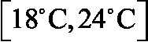
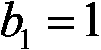
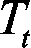
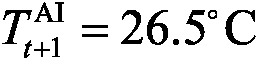
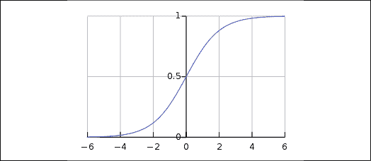
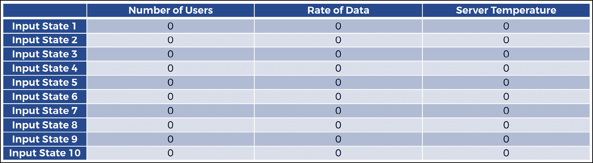
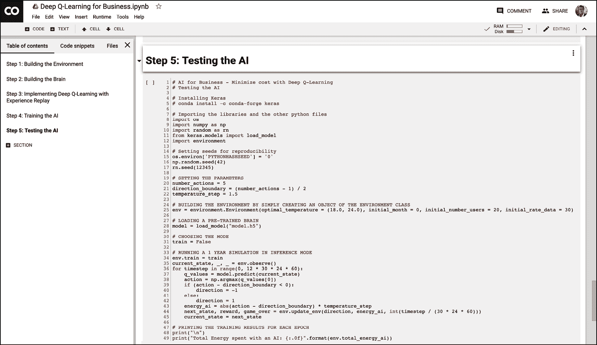

# 第十一章：AI 在商业中的应用 – 通过深度 Q 学习最小化成本

你能用深度 Q 学习模型来构建一辆自动驾驶汽车真是太棒了。真的，再次祝贺你。但我也希望你能用深度 Q 学习来解决现实世界的商业问题。通过这个下一个应用，你将完全准备好通过利用 AI 为你的工作或商业增加价值。尽管我们再次使用了一个具体应用，但这一章将为你提供一个通用的 AI 框架，一个包含你在用深度 Q 学习解决现实世界问题时必须遵循的一般步骤的蓝图。本章对你和你的职业生涯都非常重要；我不希望你在掌握这里学到的技能之前就把这本书合上。让我们一起冲破这个下一个应用吧！

## 要解决的问题

当我说我们要解决一个现实世界的商业问题时，我并没有夸大其词；我们将通过深度 Q 学习来解决的问题与以下问题非常相似，且该问题已经在现实世界中通过深度 Q 学习得以解决。

在 2016 年，DeepMind AI 通过使用其 DQN AI 模型（深度 Q 学习）将 Google 数据中心的冷却费用减少了 40%，从而大大减少了 Google 的年度开支。请查看此链接：

[`deepmind.com/blog/deepmind-ai-reduces-google-data-centre-cooling-bill-40`](https://deepmind.com/blog/deepmind-ai-reduces-google-data-centre-cooling-bill-40/)

在这个案例研究中，我们将做类似的事情。我们将搭建自己的服务器环境，并且构建一个 AI 来控制服务器的冷却和加热，使其保持在最佳的温度范围内，同时尽可能节省能源，从而最小化成本。

就像 DeepMind AI 所做的那样，我们的目标将是至少实现 40%的能源节省！你准备好了吗？让我们开始吧！

一如既往，我对你的第一个问题是：我们的第一步是什么？

我相信到此时，我不需要再拼写出答案了。让我们直接开始搭建环境吧！

## 搭建环境

在定义状态、动作和奖励之前，我们需要搭建服务器并解释其操作方式。我们将分几步完成：

1.  首先，我们将列出所有控制服务器的环境参数和变量。

1.  之后，我们将设定问题的基本假设，你的 AI 将依赖这些假设来提供解决方案。

1.  然后，我们将指定如何模拟整个过程。

1.  最后，我们将解释服务器的整体工作原理，以及 AI 如何发挥作用。

### 服务器环境的参数和变量

这是服务器环境中所有固定值参数的列表：

1.  每个月的平均大气温度。

1.  服务器的最佳温度范围，我们将其设置为 。

1.  最低温度，低于该温度服务器将无法正常运行，我们将其设置为 。

1.  服务器无法正常运行的最高温度，我们将其设置为！[](img/B14110_11_003.png)。

1.  服务器的最小用户数量，我们将其设置为 10。

1.  服务器的最大用户数量，我们将其设置为 100。

1.  服务器每分钟用户数量的最大变化值，我们将其设置为 5；因此每分钟，服务器的用户数量最多只能变化增加 5 或减少 5。

1.  服务器的最小数据传输速率，我们将其设置为 20。

1.  服务器的最大数据传输速率，我们将其设置为 300。

1.  数据传输速率每分钟的最大变化值，我们将其设置为 10；因此每分钟，数据传输速率只能在任一方向上变化最多 10。

接下来，我们将列出服务器环境中所有的变量，这些变量的值会随时间波动：

1.  给定时刻服务器的温度。

1.  给定时刻连接到服务器的用户数量。

1.  给定时刻的数据传输速率。

1.  AI 在给定时刻向服务器所消耗的能量（用于冷却或加热）。

1.  服务器的集成冷却系统所消耗的能量，以自动将服务器温度恢复到最佳范围内，每当服务器温度超出这个最佳范围时。此举旨在跟踪**非 AI**系统所使用的能量，以便与我们的 AI 系统进行比较。

所有这些参数和变量都将成为环境的一部分，并将影响我们 AI 的行为。

接下来，我们将解释环境的两个核心假设。需要理解的是，这些假设与 AI 无关，而是用来简化环境，使我们能够专注于创建一个功能性 AI 解决方案。

### 服务器环境的假设

我们将依赖以下两个关键假设：

#### 假设 1 – 我们可以近似服务器温度

服务器的温度可以通过多元线性回归来近似，即通过大气温度、用户数量和数据传输速率的线性函数来近似，如下所示：

*服务器温度* =  +  *大气温度* +  *用户数量* +  *数据传输速率*

其中！[](img/B14110_11_008.png)、！[](img/B14110_11_009.png)、！[](img/B14110_11_010.png) 和！[](img/B14110_11_011.png)。

这个假设的存在意义以及为什么 ，，和  是直观易懂的原因。可以理解的是，当大气温度升高时，服务器的温度也会升高。连接到服务器的用户越多，服务器需要花费更多的能量来处理它们，因此服务器的温度会更高。最后，服务器内部传输的数据越多，服务器需要花费更多的能量来处理这些数据，因此服务器的温度也会更高。

为了简化起见，我们可以假设这些相关性是线性的。然而，您完全可以假设它们是二次或对数的，并相应地修改代码来反映这些方程式。这只是我对虚拟服务器环境的模拟；您可以根据需要进行调整！

假设在执行此多元线性回归后，我们得到了以下系数值：，，，以及。因此：

*服务器温度* = *大气温度* +  *用户数量* +  *数据传输速率*

现在，如果我们在现实生活中面对这个问题，我们可以获取服务器温度的数据集，并直接计算这些值。在这里，我们只是假设一些易于编码和理解的值，因为本章的目标不是完美地模拟一个真实服务器，而是通过人工智能的步骤解决一个现实世界的问题。

#### 假设 2 – 我们可以近似计算能源成本

任何冷却系统（无论是我们的 AI 还是我们与之对比的服务器集成冷却系统）在 1 个时间单位内（在我们这里是 1 分钟）将服务器温度从  变化到  所消耗的能量，可以通过回归近似为一个服务器绝对温度变化的线性函数，如下所示：


其中：

1.   是系统在时间  和  分钟之间消耗的能量。

1.   是由系统引起的服务器温度变化，在时间  和  分钟之间。

1.   是时间  分钟时服务器的温度。

1.   是在时间  分钟时服务器的温度。

1.  。

1.  。

让我们用来解释为什么这个假设在直观上是合理的。这仅仅是因为，AI 或传统的集成冷却系统越是加热或冷却服务器，它所花费的能量越多，才能实现那个热量转移。

例如，假设服务器突然出现过热问题，温度已经达到了C；那么在一个时间单位（1 分钟）内，任何系统都需要更多的能量才能将服务器的温度从过高温度恢复到其最佳温度C，而不是将其恢复到C。

为了简化起见，在这个例子中我们假设这些相关性是线性的，而不是从真实数据集中计算出实际值。如果你在想为什么我们取绝对值，那是因为当 AI 冷却服务器时，，因此！[](img/B14110_11_041.png)。由于能量消耗总是正数，我们必须取的绝对值。

牢记我们想要的简化假设，我们假设回归结果为和，因此我们根据*假设 2*得出以下最终方程：


因此：

，也就是说，如果服务器被加热，

，也就是说，如果服务器被冷却。

现在我们已经覆盖了假设，接下来让我们解释如何模拟服务器的运行，用户登录与退出，以及数据的进出。

### 仿真

用户数量和数据传输速率将会随机波动，以模拟实际服务器中不可预测的用户活动和数据需求。这导致了温度的随机性。AI 需要学习它应该向服务器传输多少冷却或加热能量，以避免服务器性能恶化，同时通过优化热量转移来尽可能减少能量消耗。

现在我们已经有了完整的图景，接下来我将解释在这个环境下服务器和 AI 的整体功能。

### 整体功能

在数据中心内，我们处理的是一个特定的服务器，这个服务器由之前列出的参数和变量控制。每分钟，都会有一些新用户登录到服务器，也会有一些当前用户退出服务器，因此更新服务器中活动用户的数量。同时，每分钟会有一些新的数据传输到服务器，也会有一些现有数据从服务器传出，从而更新服务器内部的数据传输速率。

因此，基于之前给出的*假设 1*，服务器的温度每分钟更新一次。现在请集中注意力，因为在这里你将理解到 AI 在服务器中所扮演的重要角色。

有两种可能的系统可以调节服务器的温度：AI 或服务器的集成冷却系统。服务器的集成冷却系统是一个没有智能的系统，会自动将服务器的温度带回其最佳温度范围。

每分钟，服务器的温度会被更新。如果服务器使用集成冷却系统，该系统会观察发生了什么；这个更新可能会使温度保持在最佳温度范围内（），或者将其推移到这个范围之外。如果它超出了最佳范围，例如达到C，服务器的集成冷却系统会自动将温度带回最佳范围的最近边界，在此案例中是C。为了我们的模拟假设，不管温度变化有多大，我们假设集成冷却系统可以在不到一分钟的时间内将其恢复到最佳范围。这显然是一个不现实的假设，但本章的目的是让你构建一个能解决问题的功能性 AI，而不是完美地模拟真实服务器的热力学。一旦我们一起完成这个示例，我强烈建议你修改代码并尝试让它更现实；目前，为了简化问题，我们将相信这个神奇有效的集成冷却系统。

如果服务器改为使用 AI，那么服务器的集成冷却系统将被禁用，由 AI 本身来更新服务器的温度，以最佳方式进行调节。AI 在进行一些先前预测后改变温度，而不是像没有智能的集成冷却系统那样以完全确定的方式改变温度。在更新用户数量和数据传输速率之前，AI 会预测是否应该降温、什么都不做，或者加热服务器，并进行相应的操作。然后温度变化发生，AI 会重新迭代。

由于这两个系统彼此独立，我们可以单独评估它们以比较性能；训练或运行 AI 时，我们可以跟踪在相同情况下集成冷却系统所消耗的能量。

这就引出了能量问题。记住，AI 的一个主要目标是降低运行服务器的能量成本。因此，我们的 AI 必须尽量使用比没有智能的冷却系统在服务器上使用的能量更少。由于根据前面的*假设 2*，服务器上花费的能量（无论是哪个系统）与单位时间内的温度变化成正比：


因此：

，也就是说，如果服务器加热，

，也就是说，如果服务器降温，

那么这意味着 AI 在每次迭代 （每分钟）节省的能量等于由非智能服务器的集成冷却系统与 AI 之间在服务器中造成的温度绝对变化的差异，从  到 ：

AI 在  和  之间节省的能量


其中：

1.   是服务器集成冷却系统在迭代  期间在服务器中造成的温度变化，即从  到  分钟。

1.   是 AI 在迭代  期间在服务器中造成的温度变化，即从  到  分钟。

AI 的目标是每分钟尽可能节省能源，从而在 1 年的模拟中节省最大总能量，并最终帮助企业在冷却/加热电费上节省最大成本。这就是我们在 21 世纪做生意的方式；有了 AI！

现在我们已经完全理解了服务器环境的工作方式，以及它是如何被模拟的，接下来是定义 AI 环境时绝对必须做的事情。你已经知道接下来的步骤：

1.  定义状态。

1.  定义动作。

1.  定义奖励。

### 定义状态

记住，当你进行深度 Q 学习时，输入状态总是一个 1D 向量。（除非你在进行深度卷积 Q 学习，在这种情况下，输入状态是一个 2D 图像，但那是另一个话题！等到*第十二章*，*深度卷积 Q 学习*再说）。那么，在这个服务器环境中，输入状态向量是什么？它将包含哪些信息，才能充分描述环境的每一个状态？这些是你在建模 AI 问题并构建环境时必须问自己的问题。试着先自己回答这些问题，找出在这种情况下的输入状态向量，接下来你可以看看我们在下一段中使用了什么。提示：再看一下前面定义的变量。

输入状态  在时间  由以下三个元素组成：

1.  在时间  服务器的温度

1.  在时间  服务器中的用户数量

1.  在时间  服务器中的数据传输速率

因此，输入状态将是这三个元素的输入向量。我们未来的 AI 将以这个向量作为输入，并会在每个时刻返回一个动作 。说到动作，它们将是什么？我们一起来看看。

### 定义动作

为了确定需要执行哪些动作，我们需要记住目标，即最优调节服务器温度。动作简单来说就是 AI 能够在服务器内部引起的温度变化，用以加热或冷却服务器。在深度 Q 学习中，动作必须是离散的；它们不能从一个范围中选取，我们需要一个明确数量的可能动作。因此，我们将考虑五个可能的温度变化，从C 到C，这样我们就得到了 AI 可以用来调节服务器温度的五个可能动作：


图 1：定义动作

太好了。最后，让我们看看如何对 AI 进行奖励和惩罚。

### 定义奖励

你可能已经从之前的*总体功能*部分猜到奖励是什么。在迭代时，奖励是 AI 节省的能量，具体是相对于服务器集成冷却系统本应消耗的能量；也就是说，AI 关闭时非智能冷却系统本应消耗的能量与 AI 为服务器所消耗的能量之间的差异：


由于根据*假设 2*，所消耗的能量等于服务器中温度变化所引起的能量变化（无论是由任何系统引起，包括 AI 或非智能冷却系统）：


因此：

，如果服务器加热，

，如果服务器被冷却，

然后我们在时刻收到奖励，奖励是服务器中温度变化的差异，比较非智能冷却系统（即没有 AI 的情况下）与 AI 的效果：

AI 在和之间节省的能量


其中：

1.  是服务器集成冷却系统在迭代期间对服务器造成的温度变化，即从到分钟。

1.  是 AI 在迭代期间对服务器造成的温度变化，即从到分钟。

**重要说明**：需要理解的是，系统（我们的 AI 和服务器的集成冷却系统）将被单独评估，以计算奖励。由于每个时刻，两个不同系统的行为会导致不同的温度，我们必须分别记录这两个温度，分别为和。换句话说，我们正在同时进行两个独立的模拟，跟踪用户和数据的波动；一个是 AI 的，另一个是服务器集成冷却系统的。

为了完成这一部分，我们将做一个小的模拟，模拟 2 次迭代（即 2 分钟），作为示例来使一切更加清晰。

### 最终模拟示例

假设现在是下午，服务器的温度是℃，无论有无 AI，情况都一样。在这个确切的时刻，AI 会预测一个动作：0、1、2、3 或 4。由于此时服务器的温度已经超出了最佳温度范围，因此 AI 很可能会预测动作 0、1 或 2。假设它预测的是 1，这意味着将服务器温度降至℃。因此，在下午到之间，AI 将服务器的温度从调整到：


因此，根据*假设 2*，AI 对服务器消耗的能量为：


现在，计算奖励时只缺少一个信息：如果在下午 4:00 到 4:01 之间 AI 被停用，服务器的集成冷却系统将消耗多少能量。请记住，这个非智能冷却系统会自动将服务器的温度调整到最佳温度范围的最接近边界。由于在下午时，温度为℃，因此当时最佳温度范围的最接近边界为℃。因此，服务器的集成冷却系统将温度从调整到，如果没有 AI，服务器温度的变化为：


根据*假设 2*，如果没有 AI，非智能冷却系统所消耗的能量为：


总结来说，AI 在下午进行这一动作后获得的奖励为：


我相信你已经注意到，当前我们的 AI 系统并未涉及服务器的最佳温度范围；正如我之前提到的，所有内容都来自于奖励，而 AI 在最佳温度范围内并不会获得奖励，也不会因超出范围而受到惩罚。一旦我们完全构建了 AI，我建议你可以尝试修改代码，添加一些奖励或惩罚机制，让 AI 尽可能保持在最佳温度范围内；但现在，为了简化操作并让我们的 AI 正常运行，我们将奖励完全与节省的能量挂钩。

然后，在 pm 到 pm 之间，会发生一些新变化：一些新用户登录到服务器，一些现有用户登出，新的数据传输进服务器，已有的数据传输出服务器。根据*假设 1*，这些因素使得服务器的温度发生变化。假设总的来说，它们将服务器的温度提高了C：


现在，请记住我们分别评估两个系统：我们的 AI 和服务器的集成冷却系统。因此，我们必须分别计算这两个系统在 pm 时得到的温度，假设这两个系统互不干扰。我们先从 AI 开始。

当 AI 启用时，在 pm 时我们得到的温度是：


如果 AI 未启用，那么在 pm 时我们得到的温度是：


现在我们有了两个独立的温度，当 AI 启用时，温度为= 31.5°C，当 AI 未启用时，温度为= 29°C。

让我们模拟一下 pm 到 pm 之间会发生什么。再次强调，我们的 AI 将做出预测，假设服务器正在升温，那么它预测执行动作 0，也就是让服务器降温，降至。因此，AI 在 pm 到 pm 之间消耗的能量是：


现在关于服务器的集成冷却系统（即当没有 AI 时），由于在 pm 时我们有，因此最佳温度范围的最近边界仍然是，所以服务器的非智能冷却系统在 pm 到 pm 之间将消耗的能量是：


因此，在！[](img/B14110_11_166.png) 下午和！[](img/B14110_11_167.png) 下午之间获得的奖励，仅仅完全基于节省的能量，计算结果为：


最后，在！[](img/B14110_11_172.png) 下午和！[](img/B14110_11_173.png) 下午之间获得的总奖励是：


这是整个过程发生两分钟的一个示例。在我们的实现中，我们将对训练进行 1000 个周期，每个周期为 5 个月；然后，一旦我们的 AI 训练完成，我们将在 1 年的完整模拟中运行相同的过程进行测试。

现在我们已经详细定义并构建了环境，是时候让我们的 AI 采取行动了！这就是深度 Q 学习发挥作用的地方。我们的模型将比之前的模型更先进，因为我将引入一些新的技巧，称为**dropout**（丢弃法）和**early stopping**（提前停止），这些都是非常棒的技巧，可以成为你工具包中的一部分；它们通常会提升深度 Q 学习的训练性能。

别忘了，你还会获得一个 AI 蓝图，它将允许你将我们在这里所做的应用到任何其他业务问题，使用深度 Q 学习来解决。

准备好了吗？让我们开始吧。

## AI 解决方案

让我们首先回顾一下整个深度 Q 学习模型，并将其适应到这个案例研究中，这样你就不需要滚动或者翻回前面的章节了。重复永远没有坏处，它能帮助我们将知识牢牢地记在脑海中。这里是你再次看到的深度 Q 学习算法：

初始化：

1.  经验回放的记忆初始化为空列表，在代码中称为`memory`（位于 GitHub 仓库的`Chapter 11`文件夹中的`dqn.py` Python 文件）。

1.  我们为记忆选择一个最大大小，在代码中称为`max_memory`（位于 GitHub 仓库的`Chapter 11`文件夹中的`dqn.py` Python 文件）。

在每个时间点`t`（每分钟），我们重复以下过程，直到周期结束：

1.  我们预测当前状态的 Q 值！[](img/B14110_11_178.png)。由于可以执行五种动作（0 == 降温 3°C，1 == 降温 1.5°C，2 == 无热传递，3 == 加热 1.5°C，4 == 加热 3°C），我们会得到五个预测 Q 值。

1.  我们执行通过 argmax 方法选择的动作，这个方法简单地选择具有五个预测 Q 值中最高值的动作：

1.  我们获得了奖励！[](img/B14110_11_180.png)，它是差值！[](img/B14110_11_181.png)。

1.  我们达到了下一个状态！[](img/B14110_07_0452.png)，它由以下三个元素组成：

    +   服务器在时间点！[](img/B14110_11_183.png)时的温度

    +   服务器中用户的数量在时间点！[](img/B14110_11_094.png)

    +   服务器在时间的数据显示传输速率

1.  我们将过渡过程附加到内存中。

1.  我们随机选择一批过渡！[](img/B14110_11_187.png)。对于随机批次中的所有过渡！[](img/B14110_11_188.png)：

    +   我们获得预测值：

    +   我们获得目标：

    +   我们计算预测值和目标值之间的损失，涵盖整个批次！[](img/B14110_11_192.png):

然后我们最终通过反向传播将这个损失误差传递回神经网络，并通过随机梯度下降，根据它们对损失误差的贡献程度更新权重。

希望复习一下让你耳目一新！让我们继续谈谈这个系统的大脑。

### 大脑

所谓大脑，当然是指我们的 AI 的人工神经网络。

我们的大脑将是一个全连接神经网络，包含两层隐藏层，第一层有 64 个神经元，第二层有 32 个神经元。提醒一下，这个神经网络的输入是环境的状态，输出是每个可能动作的 Q 值。

这种神经网络设计，分别有 64 和 32 个神经元的两层隐藏层，通常被认为是**经典**架构。它适用于解决许多问题，并且在这里会很好地工作。

这个人工大脑将使用**均方误差**（**MSE**）损失和`Adam`优化器进行训练。选择 MSE 损失是因为我们想要衡量并减少预测值和目标值之间的平方差，而`Adam`优化器是实践中默认使用的经典优化器。

这是这个人工大脑的样子：


图 2：我们 AI 的人工大脑

这个人工大脑看起来很复杂，但得益于强大的 Keras 库，我们可以非常轻松地构建它。在上一章中，我们使用了 PyTorch，因为它是我更熟悉的神经网络库；但我希望你能尽可能多地使用 AI 工具，所以在这一章中，我们将使用 Keras。以下是完整实现的预览，其中包含构建这个大脑的部分（来自`brain_nodropout.py`文件）：

```py
# BUILDING THE BRAIN
class Brain(object):

    # BUILDING A FULLY CONNECTED NEURAL NETWORK DIRECTLY INSIDE THE INIT METHOD

    def __init__(self, learning_rate = 0.001, number_actions = 5):
        self.learning_rate = learning_rate

        # BUILDING THE INPUT LAYER COMPOSED OF THE INPUT STATE
        states = Input(shape = (3,))

        # BUILDING THE FULLY CONNECTED HIDDEN LAYERS
        x = Dense(units = 64, activation = 'sigmoid')(states)
        y = Dense(units = 32, activation = 'sigmoid')(x)

        # BUILDING THE OUTPUT LAYER, FULLY CONNECTED TO THE LAST HIDDEN LAYER
        q_values = Dense(units = number_actions, activation = 'softmax')(y)

        # ASSEMBLING THE FULL ARCHITECTURE INSIDE A MODEL OBJECT
        self.model = Model(inputs = states, outputs = q_values)

        # COMPILING THE MODEL WITH A MEAN-SQUARED ERROR LOSS AND A CHOSEN OPTIMIZER
        self.model.compile(loss = 'mse', optimizer = Adam(lr = learning_rate)) 
```

如你所见，这仅仅需要几行代码，我会在后续章节中逐行解释这段代码。现在让我们继续实现部分。

### 实现

该实现将分为五个部分，每个部分都有其独立的 Python 文件。你可以在 GitHub 仓库的`Chapter 11`文件夹中找到完整的实现。这五个部分构成了通用的 AI 框架，或者称为 AI 蓝图，应该在每次建立环境来解决深度强化学习的业务问题时遵循。

从步骤 1 到步骤 5，它们是这样的：

+   **步骤 1**：构建环境（`environment.py`）

+   **步骤 2**：构建大脑（`brain_nodropout.py` 或 `brain_dropout.py`）

+   **步骤 3**：实现深度强化学习算法，在我们的案例中是深度 Q 学习模型（`dqn.py`）

+   **步骤 4**：训练 AI（`training_noearlystopping.py` 或 `training_earlystopping.py`）

+   **步骤 5**：测试 AI（`testing.py`）

按顺序，这些是通用 AI 框架的主要步骤。

我们将遵循这个 AI 蓝图，在接下来的五个部分中为我们的特定案例实现 AI，每个部分对应以下五个主要步骤。在每个步骤中，我们将通过将通用 AI 框架的所有子步骤的代码部分标题写成大写字母，来区分那些仍然属于通用 AI 框架的子步骤与那些特定于我们项目的子步骤，将后者的标题写成小写字母。

这意味着，每当你看到一个新的代码部分，其中标题是大写字母时，它就是通用 AI 框架的下一个子步骤，在为你自己业务问题构建 AI 时，你也应该遵循这一点。

下一步，构建环境，是这个项目中最大的 Python 实现文件。确保你已经休息好了，电量充足，一旦准备好，让我们一起解决这个问题！

### 步骤 1 – 构建环境

在第一步中，我们将把环境构建成一个类。为什么选择类？因为我们希望环境成为一个对象，可以轻松地通过选择一些参数的值来创建。

例如，我们可以为一台服务器创建一个环境对象，这台服务器在特定时间有一定数量的连接用户和一定的数据传输速率；同时为另一台服务器创建一个环境对象，这台服务器有不同数量的连接用户和不同的数据传输速率。得益于该类的先进结构，我们可以轻松地将我们在不同服务器上创建的环境对象进行即插即用，这些服务器有各自的参数，通过多个不同的 AI 来调节它们的温度，从而最小化整个数据中心的能耗，就像 Google DeepMind 使用其 DQN（深度 Q 学习）算法为 Google 的数据中心做的那样。

该类遵循以下子步骤，这些步骤属于步骤 1 – 构建环境中的通用 AI 框架：

+   **步骤 1-1**：介绍并初始化环境的所有参数和变量。

+   **步骤 1-2**：创建一个方法，在 AI 执行一个动作后更新环境。

+   **步骤 1-3**：创建一个重置环境的方法。

+   **步骤 1-4**：创建一个方法，随时向我们提供当前状态、最后获得的奖励以及游戏是否结束。

你将在本节中找到整个`Environment`类的实现。记住最重要的事情：所有标题为大写字母的代码部分都是通用 AI 框架/蓝图的步骤，而所有标题为小写字母的代码部分则是我们案例研究的具体实现。

环境实现代码共有 144 行。我不会逐行解释代码，原因有两个：

1.  这会让本章内容显得非常繁重。

1.  代码非常简单，并且已经进行了注释以提高清晰度，基本上是创建了我们在本章迄今为止定义的所有内容。

我相信你理解起来不会有问题。除此之外，代码段的标题和所选的变量名称已经足够清晰，能够让你从表面上就理解代码的结构和流程。我将简要介绍一下代码，开始吧！

首先，我们开始构建`Environment`类，并定义它的第一个方法，即`__init__`方法，该方法会引入并初始化我们之前提到的所有参数和变量：

```py
# BUILDING THE ENVIRONMENT IN A CLASS
class Environment(object):

    # INTRODUCING AND INITIALIZING ALL THE PARAMETERS AND VARIABLES OF THE ENVIRONMENT

    def __init__(self, optimal_temperature = (18.0, 24.0), initial_month = 0, initial_number_users = 10, initial_rate_data = 60):
        self.monthly_atmospheric_temperatures = [1.0, 5.0, 7.0, 10.0, 11.0, 20.0, 23.0, 24.0, 22.0, 10.0, 5.0, 1.0]
        self.initial_month = initial_month
        self.atmospheric_temperature = self.monthly_atmospheric_temperatures[initial_month]
        self.optimal_temperature = optimal_temperature
        self.min_temperature = -20
        self.max_temperature = 80
        self.min_number_users = 10
        self.max_number_users = 100
        self.max_update_users = 5
        self.min_rate_data = 20
        self.max_rate_data = 300
        self.max_update_data = 10
        self.initial_number_users = initial_number_users
        self.current_number_users = initial_number_users
        self.initial_rate_data = initial_rate_data
        self.current_rate_data = initial_rate_data
        self.intrinsic_temperature = self.atmospheric_temperature + 1.25 * self.current_number_users + 1.25 * self.current_rate_data
        self.temperature_ai = self.intrinsic_temperature
        self.temperature_noai = (self.optimal_temperature[0] + self.optimal_temperature[1]) / 2.0
        self.total_energy_ai = 0.0
        self.total_energy_noai = 0.0
        self.reward = 0.0
        self.game_over = 0
        self.train = 1 
```

你会注意到`self.monthly_atmospheric_temperatures`变量，它是一个列表，包含了 12 个月份的平均大气温度：1 月为 1°C，2 月为 5°C，3 月为 7°C，依此类推。

`self.atmospheric_temperature`变量表示当前模拟月份的平均大气温度，它被初始化为初始月份的气温，我们稍后会将其设置为 1 月。

`self.game_over`变量告诉 AI 是否需要重置服务器温度，防止其超过允许的范围[-20°C, 80°C]。如果超过范围，`self.game_over`将被设置为 1，否则保持为 0。

最后，`self.train`变量告诉我们当前是处于训练模式还是推理模式。如果是训练模式，`self.train = 1`；如果是推理模式，`self.train = 0`。剩下的代码就是将本章开头所定义的所有内容实现成代码。

我们继续！

现在，我们来定义第二个方法`update_env`，它在 AI 执行某个操作后更新环境。这个方法有三个输入参数：

1.  `direction`：描述 AI 对服务器施加的热量传输方向的变量，像这样：如果`direction == 1`，则表示 AI 在加热服务器；如果`direction == -1`，则表示 AI 在冷却服务器。我们需要在调用`update_env`方法之前获取这个方向的值，因为该方法是在操作执行后调用的。

1.  `energy_ai`：AI 在执行动作时，所消耗的能量，用来加热或冷却服务器。根据假设 2，它等于 AI 在服务器中引起的温度变化。

1.  `month`：表示在执行动作时我们所在的月份。

程序在此方法内执行的第一步是计算奖励。实际上，在执行动作后，我们可以立即推断出奖励，因为它是服务器集成系统在没有 AI 的情况下消耗的能量与 AI 实际消耗的能量之间的差异：

```py
 # MAKING A METHOD THAT UPDATES THE ENVIRONMENT RIGHT AFTER THE AI PLAYS AN ACTION

    def update_env(self, direction, energy_ai, month):

        # GETTING THE REWARD

        # Computing the energy spent by the server's cooling system when there is no AI
        energy_noai = 0
        if (self.temperature_noai < self.optimal_temperature[0]):
            energy_noai = self.optimal_temperature[0] - self.temperature_noai
            self.temperature_noai = self.optimal_temperature[0]
        elif (self.temperature_noai > self.optimal_temperature[1]):
            energy_noai = self.temperature_noai - self.optimal_temperature[1]
            self.temperature_noai = self.optimal_temperature[1]
        # Computing the Reward
        self.reward = energy_noai - energy_ai
        # Scaling the Reward
        self.reward = 1e-3 * self.reward 
```

你可能已经注意到，我们选择在最后对奖励进行缩放。简而言之，缩放是将数值（这里是奖励）缩小到一个较小的范围。例如，归一化是一种缩放技术，其中所有值都缩小到 0 和 1 之间的范围。另一种广泛使用的缩放技术是标准化，这将在稍后解释。

缩放是深度强化学习研究论文中通常推荐的一种常见做法，因为它可以稳定训练并提高 AI 性能。

在获得奖励后，我们进入下一个状态。记住，每个状态由以下元素组成：

1.  服务器在时间点的温度 

1.  服务器在时间点的用户数量 

1.  服务器在时间点的数据传输速率 

所以，当我们进入下一个状态时，我们逐个更新这些元素，遵循下一段代码中的注释部分所强调的子步骤：

```py
 # GETTING THE NEXT STATE

        # Updating the atmospheric temperature
        self.atmospheric_temperature = self.monthly_atmospheric_temperatures[month]
        # Updating the number of users
        self.current_number_users += np.random.randint(-self.max_update_users, self.max_update_users)
        if (self.current_number_users > self.max_number_users):
            self.current_number_users = self.max_number_users
        elif (self.current_number_users < self.min_number_users):
            self.current_number_users = self.min_number_users
        # Updating the rate of data
        self.current_rate_data += np.random.randint(-self.max_update_data, self.max_update_data)
        if (self.current_rate_data > self.max_rate_data):
            self.current_rate_data = self.max_rate_data
        elif (self.current_rate_data < self.min_rate_data):
            self.current_rate_data = self.min_rate_data
        # Computing the Delta of Intrinsic Temperature
        past_intrinsic_temperature = self.intrinsic_temperature
        self.intrinsic_temperature = self.atmospheric_temperature + 1.25 * self.current_number_users + 1.25 * self.current_rate_data
        delta_intrinsic_temperature = self.intrinsic_temperature - past_intrinsic_temperature
        # Computing the Delta of Temperature caused by the AI
        if (direction == -1):
            delta_temperature_ai = -energy_ai
        elif (direction == 1):
            delta_temperature_ai = energy_ai
        # Updating the new Server's Temperature when there is the AI
        self.temperature_ai += delta_intrinsic_temperature + delta_temperature_ai
        # Updating the new Server's Temperature when there is no AI
        self.temperature_noai += delta_intrinsic_temperature 
```

然后，如果需要，我们更新 `self.game_over` 变量，也就是说，如果服务器的温度超出允许的范围 [-20°C, 80°C]，则会发生这种情况。如果服务器温度低于最低温度 -20°C，或者高于最高温度 80°C，就会出现这种情况。此外，我们还做了两件事：将服务器温度恢复到最佳温度范围内（最接近的边界），并且由于此操作会消耗一些能量，我们更新了 AI 消耗的总能量（`self.total_energy_ai`）。这正是下一段代码所实现的内容：

```py
 # GETTING GAME OVER

        if (self.temperature_ai < self.min_temperature):
            if (self.train == 1):
                self.game_over = 1
            else:
                self.total_energy_ai += self.optimal_temperature[0] - self.temperature_ai
                self.temperature_ai = self.optimal_temperature[0]
        elif (self.temperature_ai > self.max_temperature):
            if (self.train == 1):
                self.game_over = 1
            else:
                self.total_energy_ai += self.temperature_ai - self.optimal_temperature[1]
                self.temperature_ai = self.optimal_temperature[1] 
```

现在，我知道对于服务器来说，温度从 80 度迅速降回 24 度，或者从-20 度升到 18 度似乎不太现实，但这是我们之前定义的高效集成冷却系统完全能够做到的动作。可以将其理解为在温度灾难情况下，AI 会短暂切换到集成系统。再次强调，这个领域将从你在 AI 正常运行后继续调试中受益巨大；之后，你可以随意调整这些数值，以便实现更真实的服务器模型。

然后，我们更新来自两个独立仿真模型的两个分数，它们是：

1.  `self.total_energy_ai`：AI 消耗的总能量

1.  `self.total_energy_noai`：当没有 AI 时，服务器集成冷却系统消耗的总能量。

```py
 # UPDATING THE SCORES

        # Updating the Total Energy spent by the AI
        self.total_energy_ai += energy_ai
        # Updating the Total Energy spent by the server's cooling system when there is no AI
        self.total_energy_noai += energy_noai 
```

然后，为了提高性能，我们通过对下一个状态的三个元素（服务器温度、用户数量和数据传输率）进行缩放来进行标准化处理。具体做法是通过简单的标准化缩放技术，即先减去变量的最小值，再除以变量的最大变化量：

```py
 # SCALING THE NEXT STATE

        scaled_temperature_ai = (self.temperature_ai - self.min_temperature) / (self.max_temperature - self.min_temperature)
        scaled_number_users = (self.current_number_users - self.min_number_users) / (self.max_number_users - self.min_number_users)
        scaled_rate_data = (self.current_rate_data - self.min_rate_data) / (self.max_rate_data - self.min_rate_data)
        next_state = np.matrix([scaled_temperature_ai, scaled_number_users, scaled_rate_data]) 
```

最后，我们通过返回下一个状态、收到的奖励以及游戏是否结束，来结束这个`update_env`方法：

```py
 # RETURNING THE NEXT STATE, THE REWARD, AND GAME OVER

        return next_state, self.reward, self.game_over 
```

很好！我们完成了这个冗长但重要的方法，它会在每个时间步（每分钟）更新环境。现在只剩下两个最终且非常简单的方法：一个是重置环境，另一个是随时提供三项信息：当前状态、上次收到的奖励以及游戏是否结束。

这是`reset`方法，它会在新的训练回合开始时重置环境，将环境的所有变量恢复到最初初始化的值：

```py
 # MAKING A METHOD THAT RESETS THE ENVIRONMENT

    def reset(self, new_month):
        self.atmospheric_temperature = self.monthly_atmospheric_temperatures[new_month]
        self.initial_month = new_month
        self.current_number_users = self.initial_number_users
        self.current_rate_data = self.initial_rate_data
        self.intrinsic_temperature = self.atmospheric_temperature + 1.25 * self.current_number_users + 1.25 * self.current_rate_data
        self.temperature_ai = self.intrinsic_temperature
        self.temperature_noai = (self.optimal_temperature[0] + self.optimal_temperature[1]) / 2.0
        self.total_energy_ai = 0.0
        self.total_energy_noai = 0.0
        self.reward = 0.0
        self.game_over = 0
        self.train = 1 
```

最后，这是`observe`方法，它让我们随时知道当前状态、上次收到的奖励以及游戏是否结束：

```py
 # MAKING A METHOD THAT GIVES US AT ANY TIME THE CURRENT STATE, THE LAST REWARD AND WHETHER THE GAME IS OVER

    def observe(self):
        scaled_temperature_ai = (self.temperature_ai - self.min_temperature) / (self.max_temperature - self.min_temperature)
        scaled_number_users = (self.current_number_users - self.min_number_users) / (self.max_number_users - self.min_number_users)
        scaled_rate_data = (self.current_rate_data - self.min_rate_data) / (self.max_rate_data - self.min_rate_data)
        current_state = np.matrix([scaled_temperature_ai, scaled_number_users, scaled_rate_data])
        return current_state, self.reward, self.game_over 
```

太棒了！我们完成了实现的第一步——构建环境。现在让我们继续下一步，开始构建大脑。

### 第 2 步——构建大脑

在这一步，我们将构建我们 AI 的人工大脑，它就是一个完全连接的神经网络。再看一遍：


图 3：我们 AI 的人工大脑

我们将把这个人工大脑构建在一个类里，原因和之前一样，就是为了让我们能够为数据中心内的不同服务器创建多个人工大脑。也许有些服务器需要不同的人工大脑，并且具有不同的超参数。这就是为什么，通过这个类/对象的高级 Python 结构，我们可以轻松地从一个大脑切换到另一个大脑，以调节需要不同神经网络参数的新服务器的温度。这就是**面向对象编程**（**OOP**）的魅力所在。

我们正在使用强大的 Keras 库来构建这个人工大脑。在这个库中，我们使用`Dense()`类来创建两个完全连接的隐藏层，第一个隐藏层有 64 个神经元，第二个隐藏层有 32 个神经元。记住，这是一个经典的神经网络架构，通常作为默认结构使用，也是许多研究论文中看到的常见做法。最后，我们再次使用`Dense()`类返回 Q 值，这些是人工神经网络的输出。

以后，当我们编写训练和测试文件时，我们将使用 argmax 方法选择具有最大 Q 值的动作。然后，通过创建一个`Model()`类对象来组装大脑的所有组件，包括输入和输出（这非常有用，因为我们可以保存和加载具有特定权重的模型）。最后，我们将其与均方误差损失和 Adam 优化器一起编译。稍后我会详细解释这一切。

以下是通用 AI 框架的新步骤：

+   **步骤 2-1**：构建输入层，由输入状态组成。

+   **步骤 2-2**：构建一定数量的隐藏层，每个隐藏层包含一定数量的神经元，并与输入层以及彼此之间全连接。

+   **步骤 2-3**：构建输出层，完全连接到最后一个隐藏层。

+   **步骤 2-4**：将完整架构组装到一个模型对象中。

+   **步骤 2-5**：使用均方误差损失函数和所选优化器编译模型。

该实现以两种不同文件的形式提供给你：

1.  `brain_nodropout.py`：一个实现文件，使用没有 dropout 正则化技术的人工神经网络（我很快会解释它是什么）。

1.  `brain_dropout.py`：一个实现文件，使用 dropout 正则化技术构建人工神经网络。

首先，给你提供没有 dropout 的实现，然后再提供带有 dropout 的实现并解释它。

#### 没有 dropout

这是没有任何 dropout 正则化技术的人工神经网络完整实现：

```py
# AI for Business - Minimize cost with Deep Q-Learning   #1
# Building the Brain without Dropout   #2
#3
# Importing the libraries   #4
from keras.layers import Input, Dense   #5
from keras.models import Model   #6
from keras.optimizers import Adam   #7
   #8
# BUILDING THE BRAIN   #9
   #10
class Brain(object):   #11
    #12
    # BUILDING A FULLY CONNECTED NEURAL NETWORK DIRECTLY INSIDE THE INIT METHOD   #13
    #14
    def __init__(self, learning_rate = 0.001, number_actions = 5):   #15
        self.learning_rate = learning_rate   #16
        #17
        # BUILDING THE INPUT LAYER COMPOSED OF THE INPUT STATE   #18
        states = Input(shape = (3,))   #19
        #20
        # BUILDING THE FULLY CONNECTED HIDDEN LAYERS   #21
        x = Dense(units = 64, activation = 'sigmoid')(states)   #22
        y = Dense(units = 32, activation = 'sigmoid')(x)   #23
        #24
        # BUILDING THE OUTPUT LAYER, FULLY CONNECTED TO THE LAST HIDDEN LAYER   #25
        q_values = Dense(units = number_actions, activation = 'softmax')(y)   #26
        #27
        # ASSEMBLING THE FULL ARCHITECTURE INSIDE A MODEL OBJECT   #28
        self.model = Model(inputs = states, outputs = q_values)   #29
        #30
        # COMPILING THE MODEL WITH A MEAN-SQUARED ERROR LOSS AND A CHOSEN OPTIMIZER   #31
        self.model.compile(loss = 'mse', optimizer = Adam(lr = learning_rate))   #32 
```

现在，让我们详细查看代码。

**第 5 行**：我们从`keras`库的`layers`模块中导入`Input`和`Dense`类。`Input`类允许我们构建输入层，而`Dense`类允许我们构建全连接层。

**第 6 行**：我们从`keras`库的`models`模块中导入`Model`类。它允许我们通过组装不同的层来构建整个神经网络模型。

**第 7 行**：我们从`keras`库的`optimizers`模块中导入`Adam`类。它允许我们使用 Adam 优化器，通过随机梯度下降更新神经网络的权重，在每次训练迭代中反向传播损失误差。

**第 11 行**：我们引入了`Brain`类，它不仅包含人工神经网络的整个架构，还包含模型与损失（均方误差）以及 Adam 优化器的连接。

**第 15 行**：我们引入了`__init__`方法，这将是该类的唯一方法。我们在其中定义了神经网络的整个架构，通过创建连续的变量，这些变量共同组装成神经网络。此方法接受两个参数作为输入：

1.  学习率（`learning_rate`），这是一个衡量你希望神经网络学习速度的指标（学习率越高，神经网络学习越快；但代价是质量下降）。默认值为`0.001`。

1.  `number_actions`（动作数量），当然是指我们的 AI 能执行的动作数。现在你可能在想：为什么我们需要将这个作为参数呢？这只是为了防止你想要构建一个可以执行更多或更少动作的 AI。在这种情况下，你只需要更改参数的值，其他就不需要改动了。相当实用，不是吗？

**第 16 行**：我们为学习率创建一个对象变量，`self.learning_rate`，并初始化为`__init__`方法中提供的`learning_rate`参数的值（因此当我们将来创建`Brain`类的对象时，该参数就会被使用）。

**第 19 行**：我们创建输入状态层，命名为`states`，作为`Input`类的一个对象。我们向这个`Input`类传入一个参数，`shape = (3,)`，这只是说明输入层是一个由三个元素组成的 1D 向量（服务器温度、用户数量和数据传输速率）。

**第 22 行**：我们创建第一个完全连接的隐藏层，命名为`x`，作为`Dense`类的一个对象，它接受两个参数作为输入：

1.  `units`：我们希望在第一个隐藏层中拥有的隐藏神经元数量。在这里，我们选择了 64 个隐藏神经元。

1.  `activation`：前向传播输入到第一个隐藏层时使用的激活函数。这里我们默认选择了 sigmoid 激活函数，其形式如下：



图 4：sigmoid 激活函数

ReLU 激活函数在这里也会非常有效；我鼓励你进行实验！还要注意，输入层到第一个隐藏层的连接是通过在`Dense`类之后调用`states`变量来实现的。

**第 23 行**：我们创建第二个完全连接的隐藏层，命名为`y`，作为`Dense`类的一个对象，它接受相同的两个参数作为输入：

1.  `units`：我们希望在第二个隐藏层中拥有的隐藏神经元数量。这次我们选择了 32 个隐藏神经元。

1.  `activation`：前向传播输入到第一个隐藏层时使用的激活函数。这里，我们再次选择了 sigmoid 激活函数。

再次注意，第一隐藏层到第二隐藏层的连接是通过在`Dense`类之后调用`x`变量来实现的。

**第 26 行**：我们创建输出层，命名为`q_values`，并完全连接到第二个隐藏层，作为`Dense`类的一个对象。这次我们输入`number_actions`个单元，因为输出层包含要执行的动作，并且使用`softmax`激活函数，正如在*第五章*，*你的第一个 AI 模型——警惕“土匪”!*中，关于深度 Q 学习理论的内容所看到的那样。

**第 29 行**：使用 `Model` 类，我们将神经网络的各层串联起来，只需将 `states` 作为输入，`q_values` 作为输出。

**第 32 行**：使用 `Model` 类中的 `compile` 方法，我们将模型连接到均方误差损失函数和 Adam 优化器。后者接受 `learning_rate` 参数作为输入。

#### 使用 dropout

对你来说，添加一个更强大的技术到你的工具箱里会非常有价值：**dropout**。

Dropout 是一种正则化技术，用于防止过拟合，过拟合是指人工智能模型在训练集上表现良好，但在测试集上表现较差的情况。Dropout 通过在每次前向传播和反向传播步骤中禁用随机选择的一部分神经元来实现。这意味着并不是所有的神经元都以相同的方式学习，从而防止了神经网络对训练数据的过拟合。

使用 `keras` 添加 dropout 非常简单。你只需要在 `Dense` 类后面调用 `Dropout` 类，并输入你希望禁用的神经元比例，如下所示：

```py
# AI for Business - Minimize cost with Deep Q-Learning
# Building the Brain with Dropout
# Importing the libraries
from keras.layers import Input, Dense, Dropout
from keras.models import Model
from keras.optimizers import Adam
# BUILDING THE BRAIN
class Brain(object):

    # BUILDING A FULLY CONNECTED NEURAL NETWORK DIRECTLY INSIDE THE INIT METHOD

    def __init__(self, learning_rate = 0.001, number_actions = 5):
        self.learning_rate = learning_rate

        # BUILDING THE INPUT LAYER COMPOSED OF THE INPUT STATE
        states = Input(shape = (3,))

        # BUILDING THE FIRST FULLY CONNECTED HIDDEN LAYER WITH DROPOUT ACTIVATED
        x = Dense(units = 64, activation = 'sigmoid')(states)
        x = Dropout(rate = 0.1)(x)

        # BUILDING THE SECOND FULLY CONNECTED HIDDEN LAYER WITH DROPOUT ACTIVATED
        y = Dense(units = 32, activation = 'sigmoid')(x)
        y = Dropout(rate = 0.1)(y)

        # BUILDING THE OUTPUT LAYER, FULLY CONNECTED TO THE LAST HIDDEN LAYER
        q_values = Dense(units = number_actions, activation = 'softmax')(y)

        # ASSEMBLING THE FULL ARCHITECTURE INSIDE A MODEL OBJECT
        self.model = Model(inputs = states, outputs = q_values)

        # COMPILING THE MODEL WITH A MEAN-SQUARED ERROR LOSS AND A CHOSEN OPTIMIZER
        self.model.compile(loss = 'mse', optimizer = Adam(lr = learning_rate)) 
```

在这里，我们对第一层和第二层全连接层应用 dropout，每层禁用 10% 的神经元。接下来，让我们进入我们的一般 AI 框架的下一步：第 3 步 – 实现深度强化学习算法。

### 第 3 步 – 实现深度强化学习算法

在这个新实现中（见 `dqn.py` 文件），我们只需要遵循之前提供的深度 Q-learning 算法。因此，这个实现遵循以下子步骤，它们是一般 AI 框架的一部分：

+   **第 3-1 步**：引入并初始化深度 Q-learning 模型的所有参数和变量。

+   **第 3-2 步**：制作一个构建经验回放记忆的方法。

+   **第 3-3 步**：制作一个构建并返回两批次 10 个输入和 10 个目标的方法。

首先，浏览一下整个代码，然后我会逐行解释：

```py
# AI for Business - Minimize cost with Deep Q-Learning   #1
# Implementing Deep Q-Learning with Experience Replay   #2
#3
# Importing the libraries   #4
import numpy as np   #5
#6
# IMPLEMENTING DEEP Q-LEARNING WITH EXPERIENCE REPLAY   #7
#8
class DQN(object):   #9
    #10
    # INTRODUCING AND INITIALIZING ALL THE PARAMETERS AND VARIABLES OF THE DQN   #11
    def __init__(self, max_memory = 100, discount = 0.9):   #12
        self.memory = list()   #13
        self.max_memory = max_memory   #14
        self.discount = discount   #15
#16
    # MAKING A METHOD THAT BUILDS THE MEMORY IN EXPERIENCE REPLAY   #17
    def remember(self, transition, game_over):   #18
        self.memory.append([transition, game_over])   #19
        if len(self.memory) > self.max_memory:   #20
            del self.memory[0]   #21
#22
    # MAKING A METHOD THAT BUILDS TWO BATCHES OF INPUTS AND TARGETS BY EXTRACTING TRANSITIONS FROM THE MEMORY   #23
    def get_batch(self, model, batch_size = 10):   #24
        len_memory = len(self.memory)   #25
        num_inputs = self.memory[0][0][0].shape[1]   #26
        num_outputs = model.output_shape[-1]   #27
        inputs = np.zeros((min(len_memory, batch_size), num_inputs))   #28
        targets = np.zeros((min(len_memory, batch_size), num_outputs))   #29
        for i, idx in enumerate(np.random.randint(0, len_memory, size = min(len_memory, batch_size))):   #30
            current_state, action, reward, next_state = self.memory[idx][0]   #31
            game_over = self.memory[idx][1]   #32
            inputs[i] = current_state   #33
            targets[i] = model.predict(current_state)[0]   #34
            Q_sa = np.max(model.predict(next_state)[0])   #35
            if game_over:   #36
                targets[i, action] = reward   #37
            else:   #38
                targets[i, action] = reward + self.discount * Q_sa   #39
        return inputs, targets   #40 
```

**第 5 行**：我们导入 `numpy` 库，因为我们将使用 `numpy` 数组。

**第 9 行**：我们引入 `DQN` 类（**DQN** 代表 **深度 Q 网络**），它包含深度 Q-learning 算法的主要部分，包括经验回放。

**第 12 行**：我们引入 `__init__` 方法，它创建了 `DQN` 模型的以下三个对象变量：经验回放记忆、容量（记忆的最大大小）和目标公式中的折扣因子。它的参数是 `max_memory`（容量）和 `discount`（折扣因子），如果我们想构建具有不同容量的其他经验回放记忆，或者如果我们想更改折扣因子在目标计算中的值，可以传入这些参数。默认值分别是 `100` 和 `0.9`，这两个值是任意选择的，结果表明效果相当好；这些是很好的实验参数，可以试试看当它们设置为不同值时会有什么区别。

**第 13 行**：我们创建经验回放记忆对象变量`self.memory`，并将其初始化为空列表。

**第 14 行**：我们创建记忆容量的对象变量`self.max_memory`，并将其初始化为`max_memory`参数的值。

**第 15 行**：我们创建折扣因子对象变量`self.discount`，并将其初始化为`discount`参数的值。

**第 18 行**：我们引入了`remember`方法，该方法的输入为需要添加到记忆中的过渡，以及`game_over`，它表示该过渡是否导致服务器温度超出允许的温度范围。

**第 19 行**：通过从`memory`列表调用`append`函数，我们将带有`game_over`布尔值的过渡添加到记忆中（位于最后位置）。

**第 20 行**：如果在添加此过渡后，记忆的大小超过了记忆容量（`self.max_memory`）。

**第 21 行**：我们删除记忆中的第一个元素。

**第 24 行**：我们引入了`get_batch`方法，该方法的输入为我们在前一个 Python 文件中构建的模型（`model`）和批处理大小（`batch_size`），并通过从记忆中提取`10`个过渡（如果批处理大小是 10），构建两个输入和目标的批次。

**第 25 行**：我们获取记忆中当前的元素数量，并将其存入一个新变量`len_memory`。

**第 26 行**：我们获取输入状态向量中的元素数量（为 3），但不是直接输入 3，而是通过访问记忆中输入状态向量元素的`shape`属性来获取这个数字，这个元素通过取`[0][0][0]`索引来获得。记忆中的每个元素结构如下：

[[`current_state`, `action`, `reward`, `next_state`], `game_over`]

因此，在`[0][0][0]`中，第一个`[0]`对应记忆的第一个元素（即第一个过渡），第二个`[0]`对应元组[`current_state`、`action`、`reward`、`next_state`]，所以第三个`[0]`对应该元组中的`current_state`元素。因此，`self.memory[0][0][0]`对应第一个当前状态，通过添加`.shape[1]`，我们可以得到该输入状态向量中的元素数量。你可能会问，为什么我们没有直接输入 3；这是因为我们想将这段代码推广到任何你可能希望在环境中使用的输入状态向量维度。例如，你可能希望考虑一个包含更多关于服务器信息的输入状态，比如湿度。得益于这行代码，你无需更改关于状态元素数量的任何内容。

**第 27 行**：我们获取模型输出的元素数量，也就是动作的数量。就像前一行一样，我们并不是直接输入 5，而是通过访问`model`对象中的`shape`属性来实现这个目标，`model`是`Model`类的实例。`-1`意味着我们获取`shape`属性的最后一个索引，在这个位置包含了动作的数量。

**第 28 行**：我们引入并初始化输入批次作为一个`numpy`数组，`batch_size` = 10 行和 3 列，分别对应输入状态元素，初始值全为零。如果内存中还没有 10 个过渡，行数将是内存的长度。

如果内存中已经有至少 10 个过渡，这行代码的输出将是：



图 5：输入批次（1/2）

**第 29 行**：我们引入并初始化目标批次作为一个`numpy`数组，`batch_size` = 10 行和 5 列，分别对应五种可能的动作，初始值全为零。和之前一样，如果内存中还没有 10 个过渡，行数就会是内存的长度。如果内存中已经有至少 10 个过渡，这行代码的输出将是：


图 6：目标批次（1/3）

**第 30 行**：我们在同一个`for`循环内进行双重迭代。第一个迭代变量`i`从 0 遍历到批次大小（或者如果`len_memory` < `batch_size`，则迭代到`len_memory`为止）：

`i` = 0, 1, 2, 3, 4, 5, 6, 7, 8, 9

这样，`i`将迭代批次中的每个元素。第二个迭代变量`idx`随机选择内存中的 10 个索引，用于从内存中提取 10 个随机过渡。在`for`循环内，我们通过迭代每个元素来填充输入和目标的两个批次，并为它们赋予正确的值。

**第 31 行**：我们获取从内存中抽样的索引`idx`对应的过渡，包含当前状态、动作、奖励和下一个状态。我们之所以加上`[0]`，是因为内存中的元素结构如下：

[[`current_state`, `action`, `reward`, `next_state`], `game_over`]

我们将在下一行代码中单独获取`game_over`值。

**第 32 行**：我们获取对应于内存中相同索引`idx`的`game_over`值。如你所见，这次我们在末尾加上`[1]`来获取内存元素中的第二个元素：

[[`current_state`, `action`, `reward`, `next_state`], `game_over`]

**第 33 行**：我们用所有当前状态填充输入批次，最终在`for`循环结束时得到：


图 7：输入批次（2/2）

**第 34 行**：现在我们开始用正确的值填充目标批次。首先，我们用模型预测的所有 Q 值  填充它，这些 Q 值对应不同的状态-动作对：（当前状态，动作 0）、（当前状态，动作 1）、（当前状态，动作 2）、（当前状态，动作 3）和（当前状态，动作 4）。因此，我们首先得到了这个（在 `for` 循环的末尾）：


图 8：目标批次 (2/3)

请记住，对于执行的操作，目标的公式必须是这样的：


我们在接下来的代码行中所做的事情是将这个公式填入每个在 10 个选定过渡中执行的动作对应的列中。换句话说，我们得到了这个：


图 9：目标批次 (3/3)

在这个例子中，**动作 1** 在第一次过渡中执行（**目标 1**），**动作 3** 在第二次过渡中执行（**目标 2**），**动作 0** 在第三次过渡中执行（**目标 3**），依此类推。让我们在接下来的代码行中填充这个内容。

**第 35 行**：我们首先开始获取目标公式中的  部分：


**第 36 行**：我们检查 `game_over` 是否为 1，表示服务器已经超出了允许的温度范围。因为如果是这样，实际上就没有下一个状态（因为我们基本上通过将服务器温度恢复到最佳范围来重置环境，所以我们从一个新状态开始）；因此，我们不应该考虑 。

**第 37 行**：在这种情况下，我们只保留目标中的  部分。

**第 38 行**：然而，如果游戏没有结束（`game_over` = 0）...

**第 39 行**：我们保留目标的完整公式，但当然只保留执行的动作部分，也就是说，这里是 ：


因此，我们得到了如下的目标批次，正如你之前所看到的：


图 10：目标批次 (3/3)

**第 40 行**：最后，我们 `return` 最终的 `inputs` 和 `targets` 批次。

那真是太棒了——你已经成功创造了一个人工大脑。现在，既然你已经完成了它，我们可以开始训练了。

### 步骤 4：训练 AI

既然我们的 AI 拥有了完全功能的大脑，接下来就是训练它的时候了。这正是我们在第四个 Python 实现中所做的事情。你实际上可以选择两个文件来进行此操作：

1.  `training_noearlystopping.py`，它在 5 个月的周期内训练你的 AI，共 1000 轮。

1.  `training_earlystopping.py`，它同样训练你的 AI 1000 轮，但如果性能在迭代过程中不再提高，它会提前停止训练。这种技术叫做 **提前停止**。

这两个实现都比较长，但非常简单。我们从设置所有参数开始，然后通过创建`Environment()`类的对象来构建环境，接着通过创建`Brain()`类的对象来构建 AI 的大脑，然后通过创建`DQN()`类的对象来构建深度 Q 学习模型，最后将所有这些对象连接起来，进行 1000 个周期的 5 个月训练。

在训练循环中，你会注意到我们在执行动作时也进行了一些探索，偶尔会执行一些随机动作。在我们的案例中，30%的时间我们会这样做，因为我们使用了探索参数 ，然后当我们从 0 到 1 之间抽取一个随机值，并且这个值低于  时，我们就强制 AI 执行一个随机动作。我们进行一些探索的原因是它能够改进深度强化学习过程，正如我们在*第九章*《走向专业：深度 Q 学习》中所讨论的那样，而我们在这个项目中不使用 Softmax 的原因仅仅是为了让你了解如何实现一种不同的探索方法。

后面你会在`training_noearlystopping.py`文件中看到另一个小的改进，我们使用了一种早停技术，如果性能没有改善，训练会提前停止。

让我们重点介绍这些新的步骤，它们仍然属于我们的通用 AI 框架/蓝图：

+   **步骤 4-1**：通过创建`Environment`类的对象来构建环境。

+   **步骤 4-2**：通过创建`Brain`类的对象来构建人工大脑。

+   **步骤 4-3**：通过创建`DQN`类的对象来构建`DQN`模型。

+   **步骤 4-4**：选择训练模式。

+   **步骤 4-5**：通过一个`for`循环开始训练，进行 100 个周期的 5 个月训练。

+   **步骤 4-6**：在每个 epoch 中，我们重复整个深度 Q 学习过程，同时 30%的时间也进行一些探索。

#### 没有早停

准备好实现这个了吗？或许先喝杯好咖啡或茶吧，因为这个过程会有点长（88 行代码，但都是简单的！）。我们会先从不使用早停开始，然后在最后我会解释如何添加早停技术。接下来的文件是`training_noearlystopping.py`。由于这个过程比较长，这次我们按部分来进行，从第一部分开始：

```py
# AI for Business - Minimize cost with Deep Q-Learning   #1
# Training the AI without Early Stopping   #2
#3
# Importing the libraries and the other python files   #4
import os   #5
import numpy as np   #6
import random as rn   #7
import environment   #8
import brain_nodropout   #9
import dqn   #10 
```

**第 5 行**：我们导入`os`库，它将用于设置随机种子，以确保结果的可重复性，这样即使你多次运行训练，每次都会得到相同的结果。当然，你也可以在自己修改代码时选择去除它！

**第 6 行**：我们导入`numpy`库，因为我们将处理`numpy`数组。

**第 7 行**：我们导入`random`库，它将用于进行一些探索。

**第 8 行**：我们导入`environment.py`文件，它在步骤 1 中实现，包含了整个定义的环境。

**第 9 行**：我们导入了`brain_nodropout.py`文件，这是我们在第 2 步实现的无 dropout 人工大脑。它包含了我们 AI 的整个神经网络。

**第 10 行**：我们导入了第 3 步实现的`dqn.py`文件，它包含了深度 Q 学习算法的主要部分，包括经验回放。

接下来进入下一部分：

```py
# Setting seeds for reproducibility   #12
os.environ['PYTHONHASHSEED'] = '0'   #13
np.random.seed(42)   #14
rn.seed(12345)   #15
#16
# SETTING THE PARAMETERS   #17
epsilon = .3   #18
number_actions = 5   #19
direction_boundary = (number_actions - 1) / 2   #20
number_epochs = 100   #21
max_memory = 3000   #22
batch_size = 512   #23
temperature_step = 1.5   #24
#25
# BUILDING THE ENVIRONMENT BY SIMPLY CREATING AN OBJECT OF THE ENVIRONMENT CLASS   #26
env = environment.Environment(optimal_temperature = (18.0, 24.0), initial_month = 0, initial_number_users = 20, initial_rate_data = 30)   #27
#28
# BUILDING THE BRAIN BY SIMPLY CREATING AN OBJECT OF THE BRAIN CLASS   #29
brain = brain_nodropout.Brain(learning_rate = 0.00001, number_actions = number_actions)   #30
#31
# BUILDING THE DQN MODEL BY SIMPLY CREATING AN OBJECT OF THE DQN CLASS   #32
dqn = dqn.DQN(max_memory = max_memory, discount = 0.9)   #33
#34
# CHOOSING THE MODE   #35
train = True   #36 
```

**第 13、14、15 行**：我们设置了种子以确保可重复性，这样可以在多轮训练后获得相同的结果。这实际上只是为了让你能重现你的实验结果——如果你不需要这样做，部分人可能偏好使用种子，其他人则不使用。如果你不想使用种子，可以直接移除它们。

**第 18 行**：我们引入了探索因子 ，并将其设置为`0.3`，这意味着有 30%的探索（执行随机动作）与 70%的利用（执行 AI 的动作）。

**第 19 行**：我们将动作数量设置为`5`。

**第 20 行**：我们设置了方向边界，意思是设置一个动作索引，低于该索引时我们会让服务器冷却，高于该索引时我们会让服务器加热。由于动作 0 和 1 使服务器冷却，动作 3 和 4 使服务器加热，因此该方向边界为(5-1)/2 = 2，对应于不向服务器传递热量的动作（动作 2）。

**第 21 行**：我们将训练的 epoch 数设置为`100`。

**第 22 行**：我们将内存容量（即最大大小）设置为`3000`。

**第 23 行**：我们将批量大小设置为`512`。

**第 24 行**：我们引入了温度步长，意味着 AI 通过执行动作 0、1、3 或 4 对服务器产生的绝对温度变化。而这个值当然是`1.5`°C。

**第 27 行**：我们创建了`environment`对象，作为`Environment`类的实例，调用自`environment`文件。在这个`Environment`类中，我们输入了`init`方法的所有参数：

```py
optimal_temperature = (18.0, 24.0),
initial_month = 0,
initial_number_users = 20,
initial_rate_data = 30 
```

**第 30 行**：我们创建了`brain`对象，作为`Brain`类的实例，调用自`brain_nodropout`文件。在这个`Brain`类中，我们输入了`init`方法的所有参数：

```py
learning_rate = 0.00001,
number_actions = number_actions 
```

**第 33 行**：我们创建了`dqn`对象，作为`DQN`类的实例，调用自`dqn`文件。在这个`DQN`类中，我们输入了`init`方法的所有参数：

```py
max_memory = max_memory,
discount = 0.9 
```

**第 36 行**：我们将训练模式设置为`True`，因为接下来的代码部分将包含执行所有训练的大`for`循环。

到目前为止都还好吗？如果你感到有些不知所措或迷失，不妨稍作休息，或者回过头阅读前面的段落。

现在让我们开始进行大规模的训练循环；这是这个文件的最后一部分代码：

```py
# TRAINING THE AI   #38
env.train = train   #39
model = brain.model   #40
if (env.train):   #41
    # STARTING THE LOOP OVER ALL THE EPOCHS (1 Epoch = 5 Months)   #42
    for epoch in range(1, number_epochs):   #43
        # INITIALIAZING ALL THE VARIABLES OF BOTH THE ENVIRONMENT AND THE TRAINING LOOP   #44
        total_reward = 0   #45
        loss = 0\.   #46
        new_month = np.random.randint(0, 12)   #47
        env.reset(new_month = new_month)   #48
        game_over = False   #49
        current_state, _, _ = env.observe()   #50
        timestep = 0   #51
        # STARTING THE LOOP OVER ALL THE TIMESTEPS (1 Timestep = 1 Minute) IN ONE EPOCH   #52
        while ((not game_over) and timestep <= 5 * 30 * 24 * 60):   #53
            # PLAYING THE NEXT ACTION BY EXPLORATION   #54
            if np.random.rand() <= epsilon:   #55
                action = np.random.randint(0, number_actions)   #56
                if (action - direction_boundary < 0):   #57
                    direction = -1   #58
                else:   #59
                    direction = 1   #60
                energy_ai = abs(action - direction_boundary) * temperature_step   #61
            # PLAYING THE NEXT ACTION BY INFERENCE   #62
            else:   #63
                q_values = model.predict(current_state)   #64
                action = np.argmax(q_values[0])   #65
                if (action - direction_boundary < 0):   #66
                    direction = -1   #67
                else:   #68
                    direction = 1   #69
                energy_ai = abs(action - direction_boundary) * temperature_step   #70
            # UPDATING THE ENVIRONMENT AND REACHING THE NEXT STATE   #71
            next_state, reward, game_over = env.update_env(direction, energy_ai, ( new_month + int(timestep/(30*24*60)) ) % 12)   #72
            total_reward += reward   #73
            # STORING THIS NEW TRANSITION INTO THE MEMORY   #74
            dqn.remember([current_state, action, reward, next_state], game_over)   #75
            # GATHERING IN TWO SEPARATE BATCHES THE INPUTS AND THE TARGETS   #76
            inputs, targets = dqn.get_batch(model, batch_size = batch_size)   #77
            # COMPUTING THE LOSS OVER THE TWO WHOLE BATCHES OF INPUTS AND TARGETS   #78
            loss += model.train_on_batch(inputs, targets)   #79
            timestep += 1   #80
            current_state = next_state   #81
        # PRINTING THE TRAINING RESULTS FOR EACH EPOCH   #82
        print("\n")   #83
        print("Epoch: {:03d}/{:03d}".format(epoch, number_epochs))   #84
        print("Total Energy spent with an AI: {:.0f}".format(env.total_energy_ai))   #85
        print("Total Energy spent with no AI: {:.0f}".format(env.total_energy_noai))   #86
        # SAVING THE MODEL   #87
        model.save("model.h5")   #88 
```

**第 39 行**：我们将`env.train`对象变量（这是我们`environment`对象的一个变量）设置为之前输入的`train`变量的值，当然这个值为`True`，表示我们确实处于训练模式。

**第 40 行**：我们从`brain`对象中获取模型。这个模型包含神经网络的完整架构，以及它的优化器。它还具有额外的实用工具，例如`save`和`load`方法，分别允许我们在训练后保存权重，或随时加载它们。

**第 41 行**：如果我们处于训练模式...

**第 43 行**：我们开始主训练`for`循环，迭代训练周期从 1 到 100。

**第 45 行**：我们将总奖励（训练过程中累积的总奖励）设置为`0`。

**第 46 行**：我们将损失设置为`0`（`0`因为损失将是一个`float`类型）。

**第 47 行**：我们将训练的起始月份，称为`new_month`，设置为 0 到 11 之间的一个随机整数。例如，如果随机整数是 2，我们就从 3 月开始训练。

**第 48 行**：通过调用我们在步骤 1 中构建的`Environment`类的`env`对象中的`reset`方法，我们将从`new_month`重新设置环境。

**第 49 行**：我们将`game_over`变量设置为`False`，因为我们正处于允许的服务器温度范围内。

**第 50 行**：通过调用我们在步骤 1 中构建的`Environment`类的`env`对象中的`observe`方法，我们只获得当前的状态，这就是我们的起始状态。

**第 51 行**：我们将第一个`timestep`设置为`0`。这是训练的第一分钟。

**第 53 行**：我们开始`while`循环，该循环将迭代整个周期内的所有时间步（分钟），即 5 个月。因此，我们将迭代`5 * 30 * 24 * 60`分钟；即 216,000 个时间步。

然而，如果在这些时间步内，我们超出了允许的服务器温度范围（也就是说，如果`game_over` = 1），那么我们会停止这一轮并开始一个新的周期。

第 55 行到 61 行确保 AI 在 30%的时间内执行随机动作。这是探索。其窍门在于从 0 到 1 之间采样一个随机数字，如果这个数字在 0 到 0.3 之间，AI 就会执行一个随机动作。这意味着 AI 将在 30%的时间内执行随机动作，因为这个采样数字有 30%的机会落在 0 到 0.3 之间。

**第 55 行**：如果从 0 到 1 之间采样的数字小于...

**第 56 行**：...我们执行一个从 0 到 4 的随机动作索引。

**第 57 行**：既然我们刚刚执行了一个动作，我们就计算方向和耗费的能量；记住它们是`Environment`类的`update_env`方法所需的参数，我们稍后会调用该方法来更新环境。AI 通过检查动作是否低于或高于 2 的方向边界来区分两种情况。如果动作低于 2 的方向边界，意味着 AI 正在冷却服务器...

**第 58 行**：...则加热方向为`-1`（冷却）。

**第 59 行和 60 行**：否则，加热方向为`+1`（加热）。

**第 61 行**：我们计算 AI 在服务器上消耗的能量，根据假设 2，计算方法是：

|*动作* - *方向边界*| * *温度步长* = |*动作* - 2| * 1.5 *焦耳*

例如，如果动作是 4，那么 AI 将服务器加热 3°C，因此根据假设 2，消耗的能量是 3 焦耳。我们检查到确实有|4-2|*1.5 = 3。

**第 63 行**：现在我们通过推理来执行动作，即直接根据我们 AI 的预测进行。推理从`else`语句开始，这对应于第 55 行的`if`语句。这个`else`语句对应的情况是抽样的数字介于 0.3 和 1 之间，这种情况发生的概率是 70%。

**第 64 行**：通过调用我们`model`对象的`predict`方法（`predict`是`Model`类的一个预构建方法），我们从 AI 模型中获得五个预测的 Q 值。

**第 65 行**：使用`numpy`中的`argmax`函数，我们从第 64 行预测的五个 Q 值中选择 Q 值最大的动作。

**第 66 至 70 行**：我们做的与第 57 至 61 行完全相同，只不过这次是使用推理执行的动作。

**第 72 行**：现在我们已经准备好更新环境。我们调用第 1 步中`Environment`类中制作的`update_env`方法，输入加热方向、AI 消耗的能量以及我们当前在`while`循环中特定时刻的月份。我们得到的返回值是下一个状态、获得的奖励，以及游戏是否结束（即是否超出了服务器温度的最佳范围）。

**第 73 行**：我们将最后收到的奖励加到总奖励中。

**第 75 行**：通过调用我们在第 3 步构建的`DQN`类中的`dqn`对象的`remember`方法，我们将新的过渡[[`当前状态`，`动作`，`奖励`，`下一个状态`]，`游戏结束`]存储到内存中。

**第 77 行**：通过调用我们在第 3 步构建的`DQN`类中的`dqn`对象的`get_batch`方法，我们创建了两个独立的`inputs`和`targets`批次，每个批次包含 512 个元素（因为`batch_size` = 512）。

**第 79 行**：通过调用我们`model`对象的`train_on_batch`方法（`train_on_batch`是`Model`类的一个预构建方法），我们计算预测值与目标值之间的损失误差，覆盖整个批次。提醒一下，这个损失误差是均方误差损失。然后在同一行中，我们将这个损失误差加到当前周期的总损失中，以便我们可以查看在训练过程中这个总损失如何随周期变化。

**第 80 行**：我们增加了`timestep`。

**第 81 行**：我们更新当前状态，它变成了新的达到的状态。

**第 83 行**：我们打印一个新行，以便将训练结果分开，这样我们就能更容易地查看它们。

**第 84 行**：我们打印出当前已达到的周期（即我们在主训练`for`循环的这一特定时刻所处的周期）。

**第 85 行**：我们打印出 AI 在该特定轮次（即当前`for`循环所处的那一轮）所消耗的总能量。

**第 86 行**：我们打印出服务器集成冷却系统在该特定轮次（即同一轮训练中）所消耗的总能量。

**第 88 行**：我们在训练结束时保存模型的权重，以便将来加载这些权重，随时使用我们预训练的模型来调节服务器的温度。

这就是没有使用早停技术训练我们的 AI 的过程；现在让我们来看一下需要做什么更改才能实现它。

#### 早停

现在打开`training_earlystopping.py`文件。与之前的文件进行对比，代码第 1 到 40 行是一样的。然后，在最后的代码部分“`TRAINING THE AI`”中，我们执行相同的过程，并增加了早停技术。提醒一下，早停技术的作用是在性能不再提升时停止训练，这可以通过两种方式来评估：

1.  如果某一轮的总奖励在多轮训练中不再显著增加。

1.  如果某一轮的总损失在多轮训练中不再显著下降。

让我们看看如何做到这一点。

首先，我们在主要的训练`for`循环之前引入四个新变量：

```py
# TRAINING THE AI   #38
env.train = train   #39
model = brain.model   #40
early_stopping = True   #41
patience = 10   #42
best_total_reward = -np.inf   #43
patience_count = 0   #44
if (env.train):   #45
    # STARTING THE LOOP OVER ALL THE EPOCHS (1 Epoch = 5 Months)   #46
    for epoch in range(1, number_epochs):   #47 
```

**第 41 行**：我们引入了一个新变量`early_stopping`，如果我们决定激活早停技术，即当性能不再提升时停止训练，它的值为`True`。

**第 42 行**：我们引入了一个新变量`patience`，它表示在没有性能提升的情况下，我们等待多少轮才停止训练。在这里，我们选择`10`轮的耐心值，这意味着如果某一轮的最佳总奖励在接下来的 10 轮内没有提高，我们将停止训练。

**第 43 行**：我们引入了一个新变量`best_total_reward`，它记录了一轮训练中获得的最佳总奖励。如果在 10 轮训练内没有超过这个最佳总奖励，则训练停止。它的初始值为`-np.inf`，代表`负无穷`。这只是一个技巧，表示最初没有什么比这个最佳总奖励还要低的。然后，一旦我们得到第一轮训练的总奖励，`best_total_reward`就变为该总奖励。

**第 44 行**：我们引入了一个新变量`patience_count`，它是一个从`0`开始的计数器，每当某一轮的总奖励没有超过最佳总奖励时，`patience_count`加 1。如果`patience_count`达到 10（即耐心值），则停止训练。如果某一轮的总奖励超过最佳总奖励，`patience_count`会被重置为 0。

然后，主要的训练`for`循环与之前相同，但在保存模型之前，我们添加了以下内容：

```py
 # EARLY STOPPING   #91
        if (early_stopping):   #32
            if (total_reward <= best_total_reward):   #93
                patience_count += 1   #94
            elif (total_reward > best_total_reward):   #95
                best_total_reward = total_reward   #96
                patience_count = 0   #97
            if (patience_count >= patience):   #98
                print("Early Stopping")   #99
                break   #100
        # SAVING THE MODEL   #101
        model.save("model.h5")   #102 
```

**第 92 行**：如果`early_stopping`变量为`True`，表示早停技术被激活…

**第 93 行**：如果当前周期的总奖励（我们仍然处于主训练`for`循环中，该循环会迭代周期）低于到目前为止获得的最佳周期总奖励…

**第 94 行**：...我们将`patience_count`变量增加`1`。

**第 95 行**：然而，如果当前周期的总奖励高于到目前为止获得的最佳周期总奖励…

**第 96 行**：...我们更新最佳总奖励，将其设置为当前周期的新的总奖励。

**第 97 行**：...我们将`patience_count`变量重置为`0`。

**第 98 行**：然后，在一个新的`if`条件中，我们检查`patience_count`变量是否超过 10 的耐心阈值…

**第 99 行**：...我们打印`Early Stopping`，

**第 100 行**：...然后我们通过`break`语句停止主训练`for`循环。

这就是全部内容。简单直观，对吧？现在你知道如何实现早停法了。

在执行代码后（稍后我会解释如何运行它），我们会看到我们的 AI 在训练期间表现良好，大部分时间消耗的能量比服务器的集成冷却系统还少。但这只是训练阶段；现在我们需要看看 AI 在新的 1 年模拟中的表现如何。这就是我们下一个也是最后一个 Python 文件的作用所在。

### 步骤 5 – 测试 AI

现在我们需要在全新的环境中测试我们的 AI 表现。为此，我们在推理模式下运行一个 1 年的模拟，这意味着在任何时刻都不会进行训练。我们的 AI 只会对整个 1 年的模拟进行预测。然后，借助我们的环境对象，最终我们将能够看到 AI 在整个 1 年中消耗的总能量，以及服务器集成冷却系统在同一年中本应消耗的总能量。最后，我们通过计算两者的相对差异（以%表示）来比较这两种总能量消耗，准确地显示出 AI 节省的总能量。系好安全带，最终结果马上揭晓！

在 AI 蓝图方面，对于测试实现，我们几乎和训练实现过程相同，唯一不同的是这次我们不需要创建`brain`对象或`DQN`模型对象；当然，我们也不会在一些训练周期上运行深度 Q 学习过程。然而，我们确实需要创建一个新的`environment`对象，并且，我们将不会创建一个`brain`，而是将我们的人工大脑加载到其从之前训练中获得的预训练权重。让我们来看看 AI 框架/蓝图最后部分的最终子步骤：

+   **步骤 5-1**：通过创建`Environment`类的对象来构建一个新的环境。

+   **步骤 5-2**：加载人工大脑，并从之前的训练中加载其预训练权重。

+   **步骤 5-3**：选择推理模式。

+   **步骤 5-4**：开始为期 1 年的模拟。

+   **步骤 5-5**：在每次迭代中（每分钟），我们的 AI 仅执行根据其预测得出的动作，不进行任何探索或深度 Q 学习训练。

实现非常简单易懂。它实际上与训练文件相同，只是：

1.  不再从`Brain`类创建`brain`对象，而是加载训练得到的预训练权重。

1.  不再进行 100 个 epochs 的 5 个月周期训练，而是对一个 12 个月的周期运行推理循环。在这个推理循环中，你会看到与训练`for`循环的推理部分完全相同的代码。你能搞定的！

请查看以下代码中的完整测试实现：

```py
# AI for Business - Minimize cost with Deep Q-Learning
# Testing the AI

# Installing Keras
# conda install -c conda-forge keras

# Importing the libraries and the other python files
import os
import numpy as np
import random as rn
from keras.models import load_model
import environment

# Setting seeds for reproducibility
os.environ['PYTHONHASHSEED'] = '0'
np.random.seed(42)
rn.seed(12345)

# SETTING THE PARAMETERS
number_actions = 5
direction_boundary = (number_actions - 1) / 2
temperature_step = 1.5

# BUILDING THE ENVIRONMENT BY SIMPLY CREATING AN OBJECT OF THE ENVIRONMENT CLASS
env = environment.Environment(optimal_temperature = (18.0, 24.0), initial_month = 0, initial_number_users = 20, initial_rate_data = 30)

# LOADING A PRE-TRAINED BRAIN
model = load_model("model.h5")

# CHOOSING THE MODE
train = False

# RUNNING A 1 YEAR SIMULATION IN INFERENCE MODE
env.train = train
current_state, _, _ = env.observe()
for timestep in range(0, 12 * 30 * 24 * 60):
    q_values = model.predict(current_state)
    action = np.argmax(q_values[0])
    if (action - direction_boundary < 0):
        direction = -1
    else:
        direction = 1
    energy_ai = abs(action - direction_boundary) * temperature_step
    next_state, reward, game_over = env.update_env(direction, energy_ai, int(timestep / (30 * 24 * 60)))
    current_state = next_state

# PRINTING THE TRAINING RESULTS FOR EACH EPOCH
print("\n")
print("Total Energy spent with an AI: {:.0f}".format(env.total_energy_ai))
print("Total Energy spent with no AI: {:.0f}".format(env.total_energy_noai))
print("ENERGY SAVED: {:.0f} %".format((env.total_energy_noai - env.total_energy_ai) / env.total_energy_noai * 100)) 
```

一切与之前基本相同，只是我们删除了与训练相关的部分。

## 演示

鉴于我们有不同的文件，请确保理解有四种可能的运行程序的方式：

1.  不启用 dropout 并且不启用 early stopping

1.  不启用 dropout 并启用 early stopping

1.  启用 dropout 并且不启用 early stopping

1.  启用 dropout 并启用 early stopping

然后，对于这四种组合，运行的方式是相同的：我们首先执行训练文件，然后执行测试文件。在本演示部分，我们将执行第 4 个选项，包含 dropout 和 early stopping。

那么，我们该如何运行呢？我们有两个选项：使用或不使用 Google Colab。

我将解释如何在 Google Colab 上操作，并且我还会给你一个 Google Colab 文件，你只需点击播放按钮即可。对于那些希望在自己的 Python IDE 或终端上执行此操作的用户，我将解释如何进行。这很简单；你只需要从 GitHub 下载主仓库，然后在 Python IDE 中设置正确的工作目录文件夹，即`Chapter 11`文件夹，然后按此顺序运行以下两个文件：

1.  `training_earlystopping.py`，你应该确保在第 9 行导入`brain_dropout`。这将执行训练，你需要等待直到完成（大约需要 10 分钟）。

1.  `testing.py`，它将在一整年的数据上测试模型。

现在，回到 Google Colab。首先，打开一个新的 Colaboratory 文件，并将其命名为**Deep Q-Learning for Business**。然后将来自 GitHub 的`Chapter 11`文件夹中的所有文件添加到该 Colaboratory 文件中，如下所示：


图 11：Google Colab - 第 1 步

不幸的是，手动添加不同的文件并不容易。你只能通过使用`os`库来实现这一点，但我们不会在这里处理它。相反，请将五个 Python 实现代码粘贴到我们 Colaboratory 文件的五个不同单元格中，顺序如下：

1.  第一个单元格包含完整的`environment.py`实现。

1.  第二个单元格包含完整的`brain_dropout.py`实现。

1.  第三个单元格包含完整的`dqn.py`实现。

1.  一个包含整个 `training_earlystopping.py` 实现的第四个单元格。

1.  还有一个包含整个 `testing.py` 实现的最后一个单元格。

添加一些炫酷标题后的样子如下：


图 12：Google Colab – 第 2 步


图 13：Google Colab – 第 3 步


图 14：Google Colab – 第 4 步


图 15：Google Colab – 第 5 步



图 16：Google Colab – 第 6 步

现在，在按照顺序执行每个单元格（从第一个到第五个）之前，我们需要移除 Python 文件中的 `import` 命令。原因是现在这些实现都在单元格中，它们就像一个完整的 Python 实现，我们不需要在每个单元格中都导入相互依赖的文件。首先，移除训练文件中的以下三行：


图 17：Google Colab – 第 7 步

完成之后，结果是这样的：


图 18：Google Colab – 第 8 步

然后，由于我们移除了这些导入，我们也需要在创建对象时移除 `environment`、`brain` 和 `dqn` 这三个文件名：

**首先是环境**：


图 19：Google Colab – 第 9 步

**然后是大脑**：


图 20：Google Colab – 第 10 步

**最后是 dqn**：


图 21：Google Colab – 第 11 步

现在训练文件已经准备好。在测试文件中，我们只需移除两件事，分别是第 12 行的 `environment` 导入：


图 22：Google Colab – 第 12 步

以及第 25 行的 `environment.`：


图 23：Google Colab – 第 13 步

就这样；现在一切准备就绪！你可以开始按顺序从上到下逐个点击每个单元格的播放按钮了。

首先，执行第一个单元格。执行后不会显示任何输出。这是正常的！

然后执行第二个单元格：

```py
Using TensorFlow backend. 
```

执行后，你会看到输出 `Using TensorFlow backend.` 

然后执行第三个单元格，执行后不会显示任何输出。

现在开始变得有点令人兴奋了！你即将执行训练，并实时跟踪训练表现。通过执行第四个单元格来实现。执行后，训练将启动，你应该看到以下结果：


图 24：输出结果

别担心那些警告，一切都按照预期运行。由于启用了早期停止，训练会在 100 个 epoch 之前很早就结束，通常在第 15 个 epoch 时：


图 25：第 15 个 epoch 的输出结果

注意，预训练的权重保存在**文件**中，文件名为 `model.h5`：


图 26：model.h5 文件

训练结果看起来很有前景。大多数时候，AI 所消耗的能量比替代服务器的集成冷却系统要少。通过完整测试，检查一下在模拟一整年的情况下，情况是否仍然如此。

执行最后一个单元格，运行完成后（大约需要 3 分钟），你将在打印结果中看到 AI 节省的总能量消耗是……

```py
Total Energy spent with an AI: 261985
Total Energy spent with no AI: 1978293
ENERGY SAVED: 87% 
```

**AI 节省的总能源 = 87%**

这节省了大量的能源！谷歌 DeepMind 在 2016 年也取得了类似令人印象深刻的成果。如果你搜索“DeepMind 减少谷歌冷却费用”，你会看到他们取得的成果是 40%。不错吧！当然，我们也要保持批判性：他们的服务器/数据中心环境比我们的服务器环境要复杂得多，参数也更多，所以即使他们拥有世界上最优秀的 AI 团队之一，他们的冷却费用也只能减少不到 50%。

我们的环境非常简单，如果你深入研究（我建议你这样做），你可能会发现用户和数据的变化，以及温度的变化，遵循的是均匀分布。因此，服务器的温度通常保持在最优温度范围内。AI 对此理解得很好，因此大多数时候它选择不采取任何行动，也不会改变温度，从而消耗的能量非常少。

我强烈建议你尝试调整你的服务器冷却模型；可以根据自己的喜好使其变得更加复杂，并尝试不同的奖励，看看是否能引发不同的行为。

即使我们的环境很简单，你也可以为自己的成就感到骄傲。重要的是你成功地为一个真实世界的商业问题构建了一个深度 Q 学习模型。环境本身并不重要；最重要的是你知道如何将一个深度强化学习模型与环境连接，并且如何在其中训练该模型。

现在，在你取得了自动驾驶汽车和这个商业应用的成功之后，你知道该如何做到了！

我们所构建的系统对于我们的商业客户来说非常出色，因为我们的 AI 将大幅降低他们的成本。记住，得益于我们的面向对象结构（使用类和对象），我们可以非常容易地将这个实现中为一个服务器创建的对象，直接移植到其他服务器上，这样最终我们就能降低整个数据中心的总能耗！这正是谷歌凭借其 DeepMind AI 的`DQN`模型节省数十亿美元能源成本的方式。

衷心祝贺你成功实现了这个新应用。你刚刚在 AI 技能上取得了巨大进步。

最后，这是承诺的带有完整实现的 Colaboratory 文件链接。你无需安装任何东西，Keras 和 NumPy 已经预安装好（这就是 Google Colab 的魅力！）：

[`colab.research.google.com/drive/1KGAoT7S60OC3UGHNnrr_FuN5Hcil0cHk`](https://colab.research.google.com/drive/1KGAoT7S60OC3UGHNnrr_FuN5Hcil0cHk)

在我们完成这一章并进入深度卷积 Q 学习的世界之前，让我给你提供一份关于建立深度强化学习模型时整体 AI 蓝图的有用回顾。

## 回顾 – 一般 AI 框架/蓝图

让我们回顾一下整个 AI 蓝图，这样你就可以将其打印出来并挂在墙上。

**步骤 1：建立环境**

+   **步骤 1-1**：引入并初始化环境的所有参数和变量。

+   **步骤 1-2**：创建一个方法，在 AI 执行动作后立即更新环境。

+   **步骤 1-3**：创建一个方法，重置环境。

+   **步骤 1-4**：创建一个方法，使我们可以随时获取当前状态、最后获得的奖励以及游戏是否结束。

**步骤 2：建立大脑**

+   **步骤 2-1**：构建由输入状态组成的输入层。

+   **步骤 2-2**：构建隐藏层，选择这些层的数量以及每层中的神经元数量，并将其与输入层以及彼此之间完全连接。

+   **步骤 2-3**：建立与最后一个隐藏层完全连接的输出层。

+   **步骤 2-4**：将完整的架构组装到一个模型对象中。

+   **步骤 2-5**：使用均方误差损失函数和选择的优化器（推荐使用 Adam）来编译模型。

**步骤 3：实现深度强化学习算法**

+   **步骤 3-1**：引入并初始化 `DQN` 模型的所有参数和变量。

+   **步骤 3-2**：创建一个方法，用于在经验回放中构建记忆。

+   **步骤 3-3**：创建一个方法，构建并返回两个批次，每个批次包含 10 个输入和 10 个目标。

**步骤 4：训练 AI**

+   **步骤 4-1**：通过创建在步骤 1 中构建的 `Environment` 类的对象来建立环境。

+   **步骤 4-2**：通过创建在步骤 2 中构建的 `Brain` 类的对象来建立人工大脑。

+   **步骤 4-3**：通过创建在步骤 3 中构建的 `DQN` 类的对象来建立 `DQN` 模型。

+   **步骤 4-4**：选择训练模式。

+   **步骤 4-5**：通过一个 `for` 循环来开始训练，遍历选择的 epoch 数量。

+   **步骤 4-6**：在每一个 epoch 中，我们重复整个深度 Q 学习过程，同时 30% 的时间进行一些探索。

**步骤 5：测试 AI**

+   **步骤 5-1**：通过创建在步骤 1 中构建的 `Environment` 类的对象来建立一个新的环境。

+   **步骤 5-2**：通过加载来自先前训练的人工大脑及其预训练的权重来加载人工大脑。

+   **步骤 5-3**：选择推理模式。

+   **步骤 5-4**：开始模拟。

+   **步骤 5-5**：在每次迭代（每分钟）中，我们的 AI 只执行其预测结果产生的动作，不进行任何探索或深度 Q 学习训练。

## 总结

在本章中，你重新应用了深度 Q 学习来解决一个新的商业问题。你需要找到最优策略来冷却和加热服务器。在开始定义 AI 策略之前，你需要对环境做出一些假设，例如温度是如何计算的。作为你的人工神经网络（ANN）的输入，你有关于服务器在任何给定时刻的信息，比如温度和数据传输情况。作为输出，你的 AI 预测是否应该将服务器冷却或加热一定的量。奖励是相较于其他传统冷却系统所节省的能量。你的 AI 能够节省 87%的能量。
