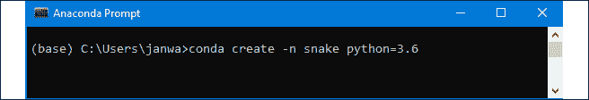
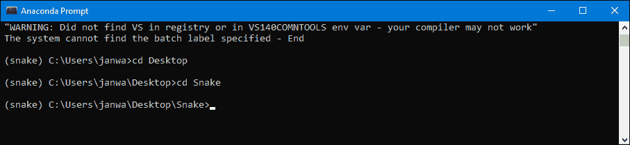

# 第十三章

# 游戏 AI – 成为 Snake 大师

这是最后一章实用章节；恭喜你完成了前面的章节！我希望你真的很享受这些内容。现在，让我们暂时放下商业问题和自动驾驶汽车。通过玩一个名为 Snake 的流行游戏来玩得开心，同时制作一个能够自学的 AI 来玩这个游戏！

这正是我们在这一章要做的。我们将实现的模型称为深度卷积 Q 学习，使用 **卷积神经网络**（**CNN**）。

我们的 AI 并不完美，也不会填满整个地图，但经过一些训练后，它将开始以与人类相当的水平进行游戏。

让我们通过先看看这个游戏是什么样子以及目标是什么，来解决这个问题。

## 待解决的问题

首先，让我们来看一下游戏本身：


图 1：蛇游戏

看起来有点眼熟吗？

我相当确信它会做到；每个人至少玩过一次 Snake。

这个游戏非常简单；它由一条蛇和一个苹果组成。我们控制蛇，目标是吃尽可能多的苹果。

听起来简单吗？嗯，其实有一个小陷阱。每当我们的蛇吃掉一个苹果时，蛇会长大一格。这意味着游戏在开始时异常简单，但它会逐渐变得更加困难，直到成为一个策略性游戏。

此外，当控制我们的蛇时，我们不能撞到自己，也不能撞到棋盘的边界。这会导致我们输掉游戏，这也是非常容易预见的。

现在我们已经理解了问题，我们可以进入创建 AI 时的第一步——构建环境！

## 构建环境

这一次，与本书中的其他一些实用部分不同，我们不需要指定任何变量或做出任何假设。我们可以直接进入每个深度 Q 学习项目中的三个关键步骤：

1.  定义状态

1.  定义动作

1.  定义奖励

让我们开始吧！

### 定义状态

在之前的每个例子中，我们的状态都是一个 1D 向量，表示定义环境的某些值。例如，对于我们的自动驾驶汽车，我们有来自汽车周围三个传感器和汽车位置的信息。所有这些信息都被放入一个 1D 数组中。

但是，如果我们想让它看起来更真实一点呢？如果我们希望 AI 能像我们一样通过相同的来源来查看并收集信息呢？好吧，这就是我们在本章要做的。我们的 AI 将看到与我们玩 Snake 时完全相同的棋盘！

游戏的状态应该是一个 2D 数组，代表游戏的棋盘，完全与我们看到的情况相同。

这个解决方案有一个问题。看一下以下图片，看看你是否能回答这个问题：现在我们的蛇正朝哪个方向移动？


图 2：蛇游戏

如果你说“我不知道”，那你完全正确。

基于单一的画面，我们无法判断我们的蛇在朝哪个方向移动。因此，我们需要堆叠多个图像，然后将它们一起输入到卷积神经网络中。这样，我们将得到三维状态，而不是二维状态。

所以，简单回顾一下：


图 3：AI 视觉

我们将有一个三维数组，包含一个接一个堆叠的游戏画面，其中最上面的画面是我们游戏中获得的最新画面。现在，我们可以清楚地看到我们的 AI 在朝哪个方向移动；在这个例子中，它是向上走，朝着苹果走去。

现在我们已经定义了状态，我们可以迈出下一步：定义动作！

### 定义动作

当我们在手机或网站上玩贪吃蛇时，有四个可供我们选择的动作：

1.  向上走

1.  向下走

1.  向右走

1.  向左走

然而，如果我们所采取的动作需要蛇做出 180° 的掉头，那么游戏将阻止这个动作，蛇将继续朝着当前的方向前进。

在前面的示例中，如果我们选择动作 2——向下走——我们的蛇仍然会继续向上走，因为向下走是不可能的，因为蛇无法直接做出 180° 的掉头。

值得注意的是，所有这些动作都是相对于棋盘的，而不是相对于蛇的；它们不会受到蛇当前运动方向的影响。向上、向下、向右或向左的动作，始终是相对于棋盘的，不是相对于蛇当前的运动方向。

好吧，现在你可能属于以下两种情况之一，关于我们在 AI 中建模的动作：

1.  我们可以将这四个相同的动作用于我们的 AI。

1.  我们不能使用这些相同的动作，因为阻止某些动作会让我们的 AI 感到困惑。相反，我们应该发明一种方法，告诉蛇向左走、向右走，或者继续前进。

事实上，我们确实可以将这些相同的动作用于我们的 AI！

为什么这不会让我们的智能体感到困惑呢？那是因为，只要我们的 AI 智能体根据它选择的动作获得奖励，而不是根据蛇最终执行的动作获得奖励，那么深度 Q 学习就能有效工作，我们的 AI 将会理解，在上面的例子中，选择 *向上走* 或 *向下走* 会导致相同的结果。

例如，假设 AI 控制的蛇当前正向左移动。它选择了动作 3，向右走；但是因为这将导致蛇做出 180° 的掉头，所以蛇仍然继续向左走。假设该动作意味着蛇撞到了墙壁，并因此死亡。为了避免这对我们的智能体造成困扰，我们所需要做的就是告诉它，*向右走*的动作导致它撞墙，尽管蛇依然向左移动。

可以把它看作是教 AI 用手机上的实际按钮来玩游戏。如果你不断地按右键，试图让蛇在向左移动时转回去，游戏会一直忽略你不断要求它执行的不可能的操作，继续向左走，最终崩溃。这就是 AI 需要学习的全部内容。

这是因为，请记住，在深度 Q 学习中，我们只更新 AI 执行的动作的 Q 值。如果蛇正在向左走，而 AI 决定向右走并且蛇死了，它需要明白“向右走”这个动作导致了负奖励，而不是蛇向左移动的事实；即使选择“向左走”也会导致相同的结果。

我希望你明白，AI 可以使用我们在玩游戏时使用的相同动作。我们可以继续到下一个最终步骤——定义奖励！

### 定义奖励

最后一步很简单；我们只需要三个奖励：

1.  吃苹果的奖励

1.  死亡奖励

1.  生存惩罚

前两个应该容易理解。毕竟，我们希望鼓励我们的代理尽可能多地吃苹果，因此我们会设置它的奖励为正值。准确来说：**吃苹果 = +2**

同时，我们希望避免让我们的蛇死亡。这就是为什么我们将奖励设置为负值。准确来说：**死亡 = -1**

然后是最终的奖励：生存惩罚。

那是什么，为什么它是必要的？我们必须让我们的代理相信，尽快收集苹果而不死掉是一个好主意。如果我们只定义已经有的这两个奖励，我们的代理将只是在整个地图上游荡，希望在某个时刻找到苹果。它不会明白它需要尽可能快地收集苹果。

这就是为什么我们引入生存惩罚。除非某个动作导致死亡或收集到苹果，否则它会稍微惩罚我们的 AI 每一个动作。这将向我们的代理展示，它需要尽快收集苹果，因为只有收集苹果的动作才能获得正奖励。那么，这个奖励应该有多大呢？嗯，我们不想惩罚它太多。准确来说：**生存惩罚 = -0.03**

如果你想调整这些奖励，这个奖励的绝对值应该始终相对较小，和其他奖励（死亡（-1）和收集苹果（+2））相比。

## AI 解决方案

和往常一样，深度 Q 学习的 AI 解决方案由两部分组成：

1.  **大脑** – 将学习并采取行动的神经网络

1.  **经验重放记忆** – 存储我们经验的记忆；神经网络将从这些记忆中学习

现在让我们来处理这些吧！

### 大脑

这部分 AI 解决方案将负责教导、存储和评估我们的神经网络。为了构建它，我们将使用 CNN！

为什么选择 CNN？在解释其背后的理论时，我提到它们通常在“我们的环境作为状态返回图像”的情况下使用，而这正是我们在这里处理的内容。我们已经确认，游戏状态将是一个堆叠的 3D 数组，包含了最后几帧游戏画面。

在上一章中，我们讨论了 CNN 如何将一个 2D 图像作为输入，而不是一个堆叠的 3D 图像数组；但是你还记得这个图形吗？


图 4：RGB 图像

在这里，我告诉过你，RGB 图像是通过 3D 数组表示的，这些数组包含了图像的每个 2D 通道。听起来像是很熟悉吗？我们可以用完全相同的方法来解决我们的这个问题。就像 RGB 结构中的每个颜色一样，我们只需将每一帧游戏画面作为一个新的通道输入，这将为我们提供一个 3D 数组，然后我们可以将它输入到 CNN 中。

实际上，CNN 通常只支持 3D 数组作为输入。为了输入 2D 数组，你需要创建一个虚拟的单通道，将 2D 数组转换为 3D 数组。

关于 CNN 架构，我们将有两个卷积层，中间有一个池化层。一个卷积层将有 32 个 3x3 的滤波器，另一个卷积层将有 64 个 2x2 的滤波器。池化层将把尺寸缩小 2 倍，因为池化窗口的大小是 2x2。为什么选这样的架构？这是一个经典架构，在许多研究论文中都能找到，我随便选择了一个常用的架构，结果证明它的效果非常好。

我们的神经网络将有一个包含 256 个神经元的隐藏层和一个包含 4 个神经元的输出层；每个神经元对应我们可能的一个结果动作。

我们还需要为 CNN 设置两个最后的参数——学习率和输入形状。

学习率，在前面的例子中有使用，是一个指定我们在神经网络中更新权重幅度的参数。学习率太小，模型就学不起来；学习率太大，模型也无法学习，因为更新幅度太大，无法进行任何有效的优化。通过实验，我发现这个例子中合适的学习率是 0.0001。

我们已经达成一致，输入应该是一个包含游戏中最后几帧的 3D 数组。更准确地说，我们并不会从屏幕上读取像素，而是会读取表示游戏屏幕在某一时刻的直接 2D 数组。

正如你可能已经注意到的，我们的游戏是基于一个网格构建的。在我们使用的示例中，网格的大小是 10x10。然后，环境中有一个大小相同（10x10）的数组，数学上告诉我们棋盘的状态。例如，如果蛇的部分在一个格子里，那么我们就在相应的 2D 数组格子中放置值 0.5，我们将从中读取它。一个苹果在这个数组中的值为 1。

现在我们知道如何查看一帧，我们需要决定在描述当前游戏状态时将使用多少前一帧。2 帧应该足够，因为我们可以从中辨别蛇的方向，但为了确保，我们将使用 4 帧。

你能告诉我我们的 CNN 输入到底是什么形状吗？

它将是 10x10x4，这样我们就得到了一个 3D 数组！

### 经验回放内存

正如在深度 Q 学习的理论章节中定义的那样，我们需要一个存储在训练过程中收集的经验的记忆。

我们将存储以下数据：

+   当前状态 – AI 执行动作时所在的游戏状态（即我们输入到 CNN 中的内容）

+   动作 – 执行的动作

+   奖励 – 通过在当前状态下执行该动作所获得的奖励

+   下一状态 – 执行动作后发生了什么（状态是什么样的）

+   游戏结束 – 关于我们是否输了的信息

此外，我们始终需要为每个经验回放内存指定两个参数：

+   内存大小 – 我们的内存的最大大小

+   Gamma – 折扣因子，存在于贝尔曼方程中

我们将内存大小设置为 60,000，gamma 参数设置为 0.9。

这里还有一件事需要指定。

我告诉过你，我们的 AI 将从这个记忆中学习，确实如此；但 AI 并不会从整个记忆中学习。而是从其中提取的小批量进行学习。指定这个批量大小的参数叫做批量大小，在这个例子中，我们将其设置为 32。也就是说，我们的 AI 将从每次迭代中，从经验回放内存中提取一个大小为 32 的批量进行学习。

既然你已经理解了所有需要编码的内容，你可以开始动手了！

## 实现

你将在五个文件中实现整个 AI 代码和贪吃蛇游戏：

1.  `environment.py`文件 – 包含环境（贪吃蛇游戏）的文件

1.  `brain.py`文件 – 我们构建 CNN 的文件

1.  `DQN.py` – 构建经验回放内存的文件

1.  `train.py` – 我们将训练 AI 玩贪吃蛇的文件

1.  `test.py` – 我们将测试 AI 表现如何的文件

你可以在 GitHub 页面上找到所有这些内容，并且还可以找到一个预训练的模型。要访问该页面，请在主页面选择`Chapter 13`文件夹。

我们将按相同的顺序逐个查看每个文件。让我们开始构建环境吧！

### 第一步 – 构建环境

通过导入所需的库，开始这一步骤。像这样：

```py
# Importing the libraries   #4
import numpy as np   #5
import pygame as pg   #6 
```

你只需要使用两个库：NumPy 和 PyGame。前者在处理列表或数组时非常有用，后者将用于构建整个游戏——绘制蛇和苹果，并更新屏幕。

现在，让我们创建`Environment`类，这个类将包含你需要的所有信息、变量和方法。为什么是类？因为这样后续会更方便。你可以从这个类的对象中调用特定的方法或变量。

你必须总是有的第一个方法是`__init__`方法，每当这个类的一个新对象在主代码中被创建时，都会调用它。要创建这个类以及`__init__`方法，你需要编写：

```py
# Initializing the Environment class   #8
class Environment():   #9
    #10
    def __init__(self, waitTime):   #11
        #12
        # Defining the parameters   #13
        self.width = 880            # width of the game window   #14
        self.height = 880           # height of the game window   #15
        self.nRows = 10             # number of rows in our board   #16
        self.nColumns = 10          # number of columns in our board   #17
        self.initSnakeLen = 2       # initial length of the snake   #18
        self.defReward = -0.03      # reward for taking an action - The Living Penalty   #19
        self.negReward = -1\.        # reward for dying   #20
        self.posReward = 2\.         # reward for collecting an apple   #21
        self.waitTime = waitTime    # slowdown after taking an action   #22
        #23
        if self.initSnakeLen > self.nRows / 2:   #24
            self.initSnakeLen = int(self.nRows / 2)   #25
        #26
        self.screen = pg.display.set_mode((self.width, self.height))   #27
        #28
        self.snakePos = list()   #29
        #30
        # Creating the array that contains mathematical representation of the game's board   #31
        self.screenMap = np.zeros((self.nRows, self.nColumns))   #32
        #33
        for i in range(self.initSnakeLen):   #34
            self.snakePos.append((int(self.nRows / 2) + i, int(self.nColumns / 2)))   #35
            self.screenMap[int(self.nRows / 2) + i][int(self.nColumns / 2)] = 0.5   #36
            #37
        self.applePos = self.placeApple()   #38
        #39
        self.drawScreen()   #40
        #41
        self.collected = False   #42
        self.lastMove = 0   #43 
```

你创建了一个新的类，即`Environment()`类，并且它有一个`__init__`方法。这个方法只需要一个参数，即`waitTime`。然后，在定义方法后，创建一个常量列表，每个常量都在内联注释中解释。之后，进行一些初始化。你确保蛇的长度在第 24 和第 25 行不超过屏幕的一半，并且在第 27 行设置屏幕。需要注意的一点是，在第 32 行你创建了`screenMap`数组，它更数学化地表示了游戏板。单元格中的 0.5 表示这个单元格被蛇占据，而单元格中的 1 表示这个单元格被苹果占据。

在第 34 到第 36 行，你将蛇放置在屏幕中央，面朝上，然后在剩余的行中使用`placeapple()`方法（我们即将定义）放置一个苹果，绘制屏幕，设置苹果未被收集，并且设置没有上一次的移动。

这是第一个方法的完成。现在你可以继续下一个方法：

```py
 # Building a method that gets new, random position of an apple
    def placeApple(self):
        posx = np.random.randint(0, self.nColumns)
        posy = np.random.randint(0, self.nRows)
        while self.screenMap[posy][posx] == 0.5:
            posx = np.random.randint(0, self.nColumns)
            posy = np.random.randint(0, self.nRows)

        self.screenMap[posy][posx] = 1

        return (posy, posx) 
```

这个简短的方法将苹果放置在`screenMap`数组中的一个新的随机位置。当我们的蛇收集到苹果时，需要使用这个方法来放置新的苹果。它还会返回新苹果的随机位置。

然后，你需要一个绘制所有内容的函数，让你可以看到：

```py
 # Making a function that draws everything for us to see
    def drawScreen(self):

        self.screen.fill((0, 0, 0))

        cellWidth = self.width / self.nColumns
        cellHeight = self.height / self.nRows

        for i in range(self.nRows):
            for j in range(self.nColumns):
                if self.screenMap[i][j] == 0.5:
                    pg.draw.rect(self.screen, (255, 255, 255), (j*cellWidth + 1, i*cellHeight + 1, cellWidth - 2, cellHeight - 2))
                elif self.screenMap[i][j] == 1:
                    pg.draw.rect(self.screen, (255, 0, 0), (j*cellWidth + 1, i*cellHeight + 1, cellWidth - 2, cellHeight - 2))

        pg.display.flip() 
```

如你所见，这个方法的名称是`drawScreen`，它不接受任何参数。在这里，你只是清空整个屏幕，然后用白色的瓦片填充蛇所在的位置，用红色瓦片填充苹果所在的位置。最后，你用`pg.display.flip()`更新屏幕。

现在，你需要一个只更新蛇的位置，而不更新整个环境的函数：

```py
 # A method that updates the snake's position
    def moveSnake(self, nextPos, col):

        self.snakePos.insert(0, nextPos)

        if not col:
            self.snakePos.pop(len(self.snakePos) - 1)

        self.screenMap = np.zeros((self.nRows, self.nColumns))

        for i in range(len(self.snakePos)):
            self.screenMap[self.snakePos[i][0]][self.snakePos[i][1]] = 0.5

        if col:
            self.applePos = self.placeApple()
            self.collected = True

        self.screenMap[self.applePos[0]][self.applePos[1]] = 1 
```

你可以看到，这个新方法接受两个参数：`nextPos`和`col`。前者告诉你在执行某个动作后蛇头的位置。后者则告诉你蛇是否通过这个动作收集了苹果。记住，如果蛇收集了苹果，那么蛇的长度会增加 1。如果深入这段代码，你可以看到这一点，但由于这对 AI 不太相关，我们在这里不做详细说明。你还可以看到，如果蛇收集了苹果，会在新位置生成一个新的苹果。

现在，让我们进入这段代码最重要的部分。你定义了一个更新整个环境的函数。它会移动你的蛇，计算奖励，检查你是否输了，并返回一个新的游戏帧。它的起始方式如下：

```py
 # The main method that updates the environment
    def step(self, action):
        # action = 0 -> up
        # action = 1 -> down
        # action = 2 -> right
        # action = 3 -> left

        # Resetting these parameters and setting the reward to the living penalty
        gameOver = False
        reward = self.defReward
        self.collected = False

        for event in pg.event.get():
            if event.type == pg.QUIT:
                return

        snakeX = self.snakePos[0][1]
        snakeY = self.snakePos[0][0]

        # Checking if an action is playable and if not then it is changed to the playable one
        if action == 1 and self.lastMove == 0:
            action = 0
        if action == 0 and self.lastMove == 1:
            action = 1
        if action == 3 and self.lastMove == 2:
            action = 2
        if action == 2 and self.lastMove == 3:
            action = 3 
```

如你所见，这个方法被称为`step`，它接受一个参数：告诉你蛇想朝哪个方向移动的动作。方法定义下方的注释中，你可以看到每个动作代表的方向。

然后你重置一些变量。你将`gameOver`设置为`False`，因为这个布尔变量会告诉你在执行这个动作后是否输了。你将`reward`设置为`defReward`，这是生存惩罚；如果我们收集了苹果或稍后死掉，这个值可能会改变。

然后有一个`for`循环。它的作用是确保 PyGame 窗口不会冻结；这是 PyGame 库的要求。它必须存在。

`snakeX`和`snakeY`告诉你蛇头的位置。稍后，算法会使用这个信息来确定蛇头移动后的状态。

在最后几行，你可以看到阻止不可能动作的算法。简单回顾一下，不可能的动作是指蛇在原地做 180°转弯的动作。`lastMove`告诉你蛇现在的移动方向，并与`action`进行比较。如果这些导致了矛盾，`action`就会被设置为`lastMove`。

仍然在这个方法中，你更新蛇的位置，检查是否结束游戏，并计算奖励，像这样：

```py
 # Checking what happens when we take this action
        if action == 0:
            if snakeY > 0:
                if self.screenMap[snakeY - 1][snakeX] == 0.5:
                    gameOver = True
                    reward = self.negReward
                elif self.screenMap[snakeY - 1][snakeX] == 1:
                    reward = self.posReward
                    self.moveSnake((snakeY - 1, snakeX), True)
                elif self.screenMap[snakeY - 1][snakeX] == 0:
                    self.moveSnake((snakeY - 1, snakeX), False)
            else:
                gameOver = True
                reward = self.negReward 
```

在这里，你检查蛇头向上移动会发生什么。如果蛇头已经在最上面的一行（第`0`行），那么显然你已经输了，因为蛇撞到墙壁了。所以，`reward`被设置为`negReward`，`gameOver`被设置为`True`。否则，你检查蛇头前方的情况。

如果前方的格子已经包含了蛇身的一部分，那么你就输了。你在第一个`if`语句中检查这个情况，然后将`gameOver`设置为`True`，并将`reward`设置为`negReward`。

如果前方的格子是一个苹果，那么你将`reward`设置为`posReward`。你还会通过调用你刚刚创建的那个方法来更新蛇的位置。

如果前方的格子是空的，那么你不会对`reward`做任何更新。你会再次调用相同的方法，但这次将`col`参数设置为`False`，因为蛇并没有吃到苹果。对于每个其他动作，你会执行相同的过程。我不会逐行讲解，但你可以看一下代码：

```py
 elif action == 1:
            if snakeY < self.nRows - 1:
                if self.screenMap[snakeY + 1][snakeX] == 0.5:
                    gameOver = True
                    reward = self.negReward
                elif self.screenMap[snakeY + 1][snakeX] == 1:
                    reward = self.posReward
                    self.moveSnake((snakeY + 1, snakeX), True)
                elif self.screenMap[snakeY + 1][snakeX] == 0:
                    self.moveSnake((snakeY + 1, snakeX), False)
            else:
                gameOver = True
                reward = self.negReward

        elif action == 2:
            if snakeX < self.nColumns - 1:
                if self.screenMap[snakeY][snakeX + 1] == 0.5:
                    gameOver = True
                    reward = self.negReward
                elif self.screenMap[snakeY][snakeX + 1] == 1:
                    reward = self.posReward
                    self.moveSnake((snakeY, snakeX + 1), True)
                elif self.screenMap[snakeY][snakeX + 1] == 0:
                    self.moveSnake((snakeY, snakeX + 1), False)
            else:
                gameOver = True
                reward = self.negReward 

        elif action == 3:
            if snakeX > 0:
                if self.screenMap[snakeY][snakeX - 1] == 0.5:
                    gameOver = True
                    reward = self.negReward
                elif self.screenMap[snakeY][snakeX - 1] == 1:
                    reward = self.posReward
                    self.moveSnake((snakeY, snakeX - 1), True)
                elif self.screenMap[snakeY][snakeX - 1] == 0:
                    self.moveSnake((snakeY, snakeX - 1), False)
            else:
                gameOver = True
                reward = self.negReward 
```

以和向上移动时相同的方式处理每个动作。检查蛇是否没有撞到墙壁，检查蛇前方的情况并更新蛇的位置、`reward`和`gameOver`。

这个方法还有两个步骤，我们直接跳到第一个：

```py
 # Drawing the screen, updating last move and waiting the wait time specified
        self.drawScreen()

        self.lastMove = action

        pg.time.wait(self.waitTime) 
```

你通过在屏幕上绘制蛇和苹果来更新我们的屏幕，然后将`lastMove`设置为`action`，因为蛇已经移动，现在正朝着`action`的方向移动。

这个方法的最后一步是返回当前游戏的样子、获得的奖励以及你是否输了，像这样：

```py
 # Returning the new frame of the game, the reward obtained and whether the game has ended or not
        return self.screenMap, reward, gameOver 
```

`screenMap`提供了执行动作后游戏界面所需的信息，`reward`告诉你通过执行这个动作获得的奖励，`gameOver`告诉你是否输了。

这就是这个方法的全部内容！为了拥有一个完整的`Environment`类，你只需要创建一个重置环境的函数，就像这样一个`reset`方法：

```py
 # Making a function that resets the environment
    def reset(self):
        self.screenMap  = np.zeros((self.nRows, self.nColumns))
        self.snakePos = list()

        for i in range(self.initSnakeLen):
            self.snakePos.append((int(self.nRows / 2) + i, int(self.nColumns / 2)))
            self.screenMap[int(self.nRows / 2) + i][int(self.nColumns / 2)] = 0.5

        self.screenMap[self.applePos[0]][self.applePos[1]] = 1

        self.lastMove = 0 
```

它只是简单地重置了游戏板（`screenMap`），以及蛇的位置，恢复到默认的中间位置。它还将苹果的位置设置为和上一轮相同。

恭喜！你刚刚完成了环境的构建。现在我们将进入第二步，构建大脑。

### 第 2 步 – 构建大脑

这里你将用卷积神经网络（CNN）来构建我们的“大脑”。你还将为其训练设置一些参数，并定义一个加载预训练模型进行测试的方法。

开始吧！

一如既往地，你首先导入你将使用的库，像这样：

```py
# Importing the libraries
import keras
from keras.models import Sequential, load_model
from keras.layers import Dense, Dropout, Conv2D, MaxPooling2D, Flatten
from keras.optimizers import Adam 
```

正如你可能已经注意到的，所有这些类都是 Keras 库的一部分，而这正是你将在本章中使用的库。实际上，Keras 是你在这个文件中唯一需要使用的库。现在让我们一起回顾一下这些类和方法：

1.  `Sequential` – 一个可以初始化神经网络的类，并定义网络的一般结构。

1.  `load_model` – 一个从文件中加载模型的函数。

1.  `Dense` – 一个类，用来创建人工神经网络（ANN）中的全连接层。

1.  `Dropout` – 一个向我们的网络中添加 Dropout 的类。你已经在*第八章* *《物流中的 AI – 仓库中的机器人》*中见过它的使用。

1.  `Conv2D` – 一个用于构建卷积层的类。

1.  `MaxPooling2D` – 一个用于构建最大池化层的类。

1.  `Flatten` – 一个执行扁平化操作的类，以便为经典的人工神经网络（ANN）提供输入。

1.  `Adam` – 一个优化器，用来优化你的神经网络。在训练 CNN 时使用它。

现在你已经导入了库，接下来可以创建一个叫做`Brain`的类，在这个类中使用所有这些类和方法。首先定义一个类和`__init__`方法，像这样：

```py
# Creating the Brain class
class Brain():

    def __init__(self, iS = (100,100,3), lr = 0.0005):

        self.learningRate = lr
        self.inputShape = iS
        self.numOutputs = 4
        self.model = Sequential() 
```

你可以看到，`__init__`方法接收两个参数：`iS`（输入形状）和`lr`（学习率）。然后你定义了一些与这个类相关的变量：`learningRate`，`inputShape`，`numOutputs`。将`numOutputs`设置为`4`，因为这是我们的 AI 可以采取的动作数量。最后，在最后一行创建一个空模型。为此，使用我们之前导入的`Sequential`类。

这样做会让你将所需的所有层添加到模型中。这正是你通过这些代码行完成的：

```py
 # Adding layers to the model   #20
        self.model.add(Conv2D(32, (3,3), activation = 'relu', input_shape = self.inputShape))   #21
        #22
        self.model.add(MaxPooling2D((2,2)))   #23
        #24
        self.model.add(Conv2D(64, (2,2), activation = 'relu'))   #25
        #26
        self.model.add(Flatten())   #27
        #28
        self.model.add(Dense(units = 256, activation = 'relu'))   #29
        #30
        self.model.add(Dense(units = self.numOutputs))   #31 
```

让我们将这段代码分解成几行：

**第 21 行**：你向模型中添加了一个新的卷积层。它有 32 个 3x3 的过滤器，使用 ReLU 激活函数。你还需要在这里指定输入形状。记住，输入形状是这个函数的参数之一，并且保存在`inputShape`变量中。

**第 23 行**：你添加了一个最大池化层。窗口的大小是 2x2，这将使我们的特征图的大小缩小`2`倍。

**第 25 行**：你添加了第二个卷积层。这次它有 64 个 2x2 的过滤器，使用相同的 ReLU 激活函数。为什么这次使用 ReLU 呢？我在实验中尝试了其他一些激活函数，结果发现对于这个 AI，ReLU 效果最好。

**第 27 行**：在应用了卷积之后，你获得了新的特征图，并将其展平为 1D 向量。这正是这一行所做的——它将 2D 图像展平为 1D 向量，之后你将能够将其作为神经网络的输入。

**第 29 行**：现在，你进入了全连接步骤——你正在构建传统的人工神经网络（ANN）。这一行代码为我们的模型添加了一个新的隐藏层，包含`256`个神经元，并使用 ReLU 激活函数。

**第 31 行**：你创建了神经网络中的最后一层——输出层。它有多大呢？它必须拥有和你能采取的动作数量一样多的神经元。你在之前的`numOutputs`变量中设置了这个值，它的值为`4`。这里没有指定激活函数，这意味着激活函数默认为线性。事实证明，在这种情况下，使用线性输出比 Softmax 输出效果更好；它使训练更加高效。

你还需要`compile`你的模型。这将告诉你的代码如何计算误差，以及在训练模型时使用哪个优化器。你可以用这一行代码来实现：

```py
 # Compiling the model
        self.model.compile(loss = 'mean_squared_error', optimizer = Adam(lr = self.learningRate)) 
```

在这里，你使用了一个属于`Sequential`类的方法（这就是你可以用模型调用它的原因）来完成这个操作。这个方法叫做`compile`，在本例中需要两个参数。`loss`是一个函数，告诉 AI 如何计算神经网络的误差；你将使用`mean_squared_error`。第二个参数是优化器。你已经导入了`Adam`优化器，并在这里使用它。这个优化器的学习率是该类`__init__`方法的参数之一，值由`learningRate`变量表示。

在这节课中，只剩下一步了——编写一个从文件中加载模型的函数。你可以使用以下代码来实现：

```py
 # Making a function that will load a model from a file
    def loadModel(self, filepath):
        self.model = load_model(filepath)
        return self.model 
```

你可以看到，你创建了一个新的函数`loadModel`，它接收一个参数——`filepath`。这个参数是预训练模型的文件路径。定义完函数后，你就可以从这个文件路径加载模型。为此，你使用了之前导入的`load_model`方法。这个函数接收相同的参数——`filepath`。最后一行，你返回加载的模型。

恭喜你！你刚刚完成了大脑的构建。

让我们继续前进，构建经验重放记忆。

### 第三步 – 构建经验重放记忆

你现在将构建这个内存，稍后，你将从这个内存的小批量中训练你的模型。内存将包含有关游戏状态（采取行动前）、所采取的行动、获得的奖励以及执行行动后游戏状态的信息。

我有个好消息要告诉你——你还记得这段代码吗？

```py
# AI for Games - Beat the Snake game
# Implementing Deep Q-Learning with Experience Replay

# Importing the libraries
import numpy as np

# IMPLEMENTING DEEP Q-LEARNING WITH EXPERIENCE REPLAY

class Dqn(object):

    # INTRODUCING AND INITIALIZING ALL THE PARAMETERS AND VARIABLES OF THE DQN
    def __init__(self, max_memory = 100, discount = 0.9):
        self.memory = list()
        self.max_memory = max_memory
        self.discount = discount

    # MAKING A METHOD THAT BUILDS THE MEMORY IN EXPERIENCE REPLAY
    def remember(self, transition, game_over):
        self.memory.append([transition, game_over])
        if len(self.memory) > self.max_memory:
            del self.memory[0]

    # MAKING A METHOD THAT BUILDS TWO BATCHES OF INPUTS AND TARGETS BY EXTRACTING TRANSITIONS FROM THE MEMORY
    def get_batch(self, model, batch_size = 10):
        len_memory = len(self.memory)
        num_inputs = self.memory[0][0][0].shape[1]
        num_outputs = model.output_shape[-1]
        inputs = np.zeros((min(len_memory, batch_size), num_inputs))
        targets = np.zeros((min(len_memory, batch_size), num_outputs))
        for i, idx in enumerate(np.random.randint(0, len_memory, size = min(len_memory, batch_size))):
            current_state, action, reward, next_state = self.memory[idx][0]
            game_over = self.memory[idx][1]
            inputs[i] = current_state
            targets[i] = model.predict(current_state)[0]
            Q_sa = np.max(model.predict(next_state)[0])
            if game_over:
                targets[i, action] = reward
            else:
                targets[i, action] = reward + self.discount * Q_sa
        return inputs, targets 
```

你将几乎使用相同的代码，只是做了两个小小的改变。

首先，去掉这一行：

```py
 num_inputs = self.memory[0][0][0].shape[1] 
```

然后，修改这一行：

```py
 inputs = np.zeros((min(len_memory, batch_size), num_inputs)) 
```

到这里：

```py
 inputs = np.zeros((min(len_memory, batch_size), self.memory[0][0][0].shape[1],self.memory[0][0][0].shape[2],self.memory[0][0][0].shape[3])) 
```

为什么你需要这么做呢？好吧，你去掉了第一行，因为你不再拥有一个 1D 的输入向量。现在你有一个 3D 数组。

然后，如果你仔细观察，你会发现其实你并没有改变`inputs`。之前，你有一个二维数组，其中一个维度是批量大小，另一个维度是输入的数量。现在，事情非常相似；第一个维度仍然是批量大小，最后三个维度则对应输入的大小！

由于我们的输入现在是一个 3D 数组，所以你写了`.shape[1]`、`.shape[2]`和`.shape[3]`。这些形状到底是什么意思？

`.shape[1]`是游戏中的行数（在你的例子中是 10）。`.shape[2]`是游戏中的列数（在你的例子中是 10）。`.shape[3]`是最后几帧叠加在一起的数量（在你的例子中是 4）。

如你所见，你其实并没有真正改变什么。你只是让代码适用于我们的 3D 输入。

我还将这个`dqn.py`文件重命名为`DQN.py`，并将类`DQN`重命名为`Dqn`。

就这样！这可能比你们大多数人预期的要简单得多。

你终于可以开始训练你的模型了。我们将在下一节中进行训练 AI。

### 第 4 步 – 训练 AI

这是迄今为止最重要的一步。在这里，我们终于教会了 AI 玩蛇游戏！

和往常一样，首先导入你需要的库：

```py
# Importing the libraries
from environment import Environment
from brain import Brain
from DQN import Dqn
import numpy as np
import matplotlib.pyplot as plt 
```

在前三行中，你导入了之前创建的工具，包括`Brain`、`Environment`和经验回放内存。

然后，在接下来的两行中，你导入了你将使用的库。这些包括 NumPy 和 Matplotlib。你已经会识别前者；后者将用于展示你模型的表现。具体来说，它将帮助你展示一个图表，每 100 局游戏，会显示你收集到的苹果的平均数量。

这就是这一步的全部内容。现在，定义一些代码的超参数：

```py
# Defining the parameters
memSize = 60000
batchSize = 32
learningRate = 0.0001
gamma = 0.9
nLastStates = 4

epsilon = 1.
epsilonDecayRate = 0.0002
minEpsilon = 0.05

filepathToSave = 'model2.h5' 
```

我会在这个列表中解释它们：

1.  `memSize` – 你的经验回放内存的最大大小。

1.  `batchSize` – 每次迭代中，从经验回放内存中获取的输入和目标的批量大小，用于模型训练。

1.  `learningRate` – 你在`Brain`中使用的`Adam`优化器的学习率。

1.  `gamma` – 你的经验回放内存的折扣因子。

1.  `nLastStates` – 你保存作为当前游戏状态的最后几帧。记住，你会将一个大小为`nRows` x `nColumns` x `nLastStates`的 3D 数组输入到你的 CNN 中，作为`Brain`的一部分。

1.  `epsilon` – 初始 epsilon，即采取随机动作的机会。

1.  `epsilonDecayRate` – 每场/轮游戏后你减少`epsilon`的比率。

1.  `minEpsilon` – 最低可能的 epsilon 值，之后不能再调低。

1.  `filepathToSave` – 你希望保存模型的位置。

就这样 - 你已经定义了超参数。稍后在编写其余代码时将使用它们。现在，你需要创建一个环境、一个大脑和一个经验重播内存：

```py
# Creating the Environment, the Brain and the Experience Replay Memory
env = Environment(0)
brain = Brain((env.nRows, env.nColumns, nLastStates), learningRate)
model = brain.model
dqn = Dqn(memSize, gamma) 
```

你可以看到，在第一行中，你创建了`Environment`类的一个对象。你需要在这里指定一个变量，即你的环境减慢（移动之间的等待时间）。你在训练期间不想有任何减速，所以在这里输入`0`。

接下来你创建了`Brain`类的一个对象。它接受两个参数 - 输入形状和学习率。正如我多次提到的，输入形状将是一个大小为`nRows` x `nColumns` x `nLastStates`的 3D 数组，所以你在这里输入这些内容。第二个参数是学习率，由于你已经为此创建了一个变量，所以你简单地输入这个变量的名称 - `learningRate`。在这一行之后，你取得了这个`Brain`类的模型，并在你的代码中创建了这个模型的一个实例。保持简单，称其为`model`。

在最后一行中，你创建了`Dqn`类的一个对象。它接受两个参数 - 内存的最大大小和内存的折扣因子。你为此指定了两个变量，`memSize`和`gamma`，所以在这里使用它们。

现在，你需要编写一个函数，重置你的 AI 的状态。你需要它是因为状态相当复杂，在主代码中重置它们会造成很大的混乱。这是它的样子：

```py
# Making a function that will initialize game states   #30
def resetStates():   #31
    currentState = np.zeros((1, env.nRows, env.nColumns, nLastStates))   #32
    #33
    for i in range(nLastStates):   #34
        currentState[:,:,:,i] = env.screenMap   #35
    #36
    return currentState, currentState   #37 
```

让我们把它分成单独的行：

**第 31 行**：你定义了一个名为`resetStates`的新函数。它不接受任何参数。

**第 32 行**：你创建了一个名为`currentState`的新数组。它充满了零，但你可能会问为什么是 4D 的；我们不是说输入应该是 3D 吗？你完全正确，确实应该是。第一个维度称为批处理大小，简单地表示你一次向神经网络输入多少个输入。你每次只输入一个数组，因此第一个大小是`1`。接下来的三个大小对应输入的大小。

**第 34-35 行**：在一个`for`循环中，将执行`nLastStates`次，你将每个 3D 状态的层的板子设置为来自环境的当前游戏板的初始外观。每个状态中的每一帧最初看起来都一样，就像开始游戏时游戏板的样子一样。

**第 37 行**：这个函数将返回两个`currentStates`。为什么？因为你需要两个游戏状态数组。一个表示在你执行动作之前的板子状态，另一个表示在你执行动作之后的板子状态。

现在你可以开始编写整个训练的代码了。首先，创建几个有用的变量，如下所示：

```py
# Starting the main loop
epoch = 0
scores = list()
maxNCollected = 0
nCollected = 0.
totNCollected = 0 
```

`epoch`会告诉你现在处于哪个 epoch/游戏。`scores`是一个列表，你在每 100 局游戏/epoch 后保存每局游戏的平均分。`maxNCollected`告诉你训练过程中获得的最高分，而`nCollected`是每局游戏/epoch 的分数。最后一个变量`totNCollected`告诉你在 100 个 epoch/游戏中收集了多少苹果。

现在，你开始一个重要的、无限的`while`循环，如下所示：

```py
while True:
    # Resetting the environment and game states
    env.reset()
    currentState, nextState = resetStates()
    epoch += 1
    gameOver = False 
```

在这里，你遍历每一局游戏，每个 epoch。这就是为什么你在第一行重置环境，在接下来的行中创建新的`currentState`和`nextState`，将`epoch`加一，并将`gameOver`设置为`False`，因为显然你还没有输掉游戏。

请注意，这个循环不会结束；因此，训练永远不会停止。我们这样做是因为我们没有设定何时停止训练的目标，因为我们还没有定义什么是我们 AI 的满意结果。我们可以计算平均结果或类似的指标，但那样训练可能会花费太长时间。我更倾向于让训练继续进行，你可以在任何时候停止训练。一个合适的停止时机是当 AI 每局游戏收集到平均六个苹果时，或者如果你想要更好的表现，你甚至可以设定每局游戏收集 12 个苹果。

你已经开始了第一个循环，它将遍历每个 epoch。现在你需要创建第二个循环，在其中 AI 执行动作、更新环境并训练你的 CNN。从以下几行代码开始：

```py
 # Starting the second loop in which we play the game and teach our AI
    while not gameOver: 

        # Choosing an action to play
        if np.random.rand() < epsilon:
            action = np.random.randint(0, 4)
        else:
            qvalues = model.predict(currentState)[0]
            action = np.argmax(qvalues) 
```

正如我之前提到的，这是你的 AI 做出决策、移动并更新环境的循环。你首先初始化一个`while`循环，只要你没有输掉游戏，也就是`gameOver`被设置为`False`，这个循环就会执行。

接下来，你可以看到`if`条件。这是你的 AI 做出决策的地方。如果从范围（0,1）中随机选出的值小于 epsilon，那么将执行一个随机动作。否则，你会根据当前游戏状态预测 Q 值，并从这些 Q 值中选择最大的 Q 值对应的索引。这将是你的 AI 执行的动作。

然后，你需要更新环境：

```py
 # Updating the environment
        state, reward, gameOver = env.step(action) 
```

你使用的是`Environment`类对象的`step`方法。它接受一个参数，即你执行的动作。它还会返回执行这个动作后从游戏中获得的新帧，以及获得的奖励和游戏结束信息。你很快就会使用到这些变量。

请记住，这个方法返回的是你游戏中的单一 2D 帧。这意味着你必须将这个新帧添加到`nextState`中，并删除最后一个帧。你可以用以下几行代码实现：

```py
 # Adding new game frame to the next state and deleting the oldest frame from next state
        state = np.reshape(state, (1, env.nRows, env.nColumns, 1))
        nextState = np.append(nextState, state, axis = 3)
        nextState = np.delete(nextState, 0, axis = 3) 
```

正如你所看到的，首先你重新塑形了`state`，因为它是二维的，而`currentState`和`nextState`是四维的。然后，你将这个新的、重新塑形后的帧添加到`nextState`的第 3 维。为什么是第 3 维呢？因为第 3 维对应于数组的第四个维度，它保存了二维帧。在最后一行，你简单地删除了`nextState`中的第一帧（索引为 0），保留了最旧的帧在最低的索引位置。

现在，你可以将这个转换`remember`到经验回放记忆中，并从这个记忆中随机抽取一批进行训练。你可以用这些代码行来实现：

```py
 # Remembering the transition and training our AI
        dqn.remember([currentState, action, reward, nextState], gameOver)
        inputs, targets = dqn.get_batch(model, batchSize)
        model.train_on_batch(inputs, targets) 
```

在第一行，你将这个转换添加到记忆中。它包含了执行动作前的游戏状态（`currentState`）、所采取的动作（`action`）、获得的奖励（`reward`）以及执行该动作后的游戏状态（`nextState`）。你还记住了`gameOver`状态。在接下来的两行中，你从记忆中随机选择一批输入和目标，并用它们来训练你的模型。

完成这一步后，你可以检查你的蛇是否收集到苹果，并更新`currentState`。你可以用以下代码行来实现：

```py
 # Checking whether we have collected an apple and updating the current state
        if env.collected:
            nCollected += 1

        currentState = nextState 
```

在前两行中，你检查蛇是否收集到了苹果，如果收集到了，你就增加`nCollected`。然后你通过将`nextState`的值赋给`currentState`来更新`currentState`。

现在，你可以退出这个循环了。你还需要做几件事：

```py
 # Checking if a record of apples eaten in a around was beaten and if yes then saving the model
    if nCollected > maxNCollected and nCollected > 2:
        maxNCollected = nCollected
        model.save(filepathToSave)

    totNCollected += nCollected
    nCollected = 0 
```

你检查自己是否打破了单局游戏吃苹果的记录（这个数字必须大于 2），如果是，你就更新记录，并将当前模型保存到之前指定的文件路径中。你还增加了`totNCollected`并将`nCollected`重置为 0，准备迎接下一局游戏。

然后，在 100 局游戏后，你展示平均分数，如下所示：

```py
 # Showing the results each 100 games
    if epoch % 100 == 0 and epoch != 0:
        scores.append(totNCollected / 100)
        totNCollected = 0
        plt.plot(scores)
        plt.xlabel('Epoch / 100')
        plt.ylabel('Average Score')
        plt.savefig('stats.png')
        plt.close() 
```

你有一个名为`scores`的列表，用来存储 100 局游戏后的平均分数。你将一个新的值添加到列表中，然后重置这个值。接着，你用之前导入的 Matplotlib 库在图表中展示`scores`。这个图表每进行 100 局游戏/迭代后会保存在`stats.png`中。

然后，你降低 epsilon 值，像这样：

```py
 # Lowering the epsilon
    if epsilon > minEpsilon:
        epsilon -= epsilonDecayRate 
```

通过`if`条件，你确保 epsilon 不会低于最小阈值。

在最后一行，你显示关于每一局游戏的额外信息，如下所示：

```py
 # Showing the results each game
    print('Epoch: ' + str(epoch) + ' Current Best: ' + str(maxNCollected) + ' Epsilon: {:.5f}'.format(epsilon)) 
```

你展示当前的轮次（游戏），当前单局游戏收集苹果的记录，以及当前的 epsilon 值。

就这样！恭喜你！你刚刚构建了一个训练你模型的函数。记住，这个训练会无限进行，直到你决定它完成为止。当你满意后，你就可以进行测试了。为了测试，你需要一个简单的文件来验证你的模型。让我们来做吧！

### 第 5 步 – 测试 AI

这将是一个非常简短的部分，所以不用担心。你很快就会运行这段代码！

和往常一样，你首先导入所需的库：

```py
# Importing the libraries
from environment import Environment
from brain import Brain
import numpy as np 
```

这次你不会使用 DQN 记忆也不会使用 Matplotlib 库，因此不需要导入它们。

你还需要指定一些超参数，像这样：

```py
# Defining the parameters
nLastStates = 4
filepathToOpen = 'model.h5'
slowdown = 75 
```

你稍后在代码中会用到`nLastStates`。你还创建了一个文件路径来测试你的模型。最后，还有一个变量，用来指定每次移动后的等待时间，以便你能清晰地看到 AI 的表现。

再次，你创建了一些有用的对象，比如`Environment`和`Brain`：

```py
# Creating the Environment and the Brain
env = Environment(slowdown)
brain = Brain((env.nRows, env.nColumns, nLastStates))
model = brain.loadModel(filepathToOpen) 
```

在`Environment`的括号里，你输入`slowdown`，因为这是这个类所需要的参数。你还创建了一个`Brain`类的对象，但这次你没有指定学习率，因为你不会训练模型。在最后一行，你使用`Brain`类的`loadModel`方法加载一个预训练模型。这个方法需要一个参数，也就是加载模型的文件路径。

再次，你需要一个函数来重置状态。你可以使用之前的那个，所以直接复制并粘贴这些行：

```py
# Making a function that will reset game states
def resetStates():
    currentState = np.zeros((1, env.nRows, env.nColumns, nLastStates))

    for i in range(nLastStates):
        currentState[:,:,:,i] = env.screenMap

    return currentState, currentState 
```

现在，你可以像以前一样进入主`while`循环。不过这次，你不需要定义任何变量，因为你不需要它们：

```py
# Starting the main loop
while True:
    # Resetting the game and the game states
    env.reset()
    currentState, nextState = resetStates()
    gameOver = False 
```

如你所见，你已经开始了这个无限的`while`循环。再次提醒，你每次都需要重启环境、状态和游戏结束判定。

现在，你可以进入游戏的`while`循环，执行动作、更新环境等等：

```py
 # Playing the game
    while not gameOver: 

        # Choosing an action to play
        qvalues = model.predict(currentState)[0]
        action = np.argmax(qvalues) 
```

这次，你不需要任何`if`语句。毕竟，你是在测试 AI，所以这里不能有任何随机行为。

再次，你需要更新环境：

```py
 # Updating the environment
        state, _, gameOver = env.step(action) 
```

你并不关心奖励，所以只需用"`_`"代替`reward`。环境在执行动作后仍然返回帧，并且提供关于游戏是否结束的信息。

由于这个原因，你需要以与之前相同的方式重塑`state`并更新`nextState`：

```py
 # Adding new game frame to next state and deleting the oldest one from next state
        state = np.reshape(state, (1, env.nRows, env.nColumns, 1))
        nextState = np.append(nextState, state, axis = 3)
        nextState = np.delete(nextState, 0, axis = 3) 
```

在最后一行，你需要像在另一个文件中一样更新`currentState`：

```py
 # Updating current state
        currentState = nextState 
```

这一部分的编码到此为止！然而，这并不是本章的结束。你仍然需要运行代码。

## 演示

不幸的是，由于 Google Colab 不支持 PyGame，你需要使用 Anaconda。

感谢你，你应该在*第十章*，*自动驾驶汽车的 AI – 构建一辆自驾车*后完成安装，所以安装所需的包和库会更加容易。

### 安装

首先，在 Anaconda 中创建一个新的虚拟环境。这次，我将通过 PC 上的 Anaconda Prompt 演示安装过程，这样你们可以在任何系统上看到如何操作。

Windows 用户，请在 PC 上打开 Anaconda Prompt，Mac/Linux 用户，请在 Mac/Linux 上打开终端。然后输入：

```py
conda create -n snake python=3.6 
```

就像这样：



然后，按下键盘上的`Enter`键。你应该会得到如下内容：


在键盘上输入`y`并再次按下`Enter`键。安装完成后，在你的 Anaconda 提示符中输入以下命令：

```py
conda activate snake 
```


然后再次按下`Enter`键。现在在左侧，你应该看到**snake**而不是**base**。这意味着你已经进入了新创建的 Anaconda 环境。

现在你需要安装所需的库。第一个是 Keras：

```py
conda install -c conda-forge keras 
```


写完之后，按下`Enter`键。当你看到这个：


再次输入`y`并按下`Enter`键。一旦安装完成，你需要安装 PyGame 和 Matplotlib。

第一个可以通过输入`pip install pygame`来安装，而第二个可以通过输入`pip install matplotlib`来安装。安装过程与安装 Keras 时的步骤相同。

好了，现在你可以运行你的代码了！

如果你不小心关闭了你的 Anaconda 提示符/终端，重新打开它并输入以下命令来激活我们刚刚创建的`snake`环境：

```py
conda activate snake 
```


然后按下`Enter`键。我在做这一步之后收到了很多警告，你也可能会看到类似的警告，但不用担心：


现在，你需要将此终端导航到包含你想运行的文件的文件夹，在本例中是`train.py`。我建议你将`第十三章`的所有代码放在一个名为`Snake`的文件夹中，并放在桌面上。然后，你就能跟着我给出的确切指示来操作了。要导航到该文件夹，你需要使用`cd`命令。

首先，通过运行`cd Desktop`来导航到桌面，像这样：


然后进入你创建的`Snake`文件夹。就像之前的命令一样，运行`cd Snake`，像这样：



你已经快到了。要训练一个新的模型，你需要输入：

```py
python train.py 
```


然后按下`Enter`键。这就是你应该看到的内容：


你有一个左侧显示游戏窗口，一个右侧显示终端，告诉你每场游戏的情况（每个 epoch）。

恭喜！你刚刚完成了本章的代码并为 Snake 游戏创建了一个 AI。尽管如此，请耐心等待！训练可能需要几个小时。

那么，你可以期待什么样的结果呢？

### 结果

首先，确保在 Anaconda 提示符/终端中逐 epoch 地跟踪结果。一个 epoch 就是玩一次游戏。经过成千上万的游戏（epoch）后，你会看到分数和蛇的体积增加。

在经历了数千个 epoch 的训练后，尽管蛇并没有填满整个地图，但你的 AI 在与人类相当的水平上进行游戏。这是 25,000 个 epoch 后的截图。


图 5：结果示例 1


图 6：结果示例 2

你还会得到一个在文件夹中创建的图表（`stats.png`），显示了每个 epoch 的平均得分。这是我在训练我们的 AI 25,000 次后得到的图表：


图 7：超过 25,000 次训练的平均得分

你可以看到我们的 AI 达到了每局 10-11 的平均得分。考虑到在训练之前它对游戏一无所知，这个成绩还不错。

如果你使用本章附带的预训练模型 `model.h5` 运行 `test.py` 文件，你也能看到相同的结果。为了做到这一点，你只需要在 Anaconda Prompt/Terminal 中输入（仍然在桌面上包含 `第十三章` 所有代码的同一个 `Snake` 文件夹内，并且仍然在 `snake` 虚拟环境中）：

```py
python test.py 
```

如果你想在训练后测试你的模型，只需要在 `test.py` 文件中将 `model.h5` 替换为 `model2.h5`。这是因为在训练过程中，你的 AI 神经网络的权重会保存到名为 `model2.h5` 的文件中。然后在你的 Anaconda Prompt/Terminal 中重新输入 `python test.py`，就可以欣赏到你自己的结果了。

## 总结

在本书的最后一章实践部分，我们为贪吃蛇构建了一个深度卷积 Q 学习模型。在我们开始构建之前，必须先定义我们的 AI 能看到什么。我们确定需要堆叠多个帧，以便 AI 能看到其动作的连续性。这是我们卷积神经网络的输入。输出是对应四个可能动作的 Q 值：向上、向下、向左和向右。我们奖励 AI 吃到苹果，惩罚它失败，稍微惩罚它执行任何动作（生存惩罚）。经过 25,000 局游戏后，我们可以看到我们的 AI 每局能吃到 10-11 个苹果。

希望你喜欢这个内容！
