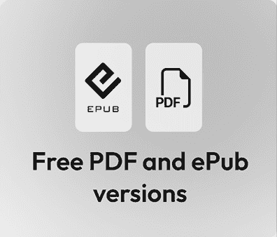

# 前言

人工智能是我们这个时代最具争议的技术之一，尤其是对于创意人士来说。如果你相信炒作，它将在几年内取代所有电影制片人和摄影师，而且再也没有人会用手动创造任何东西。但炒作很少转化为现实。

相反，在这本书中，您将看到 AI 如何有可能帮助创意人士变得更加有创造力。确实，AI 将执行一些创意人士曾经被分配的任务，但那些看不到人类价值的客户已经在使用模板和预设。当涉及到需要创造力的工作，人类仍然占上风。

如果创意人士愿意，可以通过使用正确的 AI 工具并避免使用其他工具来增强他们的能力。我在创意人士中经常听到的一个常见的说法是描述一个工具为“好的 AI”或“机器学习，但不是 AI”，但这种区别可以更好地表达为**实用 AI**或**自动化 AI**与**生成式 AI**（更多内容见*第一章*)：

+   **实用 AI**: 识别、分类和理解

+   **生成式 AI**: 文本、图像、视频、音频等的创作

+   **自动化 AI**: 执行人类通常执行的任务

有些任务无聊、乏味，甚至对人类来说难以做好。今天，**实用 AI**工具可以帮助你完成任务，或者，如果它更可预测，**自动化 AI**可以为你完成。很少有创意人士愿意一个像素一个像素地选择像素，或者一帧一帧地追踪轮廓，即使 AI 工具并不完美，人类也常常能从它的帮助下受益。有些工作可以自动化或简化；其他工作最好手工完成。这取决于你。

尽管**生成式 AI**吸引了大部分的仇恨，但这并不意味着它全是坏的；这取决于你如何使用它。虽然版权和伦理问题确实是存在的（见*第二章*），但记住，在开发过程中，当你提出想法时，几乎任何事情都是可能的。好莱坞导演在编辑新电影时，会使用其他电影的配乐，每个级别的情绪板都充满了别人的作品。这不是一个新概念，如果你做得正确，使用生成式 AI 帮助开发想法，同时人类创造最终产品是可能的。

为了帮助您理解大量使用 AI 功能工具和应用程序，我在这里采取了广泛的视角，尽可能测试了尽可能多的基于网络的服务和本地运行的应用程序。虽然我已经为一些桌面应用程序中隐藏得较好的功能提供了逐步说明，但对于易于使用的网站，我主要关注结果。

由于这本书主要是为非技术创意人士编写的，因此这里检查的大多数解决方案都是面向公众的应用程序和服务。热衷者和开发者可能希望探索开源模型的世界，但大多数设计师不是编码者，您不需要编码就能遵循这里的示例。

在整个过程中，我试图诚实地评估这些系统在面临现实世界问题时实现其承诺的程度。虽然有些对我来说效果不佳，但它们可能对你有效。确实，AI 变化的速度意味着这些系统在我测试它们之后可能已经发生了变化：一些可能会改进，一些可能会更昂贵，而一些可能已经不存在了。

新的模型和新的工具将继续出现——一些在撰写章节和前言之间已经出现——你应该总是准备好亲自测试。但始终要警惕炒作，因为一个解决方案可能在技术上令人印象深刻，但仍然无用。

当你探索为创意专业人士设计的 AI 工具时，你会被许以世界。有时，你会对一项枯燥的工作（如转录）能如此迅速地完成感到惊讶。在其他时候，惊讶和失望的并置可能会令人震惊，例如当我要求 AI 写一首关于海滩度假朋友的歌时。在 30 秒内得到 4 首可接受的歌是令人惊讶的，但其中两首歌是从机器人泳池清洁工的角度来的，这既令人失望（又好笑）。

探索这些工具是一次疯狂而迷人的旅程，我相信它还将持续一段时间。在你自己的旅途中，预期会有不完美：取其精华，去其糟粕。但不要让机器人取代你的创造力。

# 本书面向的对象

这本书是为希望更好地理解 AI 的创意专业人士所写，以便他们能在自己的创意实践中使用 AI。这不是一本帮助任何人取代创意人类或其创造力的书。

# 本书涵盖的内容

*第一章*，*迄今为止的 AI 故事*，介绍了 AI 技术，讨论了它们的工作原理，并列出了你可能希望进一步调查的许多工具。

*第二章*，*伦理*，考虑了围绕 AI 使用的伦理和版权问题。

*第三章*，*音频实用 AI*，讨论了转录、节拍匹配、声部分割和音频清理工具。

*第四章*，*图像和视频实用 AI*，探讨了如何使用 AI 工具来组织和分类你的媒体，选择人物和物体，重新构图，为立体放映转换，等等。

*第五章*，*文本实用 AI*，探讨了关于书面内容的总结、语法、验证和重新格式化。

*第六章*，*文本生成式 AI*，专注于文本的重写、引用其他作品、提出想法和翻译。它还探讨了使用 AI 来帮助满足可访问性需求。

*第七章*，*使用图像的生成式 AI*，向您展示了如何从现有图像中操作并创建完全由文本或图像源生成的新图像。它考虑了照片、矢量艺术、3D 模型，以及情绪板和创意。

*第八章*，*使用视频的生成式 AI*，诚实地探讨了如何从文本、图像或其他视频中扩展和创建剪辑，以及如何将现有视频转变为全新的内容。

*第九章*，*使用音频的生成式 AI*，探讨了合成音频的世界，包括音效、音乐、语音、声音克隆以及替换现有录音的部分，以及音频翻译。

*第十章*，*使用图像的自动化 AI*，向您展示了几个使用 AI 为您代劳执行任务的工具，包括删除图片、修图以及其他处理任务。您还将了解如何使用 AI 编写脚本以帮助设计任务。

*第十一章*，*使用视频的自动化 AI*，探讨了几个自动化视频编辑的工具，从简单的静音移除，到更简单的编辑工具，再到基于提示的全编辑助手。

*第十二章*，*使用数字助手和代理的自动化 AI*，探讨了数字助手可能如何进一步发展，AI 驱动的可穿戴设备和浏览器，以及代理的潜力。

# 要充分利用这本书

您越熟悉更具创意的领域（例如摄影、设计、修图、视频编辑和写作），您会发现这本书越有用，但本书的编写是以普通读者为对象的。

本书中的大多数工具都是基于云的，而一些可以在本地计算机上运行。一台现代 Mac 可以运行本书中提到的所有本地应用程序；一台现代 PC 可以运行其中大多数。

您不需要配备强大显卡的定制 PC，也不需要知道如何编码。

## 下载彩色图像

书的免费 PDF 版本包含了本书中使用的截图/图表的彩色图像。您可以从这里下载：[`packt.link/gbp/9781806025817`](https://packt.link/gbp/9781806025817)。

## 使用的约定

本书使用了多种文本约定。

`CodeInText`：表示提示和其他输入。例如：“我将要求工具用普通英语执行：`从这张图片中移除人物`。”

**粗体**：表示新术语、重要单词或屏幕上看到的单词。例如，菜单或对话框中的单词在文本中显示为：“今天，现有的工具通过**生成式移除**和**生成式填充**这两个完全生成式功能得到增强，这些功能利用了 Adobe Stock 授权的图像。”

警告或重要注意事项看起来像这样。

小贴士和技巧看起来像这样。

# 联系我们

欢迎读者反馈。

**一般反馈**：如果您对本书的任何方面有疑问或有任何一般反馈，请通过`customercare@packt.com`给我们发送电子邮件，并在邮件主题中提及本书的标题。

**勘误表**：尽管我们已经尽一切努力确保内容的准确性，但错误仍然可能发生。如果您在此书中发现错误，我们将不胜感激，如果您能向我们报告此错误。请访问[`www.packt.com/submit-errata`](http://www.packt.com/submit-errata)，点击**提交勘误**，并填写表格。

**盗版**：如果您在互联网上以任何形式发现我们作品的非法副本，如果您能提供位置地址或网站名称，我们将不胜感激。请通过`copyright@packt.com`与我们联系，并提供材料的链接。

**如果您有兴趣成为作者**：如果您在某个主题上具有专业知识，并且您有兴趣撰写或为本书做出贡献，请访问[`authors.packt.com/`](http://authors.packt.com/)。

# 分享您的想法

读完《AI for Creative Production》后，我们很乐意听到您的想法！请[点击此处直接访问此书的亚马逊评论页面](https://packt.link/r/1806025817)并分享您的反馈。

您的评论对我们和科技社区都至关重要，并将帮助我们确保我们提供高质量的内容。

# 书籍的免费福利

本书附带免费福利以支持您的学习。现在激活它们以获得即时访问（有关说明，请参阅“*如何解锁*”部分）。

以下是您购买后可以立即解锁的快速概述：

| **PDF 和 ePub 版本** | **下一代基于网页的阅读器** |
| --- | --- |
|  |  |
|  | 访问此书的无 DRM PDF 副本，在任何设备上阅读。 |  | **多设备进度同步**：在任何设备上继续阅读。 |
|  | 使用您喜欢的电子阅读器的无 DRM ePub 版本。 |  | **高亮和笔记**：捕捉想法，将阅读转化为持久的知识。 |
|  |  |  | **书签**：保存并随时重新访问关键部分。 |
|  |  |  | **暗黑模式**：切换到暗色或棕褐色主题以减少眼睛疲劳。 |

|

## 如何解锁

扫描二维码（或访问[packtpub.com/unlock](http://packtpub.com/unlock)）。通过名称搜索此书，确认版本，然后按照页面上的步骤操作。 |  |

| **注意**：请妥善保管您的发票。直接从 Packt 购买不需要发票。* |
| --- |
