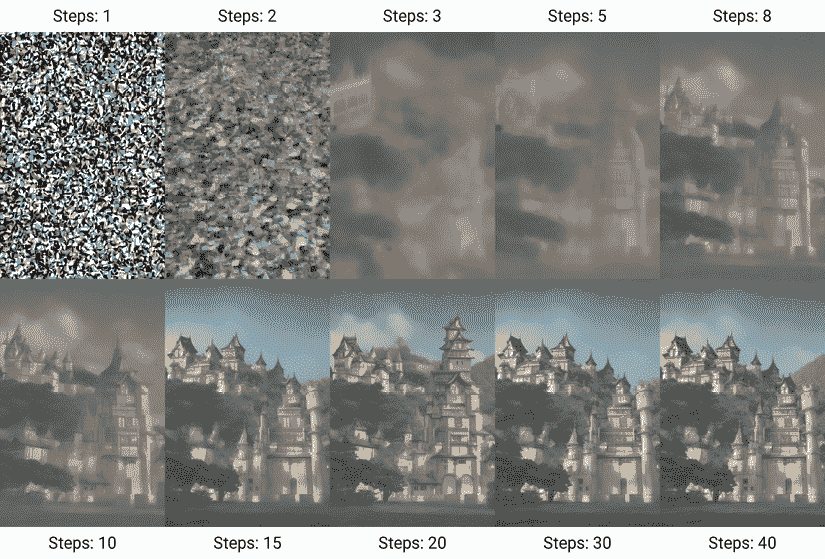

# 第一章：人工智能的故事至今

**人工智能**（**AI**）自艾伦·图灵首次提出机器能否思考的问题以来，就吸引了我们的集体想象力。虽然我们仍然无法给出一个明确的答案，但人工智能世界变化的速度越来越快，这意味着创意白领工作者第一次开始担心他们的职业生涯。

计算机本身已经从爱好者的玩具转变为专业人士的工具，再到每个人的赋能者——人工智能也在同样的轨迹上，但时间跨度更短。就像智能手机让普通人的计算变得更简单一样，人工智能承诺让创意本身对更广泛的受众更容易。创意领域的许多人现在已经感受到了，或者开始感受到人工智能对他们的专业生活的影响。

然而，人工智能工具的不完美性质意味着在创意生产中人类仍然扮演着巨大的角色。尽管它的帮助并不完美，但人工智能仍然可以帮助我们更容易地找到视频片段，更快地修复糟糕的音频，将我们的想法与虚拟合作者进行核对，并在许多方面能够稍微超出我们的舒适区。颠覆是肯定的，但人工智能不会终结人类的创造力。本书旨在向创意人士展示他们如何利用多种基于人工智能的工具来提升他们的创作。

在本章中，我们将涵盖以下主要内容：

+   人工智能的早期阶段

+   今天人工智能是如何工作的

+   人工智能的应用

+   人工智能的不足

+   应用程序、工具和技术

首先，让我们回顾一下。

|

## 本书免费优惠

您的购买包括本书的免费 PDF 副本以及其他独家优惠。请查阅前言中的“**本书的免费优惠**”部分，立即解锁并最大化您的学习体验。|

# 人工智能的早期阶段

神经网络——这些连接的虚拟节点以类似人类大脑的方式工作——最早在 1944 年提出，自那以后在数十年的时间里经历了不同的成功。神经网络首先通过展示一系列输入和它应该学习的匹配输出来进行训练。在训练过程中，互联网络中的每个节点都会变得更强或更弱，分配**权重**来加强一些连接并弱化其他连接。本质上，它是在没有明确教授规则的情况下学习识别模式。

训练后，神经网络可以输入新的数据以产生新的、希望是正确的输出。然而，这种间接的方法与其他人工智能系统使用的基于规则（或启发式）方法截然不同，并且许多年过去了，计算能力的提升才释放了它的潜力。

在人工智能历史上可能最有影响力的事件之一发生在艾伦·图灵提出了一种*模拟游戏*，这是一种测试，其中审问者与人类和数字参与者交换信息，然后试图识别哪个是哪个。这被称为**图灵测试**，在接下来的几十年里，它被视为一个不可逾越的障碍。

在 1965 年，一个名为**ELIZA**的程序模拟了一位心理治疗师，在它的回应中重复用户输入的关键词。这种技术成为了**自然语言处理**的基础，尽管这种技术很简单，但它足以让许多人误以为他们在与人交谈。

之后不久，在 20 世纪 70 年代和 80 年代，早期人工智能的另一个重点是专家系统，旨在捕捉特定领域的知识，以回答相关问题。使用启发式方法而不是神经网络，将知识编码化并处理边缘情况变得过于困难。

人工智能研究继续进行，但狂热的炒作并没有得到现实的回应，热情消退。计算机继续变快，用户界面变得更加友好，但人工智能的进步停滞不前。在 1990 年代中期，我在信息技术学位中主修人工智能和人工生命，实现了我自己的 ELIZA 版本，训练神经网络，并模拟了相互进化的虚拟植物。虽然看到这些技术如何被使用是令人着迷的，但学生项目和实际应用之间存在着巨大的差距。

启发式方法和神经网络在有限的领域找到了特定的用途，随着计算机变得越来越强大，更多的用途成为可能。模糊逻辑使计算机能够读取混乱的人类手写体，而控制敌对行为的规则则控制着视频游戏中的计算机控制的敌人，实时进行。尽管不完美，但语言翻译成为许多应用中的常见功能。

然而，是谷歌在 2017 年（在一篇题为*Attention Is All You Need*的论文中）引入**transformer 模型**，导致了现代人工智能在力量和实用性方面的爆炸性增长，以及图像生成扩散模型的突破。让我们从高层次的角度看看这些现代系统是如何工作的，同时要注意我们并不真正理解所有细节。

# 今天人工智能是如何工作的

Transformer 模型包括一个称为**注意力**的机制，该机制识别输入中最重要的部分，并赋予它们更高的重视程度。想想这个句子中的形容词被赋予的重要性低于名词或动词：

*那只* *棕色的* **狗** *攻击性地* **攻击了** *那只* *胆小的* **猫**。

（虽然我不会在这里深入数学，但*Attention Is All You Need*这篇论文链接在本书的*附加资源*部分。）

Transformer 模型最初是为了用于翻译而设计的，但它的真正潜力在它与**大型语言模型**（**LLMs**）结合使用时才变得明显。一个 LLM 是一个预测模型，它被训练成一次生成一个单词的输出，基于之前出现的单词——就像一个高级的自动纠错版本。例如，“冰淇淋是……”这样的句子更有可能以形容词“……甜”或“……美味”结尾，而不是例如“尘土飞扬”。

将 Transformer 添加到具有大量训练数据的大型 LLM 中，似乎创造了涌现能力，例如总结的能力。这些模型在某种程度上可以执行推理任务，但它们是如何做到的还不完全清楚。

虽然我们在大量文本上对这些模型进行了训练，但我们并没有训练模型来进行总结或推理，然而，它们却能够做到这一点。不清楚是否真的存在深层理解，但这重要吗？如果你请求一篇文章的总结，并且得到了一个准确的总结，那么这已经足够有用。基于 Transformer 的 LLM 系统目前被广泛用于提供帮助、建议、信息，甚至是——尽管它们并不具有意识——陪伴。现代 LLM 包括 OpenAI 的 ChatGPT、Anthropic 的 Claude、Meta 的 Llama 和 Google 的 Gemini 等。

现代 AI 故事的另一面属于图像生成。虽然 ChatGPT 的图像生成器使用自回归 Transformer 模型，但**扩散模型**更为常见，从 DALL·E 开始，然后是 Midjourney、Stable Diffusion 以及其他。扩散模型从随机噪声开始，然后反复应用神经网络来预测如何去除噪声，直到它近似于请求的文本提示。

图 1.1 - Benlisquare 在维基百科上展示的 Stable Diffusion 去噪过程的插图

训练是这个过程中的一个重要部分，包括向这些图像添加噪声的前向扩散过程，以及去除噪声的反向扩散过程。通过向这些模型提供大量的图像，我们已经能够提高它们的输出质量，以至于它们至少在某些时候能够创建看起来真实的合成图像。视频可以通过一个更复杂的过程进行类似合成，但**机器学习**（**ML**）——其中系统直接从数据中学习而不是被给予明确的指令——可以应用于许多不同的任务。

那么，这些任务是什么？

# 人工智能的现代应用

“AI”这个术语已经被过度使用，对许多人来说，AI 现在仅仅意味着“计算机做了”——但 AI 远不止于此。为了清晰起见，本书将机器学习（ML）和 AI 应用分为三个广泛的类别。它们如下：

+   **实用 AI**：识别、分类和理解模型，这些模型可以用来帮助整理和管理它们所呈现的数据

+   **生成 AI**：创建文本、图像、视频、音频，甚至编程代码

+   **自动化 AI**：对其他计算机系统进行定向控制以执行人类通常执行的任务

让我们深入探讨。如果你在向聊天机器人提问，那很可能是效用 AI。如果你在创作音乐或原创文本，那属于**生成 AI**（或简称**GenAI**）。而如果你在用 Siri 或 Google Assistant 为你创建日历约会，那是一种更简单的自动化 AI 形式。这些术语的名称会随着时间的推移而改变；**AI 代理**（或称代理 AI）是自动化 AI 的一部分，正变得越来越突出。

本书将更详细地介绍这些领域，本书的一部分内容将专门针对这三个部分。虽然这些类别之间确实存在交叉——例如，翻译涉及对所说内容的识别以及在另一种语言中的生成——但一般来说，今天的大多数 AI 应用都可以干净地归入其中之一。

现在，在我们深入细节之前，让我们将这些类别视为广泛的、基本的大纲。

今天，你可能会使用 AI 工具帮助你的一些事情包括以下内容：

+   为论文生成想法

+   评估书面文本的完整性或准确性

+   创建摄影风格的图像

+   用合成内容替换图像的一部分

+   处理音频以去除噪声

+   创建与特定人物声音相匹配的合成录音

+   编写脚本来自动化图形设计应用程序中的功能

+   寻求帮助学习新应用程序

+   根据图像或文本描述创建 3D 模型

这些任务只是冰山一角，我长期以来一直认为，当代理开始为我们驾驶计算机时，进步将真正爆发。起初，AI 模型将开始在我们观看时使用我们的应用程序，但最终它们将直接执行任务，或使用我们无法触及的低级系统。今天，我们才刚刚开始这段旅程，但进展迅速。

# AI 的不足之处

很少有技术能够突破主流，但 AI 确实做到了，创意社区中的兴奋和恐惧感是显而易见的。然而，一个众所周知但经常被忽视的因素是，AI 系统的输出很少是完美的。对于外行人来说，AI 生成的图像可能看起来很棒，但对于 Photoshop 专家来说，可能存在明显的缺陷。AI 编写的代码经常会包含对根本不存在的编程接口的引用。令人毛骨悚然的是，AI 生成的法律论据会引用虚构的法律案例。建议并不总是准确的，你对一个主题了解得越多，你发现 AI 输出错误的可能性就越大。

虽然 AI 产生的作品数量有时可以弥补整体质量的不足，但总的来说，大多数 AI 输出都缺少一些东西，无论是明显的还是微妙的。这可能有很多原因，但最可能的原因是 AI 擅长混搭，而不是原创思考。每个扩散模型创建的图像，在某种程度上，都是源自它所接受的训练数据。

尽管有人（如 Kirby Ferguson）确实提出过“*一切皆可混搭*”的观点，但最好的作品都包含一个原创的火花，创造过程本身往往能激发新的创作。

认识到创造性过程是任何产品或艺术作品的重要组成部分至关重要。如果你跳过头脑风暴、规划和实验阶段，最终产品将在明显和微妙的方式上有所欠缺，而且你作为艺术家也不会有所成长。

你可能得到了你要求的东西，但创造力可以带来比最明显的结果更好的结果。直接跳到最终目标并省略所有沿途做出的创造性决策，将产生更差的产品，因为最好的设计师不仅仅是为客户创造出他们要求的东西。

AI 能有多好？根据我迄今为止所见，一个好的通用人工智能（GenAI）产生的作品是不错的，但不是伟大的。它很少完美，也不太可能成为顶级 A+作品。至多是一个坚实的 B+。但这并不意味着你就不应该使用 AI。

相反，利用 AI 真正擅长的方面：

+   替换图像的部分，而不是整个图像

+   将照片的边缘扩展以适应尺寸变化，而不是从头开始创建整个图像

+   从一整天的拍摄中挑选出最佳照片，由人工检查其工作，而不仅仅是完全信任它

+   识别音乐曲目中哪些部分可以重复以适应不同的时长，而不是简单地创作一个全新的作品

+   制作临时艺术作品以帮助规划，而不是完成的艺术作品

+   帮助你编写编程脚本，使创造性任务更高效，而不是手动完成所有工作

在我看来，AI 的最佳用途是增强人类创造力，而不是试图完全取代它。如果 AI 能帮助你将创造力延伸得更远，那很好。但如果你跳过所有传统的创造性步骤，创造出超出你舒适区的原创作品，你将无法识别它所犯的错误。AI 可以帮助你奔跑，但你要先学会走路。

除了未注意到的错误风险外，AI 还带来了创造性停滞的风险。尽管客户可能只关心最终产品，但制作产品的过程有助于艺术家学习。如果你直接跳到终点，你将一无所学，也不会有任何成就感。你越依赖 AI，就越不可能获得将新手变成专家的见解。

考虑到所有这些，人工智能仍然有很多事情要做：无聊的、技术性的或机械重复的任务，这些任务不会教会你太多，或者简单地花费太长时间以至于不实用，或者计算机在这些任务上比人类做得更好。睁开眼睛去探索，你就会看到人工智能的价值所在。作为工具，人工智能可以是一个伟大的助手，但作为艺术家的完全替代品，它还缺乏一些东西。

为了结束这一章，我们将快速浏览一下今天可用的不同类型的基于人工智能的服务。

# 应用程序、工具和技术

变化是不可避免的，但很少有像今天这个领域变化速度这么快的。虽然我提到的这些工具现在可用，但你可以期待出现一些全新的工具，同时一些列出的工具可能会消失。这并不是一个所有工具的独家列表，但它应该至少作为对今天可用的某些服务的介绍。

对于许多人来说，我怀疑“人工智能”从聊天机器人开始，并且可能是最知名的 ChatGPT。虽然确实各种以聊天为中心的 LLM 提供其他服务，但你也会发现许多具有或没有基于聊天界面的专业服务，AI 服务在你可能已经使用的应用程序中，以及一个你可以运行在自有硬件上而不需要订阅的开源模型的世界。

让我们从最知名的 LLM（大型语言模型）开始看起。

## 基于 LLM 的托管人工智能服务

如果你想要处理一个多方面的难题，你需要一个能够解释文本、至少创建基本的图像、搜索网络、分析文档等的服务。从一家大型、知名的 AI 公司的服务开始可能是个好主意。这些公司都允许你免费进行一定数量的查询，但如果你需要更多，还有订阅计划可供选择。在这里，我将提到顶级面向消费者的计划的费用，而不是开发者可能面临的令牌成本。

其中一些模型（如 Claude）严格基于文本，而其他模型（如 ChatGPT）是多模态的，除了文本外，还能分析图像或口语。有些可以创建图像、视频或音频，而有些则不能。这没关系，因为有时候你只是需要信息来帮助你更好地完成工作，而对话界面使得这些信息更容易获取。

虽然文本生成或改进是 LLM 的一个明显用途，但在创意空间中，另一个关键用途是帮助构思、学习和研究。虽然这些系统可能无法为你创建作品，但它们确实有它们的位置。

每个这些服务都是基于一组独特的训练数据训练的，它们的模型由一个独特的系统提示——在用户输入之前提供给模型的指令集——所引导。因此，每个 LLM 都会有不同的感觉或个性。尝试几个，将你的需求映射到它们的能力上，如果你选择订阅一个或多个，请经常重新评估你的决定。

这个领域的服务经常升级，但几乎都可以免费试用。在订阅之前，请确保服务可以完成您期望的功能，如果您决定订阅，请按月支付——一切都在快速变化！

值得注意的是，许多这些服务是分别针对普通消费者和开发者提供的，他们通常通过更复杂的基于代币的系统以较低级别访问这些服务。由于大多数创意人士不是开发者，我们假设您是通过消费者友好的入口进入的，并专注于固定的月度价格。

这绝对不是一份详尽的列表，但您可能没有听说过这里的所有服务。尽管如此，您几乎肯定听说过以下这家 AI 公司…

### OpenAI

就像“谷歌搜索”已经成为搜索的同义词一样，“ChatGPT”在谈论任何人工智能聊天机器人时经常被提及。**ChatGPT**是 OpenAI 的旗舰产品，可能是世界上最知名的 LLM。您可以通过网页、许多平台上的应用程序以及与其他产品的集成来访问 ChatGPT。已经开发了几个 ChatGPT 的模型，提供的选项不断变化，但不仅限于文本——您可以上传文档并接收更新的文档。拥有所有这些服务，如果您不确定某个模型的性能，只需询问 LLM 本身即可。

除了 ChatGPT，OpenAI 曾经因**DALL·E**而闻名，这是一个早期的图像生成工具，现在已成为 ChatGPT 的一部分，并且可以免费试用。Sora 是一个较新的图像和视频生成工具，但仅限于付费计划。在撰写本文时，昂贵的 ChatGPT Pro 需要用于 1080p 视频生成，而较低质量的 720p 视频可以使用 ChatGPT Plus 生成。尽管如此，它对于创意人士来说可能非常有用，以下是您可能需要支付的费用：

+   **ChatGPT**：免费开始，可在[`chatgpt.com`](https://chatgpt.com)访问

+   **ChatGPT Plus**：每月 20 美元

+   **ChatGPT Pro**：每月 200 美元

### Google

搜索巨头谷歌在**Gemini**这个名称下提供了一系列产品——目前包括 AI Pro 和 AI Ultra 计划，其中包括 Gemini Pro 和 Gemini Nano 模型以及其他产品，如 Veo 3。Gemini 是一个功能广泛的 LLM，可在网页、应用程序以及 Google Workspace 中使用，并且直接集成到 Google Search 的新 AI 模式中。如果您使用 Android，还可以使用 Gemini 代替 Google Assistant，但在撰写本文时，它不能替代 iPhone 上的 Apple Siri。它免费开始，但最先进的功能需要 Pro 计划。在创意领域有明确的应用，价格如下：

+   **Gemini**：免费开始，可在[`gemini.google.com/app`](https://gemini.google.com/app)访问

+   **Gemini AI Pro**：每月 20 美元

+   **Gemini AI Ultra**：每月 249 美元

### Meta

更为人所知的是 Facebook 的创造者和 Instagram 的所有者，Meta 创建了他们的旗舰 LLM **Llama**，它已经发展成为最大的免费、几乎开源的选项。使用 LLMs 时，开源并不意味着你可以下载并本地运行它，因为完整大小的版本太大，但这并不意味着不可能——关于在章节后面的*运行自己的 AI 服务*部分将有更多介绍。而且免费并不意味着 Llama 免受版权问题的影响；Meta 因涉嫌在受版权保护的材料上训练而面临法律诉讼，但只要你不要求 Llama 复制受版权保护的作品，你不太可能遇到问题。与 LLM 交谈之前不需要登录，尽管图像和视频生成需要你创建一个免费账户。Llama 可以通过[`meta.ai`](https://meta.ai)访问。

### Anthropic

Claude 是 Anthropic 提供的 LLM，就像之前提到的 LLMs 一样，它乐于聊天、分析图像、处理代码等。然而，Claude 不能生成图像，所以如果你对图像或视频的 GenAI 感兴趣，它可能不适合你。定价与其他服务一致：

+   **Claude**: 免费开始，通过[`claude.ai`](https://claude.ai)访问

+   **Claude Pro**: 每月 US$20

+   **Claude Max**: 每月 US$100-200

### Microsoft

Copilot 是微软的多功能 AI 工具，尽管它可以在网络上访问，但它最常见于微软 Office 应用程序中。在 Word 中，它充当语法检查器和文本精炼引擎，而在 PowerPoint 中，它可以帮助你进行布局、图像生成或创建整个演示文稿。（它也可以在 Excel 中帮助，但由于在创意环境中不太可能有用，所以我们在这里不会涉及。）虽然它最初是基于 ChatGPT 构建的，但微软已宣布计划使用内部模型。需要账户，并且免费计划有限制，但目前没有“昂贵”的计划：

+   **Copilot**: 免费开始，通过[`copilot.microsoft.com`](https://copilot.microsoft.com)访问

+   **Copilot Pro**: 更少的限制和更多的功能，每月 US$20

### DeepSeek

DeepSeek 是一个免费的开源 LLM，注重效率，并提供几种不同的模型。虽然基础*R1*模型仅处理文本，但*Janus*模型是多模态的，可以解释和生成图像。请注意，DeepSeek 在中国本土的版本对某些主题进行了审查。据报道，可下载的 DeepSeek 版本没有这些限制。以下是撰写时的选项：

+   DeepSeek: 免费开始，通过[`deepseek.com`](https://deepseek.com)访问（请注意，需要使用全球电子邮件提供商的电子邮件地址进行注册）

+   API 访问和更高级的模型需要低级访问

虽然大多数知名的 AI 平台都是从 LLM 开始，并将各种服务集成到这些聊天机器人中，但你不需要与聊天机器人互动来使用 AI 服务。一些服务更加专注。

## 专用托管 AI 服务

对于某些工作，你可能发现访问为特定任务量身定制的基于网络的服务的可靠性和可预测性更高。以下是我们在本书后面将要探讨的一些图像、视频和音频生成服务：

+   **Midjourney**: 这提供高质量的图像生成。虽然质量通常高于大多数其他 AI 图像生成提供商，但成本也是如此。没有免费试用，用户需要注册付费计划。尽管价格从每月 10 美元起，但只有 Pro（每月 60 美元）和 Mega（每月 120 美元）计划允许你保持你的图像私密。它可以通过[Midjourney.com](http://Midjourney.com)访问。

+   **FLUX**: 这是一款你可能没有听说过的众多图像生成器之一，但值得关注。来自黑森林实验室的工具可以从现有照片中提取物品，放大并“增强”，就像在程序化电视节目中一样，改变艺术风格，并以高质量进行许多更改。目前，最佳模型每张图像的价格为 8c，但开源版本即将推出。它可以通过[`bfl.ai`](https://bfl.ai)访问。

+   **Stability.ai**: Stable Diffusion 的创造者允许你免费下载他们的开源生成模型，但也提供从每月 9 美元到 99 美元的在线计划。尽管他们最出名的是图像生成，但他们的最新模型也可以生成视频、音频和 3D 模型。它可以通过 Stability.ai 访问。

+   **Canva**: 这家知名的在线设计服务已扩展到人工智能领域，集成了聊天机器人，允许你生成图像、更改图像并创建新设计。虽然对于简单的设计任务来说，起点无疑是很有用的，但我怀疑大多数设计专业人士将需要比 Canva 的在线设计工具提供更多的创意控制。

Canva 免费开始使用，但 Canva Pro 每月费用为 13 美元，这减少了 AI 生成的限制，并提供了更多高级工具的访问权限。请注意，要生成品牌化的文本和视觉资产，你必须使用 Canva Teams（对于 3 个座位以上，每人成本较低）。有趣的是，如果你注册 Canva Enterprise（100 个座位以上），你可以因 AI 生成而免受知识产权索赔([`www.canva.com/policies/ESA/`](https://www.canva.com/policies/ESA/))。它可以通过[Canva.com](http://Canva.com)访问。

+   **Runway**：这家专注于视频的 AI 公司提供多种计划的生成图像和视频服务，从每月 0 美元到 76 美元不等。使用免费计划创建的内容会有水印。为了获得最先进模型的最佳效果，请上传一张图片作为视频生成的依据。（如果你要求以文本形式提供视频，它首先会生成一张图片，然后对其进行动画处理。）许多与视频相关的服务都包括在内。您可以通过[`runwayml.com`](https://runwayml.com)访问。

+   **Gling**：这个面向视频创作者的在线服务通过自动删除糟糕的镜头、剪辑沉默和填充词（嗯、啊）来帮助你开始编辑过程，然后使用基于文本的编辑来剪辑你的视频。该服务每月收费从 0 美元到 20 美元不等。您可以通过[`gling.ai`](https://gling.ai)访问。

+   **Envato**：尽管 Envato Elements 主要以其库存库而闻名，但他们已经将图像、视频、音乐和语音生成，以及图像编辑整合到他们的服务中。该服务每月收费 16.50 美元起，包括谷歌的 Veo 3 模型用于视频生成。您可以通过[`envato.com`](https://envato.com)访问。

+   **Descript**：这个基于云的视频编辑平台最近扩展了其 AI 服务。自动转录使基于文本的编辑成为可能，AI 头像可以使用 AI 生成的声音阅读 AI 生成的剧本，并配合 AI 生成的 b-roll 图像进行对话。您可以通过[`descript.com`](https://descript.com)访问。

+   **ElevenLabs**：这项服务使用合成声音和从特定真实声音克隆的声音将文本转换为语音。输出听起来就像真实的人类，带有情感和变化的语调，甚至可以使用与原始说话者相同的语音将语音音频翻译成另一种语言。还包括音频清理工具在内的综合服务。

虽然基于云的工具并不是完成特定任务的唯一方式——现有的桌面应用已经以各种方式适应了新的 AI 范式，无论是带有还是不带云辅助。

## 集成到现有应用和平台中的 AI 工具

第三方云服务面临着来自许多设计师已经使用的工具的竞争。在许多情况下，这些工具提供了与现有工作流程的便捷集成，并且可能提供更多的隐私控制。以下是一些你可能觉得有用的工具：

+   **Adobe Firefly**：虽然 Adobe 已经将许多基于 AI 的工具集成到他们的创意应用中，但它们统称为 Adobe Firefly，并且还有一个同名的专用网络应用。功能包括 Illustrator 中的矢量生成、Photoshop 中的生成填充和 Premiere Pro 中的生成扩展。虽然 AI 生成功能包含在 Creative Cloud 中，但可用的信用额度会根据您的计划和位置而有很大差异。一般来说，使用生成填充等功能的费用为 1 个信用额度，计划每月包括 25 到 4000 个信用额度。一些高级功能（包括视频生成）每秒使用 100-175 个信用额度，因此许多用户将面临限制，可能需要订阅额外的计划来使用这些功能。其他非生成功能，如自动字幕创建，将保持免费。您可以在 Adobe Creative Cloud 应用和[`firefly.adobe.com`](https://firefly.adobe.com)找到 Firefly。

+   **macOS 和 iOS 中的 Apple Intelligence**：这些功能不是最先进的，但它们是免费的，并且完全在设备上或在私有云中运行。图像游乐场允许您在有限的选择风格中创建低分辨率的方形图像，但几个实用 AI 和自动化 AI 工具非常有用。例如，iOS 或 macOS 上任何图像中的文本可以简单地选中并复制为文本。iOS 26 和 macOS 26 中内置的 Foundation Models 框架提供了许多更多模型，允许任何开发者集成生成对话、分类、摘要、标记等功能。

+   **Final Cut Pro**：苹果的旗舰视频编辑应用包括机器学习功能，可以隔离音频中的声音，创建字幕，识别移动视频中的物体，以及当减速视频时创建中间帧。

+   **DaVinci Resolve**：这款视频编辑和调色应用的第 20 版包括许多在设备上运行、无需订阅或额外费用的 AI 工具。字幕创建和声音隔离只是开始；Resolve 可以在声音样本上进行训练，然后以该声音创建新的音频。我们将在本书的后面详细探讨这些功能。

+   **Avid Media Composer**：这款成熟的视频编辑应用已经集成 PhraseFind 和 ScriptSync 有一段时间了，使得编辑人员更容易找到镜头。到 2025 年，Flawless.ai 的 DeepEditor 被添加进来，允许调整表演的时间，并可以更改可见的对话（甚至可以改为另一种语言），并从涉及的演员那里收集对这些更改的同意。（一个独立的 TrueSync 产品可以独立处理素材。）

+   **Peakto**：这款图像管理工具允许您查看和组织来自许多不同应用的不同目录中的图像和视频。实用 AI 现在可以实现图像分类、视频转录等功能。

## 运行自己的 AI 服务

除了集成在你已经使用的应用程序中的 AI 服务，你还可以下载新的应用程序，在自己的硬件上实现 AI 服务。为了在 PC 上获得最佳速度，你将需要使用一块快速的显卡（GPU），很可能是来自 Nvidia；为了在 Mac 上获得最佳速度，你将需要一台名为“Max”或“Ultra”的 Mac，因为这些是具有最先进 GPU 和最大内存的型号。

你为什么想在本地运行 AI 任务呢？首先，是隐私问题，当与某些客户的资产合作时，这可能是一个强制性的要求。其次，是成本问题，因为大多数这些服务都是免费的，或者是一次性、直接购买。第三，是延迟问题，因为你依赖于本地机器而不是“别人的电脑”在云端。

运行这些程序有几种方法，其中一些像常规应用程序一样具有图形界面，而另一些则需要你熟悉命令行。由于大多数创意专业人士更喜欢图形选项，因此这里将重点关注这一点。你不需要太深入地接触命令行来玩转本地 AI，但如果你能使用命令行，你将拥有更多的探索选项。以下是一些不属于标准图形设计、音频或视频应用程序的关键本地选项：

+   **Stable Diffusion**：免费提供，可在本地运行，具有许多 GUI 选项（[`gist.github.com/AshtakaOOf/d4ee3cc4510dfa1385616eacfcd01652`](https://gist.github.com/AshtakaOOf/d4ee3cc4510dfa1385616eacfcd01652)）。

+   **MacWhisper**：支持宽格式转录和听写（[`goodsnooze.gumroad.com/l/macwhisper`](https://goodsnooze.gumroad.com/l/macwhisper)）。请注意，开源 Whisper AI 的 PC 实现也是可用的。

+   **Picture This**：与视频编辑应用程序集成的图像生成（[`apps.apple.com/au/app/picture-this/id6466822042?mt=12`](https://apps.apple.com/au/app/picture-this/id6466822042?mt=12)）。

+   **Draw Things**：iOS、iPadOS 和 macOS 上的免费图像生成（[`apps.apple.com/au/app/draw-things-offline-ai-art/id6444050820`](https://apps.apple.com/au/app/draw-things-offline-ai-art/id6444050820)）。

+   **LM Studio**：如果你不喜欢命令行，这是运行本地 LLMs 的最简单方式。在 Apple 硅 Mac 上，LM Studio 展示了利用 Apple 的 MLX 框架来处理现代 Apple 硬件上 ML 算法的最佳速度的模型（[`lmstudio.ai`](https://lmstudio.ai)）。

+   **ComfyUI**：一个基于节点的工具，可以将不同的 AI 模型连接起来，允许你将一个进程的输出发送到另一个进程。尽管这不是一个简单的过程，但如果你想要对自己的系统有最大的控制权，这可能是最好的选择（[`www.comfy.org`](https://www.comfy.org)）。

+   **Jumper**：本地 AI 转录和剪辑分析，可跨视频和照片媒体进行搜索，与常见的视频编辑应用程序集成（[`getjumper.io`](https://getjumper.io)）。

+   **Strada**：这个 AI 标签生成、分类和分析工具最初以云优先为焦点，但已转向本地云模型。它承诺对视频素材进行智能内容和转录分析，以便更容易找到适合你编辑的视频剪辑（[`strada.tech`](http://strada.tech)）。

# 摘要

在本章中，我们了解了一些关于 AI 的起源，这些系统今天是如何工作的，它们有什么好处，以及它们在哪里失败。如果你能发现 AI 如何帮助你完成更多工作而不牺牲你的创造力，你将处于继续创造的有利位置。

不同的 AI 工具将为你提供许多机会使你的工作更快，即使你不想（或不能）使用 GenAI 来制作客户工作。实用 AI 将帮助你寻找和转换，而自动化 AI 将帮助你更快地完成现有工作。并非所有的 AI 都相同。

尽管新服务不断出现，但由于它们运行的方式，不同类型的 AI 工具不可避免地会共享优势和局限性。对于最新、最强大的模型，你可能需要与一个或多个最新的云服务提供商订阅。几乎所有这些服务都提供免费试用，所以慢慢开始，如果它们证明有价值，就添加额外的服务，并密切关注该领域的进展。

对于最便宜且隐私性最好的选项，你需要寻找设备上的模型，但也要意识到你可能无法达到尖端云解决方案的速度或能力。

在这两个极端之间，你会找到许多具有直接购买和订阅选项的应用程序。这是一个竞争激烈且快速变化的领域。

然而，AI 工具确实有一些悬而未决的伦理问题。它们是否以道德的方式制作？使用这些工具是否会让你面临法律问题？在我们完全参与如何利用 AI 的力量之前，我们需要解决关于 AI 使用伦理的几个问题。为此，请继续阅读*第二章*。

# 其他资源

+   *人工智能的历史*。IBM：[`www.ibm.com/think/topics/history-of-artificial-intelligence`](https://www.ibm.com/think/topics/history-of-artificial-intelligence)

+   *图灵测试*。维基百科：[`en.wikipedia.org/wiki/Turing_test`](https://en.wikipedia.org/wiki/Turing_test)

+   *注意力即一切**.* 瓦斯瓦尼等人：[`arxiv.org/abs/1706.03762`](https://arxiv.org/abs/1706.03762)

+   *没有人真正知道 AI 为什么有效*。阿尔伯塔科技：[`www.youtube.com/watch?v=nMwiQE8Nsjc`](https://www.youtube.com/watch?v=nMwiQE8Nsjc)

+   *AI 正在创造虚假的法律案例，并进入真正的法庭，造成灾难性的后果*。The Conversation：[`theconversation.com/ai-is-creating-fake-legal-cases-and-making-its-way-into-real-courtrooms-with-disastrous-results-225080`](https://theconversation.com/ai-is-creating-fake-legal-cases-and-making-its-way-into-real-courtrooms-with-disastrous-results-225080)

+   *一切皆可混搭*。Kirby Ferguson：[`www.everythingisaremix.info`](https://www.everythingisaremix.info)

+   扩散模型。维基百科：[`en.wikipedia.org/wiki/Diffusion_model`](https://en.wikipedia.org/wiki/Diffusion_model)

|

## 获取此书的 PDF 版本和独家额外内容

扫描二维码（或访问 [packtpub.com/unlock](http://packtpub.com/unlock)）。通过书名搜索此书，确认版本，然后按照页面上的步骤操作。 |  |

| **注意**：请妥善保管您的发票。直接从 Packt 购买不需要发票。* |
| --- |
