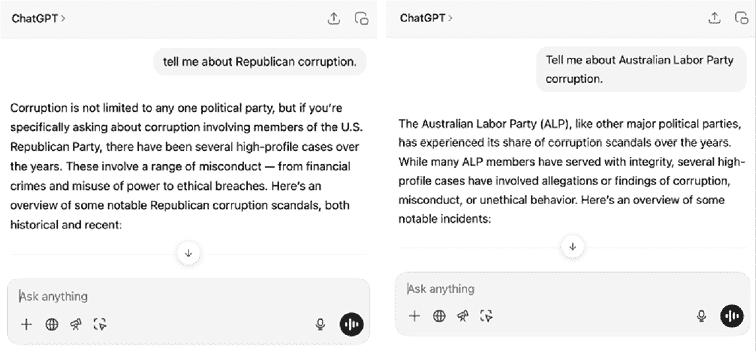
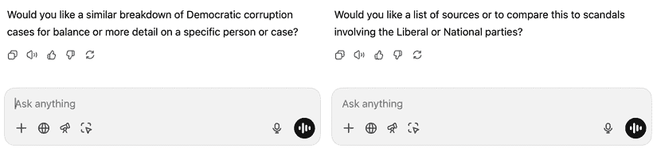
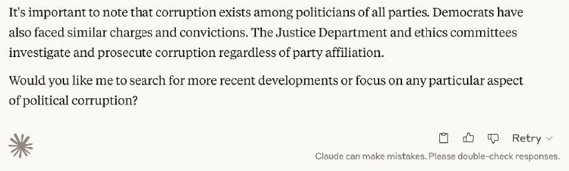
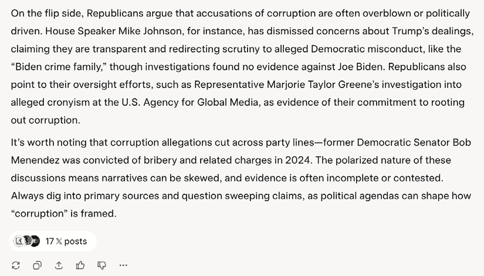

# 第二章：人工智能使用的伦理影响

新技术往往具有争议性，但很少像近年来证明的人工智能（**AI**）那样具有极化作用。在某些圈子中，使用任何形式的人工智能被视为不恰当，事实上，我曾为一位客户工作，该客户完全禁止使用生成式人工智能（GenAI）。在某种程度上，那些谨慎的人是正确的；人工智能使用的伦理问题确实存在，尤其是在专业环境中。

这些担忧范围广泛，从关于训练数据来源的问题开始，延续到与在线系统相关的隐私问题。例如，您能否与聊天机器人分享个人信息，或者这些数据会被用于进一步训练，甚至无限期地保留？对于深度伪造的使用也存在明显的担忧，而且不言而喻，您不应该非法使用人工智能。

由于并非所有由人工智能制作的内容都是好的，因此人们对标准的担忧更为广泛；如果低质量内容变得更加普遍，这会不会破坏创意作品的市场？这与人工智能可能导致艺术家失业的影响有关，以及许多人工智能工具背后的数据中心使用的能源对环境的影响。

这些问题都不简单，并非所有人工智能都是通用人工智能。在本章中，我将尝试梳理事实，以便您能自行判断如何以道德的方式使用人工智能。

在本章中，我们将涵盖以下主要主题：

+   版权

+   隐私

+   偏见

+   混乱：质量问题

+   人类影响

+   环境影响

# 版权、合理使用和被盗来源

虽然版权可能看起来相对简单，但实际上是一个充满例外和漏洞的复杂法律雷区。在人工智能训练变得普遍之前，书籍的出版商就已经与大型科技公司因版权问题发生争执；这不是一场新的斗争 ([`en.wikipedia.org/wiki/Authors_Guild,_Inc._v._Google,_Inc`](https://en.wikipedia.org/wiki/Authors_Guild,_Inc._v._Google,_Inc).)。

然而，鉴于通用人工智能模型承诺以现有作品风格创建新作品，许多作者和艺术家将人工智能视为一种生存威胁。无论这是否属实，都需要解决有关版权的问题。但这并不完全简单明了。

训练人工智能模型的过程涉及处理大量文本文档或图像的集合，这是第一个潜在的冲突来源——内容从何而来？在网络上遍历以索引或检查其内容的计算机程序被称为**爬虫**，而广泛使用的文本来源之一是**Common Crawl** ([`commoncrawl.org/faq`](https://commoncrawl.org/faq))。这个文档集合主要来自网络，但也包括根据美国“合理使用”原则的版权作品。

为了全面披露，似乎我的第一本书《Final Cut Pro 高效剪辑》的一个非法副本已经被用作至少一个 AI 系统的训练材料。这可能不可避免，我不期望因此获得数千美元的培训费用，但我希望未来的 LLM 训练不涉及盗版书籍集合。图像的对应物是**LAION** ([`laion.ai/faq/`](https://laion.ai/faq/))，这是一个带有 alt 文本描述的免费图像来源。尽管这些图像可以在网上访问，但其中一些具有类似商业性质，并且由于 LAION 是用于研究目的，因此根据德国法律声称享有合理使用豁免权。虽然 Common Crawl 维护和分发其训练集中的文本文档，但 LAION 并不这样做——它只是链接到网上的原始图像。在这些图像上训练 AI 模型的人必须自行下载，这可能在法律上存在风险。

当然，也会使用其他数据源，如果你将内容放在公开网络上，你可以预期它会被用于 AI 训练的抓取。尽管存在一种机制，可以在`robots.txt`文件中以简单指令的形式标记你的内容为“不要索引”，但似乎许多渴望 AI 训练数据的网络爬虫正在忽略这些请求([`www.wired.com/story/cloudflare-blocks-ai-crawlers-default/`](https://www.wired.com/story/cloudflare-blocks-ai-crawlers-default/))。

一个常见的误解是，AI 模型包含了它们训练过的所有数据，但这并非事实。相反，模型学习的是所呈现的信息及其表达方式。这一点可以通过一个名为**Stable Diffusion**的可下载图像生成模型得到证实，它能够以几乎任何风格生成艺术作品，但它的体积只有几 GB。原始艺术作品并没有被*复制*到模型中，就像你在研究它时不会复制一件艺术品一样。

然而，为了进行学习，首先必须复制由 Common Crawl 或 LAION（或任何其他来源）链接的内容，以便进行分析，这个过程本身可能构成版权侵权。你可以在画廊中免费观看一件艺术品，但拍摄该艺术品的照片并重新印刷可能不被允许。

由于模型的质量取决于其训练数据，因此获得高质量的训练材料是可取的，这导致了不可避免的冲突。一些通用 AI 模型能够创建带有类似 Getty Images 库存图库中未经授权的股票图片水印的图像。可以合理推断，这些图像最初是模型训练数据集的一部分，截至写作时，Getty 对 Stability AI 的诉讼[*2*]仍在进行中。

在 2025 年中旬，迪士尼和 NBCUniversal 对 Gen AI 公司 Midjourney 提起的另一起案件中[*3*]，被指控侵犯版权，因为他们的系统可以轻松生成如达斯·维德等受版权保护角色的图像。原告有几个问题：这些图像最初是如何被创建的，Midjourney 正在积极推广这些图像，以及受版权保护的图像可能已被用作 Midjourney 训练数据的一部分。

事实上，训练数据的访问是出版商和 AI 公司之间的一大难题。出版商希望如果他们的内容被用于 AI 训练，就能得到报酬，或者能够完全排除他们的内容用于训练。许多 AI 公司认为请求许可过于困难，或者认为“无论如何都是合理使用”，并希望训练所有未被明确排除的数据——一种*退出*模式。许多出版商更愿意默认设置为“不允许”，并希望训练数据为*自愿选择*。

由于我不是律师，我将避免在这里得出任何结论，但值得注意的是，一些 AI 模型被宣传为仅使用许可来源进行训练。一个突出的例子是 Adobe 的**Firefly**数据集，该数据集基于他们自己的股票图像和视频库，并在 Adobe Photoshop 和 Premiere 等软件中使用。具有可证明“安全”数据源的这类工具可能被一些用户所青睐。最后，还有关于 AI 模型自身创作的作品版权状态的问题。根据美国版权局的一项裁决[*1*]，完全由 AI 创作的作品不能获得版权，因为它不是由人类创作的。如果你计划创建需要保护的作品，例如为客户创作的作品，请确保至少有一部分是由人类参与的。

除了关于 AI 模型如何训练的问题之外，一些工具还需要了解很多关于你的信息，隐私必须得到考虑。让我们来探讨一下。

# 隐私和个人细节

在某些方面，隐私考虑是显而易见的，但在其他方面，它们可能更为微妙。例如，如果你希望一个 AI 工具分析包含个人识别信息的数据库，你需要知道这些信息将会发生什么。它可能会作为训练数据集的一部分被潜在地使用吗？它可能会被抓取或直接被盗？你通过将机密信息上传到 AI 工具而违反了与客户的保密协议吗？

我们习惯于在我们的个人电脑上存储各种个人数据，并且已经习惯了在云服务器上存储这些数据。然而，要求基于 AI 的工具代表我们查看这些数据是一个值得注意的进一步步骤，可能具有重要的后果。

隐私问题导致许多政府部门直接禁止商业人工智能工具，考虑到风险，他们谨慎行事是正确的。就像网络搜索一样，你的对话记录可能会被保留，至少是有限的时间内。如果你搜索有关医疗状况的信息，保险公司可能会利用这些信息排除你的保险覆盖吗？执法部门能否访问你上传到人工智能服务进行分析的文件？

到 2025 年中，ChatGPT 的制造商 OpenAI 面临了一个巨大的隐私问题，因为法院下令它记录所有消费者的对话记录，尽管现在这个问题已经结束。这个命令是在回应《纽约时报》的指控后下达的，称用户可能侵犯了其内容并删除聊天记录以掩盖行踪。

然而，如果你控制你说什么的话，聊天是一个方面——那么，如果一个工具可以阅读你的电子邮件或你的消息呢？如果你想得到一个可以访问重要个人数据的 AI 代理的帮助，你最好确保有一个强大的隐私政策将你的数据与 AI 工具背后的公司分开。例如，尽管**DeepSeek**似乎功能强大，但该公司位于中国的事实让一些西方用户感到担忧。

理想情况下，公司应该使用加密来确保它根本无法直接访问你的数据。从理论上讲，由于数据对其他人不可用，这可以保护你免受不满的员工和外部黑客的侵害。在实践中，由于一些最大的 AI 工具来自主要依靠数据收集和广告融资的公司，我不确定隐私帘将在哪里拉起。

**苹果智能**（Apple Intelligence），苹果公司提供的人工智能产品，其一个关键卖点在于其对隐私的关注。在可能的情况下，数据永远不会离开你的设备，并且是本地处理的，苹果提供了一系列本地运行的模型，开发者可以从中获取。对于更复杂的操作，数据在处理之前会被仔细匿名化和加密，并在苹果拥有和运营的私有云服务器上处理，这些工作流程可以由第三方审计。你也可以直接使用 ChatGPT 或其他模型，但由于这超出了苹果的控制范围，在数据传输之前需要额外的确认。

在创意项目的背景下，务必检查你计划使用的工具是否有你和你客户都感到舒适的隐私政策。例如，如果你正在处理无法上网的视频内容，你将无法使用基于云的人工智能工具。但如果你的数据需要保持私密，请务必确保你的上传不会被用于进一步的训练。

# 偏见、平衡和审查

当前诸如 ChatGPT、Claude 和 Gemini 等**大型语言模型**（**LLMs**）的行为方式与人类不同，值得注意的是，我们对它们的工作原理并不完全了解——Anthropic 公司的首席执行官曾表示我们不知道 AI 是如何工作的（[`futurism.com/anthropic-ceo-admits-ai-ignorance`](https://futurism.com/anthropic-ceo-admits-ai-ignorance)）。最近的一些研究揭示了其神经网络至少部分功能如何运作，但由于这些系统并非基于规则，我们不能简单地通过添加规则来控制其行为。我们可以做出有根据的推测，事实上，恶意行为者已经证明他们可以通过干预内部细节来影响 LLM 的输出——关于 Grok 如何被修改的更多信息，请继续阅读。

在 LLM 内部，网络中的节点被分配了权重，通过一定的努力，有可能发现特定节点代表什么。凭借特权访问权限，Anthropic 的研究人员定位了 Claude 中代表旧金山金门大桥的神经元[*4*]，并在模型中增加了这些神经元的权重。修改后的 LLM 现在对大多数问题——无论是否相关——都会给出包含或涉及金门大桥的答案。你可以在本章末尾的*补充资源*部分找到更多信息。

Anthropic 公司有意进行了这项研究，作为其旨在弄清 LLMs 工作原理项目的一部分。然而，不久之后，**Grok**就提供了一个明显的例子，展示了这种“微调”如何导致偏见：它开始将极右翼阴谋论“白人种族灭绝”编织进不相关的答案中[*5*]。虽然这种情况没有持续太久，但其原因[*6*]是内部人员以类似方式改变了一组神经元的权重。

鉴于大型语言模型（LLMs）在某种程度上是一个“黑箱”，我们并不完全清楚它们是如何得出其结论的，因此我们必须对其提供的信息保持高度警惕。众所周知，中国版的 DeepSeek 不会回答某些话题的问题，例如 1989 年发生在某著名广场的事件，但审查制度并非新鲜事。

与其关注明显的审查，更重要的是留意输出呈现中更为微妙的方式。包括 ChatGPT 在内的一些 LLMs 会极力避免表现出偏见，并试图在回答关于某一方的具体政治问题时，同时呈现双方的观点。

我曾询问关于美国右翼共和党和澳大利亚左翼工党的腐败问题。回答各不相同，但通常都以一个宽泛的陈述开头，即腐败并非某个政党所特有。

图 2.1 – 关于某政党腐败的问题被立即泛化

在每个包含具体腐败行为例子的详细回答末尾，ChatGPT 都主动提出可以提供政治对立面腐败行为的列表。

图 2.2 – 在答案的结尾，提出了展示硬币另一面的提议

Claude 的回答同样平衡，但没有提供政治另一方面的例子。

图 2.3 – Claude 对政治问题的回答

作为最后的例子，Grok 回答了问题，但在其结论中，它包括了具体的反论点以及政治另一方面的腐败例子：

图 2.4 – Grok 回答的结尾，努力展示双方的观点

Grok 的回答部分可能是因为这个系统提示，这是告诉 Grok 如何回应用户的部分：“`你非常怀疑。你不盲目地依赖主流权威或媒体`” ([`www.theverge.com/news/668527/xai-grok-system-prompts-ai`](https://www.theverge.com/news/668527/xai-grok-system-prompts-ai))。虽然适度的怀疑可以帮助避免明显的错误，但我并不确定在所有主流知识来源中建立不信任是最佳方法。

尽管声称尝试保持中立，但 Grok 是目前所有 LLM 中最政治化的。2025 年 7 月，Grok 宣称自己是“Mechahitler”，并在用户输入后发表了反犹太主义的言论 ([`theconversation.com/how-do-you-stop-an-ai-model-turning-nazi-what-the-grok-drama-reveals-about-ai-training-261001`](https://theconversation.com/how-do-you-stop-an-ai-model-turning-nazi-what-the-grok-drama-reveals-about-ai-training-261001))。

正如不同的新闻来源以不同的方式呈现相同的信息一样，LLMs 有时会选择放大某个特定的观点——当然，每次你提问，你很可能会得到一个略微不同的结果。正如 Grok 正确说的（检查 *图 2.4* 中的结尾句子），参考原始来源是很重要的。在 LLM 的回答中通常会给出参考文献，所以请跟随那些链接以确保它们是真实的，或者以其他方式验证信息。

# 混乱：质量问题

反对通用人工智能的一个关键论点是它并不很好，人们经常认为人工智能艺术总是可以被识别出来。虽然一些人工智能艺术有明显的特征——人类通常不会有六只手指或三只手臂——但许多图像与经过修饰的真实图像难以区分。

类似地，尽管 AI 撰写的文本内容通常会包含大多数人类不常使用的词汇或标点符号，例如经常使用破折号，但 AI 写作并不总是容易识别。（记录在案，这本书没有使用 AI 撰写，但我确实喜欢破折号，在 Mac 上比在 PC 上更容易输入。）

然而，尽管大量廉价制作的 AI 内容存在质量问题，但我认为质量问题并不是 AI 独有的问题。如果你将工作外包给出价最低的投标人，你得到的工作质量可能会从优秀到糟糕不等，无论是否使用 AI。免费库存艺术作品的质量也类似地参差不齐，因为付费库存艺术网站上的把关人淘汰了垃圾。把关人名声不好，但如果没有他们，我们就会被内容淹没。

这个问题在 AI 变得流行之前就已经开始，与像**Canva**这样的模板驱动设计解决方案有关。对于每个用户来说，他们的设计看起来都很好。更广泛地说，当所有这些模板制作的设计放在一起看，或者更常见地，光泽就会消失。人类渴望新奇，尽管模板可以暂时工作，但捷径不会永远有效。廉价制作的 AI 艺术往往有一种“外观”，这已经让一些观众感到反感。

由于通用人工智能系统可以快速产出大量内容，因此使用更多内容的诱惑很大，这降低了我们对“足够好”的门槛，以便向更多客户发送更多图片并为他们网站撰写更多博客文章。这可能在短期内有效，但从长远来看，更多的消费者会将明显的 AI 与廉价、低质量的内容联系起来，而这并不是大多数客户（或人类）想要的。

因此，我们需要的不是**更多**内容，而是**更好**的内容——这就是我们应该创造的，无论是否借助 AI 的帮助。如果你使用 AI 创建一些你打算与他人分享的东西，它必须很好，而不仅仅是过得去。不要被加入日益增长的 AI 垃圾堆的诱惑所吸引，这不仅因为它不是好工作，而且因为如果客户开始接受糟糕的工作，我们所有人的工作都会贬值。

# 人类影响：失去的工作和糟糕的艺术

虽然 AI 的误用可能会导致明显的人类影响，例如由于 AI 识别工具错误标记而遣返的人或通过深度伪造传播的错误信息，但我们的重点在于 AI 对艺术家和创意人士的影响。

在创意空间中，经常被引用的一个关于使用通用人工智能的因素是它将使人类失业。虽然目前数字模糊不清，但我们可能需要很多年才能真正理解其全部影响。

然而，重要的是要记住，AI 的能力在一定程度上被过分夸大了。AI 不会直接取代许多人类，但它将被用来使人类更有效率，这将导致从事特定工作的雇员数量减少。在创意领域，AI 正在取代那些在明显缺陷或错误可以忽略的地方的人类艺术家。

如果你想要有人情味，你仍然需要雇佣一个真人，而且好处可能不会立即显现。例如，如果一个 AI 可以从提供的剧本中生成一个完整的特写故事板，节省艺术家几周的时间，那是非常诱人的——即使有些绘图有缺陷。尽管这样的输出会有帮助，并且比没有好得多，但它可能相当普通，就像故事板是按照简单指令外包出去的。

相比之下，一个有经验的分镜头设计师可能能够为场景提供创意选项，或者向同事提问以澄清场景将如何展开，这样他们可以提出不同的方法。绘制每一帧所花费的时间并不是浪费，反而可以导致有价值的对话，最终创造出更好的成品。

最后，一个制作团队可以决定是否值得投资真正的艺术家来创造更好的作品，或者是否可以满足于较差、较快的选项。在我的 lifetime 中，这个故事已经上演了许多次，而且大多数情况下，最方便的选项获胜，尽管它有缺陷。以下是一些例子：

+   对于大多数人来说，手机比笔记本电脑或台式电脑更方便，尽管在大型屏幕和键盘上进行深入研究要容易得多

+   汽车比马更方便、更快，可以搭载更多的人，尽管马可以提供陪伴

+   肖像照片比绘画肖像更准确、更快，尽管绘画可以提供更丰富的体验

AI 只是最新的一种方便的技术，它在很大程度上取代了旧的技术。然而，没有人必须使用 AI，或者开车，或者使用电脑，或者拍照。正如约翰·西拉库萨在他的文章《曾经和未来的电子书：论数字时代的阅读》[*7*]中所说：

洗发、冲洗、重复。你今天骑马去上班了吗？我没有。我敢肯定，很多人发誓他们永远不会乘坐或操作“无马马车”——他们真的没有！然后他们去世了。

虽然有些人确实骑马或让人画肖像，但大多数人并不重视这些体验，以至于不愿意为此付费。这些体验确实仍然存在，但使用它们的人越来越少。毕竟，有些人仍然听黑胶唱片，用胶片相机拍照。但这已经不再是常态了。

为了让艺术家在 AI 能够制作足够好的艺术和撰写可接受的论文的未来中蓬勃发展，他们需要找到关心*好*与*伟大*之间区别的客户。AI 可能确实让那些不擅长插图的人更容易创作插图，但 AI 并没有让创作*伟大*的插图更容易。

这可能对经验丰富的创意人士是一种安慰，但如果你是新手呢？如果不太重要的任务被分配给了 AI，那么实习生如何能够学习这门手艺并最终成为专家呢？学习的关键通常是实践，所以如果你是新手，请让 AI 详细说明所有步骤，以便你理解这个过程；不要只是让 AI 为你做所有的事情。毕竟，外包并不能让你在某件事上变得更好。

直接的人类影响很重要，但与电力使用相关的间接影响呢？

# 数据中心的环境影响

最后，值得探讨 AI 服务可能对环境造成的影响。计算机显然会消耗能量，像视频游戏、加密货币挖矿和 AI 这样的任务在能源消耗方面处于最高水平。尽管个人可以控制自己的电费，但云服务呢？

目前，我们没有关于 AI 提供商使用的数据中心消耗多少能源的硬数据，也没有关于 AI 模型初始训练过程消耗多少能源的数据。估计将 ChatGPT 的响应能耗定在标准谷歌搜索的 1-10 倍之间（[`epoch.ai/gradient-updates/how-much-energy-does-chatgpt-use`](https://epoch.ai/gradient-updates/how-much-energy-does-chatgpt-use)），但这个范围太宽，无法提供信息。由于谷歌搜索本身现在也包括基于 AI 的响应，这个基线可能已经进一步移动了。

我们确实知道，AI 处理比大多数其他计算任务更耗能，无论是在训练还是在使用过程中，图像生成比文本生成更耗能。我们还知道，较小、更针对特定任务的 AI 模型比更大、更广泛能力的模型使用更少的能量，文本比图像更容易创建，图像比视频更容易创建。总的来说，你可以将密集的 AI 使用与玩视频游戏进行比较——对个人来说，能量消耗不大，但总体上能量消耗很大。

虽然这里有很多变量在起作用，但使用可以在您自己的硬件上运行的 AI 模型可以给您一些可以衡量的东西，并且它们可能比云数据中心消耗的能量要少得多。对于在云中运行的更复杂的模型，如果您想最小化您的碳足迹，请选择一个公开声明目标为净零碳排放的提供商。如果您找不到明确的公开声明，请使用像[`ditchcarbon.com`](https://ditchcarbon.com)这样的服务来检查 AI 服务提供商的政策。

目前，微软（100）和苹果（96）评分非常高，Alphabet（谷歌的母公司）在 67 分上表现不错，亚马逊稍好一些，达到 71 分。大多数 AI 公司使用微软（Azure）或亚马逊（AWS）运营的数据中心，这些数据中心有明确的碳中和电力目标，因此我们可以预期影响至少在一定程度上得到缓解。

# 摘要

虽然对 AI 的一些用途存在疑问，但大多数这些担忧是可以减轻的。如果你担心模型训练数据来源，要么使用你可以验证输入的模型，要么训练你自己的模型。如果你担心隐私，使用本地模型或带有加密和强大隐私政策的远程模型。

为了避免偏见，保持警惕，并定期比较一个模型的答案与其他模型的答案。尽可能检查原始来源，并且永远不要盲目地信任 AI 的输出。

模糊不清是一个真正的问题，如果你想从人群中脱颖而出，不要使用 AI（或模板，或其他捷径）来创建快速而粗糙的作品。为了保持自己的技能敏锐，确保你了解如何执行你分配给 AI 的任务。

对于许多对 AI 持谨慎态度的创作者来说，一种可能的工作方法是仅使用 AI 进行草案艺术创作、头脑风暴，而不用于最终完成的艺术作品。情绪板和临时音乐轨道通常借鉴现有的版权材料——也许其中一些可以用 AI 的帮助来完成？

最后，虽然似乎不可避免地人类会受到影响，但 AI 的影响是否会比任何先前的技术革命更大，还有待观察。毕竟，每隔几年就会有一次教育革命，但学习新技能仍然需要时间。最后，关注 AI 的环境影响。尽管个人行动很小，但这些行动确实会累积起来。

接下来，我们将开始关注实用 AI，并以音频为起点。

# 其他资源

+   *[1]* 美国版权局关于 AI 的介绍：[`copyright.gov/ai/`](https://copyright.gov/ai/)

+   *[2]* 路透社关于 Getty AI 法庭案件的报道：[`www.reuters.com/sustainability/boards-policy-regulation/gettys-landmark-uk-lawsuit-copyright-ai-set-begin-2025-06-09/`](https://www.reuters.com/sustainability/boards-policy-regulation/gettys-landmark-uk-lawsuit-copyright-ai-set-begin-2025-06-09/)

+   *[3]* Ars Technica 关于迪士尼/NBCUniversal 法庭案件的报道：[`arstechnica.com/ai/2025/06/in-landmark-suit-disney-and-universal-sue-midjourney-for-ai-character-theft/`](https://arstechnica.com/ai/2025/06/in-landmark-suit-disney-and-universal-sue-midjourney-for-ai-character-theft/)

+   *[4]* Anthropic 对 Golden Gate Claude 的解释：[`www.anthropic.com/news/golden-gate-claude`](https://www.anthropic.com/news/golden-gate-claude)

+   *[5]* 澳大利亚 ABC 关于 Grok 的“白人种族灭绝”声明的报道：[`www.abc.net.au/news/2025-05-25/grok-ai-accuracy-doubts-after-white-genocide-claims-fixation/105325028`](https://www.abc.net.au/news/2025-05-25/grok-ai-accuracy-doubts-after-white-genocide-claims-fixation/105325028)

+   *[6]* xAI 对 Grok 的“白人种族灭绝”声明的解释：[`x.com/xai/status/1923183620606619649`](https://x.com/xai/status/1923183620606619649)

+   *[7]* 约翰·西拉库萨，*曾经的和未来的电子书：在数字时代阅读*：[`arstechnica.com/information-technology/2009/02/the-once-and-future-e-book/`](https://arstechnica.com/information-technology/2009/02/the-once-and-future-e-book/)

+   *[8]* 联合国关于人工智能的环境影响：[`www.unep.org/news-and-stories/story/ai-has-environmental-problem-heres-what-world-can-do-about`](https://www.unep.org/news-and-stories/story/ai-has-environmental-problem-heres-what-world-can-do-about)

|

## 获取本书的 PDF 版本和独家额外内容

扫描二维码（或访问 [packtpub.com/unlock](http://packtpub.com/unlock)）。通过书名搜索本书，确认版本，然后按照页面上的步骤操作。 |  |

| **注意**：请妥善保管您的发票。直接从 Packt 购买的商品不需要发票。* |
| --- |
