# 第五章：基于文本的实用 AI

文字是创意生产空间中许多人类任务的骨架：我们编写剧本，我们从客户那里收集反馈，我们头脑风暴新想法，我们进行摘要，我们进行编辑。文字也是创意应用中许多以计算机为中心的任务的关键——用于视频字幕的 SRT 文件，以及描述编辑时间线的 XML 文件。

并非所有 AI 可以帮助的任务都应该归类为实用 AI。如果文本是从一个想法中创建的，那么这就是下一章将要介绍的生成性 AI。如果你使用 AI 进行大量推动工作流程的处理任务，那么这就是自动化 AI，我们将在本书的后面部分介绍。实用 AI 任务是指那些提供建议、帮助或执行微小修复的任务，而不是为你完成工作。

由于像 ChatGPT 这样的 LLM（大型语言模型）是基于文本的，因此它们非常适合许多文本处理任务。那些繁琐、耗时且缺乏创造性的文本工作很可能是某种 AI 服务可以帮忙解决的问题，而且你将有多种选择可供选择。事实上，选项如此之多，变化如此之快，试图涵盖所有这些选项将是愚蠢的。

与其关注具体的应用程序，这里，我将关注任务。考虑到这一点，如果它们具有独特的上下文优势，例如在本地设备上运行或集成到你可能需要它们的工具中，我仍然愿意推荐特定的工具。

对于大多数一般任务——那些以文本文件作为输入并产生文本作为输出的任务——你可以随意尝试任何你想要的 LLM。记住，本地运行的 LLM 在隐私方面承担的风险更小，尽管它们通常不太强大。

我将在本章中涵盖的主要任务如下：

+   摘要文档

+   语法校正

+   检查和验证

+   重新格式化文本

# 摘要

如果能够将冗长、无聊的文档缩短，那岂不是很好？虽然并非所有创意生产工作都涉及大量书面文档，但在某个时候，你不可避免地会遇到一大堆你实际上不需要逐字阅读的文本，这就是 AI 可以提供帮助的地方。尽管我把这归类为实用 AI，但这是一种相当具有生成性的任务——尽管它主要基于提供的输入。

如果文档很长，你需要快速了解关键点，那么快速摘要来帮助你并没有什么不妥。然而，如果客户已经发送了关于如何准确完成他们要求的详细说明，你的工作不仅是自己阅读整个文档，还要*洞察细节*，以发现满足客户需求的最佳方式。不要偷懒！花时间阅读整个文档，你会做得更好。

这种做法可能看起来很明显，但最近一家非常知名公司的广告中展示了他们的 AI 助手总结客户简报，因为创意人员懒得阅读它。AI 永远不应该被用来因为太懒而无法正确完成工作，但这并不意味着它完全没有用处。

今天的 AI 摘要已经远远超出了长文档，并且可以集成到电子邮件应用程序和操作系统中。**苹果智能**，随 macOS 免费提供，可以在内置的邮件应用中总结通知和电子邮件，而微软的**Copilot**则处理 Outlook 中的摘要。甚至可以使用包含 AI 功能（如摘要）的浏览器（如 Arc、Dia 或 Comet）。


图 5.1 – 在 Arc 浏览器中悬停在链接上同时按住 Shift 键，会产生链接页面的 AI 摘要

搜索引擎也包括摘要：**谷歌的 AI 工具**几乎总结了每个谷歌搜索结果，结果是出版商看到其网站访问量显著减少。搜索者更有可能留在谷歌上，而不是跟随链接到信息的原始来源（[`arstechnica.com/ai/2025/07/research-shows-google-ai-overviews-reduce-website-clicks-by-almost-half/`](https://arstechnica.com/ai/2025/07/research-shows-google-ai-overviews-reduce-website-clicks-by-almost-half/)）。

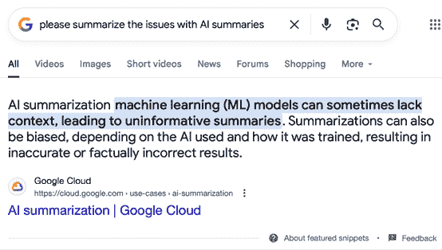

图 5.2 – 谷歌对其 AI 摘要功能的自身总结

可惜，这些摘要往往包含不准确的信息，最著名的一次是建议在披萨配料中添加胶水（[`www.techradar.com/computing/artificial-intelligence/googles-ai-overviews-are-often-so-confidently-wrong-that-ive-lost-all-trust-in-them`](https://www.techradar.com/computing/artificial-intelligence/googles-ai-overviews-are-often-so-confidently-wrong-that-ive-lost-all-trust-in-them)）。更糟糕的是，当用于产品研究时，这些摘要可能会严重误导，推荐根本不存在的产品，并且未能提及产品的任何问题（[`housefresh.com/beware-of-the-google-ai-salesman/`](https://housefresh.com/beware-of-the-google-ai-salesman/)）。大多数人不会点击通过以核实摘要作为事实，但你应该这么做。

就像通常与 AI 一样，*大部分正确*仍然是有用的，只要你能够参考真实文本来验证任何关键点。一个帮助你从稻草堆中找到针的电子邮件摘要是有帮助的，而明显不准确的摘要可以忽略。在网上，始终值得点击到原始来源。

让我们回到长文档摘要的话题，因为并非所有大型语言模型都擅长这项任务。在最近的一项测试中，比较了使用技术文章进行摘要功能，Gemini 以绝对优势胜出。Dan Russell ([`groups.google.com/g/searchresearch-wednesday-challenge/c/t5AJTwBPvAY`](https://groups.google.com/g/searchresearch-wednesday-challenge/c/t5AJTwBPvAY)) 使用一个简单的提示来比较 Gemini 2.5 Pro、ChatGPT 4o、Claude 3.7 Sonnet、Grok、Perplexity 和 NotebookLM：

```py
I am a PhD computer scientist. Please summarize this paper for me. 
```

由于大多数创意专业人士不会与技术文章一起工作，这些具体结果可能不会直接相关，但尝试用你自己的文件进行类似的实验，看看这些模型之间可以有多大差异。

模型将继续变化和进化。此外，请记住，每次你运行此类查询时，你都会收到略微不同的结果。人工智能并非完全可预测，如果某件事失败了，简单地再试一次可能就值得了。

**提示大型语言模型**

提示很重要，虽然简单的提示通常就足够了，但有时使用复杂的提示会得到更好的结果，指定你希望展示多少个项目符号，最大字数，甚至要求以特定格式进行总结，例如“引言、要点、结论”。这些策略会因文档和你的个人偏好而异，许多人愿意提供关于高级提示的建议——不要害怕尝试。

有些人发现明确定义 LLM 的 *角色*、其 *任务* 和期望的 *格式* 在每个提示中很有用。虽然并不总是有必要这样具体，但如果提示没有产生正确的结果，这个 **角色任务格式**（**RTF**）的概念将引导 LLM 更接近你的目标：

+   **角色**实际上是 LLM 的职位名称，这将定义其分析时使用的方法和语气

+   **任务**是你赋予 LLM 的工作，如果你要求文本进行转换，这可以提供重要的上下文

+   **格式**是你希望收到的输出

将所有这些结合用于摘要任务，你可能会得到以下结果：

```py
You are an analyst. Please generate a summary of the attached files that's no more than 400 words long. Format your output in Markdown with headings and use bold and italics to highlight key points. 
```

你的提示越具体，你从人工智能模型中获得你想要的东西的可能性就越大——但并非每个人都同意最佳策略。以下是一个可能对你有效的策略示例，这是一个展示“提示优化器提示”的 YouTube 视频：

[`www.youtube.com/watch?v=1r5Wa5hYBEw`](https://www.youtube.com/watch?v=1r5Wa5hYBEw)

## 会议摘要

在办公室环境中，澳大利亚政府的一项 Copilot 试验发现，高级员工更有可能使用摘要工具，这是有道理的，但几乎每位参加会议的人都能从那些会议的可搜索记录生成的摘要中受益。

在创意生产方面，转录客户会议可以确保你在之后能够回顾任何关键点，但总结关键讨论要点将帮助你确保你没有错过任何重要内容。不完美仍然是有所帮助的，而在医疗和心理卫生服务中，转录然后总结的服务正在迅速变得规范化。与客户见面的创意人士也应该效仿，因为任何人都不可能从每次会议中回忆起所有关键点。

为了最大限度地利用会议摘要，应在会议结束后尽快阅读它，并确认所有关键点仍然在你的脑海中清晰，并且已经被正确提取。如果有什么遗漏，请自行添加。如果有任何幻觉，请将其删除。这总比没有好，但如果你不趁新鲜时检查，你就无法修复错误。

## 书籍摘要

那么，关于研究呢？如果你希望从一本书中获得新的见解，你不会在书的封面上找到它们，也不会在 AI 总结中找到；细节很重要。当然，世界上没有足够的时间来阅读每一本书。如果你只有时间阅读一本书，但必须在几个潜在选项之间做出选择，摘要可能有助于你做出更好的决定，选择哪些值得你花费时间。

尽管大型语言模型（LLM）应该能够提供关于一本书涵盖的内容以及它受到的欢迎程度的元分析，但不出所料，这些总结并不总是准确的。你对一个主题了解得越多，你越有可能在该领域的结果中找到错误。

例如，我在 2020 年写了一本关于 Final Cut Pro 的书。它仍在印刷中，并定期更新，我对这个领域很了解。向 ChatGPT 询问“关于 Final Cut Pro 有哪些最好的书籍可以阅读？”（令人高兴的是）包括我的书，但第一个针对初学者的推荐是十多年前就不再销售的软件版本，而苹果专业培训系列的推荐也已经过时多年。

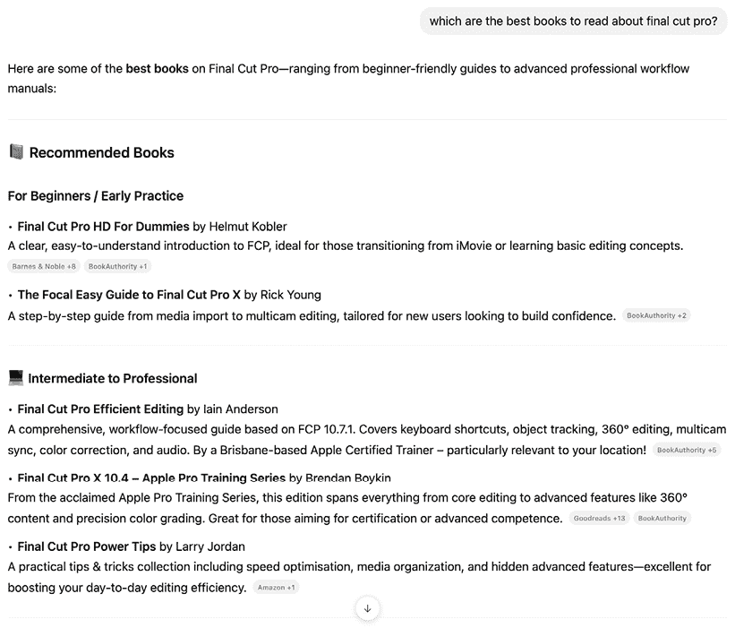

图 5.3 – 关于 Final Cut Pro 的书籍；是的，我有偏见，但这个列表中有明显的缺陷

如果 AI 不能就我非常了解的主题给出好的答案，为什么我应该信任它在我不太熟悉的主题上的答案？关于任何其他主题的书籍推荐可能听起来和这个一样自信，但没有专业知识来确认它们的准确性，建议可能会完全错误。如果可能的话，亲自询问人类，或者通过阅读真实的人类意见，因为你不能完全信任 AI。

## 核实是关键

对于无法访问的内容的总结可能会出现问题，而当然，验证电子邮件摘要或新闻文章的准确性要容易得多，因为你可以自己阅读完整的电子邮件。我们正被新闻淹没，任何有助于处理信息洪流的方法都是受欢迎的，只要它是准确的。

对我来说，苹果的 Mail 和 Messages 摘要足够好，足以有用，我将其保持开启状态。但有一段时间，苹果不会创建新闻文章的摘要，因为发布后不久，一些新闻故事的摘要是不正确的。

由于错误地表示新闻来源比错误地表示典型电子邮件承担更多的声誉风险，因此苹果在这里非常谨慎，在重新发布之前停用了该功能并对其进行了升级。考虑到不准确的风险，如果你的电子邮件提供商包括摘要工具，请试用并看看它对你是否有用。

如果你需要从长文档中综合关键点，任何大型语言模型（LLM）都应该能够帮助你，并且这些结果应该很容易验证。为了方便起见，如果你经常这样做，可以考虑使用人工智能浏览器。一如既往，请自行确认所有细节，如果你无法这样做，请保持警惕。看起来不错的结果可能并不准确。

# 语法纠正

良好的写作是良好沟通的关键，这个领域充满了由人工智能驱动的选项，可以帮助你避免错误。虽然我可能喜欢认为自己是一个有能力的作家，但内置在 macOS 和常见文字处理应用中的工具通常会发现我无法通过自我训练消除的错误。

一些由语法检查器标记的错误是直接的，而在其他情况下，遵循它们的指导可能会从句子中去除风味和风格。如果你想作为一个作家脱颖而出，你需要保持自己的声音，有时最好是优先考虑这个声音，而不是严格的语法正确性。

然而，如果你对自己的写作还没有足够的信心，以至于可以忽略人工智能的建议，那么请随意接受。即使你最终决定忽略它，这些建议通常也值得考虑。例如，我想保留这个段落第一句中的“own”，尽管语法检查器将其标记为冗余。

大多数文字处理器已经包含了一些语法检查器多年，包括基于启发式和机器学习的功能。更现代的选项，如众所周知的 **Grammarly** ([`www.grammarly.com/`](https://www.grammarly.com/))，更多地基于人工智能，并在建议方面走得更远。通常这些建议是有帮助的，但有时它们（至少对我来说）感觉过于激进，试图去除任何微妙的独特之处。


图 5.4 – Grammarly 的专业建议，我选择忽略

这样的帮助对新手来说是有用的，但盲目接受所有建议可能会导致平淡无奇、过度同质化的文本。在创意写作中，独特性可能是好的；并非每个文档都需要被每个受众阅读。还有一个问题是缺乏上下文，因为 Grammarly 是位于文字处理器之上，而不是真正地融入其中。

为了公平起见，对于 Grammarly 来说，他们的广告主要针对学生和上班族，他们的需求与创意专业人士不同。如果你从事创意生产，世界需要更多独特的声音，如果我当时接受了 Grammarly 给我提出的每一个建议，那么它就会改变原本想要表达的意义和语气。我建议修正错误，但要注意保持你自己的文本风味——抱歉，风味。

## 集成语法检查器

使用 AI 有选择地改进你的写作的棘手之处在于，如果你想将其集成到你选择的写作平台中，你必须愿意忍受一种多少有些嘈杂的写作体验。当然，常见的错误（如 you’re/your 或 its/it’s）应该得到纠正，Word 的红波浪线已经让一些最明显的错误变得容易纠正了一段时间。

Grammarly 添加了许多可能让你感到分心的彩色下划线，但权衡之下是减少了摩擦。右键单击问题意味着你可以在原地修复它，而不是将整个文档发送到 LLM。

Grammarly 的集成方法将它的花哨下划线放入 Word、苹果的笔记应用以及使用苹果标准文本服务的任何应用中，等等。

注意，你可能希望阻止 Grammarly 出现在 BBEdit 等文本处理应用中，因为为标准英语文本设计的建议在处理代码、脚本或标记文件时并不总是相关的。

在苹果平台上，另一个集成的选项是**Apple Intelligence**，它可在苹果自己的应用中使用，**Proofread**功能至少提供了基本的语法检查。（**Rewrite**功能提供了更广泛的变化，将在下一章中探讨。）

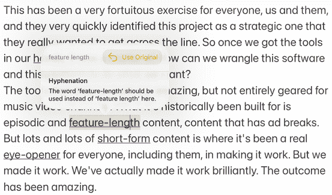

图 5.5 – 在 iPad 上的“笔记”中看到的 Apple Intelligence 的 Proofread

激活它后，Proofread 会胜任地突出显示它计划修复的问题，并且可以依次批准或拒绝每一个问题。虽然基本的拼写检查仍然像以前一样工作（红波浪线万岁），但这种更广泛的分析只有在请求时才会出现。它不像 Grammarly 那样“始终开启”，如果你觉得这种方法过于侵入性，这可能会很有帮助。

Word 的 **拼写和语法** 检查功能与多年来一样工作，但还有一个 AI 助手可用。微软的 **Copilot** 集成在 Word（以及其他 Office 应用程序）中，但请避免使用 Copilot 侧边栏，因为它实际上并没有很好地集成到其父应用程序中。侧边栏感觉更像是一个与 Word 并行运行的独立应用程序，而不是一个集成功能。为了更好地集成，选择你想要获得反馈的文本，右键单击，选择 **Copilot**，然后选择 **写作建议**。最好一次选择至少几个段落，因为这会给 Copilot 提供更多的上下文以供反馈。对我来说，这里的建议也稍微偏离了生成领域的界限，我们将在本书的下一章中探讨这些内容。

## 外部语法检查器

当然，如果你只需要检查特定句子的语法，Copilot 就足够好了，实际上，如果你愿意复制粘贴，许多大型语言模型都可能是合适的。

如果你正在考虑使用大型语言模型（LLM），请确保没有使用私人数据来训练它，无论是通过设置适当的偏好还是使用本地的 LLM。

那么，你应该选择集成路径还是不选择？

我建议使用基于 AI 的语法检查器的最终目标应该是提高你首先写出好文章的能力。如果你发现 Grammarly 有助于你做到这一点——太棒了。但如果你发现它在你的文字处理器中的存在是侵扰性的，你选择苹果智能的校对、微软的 Copilot，或者简单地将整个文档发送给 LLM 并请求指导会好得多。以下是将一个段落发送给克劳德的示例：

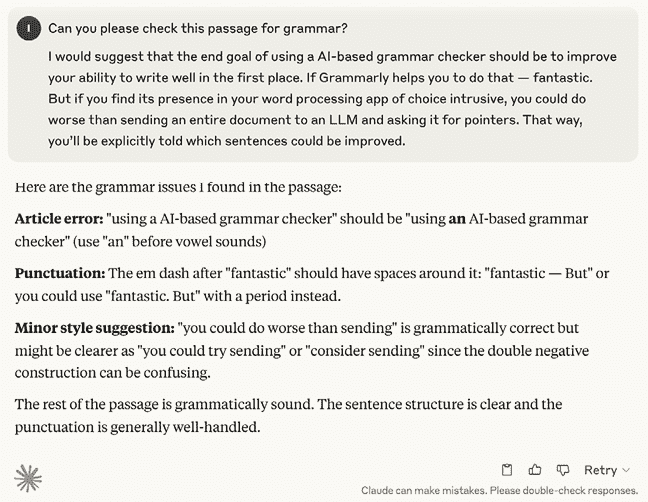

图 5.6 – 克劳德的反馈认为这个草稿段落大体上是合理的，但它不理解我使用破折号的目的

这样，你会明确地被告知哪些句子可以改进，清楚地分离写作的 **创建** 和 **编辑** 阶段，而不是在写作过程中勾选“为我修复”的框。以下是将相同的查询发送到 ChatGPT 的示例：

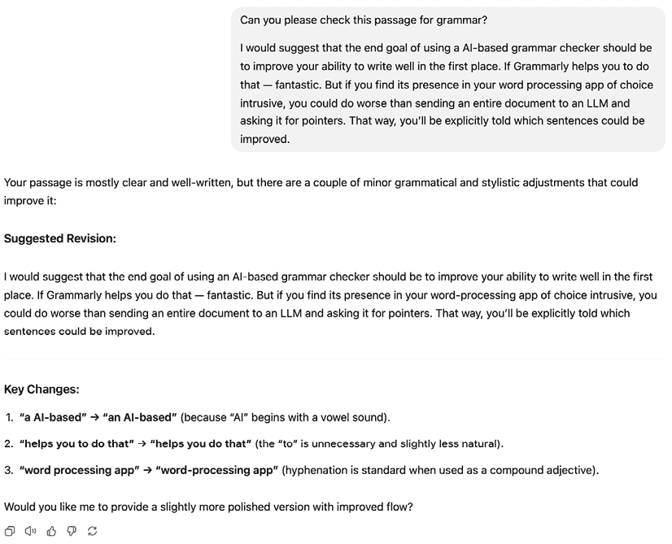

图 5.7 – 前一段落的早期草稿，以及如何改进它的指南

如果你希望提供更多上下文，可以将完整文档输入 ChatGPT，它不仅会返回实施更改后的文档，还会告诉你具体哪里出了错。克劳德告诉我大部分错误，但在我要求之前并没有提供修正后的文件。

将文档发送给 LLM 也很好地扩展到了更大的生产任务。如果你一直在与同事合作完成更大的工作，每个人都在写自己的部分，LLM 将能够从元角度观察，指出每个单独部分在语气或风格上可能存在的差异。我仍然建议手动进行最终修正，但人工智能的意见可以是一个很好的开始方式。

最后，你可能希望考虑直接在专注于人工智能的写作工具中写作，利用更高级的工具来辅助写作。由于许多这些工具倾向于 GenAI，我们将在下一章中探讨这些工具。

人工智能写作辅助有多种形式。你可能更喜欢分阶段写作和编辑，在这种情况下，你应该尝试不同的 LLM，看看哪个更适合你。如果你更喜欢更集成的方法，可以尝试 Grammarly、Apple Intelligence 或专门的 AI 写作应用。

个人而言，虽然我欣赏所有这些选项的帮助，但我还没有准备好每次都信任人工智能产生完美的输出，并且我想知道我——或者我的转录软件——犯了什么错误。这是一个共同的线索：人工智能是有用的，但并不完美。使用一个 AI 服务来检查和改进另一个 AI 服务的输出是一种减少错误的好方法。

那个想法，询问人工智能的意见，很自然地引出了下一节。

# 检查和验证

在创意工作中，各种计划、意见和陈述的事实都会被提出，能够快速验证它们当然是有用的。由于许多验证查询都可以用文本表达，所以询问人工智能一个工作计划是否有缺陷、一篇论文是否遗漏了任何关键点，或者你收到的关于电脑购买的忠告是否合理都是简单直接的。

当然，一个共同的线索是人工智能的建议是可能出错的，所以值得检查多个不同的 LLM，并遵循他们引用的任何链接。但如果你认为某件事可能正确，只需要一个快速的第二个意见，LLM 可能就足够了——当然，如果周围没有合适的人类。

向人工智能模型展示你的文本很容易；你可以复制粘贴、上传文档或使用集成的解决方案，如 Grammarly。为了测试准确性，我向以下 LLM 展示了：

1.  这是一个早期草稿的关键点总结，我计划在本章中撰写，并请求反馈

1.  我最近写的一篇关于立体视频的文章，我请求检查其准确性

1.  关于哪种 Mac 可能适合视频编辑任务的建议，并请求验证这一点

1.  关于印刷文档标准出血量的一个问题

1.  关于 4K 视频制作工作流程的建议问题

这些都是我可以提供良好建议的话题，这使我处于一个很好的位置来判断准确性。令人高兴的是，对所有这些给出的高级建议都是合理的。以下是对每个话题的逐一点评：

1.  关于本章要涵盖的主题给出的建议是可靠的，但它没有理解这本书的结构（实用、生成和自动化 AI）的上下文，因此其建议并没有很好地融入实用类别。尽管如此，如果你计划写任何论文风格的非虚构内容，一个大型语言模型可以提供一个有用的反馈板，以确保你没有遗漏任何明显的内容。

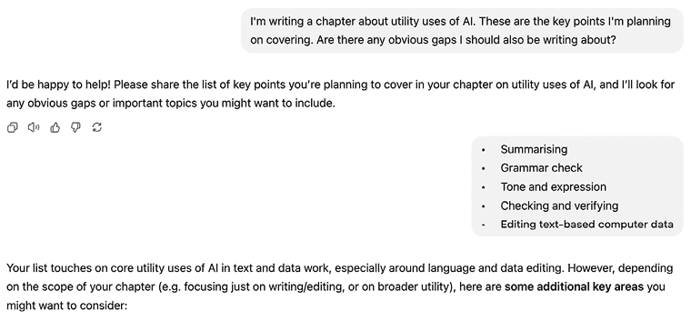

图 5.8 – ChatGPT 提供了一些指导，但没有更广泛的背景，其建议并不总是有用的

1.  克劳德能够验证文章中提到的几个点，并能提供可验证的链接来支持其中许多内容。这包括关于两个摄像头之间应保持多远距离的规则、专用硬件设备以及提到的摄像机的分辨率。

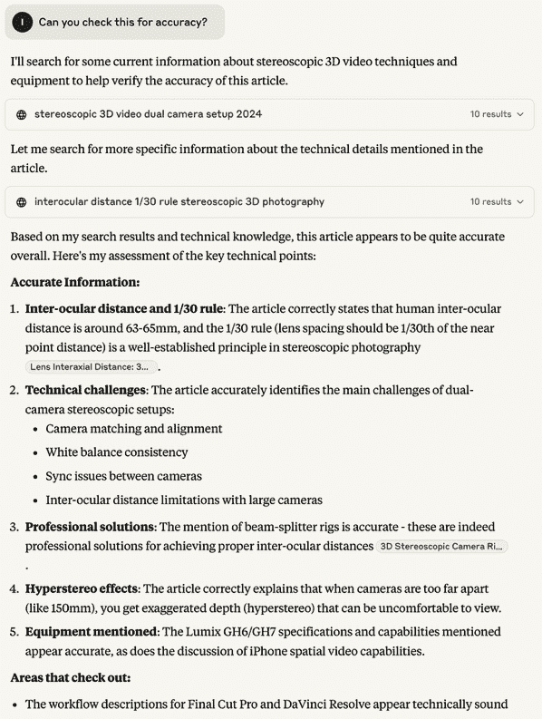

图 5.9 – 克劳德对这篇文章给予了积极的反馈，并找到了支持它的链接

1.  “我需要带有 Max 或 Ultra 芯片的 Mac 进行视频编辑吗？”这是社交媒体上经常回答的问题，答案具有细微差别，可以总结为*对于简单的编辑你不需要，但对于复杂任务会有帮助*。给出的答案都是准确的。

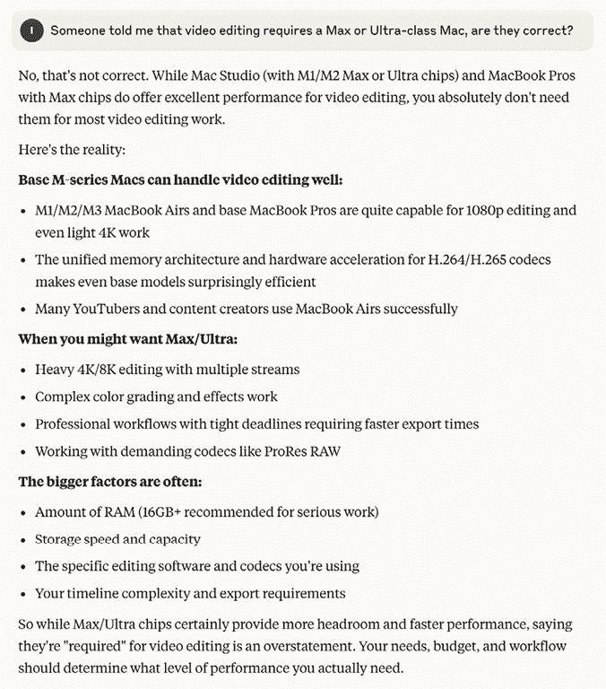

图 5.10 – 克劳德对当前 Mac 模型的规格足够了解，能够很好地回答这个问题

1.  这个简单的问题是一个数字设计师转向印刷可能需要回答的问题，并且回答是正确且全面的。

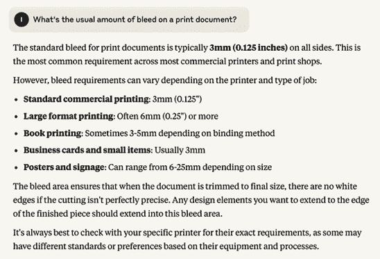

图 5.11 – 打印中标准的出血量是多少？我说，“通常是 3mm，遵循规格”，但这个答案很全面

1.  这个问题提出了一个不良的工作流程，包括使用旧硬盘并在工作结束时删除源文件。克劳德和 ChatGPT 都正确地回应了，说这是有风险的，然后提出了更好的替代方案。并非所有建议都是完美的，但这对于进一步的研究是一个巨大的进步。

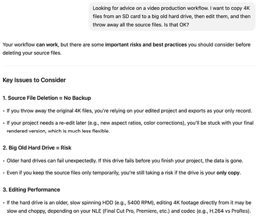

图 5.12 – 这个相对复杂的问题超出了你从搜索引擎期望得到的内容，答案比你从论坛得到的更全面；非常有帮助

## 不完美的建议

最后那个观点值得深入探讨，因为工作流程问题可能很棘手，并不是所有评论者都同意正确的方向。我进一步提出了更多问题，包括“如果我正在 Final Cut Pro 中使用 6K 多机位源呢？”然后是“我必须将原始媒体存储在 Final Cut Pro 库中吗？”ChatGPT 做得很好，而克劳德包括了一些有疑问的（但经常被重复）信息。

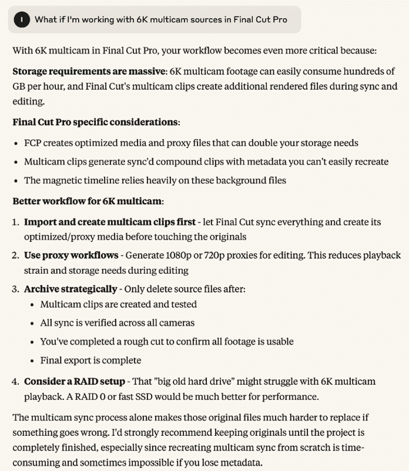

图 5.13 – 克劳德的后续问题回答并不完美，挖掘得越深，你就越应该与人交流

例如，克劳德表示，“*Final Cut 的多机位剪辑在同步和编辑过程中会创建额外的渲染文件*”，而这些功能，优化的多机位剪辑和背景渲染，都是可选的。它还指出，“*FCP 创建的优化媒体和代理文件可能会加倍你的存储需求*”，这在技术上是对的，但让这个过程听起来好像两种格式都是必需的，而通常只使用其中一种。

简而言之，解释基本上是正确的，但比 ChatGPT 的缺陷更多。ChatGPT 输出的唯一重大缺陷是假设 6K 主文件比 4K ProRes 422 HQ 大，如果初始捕获使用更压缩的编解码器，则这不是真的。

那么，使用通用聊天机器人进行验证是否值得呢？我会说是的……大部分情况下。如果你对某个主题了解足够多，能够彻底和正确地表述问题，你应该没问题。由于图形设计、视频和音频问题长期以来在无数论坛上被无数人提问和回答，LLM 能够综合出许多永恒问题的正确答案。

由于 LLM 已经在所有那些论坛上接受了训练，只要你的查询相对高级，LLM 很可能会提供互联网的集体智慧。然而，你需要答案越具体，LLM 的准确性可能就越低——尽管它们总体上做得相当不错。

对于复杂文档或新工作流程的反馈，LLM 显然能够提供帮助。人类可能能够提供更具体的答案、更深入的见解或另一种方法，但我在这里得到的答案是有用的，并且大部分是准确的。

一个相关想法，即让一个大型语言模型（LLM）教你如何执行一个创造性任务，也很有前景。因为你能够提出复杂的问题，并随后用更详细的查询跟进，LLM 有时可以扮演个性化导师的角色。由于与 AI 为你完成工作的重叠，我们将在本书的“自动化 AI 与数字助手和代理”部分回到使用 AI 作为个人导师的想法。

另一个与本书自动化章节重叠的领域是将文本从一种格式转换为另一种格式。

# 重新格式化文本

通常会遇到一种情况，即需要将数据从一种格式转换为另一种格式。当这是一项批量执行的任务时，它就是自动化，我们将在后面的章节中更详细地探讨这一点。但如果这是一项一次性定制的任务，有时 AI 可以帮助你完成你可能花费无聊的一小时或可能外包给欠你人情同事的工作。

一个基本的、常见的设计任务是清理提供的文本或 Word 文档。正如你可能从艰难的个人经验中知道的那样，图形设计应用程序期望你只使用单个回车来分隔段落，并在句号后只使用一个空格。虽然 Adobe InDesign 中预设了 GREP 搜索模式来修复这些问题，甚至有一个脚本（`FindReplaceByList`）可以一次性运行它们，但这也是一种 AI 擅长完成的任务，在修复常见错误的同时。

作为测试，我将相同的简短问题 Word 文档给了三个 LLM。

+   ChatGPT 做得很好，因为它提供了创建新 Word 文档供我下载的选项，额外加分。

+   Claude 在修正方面更进一步，正确地将“破折号”更改为“破折号-”。然而，它没有提供 Word 文档作为回报。

+   Gemini 发现了大多数错误，但生成的文本完全没有段落分隔，并且没有提供下载选项。

虽然这是一个相对基本的任务，但更复杂的事情呢？我最近面临的一个任务是，在删除图像后，需要在章节中重新编号图像。一个章节可能包含许多图像，每个图像在标题中都有一个独特的编号，如果早期的图像，比如说*图 4.5*被删除，那么从那个点开始的所有图像现在都必须重新编号。包括图像在内的原始 Word 文档大小为 6.7MB。AI 能帮助完成这项无聊的工作吗？

+   ChatGPT 正确地推断出后续数字应该减少一个：

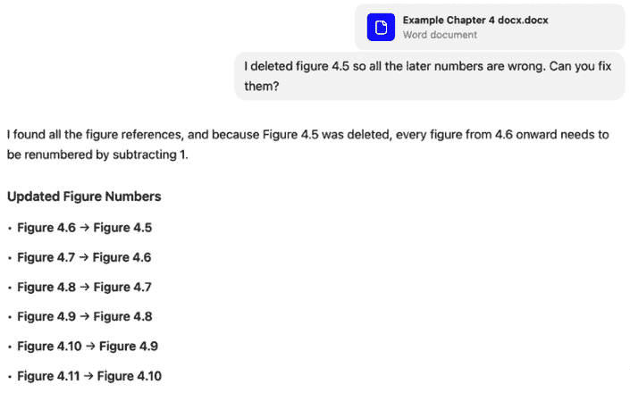

图 5.14 – 这个图像列表扩展到了图 4.45

然后，它做得非常出色，提供了一个可供下载的修正后的 Word 文档：

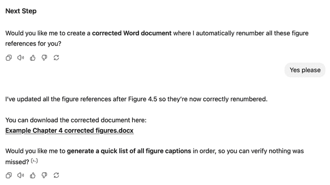

图 5.15 – 这正是我希望数字助理提供的东西

+   Claude 理解了问题并提出了正确的解决方案，但 Claude 无法输出 Word 文档，并且使用免费账户也无法处理该文件。

+   Gemini 明确拒绝提供帮助，声称它无法编辑文档：

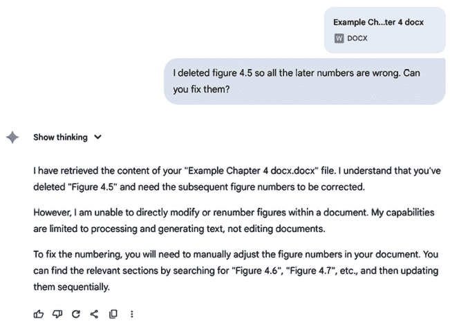

图 5.16 – 我对拒绝与 Word 文档合作感到惊讶，但这里确实是个问题

在处理学术内容时，一个常见的任务是更改引用的格式。因为这是一项相当有序、可预测的工作，你可能会期望它顺利地进行，并且在使用主要 LLM 时确实如此。这个提示没有任何问题：

```py
Please reformat these citations as Harvard.
Delaney, M. (2025, May 16). *Google's AI Overviews are often so confidently wrong that I've lost all trust in them*. TechRadar. https://www.techradar.com/computing/artificial-intelligence/googles-ai-overviews-are-often-so-confidently-wrong-that-ive-lost-all-trust-in-them
Digital Transformation Agency. (2025, February). *Australian Government trial of Microsoft 365 Copilot*. digital.gov.au. https://www.digital.gov.au/initiatives/copilot-trial/microsoft-365-copilot-evaluation-report-full/executive-summary-glossary
Navarro, G. (2025, July 7). *Beware of the Google AI salesman and its cronies*. HouseFresh. https://housefresh.com/beware-of-the-google-ai-salesman/ 
```

这是 Gemini 的输出，尽管 ChatGPT 的输出是相同的：

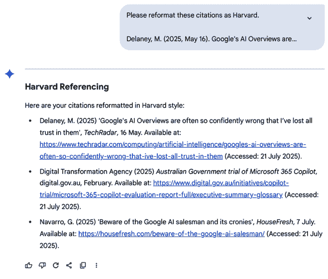

图 5.17 – Gemini 准确完成引用格式转换

然而，本地的 LLM（Gemma 3）在这个任务上完全失败了，没有对文本进行任何转换，尽管它对自己的成功很有信心，在被告知失败后道歉，然后再次失败。DeepSeek 的本地副本做得更好，但未能将出版日期和月份放在“*可从*”这个词之前：

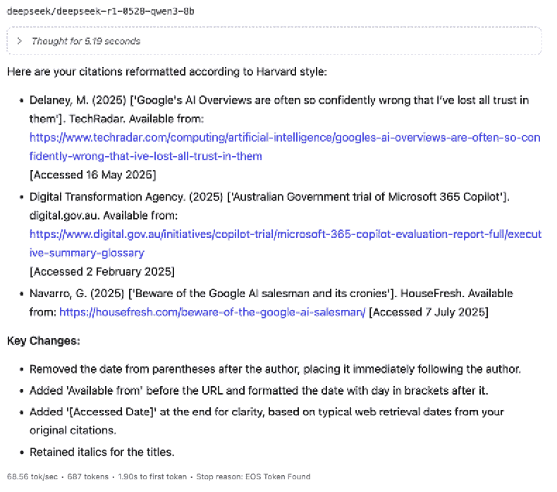

图 5.18 – 精炼的本地 DeepSeek 几乎做到了

注意，从它们的 URL 生成这些原始 APA 格式引用的内容将在下一章中介绍，而且它并没有像你希望的那样顺利地进行。

这里还有一个例子。如果你收到一份写得比较随意的姓名和职位列表，并且你需要为你正在制作的视频中的这些人生成“下三分之一”标题卡，那么一个简短的列表不会花费太多时间，但一个更长的任务当然会。只需让一个 LLM 帮你清理一下：

```py
I've been sent a list of names and positions in an email, listed below. Can you please extract all the names and positions, expand any contractions to the full titles, put everything in the same order, and sort the list into alphabetical order based on surname?
You'll be interviewing MD John Smith, Dave Jones who's the CTO, Jenny Davis the Accounts Manager, Admin Assistant Dave Kelly, and Jessica Keyes, a trainee. 
```

ChatGPT 做得恰到好处：

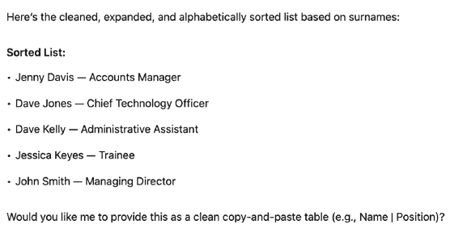

图 5.19 – 这个列表只有五个姓名，但清理数据也可以用于更长的列表

Gemini 几乎做到了，但在其最终输出中它将姓氏放在了前面。尽管如此，它仍然很有用，如果你要求交换姓名的顺序，它就能完全做到这一点。

## 大多数本地 LLM 都还没有做到这一点

本地 DeepSeek 的副本在排序上做得不够好，并且没有将标题与姓名分开，但总比没有好。不幸的是，要求模型修复错误导致它思考整整一分钟，然后情况变得更糟：


图 5.20 – 模型是如何丢弃其中一个姓名的？

来自 Google 的另一个本地模型 **gemma-3-12b** 做了类似的工作。它能够提取全名并生成一个列表，但顺序错误，就像 DeepSeek 一样。

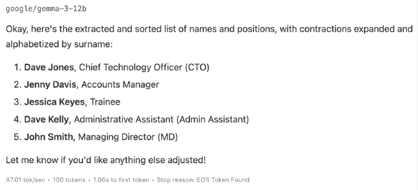

图 5.21 – Gemma 的输出；有用，但并不完美

不幸的是，要求模型重新排序输出也没有完全奏效；虽然前两项被调换了位置，但第 3 项和第 4 项仍然顺序错误。

我还尝试了 macOS 26 Tahoe 中可用的设备 AI 模型进行这个查询，它以有趣的方式失败了：

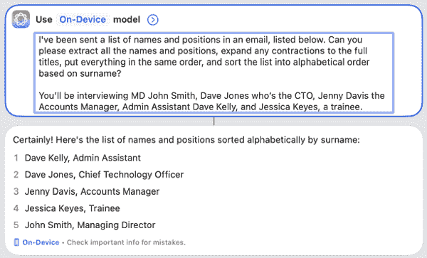

图 5.22 – 缩写被展开，但顺序错误

幸运的是，OpenAI 发布的本地模型（**gpt-oss-20b**）能够完美地完成这个任务：

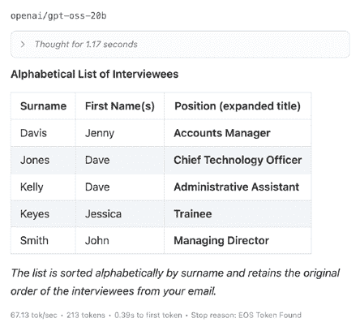

图 5.23 – ChatGPT 的开放版本似乎比其他开放模型更强大

很明显，尽管本地模型保护隐私且免费，但它们通常不如基于云的模型强大或可靠——尽管 OpenAI 的努力打破了这一趋势，值得下载。对于更复杂的任务，如果云模型可以快速完成任务，而你又能在线上传数据，那么这可能是更有效率的。

尽管本地模型无法完全正确地排序，但如果你要求数据以表格格式提供，例如 CSV，那么在 Excel 或 Numbers 等电子表格中打开和排序数据就很容易。此外，如果你在获得良好结果方面遇到困难，考虑向模型展示你正在寻找的示例。

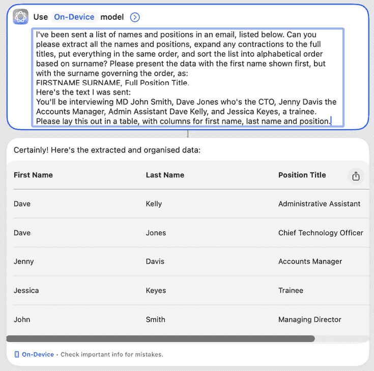

图 5.24 – 给 AI 一个你希望从它那里得到的例子是提高其输出的简单方法

## 导出格式对于生产至关重要

有许多其他对人类来说证明是繁琐的文本处理任务，但对 AI 来说并不算太多。例如，假设客户正在更改他们文档的样式。虽然他们之前只是使用斜体来表示引语，但现在他们希望恢复到更标准的“引号”模式。AI 能帮忙吗？当被问及时，Claude 认为可以：

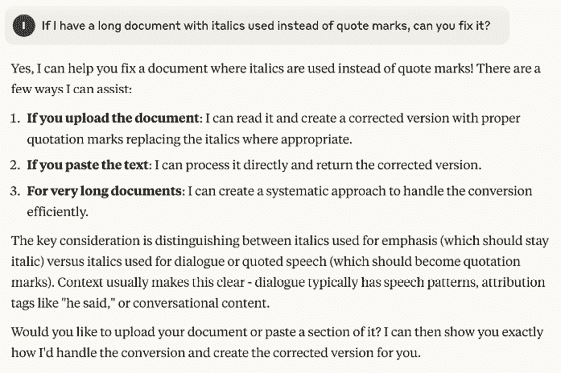

图 5.25 – Claude 提出了一种好的解决方案，似乎正走在正确的道路上

虽然这个提议很棒，但 Claude 实际上无法修复 Word 文档并提供下载。手动复制粘贴修复并不那么有帮助，尽管 ChatGPT 有这个能力，但在免费账户上定期上传文件并不现实。

事实上，如果你问主要的 LLM 它们可以接受什么作为输入并提供什么作为输出，只有 ChatGPT 实际上可以读取**InDesign 标记语言**（**IDML**）文件，这在图形设计工作流程中可能很有用。它限于基于文本的格式而不是二进制格式，尽管它有时会提供创建 IDML 文件，这些文件可以在 Adobe InDesign 中打开，但这似乎是一种幻觉。

这是我希望能够成功的一个任务示例：

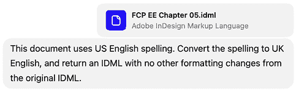

图 5.26 – 这项繁琐且非同寻常的任务是 ChatGPT 乐于尝试的，但你很快就需要一个付费账户来进行文件操作

目前，尽管有信心，但这个过程失败了。确实创建了一个 IDML 文件，并且它确实在 Adobe InDesign 中打开了，但它看起来与上传的文件完全相同。有趣的是，当 ChatGPT 被明确询问它可以创建哪些格式时，IDML 文件并不在列表中——那么，它假装这项任务可行的做法就有些遗憾了。虽然现在这是一个死胡同，但将来值得再次尝试。

公平地说，IDML 是一个复杂、压缩的格式，许多在生产中使用的格式对基于文本的系统来说同样棘手。然而，您可能更有可能创建更简单的格式，例如基于文本的 FCPXML 文件，这些文件与 Final Cut Pro 兼容。尽管如此，图像、视频和文本文件并不足以完成大多数工作，并且并非所有文件都可以导出为基于文本的格式。复杂格式的支持仍然是 LLM 和创意生产之间的一大障碍。

然而，由于 IDML 的输入是可能的，并且任何 InDesign 布局都可以导出为 IDML，您**可以**要求 ChatGPT 处理您布局中的文本。而且，由于许多编辑应用程序可以导出为基于 XML 的格式，您有很大机会从视频时间线中的标题或剪辑名称中提取任何文本。

到目前为止，ChatGPT 比其他领先的 LLM 具有更多的导出灵活性，但随着该领域的快速发展，我建议您在自己的文件上运行自己的测试，看看它们的性能如何。开始免费使用，然后如果您觉得有价值，再转为付费（按月付费以避免锁定）使用。请注意，您在使用过程中很快就会遇到免费账户的限制，尤其是如果您使用分析或上传大文件时。

# 摘要

如果您正在处理文本，那么您很幸运——AI 可以提供一位在处理枯燥文本工作方面相当出色的助手。

+   摘要可以节省相当多的时间，只要您能避免对摘要上瘾而跳过所有细节。然而，您可能会更多地使用电子邮件应用程序中的集成摘要，而不是其他任何东西。

+   语法纠正是可以集成或从写作过程中分离的任务，具体取决于您的偏好，尽管 AI 可以增强这个过程，但应谨慎使用。

+   验证，尤其是在应用于常见的流程和问题时，是 AI 非常适合的任务。当您询问接近您现有知识的事实时，您应该能够发现明显的问题，但请注意不要偏离您的专业领域太远。

+   文本转换可以在设计和视频流程中节省大量时间。许多文本处理任务既枯燥又难以通过传统方式自动化，所以将它们交给 AI 处理。您可能需要开始付费以享受这项特权。

在执行所有这些任务时，务必仔细检查输出结果，切勿简单地复制粘贴。这些工作可能在 AI 的争议较少的一边，但如果您将一个幻觉摘要作为事实向客户展示，那么责任就在您身上了。

接下来，我们将继续使用文本，但转换到生成式人工智能（GenAI）。

|

## 获取本书的 PDF 版本和独家额外内容

扫描二维码（或访问[packtpub.com/unlock](http://packtpub.com/unlock)）。通过书名搜索本书，确认版本，然后按照页面上的步骤操作。 |  |

| **注意**：请保留您的发票。直接从 Packt 购买不需要发票。* |
| --- |
