# 第七章：基于图像的生成式 AI

在生成人工智能（GenAI）的众多话题中，合成图像的 AI 生成可能比其他话题更具争议性。如果你是一位创作或修改图像的创意专业人士——我们大多数人都会以某种方式与图像打交道——你可能已经对这一点有强烈的看法。以下是我的观点：尽管 AI 可能很强大，但我认为 AI 并不一定会取代所有的设计师、摄影师和修复师。实际上，有许多使用 AI 的方法不会让世界充满垃圾，而且可以帮助我们更好地完成工作。

创造力对不同的人意味着不同的事情，在“创意生产”这个广泛的类别中有很多不同的工作。其中一些任务可能很无聊，或很繁琐，或者从未向客户展示过，这些任务更有可能是由 AI 完成的。

其他任务，如复杂的图像修复或恢复，有时由 AI 完成会更好，在这种情况下，它们可以被视为我们之前使用的工具的更高级版本。AI 还可以开辟全新的工作流程，让你在拍摄之前可视化拍摄，或根据为特定目的创建的图像创建情感板，而不是简单地重复使用他人的图像。

当然，市场正在迅速变化，进步迅速。尽管我会展示几个不同工具的结果，但测试的服务太多，而且这个行业的变革速度意味着任何具体的推荐在你阅读这本书时都可能已经过时。不要对任何一种解决方案过于依赖——如果五年后它们都还在，我会感到惊讶。

为了使这本书尽可能有用，我将尽量更多地关注技术和工作流程，而不是具体的应用和服务，我将涵盖网页和桌面解决方案，而不是移动端。书中包含了一些比较性评论，但请使用您最终选择的服务在自己的图像上确认结果。

无论你制作什么类型的图像，人类监督或指导都是重要的。在本章中，我们将探讨以下主要主题：

+   处理现有图像

+   创建原始图像

+   生成式矢量艺术

+   情感板和设计理念

+   创建 3D 模型

首先，让我们看看图像修复领域的最新技术。

# 处理现有图像

尽管许多基于 AI 的工具可以进行图像处理，但**Adobe Photoshop**作为修复工具的选择已经如此之久，以至于它已经成为一个动词：*Photoshop*。我自 1990 年代末以来在个人和专业上使用 Photoshop，包括一些结合机器学习的新工具，已经多次改变了技术的状态。

例如，克隆图章曾经是唯一可用于修图工作的工具。覆盖皮肤瑕疵很棘手，因为并不总是容易找到一块匹配的干净皮肤区域进行克隆。使用克隆图章工具时，必须在源和目标之间匹配纹理和光线。

在 2000 年代初，我在伦敦担任修图师，修复画笔工具的引入彻底改变了游戏规则。我们仍然需要找到一个干净的皮肤区域，但现在我们只需要担心纹理——Photoshop 可以为我们匹配源和目标之间的亮度。

2010 年，**内容感知填充**被添加到 Photoshop CS5 中的**修复画笔**工具中。使用这个工具，您甚至不需要选择一个克隆的源区域——实际上，您根本无法选择。相反，Photoshop 会选择图像中哪些部分可以重复使用，创建一个（通常）看起来无缝的新区域，通过重新混合原始图像的部分来创建替代区域。

这个工具至今仍在使用，尽管它早于现代 AI 工具，但可以说它使用了机器学习技术。当时，它是在**Adobe Sensei**的旗帜下推广的 ([`web.archive.org/web/20190404055934/https://research.adobe.com/project/content-aware-fill/`](https://web.archive.org/web/20190404055934/https://research.adobe.com/project/content-aware-fill/))。

现在，现有的工具通过**生成移除**和**生成填充**两种完全生成功能得到增强，这些功能利用了为该目的许可的 Adobe Stock 图像。尽管许多修图任务仍然最好使用内容感知修复点、修复画笔或甚至克隆图章来完成，但基于 AI 的工具带来了前所未有的灵活性。

例如，如果您从一个不戴帽子的照片开始，但客户希望他们戴上帽子，仅仅克隆是不够的。您需要找到一个合适的帽子图像，光线角度相似，清晰度相似，这个过程可能需要相当大的努力。

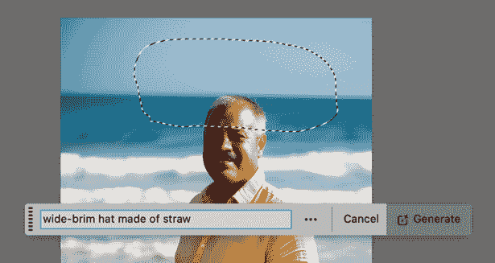

图 7.1 – 我想要在这里放一顶帽子，请

现在，您可以使用**套索**工具选择想要放帽子的区域，然后在文本输入字段中告诉 Photoshop 您想要的帽子类型，它将在几秒钟内生成三个选项。您甚至不需要告诉 Photoshop 您想要什么；留空字段，它将找出最佳选项。

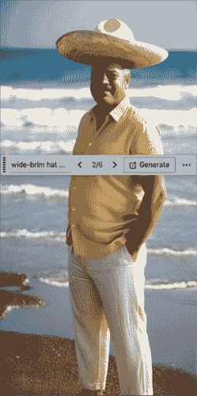

图 7.2 – 这顶帽子不是真的，海滩上的男人也不是

在大多数其他应用程序中，这被称为**修复**，它是一种在**Freepik** ([`www.freepik.com/`](https://www.freepik.com/)) 和 **Claid.ai** ([`claid.ai/`](https://claid.ai/)) 等服务中常见的常规工作流程；我们很快就会看看它们。

类似地，如果你想从图像中移除人物，Photoshop 的**移除**工具可以自动选择人物或电线和电缆，然后用生成的背景替换所选区域。尽管选择并不总是完美的，但很容易用颜色填充遗漏的项目。

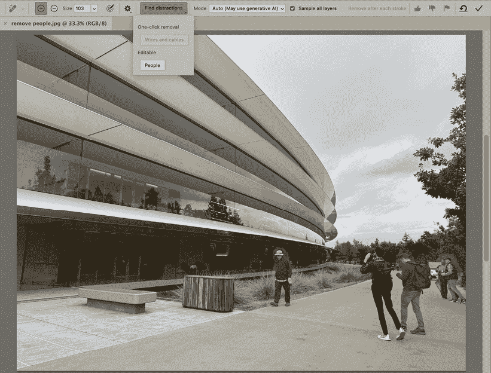

图 7.3 – 使用移除工具的查找干扰>人物选项；大多数但并非所有人被找到

当这个功能被引入时，许多新手用户可能会被诱惑使用这个新工具，而从未学习过其他工具。然而，从 2025 年中旬开始，Adobe 应用程序中的一些生成工具，现在在**Adobe Firefly**的旗帜下（[`firefly.adobe.com`](http://firefly.adobe.com)），从免费转变为在某些计划上需要*生成积分*。但是，移除工具在所有计划上仍然是免费的，至少目前是这样，无论你是否选择使用 GenAI。

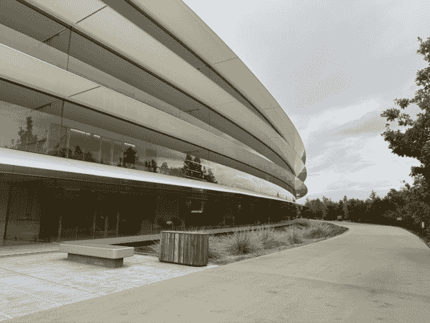

图 7.4 – 这张图像是可用的；当然比没有 AI 的结果要好

你的订阅决定了你可以使用的生成成本和类型。Adobe 应用程序中的大多数生成任务都被标记为*标准*，而涉及视频的任务以及 Firefly 中使用的第三方模型都被标记为*高级*。如果你订阅了所有应用程序（**Creative Cloud Pro**），则标准生成是免费的，你可以随意使用这些功能。

在其他计划中，典型的生成填充任务现在需要 1 个积分，并且不同账户每月获得的生成积分数量不同——目前大约在 25 到 500 之间。（尽管 Creative Cloud Pro 包括 4,000 个生成积分，但由于标准生成仍然免费，这些积分仅用于*高级*任务。）

可以通过附加 Firefly 计划在常规 Creative Cloud 计划之外购买额外的积分，但一些计划使用生成技术进行批量处理的用户现在可能必须考虑成本。（我们将在下一章中再次回到这些积分，因为视频生成的成本比静态图像要高得多。）

即使有潜在的额外成本，Adobe 的生成选项对于担心使用大多数生成图像模型的合法和道德风险的创意人士来说仍然具有吸引力，因为商业使用是明确允许的，至少对于默认的 Firefly 模型来说是这样。

然而，到 2025 年底，可以使用其他生成图像模型。由于它仍在测试阶段，费用尚未确定，但如果你愿意，可以使用**Flux Kontext**和谷歌的**Nano Banana**（又称 Gemini Flash）来代替 Firefly 模型进行生成填充。但这确实带来了一个道德问题——这些模型是否在未经授权使用的图像上进行了训练？即使没有授权，在合理使用下查看这些图像是否允许？

此外，如果您有所疑问，Adobe **不会**在您的图像上训练其模型，但其他 AI 提供商**可能**会这样做。政策各不相同，但一般来说，如果您为服务付费，他们可能不会使用您的数据来训练。如果您免费使用服务，这种情况更可能发生；请仔细阅读条款以了解详情。

与许多基于未知来源图像训练的模型相比，Adobe 的模型仅基于特定、已知的图像进行训练。虽然主要来源于 Adobe Stock，但也使用了部分公有领域和其他开放许可的内容（[`helpx.adobe.com/au/firefly/get-set-up/learn-the-basics/adobe-firefly-faq.html`](https://helpx.adobe.com/au/firefly/get-set-up/learn-the-basics/adobe-firefly-faq.html)）。尽管并非所有 Adobe Stock 的贡献者都意识到他们的图像将被用于 AI 训练，但在他们签署的协议中这是法律允许的（[`www.techradar.com/pro/software-services/creators-slam-adobe-over-firefly-ai-training`](https://www.techradar.com/pro/software-services/creators-slam-adobe-over-firefly-ai-training)）。

简要回顾一下在*第二章*中提出的伦理问题，如果您对图像生成工具的训练方式感到担忧，请寻找该工具制造商的声明。Adobe 的声明很明确，苹果公司表示他们使用“授权数据”([`machinelearning.apple.com/research/introducing-apple-foundation-models`](https://machinelearning.apple.com/research/introducing-apple-foundation-models))。包括 OpenAI 和 Meta 在内的主要 LLM 创作者都因训练数据的来源面临诉讼，并声称“合理使用”。

如果您想结合传统修图工具和 AI 来编辑图像，无论是否使用第三方模型，Photoshop 可能仍然是您的最佳选择。生成填充是一个很好的工具，可以添加或更改图像；第三方模型以新的方式扩展了这一功能，如果您想移除某些内容，生成移除通常会产生干净、有用的结果。然而，Adobe 的工具并不是改变图像一部分的唯一方式。

多模态 LLM 如 ChatGPT 和 Gemini 都具备能力，还有众多第三方基于网络的在线服务和集成在手机操作系统中的照片编辑工具。

在手机上，Android 用户可以使用 Google Photos 的 AI 编辑工具，其中**魔法橡皮擦**和**魔法编辑器**是免费提供的。在某个区域刷过、画圈或点击特定项目以移除它们，AI 模型将填补空白。在 iPhone 或 iPad 上，在照片应用中画圈移除图像中的不需要部分也以类似的方式工作。尽管这些简单工具并不总是提供创意生产专业人士所需的灵活性、力量或可扩展性，但它们可以成为快速、偶尔修复的便捷工具。

假设你的需求超出了手机所能做到的，如果你不想使用 Photoshop，可以考虑基于网页或桌面的选项，如 Freepik、Evoto 或 Claid.ai，使用与 OpenAI 或 Google 的 AI 服务集成的服务，或者甚至考虑使用网站创建工具，如 Wix。（其他工具，如 Imagen，将他们的图像修图服务定位在自动化生产上，我们将在本书的*自动化 AI*部分探讨一些这些工具。）

尽管有许多种工具可用，但我怀疑大多数创意专业人士更愿意使用基于桌面的应用程序来避免从网站上传和下载图像时可能出现的文件管理麻烦。

并非所有工具都提供桌面应用程序，并且多个服务可能提供相同的模型。Adobe 的 Firefly 网络服务目前提供最突出的模型，包括他们自己的 Firefly Image 模型，以及来自 Imagen、GPT Image、Flux 和 Runway 的更多模型。

让我们更深入地了解一下如何从文本提示中制作图像。

## 通过 AI 提示进行修图

这个领域的竞争非常激烈。2025 年 8 月，Gemini 推出了其 Flash 2.5（又称 Nano Banana）系统，积极邀请用户通过网页界面进行提示以优化图像：

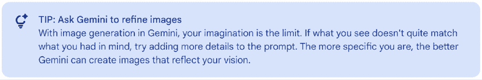

图 7.5 – Gemini 现在要求用户在请求中具体说明

上传之前相同的“海滩上的男人”图像，并要求“给这个男人加上一顶帽子”，得到了不错的结果：

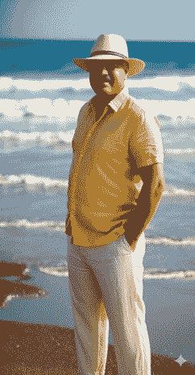

图 7.6 – Gemini 的输出；我本可以更具体一些，但这个帽子是一个合适的选择

一致性很高，但从生产角度来看，主要问题是输出并不完全匹配输入；它已被裁剪并略微放大，分辨率从`1024 x 512 px`变为`1024 x 535 px`，并且有明显的质量损失。

另一个问题源于文件管理。当你上传、处理和重新下载时，原始文件名会丢失，每个下载的文件都必须重命名并复制到稳定的位置。这类问题对于基于网络的系统来说是不可避免的，虽然这些并不是无法克服的问题，但对于一次性的测试来说，它们在生产流程中可能会造成问题。

完全在 Photoshop 内部的生产流程更容易管理，所以如果你想使用 Nano Banana，如果可能的话，我会在 Photoshop 中使用它。分辨率仍然是一个问题，但可以通过选择生成较小的区域或仅重新生成较大区域的一部分来解决这个问题。

另一个担忧是，生成的图像有时与原始图像的偏移或亮度级别不同。为了修复这些问题，添加一个图层蒙版，并使用柔软的黑色画笔在该蒙版周围绘制。Photoshop 中的 AI 生成功能强大，尽管它并不完美，但可以成为困难修图任务的实用工具。这个功能目前正在积极开发中，并且在未来版本中可能会再次发生变化。

对于 Photoshop 的最新信息，我建议关注 PiXImperfect 的 Unmesh Dinda 的最新动态——在我看来，他是 YouTube 上最好的 Photoshop 教育者。这是一段关于将 Nano Banana 引入 Photoshop 的视频，可能在你阅读时已经有些过时，但其中有很多很好的想法：[`youtu.be/RJ2eqkk_JxI`](https://youtu.be/RJ2eqkk_JxI)。例如，你知道你可以用文本说明来注释图像，并使用文本提示，如 `跟随图像中的提示` 吗？

尽管如此，基于网络的文本提示可能是一个值得考虑的选项，让我们看看不同的网络服务如何处理我在本节开头在 Photoshop 中执行的同一个人脸移除任务。我不再使用菜单和手动绘制遗漏的区域，而是直接用简单的英语请求工具完成：`从这张图片中移除人物`。以下是不同模型的表现：

+   **Gemini** ([`gemini.google.com`](http://gemini.google.com))：其较旧的图像模型完成了可接受的工作，但替换区域可以做得更好。分辨率较差，细节丢失。较新的 Nano Banana 模型做得更好，但仍然存在分辨率低和细节丢失的问题。

+   **ChatGPT** ([`chatgpt.com`](http://chatgpt.com), 使用免费账户)：它在移除方面做得不错，但花费了较长时间，并且裁剪了图像成方形。

+   **Sora** ([`sora.chatgpt.com`](http://sora.chatgpt.com), v1, 使用 ChatGPT Plus 付费账户)：它在一两分钟内完成了良好的工作，没有改变图像的宽高比，但分辨率没有原始图像高。

+   **Freepik** ([`www.freepik.com/`](https://www.freepik.com/))：它非常快速地完成了出色的工作，使用了 Flux Kontext Max 模型。需要付费计划才能获得商业许可证或高分辨率输出。

+   **Claid.ai** ([`claid.ai/`](https://claid.ai/))：它做得相当不错。高分辨率输出仅适用于付费计划。

尽管这个任务有许多选项，但如果你需要高分辨率的结果，你可能需要为此付费。

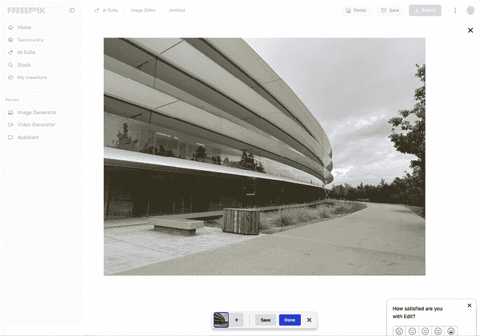

图 7.7 – Freepik（显示）和 Claid 生成的结果与 Photoshop 相当

并非所有增强型 AI 照片工具都接受文本输入，所以如果你希望工具能够处理更不寻常的请求，请检查是否支持提示。这种方法还允许服务提供商如 Freepik 设计提示以支持特定的流程，例如`Generate Different Angles of Person`或`Place Product in a New Setting`。

ChatGPT 的文本模型解释你的请求，然后其他图像模型处理图像创建。

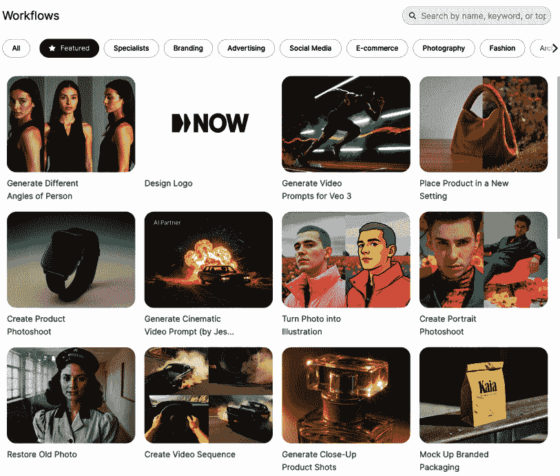

图 7.8 – Freepik 提供许多由提示驱动的流程，包括这些

其中一些远远超出了简单修图所能达到的效果，而且可以在几秒钟内获得可用的结果。我们很快将回到更复杂的图像到图像的工作流程。

## 扩展原始图像

图像被构图得比布局艺术家希望的更紧密并不罕见。在一个理想的世界里，摄影师可以更宽松地构图他们的照片，让设计师最终控制裁剪和放置。

因为我们**不**生活在一个理想的世界里，摄影师更有可能以对他们来说看起来好的方式构图他们的照片，在相机或处理过程中更紧密地裁剪主题。然后客户在自己的环境中批准那些“裁剪得很好”的照片，每个人都感到高兴。但后来，如果图像的边缘最终被发现是必需的，AI 可以帮助填补缺失的区域。

**图像扩展**在概念上与替换图像中不需要的部分相似。不是替换原始图像的一部分，而是在一个或多个维度上扩展其边界，然后使用看起来像原始图像的图像数据填充新区域。虽然可以使用像修复画笔和内容感知填充这样的旧工具来完成这项任务，但使用生成填充通常更容易。

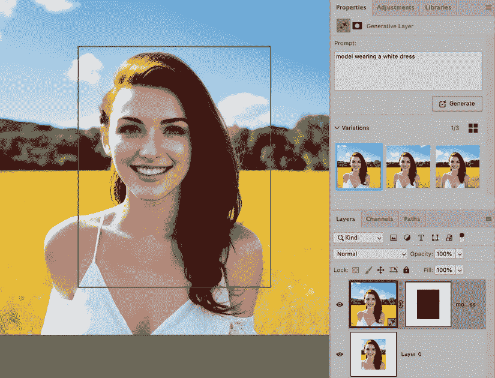

图 7.9 – 在这里用绿色轮廓显示的原始图像，Photoshop 提供了三种可能的扩展选项

Adobe 应用程序以几种方式提供此功能。您可以在 Photoshop 中使用手动选择和生成填充来完成此任务，作为裁剪工具的生成扩展，或者在 InDesign 中，具体取决于工作流程要求。其他图像处理工具也可以完成这项工作。

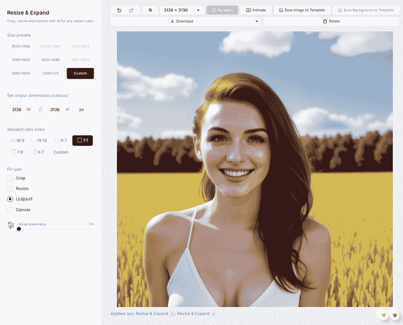

图 7.10 – Claid.ai 需要两次上采样操作（垂直，然后水平）才能得到这个结果

这个功能通常被称为**扩展绘画**，在 AI 图像处理服务中很常见，许多服务都能给出良好的结果。如果你需要在新的语境中重新使用一个图像，而原始图像找不到，这不是一个坏的选择。然而，请注意，如果确实存在原始未裁剪的图像，你应该始终尝试找到它，否则你可能会无意中歪曲现实。如前图所示，创造人体任何一部分都是不明智的。

虽然这里展示的图像中的女性并非真实存在，但很容易想象到通过图像扩展可能会对真实人物造成冒犯——这确实已经发生了。2024 年初，澳大利亚电视网络**九号台**在使用 AI 扩展图像后遭到了批评。作为一条电视新闻故事的一部分，维多利亚州的国会议员 Georgie Purcell（议员）被拍摄和拍照时穿着一件白色连衣裙。这张照片后来被裁剪，只展示了她腰以上的区域，并在另一个语境中使用。后来，这张裁剪后的图像通过生成式 AI 扩展，展示了她穿着露脐装而不是原来的连衣裙（[`theconversation.com/nine-was-slammed-for-ai-editing-a-victorian-mps-dress-how-can-news-media-use-ai-responsibly-222382`](https://theconversation.com/nine-was-slammed-for-ai-editing-a-victorian-mps-dress-how-can-news-media-use-ai-responsibly-222382))。

虽然生成式 AI 在广告和创意方面有明显的用途，但在基于事实的语境中使用真实人物的图像时，请务必非常小心。然而，生成式扩展并不像创建完整图像那样具有争议性，而这正是接下来要讨论的。

# 创建原始图像

你现在可能已经在野外遇到了 AI 制作的图像，但……你想要使用 AI 为你制作图像吗？你越接近图像创建过程，你对这个前景就越可能不感兴趣。如果你的主要工作是市场营销，并且你将图形设计和摄影视为费用，你可能非常喜欢这个想法。但如果你是一位摄影师或插画家，你为什么要停止做这件事呢？

然而，尽管客户应该足够关心他们的图像，以至于雇佣有技能的专业人士来创建它们，但并非所有客户都这样做，这并不是什么新鲜事。如果一个小型企业看不到雇佣摄影师或设计师来制作图像的好处，从历史上看，他们可能会自己制作，或者使用模板，或者请一个“知道 Photoshop”的家庭成员帮忙。今天，他们可能会直接使用 AI。

即使在大公司中的专业职位上，并非每个图像都具有相同的价值。被指派在年度报告中找到一个图像来说明观点的图形设计师可能没有摄影预算，但他们可能拥有库存图像。

现在，这个预算可能已经缩减为零，他们可能会选择从免费股票图片网站如[pexels.com](http://pexels.com)或[pixabay.com](http://pixabay.com)，或[unsplash.com](http://unsplash.com)（其混合免费/付费模式）获取图片。所有这些网站现在都包括真实照片和 AI 制作的图像，尽管 AI 制作的图像被标记为这样的。

在人类制作的库存图片可以接受的情况下，使用 AI 制作的图像是否合适？询问您的客户。他们的答案可能因年度报告中使用的抽象图像与以艺术为重点的项目（如桌面游戏）而不同。如果消费者对人工艺术有强烈的偏好，使用 AI 艺术可能会使众筹项目失败。

即使您选择不使用 AI 制作的图像来完成艺术作品，也请考虑使用 AI 图像创建工具进行创意和原型设计。尽管 AI 艺术本质上是对其他艺术的衍生，但传统的原型设计过程也是如此，其中使用他人的图像作为灵感和情绪设置的来源。

您负责决定如何使用这项技术。在这里，我们将探讨可能实现的内容、好的方面以及不好的方面，并从从文本创建图像开始。

## 从文本提示生成图像

提示允许您定义图像应包含的内容以及其应呈现的风格。虽然文本提示无法可靠地生成显示特定产品的图像——为此您需要图像到图像的工作流程——但它仍然非常有用。如果库存图片搜索结果为空，且没有预算来真实捕捉图像，只需让 AI 制作一个即可。

服务的输出质量、速度、用户界面和定价可能各不相同，而您的用例将决定您对每个方面的优先级。例如，如果您只想为原型制作图像，那么内置在现有软件中的不完美解决方案可能比高质量的付费解决方案更有吸引力。在其他情况下，您可能受到平台自我审查的限制。许多模型会尽量避免任何可能被认为是暴力或露骨的内容，而 Firefly 甚至不会生成埃菲尔铁塔的图像。

图 7.11 – 这个提示仅仅是“埃菲尔铁塔，以 45°角，在晴朗的蓝天下的样子”

虽然一些工具仅可在特定平台上使用，但其他模型可以在多个供应商之间找到。例如，苹果的**Image Playground**仅在苹果的硬件上可用，但您可以通过 Adobe Firefly、Freepik 和其他方式访问**FLUX.1 Kontext**模型。这个领域的进步非常迅速，您需要自己测试以查看哪个服务（或服务组合）符合您的需求。如果您使用 Firefly，请记住使用第三方模型会消耗生成信用——在开始之前检查您有多少。

如果您知道您在寻找什么，使用详细的说明将给出更好的结果，如果您将细节留给模型，您可以期待更多样化的结果。务必指定主题、正在发生的事情、它们所在的位置以及您想要的图像风格。

使用描述性形容词，指定所需的宽高比，并包括摄影和照明说明。如果提示不太有效，可以添加内容并再次尝试，或者如果您遇到重复问题，可以添加负面信息，例如`没有额外的肢体`。

一些服务，例如 Firefly，允许您在提示旁边选择额外的选项，如宽高比和风格。我们将在本章下一节讨论参考图像和风格选项。

简单、快速的模型可能难以处理涉及多个主题的更复杂提示。您将在生成的图像大小和速度之间面临权衡，并且可能需要为了某些目的提高低分辨率图像的分辨率。此外，您会发现许多模型会产生混乱的文本——如果需要，请准备好手动修复它。

在这里，我们将尝试在几个不同的模型上使用相同的提示，突出供应商之间的重要差异，并提供一些策略。以下是提示：

+   `一只手握着从土壤中生长的小绿苗，背景是黑暗的清晰背景，强烈的顶光，逼真的现代照片`

+   `洪水破坏的纽约市街道，人们在驳船上穿过百老汇和 51 街的交叉口，模糊的黑白历史照片`

+   `一个手持剑的威胁性骷髅，背景是黑暗的地牢，嘴巴张开，准备攻击，幻想插画风格`

+   `具有霓虹渐变和点的漩涡的抽象艺术，现代科技风格，矢量插画`

+   `一只棕色的狐狸快速跳过躺在松树林中睡觉的狗，斑驳的光线，童话水彩插画`

重要的是要注意，一些服务会指导您如何改进提示过程，甚至可能“增强”您的提示。例如，Firefly 包含一个默认开启的**提示增强**功能，将先前的纽约市提示转换为以下内容：

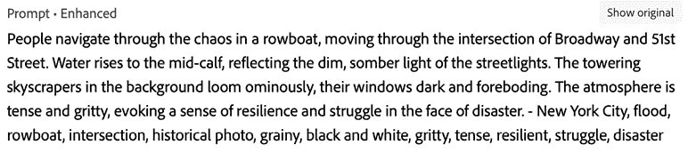

图 7.12 – 增强的提示可能会添加不希望出现的细节

虽然更详细的描述会给出更具体的结果，但这里添加的情感语言对于新闻风格的图像来说并不合适。指定水位“升到小腿中部”并不是我所要求的或想要的。要小心。另一方面，由于 Firefly 允许您从许多第三方模型以及他们自己的模型中选择，因此它是一个快速比较它们可能对您的工作有多有效的好地方，如果您是 Adobe 订阅者，您已经可以访问了。

要找到一个能够根据你愿意撰写的提示创建你喜欢的作品的模型，在付费订阅之前进行多次免费测试是值得的。除了萤火虫可访问的模型外，你目前需要付费的 ChatGPT 账户才能访问 Sora，如果你想免费尝试 Midjourney，请下载移动应用*Niji Journey*（在你的移动应用商店中）进行免费试用。

在这里，我尝试了 Adobe Firefly 模型、Runway、Flux 1.1 Ultra、Sora、ChatGPT、Midjourney、KlingAI、Nano Banana Pro 和其他模型的这些提示。请注意，苹果设备上包含一个名为 Image Playground 的应用程序，但它无法像这些其他工具一样处理较长的提示。

所有测试过的模型在至少一些提示上表现良好，但总体而言，最一致、质量最高的结果来自 OpenAI 的 Sora（v1）和 Nano Banana Pro，这是唯一能够创建显示纽约市请求位置的图像的模型，并且包括可辨认的相关文本。

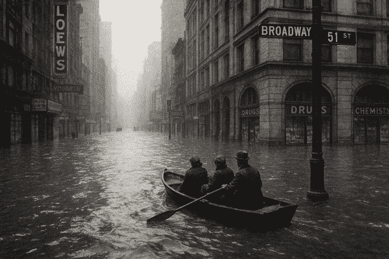

图 7.13 – Sora 的纽约市图像几乎完全符合我的期望

这个特定的提示对大多数其他模型来说都很有挑战性。在某些生成中，人们正在“洪水”道路旁边的人行道上行走；在大多数情况下，文本是混乱的。最常见的问题是感觉不真实。

Sora 在其他的提示上也表现良好：

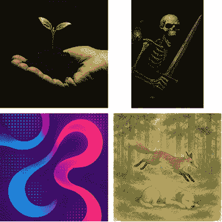

图 7.14 – Sora 的其他结果

Nano Banana Pro 表现良好，没有重大错误，并且高度遵循提供的提示。虽然我仍然只稍微倾向于 Sora（v1），但这些结果很稳固：

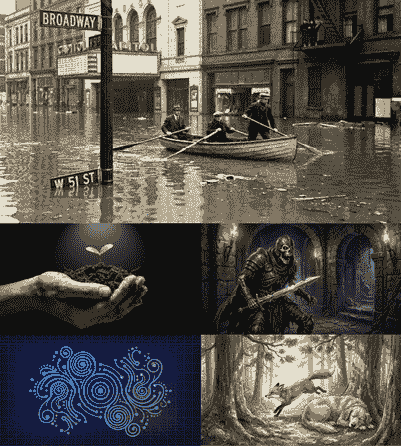

图 7.15 – Nano Banana Pro 在所有提示上的结果

萤火虫内置模型的一个大优势是，其基本生成在 Adobe 账户下是免费的，默认情况下会生成四张图像。虽然其土壤手部图像大多还可以，但最后一张图像简直是噩梦：

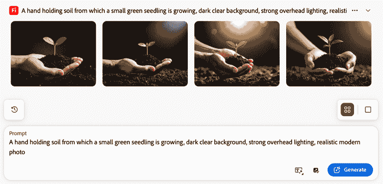

图 7.16 – 最后的手发生了什么？

此外，虽然萤火虫的纽约市图像大致显示了正确的内容，但细节不足。示例图像与提示完全不匹配；大多数所谓的“狗”实际上是狐狸，有时跳跃的狐狸看起来像是漂浮在空中。

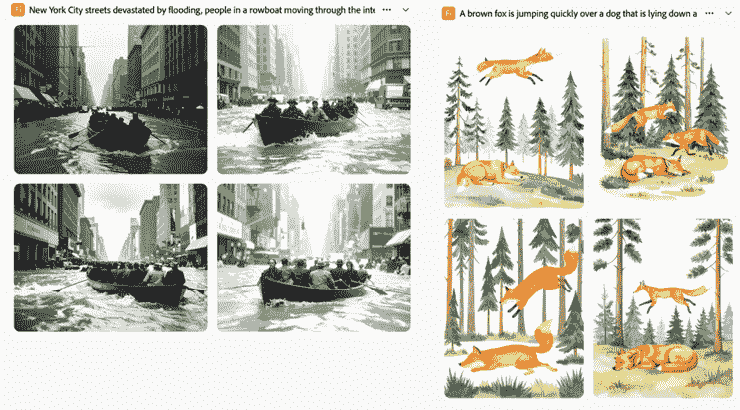

图 7.17 – 这些纽约市图像还不够完美，狐狸图像几乎无法使用

公平地说，萤火虫是一个多用途工具，其工具箱中有很多其他技巧。如果你想将文本图像的风格化为液态金属或橙色皮毛，它都能满足你的需求，但它的默认模型在纯摄影输出方面还不太出色。

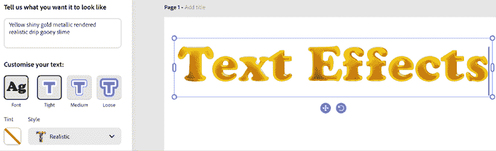

图 7.18 – Firefly 的文本效果在 Adobe Express 中的基于提示的风格创建器中

但让我们回到摄影和插图比较。**Midjourney**产生了一些出色的骨骼风格插图，但无法让狐狸跳过睡狗——相反，它们都睡着了。

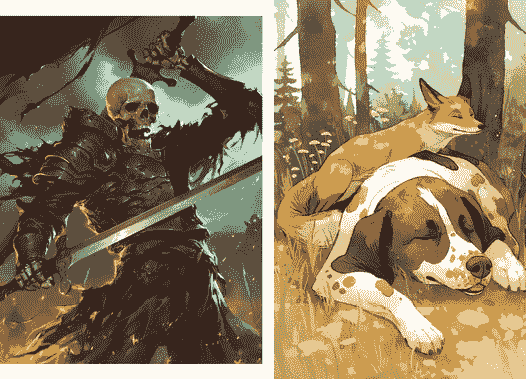

图 7.19 – Midjourney 的威胁性骨骼和睡眠中的动物

Google 的**Imagen**产生了一些可靠的结果，包括以下这些：

.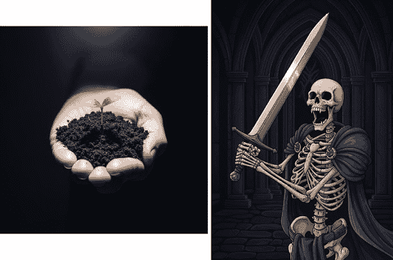

图 7.20 – Imagen 的手部土壤效果很好，其骨骼造型也相当威胁

**KlingAI**，来自 DeepSeek，大多数情况下既快又有效：

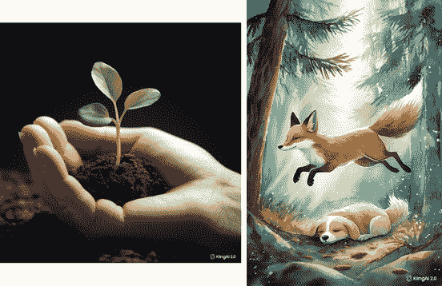

图 7.21 – Kling 的手部效果很好，其狐狸跳过懒狗的动作也很自然

通过 Firefly，Flux 在这些提示中做得很好，分辨率高于大多数其他模型：

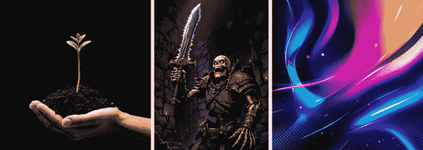

图 7.22 – Flux 产生的抽象艺术作品最佳，其其他图像也很好

Runway 也能产生不错的输出：

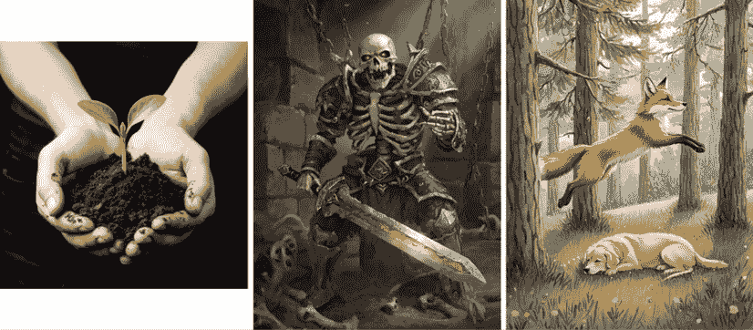

图 7.23 – Runway 的提供内容扎实

## 量产选项

如果你更关心数量而不是质量，可以查看**Diffusion Bee**：一个免费的 Mac 应用程序，可以在本地免费运行较旧的 Stable Diffusion。如果你需要大量的粗糙草图，成本是无法比拟的。

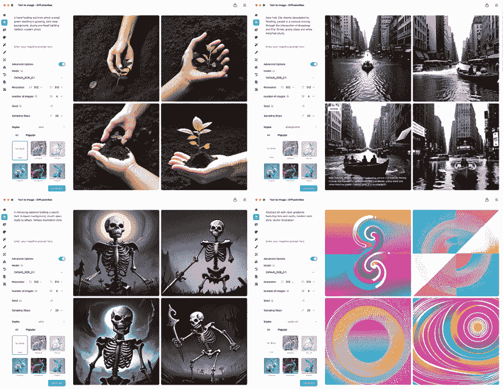

图 7.24 – 这些生成效果不是很好，但它们是完全免费且无限的

另一个非常适合量产的选项是**Grok**（[`grok.com/imagine`](https://grok.com/imagine)或通过 Grok 移动应用程序），它允许你简单地向下滚动查看更多图像，还有更多。这里的生成速度令人印象深刻，对于创意来说，这可能非常有用。尽管产生了大量图像，但质量尚可，视频生成（下一章讨论）只需轻触即可从任何图像开始。

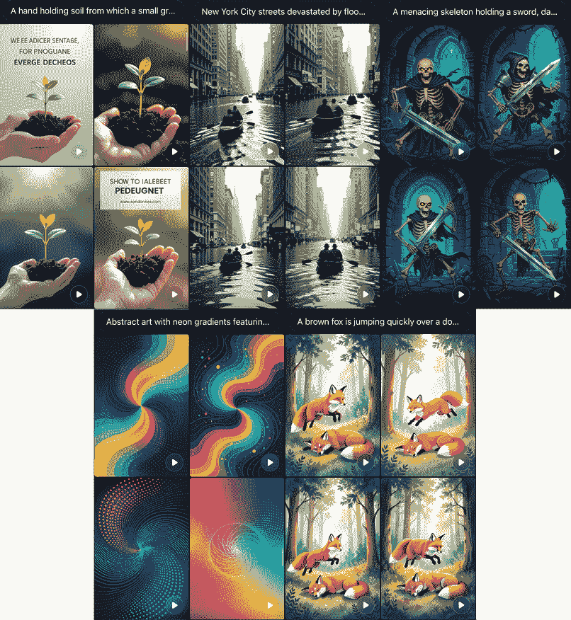

图 7.25 – Grok 的图像在质量上不是最佳，但速度非常快

对于这里的每个提示，我展示了前四个，但已经看过更多，并发现与大多数其他模型类似的问题。狗通常是狐狸或至少有狐狸的尾巴；纽约不真实；与其他模型相比，幻想插图看起来很廉价；一些植物图像包含了混乱的、不希望出现的文字。如果速度是重点，请注意，每组四张图像只需几秒钟，滚动查看更多可能会上瘾。这些图像的长期成本尚不清楚，但现在是完全免费的。

由于模型会变化，你的需求不会与我的相同，因此你可以从这些服务中的任何一个，或者从我没有包括在内的许多其他服务中获得良好的结果，例如 Leonardo 或最新的 Stable Diffusion 模型。然而，在 Sora 和通过萤火虫提供的选项之间，我认为你将能够产生良好的结果。分辨率是大多数这些模型的一个担忧，但 Flux（通过萤火虫和其他提供）可以原生地产生高分辨率，并且从其他模型的输出中提升分辨率可能是有效的。

与许多其他 AI 生成一样，预期会有不完美之处，这样你就不会失望，但你可能会对一些模型的表现感到惊喜。对于创意人士来说，告诉计算机你想要的是什么是一个完全不同的创作过程。为了更精确地控制 AI 模型创建的内容，考虑给它图像而不是仅仅文本。

## 从其他图像生成图像

图像到图像的工作流程可以有多种形式。如果你只需要替换图像的一部分，仍然最好使用像 Photoshop 这样的工具，但如果你想要将一个图像作为另一个图像的灵感或风格来源，或者确保一系列图像的一致性，寻找一个明确支持这一功能的工具。许多工具都支持，包括 Photoshop，萤火虫模型中的大多数（包括 Nano Banana），以及 Freepik，仅举几个例子。

在文本到图像的工作流程中，可以简单地要求特定的图像风格，一些模型，例如萤火虫模型，允许你上传一个参考图像用于构图和/或风格——但请确保为每个上下文选择正确的图像。如果你没有自己的原始来源，可以使用样本图像。

Photoshop 的**生成图像**功能允许你包含**风格参考**和/或**构图参考**，这是一种使生成的图像与现有标志或照片的布局或颜色相匹配的有用方法。

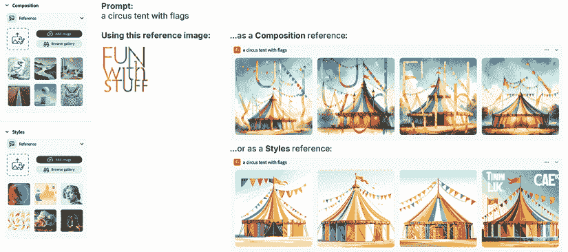

图 7.26 – 如果你想生成的图像与现有作品相匹配，请上传参考图像（s）用于构图和/或风格图像

如果你不想使用现有的图像，你可以从大量现有的参考图像中获取灵感，其中一些可以在下面看到：

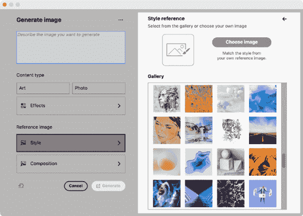

图 7.27 – 这里展示的是 Photoshop 的一些风格参考

返回纯文本，可以提示像**Sora**这样的服务创建与现有图像风格相匹配的额外图像。在这里，我要求基于 Sora 之前制作的骨架生成几张新图像：

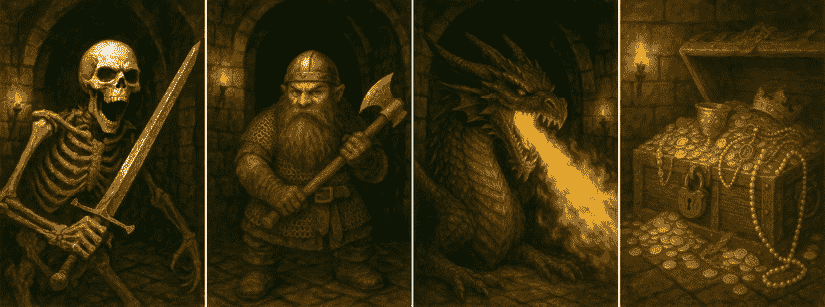

图 7.28 – 骨架是矮人、龙和宝藏（所有都加亮以显示细节）的风格模板

如果你需要更广泛地控制这一级别，你可能需要转向像**Freepik**这样的服务，它允许你提供更大的训练图像库，从中可以生成 LoRA。名为**低秩自适应**的**LoRA**允许模型模仿一种风格，而无需从零开始重新训练模型，在概念上是一种与你的现有图像相匹配的定制风格。

如果你更喜欢使用 Freepik 提供的预定义风格，这有助于你的生成保持相似。这些风格也可以用来重新想象图像的新风格，这是 Google Whisk 也提供的一项服务。以下是一个例子，我将两张左边的图片上传，选择了软玩具的风格，并让网站自行处理：

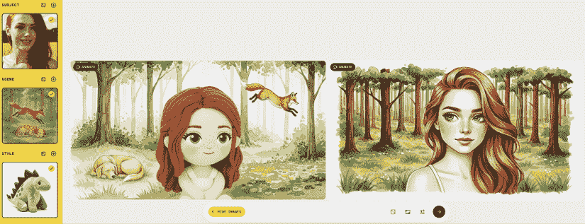

图 7.29 – Google Whisk，一种有用的混搭方式

右侧显示的两幅图像是由 Google Whisk 根据左侧的图像编写的两个不同提示生成的。作为完成的艺术作品，它们并不那么出色，但作为灵感？那就足够了。如果你使用像 Nano Banana 这样的能够胜任的模型，还可以使用 Photoshop 的生成填充功能，例如输入“将此图像制作成油画”这样的提示。分辨率可能不是完美的，但结果通常令人印象深刻。

那么，如果你确实需要具有完成艺术作品质量的摄影图像呢？一些服务确实可以实现这一点。

## 创建虚拟摄影棚

就像 Firefly 一样，Freepik 提供来自其他 AI 提供商的模型，并在其自己的界面和独特功能中重新包装它们：“生成人物的多个角度”、“将产品放置在新环境中”等等。将一位女孩在田野中的单张图片上传到 Freepik 后，可以要求它以不同的角度生成照片：

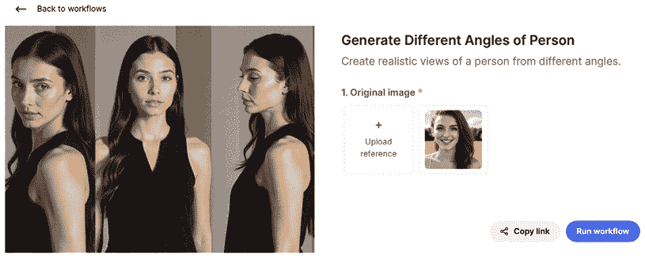

图 7.30 – Freepik 允许你上传一张图片，然后为你提示“嘿！从这张照片的不同角度创建多张图片”

Freepik 随后生成这三张新图像：

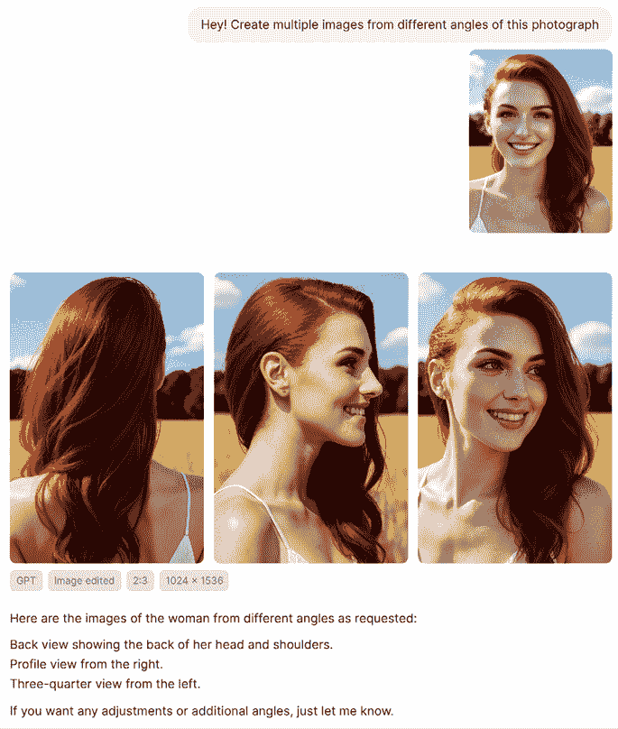

图 7.31 – 三种可用的新选项，如果你要求的话还有更多

虽然这些照片看起来并不完全像是同一个人，但它们非常接近，这种工具在正确的情况下可能具有巨大的价值。图像到图像的工作流程有可能扩展到生产工作流程，而仅仅要求带有文本的图像是无法做到的。

虽然 Freepik 包含一组预定义的角色，但你可以通过上传许多一个人的图片（无论是真实的还是虚拟的）来创建一个新的虚拟角色或头像。然后，这些图片将被用来训练一个模型，使其能够创建特定、一致的人物的图像。这种技术在保持连续性方面很有帮助，我们将在下一章中再次讨论它。

Freepik 并不是唯一能够以不同角度创建同一个人图像的服务。**Higgsfield**([`higgsfield.ai/`](https://higgsfield.ai/))提供虚拟角色以及一组令人印象深刻的预设，由于它主要关注视频，我们将在下一章中再次讨论它。Sora 也能做这项工作，尽管它需要更长的时间，你需要在提示中提出这个请求。

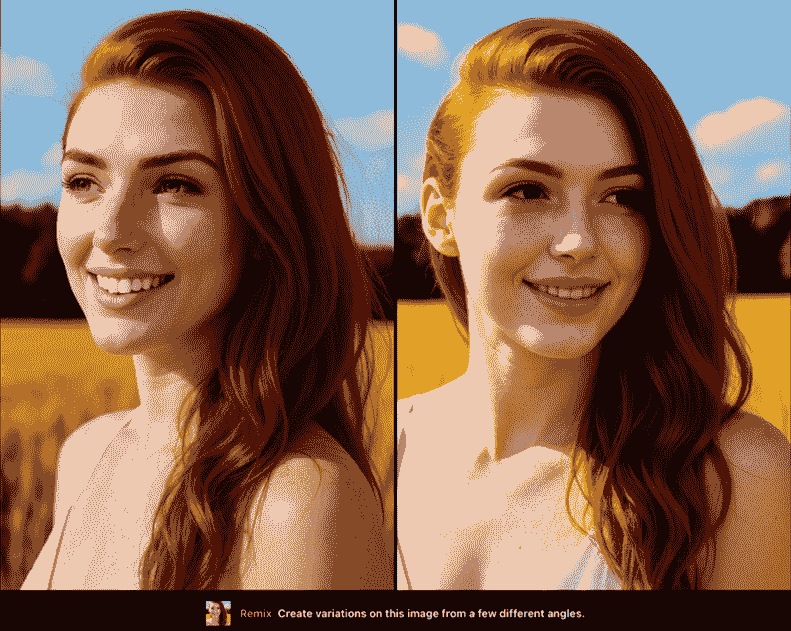

图 7.32 – Sora 的 Remix 功能允许你请求变化，也是如此

Claid.ai 是另一个以图像为中心的服务，它包括一个 AI 时尚拍摄功能。你可以使用提供的虚拟模型或你自己的图片，以及你希望他们展示的衣服图片，然后它会为你拍摄虚拟照片。

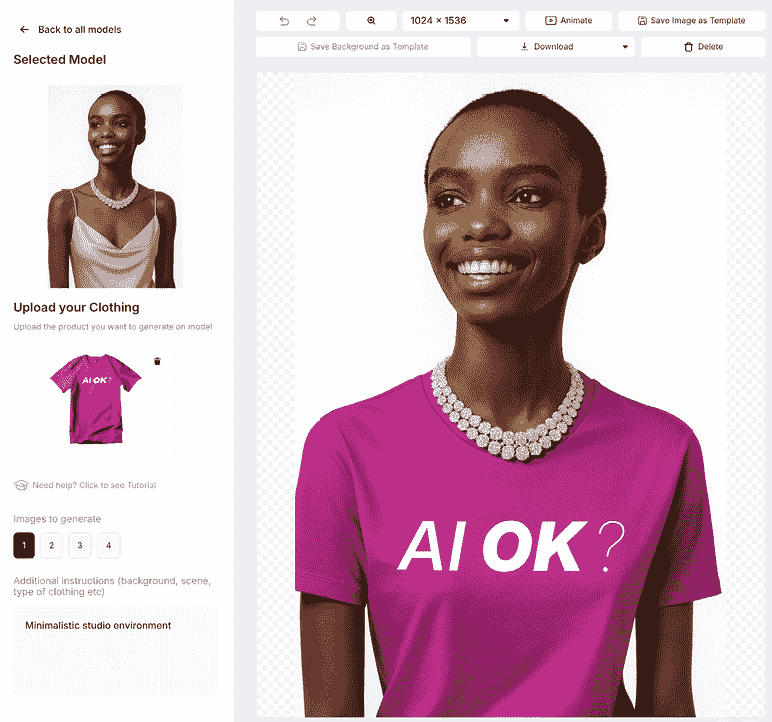

图 7.33 – 这是 Claid.ai 的虚拟照片拍摄结果

结合这些想法，你现在可以进行一次模特手持客户产品或穿着他们衣服的摄影，无论是真实的还是虚拟的。有了这个，你可以创建新的姿势并提供新的选项，而无需重新拍摄。尽管如此，你真的应该这样做吗？这是一个更加棘手的问题。

为了获得最佳、最原创的结果，我建议使用真实的人物的真实产品摄影，如果需要，可以使用 AI 来增强和补充这些照片。真实的拍摄可以产生未被请求或预期的神奇效果，这些意外的时刻是非常宝贵的。

另一方面，在某些情况下，由于正在销售的产品尚未被创造出来，因此无法进行真实的发芽。我曾在游戏板在制造之前，创建了逼真的 3D 渲染图来销售游戏，这难道不是同一回事吗？

如果你不歪曲现实，并且得到了项目中其他创意人员的批准，那么你伪造现实的方式——无论是使用 Photoshop 还是使用 AI 辅助工具——都不应该很重要。伪造图像并不是什么新鲜事，但始终要记住，你伪造得越少，结果就越好。

另一个重要因素是，模板很快就会过时，如果使用频繁，则更快。因此，如果你考虑使用 AI 时尚拍摄，我会建议避免使用库存 AI 时尚模特。它们第一次看起来可能很好，但当消费者在许多不同网站上多次看到完全相同的模特时，它们可能会造成更多伤害而不是帮助。

虽然我们已经看了照片和插图图像，但真正的矢量艺术呢？

# 生成矢量艺术

虽然大多数 AI 生成的图像是基于像素的，但 Adobe 提供了一些使用 AI 生成矢量艺术的选择。在网页上的 Firefly 可以根据提示创建主题或场景，以参考图像或风格作为控制。这非常有效，下载的文件格式为 SVG。

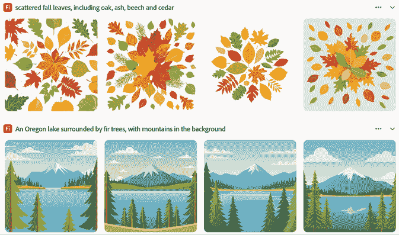

图 7.34 – 两种不同风格的矢量艺术，均可下载为 SVG 格式

尽管大多数生成艺术的问题之一是缺乏复杂性，但这对于大多数矢量艺术来说是一个优点，因为通常希望有一个清晰、干净的风格。根据对艺术的观察，它似乎是从生成的像素艺术中追踪而来的，但这通常不是太大的问题。

如果你更喜欢直接在 Adobe Illustrator 中访问这项技术，请使用上下文任务栏。画一个矩形，按下**生成矢量**按钮，然后输入你的提示。

对于更接近你自己的艺术创作的作品，先创建那个艺术作品，然后点击**生成形状填充**。在这里，我创建了一个简单的八边形和一个矩形，然后要求它生成一个停车标志。

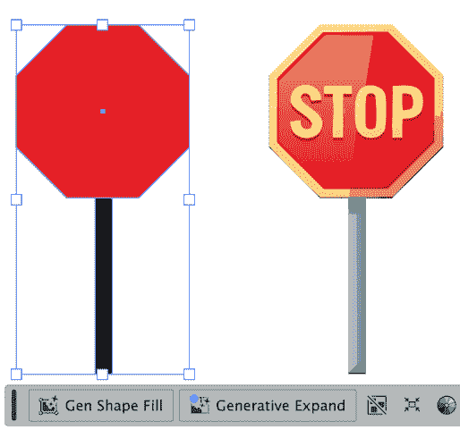

图 7.35 – 一个简单的原型停车标志，以及一个更成熟的版本

**生成扩展**，也存在于 Photoshop 和 InDesign 中，在 Illustrator 中这里非常实用。打开 Firefly 中的 SVG 文件，使用**画板**工具很容易扩展现有画板的边界，然后可选地添加一个提示。

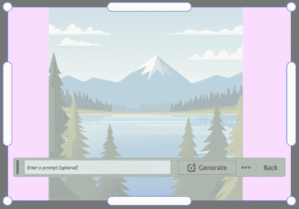

图 7.36 – 这里不需要提示，只是更多相同的内容，请

很快，你会得到三个选项的选择，如果需要可以请求额外的生成：

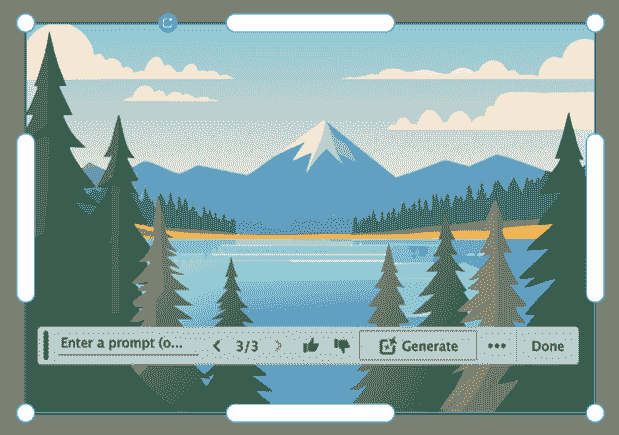

图 7.37 – 这里的第三种选择是提供的最佳选项

Illustrator 还可以根据提示生成矢量图案。打开**生成图案**面板，然后输入一个提示以创建三个无缝重复的图案。

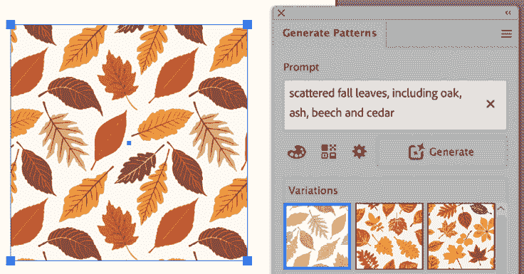

图 7.38 – 变化面板中可用的三种简单矢量图案

目前在 Illustrator 中隐藏的一个更多生成功能是**生成重着色**。你可以在**重着色艺术**面板中找到这个选项（**编辑**>**编辑**>**颜色**>**生成重着色**是到达它的方法之一），它提供了一种快速转换任何选定艺术作品颜色的方法。虽然常规的**重着色艺术**对话框可以通过少量手动操作来完成这项工作，但使用生成版本更快、更简单，也是一种有趣的尝试颜色的方式。

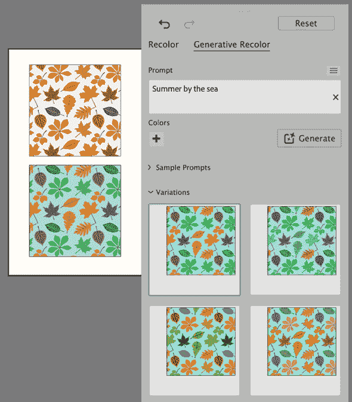

图 7.39 – 这里，之前的叶子已经被复制、扩展，然后重新着色

你可以输入一个提示或使用一个示例，如前图中的`Summer by the sea`，点击**生成**，然后点击下面的一个变体来应用它。尝试尽可能多的变体，然后点击回到**重着色**来手动调整结果。

虽然 Illustrator 不是唯一能够创建矢量图像的 AI 启用工具，但它可能是最方便的。如果你想探索其他选项，可以尝试**VectorArt.ai**([`vectorart.ai`](https://vectorart.ai))、**Canva** AI 矢量生成器([`www.canva.com/create/vector-ai/`](https://www.canva.com/create/vector-ai/))或**Recraft**([`www.recraft.ai/`](https://www.recraft.ai/))。Recraft 允许你选择矢量艺术（或像素艺术）的风格，并像往常一样提示：

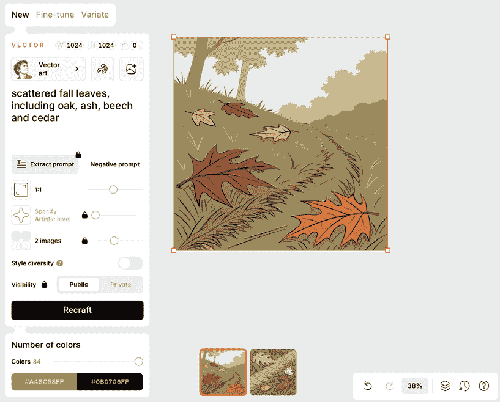

图 7.40 – Recraft 允许你创建矢量和像素图像

即使这些工具没有集成到 Adobe 套件中，你也可能会发现这些工具是创建矢量艺术的一种更灵活的方式——给他们一个尝试的机会。

事实上，Recraft 是许多将 GenAI 模型集成到灵活界面的现代基于网络的图像生成工具之一，这种界面适合简单的项目设计。由于它支持像素和矢量艺术，它是一个构建情绪板的绝佳地方——让我们深入了解。

# 情绪板和设计构思

使用他人的图像长期以来一直是构建情绪板的一种公认做法，它允许一群创意人士就项目的风格和感觉达成一致。通过允许你创建启发你的图像，而不仅仅是借用他人的图像，生成的图像增加了灵活性。当然，你可以在单个板上混合生成的和找到的图像，最终，这些图像都不会成为最终作品的一部分。

虽然在任意的 GenAI 解决方案中创建图像并在你选择的布局工具中组装是完全可能的，但你可能会发现在一个网络工具中构建情绪板更容易，这可能有助于更轻松的协作和共享。一些工具，如苹果的 Freeform，允许共享工作空间，可能是一个创意团队一起头脑风暴的自然场所。

然而，如果过程更侧重于创作，你可能更喜欢使用更专注于 AI 的工具。如前所述，Recraft 的灵活工作空间允许你导入图像，使用熟悉的快捷键进行复制/调整大小/平移，生成像素或矢量艺术，创建这些图像的重新风格变体，并将它们全部排列在无限画布上。

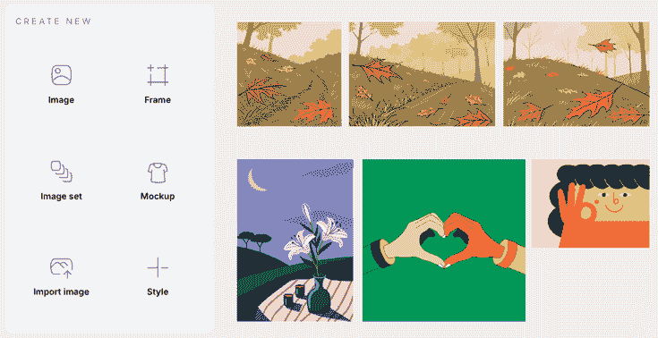

图 7.41 – 扩展的 Recraft 画布的一部分，包含一些生成的艺术作品的变体和一些样本

你需要为 Recraft 支付费用才能使其变得有用，但集成可能值得。然而，如果你已经订阅了 Adobe，他们现在提供了一个专门用于情绪板的应用程序：**Firefly Boards**。与 Recraft 类似，这允许上传、生成和混搭图像的无尽空间。你还可以访问生成填充和生成扩展，以及 Flux 和 GPT 模型。

在这个例子中，我上传了我之前收集的地牢艺术作品，对骨架和矮人进行了变体创作，然后将女战士与宝箱混搭以创建右侧的选项：

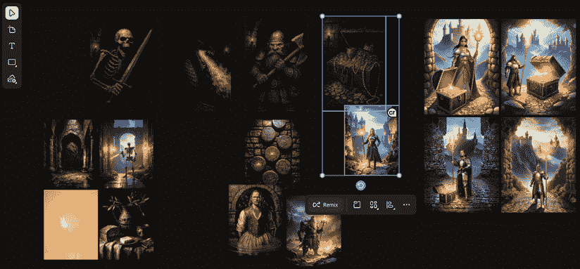

图 7.42 – 结合艺术从未如此简单

这个过程很有趣，快速，对于合适的项目来说可能是革命性的。艺术作品显然并不完美，创建的变体也不一定接近原始作品，但头脑风暴的过程应该是混乱的。这个领域有竞争，包括 **Kittl.com**，所以请查看替代方案，看看哪些适合你的团队。

在头脑风暴过程中，使用基于先前图像生成的快速迭代模型也是一种帮助。**Leonardo.ai** 提供了 **Flow State** 来鼓励这种工作流程，Grok 的无限滚动（前面提到过）也适用于此。

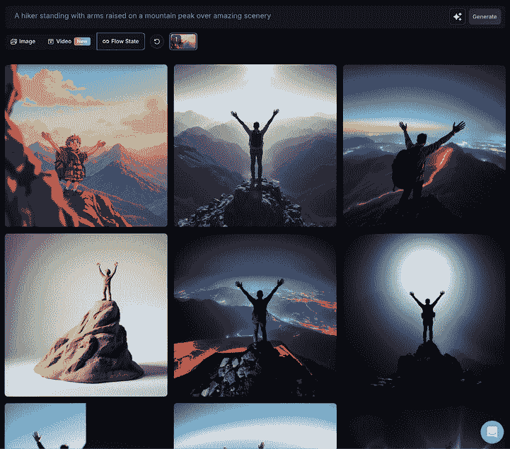

图 7.43 – Leonardo.ai 中的流动状态，它根据相同的提示生成多张图像，然后邀请你创建更多类似的作品

无论你最终使用哪种 AI 生成工具，这种交互式情绪板是我所见过的 GenAI 的最佳用例之一。但是，你能得到在适合专业设计应用程序开发格式中的整个设计的帮助吗？目前还不能。到目前为止，大多数工具都专注于创建单个设计元素：一张照片、一个背景或一个图标。如果你想挑战一下，尝试创建潜在 YouTube 缩略图的变体——它们相当简单。

要进一步发展，你有几个选择：**Lovart.ai** 可以创建可编辑的海报，**Claude** 可以为你操作 Canva，或者你可以直接使用 Canva 的 AI 工具。不幸的是，这些方法中的任何一种都不会导致复杂的多页文档的专业设计解决方案。也许在将来，我们能够要求 InDesign 根据提供的参考生成新的设计理念，但还不是现在。

让我们以查看 3D 模型创建过程来结束这一章。

# 创建 3D 模型

尽管大多数创意专业人士并不是每天都在使用 3D 软件包，但有些人确实在用，AI 工具承诺将使该领域更容易接近。虽然动态图形专业人士习惯了关键帧动画，并且可能很好地掌握了在 3D 空间中工作，但对于许多人来说，成为一名建模专家是一条漫长而痛苦的道路。

尽管痛苦，但适当的建模技能在一段时间内对于严肃的 3D 应用仍然很重要。如果你有非常轻的需求——也许你只想在 3D 对象周围轻微地旋转相机——一个 GenAI 3D 工具可能会有所帮助。

与图像生成工具类似，模型生成工具可以从文本提示或现有图像开始工作。

**Meshy.ai** 是一个知名的服务，尽管它不再提供免费试用，但它是一个功能强大的工具，可以生成多种草稿模型，并在确认后为所选的最终模型生成纹理。我使用了 Sora 制作的宝箱，快速将其变亮，并在 Photoshop 中移除了背景，然后上传了它。虽然可以上传来自不同角度的额外图像，但我只使用了这张图像，效果很好：

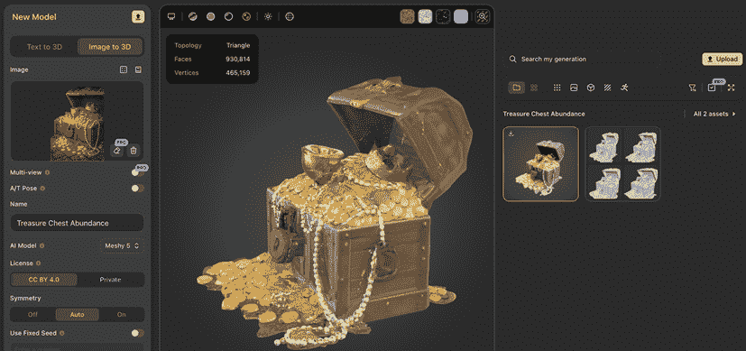

图 7.44 – Meshy 界面，左侧上传了一张图片，选择了四个灰色草稿生成中的一个，以及最终的纹理

Meshy 在生成方面做得相当不错，尽管这个物体可能难以进一步开发——毕竟它是一个整体网格——但它可以作为一个较小的比例或背景元素。以下是它在 Blender 中的样子：

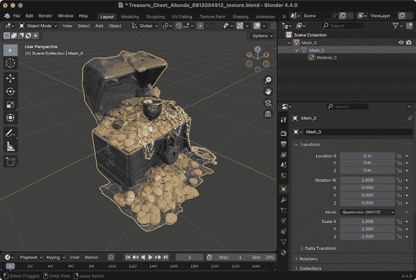

图 7.45 – 在 Blender 中下载的模型

可以下载的 3D 格式包括 USDZ、OBJ、GLB 和 STL。在 **Hyper3D.ai** 也有类似的故事，它也允许你上传一张或多张图片，并使用 Rodin 模型输出 3D 网格。

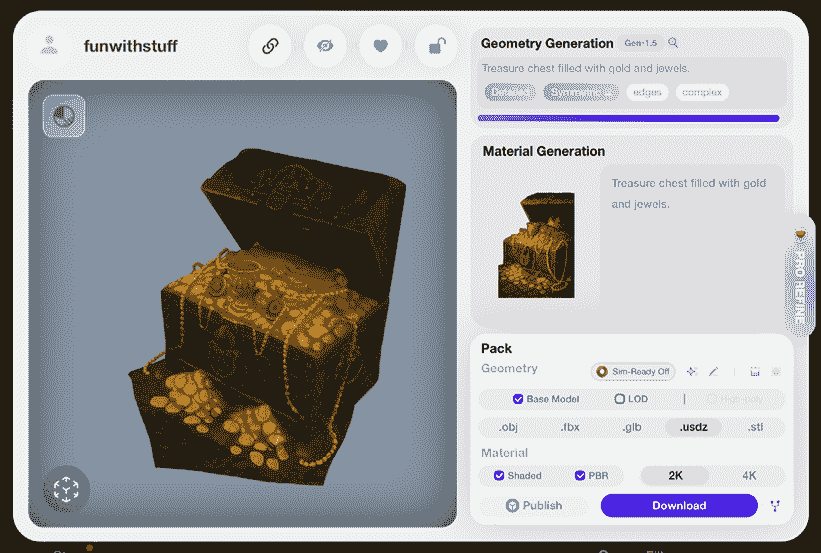

图 7.46 – 在此创建过程中允许在多个阶段进行再生

尽管 Hyper3D 不能直接创建`.blend`文件，但我能够正确地将生成的 USDZ 文件导入 Blender。不管好坏，它的结构比 Meshy 输出的更有序，细节也稍微少一些。虽然中心金属杯的亮度没有 Meshy 模型那么高，而且前面的硬币排列得稍微过于正式，但这个结果仍然可以很好地使用。

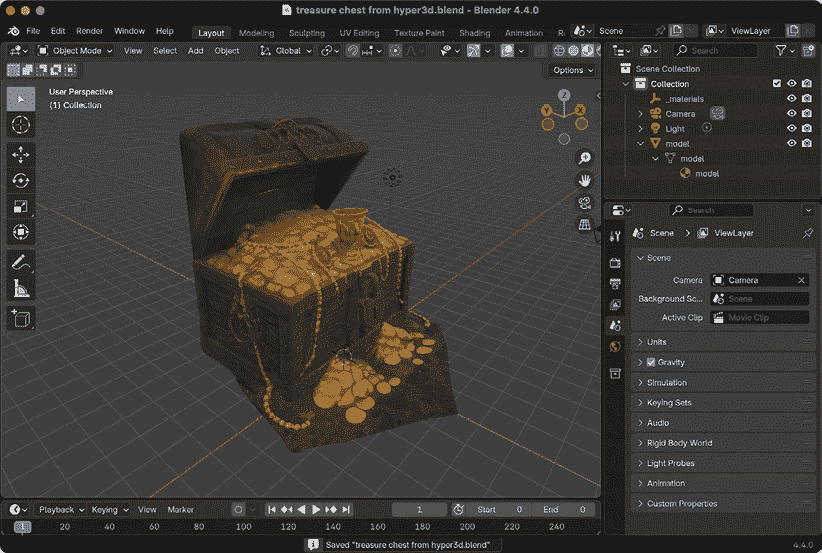

图 7.47 – 导入 Blender 后的结果略有序

对于更多选项，你可能更喜欢 Tripo 3D，它也可以将网格分割成组件——如果你计划对生成的模型进行动画或编辑，这是非常重要的。请注意，因为第一步涉及从你的图像生成图像，如果你不小心，最终可能会得到一些略微不同的结果。不过，这个结果在木箱的细节上表现良好：

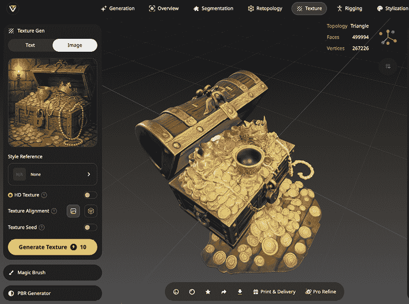

图 7.48 – Tripo3D 网站列出了工作区顶部的可能步骤

这个模型尚未分割，但如果我想手动细化模型，这就是我会追求的。在这里，在 Blender 中，你可以看到这些结果是有用的：

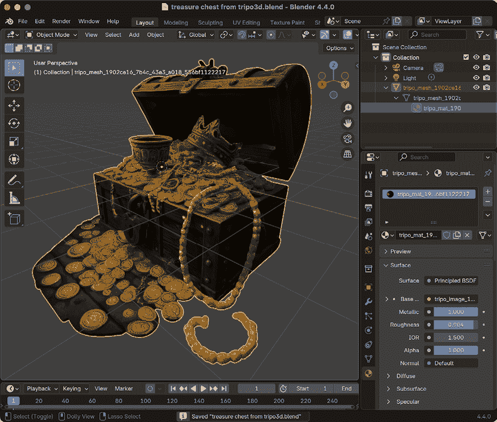

图 7.49 – Tripo3D 的 USD 输出可以干净地导入 Blender

在默认设置下，这些网站采取了相当不同的方法。Hyper3D 生成了一个有 120,000 个面的模型，Tripo3D 创建了 500,000 个面，而 Meshy，最复杂的，有 929,000 个面。虽然细节可以被削减，但看到这样不同的方法很有趣。如果必须选择一个，我会选择 Tripo3D 提供的更干净的结果和额外的控制，但你的需求可能与我非常不同。

其他选项，如**Rendable3d.com**，提供类似的服务。我在它作为 Blender 分支打包的 alpha 版本中进行了测试，但现在你可以在他们的网站上访问相同的生成技术。现在 Copilot([`copilot.microsoft.com/labs/experiments/copilot-3d`](https://copilot.microsoft.com/labs/experiments/copilot-3d))甚至提供了一个简单的图像到网格的功能，Meta 的新选项**SAM 3D**([`ai.meta.com/sam3d/`](https://ai.meta.com/sam3d/))看起来非常有前景。

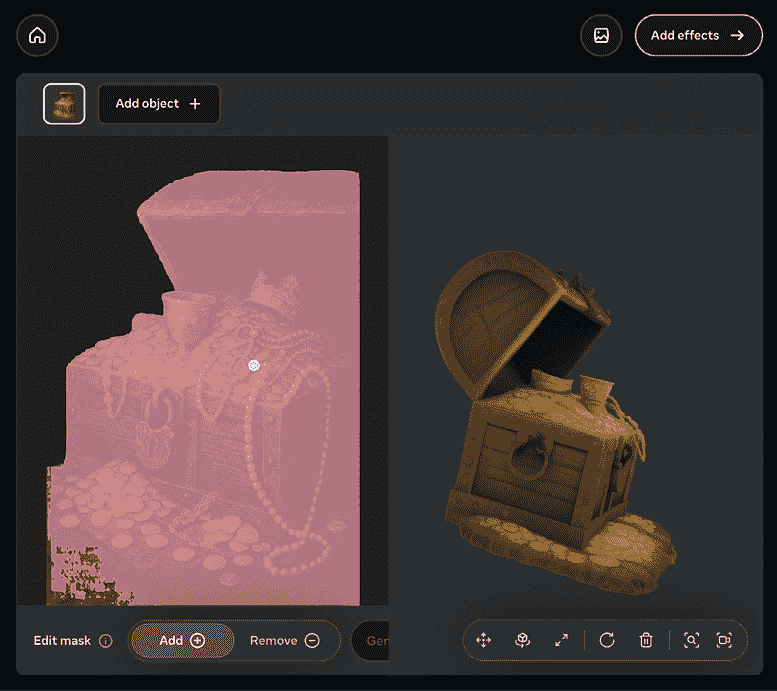

图 7.50 – SAM 3D 是新的，但还不是完整的解决方案，但到目前为止看起来不错

这个空间将会进一步变化，所以如果你需要 3D 网格生成，尝试目前可用的任何免费试用，探索最新的生成模型，看看哪一个最适合你。

有趣的是，类似的技术（基于高斯斑点）在现代苹果设备上得到应用，可以将任何照片转换成简单的 3D 空间场景，并能够响应设备移动。在 2026 年操作系统版本中，这比之前苹果 Vision Pro 版本中的空间照片功能更为先进，后者仅提供左右移动。空间场景允许在所有维度上移动，并且可以非常有效。苹果在这个领域的最新研究令人印象深刻([`machinelearning.apple.com/research/sharp-monocular-view`](https://machinelearning.apple.com/research/sharp-monocular-view))。

你可能想知道 ChatGPT 是否可以帮助。虽然它不能直接帮助，但它提供创建一个离线运行的脚本来执行相同任务。虽然专门的网站可能产生更好的结果，但如果你需要大量模型并且不介意运行一些代码，这可以是一条可行的路径。不过，我们将在本书的后面部分更详细地探讨脚本方法。现在是时候结束这一章了。

# 摘要

如果你正在制作 AI 图像，你现在应该对如何获得最佳结果有了更清晰的认识，无论是通过编写更具表现力的提示，还是为 AI 提供模仿的图像示例。你将了解几种方法来获取你需要的，以帮助你在创意工作中，无论是用于原型设计，还是用于成品图像，或是矢量资产。

生成图像可能会带来道德问题：一些是新的，一些不是。在不涉及摄影师和插画师的情况下，使用 AI 生成不太重要的图像是否合适？这取决于你和你客户。

在构思、头脑风暴和情绪板中使用 AI 是否合适？如果它能够提供信息而不直接成为工作的一部分，那就完全没有问题。借鉴是创意过程的一部分，只要你不试图剽窃他人，就应该没问题。从想到某个东西到看到那个愿景的不完美版本之间的差距从未如此之短，我立刻就能看到它如何改变了我参与的项目中的构思过程。

这里正在发生一场革命，但我认为它不会像现有的股票网站和模板设计那样取代艺术家。探索这个新领域值得你的时间。

接下来，从煎锅跳进火坑——我们将生成 AI 视频。

|

## 获取本书的 PDF 版本和独家额外内容

扫描二维码（或访问[packtpub.com/unlock](http://packtpub.com/unlock)）。通过名称搜索本书，确认版本，然后按照页面上的步骤操作。 |  |

| **注意**：请妥善保管您的发票。直接从 Packt 购买的商品不需要发票。* |
| --- |
