# 第八章：视频生成式 AI

让我们从现实开始：生成式 AI 视频在技术上令人印象深刻，但它无法取代大多数由人类制作的视频。如果你目前正在为客户拍摄视频，你可以期待在一段时间内继续这样做。确实有一个 AI 革命，但它发生在其他领域，并且不太可能接管主流视频制作。

初看之下，AI 的输出可能看起来很棒，那些自己不拍摄视频的人可能会突然兴奋，也许他们不需要雇佣任何人来为他们制作视频。对大多数人来说，这种感觉不会持续太久。最广泛分享的样本视频是一些看起来还可以的视频，但大多数镜头在某些方面都有缺陷，即使是使用最新模型制作的也不例外。

完全由 AI 生成的视频具有所有照片的问题（奇怪的解剖结构，过度平滑）以及更多自身的问题：运动、音频和分辨率问题，仅举几个例子。在镜头中保持一致性很难，说话很难，自然运动很难，最重要的是，通常什么都不会发生。

在 AI 制作的视频中，任何动作都有实际后果的情况很少见，比如咬一口热狗后看到热狗变小。人们可以站在那里稍微动一下，但他们没有动机，没有背后的推动力。人们可以*说话*，但他们不能做任何重要的事情。

因为一切都是对另一帧或最佳猜测的模仿，所以没有像现实生活中那样的底层共同结构，这在视频环境中——连贯性很重要——比在静态摄影中是一个更大的问题。

总的来说，大多数视频都涉及特定的人物或特定的地方。如果你拍摄那个人或访问那个地方，连贯性是免费的。大多数 AI 镜头都是通用的：一个咖啡馆，而不是一个特定的咖啡馆；一个随机的人，而不是真正的员工。如果你的目标是讲故事，捕捉人们在其间移动和改变现实的一些版本，那就去拍摄吧！AI 视频并不是解决这个问题的最佳方案。

这并不意味着一切都糟糕。如果你把 AI 当作一个特效引擎，允许你在特定方式上玩弄现实，以增强现有的镜头，它可能做得很好。也有可能创造出一些无法拍摄的独特镜头，而最新的模型在之前的基础上又迈出了一大步。

一些想法是相当可行的，比如一个静态图像的动画版本，运动幅度最小。可以从同一张图像中创建几个视频，然后将这些片段编辑在一起，创造出一种常见的广告中的蒙太奇。如果你保持镜头长度短，不试图做太多，就有办法制作出在可能范围内表现良好的 AI 视频。

重要的是要意识到，许多生成服务并不是针对创意人士，而是针对他们的雇主。确实，那些试图完全排除创意专业人士的客户可能会被使用像 **Creatify** ([`creatify.ai`](https://creatify.ai)) 这样的服务所吸引。这个网站不仅提供个人视频创建服务，还提供 *自动化* 视频广告创建服务，首先分析你的网站，然后将其与模板混合，创建一个传达信息的 AI 头像。到目前为止，我发现你向 AI 要求得越多，错误被放大得就越高，所以我并不被一站式解决方案所打动。

不幸的是，许多最明显的全 AI 视频实际上是 *糟糕* 的视频。那些对没有图形设计或模板化图形设计感到满意的客户，对 AI 制作的头像阅读 AI 编写的剧本，对迅速学会将 AI 视频与骗局、廉价广告和低质量产品联系起来的观众来说，也感到满意。

同时也存在潜在的道德问题：非常少的模型能保证“商业安全”。Adobe 的 **Firefly** ([`firefly.adobe.com`](https://firefly.adobe.com)) 和 Moon Valley 的 **Marey** ([`www.moonvalley.com/marey`](https://www.moonvalley.com/marey)) 是这样的，但大多数其他模型无法或不会声明它们的模型仅使用允许的媒体进行训练。传统的创意构思过程往往对现有作品采取自由态度，但在最终产品中？这可能对某些项目来说根本不是一种选择，你需要自己考虑道德影响。

2025 年 8 月，Netflix 发布了一套关于 GenAI 的指导原则 ([`partnerhelp.netflixstudios.com/hc/en-us/articles/43393929218323-Using-Generative-AI-in-Content-Production`](https://partnerhelp.netflixstudios.com/hc/en-us/articles/43393929218323-Using-Generative-AI-in-Content-Production))，虽然所有内容都值得一读，但第 4 点非常直接：

> 生成的素材是临时的，不属于最终交付成果的一部分。

我们显然不是为 Netflix 制作内容，但这是一种相当直率的说法——GenAI 对于临时工作是可以的，但不是最终产品。这并不意味着 GenAI 视频没有用，但不要被任何销售如何使用 AI 视频生成课程的点击诱饵所迷惑。这里有很大的潜力，但 AI 并不能完全取代摄像师。

相反，AI 有能力为视频专业人士提供新的工具来制作不同类型的视频，增强他们目前正在制作的视频，并修复常见问题。

在本章中，我们将探讨这些主题，每个都比上一个更具挑战性：

+   扩展现有剪辑

+   从文本提示创建视频

+   从参考图像创建视频

+   从参考视频和音频创建视频

+   转换现有视频

没错——实际上创建新视频比修改现有视频要容易。让我们从现在只有 Premiere Pro 能做到的一个技巧开始：使剪辑变长。

# 扩展现有视频

**Premiere Pro** 允许你将剪辑延长到其结束之后，根据你制作的视频量，这可能会非常令人兴奋，也可能完全无关紧要。如果你已经是视频专业人士，你会知道其中的门道：按下那个大红色录音按钮开始提前录制，在动作开始之前很久，直到动作完全结束之前不要再次按下那个按钮。

同样，你的屏幕上的表演者——可能就是你！——也应该了解他们的工作。无论谁在说话，都需要在句子之间留下间隔以供编辑，在结尾时，他们需要至少保持他们的最终位置和表情几秒钟。他们真的不应该立即看向屏幕外询问这是否是一个好的拍摄。

但有些人确实会犯这些错误。并非所有情况都是完美的，并非每个人都了解规则。这也不总是取决于才华。有时可能会有技术故障，在动作即将结束时破坏了原本很好的拍摄（迫使你缩短剪辑），或者你得到的剪辑本身就不够长。如果你需要在结尾处额外一秒或两秒的视觉内容，但拍摄结尾不好，你该怎么办？

一种可能的方法是使用剃刀或刀片工具将剪辑的最后几帧分离出来，然后减慢这个微小片段的速度。使用 Final Cut Pro 的超级慢动作功能可以获得最佳结果，而使用所有现代非线性编辑软件中找到的光流技术可能得到可接受的结果。但可能不会很出色。

如果你拥有 Premiere Pro，你可以使用新的 **生成扩展** 工具简单地修剪剪辑的末端一小部分到右边，或者修剪剪辑的起始部分一小部分到左边。大多数常见媒体格式都受支持：720p、1080p、UHD 或 DCI 4K 分辨率，横屏或竖屏，最高 30fps，8 位 SDR。阅读此页面以获取有关当前要求的更多详细信息 ([`helpx.adobe.com/premiere-pro/using/generative-extend-faq.html`](https://helpx.adobe.com/premiere-pro/using/generative-extend-faq.html))。

由于这个功能是内置的，因此无需通过网站上传或下载剪辑——剪辑将神奇地固定在你现有的时间轴上，新的资产将存储在你的项目旁边，在一个名为 `Generative Assets` 的新文件夹中。如果你希望将文件存储在其他地方，请在 **文件** > **项目设置** > **临时磁盘** 中进行更改。

到目前为止，一切顺利，但也有一些限制。视频扩展的最大时长目前为两秒，结果（正如你可能预期的那样）并不完美。你可能注意到亮度变化、闪烁、细节丢失、运动不流畅，或者在颗粒感强烈的片段上过度平滑的问题。你尝试得越少，失败的可能性就越小。

你可能会在音频上使用生成扩展时更有运气，因为其持续时间限制是 10 秒而不是两秒。然而，你不能扩展对话或音乐，只能是环境音，而且你需要一个至少已经持续了三秒的剪辑。

这个功能的一个真正问题是，生成视频是一个付费功能，不是免费的，并且它可能会消耗你相当一部分的生成信用。为了创建一秒的 4K 30fps 视频，你需要支付 175 个信用点，而 720p 24fps 的视频每秒只需 50 个信用点，音频生成每次需要 10 个信用点。然而，这比在单应用计划中使用 Photoshop 的生成填充功能所需的 1 个信用点成本要高得多。

你可以使用多少？在美国和其他国家可用的标准 Creative Cloud Pro 账户包含 4,000 个信用点，这不足以充分使用这个功能。如果你在处理 4K 视频，你一个月将得到 22 秒的生成扩展。记住，作为一个“高级”功能，它不对单应用订阅者开放，只对拥有所有应用的用户开放。还要记住，每次生成都会消耗信用点，所以如果你对第一个结果不满意，你可能需要支付多次。

虽然生成扩展有时可以帮助你摆脱困境，但在其他时候，创建一个根本不存在的镜头可能更合适。让我们来看看。

# 从文本提示创建视频

我们已经看到了从文本提示生成图像时可能出现的多样性。考虑到视频生成中涉及的变量数量增加，请仔细考虑你的视频生成提示。

一些 AI 提供商，包括**Canva AI**([`canva.com/ai`](http://canva.com/ai))，提供了下拉选项来帮助你指定重要的偏好，如风格、宽高比和焦距。

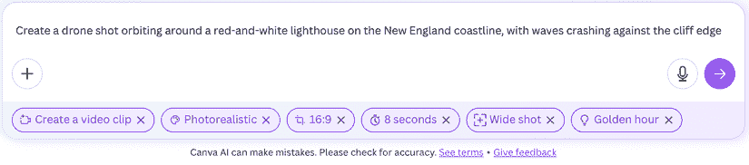

图 8.1 – Canva AI（使用 Veo 3）为你提供了几个选项来指导你的视频生成

如果你心中有一个非常具体的镜头，你可能需要提供一个详细的提示以确保你得到你想要的结果。简单的提示可能适用于发展想法或添加到情绪板或故事板，但你的愿景越清晰，你的提示就应该越长。

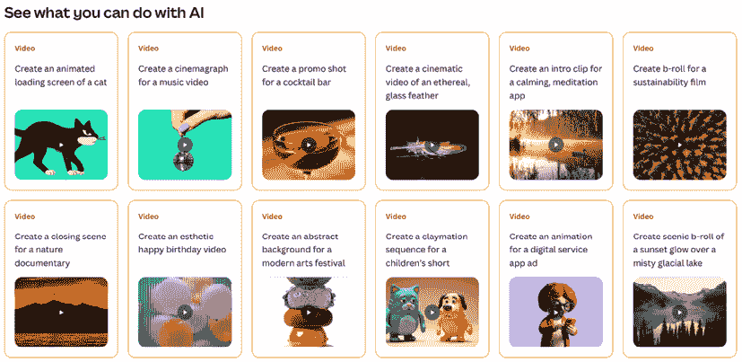

图 8.2 – Canva 的示例提示对于激发灵感很好，但这样的高级提示每次生成都可能产生截然不同的结果

除了技术考虑之外，务必指定您是想包含多个镜头还是单个镜头；**Sora** ([`sora.chatgpt.com`](https://sora.chatgpt.com)，使用版本 1，而不是版本 2) 如果您没有指定一个不间断的单个镜头，有时会生成由多个单独镜头组成的视频。目前大多数文本到视频模型都不包含任何音频，但这种情况越来越普遍：Grok、Sora 版本 2（来自 OpenAI）和 Veo 3（以及更高版本，来自 Google）可以生成背景音频和对话。

注意，一些模型，如 Veo 3 及以上版本，可以通过许多不同的提供商获得；它可在付费的 Gemini 计划中获取，也可以通过 Canva、Firefly、Creatify 等其他途径获取。然而，一些模型只能通过特定的提供商获得，例如 Act-Two，只能在 Runway 上找到。如果您喜欢某个特定的模型，它可能可以通过多个提供商获得，因此请四处寻找适合您需求和预算的价格和界面。

大多数提供商提供的视频最大分辨率为 720p，尽管一些提供商的高端计划可以提供 1080p。今天，大多数生成内容是以 24fps 创作的，所以如果您需要更高的帧率，您需要使用第四章中讨论的重新定时技术。如果您需要更高的分辨率，缩放技术可能会有所帮助，但它不是魔法，与使用传统相机拍摄的视频相比，今天的 AI 视频通常看起来比较模糊。

虽然高质量图像生成在多个提供商中广泛可用，但视频生成还不够成熟，旧模型更可能出现缺陷。生成没有人的通用股票风格无人机镜头相对容易，但像这样的真实镜头在股票网站上很容易找到。

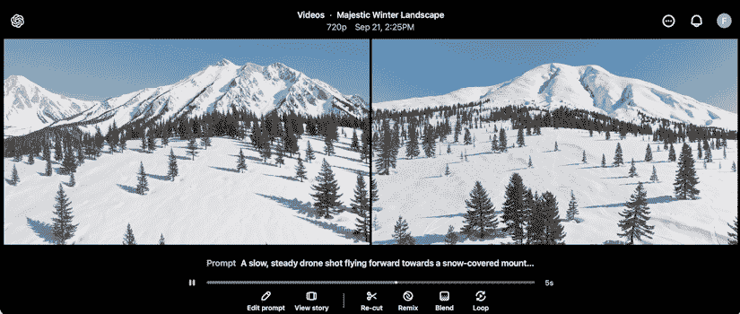

图 8.3 – 这两个通用的无人机镜头，来自 Sora，都是可用的

如果您想要简单、基本的镜头且质量相对较低，使用简单的文本提示可能会有所帮助。然而，一旦您要求更复杂的内容——例如两个人跳舞——物理动作的问题，甚至过度眨眼，都可能毁掉镜头。一致性也可能成为问题，镜头中的人越多，您遇到问题的可能性就越大。

我提示了“一个微笑的现代情侣在夜总会中跳舞，周围有观众，在黄金时段”，结果出现了混乱。在生成的视频中，有时一个人的肢体会消失。整个人的出现或消失可能是随机的，当其他人出现在他们前面时。有时，如果您真的很不幸，当某人的头旋转时，另一张脸出现在另一边。这可能会让人做噩梦。

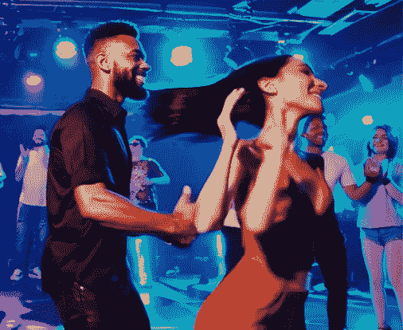

图 8.4 – 有多少条手臂？它们是如何移动的？

在测试了 Veo 3（通过 Canva）、Sora（v1，通过 ChatGPT）、Vidu ([`www.vidu.com`](https://www.vidu.com)）和 Firefly 之后，我发现 Veo 3 最有用，但它并不总是很好，其他选项也值得尝试。对我来说，Firefly 产生的结果最不可信，人脸模糊，角色不一致，而 Sora 提供更逼真的图像，但其不自然的身体动作可能会让人不安，它也不总是足够紧密地遵循你的指示。Vidu 也出现了不可预测性，有时当角色相互移动时，会创建消失的角色。

考虑到所有这些模型在合成复杂人类动作方面都遇到了困难，我们可以推断这是一个难以解决的问题。我相信所有这些模型都会进化，当然，还有其他模型（如 Wan 和 Seedance）可供选择，但从我在网上看到的情况来看，它们在人物和动作方面都存在类似的问题。由于我今天可能得出的任何结论很快就会过时，所以我不会给出任何关于你应该先尝试哪个的明确建议。尝试几个，如果无法得到好的结果，再尝试另一个。

今天，虽然 Veo 可以产生大多数情况下可信的结果（Veo 3.1 比 Veo 3.0 有所改进），但使用它并不便宜。虽然看起来 Veo 的有限版本将成为 YouTube 的一部分免费提供，但这尚未实现，而且免费生成似乎将被限制在 480p。当它公开时，应该是一个免费实验的好地方，因为 720p 及以上生成是昂贵的。

在标准的 Canva AI 计划中，你每月只能创建五个视频——这几乎不足以对其进行充分测试。通过 Firefly，Veo 3.1 一代需要 400 积分，因此如果你没有使用其他高级 AI 功能，Creative Cloud Pro 计划中包含的 4,000 个生成积分也仅能让你每月制作 10 个视频。这些费用经常变化——最近它们翻了一番——所以请查看当前的费用。

由于 Veo 3 可以在其输出中包含这样的帧，我不确定这是否值得：

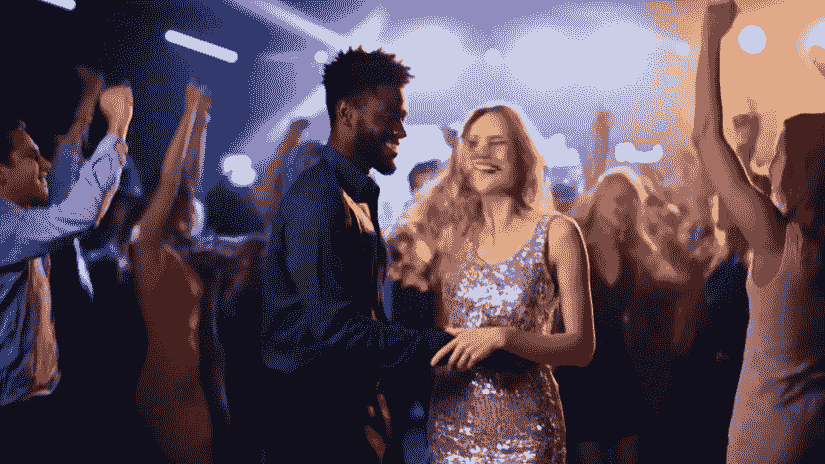

图 8.5 – Veo 3 比其他产品好，但不擅长复杂动作

对于更广泛的实验，如果你有 ChatGPT Plus 账户，Sora 视频生成将提供无限访问，尽管在繁忙时段可能会有延迟。一些服务，如 Runway，在其顶级计划中提供“轻松”（即“慢速”）模式下的无限视频生成，如果你想要更全面地探索，这类服务将非常重要。

## 精确的提示

如果你提出简单的请求，例如一个人站立微笑，或者蒸汽从通风口升起，那么从文本提示中创建相对干净的结果是可能的，但你仍然不总能得到你想要或需要的结果。

为了最小化所需的生成次数，通过精确定义你的要求来限制不确定性。例如，如果你不说你想要多少镜头或什么类型的镜头，你可能会得到一个跟踪镜头，或者一个静态镜头，或者三个镜头剪辑在一起——如果你想要的是“一个没有剪辑的单个静态镜头”，那就要求它。

虽然这并不总是足够的，因为模型并不总是理解你想要什么。要求“一个人站在原地，摄像机移动”可能会导致混淆，如果模型不知道如何做某事（例如“磨刀”），要求具体发生某事可能会导致意外结果。

区别特征也很重要。如果你没有要求具有特定特征的人，你会得到一个普通的结果。在这里，我要求 Sora 给我一个“冒险家”，却收到了两个完全不同的男人。虽然这在头脑风暴的背景下可能可以接受，但如果我心中有一个特定类型的人，我应该要求它。

然而，即使你提出了要求，这也不总是足够的。我要求一个跟随进入丛林中的冒险家的摄像机，但那不是我得到的：

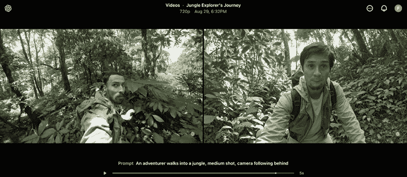

图 8.6 – 第一段视频开始得很好，但角色随后向后走；第二个角色从未移动——这也不是我想要的

尽管一个模型可能并不总是理解所有内容，但提供详细的要求很重要，因为任何留给机会的东西都会回到“默认”状态，它们可能在更大的上下文中没有意义。以下是一个没有填满足够空白的提示：

```py
A model stands on a deserted city street, leaning against a lamppost, swinging a bag slowly 
```

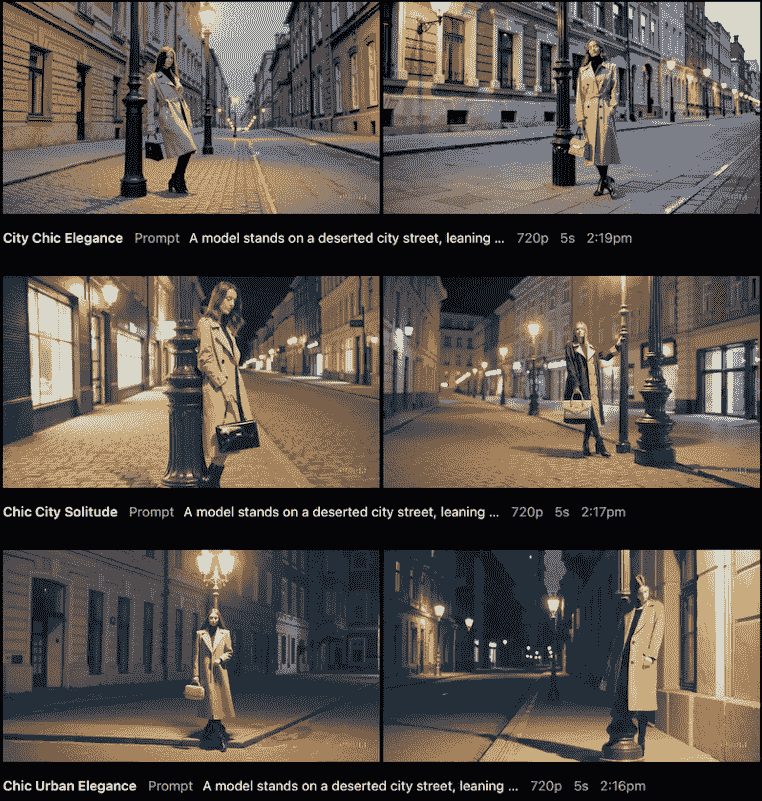

图 8.7 – 使用此提示的八次尝试中的六次，只有一次（左中排）是准确的

我使用 Sora 使用相同的提示生成了八个视频，每次都产生了：

+   一位穿着大衣的女性模特，尽管我没有指定性别或服装

+   夜间，尽管我没有要求特定的一天时间

+   广角镜头，尽管根据提示这似乎是一个合理的选择

+   欧式街道，带有复古路灯

背包的风格确实在每一帧中都有所不同，但只有两代显示了它缓慢摆动，只有四代实际上显示了模特按照要求靠在路灯上。在其他情况下，她站在附近，抓住它，融入它，或者奇怪地绕过它。路灯的位置也很随机。在八次尝试中，只有一次单独的生成显示了我要的东西；详细描述并不总是足够的。

你可能更成功于请求抽象图像，无人的镜头，因为那些请求不会落入“人但不够人”的奇异谷。然而，我们不仅熟悉人类动作；我们熟悉所有类型的动作，而通常 AI 模型并不理解一件事物如何影响另一件事物。如果你要求一只蓝色鞋子掉入一池绿色粘稠液体中，鞋子有时会一致地掉落，但只有有时能正确地与液体接触。

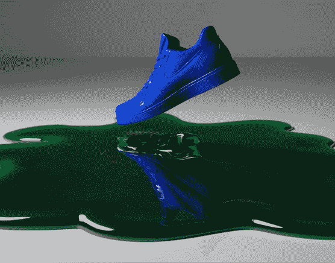

图 8.8 – 这只蓝色鞋子掉落了，但它与空气碰撞后弹起，溅起水花，然后继续掉落

为了解决这些问题，你可以提供更长的提示，尽可能详细地说明你想要和不需要的内容。如果你使用 Veo 3，这将包括对话和音频提示，可能长达几段。从 Gemini 网站([`gemini.google/overview/video-generation/`](https://gemini.google/overview/video-generation/))，以下是 Veo 3 的一个示例提示：

```py
A follow shot of a wise old owl high in the air, peeking through the clouds in a moonlit sky above a forest. The wise old owl carefully circles a clearing looking around to the forest floor. After a few moments, it dives down to a moonlit path and sits next to a badger. Audio: wings flapping, birdsong, loud and pleasant wind rustling and the sound of intermittent pleasant sounds buzzing, twigs snapping underfoot, croaking. A light orchestral score with woodwinds throughout with a cheerful, optimistic rhythm, full of innocent curiosity.
A wise old owl and a nervous badger sit on a moonlit forest path. "They left behind a…a 'ball' today. It bounced higher than I can jump." the badger stammered, trying to comprehend it. "What manner of magic is that?" the owl hooted thoughtfully. Audio: Owl hooting, badger's nervous chitters, rustling leaves, crickets.
A wise old owl flies away out of the frame and a nervous young badger runs in a different direction out of the frame. In the background, you can see a squirrel hurrying past making noise of rustling dried autumn leaves as it goes. Audio: birdsong, loud and leaves rustling, and the sound of intermittent pleasant sounds buzzing, twigs snapping underfoot, and the sounds of squirrels scurrying through the dried autumn leaves. The sound of an owl hooting in the distance, badger's nervous chitters, rustling leaves, crickets, sounds that are full of innocent curiosity. 
```

尽管输出视频在技术上令人印象深刻，但使用 AI 一次性完成所有操作并不能产生专业级别的结果：动作僵硬，对话表情不够好，环境声音有循环问题，整体镜头只讲述了一个故事的一小部分。

更糟糕的是，因为这个不是使用传统的动画或音频制作流程创建的，这些元素中的任何一个都无法以可控、可预测的方式进行微调或调整。它无法扩展到完整的生产。

作为原型，这没问题——但说实话，我更喜欢故事板中的静态图像。我更愿意想象最终镜头可能的样子，而不是被这种方法带来的必然问题所分散注意力。

如果无法实现复杂且可控的镜头——今天，这是不可能的——仅凭文本提示讲述任何长度的连贯故事几乎是不可能的。但这并不意味着这项技术在专业环境中没有用。由简短、简单的镜头组成的蒙太奇风格广告是可行的。一部由一群奇怪角色各自说一句话的短片？当然可以。一个充满特效的未来梦境序列？是的。如果你的项目能够发挥工具的优势，你就能取得成功。

考虑到这一点，大多数真实项目需要更多的控制：一个特定角色穿着特定的服装，在特定的地点。镜头之间的连贯性也非常重要：多个镜头通常需要展示相同的角色，穿着相同的衣服，在相同的环境中。你不能用“一只猫头鹰”在“森林里”来构建一部真正的短片——细节很重要。

我们已经使用模型生成现有图像的变体，这种方法也适用于一些生成式视频模型。为了在镜头之间获得更大的连贯性以及更精确的控制最终输出，我建议使用参考图像。让我们试试看。

# 从参考图像创建原始视频

文本提示留给机会很多，但提供与文本提示一起的图像可以为视频生成提供一个锚点来引导。虽然可能还需要多次生成才能准确遵循详细提示，但人物、服装和环境都应该与参考图像相匹配。

Firefly 将其作为**图像到视频**功能的一部分提供，目前可以使用他们自己的 Firefly 视频模型，或者使用 Veo 2 或 Veo 3。请注意，使用 Firefly 模型时，可以提供构图参考视频、相机参考视频或第一帧，但一次只能使用这些中的一个与文本提示一起。还可以通过点击提供的几个缩略图之一来选择风格（如插图）。

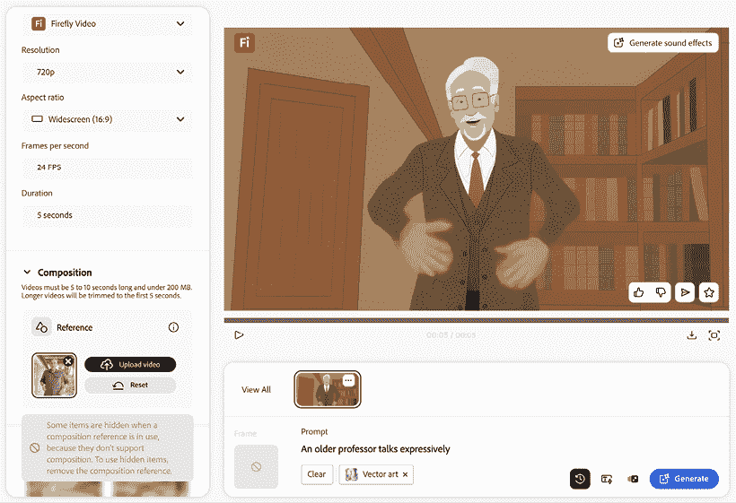

图 8.9 – 向 Firefly 提供构图视频很有用，但没有图像伴随，提示无法提供足够控制

不幸的是，因为 Firefly 模型不能接受与构图视频一起的图像，所以每次使用提示进行尝试时，你都会消耗掉一次视频生成的信用。如果你改为切换到 Veo 3 模型，则只能提供第一帧——没有构图参考——并且你必须将风格作为提示的一部分指定。

在一个理想的世界里，我希望提供起始图像和跟随的性能视频，但这个工具目前还无法做到这一点。在本章的后面部分，我们将介绍**Runway 的 Act-Two**，它可以做到这一点，但有几个服务能够接受与描述发生情况的提示一起的图像。

## 使用一个参考图像作为起始帧

考虑到 Grok 让你生成图像并将其转换为视频的速度，我认为尝试早期的`在荒凉街道上的模型`提示可能值得。在前一章中讨论过，Grok 擅长数量，并允许你简单地向下滚动以生成更多图像。

大多数图片并不完全符合我的预期：街道并不荒凉；人行道和道路常常没有意义。在向下滚动了一段时间后，我找到了一条荒凉的街道，尽管系统的创造性随机性已经将我最初的提示改为请求亚洲模特。

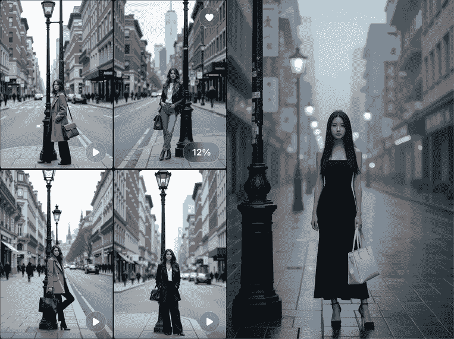

图 8.10 – Grok 创建的一些早期图片，以及第一条荒凉街道

通过在画廊视图中图像上可见的**播放**按钮，很容易从图像生成视频。当图像正在动画化时，播放按钮会被一个进度百分比读数所取代，创建视频大约需要 10-15 秒。如果你点击一个图像进入单图视图，请使用图像下方的**制作视频**按钮。

然而，无论哪种方式，原始提示仅用于创建静态图像，在生成视频时将被忽略。经过多次尝试，模型通常是在四处走动而不是摆动她的包。

为了更接近原始提示，将原始提示复制到你的剪贴板，点击图像进入单图视图，按 **制作视频** 按钮，然后快速重新提示视频生成，通过粘贴原始提示并再次按 **制作视频**。这确实产生了一个摆动的包，但显示的动作与其他 AI 视频模型常见的非现实身体动作相同：

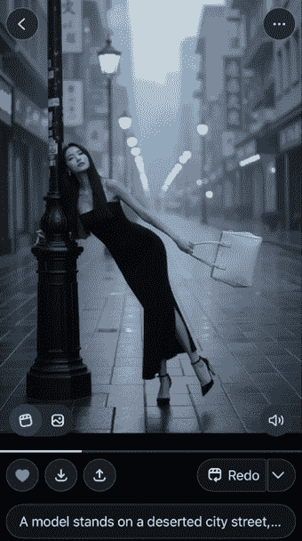

图 8.11 – 从技术上讲，这种动作是可能的，但它不自然

由于原始图像中很少有符合我的提示，仅使用 Grok 可能难以实现特定结果，但你可以上传自己的图像作为动画的起始点，而不是 Grok 的生成。我已经用几个模型测试过，结果参差不齐。

在萤火虫中，使用带有文本提示的起始图像，我尝试给这张图像添加一些微妙的动作，从之前的图像生成扩展到 16:9：

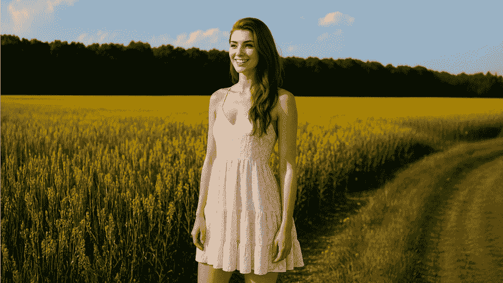

图 8.12 – 我们能否将这张静态图像转换成简单的动画？

在大多数细节由图像提供的情况下，我使用了简单的提示：`自然微妙的微风动作，摄像机从左到右缓慢移动，女人保持静止`

不幸的是，这还不够，结果显示出较差的 *提示遵循度*——也就是说，模型未能遵循我的指令。大多数时候，女人开始行走，Firefly 的所有生成都无法保持她的外观。为什么？

人工智能系统不会像人类那样理解你的请求，使用包含“动作”和“移动”的提示更有可能创造出那样的效果，尽管还有额外的请求要求主题保持静止。使用“平移”而不是“摄像机移动”可能有所帮助，但我认为对于表达不完美的指令应该得到执行。

其他工具的表现如何？

Canva AI 也使用了 Veo 3，并在多次测试中遇到了与 Grok 相同的问题——行走而不是静止——Runway ML 的视频生成也有同样的问题，但增加了过多的眨眼和弹跳动作。**Higgsfield** ([`higgsfield.ai`](https://higgsfield.ai))，和其他工具一样，给了我一个角色行走的视频。它提供了比 Runway 更自然的动作，没有额外的眨眼，但并不是我想要的。图像到视频是一个常见的流程，许多平台都支持，所以如果你已经与 Freepik 或 Envato 等提供商有计划，探索可用的模型。

在另一个类似的提示尝试中，Firefly 的**增强提示**选项将“女孩”改为“年轻女孩”，这迫使我们的角色在整个剪辑中变年轻。是的，细节可以帮助，但错误的细节会毁掉你的工作。要么确保“增强”提示确实符合你的要求，要么完全禁用它。

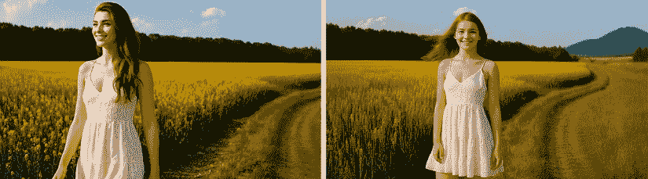

图 8.13 – 首先，她走开了，然后她变年轻了

## 使用两张参考图像作为起始和结束

在 Firefly 的任何模型中，如果你提供了一个起始帧，你也可以提供一个可选的结束帧。通过在标志和空白帧之间过渡，这可以用来创建有趣的过渡，但大多数电影制作者会想用它来控制地移动摄像机。如果你通过提供起始和结束帧来计划摄像机运动，模型可以将它的虚拟摄像头移动以填补空白。

不幸的是，并不是总是容易创建那个最终帧，因为并非所有的图像生成模型都足够一致，能够用不同的构图保持相同的角色和设置。Sora 多次未能创建同一人的近距离视图，而更一致的 Gemini Flash 2.5（又名 Nano Banana）做得更好。

使用这种策略，可以创建一个第二、更近的图像，然后调整提示以反映变化：`自然的微妙运动，轻风，摄像机靠近，女人站立不动`

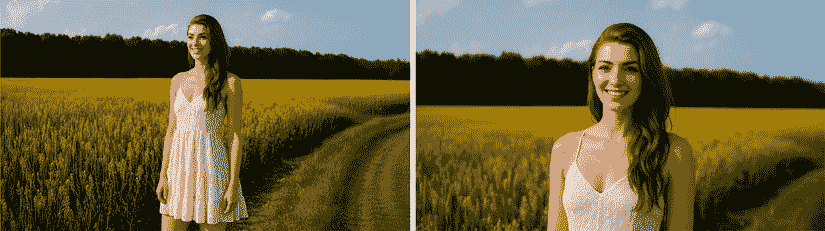

图 8.14 – 一张起始帧和一张结束帧，这应该能行得通？

这个在 Veo 3 上失败了，生成了一段视频，它从第一帧到更近的帧使用了交叉溶解效果——不是我的帧！——在那里一个看起来相似的女人走开了。我不确定更详细的提示在这里是否有帮助，因为即使是我的简单指令也经常被忽视。其他用户似乎在提示遵守方面遇到了类似的问题，但并非所有提示都有问题，也不是所有模型在这方面都做得不好。

**Midjourney** ([`www.midjourney.com/`](https://www.midjourney.com/)) 也能产生良好的结果，通过允许你从视频的最后帧扩展——可能多次——使这个过程变得简单。虽然这看起来像是一个简单的用户界面调整，但正是这些小细节可以让困难的事情变得容易得多。

**Vidu** ([`vidu.com`](https://vidu.com)) 能够通过简单的提示从第一帧和最后一帧生成良好的结果，就像你预期的那样，通过缓慢的缩放移动其虚拟摄像头。

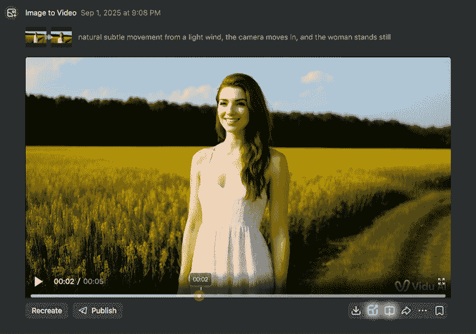

图 8.15 – Vidu 很好地完成了从一幅图像到下一幅图像的过渡

## 使用多张参考图像进行控制

在另一个有用的界面调整中，Vidu 允许你通过在提示中明确引用多张图像来创建视频：

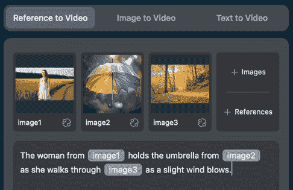

图 8.16 – 如果你想看看元素如何协同工作，这是一个实现这一目标的好方法

这种极其强大的方法让你可以从一张图片中混合一个角色，从另一张图片中混合一个物体，从第三张图片中混合一个地点——这正是创意过程中有用的控制类型。

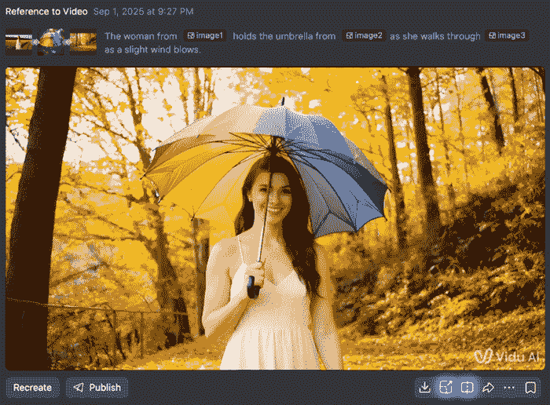

图 8.17 – Vidu 在视频中出色地结合了这三个元素

Vidu 在第一次尝试就完美地完成了这两个请求，如果需要更多控制，这将是我会返回的平台。公平地说，我的动作请求很简单——Vidu 的角色还不能跳舞——但鉴于一些其他模型无法让人物可靠地保持静止，我将这视为一次胜利。Veo 3.1 也提供了这一功能，允许你提供“成分”以成为生成的一部分，但 Vidu 界面的精确性确实非常有帮助。

## 使用 Sora 进行简单和复杂的混音

如果你不需要那么多的控制，并且可以更加灵活，**Sora** ([`sora.chatgpt.com/explore`](https://sora.chatgpt.com/explore)，通过 ChatGPT Plus 计划) 允许你上传参考图像以供指导，然后以类似 Firefly 的方式描述视频中的事件。对于 cinemagraph 风格的效果，将静态照片转换为缓慢移动的视频，这可以很好地工作。我尝试使用相同的图像进行了前两个提示，至少有一个提示生成是可以接受的——成功率更高：

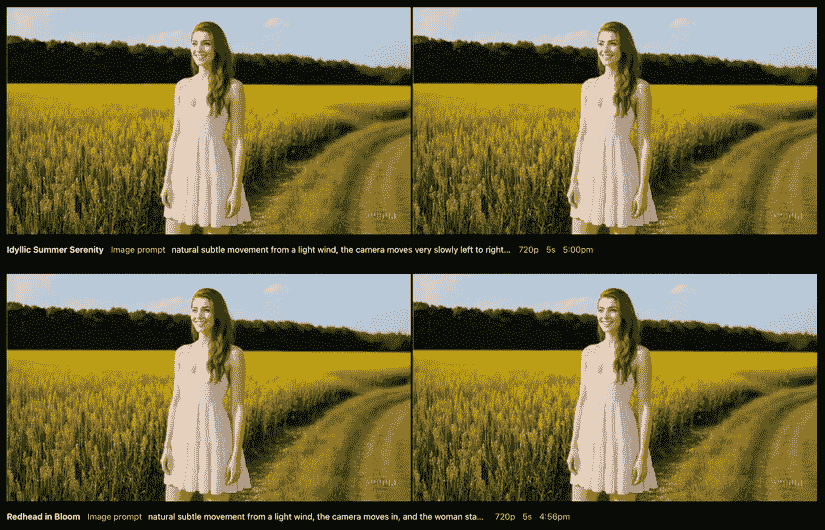

图 8.18 – 使用 Sora 进行多次混音请求

更冒险的混音请求可能会以类似文本提示的方式失败。当我尝试 `女孩在慢动作中旋转，同时摄像机缓缓升起` 时，结果包括与之前跳舞文本提示相似的恐怖身体效果，而且摄像机的移动指令也被忽略了。

在规划一个镜头时，无论是否包含人物，请记住，大多数这些 AI 模型都不理解大多数事物是如何相互影响的。食物不会被消费，饮料不会被喝，如果你要求一颗流星撞击山体，并让火球摧毁一切，它不知道这应该如何运作。

我使用 Sora 创建了两只恐龙和一颗流星坠落静止参考图像，生成的插图图像很棒。然后我要求 Runway 对其进行动画处理，使用以下提示：`一只 Diplodocus 和一只 Stegosaurus 正在吃植物，在一个开阔的草原上，背景是山脉，一颗巨大的流星撞击山脉，火球扩散到整个场景。`

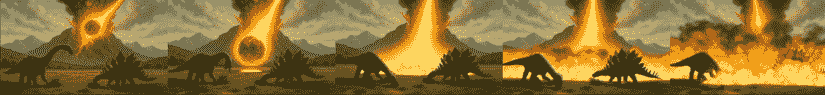

图 8.19 – 在这个视频中，流星变成了喷火器——这并不是这些物体应有的行为

这样的例子揭示了可能导致从静态图像生成的视频出现缺陷。本质上，生成式视频模型并不理解导致图像出现的情况，也不了解之后会发生什么。在这张图片中，流星后面的条纹是尾迹，而不是火源，山体是因为流星的力量而破裂；它不是一座喷发的火山。如果你要求一个厨师磨刀的视频，他们应该使用工具，而不仅仅是用手：


图 8.20 – 一个微笑的厨师，通过将手靠近它来磨刀

无论你是否在创建包含人物的视频，*让事情发生*都是一个挑战。虽然有时你可能运气好，但以如此低的成功率反复提示和重新提示的成本太高，也太耗时。如果你有耐心，可以考虑一个允许无限生成的网站计划，即使速度较慢。Runway 的最高级计划允许这样做，Sora 也是如此。

Sora 允许无限量的水印 720p 生成，对于原型来说，这些限制是可以接受的。不幸的是，你需要订阅顶级的 200 美元/月的美国计划，才能生成没有水印的更长 1080p 视频，但一致性和质量仍然不能保证。

如果 Sora 的生成效果足够好，尝试**重剪**功能，这允许你定义时间线不同部分发生的事情。考虑到长度限制，你可能更喜欢在视频编辑应用程序中组合单独的镜头。

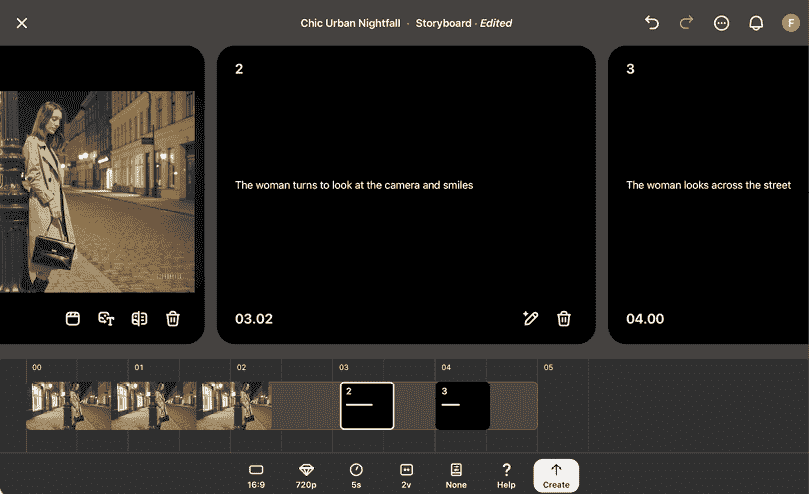

图 8.21 – 从之前生成的视频中，我缩短了结尾并请求不同的动作

虽然我对这个功能的结果好坏参半，但能够精确控制特定时刻发生的事情通常很重要，这个功能值得一试。但不是每个工作都需要完全的手动控制。如果你愿意使用预构建的模板，你可以考虑一个完全不同的解决方案。

## 使用预设来动画化参考图像

Higgsfield 包含一些令人印象深刻的预设，称为**Higgsfield 应用**，每个都包含一个简单且引人注目的效果。虽然编写自己的文本提示显然更加灵活，但这里的权衡是承诺更高的提示遵守度。你提供一张人的照片，然后从复杂到让那个人被海怪攻击，或者简单到让那个人吃香蕉的选项中进行选择。如果其中之一提供了一个将图像转换为视频的吸引人的方式，并且它还没有被广泛使用，那么它可能效果很好。

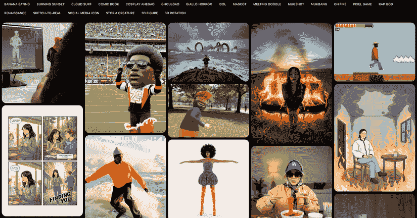

图 8.22 – 是的，它们是预设，但它们很酷

当然，你不必从头开始创建，或者从静态图像开始。一些工具允许你使用现有的视频，利用 AI 作为效果引擎，这可能会在很大程度上消除过程的不确定性。让我们来看看。

# 从参考视频和音频创建新视频

如果你有一个干净的对话录音，但需要那些话由屏幕上的人物说出，这是可能的吗？或者你可能已经录制了一段面向摄像头的片段，带有常规的人类表情和手势，但你想用其他人或卡通人物来替换？这两件事都是可能的。

## 使用数字虚拟人音频文件

**HeyGen** 允许你上传一个音频文件（或直接在网站上录制），然后让一个数字虚拟人说这些话。提供预制虚拟人，或者为了更多的控制，你可以上传你想要看到说话的角色照片，或者一个可以从中创建数字孪生的更广泛的视频。请注意，如果你创建自己的虚拟人，你需要有权使用过程中涉及到的图像或视频。还有其他提供者——Higgsfield 提供了与自己的模型一起使用的 **Lipsync Studio** 功能，以及 Veo 3 和 Kling 的模型。

注意：HeyGen 和 Higgsfield 都愿意从脚本中生成音频，尽管你可能会从真实的音频录音中获得更好的结果。我们将在下一章回到生成音频。

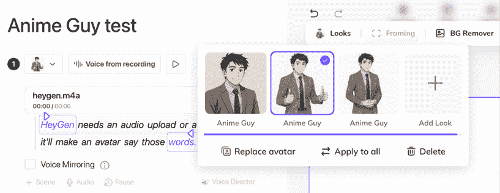

图 8.23 – HeyGen 可以根据你的照片或绘画创建一个说你的话的虚拟人

我看到所有基于虚拟人的服务的问题在于它们相当机械。我发现它们要么过度强调手势，要么不够使用手势，结果感觉不真实。虽然我可以理解与摄像头对话不是每个人都拥有的技能，但到目前为止，AI 虚拟人是对人类的一个糟糕的替代品。

好吧。那么，如果你录制了一段带有音频、手势和面部表情的摄像头片段，然后让它看起来像另一个人呢？

## 使用 Runway Act-Two 进行性能迁移

**Runway** ([`runwayml.com`](https://runwayml.com)) 使用他们自己的 Gen-4 模型，有一些独特的服务可以帮助你将现有的视频转换成非常不同的东西，我们将从 **Act-Two** 开始。这个工具允许你拍摄一个人上半身的视频，然后将其表情、口型和手势转移到 AI 生成的角色上。（Act-One 使用动画角色做了类似的技巧，预计未来还将有 Act-Three）。一般来说，这种技术被称为 **姿态迁移**，WAN Animate ([`wan.video/blog/wan2.2-animate`](https://wan.video/blog/wan2.2-animate)) 和一些其他提供者也提供这项服务——我预计它很快就会更广泛地可用。

为了测试第二幕，我录制了一段 1080p 的快速视频，视频中我说了几句话，然后在 Final Cut Pro 中剪辑并清理了音频——仍然需要一些视频编辑知识。接着，我使用 Sora 生成了一张教授的形象，然后用 Photoshop 将其扩展到 16:9，并将这两者都上传到了 Runway。请注意，你也可以上传一个角色视频而不是静态图像，但如果这样做，Act-Two 只会调整面部表情（而不是手势）。

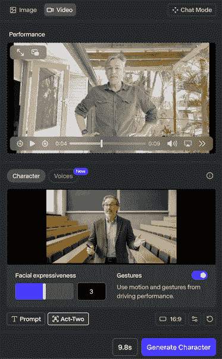

图 8.24 – Act-Two 无需提示，只需一个表演视频和一个角色图像或视频

那么，它是否有效？好消息是教授确实准确地复制了我的动作，并且匹配得非常好。创建的视频是 720p，24fps，这并不完全符合我原始的 25fps 视频，但这是可以管理的——你可以在 Runway 上这里进行放大，并在需要时在编辑应用程序中调整速度。

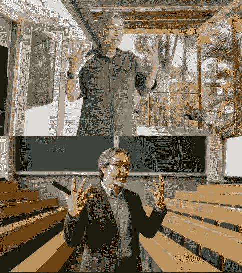

图 8.25 – 姿势已经正确转移，结果相当可用——但请保持双手空置

这里有一些提高结果的小贴士。首先，你应该尽可能匹配你的外观视频和角色视频的姿势。如果角色拿着一个道具，表演者也应该拿着一个匹配的道具，但空手更可靠。在角色图像中，“教授”角色参考拿着一支记号笔，由于没有正确的方式在匹配我的手部动作时握住这支笔，所以笔变成了其他物体。

为了避免出现令人不安的 valley，尝试创建明显不真实的角色，例如卡通或明显是计算机生成的角色。我们知道人类应该是什么样子，但我们期望卡通角色和 CGI 渲染会有些奇怪。你可以让逼真的真人工作，但这更难。

虽然姿势转移很有用，但**定位**是您希望生成的视频几乎与原始视频完全相同的一个领域。视觉配音服务，包括 LipDub AI ([`www.lipdub.ai/`](https://www.lipdub.ai/)) 和 Flawless ([`flawlessai.com/`](https://flawlessai.com/))，能够将一种语言的视频转换为另一种语言，而不会出现配音时预期的任何不匹配。虽然大部分原始视频保持原样，但所有口型动作都被重新生成以匹配翻译后的对话版本。

在一部瑞典特色电影《看天空》中，原始演员用自己的英语部分重新录制，然后使用 TrueSync 再生视频以匹配。已经建立了一个系统来获得原始演员的批准，并且它与 Avid Media Composer 集成。在 LipDub 中，翻译的语音录音是用原始说话者的声音生成的。我们将在下一章回到生成音频，但如果翻译是你的重点，有针对你需求的服务。

Act-Two 的最佳之处在于它能够在不取代表演者的同时产生新的输出类型。在传统的制作中，动画制作成本非常高，如果客户坚持使用动画角色，这种方法可以在节省资金的同时，让人类艺术家负责角色的外观和动作。

当我们在看 Runway 时，他们还有一个独特的特性，承诺保留更多原始视频。让我们深入了解。

# 转换现有视频

Runway 的**Aleph**允许您通过提示转换现有的视频，保留大部分原始内容并得到高质量的结果。例如，包括风格转换；完全改变摄像机角度；改变环境、一天中的时间或季节；添加跟踪元素；移除物体和反射；重新照明；等等。

在上传我最近项目拍摄的无人机视频后，我要求改变一天中的时间到夜晚，并添加烟花。这不是我能轻易捕捉到的镜头——通常不允许在夜晚或烟花附近使用无人机。

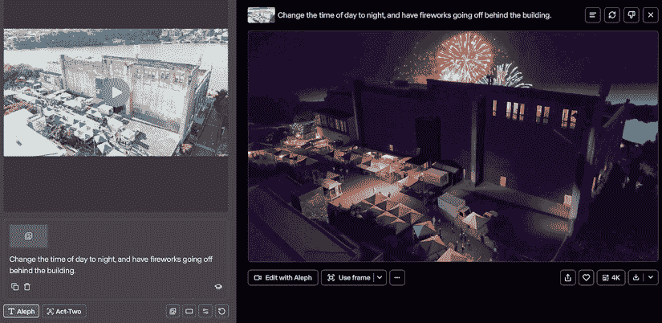

图 8.26 – 我原始的无人机拍摄，变成了夜晚的烟花表演

令人印象深刻的是，前景中所有横幅和人物的位置都得到了保持。虽然有些细节被省略了，但这个结果是一个成功。一个限制是，因为输出仅为 720p，它需要升级才能接近我上传的 1080p 剪辑的清晰度，更不用说原始的 4K 剪辑了。幸运的是，这种升级已经内置到系统中，只需花费少量积分即可完成。这并不是魔法，但它帮助很大。

Aleph 的一个宣传特性是从图像的反射中移除摄像师，由于这可以是一个棘手的视觉效果任务，我试了一下。提供一部简单的 1080p24 手持 iPhone 视频和这里显示的提示，我抱有希望：

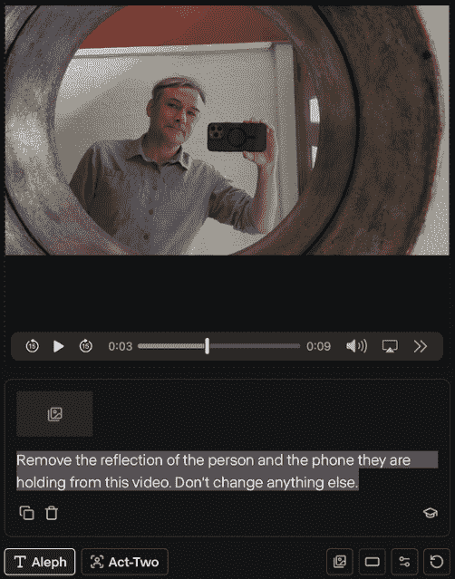

图 8.27 – 简单地要求它移除反射的人物，感觉就像是在寻求魔法

大约一分钟之后，结果返回了，虽然并不完美，但反射的人和他的手机确实被非常出色地移除了。分辨率不足，即使经过 4K 升级；与原始视频相比，一些区域缺乏纹理。镜子的侧面被平滑处理了，尽管不应该这样做，而且尽管这是一个小问题，但尽管有要求不要这样做，内部门把手还是被改变了。

你可能会想将新镜头的某些部分组合到旧镜头上，但由于两个镜头并不完全匹配——处理后的剪辑似乎跳过了一帧——这可能会比预期的稍微困难一些。原始和下载的剪辑之间的亮度也有所不同，这可能是由于 HDR 转换造成的，但这是可以处理的。

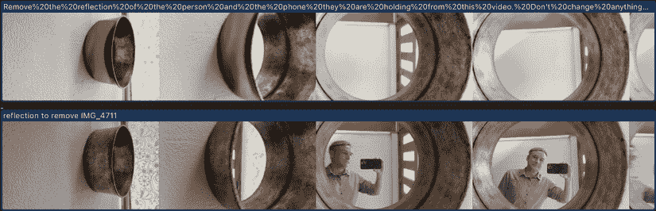

图 8.28 – 原始视频下方和上方处理后的几个帧——令人印象深刻

虽然五秒的最大剪辑长度限制了你可以做的事情，考虑到前面的问题，这仍然是一个不错的结果。这里的替换区域问题远没有完全重新构思镜头那样有问题，而且在很多情况下，质量限制是可以接受的。鉴于跟踪移除任务可能非常复杂，Aleph 可以作为一个更快、更便宜的替代方案。

跟踪的形式有很多种。作为另一个测试，我给 Aleph 提供了一个新的移动无人机镜头和一个标志，然后要求它“将这个标志添加到建筑右侧大空白区域的大圆形横幅上”。虽然跟踪本身没有问题，但标志并没有放置在正确的位置，而且标志本身被完全重新解释和扭曲。

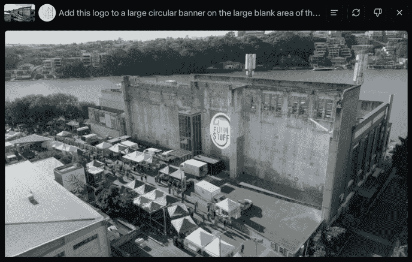

图 8.29 – 那不是我给它的标志，也不是我要求的放置位置

另一个测试，尝试将鲸鱼添加到海边场景的背景中，完全不起作用。结果并没有增强原始场景，而是生成了一幅全新的、截然不同的画面。

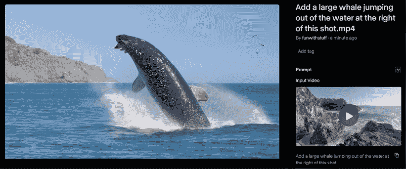

图 8.30 – 创建的视频与原始视频几乎没有关联

对于 Runway Aleph 来说，结果混合。如果你有困难，另一种方法是使用 Sora 的**混音**功能对现有视频进行更改，但你需要将混音强度调低以避免完全改变视频。虽然 Sora 不能像 Aleph 那样改变日夜，但它可以添加鲸鱼：

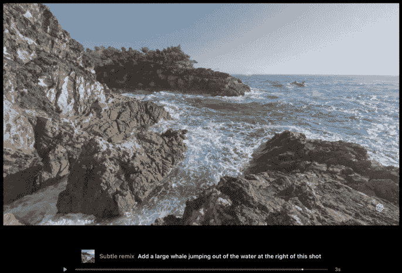

图 8.31 – 是的，那是在波浪中鲸鱼的一个细微混音

Sora 的控制水平与 Runway 或 Vidu 等工具相同，因此您可能需要尝试几次才能得到可用的结果。无论您最终使用哪种系统，您可能需要将静态和图像输出与传统效果技术（如色键和跟踪）混合匹配。如果您无法使视频生成工作，可能可以通过生成静态图像并将其结合到传统视频中使用传统遮罩和跟踪技术来实现。但还有一个可能解决这个问题的方法。

**EbSynth** ([`ebsynth.com`](https://ebsynth.com)) 目前提供免费和付费计划，并且比我们迄今为止查看的大多数其他解决方案提供更多控制。以下是流程概述：

1.  上传一个视频剪辑，然后浏览它以找到特定的帧。

1.  通过在它上绘画或上传图像的部分或全部替换，或甚至选择帧的一部分然后请求替换，以某种方式更改该帧。

1.  将该帧上的更改传播到整个剪辑的其余部分，添加的内容将像画在原始图像上一样被转换。

这个工具最吸引人的部分是它类似于常见的桌面视频编辑应用程序，包括用户界面中的时间轴、关键帧、工具和图层。如果您使用过 After Effects、Apple Motion 或视频编辑应用程序，您会很快理解它。

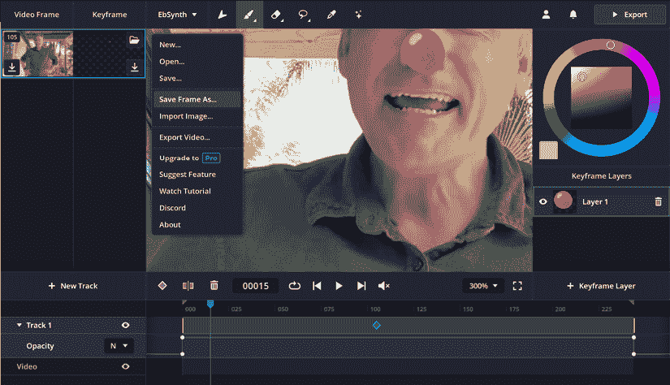

图 8.32 – 在这里，我在一个帧上画了一个红鼻子，然后在整个剪辑中传播了这个红鼻子

使用内置的绘画界面可以快速开始，但控制功能相当简单，更适合实验而不是完成的艺术作品。要使用像 Photoshop 或 Procreate 这样的应用程序中更广泛的可控功能，请下载当前帧并本地编辑您的图像。下载很简单：使用界面左上角的下载按钮，或在屏幕菜单中的**另存为…**选项（两者在先前的屏幕截图中可见）。

下载图像后，您可以应用整个图像的过滤器，然后上传这个新转换的图像。对于更具体的变化，您可以创建一个新图层，在该图层上添加一些新内容，然后将新图层保存为 PNG 并单独上传。新图像可以放置在原始图像的上方，并且更改将自动传播到整个剪辑中。

还可以使用生成图像模型转换现有帧的全部或部分。可选地，选择图像的一部分，然后点击其他工具右侧的**生成图像**图标。像平常一样提示（使用 Stable Diffusion 或 Nano Banana），将基于原始图像生成一个新的静态帧。您可以改变物体的颜色，将照片变成绘画，或进行任何其他您想提示的操作。

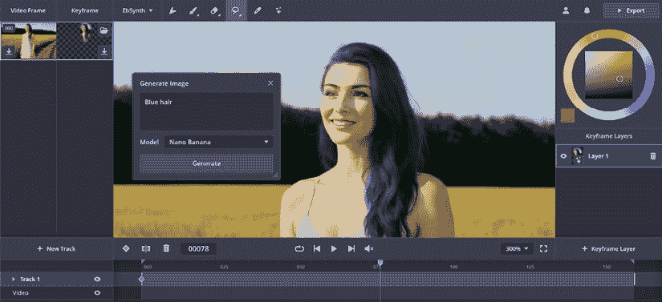

图 8.33 – 这个“蓝色头发”提示在帧 1 中使用，然后成功地在整个剪辑中传播

一个限制是，你实际上是在给原始图像添加油漆，而不是一个真正的 3D 对象。颜色变化可能成功，但如果你想在脸上添加一副太阳镜，当脸转向时，那些太阳镜看起来会更像身体油漆而不是应该的样子。物体越偏离原始框架，幻觉失败的可能性就越大，尽管可以通过添加更多的关键帧来更精确地控制效果。

尽管存在限制，EbSynth 仍然可以让表演者操纵数字替身，让插画栩栩如生，或者从真实人物的实时视频中添加或去除瑕疵或纹身。在撰写本文时，这个工具相当新颖，所以我不想得出任何明确的结论，但我确实喜欢它提供的控制水平，并看到了潜在的应用。

我们现在已经查看了许多工具和几个可能有用的工作流程。让我们回顾一下。

# 摘要

总体而言，尽管一些通用人工智能视频服务推荐起来太不稳定，但也有一些亮点：

+   Vidu 能够在第一帧和最后一帧之间实现一些令人印象深刻的转换，并且它还能够以可信的方式组合元素

+   Sora 在处理简单请求时产生了大部分良好的结果，尽管这些结果的可重复性较低

+   Runway 的 Act-Two 参考视频使声音和表演艺术家能够以新的方式使用他们的技能

+   Aleph 有时可以对现有视频进行真正有用的转换

+   尽管 EbSynth 是新的，但它的强大用户界面和独特功能集在适当的情况下可能非常有用

虽然我在这里测试的其他服务值得尝试，但我发现它们比我希望的更不可预测和难以控制，而可预测性影响成本。所有这些解决方案都是云端的，其中许多都太昂贵，无法反复提示。

它们的不可预测性意味着你通常需要执行多代才能获得良好的结果，而且即使是最高档的计划也包括严重的限制。一些昂贵的计划确实以更轻松的速度提供无限代数，而另一些则仅包括更多的付费积分，而重度用户会迅速消耗这些积分。

如果你想要使用 AI 生成视频，我建议你保持相对较低的期望，至少目前是这样。专注于创建用于原型设计的视频——在这里不需要完美——比创建客户可用的成品要容易、快捷、便宜得多。

在测试这些服务时，我遇到了重复的、破坏生成的错误，尽管这些问题最终得到了解决，但我无法连续几天使用某些服务。与静态图像相比，视频还有很长的路要走，这将是一个棘手的问题要解决。

在工作流程方面，虽然仅使用文本生成视频感觉像是一个魔术，但它并不适合较长的内容。为了获得更可预测的结果，我建议专注于图像到视频的工作流程，使用参考视频和音频，以及转换现有视频。

没有魔法按钮可以轻松让一切工作，你的期望越高，你可能会越感到沮丧。虽然这个领域将继续快速演变，但我并不期望进步是线性的，并且我怀疑输出在一段时间内将保持不可预测。

最后，当然还有其他可用的生成视频模型，尽管它们值得尝试，但大多数似乎都存在与我这里发现的问题相似的问题。一年后，或者有了新工具，或者有了不同的提示，你可能会得到非常不同的结果。每次运行都是不同的，每个人的需求都是不同的，模型也在不断更新。关注这个领域，但不要期望立即出现奇迹。

在下一章中，我们将通过音频的介绍来完善本书的生成部分，并且还有一些令人愉快的惊喜。

|

## 获取本书的 PDF 版本和独家额外内容

扫描二维码（或访问[packtpub.com/unlock](http://packtpub.com/unlock)）。通过书名搜索此书，确认版本，然后按照页面上的步骤操作。 |  |

| **注意**：请妥善保管您的发票。直接从 Packt 购买不需要发票。* |
| --- |
