# 第九章：带音频的生成 AI

在某些方面，AI 辅助的生成音频与生成视频同样存在不完美的问题，尤其是语音录音。尽管一些服务可以生成完全令人信服的对话，但大多数生成的是僵硬、不自然的语音。尽管如此，这个领域有令人惊讶的解决方案，其中一些可以改善甚至彻底改变视频或音频制作的工作流程。

今天的生成技术可以从各种文本和音频提示中生成语音对话、音乐和其他声音。与视频一样，人类在大多数情况下仍然能做得更好，尽管人类可能需要更长的时间并且成本更高。

如果一项工作真的值得做好，你应该雇佣人类。当然，不是所有的工作都是一样的，如果你预算或时间紧张，或者你只是想要一个临时音频文件以备将来替换，人工智能可能就足够了。毕竟，一个不完美的 AI 配音可能比编辑自己的声音更适合，这样就不会在客户审阅早期草稿时分散注意力。

但那是草稿音频——你能为最终输出使用生成 AI 吗？虽然使用 AI 语音或音乐进行广告活动可能会带来声誉风险，但使用不太完美的音频制作内部企业培训视频则不太可能引起人们的注意。

这里也可以选择混合方法。如果配音演员同意，使用人工配音的创意人员可以使用生成 AI 来纠正录音后发现的错误。并不是所有配音演员都会允许这样做，但如果需要快速更改，可能值得寻求许可使用 AI 重做他们作品中的短部分。

最后，音乐呢？虽然与作曲家合作创作作品会很理想，但时间和预算的限制意味着这对大多数创作者来说通常是不可能的。在预算有限的情况下，寻找和许可合适的曲目可能是一个耗时且棘手的过程。

构思出完全原创的音乐，在合适的长度、节奏和调性，这是一个诱人的想法，但它能与人工制作的曲目竞争吗？对于较短的曲目和用于视频和播客的背景音乐，答案可能越来越是肯定的。生成的音效尚未达到相同的水平，但你可以保留对整个过程的良好控制。

在这一章中，我们将探讨音频生成的最新技术状态：

+   创建合成语音

+   基于声音克隆的合成语音

+   替换现有语音录音的部分

+   创建原创音乐

+   音频翻译

+   创建合成音效

首先，让我们看看人工语音的逼真程度已经达到了什么水平。

# 创建合成语音

**文本到语音**（**TTS**）解决方案已经存在了几十年，但直到最近才开始听起来像人类。自从斯蒂芬·霍金（Stephen Hawking）的机器人声音首次被听到以来，我们已经取得了长足的进步，现在最好的 AI 声音几乎与真人无异，甚至有时会犯错。

其中一个引起轰动的是谷歌的 NotebookLM ([`notebooklm.google`](https://notebooklm.google))，这是一个可以从任何文本源生成整个播客的工具。这是来自 *The Verge* ([`www.youtube.com/watch?v=YGtINs3R5EM`](https://www.youtube.com/watch?v=YGtINs3R5EM)) 的入门指南。虽然这在技术上令人印象深刻，令人毛骨悚然，并且可能相当令人恐惧，但它可能不是创意专业人士直接使用的东西。

这种单次解决方案无法提供足够的控制或多样性，无法成为大多数创意工作流程的一部分，我们需要稍微退后一步，专注于从我们自己提供的文本生成语音。

作为基准，您的操作系统包含一些基本的文本到语音选项，用于朗读文本，尽管它们已经有所改进，但大多数仍然听起来相当不自然。

在 Mac 上，您可以在**系统设置**下选择您想要听到的声音，在**辅助功能** > **阅读和说话** > **系统声音**（Siri 声音听起来最好）。设置完成后，在内置应用程序（如**笔记**或**页面**）中选择一些文本，然后右键单击并选择**语音** > **开始说话**来听它。

Siri 和其他数字助手使用这些声音中的最佳者，但它们并不试图听起来完全像人类，我们知道它们不是。人类级别的 AI 声音通常太复杂，无法在手机上实时工作。这些更复杂的模型以更全面的方式解释提供的文本，解码每个词应该得到的强调和语调，正确的上下文发音，甚至任何停顿的长度。与人类配音一样，从一次录音到下一次录音会有所变化，并且有时会有错误。

尽管有时一个发音错误的词可能会暴露它们，但其中最好的声音听起来比差或平均的人类配音要好。但最差的它们与系统声音相差无几——当“伟大”就在那里时，不要满足于“可以”。

质量并不总是重要的。如果您只计划将合成声音用作临时的“刮擦”轨道，在您用真人录音之前提供一些编辑内容，那么一些奇怪的短语并不是问题。当然，时间仍然至关重要，一个更好的临时轨道，您的草稿编辑就会更接近最终产品。

基于网络的提供商众多。与图像和视频一样，一些模型在多个平台上可用，而一些则是独特的。以下是我尝试过的选项：

+   ElevenLabs ([`elevenlabs.io`](https://elevenlabs.io))

+   Artlist ([`artlist.io/voice-over`](https://artlist.io/voice-over))

+   Runway ([`app.runwayml.com/`](https://app.runwayml.com/))

+   Uberduck ([`www.uberduck.ai/app/text-to-speech`](https://www.uberduck.ai/app/text-to-speech))

+   Murf.ai ([`murf.ai`](https://murf.ai))

+   Genny ([`genny.lovo.ai/`](https://genny.lovo.ai/))

+   Resemble.ai ([`app.resemble.ai/hub`](https://app.resemble.ai/hub))

+   Hume ([`hume.ai`](https://hume.ai))

在几次测试中，我能够从这些提供商的许多声音中产生清晰、可用的语音。**Artlist** 和 **Runway** 都提供了一系列适合视频项目的专业声音选择，但**ElevenLabs** 是最知名的，市场领导者，拥有庞大的声音库可供选择。如果你没有时间自己进行比较，可以从他们最新的声音开始，目前是使用“v3”模型构建的声音。我们将在本书的后面部分再次回到他们的代理声音。

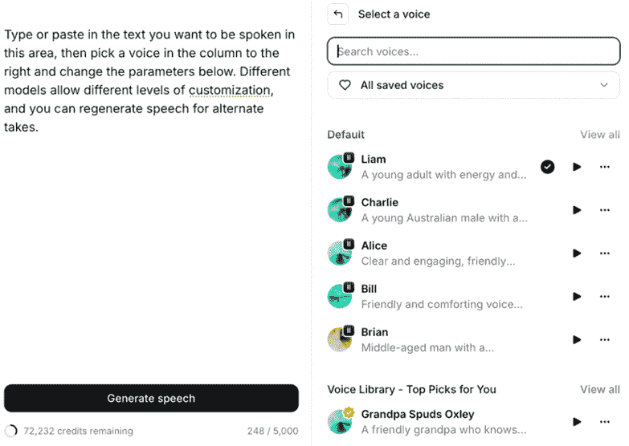

图 9.1 – ElevenLabs TTS 界面与其他该领域的提供商类似；选择一个声音后，你会看到更多的控制选项

虽然这些服务中的大多数并不昂贵，但一些开源模型可以完全离线运行，在你的设备上免费使用。

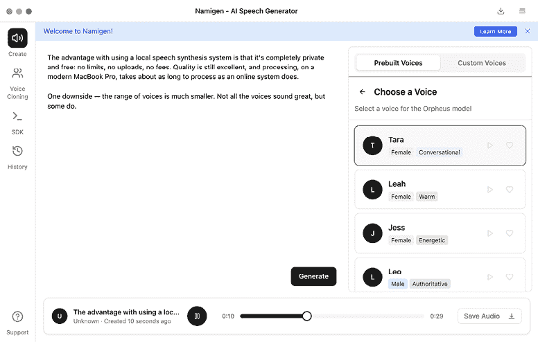

图 9.2 – Namigen 免费为您提供多种选择

虽然安装这些解决方案需要一些技术知识，但如果你有 Mac，你可以下载 **Namigen** ([`namigen.com`](https://namigen.com)) 以开始使用高质量的免费模型 Kokoro、Orpheus 和 Dia。**Resemble.ai 的 Chatterbox** ([`www.resemble.ai/chatterbox/`](https://www.resemble.ai/chatterbox/)) 是另一个流行的开源选项，可以在本地或在线运行。

对于预算不足或需要即时完成的任何工作，数字语音可能是最快的解决方案。但请记住，真实的人类也提供这项服务——并且可能并不像你想象的那么昂贵。

外包平台如 Fiverr ([`fiverr.com`](http://fiverr.com)) 上有许多有才华的人类以低价提供配音录制服务。为了使这可行，你需要以文本形式给出指示，并等待一两天完成工作。

对于更大的项目，需要表现力或导演想要执导的项目，你仍然需要雇佣真人并在录音棚中现场录制。

我怀疑大多数使用人工智能语音的人最初就不会雇佣真人。相反，合成语音正在取代质量较差的配音，或者被添加到以前根本不会考虑配音的地方。

使用这些选项很简单：你需要一个脚本，并且需要选择一个声音。每个服务都将提供自己的一套声音，这个选择很重要。你不希望使用一个过于熟悉的声音，因为它会显得陈旧——这是大型供应商预制作声音的主要风险。

你还希望选择一个对听众来说听起来很棒的声音。大多数合成声音都是美式的，这可能不适合你的市场。例如，为一家本地澳大利亚公司配音就需要使用澳大利亚口音，因为这是当地市场所期望的。

然而，如果我要创作一个面向国际市场的英文作品，我会选择美国口音，或者可能是英国口音，甚至每个国家都有不同的声音。务必询问你的客户每个当地市场偏好的是什么，因为地方口音会给当地观众带来意义，而对外人来说则失去了这种意义。（如果你对翻译感兴趣，这部分内容将在本章后面讨论。）

## 风格和情感

重要的是要记住你正在寻找的生成风格：叙述、播客对话、教育内容，或其他什么。一些服务允许你定义这一点，而其他服务则提供针对每个目的的特定声音。

一些服务可以实现戏剧性的表演，但这超出了大多数服务的功能范围。如果你计划制作广播剧或情感投入的有声读物，准备好放弃很多控制权，或者雇佣一个真人。

这并不是说你不能尝试超越一个简单的脚本。更高级的服务允许你指定 `[excited]` 标签来表示情绪，以及 `[gasps]` 来表示非言语声音，这可以帮助引导生成。更先进的 ElevenLabs v3 模型允许这样做，并且还允许多个说话者进行对话：

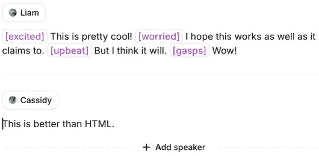

图 9.3 – 这在 ElevenLabs 的对话是更多平台即将到来的一种好例子

缩写通常会被识别为缩写，但如果它们没有被识别，你可以尝试逐个字母拼写出来。

为了获得更多控制，深入了解设置。一些模型允许你只控制一个或两个参数（**稳定性**是常见的），而其他模型则提供滑块来调整速度、夸张程度等。以下是 Resemble.ai 的一些控制选项：

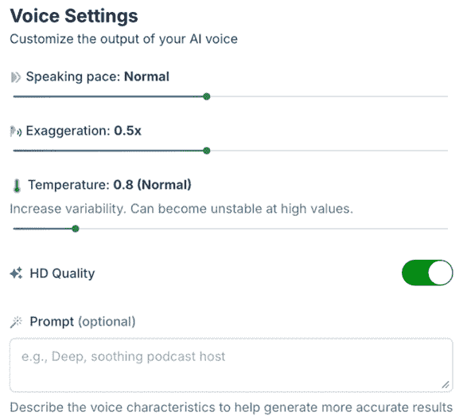

图 9.4 – Resemble.ai 的声音包括以下控制

如果你难以获得完全正确的结果，尝试将你的文本分成几个部分，独立生成它们，然后在音频或视频编辑应用程序中重新组合。这样，你可以重试有问题的录音，并组合多个版本——只要它们听起来足够相似即可。

就像常规的人类录音一样，每一代都会略有不同，所以如果它不够完美，不要害怕再次尝试。相反，如果一致性成为问题，并且不同的代之间听起来相当不同，你可能希望尝试更长的代，而不是更短的代。甚至可能值得重复脚本的部分，以确保在单个代中获取两次录音。

注意，许多 AI 头像（在上一章中讨论过）将提供生成合成语音的服务，尽管如果你更喜欢，你可以独立录制或生成音频。"Descript" 是一个愿意将图像（或提供的 AI 头像）动画化以匹配生成音频的服务，但请谨慎使用，因为视觉方面远不如音频方面令人信服。

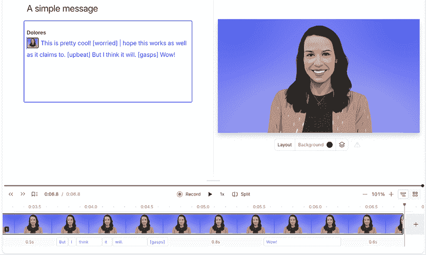

图 9.5 – Descript 有一个桌面应用程序，这使得生活变得稍微容易一些，而且还有头像选项

尽管今天可以产生类似人类的输出，但即使是最好的 AI 语音也有有限的寿命。最受欢迎的应用程序中提供的默认语音将被更频繁和更广泛地使用，因此，它们将变得可识别，然后过时。如果你关心设计，你不会使用默认字体，如果你关心音频，你也不想使用默认的 AI 语音。独特性很重要。

在某些提供商，如 ElevenLabs 和 Hume，你可以通过选择特定的特征来设计一个定制语音。这将大大有助于为特定客户创建独特的东西，尽管它仍然可能被模仿。

那么……是否有可能创建一个只有其他人无法访问的定制 AI 语音？确实可以。

# 基于声音克隆的合成语音

史蒂芬·霍金知道他将失去说话的能力，当时，一个机器人替代语音是最好的解决方案。今天，如果你预计会因为肌萎缩侧索硬化症（ALS）或类似的疾病而失去说话能力，技术可以在你失去它之前捕捉你的真实声音，并且超越这一技术的下一步可以在极短的时间内克隆一个声音。

作为一种辅助工具，苹果公司在 2023 年推出了**个人语音**([`machinelearning.apple.com/research/personal-voice`](https://machinelearning.apple.com/research/personal-voice))，并且至今仍然可用。要使用它，你必须通过说出 10 个随机句子来训练一个模型，然后该模型可以以你自己的合成声音朗读你输入的文本。创建它只需要几分钟，但它并不完美。我自己的声音克隆具有一些我的特征，但它听起来就像我是在用假的美国口音说话。

仅仅两年时间，声音克隆技术已经发展到只需几秒钟的声音就能捕捉其精髓的程度。有时，提供更长的样本可以给出更好的结果，但结果差异很大。这项技术创造了以下可能性：

+   文本到语音提供商可以提供更多基于真实人物训练的声音

+   人类配音的一部分可以被合成替代品所取代

+   可以生成与现有录音相同声音的新录音

当然，这里有一条道德底线——你是否有权生成特定人物的音频？如果一个组织之前已经聘请了配音艺术家来为他们的培训视频配音，那么用合成副本简单地替换他们就会涉及道德和法律问题。大多数声音克隆服务都试图验证是否已经获得了许可，所以你可能仍然需要他们的积极参与。

虽然我不会期望在没有许可的情况下，从你的声音样本中创建新的公共声音，但检查你使用的服务的隐私条件总是明智的。这一点在与他人的录音一起工作时尤其如此。为了测试这些服务，我使用了我的声音录音，并且建议你在自己的测试中也这样做。请注意，这个领域中的许多大型公司实际上要求你在语音创建过程中朗读一个口头许可声明。

尽管我测试了几个声音克隆服务，但并非所有都做得同样好。你可能比我更有运气，但到目前为止，我尝试的服务中只有少数能够创建一个听起来像我的克隆体。这可能是因为我的澳大利亚口音带有英国口音的混合，但我对取得的如此小的成功感到惊讶：

+   **Descript** 要求我朗读一个简短的脚本，耗时略超过 30 秒，然后很快地生成了一个克隆体。不幸的是，它听起来像是一个略微机械的美国版的我——这不是我能用的。

+   **Riverside.fm** 包含一个名为 VideoDub 的功能，允许你重新输入视频中某人说的一个或两个单词。我没有得到听起来像我的结果。

+   **Resemble.ai** 承诺免费“快速”声音克隆，并要求你朗读一个简短的脚本。像 Descript 一样，它迅速提供了声音，但这次，它听起来根本不像我，更像英国人。将语言设置改为不同的英语口音给出了截然不同的结果。

+   **Runway** 提供了定制声音功能，需要支付 300 个积分（几乎相当于标准计划每月积分的一半）来处理它。提供的脚本很长，几乎三分钟，但输出的是一个非常美国化的我，不适合作为克隆体。

+   **Uberduck**允许你免费克隆你的声音，而且令人惊讶的是，它仅用 10 秒钟的说话就很好地克隆了我的声音。如果你想测试声音克隆的水域，这个网站快速有效，而且使用起来并不昂贵，每月 10 美元可以获得 1 小时的生成时间。

+   **ElevenLabs**只需几秒钟的录音即可提供**即时声音克隆**，这在所有付费计划中都是可用的，包括入门计划（每月 5 美元）。虽然我的即时克隆制作得很快，听起来也还可以，但它并不像 Uberduck 的那么好。然而，ElevenLabs 在其创作者、专业和扩展计划（每月 22 美元/99 美元/330 美元）上也提供**专业声音克隆**（**PVC**）。这需要更多的训练，并且每个账户对高质量声音的限额非常严格。

在做出承诺之前，要意识到创建一个专业的声音克隆是一个非同小可的练习。这至少需要 30 分钟的录音，最好是 3 小时。我很幸运，因为我已经制作了大量的视频培训课程，所以我上传了超过两小时的高质量录音，让它进行处理。在所有这些上传之后，我还必须现场录制一个特定的短语来验证它确实是我。

有趣的是，如果你想与他人分享你的声音克隆，你可以。如果你选择将你的声音添加到**声音库**中，当你的声音被他人用来生成音频时，你将获得报酬。虽然目前尚不清楚这对参与者来说是否是经济上的胜利，但至少存在成功的可能性。

几小时后，我的声音准备好了，总的来说，听到我仅曾键入的文字被大声说出，感觉非常神奇。可以使用他们的任何一种模型生成逼真的声音，尽管推荐的更便宜的**Turbo**模型，但我听到更高品质的 v2 **多语言**模型的问题更少。目前，跳过最先进的 v3 模型，因为它仍然处于 alpha 测试阶段；它极大地改变了我的声音听起来。

虽然生成的音频大多数都是完全可以接受的，但偶尔还是会有一些停顿，感觉像是放在了错误的位置，或者某个词的发音与我说的不同。就像用真人录制第二遍一样，快速再生可以解决这个问题，但同时也可能在其他地方引入其他问题。仅仅点击**再生语音**就像告诉一个人，“*给我再来一遍*”而不提供具体的指导。为了获得更好的结果，你可以调整滑块来控制速度、稳定性或相似度，或者你可以添加标签来指定情绪，但不受欢迎的停顿是无法完全消除的。

你可以将每个录音的最佳部分编辑在一起，对于许多项目来说，这已经足够好了。这个过程与你可能如何与外包的人类配音艺术家合作类似——提供反馈，并接收某些台词的替代版本，但它将负担转移到了编辑身上，并且不如与真人一起在录音棚中工作那么顺畅。

总的来说，这些专业的声音克隆技术令人难以置信地技术精湛且非常实用。如果你想与一个愿意用他们的声音训练模型并允许你使用的特定配音艺术家合作，这将非常有效。如果你能直接与真人录制，你会得到更好的结果，但时间和金钱的成本会更高。

市场仍在迅速发展，本地运行的开源解决方案也在成熟。Namigen（之前讨论过）计划很快添加声音克隆功能，如果你愿意与命令行打交道，**IndexTTS2** ([`indextts2.org`](https://indextts2.org)) 现在就可以使用。你还可以通过**Voicv** ([`voicv.com`](https://voicv.com)) 测试这个解决方案。

最后，尽管 ElevenLabs 目前在市场上领先，但这个领域的竞争意味着有多个不错的选择，并且一些基础模型将在多个提供商之间共享。如果你已经订阅的 AI 提供商提供你可以使用的语音服务，尝试一下它们。

我们已经探讨了如何从现有声音生成旁白，以及如何模仿现有声音。我们能用这项技术来修改现有的视频吗？正如你可能猜到的，当然可以。

# 替换现有声音录音的部分

对于视频和音频创作者来说，一个可能有用的技巧是在拍摄后更改视频中某人说的单词来纠正错误或重写脚本。如前所述，如果你想有灵活性，用合成声音替换人类录音的一部分，请提前获得许可。虽然人类在另一个人类的指导下有潜力录制最准确、最有情感的声音，但你需要他们的许可才能将新词放入他们的口中。

拥有这种批准后，如果你只需要替换一个或两个单词，过程就很简单了。使用能够快速制作高质量声音克隆的提供商，你可以上传音频的错误部分，然后输入正确的文本，并使用 TTS 制作正确的版本。下载，拼接替换部分，任务完成：Tyler Stalman 已经展示了这种方法与 Artlist 一起工作（[`youtu.be/jCXHOUkeXn4?si=hwRabP5YpnrdyWih&t=806`](https://youtu.be/jCXHOUkeXn4?si=hwRabP5YpnrdyWih&t=806)）。

虽然一个简单的 TTS 模型可能在一些诱导下生成一段简短的内容，但并不总是容易匹配原始交付的风格，足以让人信服。语调很重要，情感很重要，许多模型控制不足，无法达到所需的效果。这里有一种方法可以做出更长的修改：

1.  创建那个人的声音的合成克隆。

1.  您可以**亲自**模仿那个人的说话，匹配他们的节奏和情感，但要说正确的词语而不是错误的词语。

1.  将您的新人声转换为他们的声音，保持您的情感和节奏。

就像您可以从其他视频中创建合成视频一样，您也可以根据现有语音创建合成语音，这可能会让您对语音的情感和节奏有更大的控制。Artlist 提供这项功能（语音到语音），ElevenLabs（语音转换器）和 Runway（语音到语音）也提供。在 DaVinci Resolve 中也可以实现，由于这个过程不太直接，我将一步步为您介绍。

这个例子是我的一位客户在现实生活中遇到的问题。我为专业演讲者 Daryl Elliott Green（[`twiceshot.com`](https://twiceshot.com)）拍摄了一次演讲，然后之后将演讲视频发送给他。不幸的是，他在演讲的开头说错了，将谈话的第一行中的“八月”说成了“四月”。许多客户都犯过类似的错误，以前修复这些错误需要重新录制那一刻，但现在不再是这样了。

要使用此工作流程，您需要 DaVinci Resolve 的 Studio 版本，并且需要克隆的人的音频录音。大约五分钟应该足够，但如果您有时间，可以提供更长的录音。

1.  选择那个人说话的原始剪辑，然后选择**AI 工具** > **DaVinci AI 语音训练…**。

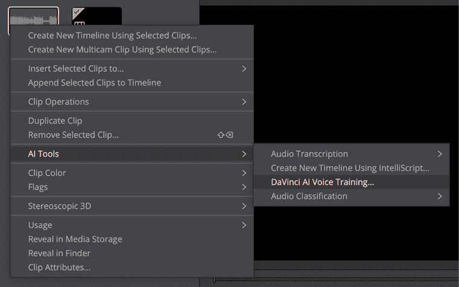

图 9.6 – 在一个人的声音录音上训练模型，然后您可以模仿它

第一次使用此功能时，您可能需要下载一个额外的文件，如果您使用的是除英语以外的语言，可能需要下载多个文件。

1.  在同意您有权限克隆这个声音后，您可以命名声音模型并选择所需的准确度级别——这里就使用默认的**更好**选项即可。

创建模型可能需要一些时间，但它将在后台继续进行——我的 MacBook Pro M3 Max 处理五分钟的原材料大约需要一个小时。

1.  完成后，录制您自己的声音，用您需要的节奏、语调和情感说出更正的“引导”词语。最简单的方法是使用**时间轴** > **录制旁白**将此录制到新轨道。

如果您在录音时戴上耳机听原声，可能会更容易匹配原始语音，这也会避免反馈问题。

1.  选择新的轨道，然后选择**剪辑** > **AI 工具** > **语音转换**。在此对话框中，从顶部的**轨道**菜单中选择**新建轨道**，并从底部的**语音模型**菜单中选择您的新声音。

1.  按**渲染**将新的“引导”剪辑转换为该人的声音。如果听起来不太对，撤销并尝试使用不同的音调变化值，或者尝试重新录制您的引导剪辑。

新剪辑将出现在一个新的轨道上。

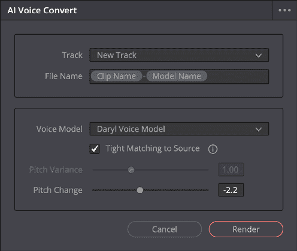

图 9.7 – AI 语音转换可以将录音转换为内置的几种声音之一或你训练过的声音

1.  切割原始剪辑和替换剪辑，调整和淡入淡出以决定每个剪辑使用多少。

这个工作流程使得一年或两年前不可能的技巧成为可能，我这里展示的例子是真实的——一个演讲者说了一个词而不是另一个词，我能够无缝地通过自己说出来替换它。

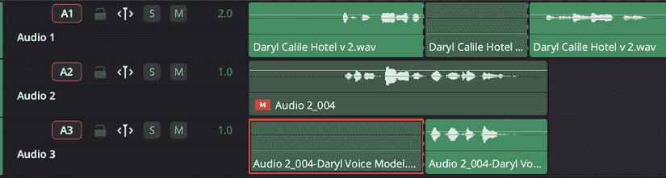

图 9.8 – 在时间轴上，选择你想要保留的原始音频和替换音频的内容

显然，这种方法的优点是它提供的控制力。如果你没有 DaVinci Resolve Studio，可以尝试在线的语音到语音模型，如果第一次没有成功，不要害怕重新录制一个新的引导轨道（或者简单地重新生成）。

我们已经探讨了生成语音的多种方法，但文字并不是音频中唯一重要的部分。音乐也很重要，AI 服务乐于提供帮助。

# 创作原创音乐

原创音乐是现代媒体景观中最受控制的部分之一。每个上传到主要流媒体平台的视频都会被扫描以识别其中包含的音乐；YouTube 的系统被称为 **内容 ID**。如果你使用了你没有版权的音乐，你的视频可能会被屏蔽，或者静音，或者你可能会收到版权警告，或者你可能会失去该视频的所有收益。

为视频寻找音乐可能有点棘手。如果你在一个常见的库存音乐网站上搜索“企业提升背景音乐”，你会找到一些人们已经听过的曲目。即使你自己制作音乐，在如 **GarageBand** 这样的免费软件中编程循环，如果你不够原创，其他人可能会制作一个类似的曲目并声称你侵犯了他们的版权。（是的，这发生在我身上过。）

即使是演奏原创作品的音乐家也必须小心——如果你无意中使用了比一个更著名且好诉讼的艺术家相同的音符序列，他们可能会独立地起诉你。一方面是版权问题，另一方面是原创性问题，因此转向 AI 制作符合客户需求的音乐是有吸引力的。

当一些人使用 AI 制作可在流媒体服务上播放或甚至独立销售的曲目时，我只建议在音乐在项目中扮演较小辅助角色的项目中使用 Gen AI 创建背景音乐。对于音乐是重点的项目，如果可能的话，雇佣一个人类，或者仅将 AI 制作的音乐作为临时音乐使用。

但如果你从未听过 AI 制作的音乐，请前往 **Suno** ([`suno.com`](https://suno.com)) 并要求一些可能用作播客或视频背景音乐的曲目。为了稍微推动道德边界，我要求一首“以 Daft Punk 风格，歌词关于与朋友们在海滩度假”的歌曲，它理解了这个简报。

在短时间内，我可以根据两组不同的歌词，以正确的风格演奏四首不同的歌曲。此外，还用新模型创建了额外的部分样本歌曲，展示了更多样化和更复杂的结构，大多数客户都会在这里找到他们喜欢的东西。如果你自己也是音乐家，付费账户让你可以上传自己的音乐来构建。

当一首歌制作完成后，只需一分钟左右，一定要阅读歌词并确保它们表达了你想要的内容。虽然有两首歌使用了海滩假日朋友的歌词，但另外两首歌则从泳池清洁机器人的角度创作了歌词：“*刷去藻类，追逐污垢 / 完美泳池，清洁时间*。”很有趣，音乐也还过得去，但不可用。

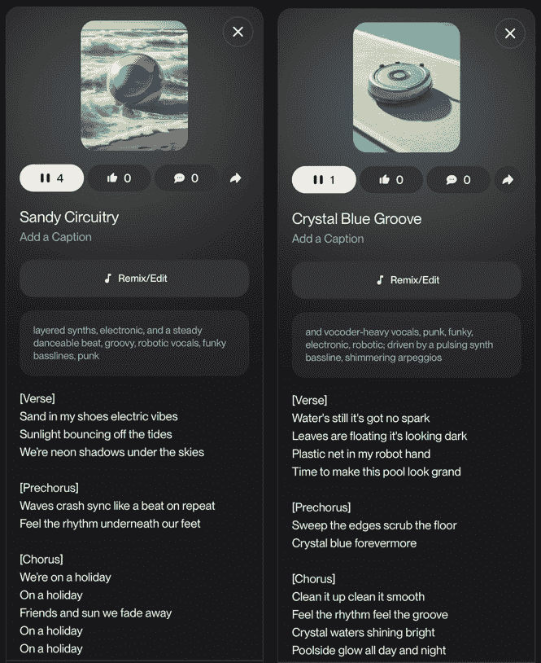

图 9.9 – 海滩上的朋友之歌，当然；清洁泳池的机器人之歌，则不然

由于包含 *Daft Punk* 这个名字，**ElevenMusic** ([`elevenlabs.io/app/music/`](https://elevenlabs.io/app/music/)) 同样拒绝了相同的提示。经过调整后，输出变得更加通用，但过于偏向机器人声音，而不是 Daft Punk 以其著名的 vocoder 而闻名的声音，并且背后有更多的通用流行音乐配乐。其他使用不同提示的生成版本则出现了歌词唱不清楚和过于简单的音乐结构。

**Udio** ([`www.udio.com`](https://www.udio.com)) 严重误解了情况，创建了几首朋克吉他曲目。那本来是可以的，但这些歌曲包含了听起来像单词但不是的声乐，就像一个人一只手有七个手指一样。

很明显，有众多网站、众多风格和众多提示可以尝试，你需要进行实验以找到适合你口味的网站。请注意，如果你对音乐有些了解，你可以超越提示，成为 AI 制作声音的积极塑造者。

**Soundraw** ([`soundraw.io/`](https://soundraw.io/)) 允许你选择流派、情绪、主题、长度、节奏和要使用的乐器，然后为你提供它刚刚组合在一起的曲目选择。向下滚动，你会看到一个混音器，你可以根据曲目播放时进行调整，使曲目的某些部分更加强烈或较弱，控制安静时刻何时到来，何时加入填充，何时低音下降，甚至改变使用的和弦。这些曲目可能包含人声元素，但主要是乐器。这是一种不同类型的音乐，但如果你需要更多控制，它就非常棒。

在对音乐有深入了解的人群中，对这些服务的看法各不相同。技术上，许多 AI 音乐曲目包含瑕疵，很难干净地分离音乐元素。如果你希望混音这些曲目、重新制作它们或移除某些元素，可能会遇到困难。

尽管如此，AI 制作的音乐不完美，可以作为专业人士的有用灵感，就像不完美的 AI 图像一样。再次强调，对于不那么关键的工作，不完美的 AI 音乐可以完美地融入最终产品，就像不完美的 AI 图像可以“足够好”一样。如果你不是音乐专家，请谨慎使用这些曲目，因为你可能听不到一些观众会注意到的所有缺陷。

此外，务必遵守版权规定；如果你打算将制作的任何音乐用于任何商业目的，你需要仔细阅读细则。例如，使用 ElevenLabs 制作的音乐不能用于传统的电视或电影目的。此外，如果你在这些服务中使用免费或低级账户，你根本不能将音乐用于商业目的。

作为一个插曲，如果你真的知道自己在做什么，并且喜欢自己创作音乐，AI 能帮到你吗？当然可以，例如通过像 **Output Co-Producer** ([`output.com/products/co-producer`](https://output.com/products/co-producer)) 这样的插件。这个插件位于你的数字音频工作站（DAW）中，根据你的提示和对其作品的分析建议可能有助于的样本。这些样本是由人类制作的，所以这并不是一个通用人工智能（Gen AI）解决方案，但如果你喜欢制作音乐，可能会觉得它很有用。

在我们结束这一章之前，让我们快速看一下翻译口语对话最有用的新解决方案。

# 音频翻译

在许多方面，音频翻译是文本翻译的延伸，涉及相同的问题和限制，如*第六章*中讨论的那样。翻译并不完美，但在许多情况下仍然很有用，你应该使用的方法将取决于手头的任务。

实时翻译非常适合与不说法语的合作者进行对话。为此，你可以使用苹果的翻译应用、跨平台的谷歌翻译应用或其他系统。这些应用通常与耳机连接，让另一个人用他们的语言说话，而你听到的是你的语言。

图 9.10 – 在翻译应用中，说一种语言并立即将其翻译成另一种语言仍然感觉像魔法

由于速度对于流畅的对话至关重要，这些系统可能不会给出完美的结果，尽管它们在当下通常足够好。在生产环境中，准确性更为关键，我们将寻找另一种解决方案。

YouTube 提供了自动将视频翻译成多种语言的**配音**服务，使用合成声音将视频的**字幕**转换为音频。这些声音相对机械，原始交付中的任何情感或细微差别都会丢失。此外，由于 YouTube 自动生成的字幕通常不如其他转录服务的准确，这可能会损害翻译字幕和配音。

为了提高质量，请务必创建自己的字幕并在上传前检查它们。如果可能的话，请让目标语言的母语者自己翻译脚本或纠正 AI 创建翻译中的错误。在此阶段，您可以使用 TTS 服务生成新的音频，可能比默认的机器人声音更具表现力。

虽然不同语言通常以不同的速度说话，但研究表明，它们仍然在约相同的时间内传达信息（[`www.cnrs.fr/en/press/similar-information-rates-across-languages-despite-divergent-speech-rates`](https://www.cnrs.fr/en/press/similar-information-rates-across-languages-despite-divergent-speech-rates)）。总的来说，虽然您可以期望配音节目与原始节目大致相同的时间长度，但在视频的上下文中，个别句子的时间安排很重要。虽然仅音频的播客在句子长度上具有一定的灵活性，但视频的翻译音频必须在每个句子上保持原始语言的时序。

作为视频音频翻译的一站式解决方案，ElevenLabs 提供了**配音**服务（[`elevenlabs.io/app/dubbing`](https://elevenlabs.io/app/dubbing)），它结合了转录字幕、配音音频，并为每个配音句子提供时序控制。为了测试，我为我 Final Cut Pro 空间套件插件的宣传视频制作了法语配音。

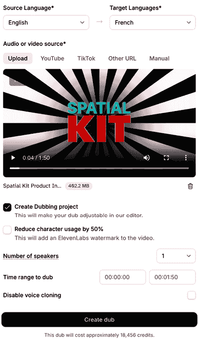

图 9.11 – 上传视频后，选择您想要配音的语言，并等待一段时间

每种语言单独计费，并且每分钟每种语言 10,000 个积分，如果您不想输出带有水印，很容易就会耗尽标准计划的月度积分。（注意：如果您计划从输出中提取音频，视觉水印无关紧要，并且成本降至每分钟每种语言 5,000 个积分。）

输出的声音非常令人印象深刻，使用即时声音克隆创建的外国翻译听起来与原始说话者（们）几乎一样。正如您所期望的，它并不完全像专业的声音克隆。重要的是，在配音工作室中，您有机会纠正原始转录和翻译中的错误，这是一个关键步骤。

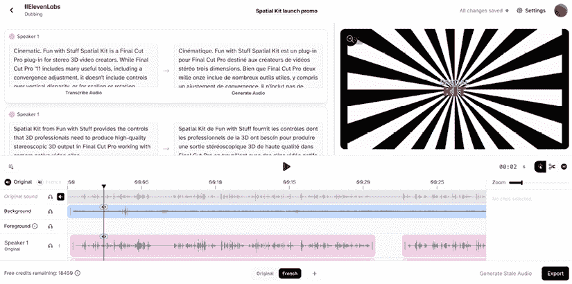

图 9.12 – ElevenLabs 的配音工作室允许你在需要时修复问题并重新生成音频

首先，转录错误是会发生的，应该在翻译之前进行纠正。例如，尽管这里的转录（*图 9.12*）大部分非常好，但第一个词 *Cinematic* 在原始视频中根本不存在。翻译中的 *Cinématique* 不仅多余；它还破坏了节奏。幸运的是，配音工作室允许你调整任何句子的时间，所以请检查是否有问题，如果需要，移动或修剪音频片段。

此外，请记住翻译问题可能很微妙，由于一个特定短语通常有多种可能的翻译，自动解决方案可能不是最好的。这在术语或技术短语中尤为重要，你希望确保在所有相关视频中以一种一致的方式说话。正如已经提到的，你真的应该请一位母语人士检查任何翻译。

转录和翻译文本都可以编辑，如果你更改了翻译，你可以按下该部分下方的**生成音频**按钮来创建一个新的音频片段。这些重新生成是免费的（在限制范围内），所以你可以修复问题而不必担心你需要支付比预期多得多的费用。

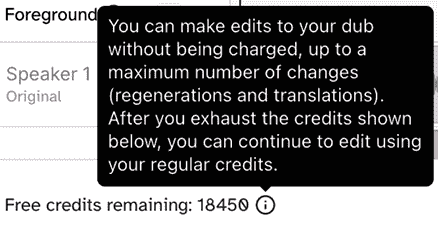

图 9.13 – 如果需要重新生成某些部分，配音工作室允许进行免费更改

ElevenLabs 是一个我推荐的强大解决方案，但市场上并不只有它，它只是翻译音频方面的一个解决方案。因为当音频改变时视频保持不变，所以口型和听到的词语之间存在不匹配。在看似神奇的解决方案中，如果做得好，AI 唇形同步可能是一个更好的选择。

## AI 唇形同步

**Perso** ([`perso.ai`](https://perso.ai))、**LipDub** ([`www.lipdub.ai`](https://www.lipdub.ai))和**Dubly** ([`dubly.ai`](https://dubly.ai))等解决方案不仅包括翻译和配音，还包括将视频重新生成以匹配新生成的音频。在上一章中简要提到的**Flawless** ([`flawlessai.com/`](https://flawlessai.com/))，提供了更适合电影工作流程的高端功能。

一些 AI 唇形同步视频可以非常令人印象深刻，以至于许多观众甚至不会意识到它们已经被翻译了。但请注意——结果越无缝，确保转录和翻译完美就越重要。重要的是，除非你精通源语言和目标语言，否则你无法自己评估这一点。

观看使用机器人声音自动配音的 YouTube 视频的观众会期待它犯一些错误，就像原始语言的转录字幕可能包含错误一样。如果只有音频被翻译，也会有一定的容错度。

然而，如果你展示的是某人真实声音的对话，实际上听起来就像他们自己说的那样，这种期望就会改变。翻译错误现在可能会被视为一个真实的人犯下的真实错误。还有陷入*诡异谷*的风险，即某些东西看起来*几乎像人类，但又不太像*。在同步视频剪辑中，一个人的手部动作可能不会与翻译完全匹配，你可能会感到有些不对劲。随着技术的成熟，这希望会成为一个较小的问题。

无论你选择是否使用唇同步，如果你有大量的翻译需求，考虑使用专门的服务。要知道，成本可能会迅速增加，你生产的语言越多，你创造的内容就越多，你的积分消耗也就越快。请注意，传统的翻译也不便宜，至少你还需要真实的人类进行验证。

YouTube 提供免费自动配音服务，低端市场得到了很好的服务，尽管时间会证明观众是否会接受唇同步翻译。虽然我个人更愿意听到原始演讲者的声音克隆而不是配音艺术家，但我相信其他人可能有不同的感受。就像一些观众愿意阅读字幕，而另一些人则不愿意一样，市场可能会接受这些技术的混合，就像他们今天对字幕和配音所做的那样。

为了结束这一章，让我们看看 AI 能为音效做些什么。

# 创建合成音效

即使你更喜欢使用真实的人类声音和真实的人类音乐家，音效也不总是那么容易就能手到擒来。要手工完成这项工作，需要专业的软件，例如**Audio Design Desk** ([`add.app`](http://add.app))以及可以调用的声音库——如果你有时间，这会很有趣。

但如果你认为没有时间，是的，AI 也可以填补这个空白，无论是暂时性的还是可能达到最终输出标准的。如果你一直在使用 Gen AI 制作视频，这可能会特别有用；这些模型中很少有包含音频的，即使是包含音频的**Veo 3**，也不总是做得正确。

**Firefly**是一个容易开始的地方：你可能已经有了登录账号和一些备用积分，音质可以接受，而且有很多选项可以探索。首先，你可以简单地使用文本提示来请求音频，Firefly 会给你四个变体。我选择了一个相对有挑战性的内容（“狗在冲浪海滩上吠叫”），以测试它如何将两种实际上有时会同时听到的不同声音混合在一起。

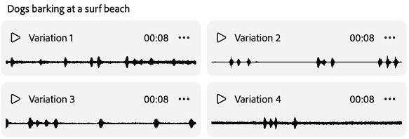

图 9.14 – Firefly 的四种选项在这里听起来都很好

书并不是传递音频的理想格式，但波形应该显示在八秒的文件中有相当多的变化。这是好的——有不同海滩和不同种类的狗，我的提示并不具体。不幸的是，质量不足以用于最终输出；在半不错的耳机上听，揭示了混浊的音频和压缩伪影。

从其他提供商请求相同的音效得到了混合的结果。ElevenLabs 提供音效（四种变化和持续时间控制），但那里的质量并没有好多少。尝试使用 **SFX Engine** ([`sfxengine.com/app/sound-effects`](https://sfxengine.com/app/sound-effects))，这需要更长的时间，我收到了每生成一个变体就 10 秒长的文件，而且音质相当不稳定。

如果你对自己的音频混音不自信，请求这样的组合音效可能看起来是个好方法，但最终可能会妥协音质。当你请求多个元素组合时，输出听起来好只有在两个源元素都工作的情况下，而且你无法仅替换其中一个元素。

如果可能的话，最好分别请求元素，然后分别控制每个声音的音量、声像、均衡器、混响等。这是一个经典的故事：*你花的时间越多，结果越好*。如果你借助 AI 跳过所有有趣的环节，你不会在混音、时间控制或空间定位声音方面变得更好。

返回这些网站并分别请求元素，整体上给出了更好的结果，尽管质量仍然不稳定。狗吠声还可以，而海滩上波浪拍打的声音往往听起来很假——这是声音（尤其是波浪）数据率太低时可能发生的事情。

这个质量问题在 ElevenLabs 生成的许多其他声音中也很明显。默认情况下，生成是公开的，其他用户创建的声音可以被听到和下载。

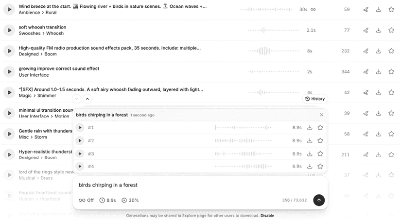

图 9.15 – ElevenLabs 的这个公共音效流展示了可能实现的效果

听了许多这些结果（来自长和短的提示）揭示了森林氛围背景中的低频嗡嗡声，爆炸时峰值被截断，还有一些不愉快的哔哔声。并非全是坏事，但我没有找到很多能与常规音效库相媲美的声音。多样性是好的，但质量并不好。

尽管如此，AI 确实有一些常规声音库无法完全匹敌的技巧。在一些网站上，你可以上传一个视频，AI 会生成与之匹配的音频，无论是否有提示。**KlingAI** ([`app.klingai.com/global/video-to-audio/`](https://app.klingai.com/global/video-to-audio/)) 提供了这项服务，虽然视频似乎确实起到了提示增强的作用，但结果参差不齐——毕竟你一次要求多个东西。

一个没有行人走动且没有提示产生的音频的视频，添加了混乱的言语或脚步声，尽管一两个变化可能是可用的。当我添加了一个简单的提示“微风轻轻吹拂田野里的庄稼”时，它得到了正确的内容，但所有四代的质量都很差。另一个视频，一个人沿着森林小径行走，与提示“树中的风和鸟鸣”配对，产生了充满伪影的音频，并附带（不想要的）流水声、雷声或错时脚步声。

我也尝试了 Firefly，但它似乎并没有试图使用源视频作为灵感。然而，这里的界面确实鼓励你使用简短、具体的提示并组合多个声音——这是一个好主意。在撰写本文时，这个功能仍在测试版中，并未完全激活，但值得探索。

Firefly 中另一个可能有用的功能是，你可以使用你的声音来模仿在提示中请求的声音的节奏。我要求“脚步声踩在砾石上”，并在上传的单独声音录音中提供了节奏。四代都准确地保持了节奏，尽管质量并不完美，但我确实可以用它作为临时轨道或与其他声音混合。

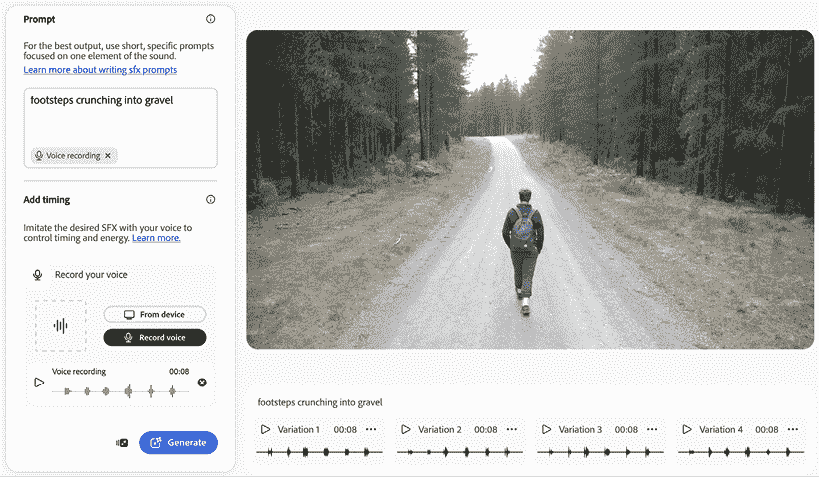

图 9.16 – 这些脚步声的节奏与我所提供的声音录音相匹配

对于音效，质量似乎是大多数这些网站的问题。虽然我无法测试所有可能的服务，但我对音效的整体质量低于音乐感到惊讶。鉴于音效可以一次生成一个，而且它们并不总是那么难找，也许现在最好还是用传统方式混合它们。

让我们退一步总结一下。

# 摘要

在语音、音乐和音效之间，AI 可以帮助的方式有很多。语音方面可能发展得最好，无论你选择使用高质量预制声音还是训练自己的声音，我认为我们已经到了这样的一个阶段——使用最好的模型，你可以创建一个许多人会认为是人类的声音。一些合成音乐可能听起来像是人类制作的，特别是如果它以低音量使用，但质量差异很大。总的来说，音效还远远不够，尽管潜力巨大，但我现在还是手动混音。

如果你是一位涉猎音频的视频或照片专家，快速听听 AI 制作的音频并可能印象深刻是很简单的。但如果你是一位视觉专家，能够发现其他人可能忽略的视觉生成中的缺陷，那么不要让糟糕的音频质量轻易滑过。音频对于优质视频至关重要，尽管 AI 工具可以在清理方面创造奇迹，但目前生成方面的效果参差不齐。

接下来，我们将进入本书的*自动化 AI*部分——一个充满勇气的新世界。

|

## 获取本书的 PDF 版本和独家额外内容

扫描二维码（或访问[packtpub.com/unlock](http://packtpub.com/unlock)）。通过书名搜索本书，确认版本，然后按照页面上的步骤操作。 |  |

| **注意**：请妥善保管您的发票。直接从 Packt 购买的商品不需要发票。* |
| --- |
