# 第十一章：视频与自动化 AI

视频编辑有时可能是一项耗时的工作，但现代人工智能工具准备提供协助，使编辑过程中的某些部分显著简化。在本书的早期，我们探讨了基于文本的编辑工作流程如何有助于简化编辑过程，现在，我们将探讨试图更完全自动化编辑过程的解决方案。

这些系统中有的是完全在线的，有的是完全离线的，还有一些使用混合模式。有的针对编辑者，有的针对更广泛的受众，功能差异很大。一些系统试图做所有事情，包括生成新的背景（甚至 AI 头像）作为编辑的一部分，而其他系统则旨在提供你可以进一步在所选编辑应用程序中润色的粗剪版本。

当你亲自评估这些视频服务时，保持开放的心态，考虑它们如何帮助你优化工作流程，即使你希望（或完全管理）最终编辑。

这里讨论的一些功能确实跨越到了实用人工智能领域，当然完全可能使用这些功能（如转录、日志记录和组织）而无需自动化实际的编辑。有关基于文本的编辑和相邻的基于转录的工作流程的更多信息，请参阅本书“实用人工智能”部分的*第四章*。基于文本的编辑是许多自动编辑解决方案的核心。

但你希望这种自动化进行到什么程度？虽然非编辑者可能希望服务完全为他们编辑一个片段，但经验丰富的创意人士可能希望保留最终控制权。人工智能很少完美，正如你将看到的，它不擅长将所有编辑放置在完全正确的位置。但“不完美”并不意味着“不好”，自动化仍然可以给你“一些东西”而不是一个空白的时序表。

在本章中，我们将探讨以下主要主题：

+   使用 DaVinci Resolve 的自动编辑

+   简单的自动编辑

+   基于提示的自动编辑

让我们找出编辑者（像我一样！）是否可以被人工智能取代，从拥有最多人工智能智能的桌面应用程序开始：DaVinci Resolve。

# DaVinci Resolve 中的自动编辑

**DaVinci Resolve** ([`blackmagicdesign.com`](https://blackmagicdesign.com)) 是一个我们已经讨论过的专业**非线性编辑**（**NLE**）应用程序，它包括一些自动编辑功能。在应用程序的免费和 Studio 版本中，你可以自动去除静音，在 Studio 版本中，你还可以使用**IntelliScript**根据脚本自动剪辑，或使用**IntelliCut**帮助分离单条音频轨道中的不同说话者。

从技术上讲，在 Resolve 中移除静音并不被归类为“AI”功能，但它自动化了这一过程，并且不会占用太多时间来提及。在**编辑**页面，选择一个剪辑，然后选择**剪辑** > **音频操作** > **涟漪删除静音**。这个功能并不特别智能，如果你的源音频比较安静，你可能会预期到一些你的话会被删除。幸运的是，你可以调整检测静音的阈值，所以调整它。

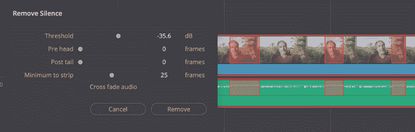

图 11.1 – 这不是 AI，但它做的是类似的工作

没有 AI 智能，这个功能只能完成一半的工作；正如我们很快就会看到的，AI 真的可以帮助检测重复句子、咳嗽和重拍。

IntelliScript 是一个可以节省大量劳动力的功能，而且使用起来非常简单。你从一个剪辑的转录开始，你可以在 Resolve 本身中生成它，或者使用 MacWhisper 或其他工具。接下来，在任意文本编辑器中编辑这个转录，删除你不需要的文字，只留下你想要保留的部分。

最后，右键单击你的源剪辑并选择**AI 工具** > **使用 IntelliScript 创建新时间线…**：

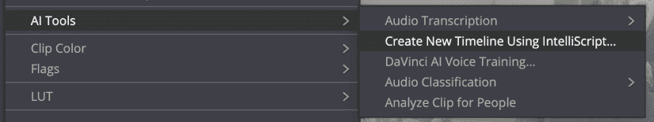

图 11.2 – 只需右键单击你的剪辑，然后选择一个文本文件，就完成了

在短时间内，Resolve 将找到你请求的所有视频片段，并将它们并排放在时间线上。不是每个编辑都是完美的，但它非常好。

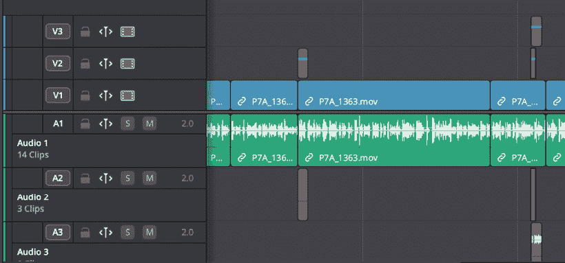

图 11.3 – 最快粗剪的方法是遵循脚本

如果原始录音的多个片段与脚本中选择的行匹配，它们将被添加到主匹配旁边的轨道上，如图所示。要评估它们，按*D*键禁用主剪辑，然后再次按*D*键启用备用剪辑以找到最佳拍摄。请注意，如果你正在处理多机位剪辑，请确保首先创建多机位，然后应用 IntelliScript 功能。

最后，在**Fairlight**页面，有一个可以帮助音频任务的功能。当多个说话者的声音被录制到单个麦克风时，有时需要独立处理他们的声音。虽然围绕每个说话者的剪辑很繁琐，但 Resolve 可以帮助使这个过程变得容易一些。

要开始，将一个剪辑添加到时间线上，然后转到**Fairlight**页面，右键单击剪辑，然后选择**AI 工具** > **Checkerboard** **到新轨道**，就像这样：

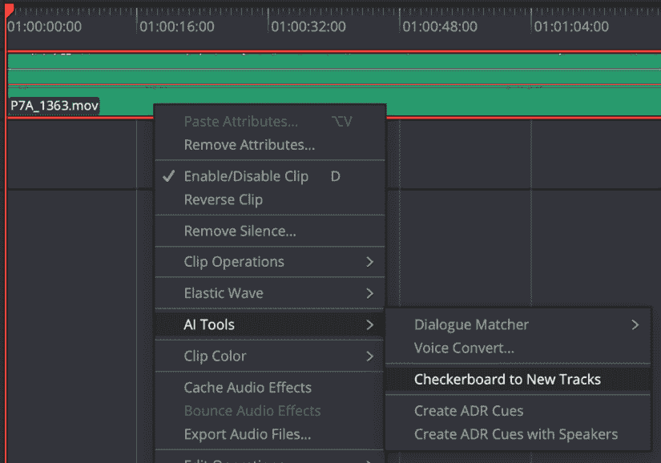

图 11.4 – 这个命令使分离多个说话者变得稍微容易一些

如果还没有开始转录，转录就开始了，然后是处理。虽然结果并不完美，特别是如果说话者同时说话，但总的来说，这个功能做得很好。

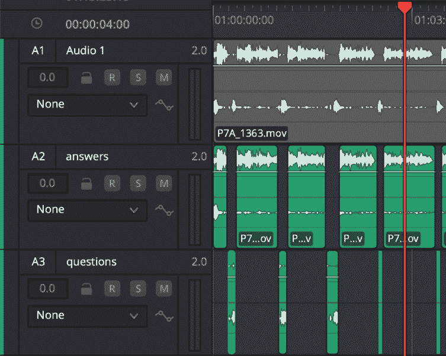

图 11.5 – 重命名轨道后的输出

最好重命名轨道，无论是使用说话者的名字还是简单地使用 `问题` 和 `答案`。剪辑可能不是完美的，但它们仍然很有用，这使得应用基于轨道的效果变得容易得多。Resolve 有许多其他基于 AI 的功能——我们在 *第四章* 中讨论了一些——并且经常添加新的功能。这是一个很棒的应用程序，可以单独使用，也可以与其他 NLE（如 Final Cut Pro 或 Premiere Pro）一起使用。

但尽管 Resolve 是一个功能齐全的 NLE，较小的专业应用程序和网站也可以帮助自动化你的编辑。让我们从一些基本选项开始。

# 简单的自动编辑

即使我不是视频编辑，我也不会美化这一点：尽管这些工具中的一些可以产生节省时间的粗剪，但没有任何这些 AI 工具能够组合出一个值得观看的复杂最终剪辑。完成编辑中所投入的许多东西都是直觉的结果，是在现场获得的知识，以及在打印剧本边角上草草记下的笔记。

如果你的需求非常简单，而且你以前从未编辑过任何东西，你可能会想，你可以自己录制谈话，让 AI 选择最好的片段，然后生成一些 B-roll 来说明一些观点。实际上，我们之前已经查看的一些解决方案强调了生成性的一面，包括 HeyGen，它将生成 AI 说话者和 AI B-roll，从你提供的脚本（或另一个 AI 编写的脚本）中创建视频。

这不是我们的重点；我们试图将真实人物的原始素材编辑成好的剪辑。但遗憾的是：准备好失望吧。编辑有太多的变量，AI 第一次可能无法全部正确处理，可用的交付方法意味着可能不容易纠正创建的问题。

每个编辑器移除的咳嗽声、“嗯”或沉默都需要思考和仔细的时间安排。你是在试图完全掩盖编辑，计划用 B-roll 来掩盖它，还是这是一个特别感人的时刻，你需要保留所有内容？围绕编辑的暂停应该有多长才能最好地服务于这个编辑所传达的叙事？

如果你注意到大约 30 秒时提出的观点与大约 1 分钟后提出的观点相似，其中一个应该被删除，但你认为你无法干净地删除客户想要的那个，怎么办？对于所有这些问题，没有完美的答案，即使是按照“ house style”剪辑，每个视频也需要某种独特处理。尽管大多数人类不是视频编辑，但我们都已经看过很多视频内容，我们知道当我们听到和看到不好的编辑时。

然而，AI 可以帮助你移除明显的错误或重复的台词来构建一个粗略的剪辑。如果你有一个较长的采访片段，你可能会发现让 AI 剪掉不好的部分（咳嗽、采访者的问题等）以便你更快地到达工作好部分是有价值的。

要创建一个样本剪辑，我录制了自己对着摄像机讲话 1 分 41 秒，包括长时间的停顿、短时间的停顿、咳嗽、思维停滞和重复的台词。为了挑战音频处理能力，我没有使用外置麦克风，并且适度的风增加了适当的难度。这成为了我发送给所有测试的自动编辑服务的主要测试剪辑。

为了提供一个比较的基准，我也自己进行了编辑，剪掉了不好的部分，放大以掩盖跳跃剪辑，并精心处理每一个编辑，制作出一个 50 秒的成品。在 Final Cut Pro 中，这花了我大约五分钟的时间，我预计有经验的编辑在任何现代非线性编辑器中也能在类似的时间内完成这项任务。

为了进一步测试这些应用程序的能力，我还上传了一个更长的实际采访，但重要的是要认识到，编辑任务通常不会以线性方式扩展。相反，你处理的采访越多，每个采访中可能进入最终剪辑的部分就越少。随着总输入时间的增加，编辑工作流程会显著变化，你可能不希望在较长的项目中仅仅“剪掉不好的部分”。现实世界的编辑需要你将一个人的想法连接到另一个人的想法，这是一个更微妙的过程。

对于更简单的自动编辑的理想情况是，因此，一个更长、连续的对着摄像机的片段，其中包含大量的错误、咳嗽和停顿。AI 能否弄清楚什么是好的，什么是坏的？

**Veed.io** ([`veed.io`](https://veed.io)) 是一个基于网页的视频编辑平台，它支持基于文本的编辑。我将我的主要 *1:41* 测试剪辑上传到系统中，它被转录，并选择了 **Magic Cut** 选项：

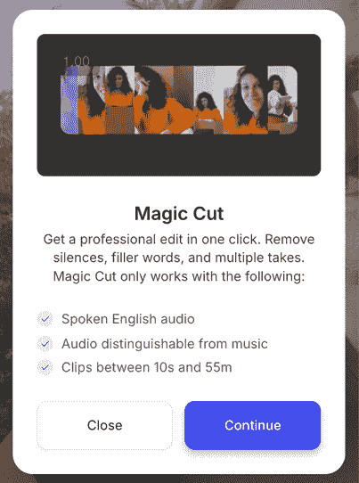

图 11.6 – Magic Cut 使基本自动编辑成为可能

初始剪辑确实发现了原始作品中的某些重复和故意犯的错误，但正如你所预期的，它并没有做得完美。一些我希望保留的停顿被移除了，一些我的话被剪得太紧，一些错误仍然保留在剪辑中。Magic Cut 并不完全符合我的需求，但它已经走了一半的路。

修正编辑很简单，因为基于文本的编辑界面清楚地显示了哪些转录内容被纳入了最终编辑。不幸的是，这种显示方式在视觉上无法区分停顿和其他噪音，如咳嗽，这使得解读稍微有些困难，但仍然容易操作。以这种方式剪辑提供了一种让非编辑人员接近最终编辑的方法，而且很快就掌握了技巧。

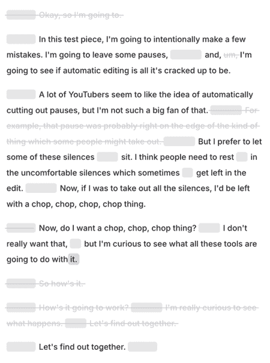

图 11.7 – Veed.io 中的基于文本的修正编辑

这里还有其他功能，包括音频清理，它做得很好，在*处理*和*不良*之间取得了不错的平衡。您还可以删除填充词，修剪静音，转换画幅比，移除背景，以及一些更高级的选项。一个让演讲者始终看向摄像头的功能对我来说效果不佳；它让我的眼睛看起来很奇怪。

虽然这里有一些有用的功能，但缺少一个功能使得该网站的使用价值大大降低。不幸的是，Veed.io 无法导出为 NLE 友好的格式，因此您必须在基于网络的界面内完成完美的编辑。因此，这个应用旨在取代视频编辑应用，而不是增强它们，而这并不是我所希望的。如果我不能将输出返回到我在 NLE 中选择的时序中，那么对我来说作为视频专业人士就没有什么用处。

我需要能够进行色彩校正，或者至少能够处理 Log 脚本。我需要能够添加自己的标题或转场。最重要的是，我需要能够精细调整编辑。基于文本的编辑对于粗剪很有用，但很难移动几个帧来使停顿恰到好处。由于几个帧可能就是普通编辑和优秀编辑之间的区别，我认为许多专业编辑都希望有时间线导出功能，这样他们就可以自己添加最后的修饰。

如果您的需求更简单，Veed.io 可能就足够了。基础计划起价为每月 24 美元（或每年 144 美元），但您需要专业计划才能进行 4K 导出和一些额外的 AI 功能，如头像和配音。

**Gling** ([`www.gling.ai/`](https://www.gling.ai/)) 是一个本地运行的解决方案，它首先会要求您在转录剪辑之前选择 AI 编辑或提取短片。在这个阶段，您可以将多个剪辑连接成多机位，甚至上传脚本。准备好一个或多个剪辑用于转录后，您将选择默认选项：

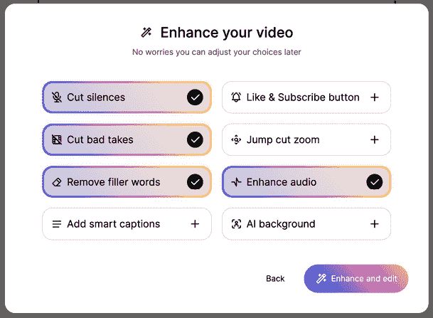

图 11.8 – Gling 提供了多种处理选项

处理完成后，这在我的测试中比运行时间要少，视频将在屏幕底部的时序图中呈现，并带有左侧的基于文本的界面。自动编辑删除了比理想中更多的暂停，但重复的短语被正确删除，以及开头的一个错误开始。

Gling 不是设计来为您执行更复杂的编辑，或者对哪个镜头最好做出判断——那是您的工作。不幸的是，暂停和咳嗽在基于文本的编辑界面中不会显示，但仍然很容易进行编辑。

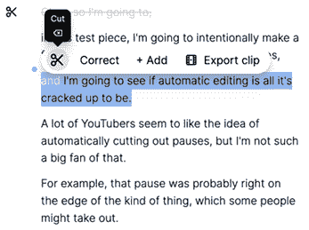

图 11.9 – 选择一条线，然后根据需要剪切或恢复它

每个包含在视频中的部分都可以使用窗口底部时间线中每个剪辑上出现的“魔法棒”图标来应用或移除效果，或者您可以使用顶部菜单中的**增强**菜单将这些效果应用到时间线中的所有剪辑。

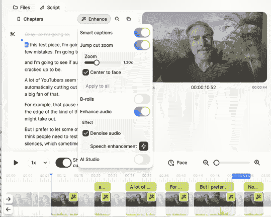

图 11.10 – Gling 的控制面板相当简单，但效果良好

除了基于文本的编辑外，您还可以直接在时间线上放大，进行逐帧编辑——如果遗漏了单词片段，这是必要的。

关键的是，在此处理之后，您可以导出到几种 NLE 友好的格式之一：FCP、Resolve 和 Premiere 都受支持。无论是闭路字幕还是开放字幕、跳跃缩放，以及您所有的编辑都将在这段旅程中幸存，但音频清理则不行——您必须自己修复。

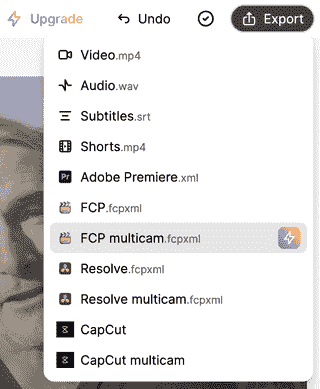

图 11.11 – 包含了多种不同的导出选项

注意，如果您使用多台摄像机拍摄，您将希望使用 Final Cut Pro 或 Resolve 以获得最佳效果，因为 Premiere 不支持多机位导出。最简单的流程是仅上传音频效果最好的角度，让 Gling 完成其工作，然后以多机位格式下载。

在您的 Final Cut Pro 或 Resolve 中，您可以打开多机位容器（您可能需要从时间线中“显示”它），然后添加并同步其他角度。返回到您的主要时间线，现在您可以手动切换角度。

Gling 并不昂贵，但您将需要一个付费计划来定期导出到 NLE 友好的格式。在免费计划上，您第一次的时间线导出是免费的，但之后，您至少需要支付每月至少 20 美元（或每年 120 美元）来使用此功能。由于您可以免费测试，您可以发送一些您的剪辑，看看 Gling 的编辑是否可以为您节省时间。

如果这些解决方案提供的灵活性不足，一些其他工具可以给出更具体的指令。让我们提示其中几个。

# 基于提示的自动编辑

**Riverside** ([`riverside.fm`](https://riverside.fm)) 是一个知名的编辑平台，具有多个支持基于网页的编辑工作流程的功能。通过基于提示的 **Co-Creator** 功能，我请求了一个大约 50 秒长度的输出，并且它智能地确定了要包含的内容，做得相当不错，但有些短语剪裁得太紧，剪掉了部分单词。我的后续提示有时成功，有时不成功。

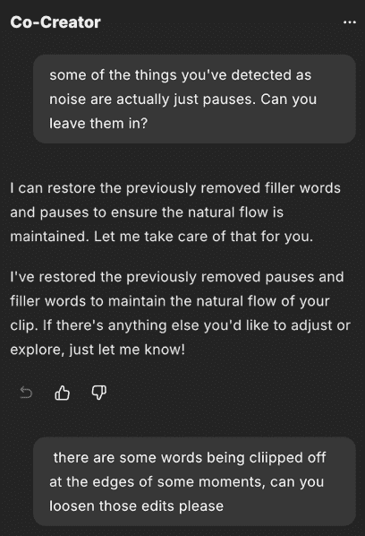

图 11.12 – 使用 Co-Creator 提示略带不可预测性

在上一图中的第一个请求中，AI 无法调整检测到噪声的暂停容忍度，并将明显的咳嗽重新添加到编辑中。在第二个请求中，编辑中被剪掉的具体单词没有被恢复。尽管如此，能够请求特定时长的工作得很好，作为第一步，使提示变得多样化。幸运的是，基于文本的编辑界面非常全面，使得从成品中添加或删除转录部分变得容易。

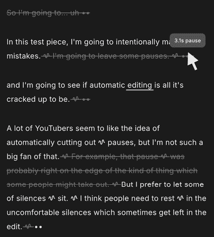

图 11.13 – 当你悬停在暂停（…）上时，Riverside 会告诉你它有多长，噪音通过波浪线显示

此处的基于文本的编辑在复杂度上比 Veed.io 和 Gling 都要高，因为它可以区分咳嗽和暂停，甚至可以告诉你暂停有多长——只需悬停在其上。请注意，背景噪声可能导致沉默和暂停被混淆；一如既往，更好的输入质量会产生更好的结果。

在关于音频 Gen AI 的早期章节中简要提到了 Riverside 的一个名为 **VideoDub** 的功能，如果你想尝试，选择一个单词，然后在上面的 **VideoDub** 中选择。你可以输入一个替换单词，新一代将取代原始音频。遗憾的是，这对我来说效果不佳，因为生成的合成语音与我自己的声音不匹配。

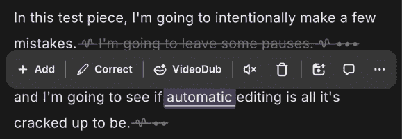

图 11.14 – VideoDub 可能对你很有用，但音频听起来不像我的原始语音

除了基于提示的 Co-Creator 之外，你还会发现其他 AI 工具，用于去除暂停、填充词（或“废话”）、提高音频质量、强制眼神交流等。不幸的是，音频清理功能的品质并不出色，对我来说，听起来相当经过处理。

优点在于，窗口底部的时间线界面非常灵活，允许精确控制每个编辑放置的位置。如果你对仅网页的界面感到舒适，并想在这里做大部分编辑，Riverside 可能适合你。

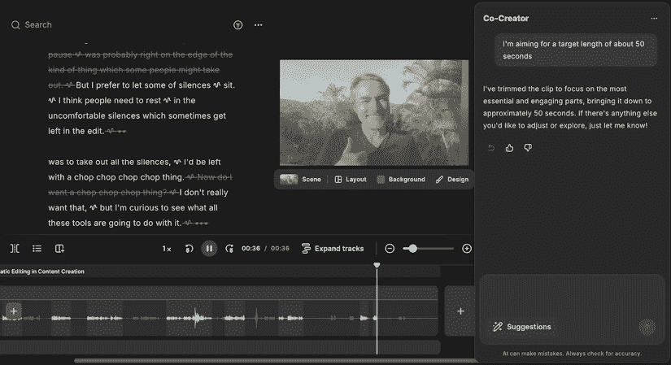

图 11.15 – 在 Riverside 中的编辑工作流程考虑得非常周到

不幸的是，如果你是视频专业人士，这个工具并不提供 Gling 在时间线导出方面的相同灵活性。仅支持导出到 Final Cut Pro 和 Premiere Pro 的时间线（不支持 Resolve），并且都不包括多机位支持。更糟糕的是，这个功能仅支持在商务计划中，其固定价格没有显示。没有时间线导出，Riverside 无法像 Gling 那样轻松地融入现有的视频编辑工作流程。Pro 计划的费用起价为每月 29 美元（或每年 288 美元）。

**Descript** ([`www.descript.com/`](https://www.descript.com/)) 是我们在生成音频的背景下考虑的一个应用程序，但其中还隐藏着一个完整的可提示视频编辑系统。与其他系统类似，在您上传源剪辑后，它们将被转录并在基于文本的编辑界面中显示。

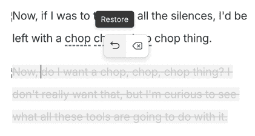

图 11.16 – 暂停用垂直线（|）表示，但咳嗽没有显示

这里的一个优点是，这些文字也显示在窗口底部的时间轴上，这使得在视频中找到特定的文字变得容易。波形最初是隐藏的，但可以通过快速点击其中一个文字来显示。

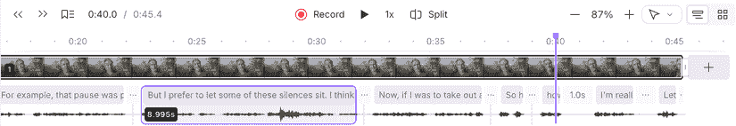

图 11.17 – 时间轴上的文字是一个有用的补充

展示了几个预设的 AI 工具，包括**清晰编辑**、**工作室音效**以及去除填充词或重拍的工具。我发现这些预设选项并没有达到我期望的效果；并非所有重复都被找到，并非所有咳嗽都被移除，并且在应用了**工作室音效**后，音频质量相当粗糙——对我来说太强烈了。

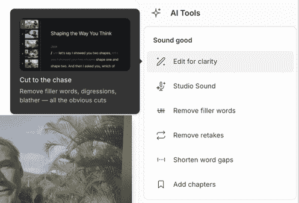

图 11.18 – 帮助你开始的预设

然而，在我的测试中，基于提示的系统似乎做得更好。助手被称为**Underlord**，这个名字听起来像是一个奇怪的品牌选择，但它运作得相当不错。我要求将总长度裁剪到 50 秒，并且它设法保留了视频的大部分正确部分，并裁剪了其余部分。并非每个决定都是我想要的——有时咳嗽被移除，而没有移除它之前的部分句子——但它已经很接近了。

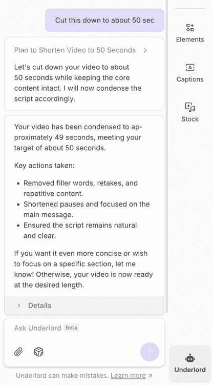

图 11.19 – **Underlord**对英语语言请求做出响应，比预设选项更灵活

尽管我试图通过与 Underlord 交谈来纠正一些错误，但它并没有完全做到我想的那样。如果你想要简单的事情，你可能最好自己来做。

虽然 Descript 设法很好地放置了编辑，没有剪掉任何单词的边缘，但我确实发现一些本应剪掉的片段被留下了。通过转录本进行编辑很容易，允许你仅使用鼠标或通过键盘快捷键恢复被剪掉的单词或删除额外的单词。

当你完成编辑后，你可能希望将其导出为时序友好的格式，并在你的 NLE 中进行最终剪辑，但这需要创作者层级或更高层级的付费计划，每月 35 美元（或每年 288 美元）。不支持多机位，因此它可能不适合多机位拍摄。如果你使用 Descript 进行其他目的，那么 Underlord 可能很有用，但我怀疑严肃的编辑工作可能更适合使用艾迪。

**艾迪 AI** ([`heyeddie.ai`](https://heyeddie.ai)) 是一个带有本地应用、支持基于提示的交互和 AI 驱动的粗剪的服务。此外，它不仅允许将内容导出到所有常见 NLE 的时序中，还可以从它们中导入。你现在可以选择几个选项，但我预计它们很快就会改变。即将推出的选项允许提供 URL，艾迪可以从中学到更多关于视频主题的信息，但如果你愿意，也可以直接聊天。

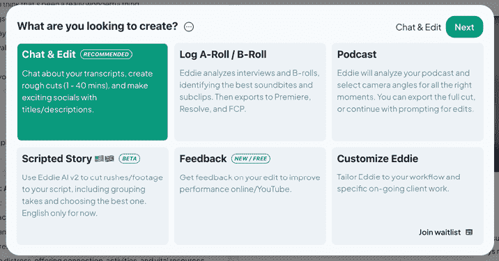

图 11.20 – 在艾迪中开始编辑的几种方式

艾迪至少需要 5 分钟的素材才能开始工作，这使得进行基本测试变得有点困难，所以我通过提供更长的测试访谈来稍微加大了力度。虽然可以上传包含较短剪辑重复的时序，但艾迪的优势并不在于简单地去除咳嗽和停顿。它不会添加缩放以掩盖跳切，也没有传统的时序可以自行调整。

艾迪的目标是成为一个更远的助手，并且能够处理更复杂的任务。

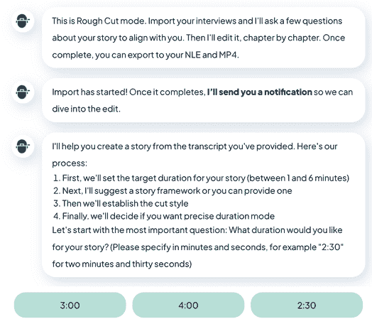

图 11.21 – 艾迪中的粗剪开始

通过接受视频编辑应用中的现有素材，包括直接从 Final Cut Pro 来的单个剪辑和多机位剪辑，将它们集成到现有的视频编辑工作流程中变得容易得多。为了避免上传多 GB 的源文件，我首先对剪辑进行了转码，但我不必这么做；艾迪自动完成了同样的工作。

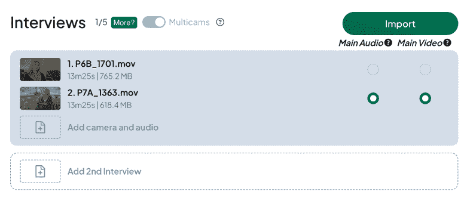

图 11.22 – 在转码前将两个源剪辑合并成一个单机位

基于 AI 的粗剪在处理某些类型的访谈和摄像机前的演示时表现良好，但与其他类型相比则不太理想。尽管可以一起上传多个访谈，但 AI 无法确切知道哪些句子最重要，并且可能会选择不太理想的答案。

最后，人类编辑可能不会在第一次尝试就为特定的视频片段挑选出最好的答案；这个过程需要深入了解主题，有时甚至需要客户亲自查看转录本。讲述故事是人类的任务，而 AI 并不理解什么是有价值的。

尽管如此，Eddie 做对了所有正确的事情；不仅仅是猜测，在继续之前还会询问更多信息。它询问了目标长度，是否想要排除采访者——这是正确的问题。然而，尽管它开始于我拍摄过的最好的一次采访之一，但它第一次尝试并没有将最好的部分组合成一个故事——它怎么可能呢？它不是人类。它不能从转录本中读出情感。它错过了魔法，尽管它诚实地并没有做得太差。

在所有这些工具中，Eddie 提供的选项提供了最大的灵活性，但人类仍然需要创作故事。人类需要倾听，不仅仅是听他们说的话，还要听他们是如何说的。Eddie 可能会很快提出一个不错的编辑，但同样，也可能不会。复杂的工作需要更多的计划和思考，而且将不同对话的零散线索结合起来创造一个更宏大的叙事并不容易。

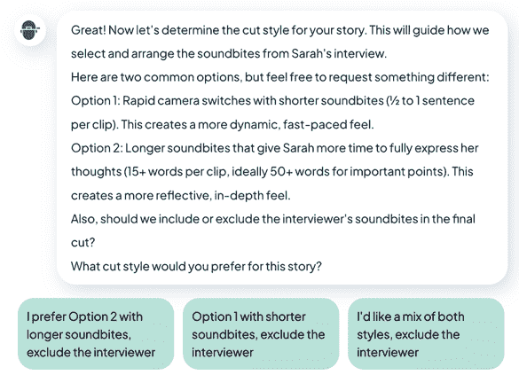

图 11.23 – 从预设按钮中选择，或者如果你喜欢，可以输入自己的回复

令人兴奋的消息是，因为 Eddie 倾向于提示并鼓励对话，你可以要求它进行重大、详细的更改。你不会被排除在外；你对原始素材了解得越多，你得到好结果的可能性就越大。例如，如果你知道你想要包含某一行，你只需要求它，Eddie 就会找到并为你添加它。将 Eddie 视为一个合作伙伴，它将根据你的请求修改其编辑。预设按钮允许你要求基本选项，或者你可以在文本输入字段中输入其他内容。

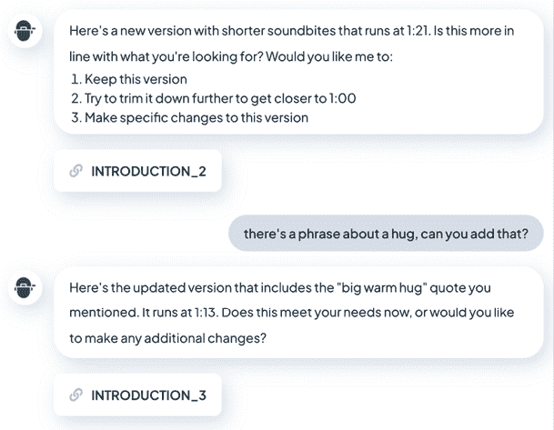

图 11.24 – Eddie 会问很多问题，你也可以向它提问

当你通过提示与系统交谈时，Eddie 会带你浏览它为你准备的不同编辑部分，并询问你是否对它的成果满意。没有时间表需要烦恼，尽管你偶尔会看到一份转录本，但更改是通过你直接请求或通过你对它的提问来进行的。如果你不确定，让 Eddie 剪掉较长的部分而不是较短的，这将给你在稍后进行最终剪辑的灵活性，但你的行为将更像是一个导演或制片人，而不是编辑。

有趣的是，这个系统拒绝去除“嗯嗯”以保留真实性。我尊重这一点，如果需要的话，我可以自己去除它们——毕竟，这也是我拍摄多个角度的原因之一。

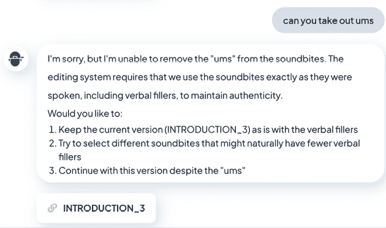

图 11.25 – 我尊重爱迪拒绝去除嗯嗯

尽管我仍然想在自己的编辑应用中进一步润色最终剪辑，但我确实可以看到它在较长的访谈或中等复杂编辑中的用途。如果客户要求包含特定的答案，我无需找到那些词的确切位置。如果爱迪可以通过搜索转录本来找到它们，它就会找到并为我添加它们。它选择省略的那个句子？只需要求即可。

您可以要求更长的剪辑、更短的剪辑、更多的剪辑、更少的剪辑——无论这个故事版本需要什么。如果您喜欢，可以用作预编辑工具，或者尝试讲述整个故事。一次处理多个剪辑，或者按您喜欢的顺序逐个处理。

在所有交互式编辑之后，爱迪能够组装出一个不错的粗剪——有点长，但作为进一步剪辑的起点或与其他编辑访谈集成的原始素材都是一个很好的起点。

剪辑以视频形式展示，您可以在应用中观看，也可以阅读转录本，或者简单地拖动图标并将其放入您的编辑应用中。

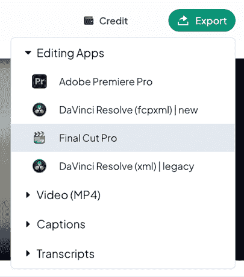

图 11.26 – 从各种不同的格式中选择，然后拖动离开

那个 XML 文件可以作为一个单角度的多机位剪辑交付，甚至可以设置一个由多个剪辑组成的多机位剪辑，通过音频同步给您，它引用的文件可以链接回您原始的全尺寸媒体。现在您可以自由地选择角度并进行精细调整。是的，还有一个参考 MP4，但您可能希望从自己的 NLE 中导出最终版本。

与 FCP、Resolve 和 Premiere 的集成是现成的，您可以将剪辑拖到爱迪中，或者将完成的编辑拖回另一个方向。方便的是，您还可以将完成的时序拖动到爱迪中，然后要求它剪出一些适合社交媒体的时刻。这可能不是编辑中最困难的任务，但我相信许多编辑会欣赏这一点。

说实话，爱迪让我感到惊讶。尽管这种方法与其他应用在这里的方法真的很不同，但它的功能可能对严肃的编辑来说比我所查看的其他应用更有用。虽然 Gling 可能对粗剪更可预测的片段很有用，但爱迪是唯一一个将提示与 NLE 时间线导出相结合的解决方案，这非常受欢迎。

费用从低开始，但可能会变得昂贵。Plus 计划起价为每月 25 美元（或每年 252 美元），每月允许从 4 个不同的项目中多次导出。如果您需要更多，Pro 计划起价为每月 125 美元（或每年 996 美元），每月允许从 10 个项目中多次导出。

**使用 AI 操作 XML**

自动视频编辑并不是唯一一种使用 AI 辅助视频编辑过程的方法，但它是最容易接触的。虽然可以使用 LLM 来处理描述编辑时间线的文本文件，但这个过程最终变得相当技术性，并且容易出错。虽然这里有很大的潜力，但我认为这个过程对大多数编辑来说太复杂了，难以遵循。

仍然，如果你好奇想要探索，可以从 Peter Wiggins 的这段视频开始（[`youtu.be/ixoJdNL4RpM?si=VMgoydkvIVbL-pkB`](https://youtu.be/ixoJdNL4RpM?si=VMgoydkvIVbL-pkB)），然后继续观看他的其他视频。

# 摘要

这个空间比我预期的要复杂，展示了各种各样的工具和能力。简单的编辑任务可以通过这里的几个工具完成，但如果你有更复杂的任务，你的选择会少很多：

+   如果你只需要从镜头到成品视频，那么 Veed.io 或 Riverside 可能适合你，但如果你需要时间线，他们要么无法提供，要么为此收费很高。

+   Gling 为特定 YouTube 博主面对镜头的问题提供了一个很好的解决方案，如果你经常处理较长的项目，其基于文本的编辑加上 XML 导出可以为你节省大量时间。

+   虽然 Descript 允许更复杂的请求，但由于它不导出多摄像头格式，所以它并不适合需要这种格式的任务。

+   虽然 Eddie 不太适合短期的任务，但它可以在大型项目以及更复杂的编辑任务上节省大量时间。我对它如何理解我的请求感到惊讶，并对结果感到满意。

这些产品针对不同的受众，我建议尝试几个，看看哪一个最适合你。这个空间比我预期的要复杂得多，鉴于现有的视频编辑工作流程的深度和多样性，你可能会想亲自测试这些解决方案中的几个。

最后，我们来到了这本书的最后一章。是时候看看代理和数字助手如何帮助我们今天以及未来几年了。

|

## 获取本书的 PDF 版本和独家额外内容

扫描二维码（或访问[packtpub.com/unlock](http://packtpub.com/unlock)）。通过书名搜索这本书，确认版本，然后按照页面上的步骤操作。 |  |

| **注意**：请妥善保管你的发票。直接从 Packt 购买的产品不需要发票。* |
| --- |
