# 第十二章：数字助手和代理的自动化人工智能

当 Siri 和谷歌助手等现代语音驱动数字助手最初推出时，它们看起来像是魔法，但它们能力的局限性很快变得明显。尽管数字助手在创建约会和提醒、启动应用程序和口述信息方面仍然非常有用，但像 ChatGPT 这样的现代 LLMs 甚至可以做更多的事情——甚至包括语音。为什么我们的数字助手没有简单地被 LLMs 取代呢？

这个问题的答案很复杂，是隐私、可靠性和成本担忧的混合体。无论如何，这个过程已经开始了。似乎不可避免的是，谷歌助手最终将被 Gemini 完全取代，而 Siri 将变得更聪明。

今天的基本助手不可靠是它们没有被更广泛使用的关键原因，而隐私是 LLMs 的关键争议点。成本也是一个担忧，使用通用 LLMs 来回答数字助手的所有当前请求需要显著提升计算能力。

尽管挑战巨大，但潜在的影响也同样巨大。在本章前瞻性的内容中，我们将探讨数字助手在未来几年内可能的发展趋势，创意专业人士如何可能发现它们的有用之处，以及为什么许多之前尝试将人工智能工具整合到我们日常生活中都失败了。

现代操作系统目前正在适应一个未来，其中大型语言模型（LLMs）在我们的计算生活中有更紧密的整合位置，自动化潜力巨大。虽然今天你使用的每个应用程序都不一定能自动化，要么是因为它们没有为此做好准备，要么是因为过程对大多数人来说过于繁琐而难以管理，但这种情况即将改变。

在本章中，我将区分**数字助手**和**代理**，前者遵循简单的指令，后者为你执行一系列任务，有时包括具体行动。中间可能存在一些模糊性——你可能会要求数字助手执行代理任务，但就目前而言，这是一个很好的划分点。

你可能已经以某种方式与人工智能代理互动过了，很可能是通过自动电话系统。以前只在大公司中存在，如今，个人可以创建用于自己使用的代理，或者代表客户与他们交谈。代理可以帮助你完成创意任务，如市场营销，执行并总结研究，提供交谈对象，或充当虚拟呼叫中心。

虽然今天的 LLMs 乐于为你进行研究，但代理执行更复杂的任务，如规划你的日程、预订假期或购买午餐并送货上门。有些人永远不会信任 AI 处理他们的信用卡信息，但我确信许多人会，而且人类与决策的距离越远，风险就越大。

代理工具不仅对创意专业人士有用，而且它们很可能是公众 AI 叙事的重要组成部分，值得一看。今天，从主要的 AI 提供商那里可以获得标有“代理”的工具。此外，将 LLM 直接集成到浏览器中（就像 Atlas 现在将 ChatGPT 集成到其浏览器中一样）可以带来额外的代理能力，在你观看的同时填写表格或完成购买。

在这本书的大部分内容中，我试图关注实用、可测试的解决方案，但随着代理故事的构建仍在进行中，这一章节将目光投向了更远的未来。代理和我们的未来数字助理都很重要，但这个故事的部分内容仍在测试阶段。

在这一章中，我们将探讨以下内容：

+   数字助理，今天和未来

+   AI 驱动的可穿戴设备

+   AI 驱动的浏览器

+   代理：为你执行复杂任务

这是一个多角度的故事，涵盖了移动、桌面和语音交互模型。让我们从数字助理开始。

# 数字助理，今天和未来

当你要求今天的数字助理为你做某事时，通常是在单个应用程序中执行的一个简单操作：设置定时器、拍照或在你回家时提醒你任务。语音是这一套件中的变革性部分，因为它允许你在屏幕太小不方便操作或你正忙于其他事情时执行任务。

与 Siri 或谷歌助手相比，ChatGPT 和 Claude 等 LLM 更智能，那么为什么它们不能做今天数字助理能做的所有事情呢？首先，因为它们无法访问所有相同的数据，其次，因为基于新 LLM 的系统必须处理当前系统几乎能处理的所有事情，否则一些用户将拒绝使用它。

这种“部分替代问题”已经在一些从谷歌助手过渡到 Gemini 作为内置语音助手的谷歌手机上显现出来。如果一个曾经由谷歌助手明确处理的简单任务（比如设置闹钟）在 Gemini 处理得不够好，这在许多人看来就是失败。替换现有系统很困难，替换数十亿用户使用的数字助理更是难上加难。

尽管如此，似乎数字助理最终将被升级到能够执行代理所能做的许多事情的程度。Gemini 正在这样做，Siri 预计也会这样做，甚至微软的 Copilot 现在也有一个可选的友好、类似 blob 的面部表情，名为 Mico ([`arstechnica.com/gadgets/2025/10/microsoft-makes-copilot-human-centered-with-a-90s-style-animated-assistant/`](https://arstechnica.com/gadgets/2025/10/microsoft-makes-copilot-human-centered-with-a-90s-style-animated-assistant/))。

这不是微软第一次尝试数字助理。以下是一些过去的尝试：

+   在 20 世纪 90 年代的 Microsoft Word 中，有一个名为**Clippy**的动画回形针，因其“*看起来你正在写信*”而闻名。

+   **微软 Bob** ([`en.wikipedia.org/wiki/Microsoft_Bob`](https://en.wikipedia.org/wiki/Microsoft_Bob)) 是一个短暂的尝试，旨在为 Windows 3.1 提供更友好的用户界面，引入了一只名为 Rover 的卡通狗和 Comic Sans 字体。这个产品在 1995 年 3 月推出，但在同年 8 月就停产了。

+   **Cortana** ([`en.wikipedia.org/wiki/Cortana_(virtual_assistant)`](https://en.wikipedia.org/wiki/Cortana_(virtual_assistant))) 是微软最新的尝试，首次在 2014 年展示，但它在 2023 年被 AI 驱动的 Copilot 所取代。

虽然传统的数字助手可以访问你的本地数据，如联系人电子邮件，但基于云的 LLM 没有相同的权限。我们每个人都在手机上存储了大量的个人数据，我们不希望这些数据被公开。相比之下，与 LLM 的聊天（至少在免费账户中）通常被用来进一步训练这些 LLM。

在一个大多数大型科技公司（苹果公司除外）通过向广告商出售你的个人数据来赚钱的世界里，许多人对于将他们的日历、文件和电子邮件托付给第三方持谨慎态度。他们也有理由担心，如果错误的文件被一个故障的 AI 删除，可能会导致数据丢失。

苹果公司对此的反应是缓慢而谨慎，但苹果智能的功能设计时考虑到了隐私。最简单的任务在设备上运行，而更复杂的任务则在苹果自己的私有云计算环境中运行，苹果公司本身无法访问该环境 ([`security.apple.com/blog/private-cloud-compute/`](https://security.apple.com/blog/private-cloud-compute/))。

即使 LLM 提供了今天数字助手的所有功能，并且隐私问题得到了解决，还有一个第三问题：如何与所有你的应用交流。Siri 或 Google Assistant 可以处理与常见操作系统功能相关的基本任务，如电子邮件或消息，但第三方应用必须明确告诉系统它们可以做什么以及如何使用这些功能。LLM 不仅需要这种知识，还需要一种简单的方式来告诉这些应用执行操作。

今天，这个过程在一定程度上是手动的，需要构建自定义自动化。例如，如果你想从 Siri 那里获得更多功能，你可以创建一个*快捷方式*（在系统级自动化引擎**Shortcuts**中），它可以在一个或多个应用中执行操作，然后通过你的声音来触发它。或者，在桌面平台上，你可能依赖于脚本支持，甚至模拟点击或按钮按压。并非所有应用都支持快捷方式或脚本，模拟按钮按压是容易出错且不可靠的。

简而言之，当今大多数自动化系统都是刚性和脆弱的；它们容易崩溃。一种通用的方法，让大型语言模型（LLM）理解和控制任何应用程序，可能意味着人工智能（AI）最终可以开始为我们做更多的工作。自 2016 年以来，苹果平台上的应用程序已经能够声明*App Intents*，这些声明描述了它们可以执行的功能、它们期望作为输入的数据以及它们将提供的输出。这些不是面向人类的；它们是为了帮助应用程序相互交流。

苹果还将*基础模型*（基本的 LLM）集成到系统级自动化系统 Shortcuts 中。在最新的操作系统中，苹果智能允许你从设备上的模型、苹果服务器上的私有模型，甚至是 ChatGPT 生成输出，然后对输出进行操作。虽然许多 LLM 的输出是纯英文，但如 JSON 这样的文本格式允许灵活的跨应用程序通信策略。

这里有一些你可以使用的例子：[`appleinsider.com/inside/ios-26/tips/how-to-use-apple-intelligence-in-shortcuts-to-save-time-every-day?utm_medium=social&utm_source=threads`](https://appleinsider.com/inside/ios-26/tips/how-to-use-apple-intelligence-in-shortcuts-to-save-time-every-day?utm_medium=social&utm_source=threads)。基础模型是 LLM 和今天的自动化解决方案之间有用的桥梁，但它们并不一定打开通往全面系统控制的闸门。

一些即将推出的系统可能更加全面。让我们快速浏览一下现有计算机系统可能被 AI 工具控制的一些方式。

## MCP：跨平台未来自动化系统

如果数字助手将要承担更多的代理属性，LLM 将需要能够更直接地与应用程序交互，这就是 Anthropic 的**模型上下文协议（MCP**）([`modelcontextprotocol.io/docs/getting-started/intro`](https://modelcontextprotocol.io/docs/getting-started/intro))发挥作用的地方。虽然*App Intents*和*基础模型*仅限于苹果，但 MCP 是一个跨平台解决方案，它将大多数 LLM 连接到允许的数据源和应用程序，提供了一个新的、安全的连接层。

理论上，如果一个操作系统支持 MCP，并且该系统上的应用程序支持 MCP，那么 LLM 可以为你控制应用程序，执行比今天的数字助手或自动化技术更多的任务。确实，这非常接近代理的领域，而且这可能是我们最终要走向的方向，但这种控制水平也将允许 LLM 为你直接执行更广泛的各种简单任务。

这有多远？我们无法确定，但初步的 MCP 支持预计很快就会出现在 macOS 和 iOS 上（[`appleinsider.com/articles/25/09/22/ios-26-could-get-a-major-ai-boost-with-the-model-context-protocol`](https://appleinsider.com/articles/25/09/22/ios-26-could-get-a-major-ai-boost-with-the-model-context-protocol)），它也将来到 Windows（[`developer.microsoft.com/en-us/windows/agentic/`](https://developer.microsoft.com/en-us/windows/agentic/)）。细节尚未最终确定，但幕后有进展。

有趣的是，一个名为**Sky**的基于 Mac 的 AI 自动化工具（[`openai.com/index/openai-acquires-software-applications-incorporated/`](https://openai.com/index/openai-acquires-software-applications-incorporated/)）最近被 OpenAI 收购，因此我们可以期待在这个领域取得进一步的进展。

由于我们的所有应用、操作系统和 LLM 都将在 MCP 准备好之前需要一些时间，一个中间步骤可能是让 AI 工具为我们驱动电脑，使用标准的人类用户界面。这项工作正在进行中，但如果 AI 能理解我们的软件是如何工作的，我们能否要求它查看我们的屏幕并教我们如何使用新应用？当然，如果电脑知道我们的软件是如何工作的，这应该很容易……对吧？

## 桌面应用的 AI 辅助

**Gemini Live** ([`gemini.google/overview/gemini-live/`](https://gemini.google/overview/gemini-live/)) 可以观察你使用电脑的情况，然后根据你所做的事情给出有针对性的回答。其他系统也能做到这一点，但 Gemini Live 是公开可用的，并且易于访问——如果你喜欢，可以试试看。

虽然这听起来很棒，但它远非完美，很快就会变得令人沮丧。本质上，AI 系统对程序手册的理解程度相当于一个阅读过手册但不是专家的人。

我通过让 Gemini 观察我使用 Adobe InDesign，省略问题中的重要细节，并观察它是否能引导我找到最佳答案来测试这一点。我多次亲自或通过屏幕共享和视频通话教授学生设计和视频应用，所以我清楚预期和答案应该是什么，但新手可能不会。

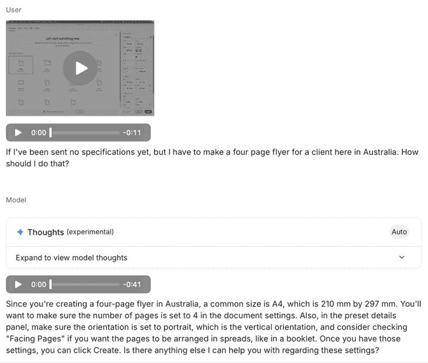

图 12.1 – 这是 InDesign 中的启动屏幕，包含我的基本问题和回答

当我暗示自己身处澳大利亚时，Gemini 正确地建议了 A4 作为常见的页面尺寸。这正是我所期望的，但我更希望 Gemini 能识别出我的位置并自行意识到这一点。更令人不安的是，尽管我说我在制作传单，但它直到我明确表示要打印 2000 次时，才想到要提到包括 3 毫米出血。

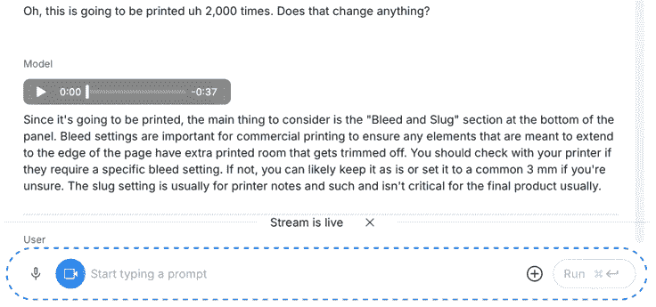

图 12.2 – 装订出血对于大多数专业印刷文档来说很重要，而且应该在我提醒之前就提到

从一些建议的表达方式来看，感觉我就像是被一个刚刚学会使用这个应用的人引导，而不是一个对应用非常熟悉的人。一个新手用户很容易遵循这些指示，却可能走向灾难——AI 并没有真正理解最佳实践，只是简单地回答了提出的问题，而不是提供真正需要的信息。

在 Ripple Training 的马克·斯宾塞（Mark Spencer）进行的一个类似实验中（[`youtu.be/dCj7-BgjlOI?si=0VJDPYEvW8j29hIU`](https://youtu.be/dCj7-BgjlOI?si=0VJDPYEvW8j29hIU)），他试图让 AI 教他使用 Final Cut Pro，我认为可以说他的体验比我更糟糕。

虽然它做了一些正确的事情，但也有很多错误，提到了不存在的按钮和快捷键。马克是一位专家，他知道他问的所有问题的答案，但一个新手可能会尝试、失败，然后放弃。

在学习过程中，阅读手册是不够的；你需要*有见地的经验*。参考手册和教学手册之间存在巨大的差距，人类需要以更有机的方式进行教学。软件公司通常会教授执行功能的“官方”方式，但知道某个功能不正常的有经验的培训师会足够聪明地告诉你这一点。

今天，我无法推荐让计算机教你如何使用软件，这与*简单模式*相比。当计算机连如何可靠地告诉我如何做都做不到时，我怎么能期望它为我完成任务呢？为了为我完成任务，AI 需要确保每一步都正确无误，而早期的基本错误可能会导致后续出现巨大问题。

持续的不可靠性是 AI 尚未（可能永远都不会）准备好取代人类完成所有这些任务的一个巨大原因。是的，MCP 可以使这个过程更快、更简单，但如果这种速度没有伴随可靠性，我们就无法信任 LLM 处理我们所有的数据。让我们进入统计学来了解原因。

## 可靠性：你需要多少个 9？

一个常用来衡量计算机系统可用性高标准的术语被称为**五个 9**，意味着它有 99.999%的时间可用，或者说一年中只有超过 5 分钟的停机时间。让我们将这个指标应用到 AI 系统的可靠性上。

如果一个系统在 100 次决策中犯了一个错误，那么它的可靠性是 99%——两个 9。一个在 100,000 次决策中犯一次错误的系统将是 99.999%可靠的——五个 9。那么，在提供建议时，系统需要有多高的可靠性？

在接受建议时，我仅仅期望这些建议*大部分*是可靠的，我可能甚至不需要达到两个 9（99%）的可靠性。但是，屏幕监控的 AI 还远远没有达到两个 9；如果你比较屏幕监控系统的声称知识与专家告诉你的内容，它们可能只有大约 80%是正确的，这远远不够。坦白说，如果一个人告诉我的 20%是错误的，我就不会信任他们，并且我会完全停止听他们的话。

但是，提供建议的成功门槛比执行任务要低，而大型语言模型（LLMs）是出了名的会幻想、在压力下恐慌、忽略指令。当你要求某人替你完成工作时，他们必须按照你的标准来完成。

因此，如果你将一个小型办公室的工作交给初级同事，你可能能够容忍一些错误。如果你可以自己检查结果，那么不完美的结果可以被纠正，无论是你自己还是通过要求同事解决问题。

这同样适用于你转交给 AI 的工作，但请记住，每个子任务都存在失败的风险。你的信心越低，你就需要越频繁地检查进度。

如果某人的工作产出失败率达到了 20%，那将是一个巨大的问题，而现在，训练用于操作常规计算机的 AI 模型在基准测试中通常低于 80%。简单来说，我们还没有达到那个水平，根据 Sayash Kapoor 的说法，我们需要新的技术才能达到([`youtu.be/d5EltXhbcfA?si=hoajlz1CVJg351bp`](https://youtu.be/d5EltXhbcfA?si=hoajlz1CVJg351bp))。

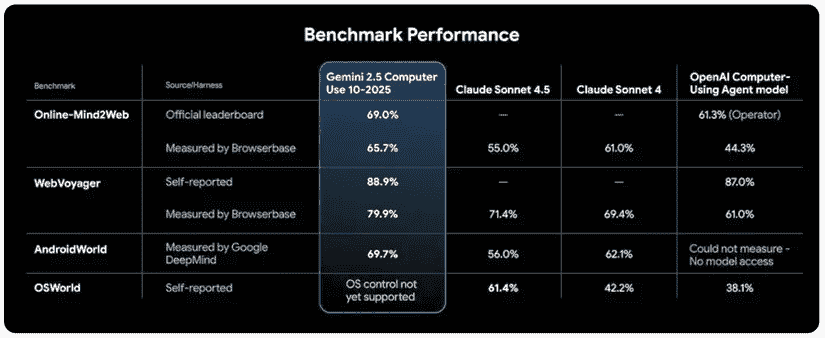

图 12.3 – Gemini 2.5 计算机使用在常见基准上的性能，来源：https://blog.google/technology/google-deepmind/gemini-computer-use-model/

随着任务的日益关键，以及验证输出所需的时间减少，可靠性变得更加重要。可靠性已经是人们停止使用数字助手的一个原因；他们要么没有正确听到，要么无法执行请求的动作，或者他们根本就没有完成。

在一些人工智能辅助的场景中，例如自动驾驶汽车，容错空间几乎为零。在道路上，通常几乎没有时间来反应汽车所犯的转向错误，而这个软件的缺陷可能很快就会导致致命。

在常规汽车中添加自动驾驶软件所面临的不确定性可靠性是一个基本问题：从“相当不错”的系统过渡到“完美”的系统非常困难。你如何安全地从不相信汽车过渡到完全信任汽车？在什么点上你可以放松？

如果软件仅仅是“辅助”的，那么人们并不期望它完美——比如说它是 99%。人类驾驶员的目的是保持警觉，并在软件出错时准备接管控制——我确实经常在我自己的车突然减速避让阴影时接管控制。然而，随着软件的改进，人类不可避免地会越来越信任它。当软件的行为正确率达到 99.999%，需要的干预更少时，人类可能会放松并停止关注。当最终出现问题时，比如汽车应该避免但未能避免的情况，人类可能无法及时反应。

公平地说，人类也不是完美的，从大局来看，平均未来的 AI 驾驶员可能比平均人类驾驶员更安全。区别在于，当 AI 犯错时，它可能犯的是人类不太可能犯的错误，比如撞到翻倒的卡车侧面。AI 从未见过这种情况，或者其传感器无法正确检测到它，但人类根本不会犯同样的错误。

数字助手面临的风险较低，但存在类似的问题，即信任问题，而且一个过程中的步骤越多，其中一个步骤失败的可能性就越高。今天，如果 Siri 无法完成某项任务，你会叹气，打开正确的应用，然后自己完成。但如果你有一个“更聪明”的系统自信地说它已经完成了，你怎么知道呢？

当他们过去经常失败时，你怎么能确保他们会正确且完整地完成任务？如果 ChatGPT 去年无法告诉你“strawberry”中有多少个“r”，你怎么能过渡到要求未来的 ChatGPT 用你的信用卡预订假期？这可能是一个大多数时候都能正常工作的任务，但每千次中可能有一次会买错机票，或者把你送到一个城市的替代（但不太方便）机场。

随着我们越来越多地将我们的数据托付给更强大的系统，我们将听到更多灾难的消息。今天，你可以将你的信用卡连接到 LLM，并要求它为你订购并送货上门——比如一瓶水。尽管这可能大多数时候都能正常工作，但考虑到风险，总会有骗子准备利用新授权的机器人。我们在自己与购买的产品和服务之间设置的自动化层级越多，诈骗的风险就越高。

目前来看，我认为数字助手和所有电脑上的应用程序和数据之间可能仍然存在坚固的障碍。我们将对提供给 AI 驱动系统的数据进行更明确的说明，数字助手将逐渐变得更加有能力。

虽然我预计来自手机主要玩家（苹果和谷歌）的数字助手将继续在这里占据主导地位，但已经有人尝试绕过这些巨头。一个由 AI 驱动的硬件设备可能来自其他玩家吗？让我们看看。

# AI 驱动的可穿戴设备

在 AI 领域的一个探索领域是创建一种新型的设备，它既不是手机，也不是手表、平板电脑或个人电脑。**Humane AI Pin**是创建一个能够听你说话并为你执行任务的 AI 驱动可穿戴设备的一次失败尝试。虽然这个设备的代理潜力是吸引人的部分，但我认为可以说这种吸引力并没有实现，AI Pin 在一年内就被停止生产了。**Rabbit R1**是另一个进入这个市场的失败尝试，尽管这并不是一个可穿戴设备，但它提出了能够代表你执行更复杂任务的主张。

在现实世界中，这些设备还没有足够地融入我们现有的设备生态系统，以至于无法打开市场。我们的大多数设备都有屏幕，而且这比仅仅使用声音传输信息要高效得多，因此，无屏幕设备在处理需要复杂人类输入的任务时可能会遇到困难。

一些今天可用的设备将目标定得稍低一些，专注于转录。它们的目标是监听你听到的所有内容，将其转录下来，然后让你与之互动，总结会议并帮助你找到对话中遗忘的细节。实际上，这些无屏幕的可穿戴设备（如**Limitless AI Pendant**）似乎还没有流行起来。

将额外的可穿戴设备融入我们的生活是件困难的事情。如果你已经拥有一块数字手表和一部手机，你可能会更倾向于使用这些设备中的任何一个来处理转录任务，而不是添加第三个设备。虽然围绕转录构建的 AI 服务只有在激活时才工作，但这可能是一个优点，因为普通人可能不愿意被持续记录。

要自己尝试，你可以使用前面章节中提到的转录应用程序之一，例如 MacWhisper，但以下是一些可以提供智能 AI 分析转录的服务：

+   Granola.ai ([`granola.ai`](https://granola.ai))

+   Otter.ai ([`otter.ai`](https://otter.ai))

+   ChatGPT（在 macOS 应用中使用*Record*模式）

回到可穿戴设备，智能眼镜似乎将成为下一个被技术升级的常见穿戴物品，尽管今天这些设备有限的视频录制功能也引发了一些问题。你能信任一个按摩师（需要她的智能眼镜来观察）不会记录她的疗程吗？虽然 Meta 的**雷朋****智能眼镜**包括一个闪烁的 LED 灯来指示相机正在使用中，但这个 LED 灯可以被遮挡，从而产生一个新的隐私问题。

在未来，当眼镜的功能变得更加强大时，用户能否在电影院看电影时佩戴智能眼镜？回到 2014 年，**美国电影协会**（**MPAA**）禁止在电影院使用可穿戴记录设备（包括当时的谷歌眼镜）（[`www.androidcentral.com/piracy-concerns-spur-google-glass-wearables-ban-movie-theaters`](https://www.androidcentral.com/piracy-concerns-spur-google-glass-wearables-ban-movie-theaters)），但当人们需要这些相同的设备来观看时，这能站得住脚吗？

时间会证明这些设备是否会取代许多人或大多数人的手机，但我怀疑我们还会在一段时间内使用多种设备。许多科技界人士推广“杀手级”设备的叙事，这些设备会完全摧毁其他设备，但除了 iPhone（及其后续克隆产品）几乎完全摧毁了传统哑手机之外，取代旧设备需要时间。

对于用户用一种设备取代另一种设备，新设备需要足够好地完成他们当前设备所做的一切。手表没有取代手机；它们只是增加了手机的功能。因为我们通过展示彼此的手机来共享信息，我不认为智能眼镜在一段时间内会完全取代手机。

AI 驱动的可穿戴市场预计将因 Jony Ive 设计的新 OpenAI 设备而动荡，Jony Ive 因其在苹果公司的工作而闻名。但除非这款新设备能做出一些惊人的事情，比现有选项更好，并且不遗漏任何重要功能，否则它将只会增加而不是取代。

总的来说，Humane AI Pin 失败的关键原因是没有屏幕和缺乏整合。虽然集成的绿色激光投影仪是创新的，但信息密度和图像质量远远低于手机，无法与之竞争。照片质量同样不足，并且没有很好地整合。

然而，新的 OpenAI 设备可能会在 AI Pin 失败的地方取得成功，仅仅是因为它背后有更多的资金，而且 ChatGPT 广为人知且被广泛使用。时间会证明一切。

# AI 驱动的浏览器

互联网最近受到了 AI 的巨大影响。由于谷歌的 AI 摘要意味着更少的访客点击到原始来源，网络出版商的流量明显下降。似乎由于多种因素的结合，AI 的影响将进一步扩大。

首先，谷歌本身几乎完全淡化了其新**AI 模式**的搜索结果。截至 2025 年 10 月底，我现在进行的任何谷歌搜索都有 AI 模式的选择，这本质上是将短语发送到 Gemini。我试了试：

```py
what's the best way to edit a video quickly in final cut pro? 
```

在我们讨论回应之前，主要问题是它不是一个精心制作的问题。如果学生问我这个问题，我会问更多问题来了解他们的问题（们），然后再提供解决方案。正如你所预期的，谷歌的回应给出了相当通用的建议，有些地方不太均匀，有时还过时。

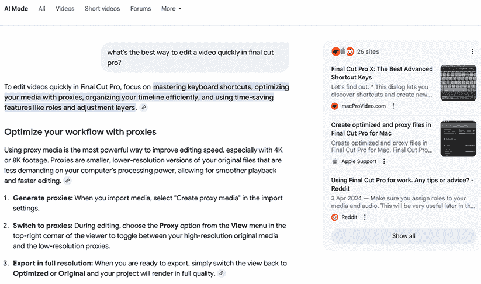

图 12.4 – 谷歌的 AI 模式对一个不完美的问题给出了不完美的回应

虽然我欣赏我写的名为《Final Cut Pro X：最佳高级快捷键》的文章是短块外部链接中链接最多的文章，但我写这篇文章已经有 10 年了。其他建议提到了非官方的*调整层*，而去年的一次更新引入了官方的*调整剪辑*，代理并不总是能帮助你更快地工作。

在任何联网的 LLM 中提出相同的问题，你都会得到类似的结果，我发现 AI 驱动的答案对于详细的问题往往能给出更好的结果。当你寻找的是 AI 时，拥有一个 AI 坐在搜索引擎旁边显然是有用的，但我认为传统的搜索仍然有价值。

随着谷歌搜索变得更加以 AI 驱动，如果你希望探索其他搜索引擎，如 DuckDuckGo ([`duckduckgo.com`](https://duckduckgo.com)) 和 Kagi ([`kagi.com`](https://kagi.com))，那么当 AI 无法快速找到好的结果时，你可能愿意尝试这些。

Comet 是来自 Perplexity 的 AI 浏览器，它接管了搜索功能，我对 Final Cut Pro 提出的问题的回应感觉像是一个随机的通用建议大杂烩。

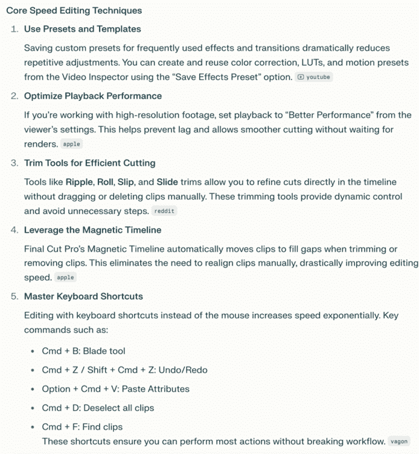

图 12.5 – Perplexity 对我提出的不完美问题提供的表达不佳的杂烩式回应

然而，AI 浏览器的真正力量在于对您正在查看的网页执行功能，而不仅仅是更好的搜索。我访问了 Reddit 的首页，从窗口的右上角调出助手，并要求它总结页面。总的来说，这是准确的，而且有趣的是，这些标题中包括 Reddit 起诉 Perplexity 的新闻（在 2025 年 10 月 23 日）：

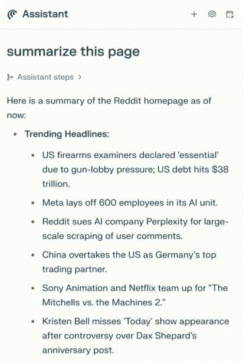

图 12.6 – 这份 Perplexity 对 Reddit 的总结包括 Reddit 起诉 Perplexity 的故事

虽然总结页面是一个明显的用途，但我怀疑大多数 LLM 制造商进入浏览器的主要原因是这将推动更多流量到他们自己的 LLM。如果你从关于第二次世界大战的维基百科页面开始，并要求内置 AI 总结关键时刻，这是方便的。如果你还想将这些信息以时间线图的形式展示，那么这就是 LLM 的领域，在这种情况下，Perplexity 最终成为你使用的工具。Microsoft Edge 包括 Copilot，我们预计那里会有进一步的整合。我也期待谷歌 Chrome 在某个时候包括 Gemini。

启动刚刚发布的（撰写本文时）**ChatGPT Atlas**浏览器（目前仅限 Mac，且仅限付费账户），它与 Comet 略有不同。您将从**主页**开始，在顶部栏中输入查询会直接发送到 ChatGPT，它乐于在其回答中引用过去的对话。与 Google 和 Comet 相比，它给出了稍微更好的答案，可能是根据我过去询问的上下文信息。

对于更传统的搜索，您必须点击位于**主页**右侧的**搜索**图标，从该页面，您可以看到带有其 AI 概览的 Google 搜索。这可能适合您，但我不确定 ChatGPT 自己的回答是否总是我最初想要的——它在我和原始信息之间增加了一层解释。

是的，一个好的 AI 摘要可能会比传统搜索更快地呈现更多信息，但有时我只是想阅读几个单独的页面全文，然后自己做出决定。Atlas 使询问 ChatGPT 变得更容易，同时使传统搜索不那么容易访问。优点在于，您可以在任何选定的文本上右键单击并将其发送到 ChatGPT 以获取更多信息、澄清或摘要，这可能很有帮助。

对于更负面的看法，这里有 Anil Dash 的评论：[`www.anildash.com/2025/10/22/atlas-anti-web-browser/`](https://www.anildash.com/2025/10/22/atlas-anti-web-browser/)。虽然我不同意他的某些观点（正如他一样，我搜索了`Taylor Swift`，结果显示了她的官方网站和其他网络资源，而他没有），但这是一个值得阅读的详细观点。

即使您不需要在浏览时使用 LLM，您选择使用 Atlas 的一个关键原因可能是它提供了**代理模式**，它承诺**接管您的浏览**并为您执行复杂任务。

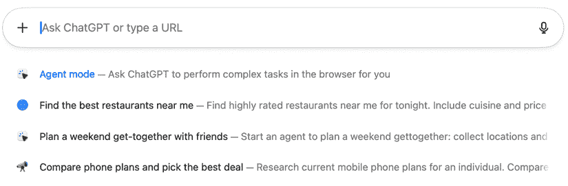

图 12.7 – ChatGPT Atlas 的代理模式

因此，这是人工智能开始为我们做事的承诺未来吗？有了我们过去与 ChatGPT 互动的历史作为指导，我们可以安全地将一些任务委托给人工智能吗？让我们在下一节中深入探讨。

# 代理：为您执行复杂任务

这里的术语已经变得混乱，让我们澄清一些术语：

+   **ChatGPT Atlas 的代理模式**是在您的计算机浏览器中运行的，ChatGPT 可以介入并接管控制。

+   **ChatGPT 代理**是一个运行在 OpenAI 服务器上的浏览器盒子。如果您愿意，可以输入您自己的个人信息，但您不是在自己的计算机上执行任务。

+   **ChatGPT 的定制 GPT**是针对特定问题特别训练的 ChatGPT 版本，您可以给它们分配代理任务。

从 Atlas 开始，我尝试使用它来研究外部 SSD 的价格，这是一项视频编辑人员熟悉的工作，并要求它创建一个包含澳大利亚前 10 款 4TB 外部 SSD 的电子表格。代表我，它查询了许多网站，要求我登录到我的 Google 账户，创建了一个 Google 表格，用有用的数据填充它，然后根据要求修改了该表格。


图 12.8 – Atlas 可以未登录或已登录开始，但如果你想使用电子表格，它会要求你登录到 Google Docs

在某种程度上，观看 ChatGPT 在完成任务时大声“思考”是非常有趣的。因为它控制着常规的 Google Docs 用户界面，在我观看时删除行和移动数据，这使得它比正常的 ChatGPT 效率低，在输入价格时犯了一些奇怪的错误。我原本期望它会维护一个内部的数据版本，然后简单地重新填充整个电子表格，但最终它还是做到了。

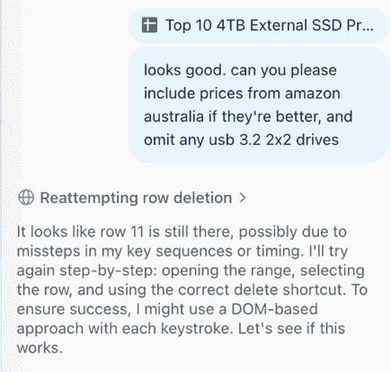

图 12.9 – 要求对原始请求进行修订花费的时间比预期更长

在另一个测试中，我询问我的家人他们晚餐想吃些什么，提出了几个具体的饮食要求，然后要求 Atlas 下单。完整请求中有四项内容，Atlas 确实在停止之前正确地将每一项都添加到了订单中。以下是部分过程，展示了 Atlas 在思考，试图弄清楚如何选择**无蛋**：

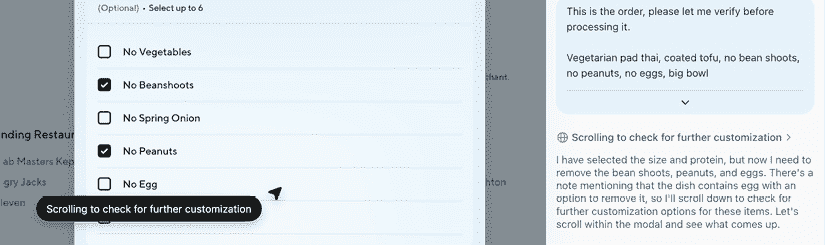

图 12.10 – Atlas 在选择饮食要求时的公开思考过程

虽然实时观看很有吸引力，但我认为这不是我经常想让 AI 做的事情，仅仅因为它不够快。整个过程花费了超过六分钟，误操作增加了大量时间，我自己来做会更快。

ChatGPT 代理以类似的方式执行类似的工作，但它在云端的浏览器中执行，而不是你的浏览器中。在这种情况下，如果你需要让它访问你自己的个人账户，它会要求你手动登录。这两种方法很相似，但 Atlas 的摩擦更少。

当 AI 被分配一项原本自己难以完成的繁琐任务时，它最有用，而在这个时候，对于人类来说，点餐比 AI 更容易。这尤其适用于你已经知道你想要什么的情况，而我并不真的想让 AI 决定我的饮食。

那么，对于结果并不固定的任务呢？如前所述，当信任 AI 执行重要任务或昂贵购买时，一些谨慎是必要的。Anil Dash（在之前链接的文章中）尝试使用 Atlas 预订航班，尽管它能够导航到购买页面，但请求的航班日期已经从他的原始请求中更改。传统的 AI 之前的搜索在这里做得更好。

作为对比，Ars Technica 给 Atlas 分配了一些低风险的任务 ([`arstechnica.com/features/2025/10/we-let-openais-agent-mode-surf-the-web-for-us-heres-what-happened/`](https://arstechnica.com/features/2025/10/we-let-openais-agent-mode-surf-the-web-for-us-heres-what-happened/))，结果大多良好。如果你想自己开始使用，请注意安全风险。如果人类会被骗点击恶意链接，LLM 当然也会——而且它可能不会像人类那样识别红旗。

AI 浏览器确实有其存在的空间，无论你是想将 LLM 的核心服务与传统网页浏览集成，还是希望拥抱代理功能，它们都值得一试。同样，如果你更喜欢使用传统的网络搜索（尽管这仍然是一个选项！），那么使用常规浏览器可能就足够了。

虽然我可以看到，围绕正式文本和固定流程构建的更可预测的工作流程具有自动化的潜力，但大多数创意工作流程都有些模糊。一些与创意工作流程相邻的代理相关工具可能对你很有价值。虽然我不会在这里探讨它们，但它们包括以下内容：

+   **运动** ([`usemotion.com`](https://usemotion.com)) 是一个流行的 AI 驱动的调度系统，它承诺为你管理时间，包括项目跟踪。在其高级计划中，它提供创建 AI 员工来管理销售、营销和其他任务（不要与 Apple Motion 混淆，这是一个与 Final Cut Pro 集成良好的、被低估的动画程序）。

+   **Notion** ([`www.notion.com`](https://www.notion.com)) 是一个 AI 驱动的办公空间，包括维基、项目跟踪、笔记和文档。它包括可以在其系统中执行任务的 AI 代理，并且可以扩展到团队规模。

+   **ElevenLabs 代理** ([`elevenlabs.io/app/agents`](https://elevenlabs.io/app/agents)) 是 ElevenLabs 的一个功能，旨在取代传统的电话应答系统。这里的流程允许你将合成声音（在前面章节中已探讨）与 LLM 连接起来，使用英语语言指令在图中引导用户交互。还包括一个测试平台。

这些工具远非市场上唯一的以代理为中心的工具，但我们已经远离了“创意”领域，所以我就此打住。

虽然我们离题了，但有一个工具并不是一个代理，但却是我们未来可能会使用的有趣例证，那就是**芝麻** ([`www.sesame.com`](https://www.sesame.com)). 目前，他们提供了一个聊天机器人的预览，有两个声音，玛雅和迈尔斯。（同名“芝麻”的移动应用似乎是不相关的骗局。）

芝麻不执行任务；它是一个仅限语音的聊天机器人，乐于交谈，充当一个回声板或帮助你处理决策。引人入胜的是，它有道德规范，我会让你自己与它聊天来发现细节。它响应迅速，听起来相当像人，是我所听到的最接近电影《她》中合成伴侣的系统。

这可能比我们许多人想象的 AI 未来更接近。看起来许多人类只是把 LLM 当作一个可以交谈的人，如果风险得到适当的缓解，它可能会非常受欢迎。

在结束这一部分之前，让我们更深入地看看另一种类型的代理，这可能是一种有用的方式来回答特定于公司或专业领域的问题和执行任务。

## 构建自定义 GPT

首先，要知道这个过程超出了本书的范围边缘，所以我只会从高层次来探讨。做好这件事是一个技术过程，但如果你有这个倾向，请随意深入研究。

构建自定义 GPT 与使用代理浏览器完全不同。本质上，这个过程让你能够构建一个 ChatGPT 的专用版本，它可以回答包含额外知识和背景的问题，并专注于特定主题领域。许多已经存在，点击 ChatGPT 侧边栏中的**探索**是一个很好的开始。

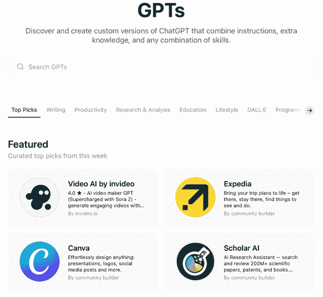

图 12.11 – 寻找灵感？许多自定义 GPT 都是公开可访问的

如果你是一家公司中的创意人员，拥有大量编码化、特定领域的知识库，你可能能够利用这些知识构建一个代理来帮助你的初级员工。也许客户可能希望你能帮助他们创建一个代理来向自己的员工提供建议？

或者，你可能希望一个自定义 GPT 能够回答与你自己的专业领域相邻领域的问题。然而，由于那是一种你尚未拥有的知识，它很可能是你从别人那里购买的产品，而不是你自己制作的自定义 GPT。

创建自定义 GPT 不是一个简单的过程，你可能需要多次尝试才能正确完成。你向自定义 GPT 添加知识的顺序很重要，如果你以错误的方式做，最终可能会得到一个根本无法正常工作的机器人。

如果你第一次尝试失败，尝试用稍微不同的内容重新构建，或者甚至以不同的顺序使用相同的内容。开发者可以使用后端 API 工具，但更用户友好的前端方法也可以同样有效，甚至更好。

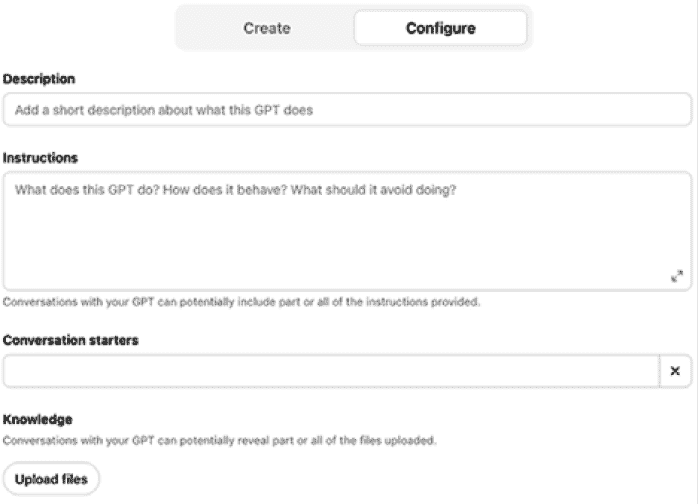

图 12.12 – 定制 GPT 创建 UI 中的部分前端配置字段

你的目标应该是缩小 LLM 尝试做的事情的范围。*原味* ChatGPT 努力成为所有人的所有事物，但定制 GPT 需要专注。

给它如何表现的指令：实际上，这是一个定制的系统提示。这应该将其限制在特定的任务集中，指导它如何与其目标受众互动以及如何交流。当然，你还需要上传包含任何机器人所需特定领域知识的文档。这可能是一套指南、流程或定制软件程序的用户手册。

一定要关注隐私。尽管定制 GPT 与付费账户相关联（并且不用于训练 ChatGPT 本身），但仍然有可能使定制 GPT *公开*。如果你包含机密公司数据，显然你需要确保它保持 *私密*。

另一方面，你可能想要创建一个对公众开放的定制 GPT。这可以通过电子邮件地址的价格分享一些你的知识，以帮助你建立自己的受众。这取决于你。

尽管如此，如果你已经创建了一个定制的 GPT，由于用户可能不知道最佳提问方式，他们可能难以充分利用它。通过提供关于如何最佳使用你的定制 GPT 的指导，甚至提供与它配合良好的提示示例，你将给用户更大的成功机会。

关于如何最好地实现这一目标的一些想法，我采访了 **RAMMP** 的安娜·哈里森（[`www.rammp.com`](https://www.rammp.com)），这是一家开发定制 GPT 以帮助小型企业客户进行营销的公司。

RAMMP 为每位客户构建一个定制的 GPT，使用该客户业务信息、当前社交媒体输出以及他们的目标进行训练。训练完成后，每位客户都将拥有一个定制的代理，一个个人营销顾问，以及一个具有独特个性的助手。这可以反映客户本人或其他人。为了帮助用户充分利用他们的代理，RAMMP 还包括另外两个组件：

+   **诊断**，一个用于审计当前营销活动并找出转化效果不佳的地方的工具。

+   **助手**，一个你可以要求定制 GPT 解决特定问题的流程提示库。这些提示可能包括季度 SEO 审计、创建营销策略或制定社交媒体日历。

在整本书中，我建议尝试在接近你现有知识领域的领域使用 AI 工具，这种方法与此相符。一个企业主或自由职业者了解他们的产品和客户，但可能不知道如何最好地推广自己。

通过给客户一个额外的推动，告诉他们出了什么问题以及如何最好地提示他们的代理，知识差距将得到很好的填补。如果你在考虑创建一个定制的 GPT，考虑一下它的用户将如何与之沟通，并在可能的情况下引导他们。

定制的 GPT 功能允许普通人探索潜在的代理未来，而不必了解所有 API 的细节或探索代码。这是一步不是所有人都会想要探索的，但它可能解决常规 ChatGPT（以及其他 LLM）无法解决的问题。

其他 AI 提供商有类似但不完全相同的功能。如果你觉得定制的 GPT 不适合你，也许可以探索 Claude Projects ([`support.claude.com/en/articles/9517075-what-are-projects`](https://support.claude.com/en/articles/9517075-what-are-projects))，它允许你上传额外的私人文档并与其他用户协作。你也许还想要探索一些更专注于代理的工具，例如 Motion、Notion 或**Zapier** ([`zapier.com/agents`](https://zapier.com/agents))，尽管所有这些服务都有略微不同的功能。

未来将会非常迷人。让我们结束这一章，然后整本书。

# 摘要

在手机上与数字助手交谈是一项重大创新，但就像任何新技术一样，我们习惯了它，发现了它的局限性，最终它并没有改变世界。我怀疑在接下来的几年里，LLM 将无缝地取代那些功能较弱的数字助手。

随着能力的提升，我们中越来越多的人将开始将更多的工作任务委托给各种类型的代理——但并非所有人、不是所有工作、也不是所有时间。如果由大型语言模型（LLM）驱动的数字助手真的能改变世界，那也将会是渐进式的改变。

我们可能从手动自动化我们正在做的事情开始，但如果 AI 工具足够可靠，我们委托给它们的任务将会更多。它们可能比我们今天慢，但一旦它们开始直接与我们使用的应用程序背后的数据结构对话，它们将比我们更快。

浏览器是一个有用的垫脚石，但许多创意人士在常规桌面应用程序中工作，而不仅仅是网页上。不过，很快，自动化引擎将更好地控制我们的常规计算机，那些对专家来说困难的事情将变得对每个人来说都更容易。希望我们会有更多的时间来创作更好的作品，而不仅仅是用同样的时间创造更多的作品。

这些代理会比人类更好吗？在每一个衡量标准上都不一定，它们也不会在每一个任务中使用。许多代理和定制的 GPT 将找到自己的领域，其中一些将完美匹配。但许多创造性工作将保持手工操作，许多现有的创造性人士可能永远不会使用 AI。

这完全没问题。有足够的空间容纳许多不同的方法，AI 也将带来新的表达创造力的方式。

# 最后的想法

如果你是一位对 AI 工具潜力感兴趣的创意专业人士，我希望这本书能帮助你不仅理解可能做到的事情，还理解值得追求的事情。任何将创作过程视为一项有价值任务而不是外包的琐事的人，现在可能对 AI 持有复杂的看法。

在**实用 AI**领域，有无数种方法可以优化工作流程，同时让你完全控制整个过程。能够更快地找到照片或视频，或者请求 AI 对你的想法提供反馈，几乎没有缺点。许多这些工具都是离线运行的，没有持续的成本——这是一个全面的胜利。

在**生成 AI**领域，有巨大的潜力来了解新想法如何工作，用于协作头脑风暴，以及一些工具使得原本成本高昂的视觉效果或修图任务在正常预算内变得可行。但生成 AI 最好作为更大整体的一部分来使用，那些被卖掉“只用 AI 就能做到”的谎言的客户会发现，这和“只在后期修复”一样有效。

在**自动化 AI**领域，有可能从一些任务中消除乏味，但不要期待完美的结果。当我们认识到今天工具的限制并接受它们的最佳方面时，它们确实能有所帮助，即使它们不能完成整个工作。这里有很大的潜力，但它只是在地平线上。

无论你如何使用 AI，永远不要忘记你享受的事情。如果你是设计师、编辑、修图师或摄影师，你可能喜欢用工具动手，朝着最终愿景进行许多小的改变。这些细节很重要，而且对于那些将 AI 用于每个任务的人来说，它们是最容易受到风险威胁的。

AI 系统通常鼓励我们像 CEO 一样从高层次思考任务。如果 CEO 想要完成一项任务，他们会要求他们的员工去做，而 CEO 不会担心细节。但在这个过程中，那些员工确实代表 CEO 做出了许多微小的、明智的决定，而这些决定很重要。如果没有人关注细节，比如当 AI 退回到默认设置时，整体产品可能会受到影响。

我们在 AI 之前就已经看到了基于模板的设计系统发生这种情况，而且这种情况不会停止。并不是所有客户都关心他们的设计看起来是否独特，但如果他们想要脱颖而出，他们应该这样做。模板系统和 AI 驱动的内容倾向于同质化，但伟大的设计会带来额外的价值。

通常，创意工作者的工作就是深入细节，质疑每一个决定并分析其后果。如果那个暂停时间稍微长一点，或者那个标题稍微大一点，或者那个词稍微夸张一点，这些改变很重要，也许在最高层次上并不立即明显，但它们汇总成更大的整体。

另一个问题是你如果可以突然制作任何东西（在较低的质量设置下），那么你就完全不受约束了……但是*约束激发创造力*。如果你有一个 300 字的限制，那么填写空白页面会更容易；如果你手头有风格指南，那么完成一页传单会更容易。源源不断的低质量图像并不能帮助聚焦视野。

有时候，成为一个新手也是很有价值的。当你学习一项新技能，它与你的现有技能多少有些关联时，你会尝试将你的现有知识映射到新领域。有时这会失败，但有时会激发新技术。当你与其他专业人士合作时，同样的魔法也会发生，如果我们依赖 AI 来填补人类形状的空白，我们将看到更少的这种魔法。

尤其是在创意产业中，当你在不同的媒体之间工作或与其他专家合作时，往往会发现洞察力，其中最好的是当你比较笔记并发现意外的同步性时。这些不是在委员会中发现的洞察力。

如果我们不小心，广泛使用 AI 可能会带来一代人，他们虽然创造了东西，但并不享受创造的过程。如果你只是提示而不是制作，追求回报率而不是美感，你的作品将缺乏内涵。把创作的力量带给那些有伟大想法的人不是坏事，但 AI*单独*并不是制作最佳作品的途径。

在更险恶的方式上，AI 可能会缩小专家创意的群体，因为越来越少的人通过使用它们来提高自己的技能。创意肌肉必须得到锻炼，而仅仅提示结果就像乘坐出租车而不是步行一样。

无论是否有 AI，实施细节都很重要，如果我们都开始把细节视为理所当然，那我们会因此变得更糟。避免乏味是可以的，但不要让你的技能因为把所有工作都交给 AI 工具而退化。AI 作为助手和创意工厂，或者帮助完成任务的特定元素，是非常棒的，但取代人类将导致更差的创意输出。

然而，我认为充分利用 AI 的空间还是很大的。如果你能完成一项任务，并且有可能通过这样做学习新技能，那么就去做吧。但如果这是一项你已经做过的无聊工作，你时间紧迫，而自动化 AI 是一个净赢的局面，为什么不呢？除了节省时间，如果灵感枯竭，通用 AI 可以给你提供比你能够使用的更多新想法，而效用 AI 可以帮助你更高效地工作。

接下来是什么？AI 不会消失，但我预计未来几年当前的格局将发生巨大变化。以下是一些预测：

+   超级智能？不太可能。

+   AI 泡沫破裂，一些 AI 公司倒闭？很可能。

+   定价混乱？可能吧。

+   通用 AI 的图像和视频变得更好？当然。

+   幻觉和不完美？持续进行中。

+   AI 过度使用导致的社会问题？是的。

+   由于安全措施不力导致的隐私问题？在 AI 出现之前就已经是问题。

+   AI 成瘾？这已经发生了。

没有什么比变化更确定的了，从这里开始将是一场狂野的旅程。我们以前从未能够*愿望*得到某些东西，而现在一个全新的世界等待着。

非常感谢您与我一起迈出这几步。

|

## 获取本书的 PDF 版本和独家额外内容

扫描二维码（或访问[packtpub.com/unlock](http://packtpub.com/unlock)）。通过书名搜索这本书，确认版本，然后按照页面上的步骤操作。 |  |

| **注意**：请妥善保管您的发票。直接从 Packt 购买的商品不需要发票。* |
| --- |
