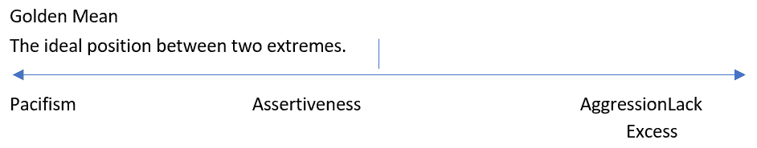

# 第二章：1 伦理简明指南

伦理与技术始终有着漫长而复杂的历史。人工智能也不例外，它面临着伦理挑战或围绕这些挑战的辩论。由于这项技术的范围和速度，随着危害和挑战与创新的步伐和范围相匹配，对伦理的呼吁变得更加紧迫。从国际到地方性法规，对调解这些挑战的呼吁声巨大。同时，许多人担心，试图保护我们免受技术侵害的努力将像过去从聊天机器人、社交媒体、视频游戏以及最强大的创新——生成式人工智能——中所做的那样失败。AI 伦理的时代已经到来，如果我们知道并理解如何*实践伦理*的话。伦理关乎人们的决策，它们是正确的、好的、公平的和正义的。对你来说，这些决策往往看起来是主观的，或者其他人无法完全理解，除非他们站在做出选择的人的角度。首先，你将探索不同的伦理行为驱动因素（理论），并了解人们如何以及为什么做出伦理选择。然后，你将了解对伦理的反对意见，这些反对意见进一步复杂化了做出良好选择的过程。最后，你将看到关于理论的不同意见如何创造更有效的关于优先事项和挑战的对话。在本章中，我们将涵盖以下主要内容：

+   介绍伦理和伦理理论

+   理解义务论伦理

+   概述后果主义理论

+   通过美德伦理探索人格

+   理解伦理在人工智能中的重要性

## 介绍伦理和伦理理论

**伦理学**是研究道德上好或坏、对或错的概念、理论、体系、规则、原则和价值观的学科。相比之下，道德决定了什么是对或错、好或坏的标准。当情况困难且包含善与恶的元素时，它们被称为**道德困境**。困难的问题往往揭示道德困境，但答案揭示了我们是如何做出道德判断的。这些判断随后揭示了支撑决策的道德规则。一个道德原则或规则可能是不做伤害，提供正义，或确保人们的保护。有趣的是，牛津大学对 60 种文化的研究确定了七条普遍的道德规则：“帮助你的家庭，帮助你的群体，回报恩惠，勇敢，尊重上级，公平分配资源，尊重他人的财产……”（全球发现的七条道德规则，2019 年）。这表明在道德中找到一致性或共同点是可能的。研究伦理学和道德的哲学家们确定，三种基本的道德理论总结了我们的道德决策。每种都有其自身的原则和指导思想。当我们回顾我们的道德选择时，我们可以确定我们使用的是哪种道德理论，以及支持这些选择的我们重视的原则。因此，为了开始我们的伦理学研究，请回答以下问题，然后统计你的 A、B 和 C 答案。在本章的后面，你将了解在做出决策时，你倾向于哪三种道德理论，以及你的原则是否根据你的问题而改变。

### 测验

我是什么样的道德决策者？

1.  你遵守严格的隐私法规，但你的客户想要更多。你该怎么办？

    1.  教育你的客户你是如何遵守的。

    1.  寻找提高隐私的方法。

    1.  问问自己一家好公司应该如何回应。

1.  你有一个现有的应用程序，但为了改进它，你需要数据。你...

    1.  更改服务条款并收集数据。

    1.  通过通知和选择加入设置更改服务条款。

    1.  尝试平衡业务和客户的需求。

1.  你的企业名称接近竞争对手的名称。你...

    1.  不要紧张，因为你知道在法律上你是清白的。

    1.  考虑你是否应该根据两家企业的具体情况更改名称。

    1.  你应该做一个好人并更改你的名字吗？

1.  你在建筑外面的街道上找到钱。你...

    1.  把它放在前台；其他任何东西都是偷窃。

    1.  尝试找出它属于谁，或者把它留在桌子上——如果找不到所有者，你将捐赠这笔钱。

    1.  做一个好人会做的事，并遵循那些建议。

1.  你和一个政治上深有分歧的朋友，他们提出了一个敏感的话题。你...

    1.  拒绝讨论它；你不谈论那些事情。

    1.  尝试对话，但如果其他人感到不安，就放弃这个话题。

    1.  考虑一个好朋友会怎么做，并选择那样做。

1.  你不相信体罚，但一个朋友分享了他们也这样做。你...

    1.  倾听他们为自己的权利辩护。

    1.  建议其他不涉及体罚的纪律方法。

    1.  根据一个合格父母的行为制定解决方案。

1.  你的孩子被指控作弊。你...

    1.  制定法律——有规则的原因。

    1.  尝试理解发生了什么，并确定适合情况的后果。

    1.  确定如何加强孩子对诚实重要性的认识。

1.  你在交通中挡了别人的道，他们愤怒地朝你比划。你...

    1.  驾驶更加小心；你知道交通规则。

    1.  驾驶更加小心；每个人都应该感到安全。

    1.  下定决心成为最好的司机。

1.  一个朋友担心他们需要做流产，希望你在那里支持他们。你...

    1.  拒绝参与，因为结束生命是错误的。

    1.  从各个方面审视情况，以确定最佳行动方案。

    1.  尽力成为最好的朋友，并从信任的朋友或你尊重的人那里寻求建议。

1.  你被提供了一个涉及搬迁的梦寐以求的工作。你...

    1.  核实他们将支付的费用以及你将支付的费用。

    1.  考虑对你和你的伴侣、你的朋友以及你的家庭的影响。

    1.  由于不确定，向他人寻求建议。

现在你已经完成了测验，务必统计你的答案，以便你知道在做出道德决定时使用了哪些理论。这是理解你的决定以及那些不同意你的人的决定的一个重要部分。认识到那些不同意你的人所重视的东西，在谈判和解决道德困境时更为重要。一旦你了解了驱动复杂选择的原因，深入的对话就变得可能。答案：大部分是 A - 德性伦理学，大部分是 B - 功利主义伦理学，大部分是 C - 功德伦理学。现在让我们在接下来的部分中了解这些伦理理论。

## 理解德性伦理学

伊曼努尔·康德的**义务论理论**是一种基于理性主义的理论。换句话说，你必须运用理性来判断什么是对的。因此，如果你深入思考道德选择，你就会知道该怎么做。在康德看来，正确的或正确的道德选择应该是恒定的，以克服宗教的主观挑战。如果道德选择是恒定的，我们可以将它们理解为道德真理或绝对真理。这意味着道德真理是存在的。这也意味着道德困境的焦点必须是我们希望做的行为，而不是决策的后果或影响。我们必须首先理解康德的观点，才能考虑这种可能性。想象一下，你面对的是一个贫穷的人，在绝望中从当地杂货店拿走了食物。许多人可能会声称，在绝望的情况下拿走食物是道德的。然而，如果你思考这个场景，实际上被问到的其实是人是否应该能够从别人那里拿走他们想要的东西。杂货店的大小、能否轻易吸收拿走食物的损失（费用）以及个人的饥饿或绝望都不重要。在思考这个场景后，我们得出的准确问题是，我们是否都应该同意生活在一个当人们想要某样东西时就可以拿走的世界。道德问题在于偷窃是否应该被允许。贫穷、杂货店的大小、克服产品损失的能力以及其他合理化都是试图避免关于偷窃的真正问题，并讨论可变后果。然而，并非所有选择都取决于什么是对的；相反，我们关注我们想要或渴望的东西。例如，你可能会为了周末有更多空闲时间而在某个晚上加班。这个决定可能是正确的事情，但它没有道德分量。康德将这些称为**假言命令**，关注的是当你想要某样东西时应该做什么。这些应该被视为更实际的选择，而不是道德选择。它们也可以通过行动不是必需的来识别；你可以选择周末工作，或者找到第三个选择。**定言命令**是与你必须做出的道德选择相关的，即使你更喜欢做其他事情。“定言，因为它不依赖于任何人的特定欲望，命令，因为它是一种理性的命令。”（Cahn，2018）。这意味着即使我们不愿意，我们都被道德法律所束缚。为了理解你面临的是哪种命令，理性思考将引导你得出正确的结论。为了解释这个想法，康德使用了命令的公式。第一个公式是我们必须只遵循我们愿意普遍化的道德规则（**格言**）。我们之前关于偷窃的例子符合这个规则，因为确定人们可能违反不偷窃的格言会导致偷窃成为一种道德上好的或正确的事情。对大多数人来说，这几乎没有意义。这也意味着没有人可以因为偷窃而受到追究。

> 类别命令：普遍性
> 
> > 只按照那些你愿意使其普遍化的（规则）准则行事（Cahn, 2018）。意愿某事就是拥有做出选择的能力。因此，意愿某事物应该被普遍化就是选择它是对的还是错的，而不存在矛盾（有时是对的还是错的）。

第二个公式的依据是一种责任感，康德认为我们都有对他人承担的这种责任感。通过我们对他人的责任，我们必须确保人们被视为有他们自己的目标、欲望和需求，他们必须被允许自己去追求。我们不能利用人们来实现我们的欲望和需求，同时忽视他们的需求。这是第二个公式的基石，该公式指出我们必须只把人们作为目的，而不是手段。这被称为**自身目的公式**，康德如下解释道：

> 类别命令：自身目的
> 
> > 以这样的方式行事，你总是将人性，无论是你自己的还是任何其他人的，既不单纯作为手段，同时也作为目的来对待。（Cahn, 2018）

可以说，我们有时确实将他人作为手段，例如去银行时，柜员为我们办理取款。因此，我们需要澄清何时可以利用他人来推进自己的目的，而何时这样做是错误的。“将某人仅仅用作*手段*，意味着将其卷入一个*他们原则上不可能同意*的行动方案中”（Cahn, 2018）。这意味着，当对方在充分知情的情况下同意协助你时，你并非在利用他们。而当你隐瞒了可能使其拒绝参与你行动方案的细节时，你就是在仅仅将其作为手段（这是错误的）。这禁止了欺骗、胁迫、谎言、半真半假的陈述等。对于大多数人而言，初次接触康德的义务论时，其普遍性条件往往是难点。许多人支持规则的例外，或认为规则就是用来被打破的。康德两者都不接受，他要求我们只应遵循那些我们希望他人也遵循的规则。这与“己所不欲，勿施于人”的金科玉律不同，因为那意味着如果你认为自己值得例外，你也应该给予他人例外。而康德对此绝不认同。相反，康德期望每个人都毫无偏差地遵循同一标准，即使是为了占据道德高地。挑战康德的观点似乎是合理的，即有时我们必须牺牲自己的道德真理以实现更大的善。例如，考虑这个流行例子的一个版本：警察敲你的门，询问你是否藏匿了你的朋友。你选择了藏匿，相信能找到证据证明他们无罪——你认为他们是无辜的。你回答警察说你不知道朋友在哪里，并结束了对话。不幸的是，朋友偷听到了你的话，试图逃跑，但在离你家两个街区的地方被抓住了。（Green, 2016）如果你说了实话，警察可能会去搜查你所说的朋友藏身之处（卧室的壁橱），而你的朋友则可能趁机溜出门。然而，你的谎言改变了事态的发展，使你——而非警察或你无辜的朋友——对结果负责，尽管你的意图是好的。所以，如果你的朋友在抓捕过程中受伤，那伤害就是你的过错。对康德而言，责任在于说谎者。对义务论最常见的反驳是：忽视情有可原的情况（后果）而只关注行为本身似乎是错误的。当然，痛苦或困境可能导致一个人做出错误的选择。也可能出现这样的情况：人们想要一条普遍规则，且他人也会同意，但这规则本身似乎仍是错误的。人们常常想要错误的东西，而认为只有多数人认可的规则才是道德规则，这似乎也有问题。最后，当专注于对他人的义务时，如果一个人对许多人都有义务，他该怎么办？总之，康德的义务论是一种基于规则的道德理论，专注于做出以普遍接受和对他人义务为核心的道德选择。该理论关注行为或选择本身，而非其后果。它认为，道德结果的责任在于那些通过自身行为违反道德规则的人。这种观点可能显得冷漠、不关心他人，或无视我们在现代世界中做出道德选择所面临的挑战，特别是因为它不允许任何偏离道德规则的例外或借口（*延伸阅读*，*资源 1 和 3*）。还有另一种观点，它考虑了决策的复杂性以及我们最艰难选择所带来的后果，我们接下来将探讨它。

## 观察后果主义理论

**功利主义**，或效用理论，解决了德性论所避免的关于后果的担忧——同时忽略了道德行为的意图。这种道德理论声称好的后果使得道德选择是好的。因此，为了做出好的选择，我们必须有一种评估我们行为后果的方法。我们可以通过确定从这些行为中可以获得多少幸福来评估这些后果。因此，幸福是我们所有选择和行动所指向的目标。所以，这种观点的基础是寻求快乐和避免痛苦。这种观点并不关注自我中心的关切，比如一个人为了自己的利益而做的事情，以至于他们最终过得更好。相反，由于强调快乐和减少痛苦等同于幸福，它通常被认为是一种**享乐主义理论**。然而，效用（幸福）理论的优点是它关注尽可能多的人的最大幸福。这被称为最大的幸福原则：

> 最大的幸福原则
> 
> > “我们应该始终采取行动，以产生对最大多数人的最大好处。” ([`legaldesire.com/benthams-utilitarianism-theory-scope-criticisms/`](https://legaldesire.com/benthams-utilitarianism-theory-scope-criticisms/))

需要注意的是，为了确定从后果中可以获得多少幸福，我们必须有一个幸福度的衡量单位。**享乐**是快乐的一个单位，而**痛苦**则衡量痛苦。我们必须确定与后果相关的享乐数量来评估它。例如，如果你很久没有见到你的家人，你可能会认为它的价值是 100 享乐。另一方面，如果你见到他们感到痛苦，这次拜访可能的价值是 100 痛苦。还可能有许多类似的次级后果，可以将它们分解为享乐和痛苦，直到我们得出最终的决定和规定的行动。有时，这种计算会导致容易遵循的行动，而有时，答案是有问题的。为他人提供幸福（并将你的需求视为不比他人更重要）的挑战在于，你可能不得不采取一种不是你偏好的或不符合你愿望的行动，以便更大的利益得以实现。例如，想象一下你想和朋友聚会。你希望有一个轻松的夜晚，享受一顿美餐和交谈。然而，你的朋友群想去听音乐会。最终，你决定支持其他人去听音乐会。这不是你想要的，但它会让其他人开心。尽管如此，似乎为了满足每个人而不是自己而做出的选择可能会出现问题。为了提醒我们，我们自己的愿望仍然只有一票，功利主义者接受他们必须扮演一个无私的观察者角色，仅仅观察情况的发展。这个视角将使我能够暂时放下我的感受和意见，并观察事件而不是将自己视为参与者。这应该有助于消除偏见，真正地提出对每个人都最好的建议。与这一理论相关的一个挑战是，它可能导致违反你道德观念的选择。例如，想象你在一所银行，一个持枪者闯进来抢劫。你可以选择一个人被杀，如果银行不给他们钱。你认为杀人是不对的，但选择一个人意味着可以拯救二十个人。在效用理论中，正确的事情是选择一个人牺牲以拯救其他人——即使你不同意杀人。这种传统的功利主义观点被称为**行为功利主义**。这是我们一直在讨论的观点。它可以总结如下：

> 行为功利主义
> 
> > “一个行为是正确的，当且仅当它产生的善与任何可用的替代方案一样多”（Cahn, 2018）。

另一种形式的功利主义是规则功利主义。它通过以下引言来解释：

> 规则功利主义
> 
> > 一个行为是正确的，当且仅当它符合一个规则，而这个规则本身是规则集的一个成员，接受这个规则集将比任何可用的替代方案为社会带来更大的效用”（Cahn, 2018）。

这种更广泛的观点着眼于长期增加幸福。（它与德性论不同，德性论认为规则应该是普遍的，并认识到我们对他人有责任。）这些规则将专注于确保后果为整个社会带来幸福。例如，虽然为了拯救 20 名人质而牺牲一个人可能是合适的，但我们可能不希望允许外科医生从健康患者身上摘取器官，即使他们能够拯救更多的病人。很难想象有人会反对一个促进幸福观点的看法。尤其是那种能够在促进幸福的同时最小化痛苦并应对任何困境的观点。功利主义确实有一些批评者，他们对这种观点提出了严重的反对。在这里，我们将简要讨论五种最流行的观点（Cahn，2018）：

1.  **无休息异议**：如果我们必须始终向世界增加幸福，无论我们做什么，我们都可以做更多或更好的事情。

*回应*：调用允许休息或缓刑的规则，这将也会最大化效用。

1.  **荒谬含义异议**：我们可能不得不应对一些相当荒谬的挑战，例如在真相和谎言之间产生联系。

*回应*：说实话，有时需要撒谎，所以也许这个担忧揭示了困境的准确看法。

1.  **完整性异议**：有时，我们可能不得不违反我们的道德准则并实施我们宁愿避免的行为。

*回应*：有时情况也是如此，避免它是无法实现的。

1.  **正义异议**：有些情况下，我们可能需要对我们对正义或权利的看法采取随意态度。毕竟，如果数学表明违反权利将带来最大的幸福，那么我们必须实施权利侵犯。

*回应*：我们可能不得不违反或权衡权利与更大利益之间的关系。

1.  **公开性异议**：你必须知道道德原则才能遵循它们。然而，功利主义者并不认为每个人都应该因为涉及到的深思熟虑而遵循效用原则。

*回应*: 如果其他人要遵循这种道德观点，规则或指导必须为人所知，并公开提供。我们通过法律和立法来实现这一点。这种反对意见仅适用于行为功利主义。在结束之前，功利主义是一种认为世界上的善被增加的观点，很难认为这有什么问题。然而，计算（总计快乐和痛苦）以及确定要评估的后果，只是为了到达可能让我们以从未想象过的方式行动的选择，这使这一理论（以及我们对它的接受）变得复杂。此外，我们可能经常需要采取似乎违反我们自身深刻信念以利于他人幸福的行为。这种自我牺牲可以挑战我们接受这一观点作为实用主义和值得的。您可以从*进一步阅读*部分的*资源 2*中了解更多关于这方面的内容。我们已经讨论了基于规则的途径（德性论）带来的清晰性，现在讨论基于后果的途径——功利主义。但我们很少谈论做出选择的人或他们的性格如何影响他们的选择。

## 通过美德伦理探索人物性格

亚里士多德的**美德伦理**是应该考虑的第三种道德理论。美德伦理认为，一个人通过正确地行动、说话和根据情况行事，可以成为一个始终能从美德出发的人。这样的人被认为是有德行的（行为道德或正确），并且具有良好的道德性格。这种理论不像功利主义那样陷入后果，也不像德性论那样陷入规则。相反，这种理论关注选择行为的人以及一个有良好道德的人应该具备的品质——这是关于一个人的性格。从这个有良好性格的人的概念出发，可以得出结论，好人会做出好的选择和决定。然而，我们必须学习如何成为好人以做出好的选择，但亚里士多德认为这是可能的，如果我们想要人类繁荣或生活得更好，这就是我们注定要做的事情（Cahn，2018）。但为了按照我们的本性行事并繁荣，我们必须认识到美德是确保一旦发展就会产生良好行为的性格特征。这些美德位于两个极端或恶习之间。通过从中间，或黄金法则，我们学会成为好人并做出好的选择。在*图 1.1*的例子中，我们避免了受害者和侵略（恶习）的两种极端，最终达到自信（**黄金法则**）。

图 1.1 – 黄金法则

想象一下，有一个人经常被欺负，却拒绝为自己挺身而出。他们经常遭受虐待并遭受痛苦，因为他们无法建立良好的界限；这不是人类繁荣的道路。具有侵略性的人也会因为他们在互动中的持续冲突和压力而无法繁荣。然而，一个适度自信的人可以繁荣，因为他们既不是受害者也不是侵略者。此外，亚里士多德还声称，黄金法则（两种恶习之间的中点）在不同情况下会有所不同。例如，在许多情况下，自信似乎是正确的。然而，当面对一个既强大又愤怒的人时，黄金法则可能更接近于和平主义，因为平息局势似乎是一个更好的主意。美德伦理学允许我们对情境有这种直观的理解，从而指导正确的行动。

> 黄金法则
> 
> > “……它是一种介于两种恶习之间的中庸之道，一种涉及过度，另一种涉及不足，它之所以如此，是因为它的特性是旨在追求激情和行动中的中间状态……”（Cahn, 2018）。

这似乎意味着美德伦理无法通过学习获得，并且更直观，因为必须针对每种情况量身定制回应。幸运的是，亚里士多德向我们保证，学习成为有美德的人是可能的，但你必须通过实践从黄金法则出发。换句话说，这是一种实用技能和智慧。亚里士多德当然会同意，在美德方面，实践出真知。在采取美德行动之前，我们必须记住，我们的心灵正忙于识别恶习，确定黄金法则，并在行动之前评估情况。因此，美德伦理需要心灵和实践来实现。然而，当我们学习从美德出发行动时，屈服于恶习的诱惑可能相当强烈。幸运的是，美德伦理允许我们识别一个道德典范，我们可以模仿其行为，同时仍在学习成为有美德的人。道德典范可以是祖父母、宗教人物，甚至是一个最好的朋友，如果他们已经学会了（比你更多）如何从美德出发行动。通过实践、认识和典范的引导，适当的回应将成为你性格的一部分，使你成为有美德的人。但为什么我们应该接受这种美德的理念呢？答案是，为了作为人类繁荣，以及在我们彼此和世界中过上我们应该过的日子。**幸福**，人类的繁荣，是一种涉及教训、努力、决心、成长（情感和心理上）以及面对作为人类所面临的斗争和挑战的生活。美德伦理并非旨在解决这些挑战，而是帮助人类在挑战中繁荣。美德伦理的支持者声称，这一理论的好处是任何人都可以成为有美德的人，每种情况都得到了适当的关注，并且它专注于帮助人们变得更好，从而改变世界。批评者担心没有提供推荐行动，并且理论过于模糊，难以实用。重要的是要记住，亚里士多德的美德伦理关注的是在道德困境中做出选择的个人，而不是后果或行为本身。这一理论鼓励人们变得更好，学会成为有道德的人，而不仅仅是要求它或提供规则来确保它。它还寻求通过人类本性的方式，让人类繁荣，过上他们应有的生活。这意味着一种充满斗争、成就和挑战（包括道德挑战）的生活。它还期望我们通过道德典范（例子）的引导，在成长为我们有美德自我的过程中，努力远离恶习，同时依靠美德。在“进一步阅读”部分的*资源 4 和 5*中，我们探讨了这些怀疑。

### 识别伦理理论的挑战

讨论的三个道德理论认为，存在一个可以接受或理解的统一道德理论，尽管并非所有人都相信这一点。那些不同意的人通常分为三类：**文化相对主义**、**唯心主义**和**怀疑主义**。虽然我们不会对这些进行深入的讨论，但它们值得考虑。毕竟，并非每个人都认为他们属于上述三个类别之一。但与功利主义、义务论和美德伦理学一样，这些理论也可以被反驳。

### 文化相对主义

文化相对主义是一种信念，即一个人的文化实践应该通过那个人的文化视角来评估。这些实践在与其他国家做生意时也会发生。例如，在诸如日本和中国（以及意大利、挪威、博茨瓦纳，甚至硅谷）等国家，允许午休或在工作时打盹，因此在评估打盹政策（通过文化相对主义）时，我们应该从那些文化的视角来审视，而不是我们自己的或其他人的（Nishat，2019）。([`www.openaccessgovernment.org/customs-from-countries/59117/`](https://www.openaccessgovernment.org/customs-from-countries/59117/)) 这意味着在允许打盹的文化中打盹并不成问题。同样，如果世界某个地区的法规不同，可能会诱使我们默认采用那些法规，即使发生事故的可能性很大或风险很高。这种观点关注的是文化与实践之间的差异，而不是相似性。并且它坚持认为这些实践应该受到尊重。那些反对文化相对主义观点的人会引导我们关注相似性，看看差异是否真的像看起来那样不同。例如，如果我们认识到打盹为员工提供休息时间，我们必须承认几乎所有组织都允许这样做，而且许多政府要求这样做。因此，通过观察更广泛的主题，我们可以更好地理解这种差异代表着满足需求，而不是否认需求。

### 唯心主义

这种观点基于个人对对错的认识。在这种观点下，道德仅仅是任何人对道德含义的个人看法。例如，一个人可能认为撒谎是错误的，而另一个人可能认为对大事撒谎是错误的，但认为小白的谎言是可以接受的。这种观点的强点在于它可以帮助人们更加理解差异、信仰、思想和文化。它坚持要保持开放的心态，并推迟判断。这种观点最具挑战性的部分是确定任何人如何对其所做之事负责。如果一个人认为某事在道德上是正确的，那么另一个人有什么理由反对呢？然而，我们与他人之间的关系和联系依赖于信任和责任。没有这些，想象在商业或人际关系中前进是困难的。毕竟，如果道德是主观的，它也可能改变。这意味着如果一个人改变了对道德的看法，这可能会对我们与他们之间的互动产生重大影响。我们也可以改变我们的想法，改变他人的情景。

### 怀疑论

道德怀疑论者认为我们无法获得关于道德的知识（道德真理、原则和价值观无法确定）。这在我们的道德选择对话中表现得非常明显。我们犹豫是否归咎，或者过于迅速地归咎。我们因为某些情况而原谅某些行为，但不是所有行为。我们根据与谁不同意而看到不同的事情，使得我们的观点变得毫无意义。如果我们知道道德或道德真理是什么，我们就不需要犹豫或迅速提供例外。如果是这样，那么道德不仅仅是主观的。相反，我们有理由怀疑我们甚至无法解开这个话题。我们已经到了没有什么可说或讨论的地步。如果怀疑论是正确的，我们甚至无法进行这次对话，而必须声明我们不知道足够的信息来参与对话。然而，我们的生活和关系（个人和商业）将继续，但没有任何道德主张。在严格理解道德知识的同时，似乎为了在这个世界上导航，我们至少必须能够就责任、正直、公平、偏见和道德进行对话。但这样做就是拒绝怀疑论。

## 理解在人工智能中伦理的重要性

由于这是一本伦理学书籍，因此分享这些信息在人工智能工作中的应用方式和原因似乎是正确的。简而言之，那些开发技术、选择支持哪些创新以及推广这些创新的人，正在使用上述过程来做出并支持他们的决策。这些伦理决策由于开发者的本质以及他们所参与的社会的性质，被内置于所有技术中。无论是选择开发具有自动驾驶能力的智能汽车、参与机场安检的 AI 辅助摄像头，还是希望通过当地城市交通信号灯处的摄像头避免超速罚单——理解选择影响的问题，就像技术一直所做的那样，是一个挑战。同样，使用技术和开发技术的人之间的选择，正持续地相互碰撞。有时影响是有利的，决策和选择得到了极大的支持。有时碰撞不那么有利，甚至有害，将用户置于与技术和其开发者对立的位置。他们之间的分界线在于双方提供的伦理决策和保护。由于伦理判断（好与坏）交织在一起，技术中的伦理影响是一个微妙的对话。虽然许多非伦理学领域的人认为伦理只是一个受欢迎的竞赛，但实际上它是对在相互竞争的利益、愿望和需求之间导航这一伦理边缘的理解——即使所有这些都有强有力的论据支持。伦理学不是简单的咖啡聊天或假期时的紧张对话。相反，它是对思想的深入质询，是接受对立论点，接受所持观点的弱点，并最终做出行动决策的工作。这是哲学、论证、逻辑和人文训练有素的伦理学家的工作。在人工智能技术中必须有意识地处理伦理的原因是，伦理可以并且已经被轻易地回避和规避。例如，一个组织可能声称自己是值得信赖的（这是一种表演性言语，因为言语的目的是产生信任的行为）。然而，同一家公司可以说自己是值得信赖的，但随后做出的选择却未能反映信任的承诺。说一套做一套是常见的。不幸的是，当这种情况以 AI 的速度和规模发生时，这样做的问题会加剧。这可以通过针对最大技术公司的诉讼来看到：Meta（反垄断、隐私、儿童、版权）、微软和 Open-AI（版权、知识产权）、苹果（对待开发者）、Alphabet（版权、**数字千年版权法**（DMCA））、账户暂停）、亚马逊（反垄断）、三星（价格操纵）。虽然其中大部分与 AI 有关（例外是苹果和三星），但所有都涉及伦理和技术。

## 摘要

在本章中，我们确定了我们如何做出道德选择，探讨了三种主要的道德理论，并讨论了它们的反对意见。我们还讨论了伦理与道德的区别，支撑我们选择的道德原则，以及与它们相符的道德理论。当面对人工智能中的伦理问题时，重要的是要理解开发者、用户甚至风险投资家将对包含这些理论的产品做出判断。创始人可能关心实用性（用户的幸福或社会的福祉），但可能与道义论的资金代表进行谈判。或者，一个产品可能由道义论团队发布，但后来发现用户寻求的是实用性。还可能出现一种情况，即开发者可能会质疑接受资金提议是否还能让他们被视为一家好公司或组织。任何这些观点和涉及到的观点在做出决策时都可能倾向于三种主要观点或完全拒绝它们。当涉及到人时，观点的不一致可能导致挑战性的关系、情境、产品或对每个人都不舒服的场景。在下一章中，将介绍技术，以了解其早期基础，并在本书的后续章节和部分中开始了解技术伦理和人工智能的实践探索。

## 进一步阅读

以下资源已提供，以帮助您探索本章的内容：

1.  [`www.youtube.com/watch?v=1A_CAkYt3GY`](https://www.youtube.com/watch?v=1A_CAkYt3GY)

1.  [`www.youtube.com/watch?v=-a739VjqdSI`](https://www.youtube.com/watch?v=-a739VjqdSI)

1.  [`www.youtube.com/watch?v=8bIys6JoEDw`](https://www.youtube.com/watch?v=8bIys6JoEDw)

1.  [www.petersinger.info](https://www.petersinger.info)

1.  [`www.youtube.com/watch?v=PrvtOWEXDIQ`](https://www.youtube.com/watch?v=PrvtOWEXDIQ)

## 参考文献

+   Cahn, S. M. (2018). 在 *探索哲学：入门选集* (第 362-373 页). 纽约：牛津大学出版社。

+   Green, H. (2016, November 14). *YouTube*. (Crash Course) 2023 年 10 月 23 日检索自 [`www.youtube.com/watch?v=8bIys6JoEDw`](https://www.youtube.com/watch?v=8bIys6JoEDw)

+   Nishat. (2019, 2 18). *开放获取政府*. 2023 年 1 月 1 日，10 时检索自 [`www.openaccessgovernment.org/customs-from-countries/59117/`](https://www.openaccessgovernment.org/customs-from-countries/59117/)

+   *全球发现的七条道德规则* (2019 年). 2023 年 10 月 12 日检索自 [`www.ox.ac.uk/news/2019-02-11-seven-moral-rules-found-all-around-world#:~:text=The%20rules%3A%20help%20your%20family`](https://www.ox.ac.uk/news/2019-02-11-seven-moral-rules-found-all-around-world#:~:text=The%20rules%3A%20help%20your%20family)
