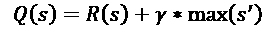
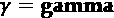
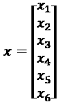

# 第一章：通过强化学习开始学习下一代人工智能

下一代人工智能迫使我们意识到机器确实会思考。虽然机器的思维方式与我们不同，但它们的思维过程已经在许多领域证明了其效率。过去，人们认为人工智能会复制人类的思维过程。只有神经形态计算（见*第十八章*，*神经形态计算*）仍然致力于这个目标。大多数人工智能现在已经超越了人类的思维方式，正如我们将在本章中看到的那样。

**马尔可夫决策过程**（**MDP**），一种**强化学习**（**RL**）算法，完美地说明了机器是如何以其独特的方式变得智能的。人类根据经验构建决策过程。MDP 是无记忆的。人类通过逻辑和推理思考问题。MDP 则 100%时间使用随机决策。人类用语言思考，把他们感知到的每个事物都打上标签。MDP 采用无监督方法，不使用标签或训练数据。MDP 推动了自动驾驶汽车（SDC）、翻译工具、调度软件等机器思维过程的发展。这种无记忆、随机且无标签的机器思维过程标志着解决过去人类问题方式的历史性变化。

随着这一认识的到来，还有一个更令人大开眼界的事实。以物联网为基础的人工智能算法和混合解决方案已经开始在战略领域超越人类。尽管人工智能无法在每个领域取代人类，但人工智能与传统自动化结合，现在已占据了关键领域：银行、市场营销、供应链管理、调度以及许多其他关键领域。

正如你将看到的，从本章开始，你可以作为一个适应性思维者，在这个新世界中占据中心地位。你可以设计人工智能解决方案并实施它们。没有时间浪费。在本章中，我们将迅速直接地通过 MDP 深入了解强化学习。

今天，人工智能本质上是数学被转化为源代码，这使得传统开发人员很难学习。然而，我们将以务实的态度来处理这种方法。

这里的目标不是走捷径。我们努力将复杂性分解成可理解的部分，并与现实进行对比。你将从一开始就了解到如何应用适应性思维者的过程，这将引导你从一个想法到强化学习中的解决方案，并直接进入下一代人工智能的重心。

# 强化学习概念

人工智能在不断发展。经典方法表明：

+   人工智能涵盖所有领域

+   机器学习是人工智能的一个子集，包括聚类、分类、回归和强化学习。

+   深度学习是机器学习的一个子集，涉及神经网络

然而，这些领域往往存在重叠，因此很难将神经形态计算，例如其子符号方法，纳入这些类别（见*第十八章*，*神经形态计算*）。

在这一章中，强化学习（RL）显然适用于机器学习。我们将简要了解 MDP（马尔科夫决策过程）的科学基础，这是我们将要探索的强化学习算法。需要牢记的主要概念如下：

+   **最优运输**：1781 年，贾斯帕·蒙奇定义了从一个位置到另一个位置的运输优化，使用最短和最具成本效益的路径；例如，开采煤矿，然后用最具成本效益的路径运送到工厂。此后，这一理论被推广到从 A 点到 B 点的任何路径形式。

+   **玻尔兹曼方程和常数**：19 世纪末，路德维希·玻尔兹曼通过他的粒子概率分布彻底改变了我们对世界的认知，他的熵公式完美地总结了这一点：

    `S` = `k` * log `W`

    `S` 代表系统的熵（能量、无序）。`k` 是玻尔兹曼常数，`W` 代表微观状态的数量。我们将在*第十四章*，*使用限制玻尔兹曼机（RBMs）和主成分分析（PCA）准备聊天机器人的输入*中进一步探讨玻尔兹曼的思想。

+   **概率分布的进一步发展**：乔西亚·威拉德·吉布斯将大量粒子的概率分布推进了一步。此时，概率信息理论正在迅速发展。在 19 世纪末，安德烈·马尔可夫将概率算法应用于语言等多个领域，信息理论的现代时代由此诞生。

+   **当玻尔兹曼与最优运输相遇**：2011 年菲尔兹奖得主塞德里克·维拉尼将玻尔兹曼方程提升到了一个新的层次。维拉尼随后将最优运输与玻尔兹曼理论结合起来。他证明了一个 19 世纪数学家直觉上已知但需要证明的命题。

让我们把前面提到的所有概念在现实世界的一个例子中具象化，这将解释为什么使用 MDP 的强化学习，例如，是如此创新。

分析以下这杯茶将带你进入下一代人工智能的世界：


图 1.1：考虑一杯茶

你可以从两种不同的角度看待这杯茶：

1.  **宏观状态**：你看着这杯茶和茶水。你可以看到杯中茶的体积，并且当你拿着杯子时可以感觉到温度。

1.  **微观状态**：但你能说出茶水中的分子有多少吗？哪些是热的，温暖的，还是冷的？它们的速度和方向如何？这几乎不可能对吧？

现在，想象一下，这杯茶包含了超过 20 亿个 Facebook 账户，或者超过 1 亿个亚马逊 Prime 用户，每年进行数百万次配送。在这个层面上，我们根本放弃了控制每个单独项目的想法。我们着眼于趋势和概率。

玻尔兹曼提供了一种通过最优传输评估我们现实世界特征的概率方法。通过最优传输在物流中的应用，玻尔兹曼意味着温度可以是产品的排名，速度可以与交货距离相关，方向则是我们将在本章中研究的路径。

马尔可夫采纳了微观状态概率描述的成熟成果，并将其应用到他的 MDP 中。强化学习将大量元素（如茶杯中的粒子、交货地点、社交网络账户）进行定义，并确定它们可能的路径。

人类思维的转折点出现在我们无法分析全球化世界面临的庞大数据状态和路径时，这些数据产生的图像、声音、文字和数字超过了传统软件方法的处理能力。

有了这个前提，我们可以开始探索 MDP。

# 如何适应机器思维并成为一个自适应思维者

强化学习，作为机器学习的基础之一，假设通过与环境的互动，通过试错进行学习。这听起来很熟悉，不是吗？这正是我们人类一生所做的——痛苦中不断尝试！做事情、评估，然后继续；或者尝试别的东西。

在现实生活中，你是你思维过程的代理。在强化学习中，代理是通过这种试错过程随机计算的函数。机器学习中的这种思维过程函数就是 MDP 代理。这种经验学习的形式有时称为 Q 学习。

通过三步法掌握马尔可夫决策过程（MDP）的理论和实施是前提。

本章将详细介绍将你转变为 AI 专家的三步法，概括来说：

1.  通过描述解决实际问题的案例来开始

1.  然后，建立一个考虑现实生活限制的数学模型

1.  然后，编写源代码或使用云平台解决方案

这是让你从一开始就以自适应的态度接近任何项目的一种方式。它表明，通过解释我们如何构建输入、运行算法并使用代码结果，AI 始终以人为中心。让我们考虑这三步法并付诸实践。

# 利用三步法克服现实生活中的问题

本章的关键是避免编写永远不会被使用的代码。首先，作为领域专家开始理解主题。然后，用文字和数学进行分析，确保你的推理符合主题，最重要的是，程序在现实生活中是有意义的。最后，在第三步，只有在你对整个项目有把握时才编写代码。

太多开发者在编写代码时没有停下来思考代码的结果如何在实际生活中体现出来。你可能花费数周的时间开发一个完美的解决方案，结果却发现一个外部因素使你的方案变得毫无用处。例如，如果你编写了一个太阳能驱动的机器人用来清理院子里的雪，但却发现冬季阳光不足以为机器人提供动力，这怎么办？

在本章中，我们将讨论 MDP（Q 函数），并将其应用于强化学习中的贝尔曼方程。不过，我们将以与大多数人不同的方式来接近这个问题。我们将关注实际应用，而不仅仅是代码执行。网上有大量的源代码和示例，但问题是，就像我们的雪地机器人一样，这些源代码很少考虑到现实生活中的复杂情况。假设你找到一个程序，可以为无人机配送找到最优路径。然而，问题是，它有很多限制需要克服，因为代码并没有考虑到现实生活中的实用性。你作为一个适应性思维者，将会提出一些问题：

+   如果在一个大城市上空有 5000 架无人机同时飞行怎么办？如果它们试图直线飞行并碰撞到一起，会发生什么？

+   无人机干扰合法吗？城市上空的噪音呢？旅游业怎么办？

+   天气怎么样？天气预报很难做，那这个计划是怎么安排的？

+   我们如何解决协调充电和停车站使用的问题？

只需几分钟，你就会成为那些比你更懂理论的学者和那些需要解决方案却得不到的愤怒经理们之间的焦点。你的现实生活方法将解决这些问题。为了做到这一点，你必须考虑以下三个步骤，首先要真正参与到现实生活的主题中。

为了成功实施我们现实生活中的方法，按照前一节中概述的三步骤，有几个先决条件：

+   **成为主题专家（SME）**：首先，你必须成为主题专家。如果一个理论极客提出了一百个 TensorFlow 函数来解决无人机轨迹问题，你现在就知道，这将是一次艰难的旅程，现实生活中的参数将限制算法的效果。SME 了解该主题，因此可以快速识别某一领域的关键因素。人工智能通常需要找到一个复杂问题的解决方案，甚至是该领域的专家也无法用数学表达出来。机器学习有时意味着找到一个问题的解决方案，而人类甚至不知道如何解释它。深度学习，涉及复杂的网络，解决了更为困难的问题。

+   **具备足够的数学知识来理解 AI 概念**：一旦你有了正确的自然语言分析，你需要迅速构建你的抽象表示。最好的方法是环顾四周，找到一个日常生活中的例子，并为其建立一个数学模型。在 AI 中，数学不是可选项，而是前提条件。付出的努力是值得的。然后，你可以开始编写一段扎实的源代码或开始实施一个云平台的机器学习解决方案。

+   **了解源代码的内容及其潜力与局限性**：MDP 是一种极好的方法，可以开始在三个维度上工作，使你具有适应性：用文字详细描述你周围的事物，将其转化为数学表示，然后将结果实现到你的源代码中。

有了这些前提条件，让我们看看如何通过遵循我们实际的三步法成为一个问题解决型 AI 专家。不出所料，我们将从第一步开始。

## 第一步——描述要解决的问题：MDP 的自然语言表达

任何 AI 问题的第一步是尽可能深入理解你要表示的主题。如果是医学主题，不要仅仅看数据；去医院或研究中心。如果是私人安全应用，去那些需要使用它的地方。如果是社交媒体，确保直接与许多用户交谈。需要记住的关键概念是，你必须对该主题有一个“感觉”，就像你是真正的“用户”一样。

例如，将它转化为你日常生活中所知道的某些事物（工作或个人生活），是你在其中的专家。如果你有驾驶执照，那么你是驾驶方面的专家。你已获得认证。这是一个相当常见的认证，因此我们将其作为接下来示例的主题。如果你没有驾驶执照或从未驾驶过，你可以通过想象自己是步行出行来轻松替代开车；你是从一个地方到另一个地方的专家，不论所使用的交通工具是什么。然而，请记住，实际项目会涉及其他技术方面，比如每个国家的交通法规，因此我们的假想专家是有限的。

让我们进入这个例子，假设你是一名电子商务业务员，正在一个你不熟悉的地方送货。你是一个自动驾驶车辆的操作员。目前，你正在手动驾驶。你有一个带有漂亮彩色地图的 GPS。你周围的位置由字母*`A`*到*`F`*表示，如下图所示。你目前在*`F`*位置。你的目标是到达*`C`*位置。你很高兴，正在听广播。一切顺利，看起来你会准时到达。下图表示了你可以覆盖的地点和路线：


图 1.2：配送路线图

导航系统的状态显示了到达*`C`*的完整路径。它告诉你，你将从*`F`*经过*`B`*到*`D`*，然后到达*`C`*。看起来不错！

为了进一步解析，我们可以假设：

+   当前状态是字母 `s`。`s` 是一个变量，不是实际的状态。它可以是`L`集合中的任何位置，即：

    `L` = {*`A`*, *`B`*, *`C`*, *`D`*, *`E`*, *`F`*}

    我们之所以称之为*当前状态*，是因为在学习过程中没有序列。无记忆过程是从一个当前状态跳转到另一个当前状态。在本章的例子中，过程从位置*`F`*开始。

+   你的下一个动作是字母 `a`（动作）。这个动作 `a` 不是位置*`A`*。这个动作的目标是将我们带到图中的下一个可能位置。在这种情况下，只有*`B`*是可能的。动作 `a` 的目标是将我们从 `s`（当前状态）带到 *s'*（新状态）。

+   动作 `a`（不是位置*`A`*）是前往位置*`B`*。你查看导航系统，它告诉你没有交通，且从你当前的状态*`F`*到下一个状态*`B`*只需几分钟。假设下一个状态*`B`*就是字母*`B`*。这个下一个状态*`B`*是 *s'*。

此时，你仍然相当满意，我们可以用以下事件序列总结你的情况：

`s`, `a`, *s'*

字母 `s` 是你当前的状态，你的当前情况。字母 `a` 是你正在决定的动作，即前往下一个位置；在那里，你将处于另一个状态 *s'*。我们可以说，得益于动作 `a`，你将从 `s` 转移到 *s'*。

现在，假设驾驶员不再是你。因为某些原因，你感到疲惫。这个时候，自驾车就派上了用场。你将车设置为自动驾驶。现在，你不再开车了；系统在操作。我们把这个系统叫做**代理**。在*`F`*点，你将车设置为自动驾驶，让自驾代理接管。

### 观察 MDP 代理的工作

自驾 AI 现在掌控着车辆。它充当着 MDP 代理。此时，它看到你要求它做的事情，并检查其**映射环境**，这个环境代表了之前图表中从*`A`*到*`F`*的所有位置。

与此同时，你当然感到担忧。代理是否能够成功完成任务？你在想它的策略是否与你的相符。你有自己的**策略** `P`——你的思维方式——那就是尽量走最短的路径。代理会同意吗？它的机器大脑里究竟在想什么？你观察着，开始意识到以前从未注意到的事情。

由于这是你第一次使用这辆车和导航系统，智能体是**无记忆的**，这是 MDP 的一个特点。智能体不知道之前发生了什么。它似乎只对从*`F`*位置的状态`s`开始计算感到满意。它将使用机器能力进行尽可能多的计算，以实现其目标。

你正在观察的另一件事是从*`F`*到*`C`*的总距离，以检查情况是否正常。这意味着智能体正在计算从*`F`*到*`C`*的所有状态。

在这种情况下，状态*`F`*是状态 1，我们可以简化为写作`s[1]`；B 是状态 2，我们可以简化为写作`s[2]`；D 是`s[3]`；C 是`s[4]`。智能体正在计算所有这些可能的状态以做出决策。

智能体知道当它到达*`D`*时，*`C`*会更好，因为前往 C 的奖励比其他地方都高。由于它不能通过吃蛋糕来奖励自己，智能体使用数字。我们的智能体是一个真正的数字计算者。当它出错时，它在这个模型中会得到一个差的奖励或什么也得不到。当它做对时，它会得到由字母`R`表示的奖励，我们将在第 2 步中遇到。这种行动价值（奖励）转移，通常被称为 Q 函数，是许多强化学习算法的核心。

当我们的智能体从一个状态转换到另一个状态时，它执行一次*转移*并获得奖励。例如，转移可以是从*`F`*到*`B`*，即从状态 1 到状态 2，或者从`s[1]`到`s[2]`。

你感觉很好，并且会准时到达。你开始理解自驾车中的机器学习智能体是如何思考的。突然，你抬头看到交通堵塞正在形成。*`D`*位置仍然很远，现在你不知道从*`D`*到*`C`*或从*`D`*到*`E`*哪个更好，因为后者可以走另一条交通较少的路到*`C`*。你准备看看智能体是怎么想的！

该智能体考虑到交通堵塞，固执己见，并增加奖励以通过最短路径到达*`C`*。它的策略是坚持初始计划。你不同意，你有另一种策略。

你停下了车。你们都必须在继续之前达成一致。你有自己的观点和策略；智能体不同意。在继续之前，你们的看法需要**收敛**。**收敛**是确保计算正确的关键，它也是评估计算质量的一种方法。

数学表示是此时表达整个过程的最佳方式，我们将在接下来的步骤中描述。

## 第 2 步——构建数学模型：贝尔曼方程和马尔可夫决策过程（MDP）的数学表示

数学涉及到你对问题的全新视角。你正在从文字转向函数，这是源编码的支柱。

用数学符号表达问题并不意味着陷入学术数学的困境，甚至写不出一行代码。只需利用数学有效地完成工作。跳过数学表示可以在 AI 项目的初期阶段加速某些功能的实现。然而，当所有 AI 项目中出现的真正问题浮出水面时，单靠源代码解决问题几乎是不可能的。这里的目标是掌握足够的数学知识，以便在现实公司中实施解决方案。

需要通过找到我们周围熟悉的事物来思考问题，例如本章早些时候提到的行程模型。用一些抽象的字母和符号来写下它是件好事，如前所述，其中 `a` 代表动作，`s` 代表状态。一旦你理解了问题并清晰表达出来，就可以继续前进。

现在，数学将通过更简洁的描述帮助澄清情况。掌握了主要思想后，是时候将它们转化为方程式。

### 从 MDP 到贝尔曼方程

在第一步中，智能体从 *`F`*（状态 1 或 `s`）转移到 *`B`*（状态 2 或 *s'*）。

这个决策背后有一个策略——由 `P` 表示的政策。一个数学表达式包含了 MDP 状态转移函数：

`P`a

`P` 是策略，智能体通过动作 `a` 从 *`F`* 转移到 *`B`* 的策略。在从 *`F`* 到 *`B`* 的过程中，这一状态转移被称为 **状态转移函数**：

+   `a` 是动作

+   `s` 是状态 1（*`F`*），*s'* 是状态 2（*`B`*）

奖励（正确或错误）矩阵遵循相同的原则：

`R`a

这意味着 `R` 是从状态 `s` 转移到状态 *s'* 的奖励。状态之间的转移是一个随机过程。潜在地，所有状态都可以转移到其他任何状态。

示例中的矩阵每一行表示从 *`A`* 到 *`F`* 的一个字母，每一列表示从 *`A`* 到 *`F`* 的一个字母。所有可能的状态都在其中表示。`1` 值代表图的节点（顶点）。这些是可能的位置。例如，第 1 行表示字母 *`A`* 的可能移动，第 2 行表示字母 *`B`*，第 6 行表示字母 *`F`*。在第一行中，*`A`* 不能直接转移到 *`C`*，所以输入 `0` 值。但它可以转移到 *`E`*，因此加上 `1` 值。

一些模型从 `-1` 开始，表示不可能的选择，例如 *`B`* 不能直接转移到 *`C`*，而 `0` 值用于定义位置。这个模型从 `0` 和 `1` 值开始。有时需要数周时间来设计能够创建奖励矩阵的功能（见 *第二章*，*构建奖励矩阵——设计你的数据集*）。

我们将要处理的例子输入一个奖励矩阵，这样程序就能选择最佳的行动路线。然后，智能体将从一个状态到另一个状态，学习每个可能的起始位置点的最佳轨迹。MDP 的目标是到达*`C`*（奖励矩阵中的第 3 行，第 3 列），其初始值为 100，如下 Python 代码所示：

```py
# Markov Decision Process (MDP) - The Bellman equations adapted to
# Reinforcement Learning
import numpy as ql
# R is The Reward Matrix for each state
R = ql.matrix([ [0,0,0,0,1,0],
                [0,0,0,1,0,1],
                [0,0,100,1,0,0],
                [0,1,1,0,1,0],
                [1,0,0,1,0,0],
                [0,1,0,0,0,0] ]) 
```

熟悉 Python 的人可能会想，为什么我使用`ql`而不是`np`。有人可能会说“惯例”、“主流”、“标准”。我的回答是一个问题。能有人在这个快速发展的世界中定义什么是“标准”的 AI 吗！我在这里的观点是，对于 MDP，我使用`ql`作为“Q-learning”的缩写，而不是 NumPy 的“标准”缩写`np`。当然，除了这个特殊的 MDP 程序缩写外，我会使用`np`。只是要记住，惯例是用来打破的，目的是让我们自由地去探索新的领域。只要确保你的程序运行良好！

这个决策过程有几个关键属性，其中包括以下内容：

+   **马尔可夫属性**：这个过程不考虑过去。它是这个决策过程的无记忆特性，就像你在汽车中使用导航系统时一样。你向前移动，以达到目标。

+   **无监督学习**：从这个无记忆的马尔可夫属性来看，可以安全地说，MDP 不是监督学习。监督学习意味着我们将拥有奖励矩阵`R`的所有标签并从中学习。我们会知道*`A`*是什么意思，并利用这个属性做决策。我们将来会回顾过去。而 MDP 不考虑这些标签。因此，MDP 使用无监督学习进行训练。在每个状态下必须做出决策，而不知道过去的状态或它们意味着什么。这意味着汽车在每个位置上都是独立的，每个状态代表了它的一个位置。

+   **随机过程**：在步骤 1 中，当达到状态*`D`*时，控制映射系统的智能体和驾驶员在去向上没有达成一致。可以通过试错的方式做出随机选择，就像掷硬币一样。这将是一个正反两面的过程。智能体将掷硬币相当多次，并衡量结果。这正是 MDP 如何工作的，智能体就是通过这种方式学习的。

+   **强化学习**：通过反复的试错过程并获得来自环境的反馈。

+   **马尔可夫链**：从一个状态到另一个状态的过程，且没有历史，以随机的、随机的方式进行，这叫做马尔可夫链。

总结一下，我们有三种工具：

+   `P`a: 一个**策略**，`P`，或从一个状态到另一个状态的策略

+   `T`a: 一个`T`，或随机（随机的）**转移**，执行该动作的函数

+   `R`a: 一个`R`，或该动作的**奖励**，可以是负的、零的或正的

`T`是转移函数，它使得智能体依据策略从一个点转移到另一个点。在这个例子中，它是随机的。这就是机器能力的作用，也是强化学习通常实现的方式。

#### 随机性

随机性是 MDP 的一个关键属性，将其定义为一个随机过程。

以下代码描述了**智能体**将做出的选择：

```py
next_action = int(ql.random.choice(PossibleAction,1))
return next_action 
```

代码在每一轮（episode）选择一个新的随机动作（状态）。

#### 贝尔曼方程

贝尔曼方程是编程强化学习的关键。

贝尔曼方程完成了马尔可夫决策过程（MDP）。为了计算一个状态的值，我们使用`Q`，表示`Q`的动作-奖励（或值）函数。贝尔曼方程的伪源代码可以表示如下，针对单个状态：



源代码然后将方程转化为机器表示，如下代码所示：

```py
# The Bellman equation
    Q[current_state, action] = R[current_state, action] +
        gamma * MaxValue 
```

贝尔曼方程的源代码变量如下：

+   `Q`(`s`)：这是为该状态计算的值——总奖励。在第 1 步，当智能体从*`F`*移动到*`B`*时，奖励是一个数值，如 50 或 100，用来表明智能体走在正确的轨道上。

+   `R`(`s`)：这是直到该点为止的值的总和。它是该点的总奖励。

+   ：这是提醒我们试错有代价。我们浪费了时间、金钱和精力。此外，我们甚至不知道下一步是对还是错，因为我们处于试错模式中。**Gamma**通常设置为 0.8。那意味着什么呢？假设你在参加考试。你努力学习，但不知道结果如何。你可能有 80%的机会（0.8）通过考试。这很痛苦，但这就是生活。**Gamma**惩罚或学习速率使得贝尔曼方程更加现实和高效。

+   max(*s'*): *s'*是可以通过`P`a 到达的一个可能状态；max 是该状态（奖励矩阵中的位置行）上的最高值。

到目前为止，你已经完成了三分之二的工作：理解现实生活中的（过程）并将其转化为基础数学。你已经构建了描述你学习过程的数学模型，并可以在代码中实现这个解决方案。现在，你准备好编码了！

## 第 3 步 – 编写源代码：在 Python 中实现解决方案

在第 1 步中，用自然语言描述了一个问题，以便能够与专家交流并理解期望的内容。在第 2 步中，建立了自然语言和源代码之间的关键数学桥梁。第 3 步是软件实现阶段。

当问题出现时——放心，它总是会出现——你可以回过头来与客户或公司团队一起回顾数学桥梁，甚至在必要时回到自然语言过程。

这种方法保证了任何项目的成功。本章中的代码是 Python 3.x 版本的。它是一个使用 Q 函数的强化学习程序，具有以下奖励矩阵：

```py
import numpy as ql
R = ql.matrix([ [0,0,0,0,1,0],
                [0,0,0,1,0,1],
                [0,0,100,1,0,0],
                [0,1,1,0,1,0],
                [1,0,0,1,0,0],
                [0,1,0,0,0,0] ])
Q = ql.matrix(ql.zeros([6,6]))
gamma = 0.8 
```

`R`是数学分析中描述的奖励矩阵。

`Q`继承了与`R`相同的结构，但所有值都被设置为`0`，因为这是一个学习矩阵。它会逐步包含决策过程的结果。`gamma`变量是对系统学习的双重提醒，它的决策每次只有 80%的概率是正确的。正如下面的代码所示，系统在过程中探索可能的动作：

```py
agent_s_state = 1
# The possible "a" actions when the agent is in a given state
def possible_actions(state):
    current_state_row = R[state,]
    possible_act = ql.where(current_state_row >0)[1]
    return possible_act
# Get available actions in the current state
PossibleAction = possible_actions(agent_s_state) 
```

例如，代理从状态 1 开始。你可以从任何你想要的地方开始，因为这是一个随机过程。注意，过程只考虑大于 0 的值，它们代表可能的动作（决策）。

当前状态会经过分析过程，以找出可能的动作（下一个可能的状态）。你会注意到，传统意义上的算法没有很多规则，它只是纯粹的随机计算，如下`random.choice`函数所示：

```py
def ActionChoice(available_actions_range):
    if(sum(PossibleAction)>0):
        next_action = int(ql.random.choice(PossibleAction,1))
    if(sum(PossibleAction)<=0):
        next_action = int(ql.random.choice(5,1))
    return next_action
# Sample next action to be performed
action = ActionChoice(PossibleAction) 
```

现在是系统核心部分，包含了贝尔曼方程，已翻译为以下源代码：

```py
def reward(current_state, action, gamma):
    Max_State = ql.where(Q[action,] == ql.max(Q[action,]))[1]
    if Max_State.shape[0] > 1:
        Max_State = int(ql.random.choice(Max_State, size = 1))
    else:
        Max_State = int(Max_State)
    MaxValue = Q[action, Max_State]

    # Q function
    Q[current_state, action] = R[current_state, action] +
        gamma * MaxValue
# Rewarding Q matrix
reward(agent_s_state,action,gamma) 
```

你可以看到，代理在随机选择的下一个可能状态中寻找最大值。

理解这一点的最佳方式是运行程序并在你的 Python 环境中使用`print()`输出中间值。我建议你打开一个电子表格并记录这些值，这样可以清晰地看到整个过程。

最后一部分是简单地运行学习过程 50,000 次，仅仅是为了确保系统学会了所有可以学习的内容。在每次迭代中，代理将检测其当前状态，选择一个行动方案，并更新 Q 函数矩阵：

```py
for i in range(50000):
    current_state = ql.random.randint(0, int(Q.shape[0]))
    PossibleAction = possible_actions(current_state)
    action = ActionChoice(PossibleAction)
    reward(current_state,action,gamma)

# Displaying Q before the norm of Q phase
print("Q :")
print(Q)
# Norm of Q
print("Normed Q :")
print(Q/ql.max(Q)*100) 
```

该过程将持续进行，直到学习过程结束。然后，程序将打印出`Q`的结果以及标准化结果。标准化结果是通过将所有值除以找到的值的总和来得到的。`print(Q/ql.max(Q)*100)`通过将`Q`除以`q1.max(Q)*100`来标准化`Q`，结果会以标准化的百分比形式输出。

你可以使用`mdp01.py`来运行这个过程。

# 强化学习的经验教训

无监督强化机器学习，例如基于 MDP 的贝尔曼方程，正在逐步颠覆传统的决策软件。无记忆强化学习几乎不需要业务规则，因此也不需要人类知识来运行。

成为一名自适应的下一代 AI 思维者涉及三个前提条件：努力成为领域专家，致力于数学模型来像机器一样思考，以及理解你的源代码的潜力和限制。

机器智能和强化学习教给我们两条重要的经验：

+   **经验教训 1**：通过强化学习的机器学习在许多情况下可以超越人类智能。与其抗争，不如接受！在战略领域，这项技术和解决方案已经到来。

+   **第二课**：机器没有情感，但你有。而且你身边的人也有。人类的情感和团队合作是至关重要的资产。成为你团队的领域专家（SME）。学会如何直观地理解他们想要表达的意思，并为他们将其转化为数学表达形式。即使你正在设置不需要太多开发的解决方案，如 AutoML，你的工作也永远不会消失。AutoML，或称自动化机器学习，自动化了许多任务。AutoML 自动化了数据集管道、超参数等功能。开发工作在一定程度上被抑制或完全被替代。但你仍然需要确保整个系统的设计良好。

强化学习表明，没有人类能够像机器那样解决问题。进行 50,000 次随机搜索对人类来说不是一个选项。经验回合的数量可以通过数值收敛的梯度下降形式显著减少（见*第三章*，*机器智能—评估函数与数值收敛*）。

人类需要更加直觉化，做出几个决策并观察结果，因为人类无法尝试成千上万种做事的方式。强化学习通过超越人类在战略领域的推理能力，标志着人类思维的新时代。

另一方面，强化学习需要数学模型才能发挥作用。人类在数学抽象方面表现出色，为这些强大的机器提供了强大的智力支持。

人类与机器之间的界限已经改变。人类在构建数学模型和日益强大的云平台上的能力，将为在线机器学习服务提供支持。

了解如何使用我们刚刚研究的强化学习程序的输出，表明人类始终将处于人工智能的核心。

## 如何使用输出结果

我们研究的强化程序不包含传统软件中的任何特定领域的痕迹。该程序包含了贝尔曼方程，带有基于奖励矩阵的随机选择。目标是找到一条通向*`C`*（第 3 行，第 3 列）的路径，具有吸引人的奖励（`100`）：

```py
# Markov Decision Process (MDP) – The Bellman equations adapted to
# Reinforcement Learning with the Q action-value(reward) matrix
import numpy as ql
# R is The Reward Matrix for each state
R = ql.matrix([ [0,0,0,0,1,0],
                [0,0,0,1,0,1],
                [0,0,100,1,0,0],
                [0,1,1,0,1,0],
                [1,0,0,1,0,0],
                [0,1,0,0,0,0] ]) 
```

那个奖励矩阵经过贝尔曼方程处理，并在 Python 中产生结果：

```py
Q :
[[ 0\. 0\. 0\. 0\. 258.44 0\. ]
 [ 0\. 0\. 0\. 321.8 0\. 207.752]
 [ 0\. 0\. 500\. 321.8 0\. 0\. ]
 [ 0\. 258.44 401\. 0\. 258.44 0\. ]
 [ 207.752 0\. 0\. 321.8 0\. 0\. ]
 [ 0\. 258.44 0\. 0\. 0\. 0\. ]]
Normed Q :
[[ 0\. 0\. 0\. 0\. 51.688 0\. ]
 [ 0\. 0\. 0\. 64.36 0\. 41.5504]
 [ 0\. 0\. 100\. 64.36 0\. 0\. ]
 [ 0\. 51.688 80.2 0\. 51.688 0\. ]
 [ 41.5504 0\. 0\. 64.36 0\. 0\. ]
 [ 0\. 51.688 0\. 0\. 0\. 0\. ]] 
```

结果包含强化学习过程中每个状态的值，并且还有一个归一化的`Q`（最高值与其他值的比值）。

作为 Python 极客，我们无比激动！我们完成了一项相当困难的工作，即强化学习。作为数学爱好者，我们欣喜若狂。我们知道 MDP 和贝尔曼方程是什么意思。

然而，作为自然语言思维者，我们进展甚微。没有客户或用户能够阅读这些数据并理解其中的含义。此外，我们无法解释我们是如何在机器中实现他们工作的智能版本的。实际上，我们没有做到。

我们几乎不敢说强化学习能够击败公司中的任何人，因为它要进行 50,000 次随机选择，直到找到正确答案。

此外，我们使得程序运行成功，但我们自己几乎不知道如何处理结果。项目中的顾问由于解决方案采用矩阵格式，无法提供帮助。

成为一个自适应的思考者意味着知道如何在项目的各个步骤中都做到最好。为了解决这个新问题，我们从结果回到第一步。回到第一步意味着如果你在理解结果或结果本身时遇到问题，就需要回到 SME（主题专家）级别、现实生活情境，看看哪里出了问题。

通过在 Python 中格式化结果，使用图形工具或电子表格，结果可以如下显示：

|  | *`A`* | *`B`* | *`C`* | *`D`* | *`E`* | *`F`* |
| --- | --- | --- | --- | --- | --- | --- |
| *`A`* | - | - | - | - | 258.44 | - |
| *`B`* | - | - | - | 321.8 | - | 207.752 |
| *`C`* | - | - | 500 | 321.8 | - | - |
| *`D`* | - | 258.44 | 401. | - | 258.44 | - |
| *`E`* | 207.752 | - | - | 321.8 | - | - |
| *`F`* | - | 258.44 | - | - | - | - |

现在，我们可以开始阅读解决方案：

+   选择一个起始状态。以*`F`*为例。

+   *`F`*线表示状态。由于*`B`*列中的最大值是 258.44，我们转到*`B`*状态，即第二行。

+   第二行中的*`B`*状态的最大值引导我们到第四列的*`D`*状态。

+   *`D`*状态中的最高最大值（第四行）引导我们到*`C`*状态。

注意，如果你从*`C`*状态开始，并决定不待在*`C`*，那么*`D`*状态将成为最大值，这将导致你回到*`C`*。然而，MDP（马尔可夫决策过程）永远不会自然发生这种情况，你必须强制系统执行此操作。

你现在已经得到了一个序列：*`F`*->*`B`*->*`D`*->*`C`*。通过选择其他起点，你可以通过简单地排序表格来获得其他序列。

一种有用的表达方式是保留标准化的百分比版本，如下表所示：

|  | *`A`* | *`B`* | *`C`* | *`D`* | *`E`* | *`F`* |
| --- | --- | --- | --- | --- | --- | --- |
| *`A`* | - | - | - | - | 51.68% | - |
| *`B`* | - | - | - | 64.36% | - | 41.55% |
| *`C`* | - | - | 100% | 64.36% | - | - |
| *`D`* | - | 51.68% | 80.2% | - | 51.68% | - |
| *`E`* | 41.55% | - | - | 64.36% | - | - |
| *`F`* | - | 51.68% | - | - | - | - |

现在进入非常棘手的部分。我们以一次公路旅行开始本章，但在结果分析中我没有提及它。

强化学习的一个重要特性来自于我们正在使用的数学模型，它可以应用于任何事情。无需任何人工规则。我们可以在不编写成千上万行代码的情况下，将此程序应用于其他许多领域。

### 可能的使用案例

有很多案例，我们可以在不改变模型任何细节的情况下，调整我们的强化学习模型。

#### 案例 1：优化司机的配送，无论是否为人类

本模型在本章中进行了描述。

#### 案例 2：优化仓库流程

同样的奖励矩阵可以用于从*`F`*点到*`C`*点的转移，比如在仓库中，如下图所示：


图 1.3：一个仓库流动问题的示意图

在这个仓库中，*`F`*->*`B`*->*`D`*->*`C`*的顺序具有视觉意义。如果有人从*`F`*点走到*`C`*点，那么这个物理路径是有意义的，且无需穿过墙壁。

它可以应用于视频游戏、工厂或任何形式的布局。

#### 案例 3：自动化规划与调度（APS）

通过将系统转化为调度向量，整个场景发生了变化。我们已离开了更为舒适的物理处理字母、面孔和旅行的世界。虽然这些应用很精彩，但它们只是社交媒体的冰山一角。AI 的真正挑战始于人类思维的抽象宇宙。

每个公司、个人或系统都需要自动化规划和调度（参见*第十二章*，*人工智能与物联网（IoT）*）。本章示例中的六个*`A`*到*`F`*步骤很可能是执行六个任务的顺序，这些任务由以下向量 `x` 表示：



奖励矩阵反映了向量 `x` 执行任务的约束权重。例如，在一个工厂中，你不能在制造零件之前就将它们组装成产品。

在这种情况下，得到的序列代表了制造过程的时间表。

#### 案例 4 及以上：你的想象力

通过使用物理布局或抽象的决策向量、矩阵和张量，你可以在数学强化学习模型中构建一个解决方案的世界。当然，接下来的章节将通过许多其他概念丰富你的工具箱。

在继续之前，你可能想象一些场景，看看你能如何利用 A 到 F 字母来表达某种路径。

为了帮助你进行这些思维实验模拟，打开`mdp02.py`并跳到第 97 行，代码从以下内容开始，启用了模拟工具。`nextc`和`nextci`只是变量，用来记住路径的起始和结束位置。它们被设置为`-1`，以避免 0，0 表示一个位置。

主要目标是关注“概念代码”这个表达式。位置已变成你所希望的任何概念。A 可以是你的卧室，C 可以是你的厨房。路径从你醒来的地方到你吃早餐的地方。A 可以是你有的一个想法，F 是思考过程的终点。路径将从 A（我该如何把这张照片挂在墙上？）到 E（我需要钻个孔），经过几个阶段，到 F（我把照片挂在墙上了）。只要你定义了奖励矩阵、"概念代码"和起始点，你可以想象成千上万条这样的路径。

```py
"""# Improving the program by introducing a decision-making process"""
nextc=-1
nextci=-1
conceptcode=["A","B","C","D","E","F"] 
```

这段代码接收计算结果，标记结果矩阵，并接受如下代码片段所示的输入：

```py
origin=int(input(
    "index number origin(A=0,B=1,C=2,D=3,E=4,F=5): ")) 
```

输入仅接受标签数字代码：`A=0`，`B=1` … `F=5`。然后，函数根据结果运行经典计算，以找到最佳路径。让我们举个例子。

当系统提示输入起始点时，例如输入`5`，如下所示：

```py
index number origin(A=0,B=1,C=2,D=3,E=4,F=5): 5 
```

然后，程序将根据 MDP 过程的输出生成最佳路径，如下所示：

```py
Concept Path
-> F
-> B
-> D
-> C 
```

尝试多种场景和可能性。想象一下你可以将其应用于哪些领域：

+   一个电子商务网站的流程（访问、购物车、结账、购买），设想一个用户访问网站，然后稍后恢复会话。你可以使用本章中探讨的相同奖励矩阵和“概念代码”。例如，一位访客在早上 10 点访问一个网页，从你的网站 A 点开始。对产品满意后，访客将产品加入购物车，这是你网站的 E 点。然后，访客在到达购买页面 C 之前离开了网站。D 是关键点。为什么访客没有购买产品？发生了什么？

    你可以决定在 24 小时后自动发送一封电子邮件，内容是：“在接下来的 48 小时内，所有购买享有 10%的折扣。”这样，你就能针对所有停留在 D 点的访客并推动他们向 C 点前进。

+   句子中可能的单词序列（主语、动词、宾语）。预测字母和单词是安德烈·马尔科夫 100 多年前的第一次应用！你可以想象 B 是字母表中的字母“a”。如果 D 是“t”，它比 F 为“o”更有可能，因为“o”在英语中较不常见。如果构建了一个 MDP 奖励矩阵，B 可能会转到 D 或 F，因此 B 可以走向 D 或 F。这样就有了两种可能性，D 或 F。安德烈·马尔科夫会假设，例如，B 是一个表示字母“a”的变量，D 是一个表示字母“t”的变量，而 F 是一个表示字母“o”的变量。经过深入研究语言的结构后，他会发现字母“a”更可能后跟“t”而不是“o”。如果观察英语语言，你会发现“a-t”序列比“a-o”序列更常见。在马尔科夫决策过程中，“a-t”序列将获得更高的概率，而“a-o”则获得较低的概率。如果回到变量，B-D 序列将比 B-F 序列更有可能出现。

+   任何你能找到的适合有效模型的内容都是很棒的！

## 机器学习与传统应用的比较

基于随机（随机）过程的强化学习将超越传统方法。过去，我们会坐下来倾听未来用户的想法，以了解他们的思维方式。

然后我们将回到键盘，尝试模仿人类的思维方式。那些日子已经过去了。我们需要适当的数据集和 ML/DL 方程式来前进。应用数学已经将强化学习带到了一个新水平。在我看来，传统软件很快就会进入计算机科学博物馆。我们所面临的大量数据的复杂性在某些时候将需要 AI。

一个人工自适应思维者通过应用数学将世界转化为机器表示。

以本章提供的 Python 源代码示例为基础，以不同方式进行尝试。运行代码并尝试修改一些参数，看看会发生什么。也可以尝试调整迭代次数，将次数从 50,000 减少到你认为最合适的值。稍微调整一下奖励矩阵，看看结果如何。设计你自己的奖励矩阵轨迹。这可以是一个行程安排或决策过程。

# 摘要

目前，AI 主要是应用数学的一个分支，而不是神经科学的一个分支。你必须掌握线性代数和概率的基础知识。这对习惯于直觉创造力的开发者来说是个困难的任务。有了这些知识，你会明白人类无法与拥有 CPU 和数学功能的机器抗衡。你还会理解机器与周围的炒作不同，它们没有情感；尽管我们可以在聊天机器人中以一种可怕的方式表现出来（参见*第十六章，改善聊天机器人的情商不足*）。

多维方法是 AI/ML/DL 项目的前提条件。首先，讨论并书面表达项目，然后进行数学表示，最后进行软件生产（设置现有平台或编写代码）。在现实生活中，AI 解决方案并不会像某些炒作所说的那样自发地在公司中产生。你需要与团队沟通并合作。那部分才是项目的真正满足感——先设想它，然后与一群现实生活中的人一起实施。

MDP（马尔可夫决策过程），一个通过贝尔曼方程增强的随机动作-奖励（价值）系统，将为许多 AI 问题提供有效的解决方案。这些数学工具在企业环境中非常契合。

使用 Q 动作价值函数的强化学习是无记忆的（没有过去）和无监督的（数据未标记或分类）。MDP 为解决现实问题提供了无尽的途径，而无需花费数小时试图发明规则来使系统工作。

既然你已经处在 Google DeepMind 方法的核心，现在是时候阅读*第二章*，*构建奖励矩阵—设计你的数据集*，并通过解释和源代码发现如何首先创建奖励矩阵。

# 问题

问题的答案在*附录 B*中，附有进一步的解释：

1.  强化学习是无记忆的吗？（是 | 否）

1.  强化学习使用随机（随机）函数吗？（是 | 否）

1.  MDP 是否基于规则库？（是 | 否）

1.  Q 函数是否基于 MDP？（是 | 否）

1.  数学对于 AI 是否至关重要？（是 | 否）

1.  本章中的 Bellman-MDP 过程是否可以应用于许多问题？（是 | 否）

1.  机器学习程序是否不可能自行创建另一个程序？（是 | 否）

1.  强化学习程序是否需要顾问输入业务规则？（是 | 否）

1.  强化学习是监督学习还是无监督学习？（监督学习 | 无监督学习）

1.  Q-learning 是否可以在没有奖励矩阵的情况下运行？（是 | 否）

# 深入阅读

+   安德烈·马尔可夫：[`www.britannica.com/biography/Andrey-Andreyevich-Markov`](https://www.britannica.com/biography/Andrey-Andreyevich-Markov)

+   马尔可夫过程：[`www.britannica.com/science/Markov-process`](https://www.britannica.com/science/Markov-process)
