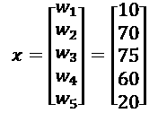
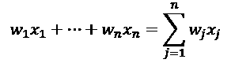
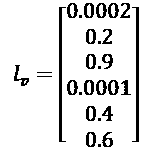
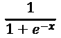
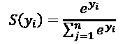
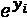
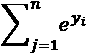
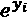
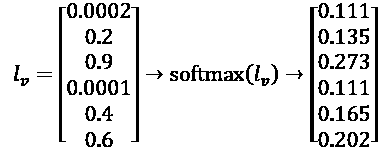
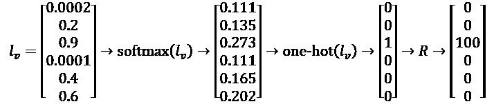

# 第二章：构建奖励矩阵 – 设计你的数据集

实验和实现是人工智能的两种主要方法。实验主要包括尝试现成的数据集和黑盒、现成的 Python 示例。实现则包括准备数据集、开发预处理算法，然后选择模型、适当的参数和超参数。

实现通常涉及白盒工作，这需要精确了解算法的工作原理，甚至能够修改它。

在*第一章*，*通过强化学习开始使用下一代人工智能*中，基于 MDP（马尔可夫决策过程）的贝尔曼方程依赖于奖励矩阵。在本章中，我们将深入探讨创建奖励矩阵的白盒过程。

MDP 过程无法在没有奖励矩阵的情况下运行。奖励矩阵决定了是否可以从一个单元移动到另一个单元，从 A 到 B。例如，它就像城市地图一样，告诉你是否可以走某条街，或者那条街是否是单行道。它还可以设定一个目标，比如在城市中你想去的某个地方。

为了实现设计奖励矩阵的目标，其他系统、软件和传感器提供的原始数据需要经过**预处理**。如果数据没有经过**标准化**处理，机器学习程序将无法提供有效的结果。

奖励矩阵，`R`，将使用 TensorFlow 中的 McCulloch-Pitts 神经元来构建。随着电子商务在许多市场领域的崛起，仓库管理也呈现出爆炸式增长。本章介绍了自动导引车（AGV），它是仓库中用于存取产品的相当于 SDC（自动存取设备）的系统。

本章的挑战是详细理解预处理阶段。处理后的数据集质量将直接影响任何机器学习算法的准确性。

本章涵盖以下主题：

+   McCulloch-Pitts 神经元将处理原始数据并对其进行转换

+   逻辑回归分类器将启动神经网络过程

+   逻辑 sigmoid 将压缩这些值

+   softmax 函数将对值进行归一化处理

+   one-hot 函数将选择奖励矩阵的目标

+   仓库中 AGV（自动导引车）的示例

这些主题构成了一系列工具，这些工具又形成了一个管道，将原始数据转换为奖励矩阵——一个 MDP。

# 设计数据集 – 梦想停止的地方，艰苦工作的开始

如同上一章所述，请记住，现实生活中的项目在某种形式下都会经历三维方法。首先，重要的是在不急于打开笔记本电脑的情况下，先思考和讨论需要解决的问题。完成这一步后，请记住，机器学习和深度学习的基础依赖于数学。最后，一旦问题被讨论并进行了数学表示，就可以开始开发解决方案。

首先，考虑一个**自然语言**的问题。然后，做出该问题的**数学描述**。只有在此之后，才应开始**软件实现**。

## 设计数据集

第一章中描述的强化学习程序可以解决多种涉及无标签分类的无监督决策问题。Q 函数可以应用于无人机、卡车或汽车配送，也可以应用于游戏或现实生活中的决策。

然而，在一个实际案例研究问题中（例如，在仓库中为 AGV 定义奖励矩阵），难点在于使用合适的 **特征**生成一个高效的矩阵。

例如，AGV 需要来自不同来源的信息：每日预测和实时仓库流量。

仓库管理着成千上万个位置和数十万个输入输出。将过多的特征塞入模型会适得其反。移除特征和无价值的数据需要谨慎考虑。

一个简单的神经元可以提供一种高效的方法来实现输入数据的**标准化**。

机器学习和深度学习常常用于预处理输入数据，以实现标准化、归一化和特征减少。

## 使用 McCulloch-Pitts 神经元

为了创建奖励矩阵 `R`，需要将仓库中处理巨大数据量的强大模型简化为有限数量的特征。

在一个模型中，例如，成千上万的输入可以描述如下：

+   低优先级权重的预测产品到达：`w₁` = 10

+   高优先级权重的确认到达：`w₂` = 70

+   销售部门决定的非计划到达：`w₃` = 75

+   高优先级权重的预测：`w₄` = 60

+   低周转率的确认到达，因此权重较低：`w₅` = 20

权重已作为常量提供。McCulloch-Pitts 神经元不会修改权重。Perceptron 神经元会修改权重，正如我们将在*第八章*中看到的，*通过前馈神经网络解决 XOR 问题*。经验表明，修改权重并非总是必要的。

这些权重形成一个向量，如下所示：



向量的每个元素代表存储在最佳位置的产品特征的权重。该过程的最终阶段将生成一个奖励矩阵 `R`，用于优化 MDP 中仓库位置之间的路径。

让我们关注我们的神经元。这些权重，像这样的系统使用时，每个神经元可以达到超过 50 个权重和参数。在这个例子中，实现了 5 个权重。然而，在现实生活中，许多其他参数需要考虑，比如未确认的到达、具有高优先级的未确认到达、低优先级的已确认到达、来自可能不符合安全标准位置的到达、包含潜在危险且需要特别处理的到达等等。到那时，人类甚至经典软件也无法应对如此多样化的参数。

奖励矩阵的大小将是 6×6。它包含六个位置，A 到 F。在此示例中，六个位置，`l1` 到 `l6`，是仓库存储和取货位置。

6×6 的奖励矩阵表示为六个位置实现的 McCulloch-Pitts 层的目标。

在实验过程中，奖励矩阵 `R` 可以用于测试目的进行构造。在现实生活中的实现中，你需要找到从头开始构建数据集的方法。奖励矩阵将成为预处理阶段的输出。以下源代码展示了第一章中使用的强化学习程序的输入。本章的目标是描述如何生成接下来几节中将构建的奖励矩阵。

```py
# R is The Reward Matrix for each location in a warehouse (or any other problem)
R = ql.matrix([ [0,0,0,0,1,0],
                [0,0,0,1,0,1],
                [0,0,100,1,0,0],
                [0,1,1,0,1,0],
                [1,0,0,1,0,0],
                [0,1,0,0,0,0] ]) 
```

对于我们正在使用的仓库示例，和任何其他领域一样，McCulloch-Pitts 神经元会对之前描述的输入向量的权重进行求和，从而填充奖励矩阵。

每个位置都需要其独立的神经元及其权重。

*输入* -> *权重* -> *偏置* -> *值*

+   输入是仓库中的流量或任何形式的数据。

+   权重将在此模型中定义。

+   偏置用于稳定权重。偏置的作用正如其字面意思，它会倾斜权重。它非常有用，充当一个裁判，确保权重保持在正确的轨道上。

+   值将是输出。

创建奖励矩阵的方法有很多种，只要你能想象出来。本章描述了一种有效的方法。

## McCulloch-Pitts 神经元

McCulloch-Pitts 神经元可以追溯到 1943 年。它包含输入、权重和激活函数。预处理阶段的一部分是选择合适的模型。McCulloch-Pitts 神经元能够高效地表示给定的位置。

下图展示了 McCulloch-Pitts 神经元模型：


图 2.1：McCulloch-Pitts 神经元模型

该模型包含多个输入 `x` 权重，这些权重被求和，直到达到一个阈值，经过变换后将输出 `y` = 0 或 1。在此模型中，`y` 将以更复杂的方式计算。

使用 TensorFlow 2 编写的 `MCP.py` 将用于说明神经元。

在以下源代码中，TensorFlow 变量将包含输入值（`x`）、权重（`W`）和偏置（`b`）。变量代表图形的结构：

```py
# The variables
x = tf.Variable([[0.0,0.0,0.0,0.0,0.0]], dtype = tf.float32)
W = tf.Variable([[0.0],[0.0],[0.0],[0.0],[0.0]], dtype =
    tf.float32)
b = tf.Variable([[0.0]]) 
```

在原始的 McCulloch-Pitts 人工神经元中，输入（`x`）与以下权重相乘：



数学函数变为一个通过神经元代码触发的逻辑激活函数（sigmoid），将在本章第二部分中解释。已添加偏置（`b`），使得这一神经元格式至今仍然有效，如下所示：

```py
# The Neuron
def neuron(x, W, b):
    y1=np.multiply(x,W)+b
    y1=np.sum(y1)
    y = 1 / (1 + np.exp(-y1))
    return y 
```

在启动会话之前，McCulloch-Pitts 神经元（1943）需要操作员设置其权重。这是 McCulloch-Pitts 神经元与感知器（1957）之间的主要区别，后者是现代深度学习神经元的模型。感知器通过优化过程来优化其权重。*第八章*，*使用前馈神经网络解决 XOR 问题*，解释了为什么需要现代感知器。

权重现已提供，输入值的数量也已提供，这些值存储在 `l₁` 的 `x` 向量中，`l₁` 是此仓库示例中的六个位置之一：


权重值将除以 100，以表示仓库流量在给定位置的 0 到 1 之间的百分比。以下代码处理的是选择一个位置，`l₁` **仅**，其值和参数：

```py
# The data
x_1 = [[10, 2, 1., 6., 2.]]
w_t = [[.1, .7, .75, .60, .20]]
b_1 = [1.0] 
```

调用神经元函数，并输入仓库流量的权重（`w_t`）和数量（`x_1`）。在此模型中，偏置设置为 `1`。无需初始化会话；只需调用神经元函数：

```py
# Computing the value of the neuron
value=neuron(x_1,w_t,b_1) 
```

神经元函数 `neuron` 将计算神经元的值。程序返回以下值：

```py
value for threshold calculation:0.99999 
```

该值表示位置 `l₁` 在特定日期和特定时间的活动情况。此示例仅表示需要计算的六个位置中的一个。对于该位置，值越高，接近 1，表明该区域的饱和率越高。这意味着该位置几乎没有空间用于存储产品。这就是为什么仓库的强化学习程序在此模型中会寻找某一产品在给定时间内的**最少负载**区域。

每个位置都有一个可能的**可用性**：

`A` = 可用性 = 1 – 负载

给定存储点的负载概率介于 0 和 1 之间。

高可用性值接近 1，而低概率值接近 0，如下例所示：

```py
>>> print("Availability of location x:{0:.5f}".format(
...       round(availability,5)))
Availability of location x:0.00001 
```

例如，`l₁` 的负载可能为 0.99，且其最大**可用性**为 0.002。AGV 的目标是搜索并找到最近且最具可用性的地点，以优化其轨迹。在该日期和时间，`l₁` 不是一个好的选择。**负载**是生产或服务活动中的一个关键字。资源越不可用，负载率越高。

当所有六个位置的可用性通过 McCulloch-Pitts 神经元计算完成——每个位置都有其各自的输入量、权重和偏差——该系统的结果将生成一个位置向量。然后，程序需要实现通过递归使用单一神经元模型来运行所有六个位置，而不仅仅是一个位置：

`A`(`L`) = {`a`(`l₁`), `a`(`l₂`), `a`(`l₃`), `a`(`l₄`), `a`(`l₅`), `a`(`l₆`)}

可用性，1 – *神经元的输出值*，构成一个六维向量。以下的向量，`l[v]`，将在**所有**六个位置上运行之前的示例代码后获得。



如前面的公式所示，`l[v]` 是一个包含每个位置的值的向量，供给定 AGV 选择。向量中的值表示可用性。0.0002 表示可用性很低；0.9 表示可用性很高。通过这种选择，MDP 强化学习程序将优化 AGV 的轨迹，以到达这个特定的仓库位置。

`l[v]` 是 AGV 六个潜在位置的加权函数结果。它也是一个经过转换的输入向量。

## Python-TensorFlow 架构

McCulloch-Pitts 神经元的实现可以最好地通过以下图表来展示：


图 2.2：McCulloch-Pitts 神经元的实现

数据流图还可以在出现问题时帮助优化程序，正如经典计算中那样。

# Logistic 激活函数和分类器

现在，`L` = {`l₁`, `l₂`, `l₃`, `l₄`, `l₅`, `l₆`} 中包含每个位置的可用性值，所有位置可以从最可用到最不可用的顺序进行排序。接着，可以构建用于 MDP 过程的奖励矩阵 `R`，该过程在 *第一章*《通过强化学习入门下一代人工智能》中描述。

## 总体架构

在这一点上，总体架构包含两个主要组件：

1.  **第一章**：基于值-动作 Q 函数的强化学习程序，使用奖励矩阵，该矩阵将在本章最终确定。奖励矩阵在第一章中作为实验提供，但在实现阶段，您通常需要从头开始构建它。有时，制作一个好的奖励矩阵可能需要几周的时间。

1.  **第二章**：设计一组 6×1 神经元，表示在六个位置上某一时刻的产品流。输出是从 0 到 1 的可用性概率。最高值表示最高可用性，最低值表示最低可用性。

在这一点上，我们可以通过一个示例从这两个主要功能中提取一些现实生活中的信息：

+   一台 AGV 正在自动移动在仓库中，并等待接收下一个位置，以使用 MDP 来计算任务的最优轨迹。

+   一台 AGV 使用在实验阶段提供的奖励矩阵 `R`，但需要在实施过程中进行设计。

+   已计算出一个六个神经元的系统，每个神经元对应一个位置，权衡实际数量和可能数量，给出一个可用性向量 `l[v]`。它几乎准备好为 AGV 提供所需的奖励矩阵。

在这个强化学习仓库模型中，为了计算奖励矩阵的输入值，缺少一个连接 `l[v]` 和奖励矩阵 `R` 的桥接函数。

该桥接函数是一个基于 `n` 个神经元输出的逻辑分类器，这些神经元独立或递归地执行相同的任务，且每个神经元仅执行一次。

此时，系统：

+   获取企业数据

+   使用了计算过权重的 `n` 个神经元

+   应用了激活函数

此模型中的激活函数要求使用一个常用的逻辑分类器。

## 逻辑分类器

逻辑分类器将应用于 `l[v]`（六个位置值），以找到 AGV 的最佳位置。此方法可以应用于任何其他领域。它基于六个神经元的输出，如下所示：

*输入* × *权重* + *偏置*

逻辑函数是什么？逻辑分类器的目标是为输出向量的每个值生成一个从 0 到 1 的概率分布。正如你所看到的，人工智能应用使用的是应用数学与可能值，而不是原始输出。

主要原因是，机器学习/深度学习在标准化和归一化可操作的均匀数据分布时效果最佳。否则，算法通常会产生欠拟合或过拟合的结果。

在仓库模型中，例如，AGV 需要选择最佳的、最可能的位置 `lᵢ`。即使在组织良好的企业仓库中，许多不确定因素（如迟到的货物、产品缺陷或一些未计划的突发问题）也会降低选择的概率。概率表示一个值，介于 0（低概率）和 1（高概率）之间。逻辑函数提供了将所有数值转换为 0 到 1 之间的概率以*标准化*数据的工具。

## 逻辑函数

逻辑 sigmoid 函数提供了标准化给定输出权重的最佳方式之一。神经元的激活函数将是逻辑 sigmoid。阈值通常是一个值，超过该值时，神经元的 `y` = 1；否则，`y` = 0。在此模型中，最小值将为 0。

逻辑函数表示如下：



+   `e` 代表欧拉数，或 2.71828，自然对数。

+   `x` 是要计算的值。在这种情况下，`s` 是逻辑 sigmoid 函数的结果。

代码已经在下面的示例中重新排列，以展示产生神经元输出`y`的推理过程：

```py
 y1=np.multiply(x,W)+b
    y1=np.sum(y1)
    y = 1 / (1 + np.exp(-y1)) #logistic Sigmoid 
```

得益于逻辑 sigmoid 函数，模型中第一个位置的值被压缩到 0 和 1 之间，结果为 0.99，表示该位置将被占满的概率很高。

在考虑了 0.99 值后，要计算该位置的可用性，我们从总可用性（即 1）中减去负载，计算方法如下：

可用性 = 1 - 满载的概率（值）

或

可用性 = 1 - 值

如前所见，一旦以这种方式计算所有位置，就会得到一个最终的可用性向量，`l[v]`。


在分析`l[v]`时，处理过程中出现了问题。单独看，每一行似乎没有问题。通过对每个输出权重应用逻辑 sigmoid 并从 1 中减去，每个位置显示的可用性在 0 和 1 之间。但是，`l[v]`的行总和超过了 1。那是不可能的。概率不能超过 1。程序需要修正这个问题。

每一行都会产生一个[0, 1]的解，这符合有效概率的前提条件。

在这种情况下，向量`l[v]`包含多个值，成为一个概率分布。`l[v]`的总和不能超过 1，需要进行归一化。

*softmax*函数提供了一种很好的方法来归一化`l[v]`。softmax 在机器学习和深度学习中得到了广泛应用。

请记住，*数学工具不是规则*。只要解决方案有效，你可以根据需要将它们调整到适合你问题的形式。

## Softmax

softmax 函数出现在许多人工智能模型中，用于归一化数据。softmax 可以用于分类目的和回归。在我们的示例中，我们将使用它来为 MDP 找到一个优化目标。

在仓库示例中，AGV 需要在`l[v]`向量中的六个位置之间做出可能的选择。然而，`l[v]`的总值超过了 1。`l[v]`需要对 softmax 函数`S`进行归一化。在源代码中，`l[v]`向量将命名为`y`。



以下使用的代码是`SOFTMAX.py`。

1.  `y`表示`l[v]`向量：

    ```py
    # y is the vector of the scores of the lv vector in the warehouse example:
    y = [0.0002, 0.2, 0.9,0.0001,0.4,0.6] 
    ```

1.  是`y`中的每个值（在仓库示例中是`l[v]`）的*exp*(`i`)结果，计算如下：

    ```py
    y_exp = [math.exp(i) for i in y] 
    ```

1.  是的总和，如下面的代码所示：

    ```py
    sum_exp_yi = sum(y_exp) 
    ```

现在，通过应用以下函数来对向量的每个值进行归一化：

```py
softmax = [round(i / sum_exp_yi, 3) for i in y_exp] 
```



softmax(`l[v]`)提供了一个归一化的向量，其总和等于 1，如下面的压缩版本代码所示。得到的向量通常被描述为包含 logits。

以下代码展示了 softmax 函数的一个版本：

```py
def softmax(x):
    return np.exp(x) / np.sum(np.exp(x), axis=0) 
```

`l[v]`现在通过 softmax(`l[v]`)进行归一化，方法如下。


softmax 函数的最后一部分要求 softmax(`l[v]`) 被四舍五入为 0 或 1。softmax(`l[v]`) 中的值越大，其可能性越大。在明确的转换中，最高值将接近 1，其他值将接近 0。在决策过程中，需要按以下方式确定最高值：

```py
print("7C.
Finding the highest value in the normalized y vector : ",ohot) 
```

输出值为 `0.273`，已被选为最可能的位置。然后它被设置为 1，其他较低的值被设置为 0。这叫做 one-hot 函数。这个 one-hot 函数对于编码提供的数据非常有帮助。现在得到的向量可以应用到奖励矩阵中。1 概率值将变为 `R` 奖励矩阵中的 100，如下所示：



softmax 函数现在已完成。位置 `l₃` 或 `C` 是 AGV 的最佳解决方案。概率值被乘以 100，奖励矩阵 `R` 现在可以接收输入。

在继续之前，花些时间调整源代码中的值并运行它，以熟悉 softmax 函数。

我们现在有了奖励矩阵的数据。理解项目的数学部分的最佳方法是使用实际的仓库布局从 `A` 到 `F` 画出结果。

```py
Locations={l1-A, l2-B, l3-C, l4-D, l5-E, l6-F} 
```

奖励矩阵的 `C` 行 ={0, 0, 100, 0, 0, 0}，其中 `C`（第三个值）现在是自动驾驶车辆的目标，在此情况下是仓库中的 AGV。


图 2.3：仓库运输问题的示意图

我们得到了以下奖励矩阵 `R`，它在*第一章*，*开始使用强化学习的下一代人工智能* 中有所描述：

| **State/values** | `A` | `B` | `C` | `D` | `E` | `F` |
| --- | --- | --- | --- | --- | --- | --- |
| `A` | - | - | - | - | 1 | - |
| `B` | - | - | - | 1 | - | 1 |
| `C` | - | - | 100 | 1 | - | - |
| `D` | - | 1 | 1 | - | 1 | - |
| `E` | 1 | - | - | 1 | - | - |
| `F` | - | 1 | - | - | - | - |

这个奖励矩阵正是使用 Python 强化学习程序中的 Q 函数的那个矩阵，来源于*第一章*。因此，本章的输出正是 `R` 矩阵的输入。0 值是为了让代理避开这些值。1 值表示可达的单元格。C×C 单元格中的 100 是 softmax 输出的结果。该程序设计成保持接近概率标准并有正值，如以下从 *第一章* 的 `mdp01.py` 中提取的 `R` 矩阵所示：

```py
R = ql.matrix([ [0,0,0,0,1,0],
                [0,0,0,1,0,1],
                [0,0,100,1,0,0],
                [0,1,1,0,1,0],
                [1,0,0,1,0,0],
                [0,1,0,0,0,0] ]) 
```

此时：

+   本章中函数的输出生成了奖励矩阵 `R`，它是*第一章，开始使用强化学习的下一代人工智能*中描述的 MDP 的输入。

+   MDP 过程被设置为在*第一章*中运行 50,000 次。

+   MDP 的输出有多种用途，正如我们在本章和*第一章*中看到的。

基础构建模块已就绪，可以开始评估强化学习程序的执行和性能，正如我们在*第三章*中看到的，*机器智能——评估函数与数值收敛*。

# 总结

使用带有 logistic 激活函数的 McCulloch-Pitts 神经元，在单层网络中构建强化学习的奖励矩阵，展示了一种预处理数据集的方法。

处理现实生活中的数据通常需要通过 softmax 函数对 logistic sigmoid 函数进行泛化，并且对 logits 应用 one-hot 函数来编码数据。

机器学习函数是必须理解的工具，只有理解它们，才能利用它们的全部或部分来解决问题。通过这种人工智能的实用方法，一个充满项目的世界正等着你。

这种神经元方法是多层感知器的前身，后者将在*第八章*中介绍，*通过前馈神经网络解决 XOR 问题*。

本章从实验性的黑箱机器学习和深度学习转向了白箱实现。实现需要对机器学习算法有全面的理解，这些算法通常需要微调。

然而，人工智能不仅仅是理解机器学习算法。机器学习或深度学习需要评估函数。如果没有评估函数，就无法验证性能或结果，正如在*第三章*中所解释的，*机器智能——评估函数与数值收敛*。

在下一章中，将通过一些例子展示机器智能的评估过程，这些例子展示了人类智能的局限性和机器能力的崛起。

# 问题

1.  原始数据可以作为神经元的输入，并通过权重进行变换。（是 | 否）

1.  神经元是否需要一个阈值？（是 | 否）

1.  logistic sigmoid 激活函数使得权重的总和增大。（是 | 否）

1.  McCulloch-Pitts 神经元对其输入的权重进行加权求和。（是 | 否）

1.  logistic sigmoid 函数是一个 log10 运算。（是 | 否）

1.  如果对向量应用 logistic sigmoid 函数，则不需要 logistic softmax。（是 | 否）

1.  概率是介于–1 和 1 之间的一个值。（是 | 否）

# 进一步阅读

+   原始的 McCulloch-Pitts 神经元 1943 年论文：[`www.cse.chalmers.se/~coquand/AUTOMATA/mcp.pdf`](http://www.cse.chalmers.se/~coquand/AUTOMATA/mcp.pdf)

+   TensorFlow 变量：[`www.tensorflow.org/beta/guide/variables`](https://www.tensorflow.org/beta/guide/variables)
