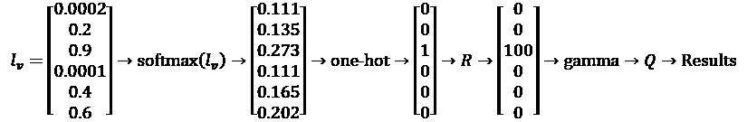
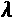
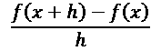
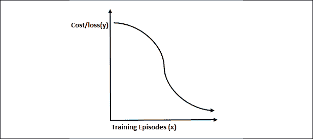
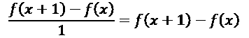
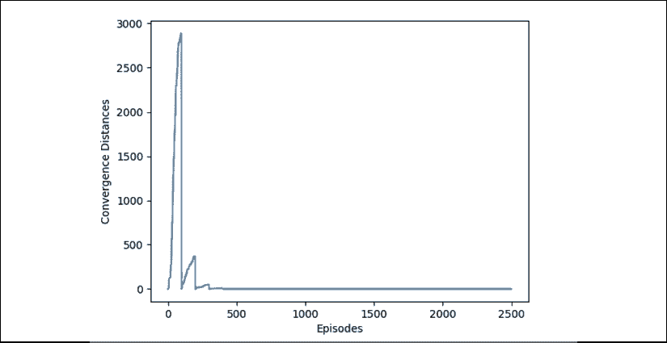

# 第三章：机器智能 – 评估函数和数值收敛

当奖励矩阵 (`R`) 驱动的 MDP 产生结果时，会出现两个问题。这些问题可以总结为两个原则。

**原则 1**：AI 算法通常在分类、预测和决策领域超越人类。

人类智能的关键执行功能——决策依赖于评估情况的能力。没有衡量利弊和考虑参数的决策是无法做出的。

人类以其评估能力为荣。然而，在许多情况下，机器能够做得更好。国际象棋代表了我们对思维能力的自豪。电影中常常出现棋盘，象征着人类智慧。

如今，没有一位棋手能够击败最强的国际象棋引擎。国际象棋引擎的一个非凡核心能力是评估函数；它比人类更精确地考虑了多个参数。

**原则 2**：原则 1 导致了一个非常棘手的后果。人类有时能够验证 AI 算法产生的结果，有时则无法验证，更不用说集成元算法了。

原则 1 一直很难被检测到，因为面部和物体识别的媒体炒作。人类很容易检查 ML 算法是否正确分类了应该分类的面部或物体。

然而，在涉及许多特征的决策过程中，原则 2 很快显现出来。在本章中，我们将识别要衡量的结果和收敛性，并决定如何衡量它。我们还将探索衡量和评估方法。

本章涉及以下主题：

+   学习会话的阶段评估

+   数值收敛测量

+   数值梯度下降简介

+   决策树监督学习作为一种评估方法

首先需要设定评估目标。为此，我们将决定衡量什么以及如何衡量。

# 跟踪需要衡量的内容并决定如何衡量

我们现在将着手解决一个棘手的任务，即找出可能导致系统出错的因素。

在前几章中构建的模型可以总结如下：



从 `l[v]`（例如仓库中的容量）到 `R`，该过程从原始数据中创建奖励矩阵（*第二章*，*构建奖励矩阵 – 设计您的数据集*），这是 MD P 强化学习程序所需要的（*第一章*，*通过强化学习开始探索下一代人工智能*）。正如前一章所描述的，softmax(`l[v]`) 函数应用于 `l[v]`。接着，应用 one-hot(softmax(`l[v]`))，然后将其转换为奖励值 `R`，该值将用于 `Q`（Q-learning）算法。

MDP 驱动的贝尔曼方程然后从读取`R`（奖励矩阵）到结果运行。Gamma 是学习参数，`Q`是 Q 学习函数，结果代表过程状态的最终值。

测量的参数如下：

+   公司的输入数据。像 MNIST 这样的现成数据集被设计为在探索阶段高效使用。这些现成的数据集通常包含一些噪音（不可靠的数据），以使它们更真实。同样的过程必须通过原始公司数据完成。唯一的问题是你无法从某个地方下载公司数据集。你必须构建耗时的数据集。

+   将应用的权重和偏差。

+   激活函数（逻辑函数或其他）。

+   在单热过程后要做出的选择。

+   学习参数。

+   通过收敛进行剧集管理。

+   通过交互式随机检查和独立算法（如监督学习）的验证过程来控制无监督算法。

在真实的公司项目中，一个系统在生产出数以万计的结果之前将不会被批准。在某些情况下，只有在测试了数百个数据集并有数百万数据样本的情况下，公司才会批准系统以确保所有场景都准确。每个数据集代表顾问可以使用参数脚本进行工作的一个场景。顾问引入由系统测试和测量的参数场景。在具有多达 200 个参数的决策系统中，在工业环境中，顾问将需要几个月的时间。强化学习程序将独自计算事件。然而，即便如此，顾问在管理超参数时仍然是必要的。在真实的具有高财务风险的系统中，质量控制将始终是必不可少的。

测量因此应更多地适用于泛化，而不仅仅适用于单个或少数数据集。否则，你会有一种自然倾向来控制参数，并在太好以至于不真实的场景中过拟合你的模型。

例如，假设你早上醒来，看到天空晴朗，阳光明媚，没有云。第二天你醒来，看到同样的天气。你将这些记录在数据集中，并发送给客户进行天气预测。每次客户运行程序时，它都预测天气晴朗！这就是过拟合导致的结果！这解释了为什么我们需要大量数据集来充分理解如何使用算法或说明机器学习程序的工作原理。

除了奖励矩阵之外，第一章的强化程序有一个学习参数！[](img/B15438_03_003.png)，在`mdp03.py`中显示，用于本节：

```py
# Gamma: It's a form of penalty or uncertainty for learning
# If the value is 1, the rewards would be too high.
# This way the system knows it is learning.
gamma = 0.8 
```

学习参数本身需要被密切监控，因为它为系统引入了不确定性。这意味着学习过程始终保持一种概率性，永远无法确定。有人可能会想，为什么不干脆去除这个参数。矛盾的是，这样做反而会导致更大的全局不确定性。学习参数越接近 1，你就越有可能使结果过拟合。过拟合意味着你让系统认为它在学习得很好，实际上并非如此。就像一位老师总是给班上每个学生都打高分一样。老师实际上是在过度拟合成绩与学生表现的评估过程，结果大家都不知道学生是否真的学到了东西。

强化程序的结果需要在每次训练中进行衡量。学习过程本身的范围也必须被测量。

所有这些测量都将对获得的结果产生重要影响。

最好的开始方法是通过测量系统的收敛质量。

如果系统提供了良好的收敛性，你可能会避免重新检查一切的麻烦。

## 收敛

收敛度衡量的是训练会话当前状态与目标之间的距离。在强化学习程序中，例如在马尔可夫决策过程（MDP）中，并没有训练数据，因此也没有目标数据可以进行比较。

然而，有两种方法可以选择：

1.  **隐式收敛**：在这种情况下，我们运行大量的训练轮次，例如 50,000 次。通过反复试验，我们知道程序到那时会找到一个解决方案。

1.  **数值控制梯度下降**：我们在每次训练中测量进展，并在安全的情况下停止训练。

### 隐式收敛

在第一章的`mdp01.py`最后部分，实现了 50,000 的范围。在这一章中，我们将运行`mdp03.py`。

在`mdp01.py`的最后部分，设置了一个使得收敛得以保证的训练轮次。在下面的代码中，范围（`50000`）是一个常量：

```py
for i in range(50000):
    current_state = ql.random.randint(0, int(Q.shape[0]))
    PossibleAction = possible_actions(current_state)
    action = ActionChoice(PossibleAction)
    reward(current_state,action,gamma) 
```

在这种情况下，收敛将定义为无论你运行系统多长时间，`Q`结果矩阵将不再发生变化。

通过设置范围为`50000`，你可以进行测试和验证。只要奖励矩阵保持一致性，这样的方法就有效。如果奖励矩阵在不同情境中有较大变化，这个模型将会产生不稳定的结果。

尝试使用不同的范围运行程序。逐渐降低范围，直到你发现结果不再最优。

### 数值控制梯度下降收敛

在这一部分中，我们将使用`mdp03.py`，它是`mdp01.py`在*第一章*中的修改版，并增加了一个新功能：数值控制梯度下降。

让 MDP 训练 50,000 次会得到不错的结果，但会消耗不必要的 CPU。使用数值控制的梯度下降评估函数可以节省大量轮次。让我们看看节省了多少。

首先，我们需要基于导数定义梯度下降函数。让我们快速回顾一下什么是导数。



`h` 是函数步长的值。想象 `h` 代表银行账户对账单的每一行。如果我们逐行阅读对账单，`h` = 1。如果我们每次读两行，`h` = 2。

阅读银行账户对账单的当前行 = `f`(`x`) = *某个数额*。

当你阅读银行账户的下一行时，函数是 (`f` + `h`) = `f`(`x`) 后的数额。如果你的银行账户在 `f`(`x`) 时有 100 个货币单位，并且花费了 10 个货币单位，那么在下一行，`x` + `h`，你将剩下 `f`(`x` + `h`) = *90 个货币单位*。

梯度提供了你的斜率方向：向上、向下或保持不变。在这种情况下，我们可以说斜率，即**梯度**，正在向下，如下图所示，图中展示了随着 `x` 增加（训练轮次），`y`（成本、损失）的值逐渐减少：



图 3.1：随着训练轮次增加，成本/损失值逐渐减少的图示

我们还需要知道你的银行账户正在发生多大的变化——**导数**的值是多少。在这种情况下，导数意味着在你的银行账户对账单的每一行中，余额变化了多少。在这个例子中，你在一行对账单上花费了 10 个货币单位，所以在该 `x`（银行账户中的行）处的导数 = –10。

在《第一章，使用强化学习开始下一代人工智能》中的贝尔曼方程代码中，循环步长也是 1：

```py
for i in range(sec): 
```

由于 `i` = 1，`h` = 1，在我们的梯度下降计算中可以简化为：



我们现在在以下代码中定义 `f`(`x`)：

```py
conv=Q.sum() 
```

`conv` 是 6×6 的 `Q` 矩阵的总和，随着 MDP 训练的进展，它逐渐填充。因此 `f`(`x`) = `conv=Q.sum()` = `Q` 的总和。该函数将 `Q` 中的所有值加起来，以精确地表示系统在每个 `i` 时的状态。

`f`(`x`) = 系统在 `i` – 1 时的状态

`f`(`x` + 1) 是系统在 `i` 时的值：

```py
Q.sum() 
```

我们必须记住，随着 MDP 训练过程的进行，`Q` 矩阵正在逐渐增加。我们测量两步之间的距离，`h`。这个距离会减小。现在我们有：

`f`(`x` + 1) – `f`(`x`) = `-Q.sum()+conv`

+   首先，我们为评估函数实现额外的变量，该函数在 `mdp01.py` 的第 83 行使用梯度下降：

    ```py
    ci=0          # convergence counter which counts the number of episodes
    conv=0        # sum of Q at state 1 and then every x episodes
    nc=1          # numerical convergence activated to perform numerical-controlled gradient descent
    xi=100        # xi episode optimizer: stop as soon as convergence reached + xi-x(unknown)
    sec=2500      # security number of episodes for this matrix size brought down from 50,000 to 2,500
    cq=ql.zeros((2500, 1)) 
    ```

+   `nc=1` 激活评估函数，`ci` 开始计数此函数所需的轮次：

    ```py
    for i in range(sec):
        current_state = ql.random.randint(0, int(Q.shape[0]))
        PossibleAction = possible_actions(current_state)
        action = ActionChoice(PossibleAction)
        reward(current_state,action,gamma)
        ci+=1                          # convergence counter incremented by 1 at each state
        if(nc==1):                      # numerical convergence activated 
    ```

+   在第一次训练轮次，`i==1`，`f`(`x`)= `Q.sum()`，如预期所示：

    ```py
     if(i==1):               # at state one, conv is activated
                conv=Q.sum()    # conv= the sum of Q 
    ```

+   `f`(`x` + 1) = `-Q.sum()+conv` 被应用：

    ```py
     print("Episode",i,"Local derivative:",-Q.sum()+conv,... 
    ```

+   距离，导数的绝对值，会被显示并存储，因为我们将使用它来用 Matplotlib 绘制图形：

    ```py
     print(... "Numerical Convergence value estimator",
                Q.sum()-conv)
                    cq[i][0]=Q.sum()-conv 
    ```

+   `xi=100`在这个数值控制的梯度下降函数中起着关键作用。每次`xi`，过程都会暂停检查训练过程的状态：

    ```py
     if(ci==xi):   # every 100 episodes the system checks to see... 
    ```

有两种可能的情况：**a)** 和 **b)**。

**情况 a)** 只要每个回合的局部导数>0，MDP 就会继续训练过程：

```py
 if(conv!=Q.sum()): # if the sum of Q changes...
                conv=Q.sum()   # ...the training isn't over, conv is updated
                ci=0           # ...the convergence counter is set to O 
```

输出将显示不同的局部导数：

```py
Episode 1911 Local derivative: -9.094947017729282e-13 Numerical Convergence value estimator 9.094947017729282e-13
Episode 1912 Local derivative: -9.094947017729282e-13 Numerical Convergence value estimator 9.094947017729282e-13
Episode 1913 Local derivative: -1.3642420526593924e-12 Numerical Convergence value estimator 1.3642420526593924e-12 
```

**情况 b)** 当导数值在`xi`回合后达到一个常数值时，MDP 已经训练完成，训练可以停止：

```py
 if(conv==Q.sum()):        # ...if the sum of Q has changed
                print(i,conv,Q.sum()) # ...if it hasn't the training is over
                break                 # ...the system stops training 
```

输出将显示一个常数导数，`xi`，在训练停止之前：

```py
Episode 2096 Local derivative: 0.0 Numerical Convergence value estimator 0.0
Episode 2097 Local derivative: 0.0 Numerical Convergence value estimator 0.0
Episode 2098 Local derivative: 0.0 Numerical Convergence value estimator 0.0
Episode 2099 Local derivative: 0.0 Numerical Convergence value estimator 0.0 
```

当训练结束时，将显示训练回合的数量：

```py
number of episodes: 2099 
```

2,099 远小于 50,000 个隐式收敛回合，这证明了该数值控制的梯度下降方法的效率。

在学习过程结束时，你可以显示一个包含我们在`cq=ql.zeros((2500, 1))`中存储的每个回合收敛水平的 Matplotlib 图：

```py
 cq[i][0]=Q.sum()-conv 
```

该图形由几行代码显示：

```py
import matplotlib.pyplot as plt
plt.plot(cq)
plt.xlabel('Episodes')
plt.ylabel('Convergence Distances')
plt.show() 
```



图 3.2：演示数值收敛性的图

该图显示了数值收敛性。如图中所示，随着训练回合数的增加，成本或损失下降，正如本章前面所解释的那样。

请注意该梯度下降方法的以下属性：

+   回合数会因为 MDP 是一个随机过程而在不同的训练会话中有所变化。

+   由于训练过程的随机性，局部回合的训练曲线有时会波动。有时，曲线局部上升而非下降。最终，它会达到 0 并保持在那里。

+   如果训练曲线局部上升，没什么可以做的。MDP 不会进行反向传播来修改权重、参数或策略，正如我们在*第八章*“用前馈神经网络解决 XOR 问题”中看到的那样。MDP 过程不需要任何操作。你可以尝试更改学习率，或者回去检查你的奖励矩阵和在原始数据集上实施的预处理阶段。

+   如果训练曲线没有达到 0 并保持在那里，请检查学习参数、奖励矩阵和在原始数据集上实施的预处理阶段。你甚至可能需要回去检查初始数据集中的噪声（缺陷数据或缺失数据）。

一旦 MDP 训练完成，使用第 145 行提供的功能进行一些随机测试，该功能在*第一章*中有所解释：

```py
origin=int(input("index number origin(A=0,B=1,C=2,D=3,E=4,F=5): ")) 
```

例如，当提示输入时，输入`1`并查看结果是否正确，如以下输出所示：

```py
index number origin(A=0,B=1,C=2,D=3,E=4,F=5): 1
…/…
print("Path:")
-> B
-> D
-> C 
```

这种随机测试验证方法在相对较小的奖励矩阵下能有效工作。

然而，对于一个 25×25 的奖励矩阵，这种方法就会变得困难。例如，机器可以轻松给出一个结果。但我们如何评估这个结果呢？在这种情况下，我们已经达到了人类分析能力的极限。在之前的代码中，我们输入了一个起始点并得到了答案。对于一个小的奖励矩阵，我们可以轻松地进行视觉检查，看看答案是否正确。然而，当分析 25×25 = 625 个格子时，需要几天时间来验证结果。值得一提的是，当安德烈·马尔可夫在 100 多年前发明他的算法时，他使用的是纸和笔！然而，今天我们有计算机，所以我们必须使用评估算法来评估我们的马尔可夫决策过程（MDP）的结果。

在全球化的世界中，数据和参数的不断增加使得人类无法超越机器日益增长的智能。

# 超越人类分析能力的评估

一位高效的管理者拥有较高的评估商数。在越来越多的领域中，机器往往有更高的评估商数。人类面临的问题是理解机器产生的评估结果。

有时人类会说“这是一种很好的机器思维结果”或“这是一个糟糕的结果”，但却无法解释为什么，或判断是否有更好的解决方案。

评估是所有领域中高效决策的关键之一：从国际象棋、生产管理、火箭发射、自驾车，到数据中心校准、软件开发、机场调度等。

我们将通过一个国际象棋的场景来展示人类评估的极限。

国际象棋引擎并非基于高水平深度学习的软件。它们高度依赖于评估和计算。它们的评估能力远超人类，而且从它们身上有很多值得学习的地方。现在的问题是，是否有人类能够战胜国际象棋引擎？答案是否定的。

要评估国际象棋中的局面，你需要检查所有棋子，它们的定量价值、定性价值、棋子之间的协作、谁占据了 64 个格子中的每一个、国王的安全、主教对、骑士的位置，以及许多其他因素。

在国际象棋比赛中评估一个局面，显示了为什么机器在许多决策领域超过了人类。

以下场景是在 2017 年克拉姆尼克与布鲁鲍姆对局后的第 23 步。人类无法正确评估这个局面。它包含了太多的参数和可能性，无法进行分析。


图 3.3：国际象棋示例场景

现在轮到白方走棋，经过仔细分析，发现此时两位选手都处于困境。在这样的比赛中，他们必须继续保持扑克脸。他们常常以自信的表情看着自己的棋盘，以掩饰内心的沮丧。有些人甚至缩短思考时间，让对手以为他们知道接下来的棋路。

这些对人类来说无法解决的局面，对于国际象棋引擎来说是轻松解决的，即使是智能手机上的廉价高质量国际象棋引擎也能轻松应对。这可以推广到所有日益复杂、不可预测和混乱的人类活动。决策者将越来越依赖人工智能来帮助他们做出正确的选择。

没有任何人能够像国际象棋引擎那样通过简单地计算棋子的摆放位置、自由格以及其他许多参数来评估棋局。国际象棋引擎通过数百万次计算生成评估矩阵。

以下表格是对多个位置中的一个位置（实际和潜在）进行评估的结果。

| **局面评估** | **0,3** |  |  |  |  |  |
| --- | --- | --- | --- | --- | --- | --- |
| **白方** | **34** |  |  |  |  |  |
|  | **初始位置** | **位置** | **价值** |  | **质量值** | **总价值** |
| **兵** | a2 | a2 | 1 | a2-b2 小兵岛 | 0,05 | 1,05 |
| **兵** | b2 | b2 | 1 | a2-b2 小兵岛 | 0,05 | 1,05 |
| **兵** | c2 | x | 0 | 被吃掉 | 0 | 0 |
| **兵** | d2 | d4 | 1 | 占据中心，防守 Be5 | 0,25 | 1,25 |
| **兵** | e2 | e2 | 1 | 防守 Qf3 | 0,25 | 1,25 |
| **兵** | f2 | x | 0 | 被吃掉 | 0 | 0 |
| **兵** | g2 | g5 | 1 | 未受攻击，攻击 2 格 | 0,3 | 1,3 |
| **兵** | h2 | h3 | 1 | 未受攻击，防守 g4 | 0,1 | 1,1 |
| **车** | a1 | c1 | 5 | 占据 c 文件，攻击 b7 配合 Nd5-Be5 | 1 | 6 |
| **骑士** | b1 | d5 | 3 | 攻击 Nb6，8 格 | 0,5 | 3,5 |
| **主教 DS** | c1 | e5 | 3 | 中央位置，10 格，攻击 c7 | 0,5 | 3,5 |
| **皇后** | d1 | f3 | 9 | 配合 Bg2 的电池，防守 Ne5，X 射线攻击 b7 | 1 | 11 |
| **国王** | e1 | h1 | 0 | 被 Bb6 在 a7-g1 对角线上 X 射线攻击 | -0,5 | -0,5 |
| **主教 WS** | f1 | g2 | 3 | 支援 Qf3 防守与攻击 | 0,5 | 3,5 |
| **骑士** | g1 | x | 0 | 被吃掉 | 0 | 0 |
| **车** | h1 | x | 0 | 被吃掉 | 0 | 0 |
|  |  |  | 29 |  | 5 | 34 |
|  |  |  |  |  |  | 白方：34 |

白方的位置价值为 34。

| **白方** | **34** |  |  |  |  |  |
| --- | --- | --- | --- | --- | --- | --- |
| **黑方** | **33,7** |  |  |  |  |  |
|  | **初始位置** | **位置** | **价值** |  | **质量值** | **总价值** |
| **兵** | a7 | a7 | 1 | a7-b7 小兵岛 | 0,05 | 1,05 |
| **兵** | b7 | b7 | 1 | a7-b7 小兵岛 | 0,05 | 1,05 |
| **兵** | c7 | x | 0 | 被吃掉 | 0 | 0 |
| **兵** | d7 | x | 0 | 被吃掉 | 0 | 0 |
| **兵** | e7 | f5 | 1 | 叠加，2 格 | 0 | 1 |
| **兵** | f7 | f7 | 1 |  | 0 | 1 |
| **兵** | g7 | g6 | 1 | 防守 f5 但放弃 Kg8 | 0 | 1 |
| **兵** | h7 | h5 | 1 | 前进良好，配合 f5,g6 | 0,1 | 1,1 |
| **车** | a8 | d8 | 5 | 半开放的 d 文件，攻击 Nd5 | 2 | 7 |
| **骑士** | b8 | x | 0 | 被吃掉 | 0 | 0 |
| **主教 DS** | c8 | b6 | 3 | 攻击 d4，3 格 | 0,5 | 3,5 |
| **皇后** | d8 | e6 | 9 | 攻击 d4, e5，略显拥挤 | 1,5 | 10,5 |
| **国王** | e8 | g8 | 0 | f6,h6, g7,h8 受到攻击 | -1 | -1 |
| **主教 WS** | f8 | x | 0 | 被吃掉，白方失去主教对 | 0.5 | 0.5 |
| **骑士** | g8 | e8 | 3 | 防守 c7,f6,g7 | 1 | 4 |
| **车** | h8 | f8 | 5 | 退出游戏 | -2 | 3 |
|  |  |  | 31 |  | 2,7 | 黑方：33,7 |

黑方的价值是 33.7。

所以白方以 34 – 33.7 = 0.3 获胜。

评估系统可以通过两个麦卡洛克-皮茨神经元轻松表示，一个用于黑方，一个用于白方。每个神经元有 30 个权重 = {`w₁`,`w₂` … `w[30]`}，如前表所示。两个神经元的总和需要一个激活函数，将评估值转换为 1/100 的棋子，这就是国际象棋的标准计量单位。每个权重将是方格和棋子计算的输出。然后，MDP 可以应用到贝尔曼方程中，使用一个随机生成的可能位置。

现今的国际象棋引擎采用这种暴力计算的方法。它们不需要更多的东西就能击败人类。

没有任何人类，即使是世界冠军，也无法以这种精度计算这些位置。需要考虑的参数数量每次都会让他们感到不堪重负，尤其当他们面对这样的局面时。然后，他们会带着或多或少的随机想法去走棋。与国际象棋引擎对弈的成功几率有时像是买彩票一样。国际象棋专家会在与强大棋引擎对弈时发现这一点，看看游戏如何展开。玩家们现在倾向于在被问及为何做出一个有争议的走法时，暴露出自己在提供深度分析上的无能。通常需要几个小时来回顾一局棋，分析其中的组合并找出错误走法的原因。最终，玩家们通常会借助机器来帮助他们理解发生了什么。

这里分析的位置仅代表一种可能性。国际象棋引擎会测试数百万种可能性。而人类只能测试其中的一小部分。

这样的结果测量与人类的自然思维无关。只有机器才能像这样思考。国际象棋引擎不仅能解决这个问题，而且是无法被打败的。

*原则 1：在某些情况下，人类面临的问题只有机器才能解决。*

*原则 2：有时，可以验证机器学习系统的结果，有时则不能。然而，我们必须努力找到验证结果的方法。*

解决原则 2 问题的一种方法是通过随机样本使用监督算法验证无监督算法。

# 使用监督学习来评估超越人类分析能力的结果

更常见的是，AI 解决方案超出了人类在细节分析上的能力。人类往往很难理解机器为了得出结论所做的数百万次计算，并解释其中的过程。为了解决这个问题，另一种 AI、机器学习或深度学习算法将提供辅助 AI 能力。

假设如下情况：

+   通过*第二章*，*构建奖励矩阵 – 设计数据集*中的神经网络方法预处理的原始数据运行良好。奖励矩阵看起来没问题。

+   基于 MDP 的贝尔曼方程提供了良好的强化学习训练结果。

+   收敛函数和数值有效。

+   在该数据集上的结果看起来令人满意，但结果仍然受到质疑。

管理员或用户总会提出一个难题：如何证明这个方法在未来处理其他数据集时也有效，并且能够 100%确认结果的可靠性？

唯一能确保整个系统有效的方法是运行成千上万的数据集，涵盖数十万的产品流。

现在的想法是使用监督学习创建一种独立的方式来检查结果。一种方法是使用决策树来可视化解决方案的一些关键方面，从而能够安抚用户和自己，确保系统的可靠性。

决策树提供了一种白盒方法，具有强大的功能。在本节中，我们将限制探索为一种直观的方法。在*第五章*，*如何使用决策树增强 K-Means 聚类*中，我们将深入探讨决策树和随机树的理论，并探索更复杂的示例。

在此模型中，输入的特征将被分析，以便我们进行分类。该分析可以根据实时数据转换为决策树，创建分布表示来预测未来结果。

对于本节内容，你可以运行以下程序：

`Decision_Tree_Priority_classifier.py`

或者在 Google Colaboratory 上运行以下 Jupyter notebook：

`DTCH03.ipynb`

Google Colaboratory 可能已经安装了以下两个软件包：

```py
import collections       # from Python library container datatypes
import pydotplus         # a Python Interface to Graphviz's Dot language.(dot-V command line 
```

这可以帮助你避免在本地安装它们，如果你收到 Graphviz 依赖的提示信息，这样做可能会节省一些时间。

两个程序生成相同的决策树图像：

`warehouse_example_decision_tree.png`

该决策树方法的直观描述分为 5 个步骤：

**步骤 1**：表示进入仓库存储的订单特征，例如：

```py
features = [ 'Priority/location', 'Volume', 'Flow_optimizer' ] 
```

在这种情况下，我们将模型限制为三个属性：

+   优先级/位置，这是该模型中仓库流程中最重要的属性

+   运输的体积

+   优化优先级 – 财务和客户满意度属性

**步骤 2**：为学习数据集提供优先级标签：

```py
Y = ['Low', 'Low', 'High', 'High', 'Low', 'Low'] 
```

**步骤 3**：提供数据集输入矩阵，即强化学习程序的输出矩阵。虽然数值已被近似，但足以运行模型。它们模拟了决策过程中的一些中间决策和转换（应用的比例、不确定性因子以及其他参数）。输入矩阵为 `X`：

```py
X = [[256, 1,0],
     [320, 1,0],
     [500, 1,1],
     [400, 1,0],
     [320, 1,0],
     [256, 1,0]] 
```

步骤 1 中的特征适用于每一列。

步骤 2 中的数值适用于每一行。

第三列 [0,1] 的数值是训练会话中的离散指示符。

**步骤 4**：运行标准决策树分类器。此分类器将把表示（分布式表示）分为两类：

+   高优先级订单的属性

+   低优先级订单的属性

有许多类型的算法。在这种情况下，调用一个标准的`sklearn`函数来完成任务，如下所示的源代码：

```py
classify = tree.DecisionTreeClassifier()
classify = classify.fit(X,Y) 
```

**步骤 5**：可视化将订单分为优先级组。可视化树是可选的，但提供了一种流行的白盒方法。你将需要使用：

+   `import collections`，一个 Python 容器库。

+   `import pydotplus`，一个 Python 接口，用于 Graphviz 的 dot 语言。你可以选择直接使用 Graphviz 并与其他版本的源代码结合使用。

源代码将获取决策树的节点和边，绘制它们，并将图像保存为文件，如下所示：

```py
info = tree.export_graphviz(classify,feature_names=features,
    out_file=None, filled=True,rounded=True)
graph = pydotplus.graph_from_dot_data(info)
edges = collections.defaultdict(list)
for edge in graph.get_edge_list():
    edges[edge.get_source()].append(int(edge.get_destination()))
for edge in edges:
    edges[edge].sort()
    for i in range(2):
        dest = graph.get_node(str(edges[edge][i]))[0]
graph.write_png(<your file name here>.png) 
```

该文件将包含这个直观的决策树：


图 3.3：决策树

该图片生成以下信息：

+   一个表示为图形的决策树，包含节点（框）和边（线）。

+   当*gini*=0 时，该框为**叶子节点**；树将不再继续生长。

+   *gini*表示**基尼不纯度**。从直观层面来看，基尼不纯度将集中在最高的基尼不纯度值上，以分类样本。我们将在*第五章*《如何使用决策树增强 K 均值聚类》中深入探讨基尼不纯度的理论。

+   *samples* = 6。训练数据集中有六个样本：

    +   优先级/位置 <=360.0 是可以可视化的最大分割点：

        ```py
        X = [[256, 1,0],
              [320, 1,0],
              [500, 1,1],
              [400, 1,0],
              [320, 1,0],
              [256, 1,0]] 
        ```

    +   错误的箭头指出了两个不符合<=360 的值。那些被分类为`True`的值被认为是低优先级值。

几次运行后，用户将习惯于将决策过程视为一个白盒，并且信任该系统。

每个机器学习工具都适用于特定情境中的特殊需求。在下一章《*通过 K 均值聚类优化解决方案*》中，我们将探讨另一种机器学习算法：*k 均值聚类*。

# 总结

本章区分了机器智能和人类智能。像机器一样解决问题意味着使用一系列数学函数和属性。机器智能在许多领域超越了人类。

在机器学习和深度学习的深入探索中，你会发现许多数学函数解决了核心问题。与令人震惊的宣传相反，依赖于 CPU 的数学正在取代人类，而不是某种神秘的意识智能。

机器学习的力量超越了人类的*数学推理*。它使得机器学习在其他领域的推广变得更加容易。一个数学模型，不受人类情感困扰的复杂性影响，使得在多个领域部署相同的模型变得更简单。本书前三章的模型可以应用于自动驾驶汽车、无人机、仓库机器人、调度优先级等诸多领域。尽可能设想这些模型可以应用到的多个领域。

评估与测量是机器学习和深度学习的核心。关键因素是不断监测系统产生的结果与其必须达到的目标之间的收敛性。算法参数的持续适应，为达成目标打开了大门。

当一个人类被一个无监督的强化学习算法超越时，决策树可以为人类智慧提供宝贵的帮助。

下一章，*通过 K-Means 聚类优化解决方案*，将进一步探讨机器智能。

# 问题

1.  人类能够击败国际象棋引擎吗？（是 | 否）

1.  在处理大量数据时，人类凭直觉比机器更能准确估计决策。（是 | 否）

1.  构建一个具有 Q 函数的强化学习程序本身就是一项成就。之后使用其结果则毫无意义。（是 | 否）

1.  有监督学习的决策树功能可以用来验证无监督学习过程的结果，确保其能产生可靠、可预测的结果。（是 | 否）

1.  强化学习程序的结果可以通过提供优先级作为输入，应用于调度系统。（是 | 否）

1.  人工智能软件能像人类一样思考吗？（是 | 否）

# 进一步阅读

+   欲了解更多关于决策树的内容：[`youtu.be/NsUqRe-9tb4`](https://youtu.be/NsUqRe-9tb4)

+   欲了解更多关于国际象棋分析的内容，专家如 Zoran Petronijevic（我曾与他讨论过本章内容）：[`chessbookreviews.wordpress.com/tag/zoran-petronijevic/`](https://chessbookreviews.wordpress.com/tag/zoran-petronijevic/)，[`www.chess.com/fr/member/zoranp`](https://www.chess.com/fr/member/zoranp)

+   欲了解更多关于 AI 国际象棋程序的内容：[`deepmind.com/blog/article/alphazero-shedding-new-light-grand-games-chess-shogi-and-go`](https://deepmind.com/blog/article/alphazero-shedding-new-light-grand-games-chess-shogi-and-go)
