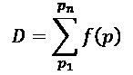
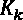
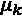
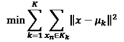
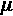
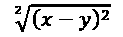
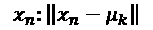
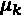

# 第四章：使用 K-均值聚类优化你的解决方案

无论我们知道多少，关键点是能够交付一个**人工智能**（**AI**）解决方案。实现一个**机器学习**（**ML**）或**深度学习**（**DL**）程序仍然很困难，随着技术按指数级进步，它将变得越来越复杂。

设计 AI 系统没有简单或轻松的方法。一个系统要么高效，要么不高效，而不仅仅是轻松或不轻松。设计的 AI 解决方案要么在现实生活中提供实际的用途，要么就会变成一个在超出其训练集范围的各种环境中无法工作的程序。

本章并不涉及如何构建一个尽可能复杂的系统来炫耀我们的知识和经验。它直面现实生活中的交付难题，并探讨克服障碍的方法。例如，没有合适的数据集，你的项目永远无法起步。即使是无监督的机器学习程序，也需要某种形式的可靠数据。

道路、火车、飞机、仓库，以及越来越多的外层空间的运输路线都需要经过精心调试的机器学习（ML）算法。电子商务的惊人扩展带来了巨大的仓库运输需求，需要自动引导车辆（AGV），然后是无尽的道路、火车或空运，去交付产品。距离计算和优化现已成为许多领域的核心目标。一辆优化仓库距离的 AGV，能够更快地装卸卡车，会使得存储和配送过程对那些期待他们的购买品立即到达的客户来说更为高效。

本章提供了克服日常 AI 项目障碍所需的方法论和工具，重点介绍了 K-均值聚类这一关键的机器学习算法。

本章涵盖以下主题：

+   设计数据集

+   设计矩阵

+   降维

+   确定训练集的规模

+   K-均值聚类

+   无监督学习

+   训练数据集的数据处理管理

+   劳埃德算法

+   构建一个 Python K-均值聚类程序

+   超参数

+   测试数据集与预测

+   使用 Pickle 保存和使用机器学习模型

我们将从如何优化和管理数据集开始讨论。

# 数据集优化与控制

在某个时刻，经理或客户不可避免地会问 AI 专家，具体需要什么数据来进行机器学习（ML）项目，以及需要的数据格式是什么。提供一个答案将需要一些深入思考和工作。

有人可能会想，为什么数据不能像我们下载现成的用于学习 AI 算法的数据集那样公开。在公司工作中，有安全规则和流程。通常，所需的数据存储在一个或多个服务器上。你不能随意做任何事情。你必须明确你的需求和请求。以 AI 所需的方式获取数据对公司来说是有成本的。你必须为你的请求提供合理的理由。

从设计数据集和选择合适的机器学习模型开始。数据集和机器学习模型将符合优化自动引导车（AGV）距离的基本要求。每个在特定仓库中的 AGV 必须减少从码头（船只可能卸货的地方）到存储区、从一个存储区到另一个区域（例如包装区），以及从存储区到码头的距离。这将降低仓库的总体成本并最大化利润。

## 设计数据集并选择机器学习（ML）/深度学习（DL）模型

从纸面上看，找到一个合适的 AGV 模型就是最小化它从 A 点到 B 点移动所需的距离。假设我们想将产品从仓库运送到码头。距离之和`D`可以作为衡量该过程的一种方式：



`f`(`p`)表示从仓库位置到码头的动作及其代表的距离。它从你在商店里拿起物品的位置（`p`），到你出门时商店的门口。你可以想象，如果你从那个位置直接走过去，付款后出门，那就是最短的路线。但是，如果你先拿起产品，在商店里漫游一会儿，然后再出去，那么距离（和时间）就会更长。所有人在商店里漫游的所有距离之和，例如，就是`D`。

任何自我引导的机器人系统中需要解决的问题可以总结为以下几个要点：

**寻找漫游者**

机器人如何漫游？它是自动的，通常由高效的机器学习程序引导。但机器人，就像其他任何交通工具一样，常常会遇到障碍。

当机器人遇到障碍时，要么停下，要么等待，要么选择另一条路线。

现在我们有一个范式来进行调查和实施：

+   检测漫游者

+   优化机器人选择

我们都知道，从 A 地点到 B 地点的最短路径是一条直线。对吧？然而，在仓库中，就像在生活中一样，这并不总是成立！假设你在车里直线行驶从 A 到 B，但却遇到了一场巨大的交通堵塞。可能需要很长时间才能走完相对较短的距离。如果你绕过堵塞，右转并开车绕行，可能节省大量时间。你最后会消耗更多的油，而从 A 到 B 的行驶成本也会上升。你就是一个漫游者。

在现实生活中的交通中，你几乎不能做什么。你不能决定某些路段的车辆只能在特定时段行驶，从 A 点到 B 点的路上。你不能决定让汽车走最小化交通的路线。在现实中，这就意味着告诉司机去另一个商场、餐馆或任何其他类似的地方，以避免交通堵塞。这是行不通的！

但是如果你是一个可以控制所有 AGV 的仓库经理，你能做的事情就很多了。你可以确保 AGV 在非常短的距离内快速到达目的地，然后返回为其他 AGV 腾出空间，从而减少成本。你可以检测到“迷路”的 AGV，并配置你的日程和 AGV，使它们最小化成本并最大化利润。没有利润，就没有仓库。

### 设计矩阵的批准

计划是首先获取尽可能多的数据，然后选择一个 ML/DL 模型。数据集必须包含 AGV（机器人）在某一天从各个位置到达码头的所有位置数据。这是一个位置到码头的分析。它们的距离会被记录在系统中，提供了一个出色设计矩阵的基础。设计矩阵中的每一行包含不同的示例，每一列是一个特征。以下格式符合需求：

| **索引** | **机器人 #** **(AGV)** | **起始位置** **时间戳:** **yyyy,mm,dd,hh,mm** | **结束位置（码头）** **时间戳:** **yyyy,mm,dd,hh,mm** | **位置** | **码头编号** | **距离** **米** |
| --- | --- | --- | --- | --- | --- | --- |
| 001 | 1 | 年-月-日-时-分 | 年-月-日-时-分 | 80 | 7 | 92 |
| 002 | 2 |  |  |  |  |  |
| 003 | 3 |  |  |  |  |  |
| 004 | 4 |  |  |  |  |  |
| 005 | 5 |  |  |  |  |  |

设计矩阵是设计 ML 解决方案的最佳方式之一。在这种情况下：

+   **索引**：机器人的任务编号

+   **机器人 #**：标识该车辆

+   **起始时间**：机器人离开位置的时间戳

+   **结束时间**：机器人到达等待装载的码头的时间戳

+   **位置**：仓库中应该取货的地方

+   **距离**：从位置到码头的距离，单位为米

距离在公制系统中以米为单位。公制系统是世界上最可靠的计量系统，因为它采用基数为 10 的计算方式，无需进行单位换算。

一码必须除以 3 才能得到英尺。一英尺必须除以 12 才能得到英寸。为了在更小的单位上工作，可能需要 1/16 英寸。

一米等于 100 厘米，一厘米等于 10 毫米，那么我们可以用 1/100 的毫米，依此类推。

即使你需要以其他单位提供报告，也要使用公制系统进行计算。

#### 获取设计矩阵格式的批准

现实中的实施与使用现成的可下载数据集进行实验不同。企业中的信息获取并不容易。

在这个例子中，在实际情况中，假设：

+   机器人编号不存储在主机中，而是存储在管理 AGV 的本地系统中。

+   在主机中，有一个开始时间，即 AGV 在位置上提取货物的时间，和一个结束时间，即它到达码头的时间。

+   位置可以在主机中获得，也可以在码头获取。

+   不记录距离。

必须访问 AGV 本地系统中的数据，以提取 AGV 编号，并将其与主机中的数据关联。

然而，在一个大型组织中，事情并不像看起来那么简单。例如：

+   从 AGV 引导系统中提取数据在本财年内可能无法实现。那些车辆很昂贵，无法分配额外的预算。

+   没有人知道从一个位置到码头的距离。只要 AGV 能准时将正确的产品送到正确的码头，迄今为止没有人关心距离问题。

+   主机中的 AGV 任务代码与本地 AGV 引导系统中的代码不同，因此在没有开发的情况下无法将其合并到数据集中。

一个 AI 项目，像任何其他项目一样，可以在短时间内失去动力。如果一个项目停滞不前，它可能就会被搁置。设计数据集需要想象力和应变能力。

让一个 AI 项目保持活力意味着要快速推进。

如果项目进展不快，它将失去动力。项目的参与者将转向其他进展更快的项目，以推动他们的公司和职业发展。

假设你的项目停滞了，因为没有人能提供你需要的距离数据来构建模型。如果你有开始时间、结束时间和速度，那么你可以绕过这个问题，自己计算距离。如果你的团队没有迅速找到这个解决方案，项目就会陷入停滞。高层管理会说，团队的成本太高，不应该继续专注于一个停滞不前的项目，无论如何，这个项目可能会马上被搁置。

降维不仅能帮助 AI 模型，它还会使信息收集变得更为容易。

#### 降维

降维可以应用于减少图像中的特征数。例如，3D 图像的每个像素都与一个神经元相连，这个神经元通过某种函数将表示转换成 2D 视图。例如，将彩色图像转换为灰色图像的不同灰度即可完成此操作。完成后，只需将数值减少到例如 1（亮）或 0（暗），就能更轻松地进行网络处理。使用转换为 0 和 1 像素的图像可以使某些分类过程更加高效，就像我们在路上避开一辆车一样。我们只是看到了那个物体并避开它。

我们整天都在做降维。当你在同一楼层的两间办公室之间走动时，你不需要爬楼梯或乘电梯，你并不会想着地球是圆的，你正在走在一条微微弯曲的路径上。

你已经执行了**降维**操作。你也在执行**流形**操作。这意味着在本楼层的局部区域，你不需要担心地球的全球曲率。在你的降维表示中的流形视图已经足够让你从办公室走到楼层的另一间办公室。

当你拿起咖啡杯时，你会专注于不把它弄掉，并瞄准杯子的边缘。你不会思考杯子的每一个**特征**，比如它的大小、颜色、装饰、直径以及杯子里咖啡的确切容量。你只是识别杯子的边缘并拿起它。这就是降维。没有降维，什么也做不成。在那种情况下，你可能需要 10 分钟才能分析杯子并把它拿起来！  

当你拿起那杯咖啡时，你会测试它是否过热、过冷，还是正好。你不会往杯子里放一个温度计来精确测量温度。你再次进行了降维操作，忽略了那杯咖啡的其他特征。此外，当你拿起杯子时，你通过仅观察杯子周围的小范围距离来计算一个流形表示，从而减少了周围信息的维度。你不会担心桌子的形状，或者桌子另一侧是否脏了等其他特征。  

机器学习（ML）和深度学习（DL）技术，如降维，可以被视为工具，能够在任何领域中加速计算过程。  

尽管我们经常将降维与机器学习和深度学习相关联，但降维的概念与数学甚至人类历史一样古老！很久以前，有人去了海滩，看到了美丽的太阳。那个人第一次在人类历史上，在沙滩上画了一个圆圈。这个圆圈不像太阳那样具有三维效果，也没有颜色，但周围的人都感到震惊：  

+   一群人正在观察太阳  

+   有人把颜色移除  

+   这个人还把 3D 视图移除  

+   他们用一个圆圈在更小的维度空间中表示太阳  

+   第一位数学家诞生了！  

k-means 聚类算法提供了一种高效的方法来表示我们在本章中处理的机器人示例。每个地点将形成一个聚类，下一节将对此进行解释。  

解决缺失数据问题的一种方法是使用以下数据格式运行 k-means 聚类算法：  

| **索引** | **位置** | **起始位置：时间戳：yyyy,mm,dd,hh,mm** | **结束位置：时间戳：yyyy,mm,dd,hh,mm** |
| --- | --- | --- | --- |
| 001 |  |  |  |   |

#### 训练数据集的体量  

在这个模型中，我们将专注于分析六个地点。六个地点选在主仓库内，靠近一组卡车装卸点。考虑到大约 5,000 个样本，这些样本应该代表**AGI-AI**公司购买的 25 辆 AGV（自动导引车）全天 24 小时运行的工作情况。  

现在我们已经讨论了如何优化和控制数据集，接下来让我们来讨论实际解决方案。在下一节中，我们将讲解如何实现 k-means 聚类。  

# 实施 k-means 聚类解决方案  

数据集需要经过预处理，以便转换为一个原型，从而证明该项目的财务价值。  

在企业环境中，绝对不要实施机器学习解决方案，除非你知道它代表的利润和完成工作的成本。没有利润，公司无法生存。机器学习，像任何其他投资一样，必须提供投资回报率（ROI）。在我们的案例中，机器学习将通过减少 AGV 的行驶距离来降低仓库的运输成本。

## 愿景

一个涉及机器人的机器学习项目的主要目标可以用一句话总结：通过优化机器人活动找到利润。实现这个目标将获得全面项目的预算。

提供的数据不包含距离。然而，可以按位置估算距离，方法如下：

距离 = (结束时间 – 开始时间)/机器人平均速度

在这个特定的仓库配置中，起始位置通常是靠近码头的装载点。

### 数据

提供的数据包含开始时间`sₜ`、结束时间*end*[t]和交付位置。为了计算距离，我们可以使用以下公式：

`d`i = (*end*[t] – `sₜ`)/`v`

+   `v` = AGV 每分钟的速度

+   *end*[t] – `sₜ`的单位是分钟

+   `dᵢ` = 估计 AGV 在给定时间内走过的距离

一个预处理程序将读取初始文件格式和数据，并输出一个新的文件，`data.csv`，其格式为具有两个特征的降维格式：

| **距离** | **位置** |
| --- | --- |
| 55 | 53 |
| 18 | 17 |

#### 预处理管理

数据预处理意味着准备将作为系统输入的数据。**差的预处理**可能会产生两种结果：

+   含有噪声的坏数据不会产生差异（大数据量和小错误）

+   含有噪声的坏数据会影响结果（无论数据量多大，数据都会影响最终结果）

在这个特定的例子中，假设在提供的 5000 条数据记录中，25 个距离数据不可靠。0.005%的噪声水平不应成为问题。可接受的噪声量取决于每个项目，不能是一个随意的数字。

有时候，噪声会产生深远的影响，有时则不会。假设 5000 条记录中有 2500 条包含噪声，也许剩下的 2500 条记录提供了足够多样的样本，从而得出可靠的结果。另一方面，也许 5000 条记录中缺失了 10 个样本，这就可能导致项目无法进行，因为这 10 个样本是唯一能够影响计算结果的特殊类型。

你需要进行实验并确定给定项目的可接受噪声水平。

让我们动手分析数据吧。

位置编号从#1 开始。#1 靠近产品的装载点。机器人需要将产品带到这个位置。更准确地说，在这个仓库配置中，机器人去取一个箱子（或板条箱）并将其带回位置 1。在位置 1，人工检查产品并进行包装。之后，人工将产品小心地装载到送货卡车上。

从一个位置到下一个位置的距离大约是 1 米。例如，从位置 1 到位置 5，距离约为 5 米或 5 m。此外，由于所有位置在这个模型中都会引导 AGV 到位置 1，理论上的距离将从位置 1 开始计算。为了概括这个规则并定义位置 *lj* 的距离 `dᵢ`，计算可以简化如下：

`d`i = *lj*

`dᵢ` 以米为单位表示。由于位置编号从 1 到 `n`，因此位置编号等于从机器人出发的第一个位置的近似距离。

假设通过查看数据，我们很快发现许多距离值大于它们的定位编号。这很奇怪，因为距离应该大致等于位置。因此，通过减少维度的数量并专注于主要特征的近似值，关键概念可以得到表达。

是时候建立一个策略和程序了。

### 策略

就像所有机器学习项目一样，有一些关键的标准公司指南是不应忽视的：

+   快速编写一个概念验证（POC）。POC 将证明机器学习解决方案的有效性。在这种情况下，机器人活动将被可视化。

+   详细检查结果。

+   计算通过尚未找到的解决方案优化后的潜在利润。利润将证明投资是值得的。成本可以作为一个指标。但此后，成本的降低必须足够大，以显著提高给定公司的利润。

+   提供充分的案例来获得批准，并为项目争取绿灯。

现在我们的策略已经明确，我们可以选择一个模型。k-means 聚类是一个适合开始此项目的好算法。它将创建几个聚类，这些聚类几乎字面上代表了自动导引车（AGV）应当位于的位置区域。通过选择简单的维度，视觉表示足够接近现实，用户能够理解计算过程。

## k-means 聚类程序

k-means 聚类是一种强大的无监督学习算法。我们在生活中经常进行 k-means 聚类。例如，假设你要为约 50 人的团队组织午餐，这个开放空间恰好能容纳这些人。

你的朋友和另一位朋友首先决定在中间设立一张桌子。你的朋友指出，房间里的人会形成一个大的聚类 `k`，而只有一个位于几何中心（或质心） `c` 的桌子，这将不切实际。靠近墙壁的人将无法接触到主桌子，如下图所示。


图 4.1：人们尝试围绕一张桌子聚集的场景

离桌子较远的人（图中间的矩形区域）将不容易接触到桌子。

你现在尝试在不同位置为两组人群 `k[1]` 和 `k[2]` 设置两个中心点（质心） `c[1]` 和 `c[2]`。

人群`x[1]`到`x[n]`构成了数据集`X`。当想象数据集`X`时，发现表格的位置不对。

最好的做法是移动表格`c`，然后估算人群（`X`的一个子集）到该表格的平均距离将在其所在的组或聚类`k`内大致相同。其他表格也会按相同方式处理。你可以在地板上画一条线，以确保每个组或聚类与其表格的平均距离大致相同。

这种直观的 k 均值聚类方法可以总结如下：

+   **步骤 1**：你已经用粉笔画线，决定每个人`x`将属于哪个组（聚类`k`），通过查看该人到表格`c`的平均距离。

+   **步骤 2**：你已经根据需要调整了表格的位置，以优化步骤 1。

一个模拟使用 k 均值聚类计算的三表模型的 Python 程序将生成以下结果：


图 4.2：通过 k 均值聚类计算出的三表模型

在提供了直观的例子之后，接下来我们讨论 k 均值聚类的数学定义。

### k 均值聚类的数学定义

数据集`X`提供了`N`个数据点。这些数据点是通过将距离作为笛卡尔坐标系中的`x`轴、位置作为`y`轴来表示的。即使数据经过算法处理和转换，这种低级别的表示方式仍然是一种白盒方法。白盒方法指的是过程透明，我们可以实际看到算法在做什么。黑盒方法则是输入进入系统后，我们仅凭结果无法理解系统的操作。

然而，高级表示方法需要通过聚类表示更多特征。在这种情况下，就无法直接看到实际意义与其机器学习表示之间的联系。我们将在接下来的章节中探讨这些高维表示。

如果你的文件中第一条记录是位于位置 1 的机器人，它将通过黑点表示为`x`轴=1，`y`轴=1，如下图所示：


图 4.3：笛卡尔坐标表示

在这个例子中，5,000 条记录从`data.csv`中加载，文件与程序位于同一目录下。这些数据没有标签，且没有线性可分。目标是将`X`数据点分配到`K`个聚类中。聚类的数量是输入值。每个聚类将有其几何中心或质心。如果你决定使用三个聚类`K`，那么结果将如下所示：

+   三个聚类`K`，在视觉表示中采用三种颜色

+   三个几何中心或质心，表示该簇中 `x` 数据点的距离之和的平均中心

如果你决定有六个簇，那么你将得到六个质心，依此类推。

用数学术语描述，关于 ，  的公式如下：



每个 `k`（簇）的成员 `xᵢ` 到 `x[n]` 的每个簇 `K` 的位置到几何中心（质心）  的所有距离之和，必须最小化。

每个成员 `x` 到质心  的距离越小，系统就越优化。请注意，距离每次都会平方，因为这是算法版本中的欧几里得距离。

在一维情况下，欧几里得距离是两个点 `x` 和 `y` 之间的距离，例如，可以表达如下：



用欧几里得距离表示的 `x` 和 `y` 之间的距离，并不是一个自动导引车（AGV）在仓库内实际行驶的距离。本章中构建的模型是为了确保距离足够现实，以便形成良好的簇并改善仓库的组织结构。这是足够的，因为 AGV 经常会从一个货位直线行驶到最近的走道，再到存储点，例如。

为了计算实际的距离，我们常常使用曼哈顿距离。曼哈顿距离是出租车的行驶距离。例如，你先沿着一个街区走，再向左走另一个街区，依此类推，沿途加总各段距离。这是因为你不能穿过建筑物。

在我们的情况下，就像说出租车只能在某个大街上大致上下行驶，像公交车一样，避免右转或左转。

我们将使用欧几里得距离的 Lloyd 算法来估算 AGV 必须保持的簇，以避免它们四处游走。

#### Lloyd 算法

Lloyd 算法有几种变体。但所有变体都遵循一个共同的哲学。

对于给定的 `x[n]`（数据点），其簇中质心  与其他中心的距离必须小于去其他中心的距离，就像在午餐例子中，一个人希望靠近一张桌子，而不是因为人群拥挤而远去拿三明治。

对于给定的 `x[n]`，最佳质心  如下所示：



这个计算对于所有簇 `k[1]` 到 `K` 中的所有质心  都会进行。

一旦每个 `xᵢ` 被分配到一个 `K[k]`，算法就会重新计算 ，方法是计算每个簇中所有点的均值，并重新调整质心 。

我们现在已经涵盖了开始编码所需的所有概念。让我们开始编写 Python 程序吧！

### Python 程序

`k-means_clustering_1.py` 这个 Python 程序使用了 `sklearn` 库，`pandas` 进行数据分析（在本程序中仅用于导入数据），以及 `matplotlib` 用于绘制结果，展示数据点（数据的坐标）和聚类（每个聚类中被分类的数据点及其颜色）。首先，以下模型被导入：

```py
from sklearn.cluster import KMeans
import pandas as pd
from matplotlib import pyplot as plt 
```

接下来，我们将逐步介绍实现 k-means 聚类的各个阶段。

#### 1 – 训练数据集

训练数据集包含 5000 行。第一行包含一个用于维护的标题（数据检查），但该行 *不* 被使用。k-means 聚类是一种 **无监督学习** 算法，意味着它将未标记的数据分类为带有聚类标签的数据，以进行未来预测。以下代码展示了数据集：

```py
#I. The training Dataset
dataset = pd.read_csv('data.csv')
print(dataset.head())
print(dataset) 
```

`print(dataset)` 这一行可以在原型阶段或维护过程中用于检查训练数据（虽然不是必须的）。以下输出确认数据已正确导入：

```py
'''Output of print(dataset)
Distance location
0 80 53
1 18 8
2 55 38
...
''' 
```

#### 2 – 超参数

**超参数**决定了计算方法的行为。在这种情况下，需要两个超参数：

+   `k` 将被计算的聚类数量。这个数字可以并且将在案例研究会议中进行调整，以找出最佳的组织过程，如下节所述。经过几次运行后，我们将直观地将 `k` 设置为 `6`。

+   `f` – 将被考虑的特征数量。在这种情况下，有两个特征：距离和位置。

程序实现了一个 k-means 函数，如下代码所示：

```py
#II.Hyperparameters
# Features = 2
k = 6
kmeans = KMeans(n_clusters=k) 
```

请注意，`Features` 超参数已被注释。在这种情况下，特征的数量是隐式的，并且由训练数据集的格式决定，该数据集包含两列。

#### 3 – k-means 聚类算法

`sklearn` 现在使用训练数据集和以下代码行中的超参数完成这项工作：

```py
#III.k-means clustering algorithm
kmeans = kmeans.fit(dataset) #Computing k-means clustering 
```

`gcenters` 数组包含几何中心或质心，可以打印出来以进行验证，如下代码片段所示：

```py
gcenters = kmeans.cluster_centers_
print("The geometric centers or centroids:")
print(gcenters)
'''Ouput of centroid coordinates
[[ 48.7986755 85.76688742]
[ 32.12590799 54.84866828]
[ 96.06151645 84.57939914]
[ 68.84578885 55.63226572]
[ 48.44532803 24.4333996 ]
[ 21.38965517 15.04597701]]
''' 
```

这些几何中心需要通过标签进行可视化，以便用于决策。

#### 4 – 定义结果标签

初始的未标记数据现在可以被分类为聚类标签，如以下代码所示：

```py
#IV.Defining the Result labels
labels = kmeans.labels_
colors = ['blue','red','green','black','yellow','brown','orange'] 
```

颜色可以用于超越简单显示标签的语义目的。例如，可以为每个主要客户或领先产品分配一种颜色。

#### 5 – 显示结果 – 数据点和聚类

为了使团队或管理层能够理解，程序现在准备将结果显示为 **数据点** 和 **聚类**。数据将以坐标的形式表示，而聚类则以颜色表示，每个聚类都有一个 **几何中心** 或 **质心**，如以下代码所实现：

```py
#V.Displaying the results : datapoints and clusters
y = 0
for x in labels:
    plt.scatter(dataset.iloc[y,0], dataset.iloc[y,1],color=colors[x])
    y+=1
for x in range(k):
    lines = plt.plot(gcenters[x,0],gcenters[x,1],'kx')
title = ('No of clusters (k) = {}').format(k)
plt.title(title)
plt.xlabel('Distance')
plt.ylabel('Location')
plt.show() 
```

数据集现在已经准备好进行分析。数据已被转换为数据点（笛卡尔坐标点）和聚类（颜色）。`x` 点代表几何中心或质心，如下图所示：


图 4.4：输出（数据点和集群）

#### 测试数据集和预测

在这种情况下，测试数据集有两个主要功能。首先，一些测试数据验证了训练后并已标记数据集的**预测**水平。输入数据包含随机距离和位置。以下代码实现了预测数据点所属集群的输出：

```py
#VI.Test dataset and prediction
x_test = [[40.0,67],[20.0,61],[90.0,90],
          [50.0,54],[20.0,80],[90.0,60]]
prediction = kmeans.predict(x_test)
print("The predictions:")
print (prediction)
'''
Output of the cluster number of each example
[3 3 2 3 3 4]
''' 
```

第二个目的，将是在未来为**决策**目的输入数据，如下节所述。

## 保存和加载模型

在本节中，`k-means_clustering_1.py`将使用 Pickle 保存模型。Pickle 是一个 Python 库，将模型保存在一个序列化文件中，如程序结尾所示：

```py
# save model
filename="kmc_model.sav"
pickle.dump(kmeans, open(filename, 'wb')) 
```

Python 的 Pickle 模块在程序头部导入：

```py
import pickle 
```

现在，模型`kmeans`已保存为名为`kmc_model.sav`的文件。

为了测试该模型，我们现在打开`k-means_clustering_2.py`，加载模型并进行预测，而不涉及任何训练：

```py
#load model
filename="kmc_model.sav"
kmeans = pickle.load(open(filename, 'rb')) 
```

`kmc_model.save`被加载并插入到名为`kmeans`的分类器中。

`x_test`与`k-means_clustering_1.py`中的测试数据相同：

```py
#test data
x_test = [[40.0,67],[20.0,61],[90.0,90],
          [50.0,54],[20.0,80],[90.0,60]] 
```

现在，我们运行并展示预测结果：

```py
#prediction
prediction = kmeans.predict(x_test)
print("The predictions:")
print (prediction) 
```

预测结果与`k-means_clustering_1.py`中的相同：

```py
The predictions:
[0 0 4 0 0 1] 
```

每个预测是一个输出集群编号，从 0 到 5，对应于作为输入的坐标。例如，[40.0,67]属于集群#0。

下一步是分析结果。

## 分析结果

以下图像显示了收益区。收益区是距离超过 80 的区域。


图 4.5：收益区

收益区提供了有用的信息。

根据计算结果，收益区显示了在展示位置上的损失。它考虑了可能位置的样本。总距离的 10%可能会被节省。

原因在于机器人并没有直接前往正确的位置，而是*在未规划的障碍物周围徘徊*。

从一个位置到另一个位置的平均距离是 1 米。自动导引车（AGV）都从位置 0 或 1 开始。因此，在这个特定示例中，距离与位置严格成正比。

要找出某个位置的收益区，您可以从位置 80 画一条红色水平线，并从距离 80 画一条垂直线（可以加上几米来考虑小的变化）。

数据可视化使得数据分析变得更加简便。通过可视化集群，管理层更容易理解输出结果并做出决策。

80 位置线上的任何数据点都不应超过最大限制。该限制为 80 米 + 几米的小偏差。在该线的右侧，公司正在损失资金，必须采取措施优化距离。这个损失区域是项目的收益区域。k 均值聚类结果显示，40 到 60 位置的一些位置超过了 80 米的距离。

### 作为解决方案的机器人虚拟集群

规划者预计机器人任务。他们将它们发送到可能的位置，从那里他们将不得不接收产品并将其带回卡车装载点。

在下面的示例中，我们将以分配给位置 40 到 60 区域的 AGV 为例。例如，如果 AGV 进一步到达 70 位置，那么其性能将增加 10 虚拟（估计）米的惩罚。这很容易检查。如果检测到 AGV 位于 70 位置，则它已经超出了其区域。

分配给位置 40 到 60 的 AGV 的业务规则是，它不能超过 60 位置。如果计划事件的软件运行良好，它将不会分配 AGV 到超过 60 位置的区域。因此，必须向规划者提供业务规则。

解决方案之一是提供 AGV 虚拟集群作为业务规则，如下截图所示：


图 4.6：AGV 虚拟集群

规则如下：

+   **规则 1**：中间的线代表一个新的业务规则。在项目的第一阶段，用于位置 40 到 60 的 AGV 不能超过 60 米加一个小的偏差线。

+   **规则 2**：一个集群将代表 AGV 的取货区。质心现在将是其停车区。直到所有集群都遵守规则 1 为止，将优化距离。如果不遵循规则 1，则 AGV 将行驶不必要的距离，增加了仓库中货物运输的总成本。

### k 均值聚类算法的实施限制

在本章中，探索了一个示例。随着体积的增加，特征达到高级抽象表示，并且噪声污染数据，人类面临几个问题：

+   如何分析超出人类分析能力的结果？

+   对于可能包含被忽视的特征的更大数据集，该算法是否可靠？

在第五章《如何使用决策树增强 k 均值聚类》中，我们将探讨这些问题并找到解决方案。

# 总结

到目前为止，我们已经使用了 Python 的 NumPy、TensorFlow、scikit-learn、pandas 和 Matplotlib 库进行了探索。本书将使用更多的平台和库。在未来的几个月和几年里，市场上将出现更多的语言、库、框架和平台。

*然而，AI 不仅仅是关于开发技术*。从零开始构建一个 k-means 聚类程序需要仔细的规划。该程序依赖于我们期望的、但往往难以获得的数据。这时，我们的想象力就显得格外重要，用来为我们的数据集找到合适的特征。

一旦数据集被定义，数据条件不良可能会危及项目。一些数据的小变化会导致错误的结果。

从零开始准备训练数据集比我们最初预期的要花费更多时间。AI 的设计初衷是为了让生活更轻松，但那是在项目成功实施之后。问题在于，构建一个解决方案需要大量的数据集工作和持续的监控。

然后就到了编写 k-means 聚类解决方案的艰苦工作，这需要向团队解释。Lloyd 算法通过减少开发时间在这方面非常有用。

在下一章，*何时以及如何使用人工智能*，我们将通过数据集技术寻找解决 k-means 聚类问题的方案。我们还将探索随机森林，并进入集成元算法的世界，这将为人类提供辅助 AI，以分析机器思维。

# 问题

1.  在企业环境中，是否可以使用随机数据构建原型？（是 | 否）

1.  设计矩阵是否包含每个矩阵一个示例？（是 | 否）

1.  AGV 永远不会普及。（是 | 否）

1.  k-means 聚类能应用于无人机交通吗？（是 | 否）

1.  k-means 聚类能应用于预测吗？（是 | 否）

1.  Lloyd 算法是一种两步走的方法。（是 | 否）

1.  超参数是否控制算法的行为？（是 | 否）

1.  一旦程序可以运行，展示方式就不再重要。（是 | 否）

1.  k-means 聚类仅仅是一个分类算法。它不是预测算法。（是 | 否）

# 进一步阅读

+   scikit-learn 网站提供了关于 k-means 聚类的更多信息：[`scikitlearn.org/stable/modules/generated/sklearn.cluster.KMeans.html`](http://scikitlearn.org/stable/modules/generated/sklearn.cluster.KMeans.html)

+   你可以在这里找到 Python 的数据分析库：[`pandas.pydata.org/`](https://pandas.pydata.org/)
