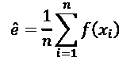
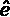
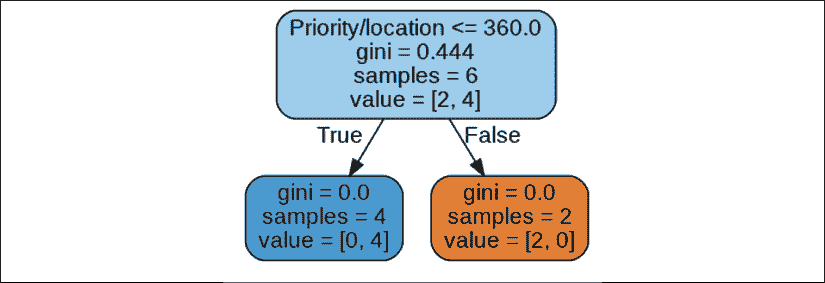
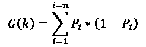
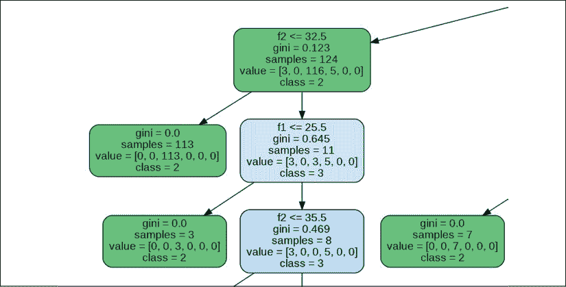

# 第五章：如何使用决策树增强 K 均值聚类

本章讨论了两个关键问题。首先，我们将探索如何在数据集超出给定算法处理能力时实现 k-means 聚类。其次，我们将实现决策树，验证超越人类分析能力的机器学习算法的结果。我们还将探索随机森林的使用。

在面对这样复杂的问题时，选择适合任务的模型往往是机器学习中最具挑战性的任务。当我们面对一组陌生的特征来表示时，这可能会让人感到困惑。然后我们必须亲自动手，尝试不同的模型。一个高效的估算器需要良好的数据集，这可能会改变项目的方向。

本章基于*第四章*《使用 K 均值聚类优化你的解决方案》中开发的 k-means 聚类（或 KMC）程序。我们将解决大数据集的问题。这次探索将带领我们进入大数法则（LLN）、中心极限定理（CLT）、蒙特卡罗估计器、决策树和随机森林的世界。

在本章所描述的过程中，人工干预不仅是多余的，而且是不可能的。机器智能在许多情况下超越了人类，而且由于现实生活系统的复杂性和不断变化的特性，给定问题的复杂性往往超出了人类的能力。得益于机器智能，人类可以处理越来越多的数据，否则这些数据将是无法管理的。

使用我们的工具包，我们将构建一个无需人工干预的算法结果分析解决方案。

本章涉及以下主题：

+   使用 KMC 进行无监督学习

+   确定是否必须使用 AI

+   数据量问题

+   定义 KMC 的 NP 难度特性

+   关于大数法则（LLN）、中心极限定理（CLT）和蒙特卡罗估计器的随机抽样

+   打乱训练数据集

+   使用决策树和随机森林进行有监督学习

+   将 KMC 与决策树连接起来

本章从无监督学习与 KMC 开始。我们将探索避免通过随机抽样运行大数据集的方法。KMC 算法的输出将为有监督的决策树算法提供标签。决策树将验证 KMC 过程的结果，这是人类在处理大量数据时无法做到的任务。

本章中的所有 Python 程序和文件都可以在[`github.com/PacktPublishing/Artificial-Intelligence-By-Example-Second-Edition/tree/master/CH05`](https://github.com/PacktPublishing/Artificial-Intelligence-By-Example-Second-Edition/tree/master/CH05)中找到。

还有一个名为`COLAB_CH05.ipynb`的 Jupyter notebook，其中包含所有 Python 程序，可以一次性运行。你可以直接将其上传到 Google Colaboratory（[`colab.research.google.com/`](https://colab.research.google.com/)），使用你的 Google 帐户进行操作。

# 使用 KMC 进行无监督学习和大数据集处理

KMC 使用未标注数据并形成数据点的聚类。这些聚类的名称（整数）为接下来运行监督学习算法（如决策树）提供了基础。

在这一节中，我们将学习如何在大数据集上使用 KMC。

当面对一个包含大量未标注数据集的项目时，第一步是评估机器学习是否可行。在一本关于人工智能的书中避免使用人工智能可能看起来有些自相矛盾。然而，在人工智能领域，就像在现实生活中一样，你应该在合适的时机使用合适的工具。如果人工智能不是解决问题的必要手段，就不要使用它。

使用**概念验证**（**POC**）方法来验证某个 AI 项目是否可行。POC 的成本远低于整个项目，且有助于建立一个相信最终成果的团队。或者，POC 可能会显示继续推进机器学习解决方案太过冒险。不可解的问题是存在的，最好避免花费数月的时间在一个无法成功的方案上。

第一步是探索数据量和将要使用的机器学习估算模型。

如果 POC 证明某个特定的机器学习算法能够解决眼前的问题，接下来的步骤就是解决数据量问题。POC 展示了模型在样本数据集上的有效性。现在，实施过程可以开始了。

任何在笔记本电脑上运行过大数据集机器学习算法的人都知道，机器学习程序需要一定的时间来训练和测试这些样本。一个机器学习程序或深度学习卷积神经网络需要消耗大量的计算机算力。即便你使用**GPU**（即**图形处理单元**）运行人工神经网络，期望能比 CPU 获得更好的性能，它仍然需要大量时间来完成所有学习周期。一个周期（epoch）意味着我们已经尝试了一组权重，例如，用来衡量结果的准确度。如果准确度不够，我们就会运行另一个周期，尝试其他权重，直到准确度足够。

如果你继续进行并希望在超过 1,000,000 个数据点的数据集上训练程序，例如，你将消耗大量本地计算机资源。

假设你需要在一个拥有数亿到数十亿条记录的公司中使用 KMC 算法，这些数据来自多个 SQL Server 实例、Oracle 数据库和大数据源。例如，假设你正在为一家领先的手机公司做电话运营活动。你必须应用 KMC 程序来分析一年中全球各地的电话通话时长。这代表着每天有数百万条记录，一年累计达到数十亿条记录。

即使 KMC 训练程序能够运行数十亿条记录，消耗的 CPU/GPU 也会非常大，并且即使成功运行也会耗费大量时间。更重要的是，十亿条记录可能只代表了不足够的特征。添加更多的特征将大大增加数据集的大小。

现在的问题是，KMC 是否能够处理如此大的数据集。KMC 问题是 **NP-hard**。`P` 代表 **多项式**，`N` 代表 **非确定性**。

解决我们体积问题需要一些理论上的考虑。我们需要识别我们所面临问题的难度。

## 识别问题的难度

我们首先需要理解我们正在处理的难度级别。一个有用的概念是 NP-hard。

### NP-hard——P 的含义

NP-hard 中的 P 意味着解决或验证 P 问题的时间是多项式的（poly=多，nomial=项）。例如，`x`³ 是一个多项式。N 表示问题是非确定性的。

一旦 `x` 已知，则 `x`³ 会被计算出来。对于 `x` = 3,000,000,000，只需要 3 次基本计算，结果是：

log `x`³ = 28.43

计算这个特定问题需要 10^(28.43) 次计算。

这看起来很可怕，但有两个原因它并不那么可怕：

+   在大数据的世界里，这个数字可以通过大规模的随机抽样来处理。

+   KMC 可以通过小批量（数据集的子集）训练来加速计算。

多项式时间意味着此时间大致与输入的大小成正比。即使训练 KMC 算法所需的时间仍然有些模糊，只要验证解决方案所需的时间因输入的批量大小而保持成正比，问题仍然是多项式的。

指数算法随着数据量增加，而不是计算次数增加。例如，这个例子的指数函数是 `f(x)` = 3^x = 3^(3,000,000,000) 次计算。这样的函数通常可以拆分为多个经典算法。这类函数在企业界存在，但它们超出了本书的范围。

### NP-hard——非确定性含义

非确定性问题需要启发式方法，这意味着某种形式的启发式，例如试错法。我们试一组权重，例如，评估结果，然后继续，直到找到令人满意的解决方案。

#### “困难”的含义

NP-hard 可以通过一些优化转化为 NP 问题。这意味着 NP-hard 与 NP 问题一样难，甚至更难。

例如，我们可以使用批量来控制输入的大小、计算时间和输出的大小。这样，我们可以将 NP-hard 问题降为 NP 问题。

创建批量以避免在数据集过大时运行算法的一种方法是使用随机抽样。

## 实现带有小批量的随机抽样

机器学习和深度学习的一个重要部分包含了各种形式的随机抽样。在这种情况下，训练集如果包含数十亿个元素，使用随机抽样将是不可或缺的，否则实现起来将极为困难，甚至不可能。

随机抽样在许多方法中都有应用：蒙特卡洛法、随机梯度下降、随机森林以及许多算法。无论采样方法的名称是什么，它们都有共同的概念，具体程度取决于数据集的大小。

在大数据集上进行随机抽样可以产生良好的结果，但它需要依赖大数法则（LLN），我们将在下一部分进行探讨。

## 使用大数法则（LLN）

在概率论中，大数法则（LLN）指出，当处理大量数据时，重要的样本足够有效，可以代表整个数据集。例如，我们都熟悉使用小数据集的民意调查。

这一原则，和所有原则一样，有其优点和局限性。但无论局限性如何，这一法则适用于日常的机器学习算法。

在机器学习中，抽样类似于民意调查。较少的个体代表了更大的总体数据集。

对小批量进行抽样并求其平均值，可以与计算整个数据集的效率相当，只要应用了科学方法：

+   使用小批量或数据子集进行训练

+   使用某种形式的估计器来衡量训练过程的进展，直到达成目标为止

你可能会惊讶地看到“直到达成目标”为止，而不是“直到达到最优解”为止。

最优解可能并不代表最佳解。所有特征和所有参数通常并未完全表达。找到一个好的解决方案通常就足以有效地进行分类或预测。

大数法则（LLN）解释了为什么随机函数在机器学习和深度学习中被广泛使用。如果随机样本遵循中心极限定理（CLT），它们将提供高效的结果。

## 中心极限定理（CLT）

大数法则（LLN）应用于 KMC 项目示例时，必须通过随机抽样提供一个合理的重心集合。如果重心正确，那么随机样本就是可靠的。

重心是数据集的几何中心，正如*第四章*中所解释的，*使用 K-Means 聚类优化你的解决方案*。

这种方法现在可以扩展到中心极限定理（CLT），该定理指出，当训练大型数据集时，使用小批量样本的子集就足够了。以下两个条件定义了中心极限定理（CLT）的主要特性：

+   子集（小批量）数据点之间的方差保持在合理范围内。

+   带有小批量方差的正态分布模式接近整个数据集的方差。

例如，蒙特卡洛估计器可以提供一个良好的基础，判断样本是否符合中心极限定理（CLT）。

### 使用蒙特卡洛估计器

“蒙特卡罗”这个名字来源于蒙特卡罗的赌场和赌博。赌博是一个很好的无记忆随机例子。无论赌徒在玩之前发生什么，先前的知识都不会提供任何洞察。例如，赌徒玩了 10 局，输了几局，赢了几局，形成了一个概率分布。

计算`F`（`x`）的分布总和。然后从数据集中提取随机样本，例如，`x₁`、`x₂`、`x₃`，...，`xₙ`。

`f`（`x`）可以通过以下方程进行估算：



估计量  代表了 KMC 算法或任何已实现模型的预测结果的平均值。

我们已经看到，数据集的一个样本可以代表完整的数据集，就像选举时，一群人可以代表整个选民群体一样。

既然我们可以放心地使用随机样本，就像在选举时对选民群体进行民意调查一样，现在我们可以直接处理整个大数据集，或者最好是使用随机样本。

## 尝试训练完整的训练数据集

在*第四章*，《通过 K 均值聚类优化解决方案》中，采用六个聚类配置的 KMC 算法生成了六个质心（几何中心），如下所示：


图 5.1：六个质心

现在的问题是，如何避免使用昂贵的机器资源来训练这个 KMC 数据集，特别是在处理大数据集时。解决方案是像选举时对选民群体进行民意调查一样，从数据集中提取随机样本。

## 训练训练数据集的一个随机样本

`sampling/k-means_clustering_minibatch.py` 程序提供了一种验证迷你批次解决方案的方法。

程序首先通过以下代码加载数据：

```py
dataset = pd.read_csv('data.csv')
print (dataset.head())
print(dataset) 
```

加载数据集可能会出现两个问题：

+   **数据集太大，无法一次性加载。** 在这种情况下，按批次加载数据集。使用这种方法，你可以在多个批次上测试模型，以微调解决方案。

+   **数据集可以加载，但所选择的 KMC 算法无法处理这么大的数据量。** 选择合适的迷你批次大小将解决这个问题。

一旦数据集被加载，程序将开始训练过程。

将使用蒙特卡罗大数据量原理随机创建一个迷你批次数据集，迷你批次大小为 1,000。蒙特卡罗方法在机器学习中有许多变体。对于我们的示例，使用随机函数来创建迷你批次就足够了：

```py
n=1000
dataset1=np.zeros(shape=(n,2))
for i in range (n):
    j=randint(0,4998)
    dataset1[i][0]=dataset.iloc[j,0]
    dataset1[i][1]=dataset.iloc[j,1] 
```

最后，KMC 算法按标准方式运行，如下所示：

```py
#II.Hyperparameters
# Features = 2 :implicit through the shape of the dataset (2 columns)
k = 6
kmeans = KMeans(n_clusters=k)
#III.K-means clustering algorithm
kmeans = kmeans.fit(dataset1) #Computing k-means clustering
gcenters = kmeans.cluster_centers_ # the geometric centers or centroids
print("The geometric centers or centroids:")
print(gcenters) 
```

以下截图显示了生成的结果，类似于在*第四章*，《通过 K 均值聚类优化解决方案》中由 KMC 训练的完整数据集：


图 5.2：输出（KMC）

得到的质心是一致的，如下所示：

```py
The geometric centers or centroids:
[[ 19.6626506 14.37349398]
 [ 49.86619718 86.54225352]
 [ 65.39306358 54.34104046]
 [ 29.69798658 54.7852349 ]
 [ 48.77202073 23.74611399]
 [ 96.14124294 82.44067797]] 
```

由于这是一个随机过程，输出在每次运行时会略有不同。在本节中，我们将数据集分解为随机样本以优化训练过程。另一种执行随机采样的方法是在训练前对数据集进行洗牌。

## 洗牌作为另一种执行随机采样的方法

`sampling/k-means_clustering_minibatch_shuffling.py`程序提供了另一种解决随机采样方法的方式。

KMC 是一种无监督训练算法。因此，它训练的是*无标签*数据。单次随机计算不会消耗大量的机器资源，但连续多个随机选择则会。

洗牌可以减少机器消耗的成本。像在扑克游戏开始前洗牌一样，在开始训练之前对数据进行适当的洗牌，可以避免重复和随机的小批量计算。在此模型中，加载数据阶段和训练阶段不变。然而，我们并不是对`dataset1`这个小批量数据集做一次或几次随机选择，而是在开始训练之前对整个数据集进行一次洗牌。以下代码展示了如何洗牌数据集：

```py
sn=4999
shuffled_dataset=np.zeros(shape=(sn,2))
for i in range (sn):
    shuffled_dataset[i][0]=dataset.iloc[i,0]
    shuffled_dataset[i][1]=dataset.iloc[i,1] 
```

然后我们选择前 1000 个洗牌后的记录进行训练，如以下代码片段所示：

```py
n=1000
dataset1=np.zeros(shape=(n,2))
for i in range (n):
    dataset1[i][0]=shuffled_dataset[i,0]
    dataset1[i][1]=shuffled_dataset[i,1] 
```

以下截图中的结果对应于完整数据集和随机小批量数据集样本的结果：


图 5.3：完整与随机小批量数据集样本

产生的质心可以提供第一层结果，以确认模型，如以下输出所示。

几何中心或质心：

```py
[[ 29.51298701 62.77922078]
 [ 57.07894737 84.21052632]
 [ 20.34337349 15.48795181]
 [ 45.19900498 23.95024876]
 [ 96.72262774 83.27737226]
 [ 63.54210526 51.53157895]] 
```

使用洗牌代替随机小批量有两个优点：限制小批量计算的次数并防止训练相同的样本两次。如果你的洗牌算法有效，你只需要对数据集进行一次洗牌。如果无效，你可能需要返回并使用随机采样，正如前一节所解释的那样。

随机采样和洗牌帮助解决了数据集体积问题的一个方面。

然而，现在我们必须探讨实现大数据集机器学习算法的另一个方面：验证结果。

## 链接监督学习以验证无监督学习

本节探讨如何使用监督算法验证无监督 KMC 算法的输出：决策树。

KMC 接收没有标签的输入并输出带标签的结果。无监督过程使杂乱的输入数据变得有意义。

本章中的示例集中在两个相关特征上：位置和距离。生成的聚类是数据集中位置-距离的子集。输入文件包含两列：距离和位置。输出文件包含三列：距离、位置和标签（聚类编号）。

因此，输出文件可以连接到监督学习算法，例如决策树。决策树将使用标记的数据生成可视化的白盒机器思维过程。此外，决策树还可以被训练来验证 KMC 算法的结果。该过程从预处理原始数据开始。

### 预处理原始数据

如前所述，对于大数据集，迷你批次是必要的。将数十亿条记录加载到内存中是不现实的。在`sampling/k-means_clustering_minibatch.py`中应用了随机选择作为 KMC 算法的一部分。

然而，由于我们将算法串联在一个管道中，并且我们并未训练模型，因此我们可以从`sampling/k-means_clustering_minibatch.py`中提取随机采样函数并将其隔离：

```py
n=1000
dataset1=np.zeros(shape=(n,2))
li=0
for i in range (n):
    j=randint(0,4999)
    dataset1[li][0]=dataset.iloc[j,0]
    dataset1[li][1]=dataset.iloc[j,1]
    li+=1 
```

代码可以应用于从大数据环境中提取的数据集，这些数据集经过预处理阶段提取。例如，预处理阶段将循环执行。现在，我们将探索从原始数据到串联的 ML 算法输出的管道。

## 脚本和 ML 算法的管道

一个 ML **管道**将接受原始数据，并执行降维或其他预处理任务，这些任务不在本书的范围内。预处理数据有时需要不仅仅是 ML 算法，比如 SQL 脚本。我们的探索从 ML 算法（如 KMC）接管后开始。然而，管道也可以通过经典的非 AI 脚本来运行，从原始数据到 ML。

以下章节描述的管道可以分解为三个主要步骤，前面是经典的预处理脚本：

+   **步骤 0**：一个标准过程在运行 KMC 程序之前，使用经典的预处理脚本对**训练数据集**进行随机采样。这个过程超出了 ML 过程和本书的范围。这样做的目的是避免过载 ML Python 程序。训练数据将首先通过 KMC 算法处理，并发送给决策树程序。

+   **步骤 1**：KMC 多 ML 程序`kmc2dt_chaining.py`使用**保存的模型**，读取步骤 0 产生的训练数据集，该模型来自*第四章*，*通过 K-Means 聚类优化解决方案*。KMC 程序接收未标记的数据，进行预测，并生成标记输出，保存在名为`ckmc.csv`的文件中。输出标签是数据集中包含距离和位置的一行的聚类编号。

+   **步骤 2**：决策树程序`decision_tree.py`读取 KMC 预测的输出文件`ckmc.csv`。决策树算法训练其模型，并将训练好的模型保存在名为`dt.sav`的文件中。

    +   **第 2.1 步**：训练阶段已经结束。现在管道接收由连续相等大小的数据集检索的原始数据。这个**批处理**过程将提供固定数量的数据。可以计划和掌控计算时间。这一步骤超出了机器学习过程和本书的范围。

    +   **第 2.2 步**：一个随机抽样脚本处理批处理，并为**预测**生成预测数据集。

+   **第三步**：`kmc2dt_chaining.py`现在将运行一个 KMC 算法，该算法与决策树链接，将验证 KMC 的结果。KMC 算法生成预测。决策树对这些预测进行进一步的预测。决策树还将为用户和管理员提供一个 PNG 格式的可视化图表。

步骤 2.1 到 3 可以在二十四小时，七天不间断地运行。

需要注意的是，随机森林是决策树组件的一种有趣的替代方案。它可以取代`kmc2dt_chaining.py`中的决策树算法。在接下来的部分，我们将探讨随机森林在这个背景下的应用，使用`random_forest.py`。

### 第 1 步 - 从无监督机器学习算法中训练并导出数据

`kmc2dt_chaining.py`可以被视为将 KMC 程序与将验证结果的决策树程序链接起来的**链条**。每个程序形成链条的一个链接。

从决策树项目的角度来看，`kmc2dt_chaining.py`可以被视为一个**管道**，用于接收未标记的数据并为监督决策树程序进行标记。管道接收原始数据，并使用多个机器学习程序进行转换。

在链接模型的训练阶段，`kmc2dt_chaining.py`运行以为决策树的训练提供数据集。参数`adt=0`限制了链条中第一个链接的 KMC 功能。因此，在这个阶段，该程序中的决策树不会被激活。

`kmc2dt_chaining.py`将加载数据集，加载保存的 KMC 模型，进行预测，并导出标记结果：

+   **加载数据集**：`data.csv`，即章节 4 中使用的数据集文件，加载两个特征`location`和`distance`：

    ```py
    dataset = pd.read_csv('data.csv') 
    ```

+   **加载 KMC 模型**：k 均值聚类模型`kmc_model.sav`是由章节 4 中的`k-means_clustering_2.py`保存的。现在使用`pickle`模块加载它：

    ```py
    kmeans = pickle.load(open('kmc_model.sav', 'rb')) 
    ```

+   **进行预测**：此时不需要对 KMC 模型进行进一步的训练。模型可以对接收到的小批量数据进行预测。我们可以使用增量过程来在大规模上验证结果。

    如果数据没有经过足够的缩放，可以应用其他算法。在这种情况下，数据集不需要额外的缩放。KMC 算法将对样本进行预测，并为决策树生成一个输出文件。

    对于这个示例，预测将逐行生成：

    ```py
     for i in range(0,1000):
            xf1=dataset.at[i,'Distance']
            xf2=dataset.at[i,'location']
            X_DL = [[xf1,xf2]]
            prediction = kmeans.predict(X_DL) 
    ```

    结果存储在 NumPy 数组中：

    ```py
     p=str(prediction).strip('[]')
            p=int(p)
            kmcpred[i][0]=int(xf1)
            kmcpred[i][1]=int(xf2)
            kmcpred[i][2]=p; 
    ```

+   **导出标记数据**：预测结果保存在一个文件中：

    ```py
    np.savetxt('ckmc.csv', kmcpred, delimiter=',', fmt='%d') 
    ```

    这个输出文件很特别；它现在已被标记：

    ```py
    80,53,5
    18,8,2
    55,38,0 
    ```

    输出文件包含三列：

    +   第 1 列 = 特征 1 = 位置；例如，第一行的`80`

    +   第 2 列 = 特征 2 = 距离；例如，第一行的`53`

    +   第 3 列 = 标签 = 计算的聚类；例如，第一行的`5`

    在我们的链式机器学习算法中，这个输出数据将成为下一个机器学习算法——决策树——的输入数据。

### 第 2 步——训练决策树

在*第三章*，*机器智能——评估函数与数值收敛*中，描述了决策树并用它来可视化优先级处理。`Decision_Tree_Priority.py`生成了如下图表：



图 5.4：决策树优先级

树从一个高基尼值的节点开始。该节点被分成两个，每个节点下的部分是“叶子”，因为基尼=0。

本书中实现的决策树算法使用基尼不纯度。

基尼不纯度表示数据点被错误分类的概率。

决策树将从最高的不纯度开始。它将在计算出一个阈值后，将概率分成两个分支。

当一个分支达到基尼不纯度为 0 时，它达到了**叶子**。

假设`k`是数据点被错误分类的概率。

来自*第三章*的`X`数据集，*机器智能——评估函数与数值收敛*，包含六个数据点。四个数据点是低值，两个数据点是高值：

`X` = {低，低，高，高，低，低}

基尼不纯度的公式计算了每个特征出现的概率，并将结果乘以 1——每个特征在剩余值中的出现概率，如下所示的公式：



应用于`X`数据集，其中六个数据点中有四个是低值，两个是高值，结果将是：

`G(k)` = (4/6) * (1 – 4/6) + (2/6) * (1 – 2/6)

`G(k)`=(0.66 * 0.33) + (0.33 * 0.66)

`G(k)`=0.222 + 0.222=0.444

数据点被错误预测的概率为 0.444，如图所示。

决策树基于**特征的信息增益**构建，选择包含最高基尼不纯度值的特征。

我们现在将探索决策树的 Python 实现，为将其链入 KMC 程序做准备。

#### 训练决策树

为了训练决策树，`decision_tree.py`将加载数据集，训练模型，做出预测，并保存模型：

+   **加载数据集**：在加载数据集之前，你需要导入以下模块：

    ```py
    import pandas as pd #data processing
    from sklearn.tree import DecisionTreeClassifier #the dt classifier
    from sklearn.model_selection import train_test_split #split the data into training data and testing data
    from sklearn import metrics #measure prediction performance
    import pickle #save and load estimator models 
    ```

模块的版本会随着编辑者的发布而变化，并且还取决于您更新版本和代码的频率。例如，当您尝试从 0.20.3 版本解压 KMC 模型时，如果使用的是 0.21.2 版本，可能会收到警告。只要它能够正常工作，在教育用途上是没问题的。然而，在生产环境中，管理员应该有一个数据库，其中列出所使用的包及其版本。

数据集被加载、标注，并分为训练数据集和测试数据集：

```py
#loading dataset
col_names = ['f1', 'f2','label']
df = pd.read_csv("ckmc.csv", header=None, names=col_names)
print(df.head())
#defining features and label (classes)
feature_cols = ['f1', 'f2']
X = df[feature_cols] # Features
y = df.label # Target variable
print(X)
print(y)
# splitting df (dataset) into training and testing data
X_train, X_test, y_train, y_test = train_test_split(
    X, y, test_size=0.3, random_state=1) # 70% training and 30% test 
```

本例中的数据将包含两个特征（位置和距离）以及一个标签（聚类编号），该标签由 KMC 算法的输出提供。以下标题展示了数据集的结构：

```py
 f1  f2  label
0  80  53      5
1  18   8      2
2  55  38      0
3  74  74      5
4  17   4      2 
```

+   **训练模型**：一旦数据集准备好，决策树分类器就会被创建，模型将进行训练：

    ```py
    # create the decision tree classifier
    dtc = DecisionTreeClassifier()
    # train the decision tree
    dtc = dtc.fit(X_train,y_train) 
    ```

+   **进行预测**：一旦模型训练完成，就在测试数据集上进行预测：

    ```py
    #predictions on X_test
    print("prediction")
    y_pred = dtc.predict(X_test)
    print(y_pred) 
    ```

    预测使用特征来预测测试数据集中的聚类编号，如以下输出所示：

    ```py
    prediction
    [4 2 0 5 0...] 
    ```

+   **使用度量衡量结果**：过程的关键部分是使用度量来衡量结果。如果准确度接近 1，那么 KMC 输出链式到决策树算法是可靠的：

    ```py
    # model accuracy
    print("Accuracy:",metrics.accuracy_score(y_test, y_pred)) 
    ```

    在这个例子中，准确度为 0.97。该模型可以以 0.97 的概率预测一个距离和位置的聚类，证明了其高效性。链式机器学习解决方案的训练已结束，预测周期开始。

您可以使用`decision_tree.py`生成决策树的 PNG 文件。取消注释程序的最后一段，其中包含导出功能：

```py
from sklearn import tree
import pydotplus
graph=1
if(graph==1):
    # Creating the graph and exporting it
    dot_data = tree.export_graphviz(dtc, out_file=None,
                                    filled=True, rounded=True,
                                    feature_names=feature_cols,
                                    class_names=['0','1','2',
                                                 '3','4','5'])
    #creating graph
    graph = pydotplus.graph_from_dot_data(dot_data)
    #save graph
    image=graph.create_png()
    graph.write_png("kmc_dt.png") 
```

请注意，一旦实现了这个功能，您可以通过`graph`参数来激活或停用它。

以下图像是为这个例子生成的，帮助您理解整个链式解决方案（KMC 和决策树）的思路。



图 5.5：代码示例的图像输出

图像文件`dt_kmc.png`可以在 GitHub 的`CH05`目录中找到。

### 第 3 步 – KMC 链式到决策树的持续循环

链式 KMC 算法与决策树算法的训练已完成。

使用经典的大数据批量检索方法的预处理阶段将持续提供带有脚本的随机采样数据集。

`kmc2dt_chaining.py`可以专注于运行 KMC 预测并将其传递给决策树预测进行白盒检查。这个持续过程导入数据集，加载保存的模型，进行预测并在决策树级别衡量结果。

链式过程如果需要可以 24 小时七天运行。

训练程序中使用的模块是 KMC 和决策树所必需的：

```py
from sklearn.cluster import KMeans
import pandas as pd
from matplotlib import pyplot as plt
import pickle
import numpy as np
from sklearn.tree import DecisionTreeClassifier
from sklearn.model_selection import train_test_split
from sklearn import metrics 
```

让我们一起回顾这个过程：

+   **加载 KMC 数据集和模型**：KMC 数据集已在预处理阶段准备好。经过训练的模型已被保存。数据集通过 pandas 加载，模型通过`pickle`加载：

    ```py
    #I.KMC. The prediction dataset and model
    dataset = pd.read_csv('data.csv')
    kmeans = pickle.load(open('kmc_model.sav', 'rb')) 
    ```

+   **预测和保存**：目标是逐行预测批量数据集，并以白盒方式将结果保存到数组中，管理员可以验证该方式：

    ```py
     for i in range(0,1000):
            xf1=dataset.at[i,'Distance']
            xf2=dataset.at[i,'location']
            X_DL = [[xf1,xf2]]
            prediction = kmeans.predict(X_DL)
            #print (i+1, "The prediction for",X_DL," is:",
                str(prediction).strip('[]'))
            #print (i+1, "The prediction for",
                str(X_DL).strip('[]'), " is:",
                str(prediction).strip('[]'))
            p=str(prediction).strip('[]')
            p=int(p)
            kmcpred[i][0]=int(xf1)
            kmcpred[i][1]=int(xf2)
            kmcpred[i][2]=p
    np.savetxt('ckmc.csv', kmcpred, delimiter=',', fmt='%d') 
    ```

    生成的`ckmc.csv`文件是下一个链环的入口：决策树。

    包含`print`指令的两行代码已注释，供标准运行使用。然而，如果代码需要维护，你可能希望详细查看输出。这就是为什么我建议在代码中添加维护行的原因。

+   **加载决策树的数据集**：决策树的数据集与`decision_tree.py`中的方法相同加载。一个参数激活决策树部分的代码：`adt=1`。因此，可以激活或停用白盒质量控制方法。

    程序加载数据集，加载模型，并进行数据分割：

    ```py
    if adt==1:
        #I.DT. The prediction dataset and model
        col_names = ['f1', 'f2','label']
        # load dataset
        ds = pd.read_csv('ckmc.csv', header=None,
                         names=col_names)
        #split dataset in features and target variable
        feature_cols = ['f1', 'f2']
        X = ds[feature_cols] # Features
        y = ds.label # Target variable
        # Split dataset into training set and test set
        X_train, X_test, y_train, y_test = train_test_split(
            X, y, test_size=0.3, random_state=1) # 70% training and 30% test
        # Load model
        dt = pickle.load(open('dt.sav', 'rb')) 
    ```

    尽管数据集已经分割，只有测试数据被用来验证决策树的预测和 KMC 输出的质量。

+   **预测和衡量结果**：做出决策树预测，并衡量结果的准确性：

    ```py
     #Predict the response for the test dataset
        y_pred = dt.predict(X_test)
        # Model Accuracy
        acc=metrics.accuracy_score(y_test, y_pred)
        print("Accuracy:",round(acc,3)) 
    ```

    再次说明，在这个例子中，和`decision_tree.py`一样，准确率是 0.97。

+   **再次检查预测准确性**：在项目的初期阶段或进行维护时，建议进行再次检查。此功能通过名为`doublecheck`的参数激活或停用。

    预测结果逐行与原始标签进行对比，并进行衡量：

    ```py
    #Double Check the Model's Accuracy
        doublecheck=1 #0 deactivated, 1 activated
        if doublecheck==1:
            t=0
            f=0
            for i in range(0,1000):
                xf1=ds.at[i,'f1']
                xf2=ds.at[i,'f2']
                xclass=ds.at[i,'label']
                X_DL = [[xf1,xf2]]
                prediction =clf.predict(X_DL)
                e=False
                if(prediction==xclass):
                    e=True
                    t+=1
                if(prediction!=xclass):
                    e=False
                    f+=1
                print (i+1,"The prediction for",X_DL," is:",
                    str(prediction).strip('[]'),
                    "the class is",xclass,"acc.:",e)
            print("true:", t, "false", f, "accuracy",
                round(t/(t+f),3)) 
    ```

    程序将逐行打印出预测结果，并指明其是`True`还是`False`：

    ```py
    995 The prediction for [[85, 79]]  is: 4 the class is 4 acc.: True
    996 The prediction for [[103, 100]]  is: 4 the class is 4 acc.: True
    997 The prediction for [[71, 82]]  is: 5 the class is 1 acc.: False
    998 The prediction for [[50, 44]]  is: 0 the class is 0 acc.: True
    999 The prediction for [[62, 51]]  is: 5 the class is 5 acc.: True 
    ```

在这个例子中，准确率为 0.99，较高。1,000 次预测中仅有 9 次是`False`。这个结果不同于指标函数，因为它是一个简单的计算，没有考虑均值误差或其他因素。然而，它展示了 KMC 在这个问题上的良好表现。

决策树为 KMC 提供了一个良好的方法。然而，随机森林将机器学习提升到了一个新的水平，提供了一个有趣的替代方案，若需要，可以替代决策树的使用。

## 随机森林作为决策树的替代方案

随机森林开辟了令人震惊的机器学习新天地。它们是集成元算法。作为集成算法，它们包含了多个决策树。作为元算法，它们超越了一个决策树做出预测的方式。

要运行一个集成（多个决策树）作为一个元算法（多个算法训练并预测相同数据），需要以下模块：

```py
from sklearn.ensemble import RandomForestClassifier 
```

为了理解随机森林作为元算法如何工作，让我们专注于以下分类器中的三个关键参数：

```py
clf = RandomForestClassifier(n_estimators=25, random_state=None, bootstrap=True) 
```

+   `n_estimators=25`：此参数表示 **森林** 中的 **树木** 数量。每棵树都会运行其预测。最终预测结果是通过平均每棵树的预测值获得的。

    在每棵树的每次分割时，特征会被随机排列。每棵树使用不同的特征方法。

+   `bootstrap=True`：当启用 bootstrap 时，从提供的样本中生成一个较小的样本。每棵树都将生成自己的样本，从而增加多样性。

+   `random_state=None`：当 `random_state=None` 被激活时，随机函数使用 `np.random`。

    你还可以参考 scikit-learn 文档使用其他方法（见本章末尾的 *进一步阅读*）。我个人更倾向于使用 `np.random`。请注意，拆分训练集时，我使用了 scikit-learn 默认的随机生成器示例，`random_state=0`。

    这显示了参数小变化的重要性。经过多次测试后，这是我偏好的配置。但在其他情况下，可能其他 `random_state` 值更为适用。

除了这些关键概念和参数外，`random_forest.py` 可以以清晰、直接的方式构建。

`random_forest.py` 的结构与 KMC 或决策树程序相同。它加载数据集，准备特征和目标变量，将数据集拆分为训练集和测试集，进行预测并进行评估。`random_forest.py` 还包含一个自定义的双重检查函数，该函数将显示每个预测结果、其状态（`True` 或 `False`），并提供独立的准确率。

+   **加载数据集**：`ckmc.csv` 是由前述的 KMC 程序生成的。这次，它将由 `random_forest.py` 读取，而不是 `decision_tree.py`。数据集被加载，并且特征和目标变量被识别。请注意 `pp` 变量，它将决定是否触发 `print` 函数。这在通过一个变量的更改从生产模式切换到维护模式时非常有用。如果你希望切换到维护模式，只需将 `pp=0` 更改为 `pp=1`。在这种情况下，`pp` 被激活：

    ```py
    pp=1 # print information
    # load dataset
    col_names = ['f1', 'f2','label']
    df = pd.read_csv("ckmc.csv", header=None, names=col_names)
    if pp==1:
        print(df.head())
    #loading features and label (classes)
    feature_cols = ['f1', 'f2']
    X = df[feature_cols] # Features
    y = df.label # Target variable
    if pp==1:
        print(X)
        print(y) 
    ```

    程序打印标记数据：

    ```py
     f1  f2  label
    0  80  53      5
    1  18   8      2
    2  55  38      0
    3  74  74      5
    4  17   4      2 
    ```

    程序打印目标簇编号以进行预测：

    ```py
    [1 5 5 5 2 1 3 3…] 
    ```

+   **数据分割、创建分类器和训练模型**：数据集被分为训练数据和测试数据。随机森林分类器使用 25 个估算器进行创建。然后，模型被训练：

    ```py
    #Divide the data into training and testing sets
    X_train, X_test, y_train, y_test = train_test_split(
        X, y, test_size=0.2, random_state=0)
    #Creating Random Forest Classifier and training
    clf = RandomForestClassifier(n_estimators=25,
        random_state=0)
    clf.fit(X_train, y_train) 
    ```

    程序已准备好进行预测。

+   **预测和测量训练模型的准确性**：

    ```py
    #Predictions
    y_pred = clf.predict(X_test)
    if pp==1:
        print(y_pred)
    #Metrics
    ae=metrics.mean_absolute_error(y_test, y_pred)
    print('Mean Absolute Error:', round(ae,3)) 
    ```

    输出结果和度量是令人满意的：

    ```py
    predictions:
    [1 5 5 5 2 1 3 3 0 5 3 5 3 2 2 4 3 1 3 2 2 …]
    Mean Absolute Error: 0.165 
    ```

    平均误差接近 0 是一个高效的结果。

+   **双重检查**：在 ML 项目的早期阶段和维护过程中，建议使用双重检查函数。通过 `doublecheck` 参数激活该函数，如同在 `kmc2dt_chaining.py` 中一样。如果你希望激活维护模式，请设置 `doublecheck=1`。它实际上是相同的模板：

    ```py
    #Double Check the Model's Accuracy
    doublecheck=0  # 1=yes, 0=no
    if doublecheck==1:
        t=0
        f=0
        for i in range(0,1000):
            xf1=df.at[i,'f1']
            xf2=df.at[i,'f2']
            xclass=df.at[i,'label']
            X_DL = [[xf1,xf2]]
            prediction =clf.predict(X_DL)
            e=False
            if(prediction==xclass):
                e=True
                t+=1
            if(prediction!=xclass):
                e=False
                f+=1
            if pp==1:
                print (i+1,"The prediction for",X_DL," is:",
                    str(prediction).strip('[]'),"the class is",
                    xclass,"acc.:",e)
        acc=round(t/(t+f),3)
        print("true:",t,"false",f,"accuracy",acc)
        print("Absolute Error",round(1-acc,3)) 
    ```

随机森林的准确性很高。测量结果输出如下：

```py
Mean Absolute Error: 0.085
true: 994 false 6 accuracy 0.994
Absolute Error 0.006 
```

绝对误差是一种简单的算术方法，不考虑均值误差或其他因素。由于算法的随机性质，分数在不同运行之间会有所不同。然而，在这种情况下，每千次预测中有 6 个错误是一个不错的结果。

像随机森林这样的集成元算法可以用几行代码替换`kmc2dt_chaining.py`中的决策树，就像我们在这一节中看到的那样，极大地提升了整个链式机器学习过程。

使用集成元算法的链式机器学习算法非常强大且高效。在本章中，我们使用链式机器学习解决方案处理大数据集，并对机器智能预测进行自动质量控制。

# 总结

尽管看起来可能有些矛盾，但在开始涉及数百万到数十亿条数据记录的项目（如 SQL、Oracle 和大数据）之前，尝试避免使用 AI。可以尝试更简单的经典解决方案，比如大数据方法。如果 AI 项目通过，LLN 将引导通过中央极限定理进行数据集上的随机抽样。

经典和机器学习流程的管道将解决数据量问题，以及人工分析限制问题。随机抽样功能无需在 KMC 程序中运行迷你批处理功能。批次可以作为预处理阶段，通过经典程序生成。这些程序将生成与 KMC NP 难问题等大小的随机批次，将其转化为一个 NP 问题。

KMC，一种无监督训练算法，将把未标记数据转化为包含聚类编号作为标签的标记数据输出。

反过来，决策树链入 KMC 程序，将使用 KMC 的输出训练其模型。该模型将像保存 KMC 模型一样被保存。如果在管道的训练阶段，随机森林算法提供了更好的结果，它可以替代决策树算法。

在生产模式下，包含 KMC 训练模型和决策树训练模型的链式机器学习程序可以对固定随机抽样批次进行分类预测。实时指标将监控过程的质量。由于链式程序是连续的，它可以全天候运行，提供可靠的实时结果，而无需人工干预。

下一章将探讨另一个机器学习挑战：全球商业和社会沟通中生成的语言翻译数量日益增加。

# 问题

1.  聚类的数量 k 并不是那么重要。(是 | 否)

1.  迷你批次和批次包含相同数量的数据。(是 | 否)

1.  K 均值可以在没有迷你批次的情况下运行。(是 | 否)

1.  必须优化质心以便结果被接受吗？(是 | 否)

1.  优化超参数并不需要很长时间。(是 | 否)

1.  训练大数据集有时需要几周时间。(是 | 否)

1.  决策树和随机森林是无监督算法。(是 | 否)

# 进一步阅读

+   决策树: [`scikit-learn.org/stable/modules/tree.html`](https://scikit-learn.org/stable/modules/tree.html)

+   随机森林: [`scikit-learn.org/stable/modules/generated/sklearn.ensemble.RandomForestClassifier.html`](https://scikit-learn.org/stable/modules/generated/sklearn.ensemble.RandomForestClassifier.html)
