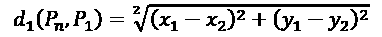

# 第六章：用 Google 翻译创新 AI

在本章中，我们将说明如何通过 Google 翻译创新现有的 AI。首先，我们将从理解发明、创新、颠覆、高价产品和革命之间的区别开始，并探讨如何在 AI 创新中创造影响。

有时，开发者会将发明与创新混淆，导致关键 AI 项目的重大失败。一些 AI 设计师将革命理解为颠覆，导致早期销售，但之后就一无所获。

一旦我们定义了创新的关键概念，我们将使用 Google 翻译来理解围绕**自然语言处理**（**NLP**）的语言学原理。

Google 翻译于 2006 年进入市场，并在 2016 年通过神经网络得到了增强，但它仍然经常给出错误的答案。这是好消息还是坏消息？我们将在 Python 程序中实现 Google 的 API，找出如何揭示从一种语言到另一种语言的错误翻译。

一旦我们找到了 Google 翻译的局限性，我们最终将发现如何通过我们的自定义适配突破这些局限，方法是通过探索 Google 的 API 在 Python 程序中添加**k-近邻**（**KNN**）算法，并进行统计测量。

与媒体炒作相反，人工智能仅刚刚开始创新人类流程。还有大量的工作需要完成。为了取得进展，大家都必须参与其中，正如我们将在本章中讨论的那样。即使 Google、亚马逊、微软、IBM 等公司提供了解决方案，这也不意味着第三方不能通过附加到现有解决方案或新的独立产品来改进它。毕竟，一百多年前，福特发明了 Model T，但这并不排除更好的汽车的开发。相反，看看你周围！

为了利用 AI 的冒险之旅，我们将从理解 AI 中的颠覆开始，进入 Google 翻译，然后进行创新。

本章将涵盖以下主题：

+   在开始实现 Google 翻译之前，了解 AI 创新的关键概念

+   发明与创新的区别

+   革命性 AI 与颠覆性 AI 的区别

+   在 Python 中实现 Google 翻译 API

+   将语言学引入作为构建任何**自然语言处理**（**NLP**）算法的前提

+   KNN 算法

+   如何在 Python 中使用 KNN 定制 Google 翻译

我们将从探索 AI 创新和颠覆的关键概念开始。

本章中所有的 Python 程序和文件都可以在 [`github.com/PacktPublishing/Artificial-Intelligence-By-Example-Second-Edition/tree/master/CH06`](https://github.com/PacktPublishing/Artificial-Intelligence-By-Example-Second-Edition/tree/master/CH06) 获取。

还有一个名为`COLAB_Translate.ipynb`的 Jupyter 笔记本，其中包含所有 Python 程序的一次运行。您可以使用您的 Google 帐户直接将其上传到 Google Colaboratory：[`colab.research.google.com/`](https://colab.research.google.com/)。

# 在人工智能中理解创新和颠覆

当我们启动诸如翻译解决方案等项目时，我们必须首先问自己的第一个问题是我们身处何方。我们要做的是发明还是创新？我们的工作是否具有颠覆性或革命性？我们将在本章探讨这些概念，以在进一步进行之前了解广阔的实用图景。

## 人工智能是否具有颠覆性？

“颠覆性”一词常常与人工智能联系在一起。媒体炒作告诉我们，AI 机器人很快将在全球范围内取代人类。尽管媒体炒作使得获取 AI 预算变得更加容易，但如果我们想要实施 AI 解决方案，我们需要知道自己的立场。如果我们想要创新，我们需要找到前沿并从那里构建新的想法。

为什么不直接投入工具，看看会发生什么？这是个好主意还是冒险的主意？与拥有巨额预算的公司不同，一个人的资源有限。如果你在错误的方向上花费时间学习，将需要几个月的时间在另一个更好的方向上积累足够的经验以达到你的目标。例如，假设你在*第四章*中探讨了大量数据分类的问题，使用 K 均值聚类优化你的解决方案。你会在公司项目上花费数月时间并失败。这可能会让你失去工作。相反，如果你找到正确的模型并学习关键概念，你的项目几天内就能起飞。

在深入项目之前，请了解我们在创新和颠覆方面的立场。这在项目开始时似乎并不重要，但在生产和分发阶段会有很大影响。本节将阐明这些概念。

太阳底下无新事，即使是考虑到人工智能。大多数人工智能理论和数学工具已经存在几十年，甚至几个世纪了。我们经常倾向于认为，某些事物对我们来说似乎是新的，就是刚刚发明或发现的。这种错误在许多项目中可能致命。如果你知道某个理论或函数存在几十年或几个世纪，你可以进行深入研究，并利用 100 多年前找到的解决方案来解决当前的问题。如果你这样做了，你将节省大量时间，使用经过验证且可靠的方程式。如果你不这样做，你可能会花费宝贵的时间重新发明已经存在的方程式。

弄清楚什么是新的，什么不是，将在你的个人或专业人工智能项目中产生重大影响。

### AI 基于并非新的数学理论

当前，人工智能的理论在很大程度上依赖于应用数学。在*第一章*，*通过强化学习启动下一代人工智能*中，描述了**马尔科夫决策过程**（**MDP**），这是一种**强化学习**（**RL**）方法。谷歌已成功地将强化学习与神经网络结合应用于 AlphaGo Zero。

安德烈·马尔科夫（Andrey Markov）是 1856 年出生的俄罗斯数学家，他发明了马尔科夫决策过程。他成功地将这一算法应用于给定语言中的单词序列字母预测。例如，理查德·贝尔曼（Richard Bellman）在 1957 年发布了马尔科夫决策过程的改进版本。

贝尔曼还创造了“维度灾难”这一表述，并出版了在今天的人工智能中广泛使用的数学工具书籍。现在大家普遍知道，可以通过降维来避免在算法中面对成千上万的维度（例如特征）。

逻辑函数（见*第二章*，*构建奖励矩阵—设计数据集*）可以追溯到比利时数学家皮埃尔·弗朗索瓦·维尔赫斯特（Pierre François Verhulst，1844-1845）。逻辑函数使用`e`，即自然对数的底数，也被称为欧拉数。莱昂哈德·欧拉（Leonhard Euler，1707-1783）是瑞士数学家，他研究了这个自然对数。

托马斯·贝叶斯（1701-1761）发明了以他名字命名的定理：贝叶斯定理。它在人工智能中被广泛应用。我们将在*第七章*，*通过朴素贝叶斯优化区块链*中使用它。

几乎所有应用于人工智能、机器学习和深度学习的数学，都可以追溯到 17 世纪至 20 世纪的数学家。我们必须寻找 21 世纪人工智能创新的真正来源。我们需要找到人工智能中真正的新鲜元素，这也是它在 21 世纪初快速扩展的原因。

### 神经网络并不新颖

正如当代专家所描述的，神经网络可以追溯到 1940 年代和 1950 年代。即使是**卷积神经网络**（**CNNs**）也追溯到 20 世纪。法国计算机科学家扬·勒昆（Yann LeCun）在 1980 年代奠定了卷积神经网络的基础（见*第九章*，*利用卷积神经网络（CNNs）进行抽象图像分类*）；他在 1990 年代成功地将其应用为今天我们所知的形式。

我们必须再次寻找 21 世纪人工智能创新的来源。

如果神经网络本身并不新颖，那么我们必须在我们当前的环境中找到真正促成现代人工智能成功的全新因素。

## 从颠覆性的角度看—使人工智能具有颠覆性的因素

尽管人工智能的基础源远流长，甚至在计算机出现之前或广泛普及之前就已存在，但只有最近我们才真正看到了人工智能在社会中开始产生波动。在接下来的章节中，我们将探讨导致人工智能在近年来成为强大颠覆性力量的各种因素。

### 21 世纪初的云服务器算力、数据量以及网络共享

了解近年来人工智能的崛起因素非常重要。

数据量推动了 21 世纪人工智能的崛起。没有人工智能推动整个计算机科学市场，处理数据、分类数据以及做出预测和决策将变得不可能。

如果你放下围绕人工智能的幻想，牢记人工智能的这一关键需求，你将完全理解为什么人工智能会出现并且会长期存在。

人工智能创新性颠覆的第一个迹象出现在 2000 年至 2010 年间。在此之前，互联网和服务器已经存在。但从大约 2005 年开始，云服务器被广泛提供。有了这样的计算能力，世界各地的开发者可以尝试使用机器学习和深度学习所需的高度贪婪资源。他们终于能够利用人工智能解决那些原本无法解决的大数据问题。

同时，随着强大的服务器变得可用，互联网提供了人类历史上最大的知识库。

除此之外，社交网络的广泛使用也成为现实。分享发现和源代码变得司空见惯。万维网（WWW）促进了开源软件的传播，推动了本地研发。

从 21 世纪第一个十年中期开始，当地专家才有可能进入人工智能时代。

使人工智能今天看起来像一种创新的，是更强大的机器和知识资源的可用性相结合。

### 公众意识

在 1995 年到 2005 年间的云架构革命发生后，人工智能的公众认知仍然在几年的时间里保持低迷。

到 2015 年左右，人工智能给我们带来了强烈冲击，我们都意识到人工智能可能大规模替代人类，并在历史上前所未有的程度上造成工作岗位的替代。

更糟糕的是，我们意识到机器可以在我们引以为豪的领域击败我们，例如国际象棋（*第三章*，*机器智能—评估函数和数值收敛*）、围棋以及视频游戏。我们看到越来越多的制造业工作由机器人完成，办公室工作由机器人完成，更多的领域每天都在出现。

人类历史上第一次，人类物种可能会被一种新的“物种”——智能机器人超越。作为开发者，我们以为自己是安全的，直到谷歌推出了 AutoML，这一解决方案能够创造出比人类更优秀的机器学习方案。与此同时，现成的机器学习平台已经广泛传播，可以减少甚至取代人工智能软件开发。

人工智能既让人敬畏又让人恐惧。机器会走多远？我们会仅仅经历工作岗位的替代，还是它会走向物种的替代？

这会是许多人得到机会的时刻吗？谁知道呢？无论如何，本章提供了一些指导，帮助你以一种推动你不断创新和有用的方式进行思考。在大数据时代，我们经常面临巨大的数据集，人工智能已经来临，它将长期存在；没有它我们将无法应对。让我们充分利用它吧！

在我们开始深入了解人工智能带来的惊人机遇之前，让我们首先在脑海中澄清一下，究竟发明与创新的区别是什么，然后是**革命**与**颠覆**的区别。理解我们正在开发和实施的东西对人工智能市场的影响非常重要。

## 发明与创新

一些人工智能程序，特别是深度学习算法，直到 Google 和其他大玩家大规模使用它们时，才从发明变成了创新。

如果你发明了一个比 Google 更好的算法用于某些应用，它依然是一个发明，直到它真正*改变*了你公司的某些东西或在网上产生了影响。

假设你通过优化神经元数量和一种新的激活函数，找到了一种更快的图像识别方法。如果没有人使用它，那么无论它看起来多么优秀，这项发明依然只是个人的理论发现。

当其他人开始使用这个新算法时，它就变成了创新。发明只有在它改变了公司内的某个过程，或者有足够多的私人用户使用时，才会成为创新。

## 革命性与颠覆性解决方案

假设一个新的图像识别算法在一家大公司中成为了创新。这个新算法已经从**发明**（未使用）变成了**创新**（一个改变现状的解决方案）。

该公司现在广泛使用该算法。每个子公司都可以使用它。对这家公司而言，这个新的图像识别算法已达到了革命性的地位。公司销售额和利润率都有所上升。

但也许这家公司并没有主导市场，并且没有人跟随它的例子。这个创新依然是革命性的，但尚未成为颠覆性的。

然后，假设创建算法的人决定离开公司并用该算法创业。它出现在 GitHub 上，作为一个开源程序。每个人都想要它，下载量每天都在增加，直到 1,000,000+ 用户开始实施它。公司网站上提供了一些非常低价的附加组件。不到一年，这个算法就成为了一种新的图像识别方式。所有公司必须跟进，否则就会落后。这一解决方案变得**具有颠覆性**，因为它已经在全球范围内改变了市场。

## 从哪里开始？

我们现在已经探索了创建人工智能的基本概念。在使用 Google Translate 进行翻译项目的第一步是尽可能通过 Google 的 API 使用该算法。正如我们将在下一节中看到的，我们将探索 Google Translate 的极限。一旦找到这些极限，我们就可以通过人工智能定制 Google Translate，发挥创造力。

我们将发现，即使一个解决方案已经存在，它仍然有其局限性，可以改进、定制、包装和销售。*有局限性，就有市场*。

永远不要批评你在人工智能解决方案中发现的缺陷；它们是金矿！

*哪里有局限，哪里就有机会*。

让我们走在最前沿，然后越过边界进入未知领域，使用 Google Translate 来进行说明。

# 通过 Google Translate 探索一个充满机会的世界

从 Google Translate 开始探索 NLP 是为在 web 解决方案中使用 NLP 做准备的一个好方法。任何颠覆性的基于 Web 的解决方案必须至少能支持几种语言。你需要掌握多种语言的 NLP，才能实现一个聊天机器人、翻译解决方案以及像 Wikipedia 这样的在线信息网站。

Google 提供了许多资源来使用、探索或改善 Google Translate。运行 Python 代码并评估结果的质量，在将其用于公司中的重要翻译之前是至关重要的。让我们开始运行 Google Translate。

## 入门

Google 开发者 API 客户端库页面如下：[`developers.google.com/api-client-library/`](https://developers.google.com/api-client-library/)。在这个页面上，你将看到许多语言的库：Java、PHP、.NET、JavaScript、Objective-C、Dart、Ruby 等。

然后，进入 Python 资源并按照说明进行注册，在 Google API 控制台中创建一个项目并安装库。

如果你在做这一部分时遇到问题，或者暂时不想安装任何东西，这一章是独立的。源代码在这一章中有描述。

无论你是否安装了工具，你现在都可以开始了。

## 程序

本节的目标是实现 Google Translate 功能。你可以实现并运行程序，或者首先仅阅读这一独立章节。

### 头部

Google 提供的标准头部应足以使 API 工作，如以下代码所示：

```py
from googleapiclient.discovery import build 
```

考虑到 Google 管理的多种语言，特殊字符是需要处理的主要问题。许多论坛和示例程序在使用 Google Translate 时都面临 `UTF-8` 头部的问题。很多解决方案被提出，以下是一个建议的源代码头部。

```py
# -*- coding: utf-8 -*- 
```

然后，当 Google Translate 返回结果时，会发生更多问题，许多人开发了自己的函数。它们运行得很好，但我在寻找一种简单的单行解决方案。这里的目标不是写很多行代码，而是专注于 Google Translate 的限制，以发现 AI 中前沿的语言翻译技术。

所以，我没有使用 `UTF-8` 头部，而是使用 HTML 库来实现。

```py
import html 
```

面对一个结果时，以下这行 HTML 解析器代码完成了任务。

```py
print("result:", html.unescape(result)) 
```

它运行良好，因为 Google 会根据你实现的选项返回一个 HTML 字符串或文本字符串。这意味着 HTML 模块可以完成任务。

### 实现 Google 的翻译服务

Google 的翻译服务需要至少三个值才能返回结果：

+   `developerKey`：这是在前面描述的入门过程结束时获得的 API 密钥。

+   `q="text to translate"`：在我的代码中，我使用了 `source`。

+   `target="translated text abbreviation"`: `en` 表示英语，`fr` 表示法语，依此类推。

如下节所述，提供了更多的选项。

有了这个考虑，翻译功能将按如下方式工作：

```py
def g_translate(source,targetl):
    service = build('translate', 'v2',developerKey='your Key')
    request = service.translations().list(q=source,
        target=targetl)
    response = request.execute()
    return response['translations'][0]['translatedText'] 
```

在 `Google_translate.py` 程序中，`q` 和 `target` 将被发送到函数中，以获取解析结果：

```py
source="your text"
targetl="abbreviation of the target language"
result = g_translate(source,targetl)
print(result) 
```

总结一下程序，让我们将 Google 翻译翻译成法语，其中包含通过 HTML 解析器解析出的重音：

```py
from googleapiclient.discovery import build
import html
def g_translate(source,targetl):
    service = build('translate', 'v2',developerKey='your key')
    request = service.translations().list(q=source,
        target=targetl)
    response = request.execute()
    return response['translations'][0]['translatedText']
source='Google Translate is great!'
targetl="fr"
result = g_translate(source,targetl)
print("result:", html.unescape(result)) 
```

`Google_Translate.py` 工作正常。结果将输出正确的答案，并解析出重音：

```py
Google Translate est génial! 
```

在这一点上，Google 翻译满足了黑箱探索方法。它具有颠覆性，改变了世界，并且可以在许多公司中替代翻译员，处理所有企业需求。

事实上，我们可以在这里结束本章，去我们最喜欢的社交网络上制造一些关于翻译项目的热度。

幸福的结局？

哦，还没有！

我们需要从语言学家的角度来探索 Google 翻译。

## 从语言学家的角度看 Google 翻译

语言学家对该程序的分析将涉及更深层次的白箱式探索。这个方法将揭示出许多改进的领域。

等到这本书出版时，也许 Google 已经改进了本章中的示例。但别担心，在这种情况下，你会很快发现成百上千个其他不正确的示例。旅程才刚刚开始！

### 玩转这个工具

玩转一个包含随机示例的工具，可能会得到令人惊讶的结果。这个探索性的源代码保存为 `Google_translate_a_few_test_expressions.py`。

程序模拟了由一个名叫 Usty 的人创建的对话，如下所示：

```py
source='Hello. My name is Usty!'
 >>>result:Bonjour. Je m'appelle Usty!
source='The weather is nice today'
 >>>result: Le temps est beau aujourd'hui
source='Ce professor me chercher des poux.'
 >>>result: This professor is looking for lice! 
```

前两个示例在法语中看起来很好，尽管第二个翻译有点奇怪。但在第三个测试中，表达式 *chercher des poux* 意味着英语中的 *looking for trouble*（寻找麻烦），而不是翻译成法语的寻找虱子。

现在将对 Google 翻译进行语言评估。

### 对 Google 翻译的语言学评估

正确评估 Google 翻译将直接导致发现其局限性。

限制是研究人员渴望的边界！我们是拓荒者！

专家级评估将引领项目团队走向前沿，甚至超越它。为了做到这一点，我们将首先探索一些语言学方法。

#### 词汇场理论

词汇场描述的是词汇的领域。只有在特定语境中，词语才能获得其完整的含义。这个语境往往不仅仅局限于几个其他词汇或甚至是一个句子。

*Chercher des poux* 翻译过来意味着 *look for lice*（寻找虱子）。但在法语中，它可以意味着 *looking for trouble*（寻找麻烦）或者字面意义上的 *looking for lice*（寻找虱子）。Google 翻译得出的结果包含了三个基本问题。

```py
source='chercher des poux'
>>result: look for lice 
```

**问题 1 – 词汇场**：如果没有上下文，就无法知道这意味着寻找虱子还是寻找麻烦。

**问题 2 – 比喻或习惯表达**：假设你需要翻译*this is giving you a headache*。你无法知道这是否是一个物理上的问题，还是指代比喻意义上的*this is driving you crazy*。这两个习惯表达在翻译成法语时恰好使用了相同的比喻。然而，法语中的*lice*（虱子）比喻在英语中没有意义。

**问题 3**：*chercher*在法语中是一个不定式，结果应该是英语中的*looking* for lice（寻找虱子）。但是输入*chercher des limites est intéressant*给出的正确动词形式是*looking for*：

```py
source='Chercher des limites est intéressant.'
>>>result:Looking for boundaries is interesting. 
```

答案是正确的，因为*is*将句子分成了两部分，这使得 Google Translate 能够更容易地识别*chercher*是句子的第一部分，从而在英语中使用*looking*。

词汇领域在不同语言间存在差异，行话也是如此。

#### 行话

行话是在专业领域中产生的。在人工智能领域，*hidden neurons*（隐藏神经元）就是行话。这个表达对律师来说毫无意义。例如，律师可能认为你在某个领域拥有隐藏的智慧，或者你在某种名为隐藏神经元的加密货币中藏了钱。

同样地，如果有人要求 AI 专家解释*filing a motion*的确切含义，那将是一个困难的任务。

在企业法律环境中，除了将 Google Translate 作为字典使用外，翻译句子可能存在风险，尤其是当只有随机的结果是正确时。

如果我们将术语变化与语言间的词汇变化结合起来，我们会发现当一个词处于某种上下文中时，逐词翻译是行不通的。因此，翻译不仅仅是找到目标语言中最相似的词汇。

#### 翻译不仅仅是翻译，而是解读。

有时候，翻译需要解读，如下句所示，它取自法国商业法的标准描述：

```py
source='Une SAS ne dispense pas de suivre les recommandations en vigueur autour des pratiques commerciales.'
>>>result:An SAS does not exempt from following the recommendations in force around commercial practices. 
```

法语句子指的是一种公司类型；SAS 类似于英文中的 inc.、ltd.等公司类型。然而在英语中，SAS 是指特别空勤团。接着是语法问题，听起来不太对。

翻译者会写出更好的英语，并且明确说明 SAS 是什么：

*An SAS（法国的一种公司）必须遵循涵盖商业实践的建议。*

翻译通常意味着解读，而不仅仅是翻译词语。

在这种情况下，法律翻译者可能会解读合同中的文本，并且可能会写道：

*The COMPANY must respect the legal obligation to treat all customers fairly.*

法律翻译者会建议在合同开始时定义*COMPANY*，以避免像 Google Translate 刚刚做出的混淆。

当阅读关于自然语言处理、聊天机器人和翻译的文章时，一切似乎都很简单。然而，使用 Google Translate 却很容易变成一场噩梦！

让我们再举一个最后的例子：

```py
The project team is all ears 
```

Google Translate 给出的法语输出：

```py
source:"The project team is all ears".
>>>result: L'équipe de projet est tout ouïe. 
```

在法语中，像在英语中一样，更好地说 *project team*，而不是使用 *of* 来表示 *team of the project*。在法语中，我们使用 *équipe projet*（团队（équipe）在项目（projet）之前）。

从目前的例子来看，我们可以看到谷歌翻译是：

+   有时正确

+   有时错误

+   有时部分正确，部分错误

现在的问题是，如何知道某个翻译属于哪种类别。

#### 如何判断翻译是否准确

如果你不懂某种语言，怎么检查翻译是否准确？

小心。如果谷歌翻译提供的另一种语言的答案偶尔是正确的，那么你无法判断这个翻译是否可靠。

如果你不能确信谷歌翻译会是正确的，你可能会陷入困境，甚至把与你重要的人说反了话。你可能会误解你正在试图理解的句子。

比如在一家运输公司，你可能会写一封电子邮件，表示大巴停了下来，人们正在抱怨：

```py
source='The coach stopped and everybody was complaining.' 
```

谷歌翻译由于词汇场的原因，将 *coach* 错误地翻译成法语中的体育教练，这会给句子带来完全不同的意义：

```py
result: L'entraîneur s'est arrêté et tout le monde se plaignait.. 
```

现在，情况可能变得更糟。为了帮助谷歌翻译，我们来添加一些上下文。

```py
source='The coach broke down and stopped and everybody was complaining.' 
```

这个答案更糟糕。谷歌翻译正确地将 *broke down* 翻译成法语表达 *en panne*，但仍然将 *coach* 翻译成法语中的 *entraineur*（教练），这意味着是 *教练* 出故障，而不是 *大巴*（coach）。

```py
result: L'entraîneur est tombé en panne et s'est arrêté et tout le monde se plaignait. 
```

毫无疑问，谷歌会继续改进这个程序，就像自 2006 年以来所做的那样。然而，就目前而言，人类翻译员会发现谷歌翻译无法处理的成百上千个表达方式。

当一个词或表达有多个意思时，理解你母语中的一句话可能会变得困难。加入翻译功能后，这个问题变得更加复杂，很难给出可靠的答案。

这就是我们到达前沿的地方，超越了最前沿，因为我们已经确立了谷歌翻译的局限。

在下一部分，我们将探讨一些改进标准谷歌翻译结果的方法。虽然没有灵丹妙药可以验证翻译，但我们将探索改善翻译过程的方法。我们将找到一种改进谷歌翻译的方法，并付诸实践。

# 人工智能作为新前沿

谷歌有一个出色，但有限的翻译程序。利用这些缺陷进行创新！人工智能的研究和开发才刚刚开始，未来的创新才刚刚起步。

首先，实施一个 AI 解决方案。然后，用它来解决实际问题。但不要接受它的局限性。不要对它持负面态度。创新！想出新点子或倾听你喜欢的其他想法，并在团队中构建解决方案！谷歌甚至可能会发布你的解决方案！

改进 Google 翻译的任何翻译都是不可能的。一个现实的方法是专注于根据特定领域定制 Google 翻译，例如本例中的交通公司。在下一部分中，我们将重点讨论如何定制 Google 翻译。

## 词汇领域与多义性

`Google_Translate_Customized.py` 将提供如何在特定领域改善 Google 翻译的思路。本节集中在 Google 翻译在交通词汇上所犯的错误。再次强调，Google 可能会迅速纠正这个错误，但这个方法可以应用于许多剩余的错误。

**词汇领域**包含构成集合和子集的单词，它们在不同语言中有所不同。一种语言本身构成一个集合，并包含词汇领域的子集。

寒冷国家描述冰冻状态下水的单词比热带国家更多，因为热带国家几乎不下雪。寒冷的词汇领域可以是 `C` 的一个子集：

`C` = {*ice*（冰），*hail*（冰雹），*snowflakes*（雪花），*snowman*（雪人），*slushy*（泥泞的），*powder*（粉雪），*flake*（薄片），*snowball*（雪球），*blizzard*（暴风雪），*melting*（融化），*crunch*（咔嚓声）……`n`}

这里适用维度诅咒（curse of dimensionality）。词语包含着极为丰富的维度和定义。为了翻译某些表达，Google 翻译压缩了它们的维度并进行了简化。

Google 翻译常常使用 n-grams 来翻译。n-grams 是固定长度的词语序列。词语（token）可以是一个单词、一个字符，甚至是单词和字符的数值表示。

令牌 `n` 的意义是根据前后 `n` – `x` 或 `n` + `x` 个令牌计算得出的。`x` 是一个变量，取决于所应用的算法。

例如，*slushy* 在表达 *slushy snow* 时有特殊含义。雪开始部分融化，呈现出水状，走过时会发出 *slushing* 声音。融化只是 *slush* 含义的一个组成部分。

此时，Google 翻译只会将 *slushy snow* 翻译成法语为：

*neige*（雪） *fondante*（融化）

Google 翻译也会将 *melting snow* 翻译为：

*neige*（雪） *fondante*（融化）

要将 *slushy* 翻译成法语，你必须使用一个短语。要找到这个短语，你需要一些想象力，或者查看一些已经解析过的（搜索过的）小说或其他语言表达形式。这需要时间和资源。Google 翻译可能要经过多年，才能在所有公开的语言中达到一个可接受的母语水平。

另一个需要考虑的维度是多义性。

多义性意味着一个词在一种语言中可以有多个非常不同的含义。另一种语言中对应的词可能只有一个意思，或者有其他完全不同的意思。

英语中的"Go + over"可以表示*走过一座桥*或*复习一些笔记*。在这一点上（希望你阅读本书时它会有所改进），它在法语中两种情况都被翻译为*aller sur*。这意味着走上去（而不是走过），在这两种情况下都是不正确的。英语中的介词构成了一个独立的领域，同一个单词可以产生许多不同的意思。动词*go*有很多意思：*go up*（楼上），*go up*（股市），*go down*（楼下），*go down*（崩溃），还有很多其他可能性。

原型定制程序从定义`X`开始。一个小数据集来翻译，足以让事情开始运转：

```py
X=['Eating fatty food can be unhealthy.',
   'This was a catch-22 situation.',
   'She would not lend me her tote bag',
   'He had a chip on his shoulder',
   'The market was bearish yesterday',
   'That was definitely wrong',
   'The project was compromised but he pulled a rabit out of his hat',
   'So just let the chips fall where they may',
   'She went the extra mile to satisfy the customer',
   'She bailed out when it became unbearable',
   'The term person includes one or more individuals, labor unions, partnerships, associations, corporations, legal representatives, mutual companies, joint-stock companies, trusts, unincorporated organizations, trustees, trustees in bankruptcy, or receivers.',
   'The coach broke down, stopped and everybody was complaining'] 
```

如果你发现拼写错误或小错误，请在训练阶段不要纠正它们。一定程度的噪声是必要的，以便复制人类和机器错误，避免过拟合。

Google 翻译将自动翻译这些句子。

`X1`，如以下代码所示，定义了一些与句子统计相关的关键词；它应用了前面描述的 n-gram 概率理论。

```py
X1=['grasse',
    'insoluble',
    'sac',
    'aggressif',
    'marché',
    'certainement',
    'chapeau',
    'advienne',
    'supplémentaire',
    'parti',
    'personne',
    'bus'] 
```

`X1`中的每一行都对应`X`中的一行。如前所述，这只是一个概率，可能不正确。

*我们此时并不追求完美，而是寻求改进。*

让我们探索如何通过在 Python 程序中实现 KNN 来定制翻译，进而改善 Google 翻译。

## 探索前沿——用 Python 程序定制 Google 翻译

现在是时候添加一些定制的新内容了。本节中向量的使用将在下一节中通过使用它们的源代码进行解释。

一个触发向量将迫使程序尝试另一种方法来翻译一个误翻的句子。当句子被识别出来时，如果它在`X2`中的值等于`1`，则触发一个更深层次的翻译功能，如下所示：

```py
X2=[0,0,0,1,0,0,0,0,0,0,0,1] 
```

`0`和`1`是标记。每个值代表`X`中的一行。

**开发者注意**：要正确使用此方法，所有这些向量的值应设置为`1`。这将自动触发多种替代方法来翻译 Google 翻译错误。这里还有很多工作要做！

示例取自运输业务。应该建立一个运输短语词典。在这种情况下，已经实现了一个通用的`phrase_translation`词典，包含一个表达式，如下数组所示。

```py
phrase_translation=['','','','Il est agressif','','','','','','','',''] 
```

为了填充这个词典，还需要做什么？

+   扫描公司所有的文件——电子邮件、信件、合同和所有形式的书面文件。

+   存储嵌入的单词和句子。

+   训练团队使用该程序，通过在学习界面中提供反馈（正确答案）来改进它，当系统返回错误答案时。

Google 翻译无法在全球范围内做到的，你可以在本地范围内实施，以显著改进系统。

现在我们已经定义了一个方法，我们将深入研究 KNN 算法。

## k 最近邻算法

无论你如何解决语言学问题，最终都归结为**语境**的概念。当某人无法理解另一个人时，他们会说：“你把我的话断章取义了”或“那不是我的意思，让我解释一下。”

如前所述，在许多情况下，你无法在没有词汇场域的情况下翻译一个词或表达。困难程度与多义性属性成正比，正如程序所展示的那样。

使用 KNN 算法作为分类方法非常有用。任何语言解释（翻译或聊天机器人）都必须使用面向语境的算法。

通过找到彼此最接近的词语（邻居），KNN 将创建解释语言所需的词汇场域。更棒的是，当提供适当的数据集时，它将解决多义性问题，如接下来的章节所示。

### 实现 KNN 算法

通常，一个词需要语境才能有意义。寻找“邻居”词汇是一种有效的方式来确定该词属于哪个类别。

KNN 是有监督的，因为它使用提供的数据标签来训练其算法。在这种情况下，KNN 用于分类目的。对于给定的点`p`，KNN 将计算到所有其他点的距离。然后，`k`表示需要考虑的 k 个最近邻居。

通过一个例子来澄清这个问题。在英语中，词语“coach”可以指足球场上的教练、一辆公交车或铁路的客车车厢。在交通公司中，“coach”通常指的是一辆公交车，不应与教练混淆：

+   **步骤 1**：详细解析文本中的“coach”作为公交车和“coach”作为教练的含义。因此，程序正在搜索三个目标词：教练、公交车和教练员。

+   **步骤 2**：找到与我们要寻找的目标词语接近的词语。按照建议，执行以下操作：

    +   使用标准程序解析所有可以使用的公司文档。

    +   使用如`if(n-gram in the source)`的 Python 函数，然后存储数据。

在这种情况下，以下输出摘录中提供的`V1.csv`文件包含了该解析函数的结果：

```py
broke,road,stopped,shouted,class
1,3.5,6.4,9,trainer
1,3.0,5.4,9,trainer
1,3.2,6.3,9,trainer
...
6.4,6.2,9.5,1.5,bus
2,3.2,9,1,bus
6.4,6.2,9.5,1.5,bus
...
3.3,7.3,3.0,2.5,coach
4.7,5.7,3.1,3.7,coach
2.0,6.0,2.7,3.1,coach 
```

生成如`V1.csv`之类的文件不在本章或本书的范围内。然而，你可以从探索 scikit-learn 的文本文档功能开始，网址如下：

[`scikit-learn.org/stable/tutorial/text_analytics/working_with_text_data.html`](https://scikit-learn.org/stable/tutorial/text_analytics/working_with_text_data.html)

程序解析了电子邮件、文档和合同。每一行代表解析一个文档的结果。数字代表出现的次数（词汇的出现频率）。这些数字已经被“压缩”（反复除以相同的数字），使其保持小而易于处理。欲了解如何处理文本数据，请点击前文中的 scikit-learn 链接。

逐步来看，和 "trainer" 一起出现的词汇更多的是 "shouted"，而不是 "stopped"。对于公交车，"broke"（指“故障”），"road" 和 "stopped" 出现的频率高于 "shout"。

"Coach" 平均出现在 "shouted"、"stopped"、"road" 和 "broke" 这些词汇上，因为它可以既是训练师也可以是公交车，因此我们在翻译这个词时会遇到问题。"Coach" 的多义性（有多个含义）可能导致翻译不准确。

KNN 算法加载了包含训练数据的 `V1.csv` 文件，并得出了以下结果：


图 6.1：KNN 算法的结果

`knn_polysemy.py` 程序得出了以下结论：

+   蓝色的动词 "broke" 更有可能适用于公交车（`x` 轴值 > 6），而不是适用于训练师（`x` 轴值 < 4）。然而，“coach”仍然位于“trainer”之上和“bus”之下，因为它既可以是训练师也可以是公交车。

+   "road" 这个词遵循与蓝色图表相同的逻辑。

+   动词 "stopped" 更适用于训练师，也更适用于公交车。"Coach" 仍然无法决定。

+   动词 "shouted" 更明确地适用于训练师，而不是公交车。"Coach" 仍然无法决定。

注意，这些图表中每个点的坐标如下：

+   **y 轴**：公交车 = 1，教练车 = 2，训练师 = 3。

+   **x 轴**：该值代表“压缩”后的出现频率（即词汇出现的次数）。

这是在多个来源中搜索这些词汇的结果。

当一个新的点，即名为 `P[n]` 的数据点被引入系统时，它将根据 `k` 的值找到其最近的邻居。

KNN 算法将计算 `P[n]` 和从 `P₁` 到 `P[n]` [– 1] 之间所有其他点的欧几里得距离，使用欧几里得距离公式。KNN 中的 `k` 代表算法在分类时会考虑的“最近邻”数量。例如，`P`n 和 `P`1 之间的欧几里得距离 (`d₁`) 为：



考虑到计算距离的数量，使用如 `sklearn.neighbors` 提供的函数是必要的。

### `knn_polysemy.py` 程序

程序导入了之前描述的 `V1.csv` 文件，打印出几行数据，并将标签准备到正确的数组中，分别对应 `x` 轴和 `y` 轴，如下面的源代码示例所示：

```py
import pandas as pd
from matplotlib import pyplot as plt
from sklearn.neighbors import KNeighborsClassifier
# Import data
df = pd.read_csv('V1.csv')
print (df.head())
# KNN Classification labels
X = df.loc[:,'broke':'shouted']
Y = df.loc[:,'class'] 
```

然后，模型进行训练，如下所示的代码：

```py
# Trains the model
knn = KNeighborsClassifier()
knn.fit(X,Y) 
```

模型训练完成后，发出预测请求，并由以下代码提供预测：

```py
# Requesting a prediction
#broke and stopped are
#activated to see the best choice of words to fit these features.
# brock and stopped were found in the sentence to be interpreted.
# In X_DL as in X, the labels are : broke, road, stopped,shouted.
X_DL = [[9,0,9,0]]
prediction = knn.predict(X_DL)
print ("The prediction is:",str(prediction).strip('[]')) 
```

显示的结果如下：

```py
The prediction is: 'bus' 
```

初始数据已绘制以便可视化，具体实现如以下代码所示：

```py
#Uses the same V1.csv because the parsing has
# been checked and is reliable as "dataset lexical rule base".
df = pd.read_csv('V1.csv')
# Plotting the relation of each feature with each class
figure,(sub1,sub2,sub3,sub4) = plt.subplots(
    4,sharex=True,sharey=True)
plt.suptitle('k-nearest neighbors')
plt.xlabel('Feature')
plt.ylabel('Class')
X = df.loc[:,'broke']
Y = df.loc[:,'class']
sub1.scatter(X, Y,color='blue',label='broke')
sub1.legend(loc=4, prop={'size': 5})
sub1.set_title('Polysemy')
X = df.loc[:,'road']
Y = df.loc[:,'class']
sub2.scatter(X, Y,color='green',label='road')
sub2.legend(loc=4, prop={'size': 5})
X = df.loc[:,'stopped']
Y = df.loc[:,'class']
sub3.scatter(X, Y,color='red',label='stopped')
sub3.legend(loc=4, prop={'size': 5})
X = df.loc[:,'shouted']
Y = df.loc[:,'class']
sub4.scatter(X, Y,color='black',label='shouted')
sub4.legend(loc=4, prop={'size': 5})
figure.subplots_adjust(hspace=0)
plt.show() 
```

本程序的压缩版已在 `Google_Translate_Customized.py` 中引入，如下所示：

```py
def knn(polysemy,vpolysemy,begin,end):
    df = pd.read_csv(polysemy+'.csv')
    X = df.loc[:,'broke':'shouted']
    Y = df.loc[:,'class']
    knn = KNeighborsClassifier()
    knn.fit(X,Y)
    prediction = knn.predict(vpolysemy)
    return prediction 
```

描述如下：

+   `polysemy` 是要读取的文件名，因为它可以是任何文件。

+   `vpolysemy` 是需要预测的向量。

+   在未来的待办事项中，`begin` 应替换 `broke`，`end` 应替换 `shouted`，以便该功能可以预测任何向量的值。

+   调用 KNN 分类器并返回预测结果。

现在我们已经准备好 KNN 分类器函数，可以自定义 Google 翻译。

### 在 `Google_Translate_Customized.py` 中实现 KNN 函数

由于涉及的语言学概念，该程序需要更多的时间和研究。掌握算法的最佳方式是按顺序运行它。

Google 翻译提供了多种翻译方法。我们将在以下代码中重点介绍其中两种：

```py
#print('Phrase-Based Machine Translation(PBMT)model:base'): #m='base'
print('Neural Machine Translation model:nmt') 
```

解释如下：

+   **基于短语的机器翻译（PBMT）**：该方法翻译整个单词序列。短语，或者更确切地说是短语（多词表达），并不总是完整的句子。

+   **神经机器翻译（NMT）**：该方法使用神经网络，如**循环神经网络**（**RNN**），后续章节将详细介绍此内容。该方法超越了短语，考虑了整个句子。在本章提供的数据集方面，这种神经网络方法提供了略微更好的结果。

这两种方法以及 Google 的其他方法都很有趣，但在许多情况下，Google 翻译仍然需要额外的自定义算法才能达到可接受的质量水平。在本章中，我们探索了使用 KNN 的一种方法，但你可以使用其他方法，只要它们有效。

如你所见，考虑到许多语言的词汇领域和结构、它们的区域性变化以及行话，主题极为复杂。

#### 步骤 1 – 将 X 数据集逐行从英语翻译成法语

以下代码调用翻译函数：

```py
for xi in range(len(X)):
    source=X[xi]
    targetl="fr";m='nmt'
    result = g_translate(source,targetl,m) 
```

代码解释如下：

+   `xi` 是 `X` 中的行号。

+   `source` 是 `X` 中的 `xi` 行。

+   `targetl` 是目标语言，在本例中是 `fr`（法语）。

+   `m` 是方法（PBMT 或 NMT），如前所述。在这种情况下，应用的是 `nmt`。

+   然后，调用本章前面描述的 Google 翻译功能。结果存储在 `result` 变量中。

#### 步骤 2 – 反向翻译

如果 `L₁` 是某人的母语，而 `L₂` 是该人完全不懂的语言，那么该如何知道从语言 `L₁` 到语言 `L₂` 的翻译是否正确？

这是翻译人员通常使用反向翻译来检查翻译的原因之一：

*翻译* = *从 L*[1] *到 L*[2]的初始翻译

*反向翻译* = *从 L*[2] *到 L*[1]的翻译回传

如果未获得初始文本，那么可能存在问题。在这种情况下，可以将初始句子`L₁`的长度与反向翻译回到`L₁`的相同句子长度进行比较。以下代码调用反向翻译：

```py
 back_translate=result
    back_translate = g_translate(back_translate,targetl,m)
    print("source:",source,":",len(source))
    print("result:",result)
    print("target:",back_translate,":",len(back_translate)) 
```

长度比较可以用于改进算法：

*初始 n-gram 的长度* = *反向翻译的长度*

如果它相等，则翻译可能是正确的。如果不相等，则可能是错误的。当然，在每次翻译时必须应用更多的方法。然而，任何能带来改进的方法，都是一个好的进步。在这种情况下，源句（初始句子）会与反向翻译进行比较，代码如下：

```py
 if(source == back_translate):
        print("true")
        if((term not in words)and (xi!=4)):
            t+=1
    else:
    f+=1;print("false") 
```

+   `t`是一个`True`计数器。

+   `f`是一个`False`计数器。

`X`的第一行如下运行：

```py
source: Eating fatty food can be unhealthy. : 35
result: Manger de la nourriture grasse peut être malsain.
target: Eating fat food can be unhealthy. : 33
false 
```

*吃油腻食物*被反向翻译为*吃油腻食物*，这有点错误。可能哪里出了问题。

法语句子也听起来不对。油腻食物不能这样翻译。通常，常见的句子是*manger gras*，意思是*吃*（manger）*油腻的*（gras），这不能直接翻译成英文。

本节中提到的`X`数组从第 8 行开始：

```py
X=['Eating fatty food can be unhealthy.',
   'This was a catch-22 situation.',
   'She would not lend me her tote bag',
   'He had a chip on his shoulder',
....] 
```

有几个短语翻译错误，例如，`X₄`，`'He had a chip on his shoulder'`。我编写了一个基于短语的翻译，使用在以下代码中的`False`条件触发器。

```py
 else:
        f+=1;print("false")
    if(X2[xi]>0):
        DT=deeper_translate(source,xi)
        dt+=1 
```

由于我并未为本书编写完整的应用程序，而只是编写了一些可扩展的示例，所以我使用`X2`作为触发器。如果`X2[x1]>0`，则激活`deeper_translate`函数。

#### 第 3 步 - 使用基于短语的翻译进行更深层次的翻译

`deeper_translate`有两个参数：

+   `source`: 初始句子待翻译

+   `x1`: 目标句子

在这种情况下，问题是解决一种存在于英语中但在法语中不存在的习惯表达：

```py
source: He had a chip on his shoulder : 29
result: Il avait une puce sur son épaule
target: He had a chip on his shoulder : 29
false 
```

*有 chip 在肩膀上*意味着对某些事物或某些人有问题。这表达了一种紧张的情绪。

Google 将*chip*翻译为假设是计算机芯片，或者法语中的*puce*，它既可以指*计算机芯片*，也可以指*跳蚤*。这个翻译没有意义。

*Chip*进入三个类别，应当标注为：

+   习惯表达

+   行话

+   词义歧义

这时，我创建的以下函数模拟了基于短语的解决方案来实现更深层次的翻译。

```py
def deeper_translate(source,index):
    dt=source
    deeper_response=phrase_translation[index]
    if(len(deeper_response)<=0):
        print("deeper translation program result:",
            deeper_response,":Now true") 
```

`deeper_translate`函数会在以下`phrase_translation`数组中查找包含*chip*的翻译句子（列表、向量或其他必要的结构）。

```py
phrase_translation=['','','','Il est agressif','','','','','','','',''] 
```

最终结果会给出翻译、反向翻译、术语搜索和短语翻译。以下是产生的结果，每一行前都有添加的注释：

```py
Initial sentence:
source: He had a chip on his shoulder : 29
Wrong answer:
result: Il avait une puce sur son épaule
The back-translation works:
target: He had a chip on his shoulder : 29
term: aggressif
false
deeper translation program result: Il est agressif 
```

问题是，`term`来自哪里？

`term`来自`X1`，这是一个应包含在翻译中的关键词列表。`X1`是手动输入的，但它应该是通过对句子中被视为类别的单词进行自动搜索得到的可能性列表。这意味着待翻译的句子应该具有多个层次的意义，而不仅仅是被计算出的字面意义。

实际的`True`/`False`条件包含以下深度翻译级别的词汇进行检查：

```py
 if(source == back_translate):
        print("true")
        if((term not in words) and (xi!=4)):
            t+=1
    else:
        f+=1;print("false")
        if(X2[xi]>0):
            DT=deeper_translate(source,xi)
            dt+=1 
```

在当前原型状态下，只有示例四激活短语翻译。否则，将接受`True`。如果是`False`，则深度翻译仅在该示例代码中的两个案例中被激活。该标志位在`X2`中（`0`或`1`）。

`deeper_translate`函数被调用用于短语翻译（如前所述）或 KNN 程序，如果短语翻译未能成功，则会激活 KNN 程序。

如果翻译未能成功，将为 KNN 算法准备一个 n-gram，如下代码所示：

```py
 if(len(deeper_response)<=0):
        v1=0
        for i in range(4):
            ngram=V1[i]
            if(ngram in source):
                vpolysemy[0][i]=9
                v1=1 
```

`V1[i]`包含前面 KNN 算法中描述的运输词汇领域中的关键词（n-grams），如下面的代码所示：

```py
V1=['broke','road','stopped','shouted','coach','bus','car',
    'truck','break','broke','roads','stop'] 
```

源句子（待翻译句子）会被解析为每个 n-gram。如果找到了该 n-gram，则会为该 n-gram 激活多义性向量。初始值设置为`0`，如下面的代码所示：

```py
vpolysemy=[[0,0,0,0]] 
```

激活变量`v1`，它通知程序必须读取`V1.csv`文件来处理此案例。应自动创建无限数量的 KNN 参考，如前面 KNN 部分所述。

在这种情况下，只有`v1`被激活。但在为公司定制本地需求的项目中工作了几个月之后，应该创建许多其他文件。

在这种情况下，当激活`v1`时，它会按照如下方式填充变量。

```py
 if(v1>0):
        polysemy='V1'
        begin=str(V1[0]).strip('[]');end=str(V1[3]).strip('[]')
        sememe=knn(polysemy,vpolysemy,begin,end) 
```

+   `polysemy`表示需要打开的 KNN 文件。

+   `begin`是`V1`向量的第一个标签，`end`是`V1`向量的最后一个标签。

+   `sememe`是我们期望的预测结果。

现在，调用 KNN 算法的精简版本，如前面所描述的`knn_polysemy.py`中的代码：

```py
def knn(polysemy,vpolysemy,begin,end):
    df = pd.read_csv(polysemy+'.csv')
    X = df.loc[:,begin:end]
    Y = df.loc[:,'class']
    knn = KNeighborsClassifier()
    knn.fit(X,Y)
    prediction = knn.predict(vpolysemy)
    return prediction 
```

在本例中，展示了*KNN 部分*中*coach*的多义性特征。输出将如下所示：

```py
Source: The coach broke down, stopped and everybody was complaining : 59
result: L'entraîneur est tombé en panne, s'est arrêté et tout le monde se plaignait
target: The coach broke down, stopped, and everyone was complaining : 59
term: bus
false 
```

翻译错误，因为 Google 翻译返回了*trainer*而不是*bus*。

单词*bus*在英语和法语中是相同的。

KNN 程序返回了英语中的*bus*，作为在出现*broke down*和*stopped*时应该使用的正确单词，正如 KNN 部分所示。

`deeper_translate`函数中其余源代码的目标是替换*coach*—这个增加多义性特征的单词，用一个更合适的单词（限制多义性）来翻译：`sememe`。

`sememe`变量由下面代码中的 KNN 函数初始化：

```py
 sememe=knn(polysemy,vpolysemy,begin,end)
            for i in range(2):
                if(V1_class[i] in source):
                    replace=str(V1_class[i]).strip('[]')
                    sememe=str(sememe).strip('[]')
                    dtsource = source.replace(replace,sememe)
                    targetl="fr";m='base'
                    result = g_translate(dtsource,targetl,m)
                    print('polysemy narrowed result:',result,
                        ":Now true") 
```

该函数通过 KNN 算法在英语句子中将*coach*替换为*bus*，然后让谷歌翻译再尝试一次。正确的答案被返回。

与其尝试翻译一个具有多重含义的词（多义词），`deeper_translate`函数首先用一个更合适的词（含义较少）替换该词。通常可以获得更好的结果。

##### 第 3.1 步——添加频率学派错误概率函数

添加了一个频率学派的错误概率函数来衡量性能，具体如以下代码所示：

```py
def frequency_p(tnumber,cnumber):
    ff=cnumber/tnumber #frequentist interpretation and probability
    return ff 
```

+   `cnumber`是谷歌翻译返回的错误答案数量。

+   `tnumber`是已翻译的句子数量。

+   `ff`给出了直接的错误（翻译）概率，ETP。

当翻译错误时，或者`f>0`时，调用该函数，如以下代码所示：

```py
 if(f>0):
        B1=frequency_p(xi+1,f) #error detection probability before deep translation
        B2=frequency_p(xi+1,f-dt) #error detection probability after deep translation
    if(f>0):
        print("ETP before DT",round(B1,2),
            "ETP with DT",round(B2,2))
    else:
        print('Insufficient data in probability distribution') 
```

+   `B1`是调用`deeper_translate`函数之前的错误（翻译）概率（ETP）。

+   `B2`是调用`deeper_translate`函数后的 ETP（错误翻译概率）。

程序结束时，显示总结，具体如以下输出所示：

```py
print("------Summary------")
print('Neural Machine Translation model:nmt')
print('Google Translate:',"True:",t,"False:",f,'ETP',round(f/len(X),2))
print('Customized Google Translate:',"True:",t,"False:",f-dt,'ETP',round((f-dt)/len(X),2))
a=2.5;at=t+a;af=f-a #subjective acceptance of an approximate result
print('Google Translate acceptable:',"True:",at,"False:",af,'ETP',round(af/len(X),2))
#The error rate should decrease and be stabilized as the KNN knowledge base increases
print('Customized Google Translate acceptable:',"True:",at,"False:",af-dt,'ETP',round((af-dt)/len(X),2)) 
```

+   增加了对近似结果的主观接受度，以提高真实概率。

+   错误率应随着 KNN 知识库质量的提高而下降。在频率概率理论中，这意味着应该达到一个稳定的预测率。

我们已经尝试改进谷歌翻译到最后了。让我们看看实验后的一些结论。

### 关于谷歌翻译定制实验的结论

生成的最终错误（翻译）概率非常有趣，具体如以下输出所示：

```py
>>------Summary------
>>Neural Machine Translation model:nmt
>>Google Translate: True: 2 False: 8 ETP 0.67
>>Customized Google Translate: True: 2 False: 7 ETP 0.58
>>Google Translate acceptable: True: 4.5 False: 5.5 ETP 0.46
>>Customized Google Translate acceptable: True: 4.5 False: 4.5 ETP 0.38 
```

即使拥有 NMT 模型，谷歌翻译仍然在挣扎。

这为 AI 语言学家提供了极好的机会，正如一些方法所展示的那样，可以在本地层面改进谷歌翻译，甚至可以更进一步。

通过这次对谷歌翻译的实验，可以看出谷歌只是触及了真正生活翻译的表面，而这些翻译对于接收者——本地语言使用者来说才是正确的。要使这项技术走上正轨，需要一个真正的公司项目，并对其盈利能力进行财务分析，然后再消耗资源。

### 颠覆性的革命性循环

如你现在所见，谷歌翻译与所有 AI 解决方案一样，都有其局限性。一旦达到这个极限，你就处于前沿地带。

跨越边界进入 AI 前沿地带；独立创新或与团队一起创新。

如果你在公司工作，可以为数百名用户创建一个革命性的定制解决方案。它不一定要公开，它可以成为公司的一项强大资产。

在某个时刻，革命性的插件将超越公司本身，其他人也会使用它。它将成为颠覆性技术。

最终，其他人会到达你现在的颠覆性解决方案的极限。然后，他们会在自己的公司中创新并定制该方案作为革命性解决方案。这就是我所说的颠覆性革命循环。它既充满挑战又令人兴奋，因为这意味着 AI 开发者在短期内不会全部被 AutoAI 机器人取代！

设计一个解决方案并不意味着它会成为发明、创新、革命性或颠覆性。但这其实并不重要。公司通过解决方案获得的收益代表了它所销售的东西的新颖性，只要它是有利可图的。这是规则一。也就是说，如果公司在市场上没有创新，它将无法在多年中生存下来。

如果一个产品因为安全原因需要保持高质量，那么它应该在发明阶段保持足够长的时间。若产品可以在市场的低端产生销售，甚至在其完全完成之前，那么公司应该开始销售该产品。公司将因创新获得声誉，获得更多资金投入，并占领竞争对手的市场份额。

# 总结

Google 翻译是颠覆性营销的一个好例子。如上所示，其理论、模型甚至云架构已经超过 10 年。然而，每当数以亿计的用户中的某一个偶然使用它时，它就通过将用户吸引到 Google 解决方案中而产生更多的颠覆。用户会一次又一次地回到这里查看更多广告，大家都很高兴！

人工智能才刚刚起步。Google 翻译自 2006 年推出以来，一直存在。然而，翻译结果仍然为开发人员、语言学家和数学家提供了改进的空间。Google 已经加入了神经网络，并提供了其他模型，通过分析整个句子来改进翻译。那么，什么时候它能真正可靠呢？与此同时，全球社区正在推动人工智能的进步，超越最前沿，进入新的“前沿领域”。

在本章中，我们首先仔细探讨了发明与创新之间的差异。创新对整个市场产生影响，而发明仅是创新的起点。我们看到，一项革命性的解决方案可能是技术突破。但只有当这种革命性的解决方案扩展到市场的其他部分时，它才能成为颠覆性的。

然后，我们研究了一些基本的语言学原理，帮助我们理解 Google 翻译，它的局限性以及如何改进翻译错误。

我们最终实现了一个定制的翻译工具，使用 KNN 算法来绕过 Google 翻译的错误。

在下一章，*第七章*，*使用朴素贝叶斯优化区块链*，我们将进一步探讨 AI 新前沿的研究，通过使用区块链在企业环境中进行预测。

# 问题

1.  是不是最好等到产品达到顶级质量再推向市场？（是 | 否）

1.  考虑到所做的投资，新产品应始终定价较高，以进入市场的高端细分市场。（是 | 否）

1.  发明一种新解决方案会使其自然而然地被认可。（是 | 否）

1.  AI 可以在不使用标准非学习算法的情况下解决大多数问题。（是 | 否）

1.  谷歌翻译可以令人满意地翻译所有语言。（是 | 否）

1.  如果你不具备创意，尝试创新是没有用的。（是 | 否）

1.  如果你不是语言学家，尝试改进谷歌翻译是没有意义的。（是 | 否）

1.  翻译过于复杂，难以理解。（是 | 否）

1.  AI 已经达到了它的极限。（是 | 否）

# 进一步阅读

+   哈佛商业评论关于颠覆性创新的文章可以在这里找到：[`hbr.org/2015/12/what-is-disruptive-innovation`](https://hbr.org/2015/12/what-is-disruptive-innovation)

+   谷歌翻译文档可以在这里找到：[`cloud.google.com/translate/docs/`](https://cloud.google.com/translate/docs/)

+   谷歌 AlphaGo Zero：[`deepmind.com/blog/article/alphago-zero-starting-scratch`](https://deepmind.com/blog/article/alphago-zero-starting-scratch)

+   KNN 文档：[`scikit-learn.org/stable/modules/neighbors.html#neighbors`](http://scikit-learn.org/stable/modules/neighbors.html#neighbors)

+   关于翻译神经网络的见解：[`research.googleblog.com/2016/09/a-neural-network-for-machine.html`](https://research.googleblog.com/2016/09/a-neural-network-for-machine.html)

+   关于英法翻译的见解：[`www.oneskyapp.com/blog/french-translation-challenges/`](http://www.oneskyapp.com/blog/french-translation-challenges/)

+   更多关于如何处理文本数据以构建算法数据集的内容：[`scikit-learn.org/stable/tutorial/text_analytics/working_with_text_data.html`](https://scikit-learn.org/stable/tutorial/text_analytics/working_with_text_data.html)
