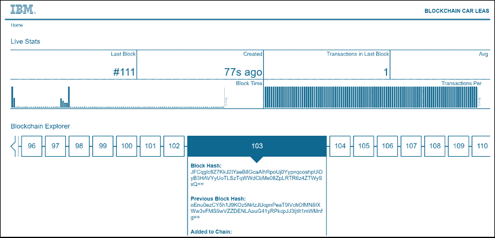
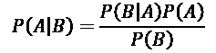

# 第七章：使用朴素贝叶斯优化区块链

在本章的三部分内容中，我们将使用区块链结合朴素贝叶斯优化供应链。为了实现这一目标，我们将首先了解如何以加密货币为例生成区块链。

区块链已进入企业，并且将长期存在。数百家大型企业已实施了 IBM Hyperledger。这些企业的供应商将逐步加入该网络。企业区块链将提供多年工作机会，因为需要维护和更新数百万行代码以增加新功能。

挖矿加密货币是区块链最为人知的应用。加密货币在全球范围内增长。本章将通过比特币的例子解释区块链的挖矿部分是如何运作的。

接下来，我们将分析如何将区块链用于不同于生成加密货币的目的。例如，企业使用区块链记录公司之间的交易。

IBM 成立于 1911 年，至今是该领域经验最丰富的公司。谷歌、亚马逊和微软也提供具有历史意义的机器学习平台。然而，IBM 提供的机器学习平台依托于公司可提供的 100 多年经验，具有独特优势。

IBM 在计算机和软件市场的多年历程并不平坦。一些糟糕的决策给公司在全球范围内带来了很多问题。IBM 从这些错误中吸取了教训，现在提供强大的解决方案，包括用于区块链解决方案的 IBM Hyperledger。IBM 提倡将区块链用于企业交易。

最后，我们将进入本章的第三部分，解释区块链对全球公司意味着什么，以及如何使用区块链中的信息为优化算法提供人工智能支持。将应用朴素贝叶斯算法对区块链样本进行优化库存水平。

本章将涵盖以下主题：

+   区块链的背景

+   使用区块链挖掘比特币

+   将区块链用于商业交易

+   区块链的区块如何为公司之间共享信息提供独特的方式

+   将人工智能应用于区块链的区块中，以预测并建议交易

+   朴素贝叶斯

+   如何在区块链的区块上使用朴素贝叶斯来预测后续交易和区块

让我们从简短的区块链介绍开始。

# 第一部分——区块链技术的背景

在本节中，我们将介绍使用区块链进行加密货币挖矿的过程。通过区块链产生比特币使得这一技术具有了颠覆性。本节的目的是在深入探讨区块链技术的后续应用之前，理解区块链冒险是如何开始的。

区块链技术将彻底改变各个领域的交易。区块链在 2008 年出现。没有人知道到底是谁发明了它们。每个区块都包含其前一个区块（前区块）的加密哈希值、日期时间（时间戳）数据，以及有关交易的信息。

在过去的 1,000 多年里，交易大多是局部的记账系统。在过去 100 年里，尽管计算机时代改变了信息管理的方式，但变化并不大。每家公司依然将其交易保持在内部，只通过繁琐的系统共享一些信息。

**区块链**使得交易**区块**对它所在的全球网络可见。

需要记住的基本概念是**共享**和**隐私控制**。这两个概念似乎产生了认知失调，似乎是不可能解决的问题。然而，它已经被解决了，并且它将改变世界。

当一个区块（任何类型的交易）被生成时，它会与整个网络共享。如果该区块的管理者希望信息保持私密，则对区块内信息的读取权限可以得到管理，从而保持隐私。

无论目标是通过区块挖掘比特币，还是使用区块进行交易，人工智能将在不久的将来增强这一创新。

在接下来的章节中，我们将详细讨论区块链及其应用。理解如何为加密货币生成区块将帮助我们掌握区块链技术。一旦我们理解了区块链技术，就能更容易地看出这种安全加密的方法如何应用于任何类型的商业交易，超越加密货币。让我们先去挖矿吧！

## 挖掘比特币

在区块链中创建一个区块并不一定非要生成一个比特币，这只是另一种形式的交易。但理解如何挖掘加密货币提供了一个很好的方式来理解区块链，并将其应用于许多其他领域。

挖掘比特币意味着为一个有效的交易创建一个数学区块，并将该区块添加到区块链中；即区块链：

*区块链* = {*区块*[1]，*区块*[2]，*刚刚添加的区块* …… *区块*[n]}

区块链不能回到过去。它就像生活中的时间标记功能。在第`m`分钟，你做了一件事，在第`m` + 1 分钟做了另一件事，在第`m` + `n`分钟做了另一件事，以此类推。你无法回到过去。*过去的事就已经做了*。

当一个区块被添加到比特币链时，无法撤销该交易。

全球的比特币挖掘网络由**节点**组成。通过适当的软件，你可以开放端口，分配大约 150+ GB 的磁盘空间，并生成新区块。各节点相互通信，信息会传递到整个网络中的其他节点。

为了让一个节点成为矿工，它必须解答复杂的数学难题，这些难题是比特币程序的一部分。

为了解决难题，软件必须找到一个数字，这个数字与正在生成的区块中的数据结合后，能适合某个特定的范围。这个数字会通过一个哈希函数。

你可以将这个数字称为**nonce**，它是唯一使用一次的。例如，生成一个介于 0 和 4,294,967,296 之间的整数来代表比特币。

这个过程是随机的。软件生成一个数字，将其通过哈希函数，然后将其发送到网络中。第一个**矿工**生成一个位于预期范围内的数字，并通知整个网络该区块已经生成。其余的网络成员停止在该区块上工作，转而开始处理另一个区块。

挖矿者的奖励自然是以比特币的形式支付的。它代表了大量资金，但考虑到网络中的竞争以及产生正确结果所需的成本（CPU、电力、磁盘空间和时间），它并不容易获得。

必须保持挖掘比特币或任何其他加密货币的成本与挖掘所获得的回报之间的平衡。

在讲完比特币挖掘后，我们将简要讨论如何实际使用加密货币。

## 使用加密货币

对加密货币要非常小心。目前有 1500 多种加密货币。这个概念听起来很吸引人，但结果依然是货币。货币可能会波动，如果发生崩盘，你可能会在不到一小时内失去一生的积蓄。

**黄金法则**：如果你无法抗拒投资加密货币，千万不要投资超过你能承受损失的金额。

话虽如此，要使用加密货币，首先需要设置一个钱包来存储比特币。例如，钱包可以是在线的，通过某个提供商，或者甚至是离线的。

一旦完成，你就可以根据自己的意愿，用现金或通过信用卡、借记卡和转账购买比特币。

记住，你购买这些货币就像购买任何其他货币一样，拥有所有的潜力，但也承担着所有的风险。

在本节中，我们了解了区块链时代如何从比特币生产开始，进而理解如何通过比特币使用区块链来挖掘加密货币。考虑到区块链的原始创建方式，我们可以将区块链应用到许多其他领域。

在我们三部分章节的第二部分中，我们将看到如何将区块链应用于加密货币之外的领域。我们将其应用于供应链。

# 第二部分 – 使用区块链在供应链中共享信息

在*第一部分 – 区块链技术背景*中，我们了解了如何使用区块链挖掘加密货币。在进入区块链世界的先决条件已达成后，本节将展示如何在供应链中使用区块链。这不涉及加密货币。它为将区块链与人工智能结合创新开辟了道路。

供应链是一个生产和服务链条，它将产品从起点送到消费者。例如，取一卷从印度运送到突尼斯的布料。在突尼斯，这些布料被裁剪成图案并组装成衣服。然后，这些衣服被运送到法国，在那里进行包装并印上品牌。接着，它们被存储在仓库中，准备运送到实体店或直接送到在线客户。我们可以将这个供应链总结如下：

*来自印度的布料* -> *在突尼斯裁剪和组装* -> *运送到法国* -> *包装* -> *存储* -> *运送到商店或直接送达消费者*

如服装生产和交付系统这样的供应链过程涉及到成千上万的人：生产场地、运输人员、仓库员工以及每个环节的管理团队。

这就是现代区块链技术的优势所在，它能够在一个系统中追踪所有的交易。

在以下示例中，我们将以六家公司 A、B、C、D、E 和 F 为例。在*第一章*，《通过强化学习开始使用下一代人工智能》中，我们使用了一个六行六列的奖励矩阵。在那一章中，我们用 A、B、C、D、E 和 F 来表示强化学习中的马尔可夫决策过程中的位置。章节结束时，我们看到奖励矩阵可以应用于许多不同的领域。在我们的案例中，我们将把这六个项目（A、B、C、D、E 和 F）称为公司，并将它们在供应链过程中的位置（每个公司对应一个位置）进行描述。

供应链中的每个公司，A 到 F，作为区块链成员，可以优化其活动。与其每个公司都有独立的交易账本，不如使用一个中央区块链，集中所有交易（区块）：

+   布料离开印度的时间和数量

+   它什么时候上船，花了多长时间

+   当船到达突尼斯时

+   ……直到消费者的所有中间活动

拥有这些数据后，区块链中的区块（交易记录）已经成为了机器学习的金矿，用来发现信息并进行预测。使用该系统的一个盈利原因是减少库存水平。堆积未售出的商品以预测销售情况是昂贵的，甚至可能会毁掉公司的利润。相反，如果供应链中的每个公司都能通过区块链中的区块看到其他合作伙伴的库存水平和实际需求，他们就能根据实际需求调整库存，从而节省大量资金！

让我们以 IBM 软件为例，来看一下这个如何运作。

基于 Hyperledger Fabric 的 IBM Blockchain，为全球各公司提供了一种共享区块链交易网络的方式，避免了矿业和加密货币的使用。

该系统基于 Linux 基金会项目。Hyperledger 是由 Linux 基金会主办的一个开源合作项目。

在这一层，Hyperledger 使用区块链来保证安全的交易，而不是尝试优化加密货币方面。该软件在所有参与方共享的区块链网络中生成区块，但它们不必以货币意义上购买加密货币——只是以技术意义上购买。

在下图中，我们将使用六个节点（公司 A 到 F）来说明我们在*第一章*中学习的马尔可夫决策过程，*通过强化学习入门下一代人工智能*，如何应用于区块链：


图 7.1：马尔可夫决策过程图

每个节点代表一个公司，这些公司参与了为这六家公司设置的 IBM Hyperledger 网络，如下表所示：

| **公司** | **活动** | **ML 权重** |
| --- | --- | --- |
| *`A`* 在这个网络中买卖服装以及其他产品。 | 向网络提供商品，但保持库存水平较低 | 库存水平 |
| *`B`* 在这个网络中买卖布料及其他产品。 | 向网络提供商品，但保持库存水平较低 | 库存水平 |
| *`C`* 在这个网络中买卖按钮以及其他产品。 | 向网络提供商品，但保持库存水平较低 | 库存水平 |
| *`D`* 在这个网络中买卖印刷布料以及其他产品。 | 向网络提供商品，但保持库存水平较低 | 库存水平 |
| *`E`* 在这个网络中买卖配件（如皮带、手链）及其他产品。 | 向网络提供商品，但保持库存水平较低 | 库存水平 |
| *`F`* 在这个网络中买卖包装盒以及其他产品。 | 向网络提供商品，但保持库存水平较低 | 库存水平 |

表格的结构如下：

+   **公司**包含六家公司，{A、B、C、D、E、F}，它们的活动各不相同。在这个示例中，每家公司只有一个地点，因此 A 到 F 也是公司位置。

+   **活动**：该公司群体的一部分成员，负责向其成员供应商品，但确保库存水平保持较低，以减少成本。

+   **ML 权重**表示通过机器学习对库存水平的分类，以进行预测。在我们的示例中，盈利的关键是追踪供应链中每个成员（A 到 F）的库存水平。例如，如果 F 公司的库存水平下降，网络中的其他成员（A 到 E）可以预见并只提供有限的必要量，以便 F 的库存水平再次达到可接受水平。

每年有数百万的商业交易，涉及大量运输（卡车、火车、船只、飞机），如果没有像 IBM Hyperledger 这样的解决方案，管理这种类型的网络在 21 世纪将变得越来越复杂。

通过 IBM Hyperledger，企业拥有**一个**包含智能合约（在线）和实时追踪的在线交易账本。

交易是安全的；它们可以是私密的或在网络成员之间公开的，并且为人工智能解决方案提供实时优化信息。

## 在供应链网络中使用区块链

*IBM Hyperledger 为人工智能开发者提供了一个独特的优势，超越任何其他数据集——一个 100%可靠、实时更新的数据集。*

网络中的每个公司成员（A 到 F）都会为每个交易创建一个区块，以便 AI 分析师可以访问数据并进行预测。为了使系统正常工作，网络中的每个成员（A 到 F）将创建区块到区块链中，以便其他人可以查看记录的信息并利用这些信息做出决策。

## 创建区块

区块的形成方法与挖掘比特币时描述的方法类似，唯一不同的是，这次货币不是目标。目标是在必要时进行安全交易并使用智能合约。以下截图是一个标准的 IBM 界面，可以根据需要进行定制：



图 7.2：标准 IBM 界面

你可以看到构成区块链的独立且独特的区块。IBM Hyperledger 中的每个区块都有一个唯一的编号。在这个例子中，它是**111**，并且对区块**103**进行了放大显示。

我们图表中的供应链网络中的一个区块（A 到 F）可以是购买产品 X 并附带合同的交易。例如，交易可以发生在 A 公司和 B 公司之间。下一个区块可能是该产品从 A 运输到 B 的过程，在区块链网络中进行。

附加到该区块的信息存储在 Hyperledger 库中：公司名称（A 到 F）、地址、电话号码、交易描述以及网络公司所需的任何其他类型数据。每个区块可以根据附加的权限属性，由所有成员或某些成员查看。

## 探索区块

探索区块为人工智能程序提供了一座金矿：一个真实且 100%可靠的数据集。

对于 AI 优化来说，最有趣的部分是区块信息，如以下截图所示。当前区块与前一个区块以及交易代码一起被添加到链中：


图 7.3：探索区块链

请注意，给定区块的区块哈希（参见前面的挖掘部分）与前一个区块的哈希相关联，并拥有一个唯一的交易代码。

一旦我们拥有了一组区块数据（交易类型、日期、金额等），我们就可以开始构建 AI 预测算法。IBM 提供了通过脚本和其他工具进行数据提取的可能性。

一旦我们拥有包含区块链区块的数据集，预测的目标将是确定库存水平类别，以查看供应链网络中的某个成员（A 到 F）是否需要补充库存。

区块链的区块提供了可以用于预测网络在每个交易后将面临的库存水平类型的数据。每家公司都能运行一个预测算法，利用现有数据预测潜在的补货需求。例如，A 公司可能检测到 B 公司需要更多的布料。

考虑到数据量，像朴素贝叶斯这样的预测算法能够胜任这个工作。

# 第三部分 – 在区块链流程中使用朴素贝叶斯优化供应链

朴素贝叶斯将使用一些关键的信息作为**特征**，以优化仓库存储和产品的实时可用性。

朴素贝叶斯学习功能将根据之前的区块学习如何预测应该插入区块链中的下一个区块（为需要更多库存的其他公司提供支持）。这些区块将像其他时间戳数据一样被插入数据集中，以进行预测。

朴素贝叶斯基于贝叶斯定理。贝叶斯定理应用条件概率，定义如下：



+   `P`(`A`|`B`) 是一个**后验概率**，即在观察到某些事件 (`B`) 后 `A` 发生的概率。它也是一个**条件概率**：即在 `B` 已经发生的情况下，`A` 发生的可能性。

+   `P`(`B`|`A`) 是在已知先验观察 `A` 后 `B` 发生的概率。它也是一个条件概率：即在 `A` 已经发生的情况下，`B` 发生的可能性。

+   `P`(`A`) 是在观察之前 `A` 发生的概率。

+   `P`(`B`) 是预测的概率。

朴素贝叶斯虽然基于贝叶斯定理，但假设一个类别中的特征是**相互独立**的。在许多情况下，这使得预测更容易实施。无论特征是否相关，它们的统计存在都会产生一个预测。只要预测保持足够高效，朴素贝叶斯就提供了一个好的解决方案。

## 朴素贝叶斯示例

本节中，我们将先通过一个数学例子来说明朴素贝叶斯，然后再编写 Python 程序。本节的目标只是理解朴素贝叶斯中涉及的概念。

本节不是开发章节，而是帮助理解现实生活示例的基本概念以及用于预测的数学知识的章节。

本章中的区块链表示基于服装行业制造商品的库存水平信息。如需了解更多，阅读*第十二章*，*人工智能与物联网（IoT）*，该章详细描述了一个人工智能优化的服装制造过程。

在本节中，我们将专注于存储。在服装行业中，缝纫工作站的负荷以**存货单位**（**SKUs**）的数量来表示。例如，一个 SKU 可以是产品 P：一条特定尺寸的牛仔裤。

一旦服装生产完成，它就会进入存储阶段。此时，区块链中的一个区块可以用于表示该交易，为机器学习算法提供两个有用的特征：

+   衣物存储的那一天

+   现在存储在库存中的该 SKU 服装的总数量

区块链中包含交易信息的日期（时间戳）和存储数量。

由于区块链包含了网络中 A、B、C、D、E 和 F 公司位置的所有存储块，一个机器学习程序可以访问数据并进行预测。

目标是在六个位置均匀分布给定产品的存储量，如下直方图所示：


图 7.4：产品在六个位置分布的存储水平直方图

此截图显示了产品 P 在六个位置分布的存储水平。这个区块链网络中的每个位置都是一个**枢纽**。在**供应链管理**（**SCM**）中，一个枢纽通常是一个中间存储仓库。例如，为了覆盖这六个位置的区域，同一种产品将在每个位置存储。这样，本地的货车可以来取货进行送货。

*目标是在需要时在点位置 L（A 到 F）有可用的产品 P。*

例如，从位置`L`到位置点`a[1]`（商店或家中）的交货时间只需几个小时。如果 A 没有存储 P，那么细化的消费者就必须等待产品从 C 到 A 的运输，例如。

如果区块链网络组织良好，一个位置可以专门生产产品 P（最佳生产成本），并均匀分布存储在六个位置，包括自身的数量。

通过在所有位置均匀平衡存储量，系统将在连续的交付流程中运行。

在我们的示例中，一个公司=其位置（A 到 F）。使用这六个成员的区块链的块，我们可以预测何时需要补充给定存储点（A 到 F），以减少等待时间，例如。

使用区块链优化存储水平是一种有效降低成本并更快地向客户交付的新方法。

### 区块链预期的新颖性

在过去，所有这六个位置（A 到 F）的仓库都必须确保每个位置的最低存储水平。由于他们无法实时了解其供应链网络的情况，他们经常存储超过所需的产品，增加了他们的成本，或者存储不足，导致交货问题。

在实时生产和销售的世界中，分销商需要预测**需求**。系统需要是**需求驱动**的。朴素贝叶斯可以解决这个问题。

它将考虑前两个特性：

+   **DAY**：该服装存储的日期

+   **STOCK**：当前存储的该 SKU 服装的总数量

然后它将添加一个新特性——*与产品 P 相关的区块数量*。

在给定日期，较多的区块意味着该产品总体上有需求（生产、分销）。区块越多，交易也越多。此外，如果存储水平（STOCK 特性）正在下降，这就是一个指标；意味着存储水平必须得到补充。DAY 特性标记了产品的历史时间戳。

区块特性命名为**BLOCKS**。由于所有区块共享区块链，机器学习程序可以在几秒钟内访问可靠的全球数据。区块链提供的数据集可靠性本身就是优化存储水平的动机，利用区块链的区块作为数据集进行优化。

### 目标——利用区块链数据优化存储水平

目标是*维持低水平的库存*，并在产品请求时提供快速交付。为了做出决策，机器学习解决方案将实时分析区块链的区块。

程序将考虑给定产品 P 的 DAY、STOCK 和 BLOCKS（数量）特性，并生成一个结果。该结果预测该产品 P 是否有需求。如果答案是“是”（或 1），则该产品的需求需要预测。

#### 步骤 1——定义数据集

该数据集包含来自序列中先前事件的原始数据，使其非常适合预测算法。例如，可以使用 IBM Hyperledger 的脚本提取区块。这为查看所有公司的数据提供了独特的机会，而无需建立数据库。原始数据集将如下所示：


图 7.5：原始数据集

该数据集包含以下内容：

+   `Blocks` 表示在第 `x` 天，扫描区块链回溯 30 天后发现的产品 P 区块。`No` 表示没有发现显著数量的区块。`Yes` 表示发现了显著数量的区块。如果找到区块，意味着在区块链某个地方对该产品有需求。

+   `Some_blocks`表示已经找到了区块，但它们太稀疏，无法在不过拟合预测的情况下被考虑。然而，`Yes` 也会对预测产生贡献，和 `No` 一样。

+   `No_blocks`表示完全没有需求，无论是稀疏的还是其他类型的（`Some_blocks`），或者是大量的（`Blocks`）都不算。这对产品 P 来说是个麻烦。

目标是避免对稀疏的（`Some_blocks`）或不存在的（`No_blocks`）产品预测需求。此示例试图预测对此产品 P 的许多块的潜在 `Yes`。只有预测到 `Yes`，系统才能触发自动需求过程（请参见本章后面的 *Python 中的朴素贝叶斯实施* 部分）。

#### 步骤 2 – 计算频率

查看以下频率表提供了额外的信息：


图 7.6：频率表

对于给定产品 P 和给定期间（过去 30 天），每个特征（`Blocks`、`Some_blocks`或`No_blocks`）的`Yes`和`No`状态已按频率分组。

每个`No`特征和`Yes`特征的底线总和。例如，`Yes` 和 `No_blocks` 加起来是 2。

一些额外的信息将对最终计算非常有用：

+   样本的总数 = 10。

+   `Yes` 样本的总数 = 8。

+   `No` 样本的总数 = 2。

#### 步骤 3 – 计算似然

现在似然表已经计算完成，接下来将使用这些数据生成以下似然表：


图 7.7：似然表

表格包含以下统计信息：

+   `No` = 2 = 20% = 0.2

+   `Yes` = 8 = 80%=0.8

+   `Some_blocks` = 2 = 20%=0.2

+   `No_blocks` = 3 = 30%=0.3

+   `Blocks` = 5 = 50%=0.5

`Blocks` 表示样本的重要比例，这意味着连同 `Some_blocks` 一起，需求看起来不错。

#### 步骤 4 – 应用朴素贝叶斯方程

现在的目标是在朴素贝叶斯方程中表示贝叶斯定理的每个变量，以获得对产品 P 的需求的概率，并触发区块链网络的购买场景。贝叶斯定理可以表示如下：


+   `P`(*Yes*|*Blocks*) = `P`(*Blocks*|*Yes*) * `P`(*Yes*)/`P`(*Blocks*)

+   `P`(*Yes*) = 8/10 = 0.8

+   `P`(*Blocks*) = 5/10 = 0.5

+   `P`(*Blocks*|*Yes*) = 4/8 = 0.5

+   `P`(*Yes*|*Blocks*) = (0.5*0.8)/0.5 = 0.8

需求看起来可以接受。但是，需要进行惩罚，并且还必须考虑其他因素（通过其他块探索过程的运输可用性）。

该示例和方法展示了朴素贝叶斯方法的概念。这个示例只是贝叶斯定理哲学的简化数学解释。

通过这种从头开始的计算，我们现在知道了贝叶斯定理的基本概念：使用先验值来预测未来事件，考虑多个特征。

现在我们将从理论方法转向实施阶段。我们将使用 Python 中的朴素贝叶斯构建程序。

## Python 中的朴素贝叶斯实施

本节展示了如何使用朴素贝叶斯的库存水平优化器版本。区块链为机器学习矿工提供了极其可靠的数据集，帮助他们寻找优化领域并创造利润。选择正确的模型仍然是关键挑战。

### 高斯朴素贝叶斯

我们将实现高斯朴素贝叶斯，因为它适用于服装行业。例如，如果你销售裙子，则目标中等尺码为`S`。营销部门知道，尺码`S`将代表大部分销售。较大的`S` + `n`尺码和较小的`S` – `n`尺码会产生较少的销售，形成一个高斯曲线。

在实施模式下，将使用来自区块链的原始数据集，而不使用朴素贝叶斯在下表中的特征解释功能：

| **DAY** | **STOCK** | **BLOCKS** | **DEMAND** |
| --- | --- | --- | --- |
| 10 | 1455 | 78 | 1 |
| 11 | 1666 | 67 | 1 |
| 12 | 1254 | 57 | 1 |
| 14 | 1563 | 45 | 1 |
| 15 | 1674 | 89 | 1 |
| 10 | 1465 | 89 | 1 |
| 12 | 1646 | 76 | 1 |
| 15 | 1746 | 87 | 2 |
| 12 | 1435 | 78 | 2 |

每一行代表一个区块：

+   `DAY`：数据集中分析的时期中的日期。在本例中，我们分析的是某个月份的天数，这代表一个财务周期。运行计算不需要其他信息。在其他情况下，可以使用`dd/mm/yyyy`格式。你也可以从周期开始的第 1 天起使用计数器（1 到`n`），并跨越几周、几个月或几年进行分析。

+   `STOCK`：在给定位置（A、B 或…F）中，区块中找到的并在当天汇总的总输入。由于这代表一个位置的输入，仅需一个位置的信息，不需要其他位置的数据。在其他情况下，可以添加位置。

+   `BLOCKS`：包含产品 P 的区块数，举例来说，针对位置 A。

    `BLOCK`列中区块的数量较多，而`STOCK`列中的数量较少，意味着需求较高。

+   `DEMAND = 1`。需求证明是一个包含过去购买的交易区块。这些交易区块提供了至关重要的信息。

    `BLOCK`列中区块的数量较少，而`STOCK`列中的数量较多，意味着需求较低。

+   `DEMAND = 2`。证明没有找到交易。

**朴素贝叶斯的极限**

在某些情况下，当库存很高而区块很少时，`DEMAND = 1`。因此，严格的相关性并不那么有用。这将是朴素贝叶斯的极限，朴素贝叶斯只是分析统计数据并学习如何预测，忽略了实际的条件概率以及特征之间的交互作用。

在本节中，我们描述了数据集和特征，这些将被用来编写一个朴素贝叶斯程序，配有现成的算法。

#### Python 程序

现在我们知道区块链是什么，以及如何利用区块链的区块来优化网络中各公司位置（A 到 F）的库存水平。我们还了解了贝叶斯定理和朴素贝叶斯的基本概念。

考虑到这一点，我们可以构建一个 Python 程序来预测区块链中即将到来的区块的库存级别类别。这些预测将帮助当地管理者增加库存量，以满足他们在供应链中合作伙伴（A 到 F 公司）的需求。

Python 程序`naive_bayes_blockchains.py`使用了`sklearn`类。请参考以下代码片段：

```py
import numpy as np
import pandas as pd
from sklearn.naive_bayes import GaussianNB 
```

它将数据集读取到数据结构中。以下代码将`data_BC.csv`读取到`df`中：

```py
#Reading the data
df = pd.read_csv('data_BC.csv')
print("Blocks of the Blockchain")
print(df.head()) 
```

它在以下输出中打印文件顶部内容：

```py
Blocks of the Blockchain
DAY STOCK BLOCKS DEMAND
0 10 1455 78 1
1 11 1666 67 1
2 12 1254 57 1
3 14 1563 45 1
4 15 1674 89 1 
```

它准备训练集，使用`X`来寻找并预测`Y`，以下是代码：

```py
# Prepare the training set
X = df.loc[:,'DAY':'BLOCKS']
Y = df.loc[:,'DEMAND'] 
```

它选择类别并训练以下`clfG`模型：

```py
#Choose the class
clfG = GaussianNB()
# Train the model
clfG.fit(X,Y) 
```

然后，程序获取一些区块，进行预测，并使用以下`clfG.predict`函数打印结果：

```py
# Predict with the model(return the class)
print("Blocks for the prediction of the A-F blockchain")
blocks=[[14,1345,12],
        [29,2034,50],
        [30,7789,4],
        [31,6789,4]]
print(blocks)
prediction = clfG.predict(blocks)
for i in range(4):
    print("Block #",i+1," Gauss Naive Bayes Prediction:",
           prediction[i]) 
```

区块显示出来，并产生以下预测结果。`2`表示目前没有需求；`1`将触发采购区块：

```py
Blocks for the prediction of the A-F blockchain
[[14, 1345, 12], [29, 2034, 50], [30, 7789, 4], [31, 6789, 4]]
Block # 1 Gauss Naive Bayes Prediction: 1
Block # 2 Gauss Naive Bayes Prediction: 2
Block # 3 Gauss Naive Bayes Prediction: 2
Block # 4 Gauss Naive Bayes Prediction: 2 
```

这是一个补货程序。它将模拟需求。当没有需求时，什么也不会发生；当有需求时，它会触发一个采购区块。一些连锁商店知道在某一天（或一周或其他时间单位）购买的衣物数量，并自动按此数量进行采购。其他商店则有不同的采购规则。寻找商业规则是项目咨询的一部分。

在本节中，我们实现了朴素贝叶斯算法来预测即将到来的区块类别。如果需求较高，那么供应链管理者将知道需要储存更多的产品。

如果需求较低，管理者将避免存储更多的产品。区块链中的区块为一个全天候扫描区块并实时生成建议的程序提供了可靠的数据集。

# 摘要

区块链中的可靠区块序列为无尽的机器学习算法打开了大门。朴素贝叶斯似乎是一种实践方法，可以用来开始优化区块链中的区块。它通过学习数据集的独立特征来计算相关性并进行预测，无论这些关系是否具有条件性。

这种自由风格的预测方法符合区块链的开放精神，区块链如今正以无限的资源在全球范围内传播。

IBM Hyperledger 通过 Linux 基金会项目将区块链的“前沿地区”开发提升到了另一个层次。IBM 还提供云平台和服务。

IBM、微软、亚马逊和谷歌提供的云平台配备了众多颠覆性的机器学习算法。这为你的市场或部门提供了顺畅的途径，并且可以在短时间内在线设置区块链原型。通过这种方式，你可以在模型中输入一些额外的原型数据，导出数据，或使用 API 读取区块序列。然后，你将能够将机器学习算法应用于这些可靠的数据集。唯一的限制是我们的想象力。

下一章将引领我们进入更多的人工智能力量，我们将探索神经网络的世界。

# 问题

1.  加密货币是当前区块链唯一的应用。（是 | 否）

1.  挖掘区块链可以是盈利的。（是 | 否）

1.  企业用区块链不能应用于销售。（是 | 否）

1.  区块链的智能合约比标准的离线合同更容易编写。（是 | 否）

1.  一旦区块进入区块链网络，网络中的每个人都可以读取其内容。（是 | 否）

1.  区块链中的区块保证绝对不可能发生欺诈。（是 | 否）

1.  应用贝叶斯定理的方法只有一种。（是 | 否）

1.  训练一个朴素贝叶斯数据集需要标准的函数。（是 | 否）

1.  机器学习算法不会改变企业业务的内在性质。（是 | 否）

# 进一步阅读

+   更多关于朴素贝叶斯的信息，请访问 scikit-learn 官网：[`scikit-learn.org/stable/modules/naive_bayes.html`](https://scikit-learn.org/stable/modules/naive_bayes.html)

+   要探索 IBM 的 Hyperledger 解决方案：[`www.ibm.com/blockchain/hyperledger.html`](https://www.ibm.com/blockchain/hyperledger.html)
