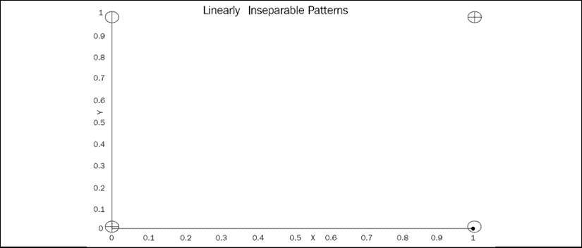

# 第八章：用前馈神经网络解决 XOR 问题

在企业项目的过程中，总会有某一时刻，遇到一个看似无法解决的问题。此时，你会尝试所有学到的东西，但对方的要求还是无法满足。你的团队或客户开始寻找其他解决方案。是时候采取行动了。

在本章中，关于材料优化的一个无法解决的商业案例将通过手工制作的**前馈神经网络**（**FNN**）与反向传播成功解决。

前馈网络是深度学习的关键构建模块之一。围绕 XOR 函数的争论完美地说明了深度学习如何在企业环境中重新获得流行。XOR 是一种排他性“或”函数，我们将在本章后面探讨。XOR FNN 说明了神经网络的一个关键功能：**分类**。一旦信息被分类为子集，它就为**预测**和神经网络的许多其他功能打开了大门，如表征学习。

一个 XOR FNN 将从零开始构建，以从一开始就解密深度学习。我们将应用一种复古的、从头开始的方法，揭开深度学习的炒作面纱。

本章将涵盖以下主题：

+   解释 XOR 问题

+   如何手动构建 FNN

+   用 FNN 解决 XOR 问题

+   分类

+   反向传播

+   成本函数

+   成本函数优化

+   错误损失

+   收敛

在我们开始构建 FNN 之前，我们首先会介绍 XOR 及其在第一个人工神经模型中的局限性。

# 原始感知器无法解决 XOR 函数

原始感知器是在 1950 年代设计的，并在 1970 年代末期得到了改进。原始感知器包含一个神经元，无法解决 XOR 函数。

XOR 函数意味着你必须选择一个排他性的“或” (XOR)。

这可能很难理解，因为我们不习惯以我们日常生活中使用 *或* 的方式来思考。事实上，我们总是交替使用 *或*，既有包容性也有排他性。举个简单的例子：

如果一个朋友来拜访我，我可能会问他们：“你想要茶还是咖啡？”这基本上是提供茶 XOR 咖啡；我不会期望我的朋友同时要求茶和咖啡！我的朋友会选择其中之一。

我可能会跟进我的问题，问：“你想要加牛奶还是加糖？”在这种情况下，如果我的朋友想要两者，我不会感到惊讶。这是一个包容性的 *或*。

因此，XOR 意味着“你可以选择一个或另一个，但不能同时选择两者。”

我们将在本章通过更多示例来展开这些概念。

为了解决这个 XOR 函数，我们将构建一个 FNN。

一旦构建了解决 XOR 问题的前馈网络，它将被应用于优化示例。该优化示例将选择数十亿个维度中的最佳组合，以最小化企业资源的使用，同时实现 XOR 函数的泛化。

首先，必须明确一个感知机 XOR 限制的解决方案。

## XOR 和线性可分模型

在 1960 年代末期，数学上证明了感知机*不能*解决 XOR 函数。幸运的是，今天感知机及其神经认知网络（neocognitron）版本形成了神经网络的核心模型。

你可能会忍不住想，*那又怎样？* 然而，整个神经网络领域依赖于解决类似这样的问题来进行模式分类。如果没有模式分类，图像、声音和文字对机器来说毫无意义。

### 线性可分模型

McCulloch-Pitts 1943 年的神经元（参见*第二章*，*建立奖励矩阵 - 设计你的数据集*）导致了 Rosenblatt 1957-59 年的感知机以及 1960 年 Widrow-Hoff 的自适应线性元件（Adaline）。

这些模型是基于`f`(`x`, `w`)函数的线性模型，需要一条线来分隔结果。一个感知机无法实现这一目标，因此无法对许多对象进行分类。

一个标准的线性函数可以分隔数值。**线性可分性**可以通过下图表示：


图 8.1：线性可分模式

想象一下，分隔前述点和其下部分的那条线代表一个需要通过机器学习或深度学习应用来表示的图像。线上方的点代表*天空中的云*；线下方的点代表*山坡上的树*。这条线代表山坡的斜率。

要实现线性可分，一个函数必须能够将*云*从*树*中分隔出来进行分类。分类的前提是某种形式的**可分性**，无论是线性的还是非线性的。

### 线性模型的 XOR 限制，如原始感知机

一个线性模型无法解决以下表格表示的 XOR 问题：

| **x1 的值** | **x2 的值** | **输出** |
| --- | --- | --- |
| 1 | 1 | 0 |
| 0 | 0 | 0 |
| 1 | 0 | 1 |
| 0 | 1 | 1 |

第 3 行和第 4 行展示了排他性或（XOR）。想象一下，你给一个孩子提供一块蛋糕或者一块糖果（1 或 1）：

+   **案例 1**：孩子回答：“我想要糖果或者什么都不要！”（0 或 1）。这就是排他性或（XOR）！

+   **案例 2**：孩子回答：“我想要蛋糕或者什么都不要！”（1 或 0）。这也是排他性或（XOR）！

以下图展示了由一个感知机表示的 XOR 函数的线性不可分性：



图 8.2：线性不可分模式

表格中的值表示该图中的笛卡尔坐标。位于（1, 1）和（0, 0）的交叉圆点，无法与位于（1, 0）和（0, 1）的圆点分开。这是一个巨大的问题。它意味着弗兰克·罗森布拉特的`f`（`x`，`w`）感知机无法分离这些点，因此无法将它们分类成*云*和*树*。因此，在许多情况下，感知机无法识别需要线性可分的值。

弗兰克·罗森布拉特发明了二十世纪最强大的神经概念——一种可以学习的神经元——但他在 1960 年代必须忍受这个限制。

如前面用蛋糕或糖果的例子所解释的，缺乏 XOR 函数限制了你必须在两个选项之间排他选择的应用场景。在现实生活中，有许多“只能是那个，不能是别的”的情境。对于一辆自动驾驶汽车来说，它要么左转，要么右转，但不能在做决策时来回摇摆！

我们将通过一种复古的解决方案来解决这个限制，从构建开始，最终实现一个 FNN。

# 从零开始构建一个前馈神经网络（FNN）

让我们进行一个思维实验。想象一下，我们处在 1969 年。我们拥有今天的知识，但没有任何证据来证明它。我们知道感知机无法实现异或（XOR）功能。

我们有一个优势，因为我们现在知道解决方案存在。为了开始我们的实验，我们只有一张便签、一支铅笔、一把削笔刀和一块橡皮擦等着我们。我们已经准备好从零开始在纸上解决 XOR 问题，然后再进行编程。我们必须找到一种方法，用神经网络对这些点进行分类。

## 第 1 步 – 定义一个前馈神经网络（FNN）

我们必须采取非常规的方法来解决这个问题。我们必须忘记 21 世纪复杂的词汇和理论。

我们可以用高中格式写一个神经网络层。一个隐藏层将是：

`h₁` = `x` * `w`

好的。现在我们有了一个层。一个层只是一个函数。这个函数可以表示为：

`f`(`x`, `w`)

其中 `x` 是输入值，`w` 是乘以 `x` 的某个值。隐藏层意味着计算过程是不可见的，就像 `x` = 2 和 `x` + 2 是导致 4 的隐藏层一样。

到目前为止，我们已经用三行定义了一个神经网络：

+   输入 `x`。

+   有一些函数会改变它的值，比如 2 × 2 = 4，它转化了 2。这就是一个层。如果结果大于 2，比如说，那么太棒了！输出是 1，意味着“是”或“真”。由于我们看不到计算过程，这就是*隐藏*层。

+   一个输出。

`f`(`x`, `w`) 是任何神经网络的构建块。“前馈”意味着我们将从第 1 层走到第 2 层，按顺序向前移动。

现在我们知道，基本上任何神经网络都是通过某个操作转化的值来生成某种输出的，我们需要一些逻辑来解决 XOR 问题。

## 第 2 步 – 举一个两个孩子如何每天解决 XOR 问题的例子

下面是两个孩子如何通过一个简单的日常例子来解决 XOR 问题的示例。我强烈推荐这种方法。我将非常复杂的问题分解成小部分，使其适应孩子的理解水平，通常几分钟就能解决。然后，你会得到别人讽刺的回答：“这就是你做的全部吗？”但当这个解决方案在高层次的企业项目中反复奏效时，讽刺就消失了。

首先，让我们把 XOR 问题转化为一个商店里的糖果问题。两个孩子去商店，想买糖果。但是他们只有足够的钱买一包糖果。他们必须在两包不同的糖果之间达成一致。假设一包是巧克力，另一包是口香糖。那么，在这两个孩子的讨论中，1 表示是，0 表示否。他们的预算限制了这两个孩子的选择：

+   去商店但不买任何巧克力 **或** 口香糖 = (no, no) = (0, 0)。这不是这些孩子的选择！所以答案是错误的。

+   去商店并且购买巧克力 **和** 口香糖 = (是，是) = (1, 1)。那将是非常棒的，但这不可能。太贵了。所以，答案是，不幸的是，错误的。

+   去商店并且买巧克力 **或** 口香糖 = (1, 0 或 0, 1) = (是或否) 或 (否或是)。这是可能的。所以，答案是正确的。

想象这两个孩子。长子是理智的。较小的孩子还不太会算数，想买两包糖果。

我们将其写在纸上：

+   `x₁`（长子的决定，是或否，1 或 0） * `w₁`（长子的想法）。长子是这样想的，或者：

    `x₁` * `w₁` 或 `h₁` = `x₁` * `w₁`

    长子做出决定，就像我们每天做的那样，比如购买一辆车（`x` = 0 或 1）乘以成本（`w₁`）。

+   `x₂`（较小的孩子的决定，是或否，1 或 0） * `w₃`（较小的孩子的想法）。较小的孩子也在思考这个，或者：

    `x₂` * `w₃` 或 `h₂` = `x₂` * `w₃`

**理论**：`x₁` 和 `x₂` 是输入。`h₁` 和 `h₂` 是神经元（计算结果）。由于 `h₁` 和 `h₂` 包含在过程中的计算，且不可见，因此它们是隐藏神经元。`h₁` 和 `h₂` 形成了一个隐藏层。`w₁` 和 `w₃` 是表示我们如何“衡量”决策的权重，表明某些事情比其他事情更重要。

现在，想象这两个孩子在互相交谈。

等一下！这意味着现在，每个孩子都在和对方沟通：

+   `x₁`（长子）对较小的孩子说 `w₂`。因此，`w₂` = 这是我想的并告诉你的：

    `x₁` * `w₂`

+   `x₂`（较小的孩子）说：“请将我的观点加入到你的决定中，”这表示为 `w₄`[:]

    `x₂` * `w₄`

我们现在有了前两个方程式，以高中水平的代码表示。这就是一个人想法加上他说给另一个人听，请另一个人考虑这一点：

```py
h1=(x1*w1)+(x2*w4) #II.A.weight of hidden neuron h1
h2=(x2*w3)+(x1*w2) #II.B.weight of hidden neuron h2 
```

`h1`总结了一个孩子的想法：个人意见 + 另一个孩子的意见。

`h2`总结了另一个孩子的想法和对话：个人意见 + 另一个孩子的意见。

**理论**：现在的计算包含两个输入值和一个隐藏层。因为在下一步中，我们将对`h1`和`h2`进行计算，所以我们处于一个前馈神经网络中。我们从输入层移动到另一个层，这将引导我们到下一个层，以此类推。从一个层到另一个层的这个过程是深度学习的基础。层数越多，网络就越深。`h1`和`h2`形成隐藏层的原因是它们的输出正是另一个层的输入。

对于这个例子，我们不需要复杂的激活函数中的数字，比如逻辑 sigmoid 函数，所以我们只是判断输出值是否小于 1：

如果 `h₁` + `h₂` >= 1，则 `y₁` = 1

如果 `h₁` + `h₂` < 1，则 `y₂` = 0

**理论**：`y₁`和`y₂`构成第二个隐藏层。这些变量可以是标量、向量或矩阵。它们是神经元。

现在，问题来了。谁是对的？年长的孩子还是年幼的孩子？

唯一的办法似乎是进行尝试，其中权重`W`代表所有的权重。神经网络中的权重就像我们日常生活中的权重。我们总是在*权衡*决策。例如，有两本书可以购买，我们将“权衡”我们的决策。如果一本书有趣且便宜，它在我们的决策中所占的权重就会更多或更少。

在我们的例子中，孩子们同意至少购买一些东西，因此从现在开始，`w₃` = `w₂`，`w₄` = `w₁`。这样，年长的孩子和年幼的孩子将共享一些决策权重。

现在，有人得当“影响者”。让我们把这个困难的任务交给年长的孩子。年长的孩子更为理智，会不断地传达坏消息。你必须从你的选择中减去一些东西，用负号（–）表示。

每当他们到达 `hᵢ` 时，年长的孩子就会对购买糖果包提出关键的负面看法。它是–`w`，以确保不会超过预算。年长孩子的看法有偏差，因此我们将变量称为偏差，`b₁`。由于年幼孩子的观点也有偏差，我们也将其视为偏差，`b₂`。由于年长孩子的观点始终是负面的，因此–`b₁`将应用于年长孩子的所有想法。

当我们将这个决策过程应用到他们的观点时，我们得到：

`h₁` = `y₁` * –`b₁`

`h₂` = `y₂` * `b₂`

然后，我们只需使用相同的结果。如果结果>=1，那么阈值就达到了。阈值的计算如下所示：

`y` = `h₁` + `h₂`

我们将首先开始有效地寻找权重，从将权重和偏置设置为 0.5 开始，如下所示：

`w₁` = 0.2; `w₂` = 0.5; `b₁` = 0.5

`w₃` = `w₂`; `w₄` = `w₁`; `b₂` = `b₁`

这还不是一个完整的程序，但其理论已经完成。

只有两个孩子之间的交流在起作用；我们将在第一次尝试后，专注于只修改 `w₂` 和 `b₁`。经过几次尝试后，这在纸面上是可行的。

我们现在写下基本的数学函数，事实上，这就是纸面上的程序本身：

```py
#Solution to the XOR implementation with
#a feedforward neural network(FNN)
#I.Setting the first weights to start the process
w1=0.5;w2=0.5;b1=0.5
w3=w2;w4=w1;b2=b1
#II.hidden layer #1 and its output
h1=(x1*w1)+(x2*w4) #II.A.weight of hidden neuron h1
h2=(x2*w3)+(x1*w2) #II.B.weight of hidden neuron h2
#III.threshold I, hidden layer 2
if(h1>=1): h1=1
if(h1<1): h1=0
if(h2>=1): h2=1
if(h2<1): h2=0
h1= h1 * -b1
h2= h2 * b2
#IV.Threshold II and Final OUTPUT y
y=h1+h2
if(y>=1): y=1
if(y<1): y=0
#V.Change the critical weights and try again until a solution is found
w2=w2+0.5
b1=b1+0.5 
```

让我们从纸面上的解决方案转到 Python 代码。

为什么 1969 年没有找到这个看似简单的解决方案？因为*今天看起来简单，但当时并非如此*，就像所有我们天才前辈发明的东西一样。人工智能和数学中没有任何事情是容易的。

在下一部分，我们将坚持这里提出的解决方案，并在 Python 中实现它。

## 用 FNN 和反向传播在 Python 中实现复古 XOR 解决方案

为了保持 1969 年复古解决方案的精神，我们将不会使用 NumPy、TensorFlow、Keras 或任何其他高级库。用高中数学编写复古 FNN 和反向传播是很有趣的。

如果你将一个问题分解成非常基础的部分，你会更好地理解它，并提供对这个特定问题的解决方案。你不需要用一辆大卡车来运输一条面包。

此外，通过从孩子们的思维方式出发，我们避免了在现代 CPU 丰富的解决方案中运行 20,000 次或更多的训练来解决 XOR 问题。所使用的逻辑证明了只要一个偏置是负的（年长的、理性的批判性孩子），两者的输入就可以拥有相同的参数，从而使系统给出合理的答案。

基本的 Python 解决方案在几次迭代后快速得出结果，大约 10 次迭代（时期或回合），具体取决于我们如何思考它。一周期可以与一次尝试相关联。想象一下，看着某人在练习篮球：

+   这个人朝着篮筐投掷篮球，但投偏了。那是一个时代（也可以用一集来描述）。

+   这个人思考发生了什么，并改变了投篮的方式。

    这种改进就是使其成为学习周期（或回合）的原因。这不是一次简单的无记忆尝试。确实发生了一些事情，提升了性能。

+   这个人再次投篮（下一个周期），又一次（下一个周期）直到整体表现有所提升。这就是神经网络如何在周期中改进的方式。

`FNN_XOR_vintage_tribute.py`（在代码的顶部）包含一个四列的结果矩阵。

矩阵的每个元素表示四个谓词的状态（`1` = 正确，`0` = 错误）：

```py
#FEEDFORWARD NEURAL NETWORK(FNN) WITH BACK PROPAGATION SOLUTION FOR XOR
result=[0,0,0,0] #trained result
train=4 #dataset size to train 
```

`train` 变量是要解决的谓词数量：(0, 0)，(1, 1)，(1, 0)，(0, 1)。要解决的谓词变量是 `pred`。

程序的核心实际上是我们所写的纸面内容的一个副本，如以下代码所示：

```py
#II hidden layer 1 and its output
def hidden_layer_y(epoch,x1,x2,w1,w2,w3,w4,b1,b2,pred,result):
    h1=(x1*w1)+(x2*w4) #II.A.weight of hidden neuron h1
    h2=(x2*w3)+(x1*w2) #II.B.weight of hidden neuron h2
#III.threshold I,a hidden layer 2 with bias
    if(h1>=1):h1=1;
    if(h1<1):h1=0;
    if(h2>=1):h2=1
    if(h2<1):h2=0
    h1= h1 * -b1
    h2= h2 * b2

#IV. threshold II and OUTPUT y
    y=h1+h2
    if(y<1 and pred>=0 and pred<2):
        result[pred]=1
    if(y>=1 and pred>=2 and pred<4):
        result[pred]=1 
```

`pred`是一个函数的参数，范围是从`1`到`4`。这四个谓词在下表中表示：

| **谓词 (pred)** | *`x₁`* | *`x₂`* | **期望结果** |
| --- | --- | --- | --- |
| 0 | 1 | 1 | 0 |
| 1 | 0 | 0 | 0 |
| 2 | 1 | 0 | 1 |
| 3 | 0 | 1 | 1 |

这就是为什么对于谓词 0 和 1，`y`必须小于 1。而对于谓词 2 和 3，`y`必须大于等于 1。

现在，我们需要调用以下函数，将训练限制为 50 个周期，这已经足够：

```py
#I Forward and backpropagation
for epoch in range(50):
    if(epoch<1):
        w1=0.5;w2=0.5;b1=0.5
    w3=w2;w4=w1;b2=b1 
```

在第一次迭代中，所有的权重和偏差都设置为`0.5`。别想太多！让程序来做这件事。正如前面所解释的，`x2`的权重和偏差是相等的。

现在，隐藏层和`y`计算函数被调用四次，每次针对一个谓词进行训练，如下代码片段所示：

```py
#I.A forward propagation on epoch 1 and IV.backpropagation starting epoch 2
    for t in range (4):
        if(t==0):x1 = 1;x2 = 1;pred=0
        if(t==1):x1 = 0;x2 = 0;pred=1
        if(t==2):x1 = 1;x2 = 0;pred=2
        if(t==3):x1 = 0;x2 = 1;pred=3
        #forward propagation on epoch 1
        hidden_layer_y(epoch,x1,x2,w1,w2,w3,w4,b1,b2,pred,result) 
```

现在，系统必须进行训练。为此，我们需要在每次迭代中衡量 1 到 4 的预测结果中有多少是正确的，并决定如何调整权重/偏差，直到获得合适的结果。我们将在接下来的部分中完成这项工作。

### 一个简化版的代价函数和梯度下降

稍微复杂一些的梯度下降将在下一章中介绍。在本章中，只有一行方程就能完成工作。作为一名非传统的思考者，你需要记住的唯一一点是：*那又怎样？* 梯度下降的概念是最小化当前结果与目标之间的损失或误差。

首先，需要一个代价函数。

有四个谓词（0-0，1-1，1-0，0-1）需要正确训练。我们需要找出在每个训练周期中有多少是正确训练的。

代价函数将衡量训练目标（4）与本次迭代或训练周期（result）的结果之间的差异。

当收敛为 0 时，意味着训练已经成功。

`result[0,0,0,0]`表示如果四个谓词都没有被正确训练，每个值都会是`0`。`result[1,0,1,0]`表示四个谓词中有两个是正确的。`result[1,1,1,1]`表示四个谓词都已经训练完成，训练可以停止。在这种情况下，`1`表示正确的训练结果已获得，它可以是`0`或`1`。`result`数组是结果计数器。

代价函数将通过将训练值降到`4`、`3`、`2`、`1`或`0`来表示这次训练，直到降到 0。

梯度下降测量下降的值，以找到坡度的方向：上坡、下坡或平坦。然后，一旦你得到了坡度及其陡峭度，你就可以优化权重。导数是了解你是否在上坡或下坡的一种方法。

每次我们沿着坡道上升或下降时，我们都会检查是否朝着正确的方向前进。我们假设我们会一步一步地走。所以，如果我们改变方向，我们会以一步的速度改变步伐。这个一步的值就是我们的**学习率**。我们将在每一步衡量我们的进展。然而，如果我们对结果感到满意，我们可能会一次走 10 步，只有每走 10 步才检查是否走在正确的轨道上。这样我们的学习率就增加到了 10 步。

在这种情况下，我们劫持了这个概念，并用它来设置学习率为`0.05`，只用了一个函数行。为什么不呢？它帮助我们用一行代码解决了梯度下降优化问题：

```py
 if(convergence<0):w2+=training_step;b1=w2 
```

通过将复古的儿童买糖果逻辑应用于整个 XOR 问题，我们发现只有`w2`需要优化。这就是为什么`b1=w2`。因为`b1`在做一个艰难的工作——一直输出负值（`-`），这完全改变了最终输出的结果。

学习率设置为`0.05`，程序在 10 个周期内完成了训练：

```py
epoch: 10 optimization 0 w1: 0.5 w2: 1.0 w3: 1.0 w4: 0.5 b1: -1.0 b2: 1.0 
```

这是一个逻辑性的*是*或*否*问题。网络的构建方式纯粹是逻辑性的。没有什么能阻止我们使用任何我们想要的训练率。实际上，这就是梯度下降的核心。有很多梯度下降方法。如果你自己发明了一种方法，并且它适用于你的解决方案，那也是可以的。

在这种情况下，这一行代码足够判断坡度是否正在下降。只要坡度为负值，函数就会朝着*成本* = 0 的方向下行：

```py
 convergence=sum(result)-train #estimating the direction of the slope
    if(convergence>=-0.00000001): break 
```

下图总结了整个过程：


图 8.3：前馈神经网络模型（FNN）

我们可以看到，在这个“前馈”神经网络中，所有层的箭头都是朝前的。然而，从`y`节点向后延伸的箭头可能会让人感到困惑。这个箭头代表了训练模型时权重的变化。这意味着我们会回到更改权重并再次运行网络进行另一个周期（或回合）。系统会在每个周期中调整其权重，直到整体结果正确为止。

太简单了吗？嗯，这个方法有效，这就是现实开发中最重要的。只要你的代码没有错误，并且完成了任务，那才是最关键的。

寻找一个简单的开发工具无非就是如此。它只是工具箱中的另一个工具。我们可以让这个 XOR 函数在神经网络中运行并产生收益。

公司关心的不是你有多聪明，而是你能多高效（有利可图）。

一家公司的生存依赖于多种约束条件：按时交付、提供合理价格、提供合理质量水平的产品等等。

当我们提出解决方案时，展示我们写了大量代码有多聪明是没有意义的。我们的公司或客户期望一个高效的解决方案，这个解决方案运行良好且易于维护。简而言之，要关注效率。一旦我们有了一个好的解决方案，我们需要证明它是有效的。在这种情况下，我们证明了线性可分性已经实现。

### 实现了线性可分性

请记住，这个带有反向传播和代价函数的前馈网络的全部目的是将一个线性不可分的函数转化为一个线性可分的函数，以实现对系统呈现的特征的分类。在这种情况下，这些特征的值为`0`或`1`。

神经网络中每一层的核心目标之一是使输入变得有意义，即能够将一种信息与另一种信息区分开来。

`h1`和`h2`将生成笛卡尔坐标线性可分训练轴，如以下代码实现所示：

```py
 h1= h1 * -b1
    h2= h2 * b2
    print(h1,h2) 
```

运行程序时，隐藏层训练后的非线性输入值将显示出来。然后，非线性值变成线性值，成为一个线性可分的函数：

```py
linearly separability through cartesian training -1.0000000000000004 1.0000000000000004
linearly separability through cartesian training -0.0 0.0
linearly separability through cartesian training -0.0 1.0000000000000004
linearly separability through cartesian training -0.0 1.0000000000000004
epoch: 10 optimization 0 w1: 0.5 w2: 1.0 w3: 1.0 w4: 0.5 b1: -1.0 b2: 1.0 
```

中间结果和目标不是一堆显示程序运行是否正常的数字。结果是一组可以通过以下线性分隔图表示的笛卡尔坐标值：


图 8.4：线性可分模式

我们现在已经在顶部值之间获得了区分，这些值代表了（1，0）和（0，1）输入的中间值，而底部值则代表（1，1）和（0，0）输入。顶部值与底部值之间通过一条清晰的线分开。我们现在在这条分隔线的顶部有*云*，在底部有*树*。

神经网络的各层将非线性值转换为线性可分的值，从而使得通过标准分隔方程（如以下代码所示）进行分类成为可能：

```py
#IV. threshold II and OUTPUT y
    y=h1+h2 # logical separation
    if(y<1 and pred>=0 and pred<2):
        result[pred]=1
    if(y>=1 and pred>=2 and pred<4):
        result[pred]=1 
```

神经网络将不可分的信息转化为可分且可分类的信息，代表了深度学习的一项核心能力。基于这一技术，可以对数据执行许多操作，例如子集优化。

在下一节中，我们将探讨 FNN XOR 解决方案的实际应用。

# 将 FNN XOR 函数应用于优化数据子集

目前地球上有超过 75 亿人呼吸着空气。到 2050 年，可能会有 25 亿人加入我们的行列。所有这些人都需要穿衣和吃饭。这两项活动本身就涉及到将数据分类为工业用途的子集。

**分组**是任何生产过程中的核心概念。涉及服装和食品的生产需要分组来优化生产成本。想象一下，如果不进行分组，而是将一件 T 恤从一个大陆运送到另一个大陆，而不是将 T 恤按批次装进集装箱，并且将多个集装箱（而不仅仅是两个集装箱在一艘船上）一起运输。以服装为例，我们来进行分析。

一家连锁商店需要根据顾客购买产品的情况补充每家店的库存。在这种情况下，该公司拥有 10,000 家店。品牌例如生产牛仔裤。它们的平均产品是褪色牛仔裤。这款产品每月在每家店销售 50 件，销售速度较慢。总共是 10,000 家店 × 50 件 = 500,000 件，即每月 500,000 个库存单位（SKU）。这些单位的销售涵盖了所有尺码，分为平均码、小码和大码。每月销售的尺码是随机的。

该产品的主要工厂大约有 2,500 名员工，每天生产约 25,000 条牛仔裤。员工主要在以下领域工作：剪裁、组装、洗涤、激光处理、包装和仓储。

第一个难题出现在面料的购买和使用上。该品牌的面料并不便宜，需要大量采购。每种图案（即组装裤子的各个部件）都需要尽可能减少面料的浪费进行剪裁。

想象你有一个空箱子，想要通过优化体积来填充它。如果只放足球，箱子里会有很多空隙。如果你把网球塞进空隙里，空间会减少。如果再把剩余的空隙用乒乓球填满，你就优化了箱子里的空间。

构建优化的子集可以应用于集装箱、仓库流动和存储、货车装载优化以及几乎所有人类活动。

在服装行业中，如果制造牛仔裤时有 1%到 10%的面料浪费，企业仍能在竞争中生存。如果超过 10%，就需要解决实际问题。损失 20%的面料可能会导致公司倒闭，迫使其破产。

主要规则是将大件和小件结合起来，以制作优化的剪裁图案。

通过大件和小件优化空间的使用，可以应用于剪裁形式（例如牛仔裤的图案）。一旦剪裁完成，它们将被送往缝纫站进行组装。

问题可以总结为：

+   创建 500,000 个 SKU 的子集，以优化接下来一个月在特定工厂的剪裁过程。

+   确保每个子集包含小号和大号，以通过每天选择 6 个尺码来构建 25,000 个单位的子集，从而最小化面料的浪费。

+   生成平均 3 到 6 个尺码的剪裁计划，每个子集每天生产 25,000 件产品。

从数学角度来看，这意味着要在 50 万个单位中寻找特定日期的尺码子集。

任务是从 50 万个单元中找到 6 个匹配的尺码，如下所示的组合公式：


到这时，大多数人都会放弃这个想法，找到一些简单的解决办法，即使这意味着浪费面料。

我们所有人的第一反应是，这比宇宙中的星星还多，所有的炒作也是如此。然而，这根本不是正确的看法。正确的看法是要从完全相反的方向来考虑。

这个问题的关键是从微观层面观察粒子，即**信息位**层面。分析详细数据是获得可靠结果的必要条件。这是机器学习和深度学习的基本概念。翻译到我们的领域，它意味着要处理一张图片，ML 和 DL 处理的是像素。

因此，即使要处理的图片代表了大量数据，最终也会降至对小单位信息的分析：

| yottabyte (YB) | 10²⁴ | yobibyte (YiB) | 2⁸⁰ |
| --- | --- | --- | --- |

看到这些大数字突然出现可能会让人感到惊讶！然而，当试图将成千上万的元素组合在一起时，组合的方式变得是指数级增长。当你将其扩展到大型服装品牌所需处理的大量人口时，它也会迅速呈指数增长。

今天，谷歌、Facebook、亚马逊等公司拥有 yottabyte 级的数据需要分类和理解。使用**大数据**这一术语其实并没有太大意义。它只是大量的数据，那又怎样呢？

你不需要分析数据集中的每个数据点的具体位置，而是要使用概率分布。

为了理解这一点，让我们去商店为一家人买些牛仔裤。家里的一个父母需要一条牛仔裤，家里的一个青少年也需要一条。两人都去寻找他们想要的牛仔裤尺码。父母找到 10 条尺码为`x`的牛仔裤。所有牛仔裤都是生产计划的一部分。父母随机挑选一条，青少年也做同样的事。然后他们支付并带着牛仔裤回家。

一些系统在随机选择时运作良好：粒子的随机运输（将牛仔裤从商店带回家）（牛仔裤、其他产品单元、像素或任何需要处理的物品），形成流体（一个数据集）。

翻译到我们的工厂，这意味着可以引入一个随机过程来解决这个问题。

所需的只是从 50 万个单元中随机选取大号和小号尺码进行生产。如果每天选取从 1 到 6 的 6 个尺码，那么可以按如下方式在表格中对这些尺码进行分类：

*小号尺码* = `S` = {1, 2, 3}

*大号尺码* = `L` = {4, 5, 6}

将其转换为数字子集名称，`S` = 1 和 `L` = 6。通过同时选择大号和小号尺码进行生产，面料将得到优化，如下表所示：

| **选择 1 的大小** | **选择 2 的大小** | **输出** |
| --- | --- | --- |
| 6 | 6 | 0 |
| 1 | 1 | 0 |
| 1 | 6 | 1 |
| 6 | 1 | 1 |

你会注意到前两行包含相同的值。这不会优化面料的消耗。如果你只将大号 6 尺寸的产品放在一起，图案中会有“空洞”。如果只将小号 1 尺寸的产品放在一起，它们会填满所有空间，根本没有空位给较大的产品。如果大尺寸和小尺寸的产品能同时出现在同一卷面料上，裁剪就最为优化。

这听起来是不是很熟悉？它看起来和我们的经典 FNN 完全一样，只是 1 替代了 0，6 替代了 1。

所要做的就是规定子集 `S` = *value* 0，子集 `L` = *value* 1；然后之前的代码可以进行泛化。

`FFN_XOR_generalization.py` 是用于泛化之前代码的程序，如下所示的代码片段。

如果这有效，那么较小和较大的尺寸将被选择并发送到裁剪计划部门，面料将得到优化。通过应用贝尔曼方程的随机性概念，采用随机过程，随机选择客户的单位订单（每个订单是一个尺寸，数量为 1）：

```py
 w1=0.5;w2=1;b1=1
    w3=w2;w4=w1;b2=b1
    s1=random.randint(1,500000)#choice in one set s1
    s2=random.randint(1,500000)#choice in one set s2 
```

现在，权重和偏差是通过 XOR 训练 FNN 得到的常数。训练已经结束；FNN 现在用于提供结果。请记住，机器学习和深度学习中的“学习”一词并不意味着你必须永远训练系统。在稳定的环境中，只有在数据集发生变化时才需要运行训练。在项目的某个阶段，你希望使用的是经过深度*训练*的系统，而不是仅仅在探索深度*学习*过程的训练阶段。目标不是将所有企业资源都投入到学习中，而是将资源用于使用已经训练好的模型。

深度学习架构必须迅速转变为深度训练的模型，以产生利润。

对于这个原型验证，给定订单的尺寸是随机的。`0` 表示该订单符合 `S` 子集；`1` 表示该订单符合 `L` 子集。数据生成函数反映了消费者行为在以下六种尺寸牛仔裤消费模型中的随机性：

```py
 x1=random.randint(0, 1)#property of choice:size smaller=0
    x2=random.randint(0, 1)#property of choice :size bigger=1
    hidden_layer_y(x1,x2,w1,w2,w3,w4,b1,b2,result) 
```

一旦在正确的尺寸类别中随机选择了两个客户订单，FNN 就会激活并像之前的示例一样运行。只改变了 `result` 数组，因为我们使用的是相同的核心程序。只需期望返回一个“是”（`1`）或“否”（`0`），如下所示的代码：

```py
#II hidden layer 1 and its output
def hidden_layer_y(x1,x2,w1,w2,w3,w4,b1,b2,result):
    h1=(x1*w1)+(x2*w4) #II.A.weight of hidden neuron h1
    h2=(x2*w3)+(x1*w2) #II.B.weight of hidden neuron h2
#III.threshold I,a hidden layer 2 with bias
    if(h1>=1):h1=1
    if(h1<1):h1=0
    if(h2>=1):h2=1
    if(h2<1):h2=0
    h1= h1 * -b1
    h2= h2 * b2
#IV. threshold II and OUTPUT y
    y=h1+h2
    if(y<1):
        result[0]=0
    if(y>=1):
        result[0]=1 
```

需要计算出要生产的子集数量，以确定所需的正面结果的数量。

选择是从 500,000 个单位中挑选出 6 种尺寸。然而，要求是为工厂制定每日生产计划。每日生产目标是 25,000。此外，每个子集可以使用约 20 次。平均而言，在一条牛仔裤中，每种尺寸总会有大约 20 次相同的尺寸。

为了获得良好的面料优化，需要六种尺寸。这意味着，在做出三次选择后，结果代表了潜在优化选择的一个子集：

`R` = 120 × 3 个两尺寸的子集 = 360

找到了魔数。对于每 3 个选择，通过 20 次重复生成 6 个尺寸的目标将会达成。

每天的生产请求为 25,000：

请求的子集数量 = 25000/3 = 8333\. 333

系统可以运行 8,333 个产品，直到生成所需子集的数量。在这种情况下，范围设置为 1,000,000 个产品的样本。根据需要可以扩展或缩减。系统通过以下函数筛选正确的子集：

```py
for element in range(1000000):
    ...(a block of code is here in the program)...
    if(result[0]>0):
        subsets+=1
        print("Subset:",subsets,"size subset #",x1," and ","size subset #",x2,"result:",result[0],"order #"," and ",s1,"order #",s2)
    if(subsets>=8333):
        break 
```

当找到了符合较小-较大尺寸分布的 8,333 个子集时，系统停止运行，如下输出所示：

```py
Subset: 8330 size subset # 1 and size subset # 0 result: 1 order # and 53154 order # 14310
Subset: 8331 size subset # 1 and size subset # 0 result: 1 order # and 473411 order # 196256
Subset: 8332 size subset # 1 and size subset # 0 result: 1 order # and 133112 order # 34827
Subset: 8333 size subset # 0 and size subset # 1 result: 1 order # and 470291 order # 327392 
```

此示例证明了这一点。*简单的解决方案可以解决非常复杂的问题。*

必须添加两个主要功能，以及一些次要功能：

+   每次选择后，必须从 500,000 订单数据集中删除选择的订单。当选择了一个订单后，再次处理它将会在全局结果中生成错误。这将排除两次选择相同订单的可能性，并减少要做出的选择次数。

+   例如，优化函数用于重新组织生产目的的结果。其思想不是随机遍历记录，而是按组织成集合进行控制。这样每个集合可以独立控制。

应用信息：

+   应用程序的核心计算部分不超过 50 行。

+   通过少数控制功能和数组，程序最多可能达到 200 行。控制功能的目标是检查结果是否达到总体目标。例如，每 1,000 条记录，可以检查本地结果是否符合总体目标。

+   这样可以轻松维护团队。

优化代码行数以创建强大的应用程序，对于许多业务问题来说，这可能非常高效。

# 总结

从头开始构建一个小型神经网络提供了神经元基本属性的实际视图。我们看到神经元需要一个可能包含许多变量的输入。然后，将权重应用于带有偏差的值。接着，激活函数转换结果并生成输出。

在企业环境中，即使是一层或两层的神经网络，也可以提供现实生活中的解决方案。使用复杂理论分解成小函数实施了一个真实的业务案例。然后，这些组件被组装成尽可能简单和有利可图的形式。

把问题分解成基本部分，并找到简单而强大的解决方案需要才智。这比仅仅输入数百到数千行代码更需要努力来使事情运行。一个经过深思熟虑的算法将始终更有利可图，软件维护也将更加经济实惠。

客户期望快速解决方案。人工智能提供了多种工具，能够满足这一目标。在为客户解决问题时，不要追求最完美的理论，而是寻找最简单、最快速的方式来实施一个有利可图的解决方案，无论它看起来多么不传统。

在这个案例中，增强型 FNN 感知机解决了一个复杂的商业问题。在下一章中，我们将探索卷积神经网络（CNN）。我们将逐层使用 TensorFlow 2.x 构建一个 CNN 来分类图像。

# 问题

1.  感知机是否能单独解决异或问题？（是 | 否）

1.  异或函数是线性不可分的吗？（是 | 否）

1.  神经网络中层的主要目标之一是分类。（是 | 否）

1.  深度学习是唯一的分类数据方式吗？（是 | 否）

1.  成本函数显示神经网络成本的增加。（是 | 否）

1.  简单的算术运算是否足以优化成本函数？（是 | 否）

1.  前馈网络需要输入、层和输出。（是 | 否）

1.  前馈网络总是需要通过反向传播进行训练。（是 | 否）

1.  在实际应用中，解决方案往往是通过遵循现有理论找到的。（是 | 否）

# 进一步阅读

+   线性可分性：[`www.ece.utep.edu/research/webfuzzy/docs/kk-thesis/kk-thesis-html/node19.html`](http://www.ece.utep.edu/research/webfuzzy/docs/kk-thesis/kk-thesis-html/node19.html)
